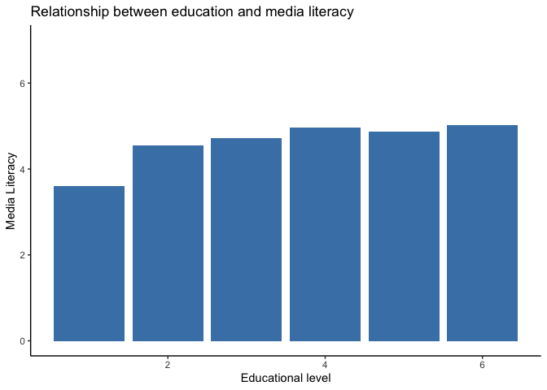
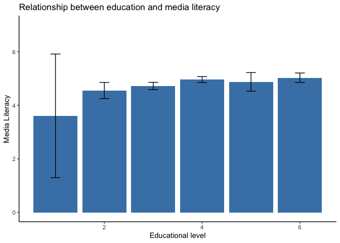
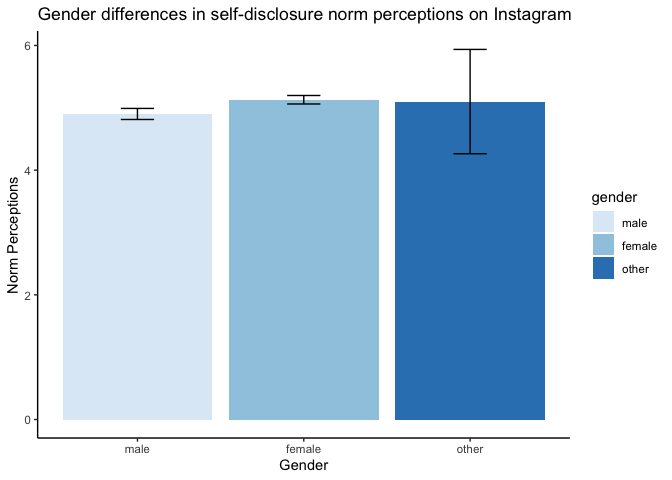
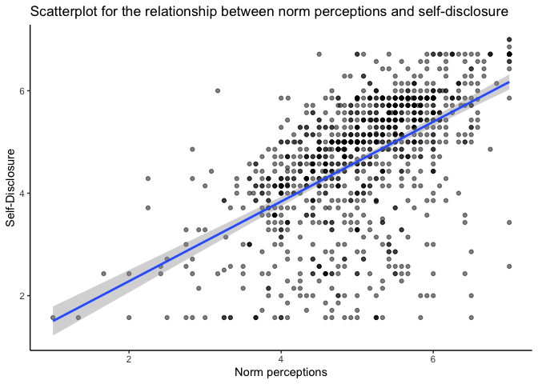
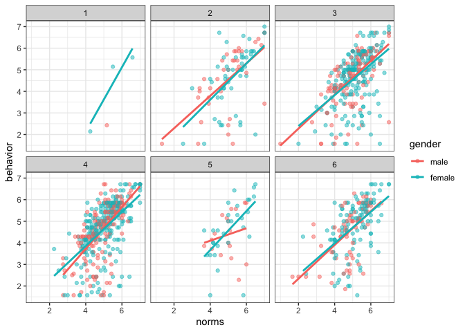
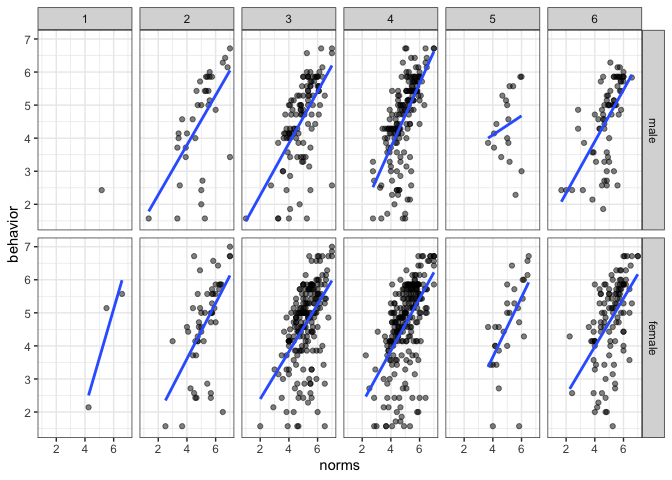

Homework 1: Basic Data Wrangling & Visualization (with Solutions)
================
Philipp Masur

-   <a href="#formalities" id="toc-formalities">Formalities</a>
-   <a href="#instructions" id="toc-instructions">Instructions</a>
-   <a href="#exercises" id="toc-exercises">Exercises</a>
    -   <a href="#task-1-provide-a-description-of-the-sample"
        id="toc-task-1-provide-a-description-of-the-sample">Task 1: Provide a
        description of the sample</a>
    -   <a href="#task-2-explore-social-media-use"
        id="toc-task-2-explore-social-media-use">Task 2: Explore social media
        use</a>
    -   <a href="#task-3-norm-perceptions-on-instagram"
        id="toc-task-3-norm-perceptions-on-instagram">Task 3: Norm perceptions
        on Instagram</a>
    -   <a
        href="#task-4-relationship-between-norm-perceptions-and-self-disclosure-on-instagram"
        id="toc-task-4-relationship-between-norm-perceptions-and-self-disclosure-on-instagram">Task
        4: Relationship between norm perceptions and self-disclosure on
        Instagram</a>

# Formalities

-   Name: \[ENTER YOUR NAME HERE\]
-   Student ID: \[ENTER YOUR STUDENT ID HERE\]

In the end, klick on “knit” and upload the respective html-output file
to Canvas. Please add your name and lastname to the output file name:
e.g., 01_homework_assignment_NAME-LASTNAME.html

# Instructions

In this homework assignment, you are going to practice what you have
learned in the past two practical sessions. To do so, we need to get
some data into R. On Canvas, you will find a module called “Data Sets”.
Within this module, there are several data sets that we will use
throughout the course. For this assignment, download the data set
**norm_data.csv**. This data set stems from an online survey on social
media use and norm perceptions.

If you have set the working directory to the location of this RMarkdown
Script and you put the csv-file in the same folder, you can load that
data set without specifying a specific path.

``` r
library(tidyverse)
d <- read_csv("norm_data.csv")
head(d)
```

    ## # A tibble: 6 × 144
    ##   id             duration MLI_REF_01 MLI_REF_02 MLI_REF_03 MLI_REF_04 MLI_REF_05
    ##   <chr>             <dbl>      <dbl>      <dbl>      <dbl>      <dbl>      <dbl>
    ## 1 R_UnzMUDjVl2T…      206          5          7          5          3          5
    ## 2 R_2YuktLW3z8k…      340          5          3          2          2          3
    ## 3 R_BSr3pAf18RO…      282          4          4          3          4          4
    ## 4 R_3stApFZhBIV…      428          6          3          6          6          7
    ## 5 R_1kZF9OEVjJF…      551          5          4          6          7          5
    ## 6 R_2pQeQwyxeSx…      408          5          7          6          1          6
    ## # … with 137 more variables: MLI_REF_06 <dbl>, MLI_REF_07 <dbl>,
    ## #   MLI_CRI_01 <dbl>, MLI_CRI_02 <dbl>, MLI_CRI_03 <dbl>, MLI_CRI_04 <dbl>,
    ## #   MLI_CRI_05 <dbl>, MLI_CRI_06 <dbl>, MLI_CRI_07 <dbl>, INC_SIZ_01 <dbl>,
    ## #   FAC_SIZE_01 <chr>, INC_NET_01 <dbl>, INC_NET_02 <dbl>, INC_NET_03 <dbl>,
    ## #   INC_NET_04 <dbl>, INC_NET_05 <dbl>, INC_NET_06 <dbl>, INC_NET_07 <dbl>,
    ## #   INC_NET_08 <dbl>, INC_NET_09 <dbl>, INC_NET_10 <dbl>, INC_NET_11 <dbl>,
    ## #   FAC_NET_01 <dbl>, FAC_NET_02 <dbl>, FAC_NET_03 <dbl>, FAC_NET_04 <dbl>, …

# Exercises

## Task 1: Provide a description of the sample

Let’s explore the data set. The data set contains some variables that
assess socio-demographic characteristics of the participants (age,
gender, edu, race…). Use the tidyverse functions that we discussed on
the last practical session to:

-   create a subset that only contains socio-demographic variables.
-   How old are participants on average?
-   How many female and male participants are in the data set (0 = male,
    1 = female, 2 = other)?
-   How old are participants from different educational levels?

``` r
## Creating a subset with socio-demographic variables
d_sub <- d %>%
  select(age, gender, education = edu, race, relationship, employment) %>%
  mutate(age = ifelse(age > 1900, 2022-age, age))  # Recoding necessary as some people provided birthyear!

#-------------------------------------------------------------------------------
## Average age 

# Solution 1 with tidyverse functions
d_sub %>%
  summarize(M = mean(age, na.rm = T),
            SD = sd(age, na.rm = T),
            Min = min(age, na.rm = T),
            Max = max(age, na.rm = T))
```

    ## # A tibble: 1 × 4
    ##       M    SD   Min   Max
    ##   <dbl> <dbl> <dbl> <dbl>
    ## 1  36.5  11.3    18    80

``` r
# Solution 2 with the package 'psych'
library(psych)
describe(d_sub$age)
```

    ##    vars    n  mean    sd median trimmed   mad min max range skew kurtosis   se
    ## X1    1 1053 36.51 11.26     34   35.25 10.38  18  80    62 0.99     0.51 0.35

``` r
# Solution 3 with base R
mean(d_sub$age, na.rm = T)
```

    ## [1] 36.50997

``` r
sd(d_sub$age, na.rm = T)
```

    ## [1] 11.25555

``` r
#-------------------------------------------------------------------------------
## Gender distribution

# Solution 1 with tidyverse
d_sub %>%
  group_by(gender) %>%
  tally %>%
  mutate(prop = n/nrow(d_sub))
```

    ## # A tibble: 4 × 3
    ##   gender     n    prop
    ##    <dbl> <int>   <dbl>
    ## 1      0   411 0.359  
    ## 2      1   638 0.557  
    ## 3      2     5 0.00436
    ## 4     NA    92 0.0803

``` r
# Solution with base R
prop.table(table(d_sub$gender, useNA = "always"))
```

    ## 
    ##           0           1           2        <NA> 
    ## 0.358638743 0.556719023 0.004363002 0.080279232

``` r
#-------------------------------------------------------------------------------
## Age differences across educational levels
d_sub %>%
  select(education, age) %>%     # select relevant variables
  na.omit %>%                    # omit NAs
  group_by(education) %>%        # group by educational level
  summarize(M = mean(age, na.rm = T),
            SD = sd(age, na.rm = T),
            Min = min(age, na.rm = T),
            Max = max(age, na.rm = T))
```

    ## # A tibble: 6 × 5
    ##   education     M    SD   Min   Max
    ##       <dbl> <dbl> <dbl> <dbl> <dbl>
    ## 1         1  34.8 13.5     24    53
    ## 2         2  34.2  9.48    20    66
    ## 3         3  37.4 12.7     18    80
    ## 4         4  35.7 10.6     21    70
    ## 5         5  36.6 10.8     22    68
    ## 6         6  37.9 10.6     24    75

``` r
# Significance test (Bonus)
summary(aov(lm(age ~ education, d_sub)))
```

    ##               Df Sum Sq Mean Sq F value Pr(>F)
    ## education      1    299   299.3   2.366  0.124
    ## Residuals   1051 132976   126.5               
    ## 93 observations deleted due to missingness

Answer: In this sample with n = 1,146 participant, the average age is
*M* = 36.51 years (SD = 11.26). Gender was not very equally distributed:
35.9% were male and 55.7% were female. Another 0.4% chose “other” as
answer options and 8.0% did not provide an answer. People with different
educational levels did not differ in their average age, although lower
educational levels were slightly younger overall. An analysis of
variance did not found statistical differences in age across educational
levels: *F*(299) = 2.37, *p* = .124.

## Task 2: Explore social media use

The following code adds a mean indice that represent the latent
dimension *critical media literacy* (ranging from 1 to 7).

-   Create a subset that contains the variables *age*, *edu*, and
    *MLI_CRI*.
-   Remove all missing values using the function `na.omit()` (Don’t
    forget to save the new data set in order to be able to use it for
    subsequent analyses!)
-   Does critical media literacy differ depending on the educational
    level? Create a respective table and plot the differences (Bonus:
    How could we test this with a statistical test?)
-   Filter out people below 40 and again assess whether critical media
    literacy differs across educational levels.

``` r
d <- d %>%
  mutate(MLI_CRI = rowMeans(d %>% select(contains("MLI_CRI")), na.rm = T))

#-------------------------------------------------------------------------------
## Creating the subset
d_sub2 <- d %>%
  select(age, edu, MLI_CRI) %>%
  na.omit

#-------------------------------------------------------------------------------
## Difference in media literacy across educational levels
# Create table (Bonus: With confidence intervals)
table <- d_sub2 %>%
  group_by(edu) %>%
  summarize(M = mean(MLI_CRI),
            SE = sd(MLI_CRI)/sqrt(length(MLI_CRI)),  # compute standard error
            LL = M - 1.96*SE,                        # Lower CI
            UL = M + 1.96*SE)                        # Upper CI
table
```

    ## # A tibble: 6 × 5
    ##     edu     M     SE    LL    UL
    ##   <dbl> <dbl>  <dbl> <dbl> <dbl>
    ## 1     1  3.61 1.18    1.30  5.92
    ## 2     2  4.55 0.154   4.25  4.86
    ## 3     3  4.72 0.0696  4.59  4.86
    ## 4     4  4.96 0.0564  4.85  5.07
    ## 5     5  4.88 0.178   4.53  5.22
    ## 6     6  5.03 0.0897  4.85  5.21

``` r
# Plot differences
plot <- table %>%
  ggplot(aes(x = edu, y = M, ymin = LL, ymax = UL)) +
  geom_col(fill = "steelblue") +
  ylim(0, 7) +
  theme_classic() +
  labs(x = "Educational level", y = "Media Literacy",
       title = "Relationship between education and media literacy")
plot
```

<!-- -->

``` r
# Bonus: add confidence intervals
plot + 
  geom_errorbar(width = .2)
```

<!-- -->

``` r
# Statistical test
library(effectsize)   # can produce standarized effect sizes for anovas
model <- aov(MLI_CRI ~ factor(edu), d_sub2)
summary(model)
```

    ##               Df Sum Sq Mean Sq F value  Pr(>F)   
    ## factor(edu)    5   30.3   6.050   4.048 0.00121 **
    ## Residuals   1047 1564.9   1.495                   
    ## ---
    ## Signif. codes:  0 '***' 0.001 '**' 0.01 '*' 0.05 '.' 0.1 ' ' 1

``` r
effectsize(model)
```

    ## # Effect Size for ANOVA
    ## 
    ## Parameter   | Eta2 |       95% CI
    ## ---------------------------------
    ## factor(edu) | 0.02 | [0.00, 1.00]
    ## 
    ## - One-sided CIs: upper bound fixed at [1.00].

``` r
#-------------------------------------------------------------------------------
## Difference in media literacy across educational levels for people above 40 years
# Filtering out people
d_sub3 <- d_sub2 %>%
  filter(age >= 40)

d_sub3 %>%
  group_by(edu) %>%
  summarize(M = mean(MLI_CRI),
            SE = sd(MLI_CRI)/sqrt(length(MLI_CRI)),  
            LL = M - 1.96*SE,                       
            UL = M + 1.96*SE)     
```

    ## # A tibble: 6 × 5
    ##     edu     M      SE    LL    UL
    ##   <dbl> <dbl>   <dbl> <dbl> <dbl>
    ## 1     1  4.14 NA      NA    NA   
    ## 2     2  4.42  0.280   3.87  4.97
    ## 3     3  4.71  0.122   4.47  4.95
    ## 4     4  4.92  0.0966  4.73  5.11
    ## 5     5  4.97  0.299   4.39  5.56
    ## 6     6  5.01  0.175   4.67  5.36

``` r
model2 <- aov(MLI_CRI ~ factor(edu), d_sub3)
summary(model2)
```

    ##              Df Sum Sq Mean Sq F value Pr(>F)
    ## factor(edu)   5    8.7   1.737   1.143  0.337
    ## Residuals   330  501.4   1.519

``` r
effectsize(model2)
```

    ## # Effect Size for ANOVA
    ## 
    ## Parameter   | Eta2 |       95% CI
    ## ---------------------------------
    ## factor(edu) | 0.02 | [0.00, 1.00]
    ## 
    ## - One-sided CIs: upper bound fixed at [1.00].

Answer: Based on the bar plot, we an see that a higher education is
positively related to media literacy: The higher the level of education,
the higher the level of media literacy. The relationship is significant:
*F*(30.3) = 4.05, *p* = .001. However, the effect is rather small:

= 0.02. This effect further disappears if we exclude people below 40
years of age.

## Task 3: Norm perceptions on Instagram

The data set contains some variables that measure norm perceptions in
relation to visual self-disclosure on Instagram (12 items starting with
“INV_NOR\_”).

-   Create the mean across all these item per person and add it as a new
    column to the data set.
-   Do norm perceptions differ depending on gender? (Create a respective
    plot and test whether the difference is significant)

``` r
# Adding the mean for norm perceptions
d <- d %>%
  mutate(norms = rowMeans(d %>% select(contains("INV_NOR_")), na.rm = T))

#-------------------------------------------------------------------------------
# Create table
table2 <- d %>%
  mutate(gender = factor(gender, labels = c("male", "female", "other"))) %>%
  select(gender, norms) %>%
  na.omit %>%
  group_by(gender) %>%
  summarize(M = mean(norms),
            SE = sd(norms)/sqrt(length(norms)),  
            LL = M - 1.96*SE,                       
            UL = M + 1.96*SE,
            n = n())
table2
```

    ## # A tibble: 3 × 6
    ##   gender     M     SE    LL    UL     n
    ##   <fct>  <dbl>  <dbl> <dbl> <dbl> <int>
    ## 1 male    4.90 0.0453  4.81  4.99   411
    ## 2 female  5.13 0.0348  5.06  5.20   638
    ## 3 other   5.1  0.427   4.26  5.94     5

``` r
# Plot differences
table2 %>%
  ggplot(aes(x = gender, y = M, ymin = LL, ymax = UL, fill = gender)) +
  geom_col() +
  geom_errorbar(width = .2) +
  scale_fill_brewer(palette = "Blues") +
  theme_classic() +
  labs(x = "Gender", y = "Norm Perceptions",
       title = "Gender differences in self-disclosure norm perceptions on Instagram")
```

<!-- -->

``` r
#-------------------------------------------------------------------------------
## Test for significance
d %>%
  filter(gender != 2) %>%
  t.test(norms ~ gender, data = .)  # point is the placeholder here
```

    ## 
    ##  Welch Two Sample t-test
    ## 
    ## data:  norms by gender
    ## t = -3.9973, df = 846.76, p-value = 6.965e-05
    ## alternative hypothesis: true difference in means between group 0 and group 1 is not equal to 0
    ## 95 percent confidence interval:
    ##  -0.3401149 -0.1161021
    ## sample estimates:
    ## mean in group 0 mean in group 1 
    ##        4.901421        5.129530

Answer: Female participants generally perceived a stronger norm to
disclose on Instagram (*M* = 5.13) than males (*M* = 4.90). This
differences was statistically significant: *t*(846.76) = -4.00, *p* \<
.001.

## Task 4: Relationship between norm perceptions and self-disclosure on Instagram

The code below creates another mean indice that represent the latent
dimension “Self-disclosure on Instagram” (ranging from 1 to 7). Let’s
explore the relationship between norm perceptions and self-disclosure.

-   Create a scatterplot that shows the relationship (add both points
    and a regression line). Bonus: Change the axis-labels to be more
    meaningful and adjust the layout/aesthetics to create a
    publication-ready figure
-   Does the relationship differ depending on education and gender?
    (There are different ways how one can explore this visually… Tip: It
    has to do with adding a group aesthetic or using facet_grid().)

``` r
d <- d %>%
  mutate(behavior = rowMeans(d %>% select(contains("IND_BEH")), na.rm = T))

#-------------------------------------------------------------------------------
## Plot standard scatter plot
d %>%
  ggplot(aes(x = norms, y = behavior)) +
  geom_point(alpha = .5, size = 1.5) +
  geom_smooth(method = "lm") +
  labs(x = "Norm perceptions", y = "Self-Disclosure",
       title = "Scatterplot for the relationship between norm perceptions and self-disclosure") +
  theme_classic()
```

<!-- -->

``` r
#-------------------------------------------------------------------------------
## Plot scatterplot per education and gender
# Solution 1: Adding group aesthetics and a facet_wrap
d %>%
  filter(gender != 2) %>%
  mutate(gender = factor(gender, labels = c("male", "female"))) %>%
  ggplot(aes(x = norms, y = behavior, group = gender, color = gender)) +
  geom_point(alpha = .5) +
  geom_smooth(method = "lm", se = F) +
  facet_wrap(~edu) +
  theme_bw()
```

<!-- -->

``` r
# Solution 2: Adding  a facet_grid
d %>%
  filter(gender != 2) %>%
  mutate(gender = factor(gender, labels = c("male", "female"))) %>%
  ggplot(aes(x = norms, y = behavior)) +
  geom_point(alpha = .5) +
  geom_smooth(method = "lm", se = F) +
  facet_grid(gender~edu) +
  theme_bw()
```

<!-- -->

Answer: As it can be seen in the figure(s), the relationship between
norm perceptions and actual behavior is strong and positive.
Furthermore, this relationship hardly differs across gender or
educational levels.
