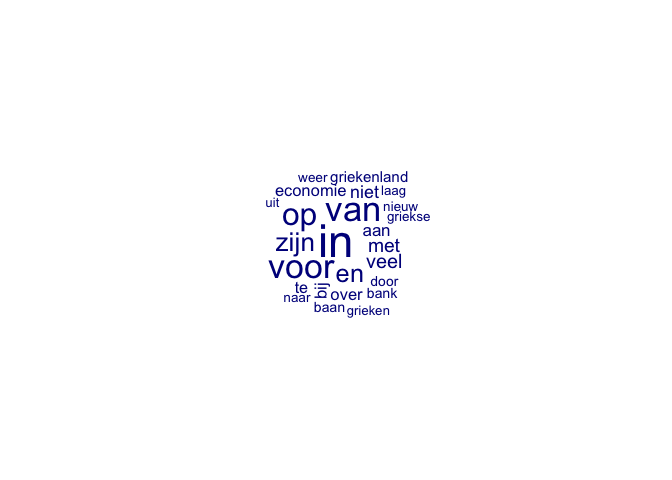

Homework 2: Text Analysis and Dictionary Approaches
================
Wouter van Atteveldt, Mariken van der Velden, & Philipp Masur

-   <a href="#formalities" id="toc-formalities">Formalities</a>
-   <a href="#introduction" id="toc-introduction">Introduction</a>
-   <a href="#data" id="toc-data">Data</a>
-   <a href="#analysis" id="toc-analysis">Analysis</a>
    -   <a href="#creating-the-document-feature-matrix"
        id="toc-creating-the-document-feature-matrix">Creating the
        document-feature matrix</a>
    -   <a href="#applying-a-dictionary" id="toc-applying-a-dictionary">Applying
        a dictionary</a>

# Formalities

-   Name: \[ENTER YOUR NAME HERE\]
-   Student ID: \[ENTER YOUR STUDENT ID HERE\]

In the end, klick on “knit” and upload the respective html-output file
to Canvas. Please add your name and last name to the output file name:
e.g., 02_homework_assignment_NAME-LASTNAME.html

# Introduction

Wouter van Atteveldt, Mariken van der Velden and Mark Boukes have
published an article titled [The Validity of Sentiment
Analysis](https://raw.githubusercontent.com/vanatteveldt/ecosent/master/report/atteveldt_sentiment.pdf)
(one of the required readings for week 3) in which they tested different
methods’ validity in assessing the sentiment in Dutch newspaper
headlines. Special thanks to Wouter and Mariken for sharing their data
and code for this exercise!

Note that you don’t need to be able to read Dutch to be do this
homework, although of course it can help for inspecting the data and
doing error analysis.

In this homework, you will reproduce some of the analyses from that
paper, namely the quanteda-based Dutch dictionaries approach. Note that
the outcome will not be identical as both preprocessing and ML
implementation will be different, but the outcomes are comparable.

# Data

We can simply load the data from the respective github repository with
the following code.

``` r
# Needed packages
library(tidyverse)
library(quanteda)
library(quanteda.textplots)
library(quanteda.textstats)

# Load data
url <- "https://raw.githubusercontent.com/vanatteveldt/ecosent/master/data/intermediate/sentences_ml.csv"
d <- read_csv(url) %>% 
  select(doc_id = id, text = headline, lemmata, sentiment=value) %>%
  mutate(doc_id = as.character(doc_id))
head(d)
```

    ## # A tibble: 6 × 4
    ##   doc_id text                                                  lemmata sentiment
    ##   <chr>  <chr>                                                 <chr>       <dbl>
    ## 1 10007  Rabobank voorspelt flinke stijging hypotheekrente     Raboba…         0
    ## 2 10027  D66 wil reserves provincies aanspreken voor groei     D66 wi…         0
    ## 3 10037  UWV: dit jaar meer banen                              UWV di…         1
    ## 4 10059  Proosten op geslaagde beursgang Bols                  proost…         1
    ## 5 10099  Helft werknemers gaat na 65ste met pensioen           helft …         0
    ## 6 10101  Europa groeit voorzichtig dankzij lage energieprijzen Europa…         1

This dataset contains Dutch newspaper headlines of articles mentioning
the economy. The `sentiment` column is a manual coding of the state of
the economy, i.e. whether according to the headline one would conclude
the economy is doing well or not.

``` r
table(d$sentiment)
```

    ## 
    ##   -1    0    1 
    ## 2071 2785 1466

In total, there are 6,322 headlines, roughly half of them are neutral,
\~2000 are rather negative and \~1500 are rather positive.

It is important to note that we have both the original “text” and the
“lemmatized” version of the text. We can run analyses on both, but you
should from now on work with the lemmatized text!

# Analysis

## Creating the document-feature matrix

In a first step, make a document-term-matrix from the lemmatized texts.
This means first creating a “corpus” (bear in mind to set
`text-field = "lemmata"`), engage in reasonable preprocessing (e.g.,
removing punctuation, frequency trimming, but don’t engage in anything
more elaborate such as stopword removal or stemming as we already
lemmatized!)

``` r
dtm <- d %>% 
  corpus(text_field = "lemmata") %>%
  tokens %>%    # I only tokenize, not further text preprocessing necessary
  dfm
```

Let’s quickly make a word cloud to get an idea what these headlines are
about (set max_words = 25). What is the most often used word (even if it
is probably a stop word)?

``` r
textplot_wordcloud(dtm, max_words = 25)
```

<!-- -->

**Answer:** The most used word is “in”.

## Applying a dictionary

Next, you need to download and apply the NRC dictionary for Dutch:
([original
code](https://github.com/vanatteveldt/ecosent/blob/master/src/data-processing/11_apply_dictionaries_quanteda.R)).
First, we download the dictionary and turn it into a quanteda
dictionary:

``` r
url <- "https://raw.githubusercontent.com/vanatteveldt/ecosent/master/data/raw/dictionaries/NRC-Emotion-Lexicon-v0.92-In105Languages-Nov2017Translations.csv"
nrc <- read_csv(url) %>% select(term = `Dutch (nl)`, Positive, Negative, Fear, Trust) %>% filter(term != 'NO TRANSLATION')
dict <- dictionary(list(positive = nrc$term[nrc$Positive==1],
                        negative = nrc$term[nrc$Negative==1],
                        fear = nrc$term[nrc$Fear==1],
                        trust = nrc$term[nrc$Trust==1]))
dict
```

    ## Dictionary object with 4 key entries.
    ## - [positive]:
    ##   - abba, vermogen, absoluut, absolutie, geabsorbeerd, overvloed, overvloedig, academische, academie, aanvaardbaar, aanvaarding, beschikbaar, accolade, accommodatie, begeleiding, bereiken, volbracht, prestatie, overeenstemming, verantwoording [ ... and 2,012 more ]
    ## - [negative]:
    ##   - in de steek laten, verlaten, verlatenheid, ontvoering, afwijkend, aberratie, verafschuwen, weerzinwekkend, verachtelijk, abnormaal, afschaffen, afschaffing, afschuwelijk, gruwel, afbreken, abortus, vruchteloos, schuring, abces, afwezigheid [ ... and 2,717 more ]
    ## - [fear]:
    ##   - in de steek laten, verlaten, verlatenheid, ontvoering, verafschuwen, weerzinwekkend, afschuwelijk, gruwel, abortus, afwezigheid, misbruik, afgrond, ongeval, onopzettelijk, vervloekt, verdachte, aanklager, beschuldigen, acrobaat, adder [ ... and 1,278 more ]
    ## - [trust]:
    ##   - telraam, abt, absolutie, overvloed, academische, accolade, begeleiding, overeenstemming, account, verantwoording, verantwoordelijk, accountant, rekeningen, geaccrediteerd, accuraat, bereiken, prestatie, acrobaat, hechtende, administratief [ ... and 1,108 more ]

Next, try to apply to the dictionary to the dtm we created earlier. The
resulting dtm contains information about which headlines contains
positive, negative, fear-related, and trust-related words. Can you
create table that shows the absolute frequency of each word? Which words
occur most often?

``` r
# Dictionary analysis
dtm_result <- dtm %>%
  dfm_lookup(dict)
dtm_result
```

    ## Document-feature matrix of: 6,322 documents, 4 features (65.23% sparse) and 2 docvars.
    ##        features
    ## docs    positive negative fear trust
    ##   10007        1        0    0     0
    ##   10027        1        1    0     1
    ##   10037        1        0    0     0
    ##   10059        1        0    0     1
    ##   10099        1        1    1     1
    ##   10101        2        0    1     2
    ## [ reached max_ndoc ... 6,316 more documents ]

``` r
# Frequency of dictionary results
textstat_frequency(dtm_result)
```

    ##    feature frequency rank docfreq group
    ## 1 positive      3985    1    2964   all
    ## 2 negative      2904    2    2253   all
    ## 3    trust      2459    3    1989   all
    ## 4     fear      1861    4    1586   all

**Answer:** The text contain mostly “positive” words (4053 positive
words in 2964 headlines).

Now try to convert the results into a data.frame (or better a tibble)
and compute a sentiment score by substracting the sum of “negative” and
“fear” related words from the the sum of “positive” and “trust” related
words (i.e., `score = (positive + trust) - (negative + fear)`). This is
a slightly different score than we produced in the practical session.

Furthermore, recode the resulting score so that positive values (\> 0)
are coded as 1, neutral (= 0) are coded as 0 and negative values (\< 0)
as -1. This can be done in various ways, but the easiest way is to use
another mutate command and simply wrap the computed score with the
function `sign()`.

``` r
result <- dtm_result %>%
  convert(to="data.frame") %>%
  as_tibble %>%
  mutate(score = (positive + trust) - (negative + fear),  ## Creating score
         dict_sentiment = sign(score))                    ## Transformation
```

Now, you should be able to join these results with the original data
set. Try to compute the confusion matrix (using the `table()` function)
and then produce the accuracy score. What do we learn?

``` r
# Joining
result <- inner_join(d, result)

# Confusion matrix
cm <- table(manual = result$sentiment, dictionary = result$dict_sentiment)
cm
```

    ##       dictionary
    ## manual   -1    0    1
    ##     -1  782  702  587
    ##     0   642 1146  997
    ##     1   183  433  850

``` r
# Accuracy
sum(diag(cm)) / sum(cm)
```

    ## [1] 0.4394179

**Answer:** We can see that there are quite a lot of false positives and
false negatives. Overall, the accuracy is 43.9% which means that the
dictionary does not perform very well in classifying the headlines’
sentiment.
