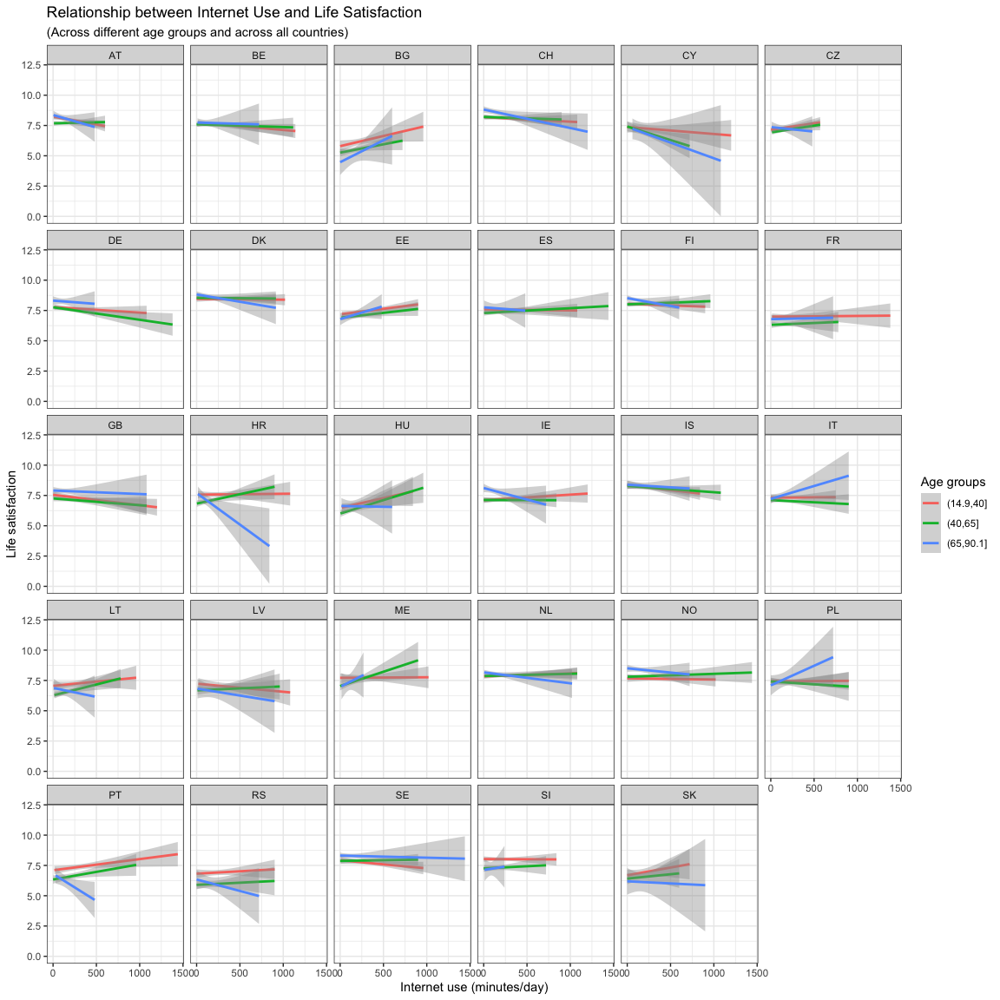

Homework 2: Data Wrangling and Data Visualization (Solution)
================
Philipp Masur

-   [Formalities](#formalities)
-   [Instructions](#instructions)
-   [Exercises](#exercises)
    -   [Task 1: Selecting the right variables and understanding the
        data](#task-1-selecting-the-right-variables-and-understanding-the-data)
    -   [Task 2: Summarizing across
        countries](#task-2-summarizing-across-countries)
    -   [Task 3: Does internet use affect
        well-being?](#task-3-does-internet-use-affect-well-being)

# Formalities

-   Name: \[ENTER YOUR NAME HERE\]
-   Student ID: \[ENTER YOUR STUDENT ID HERE\]

In the end, click on “knit” and upload the respective html-output file
to Canvas. Please add your name and lastname to the output file name:
e.g., 02\_homework\_assignment\_NAME-LASTNAME.html

# Instructions

In this homework assignment, you are again going to practice what you
have learned in the past two practical sessions. To do so, we again need
to get some data into R. In the Canvas Module “Homework Templates & Data
Sets” you will find the data set **ESS9\_2018.csv**. This data set is
the most recent European Social Survey (Wave 9). It can be downloaded
from this website: <http://www.europeansocialsurvey.org/data/>, where
you can find also more information about the data set.

If you have set the working directory to the location of this RMarkdown
Script and you put the csv-file in the same folder, you can load that
data set without specifying a specific path.

``` r
library(tidyverse)
library(ggthemes)
d <- read_csv("ESS9_2018.csv")
```

# Exercises

## Task 1: Selecting the right variables and understanding the data

1.1. The data set is comparatively big and we only want to work with
some variables. So in a first step, select and potentially rename the
following variables:

-   **idno**: respondents’ id
-   **cntry**: country
-   **nwspol**: News consumptions (in minutes per day) about politics
    and current affairs (watching, reading, listening)
-   **netustm**: Internet use (in minutes per day)
-   **polintr**: Political interest (1 = very interested, 2 = quite
    interested, 3 = hardly interested, 4 = not at all interested)
-   **stflife**: Life satisfaction
-   **gndr**: Gender
-   **agea**: Age (in years)

``` r
d <- d %>%
  select(id = idno,
         country = cntry,
         pol_news = nwspol,
         internet_use = netustm,
         pol_interest = polintr,
         trust_parties = trstprt,
         life_sat = stflife,
         pol_ideology = prtdgcl,
         gender = gndr,
         age = agea)
```

2.2. How many people are in the data set and what is their average age?
How many people are there in each country?

``` r
# Rows in data set
nrow(d)
```

    ## [1] 49519

``` r
# Average age
## Alternative 1
summarise(d, age = mean(age, na.rm = T))
```

    ## # A tibble: 1 x 1
    ##     age
    ##   <dbl>
    ## 1  51.1

``` r
## Alternative 2
mean(d$age, na.rm = T)
```

    ## [1] 51.06601

``` r
# Number of participants per country
d %>%
  group_by(country) %>%
  summarize(n = n()) %>%
  arrange(-n)
```

    ## # A tibble: 29 x 2
    ##    country     n
    ##    <chr>   <int>
    ##  1 IT       2745
    ##  2 AT       2499
    ##  3 CZ       2398
    ##  4 DE       2358
    ##  5 IE       2216
    ##  6 GB       2204
    ##  7 BG       2198
    ##  8 RS       2043
    ##  9 FR       2010
    ## 10 EE       1904
    ## # … with 19 more rows

**Answer:** There are 49,297 people in the data set. They are on average
51.1 years old. The number of people per country differs, ranging from
781 (Cyprus) to 2745 people (Italy).

## Task 2: Summarizing across countries

2.1. Try to figure out on what scale political interest was measured.
What is the mean and standard deviation of the variables “political
interest”, “political news consumption”? Tip: Install the package
`psych` and use the function `describe()` to assess the variables
psychometric properties.

``` r
# install.packages("psych")  # You hav to install the package first!
library(psych)

# Alternative 1
d %>%
  select(pol_interest,
         pol_news) %>%
  describe
```

    ##              vars     n  mean     sd median trimmed   mad min  max range  skew
    ## pol_interest    1 49421  2.66   0.92      3    2.70  1.48   1    4     3 -0.12
    ## pol_news        2 48947 85.48 137.59     60   59.08 44.48   0 1440  1440  4.81
    ##              kurtosis   se
    ## pol_interest    -0.86 0.00
    ## pol_news        27.49 0.62

``` r
# Alternative 2
describe(d[c("pol_interest", "pol_news")])
```

    ##              vars     n  mean     sd median trimmed   mad min  max range  skew
    ## pol_interest    1 49421  2.66   0.92      3    2.70  1.48   1    4     3 -0.12
    ## pol_news        2 48947 85.48 137.59     60   59.08 44.48   0 1440  1440  4.81
    ##              kurtosis   se
    ## pol_interest    -0.86 0.00
    ## pol_news        27.49 0.62

**Answer:** The scale measuring political interest was measure on a
4-point-scale. On, average, participants were mildly interested in
politics (M = 2.66, SD = 0.92). On average, they watched, read, or
listen to political news M = 85.48 minutes per day (SD = 137.59)

2.2. Check the assumption that both variables are normally distributed.
Do so by plotting histograms for both variables.

``` r
# Political interest
ggplot(d, aes(x = pol_interest)) +
  geom_histogram(color = "white", fill = "lightblue", bins = 4) +
  theme_clean() +
  labs(x = "Political interest", 
       y = "Count (number of participants)",
       title = "Histogram of Political Interest",
       subtitle = "(across all countries)")
```

<!-- -->

``` r
# Political news consumption
ggplot(d, aes(x = pol_news)) +
  geom_histogram(color = "white", fill = "lightblue", bins = 50) +
  theme_clean() +
  labs(x = "Political news consumption", 
       y = "Count (number of participants)",
       title = "Histogram of Political News Consumption",
       subtitle = "(across all countries)")
```

<!-- -->

**Answer:** As political interest was only measured on a 4-point scale,
it is difficult to assess whether it is normally distributed but the
histogram indeed suggest that the values 2 and 3 are more common
compared to the the extremes. News consumption, on the other hand, is
clearly not normally distributed. Many people seem to watch, read, or
listen to political news between 0 and 100 minutes per day. The
distribution, however, has a quite long tail. So there are a few
participants in the survey that consume much more news per day.

2.2. Second, try to use the `group_by` and `summarise` commands to
produce the average news consumption across countries. If you can, also
estimate the standard deviation per country.

``` r
news_per_country <- d %>%
  group_by(country) %>%
  summarise(m = mean(pol_news, na.rm = T),
            sd = sd(pol_news, na.rm = T))
news_per_country
```

    ## # A tibble: 29 x 3
    ##    country     m    sd
    ##  * <chr>   <dbl> <dbl>
    ##  1 AT       45.8  45.5
    ##  2 BE      153.  279. 
    ##  3 BG      107.  107. 
    ##  4 CH       59.6  87.4
    ##  5 CY       71.2  84.5
    ##  6 CZ       39.6  70.6
    ##  7 DE       63.0  80.7
    ##  8 DK       76.1  85.1
    ##  9 EE       79.5  75.6
    ## 10 ES       80.7 117. 
    ## # … with 19 more rows

2.3. If you have summarized the data, assign them to a new object and
try to plot differences in news consumption between countries as a
barplot. Reorder the countries to show which is consumes most political
news in which the least. Which countries consume the most political
news?

``` r
news_per_country %>%
  ggplot(aes(x = fct_reorder(country, m), y = m, fill = m)) +  ## fill is not necessary, but can help visualizing differences
  geom_bar(stat = "identity") +
  coord_flip() +   ## Also not strictly necessary, but makes the figure a bit nicer
  theme_clean() +
  labs(x = " ", y = "Political news consumption (Minutes/day)",
       fill = "Minutes",
       title = "Average Political News Consumption", 
       subtitle = "(per country)")
```

<!-- -->

**Answer:** Overall, average news consumption varies considerably across
countries(ranging from 45 minutes in Czech Republics to &gt;150 minutes
per day in Italy). People in Belgium and Italy consume most political
news per day.

## Task 3: Does internet use affect well-being?

The subsequent code runs a linear model in which life satisfaction is
predicted by internet use. Some further variables are entered as control
variables. Based on the results of this model, Internet use is a
positive, significant predictor of life satisfaction.

3.1. How could you supplement this analysis with an appropriate graph?
Is the relationship really practically relevant?

``` r
# Linear model
model <- lm(life_sat ~ age + gender-1 + internet_use, d)
summary(model)
```

    ## 
    ## Call:
    ## lm(formula = life_sat ~ age + gender - 1 + internet_use, data = d)
    ## 
    ## Residuals:
    ##     Min      1Q  Median      3Q     Max 
    ## -12.859  -1.086   0.553   2.039   6.751 
    ## 
    ## Coefficients:
    ##               Estimate Std. Error t value Pr(>|t|)    
    ## age          6.684e-02  6.200e-04  107.81   <2e-16 ***
    ## gender       2.087e+00  2.023e-02  103.15   <2e-16 ***
    ## internet_use 4.609e-03  7.359e-05   62.63   <2e-16 ***
    ## ---
    ## Signif. codes:  0 '***' 0.001 '**' 0.01 '*' 0.05 '.' 0.1 ' ' 1
    ## 
    ## Residual standard error: 2.5 on 34165 degrees of freedom
    ##   (15351 observations deleted due to missingness)
    ## Multiple R-squared:  0.8941, Adjusted R-squared:  0.8941 
    ## F-statistic: 9.616e+04 on 3 and 34165 DF,  p-value: < 2.2e-16

``` r
# Simple, but correct scatterplot
ggplot(d, aes(x = internet_use, y = life_sat)) +
  geom_point() +
  geom_smooth(method = "lm")
```

<!-- -->

This plot is not wrong (so if you have done it in this way, it is
fine!), but there is one particular issue: Because of the 10-point Life
Satisfaction scale, a lot of the points overlap, making it hard to see
how the relationship actually looks like. Can we change this? Yes, we
can use a function called `jitter()` in the aesthetics that adds little
random values around the true value. This way, the points get more
spread out and we can see a bit more. Below I am also adding some more
layout changes that can help to make this figure more informative.

``` r
# A more refined scatterplot
ggplot(d, aes(x = internet_use, y = jitter(life_sat))) +    ## adding jitter
  geom_point(alpha = .1, color = "darkgrey", size = .5) +   ## making points transparent, smaller and grey instead of black
  geom_smooth(method = "lm") +       
  theme_clean() +
  labs(x = "Internet use (minutes/day)", y = "Life satisfaction",          ## adding good labels!
       title = "Relationhip between internet use and life satisfaction", 
       subtitle = "(across all countries)")
```

<!-- -->

**Answer:** Even though the relationship is statistically significant
(based on the regression model), the scatterplot shows quite vividly
that the relationship is very small. There is almost no increase in the
regression line. So practically, the relationship may be irrelevant.

3.2. Does the relationship differ for different age groups? The
following code creates a new age variable. Add this variable age\_group
to the aesthetics of the plot you created above (e.g., by adding
`color = age_group?`) What do you see?

``` r
# Creating a age variable, filtering out people who did not provide age
age_data <- d %>%
  mutate(age_group = cut(age, 3)) %>%
  filter(!is.na(age_group))

# Plot relationships across the three groups (just adding the color aesthetics)
ggplot(age_data, aes(x = internet_use, y = jitter(life_sat), color = age_group)) +
  geom_point(alpha = .1, color = "darkgrey", size = .5) +
  geom_smooth(method = "lm") +
  theme_clean() +
  labs(x = "Internet use (minutes/day)", y = "Life satisfaction",
        color = "Age groups",
       title = "Relationship between Internet Use and Life Satisfaction",
       subtitle = "(Across different age groups)")
```

<!-- -->

**Answer:** Whereas internet use seems to slightly increase life
satisfaction for younger generations, the relationship is clearly
negative for people above 65 (blue line).

3.3. Bonus questions: Can you add a simple command to the plot that
creates the same type of visualization for all countries? What do you
see?

``` r
# I am adding a facet_wrap and also remove the points. We are interested in the relationships here, so the regression lines are enough
ggplot(age_data, aes(x = internet_use, y = jitter(life_sat), color = age_group)) +
  geom_smooth(method = "lm") +
  facet_wrap(~country) +
  theme_bw() +
  labs(x = "Internet use (minutes/day)", 
       y = "Life satisfaction", 
       color = "Age groups",
       title = "Relationship between Internet Use and Life Satisfaction",
       subtitle = "(Across different age groups and across all countries)")
```

<!-- -->

**Answer:** The relationships for the three age groups vary considerably
across the countries. For example, in Portugal (PT), the relationship
between internet use and life satisfaction is clearly negative for older
people, but this is not necessarily true for other countries (e.g.,
Italy).
