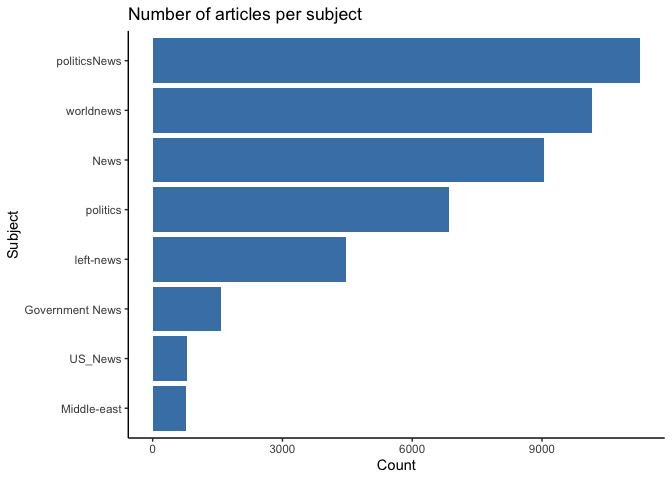
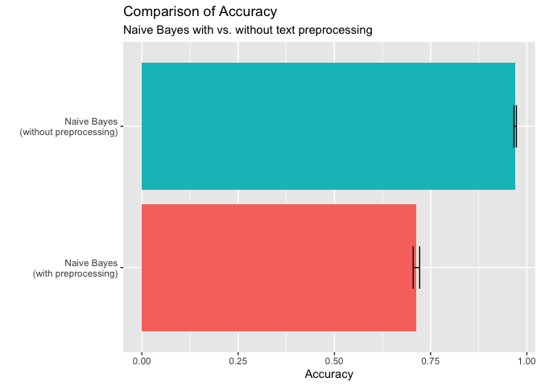

Homework 3: Supervised Text Classification (With solutions)
================
Philipp Masur

-   <a href="#formalities" id="toc-formalities">Formalities</a>
-   <a href="#introduction" id="toc-introduction">Introduction</a>
    -   <a href="#loading-data" id="toc-loading-data">Loading data</a>
    -   <a href="#combining-title-and-text"
        id="toc-combining-title-and-text">Combining title and text</a>
-   <a href="#text-preprocessing" id="toc-text-preprocessing">Text
    preprocessing</a>
    -   <a href="#creating-train-and-test-set"
        id="toc-creating-train-and-test-set">Creating train and test set</a>
    -   <a href="#text-preprocessing-1" id="toc-text-preprocessing-1">Text
        preprocessing</a>
-   <a href="#machine-learning" id="toc-machine-learning">Machine
    Learning</a>
    -   <a href="#training-the-algorithm"
        id="toc-training-the-algorithm">Training the algorithm</a>
    -   <a href="#testing-the-model-on-the-training-set"
        id="toc-testing-the-model-on-the-training-set">Testing the model on the
        training set</a>
    -   <a href="#validating-on-the-test-data"
        id="toc-validating-on-the-test-data">Validating on the test data</a>

# Formalities

-   Name: \[ENTER YOUR NAME HERE\]
-   Student ID: \[ENTER YOUR STUDENT ID HERE\]

In the end, klick on “knit” and upload the respective html-output file
to Canvas. Please add your name and lastname to the output file name:
e.g., 02_homework_assignment_NAME-LASTNAME.html

# Introduction

In this homework, you are going to work with data provided by Ahmed,
Traore, & Saad (2018), who studying the detection of fake news in online
news articles. We ask you to evaluate how well a Naive Bayes algorithm
succeeds in predicting whether a news article is fake or not.

## Loading data

First, we are going to load the data. It comes in two batches: the first
contains more than 20,000 fake news articles; the second contains 21,000
true articles. We load both individually, add a column that designates
them as either fake or true (fake: true = no; true: true = yes). We then
combine both and have a look at the data set.

``` r
library(tidyverse)

# Load data
fake <- read_csv("Fake.csv") %>% mutate(true = "no")
true <- read_csv("True.csv") %>% mutate(true = "yes")

# Merge data
d <- rbind(fake, true)
head(d)
```

    ## # A tibble: 6 × 5
    ##   title                                                text  subject date  true 
    ##   <chr>                                                <chr> <chr>   <chr> <chr>
    ## 1 Donald Trump Sends Out Embarrassing New Year’s Eve … Dona… News    Dece… no   
    ## 2 Drunk Bragging Trump Staffer Started Russian Collus… Hous… News    Dece… no   
    ## 3 Sheriff David Clarke Becomes An Internet Joke For T… On F… News    Dece… no   
    ## 4 Trump Is So Obsessed He Even Has Obama’s Name Coded… On C… News    Dece… no   
    ## 5 Pope Francis Just Called Out Donald Trump During Hi… Pope… News    Dece… no   
    ## 6 Racist Alabama Cops Brutalize Black Boy While He Is… The … News    Dece… no

As you can see, the data set contains articles of different subjects.
Can you create a bar plot that shows how many articles per subject are
included in the data set? (Bonus: Try to reorder the bar plot so that
the subject with the most articles is shown first and the subject with
the least articles at last).

**Question:** Which subjects dominate the corpus?

``` r
# Descriptive analyses
d %>%
  group_by(subject) %>%
  count %>%
  arrange(-n) %>%
  mutate(prop = n/nrow(d))
```

    ## # A tibble: 8 × 3
    ## # Groups:   subject [8]
    ##   subject             n   prop
    ##   <chr>           <int>  <dbl>
    ## 1 politicsNews    11272 0.251 
    ## 2 worldnews       10145 0.226 
    ## 3 News             9050 0.202 
    ## 4 politics         6841 0.152 
    ## 5 left-news        4459 0.0993
    ## 6 Government News  1570 0.0350
    ## 7 US_News           783 0.0174
    ## 8 Middle-east       778 0.0173

``` r
# Bar plot
ggplot(d, aes(x = fct_reorder(subject, subject, .fun='length'))) +
  geom_bar(fill = "steelblue") +
  coord_flip() +
  theme_classic() +
  labs(x = "Subject", y = "Count", 
       title = "Number of articles per subject")
```

<!-- -->

**Answer:** We can see that political news makes up 25% of the entire
corpus. However, this is distribution is somewhat “wrong” as all items
are news articles and the subject labels are somewhat overlapping.

## Combining title and text

Similar to the Amazon Review, we have two potential sources of
information for the classification: The title and the text itself. It
would be unfortunate to only use one of them. For example, not using the
title would be a shame as it is very possible that the title already
tells a lot about whether or not a news article is fake. We hence
combine both columns into one.

``` r
# Merge title and text
d <- d %>%
  mutate(text2 = str_c(title, text, sep = " "))
```

# Text preprocessing

Next, we engage in the preprocessing. For supervised machine learning,
this means create a train and test data set and thinking about
meaningful text preprocessing steps.

## Creating train and test set

First, create a training and a test set. Think about meaningful
partitions. Please justify why you choose a certain percentage.

``` r
# To ensure replicability
set.seed(42)

# Sample 
trainset <- sample(nrow(d), size=round(nrow(d) * 0.75))
news_train <- d %>% slice(trainset)
news_test <- d %>% slice(-trainset)
```

**Answer:** The corpus is comparatively large. From this point of view,
it may not matter too much what percentage of it constitutes the
training data set. Yet, to use most of the data set for training the
algorithm, while retaining sufficient test data, I decided to split it
75/25. This way, the machine learning algorithm is trained on more than
33,000 news articles, but we still have more than 11,000 articles left
to test its performance.

## Text preprocessing

Now think about meaningful text preprocessing (Removing stopwords?
Trimming the data set?). Also justify your steps below.

``` r
library(quanteda)

# Text preprocessing I
dfm_train <- news_train %>% 
  corpus(text = "text2") %>% 
  tokens(remove_punct = T, remove_numbers = T) %>%
  dfm 

# Text preprocessing II
dfm_train2 <- news_train %>% 
  corpus(text = "text2") %>% 
  tokens(remove_punct = T, remove_numbers = T) %>%
  tokens_wordstem() %>%
  tokens_remove(stopwords("en")) %>%
  dfm 
```

**Answer:** Removing punctuations and numbers is probably meaningful,
but we have seen that further test preprocessing often doesn’t lead to
better results (see e.g., the study by Scharkow, 2012). However, to be
sure, I created two training data sets that differ with regard to
whether or not stemming was used and whether or not stopwords were
removed (I am showing you here how different approaches can be compared,
for a correct solution, you can only run one approach, of course).

# Machine Learning

## Training the algorithm

Now, we can train the model. Don’t forget to load the package
“quanteda.textmodels”.

``` r
library(quanteda.textmodels) 
nbmodel1 <- textmodel_nb(dfm_train, dfm_train$true)
nbmodel2 <- textmodel_nb(dfm_train2, dfm_train2$true)
```

## Testing the model on the training set

Now, we should quickly check the accuracy of the algorithm in predicting
the “train” set. This of course should be really high as we trained it
on this set.

``` r
predictions1 <- predict(nbmodel1, dfm_train)
predictions2 <- predict(nbmodel2, dfm_train2)
mean(predictions1 == dfm_train$true)
```

    ## [1] 0.974758

``` r
mean(predictions2 == dfm_train2$true)
```

    ## [1] 0.9727683

## Validating on the test data

More importantly, we need to validate the algorithm performance. To do
this, we need to preprocess the “test” data set in the exact same way as
the train data set. Don’t forget to use `dfm_match()` to make sure that
the features are ordered in the same way. Then move on to compute the
accuracy and other performance indicators (e.g., precision, recall,
F1-Score). You can use the `caret` package for this as well. How well
does the algorithm predict fake news in the data set?

``` r
# Match training and test data sets
dfm_test1 <- news_test %>% 
  corpus(text = "text2") %>% 
  tokens(remove_punct = T, remove_numbers = T) %>%
  dfm %>%
  dfm_match(features = featnames(dfm_train))
dfm_test2 <- news_test %>% 
  corpus(text = "text2") %>% 
  tokens(remove_punct = T, remove_numbers = T) %>%
  dfm %>%
  dfm_match(features = featnames(dfm_train2))

# Check performance
library(caret)
predictions1 <- predict(nbmodel1, dfm_test1)
predictions2 <- predict(nbmodel2, dfm_test2)

# Without preprcoessing
(nb1 <- confusionMatrix(table(predictions1, actual = dfm_test1$true), mode = "prec_recall"))
```

    ## Confusion Matrix and Statistics
    ## 
    ##             actual
    ## predictions1   no  yes
    ##          no  5635  121
    ##          yes  218 5250
    ##                                           
    ##                Accuracy : 0.9698          
    ##                  95% CI : (0.9665, 0.9729)
    ##     No Information Rate : 0.5215          
    ##     P-Value [Acc > NIR] : < 2.2e-16       
    ##                                           
    ##                   Kappa : 0.9395          
    ##                                           
    ##  Mcnemar's Test P-Value : 1.848e-07       
    ##                                           
    ##               Precision : 0.9790          
    ##                  Recall : 0.9628          
    ##                      F1 : 0.9708          
    ##              Prevalence : 0.5215          
    ##          Detection Rate : 0.5020          
    ##    Detection Prevalence : 0.5128          
    ##       Balanced Accuracy : 0.9701          
    ##                                           
    ##        'Positive' Class : no              
    ## 

``` r
# Without preprocessing
(nb2 <- confusionMatrix(table(predictions2, actual = dfm_test2$true), mode = "prec_recall"))
```

    ## Confusion Matrix and Statistics
    ## 
    ##             actual
    ## predictions2   no  yes
    ##          no  5851 3217
    ##          yes    2 2154
    ##                                           
    ##                Accuracy : 0.7132          
    ##                  95% CI : (0.7047, 0.7216)
    ##     No Information Rate : 0.5215          
    ##     P-Value [Acc > NIR] : < 2.2e-16       
    ##                                           
    ##                   Kappa : 0.4108          
    ##                                           
    ##  Mcnemar's Test P-Value : < 2.2e-16       
    ##                                           
    ##               Precision : 0.6452          
    ##                  Recall : 0.9997          
    ##                      F1 : 0.7843          
    ##              Prevalence : 0.5215          
    ##          Detection Rate : 0.5213          
    ##    Detection Prevalence : 0.8079          
    ##       Balanced Accuracy : 0.7004          
    ##                                           
    ##        'Positive' Class : no              
    ## 

``` r
# Compare accuracy
bind_rows(nb1$overall, nb2$overall) %>%
  mutate(algorithm = c("Naive Bayes\n(without preprocessing)", "Naive Bayes\n(with preprocessing)")) %>%
  select(algorithm, everything()) %>%
  ggplot(aes(x = algorithm, y = Accuracy, ymin = AccuracyLower, ymax = AccuracyUpper)) +
  geom_col(aes(fill = algorithm)) +
  geom_errorbar(width = .3) +
  coord_flip() +
  theme(legend.position = "none") +
  labs(x = "", title = "Comparison of Accuracy",
      subtitle = "Naive Bayes with vs. without text preprocessing")
```

<!-- -->

**Answer:** Overall, testing the algorithm on the test data set revealed
that it does very well in predicting whether news are fake or real.
Without preprocessing, the accuracy is very high (97.1%), also precision
(98.3%), recall (96.2%), and the overall F1-score (97.2%) are very high,
suggesting excellent performance. Yet, we also see that the performance
significantly drops if we engage in text preprocessing such as stemmping
and stopword removal. We hence should not modify the input data too
much.
