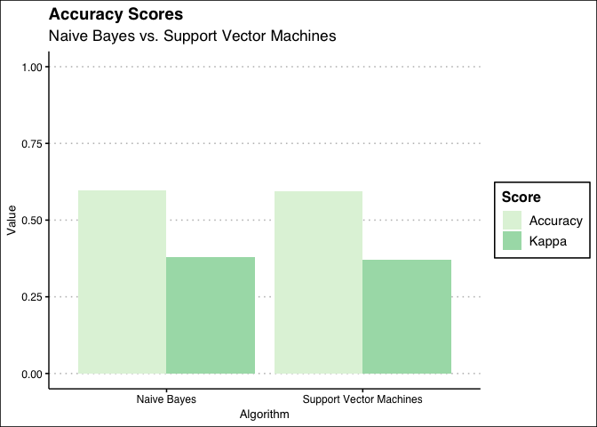
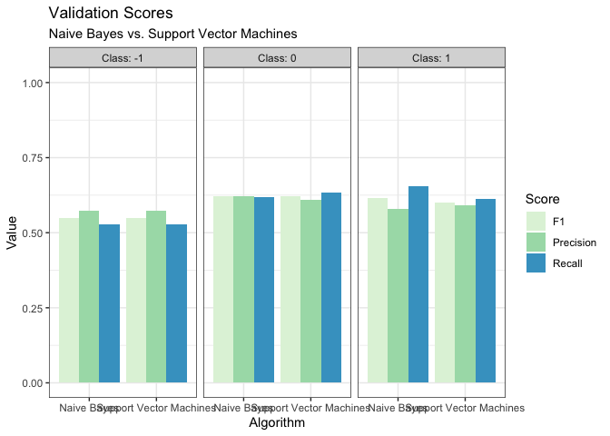

Homework 4: Supervised Text Classification (with Solutions)
================
Wouter van Atteveldt, Mariken van der Velden, & Philipp Masur

-   [Formalities](#formalities)
-   [Introduction](#introduction)
-   [Data](#data)
-   [Analysis](#analysis)
    -   [Splitting the data into a training and test data
        set](#splitting-the-data-into-a-training-and-test-data-set)
    -   [Creating the document-feature
        matrix](#creating-the-document-feature-matrix)
    -   [Training the algorithm](#training-the-algorithm)
    -   [Testing agains the gold
        standard](#testing-agains-the-gold-standard)

# Formalities

-   Name: \[ENTER YOUR NAME HERE\]
-   Student ID: \[ENTER YOUR STUDENT ID HERE\]

In the end, klick on “knit” and upload the respective html-output file
to Canvas. Please add your name and lastname to the output file name:
e.g., 02\_homework\_assignment\_NAME-LASTNAME.html

# Introduction

In the last homework, we replicated parts of the article [The Validity
of Sentiment
Analysis](https://raw.githubusercontent.com/vanatteveldt/ecosent/master/report/atteveldt_sentiment.pdf)
by Wouter van Atteveldt, Mariken van der Velden and Mark Boukes in which
they tested different methods’ validity in assessing the sentiment in
Dutch newspaper headlines. Again, special thanks to Wouter and Mariken
for sharing their data and code for this exercise!

In this homework, we will replicate a different part of their paper. As
you already realized in the last homework, the sentiment analysis based
on a dictionary did not work very well. The accuracy (in comparison to
the gold standard) was below .50, so close to chance!

In this homework, you will use supervised machine learning algorithms
and check whether they perform better at classifying the sentiment of
the Dutch newspaper headlines.

# Data

We again load the data from the respective github repository with the
following code.

``` r
# Needed packages
library(tidyverse)
library(quanteda)
library(quanteda.textplots)
library(quanteda.textstats)

# Load data
url <- "https://raw.githubusercontent.com/vanatteveldt/ecosent/master/data/intermediate/sentences_ml.csv"
d <- read_csv(url) %>% 
  select(doc_id = id, text = headline, lemmata, sentiment=value) %>%
  mutate(doc_id = as.character(doc_id))
head(d)
```

    ## # A tibble: 6 x 4
    ##   doc_id text                           lemmata                        sentiment
    ##   <chr>  <chr>                          <chr>                              <dbl>
    ## 1 10007  Rabobank voorspelt flinke sti… Rabobank voorspellen flink st…         0
    ## 2 10027  D66 wil reserves provincies a… D66 willen reserve provincie …         0
    ## 3 10037  UWV: dit jaar meer banen       UWV dit jaar veel baan                 1
    ## 4 10059  Proosten op geslaagde beursga… proost op geslaagd beursgang …         1
    ## 5 10099  Helft werknemers gaat na 65st… helft werknemer gaan na 65ste…         0
    ## 6 10101  Europa groeit voorzichtig dan… Europa groeien voorzichtig da…         1

Just as in the last homework, this dataset contains Dutch newspaper
headlines of articles mentioning the economy. The `sentiment` column is
a manual coding of the state of the economy, i.e. whether according to
the headline one would conclude the economy is doing well or not.

# Analysis

## Splitting the data into a training and test data set

First, you need to split the data set into a training and a test data
set. The original data set contains more than 6,000 headlines, so think
about a reasonable percentage split. Please justify your decision for a
certain percentage below.

``` r
# Descriptive analysis of the sentiment column
d %>%
  group_by(sentiment) %>%
  count %>%
  mutate(prop = n/nrow(d))
```

    ## # A tibble: 3 x 3
    ## # Groups:   sentiment [3]
    ##   sentiment     n  prop
    ##       <dbl> <int> <dbl>
    ## 1        -1  2071 0.328
    ## 2         0  2785 0.441
    ## 3         1  1466 0.232

``` r
# To ensure replicability
set.seed(42)

# Sample 
trainset <- sample(nrow(d), size=round(nrow(d) * 0.8))
dutchhl_train <- d %>% slice(trainset)
dutchhl_test <- d %>% slice(-trainset)
```

**Answer:** The descriptive analysis of the annotated sentiment revealed
that the data set contains sufficient negative (32.8%), neutral (44.1%)
and positive (23.2%) headlines. We can hence conclude that a smaller
test set will still contain enough information about all three classes.
We hence split the data sit into larger training (80%) and a smaller
test set (20%). The smaller test set will still contain enough
information for a rigoros validation, but we still use most of the data
set for the training.

## Creating the document-feature matrix

Once you have created the training data set, make a document-term-matrix
that can be passed to the machine learning algorithm. This means first
creating a “corpus” (bear in mind to set `text-field = "lemmata"`),
engage in reasonable preprocessing (if necessary) and transform into a
dtm!

``` r
dfm_train <- dutchhl_train %>%
  corpus(text_field = "lemmata") %>% 
  tokens %>%
  dfm
dfm_train
```

    ## Document-feature matrix of: 5,058 documents, 6,293 features (99.90% sparse) and 2 docvars.
    ##            features
    ## docs        hypotheek van ton voor 98.000 euro da's mooi nam moeten
    ##   150284684         1   1   1    1      1    1    1    1   0      0
    ##   150289189         0   0   0    0      0    0    0    0   1      1
    ##   150282336         0   0   0    0      0    0    0    0   0      0
    ##   150293202         0   0   0    0      0    0    0    0   0      0
    ##   40845             0   1   0    0      0    0    0    0   0      0
    ##   148571911         0   1   0    0      0    0    0    0   0      0
    ## [ reached max_ndoc ... 5,052 more documents, reached max_nfeat ... 6,283 more features ]

## Training the algorithm

Now use the Naive Bayes Classifier to train a model based on the
training data. Bear in mind, the outcome variable is the column
`sentiment`.

``` r
library(quanteda.textmodels)

# Naive Bayes
nb_model <- textmodel_nb(dfm_train, dfm_train$sentiment)

# Support Vector Machines
svm_model <- textmodel_svm(dfm_train, dfm_train$sentiment)
```

## Testing agains the gold standard

In a final step, test the resulting predictions using the test data. How
well did the algorithm perform? (Provide an elaborate interpretation of
the results that takes different validation scores into account.)

``` r
library(caret)

# Align test set with training data set
dfm_test <- dutchhl_test %>% 
  corpus(text_field = "lemmata") %>% 
  tokens %>%
  dfm %>%
  dfm_match(features = featnames(dfm_train))

# Predicting 
nb_predictions <- predict(nb_model, dfm_test)
svm_predictions <- predict(svm_model, dfm_test)

# Accuracy
mean(nb_predictions == dfm_test$sentiment)
```

    ## [1] 0.596519

``` r
mean(svm_predictions == dfm_test$sentiment) 
```

    ## [1] 0.5941456

``` r
# Create confusion matrices
nb_cm <- confusionMatrix(table(predictions = nb_predictions, actual = dfm_test$sentiment), mode = 'prec_recall')
svm_cm <- confusionMatrix(table(predictions = svm_predictions, actual = dfm_test$sentiment), mode = 'prec_recall')

# Extracting accuracy scores
accuracy <- bind_rows(nb_cm$overall, svm_cm$overall) %>%
  mutate(algorithm = c("Naive Bayes", "Support Vector Machines")) %>%
  select(algorithm, Accuracy, Kappa)

# Extracting all other scores and adding the accuracy scores
validation <- bind_rows(nb_cm$byClass %>% 
                          as.data.frame %>% 
                          rownames_to_column("class") %>% 
                          mutate(algorithm = "Naive Bayes"), 
                        svm_cm$byClass %>% 
                          as.data.frame %>% 
                          rownames_to_column("class") %>% 
                          mutate(algorithm = "Support Vector Machines")) %>%
  select(algorithm, class, Precision, Recall, F1)

# Accuracy
accuracy
```

    ## # A tibble: 2 x 3
    ##   algorithm               Accuracy Kappa
    ##   <chr>                      <dbl> <dbl>
    ## 1 Naive Bayes                0.597 0.378
    ## 2 Support Vector Machines    0.594 0.370

``` r
library(ggthemes)
accuracy %>%
  pivot_longer(Accuracy:Kappa) %>%
  ggplot(aes(algorithm, value, fill = name)) +
  geom_bar(stat = "identity", position = "dodge") +
  ylim(0, 1) +
  scale_fill_brewer(palette = 4) +
  labs(x = "Algorithm", y = "Value", fill = "Score", 
       title = "Accuracy Scores", subtitle = "Naive Bayes vs. Support Vector Machines") +
  theme_clean()
```

<!-- -->

``` r
# Validation scores for each class
validation
```

    ##                 algorithm     class Precision    Recall        F1
    ## 1             Naive Bayes Class: -1 0.5736842 0.5265700 0.5491184
    ## 2             Naive Bayes  Class: 0 0.6229508 0.6173285 0.6201269
    ## 3             Naive Bayes  Class: 1 0.5791045 0.6554054 0.6148970
    ## 4 Support Vector Machines Class: -1 0.5718016 0.5289855 0.5495609
    ## 5 Support Vector Machines  Class: 0 0.6104348 0.6335740 0.6217892
    ## 6 Support Vector Machines  Class: 1 0.5915033 0.6114865 0.6013289

``` r
validation %>%
  pivot_longer(Precision:F1) %>%
  ggplot(aes(x = algorithm, value, fill = name)) +
  geom_bar(stat = "identity", position = "dodge") +
  ylim(0, 1) +
  facet_wrap(~class) +
  scale_fill_brewer(palette = 4) +
  labs(x = "Algorithm", y = "Value", fill = "Score", 
       title = "Validation Scores", subtitle = "Naive Bayes vs. Support Vector Machines") +
  theme_bw()
```

<!-- -->

**Answer:** We used both a Naive Bayes (NB) classifier and Support
Vector Machines (SVM). Overall, both algorithms performed a bit better
than the dictionary analysis, which had an accuracy of 44%. The NA
classifier reached an accuracy of 59.7% (Kappa = .38) and the SVM an
accuracy of 59.4% (Kappa = .37). The NB classifier hence led to slightly
more true positive classifications.

Looking at other validation scores, we can again see that the NB
classifier slightly outperforms the SVM, however, the differences are
almost negligible. Most importantly, the NB classifier had a slightly
better recall for positive articles. Yet all other scores are almost the
same for both algorithms.

Overall, however, we have to conclude that even though supervised
machine learning algorithms perform better in predicting the sentiment
of Dutch news headlines, they are far from doing a great job. With
Accuracies around 59%, there is still a lot of room for improvement.
