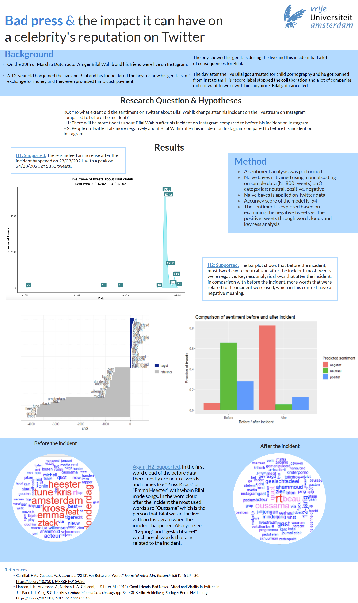
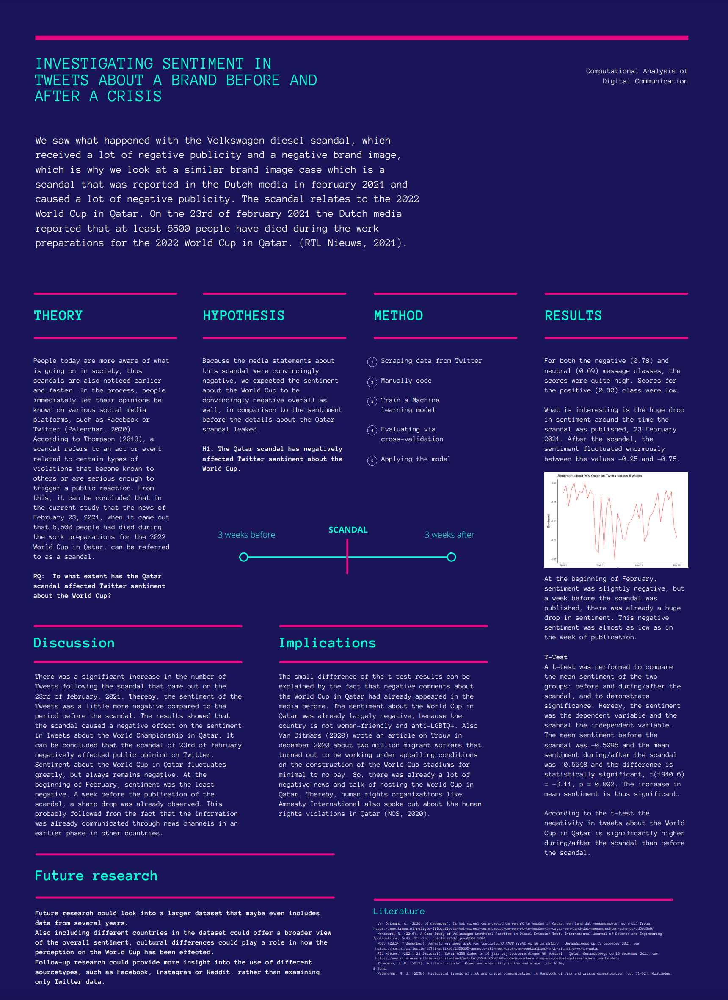
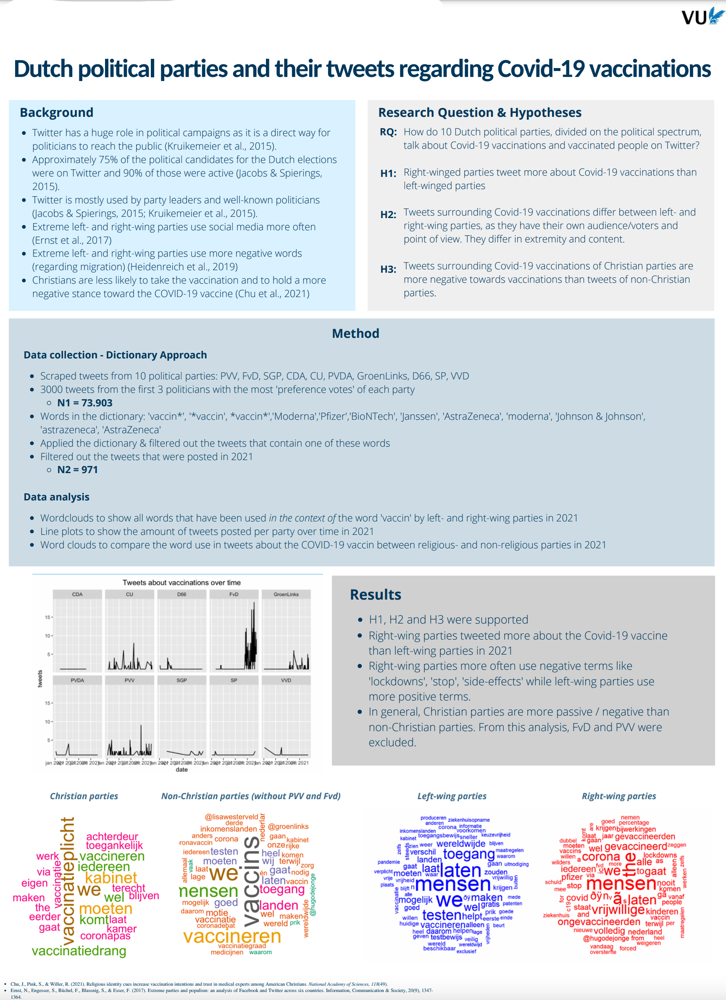

  

As part of the course "Computational Analysis of Digital Communication", students conducted individual research projects. The following posters summarize their projects and main results. 

  

### Research Group 1 

  

### Research Group 2 

  

### Research Group 3 

  

### Research Group 4 

  

### Research Group 5 

  

### Research Group 6 

  

### Research Group 7

  

### Research Group 8 

  

### Research Group 9 

  

### Research Group 10 

  

### Research Group 11 

  

### Research Group 12 

  

### Research Group 13 

  

### Research Group 14 

  

### Research Group 15 

  

### Research Group 17 

  

### Research Group 18 

  

### Research Group 20 

  

### Research Group 21 

  

### Research Group 22 

  

### Research Group 23 

  

### Research Group 24 

  

### Research Group 25 

  

### Research Group 26 

  

### Research Group 27 

  

### Research Group 28 

  

### Research Group 29 

  

### Research Group 30 

  

### Research Group 31 

  

### Research Group 32 

  

### Research Group 33 

  

### Research Group 34 

  

### Research Group 35 

This course is published under the following [license](https://github.com/masurp/VU_CADC/blob/main/LICENSE.md). 

