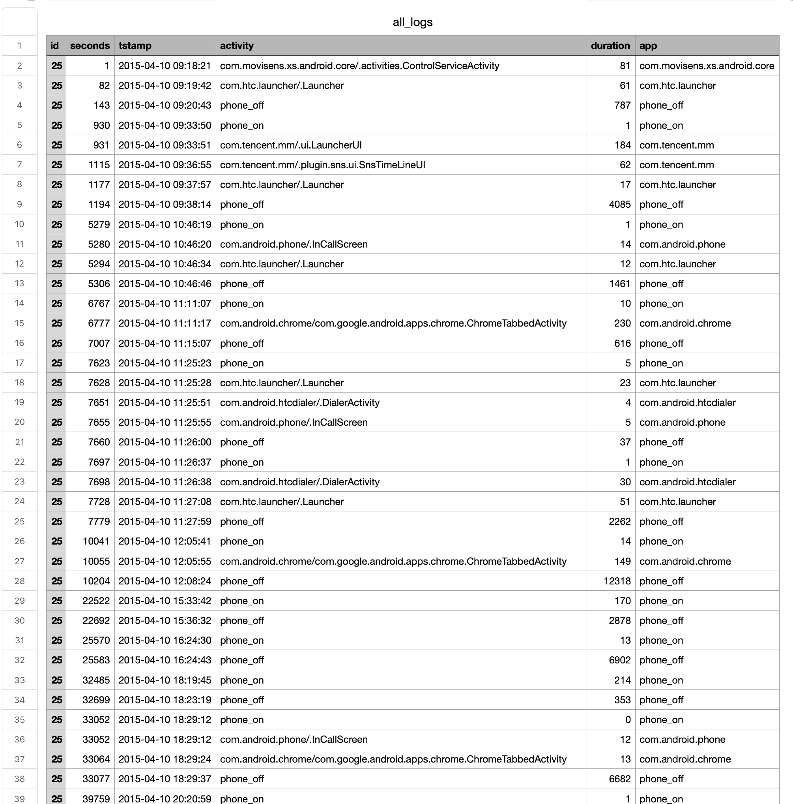
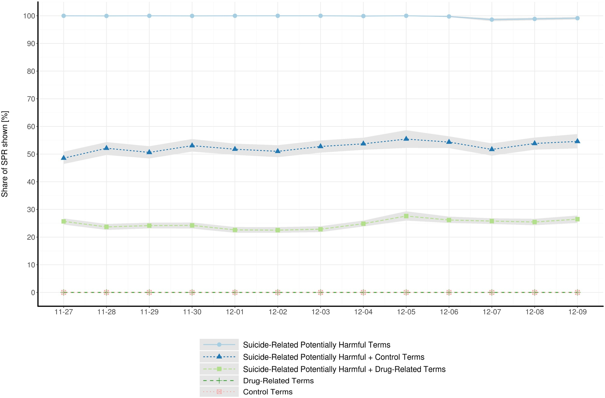
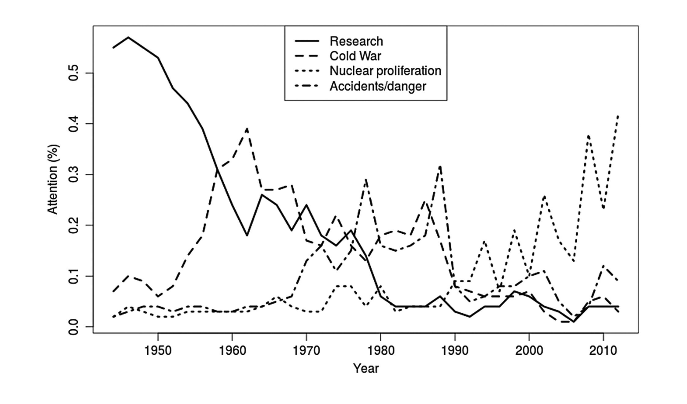
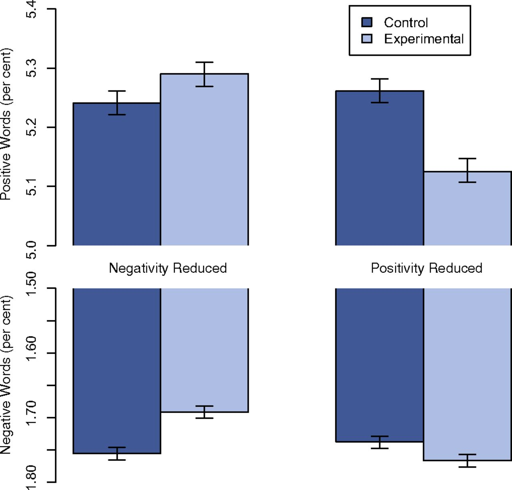

```{r child = 'theme2.rmd'}
```

class: inverse, center, middle

# Welcome!

My name is Philipp Masur, I am an Assistant Professor at the Department of Communication Science. 


---

# Content of this lecture

<br>

**1.** What is computational social science?

**2.** Computational communication science

**3.** Formalities of the course

**4.** Learning 'R' for automated text analysis


---

class: inverse, center, middle

# What is computational social science?

...and why should we care?

---

```{css echo=FALSE}
.pull-left2 {
  float: left;
  width: 30%;
}
.pull-right2 {
  float: right;
  width: 60%;
}

.pull-left3 {
  float: left;
  width: 45%;
  padding-right: 5% 
}
.pull-right3 {
  float: right;
  width: 45%;
  padding-left: 5% 
}

.my-one-page-font {
  font-size: 17px;
}
```

# Example: Harnessing surprising sources of information

.pull-left[

- In 2009, Blumenstock and colleagues (2015, Science) wanted to study wealth and poverty in Rwanda. 

- They conducted a survey with a random sample of 1,000 customers of the largest mobile phone provider

- They collected demographics, social, and economic characteristics 

- Traditional social science survey, right?
]

--

.pull-right[

- The authors also had access to complete call records from 1.5 million people

- Combining both data sources, they used the survey data to "train" a machine learning model to predict a person's wealth based on their call records.

- They also estimated the places of residence based on the geographic information embedded in call records. 
]

<br>

_Blumenstock, Cadamura, & On, 2015_

---

# Example: Wealth in Rwanda

.pull-left[

]

.pull-right[

- All together, they were able to produce a high-resolution map of the geographic distribution of wealth (and poverty) in Rwanda.

- Interesting side effect: Results were hard to validate - there were simply no comparable estimates for all geographic areas in Rwanda
]

_Blumenstock, Cadamura, & On, 2015_

---

# Example: Crime prediction

.pull-left2[

<br><br>

_Thompson, 2010_

]

.pull-right2[

- Already years ago, police departments have started to use a system called CRUSH (Criminal Reduction Utilizing Statistical History) 

- It evaluates patterns of past crime incidents and combines it with a range of data including crime reports, offender behavior profiles, or weather forecasts

- This combination of data is then used to predict potential hot spots and allocate resources to areas where particular crimes are most likely to occur.


]


---

# Computational Social Science


- Field of Social Science that uses algorithmic tools and large/unstructured data to understand human/social behavior 

- Computational methods as “microscope”: methods are not the goal, but contribute to theoretical development and/or data generation

- Complements rather than replaces traditional methodologies


---

# Why is this important now?

- In the past, collecting data was **expensive** (surveys, observations...)

- In the digital age, the behaviors of billions of people are **recorded**, **stored**, and therefore **analyzable**

- Every time you click on a website, make a call on your mobile phone, or pay for something with your credit card, a **digital record of your behavior** is created and stored

- Because (meta-)data are a byproduct of people’s everyday actions, they are often called **digital traces**

- Large-scale records of persons or business are often called **big data**.

---

# 10 Characteristics of Big Data

<style>
td {
  font-size: 22px
}
</style>

|  |  Characteristic | Description |
| - | :----------- | :------------------------ | 
| 1 | Big | The scale or volume of some current datasets is often impressive. However, big datasets are not an end in themselves, but they can enable certain kinds of research including the study of rare events, the estimation of heterogeneity, and the detection of small differences |
| 2 | Always-on | Many big data systems are constantly collecting data and thus enable to study unexpected events and allow for real-time measurement  |
| 3 | Nonreactive | Participants are generally not aware that their data are being captured or they have become so accustomed to this data collection that it no longer changes their behavior. |
| 4 | Incomplete | Most big data sources are incomplete, in the sense that they don't have the information that you will want for your research. This is a common feature of data that were created for purposes other than research. |
| 5 | Inaccessible | Data held by companies and governments are difficult for researchers to access. 

_Salganik, 2017, chap. 2.3_

---

# 10 Characteristics of Big Data

|  |  Characteristic | Description |
| - | :----------- | :------------------------ | 
| 6 | Nonrepresentative | Most big datasets are nonetheless not representative of certain populations. Out-of-sample generalizations are hence difficult or impossible. |
| 7 | Drifting | Many big data systems are changing constantly, thus making it difficult to study long-term trends |
| 8 | Algorithmically confounded | Behavior in big data systems is not natural; it is driven by the engineering goals of the systems. |
| 9 | Dirty | Big data often includes a lot of noise (e.g., junk, spam, spurious data points...) |
| 10 | Sensitive | Some of the information that companies and governments have is sensitive. |

<br>

_Salganik, 2017, chap. 2.3_

---

# Example data

.pull-left[

- Smartphone log data (Masur, 2018)

- Incredible detailed log of each person's use

- Big data?
    
    - BIG: Thousands of rows per person, but not many columns
    - ALWAYS-ON: Recorded smartphone use at all times
    - INCOMPLETE: Did not record app use with higher privacy standards (e.g., signal)
    - DIRTY: Depending on what you want to study, lots of noise (e.g., phone on/off)

]


.pull-right[



]


---

# Typical computational research strategies


.pull-left[

### 1. Counting things

In the age of big data, researcher can "count" more than ever (e.g., how often do people use their smartphone per day)

### 2. Forecasting and nowcasting

Big data allow for more accurate predictions both in the present and in the future (e.g., )

]

.pull-right[

### 3. Approximating experiments

Computational methods provide opportunities to conduct "natural experiments" (e.g., check smartphone log data of people who use their smartphone naturally and those who abstain from certain apps, e.g., social media)

]

<br><br>

_Salganik, 2017, chap. 2.4_

---

# Advantages and Disadvantages

- Advantages of Computational Methods
    - Actual behavior vs. self-report
    - Social context vs. lab setting
    - Small N to large N

- Disadvantages of Computational Methods
    - Techniques often complicated
    - Data often proprietary
    - Samples often biased
    - Insufficient metadata 


---

class: inverse, center, middle

# Computational Communication Science

Why computational methods are important for (future) communication research. 

---

# Definition

<br>

> "Computational Communication Science (CCS) is the label applied to the 
> emerging subfield that investigates the use of computational algorithms 
> to gather and analyze big and often semi- or unstructured data sets 
> to develop and test communication science theories" 
>
>_Van Atteveldt & Peng, 2018_

---

# Promises of computational communication research

The recent acceleration in the use of computational methods for communication science is primarily fueled by the confluence of at least three developments:

- vast **amounts of digitally available data**, ranging from social media messages and other digital traces to web archives and newly digitized newspaper and other historical archives

- improved tools to analyze this data, including **network analysis methods** and **automatic text analysis methods** such as supervised **text classification**, **topic modeling**, **word embeddings**, and **syntactic methods**

- powerful and cheap **processing power**, and easy to use **computing infrastructure** for processing these data, including scientific and commercial cloud computing, sharing platforms such as Github and Dataverse, and crowd coding platforms such as Amazon MTurk and Crowdflower

_Van Atteveldt & Peng, 2017_


---

# Example 1: Simulating search queries

- Numbers of drug-overdose deaths have been increasing in the United States

- Google spotlights counselling services as helpful resources when users query for suicide-related search terms

- However, the search engine does so at varying display rates, depending on terms used

- Display rates in the drug-overdose deaths domain are unknown

- Haim and colleagues (2021) emulated suicide-related potentially harmful searches at large scale across the U.S. to explore Google’s response to search queries including or excluding additional drug-related terms

<br>

_Haim, Scherr, & Arendt, 2021_

---

# Simulating behavior and analyzing responses

.pull-left[

- They conducted 215,999 search requests with varying combinations of search terms

- Counseling services were displayed at high rates after suicide-related potentially harmful search queries (e.g., “how to commit suicide”)

- Display rates were substantially lower when drug-related terms, indicative of users’ suicidal overdosing tendencies, were added (e.g., "how to commit suicide fentanyl")
]

.pull-right[

]

_Haim, Scherr, & Arendt, 2021_
---

# Example 2: Analyzing and aggregating news coverage

.pull-left[
- Jacobi and colleagues (2016) analyzed the coverage of nuclear technology from 1945 to the present in the New York Times

- Analysis of 51,528 news stories (headline and lead): Way too much for human coding!

- Used "topic modeling" to extract latent topics and analyzed their occurrence over time
]

.pull-right[

]

_Jacobi, Welbers, & Van Atteveldt, 2016_

---

# Example 3: Analyzing gender representation in TV

- Jürgens and colleagues (2021) investigated gender representations in over ten years of daytime TV programming

- Usually, this would have required hours and hours (!) of manual coding (i.e., watching a hell lot of TV), but they used neural networks to automatically detect gender in shown faces


---

# Underrepresentation of women in German TV

.pull-left[
- Women on average remained underrepresented on TV, with 6.3 million female faces out of 16 million total (estimated proportion .39, 95% CI: .37-.42)

- This strong overall bias was mirrored across specific subsamples (news, sports, advertising...)

<br><br>

_Jürgens, Meltzer, & Scharkow, 2021_
]

.pull-right[

]


---

# Example 4: Information flow in the Dutch Telegramsphere

.pull-left[

- Simon et al., (2022) collected the full messaging history (N = 2,033,661) of 174 Dutch-language public Telegram chats/channels

- Among other things, used advanced topic modeling and network analyses

- Authors found that over time, conspiracy-themed, far-right activist, and COVID-19-sceptical communities dominated the Dutch Telegramsphere of current affairs

- Their findings raise concerns with respect to Telegram’s polarization and radicalization capacity 

]


.pull-right[


]

---


# Ethics of 'Big Data' and Computational Research

.pull-left3[

<p style = "background: #c3dbe6; padding: 10px; height: 8em; ">

700,000 Facebook users were put into an experiment that may have altered their emotions. The participants did not give consent and the study was not subject to third party ethical oversight (Kramer et al., 2014)

</p>

]

.pull-left3[

<p style = "background: #c3dbe6; padding: 10px; height: 8em;">

Researcher scraped students' data from Facebook, merged it with university records, used these data for research and then shared them with other researchers (Wimmer & Lewis, 2010).

</p>

]

--

<br><br><br>

**Question:** Do you think these studies are problematic? If yes, why?

---

# The "Facebook mood manipulation" study

- Massive online experiment (N ~ 700k)

- Main Research Question: Is emotion contagious?

- Experimental groups: positive / negative / control

- Stimulus: Hide (negative / positive / random) messages from FB timeline 

- Measurement / dependent variables: sentiment of posts by user 

<br><br>

_Kramer et al., 2014_

---

# Computational technique: Measuring sentiment

.pull-left[

- LIWC word list (Linguistic Inquiry and Word Count; Pennebaker et al)

    - 406 positive words: e.g., love, nice, sweet, etc.
    
    - 399 negative words (and subcategories): e.g. hurt, ugly, nasty

- Count occurrences of words in both categories, subtract negative from positive

]

.pull-right[


]

---

# Is this good science? Why not?

- What's cool?
    - Potentially interesting research question
    - actual behavior measured as well as self-report measures

- What's not so cool? A lot...
    - No informed consent
    - Not replicable
    - Low internal validity
        - Is sentiment of posts indicative of mood?
        - Does change in sentiment originate in contagion of mood?
    - Low measurement accuracy
        - Are word counts indicative of sentiment?
    - Overt manipulation of people’s life


---
# Ethical problems with computational methods

- More power over participants than in the past

    - Data collection without awareness/consent
    - Manipulation without awareness/consent
    - Data potentially sensitive, individual users identifiable

- Guiding principles

    - **Respect for persons:** Treating people as autonomous and honoring their wishes
    - **Beneficence:** Understanding and improving the risk/benefit profile of a study
    - **Justice:** Risks and benefits should be evenly distributed
    - **Respect for law and public interest**


<br>

_Salganik, 2018, chap. 6_

---

# Challenges of computational communication science

- Simply data-driven research questions might not be theoretically interesting

- Proprietary data threatens accessibility and reproducibility

- ‘Found’ data not always representative, threatening external validity

- Computational method bias and noise threaten accuracy and internal validity 

- Inadequate ethical standards/procedures 


_Van Atteveldt & Peng, 2017_


---

# Preliminary summary

.pull-left2[


]

.pull-right2[

- Computational communication research holds **manifold promises**

- We can harness unusual sources of information and **large amounts of data**, particularly because people constantly leave **digital traces**

- New methods allow to **structure**, **aggregate** and **make sense** of these data and extract meaningful information to study communication behavior and phenomena

- However, computational communication research comes with **ethical challenges** related to consent, privacy, and autonomy of the participants

]

---

class: inverse, center, middle

# Formalities

How this course is going to work?


---

# Teachers

| Dr. Philipp K. Masur |  | Dr. Kaspar Welbers | | Dr. Alberto López Ortega      | | Santiago Gómez-Echeverry | | Emma Diel |
|:---------------------:| -- |:---------------------:|-- |:---------------------:| -- |:---------------------:|-- |:---------------------:|
| | |    | |  ||  || 
| Lecturer & Course Coordinator | | Teacher | | Teacher | | Teacher | | Teacher |


---

# Teaching assistants & R help desk

.pull-left[
### Teaching assistants

Not everything will work at the first time. Because we work with code, tiny mistakes can produce errors. The following teaching assistants will be available during the practical sessions: 

- t.b.a.

]

.pull-right[

### R Help Desk

If you have any further problems related to installing software, running packages or code, or simply an error message you do not understand, you can address the R Help Desk:

**Office Hours:** t.b.a.


]

---

# Learning goals 

After completion of the course, you will…

- know some of the most important (computational) methods to analyze digital communication

- be able to identify data analytical problems, analyze them critically, and find appropriate solutions

- be able to read, understand, and criticize recent communication research

---

# Skills and methods

With regard to the specific methods being taught in R, you will be able to…

- gather, scrape, and import data from different file types, APIs, and websites

- link data from different sources to create new insights

- clean and transform messy data into a tidy data format ready for analysis

- conduct computational text analysis and use machine learning to extract information from textual data

- perform advanced statistical analyses 

---

# Information and Materials

.pull-left[

The major hub for this course is the following website:

- https://masurp.github.io/VU_CADC/

]

.pull-left[

]
---

# Course structure

.pull-left[
### Lectures

- Every Monday from 9:00 to 11.15
- Introduction of research problems and computational solutions

]

.pull-right[
### Practical sessions

- Course will be split in 5 groups
- Practical sessions take place twice a week
- Here, you will learn to run code in RStudio!


]

<br><br>

*Note:* For the time being, all practical sessions are taught **on campus**. Please only join if you don't show any potential Covid-19 symptoms!

---

# Overview of Lectures

<br>

.pull-left[

- **Cycle 1:** Data Wrangling, Data Visualization, and Introduction to Text Analysis

    - Introduction to computational methods
    - Text as data: Introduction to text analysis and dictionary approaches

- **Cycle 2:** Text Analysis and Machine Learning

    - Automated text analysis: Supervised machine learning approaches
    - Automated text analysis: Unsupervised machine learning approaches
    
]

.pull-right[

- **Cycle 3:** Specialization and Group Projects

    - In this circle, we offer online resources for a range of additional methods and approaches
    - Your task is to develop an independent research project and apply these methods

]

---

# Overview of practical sessions

.pull-left[

- **Cycle 1:** Data Wrangling And Data Visualization

    - Introduction to R
    - Tidyverse 
    - Data visualization
    - Basics of text analysis
    - Dictionary approaches

- **Cycle 2:** Text Analysis and Machine Learning

    - Supervised text analysis
    - Unsupervised text analysis
    
]

.pull-right[

- **Cycle 3:** Specialization and Group Projects

    - In this cycle, the practical sessions will be used to discuss your project with one of the teachers

]

---

# Attendance

- Attendance during the regular lectures is not compulsory but highly recommended. 

- Attendance of the practical sessions is mandatory. 

- One absence from one of the workgroup sessions, for serious health, family, or work reasons, can be excused if the instructor is advised in advance.  


---

# Exam

After the first two cycles, there will be a written exam (**40% of the final grade**):

- The exam will consist of ~35 multiple choice questions and ~6 open-ended questions

- Exam questions will be based on all material discussed in the first two cycles, including lecture content, class materials, and required readings

- Example questions will be provided throughout the course

- Please register for the exam via VUweb


---

# Homework

After each week, students are required to hand in a “homework”, which represents a practical application of some of the taught analysis methods (e.g. with a new data set, specific research question) pass (**30% of the final grade**):

- Each week’s assignment requires students to apply the methods they have learned to a new data set

- Students will receive an RMarkdown template for their code and the respective data set(s)

- Students are required to hand in the RMarkdown file and a compiled html on Tuesday (24:00) the week after. All homework assignments must be submitted to pass. 

---

# Group presentation

In the third cycle, students will be assigned to small working groups in which they independently conduct a research project. A final presentation will be graded per group (**30% of the final grade**).

- A 10-minute talk (including appropriate slides) in which you:
    - introduce the research project (1-2 slides)
    - describe theory and hypotheses (1 slide)
    - explain the methods (1 slide)
    - present the results (2 slides)
    - discuss the findings (1-2 slides)

Students are required to hand in the slides and analyses beforehand (Deadline: 18th of December 2021 at 12:00). 

---
class: inverse, center, middle

# The trouble with 'R'

"This is was already difficult in P1!"

---

# What is 'R'?

.pull-left[

```{r, echo = F}
set.seed(100)
```


```{r plot1, message = F, warning = F, eval = F}
# Load package
library(ggplot2)

# Create vector
variable <- rnorm(100, 2, 4)

# Plot Histogram
ggplot(NULL, 
       aes(variable)) + 
  geom_histogram(color = "white", 
                 fill = "lightblue")
```

]

.pull-right[

```{r plot-label-out1, ref.label="plot1", echo=FALSE}


```

]

---


# What is 'R' vs 'RStudio'?

### Basics

- R is a programming language, not just a software for statistical analyses
- Yet, primarily developed for conducting statistical analyses
- Open source (free of cost!)


### Infrastructure

- R is the programming language
- R shares some similarities with Python, S and Scheme
- RStudio is the software that is mostly used

---

# Advantages of R

### The future of scientific data analysis

- R is international and interdisciplinary
- Constant development and improvement by a huge online community
- Allows to work with complex and messy data structures

### Flexibility

- There are thousand additional packages for almost any statistical procedure
- Allows for flexible programming and is adaptive to own needs
- Encourages replicible analyses

---

# Advantages of R

.pull-left2[
### Visualization

- Allows to produce publication-ready figures and visualizations
- Allows to combine analyses and writing to produces diverse output formats (e.g., these slides)

]

--

.pull-right2[

```{r, echo = F, fig.height = 6, fig.width = 10}
# Libraries
library(tidyverse)
library(hrbrthemes)
library(viridis)
library(gridExtra)
library(ggrepel)

# The dataset is provided in the gapminder library
library(gapminder)
data <- gapminder %>% filter(year=="2007") %>% dplyr::select(-year)

# Show a bubbleplot
data %>%
  mutate(pop=pop/1000000) %>%
  arrange(desc(pop)) %>%
  mutate(country = factor(country, country)) %>%
  ggplot( aes(x=gdpPercap, y=lifeExp, size = pop, color = continent)) +
    geom_point(alpha=0.7) +
    scale_size(range = c(1.4, 19), name="Population (M)") +
    scale_color_viridis(discrete=TRUE) +
    theme_ipsum() +
    labs(color = "Continent")
```

]
---

# Conclusion

### R allows...

- flexible and comprehensive programming
- complex data management
- advanced analyses with large or messy data (text analysis!)
- to produce publication-ready figures and documents

### R encourages...

- reproducable and comprehensible analyses
- us to have fun with programming and coding!

--

### So let's have fun with it!

---

class: inverse, center, middle

# Thank you for your attention!


---

# Required Reading

<br><br>

Kramer, A. D. I., Guillory, J. E, & Hancock, J. (2014). Experimental Evidence of Massive-Scale Emotional Contagion Through Social Networks. Proceedings of the National Academy of Sciences, 111(24), 8788-8790.

Van Atteveldt, W., & Peng, T.-Q. (2018). When communication meets computation: Opportunities, challenges, and pitfalls in computational communication science. Communication Methods and Measures, 12(2-3), 81–92. https://doi.org/10.1080/19312458.2018.1458084


_(available on Canvas)_

---

class: my-one-page-font

# References

- Blumenstock, J. E., Cadamuro, G. , and On, R. (2015). Predicting Poverty and Wealth from Mobile Phone Metadata. Science, 350(6264), 1073–6. https://doi.org/10.1126/science.aac4420.

- Haim, M., Scherr, S., & Arendt, F. (2021). How search engines may help reduce drug-related suicides. Drug and Alcohol Dependence, 226(108874). https://dx.doi.org/10.1016/j.drugalcdep.2021.108874 

- Jacobi,C., van Atteveldt, W. & Welbers, K. (2016) Quantitative analysis of large amounts of journalistic texts using topic modelling. Digital Journalism, 4(1), 89-106, DOI: 10.1080/21670811.2015.1093271

- Jürgens, P., Meltzer, C., & Scharkow, M. (2021, in press). Age and Gender Representation on German TV: A Longitudinal Computational Analysis. Computational Communication Research. 

- Kramer, A. D. I., Guillory, J. E, & Hancock, J. (2014). Experimental Evidence of Massive-Scale Emotional Contagion Through Social Networks. Proceedings of the National Academy of Sciences, 111(24), 8788-8790.

- Salganik, M. J. (2018). Bit by Bit: Social Research in the Digital Age. Princeton University Press.

- Simon, M., Welbers, K., Kroon, A. C. & Trilling, D. (2022). Linked in the dark: A network approach to understanding information flows within the Dutch Telegramsphere. Information, Communication & Society, https://doi.org/10.1080/1369118X.2022.2133549

- Thompson, T. (2010). Crime software may help police predict violent offences. The Observer. Retrieved from https://www.theguardian.com/uk/2010/jul/25/police-software-crime-prediction

- Van Atteveldt, W., & Peng, T.-Q. (2018). When communication meets computation: Opportunities, challenges, and pitfalls in computational communication science. Communication Methods and Measures, 12(2-3), 81–92. https://doi.org/10.1080/19312458.2018.1458084

- Wimmer, A. & Lewis, K., (2010). Beyond and Below Racial Homophily: ERG Models of a Friendship Network Documented on Facebook. American Journal of Sociology, 116(2), 583-642. 

---

# Example Exam Question (Multiple Choice)

Why is the "Facebook Manipulation Study" by Kramer et al. ethically problematic?

A. People did not now that they took part in a study (no informed consent).

B. It overtly manipulated people's emotion.

C. Both A and B are true.

D. The study was not ethically problematic.  

---

# Example Exam Question (Multiple Choice)

Why is the "Facebook Manipulation Study" by Kramer et al. ethically problematic?

A. People did not now that they took part in a study (no informed consent).

B. It overtly manipulated people's emotion.

**C. Both A and B are true.** 

D. The study was not ethically problematic.    

---

# Example Exam Question (Open Format)

Name and explain two characteristics of big data.
<br>
_(4 points, 2 points for correctly naming them and 2 points for correctly explaining them)_

--

1. Big data are often "incomplete": This means they do not have the information that you will want for your research. This is a common feature of data that were created for purposes other than research. For example, log data (e.g., browser history) includes all links a person has visited over time, but does not provide any additional information. More over, it may contain gaps where the software failed or the person purposefully hid his surfing behavior.

2. Big data are often "algorithmically confounded": Behavior in big data systems is not natural; it is driven by the engineering goals of the systems. For example, what you see on a facebook news feed depends on algorithm that Facebook has built into their platform. Behavior of individuals is thus also driven by these system-immanent features. 


