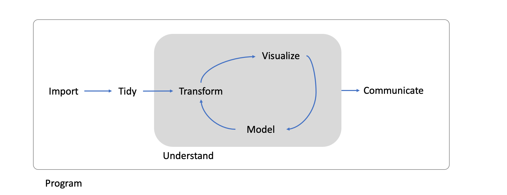
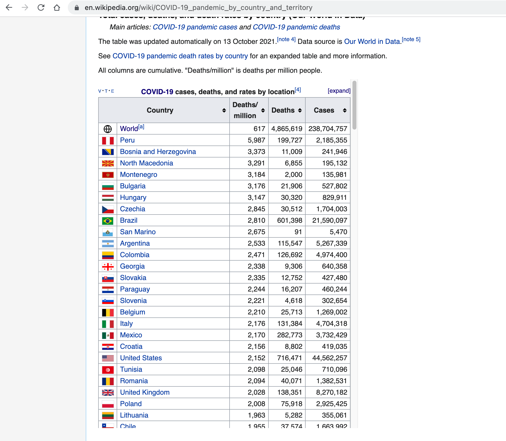
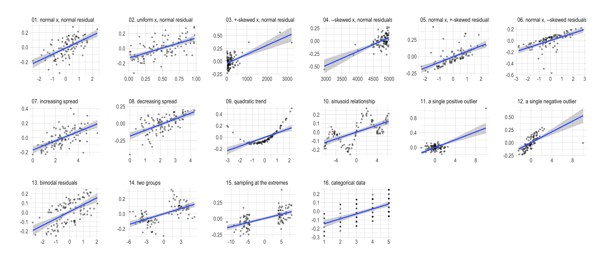
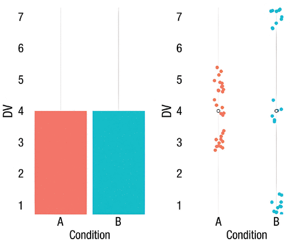
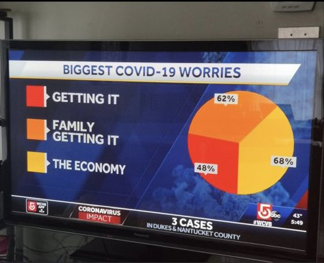
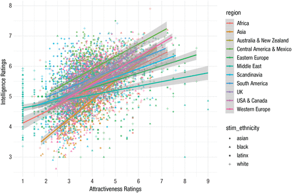
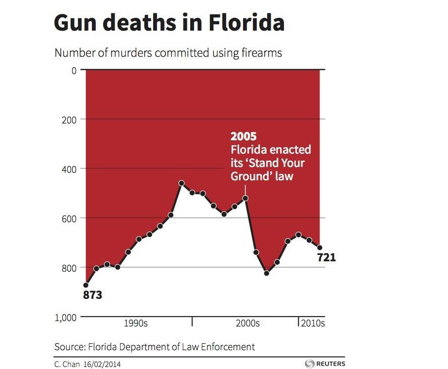
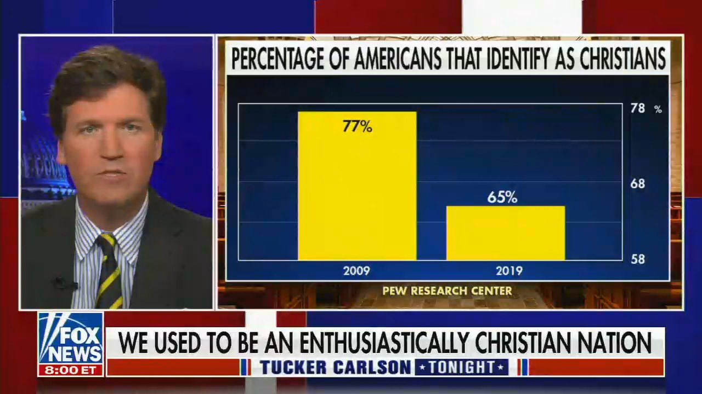
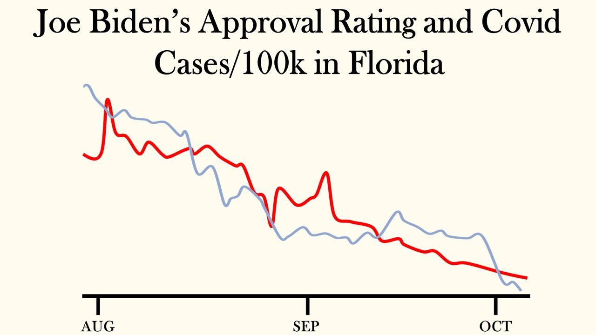
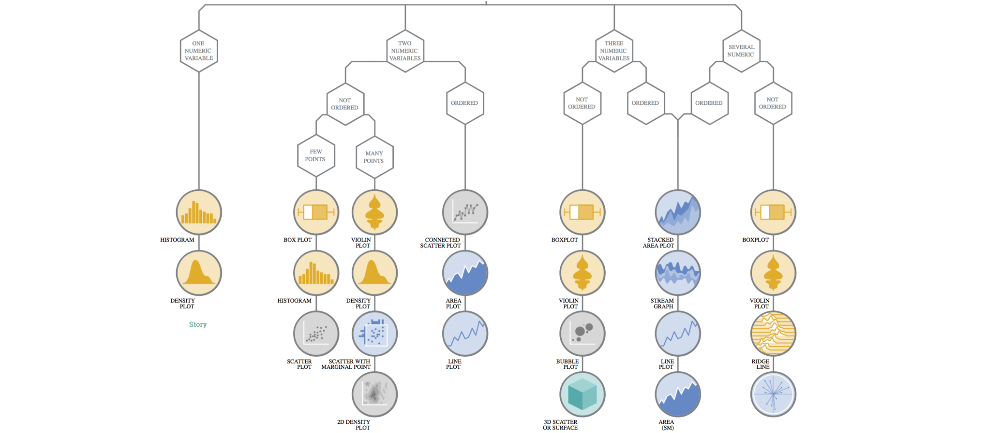

```{r child = 'theme.rmd'}

```


```{css echo=FALSE}
.pull-left2 {
  float: left;
  width: 30%;
}
.pull-right2 {
  float: right;
  width: 60%;
}

.pull-left2b {
  float: left;
  width: 55%;
}
.pull-right2b {
  float: right;
  width: 40%;
}

.pull-left3 {
  float: left;
  width: 45%;
  padding-right: 5% 
}
.pull-right3 {
  float: right;
  width: 45%;
  padding-left: 5% 
}

.my-one-page-font {
  font-size: 17px;
}
```


.pull-left[
```{r, echo = F, fig.height=8.5, fig.width = 6.75}
library(tidyverse)
library(hrbrthemes)
left_join(
  tibble(weeks = rep(c(1:52), times = 100),
         years = rep(c(1:100), each = 52),
         life = c(rep("blue", 52*32+42), rep("white", 3494))),
  tibble(years = c(1:100),
         decades = rep(c("past", "future"), each = 10, times = 5))) %>%
  ggplot(aes(x = weeks, y = years)) +
  geom_point(shape = 15, alpha = .8, aes(color = life)) +
  scale_x_continuous(breaks = seq(0, 52, by = 4)) +
  scale_y_continuous(breaks = seq(0, 100, by = 10)) +
  scale_colour_discrete() +
  geom_point(aes(x = 17, y = 26), shape = 1, size = 3, color = "black") +
  geom_point(aes(x = 25, y = 80), shape = 1, size = 3, color = "blue") +
  geom_point(aes(x = 10, y = 83), shape = 1, size = 3, color = "blue") +
  theme_ipsum() +
  theme(legend.position = "none",
        axis.title.x = element_text(),
        axis.title.y = element_text())  +
  labs(x = "Weeks of the year", y = "Age in years", title = "Life in weeks")
```
]

--

.pull-right[

<br><br>

- Red: My life so far

- Blue circle: Life expectancy for men and women respectively

- Black circle: Einstein publishes his theory of special relativity

- Why is this visualization powerful?

<br><br><br><br>

Idea: https://waitbutwhy.com/2014/05/life-weeks.html
]

---


# Content of this lecture

<br>

**1.** From Raw Data to Tidy Data

**2.** Why we should look at data

**3.** Theories of Perception

**4.** Principles of data visualization

**5.** Examples for different methods


---

class: inverse, center, middle

# From Raw Data to Tidy Data

Preprocessing and Data Wrangling. 

---

# A General Model of Data Science


_see Wickham & Grolemund, 2014_

---

# 1. Importing data

.pull-left[
- Data comes in different forms (two- or multidimensional, text or numbers...) and formats (.csv, .txt, .sav, .stata, .html...)

- Firs, we must hence find a way to import this data into R

- This typically means that you take data stored in a file, database, or web application programming interface (API), and load it into a data frame in R

- Imagine we would have found the following table on wikipedia and would want to get it into R...
]

.pull-right[


]

---

# 1. Importing data: Scraping a webpage

- There is indeed an R-package that can download the entire html and css code of a website

- The resulting object, however, is not really in a tidy format

```{r, echo = F}
library(viridis)
library(hrbrthemes)
```


```{r, R.options = list(width = 80)}
library(tidyverse)
library(rvest)
wikipage <- read_html("https://en.wikipedia.org/wiki/COVID-19_pandemic_by_country_and_territory")
wikipage
```


---

# 2. Tidy

- Tidying your data means storing it in a consistent form that matches the semantics of the dataset with the way it is stored. 

- In brief, when your data is tidy, each column is a variable, and each row is an observation.

```{r, warning = F, messages = F, R.options = list(width = 80)}
tidy_covid <- wikipage %>%
  html_element(xpath = ".//*[contains(@id, 'table65150380')]") %>%   # extracting the right html table
  html_table(fill = T) %>%                                           # transform into a tibble
  dplyr::select(2:5)                                                 # remove unnecessary columns
head(tidy_covid)
```


---

# 3. Transform

```{r, warning = F, message = F, R.options = list(width = 80)}
subset_covid <- tidy_covid %>% 
  mutate(Deaths_million = as.numeric(gsub(",","",`Deaths/million`)),  # transform character into numeric values
         Deaths = as.numeric(gsub(",","", Deaths)),
         Cases = as.numeric(gsub(",","", Cases)),
         Mortality = (Deaths/Cases)*100) %>%                          # estimate mortality
  filter(Country %in% c("United States", "Germany",                   # filter specific countries
                        "Netherlands", "United Kingdom",
                        "Spain", "Italy", "Sweden", "France")) %>%
  mutate(highlight = ifelse(Country == "Germany", 0, 1))
head(subset_covid)
```


---

# 4. Visualization

.pull-left[

```{r plot_covid, eval = F}
ggplot(subset_covid) +
  geom_bar(aes(x = fct_reorder(Country, Mortality), 
               y = Mortality, 
               fill = highlight), 
           stat = "identity") +
  coord_flip() +
  theme_ipsum() +
  theme(legend.position = "none") +
  labs(y = "Mortality (Deaths/Cases)", x = "")
```

]

.pull-right[

```{r plot-label-out1, ref.label="plot_covid", echo=FALSE}

```

]

---

# 4. Visualization
.pull-left[

```{r plot_covid2, eval = F}
ggplot(subset_covid) +
  geom_bar(aes(x = fct_reorder(Country, Deaths_million), 
               y = Deaths_million, 
               fill = highlight), 
           stat = "identity") +
  theme(legend.position = "none") +
  coord_flip() +
  theme_ipsum() +
  theme(legend.position = "none") +
  labs(y = "Deaths per million", x = "")
```

]

.pull-right[

```{r plot-label-out2, ref.label="plot_covid2", echo=FALSE}

```

]

---

# 5. Model 

- Once we have made our research questions sufficiently precise, we can use a model to answer them (remember P1?) 

- Models are a fundamentally mathematical or computational tool, so they generally scale well 

- But every model makes assumptions, and by its very nature a model cannot question its own assumptions. 

---

# 6. Communicate

- A critical part of any data analysis project is "communication"

- It doesn’t matter how well our models and visualisation have led us to understand the data unless we can also communicate your results to others.

- Because of the crucial role of data visualization, we will discuss principles and aspects of it in more detail!

---


class: inverse, center, middle

# Data visualization

Understanding visualizations of data.


---


# Which figure is more informative?

.pull-left[
```{r, echo = F}
library(tidyverse)
d <- tibble(group = LETTERS[1:5],
       perc = c(25, 20, 15, 21, 19))

ggplot(d, aes(x = "", y=perc, fill=group)) +
  geom_bar(stat="identity", width=1) +
  coord_polar("y", start=0) +
  scale_fill_brewer(palette = "Set2") +
  theme_void()
```
]


.pull-right[
```{r, echo = F}
ggplot(d, aes(x = fct_reorder(group, perc), y=perc, fill = group)) +
  geom_bar(stat="identity") +
  theme_minimal() +
  theme(legend.position = "none") +
  scale_fill_brewer(palette = "Set2") +
  labs(x = "", y = "")
```

]
---

# Which figure works better?

```{r, echo = F, fig.height=3, fig.width = 9}
d <- tibble(group = rep(LETTERS[1:4], each = 50),
            y = c(rnorm(50, 3, 7), rnorm(50, 2, 2), rnorm(50, 5, 4), rnorm(50, 5, 6)))

p1 <- ggplot(d, aes(x = group, y = y)) +
  geom_point(alpha = .6) +
  theme_ipsum()

p2 <- ggplot(d, aes(x = group, y = y, color = group)) +
  geom_boxplot() +
  scale_color_brewer(palette = "Set2") +
  theme_ipsum() +
  theme(legend.position = "none")

p3 <- ggplot(d, aes(x = group, y = y, fill = group)) +
  geom_boxplot() +
  geom_jitter(color="black", size=0.7, alpha=0.5,width = .2) +
  scale_fill_brewer(palette = "Set2") +
  theme_ipsum() +
  theme(legend.position = "none")

cowplot::plot_grid(p1, p2, p3, nrow = 1)
```


---

# Which figure tells a better story?

.pull-left[
```{r, echo = F}
library(babynames)
library(viridis)
data <- babynames %>% 
  filter(name %in% c("Mary","Emma", "Ida", "Ashley", "Amanda", "Jessica",    "Patricia", "Linda", "Deborah",   "Dorothy", "Betty", "Helen")) %>%
  filter(sex=="F")

# Plot
data %>%
  ggplot(aes(x=year, y=n, group=name, color=name)) +
    geom_line() +
    scale_color_viridis(discrete = TRUE) +
    theme(
      legend.position="none",
      plot.title = element_text(size=14)) +
    ggtitle("Popularity of names") +
  labs(color = "") +
    theme_ipsum()

```
]

.pull-right[

```{r, echo = F}
data %>%
  mutate(highlight=ifelse(name=="Amanda", "Amanda", "Other")) %>%
  ggplot(aes(x=year, y=n, group=name, color=highlight, size=highlight)) +
    geom_line() +
    scale_color_manual(values = c("#69b3a2", "lightgrey")) +
    scale_size_manual(values=c(1.5,0.6)) +
    theme(legend.position="none") +
    theme_ipsum() +
    geom_label(x=1990, y=55000, label="3550 babies were called\n'Amanda' in 1970", size=3, color="#69b3a2") +
    theme(
      legend.position="none",
      plot.title = element_text(size=14)
)
```

]

---

class: inverse, center, middle

# Why we should look at data.

When data visualization is useful (and when it is not). 

---

# Anscombe's Quartett 

.pull-left[
- This quartett (Anscombe, 1973; Chatterjee & Firat, 2007) presents a good argument for looking at data in visual form. 

- A series of four scatterplots show the relationship between two quantities, such as height and weight, age and income, or time and unemployment.

- Catch: The numerical properties of each pair of x and y variables are identical.

- But when visualized as a scatterplot, plotting the x variables on the horizontal axis and the y variable on the vertical, the differences between them are readily apparent.

_Healy, 2019, chap. 1.1_
]

.pull-right[

```{r, echo = F}
anscombe %>%
  mutate(id = 1:nrow(.)) %>%
  gather(key, value, -id) %>%
  separate(key, c("var", "type"), sep = 1) %>%
  pivot_wider(names_from = var, values_from = value) %>%
  ggplot(aes(x = x, y = y)) +
  geom_point() +
  geom_smooth(se = F, method = "lm") +
  facet_wrap(~type) +
  theme_bw() +
  labs(x = "x values", y = "y values")
```

]

---
# Visualization helps to identify problems in data


_(Figure adapted from code by Jan Vanhove: "http://janhove.github.io/RCode/plot_r.R")_

---

class: inverse, center, middle

# Perception and visual decoding

How we perceive the world. 

---

# Edges, Contrast, and Colors

.pull-left[
- Looking at figures means looking at lines, shapes, and colors

- But due to our visual systems, some things are easier for us to see than others

- Sometimes, we perceive differences where there actually none

]


.pull-right[


]

_Adelson's check illusion_
---

# Contrast

.pull-left2b[

- Herman Grid Effect

- Ghostly blobs seem to appear at the intersections in the grid but only as long as one is not looking at them directly

- Our visual system is attracted to edges, and we assess contrast and brightness in terms of relative rather than absolute values

<br>

_Healy, 2019, chap. 1.3.2_

]


.pull-right2b[

]


---

# Preattentive perception


_Healy, 2019, chap. 1.3.2_

---

# Visual decoding

- In the 1980s, Cleveland and McGill conducted some experiments identifying and ranking theses tasks for different types of graphics


- Participatns were asked to estimate two values within a chart (e.g., two bars in a bar chart, or two slices of a pie chart), or compare values between charts (e.g. two areas in adjacent stacked bar charts).

_Cleveland & McGill, 1984, 1987_

---

# Visual decoding task results

.pull-left2b[

- performance declined as we move away from comparison on a common scale to length-based comparisons to angles and finally areas

- Area comparisons perform even worse than the often criticized pie chart!


_Healy, 2019, chap. 1.3.2_

]


.pull-right2b[


]

---
class: inverse, center, middle

# Principles of Data Visualization

Some guidelines to work with

---

# Some words of caution

- As we've seen, some visualizations are better than others

- But the process of making a really good or really useful figure cannot be boiled down to a list of simple rules

- Even though guidelines exists (and we will discuss them), they should not be followed in all circumstances

- Some visualizations work well because they depend in part on some strong aesthetic judgments about what will be effective, but that sort of good judgment is hard to systematize

- However, data visualization is not simply a matter of competing standards of good taste

- Some approaches work better for reasons that have to do more to do with how human visual perception works.

<br>

_Healy, 2019, chap. 1_

---

# "Tell the truth" and "Show as much data as possible"

.pull-left[

]

.pull-right[

- these two principles were advocated by Edward Tufte (1983), a pioneer in data visualization

- like any descriptive statistic, data visualization is a *simplification* of your data and they can mask meaningful underlying variation

- to the extent that you include more fine-grained information, you can better convey the actual patterns within your data

]

_Hehman & Xie, 2021_

---

# Tell the truth

.pull-left[

]

.pull-left[

- Graphs and figures should **always** be based on real data


]
---

# Keep it simple - minimalism

.pull-left[

- Overwhelmingly complex figures impede the overarching goal of science communication: to convey information clearly!

- Signal-to-noise ratio: signal is the information being conveyed and noise is anything else

- Features not conveying information or allowing readers to assess the patterns more easily should be removed (e.g., excessive grid lines, unncessary colorization...) 
]

.pull-right[


]

_Hehman & Xie, 2021_

---
# Don't inverse charts

.pull-left[

]

.pull-right[

- Inversing is problematic because the figure thereby becomes counter-intuitive

- On first impression, it looks like that the "Stand your ground"-Law enactement reduced the number of gun deaths. Yet, the opposite is true!

]

---

# Don't truncate chart axes

.pull-left[

- Truncating a chart axis refers to showing only a small part of the entire axis

- Here, we see only values between 58% and 78%

- The difference would look less strong, if the axis would range from 0 to 100%

]


.pull-right[

]

---

# Don't truncate chart axes

.pull-left[
```{r, echo = F}
tibble(time = c(2016:2021),
       perc = c(72, 67, 71, 76, 78, 75)) %>%
  ggplot(aes(x = time, y = perc)) +
  geom_point(size = 4, color = "#405e8f") +
  geom_line(group = 1, size = 2, color = "#405e8f") +
  ylim(65, 80) +
  theme_ipsum()
```
]

.pull-right[
```{r, echo = F}
tibble(time = c(2016:2021),
       perc = c(72, 67, 71, 76, 78, 75)) %>%
  ggplot(aes(x = time, y = perc)) +
  geom_smooth(method = "lm", linetype = "dashed", se = F, color = "red", size = .8) +
  geom_point(size = 4, color = "#405e8f") +
  geom_line(group = 1, size = 2, color = "#405e8f") +
  
  ylim(0, 100) +
  theme_ipsum()
```

]

---

# Find the right aspect ratio


---

# Maximize the data-ink ratio

.pull-left[
```{r, echo = F}
ggplot(mpg, 
       aes(manufacturer)) +
  geom_bar(aes(fill = class), 
           width = 0.5) + 
  scale_fill_brewer(palette = "Blues") +
  theme_classic() +
  theme(axis.text.x = element_text(angle = 45, 
                                   vjust = 0.6)) +
  labs(title = "Amount of classes per manufacturer")
```
]

.pull-right[
```{r, echo = F}
ggplot(mpg, 
       aes(manufacturer)) +
  geom_bar(aes(fill = class), 
           width = 0.5) + 
  scale_fill_brewer(palette = "Blues") +
  ggthemes::theme_economist() +
  theme(axis.text.x = element_text(angle = 45, 
                                   vjust = 0.6)) +
  labs(title = "Amount of classes per manufacturer")
```

]

---

# Be clear about uncertainty

```{r, echo = F, fig.height=4, fig.width = 12}
set.seed(42)
d <- tibble(x = rnorm(100, 0, 1),
            y = -0.75*x + rnorm(100, 0, 3))

p1 <- ggplot(d, aes(x, y)) +
  geom_smooth(method = "lm", se = F) +
  ylim(-10, 10) +
  theme_ipsum()
p2 <- ggplot(d, aes(x, y)) +
  geom_point(alpha = .5) +
  geom_smooth(method = "lm", se = F) +
  ylim(-10, 10) +
  theme_ipsum()
p3 <- ggplot(d, aes(x, y)) +
  geom_point(alpha = .5) +
  geom_smooth(method = "lm") +
  ylim(-10, 10) +
  theme_ipsum()

cowplot::plot_grid(p1, p2, p3, nrow = 1, align = "v")
```


---
# Uncertainty

.pull-right2[


_UCAR - Center for Science Education: https://scied.ucar.edu/learning-zone/climate-change-impacts/predictions-future-global-climate_

]

---

# The issue with "embellishment"

.pull-left[


]

.pull-right[

```{r, echo = F}
tibble(time = as.factor(seq(1972, 1982, by = 2)),
       cost = c(60, 80, 125, 200, 245, 300)) %>%
  ggplot(aes(x = time, y = cost)) +
  geom_bar(stat = "identity", fill = "#7a425a") +
  theme_ipsum() +
  ggtitle("Total House and Senat\ncampagin expenditures") +
  labs(x = "", "Costs (in million $)")
```

]

_Monstrous Costs by Nigel Holmes_

---

# Embellishment

- Generally speaking, we want to make a graph as clear as possible

- Embellishment can be distracting and deceiving

- However, it may increase recall 

- If done right, it can help to gain attention and increase recall!

---

# Label your figure correctly

.pull-left[

- Always include axes

- Always label axes

- Provide a meaningful title

- If needed: Provide an explanation for how to read the figure in a note!

]

.pull-right[


]

---

# Conclusion

.pull-left[

**1.** Tell the truth

**2.** Show as much data as possible

**3.** Keep it simple

**4.** Do not inverse charts

**5.** Do not truncate chart axes

]

.pull-right[

**6.** Find the right aspect-ratio

**7.** Maximize data-ink ratio (but not too much!)

**8.** Be clear about uncertainty

**9.** Be careful with embellishment

**10.** Label your axes and figure

]

---

class: inverse, center, middle

# Examples for different methods

What figure works with what method.

---

# Selecting the right kind of chart...


_www.data-to-viz.com_

---

class: inverse, center, middle

# Thank you for your attention!


---

class: my-one-page-font

# References

- Anderson, E.W., Potter, K.C., Matzen, L.E., Shepherd, J.F., Preston, G.A. and Silva, C.T. (2011), A User Study of Visualization Effectiveness Using EEG and Cognitive Load. Computer Graphics Forum, 30: 791-800. https://doi-org.vu-nl.idm.oclc.org/10.1111/j.1467-8659.2011.01928.x

- Anscombe, F. J. (1973). Graphs in statistical analysis. The American Statistician, 27(1), 17–21.

- Cleveland, W. S., & McGill, R. (1984). Graphical perception: Theory, experimentation, and application to the development of graphical methods. Journal of the American Statistical Association, 79, 531–534.

- Cleveland, W. S., & McGill, R. (1987). Graphical perception: The visual decoding of quantitative information on graphical displays of data. Journal of the Royal Statistical Society Series A, 150, 192–229.

- Healy, K. (2019). Data Visualization: A practical Introduction. Princeton University Press. https://socviz.co/

- Hehman, E., & Xie, S. Y. (2021). Doing Better Data Visualization. Advances in Methods and Practices in Psychological Science. https://doi.org/10.1177/25152459211045334

- Tufte, E. R. (1983). The visual display of quantitative information. Graphics Press.

- Wickham, H., Grolemund, G. (2017). R for Data Science. O'Reilly Media https://r4ds.had.co.nz/


