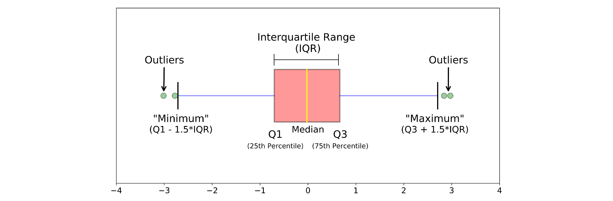
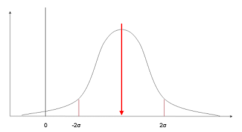
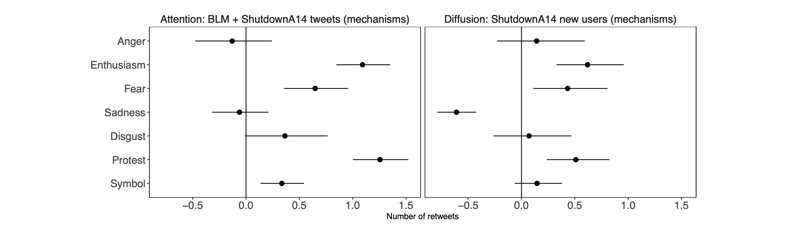
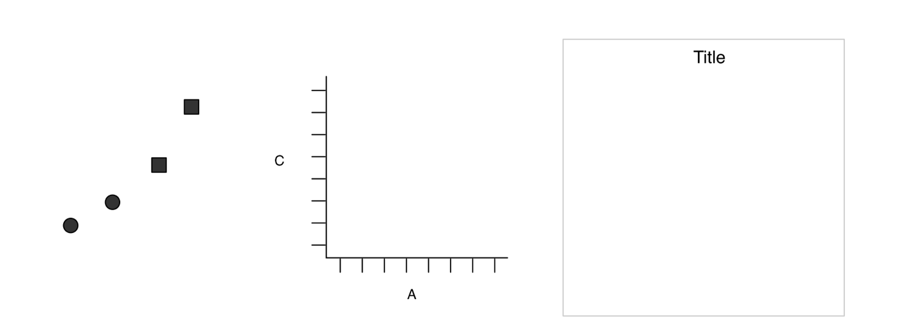
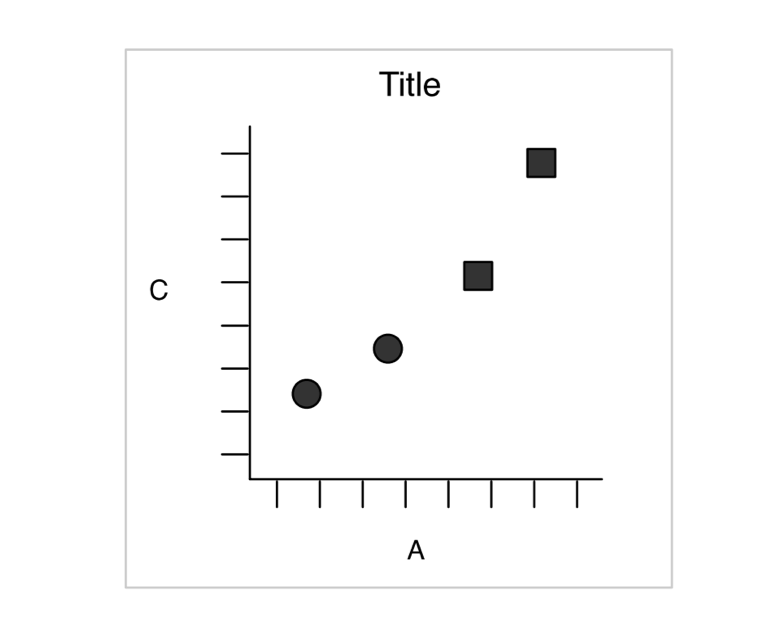

```{r child = 'theme.rmd'}

```


```{css echo=FALSE}
.pull-left2 {
  float: left;
  width: 30%;
}
.pull-right2 {
  float: right;
  width: 60%;
}

.pull-left2b {
  float: left;
  width: 55%;
}
.pull-right2b {
  float: right;
  width: 40%;
}

.pull-left2c {
  float: left;
  width: 65%;
}
.pull-right2c {
  float: right;
  width: 30%;
}

.pull-left3 {
  float: left;
  width: 45%;
  padding-right: 5% 
}
.pull-right3 {
  float: right;
  width: 45%;
  padding-left: 5% 
}

.my-one-page-font {
  font-size: 17px;
}
```


<iframe width="1060" height="715" src="https://www.youtube.com/embed/cq2zuE3ISYU" title="YouTube video player" frameborder="0" allow="accelerometer; autoplay; clipboard-write; encrypted-media; gyroscope; picture-in-picture" allowfullscreen></iframe>


---

.pull-left[
```{r, echo = F, fig.height=8.5, fig.width = 6.75}
library(tidyverse)
library(hrbrthemes)
left_join(
  tibble(weeks = rep(c(1:52), times = 100),
         years = rep(c(1:100), each = 52),
         life = c(rep("blue", 52*32+42), rep("white", 3494))),
  tibble(years = c(1:100),
         decades = rep(c("past", "future"), each = 10, times = 5))) %>%
  ggplot(aes(x = weeks, y = years)) +
  geom_point(shape = 15, alpha = .8, aes(color = life)) +
  scale_x_continuous(breaks = seq(0, 52, by = 4)) +
  scale_y_continuous(breaks = seq(0, 100, by = 10)) +
  scale_colour_manual(values = c("#1E5480", "#90BBDE")) +
  geom_point(aes(x = 17, y = 26), shape = 1, size = 3, color = "#B94949") +
  geom_point(aes(x = 25, y = 80), shape = 1, size = 3, color = "#1E5480") +
  geom_point(aes(x = 10, y = 83), shape = 1, size = 3, color = "#1E5480") +
  theme_ipsum() +
  theme(legend.position = "none",
        axis.title.x = element_text(),
        axis.title.y = element_text())  +
  labs(x = "Weeks of the year", y = "Age in years", title = "Life in weeks")
```
]

--

.pull-right[

<br><br>

- Dark blue squares: My life until now

- Blue circles: Life expectancy on the Netherlands for men and women respectively

- Red circle: Einstein publishes his theory of special relativity

---

- Why is this visualization powerful?

<br><br><br><br>

_Idea: https://waitbutwhy.com/2014/05/life-weeks.html_
]

---

class: inverse, center, middle

# Problem: How to transform data to produce good visualizations?


---
# Content of this lecture

<br>

**1.** From raw data to tidy Data

**2.** Why we should look at data

**3.** Visualization examples for different methods

**4.** Theories of Perception

**5.** Principles of data visualization


---

class: inverse, center, middle

# From Raw Data to Tidy Data

Preprocessing and Data Wrangling. 

---

# A General Model of Data Science


_see Wickham & Grolemund, 2014_

---

# 1. Importing data

.pull-left[
- Data comes in different forms (two- or multidimensional, text or numbers...) and formats (.csv, .txt, .sav, .stata, .html...)

- First, we must find a way to import this data into R

- This typically means that you take data stored in a file, database, or web application programming interface (API), and load it into a data frame in R

- Imagine we would have found the following table on wikipedia and would want to get it into R...
]

.pull-right[


]

---

# 1. Importing data: Scraping a webpage

- There is indeed an R-package that can download the entire html and css code of a website

- The resulting object, however, is not really in a tidy format

```{r, echo = F}
library(viridis)
library(hrbrthemes)
```


```{r, R.options = list(width = 80)}
library(tidyverse)
library(rvest)
wikipage <- read_html("https://en.wikipedia.org/wiki/COVID-19_pandemic_by_country_and_territory")
wikipage
```


---

# 2. Tidy

- Tidying your data means storing it in a consistent form that matches the semantics of the data set with the way it is stored. 

- In brief, when your data is tidy, each column is a variable, and each row is an observation.

```{r, warning = F, messages = F, R.options = list(width = 80)}
tidy_covid <- wikipage %>%
  html_element(xpath = ".//*[contains(@id, 'table65150380')]") %>%   # extracting the right html table
  html_table(fill = T) %>%                                           # transform into a tibble
  dplyr::select(2:5)                                                 # remove unnecessary columns
head(tidy_covid)
```


---

# 3. Transform

```{r, warning = F, message = F, R.options = list(width = 80)}
subset_covid <- tidy_covid %>% 
  mutate(Deaths_million = as.numeric(gsub(",","",`Deathsper million`)),  # transform character into numeric values
         Deaths = as.numeric(gsub(",","", Deaths)),
         Cases = as.numeric(gsub(",","", Cases)),
         Mortality = (Deaths/Cases)*100) %>%                          # estimate mortality
  filter(Country %in% c("United States", "Germany",                   # filter specific countries
                        "Netherlands", "United Kingdom",
                        "Spain", "Italy", "Sweden", "France")) %>%
  mutate(highlight = ifelse(Country == "Germany", 0, 1))
head(subset_covid)
```


---

# 4. Visualization

.pull-left[

```{r plot_covid, eval = F}
ggplot(subset_covid) +
  geom_bar(aes(x = fct_reorder(Country, Mortality), 
               y = Mortality, 
               fill = highlight), 
           stat = "identity") +
  coord_flip() +
  theme_ipsum() +
  theme(legend.position = "none") +
  labs(y = "Mortality (Deaths/Cases)", x = "")
```

]

.pull-right[

```{r plot-label-out1, ref.label="plot_covid", echo=FALSE}

```

]

---

# 4. Visualization
.pull-left[

```{r plot_covid2, eval = F}
ggplot(subset_covid) +
  geom_bar(aes(x = fct_reorder(Country, Deaths_million), 
               y = Deaths_million, 
               fill = highlight), 
           stat = "identity") +
  theme(legend.position = "none") +
  coord_flip() +
  theme_ipsum() +
  theme(legend.position = "none") +
  labs(y = "Deaths per million", x = "")
```

]

.pull-right[

```{r plot-label-out2, ref.label="plot_covid2", echo=FALSE}

```

]

---

# 5. Model 

- Once we have made our research questions sufficiently precise, we can use a model to answer them (remember P1?) 

- Models are a fundamentally mathematical or computational tool, so they generally scale well 

- But every model makes assumptions, and by its very nature a model cannot question its own assumptions 


---

# 6. Communicate

- A critical part of any data analysis project is "communication"

- It does not matter how well our models and visualizations have led us to understand the data unless we can also communicate your results to others

- Because of the crucial role of data visualization, we will discuss principles and aspects of it in more detail

---

class: inverse, center, middle

# Why we should look at data!

When data visualization is useful (and when it is not). 

---

# Anscombe's Quartett 

.pull-left[
- This quartett (Anscombe, 1973; Chatterjee & Firat, 2007) presents a good argument for looking at data in visual form

- A series of four scatterplots show the relationship between two quantities, such as height and weight, age and income, or time and unemployment

- Catch: The numerical properties of each pair of x and y variables are identical

- But when visualized as a scatterplot, plotting the x variables on the horizontal axis and the y variable on the vertical, the differences between them are readily apparent

_Healy, 2019, chap. 1.1_
]

.pull-right[

```{r, echo = F}
anscombe %>%
  mutate(id = 1:nrow(.)) %>%
  gather(key, value, -id) %>%
  separate(key, c("var", "type"), sep = 1) %>%
  pivot_wider(names_from = var, values_from = value) %>%
  ggplot(aes(x = x, y = y)) +
  geom_point() +
  geom_smooth(se = F, method = "lm") +
  facet_wrap(~type) +
  theme_bw() +
  labs(x = "x values", y = "y values")
```

]

---
# Visualization helps to identify problems in data


_(Adapted from Jan Vanhove: "http://janhove.github.io/RCode/plot_r.R")_

---

# Spotting outliers and non-normal distributions

.pull-left[
```{r, echo = F}
x <- rnorm(75, 2, 1)
ggplot(NULL, aes(x = x)) +
  geom_histogram(bins = 10, color = "white", fill = "#69b3a2") +
  theme_ipsum()
```

]

.pull-right[
```{r, echo = F}
x <- rnorm(75, 2, 1)
x[10:12] <- 7
x[13] <- 8
ggplot(NULL, aes(x = x)) +
  geom_histogram(bins = 10, color = "white", fill = "#69b3a2") +
  theme_ipsum()
```

]

---

# Type of distributions in data


```{r, echo = F, fig.width = 12, fig.height=5.5}
set.seed(42)
tibble(normal = rnorm(1000, 5, 2),
       bimodal = rnorm(1000, c(-5, 5), 2),
       uniform = runif(1000, 5, 7),
       skewed = rbeta(1000,5,2)) %>%
  gather(key, value) %>%
  ggplot(aes(x = value)) +
  geom_histogram(bins = 35, color = "white", fill = "#69b3a2") +
  facet_wrap(~key, nrow = 2, scales = "free") +
  theme_ipsum()

```


---

class: inverse, center, middle

# Examples for different methods

What figure works with what method?

---

# Selecting the right kind of chart...


_www.data-to-viz.com_


---

# One numeric variable: Histogram or Density

.pull-left[
```{r, echo = F}
# Load dataset from github
data <- read.table("https://raw.githubusercontent.com/holtzy/data_to_viz/master/Example_dataset/1_OneNum.csv", header=TRUE)

# Make the histogram
data %>%
  filter(price<300 ) %>%
  ggplot(aes(x=price)) +
    geom_histogram(breaks=seq(0,300,10), fill="#69b3a2", color="white", alpha=0.9) +
    ggtitle("Night price distribution of Airbnb appartements") +
    theme_ipsum()
```

]

.pull-right[

```{r, echo = F}
data %>%
  filter(price<300) %>%
  ggplot(aes(x=price)) +
    geom_density(breaks=seq(0,300,10), fill="#69b3a2", alpha=0.5) +
    ggtitle("Night price distribution of Airbnb appartements") +
    theme_ipsum()
```

]

---

# Histogram: Summary

- Histograms demonstrate how many of a certain type of variable occur within a specific range

- The variable is cut into several bins, and the number of observation per bin is represented by the height of the bar

- They thus are an accurate graphical representation of the distribution of *numeric* data

--

### When to use?

- When the underlying variable is numerical

- When you want to see the shape of the data's distribution, especially when determining whether the variable is normally distributed


---

# Group differences: Boxplots

.pull-left[
```{r, echo = F}
data <- data.frame(
  name=c( rep("A",500), rep("B",500), rep("B",500), rep("C",20), rep('D', 100)  ),
  value=c( rnorm(500, 10, 5), rnorm(500, 13, 1), rnorm(500, 18, 1), rnorm(20, 25, 4), rnorm(100, 12, 1) )
)

# Plot
data %>%
  ggplot( aes(x=name, y=value, fill=name)) +
    geom_boxplot() +
    scale_fill_brewer(palette = "Dark2") +
    theme_ipsum() +
    theme(
      legend.position="none",
      plot.title = element_text(size=11)
    ) +
    ggtitle("A typical boxplot") +
    xlab("")
```

]


.pull-right[

```{r, echo = F}
data %>%
  ggplot( aes(x=name, y=value, fill=name)) +
    geom_boxplot() +
  geom_jitter(alpha = .2, size = .75) +
    scale_fill_brewer(palette = "Dark2") +
    theme_ipsum() +
    theme(
      legend.position="none",
      plot.title = element_text(size=11)
    ) +
    ggtitle("A better boxplot?") +
    xlab("")
```


]
---

# Boxplot explained


<br>

_Image Source: https://towardsdatascience.com/understanding-boxplots-5e2df7bcbd51_

---

# Boxplot: Summary

- A boxplot gives a summary of one or more numeric variables (including median, interquartile range, extremes, and outliers)

- It thereby provides a visual representation of a distribution without showing the raw data

- Often used to show group differences

--

## When to use?

- When the independent variable is categorical and the dependent variable is numerical

- To highlight differences without loosing too much information (e.g., variance in the data)

- Very important first step to understand the raw data (helps to spot problems)


---
# Group differences: Bar charts with errorbars


```{r, echo = F}
d <- tibble(group = rep(c("Experimental group", "Control group"), 100),
       outcome = rnorm(200, c(3, 4), c(4, 5)))
```

.pull-left[
```{r, echo = F}
d %>%
  group_by(group) %>%
  summarize(m = mean(outcome),
            se = psych::describe(outcome)$se,
            ll = m - 1.96*se,
            ul = m + 1.96*se) %>%
  ggplot(aes(x = group, y = m, ymin = ll, ymax = ul, fill = group)) +
  geom_bar(stat = "identity") +
  geom_errorbar(width=.2, position=position_dodge(.9)) +
  ylim(0, 7) +
  theme_ipsum() +
  labs(x = "", y = "outcome") +
  theme(legend.position = "none")
```

]

.pull-right[
```{r, echo = F}
d %>%
  group_by(group) %>%
  summarize(m = mean(outcome),
            se = psych::describe(outcome)$se,
            ll = m - 1.96*se,
            ul = m + 1.96*se) %>%
  ggplot(aes(x = group, y = m, ymin = ll, ymax = ul, fill = group, group = 1)) +
  geom_line() +
  geom_errorbar(width=.1, position=position_dodge(.9)) +
  geom_point(shape=21, size=3, fill="white") +
  ylim(0, 7) +
  theme_ipsum() +
  labs(x = "", y = "outcome")
```

]

---

# Short reminder: Whast is a 95% confidence interval?


.pull-left2[



]

.pull-right2[

- Confidence intervals are often used as an alternative to standard null-hypothesis testing (i.e., the p-value)

- Confidence intervals describe the range of possible values for an unknown parameter (e.g., a population mean)

- Depending on the level of significance, we call it a (1-alpha)% confidence interval

- In this case, if we would run the experiment again with random samples from the population, 95% of the times, we would find a mean that lies within this range
]

---

# Bar chart with CIs: Summary

- In most experimental research, we want to visualize differences between groups (e.g., an experimental and a control group)

- A simply bar chart can highlight these difference by comparing the height of the bars

- Adding 95% confidence intervals provides a visual representation of the significance test (i.e., when the intervals of two groups do not overlap, the difference can be considered statistically significant)


--

### When to use?

- When the independent variable is categorical and the dependent variable is numerical

- To highlight differences between groups (despite loosing some information)

- To visualize statistical signficance


---

# Relationships: Regression vs. Scatterplot


.pull-left2[

```{r, echo = F}
# Load dataset from github
data <- read.table("https://raw.githubusercontent.com/holtzy/data_to_viz/master/Example_dataset/2_TwoNum.csv", header=T, sep=",") %>% dplyr::select(GrLivArea, SalePrice) %>% as_tibble

data
```

]

.pull-right2[

```{r, R.options = list(width = 80)}
# Linear regression model
m <- summary(lm(SalePrice/1000 ~ GrLivArea, data))
round(m$coef, 2)
```

]

---

# Scatterplot with regression line

.pull-left[
```{r, echo = F}
# plot
data %>% 
  ggplot( aes(x=GrLivArea, y=SalePrice/1000)) +
    geom_point(color="#69b3a2", alpha=0.8) +
    ggtitle("Ground living area partially explains sale price of apartments") +
    theme_ipsum() +
    theme(
      plot.title = element_text(size=12)
    ) +
    ylab('Sale price (k$)') +
    xlab('Ground living area')
```

]

.pull-right[

```{r, echo = F}
data %>% 
  ggplot( aes(x=GrLivArea, y=SalePrice/1000)) +
    geom_point(color="#69b3a2", alpha=0.8, size = .7) +
    geom_smooth(linetype = "dashed", color = "black") +
    geom_smooth(method = "lm", color = "red", se = F) +
    ggtitle("Ground living area partially explains sale price of apartments") +
    theme_ipsum() +
    theme(
      plot.title = element_text(size=12)
    ) +
    ylab('Sale price (k$)') +
    xlab('Ground living area')
```

]

---

# Scatterplot: Summary

- A scatterplot displays the relationship between 2 numeric variables

- For each data point, the value of its first variable is represented on the X axis, the second on the Y axis

--

### When to use?

- A scatterplot is mostly used to study the relationship between 2 variables. It is thus often accompanied by a correlation or regression coefficient calculation, thattries to estimate the size of a linear relationship.

- However, this visualization can be used to detect other types of relationships (e.g., curvilinear, exponential...; see Ancombe's Quartett)

- Visualizing relationships can be a very helpful tool during the data analysis (e.g., to spot problems)

---

# Time series: Line plot

```{r, echo = F, fig.height = 4, fig.width = 10}
# Load dataset from github
data <- read.table("https://raw.githubusercontent.com/holtzy/data_to_viz/master/Example_dataset/3_TwoNumOrdered.csv", header=T)
data$date <- as.Date(data$date)

# plot
data %>%
  ggplot( aes(x=date, y=value)) +
    geom_line(color="#69b3a2") +
    ggtitle("Evolution of Bitcoin price") +
    ylab("bitcoin price ($)") +
    theme_ipsum()
```

---

# Line plot: Summary

- A line chart or line graph displays the evolution of one or several numeric variables

- Data points are connected by a straight line 

- It is similar to a scatter plot except that the measurement points are ordered (typically by their x-axis value)

--

### When to use?

- A line chart is often used to visualize a trend in data over intervals of time (a time series)


---

# Visualizing results: Coefficient plots





_Casas & Williams, 2019_

---

# Coefficient plots: Summary

- A so-called coefficient plots visualizes results of (regression) models by plotting the estimate (point) and its confidence intervals (line around point)

- It often helps to reduce the complexity of a regression table and highlight differences between predictors


--

### When to use?

- To visualize complex model results 

- To highlight differences across predictors (e.g., whether predictor is stronger than another)

---

# Multiple groups: Facetting

```{r, echo = F, fig.height=6, fig.width = 18}

library(gapminder)
p <- ggplot(data = gapminder, mapping = aes(x = year, y = lifeExp))
p + geom_line(color="gray70", aes(group = country)) +
    geom_smooth(size = 1.1, method = "loess", se = FALSE) +
    facet_wrap(~ continent, ncol = 5) +
    labs(x = "Year",
         y = "Life Expectancy",
         title = "Life Expectancy on Five Continents") +
  theme_ipsum()
```

---

# Facetted plots: Summary

- Sometimes data may be hierarchical, i.e., units are nested within groups

- In such cases, it can be meaningful to plot so-called "facets", that is the same representation of e.g., a relationship across several groups

--

### When to use?

- To highlight differences between higher-level groups (e.g., countries in continents, pupils in schools, articles in newspapers,...)

---


class: inverse, center, middle

# Data visualization

Understanding representations of data.


---


# Which figure is more informative?

.pull-left[
```{r, echo = F}
library(tidyverse)
d <- tibble(group = LETTERS[1:5],
       perc = c(25, 20, 15, 21, 19))

ggplot(d, aes(x = "", y=perc, fill=group)) +
  geom_bar(stat="identity", width=1) +
  coord_polar("y", start=0) +
  scale_fill_brewer(palette = "Set2") +
  theme_void()
```
]


.pull-right[
```{r, echo = F}
ggplot(d, aes(x = fct_reorder(group, perc), y=perc, fill = group)) +
  geom_bar(stat="identity") +
  theme_minimal() +
  theme(legend.position = "none") +
  scale_fill_brewer(palette = "Set2") +
  labs(x = "", y = "")
```

]
---

# Which figure works better?

```{r, echo = F, fig.height=3, fig.width = 9}
d <- tibble(group = rep(LETTERS[1:4], each = 50),
            y = c(rnorm(50, 3, 7), rnorm(50, 2, 2), rnorm(50, 5, 4), rnorm(50, 5, 6)))

p1 <- ggplot(d, aes(x = group, y = y)) +
  geom_point(alpha = .6) +
  theme_ipsum()

p2 <- ggplot(d, aes(x = group, y = y, color = group)) +
  geom_boxplot() +
  scale_color_brewer(palette = "Set2") +
  theme_ipsum() +
  theme(legend.position = "none")

p3 <- ggplot(d, aes(x = group, y = y, fill = group)) +
  geom_boxplot() +
  geom_jitter(color="black", size=0.7, alpha=0.5,width = .2) +
  scale_fill_brewer(palette = "Set2") +
  theme_ipsum() +
  theme(legend.position = "none")

cowplot::plot_grid(p1, p2, p3, nrow = 1)
```


---

# Which figure tells a better story?

.pull-left[
```{r, echo = F}
library(babynames)
library(viridis)
data <- babynames %>% 
  filter(name %in% c("Mary","Emma", "Ida", "Ashley", "Amanda", "Jessica",    "Patricia", "Linda", "Deborah",   "Dorothy", "Betty", "Helen")) %>%
  filter(sex=="F")

# Plot
data %>%
  ggplot(aes(x=year, y=n, group=name, color=name)) +
    geom_line() +
    scale_color_viridis(discrete = TRUE) +
    theme(
      legend.position="none",
      plot.title = element_text(size=14)) +
    ggtitle("Popularity of names") +
  labs(color = "") +
    theme_ipsum()

```
]

.pull-right[

```{r, echo = F}
data %>%
  mutate(highlight=ifelse(name=="Amanda", "Amanda", "Other")) %>%
  ggplot(aes(x=year, y=n, group=name, color=highlight, size=highlight)) +
    geom_line() +
    scale_color_manual(values = c("#69b3a2", "lightgrey")) +
    scale_size_manual(values=c(1.5,0.6)) +
    theme(legend.position="none") +
    theme_ipsum() +
    geom_label(x=1990, y=55000, label="3550 babies were called\n'Amanda' in 1970", size=3, color="#69b3a2") +
    theme(
      legend.position="none",
      plot.title = element_text(size=14)
)
```

]


---

class: inverse, center, middle

# Perception and visual decoding

How we perceive the world and how this affects understanding. 

---

# Edges, Contrast, and Colors

.pull-left[
- Looking at figures means looking at lines, shapes, and colors

- But due to our visual systems, some things are easier for us to see than others

- Sometimes, we perceive differences where there actually none

]


.pull-right[


]

_Adelson's check illusion_
---

# Contrast

.pull-left2b[

- Herman Grid Effect

- Ghostly blobs seem to appear at the intersections in the grid but only as long as one is not looking at them directly

- Our visual system is attracted to edges, and we assess contrast and brightness in terms of relative rather than absolute values

<br>

_Healy, 2019, chap. 1.3.2_

]


.pull-right2b[

]


---

# Preattentive perception


_Healy, 2019, chap. 1.3.2_

---

# Visual decoding

- In the 1980s, Cleveland and McGill conducted some experiments identifying and ranking theses tasks for different types of graphics


- Participants were asked to estimate two values within a chart (e.g., two bars in a bar chart, or two slices of a pie chart), or compare values between charts (e.g. two areas in adjacent stacked bar charts).

_Cleveland & McGill, 1984, 1987_

---

# Visual decoding task results

.pull-left2b[

- Performance declined as we move away from comparison on a common scale to length-based comparisons to angles and finally areas

- Area comparisons perform even worse than the often criticized pie chart


_Healy, 2019, chap. 1.3.2_

]


.pull-right2b[


]

---
class: inverse, center, middle

# Principles of Data Visualization

Some guidelines to work with. 

---

# Some words of caution

- As we've seen, some visualizations are better than others

- But the process of making a really good or really useful figure cannot be boiled down to a list of simple rules

- Even though guidelines exists (and we will discuss them), they should not be followed in all circumstances

- Some visualizations work well because they depend in part on some strong aesthetic judgments about what will be effective, but that sort of good judgment is hard to systematize

- However, data visualization is not simply a matter of competing standards of good taste

- Some approaches work better for reasons that have to do more to do with how human visual perception works.

<br>

_Healy, 2019, chap. 1_

---

# Show as much data as possible

.pull-left[

]

.pull-right[

- these two principles were advocated by Edward Tufte (1983), a pioneer in data visualization

- like any descriptive statistic, data visualization is a *simplification* of your data and they can mask meaningful underlying variation

- to the extent that you include more fine-grained information, you can better convey the actual patterns within your data

]

_Hehman & Xie, 2021_

---

# Tell the truth

.pull-left[

]

.pull-left[

- Graphs and figures should always be based on real data and should not just be "approximated"

- In the example on the left, the percentages do not correspond to the actual areas in the pie chart

- Even worse: the percentages do not add up to 100%

- We produce figures from data, not data that "roughly" aligns with the data!


]
---

# Keep it simple

.pull-left[

- Overwhelmingly complex figures impede the overarching goal of science communication: to convey information clearly!

- Signal-to-noise ratio: signal is the information being conveyed and noise is anything else

- Features not conveying information or allowing readers to assess the patterns more easily should be removed (e.g., excessive grid lines, unnecessary colorization...) 
]

.pull-right[


]

_Hehman & Xie, 2021_

---
# Don't inverse charts

.pull-left[

]

.pull-right[

- Inversion is problematic because the figure thereby becomes counter-intuitive

- It almost looks like the enactment of the "Stand Your Ground" law lowered gun deaths - the opposite is true!

]

---

# Don't truncate chart axes

.pull-left[

- Truncating a chart axis refers to showing only a small part of the entire axis

- Here, we see only values between 58% and 78%

- The difference would look less strong, if the axis would range from 0 to 100%

]


.pull-right[

]

---

# Don't truncate chart axes

.pull-left[
```{r, echo = F}
tibble(time = c(2016:2021),
       perc = c(72, 67, 71, 76, 78, 75)) %>%
  ggplot(aes(x = time, y = perc)) +
  geom_point(size = 4, color = "#405e8f") +
  geom_line(group = 1, size = 2, color = "#405e8f") +
  ylim(65, 80) +
  theme_ipsum()
```
]

.pull-right[
```{r, echo = F}
tibble(time = c(2016:2021),
       perc = c(72, 67, 71, 76, 78, 75)) %>%
  ggplot(aes(x = time, y = perc)) +
  geom_point(size = 4, color = "#405e8f") +
  geom_line(group = 1, size = 2, color = "#405e8f") +
  ylim(0, 100) +
  theme_ipsum()
```

]

---

# Find the right aspect ratio


_Healy, 2019_

---

# Maximize the data-ink ratio

.pull-left[
```{r, echo = F}
ggplot(mpg, 
       aes(manufacturer)) +
  geom_bar(aes(fill = class), 
           width = 0.5) + 
  scale_fill_brewer(palette = "Blues") +
  theme_classic() +
  theme(axis.text.x = element_text(angle = 45, 
                                   vjust = 0.6)) +
  labs(title = "Amount of classes per manufacturer")
```
]

.pull-right[
```{r, echo = F}
ggplot(mpg, 
       aes(manufacturer)) +
  geom_bar(aes(fill = class), 
           width = 0.5) + 
  scale_fill_brewer(palette = "Blues") +
  ggthemes::theme_economist() +
  theme(axis.text.x = element_text(angle = 45, 
                                   vjust = 0.6)) +
  labs(title = "Amount of classes per manufacturer")
```

]

---

# Be clear about uncertainty

```{r, echo = F, fig.height=4, fig.width = 12}
set.seed(42)
d <- tibble(x = rnorm(100, 0, 1),
            y = -0.75*x + rnorm(100, 0, 3))

p1 <- ggplot(d, aes(x, y)) +
  geom_smooth(method = "lm", se = F) +
  ylim(-10, 10) +
  theme_ipsum()
p2 <- ggplot(d, aes(x, y)) +
  geom_point(alpha = .5) +
  geom_smooth(method = "lm", se = F) +
  ylim(-10, 10) +
  theme_ipsum()
p3 <- ggplot(d, aes(x, y)) +
  geom_point(alpha = .5) +
  geom_smooth(method = "lm") +
  ylim(-10, 10) +
  theme_ipsum()

cowplot::plot_grid(p1, p2, p3, nrow = 1, align = "v")
```


---
# Uncertainty

.pull-left2b[


_UCAR - Center for Science Education_

]

---

# The issue with "embellishment"

.pull-left[


]

.pull-right[

```{r, echo = F}
tibble(time = as.factor(seq(1972, 1982, by = 2)),
       cost = c(60, 80, 125, 200, 245, 300)) %>%
  ggplot(aes(x = time, y = cost)) +
  geom_bar(stat = "identity", fill = "#7a425a") +
  theme_ipsum() +
  ggtitle("Total House and Senat\ncampagin expenditures") +
  labs(x = "", "Costs (in million $)")
```

]

_Monstrous Costs by Nigel Holmes_

---

# Embellishment

- Generally speaking, we want to make a graph as clear as possible

- Embellishment can be distracting and deceiving

- However, it may increase recall 

- If done right, it can help to gain attention and help people to remember the figure

---

# Label your figure correctly

.pull-left2c[

- **title** - a clear short title letting the reader know what they’re looking at
    - e.g., *Relationship between experience and social media literacy by gender*
- **subtitle** - an optional second (smaller font) title giving additional information
    - e.g., *Years 2016-2018*
- **caption** - source attribution for the data
    - e.g., *source: US Department of Labor - www.bls.gov/bls/blswage.htm*
- **axis labels** - clear labels for the x and y axes
    - short but descriptive
    - include units of measurement
        - e.g., *Internet use (minutes per day)*
- **legend** - short informative title and labels
    - e.g., *Male and Female* (not 0 and 1)
- **lines and bars** - label any trend lines, annotation lines, and error bars

_Kabakoff, 2020_

]

.pull-right2c[


]

---

# Conclusion

.pull-left[

**1.** Tell the truth

**2.** Show as much data as possible

**3.** Keep it simple

**4.** Do not inverse charts

**5.** Do not truncate chart axes

]

.pull-right[

**6.** Find the right aspect-ratio

**7.** Maximize data-ink ratio (but not too much!)

**8.** Be clear about uncertainty

**9.** Be careful with embellishment

**10.** Label your axes and figure

]

---

class: inverse, center, middle

# Creating visualization in R

ggplot2: The grammar of Graphics

---

# A Layered Grammar of Graphics



---

# A Layered Grammar of Graphics

.pull-left[

- In R, we mostly use the package **ggplot2** to plot graphs and figures

- It uses a layered grammar of graphics, i.e., each part of a figure (coordinate system, plot annotations, geometrical objects, aesthetics...) are an individual layer that can be added and removed.

- Understanding this grammar is powerful for creating great visualizations


]


.pull-right[


]

---

# Layers

.pull-left[

```{r, echo = F}
# Load dataset from github
data <- read.table("https://raw.githubusercontent.com/holtzy/data_to_viz/master/Example_dataset/2_TwoNum.csv", header=T, sep=",") %>% dplyr::select(GrLivArea, SalePrice)

# plot
p <- data %>% 
  ggplot( aes(x=GrLivArea, y=SalePrice/1000)) 
p
```

]

--

.pull-right[

```{r, echo = F}
p + 
    geom_point()
```

]

---
# Layers

.pull-left[

```{r, echo = F}
p + 
    geom_point(alpha = .5, color="#69b3a2", size = .7) +
    ggtitle("Ground living area partially explains sale price of apartments") +
    ylab('Sale price (k$)') +
    xlab('Ground living area') +
  theme_ipsum() +
  theme(
      plot.title = element_text(size=12)
    ) 


```

]

--

.pull-right[

```{r, echo = F}
p + 
    geom_point(alpha = .5, color="#69b3a2", size = .7) +
  geom_smooth(color = "black") +
    ggtitle("Ground living area partially explains sale price of apartments") +
    ylab('Sale price (k$)') +
    xlab('Ground living area') +
  theme_ipsum() +
  theme(
      plot.title = element_text(size=12)
    ) 
```

]

---

# Conclusion

- Data visualization is a powerful tool

- A lot of times, we can convey insights better in charts or figures

- However, there are many caveats and sometimes a classic results table does the job

- The appropriate graph is always determined by the *type of data* and the *context*/*research question*

- In the next practical session(s), we will learn how to produce nice figures in R!


---

class: inverse, center, middle

# Thank you for your attention!


---

class: my-one-page-font

# References

- Anderson, E.W., Potter, K.C., Matzen, L.E., Shepherd, J.F., Preston, G.A. and Silva, C.T. (2011), A User Study of Visualization Effectiveness Using EEG and Cognitive Load. Computer Graphics Forum, 30: 791-800. https://doi-org.vu-nl.idm.oclc.org/10.1111/j.1467-8659.2011.01928.x

- Anscombe, F. J. (1973). Graphs in statistical analysis. The American Statistician, 27(1), 17–21.

- Casas, A., & Williams, N. W. (2019). Images that matter: Online protests and the mobilizing role of pictures. Political Research Quarterly 72 (2), 360-375. 

- Cleveland, W. S., & McGill, R. (1984). Graphical perception: Theory, experimentation, and application to the development of graphical methods. Journal of the American Statistical Association, 79, 531–534.

- Cleveland, W. S., & McGill, R. (1987). Graphical perception: The visual decoding of quantitative information on graphical displays of data. Journal of the Royal Statistical Society Series A, 150, 192–229.

- Healy, K. (2019). Data Visualization: A practical Introduction. Princeton University Press. https://socviz.co/

- Hehman, E., & Xie, S. Y. (2021). Doing Better Data Visualization. Advances in Methods and Practices in Psychological Science. https://doi.org/10.1177/25152459211045334

- Kabakoff, R. (2020). Data Visualization with R. https://rkabacoff.github.io/datavis/

- Masur, P. K & Scharkow, M. (2016). Disclosure management on social network sites: Individual privacy perceptions and user-directed privacy strategies. Social Media + Society, 2(1), 1-13. https://doi.org/10.1177/2056305116634368


---

class: my-one-page-font

# References

- Sakar, D. (2018). A Comprehensive Guide to the Grammar of Graphics for Effective Visualization of Multi-dimensional Data. https://towardsdatascience.com/a-comprehensive-guide-to-the-grammar-of-graphics-for-effective-visualization-of-multi-dimensional-1f92b4ed4149

- Tufte, E. R. (1983). The visual display of quantitative information. Graphics Press.

- Wickham, H., Grolemund, G. (2017). R for Data Science. O'Reilly Media https://r4ds.had.co.nz/


---

# Example Exam Question (Multiple Choice)

Imagine you have collected data on how much time people spent on Instagram (e.g., in minutes per day) and on their self-esteem (e.g., a personality type questionnaire). You want to estimate the relationship between the two variables and want to make sure that a linear model is the correct choice. What data visualization could help you here?

A. First, one can plot histograms to investigate the variables' distribution. Second, one can test differences in self-esteem with a boxplot. 

B. First, one can plot histograms to investigate the variables' distribution. Second, one can use a scatter plot to assess the linearity of the relationship. 

C. Both of the statements above are correct. 

D. None of the statements above are correct. 

---

# Example Exam Question (Multiple Choice)

Imagine you have collected data on how much time people spent on Instagram (e.g., in minutes per day) and on their self-esteem (e.g., a personality type questionnaire). You want to estimate the relationship between the two variables and want to make sure that a linear model is the correct choice. What data visualization could help you here?

A. First, one can plot histograms to investigate the variables' distribution. Second, one can test differences in self-esteem with a boxplot. 

**B. First, one can plot histograms to investigate the variables' distribution. Second, one can use a scatter plot to assess the linearity of the relationship.**

C. Both of the statements above are correct. 

D. None of the statements above are correct. 

---

# Example Exam Question (Open Format)

.pull-left[
```{r, echo = F, fig.height=4, fig.width = 5}
d <- tibble(group = rep(c("Level 1", "Level 2", "Level 3"), 100),
       outcome = rnorm(300, c(2, 3, 4), c(2, 3, 4)))

d %>%
  group_by(group) %>%
  summarize(m = mean(outcome),
            se = psych::describe(outcome)$se,
            ll = m - 1.96*se,
            ul = m + 1.96*se) %>%
  ggplot(aes(x = group, y = m, ymin = ll, ymax = ul, fill = group, group = 1)) +
  geom_line() +
  geom_errorbar(width=.1, position=position_dodge(.9)) +
  geom_point(shape=21, size=3, fill="white") +
  ylim(0.5, 6) +
  theme_classic() +
  labs(x = "", y = "")
```

]

.pull-right[

The figure on the left shows result from an experiment, in which researchers investigated the impact of increasingly negative articles about a politician on people's attitude towards this politician. What is good and what is bad about the figure? <br>
_(2 points each for explaining weaknesses and strengths of the figure)_


]

---

# Answer


Strengths: Overall, the figure is not too complicated and conveys the results in a clear manner. Most importantly, by including 95% confidence intervals, the authors have conveyed uncertainty around the results and allow readers to assess the significance of the difference between groups (e.g., it seems that Level 3 was significantly different from Level 1, but not from Level 2).

Weaknesses/Issues: The authors did not provide a title for the figure, but more importantly, they did not label the axes. This way, the figure can not be understood without additional information. Further, it is unclear whether the y-axis represents the full attitudinal scale or whether it was truncated. This is problematic because it could potentially over-accentuate the differences between the experimental conditions. A minor suggestion for improvement: The authors could add some grey grid lines which could help to assess the true value of the estimated point differences. 


