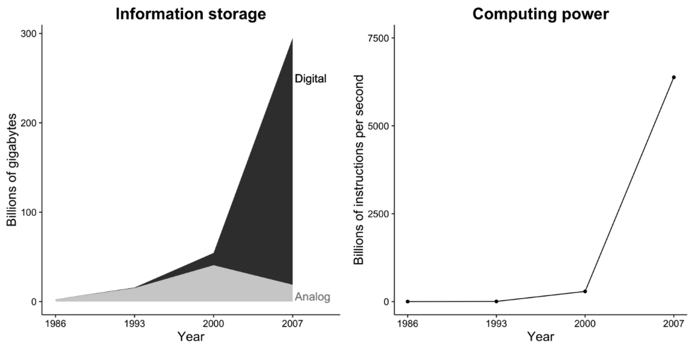
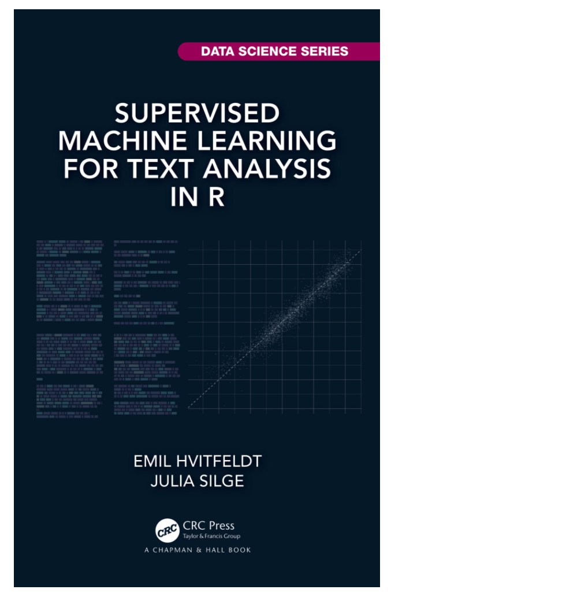
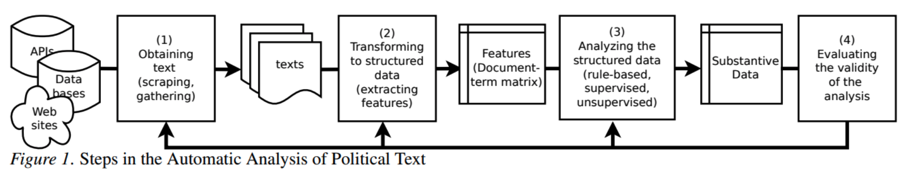

```{r child = 'theme.rmd'}

```


```{css echo=FALSE}
.pull-left2 {
  float: left;
  width: 30%;
}
.pull-right2 {
  float: right;
  width: 60%;
}

.pull-left2b {
  float: left;
  width: 60%;
}
.pull-right2b {
  float: right;
  width: 30%;
}

.pull-left3 {
  float: left;
  width: 45%;
  padding-right: 5% 
}
.pull-right3 {
  float: right;
  width: 45%;
  padding-left: 5% 
}

.my-one-page-font {
  font-size: 17px;
}
```

# Much of what we know about human behavior...

...is based on what people are telling us:

- via self-reports in surveys

- via responses in experimental research

- in qualitative interviews

---

# But a lot of communication content looks like this...


---

# ...or is based on user-generated content...


---

# Increasing amount of (text) data available online



_Hilbert & Lopez, 2011_

---

# Problem or opportunity?

- A lot of communication (except for fleeting face-to-face communication) is encoded in texts

- But text does not look like data we can easily analyze...

.pull-left[

**Experimental data**

```{r, echo = F,  R.options = list(width = 40)}
tibble(id = c(1:100),
       condition = rep(c("A", "B"), 50),
       sns_use = runif(100, min = 1, max = 5),
       well_being = rnorm(100, 2, 3),
       pers1 = runif(100, min = 1, max = 7)) %>%
  head()
```
]

.pull-right[

**Text data**

```{r, echo = F,  R.options = list(width = 40)}
tibble(text = c("North Korea launched a ballistic missile – possibly from a submarine – into the Sea of Japan, South Korea’s military has said, in the latest in a series of tests by Pyongyang over recent weeks.

One ballistic missile was launched about 10:17am local time from the vicinity of Sinpo, South Korea’s joint chiefs of staff said, where North Korea keeps submarines as well as equipment for test firing submarine-launched ballistic missiles (SLBMs).",
"Tributes poured in for former Republican secretary of state Colin Powell after the announcement of his death on Monday morning at the age of 84.

Leading praise from the US and around the world, Joe Biden hailed “a dear friend and patriot of unmatched honor and dignity” on behalf of himself and the first lady, Jill Biden.",
"An Indian couple have arrived for their wedding in unusual style after sailing through the flooded streets of their town in a cooking pot after heavy rains wrecked havoc in the southern state of Kerala.

Footage shared across social media showed the newlyweds squeezed inside the aluminium vessel while two men and a photographer paddled the pair down a submerged street.",
"Unique events that led to civilisation mean its demise could ‘eliminate meaning in galaxy for ever'",
"Billionaire Peter Thiel is facing opposition from New Zealand environmental groups over his plans to build a luxury lodge in Wānaka, an alpine town on the South Island.

A company owned by Thiel had lodged a consent application for a sprawling lodge on his property, which would include a “pod” for the owner himself, water features and meditation space. The consent describes “a series of stand-alone buildings, including a lodge for visitor accommodation for up to 24 guests, accommodation pod for the owner, together with associated lodge management buildings, infrastructure, landscape treatment, water features and meditation space”. The earthworks required to build it would cover over 73,700m² of land.", "In some ways, accounts of “human origins” play a similar role for us today as myth did for ancient Greeks or Polynesians. This is not to cast aspersions on the scientific rigour or value of these accounts. It is simply to observe that the two fulfil somewhat similar functions. If we think on a scale of, say, the last 3m years, there actually was a time when someone, after all, did have to light a fire, cook a meal or perform a marriage ceremony for the first time. We know these things happened. Still, we really don’t know how. It is very difficult to resist the temptation to make up stories about what might have happened: stories which necessarily reflect our own fears, desires, obsessions and concerns. As a result, such distant times can become a vast canvas for the working out of our collective fantasies.")) %>%
  head()
```
]

---

# Traditional content/text analysis

Typical steps in a classic *content/text* analysis:

**1.** Selecting the content one wants to analyze

**2.** Choosing the texts that contain the content and one wants to analyze

**3.** Define the units and categories of analysis

**4.** Develop a set of rules for the manual coding process

**5.** Coding the text according to the rules

**6.** Analyze frequencies, relationships, differences, similarities between units/codes

--

**Problem:** Requires a lot of work and there are always more texts than humans can possibly code manually!

---

# Solution: Automation


<iframe width="760" height="415" src="https://www.youtube.com/embed/DfGs2Y5WJ14?autoplay=1&controls=0&amp;start=19&mute=1" title="YouTube video player" frameborder="0" allow="accelerometer; autoplay; clipboard-write; encrypted-media; gyroscope; picture-in-picture" allowfullscreen></iframe>


---

# Content of this lecture

<br>

**1.** Text as Data

**2.** Automated Text Analysis

**3.** Dictionary Approaches

**4.** Examples from the literature

---

class: inverse, center, middle

# Text as Data

How can we analyze texts with computers?

---

# Definition

.pull-left[
> Text analysis is “a research technique for making replicable and valid inferences from texts (or other meaningful matter) to the contexts of their use” 
>
>Krippendorff, 2004

]

.pull-right2b[


]

---

# What is text?


.pull-left[


]

.pull-right[


]

---

# Symbols and Meaning

- Text or more generally language consists of *symbols*

- Symbols by themselves do not have meaning

- A symbol itself is a mark, sign, or word that indicates, signifies, or is understood as representing an idea, object, or relationship

- Symbols thereby allow people to go beyond what is known or seen by creating linkages between otherwise very different concepts and experiences 

- Text (a collection of symbols) only attains meaning when interpreted (in its context)

- Main challenge in Automatic Text Analysis: Bridge the gap from symbols to meaningful interpretation

---

# Understanding language

<br>


.pull-left2b[

>"As natural language processing (NLP) practitioners, we bring our assumptions about what language is and how language works into the task of creating modeling features from natural language and using those features as inputs to statistical models. This is true even when we don't think about how language works very deeply or when our understanding is unsophisticated or inaccurate; speaking a language is not the same as having an explicit knowledge of how that language works. We can improve our machine learning models for text by heightening that knowledge."
>
>_Hvitfeldt & Silge, 2021_

]

.pull-right2b[


]

---

# A short overview of linguistics

.pull-left[


- Each field studies a *different level* at which language exhibits organization

- When we engage in text analysis, we use these levels of organization to create language features

- They often depend on the morphological characteristics of language, such as when text is broken into sequences of characters

_Hvitfeldt & Silge, 2021, chap. 1_

]

.pull-right[

| Subfield |	What does it focus on? |
|:--------- |:---------|
| Phonetics	      |  Sounds that people use in language |
| Phonology	      |  Systems of sounds in particular languages |
| Morphology	    |  How words are formed |
| Syntax	        |  How sentences are formed from words |
| Semantics	      |  What sentences mean |
| Pragmatics	    |  How language is used in context |

]


---

class: inverse, center, middle

# Automatic Text Analysis

How we can study large quantities of documents and texts?

---

# Steps in Automatic Text Analysis

<br><br>


<br><br>

_van Atteveldt, Welbers, & Van der Velden, 2019_
---

# (1) Obtaining texts

- Publicly available data sets
  - E.g.: Political texts, news from publisher / library
  - Great if you can find it, often not available

- Scraping primary sources
  - E.g.: Press releases from party website, existing archives
  - Writing scrapers can be trivial or very complex depending on web site
  - Make sure to check legal issues

- Proprietary texts from third parties:
  - E.g.: digital archives (LexisNexis, factiva etc.), social media APIs)
  - Often custom format, API restrictions, API changes
  - Terms of use not conducive to research, sharing

---

# (2) From text to data

- Algorithms process numbers, they don’t read text

- First step in any analysis is to convert text to series of numbers

- This is done through a number of steps (also know as preprocessing) which include: 

    - Tokenization 
    - Removing stopwords 
    - Normalization 
    - Frequency trimming

- The resulting structured text is then used to create a document-feature matrix (DTM)

    - Table containing frequency of each word in each document
    - Called “bag of words” -> ignores word order

---

# Text cleaning, stemming, lemmatizing

- Text contains a lot of noise
    - Very uncommon words
    - Spelling, scraping mistakes (HTML code, boilerplate, etc)
    - Stop words (e.g., a, the, I, will)
    - Conjugations of the same word (want, wants)
    - Near synonyms (wants, loves)
    - Of course, what is noise depends on your RQ!

- Cleaning steps needed to reduce noise:
    - Removing unnecessary symbols (e.g., punctuations, numbers...)
    - Removing stopwords (e.g., 'a', 'the'...)
    - Normalization: Stemming (wants -> want) OR lemmatizing (ran -> run)
    - Frequency trimming (removing rare words)
    
---


# Tokenization

- We take an input (a string) and a token type (a meaningful unit of text, such as a word) and we split the input (string) into pieces (tokens) that correspond to the type (e.g., word) 

```{r, R.options = list(width = 120)}
library(quanteda)
text <- "This is an Example of Preprocessing Techniques. This is what happens during the preprocessing procedure!1!"
text
```

--

```{r, R.options = list(width = 120)}
toks <- tokens(text, remove_punct = TRUE, remove_numbers = TRUE) # tokenize into unigrams, remove punctuation
toks
```

_Manning, Raghavan, and Schütze 2008_

---

# Types of Tokens

- Thinking of a token as a **word** is a useful start (and mostly used approach -> bag-of-words approach)

- However, we can generalize the idea of a token beyond only a single word to other units of text:

    - characters
    - words
    - sentences
    - lines
    - paragraphs, and
    - n-grams

<br><br>

_Hvitfeldt & Silge, 2021, chap. 2.2_

---

# Removing stopwords

- Once we have split text into tokens, it often becomes clear that not all words carry the same amount of information

- Common words that carry little (or perhaps no) meaningful information are called **stop words** (e.g., 'a', 'the', 'didn't', 'of'...)

- It is common advice and practice to remove stop words for various text analysis tasks, but stop word removal is more nuanced than many resources may lead you to believe


```{r, R.options = list(width = 80)}
# removing stopwords
toks <- tokens_remove(toks, stopwords("en"))
toks
```

_Hvitfeldt & Silge, 2021, chap. 2.2_

---

# Normalization

- Before we move to the more sophisticated normalization, including stemming or lemmatizing, we need to align similar words. 

- R does differ between lower and upper case letters. We hence need to transfrom to lower case to make words comparable. 

```{r, R.options = list(width = 80)}
toks <- tokens_tolower(toks) # lowercasing
toks
```

---

# Stemming

- What if we aren’t interested in the difference between e.g., "trees" and "tree" and we want to treat both together? 

- Stemming refers to the process of identifying the base word (or stem) for a data set of words and is thus concerned with the linguistics subfield of morphology (i.e., how words are formed). 

```{r, R.options = list(width = 80)}
toks # original tokens
```

--

```{r, R.options = list(width = 80)}
final_toks <- tokens_wordstem(toks) 
final_toks # after stemming
```

---

# Lemmatization

- Instead of using set rules to cut words down to their stems, lemmatization uses knowledge about a language's structure to reduce words down to their lemmas, the canonical or dictionary forms of words

- Lemmatizers often use a rich lexical database like 'WordNet' as a way to look up word meanings for a given part-of-speech use (Miller 1995)


```{r, R.options = list(width = 80)}
toks # original tokens
```

--

```{r, R.options = list(width = 80)}
# Lemmatization
tokens_replace(toks, pattern = lexicon::hash_lemmas$token, replacement = lexicon::hash_lemmas$lemma)
```


---

# Document-term matrix or document-feature matrix

- Finally, we create a representation 

- Refers to a mathematical matrix that describes the frequency of terms that occur in a collection of documents

- In a document-term matrix, rows correspond to documents in the collection and columns correspond to terms.

```{r, R.options = list(width = 80)}
dtm <- dfm(final_toks)
dtm
```

---

# Word frequencies

```{r, echo = F}
library(quanteda.textplots)
textplot_wordcloud(dfm(toks), min_count = 1)
```


---

# (3) Analyzing the structured data

.pull-left[
- Rule-based analyses 
    - Assigns meaning by researcher
    - “if word X occurs, the text means Y”
    
- Supervised machine learning (will be discussed in the next lecture)
    - Train a model on coded training examples
    - Generalizes meaning in human coding of training material
    - “Text X is like other texts that were negative, so X is probably negative”
]

--
.pull-right[
- Unsupervised machine learning (will be an optional method in cycle 3)
    - Find clusters of words that co-occur
    - Meaning is assigned afterwards by researcher interpretation
    - “These words form a pattern, which I think means X”
]

_Boumans & Trilling, 2016_

---

# (4) Evaluating the validity of the analysis

- Many text analysis processes are 'black boxes'
    - even manual coding, dictionaries are ultimately opaque

- Computer does not 'understand' natural language 

- Need to prove to reader that analysis is valid
    - Validate by comparing to known good (often manual annotation of 'gold standard')

--

- We will talk about different validation approaches when we discuss rule-based and supervised learning methods

---


class: inverse, center, middle

# Dictionary Approaches

Using fixed set of terms per concept to automatically code texts.

---

# Basic idea

.pull-left[

- Dictionaries or lexicons contain a lot of information about links between words and meanings

- This approach makes use if this by counting the number of words that appear in each document that have been assigned a particular meaning or value by the researcher 

- Key idea: if a term from the dictionary occurs, assign it that code

    - E.g. positive = {good, happy, nice}, negative = {bad, stupid, expensive}

]

.pull-right[

]
  

---

```{r, eval = F}
library(tidyverse)
load("slides/data/supercorpus.RData")

dtm <- supercorpus %>%
  tokens() %>%
  tokens_remove(stopwords("en")) %>%
  dfm()

populism.liberalism <- dictionary(
  list(
    populism = c("elit*", "consensus*", "undemocratic*", "referend*", "corrupt*", "propagand", "politici*", "*deceit*", "*deceiv*", "*betray*", "shame*", "scandal*", "truth*", "dishonest*", "establishm*", "ruling*"),
    liberalism = c("liber*", "free*", "indiv*", "open*", "law*", "rules", "order", "rights", "trade", "global", "inter*", "trans*", "minori*", "exchange", "market*")))
populism.liberalism

result = dtm %>% dfm_lookup(populism.liberalism) %>% convert(to = "data.frame") %>% as_tibble
result = result %>% mutate(length=ntoken(dtm))
result %>%
  mutate()
```


---

```{r, eval = F}
populism.liberalism <- dictionary(
  list(
    populism = c("elit*", "consensus*", "undemocratic*", "referend*", "corrupt*", "propagand", "politici*", "*deceit*", "*deceiv*", "*betray*", "shame*", "scandal*", "truth*", "dishonest*", "establishm*", "ruling*"),
    liberalism = c("liber*", "free*", "indiv*", "open*", "law*", "rules", "order", "rights", "trade", "global", "inter*", "trans*", "minori*", "exchange", "market*")))
populism.liberalism
```


```{r, eval = F}
dfm.eu <- dfm(supercorpus, groups = "country", dictionary = populism.liberalism)
meine.dfm.eu.prop <- dfm_weight(meine.dfm.eu, scheme = "prop")
convert(meine.dfm.eu.prop, "data.frame")
```


---
# Advantages and disadvantages

- Fixed set of terms per concept (wildcards, synonyms, conditions, proximity)

- Advantages: 
    - Technically easy
    - Transparent
    - Few resources needed

- Disadvantages:
    - Low validity for non-trivial concepts (sentiment, frames, specific topics)
    - Difficult to create/maintain large dictionaries
    - Can encode biases 

---

class: inverse, center, middle

# Thank you for your attention!


---
class: my-one-page-font

# References

- Boumans, J. W., & Trilling, D. (2016). Taking stock of the toolkit: An overview of relevant automated content analysis approaches and techniques for digital journalism scholars. Digital journalism, 4(1), 8-23.

- Hilbert, M., & López, P. (2011). The World’s Technological Capacity to Store, Communicate, and Compute Information. Science, 332(6025), 60 –65. https://doi.org/10.1126/science.1200970

- Hvitfeld, E. & Silge, J. (2021). Supervised Machine Learning for Text Analysis in R. CRC Press. https://smltar.com/

- Krippendorff, K. (2004). Content Analysis. Sage. 

