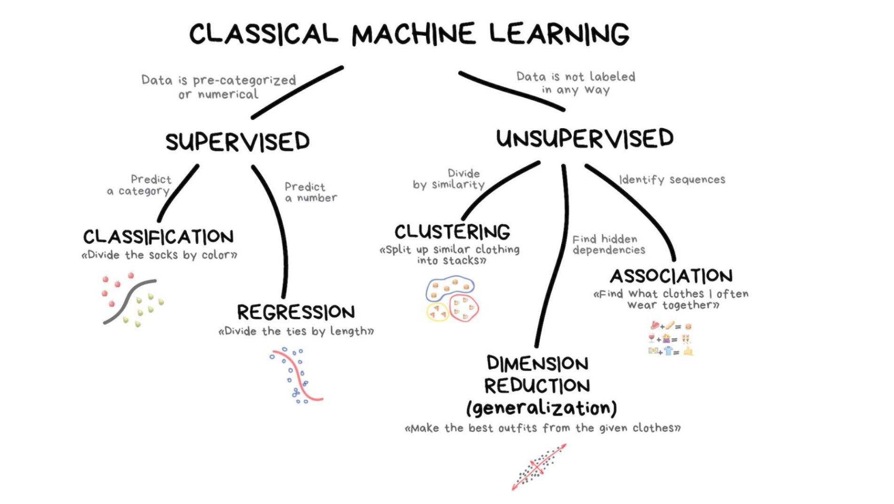
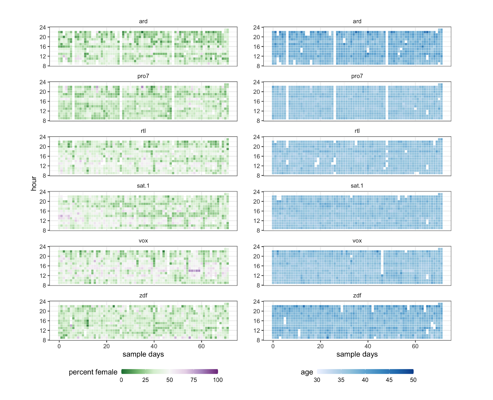

```{r child = 'theme2.rmd'}

```


```{css echo=FALSE}
.pull-left2 {
  float: left;
  width: 30%;
}
.pull-right2 {
  float: right;
  width: 60%;
}

.pull-left2b {
  float: left;
  width: 60%;
}
.pull-right2b {
  float: right;
  width: 30%;
}

.pull-left3 {
  float: left;
  width: 45%;
  padding-right: 5% 
}
.pull-right3 {
  float: right;
  width: 45%;
  padding-left: 5% 
}

.my-one-page-font {
  font-size: 17px;
}
```

# Machine Learning?


---

# So what are we actually talking about?

- Machine learning is the study of computer algorithms that can improve automatically through experience and by the use of data

- Due to the "black box" nature of the algorithm's operations, it is often seen as a form of **artificial intelligence** 

- Machine learning is used in a wide variety of applications, such as in medicine (e.g., pattern detection), email filtering (e.g., spam detection), speech recognition, and computer vision (e.g., face recognition)

- In communication science, we can use these techniques to automate text analysis!

---

# Content of this lecture

**1.** What is machine learning?

**2.** Supervised text classification

- Overview
- Principles
- Validation
- Example: Predicting genre from song lyrics

**3.** Examples from the literature

**4.** Outlook and conclusion

---

class: inverse, center, middle

# What is machine learning?

Differences between supervised and unsupervised approaches.

---

# Deductive vs. inductive approaches

- In the previous lecture, we talked about deductive approaches (e.g., dictionary approaches)

- These are **deterministic** and are based on text theory (e.g., happy -> positive, hate -> negative)

- Yet, natural language is often ambiguous and **probabilistic** coding may be better

- Dictionary-based or generally rule-based approaches are not very similar to manual coding; a human being assesses much more than just a list of words!

- Inductive approaches promise to combine the scalability of automatic coding with the validity of manual coding (supervised learning) or can even code things or relations that we as human beings cannot identify (unsupervised learning)

---



---

.pull-left[

### Supervised learning

- Algorithms build a model based on sample data, known as "training data", in order to make predictions or decisions without being explicitly programmed to do so

- Combines the scalability of automatic coding with the validity of manual coding (requires pre-labeled data to train algorithm)

- Examples:

    - Supervised text classification: extending manual coding to large text corpora, sentiment analysis...
    - Pattern recognition: e.g., face recognition, spam filter,...

]

.pull-right[

### Unsupervised learning

- Algorithm detects clusters, patterns, or associations in data that has not been labeled previously, but researcher needs to interpret results

- Very helpful to make sense of new data (similar to cluster analysis or exploratory factor analysis)

- Examples: 

    - Topic modeling: Extracting topics from unlabeled (text) data
    - Customer segmentation: Better understanding different customer groups around which to build marketing or other business strategies

]

---

class: inverse, center, middle

# Supervised text classification

Training algorithms to make good predictions!

---

# Supervised text classification

We can now use machine learning models to classify text into specific sets of categories. This is known as **supervised learning**. The basic process is:

<br>

--

**1.** Hand-code a small set of documents (say N = 1,000) for whatever variable(s) you care about

--

**2.** Train a machine learning model on the hand-coded data, using the variable as the outcome of interest and the text features of the documents as the predictors

--

**3.** Evaluate the effectiveness of the machine learning model via cross-validation (test it on new data/gold standard)

--

**4.** Once you have trained a model with sufficient predictive accuracy, apply the model to the remaining set of documents that have never been hand-coded (e.g., N = 100,000) or use it in the planned application (e.g., a spam filter detection software)


---

# Procedure


---

# Example: Spam detection


.pull-left2b[

- Say you have two boxes of emails: spam and not spam
      - You want to develop a tool to automatically filter spam messages

- How would you do this if you could only use a dictionary?
      - Compare spam and not spam emails to see which words and word combinations occur a lot in spam  and not in not spam.
      - Downsides: Extremely time consuming and difficult!

- Machine learning solution
      - Transform the emails into data (e.g., DTM) 
      - Let the computer figure out how to compute a probability for whether an email is spam
      - Different ML algorithms figure this out in different ways
      
- The resulting "classifier" can then be integrated in a software tool that can be used to detect spam mails automatically

]

.pull-right2b[


]

---

# General idea

.pull-left[
- Model relation between...
    - Input features 
        - Similar to independent variables in statistics
        - Can be MANY features (e.g., all words in a DTM)
    - Output class
        - Similar to dependent variables
        - Can be categories (e.g., sentiment, topic classification) or continuous (e.g., stock market value)
        
]

.pull-right[

- Similar to ‘normal’ statistical modeling, but...
    - Statistics serves to make inferences about a population (Does X relate to Y?)
        - Doesn't use too many variables to avoid the difficult of interpreting too many parameters
        - Fit model using full data (a sample from the population)
    - Machine learning serves to make generalizable predictions (How to best predict Y?)
        - Use as many variables as you need, and don’t worry about interpretability of parameters
        - Always train (fit) and test (validate) on distinct data
]

---

# Statistical modeling vs. Machine Learning

- Machine learning is thus *similar* to ‘normal’ statistical modeling
      - Learn `f` so you can predict `y` from `x`: `y ~ f(x)`

- Goal of ‘normal’ modeling: explaining/understanding
      - Requires interpretable parameters

- Goal of machine learning: best possible prediction
      - Requires best possible fit

- Machine learning models have often 1000’s of collinear independent variables and can have many latent variables

---

# Advantages and disadvantages of supervised approaches

### Advantages

- independent of language and topic; we only need consistently coded training material

- can be connected to traditional content analysis (same operationalisation, similar criteria in terms of validity and reliability)

- efficient (analysis of very large samples and text corpora possible)

- comparatively simple to integrate


### Disadvantages

- Requires large amounts of (manually) coded training data

- Requires in-depth validation

---

class: inverse, center, middle

# Principles of Supervised Text Classification

How do these algorithms work?

---

# Overview of different algorithms

- There are many different "algorithms" or classifiers that we can use:

  - Naive Bayes
  - Support Vector Machines
  - Logistic regression
  - k-Nearest neighbors
  - ... and many more

- Most of these algorithms have certain hyperparameters that need to be set

  - e.g., learning rate, regularization, structure...

- Unfortunately, there is no good theoretical basis for selecting an algorithm

  - Solution: choose algorithm that performs best

---

# Naive Bayes


.pull-left[
- Computes the prior probability (P) for every category (c = outcome variable) based on the training data set

- Computes the probability of every feature (x) to be a characteristic of the class (c); i.e., the relative frequency of the feature in category

- For every category (c), all feature probabilites (x) are multiplied

- Chooses the class that has highest weighted sum of inputs

- "Naively" assumes that parameters are independent (essentially a linear model, a weighted dictionary)

]

.pull-right[


]

---

# Support vector machines

.pull-left[


]


.pull-right[

- Very often used machine learning method

- Tries to find decision boundary between points

- Maximize margin between classes while minimizing errors

- More formally, a support-vector machine constructs a hyperplane or set of hyperplanes in a high- or infinite-dimensional space, which can be used for classification, regression, or other tasks like outliers detection

]

---

# Logistic regression

.pull-left[

- A simple logistic regression model (as you have learned about in P1) can also be a good way to estimate classes

- In simple words, the dependent variable is binary in nature and coded as either 1 (= class A) or 0 (= is not class A).

- Mathematically, a logistic regression model predicts P(Y=1) as a function of X:

$P(Y) = \frac {1}{1+e^{-(\beta_0 + \beta_1 x)}}$

]

.pull-right[


]

---

# Neural networks

.pull-left2b[

- Inspired by human brain (but abstracted to mathematical model)


- Each ‘neuron’ is a linear model with activation function: 

$y = f(w_1x_1 + … + w_nx_n)$


- Normal activation functions: logistic, linear, block, tanh, …


- Each neuron is practically a generalized linear model

]

.pull-right2b[


]


---

# How to know which performs best?


- Sufficiently complex algorithms can "predict" all training data perfectly

- But such an algorithm does not generalize to new data

- Essentially, we want the model to have a good fit to the data, but we also want it to optimize on things that are specific to the training data set

- Problem of under- vs- overfit

---


```{r, echo = F, fig.width = 10, fig.height = 5.5 }
library(tidyverse)
library(ggthemes)
set.seed(42)
x <- runif(15, 1, 7)
y <- x^3 + rnorm(15, 0, 10)


ggplot(NULL, aes(x = x, y = y)) +
  geom_point() +
  theme_get() +
  labs(title = "Statistical modeling",
       subtitle = "data: y = x^3  + e",
       x = "", y = "") +
  theme(plot.margin = unit(c(0, 3, 0, 3), units = "cm"))
```


---

```{r, echo = F, fig.width = 10, fig.height = 5.5}
ggplot(NULL, aes(x = x, y = y)) +
  geom_point() +
  theme_get() +
  geom_smooth(method = "lm", se = F) +
  labs(title = "Linear fit (underfit)",
       subtitle = "data: y = x^3  + e, linear regression",
       x = "", y = "")+
  theme(plot.margin = unit(c(0, 3, 0, 3), units = "cm"))
```

---

```{r, echo = F, fig.width = 10, fig.height = 5.5}
ggplot(NULL, aes(x = x, y = y)) +
  geom_point() +
  theme_get() +
  stat_smooth(formula = y ~ x^3, se = F) +
  labs(title = "Good fit",
       subtitle = "data: y = x^3  + e, exponential fit",
       x = "", y = "")+
  theme(plot.margin = unit(c(0, 3, 0, 3), units = "cm"))
```

---

```{r, echo = F, fig.width = 10, fig.height = 5.5}
ggplot(NULL, aes(x = x, y = y)) +
  geom_point() +
  theme_get() +
  stat_smooth(method="lm", se = F, formula=y ~ poly(x, 9)) +
  labs(title = "Overfit",
       subtitle = "data: y = x^3  + e, fit with 9-degree polynomial",
       x = "", y = "")+
  theme(plot.margin = unit(c(0, 3, 0, 3), units = "cm"))
```

---

# Preventing overfitting in machine learning

- Regularization

    - When fitting a model, ‘punish’ complexity / flexibility
    
 - Out-of-sample validation detects overfitting
 
    - To see whether a model generalizes to new data, simply test it on new data!
    
- In sum, we need to validate our new classifier

---


class: inverse, center, middle

# Validation

Best practices and processes.

---

# Typical Machine Learning Process: Training vs. Testing

- Always validate on held-out data

- Models (almost) always overfit
    - Performance on training data not a good indicator of real quality
    
- Solution

    - Split data into train and test sets (There are different ways of doing this, like split-half, leave-1-out, or k-fold)
    - Train model on training data
    - Test model on unseen test data
    - We can again estimate accuracy, precision, recall, and F-Score (see last lecture)

--

- So...why don’t we do this with statistics?

    - Less complex models, so less risk of overfitting (but it’s still a risk!)
    - Less focus on prediction 


---

# Example: Predicting music genre from lyrics


- This data is scraped from the "Vagalume" website, so it depends on their storing and sharing millions of song lyrics

- Many different songs, but not all types of music are represented in this data set

```{r, echo = F, R.options = list(width = 120)}
s <- read_csv("data/lyrics-data.csv")
a <- read_csv("data/artists-data.csv")

a <- a %>%
  group_by(Artist) %>%
  filter(row_number()==1) %>%
  rename(ALink = Link)

d <- left_join(s, a) %>%
  unique %>% group_by(SLink) %>%
  filter(row_number() == 1) %>%
  filter(!is.na(Genre))
d
```

---

# Understanding the data set


.pull-left[

- Contains o. a. artist name, song name, lyrics, and genre of the artist (not the song)

- The following genres are in the data set:

    - Rock
    - Hip Hop
    - Pop music
    - Sertanejo (Basically the Brazilian version of Country Music)
    - Funk Carioca (Originated 60s US Funk, a completely different genre in Brazil nowadays)
    - Samba (Typical Brazilian music)
    
]

.pull-right[
```{r, echo = F}
d %>%
  group_by(Genre) %>% 
  tally %>%
  ggplot(aes(x = reorder(Genre, n), y = n, fill = Genre)) +
  geom_col(stat = "identity") +
  scale_fill_brewer(palette = "Pastel2") +
  coord_flip() +
  theme_fivethirtyeight() +
  guides(fill = F) +
  labs(x = "", "number of songs in the data set", y = "number of songs", title = "Songs per Genre")
```
]

---

# How is the data stored and encoded?

```{r, R.options = list(width = 140)}
d %>%
  ungroup %>%
  filter(Artist == "Britney Spears" & SName == "...Baby One More Time") %>%
  select(Artist, SName, Lyric, Genre)


d %>%
  ungroup %>%
  filter(Artist == "Drake" & SName == "God's Plan") %>%
  select(Artist, SName, Lyric, Genre)
```

---

# Note: Dealing with non-determinism

- Many machine learning algorithms are non-deterministic

- Random initial state and/or random parameter improvements
      - Even deterministic algorithm uses random data split

- Problem: research is not replicable, outcome may be affected

- For replicability: set random seed in R: `set.seed(123)`

- For valid outcome: repeat X times and report average performance

---

# Creating a corpus

```{r}
library(quanteda)
library(quanteda.textmodels)
d <- d %>%
  filter(Genre == "Rock" | Genre == "Pop" | Genre == "Hip Hop")

music <- corpus(d, docid_field = "SLink", text_field = "Lyric")
music
```

---

# Splitting the data into a train and a test set


.pull-left2b[

```{r}
# Set seed to insure replicability
set.seed(42)

# Sample rows for testset and create subsets
testset <- sample(docnames(music), nrow(d)/2)
music_test <-  music %>% corpus_subset(docnames(music) %in% testset)
music_train <- music %>% corpus_subset(!docnames(music) %in% testset)

# Define outcome variable for each set
genre_train <- as.factor(docvars(music_train, "Genre"))
genre_test <- as.factor(docvars(music_test, "Genre"))
```

]


.pull-right2b[

- The procedure is always the same 

- Split data into train and test set
    - split-half (what we do here)
    - leave-1-out
    - k-fold

- We store the outcome variable (`Genre`) for each subset

]
---

# Text preprocessing (remember lecture 3?)

.pull-left[

- Step 1: Tokenization (including removing 'noise') and normalization

- Step 2: Removing stop words

- Step 3: Stemming

- Step 4: Create document-feature matrix (DFM)

- Step 5: Remove to short (< 2 characters) and rare words

- (Step 6: Transforms the `dtm` so that words with a high document frequency weight less)

]

.pull-right[

```{r}
dfm_train <- music_train %>% 
  tokens(remove_punct = T, 
         remove_numbers = T, 
         remove_symbols = T) %>%
  tokens_tolower %>%
  tokens_remove(stopwords('en')) %>%
  tokens_wordstem %>%
  dfm %>%
  dfm_select(min_nchar = 2) %>% 
  dfm_trim(min_docfreq=20) %>%
  dfm_tfidf()   # weighting process
```

]
---

# Choose algorithm and train model

```{r, R.options = list(width = 120)}
library(quanteda.textmodels)
m_nb <- textmodel_nb(x = dfm_train, y = genre_train)
summary(m_nb)
```


---

# Predict genre in test set using the algorithm

.pull-left[

- To see how well the model does, we test it on the test data

- For this, it is important that the test data uses the same features (vocabulary) as the training data

- The model contains parameters for these features, not for words that only occur in the test data

- In other words, we have to "match" or "align" the train and test data

    - Same textprocessing
    - Matching of the features

]


.pull-right[
```{r}
# Matching
dfm_test <- music_test %>% 
  tokens(remove_punct = T, 
         remove_numbers = T, 
         remove_symbols = T) %>%
  tokens_remove(stopwords('en')) %>%
  tokens_wordstem %>%
  dfm %>% 
  dfm_match(featnames(dfm_train)) %>% 
  dfm_tfidf()

# Actual prediction
nb_pred <- predict(m_nb, newdata = dfm_test)
head(nb_pred, 2)
```
]

---

# Evaluating the Prediction: Validation of Naive Bayes model

.pull-left[

- As we can see in the confusion matrix, there are a lot of false positives and false negatives!

- **Overall Accuracy**: `r papaja::printnum(mean(nb_pred == genre_test)*100)`%

- Precision, Recall and F1-Score are not too good for each genre
    
    - Precision is slightly better for Rock and Pop,
    - Recall is better for Hip Hop

]

.pull-right[

```{r, echo = F, R.options = list(width = 120)}
library(caret)
cat("--- Confusion Matrix ---")
cm_nb <- confusionMatrix(nb_pred, genre_test)
cm_nb$table
cat("--- Validation Scores ---")
cm_nb$byClass %>%
  as.data.frame %>%
  rownames_to_column("Genre") %>%
  select(Genre, Precision, Recall, F1) %>%
  as.data.frame %>%
  mutate_if(is.numeric, round, 2)

```

]

---

# Different algorithm (SVM) = better results?

```{r, echo = F}
m_svm <- textmodel_svm(x = dfm_train, y = genre_train, type = 2) 
svm_pred <- predict(m_svm, newdata = dfm_test)
cm_svm <- confusionMatrix(svm_pred, genre_test)
```

.pull-left[

- When we refit the model with support vector machines, there are still a lot of false positives and false negatives

- **Overall Accuracy**: `r papaja::printnum(mean(svm_pred == genre_test)*100)`%

- However, Precision, Recall and F1-Score all became better!

]

.pull-right[

```{r, echo = F, R.options = list(width = 120)}
cat("--- Confusion Matrix ---")
cm_svm <- confusionMatrix(svm_pred, genre_test)
cm_svm$table
cat("--- Validation Scores ---")
cm_svm$byClass %>%
  as.data.frame %>%
  rownames_to_column("Genre") %>%
  select(Genre, Precision, Recall, F1) %>%
  as.data.frame %>%
  mutate_if(is.numeric, round, 2)

```

]

---
# Comparison between Naive Bayes and Support Vector Machines

.pull-left[

```{r, echo = F, R.options = list(width = 120)}
cm_nb  <- confusionMatrix(nb_pred,  genre_test, mode = "everything")
cm_svm <- confusionMatrix(svm_pred, genre_test, mode = "everything")

val <- bind_rows(
  cm_nb$byClass %>%
  as.data.frame %>%
  rownames_to_column("Genre") %>%
  as_tibble %>%
  mutate(model = "Naive Bayes"),
  cm_svm$byClass %>%
  as.data.frame %>%
  rownames_to_column("Genre") %>%
  as_tibble %>%
  mutate(model = "SVM")) %>%
  pivot_longer(-c(model, Genre)) %>%
  pivot_wider(names_from = name, values_from = value) %>%
  select(model, Genre, Precision, Recall, F1) %>%
  mutate(Genre = sub("Class: ", "", Genre)) %>%
  as.data.frame
val %>%
  mutate_if(is.numeric, round, 2)
```

]

.pull-right[

- Support vector machines perfom slightly better overall

- Precision, Recall and F1-Score are all better

- Particularly the prediction of "Hip Hop" and "Rock" have improved considerably

]

---

# Visualizing performance

```{r, echo = F, fig.height=3, fig.width = 9}
val %>%
  pivot_longer(Precision:F1) %>%
  ggplot(aes(x = Genre, y = value, fill = model)) +
  geom_bar(stat= "identity", position = "dodge", color = "white") +
  facet_wrap(~name) +
  ylim(0, 1) +
  theme_bw()

```

---

# Drivers of model performance

1. Task difficulty

2. Amount of training data

3. Choice of features (n-grams, lemmata, etc)

4. Text preprocessing (e.g., exclude or include stopwords?)

5. Tuning of algorithm (if required)

---

# What is the effect of text preprocessing on model performance?


---
class: inverse, center, middle

# Examples from the literature

How is this used in research?

---

# Example 1: Validating different approaches

-  Van Atteveldt et al (2021) re-analysised data reported in Boukes et al. (2020) to understanding the validity of different text classification approaches 

- The data incldued news from a total of ten newspapers and five websites published between February 1 and July 7, 2015:

    - three quality newspapers (NRC Handelsblad, Trouw, de Volkskrant)
    - a financial newspaper (Financieel Dagblad)
    - three popular newspapers (Algemeen Dagblad, Metro, De Telegraaf)
    - three regional outlets (Dagblad van het Noorden, de Gelderlander, Noordhollands Dagblad)
    
---

# Methods
    
- They analyzed the paper using different methods and compared the results

    - Gold standard (manual coding by the three authors)
    - Manual coding (1 or 3 coders)
    - Crowd-Coding (1, 3 or 5 coders on a online platform)
    - Sentiment dictionaries (various versions)
    - Different supervised machine learning algorithms (NB, SVM, convolutional neural networks)
    
- Investigating performance results of all models
---

# Main results


---

# So which method is valid?

- Manual coding still outperforms all other approaches

- Supervised text classification (particularly deep learning) is better than dictionary approaches (not too surprising)

- Particularly supervised learning gets better with more training data (more is more!)

- Nonetheless strongly depends on quality of training data

- Recommendation for dictionary: Apply any applicable off-the-shelf dictionaries and if any of these is sufficiently valid as
determined by comparison with the gold standard, use this for the textanalysis

    - dictionaries give very good transparency
    - replicability for a low cost

---

# Example 2: Incivility in Facebook comments

- Study examined the extent and patterns of incivility in the comment sections of 42 US news outlets’ Facebook pages in 2015–2016

- News source outlets included
    
    - National-news outlets (e.g., ABC, CBS, CNN...)
    - Local-new outlets (e.g., The Denver Post, San Francisco Chronicle...)
    - Conservative and liberal partisan news outlets (e.g., Breitbart, The Daily Show...)
    
- Implemented a combination of manual coding and supervised machine learning to code comments with regard to:

    - Civil
    - Interpersonal rudeness
    - Personal rudeness
    - Impersonal extreme incivility
    - Personal extreme civility
    
---

# Results: Incivility over time

.pull-left[
- Despite several discernible spikes, the percentage of extremely uncivil personal comments on national-news outlets’ pages shifted only modestly 

- On conservative outlets’ Facebook pages, the proportions of both extremely uncivil and rude comments fluctuated dramatically across the sampling window

_Su et al., 2018_

]

.pull-left[


]
---

# Overall differences


---
class: inverse, center, middle

# Outlook and Conclusion

---

# Unsupervised machine learning

- A type of machine learning in which the algorithm is not provided with any pre-assigned labels or scores for the training data

- As a result, unsupervised learning algorithms must first self-discover any naturally occurring patterns in that training data set

- The resulting "classes", "patterns", or "groups need to be interpreted by the researcher

- Approach is similar to two statistical approaches:

    - Exploratory factor analysis: Finding similar items to create latent factors
    - Cluster analysis: Finding similar observations to create clusters of similar observations

---

# Example: Topic modelling of 80 years of communication science


- Günther and Domahidi (2017) used unsupervised topic modelling to extract **topics** from 80 years of published communication research (i.e., based on abstracts)

- The data includeed n = 15,172 articles from journals such as Journal of Communication, Communication Research, etc. 


---

# Results: More and more research is published


---

# Deep learning

- Deep learning is part of a broader family of machine learning methods based on artificial neural networks with representation learning

- Learning can again be supervised, semi-supervised or unsupervised.

- Large neural network with many hidden layers
    - Possible because of modern computing power, large training sets
    - Powers e.g. automatic translation, self-driving cars, chess computers, etc

- Originally developed to deal with image recognition, now also adapted for text analysis

- Use words in order, rather than document-level frequencies (allows for word combinations/relations)

---

# Example: TV gender representation


.pull-left[


<br><br><br>
_Jürgens, Meltzer, & Scharkow, 2021_

]


.pull-left[



]


---

# Is machine learning really useful?


.pull-left2b[
- Is it OK to use a model we can’t possibly understand?

- Machine learning in the social sciences generally used to solve an engineering problem

- Output of ML is input for “actual” model (e.g., we classify text, but run classic statistics with the output)]

.pull-right2b[


]
---

# Conclusion


.pull-left2[


]

.pull-right2[
- Machine learning is a useful tool for generalizing from sample

- It is very useful to reduce the amount of manual coding needed

- Many different models exist (each with many parameters/options)

- We always need to validate model on unseen and representative test data!

]
---

class: inverse, center, middle

# Thank you for your attention!

---

# Required Reading

<br><br>

van Atteveldt, W., van der Velden, M. A. C. G., & Boukes, M.. (2021). The Validity of Sentiment Analysis: Comparing Manual Annotation, Crowd-Coding, Dictionary Approaches, and Machine Learning Algorithms. Communication Methods and Measures, (15)2, 121-140, https://doi.org/10.1080/19312458.2020.1869198

Su, L. Y.-F., Xenos, M. A., Rose, K. M., Wirz, C., Scheufele, D. A., & Brossard, D. (2018). Uncivil and personal? Comparing patterns of incivility in comments on the Facebook pages of news outlets. New Media & Society, 20(10), 3678–3699. https://doi.org/10.1177/1461444818757205

<br>

_(available on Canvas)_


---

class: my-one-page-font

# References

- Boumans, J. W., & Trilling, D. (2016). Taking stock of the toolkit: An overview of relevant automated content analysis approaches and techniques for digital journalism scholars. Digital journalism, 4(1), 8-23.

- Günther, E. , & Domahidi, E. (2017). What Communication Scholars Write About:
An Analysis of 80 Years of Research in High-Impact Journals. International Journal of Communication 11(2017), 3051–3071

- Hvitfeld, E. & Silge, J. (2021). Supervised Machine Learning for Text Analysis in R. CRC Press. https://smltar.com/

- Jürgens, P., Meltzer, C., & Scharkow, M. (2021, in press). Age and Gender Representation on German TV: A Longitudinal Computational Analysis. Computational Communication Research. 

- Scharkow, M. (2013). Thematic content analysis using supervised machine learning: An empirical evaluation using german online news. Quality & Quantity, 47(2), 761–773. https://doi.org/10.1007/s11135-011-9545-7

- Su, L. Y.-F., Xenos, M. A., Rose, K. M., Wirz, C., Scheufele, D. A., & Brossard, D. (2018). Uncivil and personal? Comparing patterns of incivility in comments on the Facebook pages of news outlets. New Media & Society, 20(10), 3678–3699. https://doi.org/10.1177/1461444818757205

- van Atteveldt, W., van der Velden, M. A. C. G., & Boukes, M.. (2021). The Validity of Sentiment Analysis: Comparing Manual Annotation, Crowd-Coding, Dictionary Approaches, and Machine Learning Algorithms. Communication Methods and Measures, (15)2, 121-140, https://doi.org/10.1080/19312458.2020.1869198

