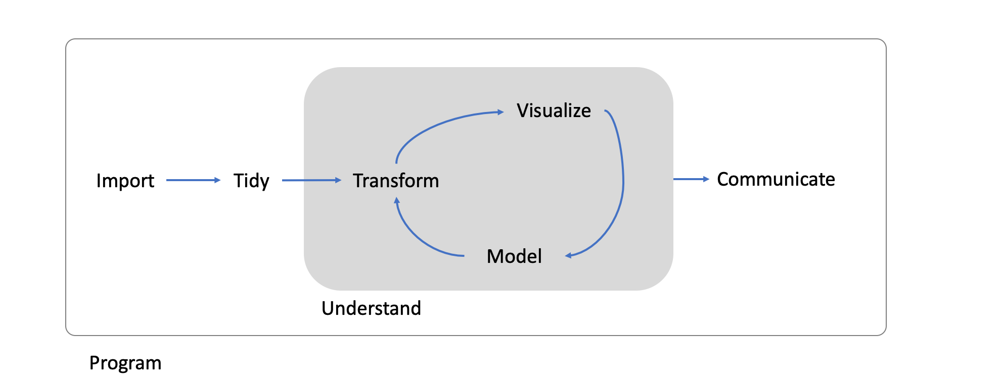

```{r child = 'theme2.rmd'}

```


```{css echo=FALSE}
.pull-left2 {
  float: left;
  width: 75%;
}
.pull-right2 {
  float: right;
  width: 25%;
}

```

# Fijne Sinterklaas!


---

## You survived R and text analysis...


---

class: inverse, center, middle

# What was this course about?

Getting an overview


---

# A General Model of Data Science



_see Wickham & Grolemund, 2014_

---

# Example: Political migration discourse on Facebook 


1. Import: Scraping data from Facebook and importing it into R

2. Tidy: Removing noise, summarizing data to creating a tidy data set

3. Transform: Transforming the data into a document-feature matrix and run a sentiment analysis to classify the tweets

4. Model: Predicting sentiment towards migration with party ideology

5. Visualize: Plotting the relationship between sentiment and party ideology with ggplot2

6. Communicate: Creating a table and figure and report results in text

_Heidenreich et al., 2019_

---


class: inverse, center, middle

# Recap

What exactly did you learn in this (and previous) courses?
---

# P1 Course: Research Methods in Communication Science


.pull-left[

- **Bivariate regression:** Estimating relationships between two variables

- **Multiple linear regression:** Predicting a dependent variable with multiple independent variables
        
      - With numeric variables
      - With categorical variables
      - Testing assumptions
      
- **Mediation analysis:** Understandig how some may indirectly affect/relate to something else

]

.pull-right[

- **Moderation analysis:** Testing whether a third variable influences a relationships or effect

- **Analysis of Variance:** Differences in variables
  
    - Repeated Measurement ANOVAS
    - Mixed Design ANOVAS
    - MANOVAS

]

---
    
# P2 Course: Computational Analysis of Digital Communication

.pull-left[

- **Data Wrangling:** Transforming and reshaping data to suit specific needs

    - Importing data in various formats (e.g., csv, json, text,...)
    - Transforming and summarizing data
    - Reshaping and joining data frames

- **Data Visualization:** Creating insights with graphs and figures
    
    - Creating plots with ggplot2
    - Guidelines for creating "good" graphs

]

.pull-right[

- **Basics of Text Analysis:** Extracting meaning from text / text as data

    - Text Preprocessing 
    - Word frequencies and word clouds
    - Keyword searches

- **Automatic Text Analysis:** Classifying big corpora

    - Dictionary Approaches
    - Supervised Machine Learning

]

---

# Additional methods

We have created more knowledge clips and tutorials that you can work through by yourself. These tutorials cover some things that you already know (but haven't done in R) and some things that might be interesting for the research projects:

.pull-left[

- **Basic statistics in R:** Extending the toolkit 
    
    - Linear regression
    - ANOVAs
    - Moderation Analysis (including visualizations)

- **Test theory and factor analyses:** Measuring abstract concepts

    - Confirmatory factor analyses
    - Exploratory factor analyses

]

.pull-right[

- **Web Scraping:** Getting data from online sources


- **Advanced statistical modeling**: Dealing with non-normal data

    - General linear model
    - Multilevel Modelling
    
- **More text analysis approaches:** Detecting patterns and structure 

    - Unsupervised learning: Topic modeling
]


---

class: inverse, center, middle

# What happens now?

Small group research projects

---

# Research projects

- We create small working groups (4 students per group)

- You will conduct your own research projects
    
    - Getting data
    - Preparing, coding, transforming....
    - Visualizing
    - Testing assumptions/hypotheses
    
- Teachers will supervise your progress and support you during practical sessions

- At the end, you will present your findings in a "online"-conference (20th of December)

---

# How will the supervision work?

- Each group will be assigned to a) a teacher (Kasper, Paulina, or Philipp) and b) a particular time slot (during the usual practical session times)

- You will have 15 minute time slots with your supervisor on the 7th, 9th, 14th and 16th of December

- In the first supervision session, you will explore ideas and find a topic

- In the following sessions, we expect you to come prepared:

    - Have concrete questions
    - Have the analysis up and running on your computer, so that we can help with problems
    
    
---

# Final presentation at the "mini-conference"

- Time and Date: 20th December from 9:00 to 11:30

    - There will be three parallel sessions
    - More information soon (including exact schedule)

- You will give a 10-minute talk (including appropriate slides) in which you:

    - introduce the research project (1-2 slides)
    - describe theory and hypotheses (1 slide)
    - explain the methods (1 slide)
    - present the results (2 slides)
    - discuss the findings (1-2 slides)

- You are required to hand in the RMarkdown, a compiled html output, and the slides beforehand (Sharp Deadline: 19th of December 2021 at 24:00)!


---

# Visual summary (poster)

.pull-left2[
You are further required to create one summary poster that we will post on the course website (example will be provided on Canvas)
]

.pull-right2[


]

---

class: inverse, center, middle

# Let's build groups!


---

# Canvas

- Please go to Canvas

- You can assign yourself to a group (max 4 people)

- In the end, I will put remaining people randomly into the groups with open places

- **Note:** Please only build groups with people from groups that have the same time slot (otherwise your supervision will be in at a different time than the practical sessions!):

    - Group 1, 3, & 5 
    - Group 2 & 4
--

- Go!

---

class: inverse, center, middle

# Inspiration

Some ideas for your research projects

---

# Where to get data?

- Publicly repositories of research data sets

   - http://gesis.org (Archive for social sciences)
   - http://www.worldvaluessurvey.org/ (World Value Survey)
   - http://www.europeansocialsurvey.org/data/ (European Social Survey)
   - http://www.pewglobal.org/category/datasets/ (Pew Institute)
   
- Other public repositories

   - https://github.com/awesomedata/awesome-public-datasets
   - http://www.kaggle.com
   - Many further online repositories...

- More data:

   - Your supervisor might also have data that suits your needs!
   - Some of the data sets used in class may be interesting to reanalyze


---

# Where to get data?

- Scraping primary sources
  - Press releases from party website
  - Existing archives
  - Scraping Tweets from Twitter

- Proprietary texts from third parties:
  - digital archives (LexisNexis, factiva, etc.)
  - social media APIs

---

# Important aspects

1. Try to formulate an appropriate research question that can be studied with the respective data set, text documents, tweets,...

2. Formulate hypothesis using theory and relevant literature

3. Test scales before using them

4. Engage in descriptive analyses

5. Visualize data

6. Test assumptions if necessary

7. Put an emphasis on correctly report and interpret your results

---

# Idea 1 (Corporate Communication)

- Goal: Investigating sentiment in Tweets about a company before and after a crisis
- Method: Scraping tweets, manual coding of a subset, supervised machine learning afterwards


---


# Idea 2 (Media Psychology)

.pull-left[
- Goal: Cross-country differences in values over time
- Methods: Secondary data analysis of the world value survey data, time series analysis
- Data: https://www.worldvaluessurvey.org/wvs.jsp
]

.pull-right[


]


---

# Idea 3 (Political communication)

.pull-left[
- Goal: Predicting sentiment toward corona measures based on party affiliation
- Method: Scraping tweets, manual coding of sentiment, supervised machine learning, regression analysis
]

.pull-right[


]

---

# Idea 4 (corporate communication)

- Goal: Create algorithm that can predict sentiment of financial news sufficiently well
- Method: Comparing various supervised machine learning algorithms
- Data: https://www.kaggle.com/ankurzing/sentiment-analysis-for-financial-news

---

# Idea 5 (media psychology)

- Goal: Assessing the factorial validity of the Big Five Personality inventory
- Methods: Descriptive analyses, visualization, assumptions text, exploratory/confirmatory factor analyses
- Data: https://www.kaggle.com/tunguz/big-five-personality-test


---

# Idea 6 (political communication)


- Goal: Comparing performance of different algorithms in predicting news categories
- Method: Replication of Van Atteveldt et al (2021) based on HuffPost Articles, manual coding, dictionary approaches, supervised machine learning
- Data: https://www.kaggle.com/rmisra/news-category-dataset

---

# Idea 7 (corporate communication)

.pull-left[
- Goal: Predicting stock prices with sentiment expressed in tweets
- Method: Merging information on stock prices of certain companies with Twitter data
]


.pull-right[


]
---

# Idea 8 (media psychology)

.pull-left[
- Goal: Detect emotions in #corona tweets
- Methods: Emotion detection based on Emotion Sensor Data set
- Dictionary: https://www.kaggle.com/iwilldoit/emotions-sensor-data-set
]

.pull-right[

]

---

# Idea 9 (political communication)

- Goal: Topic Modeling based on 18 years of Australian News Headlines
- Method: Unsupervised topic modeling
- Data: https://www.kaggle.com/therohk/million-headlines

---


class: inverse, center, middle

# Further questions?

---

class: inverse, center, middle

# Thank you for your attention!


