Basics of Data Visualization
================
Kasper Welbers, Wouter van Atteveldt & Philipp Masur
2021-10

-   [A basic ggplot plot](#a-basic-ggplot-plot)
    -   [Loading packages and data](#loading-packages-and-data)
    -   [Building a layered
        visualization](#building-a-layered-visualization)
    -   [Important note on ggplot command
        syntax](#important-note-on-ggplot-command-syntax)
    -   [Other aesthetics](#other-aesthetics)
-   [Bar plots](#bar-plots)
    -   [Setting graph options](#setting-graph-options)
    -   [Grouped bar plots](#grouped-bar-plots)
-   [Line plots](#line-plots)
-   [Multiple ‘faceted’ plots](#multiple-faceted-plots)
-   [Themes](#themes)

This tutorial teaches the basics of data visualization using the
`ggplot2` package (included in the `tidyverse`). For more information,
see [R4DS Chapter 3: Data
Visualization](http://r4ds.had.co.nz/data-visualisation.html) and [R4DS
Chapter 7: Exploratory Data
Analysis](http://r4ds.had.co.nz/exploratory-data-analysis.html).

For *many* cool visualization examples using `gplot2` (with R code
included!) see the [R Graph
Gallery](https://www.r-graph-gallery.com/portfolio/ggplot2-package/).
For inspiration (but unfortunately no R code), there is also a [538 blog
post on data visualization from
2016](https://fivethirtyeight.com/features/the-52-best-and-weirdest-charts-we-made-in-2016/).
Finally, see the article on ‘[the grammar of
graphics](http://vita.had.co.nz/papers/layered-grammar.html)’ published
by Hadley Wickham for more insight into the ideas behind ggplot.

# A basic ggplot plot

## Loading packages and data

Suppose that we want to see the relation between college education and
household income, both included in the `county facts` subset published
by [Houston Data Visualisation github
page](https://github.com/houstondatavis/data-jam-august-2016).

(If you want to practice downloading a data set into a folder and
loading it from there: you can find the data set on Canvas as well. Bear
in mind to set the working directory correctly).

``` r
# Load package collection
library(tidyverse)

# Download data
csv_folder_url <- "https://raw.githubusercontent.com/houstondatavis/data-jam-august-2016/master/csv"  # URL to folder 
facts <- read_csv(paste(csv_folder_url, "county_facts.csv", sep = "/")) # pasting folder path and file name together
head(facts)
```

| fips | area\_name     | state\_abbreviation | Pop\_2014\_count | Pop\_2010\_base\_count | Pop\_change\_pct | Pop\_2010\_count | Age\_under\_5\_pct | Age\_under\_18\_pct | Age\_over\_65\_pct | Sex\_female\_pct | Race\_white\_pct | Race\_black\_pct | Race\_native\_pct | Race\_asian\_pct | Race\_island\_pct | Race\_mixed\_pct | Race\_hispanic\_pct | Race\_white\_not\_hispanic\_pct | Pop\_same\_house\_pct | Pop\_foreign\_born\_pct | Pop\_nonenglish\_home\_pct | Pop\_hs\_grad\_pct | Pop\_college\_grad\_pct | Pop\_veterans\_count | Pop\_avg\_commute\_mins | House\_unit\_count | House\_owner\_pct | House\_unit\_multi\_count | House\_median\_value | House\_household\_count | House\_avg\_persons\_per\_count | Income\_per\_capita | Income\_median\_per\_household | Pop\_poverty | Business\_establishment\_count | Business\_employee\_count | Business\_employee\_change\_pct | Business\_nonemployer\_count | Business\_count | Business\_black\_owned\_pct | Business\_native\_owned\_pct | Business\_asian\_owned\_pct | Business\_island\_owned\_pct | Business\_hispanic\_owned\_pct | Business\_female\_owned\_pct | Revenue\_manufacture | Revenue\_wholesaler | Revenue\_retail | Revenue\_retail\_per\_capita | Revenue\_food\_and\_hospitality | Building\_permits | Land\_area | Pop\_density |
|-----:|:---------------|:--------------------|-----------------:|-----------------------:|-----------------:|-----------------:|-------------------:|--------------------:|-------------------:|-----------------:|-----------------:|-----------------:|------------------:|-----------------:|------------------:|-----------------:|--------------------:|--------------------------------:|----------------------:|------------------------:|---------------------------:|-------------------:|------------------------:|---------------------:|------------------------:|-------------------:|------------------:|--------------------------:|---------------------:|------------------------:|--------------------------------:|--------------------:|-------------------------------:|-------------:|-------------------------------:|--------------------------:|--------------------------------:|-----------------------------:|----------------:|----------------------------:|-----------------------------:|----------------------------:|-----------------------------:|-------------------------------:|-----------------------------:|---------------------:|--------------------:|----------------:|-----------------------------:|--------------------------------:|------------------:|-----------:|-------------:|
|    0 | United States  | NA                  |        318857056 |              308758105 |              3.3 |        308745538 |                6.2 |                23.1 |               14.5 |             50.8 |             77.4 |             13.2 |               1.2 |              5.4 |               0.2 |              2.5 |                17.4 |                            62.1 |                  84.9 |                    12.9 |                       20.7 |               86.0 |                    28.8 |             21263779 |                    25.5 |          133957180 |              64.9 |                      26.0 |               176700 |               115610216 |                            2.63 |               28155 |                          53046 |         15.4 |                        7488353 |                 118266253 |                             2.0 |                     23005620 |        27092908 |                         7.1 |                          0.9 |                         5.7 |                          0.1 |                            8.3 |                         28.8 |           5319456312 |          4174286516 |      3917663456 |                        12990 |                       613795732 |           1046363 | 3531905.43 |         87.4 |
| 1000 | Alabama        | NA                  |          4849377 |                4780127 |              1.4 |          4779736 |                6.1 |                22.8 |               15.3 |             51.5 |             69.7 |             26.7 |               0.7 |              1.3 |               0.1 |              1.5 |                 4.1 |                            66.2 |                  85.0 |                     3.5 |                        5.2 |               83.1 |                    22.6 |               388865 |                    24.2 |            2207912 |              69.7 |                      15.9 |               122500 |                 1838683 |                            2.55 |               23680 |                          43253 |         18.6 |                          97578 |                   1603100 |                             1.1 |                       311578 |          382350 |                        14.8 |                          0.8 |                         1.8 |                          0.1 |                            1.2 |                         28.1 |            112858843 |            52252752 |        57344851 |                        12364 |                         6426342 |             13369 |   50645.33 |         94.4 |
| 1001 | Autauga County | AL                  |            55395 |                  54571 |              1.5 |            54571 |                6.0 |                25.2 |               13.8 |             51.4 |             77.9 |             18.7 |               0.5 |              1.1 |               0.1 |              1.8 |                 2.7 |                            75.6 |                  85.0 |                     1.6 |                        3.5 |               85.6 |                    20.9 |                 5922 |                    26.2 |              22751 |              76.8 |                       8.3 |               136200 |                   20071 |                            2.71 |               24571 |                          53682 |         12.1 |                            817 |                     10120 |                             2.1 |                         2947 |            4067 |                        15.2 |                          0.0 |                         1.3 |                          0.0 |                            0.7 |                         31.7 |                    0 |                   0 |          598175 |                        12003 |                           88157 |               131 |     594.44 |         91.8 |
| 1003 | Baldwin County | AL                  |           200111 |                 182265 |              9.8 |           182265 |                5.6 |                22.2 |               18.7 |             51.2 |             87.1 |              9.6 |               0.7 |              0.9 |               0.1 |              1.6 |                 4.6 |                            83.0 |                  82.1 |                     3.6 |                        5.5 |               89.1 |                    27.7 |                19346 |                    25.9 |             107374 |              72.6 |                      24.4 |               168600 |                   73283 |                            2.52 |               26766 |                          50221 |         13.9 |                           4871 |                     54988 |                             3.7 |                        16508 |           19035 |                         2.7 |                          0.4 |                         1.0 |                          0.0 |                            1.3 |                         27.3 |              1410273 |                   0 |         2966489 |                        17166 |                          436955 |              1384 |    1589.78 |        114.6 |
| 1005 | Barbour County | AL                  |            26887 |                  27457 |             -2.1 |            27457 |                5.7 |                21.2 |               16.5 |             46.6 |             50.2 |             47.6 |               0.6 |              0.5 |               0.2 |              0.9 |                 4.5 |                            46.6 |                  84.8 |                     2.9 |                        5.0 |               73.7 |                    13.4 |                 2120 |                    24.6 |              11799 |              67.7 |                      10.6 |                89200 |                    9200 |                            2.66 |               16829 |                          32911 |         26.7 |                            464 |                      6611 |                            -5.6 |                         1546 |            1667 |                         0.0 |                          0.0 |                         0.0 |                          0.0 |                            0.0 |                         27.0 |                    0 |                   0 |          188337 |                         6334 |                               0 |                 8 |     884.88 |         31.0 |
| 1007 | Bibb County    | AL                  |            22506 |                  22919 |             -1.8 |            22915 |                5.3 |                21.0 |               14.8 |             45.9 |             76.3 |             22.1 |               0.4 |              0.2 |               0.1 |              0.9 |                 2.1 |                            74.5 |                  86.6 |                     1.2 |                        2.1 |               77.5 |                    12.1 |                 1327 |                    27.6 |               8978 |              79.0 |                       7.3 |                90500 |                    7091 |                            3.03 |               17427 |                          36447 |         18.1 |                            275 |                      3145 |                             7.5 |                         1126 |            1385 |                        14.9 |                          0.0 |                         0.0 |                          0.0 |                            0.0 |                          0.0 |                    0 |                   0 |          124707 |                         5804 |                           10757 |                19 |     622.58 |         36.8 |

Since this data set contains a large amount of columns, we keep only a
subset of columns for now:

``` r
# Selecting columns and filtering 
facts_state <- facts %>% 
  select(fips, area_name, state_abbreviation, 
         population = Pop_2014_count, 
         pop_change = Pop_change_pct,
         over65 = Age_over_65_pct, 
         female = Sex_female_pct,
         white = Race_white_pct,
         college = Pop_college_grad_pct, 
         income = Income_per_capita) %>%
  filter(is.na(state_abbreviation) & fips != 0) %>% 
  select(-state_abbreviation)

# Check results
head(facts_state)
```

| fips | area\_name | population | pop\_change | over65 | female | white | college | income |
|-----:|:-----------|-----------:|------------:|-------:|-------:|------:|--------:|-------:|
| 1000 | Alabama    |    4849377 |         1.4 |   15.3 |   51.5 |  69.7 |    22.6 |  23680 |
| 2000 | Alaska     |     736732 |         3.7 |    9.4 |   47.4 |  66.9 |    27.5 |  32651 |
| 4000 | Arizona    |    6731484 |         5.3 |   15.9 |   50.3 |  83.7 |    26.9 |  25358 |
| 5000 | Arkansas   |    2966369 |         1.7 |   15.7 |   50.9 |  79.7 |    20.1 |  22170 |
| 6000 | California |   38802500 |         4.2 |   12.9 |   50.3 |  73.2 |    30.7 |  29527 |
| 8000 | Colorado   |    5355866 |         6.5 |   12.7 |   49.8 |  87.7 |    37.0 |  31109 |

## Building a layered visualization

Now, let’s make a simple *scatter plot* with percentage college-educated
on the x-axis and median income on the y-axis. First, we can used the
function `ggplot` to create an empty canvas tied to the dataset
`facts_state` and tell the function which variables to use:

``` r
ggplot(data = facts_state,        ## which data set?
       aes(x=college, y=income))  ## which variables as aesthetics?
```

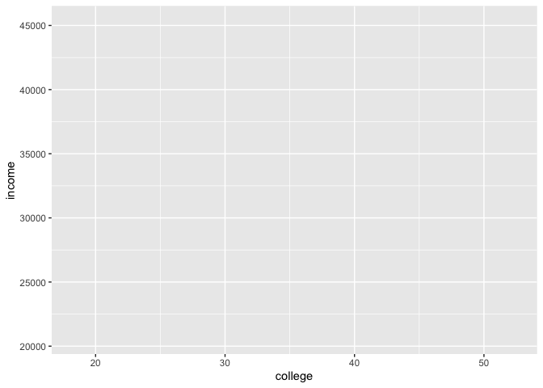<!-- -->

Next, we need to tell ggplot what to plot. In this case, we want to
produce a scatterplot. The function `geom_point` adds a layer of
information to the canvas. In the language of ggplot, each layer has a
*geometrical representation*, in this case “points”. In this case, the
“x” and “y” are mapped to the college and income columns.

``` r
ggplot(data = facts_state,
       mapping = aes(x = college, y = income)) + 
  geom_point()   ## adding the geometrical representation
```

<!-- -->

The result is a plot where each point here represents a state, and we
see a clear correlation between education level and income. There is one
clear outlier on the top-right. Can you guess which state that is?

So called *aesthetic mappings*, which map the visual elements of the
geometry to columns of the data, can also be included as argument in the
`geom` itself and not in the `ggplot()?` command. This can be handy when
several `geoms` are plotted and different aesthetics are used. For
example, we can add more `geoms` to the plot (e.g., a regression line).
If we provided the aesthetics within the `ggplot`-function, these are
passed automatically to the following `geoms`.

``` r
# Linear regression line
ggplot(data = facts_state, 
       mapping = aes(x = college, y = income)) + 
  geom_point() +
  geom_smooth(method = "lm")
```

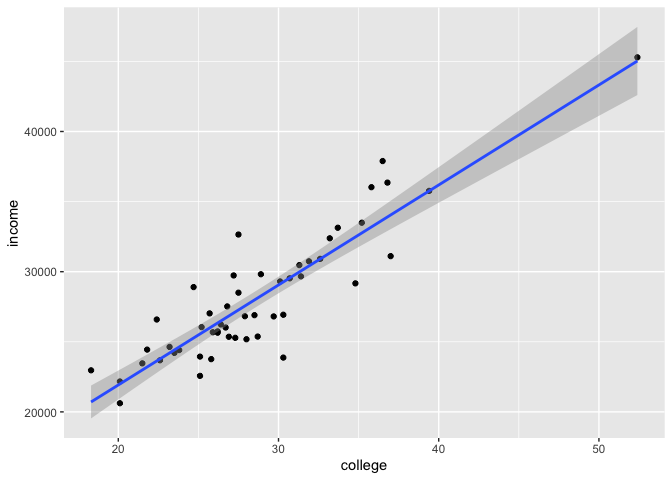<!-- -->

## Important note on ggplot command syntax

For the plot to work, R needs to execute the whole ggplot call and all
layers as a single statement. Practically, that means that if you
combine a plot over multiple lines, the plus sign needs to be at the end
of the line, so R knows more is coming.

So, the following is good:

``` r
ggplot(data = facts_state,
       mapping = aes(x = college, y = income)) + 
  geom_point()
```

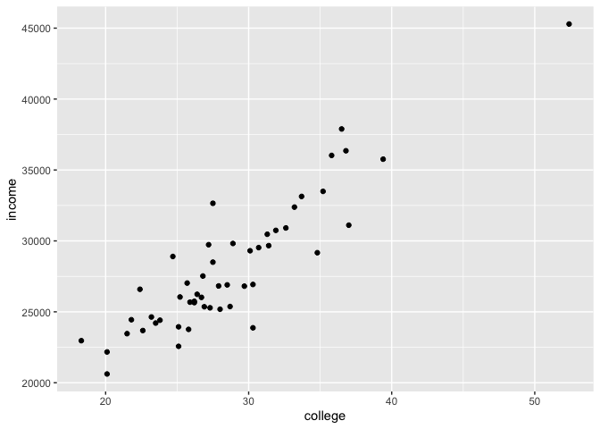<!-- -->

But this is not:

``` r
ggplot(data = facts_state,
       mapping = aes(x = college, y = income)) 
  + geom_point()
```

We can also move the mappings to the `geom`. This can be useful when we
want to plot different `geoms` based on different variables.

``` r
# same as above
ggplot(data = facts_state) + 
  geom_point(mapping = aes(x = college, y = income))
```

<!-- -->

Also note that the data and mapping arguments are always the first
arguments the functions expect, so you can also call them implicitly:

``` r
ggplot(facts_state) + 
  geom_point(aes(x = college, y = income))
```

<!-- -->

## Other aesthetics

To find out which visual elements can be used in a layer, use
e.g. `?geom_point`. According to the help file, we can (among others)
set the colour, alpha (transparency), and size of points. Let’s first
set the size of points to the population of each state, creating a
bubble plot:

``` r
ggplot(data = facts_state) + 
  geom_point(aes(x = college, y = income, size = population))
```

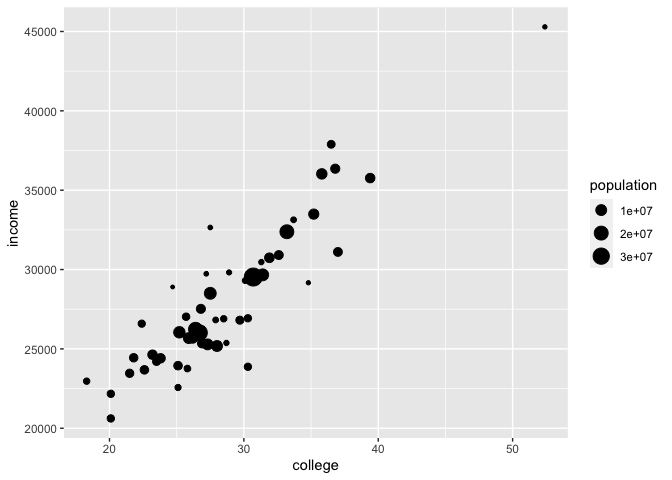<!-- -->

Since it is difficult to see overlapping points, let’s make all points
somewhat transparent. Note: Since we want to set the alpha of all points
to a single value, this is not a mapping (as it is not mapped to a
column from the data frame), but a constant. These are set outside the
mapping argument:

``` r
ggplot(data = facts_state) + 
  geom_point(aes(x = college, y = income, size = population), 
             alpha = .5, 
             colour = "red")
```

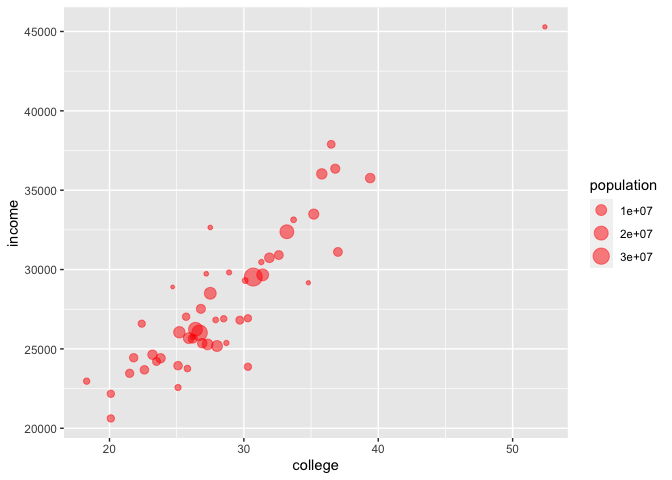<!-- -->

Instead of setting colour to a constant value, we can also let it vary
with the data. For example, we can colour the states by percentage of
population above 65:

``` r
ggplot(data = facts_state) + 
  geom_point(aes(x = college, y = income, size = population, colour = over65), 
             alpha = .9)
```

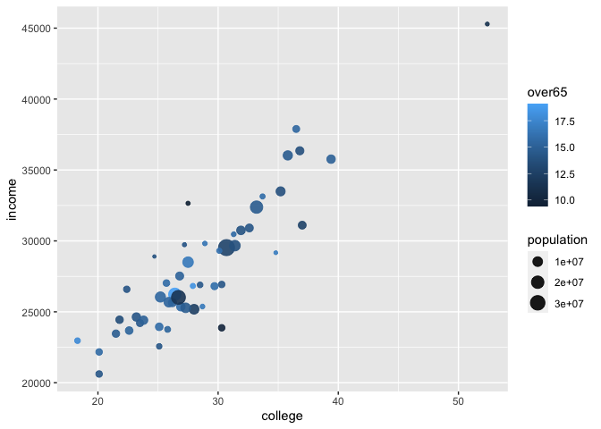<!-- -->

Finally, you can map to a categorical value as well. Let’s categorize
states into whether population is growing (at least 1%) or stable or
declining. We use the `if_else(condition, iftrue, iffalse)` function,
which assigns the `iftrue` value if the condition is true, and `iffalse`
otherwise:

``` r
# Creating a new variable
facts_state <- facts_state %>% 
  mutate(growth = ifelse(pop_change > 1, "Growing", "Stable"))

# Plotting a categorical variable
ggplot(data=facts_state) + 
  geom_point(aes(x = college, y = income, size = population, colour = growth), 
             alpha=.9)
```

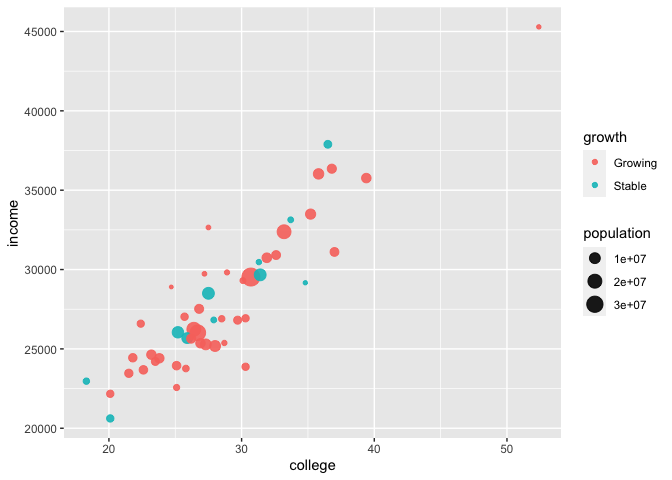<!-- -->

As you can see in these examples, ggplot tries to be smart about the
mapping you ask. It automatically sets the x and y ranges to the values
in your data. It mapped the size such that there are small and large
points, but not e.g. a point so large that it would dominate the graph.
For the colour, for interval variables it created a colour scale, while
for a categorical variable it automatically assigned a colour to each
group.

Of course, each of those choices can be customized, and sometimes it
makes a lot of sense to do so. For example, you might wish to use red
for republicans and blue for democrats, if your audience is used to
those colors; or you may wish to use grayscale for an old-fashioned
paper publication. We’ll explore more options in a later tutorial, but
for now let’s be happy that ggplot does a lot of work for us!

**Exercise 1:** Of course there are more types of plots. Try to plot a
so-called “histogram” of the variable `income`. Histograms are really
helpful to understand the distribution of a variable. Tip: Check out the
help page by calling `?geom_histogram`. The first example will help you
build the right plot. In a second step, simply exchange
`geom_histogram()` with `geom_density()`. What do you see now?

``` r
# Basic Histogram
ggplot(facts_state, aes(x = income)) +
  geom_histogram()
```

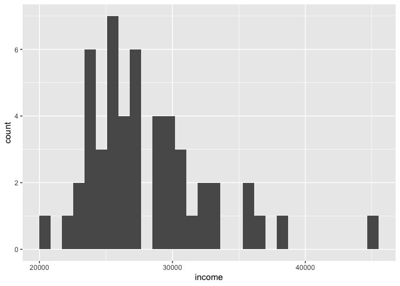<!-- -->

``` r
# Nicer histogram
ggplot(facts_state, aes(x = income)) +
  geom_histogram(bins = 20, color = "white", fill = "lightblue") +
  theme_bw() +
  labs(x = "Average Income", y = "Number of states", title = "Distribution of average income in US states")
```

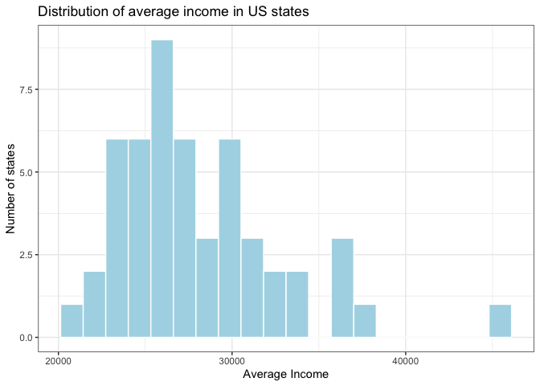<!-- -->

``` r
# Density plot
ggplot(facts_state, aes(x = income)) +
  geom_density(fill = "lightblue") +
  theme_bw()
```

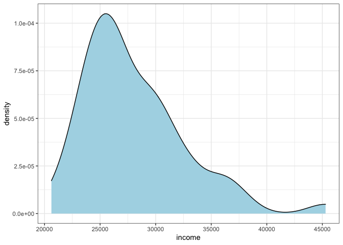<!-- -->

# Bar plots

Another frequently used plot is the bar plot. By default, R bar plots
assume that you want to plot a histogram, e.g. the number of occurences
of each group. As a very simple example, the following plots the number
of states that are growing or stable in population:

``` r
ggplot(data = facts_state) + 
  geom_bar(aes(x = growth))
```

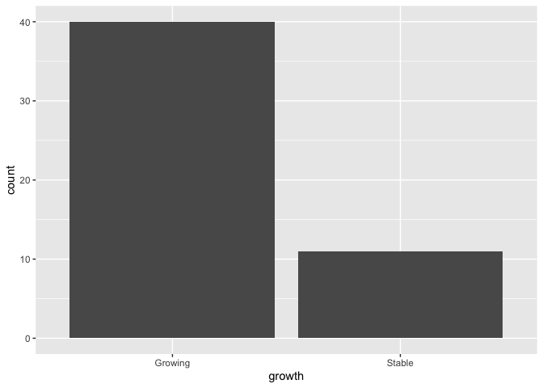<!-- -->

For a more interesting plot, let’s plot the votes per Republican
candidate in the New Hampshire primary. First, we need to download the
per-county data, summarize it per state, and filter to only get the NH
results for the Republican party: (see the previous tutorials on [Data
Transformations](R-tidy-5-transformation.md) and [Joining
data](R-tidy-13a-joining.md) for more information if needed)

``` r
# Getting new data
results_state <- read_csv(paste(csv_folder_url, "primary_results.csv", sep = "/")) %>% 
  group_by(state, party, candidate) %>% 
  summarize(votes=sum(votes))

# Subset of New Hampshire and republican candidates
nh_gop <- results_state %>% 
  filter(state == "New Hampshire" & party == "Republican")
nh_gop
```

    ## # A tibble: 8 x 4
    ## # Groups:   state, party [1]
    ##   state         party      candidate       votes
    ##   <chr>         <chr>      <chr>           <dbl>
    ## 1 New Hampshire Republican Ben Carson       6509
    ## 2 New Hampshire Republican Carly Fiorina   11706
    ## 3 New Hampshire Republican Chris Christie  21069
    ## 4 New Hampshire Republican Donald Trump   100406
    ## 5 New Hampshire Republican Jeb Bush        31310
    ## 6 New Hampshire Republican John Kasich     44909
    ## 7 New Hampshire Republican Marco Rubio     30032
    ## 8 New Hampshire Republican Ted Cruz        33189

Now, let’s make a bar plot with votes (y) per candidate (x). Since we
don’t want ggplot to summarize it for us (we already did that
ourselves), we set `stat="identity"` to set the grouping statistic to
the identity function, i.e. just use each point as it is.

``` r
# We can also store parts of a plot in an object
plot1 <- ggplot(nh_gop) + 
  geom_bar(aes(x=candidate, y=votes), 
           stat='identity')
plot1
```

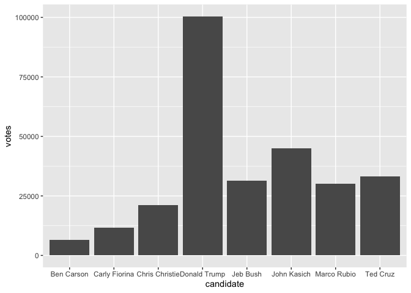<!-- -->

## Setting graph options

Some options, like labels, legends, and the coordinate system are
graph-wide rather than per layer. You add these options to the graph by
adding extra functions to the call. For example, we can use
coord\_flip() to swap the x and y axes:

``` r
plot1 + 
  coord_flip()
```

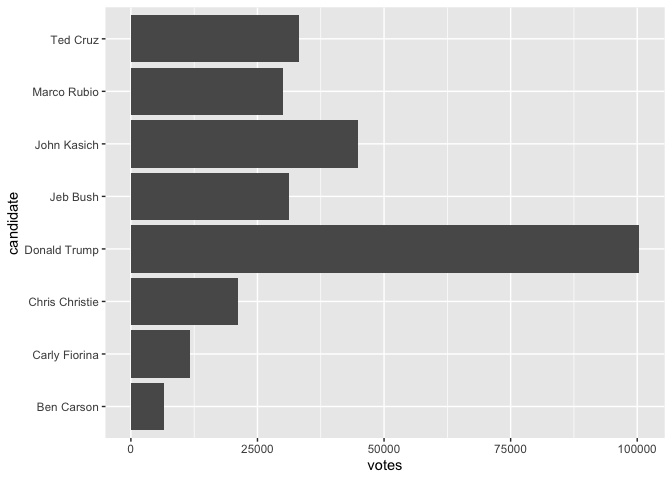<!-- -->

You can also reorder categories with the `reorder` function, for example
to sort by number of votes. Also, let’s add some colour (just because we
can!):

``` r
ggplot(nh_gop) + 
  geom_bar(aes(x = reorder(candidate, votes), y = votes, fill = candidate), 
           stat = 'identity') + 
  coord_flip()
```

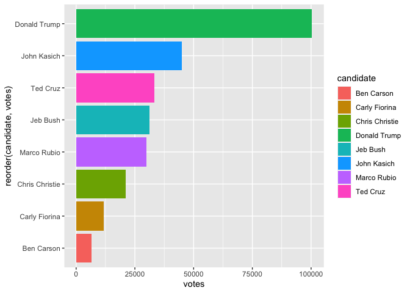<!-- -->

This is getting somewhere, but the x-axis label (y-axis after rotation)
is not very pretty and we don’t need guides for the fill mapping. This
can be remedied by more graph-level options. Also, we can use a `theme`
to alter the appearance of the graph, for example using the minimal
theme:

``` r
ggplot(nh_gop) + 
  geom_bar(aes(x = reorder(candidate, votes), y = votes, fill = candidate), 
           stat = 'identity') + 
  coord_flip() +
  xlab("Candidate") + 
  guides(fill=F) + 
  theme_minimal()
```

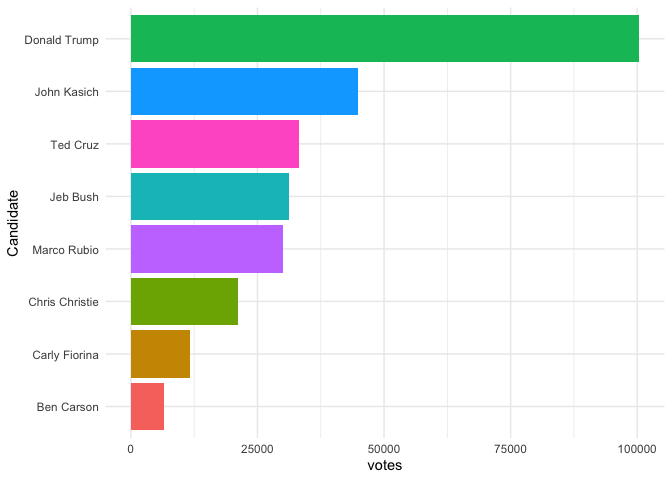<!-- -->

## Grouped bar plots

We can also add groups to bar plots. For example, we can set the x
category to state (taking only NH and IA to keep the plot readable), and
then group by candidate:

``` r
gop2 <- results_state %>% 
  filter(party == "Republican" & (state == "New Hampshire" | state == "Iowa")) 

ggplot(gop2) + 
  geom_bar(aes(x = state, y = votes, fill = candidate), 
           stat='identity')
```

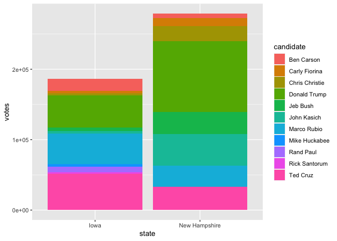<!-- -->

By default, the groups are stacked. This can be controlled with the
position parameter, which can be `dodge` (for grouped bars) or `fill`
(stacking to 100%):

``` r
ggplot(gop2) + 
  geom_bar(aes(x=state, y=votes, fill=candidate), 
           stat='identity', 
           position='dodge')
```

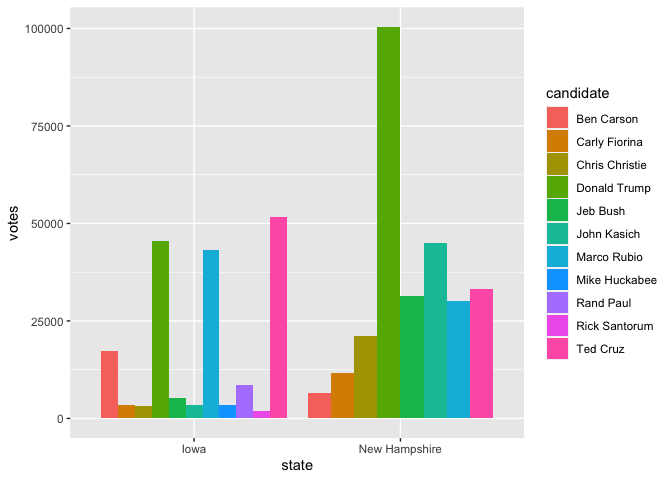<!-- -->

``` r
ggplot(gop2) + 
  geom_bar(aes(x=state, y=votes, fill=candidate), 
           stat='identity', 
           position='fill')
```

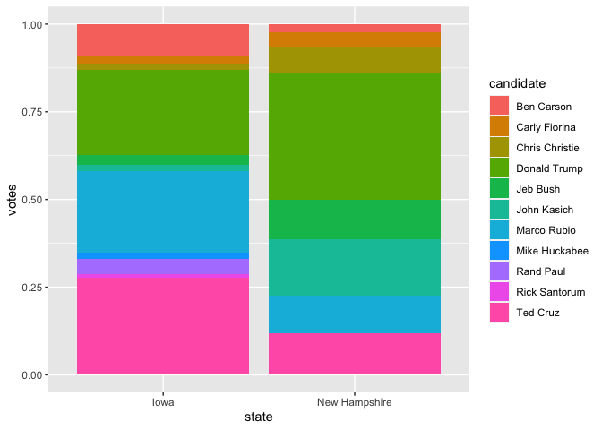<!-- -->

# Line plots

Finally, another frequent graph is the line graph. For example, we can
plot the ascendancy of Donald Trump by looking at his vote share over
time. First, we combine the results per state with the primary schedule:
(see the tutorial on [Joining data](R-tidy-13a-joining.md))

``` r
# dataset 1
schedule  <- read_csv(paste(csv_folder_url, "primary_schedule.csv", sep="/")) %>% 
  mutate(date = as.Date(date, format="%m/%d/%y"))
head(schedule)
```

| date       | state          | party    | type                |
|:-----------|:---------------|:---------|:--------------------|
| 2016-02-01 | Iowa           | Democrat | Semi-open caucus    |
| 2016-02-09 | New Hampshire  | Democrat | Semi-closed primary |
| 2016-02-20 | Nevada         | Democrat | Closed caucus       |
| 2016-02-27 | South Carolina | Democrat | Open primary        |
| 2016-03-01 | Alabama        | Democrat | Open primary        |
| 2016-03-01 | American Samoa | Democrat | Closed caucus       |

``` r
# dataset 2
trump <- results_state %>% 
  group_by(state, party) %>% 
  mutate(vote_prop=votes/sum(votes)) %>% 
  filter(candidate=="Donald Trump")
trump
```

    ## # A tibble: 46 x 5
    ## # Groups:   state, party [46]
    ##    state       party      candidate      votes vote_prop
    ##    <chr>       <chr>      <chr>          <dbl>     <dbl>
    ##  1 Alabama     Republican Donald Trump  371735     0.444
    ##  2 Alaska      Republican Donald Trump    7346     0.335
    ##  3 Arizona     Republican Donald Trump  249916     0.574
    ##  4 Arkansas    Republican Donald Trump  133144     0.336
    ##  5 California  Republican Donald Trump 1174829     0.786
    ##  6 Connecticut Republican Donald Trump  123367     0.591
    ##  7 Delaware    Republican Donald Trump   42472     0.626
    ##  8 Florida     Republican Donald Trump 1077221     0.473
    ##  9 Georgia     Republican Donald Trump  501707     0.393
    ## 10 Hawaii      Republican Donald Trump    5677     0.429
    ## # … with 36 more rows

``` r
# join the two data sets (more next sessions)
trump <- left_join(trump, schedule) %>% 
  group_by(date) %>% 
  summarize(vote_prop = mean(vote_prop))
trump
```

| date       | vote\_prop |
|:-----------|-----------:|
| 2016-02-01 |  0.2432414 |
| 2016-02-09 |  0.3597105 |
| 2016-02-20 |  0.3250379 |
| 2016-02-23 |  0.4611635 |
| 2016-03-01 |  0.3405303 |
| 2016-03-05 |  0.3430645 |
| 2016-03-08 |  0.3971354 |
| 2016-03-15 |  0.4130322 |
| 2016-03-22 |  0.3573482 |
| 2016-04-05 |  0.3601849 |
| 2016-04-19 |  0.6040735 |
| 2016-04-26 |  0.6019293 |
| 2016-05-03 |  0.5463919 |
| 2016-05-10 |  0.7517169 |
| 2016-05-17 |  0.6661429 |
| 2016-05-24 |  0.7888856 |
| 2016-06-07 |  0.7704184 |

Take a minute to inspect the code above, and try to understand what each
line does! The best way to do this is to inspect the output of each
line, and trace back how that output is computed based on the input
data.

``` r
ggplot(trump) + 
  geom_line(aes(x = date, y = vote_prop))
```

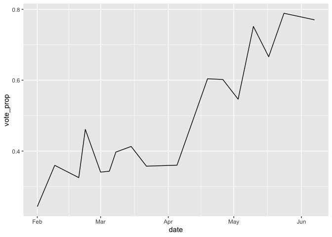<!-- -->

# Multiple ‘faceted’ plots

Just to show off some of the possibilities of ggplot, let’s make a plot
of all republican primary outcomes on Super Tuesday (March 1st):

``` r
super <- results_state %>% 
  left_join(schedule) %>% 
  filter(party == "Republican" & date == "2016-03-01") %>% 
  group_by(state) %>% 
  mutate(vote_prop = votes/sum(votes))

ggplot(super) + 
  geom_bar(aes(x = candidate, y = vote_prop), 
           stat = 'identity') + 
  facet_wrap(~state, nrow = 3) + 
  coord_flip()
```

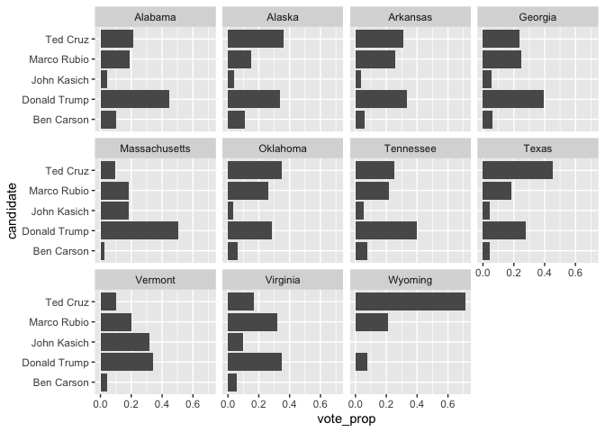<!-- -->

Note <sub>facet\_wrap</sub> wraps around a single facet. You can also
use \~facet\_grid() to specify separate variables for rows and columns.

**Exercise 2:** How could we change the plot to color the bars according
to the candidates?

``` r
ggplot(super) + 
  geom_bar(aes(x = candidate, y = vote_prop, fill = candidate), 
           stat = 'identity') + 
  facet_wrap(~state, nrow = 3) + 
  coord_flip() +
  guides(fill = F)
```

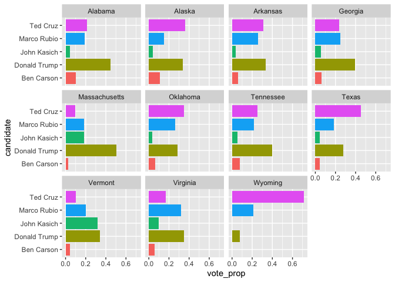<!-- -->

# Themes

Customization of things like background colour, grid colour etc. is
handled by themes. `ggplot` has two built-in themes: `theme_grey`
(default) and `theme_bw` (for a more minimal theme with white
background). The package ggthemes has some more themes, including an
‘economist’ theme (based on the newspaper). To use a theme, simply add
it to the plot:

``` r
library(ggthemes)
ggplot(trump) + 
  geom_line(aes(x = date, y = vote_prop)) + 
  theme_economist() +
  labs(x = "", y = "Percentage that voted for Trump")
```

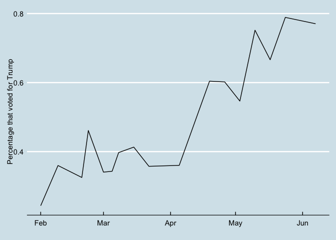<!-- -->

Some links for learning more about themes:

-   <https://ggplot2.tidyverse.org/reference/theme.html>
-   <https://www.datanovia.com/en/blog/ggplot-themes-gallery>
-   <http://rstudio-pubs-static.s3.amazonaws.com/284329_c7e660636fec4a42a09eed968dc47f32.html>
