Visualizing data with ggplot
================
Wouter van Atteveldt

- [Introduction](#introduction)
  - [GGplot basics](#ggplot-basics)
  - [Elements of a ggplot](#elements-of-a-ggplot)
  - [Make it pretty!](#make-it-pretty)
- [Scatter plots](#scatter-plots)
- [Line graphs](#line-graphs)
  - [Let’s make it pretty!](#lets-make-it-pretty)
- [Bar plots](#bar-plots)
  - [Histograms](#histograms)
  - [Using geom_col instead of
    geom_bar](#using-geom_col-instead-of-geom_bar)
- [Combining geoms](#combining-geoms)
- [Creating high-quality graphs for
  reports](#creating-high-quality-graphs-for-reports)

## Introduction

Creating visualizations is one of the most useful and powerful ways to
analyse and data and tell a convincing story with these data.

In `ggplot`, R Tidyverse has a very powerful and well-designed
visualization library. It can be used to make almost all kinds of
graphs, from simple line and scatter plots to colorful annotated bubble
plots.

For an an overview of possibilities and more explanation, you can check
out the free online resources below:

- [The R Graph
  gallery](https://r-graph-gallery.com/ggplot2-package.html) - contains
  many examples of beautiful plots, all with R code included
- [From data to viz](https://www.data-to-viz.com/) - an interactive site
  that showcases good plots based on your data, giving not just the R
  code but also best practices, common mistakes, and alternatives for
  each plot.
- [The ggplot cheat
  sheet](https://github.com/rstudio/cheatsheets/blob/main/data-visualization.pdf)
  with a nice overview of ggplot functions and options
- [Data Visualization](https://socviz.co/) by Kieran Healy - a
  completely free online book that discusses the principles of data
  visualization and the best ways to visualize various types of data,
  also including R code for all examples.

<div class="Info">

Most of the plots in this tutorial focus on the mechanics of the
visualization and don’t spend a lot of attention on adding informative
labels, making it visually attractive, etc. For plots in reports and
presentations, however, it is extremely important to pay attention to
these details. So, be sure to check out the last section on *Creating
high-quality graphs* as well!

</div>

### GGplot basics

To illustrate how ggplot works, let’s take a look at a simple built-in
data set of car tests:

``` r
library(tidyverse)
data(mtcars)
mtcars
```

    ##                      mpg cyl  disp  hp drat    wt  qsec vs am gear carb
    ## Mazda RX4           21.0   6 160.0 110 3.90 2.620 16.46  0  1    4    4
    ## Mazda RX4 Wag       21.0   6 160.0 110 3.90 2.875 17.02  0  1    4    4
    ## Datsun 710          22.8   4 108.0  93 3.85 2.320 18.61  1  1    4    1
    ## Hornet 4 Drive      21.4   6 258.0 110 3.08 3.215 19.44  1  0    3    1
    ## Hornet Sportabout   18.7   8 360.0 175 3.15 3.440 17.02  0  0    3    2
    ## Valiant             18.1   6 225.0 105 2.76 3.460 20.22  1  0    3    1
    ## Duster 360          14.3   8 360.0 245 3.21 3.570 15.84  0  0    3    4
    ## Merc 240D           24.4   4 146.7  62 3.69 3.190 20.00  1  0    4    2
    ## Merc 230            22.8   4 140.8  95 3.92 3.150 22.90  1  0    4    2
    ## Merc 280            19.2   6 167.6 123 3.92 3.440 18.30  1  0    4    4
    ## Merc 280C           17.8   6 167.6 123 3.92 3.440 18.90  1  0    4    4
    ## Merc 450SE          16.4   8 275.8 180 3.07 4.070 17.40  0  0    3    3
    ## Merc 450SL          17.3   8 275.8 180 3.07 3.730 17.60  0  0    3    3
    ## Merc 450SLC         15.2   8 275.8 180 3.07 3.780 18.00  0  0    3    3
    ## Cadillac Fleetwood  10.4   8 472.0 205 2.93 5.250 17.98  0  0    3    4
    ## Lincoln Continental 10.4   8 460.0 215 3.00 5.424 17.82  0  0    3    4
    ## Chrysler Imperial   14.7   8 440.0 230 3.23 5.345 17.42  0  0    3    4
    ## Fiat 128            32.4   4  78.7  66 4.08 2.200 19.47  1  1    4    1
    ## Honda Civic         30.4   4  75.7  52 4.93 1.615 18.52  1  1    4    2
    ## Toyota Corolla      33.9   4  71.1  65 4.22 1.835 19.90  1  1    4    1
    ## Toyota Corona       21.5   4 120.1  97 3.70 2.465 20.01  1  0    3    1
    ## Dodge Challenger    15.5   8 318.0 150 2.76 3.520 16.87  0  0    3    2
    ## AMC Javelin         15.2   8 304.0 150 3.15 3.435 17.30  0  0    3    2
    ## Camaro Z28          13.3   8 350.0 245 3.73 3.840 15.41  0  0    3    4
    ## Pontiac Firebird    19.2   8 400.0 175 3.08 3.845 17.05  0  0    3    2
    ## Fiat X1-9           27.3   4  79.0  66 4.08 1.935 18.90  1  1    4    1
    ## Porsche 914-2       26.0   4 120.3  91 4.43 2.140 16.70  0  1    5    2
    ## Lotus Europa        30.4   4  95.1 113 3.77 1.513 16.90  1  1    5    2
    ## Ford Pantera L      15.8   8 351.0 264 4.22 3.170 14.50  0  1    5    4
    ## Ferrari Dino        19.7   6 145.0 175 3.62 2.770 15.50  0  1    5    6
    ## Maserati Bora       15.0   8 301.0 335 3.54 3.570 14.60  0  1    5    8
    ## Volvo 142E          21.4   4 121.0 109 4.11 2.780 18.60  1  1    4    2

We can visualize the relation between engine power and fuel economy:

``` r
ggplot(mtcars, 
       aes(x=hp, y=mpg)) + 
  geom_point()
```

<!-- -->

**Solutions:**

``` r
ggplot(mtcars, 
       aes(x=wt, y=mpg)) + 
  geom_point()
```

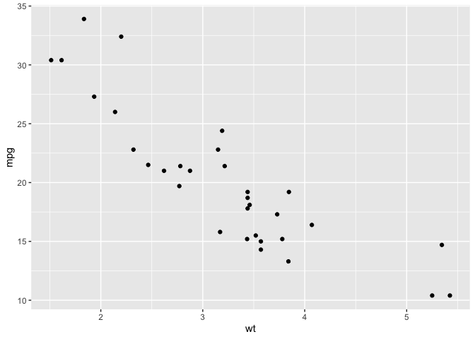<!-- -->

**Exercise:** First, let’s run the code the way it is now (press the
‘run code’ button). Now, can you change the plot to show the `wt`
(weight) on the x axis instead?

### Elements of a ggplot

The ggplot call above is typical for how ggplot works, and showcases the
*grammar of graphics*. Essentially, every graph contains these three
basic elements:

- The **data**, in this case `mtcars`. This is the first argument of the
  ggplot function.
- One or more **geometrical elements** or `geom`s, that form the actual
  visualization.
- An **aesthetic mapping** or `aes` that maps columns in the data to
  aspects of the geometry.

In other words, the plot above is a plot of points (i.e. a scatter
plot), whose x and y positions are mapped to the `hp` and `mpg` columns
of the data frame `mtcars`

### Make it pretty!

Besides these three basic elements (data, geoms, and aesthetics), you
can tweak almost every aspect of a plot. For example, the code below
adds an extra mapping, making the colors of points reflect the number of
cylinders of the car.

Besides this, it adds three extra elements:

- A `scale`. By default, ggplot looks at the data and determines a
  reasonable scale. This default is generally quite good, and means that
  you can quickly make decent graphs. With the `scale_*` commands, you
  can tweak this scale, for example by changing color values, the range,
  etc.
- A `ggtitle`. You can add various elements like titles, subtitles, axis
  labels etc. to the plot to make it more informative
- A `theme`. Themes determine the look and feel of everything around the
  data, e.g. the plot background, grid lines, fonts, etc. You can create
  and tweak themes to change the look and feel of plots, for example to
  match the house style of a company or journal.

``` r
ggplot(mtcars, aes(x=hp, y=mpg, color=cyl)) + 
  geom_point() + 
  scale_color_gradient(low="darkgreen", high="darkred") +
  ggtitle("Car horsepower and fuel economy") + 
  theme_minimal()
```

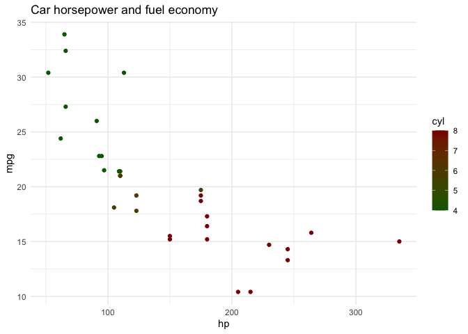<!-- -->

Feel free to play around, e.g. by inverting the x and y in the mapping,
changing the colors, adding axis labels (`+ xlab("Horsepower")`), etc.

## Scatter plots

A very common but quite insightful plot is the scatter plot. It is
useful if you want to express the relation between two numeric
variables.

As you saw above, scatter plots use the `geom_point()` geometry. For
this plot type, you have to specify and **x** and **y** mapping. In
addition, you can specify a `color`, `fill`, and `alpha` (transparency)
mapping, as well as `size` and `shape`.

For example, the plot below shows the relation between population
density and percentage of people aged 65+ in Dutch municipalities. It
also uses point size to indicate total population size, and color to
indicate income (see
e.g. <http://sape.inf.usi.ch/quick-reference/ggplot2/colour>) for a
reference of color names in ggplot)

``` r
library(tidyverse)
demographics <- read_csv('https://raw.githubusercontent.com/vanatteveldt/ccslearnr/master/data/dutch_demographics.csv')
ggplot(demographics,
       aes(x = v57_density, y = c_65plus, size=v01_pop, color=v132_income)) +
  scale_color_gradient(low="coral", high="darkblue") + 
  geom_point(alpha=.6)
```

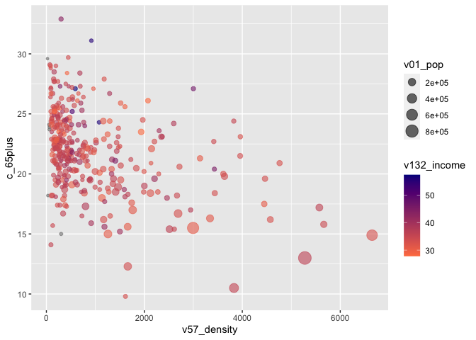<!-- -->

**Solution:**

``` r
library(tidyverse)
demographics <- read_csv('https://raw.githubusercontent.com/vanatteveldt/ccslearnr/master/data/dutch_demographics.csv')
ggplot(demographics,
       aes(x = v57_density, y = c_65plus, size=v01_pop, color=v43_nl)) +
  scale_color_gradient(low="darkblue", high="lightblue") + 
  geom_point(alpha=.6)
```

<!-- -->

**Exercise**: Can you change the code to make the colors represent the
percentage of inhabitants without a migration history (`v43_nl`), and
change the color scale to run from dark blue to light blue?s

Note the use of `alpha` to make the points somewhat transparent, making
it a bit easier to see when points overlap. This is given as a constant
value rather than a mapping, since we want all points to have this. This
can be used on all geoms: if you wish to e.g. make all points a certain
color or size, you add these in the `geom(...)` call directly, i.e. not
in an `aes(...)` call.

If you want to play around a bit more: What happens when you add
`shape=21` or even `shape='🏠'` to the call? For `shape=21`, you can
also add a fill aesthetic (or constant value) if desired - how does that
affect the plot? (you can google ‘ggplot shapes’ to see an overview of
built-in default shapes, like the circles for 21)

## Line graphs

Line graphs mostly useful to showcase change over time. This uses
`geom_line`, which is in many ways similar to `geom_point`, but rather
than drawing points, it will draw a line between all points. Besides the
`x`, `y`, `color` and `alpha` mapping, it can have a `linetype`
(e.g. dashed, dotted, solid) and a `linewidth`.

For example, the following code shows the proportion of the popular vote
for each US Presidential candidate since 2000:

``` r
library(tidyverse)
elections <- read_csv('https://raw.githubusercontent.com/vanatteveldt/ccslearnr/master/data/US_Elections_years.csv')
ggplot(elections,
       aes(x=year, y=votes, color=party)) + 
  geom_line()
```

<!-- -->

### Let’s make it pretty!

To make this graph a bit nicer, let’s make some changes: - The votes are
given as a proportion of 0-1, but most people prefer 0-100%. This can be
changed in the `scale` by setting a labelling function. - The party
names are in all capitals, which is ugly and distracting. We can use
`str_to_title` to change them to Title Case. - This graph uses the
default colors for parties, which do not match our normal ideas of which
party should have which color. We can fix this by using a manual scale
for the color: `scale_color_manual`, which allows us to specify exactly
which value should get which color. - The data for the minor parties was
sometimes missing. For example, the Greens were only included in 2000
and 2020. By default, ggplot draws a line between those points, which
misleadingly suggests that they had a result in the intervening years as
well. We fix this using the `complete` function, which inserts missing
combinations of `year` and `party`, setting the `vote` variable to
zero. - Finally, let’s make the line for the minor parties dotted, using
`mutate` to define major, and then using it as the linetype aesthetic,
again setting a manual scale to force the FALSE values to be dashed (and
removing the guide/legend).

To achieve these two changes, we need to preprocess the data before the
`ggplot` command, using the `complete` and `mutate` functions. We do
this by placing these in a pipeline before `ggplot`, and then of course
omitting the data argument from the ggplot call. (see the handout on
summarizing data for an explanation of pipelines, if needed).

``` r
library(tidyverse)
elections <- read_csv('https://raw.githubusercontent.com/vanatteveldt/ccslearnr/master/data/US_Elections_years.csv')
```

``` r
elections |> 
  complete(year, party, fill=list(votes=0)) |>
  mutate(major = party == "DEMOCRAT" | party == "REPUBLICAN",
         party = str_to_title(party)) |>
  ggplot(aes(x=year, y=votes, color=party, linetype=major)) + 
  scale_y_continuous(labels = scales::percent) + 
  scale_linetype_manual(values=c("dashed", "solid"), guide='none') + 
  scale_color_manual(breaks=c("Democrat", "Republican", "Green", "Libertarian", "Other"),
                     values=c("blue", "red", "green4", "yellow4", "grey")) + 
  geom_line()
```

<!-- -->

## Bar plots

Where scatter and line plots generally focus on plotting individual
cases, bar plots often present some sort of summary per case. For
example, let’s consider that US Demographics data:

``` r
library(tidyverse)
us_demographics <- read_csv('https://raw.githubusercontent.com/vanatteveldt/ccslearnr/master/data/US_Demographics.csv')
us_demographics
```

    ## # A tibble: 3,114 × 11
    ##     fips state county total_population nonwhite_pct female_pct age29andunder_pct
    ##    <dbl> <chr> <chr>             <dbl>        <dbl>      <dbl>             <dbl>
    ##  1  1001 Alab… Autau…            55049        24.3        51.2              40.0
    ##  2  1003 Alab… Baldw…           199510        16.8        51.2              35.5
    ##  3  1005 Alab… Barbo…            26614        54.1        46.5              37.7
    ##  4  1007 Alab… Bibb              22572        25.2        46.5              37.3
    ##  5  1009 Alab… Blount            57704        12.3        50.5              37.2
    ##  6  1011 Alab… Bullo…            10552        78.3        45.8              37.9
    ##  7  1013 Alab… Butler            20280        47.2        53.0              37.1
    ##  8  1015 Alab… Calho…           115883        27.0        51.9              38.8
    ##  9  1017 Alab… Chamb…            34018        43.3        52.1              35.9
    ## 10  1019 Alab… Chero…            25897         8.13       50.3              32.7
    ## # ℹ 3,104 more rows
    ## # ℹ 4 more variables: age65andolder_pct <dbl>, median_hh_inc <dbl>,
    ## #   clf_unemploy_pct <dbl>, lesscollege_pct <dbl>

Suppose we would like to show the number of counties per state. This can
be done using a bar plot, for which you only specify either the `y` or
`x` axis. This by default *counts* the number of cases and creates a bar
for each case representing this count:

``` r
ggplot(us_demographics, aes(y=state)) + geom_bar()
```

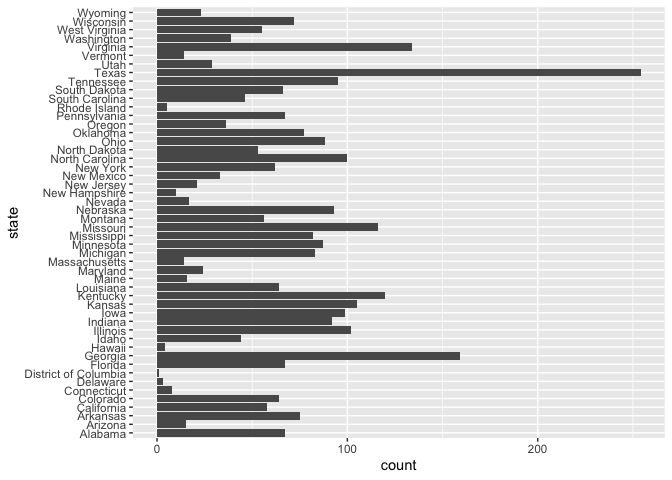<!-- -->

### Histograms

For continuous variables, you need to divide the range into *bins*. This
can be done using `geom_histogram`, which also takes only an `x` or `y`
argument. For example, the code below shows the number of counties by
percentage non-white population, which is divided into 10 bins
(deciles):

``` r
ggplot(us_demographics, aes(x=nonwhite_pct)) + 
  geom_histogram(bins=10, color="black")
```

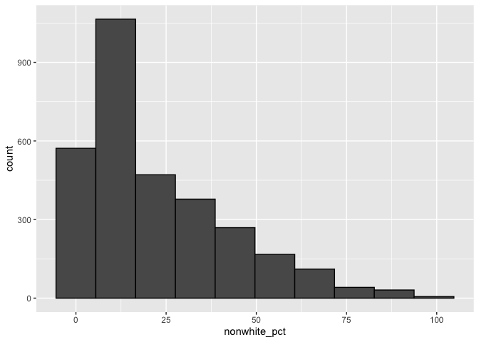<!-- -->

### Using geom_col instead of geom_bar

There are some more interesting options to explore with a bar plot, as
showcased by the plot below:

- You can also specify the summary value manually if you have already
  computed the statistic, for example for the votes in the election data
  loaded above. For this, use `geom_col` rather than `geom_bar` and
  specify both `x` and `y` aesthetic
- To create a grouped bar plot, specify a `fill` aesthetic and add
  `position_dodge2()` to the geom. (note: normally `position_dodge()`
  also works, but with a continuous grouping value like year you need
  `dodge2`)
- Often, a vertically arranged bar plot can be more readable than a
  horizontal one. However, if you prefer a horizontal plot, you can put
  the x markers at a 45 or 90 degree angle.

``` r
library(tidyverse)
elections <- read_csv('https://raw.githubusercontent.com/vanatteveldt/ccslearnr/master/data/US_Elections_years.csv')
elections |>
  complete(year, party, fill=list(votes=0)) |>
  ggplot(aes(x=party, y=votes, fill=year)) + geom_col(position=position_dodge2()) + 
  scale_x_discrete(guide = guide_axis(angle = 45)) + 
  ylab("")
```

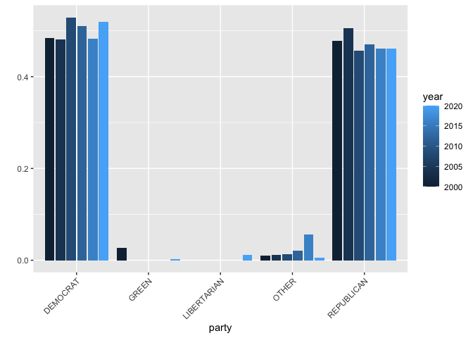<!-- -->

**Solution:**

``` r
# Option 1: You can add the as.factor(year) directly into the aesthetic : ----
library(tidyverse)
elections <- read_csv('https://raw.githubusercontent.com/vanatteveldt/ccslearnr/master/data/US_Elections_years.csv')
elections |>
  complete(year, party, fill=list(votes=0)) |>
  ggplot(aes(x=party, y=votes, fill=as.factor(year))) + geom_col(position=position_dodge2()) + 
  scale_x_discrete(guide = guide_axis(angle = 45)) + 
  ylab("")
```

<!-- -->

``` r
# Option 2: You can also call mutate first : ----
library(tidyverse)
elections <- read_csv('https://raw.githubusercontent.com/vanatteveldt/ccslearnr/master/data/US_Elections_years.csv')
elections |>
  complete(year, party, fill=list(votes=0)) |>
  mutate(year=as.factor(year)) |>
  ggplot(aes(x=party, y=votes, fill=year)) + geom_col(position=position_dodge2()) + 
  scale_x_discrete(guide = guide_axis(angle = 45)) + 
  ylab("")
```

<!-- -->

(note the use of complete to ensure that missing year-party combinations
are treated as zero).

**Exercise:** In the code above, `year` is a numeric variable, causing R
to create a gradient scale for it. Can you change year into a factor
(using `as.factor(year)`) in the code above? How does that change the
plot?

## Combining geoms

The plots below all had a single `geom`, creating a pure bar, line,
scatter or other plot. You can also combine elements, however, for
example adding a regression line through a scatter plot.

For example, consider the scatter plot we created earlier:

``` r
library(tidyverse)
demographics <- read_csv('https://raw.githubusercontent.com/vanatteveldt/ccslearnr/master/data/dutch_demographics.csv')
ggplot(demographics, aes(x = v57_density, y = c_65plus)) +
  geom_point()
```

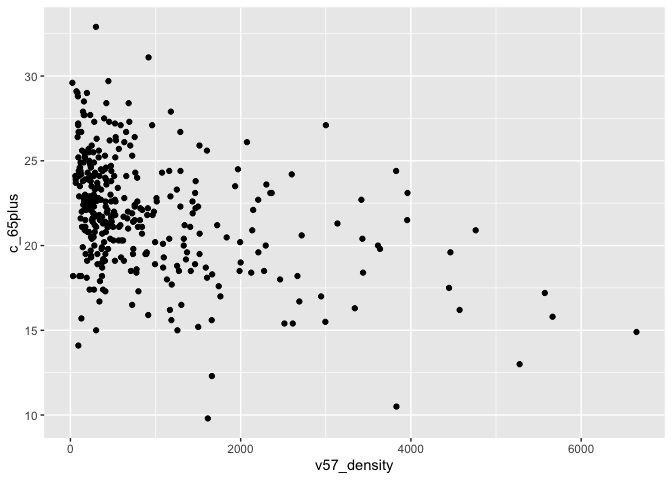<!-- -->

We can add a regression (trend) line to this plot by adding a
`geom_smooth` (using `lm`, i.e. a linear model), which conveniently uses
the same aesthetics as the scatter plot:

``` r
library(tidyverse)
demographics <- read_csv('https://raw.githubusercontent.com/vanatteveldt/ccslearnr/master/data/dutch_demographics.csv')
ggplot(demographics, aes(x = v57_density, y = c_65plus)) +
  geom_point() + 
  geom_smooth(method = lm)
```

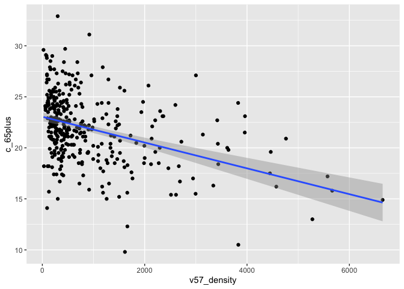<!-- -->

When adding multiple geoms, by default they use the data and aesthetics
from the `ggplot` call. However, you can override these by specifying
which data or aesthetics to use for a geom.

For example, we could add the names of selected municipalities, for
example the outliers. To do this, we would add a `geom_text()` with a
`label` aesthetic. However, if we would label all 345 points it would
quickly become a mess. For that reason, we can create a subset of the
data, and use that as the data for the `geom_text`:

``` r
subset = filter(demographics, c_65plus > 30 | v57_density > 4000)
ggplot(demographics, aes(x = v57_density, y = c_65plus)) +
  geom_point() + 
  geom_text(data=subset, aes(label=gemeente), nudge_y = -.5)
```

<!-- -->

**Solution:**

``` r
subset = filter(demographics, c_65plus > 30 | v57_density > 4000 | c_65plus < 15)
ggplot(demographics, aes(x = v57_density, y = c_65plus)) +
  geom_point() + 
  geom_text(data=subset, aes(label=gemeente), nudge_y = -.5)
```

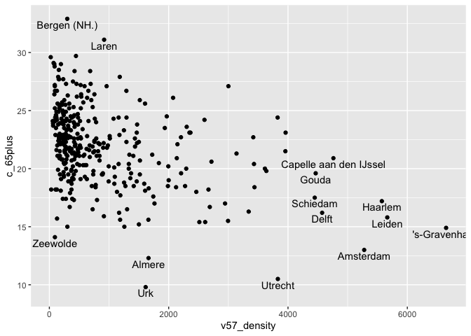<!-- -->

Some things to note here: - ggplot wants the data as first argument, and
the mapping as second. For geoms this is unfortunately the other way
around, so we specify that the first argument is the data by using
`data=subset` rather than just `geom_text(subset,...)` - `geom_text` now
has it’s own data, and we also specify a label aesthetic. The x and y
aesthetic (i.e. the label positions) are not overridden, so they use the
mapping from the `ggplot` call. - Finally, we use `nudge_y` to move all
labels a little bit down so they don’t overlap with the points.

**Exercise:** Can you add labels for the municipalities where less than
15% of the population is over 65? (hint: you can add another condition
to the existing filter call by adding another `|`)

## Creating high-quality graphs for reports

So far, we have mostly kept the default options for graphs and did not
spend too much attention to making them nicer to look at or easier to
read. This is fine if you’re visualising data as part of your own
analysis. If you want to include the visualizations in a report or
article, however, or present them to an audience, it is worth spending a
bit of time to make them both prettier and more informative.
Fortunately, `ggplot` gives you almost endless options to tweak any
aspect of each plot.

There are probably as many ideas on the ‘best’ visualization as there
are data scientists, and many aspects of what makes a graph beautiful or
informative are subjective. However, there are e number of things that
you should generally pay attention to:

- The graph should be understandable without reading any text in the
  rest of the paper or report. This means that titles and axis labels
  should immediately make it clear what the graph is about. As a rule of
  thumb, mention the most important relation or question you are
  answering in the title, and make sure that the axis labels do not
  contain strange abbreviations or technical terms.
- Make sure all elements are clearly readable and elements don’t overlap
  each other if it can be helped.
- Make sure the scales and legends are clear and make sense in terms of
  your data.

As an example, consider the first graph from the scatter plot section:

``` r
library(tidyverse)
demographics <- read_csv('https://raw.githubusercontent.com/vanatteveldt/ccslearnr/master/data/dutch_demographics.csv')
ggplot(demographics,
       aes(x = v57_density, y = c_65plus, size=v01_pop, color=v132_income)) +
  geom_point(alpha=.6)
```

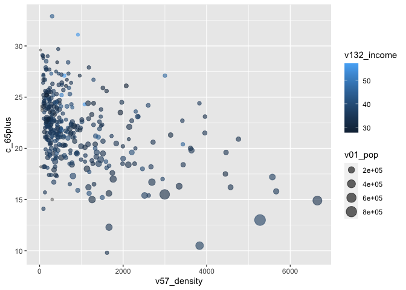<!-- -->

This graph is fairly informative: we can see that older people mostly
live in smaller, more rural, and somewhat richer communities. However,
if you were to show this graph to an outsider, they would not be able to
understand most of the this. It lacks a descriptive title, uses obscure
variable names for axis labels, uses scientific notation for the
population, and personally I find the default style a bit jarring.

These points can all be addressed by **adding extra elements** to the
plot. Specifically:

- You can add an overall `ggtitle` and horizontal and vertical axis
  labels (`xlab` and `ylab`)
- You can alter the way values are mapped between a column and the
  aesthetic element by adding the `scale_` functions. These functions
  are named for the aesthetic and optionally the data type, so for
  example `scale_size` changes the size aesthetic (for example changing
  the legend labels and name), while the `scale_color_gradient` creates
  a gradient scale for the color, where you can specify the colors on
  both ends of the gradient.
- Finally, you can select a `theme` and then add more `theme(..)`
  functions to change that theme, for example to change lines, fonts,
  etc.

The code below addresses most of these points, and as a bonus adds
labeling for some of the more interesting points by first creating a
subset of points to label, and then adding a second geom (`geom_text`)
using its own data and aesthetics (see the section on combining geoms).

``` r
library(tidyverse)
demographics <- read_csv('https://raw.githubusercontent.com/vanatteveldt/ccslearnr/master/data/dutch_demographics.csv')
highlight <- filter(demographics, v01_pop > 250000 | 
                      c_65plus > 30 | 
                      c_65plus > 25 & v57_density > 3000 |
                      c_65plus < 15)
ggplot(demographics,
       aes(x = v57_density, y = c_65plus, size=v01_pop, color=v132_income)) +
  geom_point(alpha=.6) + 
  xlim(0, 7000) + 
  geom_text(data=highlight, aes(label=gemeente), nudge_y = -1, size=3, color="coral") + 
  ggtitle("Where do older people live?",
          "Selected characteristics of Dutch municipalities") +
  xlab("Population density") + 
  ylab("Percentage of population aged 65+") + 
  scale_size(breaks=c(5000, 50000, 500000), labels=c("5.000", "50.000", "500.000"), name="Population") + 
  scale_color_gradient(low="coral", high="darkblue", name="Household\nIncome") +
  theme_classic() + theme(axis.title = element_text(size=12))
```

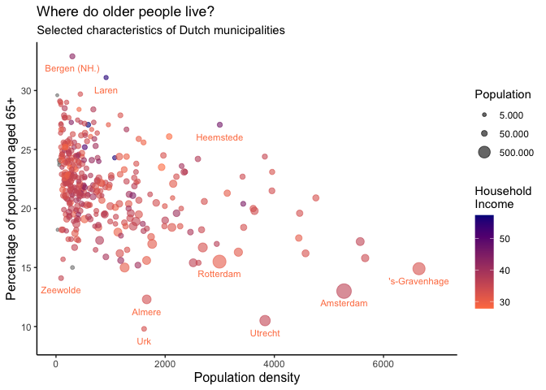<!-- -->

Have a look at the code above and see if you understand how the
different elements combine to create the plot. Can you change the
highlighting criteria to label different points?

As an exercise, pick any of the earlier graphs from this handout, and
see if you can turn it into a beautiful and informative visualization!
