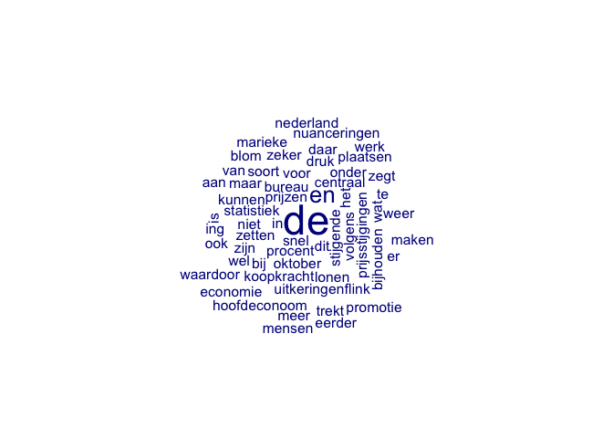

R basics: Getting started
================
Kasper Welbers, Wouter van Atteveldt & Philipp Masur
2021-10

-   [Introduction](#introduction)
    -   [What is R and why should you learn
        it?](#what-is-r-and-why-should-you-learn-it)
    -   [Using RStudio](#using-rstudio)
    -   [Running code from the R
        script](#running-code-from-the-r-script)
    -   [Assigning values to names](#assigning-values-to-names)
-   [Data types](#data-types)
    -   [Numeric](#numeric)
    -   [Character](#character)
-   [Data structures](#data-structures)
    -   [Vector](#vector)
        -   [Selecting elements](#selecting-elements)
    -   [Data.frame](#dataframe)
        -   [Selecting rows, columns and
            elements](#selecting-rows-columns-and-elements)
        -   [Subsetting, adding and modifying
            data](#subsetting-adding-and-modifying-data)
    -   [Other common data structures](#other-common-data-structures)
-   [Importing and saving data](#importing-and-saving-data)
-   [Functions](#functions)
    -   [What is a function?](#what-is-a-function)
    -   [Using functions](#using-functions)
        -   [Viewing and interpreting function
            documentation](#viewing-and-interpreting-function-documentation)
    -   [Functions with multiple
        arguments](#functions-with-multiple-arguments)

# Introduction

## What is R and why should you learn it?

R is an open-source statistical software language, that is currently
among the most popular languages for data science. In comparison to
other popular software packages in social scientific research, such as
SPSS and Stata, R has several notable advantages:

-   R is a programming language, which makes it much more versatile.
    While R focuses on statistical analysis at heart, it facilitates a
    wide-range of features, and virtually any tool for data science can
    be implemented.
-   The range of things you can do with R is constantly being updated. R
    is open-source, meaning that anyone can contribute to its
    development. In particular, people can develop new *packages*, that
    can easily and safely be installed from within R with a single
    command. Since many scholars and industry professionals use R, it is
    likely that any cutting-edge and bleeding-edge techniques that you
    are interested in are already available. You can think of it as an
    app-store for all your data-science needs!
-   R is free. While for students this is not yet a big deal due to free
    or cheap student and university licences, this can be a big plus in
    the commercial sector. Especially for small businesses and
    free-lancers.

## Using RStudio

Once you have installed R and RStudio, you can start by launching
RStudio. If everything was installed correctly, RStudio will
automatically launch R as well. The first time you open RStudio, you
will likely see three separate windows. The first thing you want to do
is open an R Script to work in. To do so, go to the toolbar and select
File -&gt; New File -&gt; R Script.

You will now see four windows split evenly over the four corners of your
screen:

-   In the **top-left** you have the text editor for the file that you
    are working in. This will most of the time be an R script or
    RMarkdown file.
-   In the **top-right** you can see the data and values that you are
    currently working with (environment) or view your history of input.
-   In the **bottom-left** you have the console, which is where you can
    enter and run code, and view the output. If you run code from your R
    script, it will also be executed in this console.
-   In the **bottom-right** you can browse through files on your
    computer, view help for functions, or view visualizations.

While you can directly enter code into your console (bottom-left), you
should always work with R scripts (top-left). This allows you to keep
track of what you are doing and save every step.

## Running code from the R script

Copy and paste the following example code into your R Script. For now,
don’t bother understanding the syntax itself. Just focus on running it.

``` r
3 + 3
2 * 5
(6 / 2) * 3
"some text"
"some more text"
sum(1,2,3,4,5)   ## using a function
```

You can **run** parts of the code in an R script by pressing Ctrl +
Enter (on mac this is command + Enter). This can be done in two ways:

-   If you select a piece of text (so that it is highlighted) you can
    press Ctrl + Enter to run the selection. For example, select the
    first three lines (the three mathematical operations) and press
    Ctrl + Enter.
-   If you haven’t made a selection, but your text cursor is in the
    editor, you can press Ctrl + Enter to run the line where the cursor
    is at. This will also move the cursor to the next line, so you can
    *walk* through the code from top to bottom, running each line. Try
    starting on the first line, and pressing Ctrl + Enter six times, to
    run each line separately.

## Assigning values to names

When running the example code, you saw that R automatically
**evaluates** expressions. The calculation 3+3 evaluates to 6, and 2\*5
evaluates to 10. You also saw that the **function** *sum(1,2,3,4,5)*
evaluates to 15 (the sum of the numbers). For now, one more thing that
you need to know about the R syntax is how values can be **assigned** to
variables (or objects).

In plain terms, **assignment** is how you make R remember things by
assigning them a name. This works the same way for all sorts of values,
from single numbers to entire datasets. You can choose whether you
prefer the equal sign (=) or the arrow (&lt;-) for assignment.

``` r
x = 2
y <- "some text"
```

Here we have remembered the number 2 as **x** and the text “some text”
as **y**. If you are working in RStudio (which you should), you can now
also see these names and values in the topright window, under the
“Environment” tab.

We can now use the names to retrieve the values, or to use these values
in new commands.

``` r
x * 5
```

    ## [1] 10

# Data types

Data types concern the different types that single values in data can
have. The most basic data types in R are:

-   numeric (numbers)
-   character (text)
-   factor (categorical data)
-   logical (True or False)

In addition, there are special types for data such as date/time values.

-   Date (calendar dates) or POSIXlt (calendar dates and times).

## Numeric

Numbers. As simple as is gets. You can use them to do the math you know
and love.

``` r
x <- 5     ## assign a number to the name x
class(x)   ## view the class of the value assigned to x
```

    ## [1] "numeric"

``` r
x + 3
```

    ## [1] 8

``` r
x / 2
```

    ## [1] 2.5

``` r
log(x)     ## logarithm
```

    ## [1] 1.609438

``` r
sqrt(x)    ## square root
```

    ## [1] 2.236068

## Character

Textual data (recognizable by the quotes), either as single characters,
entire words, or even full texts.

``` r
x <- "Some text"  ## assign text to the name x
class(x)          ## view the class of the value assigned to x
```

    ## [1] "character"

It’s important to recognize the distinction between names and character
values. In the above example, x is the name to which the text “some
text” has been assigned. Whether a word is a name or a character value
is indicated with quotes.

``` r
x       ## get value assigned to the name x
```

    ## [1] "Some text"

``` r
"x"     ## the text "x"
```

    ## [1] "x"

Naturally, you cannot perform math with character data. Using the wrong
data type will generally yield an error, as seen here.

``` r
sum(x)
```

It’s import to recognize these types of errors, because they are
terribly common. You might have imported data in which a column that’s
supposed to contain numbers accidentally contains a word, in which case
R will consider the column to be column of character values.

Note that you can express a number as a character value, e.g., “1”,
“999”, but not a text as a numerical value. If it is possible to convert
a value to a different type, you can do so with the **as** method:

``` r
x <- "999"
x <- as.numeric(x)     ## converts character to numeric
x

y <- 999
y <- as.character(y)   ## converts numeric to character
y

z <- "nein nein nein"
z <- as.numeric(z)     ## tries to convert character to numeric, but fails 
z
```

# Data structures

In SPSS or Excel, data is always organized in a rectangular data frame,
with cells arranged in rows and columns. Typically, the rows then
represent cases (e.g., respondents, participants, newspaper articles)
and columns represent variables (e.g., age, gender, date, medium). For
most analyses, this is also the recommended data format in R, using the
*data.frame* structure. However, an important difference is that in R it
is possible, and often usefull, to combine different formats. Also, to
understand how a *data.frame* in R works, it is useful to understand
that a *data.frame* is a collection of *vectors*, and thus it is useful
to first understand how *vectors* work.

Here we will first briefly discuss *vectors*, and then quickly move on
to *data.frames*. In addition, we will mention *matrices* and *lists* on
a good-to-know-about basis.

## Vector

The concept of a vector might be confusing from a social science
background, because we rarely use the term in the context of statistics
(well, not consciously at least). We won’t address why R calls them
vectors and how this relates to vector algebra, but only how you most
commonly use them.

A vector in R is a **sequence** of **one or more values** of the **same
data type** From a social science background, it is very similar to what
we often call a **variable**.

You can declare a vector in R with `c(...)`, where between the
parentheses you enter the elements, separated with commas. The number of
elements is called the length of the vector. A vector can have any of
the data types discussed above (numeric, character, factor, logical,
Date).

``` r
v1 <- c(1, 2, 10, 15)    ## a numeric vector of length 4
v2 <- c("a", "b", "b")   ## a character vector of length 3
v3 <- 1:10               ## a numeric vector of length 10 with the values 1 to 10. 
```

If you combine data types in the same vector, R will generally use the
broadest data type for the entire vector. For example, we saw earlier
that a number can be expressed as a character value, but a text cannot
be expressed as a numerical. Accordingly, if we combine both types in a
vector, R will convert the numerical values to character values.

``` r
c(1, 2, "c")            ## becomes a character vector of length 3
```

    ## [1] "1" "2" "c"

Since vectors can only have one type, we can perform type specific
operations with them. In many ways, we can work with them in the same
way as we can work with single values. In fact, single values are
actually just vectors of length 1. For example, if we have a vector of
numeric type, also called a numeric vector, we can perform calculations.

``` r
x <- c( 1, 2, 3, 4, 5)
y <- c(10,20,30,40,50)
x + y     ## for 2 vectors of same size calculations are pairwise (1 + 10, 2 + 20, etc.)
```

    ## [1] 11 22 33 44 55

``` r
x + 10    ## for a vector and single value, the value is repeated (1 + 10, 2 + 10, etc.)
```

    ## [1] 11 12 13 14 15

### Selecting elements

There are two common ways to select a specific element or a range of
elements from a vector. One is to give the indices (positions) of the
elements in square brackets after the vector name. Note that the indices
themselves are given as a numeric vector.

``` r
x <- c('a','b','c','d','e','f','g')  
x[5]            ## select the fifth element
```

    ## [1] "e"

``` r
x[c(1,3)]       ## select the first and third elements
```

    ## [1] "a" "c"

``` r
x[2:5]          ## select elements two to five
```

    ## [1] "b" "c" "d" "e"

If you select with indices, the specific order of the indices is used,
and you can also repeat indices. This can for instance be used to sort
data.

``` r
x[5:1]          ## select elements in positions 5 to 1
```

    ## [1] "e" "d" "c" "b" "a"

``` r
x[c(5,5,5)]     ## select the element in position 5 multiple times
```

    ## [1] "e" "e" "e"

You can also use negative indices to select everything except the
specified elements.

``` r
x[-5]            ## select every element except the fifth
```

    ## [1] "a" "b" "c" "d" "f" "g"

``` r
x[-c(1,3)]       ## select every element other than the first and third
```

    ## [1] "b" "d" "e" "f" "g"

## Data.frame

A *data.frame* is essentially a collection of vectors with the same
length, tied together as columns. To create the *data.frame*, we use the
`data.frame()` function. We enter the vectors in the format:
`column_name = vector`. Here we create a *data.frame* for data from a
fictional experiment.

``` r
d <- data.frame(id =        1:10,
                condition = c('E', 'E', 'C', 'C', 'C', 'E', 'E', 'E', 'C', 'C'),
                gender =    c('M', 'M', 'F', 'M', 'F', 'F', 'F', 'M', 'M', 'F'),
                age =       c( 17,  19,  22,  18,  16,  21,  18,  17,  26,  18),
                score_t1 =  c(8.0, 6.0, 7.5, 6.8, 8.0, 6.4, 6.0, 3.2, 7.3, 6.8),
                score_t2 =  c(8.3, 6.4, 7.7, 6.3, 7.5, 6.4, 6.2, 3.6, 7.0, 6.5))
d
```

    ##    id condition gender age score_t1 score_t2
    ## 1   1         E      M  17      8.0      8.3
    ## 2   2         E      M  19      6.0      6.4
    ## 3   3         C      F  22      7.5      7.7
    ## 4   4         C      M  18      6.8      6.3
    ## 5   5         C      F  16      8.0      7.5
    ## 6   6         E      F  21      6.4      6.4
    ## 7   7         E      F  18      6.0      6.2
    ## 8   8         E      M  17      3.2      3.6
    ## 9   9         C      M  26      7.3      7.0
    ## 10 10         C      F  18      6.8      6.5

Now, the data structure clearly implies that there is a relation between
the elements in the *column vectors*. In other words, that each row
represents a *case*. In our example, these cases are participants, and
the columns represent:

-   the participant **id**.
-   the experimental **condition** (E = experimental condition, C =
    control group)
-   demographic variables: **gender** and **age**.
-   test scores before and after the experimental condition:
    **score\_t1** and **score\_t2**

### Selecting rows, columns and elements

Since data.frames have both rows and columns, we need to use both to
select data. Similar to selection in vectors, we use the square
brackets. The difference is that for data.frames the square brackets
have two parts, separated by a comma. Assuming our data.frame is called
`d`, we can select with:

| syntax   | meaning                                  |
|----------|------------------------------------------|
| d\[i,j\] | select rows (i) and columns (j)          |
| d\[i, \] | select only rows (i) and use all columns |
| d\[ ,j\] | select only columns (j) and use all rows |

Selection for rows (i) and columns (j) works identical to selection in
vectors. You can use either a numeric vector with indices, or a logical
vector. Accordingly, you can also use comparisons.

In addition, there are two special ways to select columns. One is that j
can be a character vector with column names. The other uses the dollar
sign ($).

| syntax               | meaning                                         |
|----------------------|-------------------------------------------------|
| d\[ ,c(“c1”, “c2”)\] | select the columns with the names “c1” and “c2” |
| d$id                 | select the column named id                      |

#### selecting columns

Let’s put this to practice, starting with columns:

``` r
## selecting a single column returns a vector
d[,1]             ## select the first column by index 
```

    ##  [1]  1  2  3  4  5  6  7  8  9 10

``` r
d[,"id"]          ## select the id column by name
```

    ##  [1]  1  2  3  4  5  6  7  8  9 10

``` r
d$id              ## select the id column using the dollar sign
```

    ##  [1]  1  2  3  4  5  6  7  8  9 10

``` r
## selecting multiple columns returns a data.frame
d[,1:2]           ## select the first two columns by indices
```

    ##    id condition
    ## 1   1         E
    ## 2   2         E
    ## 3   3         C
    ## 4   4         C
    ## 5   5         C
    ## 6   6         E
    ## 7   7         E
    ## 8   8         E
    ## 9   9         C
    ## 10 10         C

``` r
d[,c("id","age")] ## select the "id" and "age" columns by name
```

    ##    id age
    ## 1   1  17
    ## 2   2  19
    ## 3   3  22
    ## 4   4  18
    ## 5   5  16
    ## 6   6  21
    ## 7   7  18
    ## 8   8  17
    ## 9   9  26
    ## 10 10  18

``` r
d[,-1]            ## select every column except for the first  
```

    ##    condition gender age score_t1 score_t2
    ## 1          E      M  17      8.0      8.3
    ## 2          E      M  19      6.0      6.4
    ## 3          C      F  22      7.5      7.7
    ## 4          C      M  18      6.8      6.3
    ## 5          C      F  16      8.0      7.5
    ## 6          E      F  21      6.4      6.4
    ## 7          E      F  18      6.0      6.2
    ## 8          E      M  17      3.2      3.6
    ## 9          C      M  26      7.3      7.0
    ## 10         C      F  18      6.8      6.5

#### selecting rows

Selecting rows is practically identical to selecting elements from
vectors, and it conveniently returns a data.frame with all columns and
their matched positions intact.

``` r
d[1:5,]    ## select first 5 rows
```

    ##   id condition gender age score_t1 score_t2
    ## 1  1         E      M  17      8.0      8.3
    ## 2  2         E      M  19      6.0      6.4
    ## 3  3         C      F  22      7.5      7.7
    ## 4  4         C      M  18      6.8      6.3
    ## 5  5         C      F  16      8.0      7.5

A very useful additional trick is that you can use all the columns to
make comparisons. For example, we can use the gender column to look up
all elements for which the value is “M” (male), and use this to select
rows.

``` r
d[d$gender == "M", ]       
```

    ##   id condition gender age score_t1 score_t2
    ## 1  1         E      M  17      8.0      8.3
    ## 2  2         E      M  19      6.0      6.4
    ## 4  4         C      M  18      6.8      6.3
    ## 8  8         E      M  17      3.2      3.6
    ## 9  9         C      M  26      7.3      7.0

You can combine this with the logical operators to make a selection
using multiple columns. Logical operators are explained in detail at the
bottom of this document. For now, you only need to understand that we
can use the **&** (AND) operator to say that we want two comparisons to
be TRUE (d$gender == “F” AND d$age == 21).

``` r
d[d$gender == "F" & d$age == 21, ]    ## 21 year old female participant(s)
```

    ##   id condition gender age score_t1 score_t2
    ## 6  6         E      F  21      6.4      6.4

``` r
d[d$score_t1 < d$score_t2,]           ## participants that scored higher after the condition
```

    ##   id condition gender age score_t1 score_t2
    ## 1  1         E      M  17      8.0      8.3
    ## 2  2         E      M  19      6.0      6.4
    ## 3  3         C      F  22      7.5      7.7
    ## 7  7         E      F  18      6.0      6.2
    ## 8  8         E      M  17      3.2      3.6

#### selecting rows and columns

We can combine row and column selection. This works just like you’d
expect it to, so there’s little to add here. Do note, however, that you
can combine the different selection methods.

``` r
d[d$gender == "F", "score_t1"]    ## get the score_t1 column for female participants
```

    ## [1] 7.5 8.0 6.4 6.0 6.8

``` r
d[d$gender == "F",]$score_t1      ## identical, but first subset data.frame, then select column
```

    ## [1] 7.5 8.0 6.4 6.0 6.8

``` r
d$score_t1[d$gender == "F"]       ## identical, but first select column vector, then subset vector
```

    ## [1] 7.5 8.0 6.4 6.0 6.8

### Subsetting, adding and modifying data

*Exercise 1:* With the selection techniques you already learned how to
create a subset of the data. Try to subset the data so that only
participants in the condition “E” are included. Assign this subset to a
new name. Create a second subset in which only the variables *id*,
*gender*, and *age* are included. Assign this subset to a different
name.

``` r
# Subset of experimental group
d_experimental <- d[d$condition == "E",]
d_experimental
```

    ##   id condition gender age score_t1 score_t2
    ## 1  1         E      M  17      8.0      8.3
    ## 2  2         E      M  19      6.0      6.4
    ## 6  6         E      F  21      6.4      6.4
    ## 7  7         E      F  18      6.0      6.2
    ## 8  8         E      M  17      3.2      3.6

``` r
# Subset with socio-demographics variables
d_sociodem <- d[, c("id", "age", "gender")]
d_sociodem <- d[, c(1, 3, 4)]         ## alternative using position
d_sociodem
```

    ##    id gender age
    ## 1   1      M  17
    ## 2   2      M  19
    ## 3   3      F  22
    ## 4   4      M  18
    ## 5   5      F  16
    ## 6   6      F  21
    ## 7   7      F  18
    ## 8   8      M  17
    ## 9   9      M  26
    ## 10 10      F  18

## Other common data structures

There are other common data structures, such as the `matrix` and `list`.
Packages can also provide new classes for organizing and manipulating
data, such as quanteda’s document-feature matrix (dfm).

# Importing and saving data

Of course, we can also save a data.frame in our computer. We therefore
can use a variety of formats (e.g., .RData, .csv…). When saving, it is
always important to understand *where* we are saving file to. Each R
sessions is connected to a particular folder on your computer. We can
check where we are by using the function `getwd()` which stands for “get
the current working directory”. This resulting path is where the data
will be stored.

``` r
# Where are we currently on our computer?
getwd()

# Save and load an RData file
save(d, file = "test_data.RData")   ## file = file and/or connection to write to
load(file = "test_data.RData")

# Save and load a csv file
write_csv(d, file = "test_data.csv")
d2 <- read_csv(file = "test_data.csv", )
d2
```

In the following practical sessions, we will often load data directly
from the internet. Yet, you can always also download the data, store it
in some readable format (most preferably a csv-file) and than load it
manually.

# Functions

Where data types and structures concern how data is respresented in R,
functions are the tools that you use to read, create, manage,
manipulate, analyze and visualize data.

## What is a function?

There are many correct and formal ways to define what functions are, but
for the sake of simplicity we will focus on an informal description of
how you can think of functions in R:

-   A function has the form:
    `output <- function_name(argument1, argument2, ...)`
    -   **function\_name** is a name to indicate which function you want
        to use. It is followed by parentheses.
    -   **arguments** are the input of the function, and are inserted
        within the parentheses. Arguments can be any R object, such as
        numbers, strings, vectors and data.frames. Multiple arguments
        can be given, separated by commas.
    -   **output** is anything that is returned by the function, such as
        vectors, data.frames or the results of a statistical analysis.
        Some functions do not have output, but produce a visualization
        or write data to disk.
-   The purpose of a function is to make it easy to perform a (large)
    set of (complex) operations. This is crucial, because
    -   It makes code easier to understand. You don’t need to see the
        operations, just the name of the function that performs them
    -   You don’t need to understand the operations, just how to use the
        function

For example, say that you need to calculate the square root of a number.
This is a very common thing to do in statistical analysis, but it
actually requires a quite complicated set of operations to perform. This
is when you want to use a function, in this case the `sqrt` (square
root) function.

``` r
sqrt(5)
```

    ## [1] 2.236068

In this example, the function name is `sqrt`. The input is the single
argument `5`. If you run this code, it produces the output `2.236068`.
Currently, R will simply print this output in your Console, but as you
learned before, we can assign this output to a name.

``` r
square_root <- sqrt(5)
```

This simple process of input -&gt; function -&gt; output is essentially
how you work with R most of the times. You have data in some form. You
provide this data as input to a function, and R generates output. You
can assign the output to a name to use it in the next steps, or the
output is a table with results or a visualization that you want to
interpret.

## Using functions

Above you saw the simple function `sqrt()`, that given a single number
as input returned a single number as output. As you have also seen in
the first week, functions can have multiple arguments as input. Consider
this function here:

``` r
mean(x = c(1, 2, NA, 1, 2, 5), na.rm = TRUE)
```

    ## [1] 2.2

This function, with the name `mean`, is given several arguments here:
`x` and `na.rm`. Given this input, many operations are performed behind
the scenes to create the arithmetic mean of the vector.

By now we hope you have realized just how broad the use of functions is.
The *R syntax* for performing basic mathematical operations such as
`sqrt()` is essentially the same as the syntax for creating a mean,
performing advances statistical analysis or creating powerful
visualizations. Accordingly, if you understand this syntax, you can do
almost anything in R.

The many R packages that you can install are mostly just collections of
functions (some also provide new **classes**, which we’ll save for
later). We will now show how you can learn how to use each function by
knowing how to view and interpret it’s documentation page.

### Viewing and interpreting function documentation

You can access the documentation of a function by typing a question mark
in front of the function name, and running the line of code. Let’s do
this to view the documentation of the `sqrt()` function

``` r
?sqrt
```

If you run this in RStudio, the help page will pop-up in the
bottom-right corner, under the *Help* tab page. Sometimes, if the name
of a documentation page is used in multiple packages, you will first
receive a list of these packages from which you will have to select the
page.

For the `sqrt()` function, the help page has the **title**
“Miscellaneous Mathematical Functions”. Just below the title, you see
the **Description**, in which the author of a function briefly describes
what the function is for. Here we see that there are two functions that
are grouped under “Miscellaneous Mathematical Functions”, the `abs()`
function for computing the absolute value of a number `x`, and the
`sqrt()` function for the square root.

Under description, the **Usage** is shown. This is simply the name of
the function or functions, and the possible arguments that you can use.
Here the Usage is extremely simple: both functions only take one
argument named `x`. In a minute, we’ll discuss functions with multiple
arguments.

Below usage, the **Arguments** section explains how to use each
argument. Here, the only argument is `x`, and it is explained that x is
“a numeric or complex vector or array”. For now, let’s focus only on the
case of a numeric vector. It appears that in addition to giving a single
value like above (recall that in R this is actually a vector of length
1) we can give a vector with multiple numbers.

``` r
sqrt(c(1,2,3,4,5))
```

    ## [1] 1.000000 1.414214 1.732051 2.000000 2.236068

There are more parts to the documentation that we’ll ignore for now.
Notable parts to look into for yourself are **Details**, that provides
more information, and the **Examples** section at the very bottom, which
is a great starting point to see a function in action.

## Functions with multiple arguments

Now, let’s move to a function with multiple arguments. We’ll look at the
`tokens()` and `dfm()` functions from the `quanteda` package. To access
this function, we first have to install the package using
`install.packages('quanteda')` and the run `library(quanteda)`, to tell
R that we want to be able to access the functions in this package.

``` r
# install.packages("quanteda")  ## only once on each computer
library(quanteda)               ## each time we want to use the functions from the package
?tokens
```

First note that the title and description nicely summarize what this
function is for: constructing a tokens object. Now, when we look at the
**Usage** section, we see that there are multiple arguments given
between the parentheses, and all these arguments are explained in the
**Arguments** section.

An important part of the usage syntax, that we haven’t seen in the
`sqrt()` function, is that all arguments other than `x` have a value
assigned to them, in the form `argument = value`. The argument
`remove_punct` has the value `FALSE`, `remove_symbols` has the value
`FALSE`, etc.

These are the default values for these argument, that are used if the
user does not specify them. This way, We can use the `dfm()` function
with the default settings by only entering the `x` argument.

``` r
example_texts <- c("Some example text.", "Some more text!")
tokens(example_texts)
```

    ## Tokens consisting of 2 documents.
    ## text1 :
    ## [1] "Some"    "example" "text"    "."      
    ## 
    ## text2 :
    ## [1] "Some" "more" "text" "!"

``` r
tokens(example_texts, remove_punct = TRUE)
```

    ## Tokens consisting of 2 documents.
    ## text1 :
    ## [1] "Some"    "example" "text"   
    ## 
    ## text2 :
    ## [1] "Some" "more" "text"

If we run this line of code, it returns a serialized list of integers
corresponding to a vector of types. Note that in the second example,
both texts no longer include punctuation symbols, because the
`remove_punct` argument (that is described as “logical; if TRUE remove
all characters in the Unicode ‘Punctuation’ \[P\] class”) is now
explicitly changed to *TRUE*.

Arguments that don’t have a default value, such as `x` in the `tokens()`
function, are mandatory. Running the following line of code will give
the error `argument "x" is missing, with no default`.

``` r
tokens()
```

It is often the case that in addition to the mandatory arguments you
want to specify some specific other arguments. For this, there are two
ways to *pass* arguments to a function.

-   Use the same order in which they are specified in **Usage**
-   Pass the arguments with their respective names

To demonstrate passing by order, let’s run the `dfm()` function around
the tokenized text, but with an implicit input for `tolower`.

``` r
dfm(tokens(example_texts))
```

    ## Document-feature matrix of: 2 documents, 6 features (33.33% sparse) and 0 docvars.
    ##        features
    ## docs    some example text . more !
    ##   text1    1       1    1 1    0 0
    ##   text2    1       0    1 0    1 1

``` r
dfm(tokens(example_texts, remove_punct = TRUE), TRUE)
```

    ## Document-feature matrix of: 2 documents, 4 features (25.00% sparse) and 0 docvars.
    ##        features
    ## docs    some example text more
    ##   text1    1       1    1    0
    ##   text2    1       0    1    1

In the output we see a document-feature matrix. The words are still made
lowercase, since we passed `TRUE` to `tolower`, which was also the
default value.

*Exercise 2*: Copy a longer text from the internet and save it as a text
object in R. Use the function `tokens()` to separate each word (make
sure punctuations and numbers are removed) and create a
document-feature-matrix with `dfm()`. Try if you can further install the
package `quanteda.textplots`. It contains a function called
`textplot_wordcloud()`. If you pass the document-feature-matrix as first
argument, you will create a word cload from your chosen text.

``` r
text <- "De snel stijgende prijzen – 3,4 procent in oktober volgens het Centraal Bureau voor de Statistiek – zetten de koopkracht onder druk. Lonen en zeker uitkeringen kunnen dit soort prijsstijgingen niet bijhouden. Maar daar zijn wel wat nuanceringen bij te plaatsen, zegt hoofdeconoom Marieke Blom van ING Nederland. ‘De economie trekt ook weer flink aan, waardoor er meer werk is en mensen eerder promotie maken.’"

# create tokens and remove punctuation and numbers
token_text <- tokens(text, remove_punct = T, remove_numbers = T)
token_text
```

    ## Tokens consisting of 1 document.
    ## text1 :
    ##  [1] "De"        "snel"      "stijgende" "prijzen"   "procent"   "in"       
    ##  [7] "oktober"   "volgens"   "het"       "Centraal"  "Bureau"    "voor"     
    ## [ ... and 50 more ]

``` r
# create document-feature-matrix
dtm_text <- dfm(token_text)
dtm_text
```

    ## Document-feature matrix of: 1 document, 58 features (0.00% sparse) and 0 docvars.
    ##        features
    ## docs    de snel stijgende prijzen procent in oktober volgens het centraal
    ##   text1  4    1         1       1       1  1       1       1   1        1
    ## [ reached max_nfeat ... 48 more features ]

``` r
# install.packages("quanteda.textplots")
library(quanteda.textplots)
textplot_wordcloud(dtm_text, min_count = 1)
```

<!-- -->
