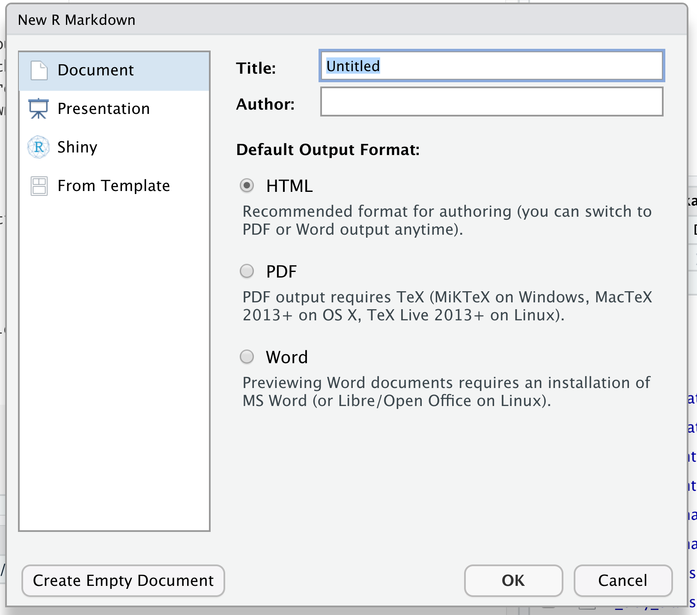
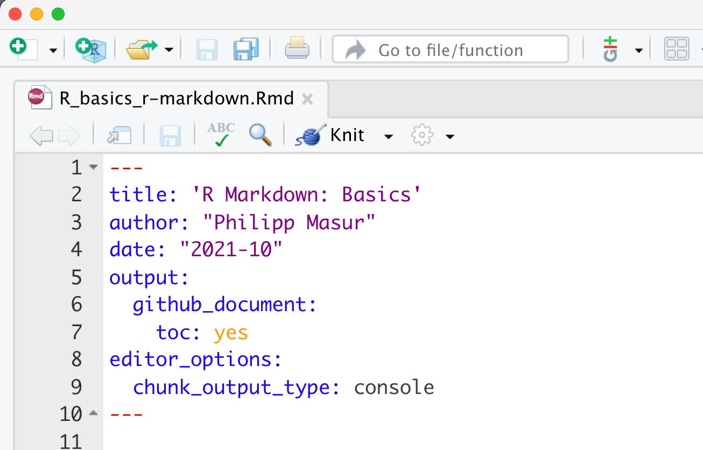

R Markdown: Basics
================
Philipp Masur
2021-10

-   [Introduction](#introduction)
    -   [Creating a RMarkdown file](#creating-a-rmarkdown-file)
-   [Understanding an RMarkdown file](#understanding-an-rmarkdown-file)
    -   [Structure](#structure)
        -   [Metadata](#metadata)
        -   [Text](#text)
        -   [Code](#code)
-   [Formatting in Markdown](#formatting-in-markdown)
    -   [Inline formatting](#inline-formatting)
    -   [Headers](#headers)
    -   [Lists](#lists)
-   [Rendering / “knitting”](#rendering--knitting)

# Introduction

In the practical sessions, we have so far worked with R-Script (files
ending with *.r*). In such documents, we can only write R code. Anything
else needs to be designated as a comment using the `#`. However, there
are other types of documents that we can use in RStudio. One of the most
versatile formats is a so-called RMarkdown-file (files ending with
*.rmd*). These files use a leight-weight markup language called
*markdown*, which allows to produce formatted text alongside
well-rendered R code and easily create readable output formats (e.g.,
PDF or HTML).

In this tutorial, we will explain how RMarkdown documents work and how
you can use them for your homework and group assignments. This will be a
light introduction to RMarkdown that is nonetheless sufficient to
complete these assignments successfully. However, if you want to learn
more about RMarkdown in generally, we recommend to checkout the online
book “R Markdown: The Definitive Guide” by Yihui Xi et al. (Link:
<https://bookdown.org/yihui/rmarkdown/>).

If you prefer a video introduction to R Markdown, we recommend that you
check out the website <https://rmarkdown.rstudio.com>, and watch the
videos in the “Get Started” section, which cover the basics of R
Markdown.

## Creating a RMarkdown file

First, you may wonder how you can create a markdown file. Similar to
creating an R-Script, we simply go to
`File -> New File -> RMarkdown...`. This will open a new window (see
below) in which you can enter a title, your name and choose a specific
output format. We recommend to use the HTML format as it does not
require any additional engines (such as e.g., TeX).

 *Figure 1:* The “New R Markdown” Dialog Window.

# Understanding an RMarkdown file

## Structure

For your homework assignments, however, you will always receive a
RMarkdown Template in which we ask you to write your code and
potentially also answers to questions. There are three basic components
of an R Markdown document:

-   the metadata
-   text
-   code.

### Metadata

The metadata is always at the top and written between a pair of three
dashes `---` . If you have created a new RMarkdown document, simple
metadata will automatically be generated:

``` r
---
title: "Untitled"
output: html_document
---
```

In your homework assignments, you will always work with predefined
templates, in which the metadata may be a bit more elaborate:

``` r
# Adjusted meta information (e.g., as in your homework template)
---
title: 'Homework 1: Basic Data Wrangling '
author: "Philipp Masur"
date: ""
output:
  html_document:
    toc: yes
editor_options:
  chunk_output_type: console
---
```

Within the three `---`, we can specifiy some general aspects of the
document such as output format, whether or not a table of content should
be included, and how the code and output should look like. The syntax
for the metadata is YAML (YAML Ain’t Markup Language,
<https://en.wikipedia.org/wiki/YAML>), so sometimes it is also called
the YAML metadata or the YAML frontmatter.

### Text

The body of the document follows the metadata. Within the body, we can
write plain text and use the actual Markup Language *Markdown*. We
explain some general formatting commands further below.

### Code

A code chunk starts with three backticks like ```` ```{r} ```` where *r*
indicates the language name, and ends with three backticks ```` ``` ````
. Within these chunks, you can write code as if you were in a typical
R-script. Text within these chunks must hence be commented with `#`.

 *Figure
2:* A typical RMardown document with meta data, text, and a code chunk
(grey).

# Formatting in Markdown

## Inline formatting

Inline text will be italic if surrounded by underscores or asterisks,
e.g., `_text_` or `*text*`. Bold text is produced using a pair of double
asterisks (`**text**`). A pair of tildes (`~`) turn text to a subscript
(e.g., `H~3~PO~4~` renders H<sub>3</sub>PO<sub>4</sub>). A pair of
carets (`^`) produce a superscript (e.g., `Cu^2+^` renders
Cu<sup>2+</sup>).

## Headers

Section headers can be written after a number of pound signs, e.g.,

``` r
# First-level header

## Second-level header

### Third-level header
```

## Lists

Unordered list items start with \*, -, or +, and you can nest one list
within another list by indenting the sub-list:

``` r
- one item
- one item
- one item
    - one more item
    - one more item
    - one more item
```

The output is:

-   one item
-   one item
-   one item
    -   one more item
    -   one more item
    -   one more item

# Rendering / “knitting”

At this point, you may wonder why going through all of this trouble?
Well, in the end, we can render this RMarkdown document and - depending
on the type of output format we specified in the meta-data - produce a
nice looking output file.

The easiest way is to klick on the “knit” button (a small ball of wool)
at the top of the script window:



The corresponding keyboard shortcut is Ctrl + Shift + K (Cmd + Shift + K
on macOS). This will create the output in the same folder in which the
RMarkdown document was stored. For your homework assignment, please
complete it in the RMarkdown file, hit “knit” at the end, and hand in
the resulting html-document.

For the time being, you don’t need to learn much more about RMarkdown.
We recommend that you try to create one, add a couple of lines of text
and code and knit to check out how it works.
