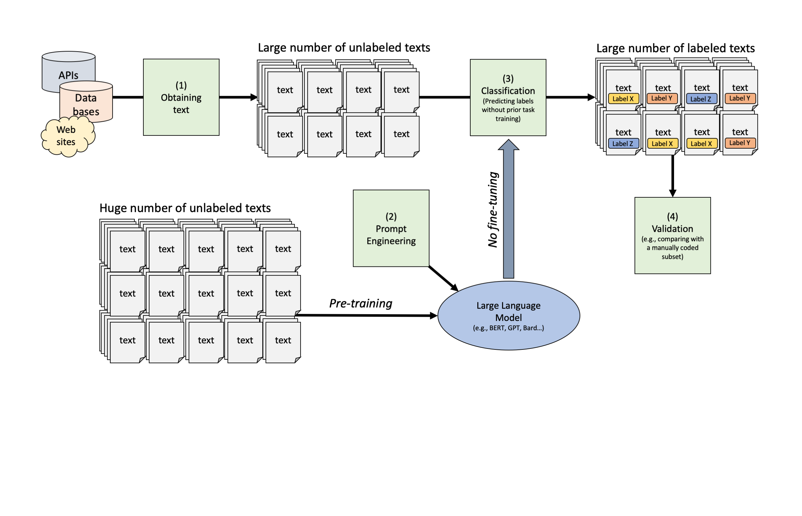
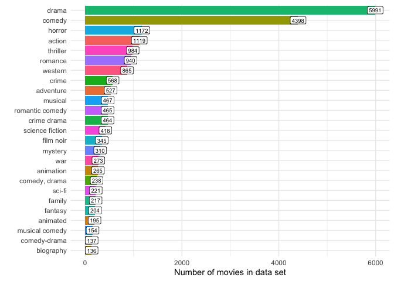
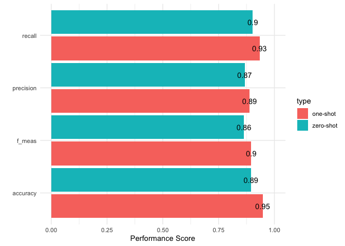
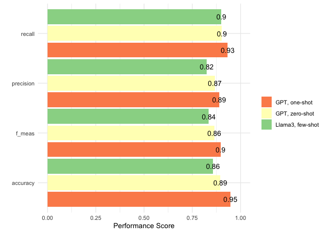

One-Shot and Few-Shot Classification with LLMs
================
Philipp K. Masur
2023-11

- [Introduction](#introduction)
- [Preparation](#preparation)
  - [Getting data](#getting-data)
  - [Again a Small Example with either llama or
    GPT](#again-a-small-example-with-either-llama-or-gpt)
- [Classifying more than a couple of
  texts](#classifying-more-than-a-couple-of-texts)
  - [Zero-Shot Classification](#zero-shot-classification)
  - [Validation](#validation)
- [Classifying with examples](#classifying-with-examples)
  - [One-Shot Classification](#one-shot-classification)
  - [Validation](#validation-1)
  - [Few-Shot Classification?](#few-shot-classification)

# Introduction

In the last tutorial, we have worked with llama and/or GPT-3.5 to
perform some zero-shot classifications of sentiment of yelp reviews. In
this tutorial, we will dive deeper into this logic and explore ways to
provide these models with more examples that may increase their
performance even more.

Again, the pipeline is as follows:



# Preparation

For this tutorial, we are again going to load the `tidyverse`,
`tidytext`, `tidymodels`, `tidyllm`, and the package `glue`.

``` r
library(tidyverse)
library(tidytext)
library(tidymodels)
library(tidyllm)
library(glue)
```

## Getting data

We are going to explore a data set that includes movie descriptions and
the respective genre of the movie. The goal will be to predict the genre
from the movie description.

``` r
# Load data
movies <- read_csv("data/wiki_movie_plots_deduped.csv")
movies |> 
  head(n = 2)
```

| Release Year | Title                         | Origin/Ethnicity | Director | Cast | Genre   | Wiki Page                                                     | Plot                                                                                                                                                                                                                                                                                                                                                                                                                                                                                                                   |
|-------------:|:------------------------------|:-----------------|:---------|:-----|:--------|:--------------------------------------------------------------|:-----------------------------------------------------------------------------------------------------------------------------------------------------------------------------------------------------------------------------------------------------------------------------------------------------------------------------------------------------------------------------------------------------------------------------------------------------------------------------------------------------------------------|
|         1901 | Kansas Saloon Smashers        | American         | Unknown  | NA   | unknown | <https://en.wikipedia.org/wiki/Kansas_Saloon_Smashers>        | A bartender is working at a saloon, serving drinks to customers. After he fills a stereotypically Irish man’s bucket with beer, Carrie Nation and her followers burst inside. They assault the Irish man, pulling his hat over his eyes and then dumping the beer over his head. The group then begin wrecking the bar, smashing the fixtures, mirrors, and breaking the cash register. The bartender then sprays seltzer water in Nation’s face before a group of policemen appear and order everybody to leave.\[1\] |
|         1901 | Love by the Light of the Moon | American         | Unknown  | NA   | unknown | <https://en.wikipedia.org/wiki/Love_by_the_Light_of_the_Moon> | The moon, painted with a smiling face hangs over a park at night. A young couple walking past a fence learn on a railing and look up. The moon smiles. They embrace, and the moon’s smile gets bigger. They then sit down on a bench by a tree. The moon’s view is blocked, causing him to frown. In the last scene, the man fans the woman with his hat because the moon has left the sky and is perched over her shoulder to see everything better.                                                                  |

Let’s also directly set the OpenAI API key so that we can use the GPT
later on.

``` r
# Provide access to OPEN AI account
Sys.setenv(
  OPENAI_API_KEY = 'XXX' # <- enter token here
)
```

Let’s explore the film genres in this data set:

``` r
movies |>  
  group_by(Genre) |> 
  tally() |> 
  filter(Genre != "unknown") |> 
  slice_max(n, n = 25) |> 
  ggplot(aes(x = fct_reorder(Genre, n), y = n, fill = Genre)) +
  geom_col() +
  geom_label(aes(label = n), fill = "white", size = 2.5) +
  coord_flip() +
  labs(x = "", y = "Number of movies in data set") +
  theme_minimal() +
  theme(legend.position = "none")
```

<!-- -->

As we can see, most movies are classified as “drama”, but we also have a
lot of comedies. For the purpose of this tutorial, let’s break this down
a bit more. Having any language model trying to predict this many
different genres will probably not result in great performance.

So for the purpose of this tutorial, we are going to sample 200 movies
that were release after 2010 (so that we hopefully all now them!). We
filter so that we have only action, comedy, and horror movies in the
data set.

``` r
set.seed(123)
movies_small <- movies |> 
  mutate(id = 1:n()) |> 
  rename(genre = Genre) |> 
  filter(genre %in% c("action", "comedy", "horror")) |> 
  filter(`Origin/Ethnicity` == "American") |> 
  select(id, year = `Release Year`, title = Title, director = Director, genre, text = Plot) |> 
  filter(year > 2010) |> 
  sample_n(size = 200)

# Number of movies in subset
movies_small |> 
  group_by(genre) |> 
  tally() 
```

| genre  |   n |
|:-------|----:|
| action |  37 |
| comedy | 108 |
| horror |  55 |

## Again a Small Example with either llama or GPT

Now that the access token is set, we can again use the package `tidyllm`
to conduct text classification. Let’s adapt the code a bit more and
provide the model with more instructions on how to structure the
response. What I am trying to achieve here is that the model, next to
the code, also provides a justification for its choice.

``` r
glue("What is genre of this movie description: {description}
      
      Pick only one of the following codes from this list:
      
      Comedy, Horror, or Action.
     
      Structure your answer in this way:
     
      'Genre; Justification (but only about 10 words)'",
      description = movies_small$text[1]) |> 
  llm_message() |> 
  chat(ollama(.model = "llama3.2:1b", .temperature = 0))
```

    ## Message History:
    ## system: You are a helpful assistant
    ## --------------------------------------------------------------
    ## user: What is genre of this movie description: Brutal gangster Dragna recruits professional killer Jack to pick up a bag and wait for his arrival at a motel. Dragna stresses that Jack is not to open the bag or allow anyone to view its contents under any circumstances. Confused as to why Dragna wants him to do such an apparently easy job, Jack presses for more details, but Dragna only reiterates the rules. While Jack acquires the bag, Dragna's henchman shoots him in the hand, and Jack stuffs the body in his car's trunk. Dragna is unsympathetic when Jack calls him and instructs Jack to stick to the plan.
    ## At the motel, Jack meets several people: Ned, the wheelchair-bound desk clerk; Rivka, a tall hooker; and Lizard and Guano, a pair of pimps. Jack requests room number thirteen, and Ned cautions him that it is a deathtrap, as it is unconnected. When two suited men become curious about Jack, he abruptly breaks into their room and kills both. A subsequent search reveals FBI badges and a briefcase. Jack sets the briefcase aside and leaves to dump the corpse stored in his car. He returns once he is spotted, only to discover that Rivka has broken into his room; fearful that Lizard will kill her, she requests that he allow her to stay.
    ## Jack initially demands that she leave, then detains her when he cannot be sure whether she opened the bag. Rivka points out that the briefcase contains a photo of the bag, and Jack becomes worried that others may attempt to acquire it. When Jack attempts to drive Rivka to a bus station, she spots the corpse in the back of his car. Lizard and Guano first question Jack about Rivka; later, on the road, they attack him. On their corpses he finds another photo of the bag; unsure what to do with Rivka, or of her involvement, he returns to the hotel with her to await Dragna's arrival.
    ## Ned becomes suspicious that Jack has a guest in his room, and he calls the sheriff when Jack refuses to pay the double occupancy fee. Sheriff Larson briefly questions Jack, and, after Larson leaves, Jack threatens Ned. Increasingly worried about the safety of the bag, Jack buries it near the motel, only to be caught by Ned, who is now out of his wheelchair. Jack kills Ned and returns to the motel, where Larson arrests him under suspicion of Ned's disappearance.
    ## As Larson prepares to torture Jack for information, Rivka shows up. Larson threatens to rape her, but she overpowers a deputy and frees Jack, who then kills Larson. When Rivka demonstrates detailed knowledge of the bag, Jack becomes suspicious of her again, but she points out that she has saved his life. Somewhat mollified, he retrieves the bag and waits in room fourteen. Dragna finally appears, disappointed in Jack's apparent lack of trust. Nonetheless satisfied that Jack has not looked in the bag, Dragna explains that the whole situation was a test of Jack's skills and character, as he doubted Jack's resolve in the wake of Jack's fiancee's unsolved murder some months earlier. The motel and the local cops are all on Dragna's payroll, and were all (unwittingly) part of the test.
    ## As Dragna prepares to leave, Rivka spontaneously tells Jack that she looked in the bag. Frustrated, Jack points out that Dragna will now kill them both. Jack dutifully reports Rivka's action to Dragna, who orders her killed. Jack instead kills Dragna's bodyguard, who wounds Rivka. Jack hunts down Dragna, and both are wounded. Jack looks in the bag; it contains the head of his fiancee, whom Dragna had killed in order to prevent Jack from quitting the murder-for-hire business. Trying to persuade Jack to surrender, Dragna destroys the hotel (where Rivka supposedly is) with remote-detonated explosives. Moments later, Rivka appears and saves Jack by killing Dragna, but she is shot again. Later, in Dragna's lawyer's office, Rivka reveals herself as Dragna's mistress and personal assassin who was sent to the motel to ensure things went Dragna's way. She collects a five million dollar reward for Jack's assassination, and she and Jack drive off together.
    ## 
    ## Pick only one of the following codes from this list:
    ## 
    ## Comedy, Horror, or Action.
    ##      
    ## Structure your answer in this way:
    ##      
    ## 'Genre; Justification (but only about 10 words)'
    ## --------------------------------------------------------------
    ## assistant: Action; The movie is an intense, suspenseful thriller with a professional killer at its center.
    ## --------------------------------------------------------------

``` r
  #chat(openai(.model = "gpt-3.5-turbo", .temperature = 0)) # You can use GPT as well if you dont have a local model
```

This seems to work. And the justification is nice to have. We will drop
this justification later, but for initial test, such an extra output can
be nice to have. Let’s try to classify some more movies.

# Classifying more than a couple of texts

Classifying many text via the any API requires a bit of thought:

For example, in the current OpenAI subscription, we can do 200,000
tokens per minute and 500 requests per minute and 10,000 requests per
day with `gpt-3.5-turbo`. If we would use a better model, if would have
even less. At the same time, each model has a “context window”, i.e. the
amount of input you can provide as tokens. If we use `gpt-3.5-turbo`, we
have a window of 16,385 tokens. Max output tokens is at the same time
about 4,000 tokens.

This of course heavily restricts our use and makes the procedure of
classifying many texts much longer. It thus makes sense to first look at
how many tokens movie plots usually have. We can count the number of
words and multiply by 1.6, which results roughly in the token type that
GPT uses (it breaks text down into something smaller than words).

``` r
movies_small |> 
  unnest_tokens(word, text) |> 
  group_by(title) |> 
  summarize(n = n()) |> 
  arrange(-n) |> 
  mutate(gpt_tokens = n*1.6) |> 
  head()
```

| title                                                                                             |    n | gpt_tokens |
|:--------------------------------------------------------------------------------------------------|-----:|-----------:|
| Movie 43                                                                                          | 2445 |     3912.0 |
| Characterz                                                                                        | 1735 |     2776.0 |
| Haunting in Connecticut 2: Ghosts of Georgia, TheThe Haunting in Connecticut 2: Ghosts of Georgia | 1671 |     2673.6 |
| The Three Stooges                                                                                 | 1623 |     2596.8 |
| Friend Request                                                                                    | 1376 |     2201.6 |
| Black Rock                                                                                        | 1232 |     1971.2 |

As you can see, we have movie plots that contain about 4,000 tokens but
after the ten longest ones, most of them have less that 2,000. We
nonetheless should perhaps truncate the movie plots to only 1,000
characters which covers roughly the first 3-5 sentences, assuming that
this will be enough for GPT to figure out the genre. This way, we save
tokens without (hopefully) sacrificing performance. We then use
`gpt_split_data` to again separate our data into small chunks of 4
movies. Then, we again create a loop with the function `map()`, which
iteratively sends the prompt to the API and extracts the results. We can
should add a small delay between prompts to make sure that we do not
send to many prompts per minute (this of course makes the process
longer). Let’s start with 3 subsets of 4 movies each for now and then
see whether we can increase the number of splits that should be coded.
Bear in mind, all of you are using the same API TOKEN, so we need to be
careful not to overuse it, otherwise it won’t work for anyone and we
have to wait for minute.

``` r
# Truncate plot description
movies_small2 <- movies_small |> 
  mutate(text = stringr::str_trunc(text, 1000)) 
```

## Zero-Shot Classification

Now, we can create our task as in the last tutorial:

``` r
codebook <- glue("What is genre of this movie description: {description}
      
                 Pick only one of the following codes from this list:
                 
                 Comedy, Horror, or Action.
                
                 Structure your answer in this way:
                
                 'Genre; Justification (but only about 10 words)'",
                 description = movies_small2$text[1:20])

classification_task <- map(codebook, llm_message)

# Function to classify all 50 texts
classify_sequential_gpt <- function(texts, message){
    raw_code <- message |>
        chat(openai(.model = "gpt-3.5-turbo",   
                    .temperature = .0)) |>
        #chat(ollama(.model = "llama3.2:1b",   # Try with local model as well...
        #            .temperature = .0)) |>
        get_reply()
    tibble(text = texts, label = raw_code) 
}

# Run the classification by sequentially prompting LLama3
results_gpt <- tibble(texts = movies_small2[1:20,]$text, 
                        message = classification_task) |>  
  pmap_dfr(classify_sequential_gpt, .progress = T) 


# Combine them
predict_gpt <- results_gpt |> 
  separate(label, c("label", "justification"), sep = ";") |> 
  mutate(label = tolower(trimws(label)))
```

Let’s check out some of the justifications:

``` r
# Justifications
head(predict_gpt) |> 
  select(label, justification) |> 
  head(n = 6)
```

| label  | justification                                                          |
|:-------|:-----------------------------------------------------------------------|
| action | Intense thriller with a professional killer and gangster plot.         |
| comedy | Story revolves around humorous situations and relationships.           |
| comedy | Young couple vs fraternity, humorous situations ensue.                 |
| action | Environmental activism leads to dangerous confrontation in the Amazon. |
| horror | Supernatural entity terrorizes girls in haunted dollhouse.             |
| action | Secret agent training, dangerous missions, assassins, and espionage.   |

Looks good!

## Validation

As always, let’s validate our result based on the gold standard in the
data. Don’t forget to specify the class_metrics!

``` r
predict_gpt <- predict_gpt |> 
  select(label) |> 
  bind_cols(movies_small[1:20,]) |> 
  mutate(label = factor(label, levels = c("action", "comedy", "horror")),
         genre = factor(genre))

# Set performance scores
class_metrics <- metric_set(accuracy, precision, recall, f_meas)

# Performance
predict_gpt |> 
  class_metrics(truth = genre, estimate = label)
```

| .metric   | .estimator | .estimate |
|:----------|:-----------|----------:|
| accuracy  | multiclass | 0.8947368 |
| precision | macro      | 0.8666667 |
| recall    | macro      | 0.9030303 |
| f_meas    | macro      | 0.8637566 |

Pretty good performance overall already. But, can we perhaps further
improve this?

# Classifying with examples

As discussed in the lecture, we can sometimes boost performance by
adding one (or more) example. We can achieve this by “stacking”
`llm_message` prompts. Below, I first define the task and glue the first
text to it. Then, instead of passing to immediately to the `chat()`
function, I just pass it to another `llm_message`, in which I provide
the resonse “action” (the gold standard for the first text). Now, note
that I have specified the role for this answer as “assistant”. It is
thus as if the LLM would have given that response. Then I pass this
altogether to another `llm_message`, which contains the next task (for
now just one more movie). If we then pass this to GPT, we see that the
entire “simulated” conversation becomes the message history that
influence the next response. We thus provide a “better” prompt for the
classification.

``` r
# First example
llm_message(glue("What is genre of this movie description: {description}", 
                description = movies_small2$text[1])) |> 
# Answer by the model (assistant)
llm_message("action", .role = "assistant") |>  # Note how we specify the role!
# Actual tasks (here the next text)
llm_message(glue("Now the genre of the following movie descriptions in the same way: {description}
                    
                 Again, pick only one of the following codes from the following list. 
                 Only provide the code, nothing else.
                     
                 comedy, horror, or action", 
                 description = movies_small2$text[2])) |> 
   chat(openai(.model = "gpt-3.5-turbo",   
                    .temperature = .0))
```

    ## Message History:
    ## system: You are a helpful assistant
    ## --------------------------------------------------------------
    ## user: What is genre of this movie description: Brutal gangster Dragna recruits professional killer Jack to pick up a bag and wait for his arrival at a motel. Dragna stresses that Jack is not to open the bag or allow anyone to view its contents under any circumstances. Confused as to why Dragna wants him to do such an apparently easy job, Jack presses for more details, but Dragna only reiterates the rules. While Jack acquires the bag, Dragna's henchman shoots him in the hand, and Jack stuffs the body in his car's trunk. Dragna is unsympathetic when Jack calls him and instructs Jack to stick to the plan.
    ## At the motel, Jack meets several people: Ned, the wheelchair-bound desk clerk; Rivka, a tall hooker; and Lizard and Guano, a pair of pimps. Jack requests room number thirteen, and Ned cautions him that it is a deathtrap, as it is unconnected. When two suited men become curious about Jack, he abruptly breaks into their room and kills both. A subsequent search reveals FBI badges and a briefcase. Jack sets the briefcase aside and le...
    ## --------------------------------------------------------------
    ## assistant: action
    ## --------------------------------------------------------------
    ## user: Now the genre of the following movie descriptions in the same way: Rick (Owen Wilson) and Fred (Jason Sudeikis) are best friends, as are their wives, Maggie (Jenna Fischer) and Grace (Christina Applegate). They are both unhappy with their married lives and missing the old days when they were single. Realizing this, their wives talk to their friend Dr. Lucy (Joy Behar) and decide to give them a "Hall Pass": a week off from marriage during which they can have sex with other women. They are skeptical at first, but ultimately accept the offers and try to pick up women with their friends Gary (Stephen Merchant), Flats (J. B. Smoove) and Hog Head (Larry Joe Campbell). Maggie and Grace spend Rick and Fred's "Hall Pass Week" at Maggie's parents' house in Cape Cod, where Grace flirts with athlete Gerry (Tyler Hoechlin). She says that if their husbands have Hall Passes, so should they.
    ## With their wives and children away, Fred and Rick check in at a hotel and prepare for their Hall Pass Week. On day one, they decide to eat before going to a local bar and get...
    ##    
    ## Again, pick only one of the following codes from the following list. 
    ## Only provide the code, nothing else.
    ##     
    ## comedy, horror, or action
    ## --------------------------------------------------------------
    ## assistant: comedy
    ## --------------------------------------------------------------

## One-Shot Classification

If we want to set this up for a whole classification task (i.e.,
classifying several movies), we better create the example part, then the
actual classification and then we again `map` them together.

``` r
# Example coding 
example <- 
  llm_message(glue("What is genre of this movie description: {description}", 
                   description = movies_small2$text[1])) |> 
  llm_message("action", .role = "assistant")

# The actual task (this should be familiar from zero-shotting)
classification_tasks <- glue("Now the genre of the following movie descriptions in the same way: {description}
                             
                             Pick only one of the following codes from the following list. 
                             Only provide the code, nothing else.
                                 
                             comedy, horror, or action", 
                   description = movies_small2$text[2:20])

# Map tasks together
oneshot_tasks <- map(classification_tasks, function(x) example |> llm_message(x))


# Check
oneshot_tasks[[1]]
```

    ## Message History:
    ## system: You are a helpful assistant
    ## --------------------------------------------------------------
    ## user: What is genre of this movie description: Brutal gangster Dragna recruits professional killer Jack to pick up a bag and wait for his arrival at a motel. Dragna stresses that Jack is not to open the bag or allow anyone to view its contents under any circumstances. Confused as to why Dragna wants him to do such an apparently easy job, Jack presses for more details, but Dragna only reiterates the rules. While Jack acquires the bag, Dragna's henchman shoots him in the hand, and Jack stuffs the body in his car's trunk. Dragna is unsympathetic when Jack calls him and instructs Jack to stick to the plan.
    ## At the motel, Jack meets several people: Ned, the wheelchair-bound desk clerk; Rivka, a tall hooker; and Lizard and Guano, a pair of pimps. Jack requests room number thirteen, and Ned cautions him that it is a deathtrap, as it is unconnected. When two suited men become curious about Jack, he abruptly breaks into their room and kills both. A subsequent search reveals FBI badges and a briefcase. Jack sets the briefcase aside and le...
    ## --------------------------------------------------------------
    ## assistant: action
    ## --------------------------------------------------------------
    ## user: Now the genre of the following movie descriptions in the same way: Rick (Owen Wilson) and Fred (Jason Sudeikis) are best friends, as are their wives, Maggie (Jenna Fischer) and Grace (Christina Applegate). They are both unhappy with their married lives and missing the old days when they were single. Realizing this, their wives talk to their friend Dr. Lucy (Joy Behar) and decide to give them a "Hall Pass": a week off from marriage during which they can have sex with other women. They are skeptical at first, but ultimately accept the offers and try to pick up women with their friends Gary (Stephen Merchant), Flats (J. B. Smoove) and Hog Head (Larry Joe Campbell). Maggie and Grace spend Rick and Fred's "Hall Pass Week" at Maggie's parents' house in Cape Cod, where Grace flirts with athlete Gerry (Tyler Hoechlin). She says that if their husbands have Hall Passes, so should they.
    ## With their wives and children away, Fred and Rick check in at a hotel and prepare for their Hall Pass Week. On day one, they decide to eat before going to a local bar and get...
    ## 
    ## Pick only one of the following codes from the following list. 
    ## Only provide the code, nothing else.
    ##     
    ## comedy, horror, or action
    ## --------------------------------------------------------------

As we can see, the entire history is added to each individual prompt.

``` r
# Function to classify all 50 texts
classify_sequential_gpt <- function(texts, message){
    raw_code <- message |>
        chat(openai(.model = "gpt-3.5-turbo",   
                    .temperature = .0)) |>
        #chat(ollama(.model = "llama3.2:1b",   # Try with local model as well...
        #            .temperature = .0)) |>
        get_reply()
    tibble(text = texts, label = raw_code) 
}


# Run classificatios
results_gpt_oneshot <- tibble(texts = movies_small2[2:20,]$text, 
                              message = oneshot_tasks) |>  
  pmap_dfr(classify_sequential_gpt, .progress = T)
```

## Validation

We check the performance as always:

``` r
# Bin prediction to gold standard
predict_gpt_oneshot <- results_gpt_oneshot  |> 
  select(label) |> 
  mutate(label = tolower(label)) |> 
  bind_cols(movies_small2[2:20,]) |> 
  mutate(label = factor(label, levels = c("action", "comedy", "horror")),
         genre = factor(genre, levels = c("action", "comedy", "horror")))

# Performance
predict_gpt_oneshot |> 
  class_metrics(truth = genre, estimate = label)
```

| .metric   | .estimator | .estimate |
|:----------|:-----------|----------:|
| accuracy  | multiclass | 0.9473684 |
| precision | macro      | 0.8888889 |
| recall    | macro      | 0.9333333 |
| f_meas    | macro      | 0.8962963 |

And voila, we have improved the performance!

``` r
bind_rows(
  predict_gpt |> 
  class_metrics(truth = genre, estimate = label) |> 
  mutate(type = "zero-shot"),
  predict_gpt_oneshot |> 
  class_metrics(truth = genre, estimate = label) |> 
  mutate(type = "one-shot")
) |> 
  ggplot(aes(x = .metric, y = .estimate, fill = type)) +
  geom_col(position = position_dodge(width = 1)) +
  geom_text(aes(label = round(.estimate, 2)), position = position_dodge(width = 1)) +
  coord_flip() +
  ylim(0, 1) +
  theme_minimal() +
  labs(x = "", y = "Performance Score")
```

<!-- -->

## Few-Shot Classification?

Can you extend this logic to a few-shot classification framework? This
involves stacking even more llm_message on top of each other. Also: If
you have a local model, does its performance also improve with more
examples?

``` r
# Two examples
examples <- 
  llm_message(glue("What is genre of this movie description: {description}", 
                  description = movies_small2$text[1])) |> 
  llm_message("action", .role = "assistant") |> 
  llm_message(glue("What is genre of this movie description: {description}", 
                   description = movies_small2$text[2])) |> 
  llm_message("comedy", .role = "assistant")

classification_tasks <- glue("Now the genre of the following movie descriptions in the same way: {description}
                             
                             Pick only one of the following codes from the following list. 
                             Only provide the code, nothing else.
                                 
                             comedy, horror, or action", 
                   description = movies_small2$text[3:50])  # Start classification at 3 as first two are already used as examples!

# Map tasks together
fewshot_tasks <- map(classification_tasks, function(x) examples |> llm_message(x))


# Check
fewshot_tasks[[1]]
```

    ## Message History:
    ## system: You are a helpful assistant
    ## --------------------------------------------------------------
    ## user: What is genre of this movie description: Brutal gangster Dragna recruits professional killer Jack to pick up a bag and wait for his arrival at a motel. Dragna stresses that Jack is not to open the bag or allow anyone to view its contents under any circumstances. Confused as to why Dragna wants him to do such an apparently easy job, Jack presses for more details, but Dragna only reiterates the rules. While Jack acquires the bag, Dragna's henchman shoots him in the hand, and Jack stuffs the body in his car's trunk. Dragna is unsympathetic when Jack calls him and instructs Jack to stick to the plan.
    ## At the motel, Jack meets several people: Ned, the wheelchair-bound desk clerk; Rivka, a tall hooker; and Lizard and Guano, a pair of pimps. Jack requests room number thirteen, and Ned cautions him that it is a deathtrap, as it is unconnected. When two suited men become curious about Jack, he abruptly breaks into their room and kills both. A subsequent search reveals FBI badges and a briefcase. Jack sets the briefcase aside and le...
    ## --------------------------------------------------------------
    ## assistant: action
    ## --------------------------------------------------------------
    ## user: What is genre of this movie description: Rick (Owen Wilson) and Fred (Jason Sudeikis) are best friends, as are their wives, Maggie (Jenna Fischer) and Grace (Christina Applegate). They are both unhappy with their married lives and missing the old days when they were single. Realizing this, their wives talk to their friend Dr. Lucy (Joy Behar) and decide to give them a "Hall Pass": a week off from marriage during which they can have sex with other women. They are skeptical at first, but ultimately accept the offers and try to pick up women with their friends Gary (Stephen Merchant), Flats (J. B. Smoove) and Hog Head (Larry Joe Campbell). Maggie and Grace spend Rick and Fred's "Hall Pass Week" at Maggie's parents' house in Cape Cod, where Grace flirts with athlete Gerry (Tyler Hoechlin). She says that if their husbands have Hall Passes, so should they.
    ## With their wives and children away, Fred and Rick check in at a hotel and prepare for their Hall Pass Week. On day one, they decide to eat before going to a local bar and get...
    ## --------------------------------------------------------------
    ## assistant: comedy
    ## --------------------------------------------------------------
    ## user: Now the genre of the following movie descriptions in the same way: Mac (Seth Rogen) and Kelly Radner (Rose Byrne) are a young couple with an infant daughter, Stella. The restrictions of parenthood make it difficult for them to maintain their old lifestyle, which alienates them from their friends Jimmy Blevins (Ike Barinholtz) and his ex-wife, Paula (Carla Gallo). One day, the couple finds out that Delta Psi Beta, a fraternity known for their outrageous parties, has moved into an adjacent house. The fraternity's leaders, Teddy Sanders (Zac Efron) and Pete Regazolli (Dave Franco), aspire to join Delta Psi's Hall of Fame by throwing a massive end-of-the-year party.
    ## One night, the couple ask Teddy to keep the noise down. Teddy agrees on the condition that Mac and Kelly promise to always call him instead of calling the police. To earn Mac and Kelly's favor, Teddy invites them to join the party, which the couple agree to. At the party, Kelly meets Teddy's girlfriend Brooke Shy (Halston Sage) and Teddy shows Mac his bedroom, which includes a stash of fir...
    ## 
    ## Pick only one of the following codes from the following list. 
    ## Only provide the code, nothing else.
    ##     
    ## comedy, horror, or action
    ## --------------------------------------------------------------

``` r
#Function to classify all 50 texts
classify_sequential_llama <- function(texts, message){
    raw_code <- message |>
        chat(ollama(.model = "llama3",      # I am using my bigger local model here, 
                    .temperature = .0)) |>  # but feel free to use GPT or your smaller llama model
        get_reply()
    tibble(text = texts, label = raw_code) 
}

# Run classificatios
results_llama_fewshot <- tibble(texts = movies_small2[3:50,]$text, 
                                message = fewshot_tasks) |>  
  pmap_dfr(classify_sequential_llama, .progress = T)


# Bin prediction to gold standard
predict_llama_fewshot <- results_llama_fewshot  |> 
  select(label) |> 
  mutate(label = tolower(label)) |> 
  bind_cols(movies_small2[3:50,]) |> 
  mutate(label = factor(label, levels = c("action", "comedy", "horror")),
         genre = factor(genre, levels = c("action", "comedy", "horror")))


# Check performance

bind_rows(
  predict_gpt |> 
  class_metrics(truth = genre, estimate = label) |> 
  mutate(type = "GPT, zero-shot"),
  predict_gpt_oneshot |> 
  class_metrics(truth = genre, estimate = label) |> 
  mutate(type = "GPT, one-shot"),
  predict_llama_fewshot |> 
  class_metrics(truth = genre, estimate = label) |> 
  mutate(type = "Llama3, few-shot")
) |> 
  ggplot(aes(x = .metric, y = .estimate, fill = type)) +
  geom_col(position = position_dodge(width = 1)) +
  geom_text(aes(label = round(.estimate, 2)), position = position_dodge(width = 1)) +
  coord_flip() +
  scale_fill_brewer(palette = "Spectral") +
  ylim(0, 1) +
  theme_minimal() +
  labs(x = "", y = "Performance Score", fill = "")
```

<!-- -->

Here, we can see that with two examples (a few shot strategy), I
seemingly can match the performance of GPT-3.5 with my much smaller
local llama3 model!
