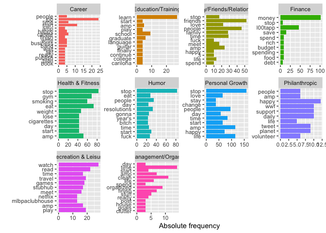

# Introduction

In this tutorial, we are going to engage with a) word-embeddings and b) zero-shot learning using a BERT model from hugging face. 


## Setting up a hugging face account

Although we can assess the hugging face account directly, it is better to link our analyis here with an account as this will increase the rate limit for API prompts. As a first step, I hence would like to ask you to create a hugging face account. For this, please follow these steps:

1. Go to https://www.huggingface.co

2. Click on "Sign Up" in the upper right corner and follow the steps. 

3. Once you have an account, click on your account picture in the upper right corner and click on settings:


4. Click on "Access Tokens" on the left and create a new one. 


5. Copy the code. We will use it in the tutorial shortly. 


# Preparation

In this tutorial, we are going to use the package collections `tidyverse` and `tidytext`. Now, please enter the Access Token from your hugging face account in the code below (replace `XXXX`).


```r
library(tidyverse)
library(tidytext)

# Provide access to hugging face account
Sys.setenv(
  HF_API_TOKEN = "XXXX" # <-- enter your hugging face token here
)
```

## Loading data

Next, we are going to load the data set that we will analyze in this tutorial (download it from Canvas and put into the working direction of your choice). It is a corpus of 5,002 tweets that contained the hashtag "#newyearsresolution" and thus contain resolutions by people (scraped in 2015). Next to a `text` column which contains the actual tweet content, the data set also contains the `name` of the author, time and date, as well as a first categorization of the tweets into "topics" or "categories. 


```r
# Tweets on "New Year's Resolution
tweets <- read_csv2("data/new_year_resolutions_dataset.csv")
tweets |> 
  head()
```


|resolution_topics                                     |gender |name            |resolution_category | retweet_count|text                                                                                                                                     |tweet_coord |tweet_created       |tweet_date |    tweet_id|tweet_location           |tweet_state |user_timezone              |tweet_region |
|:-----------------------------------------------------|:------|:---------------|:-------------------|-------------:|:----------------------------------------------------------------------------------------------------------------------------------------|:-----------|:-------------------|:----------|-----------:|:------------------------|:-----------|:--------------------------|:------------|
|Eat healthier                                         |female |Dena_Marina     |Health & Fitness    |             0|#NewYearsResolution :: Read more books, No scrolling FB/checking email b4 breakfast, stay dedicated to PT/yoga to squash my achin' back! |NA          |2014-12-31 10:48:00 |2014-12-31 | 5.50363e+17|Southern California      |CA          |Pacific Time (US & Canada) |West         |
|Humor about Personal Growth and Interests Resolutions |female |ninjagirl325    |Humor               |             1|#NewYearsResolution Finally master @ZJ10 's part of Kitchen Sink                                                                         |NA          |2014-12-31 10:47:00 |2014-12-31 | 5.50363e+17|New Jersey               |NJ          |Central Time (US & Canada) |Northeast    |
|Be More Confident                                     |male   |RickyDelReyy    |Personal Growth     |             0|#NewYearsResolution to stop being so damn perf _???_???                                                                                  |NA          |2014-12-31 10:46:00 |2014-12-31 | 5.50362e+17|Hollywood                |CA          |Eastern Time (US & Canada) |West         |
|Other                                                 |male   |CalmareNJ       |Philanthropic       |             0|My #NewYearsResolution is to help my disabled patients discover the emotional and physical therapy from loving a pet. #adoptarescue      |NA          |2014-12-31 10:45:00 |2014-12-31 | 5.50362e+17|Metro NYC                |NY          |NA                         |Northeast    |
|Be more positive                                      |female |welovatoyoudemi |Personal Growth     |             0|#NewYearsResolution #2015Goals #2015bucketlist continued??_??? http://t.co/h4P9B7tWjG                                                    |NA          |2014-12-31 10:44:00 |2014-12-31 | 5.50362e+17|Pittsburgh, Pennsylvania |PA          |Eastern Time (US & Canada) |Northeast    |
|Eat healthier                                         |male   |EthanJMoroles   |Health & Fitness    |             0|#NewYearsResolution 1. Eat less.
2.quit lying.                                                                                            |NA          |2014-12-31 10:43:00 |2014-12-31 | 5.50362e+17|Odessa Texas.            |TX          |NA                         |South        |

Let's do some standard text analysis with this data set. We create a id variable (often helpful!), select only a few columns, and - as always - we tokenize the tweets into words. This gets already rid of all symbols (e.g., `#`), which is usually a good choice (but depends on your research goals, of course. )


```r
# Data wrangling
tidy_tweets <- tweets |> 
  mutate(id = 1:n()) |> 
  select(name, text, topic = resolution_category) |> 
  unnest_tokens(word, text)
tidy_tweets |> 
  head()
```


|name        |topic            |word               |
|:-----------|:----------------|:------------------|
|Dena_Marina |Health & Fitness |newyearsresolution |
|Dena_Marina |Health & Fitness |read               |
|Dena_Marina |Health & Fitness |more               |
|Dena_Marina |Health & Fitness |books              |
|Dena_Marina |Health & Fitness |no                 |
|Dena_Marina |Health & Fitness |scrolling          |

## Visualize word frequency per new year's resolution topic

How about we do a first descriptive analysis of word frequencies per topic. As you know, for visualizations it is usually fruitful to remove some words. Next to standard stopwords, it can be useful to create additional words that should be removed. Particularly in tweets, there are often words, that do not help in understanding the tweets. E.g. the hashtag word "newyearsresolution" is literally in all tweets, so not helpful to differentiate topics. Below, I added a number of Twitter-specific terms (e.g., "rt" = retweet, "t.co" = typical URL abbreviation on Twitter, etc.)

With this preprocessed data, we can visualize the top 10 words in each topic!


```r
# Removing some stopwords
add_stopwords <- c("newyearsresolution", "resolution", 
                   "rt", "http", "t.co", "2015", "2014", 
                   "1", "2", "4")

# Visualizing top 10 words per topic
tidy_tweets |> 
  anti_join(stop_words) |> 
  filter(!word %in% add_stopwords) |> 
  group_by(topic, word) |> 
  summarize(n = n()) |> 
  slice_max(n, n = 10) |> 
  ggplot(aes(x = fct_reorder(word, n), y = n, 
             fill = topic)) +
  geom_col() +
  facet_wrap(~topic, scales = "free") +
  coord_flip() +
  theme(legend.position = "none") +
  labs(x = "", y = "Absolute frequency")
```

<!-- -->

**Exercise:** What do you see? Do the words make sense? Discuss in class!


# Analysis with Word-Embeddings

As mentioned in the lecture on Monday, using word embeddings instead of a document-feature matrix is a more powerful and informative ways to represent words in a multidimensional vector space (see image below).


To get the word embeddings for our tweet corpus, we have to either train a shallow neural network to find the weights that represent values on these dimensions for each word (would be slow and the quality would be questionable given the small size of the data set and the short format of tweets) or we use pretrained word-embeddings (e.g., the GloVe word embeddings). 

## Downloading and understanding word-embeddings

We can get the full list of word embeddings trough the package `textdata`. We can decide for ourselves, how many dimensions we want to have for each word. Yet, we **are not going to run the code bwlow** as the word-embeddings would take up almost 1 GB on your harddrive. This is just to show how we could obtain high quality word-embeddings!


```r
# Do not run!!!
library(textdata)

glove6b <- embedding_glove6b(dimensions = 100)
glove6b
```

Instead, we use a small subset of 10,000 words with embedding 50 dimensions that we can assess through the supplementary material of the book by Van Atteveldt et al. We have to wrangle the resulting data type a bit to get a tidy format. 


```r
# Download data
glove_fn <- "glove.6B.50d.10k.w2v.txt"
url <- glue::glue("https://cssbook.net/d/glove.6B.50d.10k.w2v.txt")
if (!file.exists(glove_fn)) 
    download.file(url, glove_fn)

# Data wrangling
word_embeddings <- read_delim(glove_fn, skip=1, delim=" ", quote="", 
    col_names = c("word", paste0("d", 1:50)))
```

Let's quickly check out this data set. If we e.g., arrange after the first dimension, we see that it seems to represent something related to "aviation" or planes/rockets more generally. 


```r
# 10 highest scoring words on dimension 1
word_embeddings |> 
  arrange(-d1) |> 
  select(1:10)
```


|word               |         d1|         d2|         d3|         d4|         d5|         d6|         d7|         d8|         d9|
|:------------------|----------:|----------:|----------:|----------:|----------:|----------:|----------:|----------:|----------:|
|airbus             |  2.5966000| -0.5356200|  0.4142200|  0.3393900| -0.0509890|  0.8476100| -0.7222400| -0.3612500|  0.8691700|
|spacecraft         |  2.5187000|  0.7441800|  1.6648000|  0.0590790| -0.2521500| -0.2426400| -0.5943900| -0.4173200|  0.4596100|
|fiat               |  2.2865000| -1.1497000|  0.4885000|  0.5183300|  0.3119800| -0.1318800|  0.0520300| -0.6609500| -0.8589900|
|naples             |  2.2656000| -0.1063100| -1.2722000| -0.0932260| -0.4370000| -1.1809000| -0.0857700|  0.4692500| -1.0841000|
|di                 |  2.2441000| -0.6032400| -1.4689000|  0.3543400|  0.2436700| -1.0889000|  0.3568900| -0.3307000| -0.5639900|
|planes             |  2.2006000| -0.8314900|  1.3398000| -0.3475700| -0.2090300| -0.2821900| -0.8235800| -0.4806900|  0.2109600|
|bombings           |  2.1611000| -0.2217400|  0.3826000|  0.0723470| -0.3050300|  0.6322000|  0.1247400| -0.1233700| -0.1707900|
|flights            |  2.1476000|  0.3497000| -0.0175380| -0.0237770| -1.3915000| -0.8115000| -0.7423600|  0.2035300|  1.2256000|
|orbit              |  2.1417000|  1.0848000|  1.6625000| -0.1801100|  0.3231700| -0.3943200|  0.0475550| -0.0107720|  0.4028800|
|plane              |  2.1142000| -0.1066400|  0.9724000|  0.1215100|  0.5709400| -0.1357000| -0.6759500|  0.1169200|  0.4723900|
|qaeda              |  2.0972000| -0.3359900|  1.4546000| -0.0781460|  0.7761200| -0.8812900| -0.1506400| -0.3460900|  0.9693900|
|virus              |  2.0916000| -1.3335000|  0.5613900|  0.0986770| -0.1655200|  0.7775700|  0.0929310| -1.0101000|  1.9819000|
|cells              |  2.0865000|  0.1058900|  1.4319000| -0.0724370|  0.8666700|  1.3513000|  1.2188000| -0.3502500|  0.8110900|
|insects            |  2.0774000| -0.7813900| -0.6747500| -0.4304000|  1.0328000|  0.4009000| -0.2755200| -0.9358800|  0.5784700|
|plot               |  2.0594000|  0.0246760| -0.0107470|  0.2409100|  0.8275000|  0.7569500|  0.3138700| -0.4754300| -0.6251400|
|shuttle            |  2.0290000|  0.8970600|  1.1477000| -0.1095000| -0.7883100|  0.1192100| -1.0305000|  0.4401400|  1.2014000|
|fdch               |  2.0207000|  1.2413000|  0.1380800|  2.2313000|  1.2956000|  0.9408100| -2.7604000|  1.0555000|  2.1964000|
|bali               |  2.0154000| -0.5510900| -0.2852500|  0.7599400|  0.2259900| -0.6583100|  0.6454200| -0.2220200|  0.5562600|
|missions           |  2.0083000| -0.0420040| -0.2575700| -0.8088500| -0.0356250| -0.5423300| -0.5321100| -0.0739920|  0.6562300|
|patients           |  2.0078000| -0.2652900|  0.5171600| -1.3638000| -0.5936100|  1.3103000|  0.3515400|  0.3674700|  1.0833000|
|spa                |  2.0045000|  0.7901600| -0.8827400|  1.7506000| -0.6602500| -0.6498600| -0.0679990|  0.1388400| -0.0281380|
|au                 |  2.0014000| -0.0367870| -0.7479600| -0.1798100|  0.2070300| -1.0721000|  0.9981900| -0.6496800|  0.3317200|
|tunnels            |  1.9935000|  0.5956600|  1.5701000| -0.4653900| -1.6463000|  0.0996550| -0.3319200| -0.1736000|  0.4297800|
|evacuation         |  1.9660000| -0.7981000| -0.0519460| -0.9380900| -0.8922100| -0.7045500| -0.4476500|  1.1665000|  0.7441900|
|genus              |  1.9602000|  0.1569800| -1.5017000|  0.4997900|  1.1225000|  0.9914700| -0.1482800| -0.9831100|  0.2377500|
|malaria            |  1.9490000| -0.7157900|  0.1562200| -0.6452900| -1.1021000|  0.8354900|  0.7868200| -1.4956000|  2.4188000|
|mars               |  1.9488000|  0.9138500|  0.5673800|  0.4897400| -0.2667900| -0.0255060| -0.9661900| -0.5262800|  0.4946900|
|zaire              |  1.9320000| -0.9377700|  0.0429200| -0.3011800| -0.4605400| -0.8200600| -0.1961700|  0.5124700|  0.3346800|
|qaida              |  1.9252000| -0.3670000|  1.4193000| -0.0087254|  0.9305600| -0.9287900| -0.1780000| -0.0700440|  0.6962400|
|treatments         |  1.9186000|  0.2013800| -0.6730700| -0.8600100| -1.4591000|  1.3425000|  0.1612700| -0.6281400|  0.7755300|
|mission            |  1.9144000|  0.4092300| -0.3142200| -0.6443000|  0.5551300| -0.8158800| -0.7660000|  0.1871600|  0.9445300|
|rwanda             |  1.9106000| -1.2420000| -0.5361700| -0.2745200|  0.0788820| -0.3951900|  0.6081900| -0.2283500|  0.3472300|
|voyage             |  1.8928000|  0.8530200| -1.2010000| -0.5724100| -0.6437500| -0.2447500| -1.0939000|  0.7045000|  1.1748000|
|worldsources       |  1.8905000| -0.9035400|  1.5274000|  3.3970000|  0.7594200|  3.6323000| -1.3725000|  1.2037000|  1.5827000|
|berlusconi         |  1.8825000| -0.3154600| -0.0857970|  0.2133300| -0.1718800|  0.3807100|  0.4211400|  0.2289900| -1.5751000|
|repairs            |  1.8806000|  0.0183190|  0.2340900| -0.4993200| -1.3375000|  0.0720040| -0.7982700|  1.1146000|  0.3107600|
|rescue             |  1.8746000| -0.6494000|  0.6808300| -0.4699300| -0.1272400| -0.2559000| -1.0157000|  0.8686400|  0.9053000|
|symptoms           |  1.8517000|  0.2882600| -0.7328300| -0.7904700| -0.9123600|  1.1482000|  0.7029200|  0.2429700|  0.3173800|
|infections         |  1.8432000| -0.7709700|  0.3721900| -0.1150000| -0.4413600|  1.3932000|  1.0755000| -0.4129700|  1.7946000|
|hotels             |  1.8378000|  0.6441400| -0.1648900|  0.6479700| -0.3594800| -1.2935000| -1.2832000| -0.6701400| -0.1041000|
|hariri             |  1.8207000|  1.1282000|  0.8425800| -0.6509900|  0.5383900|  0.8585400|  0.4120200|  0.5792200| -0.6334500|
|terminal           |  1.8152000|  1.0015000|  0.2774800|  0.1954300| -0.1671100| -0.1139000| -0.4404400| -0.1981600|  1.0109000|
|bacteria           |  1.8136000| -0.9802100|  0.0451160| -0.0545270|  0.2590100|  0.7875600|  1.3212000| -0.2928500|  1.5247000|
|evacuated          |  1.8123000| -0.5887000|  0.9041000| -0.7799600| -0.3944000| -0.7980100| -1.0524000|  1.5202000|  0.0190450|
|syndrome           |  1.8109000|  0.9726100| -0.2644900| -0.1964400| -0.5375600|  2.4329000|  0.6103900| -0.5097800|  0.5984800|
|clues              |  1.8098000|  0.1921800|  0.5952300| -0.0605970|  1.2598000| -0.0827060| -0.9380100|  0.3693600|  0.4547400|
|complications      |  1.8056000|  0.6981700| -0.4344000|  0.0238270| -1.2935000|  2.2893000|  0.5815900|  0.8859300|  0.6773600|
|resort             |  1.7924000|  1.2216000| -1.2070000|  1.3854000| -1.0688000| -0.9509800| -0.8932200|  0.1760800| -0.4140500|
|discovery          |  1.7891000|  0.7245900|  0.0291130|  0.7040600|  0.3033300|  0.4227200| -0.9518200|  0.0295550|  1.4737000|
|resorts            |  1.7796000|  0.7574200| -0.7390200|  1.6375000| -1.2697000| -0.6798000| -1.3812000| -0.6604900| -0.1040400|
|operation          |  1.7771000| -0.7056500| -0.1517000|  0.1520400| -0.3017300| -0.0287440| -0.0537530|  0.4188800|  1.1036000|
|helicopters        |  1.7731000| -0.9791800|  1.4957000| -0.5328500| -0.7003200| -0.4912100| -1.4849000| -0.1877800| -0.0100990|
|aircraft           |  1.7714000| -0.7571400|  1.0217000| -0.2671700| -0.3631100|  0.2926900| -0.7965600| -0.4974600|  0.4142200|
|sars               |  1.7709000| -0.5590600|  0.1537400| -0.0584850| -0.3798500| -0.2841100|  0.5915800| -0.3272400|  1.7644000|
|italy              |  1.7704000| -0.7775800| -0.9530200|  0.3290000|  0.0403910| -0.0863520| -0.0963260| -0.1452500| -0.8541500|
|bailout            |  1.7583000| -0.5034200|  0.8102700| -0.8495900| -0.9211800|  0.6028200| -0.1915300| -0.0280750| -0.4444400|
|lunar              |  1.7578000|  1.2813000|  0.2726200|  0.6979700|  0.3968000| -0.7165400| -0.8657300| -0.5878500|  0.8858300|
|bombing            |  1.7527000| -0.2128100|  0.1350000| -0.0985810|  0.3967700|  0.0466050| -0.0624880|  0.4442000|  0.1965000|
|prodi              |  1.7494000| -0.1099100| -0.2427500| -0.4784700|  0.0076993|  0.0490070|  0.5144000|  0.0802740| -1.6044000|
|humans             |  1.7399000| -0.7473900| -0.0312030| -0.2082500|  0.9604000|  1.1785000|  0.2976200| -0.9075700|  0.8303500|
|quake              |  1.7386000| -0.1301000|  1.3707000|  0.4921200| -0.0348630|  0.1004900|  0.1753800|  0.3630800| -0.1374600|
|evacuate           |  1.7385000| -0.8931400|  1.1368000| -1.1278000| -0.2500400| -0.9927600| -0.6298300|  1.8556000|  0.1003500|
|tunnel             |  1.7365000|  1.0721000|  0.9392400| -0.5054400| -1.4177000|  0.4847700| -0.5446900|  0.4139700|  0.6484800|
|rome               |  1.7328000|  0.7449100| -0.9094600| -0.6191600|  0.1151500| -1.3528000| -0.0449270|  0.1502700| -1.2333000|
|survivors          |  1.7324000|  0.0273290|  0.7852400| -0.7708200|  0.3557300|  0.2085900| -0.7825900|  1.1682000|  0.4460300|
|flight             |  1.7306000|  0.2840000| -0.0406130| -0.0873720| -0.4819000| -0.4278000| -0.6573300|  0.3163200|  1.0554000|
|influenza          |  1.7302000| -1.0546000| -0.4493900| -0.1492900| -0.0420380|  0.1782300|  0.3611100| -1.1645000|  1.8307000|
|genes              |  1.7217000| -0.4373300|  0.7882200|  0.5652200|  1.1841000|  1.9257000|  0.4767500| -0.9403500|  1.0071000|
|infection          |  1.7186000| -0.4426600|  0.1741200| -0.3874600| -0.3549000|  1.4528000|  0.8944500| -0.0176660|  2.0703000|
|diseases           |  1.7165000|  0.0276740| -0.3505500| -0.0713420| -0.7971400|  1.5560000|  0.7215600| -1.1500000|  1.7751000|
|wreckage           |  1.7125000| -0.5614700|  1.2246000| -0.1256800|  0.5327400|  0.0232450| -1.3184000|  0.6092000|  1.2198000|
|volcano            |  1.7101000|  0.6199400|  0.5304800| -0.4630200| -0.8600800| -0.9890800| -0.2725300|  0.4551400| -0.0285680|
|ruins              |  1.7083000|  0.6405400| -0.2185000| -0.2485500|  0.4135800| -1.2714000| -0.8380800|  0.2064700| -0.4795200|
|castle             |  1.7074000|  0.6321500| -0.7824500| -0.1761400|  0.5559600| -0.3527800| -0.3275100|  0.7210100| -1.3859000|
|boeing             |  1.7015000| -0.7886000|  0.9478700|  1.0514000|  0.0607790|  0.3579800| -1.3222000| -0.2635700|  0.5987200|
|vessels            |  1.6948000|  0.0907950|  0.1239100| -0.3308700| -0.4945900|  0.4171600| -0.2441400|  0.7737900|  1.1009000|
|passengers         |  1.6940000|  0.0369620|  1.1124000| -0.9642500|  0.0544780| -0.0562060| -0.7637300|  0.7127000|  0.8453800|
|somalia            |  1.6923000| -1.2384000|  0.0233020| -0.2844600| -0.1107200| -1.0026000|  0.1162200|  0.0603130|  1.3184000|
|helicopter         |  1.6823000| -0.4744700|  1.0509000| -0.1533600| -0.4378300| -0.1282800| -1.2449000|  0.5243700|  0.5213700|
|creatures          |  1.6814000| -0.3784800| -0.5297300|  0.2265100|  1.2093000|  0.2538300| -0.1263500| -0.9004100|  0.0456820|
|mediterranean      |  1.6695000|  0.7407500| -1.9271000|  0.1137800| -0.3379800| -0.5569900| -0.5651500| -0.0225940| -0.1265600|
|peacekeeping       |  1.6681000| -0.8702800| -0.5425500| -1.0432000|  0.5800900| -0.4116100|  0.3699000| -0.0960370|  0.6236100|
|blasts             |  1.6643000| -0.4181700|  0.8467200|  0.6983700| -0.4132000|  0.4436500|  0.6182100|  0.4040300|  0.0939190|
|carrier            |  1.6576000| -0.2352800|  0.7120500|  0.3225800|  0.0876000|  0.1458100| -0.6586600|  0.3180300|  1.0571000|
|astronauts         |  1.6460000|  0.7441500|  1.3119000| -0.1714200| -0.0946610|  0.0975670| -1.2408000|  0.4783100|  0.7176600|
|proteins           |  1.6460000| -0.3927800|  0.2759100|  0.4915800|  1.6427000|  1.4574000|  1.4798000| -0.9897000|  0.7976000|
|flies              |  1.6453000|  0.0665260| -0.1896000| -0.2212600|  0.5833000|  0.1528800| -0.6448800| -0.4847400|  0.6728500|
|kilometers         |  1.6433000|  0.6478200|  1.3451000|  0.3816100| -0.1572400| -1.1264000|  0.3549500|  0.1064700|  0.2523000|
|carlo              |  1.6407000|  0.0429260| -0.3974400|  1.1577000| -0.7435900| -0.9524900| -0.1114000|  0.5184700| -1.9624000|
|terrorist          |  1.6388000| -0.4084600|  0.6197000|  0.0447840|  0.5362200| -0.0721830|  0.5171400| -0.3406600|  0.4858200|
|villa              |  1.6380000|  0.7764300| -0.7344400| -0.0552170| -0.0092767| -1.2332000| -1.0996000|  0.3086700| -1.2987000|
|planned            |  1.6365000|  0.2015100|  0.3209500|  0.1802400| -0.3976100| -0.1768600| -0.7904400|  0.0300880| -0.0704270|
|diagnosis          |  1.6361000|  0.2650300| -0.1884300| -0.4875600| -0.3885700|  1.2894000|  0.2943800|  0.0127940|  0.9175100|
|complex            |  1.6358000|  0.6735200| -0.5859400|  0.9629900|  0.5214900| -0.2414100|  0.6252800| -0.4426500| -0.1966800|
|disease            |  1.6333000| -0.1967600| -0.0897660| -0.3789200| -0.6274000|  1.7328000|  0.2498300| -0.5925100|  1.9046000|
|attacks            |  1.6328000| -0.8316000|  0.7495800| -0.2445700| -0.1107300|  0.4252100|  0.2537200|  0.0913210|  0.0492860|
|moth               |  1.6314000| -0.2010500| -1.4895000|  0.9783900|  0.9800000|  1.2736000|  0.0091196| -1.0612000|  0.9256400|
|vaccine            |  1.6309000| -1.7357000|  0.1753700| -0.3827600| -0.6986700|  1.2826000| -0.3273300| -1.0290000|  2.5654000|
|respiratory        |  1.6297000|  0.1487800| -0.3027300|  0.0570480| -0.9344300|  1.1756000|  1.0863000|  0.2823600|  1.4949000|
|takeover           |  1.6270000| -1.0513000|  0.0070957|  0.8097800| -0.4919400|  0.8788100| -0.3089400| -0.0966500| -0.7180200|
|cathedral          |  1.6263000|  1.7923000| -1.3036000| -1.9008000|  0.9656700| -0.4878900| -0.1164200|  0.3725500| -1.0855000|
|destroyed          |  1.6257000| -0.9669700|  1.1163000| -0.4828600|  0.0160820| -0.1670300| -0.8972700|  0.1718300| -0.1278700|
|probe              |  1.6257000| -0.0774670|  0.5081500|  0.8464700| -0.2317100|  0.5881100|  0.6285100|  0.0727610|  0.8027100|
|deadly             |  1.6245000| -0.7160800|  0.1548800|  0.3398800| -0.5480000|  0.9495300|  0.5355000|  0.2961600|  0.7812000|
|tsunami            |  1.6237000| -0.4740800|  0.5711800|  0.6377900| -0.5946400| -0.2583600|  0.1085700|  0.3048300|  1.4082000|
|flown              |  1.6215000| -0.1818900|  0.3523800| -0.5429200|  0.0022349| -0.7434400| -0.9932200|  0.5460500|  0.5970600|
|hotel              |  1.6098000|  1.0294000| -0.5054400|  0.4004700|  0.3881400| -1.5778000| -1.2993000|  0.1155000| -0.3026200|
|cancer             |  1.6063000|  0.9593600|  0.2713900| -0.2476400| -0.5156700|  2.0015000| -0.2307100| -0.2246200|  1.5900000|
|infected           |  1.6020000| -1.2973000|  0.7071400| -0.5908400|  0.5637000|  1.1577000| -0.3507400| -0.5323600|  1.7924000|
|venice             |  1.6010000|  0.0705840| -1.4550000| -0.5436800| -0.2038700| -1.4111000| -0.1998900| -0.2688100| -0.3710800|
|hostages           |  1.5923000| -0.3290100|  0.9648500| -0.4509300|  0.9919300| -0.5978100| -0.2812400|  1.6155000| -0.5126300|
|liver              |  1.5919000|  0.0047771| -0.6644700| -0.4923400|  0.1746100|  2.1514000|  0.5382000|  0.7923400|  1.5799000|
|compounds          |  1.5917000|  0.3219700| -0.1702100|  0.0066510|  0.4897500| -0.0006555|  0.9962500| -0.1836800| -0.7994500|
|space              |  1.5873000|  1.0444000|  0.9857100|  0.2147500|  0.7644200| -0.5884100| -0.6153400| -0.9215000|  0.6292500|
|nasa               |  1.5867000|  0.5699900|  1.3600000|  0.1865000| -0.6792200| -0.2886800| -1.4071000| -0.2118800|  0.8102700|
|undergoing         |  1.5865000|  0.0636200| -0.9093200| -0.3258600| -1.0284000|  0.6912700| -0.0479960|  0.4629200|  0.6696200|
|rwandan            |  1.5829000| -1.2595000|  0.0434380| -1.0024000|  0.6832700| -0.7413700|  0.0114000| -0.1496300| -0.3041400|
|hospital           |  1.5825000|  0.5712700| -0.3683200| -0.7628400| -0.0646630| -0.4044200| -0.6935600|  1.0904000|  0.9796500|
|airline            |  1.5754000| -0.5145800|  0.3077200|  0.4039700| -0.4242600| -0.1697700| -1.2054000|  0.0807910|  0.8685700|
|relatives          |  1.5745000|  0.5950700|  0.4496800| -0.3687600|  1.1635000|  0.1076200| -0.8621800|  1.5186000| -0.1350000|
|airports           |  1.5737000| -0.2466800|  0.4152100|  0.1686500| -1.3123000| -1.1884000| -0.6214800| -0.3911600|  0.2476300|
|airport            |  1.5719000|  0.5865500|  0.1641300|  0.3519700| -0.3611500| -1.6337000| -0.6280500|  0.1157700|  0.3407600|
|repair             |  1.5719000|  0.0474800|  0.7347600|  0.0935090| -0.7731100|  1.0517000| -0.5865500|  0.6734900|  0.7126600|
|apartment          |  1.5666000|  0.5775300|  0.8010600| -0.5179300|  0.9752100| -0.2498600| -1.0602000|  0.1137300| -0.6400100|
|cruise             |  1.5627000|  0.7359400| -0.1285400|  0.1802600| -0.9301600| -0.0059769| -1.1083000| -0.0372680|  0.6319400|
|undertaken         |  1.5551000| -0.4125900| -0.9025300| -0.5514000| -0.8235500|  0.0867940| -0.2534600| -0.0915410|  0.6583500|
|flu                |  1.5495000| -1.1804000| -0.1124100| -0.2978600| -0.3082400|  0.1579000| -0.0780620| -0.5025600|  1.8984000|
|ag                 |  1.5487000| -0.2555900|  1.1826000| -0.0800620|  0.0259300|  0.6974300| -0.5916600| -0.8549700| -0.3942500|
|launch             |  1.5473000| -0.2567300|  0.8321200|  0.5942000| -0.8106300| -0.3485000| -0.6432400| -0.2431300|  0.5995400|
|raid               |  1.5431000| -0.8559100|  0.0773340| -0.0469330| -0.0990950| -0.5018800| -0.4381500|  0.8372800|  0.0106990|
|aboard             |  1.5426000|  0.2891000|  0.9721300| -0.4188700|  0.1039400| -0.4022400| -1.2014000|  0.8271600|  0.6327800|
|hiv                |  1.5424000| -0.6922200|  0.4742500| -0.6207800|  0.0023125|  1.2210000|  0.5713900| -1.5516000|  2.4387000|
|risky              |  1.5422000| -0.8011300|  0.0285200| -0.2947600| -0.6611300|  0.2906500| -0.0283310|  0.1118700| -0.4182800|
|billions           |  1.5271000| -0.4970400|  1.7208000| -0.3688400| -0.3023700|  0.2158600|  0.0724140| -0.0618850|  0.2050800|
|imminent           |  1.5264000| -0.2739300|  0.3093300| -0.2698100| -0.1050200| -0.3585800|  0.2535700|  1.1449000|  0.2117400|
|damage             |  1.5259000|  0.0124250|  0.6325300|  0.4588000| -0.4978100|  0.9006900|  0.4395900|  0.8029400|  0.6849300|
|dna                |  1.5254000| -0.6241500|  0.4634300|  0.8699700|  1.0652000|  1.6919000|  0.3666700| -0.1801800|  1.7664000|
|detected           |  1.5244000| -0.6493100|  0.7973400|  0.2392800| -0.4551400|  0.3621700| -0.0404310| -0.1496600|  0.9866900|
|ship               |  1.5213000|  0.1052200|  0.3816200| -0.5080100|  0.0324230| -0.1348400| -1.2474000|  0.7981300|  0.8469100|
|earthquake         |  1.5208000| -0.2797100|  0.8453600|  0.4743100| -0.3539600|  0.4907900| -0.0409190|  0.0345080| -0.2608100|
|hutu               |  1.5206000| -1.7433000|  0.8683700| -1.4816000|  0.5450600|  0.2473600| -0.3503500| -0.6216900| -0.5233700|
|damaged            |  1.5166000| -0.5344300|  1.0150000| -0.0479030| -0.3975800|  0.6059100| -0.5762100|  0.5255000|  0.2370500|
|mysterious         |  1.5153000|  0.5863400| -0.2343200|  0.1826900|  0.8666800|  0.6853600| -0.0091032|  0.2870400|  0.2522300|
|endemic            |  1.5149000| -0.2281200| -1.3526000|  1.6065000| -0.4304200|  1.0372000|  0.5888100| -0.8100900|  1.0257000|
|planet             |  1.5128000|  0.8425600|  1.0239000|  0.7450300|  0.7645500| -0.3411800| -0.2431400| -0.3883800|  0.5559100|
|restructuring      |  1.5123000| -1.0080000| -0.0723240|  0.0049788| -0.8644400|  0.3702700|  0.2446800| -0.2981600|  0.0177020|
|cure               |  1.5119000|  0.3922800| -0.3560100| -0.7961800| -0.8794600|  1.2663000|  0.0820750| -0.1379800|  1.0855000|
|extinct            |  1.5080000| -0.4983400| -0.2950700| -0.2077300|  0.8054000|  0.9378800| -1.0700000| -0.0906310| -0.1394700|
|osama              |  1.5065000|  0.3766600|  1.5027000|  0.0272350|  1.4279000| -1.1832000| -0.3764600| -0.3141400|  0.5914700|
|tomb               |  1.5063000|  1.6248000|  0.0710300| -0.2785300|  1.9237000| -0.8102400| -0.0722300|  0.3849900| -0.2437600|
|satellites         |  1.5054000|  0.2326500|  2.4914000|  0.9265500| -0.7934400| -0.4286200| -0.3572900| -0.6498500|  0.3999400|
|galaxy             |  1.5029000|  0.5227000|  0.6378700|  0.9945300|  0.5091800| -0.4537800| -0.8913700| -0.5550000| -0.8661000|
|shelters           |  1.5024000| -0.7127400|  0.6981700| -0.8094600| -0.7352900| -0.8166000| -0.9455400|  0.1151200|  0.3729500|
|abbey              |  1.4993000|  0.5395200| -1.3487000| -1.3535000|  0.5915800| -0.6294400| -0.6537400|  0.7240500|  0.1433000|
|princess           |  1.4992000|  1.6053000| -1.1699000|  0.6959700|  0.6349100|  1.0803000| -0.1527100|  1.0974000| -0.1284200|
|bomb               |  1.4957000| -0.6781600|  1.3532000| -0.1335000|  0.9969500|  0.1063500| -0.1082700| -0.0176780|  0.6116500|
|merger             |  1.4955000| -0.6323700| -0.3383100|  1.2283000| -0.6092200|  0.9126100| -0.6314000|  0.0208290| -0.4884900|
|reconstruction     |  1.4951000| -0.2898700|  0.1924800| -0.6010200| -0.2514000|  0.0727990|  0.1084900| -0.3612500|  0.4167600|
|packages           |  1.4945000|  0.1588300|  0.2933000| -0.1931500| -0.4272900|  0.0240310| -0.9491600| -0.7376400|  0.5901500|
|deployment         |  1.4941000| -0.7715800|  0.2526100| -0.4900600| -0.2666400| -0.3998300|  0.2736500|  0.0404300|  0.6493400|
|search             |  1.4921000| -0.2399500|  0.6762900|  0.4194900|  0.3180300| -0.6165800| -1.2291000|  0.0951770|  1.1922000|
|explosions         |  1.4913000| -0.7459500|  0.7210900|  0.4092500| -0.4855700|  0.0315770|  0.5997600|  0.8953100| -0.1922700|
|airways            |  1.4867000|  0.0150700| -0.0822720|  1.3539000| -0.6311800| -0.1534900| -0.6269900|  0.3811100|  0.9599100|
|raids              |  1.4821000| -1.3506000| -0.1147500| -0.0889780| -0.7806300| -0.0758880| -0.3096900|  0.6086100| -0.0834070|
|underway           |  1.4813000| -0.4816700| -0.4687200|  0.4342700| -0.6348700| -0.6241600| -0.4035500|  1.0120000|  0.6196900|
|experiments        |  1.4794000| -0.1316100|  0.0278080| -0.5490100| -0.6726700|  0.7970200| -0.0889380| -0.6338600|  0.5502500|
|immune             |  1.4791000| -1.1240000|  0.5985100|  0.0410400|  0.5373700|  1.1931000|  1.6196000| -0.0579050|  0.6768100|
|fortress           |  1.4772000| -0.0230650| -0.0914960| -0.5774400|  0.8451400| -1.5900000|  0.2624200|  0.4497400| -1.3153000|
|cell               |  1.4761000|  0.4242400|  1.4387000|  0.5277000|  0.6846600|  1.0248000|  0.4283600| -0.4363600|  0.9377600|
|island             |  1.4738000|  0.0972690| -0.8768700|  0.9529900| -0.1724900|  0.1042700| -1.1632000|  0.2811800|  0.1575300|
|suspected          |  1.4736000| -0.9766600|  1.1873000| -0.1152300|  0.3632900|  0.6764600| -0.2396400|  0.2176900|  0.4409400|
|attack             |  1.4703000| -0.9337000|  0.5136900| -0.1908200|  0.5022700|  0.1324100|  0.1272600|  0.6366200| -0.1390500|
|pilgrims           |  1.4698000|  0.6457100|  0.1210500| -2.0986000|  0.9913400| -1.1108000| -0.6452500|  0.1127400|  0.8243100|
|detect             |  1.4688000| -0.6210600|  1.2032000|  0.0942420| -0.6713300|  0.4935000|  0.7769600| -0.0968780|  1.0154000|
|yahoo              |  1.4680000| -0.6181200|  1.5910000|  1.4152000| -0.0293000| -0.5294900| -1.1646000| -0.7568900|  0.0467970|
|observations       |  1.4673000|  0.8721200|  0.0437960| -0.1531600| -0.2473000| -0.1720600| -0.3133500| -0.3838600| -0.1537800|
|species            |  1.4672000|  0.3976400| -0.9429800|  0.4147100|  0.8227800|  1.2419000| -0.3752700| -1.5228000|  1.1145000|
|occur              |  1.4648000|  0.1713800| -0.2922800|  0.5024100| -0.7547900|  0.8928600|  0.7047200|  0.5914000|  0.0964220|
|emperor            |  1.4640000|  0.1848400| -0.5700100| -0.5985700|  0.7261400| -0.4504200|  1.2140000|  0.6175900| -1.5151000|
|ships              |  1.4633000| -0.2536800|  0.5040200| -0.6820700| -0.4286600| -0.3872500| -0.9720000|  0.5500100|  0.4610600|
|prey               |  1.4602000| -1.0759000|  0.0376720| -0.5224400|  1.2992000|  0.2685200|  0.0998700| -0.2930400|  0.9281200|
|engines            |  1.4567000| -0.4219200|  1.6326000| -0.5826400| -1.4944000|  1.0621000| -0.5890900| -0.6874300| -0.4038100|
|shareholders       |  1.4559000| -0.6073600|  0.3983300|  0.6510700|  0.5810200|  0.4406500| -0.1949900|  0.5833500| -0.6028800|
|birds              |  1.4552000| -0.1463900| -0.8111500| -0.8252700|  0.5393200|  0.3170500| -1.2057000| -1.0493000|  1.0798000|
|archdiocese        |  1.4526000|  0.1348700| -1.0282000| -0.6691200|  0.6005900| -0.1054400| -0.2604700|  0.0303390| -0.8012800|
|monastery          |  1.4524000|  1.2037000| -0.8415200| -1.1523000|  0.9654100| -1.5791000| -0.3468300|  0.8320800| -0.3728100|
|delta              |  1.4516000|  0.2354600|  0.1361400|  0.9758600| -0.5682000| -0.0278150| -0.4531500|  0.3127000|  0.7485100|
|investigators      |  1.4490000| -0.8962300|  0.7481700|  0.1568700|  0.3546700|  0.0491420| -0.9508200|  0.7155900|  0.4957000|
|lah                |  1.4490000|  2.2609000|  1.3475000| -0.9968700| -2.4109000| -1.6372000|  0.8025400| -1.0379000|  0.0867560|
|eta                |  1.4462000| -0.3517900|  0.6752200|  0.1782400|  0.3977700|  0.0166360|  0.3363900| -0.2751100| -0.8637100|
|donors             |  1.4441000|  0.4529900|  0.6547300| -0.5156500|  0.4282100|  0.5494800| -0.1740900|  0.1949000|  0.5958600|
|landing            |  1.4439000| -0.1813400|  0.1955500|  0.1422200| -0.5862300| -0.3187100| -0.6682400|  0.6166200|  0.6170400|
|temples            |  1.4436000|  0.6810300| -0.5967300| -0.3560100|  1.1007000| -0.8012300|  0.1626400| -0.8026200| -0.4169400|
|pipeline           |  1.4433000|  0.0964040|  1.2856000|  0.9504800| -1.3579000|  0.4678900| -0.5616700|  0.0324390|  1.0600000|
|congo              |  1.4426000| -0.4958200| -0.2756100|  0.4318200| -0.6126600| -0.1567100|  0.1263400|  0.2121000|  0.5829800|
|outbreak           |  1.4415000| -1.1301000| -0.5535500| -0.3784200| -0.7252500|  0.3880100|  0.0165610|  0.0551150|  1.5017000|
|citigroup          |  1.4409000| -0.3969700|  0.9568300|  0.7774500|  0.6044900|  0.1126400| -0.4842200|  0.2083100| -0.5906500|
|farc               |  1.4405000| -0.7680900|  1.2080000|  0.2808000|  0.8069600| -0.8290400| -0.0780780|  0.2821400| -0.4811800|
|canal              |  1.4404000|  0.8746200| -0.2273700| -0.2902500| -1.6993000|  0.0939950| -0.7820400|  0.5725300|  0.8967700|
|mir                |  1.4377000|  0.6706400|  2.3156000|  0.1493900| -0.2806800| -0.7383100| -0.0757240|  1.2976000|  0.1856700|
|compound           |  1.4371000|  0.4165700|  0.2239700| -0.2031600|  0.8690700| -0.4912100|  0.2953700|  0.2773600| -0.5962000|
|deploy             |  1.4224000| -1.2178000|  1.3962000| -0.3539000| -0.0172410| -0.9968700|  0.3378900| -0.0180260|  0.3944000|
|massive            |  1.4201000| -0.0910290|  0.6677200| -0.0273820| -0.6073200|  0.3058300|  0.1137900|  0.0518090|  0.5201400|
|towers             |  1.4192000|  1.0530000|  1.1314000|  0.4238300|  0.3900600| -0.4554600| -0.2060000| -0.8067000| -0.6045200|
|von                |  1.4184000|  0.6093700|  0.4630000| -1.3922000|  0.6264700|  1.3662000| -0.2243000|  1.0485000| -1.4633000|
|anthrax            |  1.4166000| -0.4955500|  0.8998400| -0.2952900| -0.4195100|  1.1561000| -0.5501600|  0.1067600|  1.4223000|
|ransom             |  1.4160000|  0.0247630|  0.5690900| -0.4582400|  0.8184200|  0.0737900| -0.5569800|  0.9457000|  0.1476100|
|palace             |  1.4152000|  1.2888000| -0.9130400|  0.1528500|  0.4483200| -1.7557000|  0.1806800|  0.6360300| -1.6220000|
|coordinate         |  1.4138000| -0.0138580|  0.2794000|  0.1021200|  0.4130100| -0.3328800|  0.8814200| -0.3850700|  0.5274600|
|victims            |  1.4129000|  0.1148000|  0.4182300| -0.6408700|  0.8252400|  0.8849700|  0.1048500|  0.7724000|  0.5561400|
|cargo              |  1.4105000| -0.0174650|  0.6463900|  0.0953230|  0.3752400| -0.3080800| -0.8730300| -0.1935400|  1.8655000|
|undergo            |  1.4093000| -0.0034124| -0.6585400| -0.5248700| -0.6633700|  0.6536600|  0.3233400|  0.9169500|  0.6041200|
|acute              |  1.4090000|  0.5189700| -0.3434200| -0.5721200| -0.7681800|  1.2553000|  1.6666000|  0.3870900|  0.9199300|
|possible           |  1.4058000|  0.2348200|  0.2507100|  0.4117300|  0.0621080|  0.4257200|  0.2629800|  0.4737200|  0.2488900|
|safely             |  1.4039000| -0.8967700|  1.0474000| -0.5277600|  0.4966300| -0.6409700| -0.6309600|  1.2583000|  0.6658600|
|destinations       |  1.4034000|  1.3713000| -0.3010500|  0.6533600| -0.5953800| -0.9068300| -1.2984000| -0.3303400|  0.7514100|
|vessel             |  1.4032000|  0.0996850|  0.2746000| -0.2793700|  0.0176910|  0.1264800| -0.6846100|  0.6924500|  1.1754000|
|uncovered          |  1.4026000| -0.3626200|  0.1116100|  0.0546940|  0.1269000|  0.4323300|  0.0022531|  0.0735870|  0.4769800|
|carriers           |  1.4023000| -0.6888100|  1.1642000|  0.0278050| -0.5323400|  0.2427600| -0.6287500| -0.0964810|  0.8810900|
|maria              |  1.3983000|  1.3967000| -0.1724800|  0.3812100|  0.0569130|  0.5976700| -0.4870900|  0.9520800| -1.0242000|
|locations          |  1.3957000|  0.2532800|  0.5199200|  0.7553000|  0.1666100| -0.5329600| -1.0158000| -0.3311400|  0.5029300|
|fleet              |  1.3941000| -0.2970200|  0.1191800| -0.3343200|  0.0083020| -0.4428100| -0.9883700|  0.3324200|  0.0105290|
|details            |  1.3929000|  0.5625200| -0.3120800|  0.6031800|  0.4522900|  0.1044200| -0.3487700|  0.2107200| -0.2875900|
|construct          |  1.3900000|  0.4459300|  0.7100100|  0.0789550|  0.0101160|  0.2647500| -0.0019765| -0.4898600| -0.3145600|
|searched           |  1.3896000| -0.8822500|  0.8156400| -0.2955100|  0.5006300| -0.8871200| -1.4818000|  0.6801300|  0.3300400|
|hospitals          |  1.3851000| -0.4450700|  0.5121500| -1.0409000| -1.0327000| -0.2766200| -0.6713600|  0.4892000|  1.0222000|
|ferry              |  1.3840000|  0.2501700|  0.3354200|  0.0186180| -0.8211900| -0.1128300| -1.5569000|  0.7623000|  1.0129000|
|cave               |  1.3826000|  1.0302000|  0.0518240| -0.0126890|  0.2880800| -0.7108100| -0.6103300|  0.5003400|  0.5746700|
|mogadishu          |  1.3822000| -1.4015000|  0.4616100|  0.0532480| -0.1211500| -1.4035000|  0.1531700|  0.4974900|  0.5266400|
|u.s.-led           |  1.3821000| -1.3192000|  0.9216400| -0.5548200|  0.0329750| -0.4941500|  0.3053900|  0.2617900|  0.2773300|
|consortium         |  1.3819000| -0.0215290|  0.5752900|  0.9626200| -0.3407500|  0.6177400| -1.0385000| -0.5045900|  0.4418000|
|grozny             |  1.3812000| -0.2086100|  1.0061000| -0.3231900| -0.3672600| -1.4496000|  0.2725200|  1.7161000| -1.0839000|
|,000               |  1.3786000|  0.6385400|  0.8326600|  0.2095800|  0.5412400| -0.2626600|  1.2791000| -0.0755800| -0.2378800|
|islands            |  1.3780000| -0.0266980| -1.0941000|  1.6899000| -0.0876360|  0.1911100| -0.5405100|  0.8057600| -0.0484980|
|plan               |  1.3774000| -0.1621500|  0.3794000| -0.4558200| -0.2501300|  0.3741400| -0.7911800| -0.6932200| -0.1199000|
|refuge             |  1.3729000|  0.3580400|  0.2267200| -0.3154600|  0.0190740| -0.7533700| -0.9286700|  0.5307600|  0.6201800|
|linked             |  1.3674000| -0.0902130|  0.5046100|  0.1630600|  0.0205010|  0.8301000| -0.3012900| -0.4204300|  0.3736600|
|searches           |  1.3670000| -0.8408600|  0.4241900|  0.2924300| -0.1885200| -0.1850600| -0.3429200|  0.1547600|  1.1976000|
|bombed             |  1.3653000| -1.1718000|  0.8570800| -0.4463700| -0.1808200| -0.7380000| -1.2127000|  0.1816300| -0.5225600|
|bombers            |  1.3651000| -0.3861100|  1.1605000| -0.9530100|  0.5369800|  0.2268200| -0.5030600| -0.0459860| -0.3156900|
|abu                |  1.3647000|  0.5423600|  0.5116300|  0.4090000|  1.8416000| -1.6116000|  0.2992900|  0.3943000|  0.4304200|
|arrive             |  1.3621000|  0.2553000|  0.2527200| -0.3936700|  0.3521100| -1.3889000| -0.9130600|  1.0603000| -0.0302090|
|airstrikes         |  1.3613000| -1.5010000|  0.5474900| -0.5807100| -0.9629100|  0.1891400|  0.4041000|  1.1003000| -0.2793100|
|airfield           |  1.3572000| -0.5322100|  0.0151290| -0.1960900| -0.1172400| -1.4780000| -0.2492300|  0.4126100| -0.0232560|
|darfur             |  1.3565000| -0.8951100| -0.3749700| -0.1300900|  0.0134760| -0.4895200|  0.6532600| -0.0961170|  0.9971100|
|sea                |  1.3549000|  0.9646900| -0.6596400|  0.3297000|  0.0253160| -0.3918600| -0.4500100|  0.0891640|  0.5913600|
|searching          |  1.3525000| -0.2963100|  0.6115200| -0.1528400|  0.5655900| -0.4633800| -1.3378000|  0.6943300|  0.6146700|
|delays             |  1.3524000| -0.2168900|  0.1105100|  0.4379300| -1.8540000|  0.4546500| -0.1111500|  1.0063000|  0.9322000|
|rebuilding         |  1.3522000| -0.2209900|  0.3132600| -0.8619400| -0.1009800| -0.4855900| -0.4648600|  0.1901400|  0.2334100|
|nato               |  1.3509000| -0.4189500|  0.3636700| -0.7648300|  0.5159400| -0.1398800|  0.3717000|  0.6036900| -0.5843100|
|travelers          |  1.3505000|  0.4720900|  0.4937500| -0.6214800| -0.2369600| -0.7180900| -1.5432000|  0.3354300|  0.7890000|
|solar              |  1.3482000|  1.2208000|  1.6638000|  0.8771800| -0.4282400| -0.2095600| -0.1514200| -0.8974800| -0.0145100|
|unclear            |  1.3471000| -0.3939800|  0.3518100|  0.0967900|  0.5996000|  0.3241900| -0.1761900|  0.8047100| -0.2622500|
|kandahar           |  1.3448000| -0.9909100|  0.8047800|  0.3120700|  0.3951000| -1.6327000|  0.1056100|  0.6517100|  0.8677500|
|potentially        |  1.3439000| -0.5158400|  0.4040100|  0.6396000| -0.1887200|  1.3600000|  0.4578400|  0.6101500|  0.9916200|
|plans              |  1.3427000| -0.0680560|  0.5598500|  0.2805700| -0.5117000| -0.0693370| -1.0793000| -0.3368500|  0.0416150|
|coordinated        |  1.3409000| -1.1456000| -0.0483700| -0.3847400| -0.0923570| -0.0206950|  0.3486300| -0.6212000|  0.4515600|
|tanker             |  1.3408000| -0.3332700|  1.2075000|  0.4539600| -0.1849000|  0.1333300| -0.9312200|  0.7289500|  1.1156000|
|drc                |  1.3401000| -0.6674100| -0.2504200|  0.2241800| -0.1933900| -0.6652200|  0.4776700|  0.1326400| -0.0021442|
|sanctuary          |  1.3393000|  0.5737700| -0.3787800| -0.3864600|  0.9214300| -0.6921300| -0.6029600| -0.6791300|  1.3785000|
|stages             |  1.3381000|  0.2497400| -0.6170400|  0.1223900| -0.6942100|  0.8450600| -0.0049185|  0.3838500|  0.0917990|
|underwent          |  1.3372000|  0.2623400| -0.6185800| -0.3841000| -1.2385000|  1.1512000| -0.4861100|  0.4076600|  0.5316100|
|engine             |  1.3366000| -0.3572100|  1.5216000| -0.2696000| -1.0596000|  1.2287000| -0.3797300| -0.8326000|  0.0293370|
|stranded           |  1.3364000| -0.1448000|  1.1786000| -0.5732500| -0.4676500| -0.5223700| -1.4875000|  1.4671000|  0.7160700|
|apartments         |  1.3362000|  0.4686000|  0.9419200| -0.9681300|  0.5998900| -0.4008100| -0.9217800| -0.8585300| -1.1247000|
|reconnaissance     |  1.3349000| -0.8483600|  0.3830200| -0.1132100| -0.0604920| -0.6414400| -0.5176500| -0.3857500|  1.1399000|
|cartel             |  1.3346000| -1.0282000|  0.1017700| -0.1286900|  0.7094900| -1.2004000|  0.7759300|  0.0439670|  0.3671200|
|donor              |  1.3333000|  1.0069000|  0.5394600| -0.1208100|  0.8554200|  1.1973000|  0.0747410|  0.2935000|  1.2137000|
|casualties         |  1.3331000| -0.4384400|  1.0795000| -0.4623300|  0.1298400| -0.0069198|  0.7580200|  1.4524000|  0.1111600|
|elaborate          |  1.3327000|  0.2955700| -1.3593000|  0.3165700|  0.2556200|  0.0529750|  0.1115100| -0.5418800| -0.6593600|
|madrid             |  1.3315000|  0.7218100| -0.0600880|  0.4394800|  0.1841900| -1.5083000| -0.4812500|  0.4603700| -1.4088000|
|burundi            |  1.3299000| -0.7894700| -0.2683200| -0.1748600| -0.1186000| -0.2771300|  0.3940500| -0.1087500|  0.1830500|
|riyadh             |  1.3285000|  0.7087500| -0.3525200| -0.0321070|  0.7972200| -1.1558000|  0.2264200|  0.4679200|  0.1822900|
|flee               |  1.3284000| -0.8088500|  1.2128000| -0.8266000| -0.3093100| -0.8180100| -0.0581260|  1.2726000| -0.0960110|
|linking            |  1.3284000|  0.5495400|  0.2415500|  0.6842800| -0.9147800|  0.4501900| -0.0403660| -0.3144000|  0.7632500|
|madagascar         |  1.3260000| -0.5100700| -0.6960900|  1.0304000| -0.3187900| -0.2756100|  0.5347900|  0.1204100|  0.4397600|
|debris             |  1.3250000| -0.0837860|  1.4747000| -0.0817810| -0.1263900|  0.1006800| -0.8776100|  0.3915600|  0.9257900|
|italian            |  1.3249000| -0.7229500| -1.4014000| -0.0389290|  0.3107900| -0.0294660| -0.7372600| -0.2647600| -1.5154000|
|ravaged            |  1.3235000| -0.9142500| -0.0793690| -0.1010000| -0.7770200| -0.2086300| -0.4567600|  0.2384400|  0.8699100|
|rubble             |  1.3227000| -0.2437600|  1.4402000| -0.8198000|  0.7240600| -0.3370300| -0.8401100|  0.5949200|  0.1615000|
|nearby             |  1.3197000|  0.4855200|  0.0455630| -0.1439000|  0.0399100| -0.7167400| -1.3581000|  0.6413200|  0.1838100|
|plant              |  1.3168000|  0.3364700|  0.2359600|  0.9490300| -0.3139000|  0.4986900| -0.5834900| -0.1452000|  0.5742500|
|disaster           |  1.3153000| -0.0234920|  0.2174100|  0.0990840| -0.6628100| -0.1735700| -0.0882330|  0.5048700|  0.9823200|
|illness            |  1.3116000|  0.5549000| -0.4018100| -0.3634200| -0.6520700|  1.4296000|  0.2983200|  1.0195000|  0.6225400|
|diocese            |  1.3106000|  0.3352700| -1.5558000| -0.7452400|  0.4844300|  0.2246900| -0.2802300|  0.2071300| -0.2682300|
|rented             |  1.3103000|  0.1319600|  0.7183600| -0.3351800|  0.5312400| -0.4591900| -1.9061000| -0.3284100| -0.4541700|
|suspects           |  1.3094000| -0.4869800|  0.6890800|  0.1000100|  0.8274300|  0.0394140|  0.3664700|  0.3752600|  0.0675390|
|belonging          |  1.3050000| -0.1405300|  0.4113400|  0.3810700|  1.2874000|  0.6317400| -0.7041400| -0.3185700|  0.1226000|
|troops             |  1.3040000| -1.2452000|  0.9161700| -0.9846700|  0.5068500| -0.9870900|  0.1422600|  1.0355000| -0.7048100|
|displaced          |  1.3024000| -0.5913700|  1.2708000| -1.0647000|  0.1010800|  0.2821600| -0.6953000|  0.1413800|  0.2432900|
|observation        |  1.3022000|  0.4604400|  0.0461740| -0.5365300|  0.5585800| -0.6918400|  0.0126860| -0.0746780|  0.6885600|
|burial             |  1.3014000|  1.7507000| -0.9082100| -0.1480600|  1.4631000| -0.0365510| -0.6063400|  0.7726200|  0.5545400|
|solutions          |  1.3012000| -0.0132440|  0.1448000|  0.6604400| -0.3361700|  0.4501700|  0.1176600| -0.8944300|  0.2578500|
|structures         |  1.3007000|  0.5092400|  0.1955300|  0.2193400|  0.1426400|  0.6710400|  0.5249700| -0.8054300| -0.5805200|
|creditors          |  1.3004000| -0.5302700|  0.4518400|  0.2854200| -0.1520800|  0.2658200|  0.2023400|  1.5377000| -0.5696600|
|tissue             |  1.3001000| -0.0403900|  0.1935900|  0.0627730|  0.5078900|  2.1527000|  0.7958300| -0.2599200|  1.5441000|
|typhoon            |  1.2994000| -0.2722900|  1.0424000|  0.4910000| -0.8071300| -0.7040900|  0.5610000|  0.6096700|  1.3734000|
|operational        |  1.2993000| -0.1227600|  0.4722000| -0.0992980| -0.1093200| -0.5730600|  0.4148900| -0.2305700|  0.8557400|
|volkswagen         |  1.2992000| -0.9039500|  0.3058200|  0.3623400| -0.1837900|  0.5715900| -0.7905400| -1.1390000| -0.6270300|
|hostage            |  1.2978000| -0.3459000|  0.3343600| -0.4346900|  0.8687300| -0.0528450| -0.1256200|  1.5930000| -0.2262700|
|airplane           |  1.2977000| -0.2992200|  0.6615400| -0.2013300| -0.0250200|  0.2864400| -1.0811000| -0.1304500|  0.6491700|
|kabila             |  1.2976000| -0.4814000|  0.6070800| -0.1374500| -0.0332060| -0.5126500| -0.1013800|  0.3522800| -0.9577000|
|genetic            |  1.2964000|  0.1411300| -0.0374480|  0.6465400|  0.5056900|  2.5446000| -0.2375300| -1.0026000|  1.2738000|
|angel              |  1.2962000|  0.9150400| -0.2282400|  0.6112500|  1.2987000| -0.3637300| -0.5378600|  0.2255500|  0.0086607|
|drug               |  1.2961000| -1.0892000| -0.1880200| -0.0807130| -0.6959400|  0.7058800|  0.1601600| -0.9238600|  1.8171000|
|submarine          |  1.2961000|  0.1436900|  0.7334900|  0.0983730| -0.9079100| -0.0104070| -0.2804100|  0.6051100|  0.2778400|
|airlines           |  1.2959000| -0.4007800|  0.2735200|  0.9483400| -0.7858700| -0.1644300| -1.0224000|  0.1153600|  0.6950700|
|luxury             |  1.2959000|  0.8718400| -0.0981260|  0.0027588|  0.1208600| -0.4791800| -0.9760000| -1.0784000| -0.1108500|
|explore            |  1.2959000|  0.7578700| -0.4074200|  0.6282400|  0.0367650| -0.2173700| -0.5573700| -0.1845600|  0.1435500|
|jet                |  1.2950000| -0.1140700|  0.9688300|  0.0924840| -0.7270000|  0.0438570| -0.9105300| -0.2752700|  0.5007700|
|motive             |  1.2935000| -0.2219000|  0.3075800|  0.2666900|  1.0883000|  0.9283600|  0.4640600|  0.6682200| -0.5055900|
|port               |  1.2905000|  0.4023300| -0.3780500|  0.7491700| -0.5817200| -1.0446000| -0.9886200|  0.3875900|  0.2598500|
|preparations       |  1.2900000| -0.3779800| -1.0289000|  0.2599900| -0.7571700| -0.7147100| -0.0337410|  0.7402800|  0.6702700|
|summit             |  1.2896000|  1.9479000| -0.7442800|  0.2585600| -0.1245200| -1.0467000| -0.2778300| -0.2869500| -0.2331600|
|kidnappers         |  1.2882000| -1.0864000|  0.6900100| -0.3777200|  1.1981000| -0.4212200| -0.7476100|  1.3264000| -0.0178580|
|fatal              |  1.2881000| -0.1718500| -0.0872950|  0.2955800| -0.5174500|  2.2362000|  0.4948800|  0.8268700|  0.9586400|
|vacation           |  1.2875000|  1.2586000| -0.7129700| -0.1549700| -0.6196500| -0.8005200| -2.0029000|  0.4195900| -0.0753280|
|killed             |  1.2874000| -0.5611500|  1.3665000| -0.5394300|  0.9522700|  0.6818700| -0.6585500|  0.7858700| -0.0245280|
|implicated         |  1.2874000| -0.2544400|  0.2273900|  0.2172300|  0.1226100|  1.3818000|  0.5369400|  0.4049000| -0.1790300|
|financing          |  1.2839000| -0.1259200|  0.7864700| -0.1088100| -0.5028600|  0.6246900| -0.0943300| -0.6521900|  0.4770800|
|treat              |  1.2839000| -0.0749190| -0.2575800| -0.5945700| -0.4798700|  0.9260200|  0.6069400|  0.3295500|  0.5513300|
|laboratory         |  1.2830000| -0.0251780| -0.0477840|  0.2680000| -0.2493700| -0.2635200| -0.6297500| -0.7741400|  1.3298000|
|embassies          |  1.2828000| -0.0652200|  0.3318500| -0.1065000|  0.0321230| -1.3722000| -0.2297900| -0.1601400| -0.0395540|
|exact              |  1.2816000|  0.5368000|  0.1676700|  0.0415750|  1.1928000|  0.2844300|  0.3885800|  0.3237700|  0.1587900|
|deployed           |  1.2805000| -1.2172000|  1.1278000| -0.4498200| -0.1297300| -1.2214000|  0.0860850|  0.1799300|  0.4024000|
|kilometres         |  1.2801000|  0.6661300|  1.3094000| -0.0470910| -0.1429900| -1.0070000|  0.4422500|  0.1655500|  0.5071700|
|epidemic           |  1.2798000| -1.1072000| -0.1412000| -1.0938000| -0.7709900|  0.2899900|  0.4891800| -0.8370600|  2.0114000|
|annan              |  1.2797000|  0.4281900| -0.7000100| -0.8065000|  0.5314600| -0.3910000| -0.0752090|  0.2269000|  0.1845400|
|hydrogen           |  1.2793000|  0.9083000|  1.7700000| -0.3412400| -0.1367000|  1.4748000|  0.7426000| -0.1352400| -0.4683200|
|neighbouring       |  1.2782000| -0.3891000| -0.1334200|  0.3210200| -0.3714000|  0.2255900|  0.0268070|  0.5429100|  0.0059747|
|saint              |  1.2764000|  2.3994000| -1.1009000| -1.5421000|  0.5018600| -0.2751300| -0.8462200|  0.1746000| -0.1884700|
|subway             |  1.2764000|  0.4697700|  0.9893500| -0.4048100| -0.4464300|  0.1655100| -0.2438300|  0.1665600|  0.0898430|
|stomach            |  1.2761000| -0.6316600| -0.2997100| -0.5889700| -0.2548000|  1.3779000|  0.9441800|  1.2023000|  0.9342200|
|isolated           |  1.2753000| -0.4010500| -0.0270210|  0.0809130| -0.1655200|  0.2404700| -0.0355930|  0.6932700|  0.0829420|
|renovation         |  1.2744000|  0.5672700| -0.1089000| -0.3673800| -0.8727800| -0.2932700| -0.5463900| -0.7464400| -0.2201800|
|doctors            |  1.2739000| -0.5294300|  0.0404150| -1.2706000| -0.5232100|  0.5376200| -0.5380800|  0.8986500|  0.6744000|
|andrea             |  1.2709000| -0.6593900| -0.3200300|  0.5612200|  0.2013300|  0.7013200| -0.4354000| -0.3926600| -0.6930700|
|swine              |  1.2700000| -1.1090000| -0.0420090| -0.4867600| -0.2027800|  0.1822200| -0.0144460| -0.4890600|  2.0402000|
|investigations     |  1.2693000| -0.8266100| -0.3095400|  0.6461300| -0.3528800|  0.2543000|  0.4378600|  0.3372400|  0.8479400|
|investigate        |  1.2673000| -0.6999300| -0.0904790|  0.6148300|  0.0025463|  0.2368000|  0.2996900|  0.6356700|  0.5437700|
|arrange            |  1.2665000|  0.4213100| -0.4472100|  0.0807200|  0.3340400|  0.1518300| -0.3405200|  1.2127000|  0.0160580|
|aids               |  1.2653000| -0.2421600| -0.0994050| -0.6567500| -0.3305200|  0.8348000|  0.1786200| -1.5331000|  2.1098000|
|task               |  1.2648000| -0.6844500| -0.2843100| -0.1370000|  0.8853400| -0.0715440|  0.3654800|  0.0995120|  0.7231100|
|explosion          |  1.2645000| -0.3045700|  1.0020000|  0.4096400|  0.3118700|  0.1856800| -0.0561040|  0.8677200|  0.3765600|
|investigating      |  1.2636000| -0.7730800| -0.1182900|  0.6735300|  0.0514320|  0.5965900| -0.0052356|  0.3235100|  0.4564300|
|ocean              |  1.2625000|  0.6120900| -0.3719700|  0.6176800| -0.6951200| -0.4839600| -0.5784900| -0.0459070|  1.3086000|
|turin              |  1.2611000|  0.4923600| -0.9120200|  0.3069400| -0.5779100| -0.7067800| -0.0781970| -0.0684190| -0.7461900|
|kidney             |  1.2599000|  0.3541500| -0.0014923|  0.3213200| -0.2809000|  2.1098000|  0.1616000|  0.6002000|  1.1656000|
|roadside           |  1.2587000| -0.5872100|  0.8218800|  0.0970910|  0.5746500| -0.0184200| -0.3224800|  0.0475670|  1.0625000|
|suspicious         |  1.2565000| -0.4996600|  0.5079800| -0.3786700|  0.9328100|  0.3897800| -0.4450700|  0.2922600|  0.0461940|
|assassination      |  1.2559000|  0.1660900|  0.5687800| -0.1305700|  0.4985900|  1.0034000|  0.2369200|  0.0125640| -0.7193500|
|detailed           |  1.2546000|  0.1195400| -0.4258500| -0.1737500|  0.1973000|  0.0476500| -0.4696900| -0.6926900|  0.3521200|
|sleeping           |  1.2535000|  0.1193900| -0.2524900| -0.9939000|  0.3292000|  0.3241800| -0.3392500| -0.1059000|  0.4844200|
|investigation      |  1.2520000| -0.6141400| -0.3264800|  0.7050600| -0.0757530|  0.3769300| -0.0572670|  0.5249000|  0.9336500|
|scientists         |  1.2514000| -0.0323380|  0.7550400| -0.4760400| -0.0983470|  0.0931100| -0.8769200| -0.3022100|  0.5338800|
|terror             |  1.2488000| -0.0739940|  0.5339300| -0.1925400|  0.2995500| -0.4836000|  1.0042000| -0.3742700|  0.6517900|
|larger             |  1.2487000|  0.0879880|  0.4749500| -0.3696100|  0.4887000|  0.6036200| -0.2040100| -0.6505600|  0.0074782|
|giant              |  1.2466000| -0.2174200|  0.4366000|  1.9264000|  0.4990600|  0.2176000| -0.9646200| -0.6504200|  0.5909500|
|ariel              |  1.2455000|  0.7566300|  0.6301700| -0.0091933| -0.0656750|  0.1516300| -0.2833800|  0.5829000| -1.9069000|
|destination        |  1.2452000|  1.2861000| -0.1075900|  0.6090200|  0.1956900| -1.1716000| -1.1727000|  0.0297060|  1.0832000|
|billion            |  1.2450000| -0.3859300|  1.8801000|  0.1987100|  0.5253100|  0.5619300| -0.2075700| -1.9223000| -0.2258000|
|afghanistan        |  1.2447000| -0.6012000|  0.9155800| -0.3283900|  0.5513300| -0.9079800|  0.1972600| -0.0116950|  0.9853000|
|dig                |  1.2444000|  0.3222900|  1.0854000| -0.7525800| -0.6097600| -0.3744700| -0.6916000|  0.6000400|  0.0454550|
|disappearance      |  1.2427000|  0.3394700|  0.0210740|  0.2092900|  0.1181900|  0.8792200| -0.4530000|  0.7275900|  0.4411400|
|build              |  1.2426000|  0.5691300|  1.0025000|  0.1335100|  0.0124700| -0.2616300| -0.6471700| -0.3675600| -0.0150530|
|euros              |  1.2426000| -0.2988300|  1.2361000| -0.5126900|  0.5136200|  0.0582440|  0.0866830| -0.7065100| -0.4522300|
|arranged           |  1.2423000|  0.5284900| -0.4993400| -0.1069200|  0.4340700|  0.5793600| -0.6211900|  0.0992250| -0.5899000|
|basra              |  1.2423000| -0.8788800|  0.6823000| -0.6094100|  0.0588250| -1.6369000|  0.3414200|  0.5772900|  0.5172000|
|logical            |  1.2418000|  0.0171500| -0.4697900|  0.3274700|  0.8408700|  0.3341800|  0.8555700| -0.0481550| -0.7235700|
|vatican            |  1.2413000|  0.7196800| -1.0384000| -1.1286000|  0.7108200| -0.8059400| -0.0845050| -0.3633700| -0.3355000|
|devastated         |  1.2413000| -0.9829500|  0.1998600|  0.2089200| -0.3701700| -0.3310200| -0.7023800|  0.7551700|  0.2700100|
|humanitarian       |  1.2403000|  0.1965600| -0.5529600| -0.8498300|  0.2473900| -0.1719300|  0.1620500|  0.0475530|  1.8977000|
|rooms              |  1.2403000|  0.9695200|  0.0215030| -0.4530700|  0.2585700| -1.0916000| -0.3452100| -0.7218700| -0.0824990|
|refugees           |  1.2400000| -0.2746500|  0.6491200| -1.5974000|  0.1775600| -0.8082400| -1.0761000|  0.3627400|  0.5322600|
|believed           |  1.2395000| -0.1319500|  0.6213000| -0.3784600|  0.8975300|  0.3375600| -0.5989300|  0.1108100| -0.1329100|
|remote             |  1.2385000| -0.6905800|  0.8680300|  1.0546000| -0.3154700| -0.5621700| -0.8529700|  0.1513800|  0.9590700|
|site               |  1.2381000|  0.9372800|  0.5228100|  0.5871400|  0.0293470| -0.8778600| -1.8011000| -0.3604200|  0.8797100|
|oracle             |  1.2377000| -0.9755300|  0.5818900|  2.1256000| -0.1580500| -0.3555900| -0.8739500| -0.6802300|  0.3334500|
|brain              |  1.2360000|  0.0634120|  0.5441700|  0.1342400|  0.1204600|  1.7931000|  0.6516500| -0.0111220|  0.8740500|
|chrysler           |  1.2359000| -0.4488100|  1.2420000|  0.3544700| -0.4795400|  0.4456000| -1.3010000| -0.0497700| -0.8513300|
|rocket             |  1.2358000| -0.0380400|  1.7079000| -0.1613600| -0.6181500|  0.5392500| -0.2454000| -0.1052900|  0.0856490|
|briefed            |  1.2352000|  0.1926000| -0.3165900|  0.4600600|  0.4342100| -0.9249900| -0.6212500|  0.5969300| -0.4325400|
|assess             |  1.2348000| -0.3298100|  0.2262600| -0.2535000| -0.2102400| -0.8304000|  0.3281400|  0.7459700|  1.0000000|
|discovered         |  1.2343000|  0.2628300|  0.4550400|  0.0663940|  0.4335300|  0.5842500| -1.2032000|  0.0083188|  0.2897100|
|examining          |  1.2318000| -0.3359300| -0.2680800|  0.0088002|  0.3574100|  0.4369500| -0.1839500| -0.1486500|  0.8033500|
|nest               |  1.2304000|  0.9238100|  0.1531400| -0.5859900|  0.5962800|  0.7608900| -1.0720000| -0.5038000|  0.2469300|
|mystery            |  1.2302000|  1.0080000| -0.6676300|  0.1675400|  0.7119700|  0.7279000| -0.3808400| -0.2059100|  0.3233400|
|juventus           |  1.2290000|  0.0957430| -0.1518100| -0.0345220| -0.2723800| -0.7818000| -0.1771000|  0.0066086| -2.0344000|
|bankruptcy         |  1.2289000| -1.1894000|  0.3133500|  0.2821500| -0.6635000|  0.6902400| -0.4765000|  0.9557000|  0.0895830|
|santa              |  1.2288000|  0.8567800| -0.4613800|  0.5245700| -0.5234600| -0.3722900| -1.2117000|  0.2181500| -0.3409000|
|magnitude          |  1.2273000| -0.0906640|  0.9927900|  1.0425000|  1.3017000|  0.6336700|  1.3550000| -0.0984650| -0.5507300|
|diagnosed          |  1.2269000|  0.0882570|  0.2312200| -0.6820500| -0.6498600|  1.8358000| -0.2426800|  0.4206300|  0.1919900|
|projects           |  1.2267000|  0.3985300|  0.4134000|  0.2022800| -0.9331300|  0.1193900| -0.8557700| -1.1439000|  0.5810100|
|beneficial         |  1.2264000|  0.2367300| -0.9827300|  0.8084300|  0.4108400|  0.6261000|  0.4530800|  0.0100290|  0.3398900|
|hiding             |  1.2249000| -0.2088600|  0.9508400| -0.3140000|  0.8392700| -0.3131900| -0.2810300|  0.3970400|  0.0727990|
|survive            |  1.2245000| -0.2773700|  0.3673000| -0.6864400| -0.1713500|  0.2556500| -0.3033000|  0.6118500| -0.0795200|
|aol                |  1.2224000| -0.6981200|  1.6492000|  1.1790000| -0.0412880| -0.1593200| -1.3013000| -0.9032900|  0.5105200|
|drugs              |  1.2219000| -0.9151300| -0.1733600| -0.5736200| -0.6905000|  0.8186700|  0.1799300| -1.1126000|  1.5287000|
|rebuild            |  1.2214000| -0.3666200|  0.9524800| -0.6302400| -0.0523670| -0.5063000| -0.4715900|  0.4126100|  0.1826400|
|9/11               |  1.2213000|  0.0045895|  0.7821900| -0.5388300|  0.7849800| -0.2829000|  0.4020800| -0.4207100|  0.5599200|
|financed           |  1.2209000| -0.4172600|  0.7153300| -0.7496900| -0.6258500|  0.3410400| -1.1695000| -0.8213000|  0.3059900|
|acquisitions       |  1.2206000| -0.6071400| -0.0204610|  0.5407100| -0.4354500| -0.1629700| -0.8795600| -0.9362800| -0.1910700|
|del                |  1.2204000|  0.6352400| -0.8878700|  0.8365100| -0.4507700| -2.1789000| -0.3536300|  0.1739300| -0.3454500|
|transaction        |  1.2195000| -0.4396300|  0.0832840|  1.0372000|  0.7812600|  0.4834400|  0.0604210| -0.2806000|  0.1150400|
|bombs              |  1.2184000| -1.0649000|  1.5754000| -0.5005600|  0.5142000|  0.3191500|  0.0391110| -0.4148200| -0.1269800|
|tragedy            |  1.2164000|  0.5270700| -0.6571900| -0.2205700|  0.0711250|  0.5199300|  0.5328600|  0.9179400|  0.0468110|
|disney             |  1.2160000| -0.3235800| -0.2062400|  1.1781000|  0.2901400| -0.0101440| -1.3161000| -1.1615000| -0.0114660|
|mosul              |  1.2157000| -0.5335000|  1.1074000| -0.2785300|  0.9661300| -1.1178000|  0.3155400|  0.3312900|  0.1388500|
|ambush             |  1.2146000| -0.9966000|  0.6047100| -0.0029377|  0.3010700|  0.0142550| -0.2847100|  0.6674700|  0.1363800|
|journey            |  1.2143000|  1.3408000| -0.6660900| -0.6445400| -0.0161260| -0.1761600| -0.7044400|  0.4357400|  1.0912000|
|near               |  1.2142000|  0.5677200|  0.1025700| -0.1483500|  0.0904350| -0.9086500| -0.7988900|  0.7086000|  0.2394300|
|expedition         |  1.2139000|  0.3866600| -0.0712160| -0.2975300| -0.6344500| -0.3627400| -2.0751000|  0.3711700|  0.4987400|
|multinational      |  1.2135000| -1.8502000| -0.1042700|  0.1125000|  0.5157400| -0.8442200|  0.0653210| -0.1333600|  0.6240000|
|treatment          |  1.2129000|  0.1794000| -0.7847600| -0.5978500| -1.0579000|  0.8378700|  0.5119700|  0.1440600|  1.0359000|
|merge              |  1.2116000| -0.9814600|  0.3045800|  0.7144100| -0.6096800|  0.4614000| -0.4949300|  0.2296000| -0.4448900|
|ibn                |  1.2110000|  0.0031426|  0.2134800| -0.4446800|  1.5206000| -2.0887000| -0.4269600|  0.0667740| -0.0581680|
|pentagon           |  1.2084000| -0.5298400|  1.1931000| -0.0863340|  0.4971300| -0.6328500| -0.4981100| -0.1165700|  0.7288700|
|haiti              |  1.2080000| -0.3942200|  0.0762470| -0.5776000| -0.2687900| -0.9609300|  0.0276380|  0.4110200|  0.4776700|
|logistics          |  1.2076000| -0.6066100|  0.3628600|  0.8843000|  0.3480000| -0.8001400| -0.0328460| -0.2272100|  1.3633000|
|unspecified        |  1.2070000|  0.2277300| -0.1061100|  0.2612800| -0.0357980|  0.7974700|  0.9174600|  1.0217000|  0.3965500|
|disclosed          |  1.2066000| -0.1280700|  0.4471600|  0.9339800|  0.3726000|  0.1636100| -0.8080700|  0.2518500|  0.0714860|
|merkel             |  1.2033000|  1.1491000|  0.6102700| -0.9387400| -0.2723100|  0.7245600|  0.3150800|  0.1886900| -1.0872000|
|acquisition        |  1.2031000| -0.4002800|  0.0739910|  1.0415000|  0.0517530|  0.4116600| -0.9865600| -0.7946600|  0.3603300|
|animals            |  1.2025000| -0.6924700| -0.7574700| -0.5504200|  0.9565100|  0.8893400| -0.6780100| -1.3165000|  1.4368000|
|twin               |  1.2024000|  1.4288000|  0.9041800|  0.2542300| -0.2475300|  1.8257000| -0.3073900| -0.6360400| -0.2014400|
|destroy            |  1.2015000| -0.6763100|  1.2147000| -0.0886230|  0.6318200| -0.0165800|  0.1150300|  0.0459020|  0.4393000|
|smaller            |  1.1998000| -0.2305500|  0.6990600| -0.1176000|  0.3660600|  0.5777900| -0.6218400| -0.6137000| -0.4140500|
|networks           |  1.1983000| -0.3075700|  1.5738000|  1.5511000| -0.8385100|  0.3250900| -0.5706100| -0.8668700|  0.4037000|
|terrorists         |  1.1981000| -0.6833200|  1.3070000| -0.3666800|  0.5759100| -0.5054000|  0.1988900| -0.1748600|  0.1740500|
|attractions        |  1.1967000|  1.6384000| -0.6627800|  1.1410000| -0.4261900| -0.5938200| -1.1902000| -0.6967600|  0.5281600|
|location           |  1.1952000|  1.0037000|  0.2015800|  0.6262600|  0.5876900| -0.6805600| -0.8765300|  0.2252000|  0.6363700|
|crash              |  1.1944000| -0.0823450|  0.7071700|  0.5260300| -0.7019300|  0.4807900| -0.6711900|  0.6270700|  0.7739200|
|transported        |  1.1944000| -0.3705700|  0.7461200| -0.8301400|  0.3466300| -0.2536600| -0.6446500|  0.7345700|  1.0541000|
|surveillance       |  1.1939000| -0.9218800|  0.4192200|  0.1054200| -0.6365800| -0.7870600|  0.0840550| -0.9718500|  1.7284000|
|plotting           |  1.1927000| -0.7291100|  0.6479900|  0.2147400|  0.1494000|  0.2602900|  0.4687700|  0.0883930| -0.5026000|
|tasks              |  1.1920000| -0.5994600| -0.1659300| -0.1701100|  0.6368100| -0.0378120|  0.6267300| -0.1120600|  0.5040400|
|bodies             |  1.1919000| -0.0881020|  0.3417500| -0.5701500|  1.1079000|  0.2800400| -0.1224000|  0.2715500|  0.8600300|
|psychiatric        |  1.1915000|  0.1205700| -0.8492700| -0.8274300| -0.5670400|  0.4918500|  0.3008300|  0.6631800|  0.8433000|
|solution           |  1.1908000|  0.2309500| -0.1690000|  0.0431580|  0.1660200|  0.6142400|  0.7408300|  0.0509580| -0.0330290|
|crashes            |  1.1907000| -0.3962700|  0.9285900|  0.8239800| -1.0181000|  0.8810100|  0.0496180|  0.5136200|  0.8130200|
|plants             |  1.1906000|  0.3210200|  0.3150500|  0.6474900| -0.5468600|  0.5921600| -0.8244500| -0.5913700|  0.3788800|
|disasters          |  1.1900000| -0.0772300|  0.0716220|  0.6834000| -1.4026000|  0.0363860|  0.5559500|  0.0278360|  0.7619100|
|complicated        |  1.1892000| -0.3984300| -0.5977800|  0.4188100| -0.0759930|  0.9064600|  0.4949800|  0.1588700| -0.2136200|
|therapy            |  1.1890000|  0.3817100| -0.7850800| -0.8095700| -0.8832300|  1.0004000|  0.2440200| -0.4538800|  0.7658300|
|link               |  1.1875000|  0.7597500|  0.5101400|  0.7299400| -0.3664300|  0.5440600| -0.2533900| -0.3140600|  0.8286800|
|archaeological     |  1.1870000|  1.0837000| -0.9459400|  0.5647600|  0.1085100| -0.7894500| -0.9549300|  0.0383300|  0.6589400|
|mafia              |  1.1857000| -1.0911000| -0.9506500|  0.3494700|  0.3188200|  0.1908500|  0.5631600|  0.0347860| -1.1716000|
|runway             |  1.1852000|  0.4137900|  0.4207900| -0.0695250| -1.1386000| -0.5751700| -0.4454400| -0.9582100|  0.2710200|
|blast              |  1.1845000| -0.1678300|  1.0827000|  0.6249700|  0.4804600|  0.0185870|  0.1347400|  0.9421400|  0.4301500|
|homes              |  1.1839000| -0.1345300|  1.4416000| -0.4440000| -0.0720710| -0.0579250| -1.5646000| -0.2150200| -0.4028200|
|involve            |  1.1832000| -0.1606300| -0.2348500|  0.1929700| -0.1716800|  1.1816000|  0.5187000| -0.1047300|  0.0461940|
|rescued            |  1.1824000| -0.5745200|  0.7100000| -0.7482800|  0.4765700| -0.1269700| -1.5481000|  1.5280000|  0.1964800|
|la                 |  1.1805000|  1.0504000| -1.5657000|  0.1663200| -1.4817000| -1.1179000| -0.1646500|  0.3175100| -0.7105100|
|yemen              |  1.1794000| -0.2064500|  0.1083900|  0.0030173|  0.3588800| -0.3342100| -0.2342300|  0.4275600|  1.3120000|
|proceed            |  1.1790000| -0.9706800| -0.2281600|  0.0826650|  0.1632600| -0.3967600|  0.5020100|  1.1929000|  0.1588100|
|bleeding           |  1.1789000| -0.4799800|  0.0818160| -1.1162000| -0.7165800|  1.3726000|  0.7401200|  1.1162000|  0.8329600|
|causes             |  1.1767000|  0.5292100| -0.0018451| -0.1862600| -0.3352900|  1.9573000|  0.8013700|  0.1325200|  0.9086500|
|medication         |  1.1764000| -1.0775000| -0.5714500| -1.5691000| -0.8349100|  0.8077200|  0.5602100| -0.0581140|  1.2320000|
|escape             |  1.1760000| -0.1323600|  0.4849400| -0.6303000| -0.2362500|  0.1516900|  0.1379900|  0.9913400|  0.0889660|
|suicide            |  1.1757000| -0.3201400|  0.6061200| -0.7867200|  0.6343100|  1.1939000|  0.0076198|  0.0008917|  0.3483500|
|shelter            |  1.1752000|  0.1572900|  0.5313700| -0.9490500| -0.0919960| -0.7222900| -0.8340700|  0.2770800|  1.0674000|
|neighboring        |  1.1751000| -0.3489700| -0.1042800|  0.7214200| -0.2973200| -0.0596730| -0.2681200|  0.6349500|  0.1856300|
|discussions        |  1.1750000|  0.4632100| -1.0367000|  0.5576000|  0.0151280| -0.2629900| -0.4178100|  0.2974500| -0.5805100|
|examine            |  1.1750000| -0.2332200| -0.1458000|  0.0523000|  0.2396900|  0.1994300|  0.1276700|  0.1380200|  0.5726500|
|balkans            |  1.1746000| -0.2232600| -0.5199700| -0.7611200|  0.0243760| -0.1032400|  0.6560900|  0.3917500| -0.3564900|
|consultations      |  1.1730000|  0.4845500| -1.2144000|  0.3487000| -0.0368440| -0.3499600|  0.5143400|  0.9937900| -0.2277700|
|vast               |  1.1724000|  0.2377000|  0.3389300|  0.1923200|  0.3072700| -0.3774800| -0.4821300| -0.2395200|  0.9115500|
|overlooking        |  1.1714000|  1.4928000| -0.4741300| -0.2892700|  0.3031600| -1.6018000| -0.6611000|  0.3015000| -0.3383900|
|destruction        |  1.1706000| -0.0811130|  0.4597700| -0.1819200|  0.1016200|  0.1017700|  0.5876000| -0.0876950|  1.0982000|
|cluster            |  1.1703000|  0.1675900|  0.5412500|  0.4799400|  0.3801800|  0.7834900| -0.1274000| -0.9744300|  0.1057600|
|villages           |  1.1699000| -0.4140500|  0.2831600| -0.4398700| -0.4128500|  0.0711340| -0.5978300|  0.1963300| -0.3701900|
|convoy             |  1.1668000| -0.4939400|  0.8685700| -0.8703300|  0.3730100| -0.3219300| -0.7275100|  0.5398600|  0.7123800|
|sarkozy            |  1.1659000|  0.9621400|  0.0041949| -0.7808400| -0.3986600|  0.3833600| -0.0269220| -0.0778050| -1.0069000|
|raided             |  1.1659000| -1.4341000|  0.4728500|  0.0950130|  0.0636040| -0.8950600| -1.3558000|  0.2130200| -0.4466200|
|ferdinand          |  1.1644000| -0.2360600| -0.3090200| -0.5631100| -0.4657500|  0.1891300| -0.1098000|  0.5618700| -0.8192100|
|family             |  1.1636000|  0.9038600| -0.7427700|  0.4927200|  1.8800000|  0.9285000| -1.0429000|  0.0134300| -0.5190300|
|shopping           |  1.1619000|  0.3496800| -0.1194100|  0.3002000|  0.5449900| -1.0200000| -1.5745000| -0.9297000|  0.7696500|
|uss                |  1.1615000|  0.2991100|  0.3698000| -0.0817610| -0.1597500| -0.4488900| -0.9086500|  0.4101300|  0.5538200|
|connect            |  1.1607000|  0.4739500|  1.3185000|  0.3974800| -0.4539400|  0.1283400| -0.4484000| -0.1300000|  0.2156600|
|project            |  1.1603000|  0.6581300|  0.3452000|  0.3301800| -0.6969700|  0.0987410| -0.9918200| -0.8909000|  0.8847200|
|encounters         |  1.1597000|  0.4872100| -0.5348400|  0.5694900|  0.2845400|  0.8257300|  0.1923600|  0.5799000| -0.0972120|
|spain              |  1.1595000|  0.2134400| -0.3629800|  1.0122000| -0.1847300| -0.3019900| -0.3505500|  0.8532000| -0.7161700|
|operations         |  1.1591000| -1.1999000|  0.0726530|  0.5881900| -0.2967900| -0.5100100| -0.4937100|  0.0176920|  1.0616000|
|exploring          |  1.1583000|  0.5390200| -0.5071700|  0.4362100| -0.1820800|  0.2112600| -1.0057000| -0.3819800|  0.4021900|
|hundreds           |  1.1569000| -0.3744700|  1.0013000| -0.6813900| -0.1584300| -0.3341700| -0.9178200|  0.2724600|  0.1438300|
|sites              |  1.1563000|  0.6675100|  0.7737400|  0.7390500| -0.2812100| -0.7651600| -1.4736000| -0.6405800|  1.0652000|
|reservoir          |  1.1558000|  0.8475700|  0.5768800| -0.1882100| -0.8861500| -0.2656200| -0.2012200| -0.0142000|  1.4435000|
|visit              |  1.1553000|  1.7377000| -0.7121200|  0.4855600|  0.1948900| -1.2162000| -1.0483000|  0.7857200| -0.2684100|
|catastrophe        |  1.1549000|  0.1136300|  0.1885900| -0.3601800| -0.2606100| -0.0051855|  0.6299400|  0.5169600|  0.7131000|
|identify           |  1.1544000| -0.3143800|  0.9692500| -0.0645260|  1.0174000|  0.5650400| -0.3494100|  0.1293000|  0.4815700|
|hms                |  1.1543000|  0.1722600| -0.5892100| -1.0148000|  0.1696700|  0.0802130| -0.2008700|  0.8643800|  0.3383300|
|militants          |  1.1536000| -1.3879000|  1.4052000| -0.6299800|  0.3024500| -0.0930020|  0.0152220|  0.4051000|  0.0761340|
|extremists         |  1.1533000| -1.0917000|  0.9915400| -1.2427000|  0.5776100|  0.2219600|  0.1367200| -0.6652800| -0.2422800|
|targets            |  1.1528000| -0.4252000|  1.1141000| -0.4306100|  0.1395600|  0.0738340| -0.0447550| -0.4814700|  0.1946000|
|thousands          |  1.1515000| -0.3970300|  0.9735000| -0.8345500| -0.1478500| -0.4746900| -0.9862900|  0.4407200|  0.1098500|
|explosives         |  1.1510000| -0.9219700|  1.2326000| -0.0619460|  0.9464100|  0.3603100| -0.1654900| -0.4827500|  0.8620700|
|properties         |  1.1493000|  0.5652100|  0.2513900|  1.0717000|  0.6605600| -0.0917730| -0.2557200| -1.0564000| -0.2592100|
|destroying         |  1.1480000| -0.8217300|  0.8815300| -0.0635030|  0.6297700|  0.2578200| -0.1507800| -0.1377000|  0.5459100|
|develop            |  1.1475000|  0.1772300|  0.1901500|  0.3235600| -0.5183700|  0.5549900| -0.1987900| -0.4976200|  0.6636400|
|hostile            |  1.1475000| -1.2904000| -0.2428900|  0.2588600|  0.1561000|  0.7010400|  0.3710500|  0.2079900| -1.0865000|
|tower              |  1.1474000|  1.1811000|  0.7455600| -0.0591010|  0.5049900| -0.7044900| -0.3213600| -0.4539000| -0.4576300|
|aides              |  1.1468000|  0.1248100|  0.8204800| -0.5670800|  0.2136600| -0.0250270| -0.6624900|  0.7269300| -0.9885500|
|partners           |  1.1449000|  0.5669800|  0.1231600|  0.7327900|  0.3403600|  0.7188500| -0.4933600| -0.2538300| -0.5200700|
|tens               |  1.1448000| -0.4379600|  1.1313000| -0.8038600| -0.1772900| -0.3588000| -0.2955100|  0.4490400|  0.0816100|
|harbor             |  1.1440000|  0.8219800| -0.5861300|  0.1519200| -0.1275800| -0.5664300| -0.8539700|  0.5425100|  0.4761200|
|routes             |  1.1437000|  0.5102400|  0.3184600| -0.0787290| -1.3492000| -0.0312220| -1.0049000| -0.2282800|  0.9842100|
|small              |  1.1419000|  0.2162100|  0.0598800| -0.2208700|  0.7210000|  0.5539400| -0.8504300| -0.2748500|  0.0788000|
|trek               |  1.1419000|  0.6694100|  0.1377300| -0.1155900| -0.5958400| -0.3173500| -0.8878200| -0.7212700|  0.8434400|
|lay                |  1.1417000|  0.4628300|  0.3185000| -1.0938000|  0.7726800| -0.0085313| -0.2762700|  0.1970000|  0.2513700|
|million            |  1.1414000|  0.0451880|  1.8586000| -0.0504470|  0.3975900|  0.3155800| -0.6698400| -1.6864000|  0.1510000|
|developments       |  1.1411000|  0.3317700| -0.2542700|  0.8236000| -0.1155700| -0.8458700| -0.2143400| -0.1926800| -0.2188900|
|monte              |  1.1409000|  0.6098500| -0.2866600|  1.3634000| -1.1163000| -1.1764000| -0.3773500|  0.3729000| -0.7067600|
|initial            |  1.1404000| -0.0223210|  0.2863200| -0.0574410| -0.0311610|  0.4550100| -0.2362700|  0.3042400|  0.3340800|
|bomber             |  1.1397000| -0.4962200|  0.7063900| -0.9528000|  1.4649000|  0.4007100| -0.3811300| -0.3542800|  0.4072000|
|habitat            |  1.1383000|  0.3590900| -0.7869700|  0.7503500| -0.3928200|  0.2896000| -1.0016000| -1.1384000|  1.8614000|
|emergency          |  1.1373000| -0.4468200|  0.4003900| -0.5278200| -0.7899500| -0.3450400| -0.1587700|  0.4162000|  1.0538000|
|bypass             |  1.1371000|  0.0717390|  0.5670600| -0.7980900| -2.1562000|  1.1653000|  0.4612700|  0.8716100|  0.6205800|
|holy               |  1.1368000|  1.2792000| -1.1896000| -1.4704000|  1.5985000| -0.6500100|  0.1280500|  0.1431300|  0.4512200|
|aid                |  1.1367000| -0.2273500|  0.5018300| -0.9638600| -0.1227700|  0.2347900| -0.3074100|  0.0946880|  1.2514000|
|function           |  1.1364000|  0.3239800| -0.1091800|  0.2742000|  1.3334000|  0.2754000|  1.5210000| -0.4557900|  0.4092900|
|proceeds           |  1.1362000| -0.0840970|  0.3054500| -0.4838200|  0.3624900|  0.2379700|  0.1001000| -0.0414010|  1.0045000|
|beings             |  1.1350000| -0.4030700| -0.3526400|  0.0849120|  1.9867000|  0.4625800|  1.1385000| -0.8117600|  0.3067900|
|nerve              |  1.1325000|  0.0808150|  0.8128300|  0.5355900|  0.1730700|  1.4701000|  1.7097000|  0.9538700|  0.4813000|
|confirm            |  1.1323000| -0.2573200|  0.5380000|  0.2792900|  0.5175700| -0.1815000| -0.3447800|  1.1190000|  0.2803500|
|cause              |  1.1322000|  0.1474700|  0.1643400| -0.1846600| -0.4714300|  1.4388000|  0.7144600|  0.7813500|  0.6186400|
|mass               |  1.1313000|  0.6573400|  0.1998100| -0.6226500|  0.3719800|  0.1107000|  0.2415300| -0.3146400|  0.7927000|
|large              |  1.1303000|  0.2803500|  0.1582500| -0.3637300|  0.6388400|  0.4072700| -0.6041000| -0.3851100|  0.1284900|
|radioactive        |  1.1303000|  0.3059100|  1.2089000| -0.1333600| -0.4682900|  0.3945400|  0.5643600|  0.2637100|  1.1952000|
|benedict           |  1.1301000|  1.1253000| -1.1931000| -1.5018000|  0.6040100| -0.2340200| -0.3038700| -0.2772200| -0.4522500|
|condition          |  1.1299000|  0.6087600| -0.3001500| -0.1107000|  0.3105500|  0.5348300|  0.2247500|  0.9439800|  0.3348500|
|settlement         |  1.1296000| -0.0744140| -0.6084000|  0.0845730|  0.4270700|  0.7351500| -0.6212000|  0.5141800| -0.3149100|
|extensive          |  1.1290000|  0.5697600| -0.8819200|  0.3296000| -1.1514000|  0.4090200| -0.8937800| -0.0335240|  0.9757100|
|distant            |  1.1284000|  0.7334900|  0.7875600|  0.3032100|  0.9976700| -0.1530400| -0.3754000|  0.5631900| -0.5025500|
|negotiations       |  1.1279000| -0.0339390| -0.7352800|  0.4495200| -0.1333500|  0.1643900| -0.5430400|  1.2756000| -0.5693600|
|suite              |  1.1270000|  0.8912700|  0.0294190|  0.3973800| -0.1149700| -1.1785000| -0.2145200| -0.6624400| -0.1730500|
|dispatched         |  1.1269000| -0.7028400|  0.8311400| -0.2238800| -0.0214650| -1.0510000| -0.5373500|  1.2101000|  0.2728200|
|infrastructure     |  1.1262000| -0.0570380|  1.3764000|  0.7460800| -0.6733000| -0.1154900| -0.1864300| -1.1408000|  0.3562300|
|stricken           |  1.1262000| -0.2165600|  0.2002800| -0.5944700| -0.6191800|  0.3933900| -0.6628000|  0.9692500|  0.7318000|
|pope               |  1.1255000|  1.4600000| -0.6335500| -1.4977000|  0.8318900| -0.4105400|  0.0396410| -0.0235670| -0.5396000|
|emerge             |  1.1249000| -0.1608900|  0.3674500|  0.0292610|  0.3134200|  0.1608500| -0.2885100|  0.4828600| -0.3462400|
|talks              |  1.1248000|  0.6831100| -0.6559300|  0.7538500|  0.0091916| -0.2949600| -0.6090900|  0.7273000| -0.7648900|
|treating           |  1.1246000| -0.1904400| -0.1269900| -0.8382900| -0.4532100|  1.2148000|  0.5300100|  0.2309600|  0.6952300|
|satellite          |  1.1241000|  0.6181400|  2.0402000|  1.2708000| -0.4111500| -0.4315000| -0.9104500| -0.5635200|  0.9653200|
|collision          |  1.1240000| -0.1654400|  0.4117900|  0.5544900| -0.4732300|  0.9825300|  0.0469340|  0.6958500|  0.4496400|
|outskirts          |  1.1236000| -0.0265510| -0.0965250| -0.2104700| -0.1937400| -1.6631000| -0.4413200|  0.6457300| -0.2445800|
|mountainous        |  1.1232000| -0.2419100|  0.3901400|  0.7412300| -0.7127000| -0.4205200| -0.1998800|  0.2777200|  0.4852100|
|bashir             |  1.1226000| -0.1612300| -0.1279800|  0.3445400|  0.6213800| -0.9374000|  1.2044000|  0.0041882|  0.2829700|
|assets             |  1.1221000| -0.3185800|  1.2347000|  0.2634300|  0.6999300|  0.0500570| -0.0177550| -0.4133500|  0.0995110|
|crises             |  1.1214000| -0.1683200| -0.2671400| -0.1395200| -0.9430100|  0.3943800|  0.8909500|  0.1224400|  0.0611290|
|reportedly         |  1.1212000| -0.3018200|  0.7050600| -0.2815600|  0.2117900|  0.2661600| -0.9995100|  0.6630700| -0.5784000|
|indications        |  1.1212000| -0.3084200|  0.3275000| -0.2553300|  0.2821900| -0.2020000| -0.1841600|  0.5407800| -0.0192280|
|genocide           |  1.1206000| -0.6801700| -0.6207100| -0.7259800|  1.0096000|  0.5040600|  1.7429000| -0.2841800| -0.1236700|
|families           |  1.1192000|  0.2729400|  0.4930100| -0.8600500|  1.3082000|  0.9967100| -0.7529000| -0.0281980| -0.3753400|
|hilton             |  1.1186000|  0.5239100| -0.6007400|  1.0271000| -0.0611760| -0.5644600| -0.7873100| -0.0967250| -0.1412500|
|witnesses          |  1.1184000| -0.5165000|  0.7199500| -0.0713590|  0.7540400| -0.0520740| -0.0798670|  1.0494000| -0.1562400|
|enron              |  1.1183000| -0.7186500|  1.0148000|  1.1814000|  0.2546900|  0.1875100| -0.1147700|  0.4905800| -0.2132300|
|evidence           |  1.1182000| -0.2538100| -0.0164990|  0.1741200|  0.6981400|  0.6021600|  0.0691990|  0.3201900|  0.6922200|
|tanzania           |  1.1182000|  0.0160510| -0.1992100|  0.9045600| -0.4707600| -0.5814400| -0.0158630| -0.6159200|  1.3243000|
|troubled           |  1.1180000| -0.6282600| -0.1870600|  0.0545580| -0.1664300|  0.4320300| -0.5346800|  0.6176000|  0.1967200|
|libya              |  1.1175000|  0.1130400| -0.5240000| -0.0939200| -0.2022800| -0.3567600|  0.3315800|  0.5746500|  1.0743000|
|insurgents         |  1.1149000| -1.6278000|  1.5753000| -0.5330300|  0.3450800| -0.3419100|  0.0512390|  0.2630300| -0.0963870|
|via                |  1.1146000|  0.3767100|  0.2986600|  0.5586100| -0.8336600| -0.1606100| -0.5170700|  0.2584300|  0.6585100|
|discover           |  1.1144000|  0.4129900|  0.5852800|  0.0971760|  0.7889800| -0.3006600| -0.8771400|  0.4978300|  0.2292900|
|libyan             |  1.1143000|  0.2684200| -0.7132000| -0.3217900|  0.3289700| -0.8445700|  0.0412850|  0.5987800|  0.6993900|
|siege              |  1.1124000| -0.2775700| -0.6274300| -1.2643000| -0.6459800| -0.8069200|  0.6374400|  1.1697000| -1.1748000|
|ubs                |  1.1124000| -0.4360600|  0.4840500|  0.5414400|  0.6354100|  0.0582070| -0.1159900| -0.0226950| -0.3968700|
|venture            |  1.1105000|  0.0482690|  0.6153000|  1.3777000| -0.1255800|  0.2337500| -1.1708000| -0.3538800|  0.1319500|
|surviving          |  1.1105000|  0.5943800|  0.2656200| -0.6463200|  0.8939100|  0.8790500| -0.7936600|  0.8552400| -0.1684100|
|mansion            |  1.1104000|  0.9038400| -0.3957800|  0.1425100|  0.4960900| -0.6530600| -1.1558000| -0.0320600| -1.1956000|
|rehabilitation     |  1.1103000|  0.1057900| -0.7914200| -0.4098300| -0.9524600|  0.0328890| -0.2483600|  0.0809620|  1.6022000|
|confirmed          |  1.1099000| -0.1129400|  0.2651300|  0.6029500|  0.3947300|  0.0732680| -0.7883800|  0.5817900|  0.2621200|
|rebel              |  1.1098000| -0.7768300|  0.7632800|  0.2287900|  0.3336400| -0.5948700| -0.3219900|  0.8318600| -0.5818100|
|targeted           |  1.1089000| -1.0064000|  0.9123900| -0.4691900|  0.2204100|  0.3735200| -0.5119200| -0.6178800|  0.1275400|
|insurgent          |  1.1068000| -1.0478000|  1.3748000| -0.1103000|  0.4032000| -0.1086000|  0.0226450|  0.0782280|  0.4066500|
|painful            |  1.1056000| -0.0759680| -0.9152400| -0.6843700| -0.4938800|  1.2688000|  1.1163000|  0.9365800| -0.3609500|
|possibility        |  1.1033000|  0.0023249|  0.0116430|  0.0791630|  0.2119700|  0.3665500| -0.0303400|  0.6127800| -0.0275280|
|houses             |  1.1031000| -0.1006500|  0.3065000| -0.7079100|  0.2517900| -0.2859700| -1.0023000| -0.3544500| -0.8333000|
|possibly           |  1.1029000| -0.1934000|  0.2808400| -0.2007800|  0.2139000|  0.5197300| -0.0823850|  0.5259900|  0.0364330|
|built              |  1.1018000|  0.5457800|  0.3268300| -0.4948100| -0.3978000| -0.0844240| -1.3152000| -0.6005100| -0.8154300|
|visits             |  1.1018000|  1.7268000| -0.5821500|  0.1686400| -0.0409310| -0.3417000| -0.6721900|  0.7079200|  0.0853880|
|milan              |  1.1015000| -0.3342900| -0.4044100|  0.3388800|  0.3208900| -1.0723000| -0.1274000|  0.0148410| -1.9896000|
|fallujah           |  1.1008000| -0.7979600|  0.9228300| -0.4922500|  0.3889300| -1.1569000|  0.3764100|  0.7101900|  0.1628600|
|flooding           |  1.1002000| -0.1481200|  0.8432200|  0.1813900| -2.3626000| -0.0585820| -0.1498200|  1.1483000|  0.7328300|
|moon               |  1.1000000|  1.7293000|  0.1947400|  0.2970100|  0.2081000| -0.4464400| -0.4674800| -0.5140900|  0.2271700|
|disorder           |  1.1000000|  0.0336400| -0.4996900| -0.1892200| -0.2250900|  1.8499000|  1.2308000| -0.4567500| -0.3529100|
|visited            |  1.0997000|  0.9492500| -0.2555500| -0.0817800|  0.1618700| -0.9518200| -1.4194000|  0.5076300| -0.3526000|
|contaminated       |  1.0993000| -0.7967700|  0.1671100| -0.2016100| -0.8158900|  0.9854000| -0.6896300| -0.0336450|  1.8014000|
|buried             |  1.0992000|  1.2042000|  0.5470100| -1.0568000|  0.9802100|  0.0314210| -1.0606000|  1.0101000| -0.2368400|
|ii                 |  1.0988000|  1.0248000| -0.0211380| -0.4950000| -0.0389140| -0.0085317|  0.5584400| -0.0958180| -0.8751900|
|toxic              |  1.0981000| -0.3032500|  0.2080300| -0.1933900| -0.8243600|  0.9787200|  0.2935200| -0.1940900|  0.4236800|
|km                 |  1.0979000|  1.1590000|  0.7637000|  0.4219300| -0.3664500| -0.1130500|  0.7441100| -1.3741000|  0.1508200|
|spaces             |  1.0971000|  1.1621000|  0.2114700| -0.0604130|  0.7543500| -0.3501300|  0.2119700| -1.2399000|  0.0074398|
|italians           |  1.0967000| -1.0249000| -0.1214900| -0.9710500|  0.4947700| -0.0350360| -0.3926600|  0.6044900| -1.5986000|
|accounts           |  1.0939000| -0.0099262|  0.7331000| -0.1433900|  0.5539700|  0.3590200| -0.5861900| -0.1814300|  0.2490600|
|conversations      |  1.0934000|  0.3028300| -0.0029195|  0.6819600|  0.3259200| -0.1191500| -0.4539700|  0.7756500| -0.6727800|
|invasion           |  1.0927000| -1.0839000| -0.1063800| -0.3112900| -0.4139200| -0.0094904|  0.4811100|  0.4331500| -0.3607300|
|torre              |  1.0926000|  0.2332800| -0.2383500|  0.7326700|  0.4639900| -1.2025000| -0.8362000|  1.2534000| -1.9196000|
|detonated          |  1.0925000| -1.2738000|  1.7642000| -0.1150600|  1.4726000|  0.1607700| -0.0238620|  0.1599200|  0.5174600|
|attraction         |  1.0917000|  1.4104000| -0.6490900|  0.8158700|  0.2074700| -0.0499200| -0.3846600| -0.2843700|  0.4452600|
|transport          |  1.0913000| -0.0678580|  0.3048400|  0.0198940| -0.4419600|  0.0357590| -0.5342700| -0.3945300|  0.9282700|
|rebuilt            |  1.0913000| -0.4386400|  0.1328300| -1.4296000| -0.2953200| -0.4203000| -1.0284000| -0.0895380| -1.0637000|
|disclose           |  1.0888000|  0.0350370|  0.6124800|  0.4377600|  0.6026600|  0.3747400| -0.2444700|  0.7081100|  0.1627800|
|peninsula          |  1.0881000|  0.1841400| -1.3127000|  0.1870300| -0.5780000| -0.5640400| -0.1185000|  0.1387600|  0.0388520|
|ambitious          |  1.0876000| -0.1224400| -0.0354710| -0.8134100| -0.2417700|  0.2495700| -0.5325000| -0.7072900| -0.2411400|
|boats              |  1.0872000| -0.5582300|  0.3728500| -0.1083000| -0.9798800| -0.2888600| -1.2593000|  0.4108200|  0.3457300|
|escort             |  1.0870000| -0.1637400| -0.0502480| -0.7272100|  0.0703910| -0.1543100| -0.6784700|  0.5732500|  0.6167000|
|miles              |  1.0866000|  0.9851500|  1.2071000| -0.0263850| -0.1002600| -0.6292200| -0.5607200|  0.0633350|  0.2546500|
|potential          |  1.0854000|  0.4610500|  0.9512600|  0.6696900|  0.2388700|  0.6328700|  0.1319300|  0.4062700|  0.7850000|
|clinic             |  1.0852000|  0.2826700| -0.7853000| -0.3897600| -0.5524300|  0.2435000| -0.9003300|  0.2018200|  1.2609000|
|crashed            |  1.0851000| -0.5735500|  1.0014000|  0.5468600| -0.1682800| -0.1293700| -1.2332000|  0.5339200|  0.3933300|
|mechanisms         |  1.0843000| -0.5480300| -0.2422900|  0.4128200| -0.1690800|  1.0716000|  1.3026000| -0.8094900|  0.5112500|
|collapse           |  1.0839000| -0.2101400|  0.5623400|  0.0297120| -0.6024700|  0.1764300|  0.0710800|  0.7515600| -0.4395000|
|earth              |  1.0828000|  0.8278000|  1.0101000|  0.0128630|  0.8429000| -0.2739400| -0.0047314| -0.4708500|  0.3351700|
|delayed            |  1.0818000| -0.3235700|  0.0523240|  0.2775100| -1.1769000|  0.2693800| -0.4357500|  1.1288000|  0.4626300|
|inquiry            |  1.0818000| -0.4762900| -0.7376700|  0.2212800|  0.1222300|  0.4358000|  0.4101500|  0.4778100|  0.7962900|
|allied             |  1.0817000| -1.1347000|  0.3385200| -0.5420700|  0.1680000| -0.2048600| -0.0033352|  0.4891100| -0.6035600|
|trips              |  1.0816000|  1.4122000| -0.6424500|  0.0195030| -1.1127000| -0.1957400| -1.6185000|  0.1705300|  0.7849600|
|linear             |  1.0814000|  0.2374900|  0.3718700|  1.0245000|  0.4326300|  0.6979600|  1.6658000| -1.2095000| -0.7989800|
|customers          |  1.0810000| -0.4203500|  1.2383000|  0.2435900|  0.1726100| -0.1840500| -1.2897000|  0.1999800|  0.2815200|
|imf                |  1.0808000| -0.2075100|  0.0441840| -1.1932000| -0.1210000| -0.6431000|  0.4313700| -0.3083900| -0.1934100|
|find               |  1.0802000|  0.0857360|  0.2816700| -0.1927300|  0.9319300| -0.1056800| -0.8024400|  0.4266900|  0.2208100|
|suspect            |  1.0802000| -0.3764800|  0.7098400| -0.0104860|  1.4464000|  0.2361800| -0.2139900|  0.5894000|  0.2951500|
|solana             |  1.0793000|  0.9902400| -0.6598000| -0.0552240| -0.1948600| -1.0425000|  0.5855600|  0.9045100| -0.8912700|
|financially        |  1.0791000| -1.4526000|  0.1946500| -0.6513400| -0.2532000|  0.4385300| -0.5590900|  1.2714000| -0.1290600|
|planning           |  1.0782000| -0.0706360| -0.1085300|  0.1888600|  0.0422500| -0.5410800| -0.4311600| -0.5788700|  0.1489800|
|zoo                |  1.0761000|  1.0364000| -0.2395900|  0.0007583| -0.3622800| -1.6150000| -1.7315000| -0.8295800|  0.7738800|
|screening          |  1.0755000| -0.1748800| -0.0970370| -0.5410300| -0.7587300|  0.2183300|  0.0576100| -0.6643700|  1.5979000|
|occurred           |  1.0747000| -0.0255980| -0.2225400|  0.4648800| -0.4682400|  0.2860200| -0.0181690|  0.6784700| -0.1917100|
|installations      |  1.0742000| -0.3746300|  0.7450100|  0.6545900| -0.4799000| -0.9125000| -0.0278570| -0.2214100|  0.2383300|
|automaker          |  1.0734000| -0.7059700|  1.2978000|  0.9386300|  0.0335530|  0.7775600| -0.8528600|  0.3340600| -0.2658400|
|dug                |  1.0727000| -0.1928200|  1.1127000| -0.6508700| -0.0527130| -0.2254100| -0.8752200|  1.0699000| -0.1238700|
|launching          |  1.0726000| -0.5437200|  0.2601200|  0.3229700| -0.7617200|  0.0210440| -0.4688400| -0.2448800|  0.4142400|
|healing            |  1.0726000|  0.5968100| -1.3951000| -0.3445200|  0.5705200|  0.6995200|  0.5056200| -0.0016432|  0.9034000|
|guinea             |  1.0720000| -1.1378000| -0.6527300|  1.0777000| -0.1954200| -0.3426100|  0.4509200|  0.1153300|  0.2393100|
|tourists           |  1.0713000|  0.3331400|  0.1798700| -0.2896800|  0.1213000| -1.0564000| -1.4279000|  0.3866200|  0.3903800|
|offer              |  1.0685000|  0.6770200|  0.1272800|  0.2675500|  0.1410700| -0.1099700| -0.9977500| -0.1694400| -0.0970280|
|functions          |  1.0683000| -0.0344610| -0.5244300|  0.5340700|  1.0721000|  0.0717760|  1.0474000| -0.7215400|  0.3064900|
|valencia           |  1.0681000|  0.4581100| -0.2855400|  1.0413000|  0.0834620| -1.3417000| -0.3351600|  0.9482200| -1.1345000|
|basin              |  1.0680000|  0.8133000| -0.5851100|  0.8946200| -1.1280000| -0.1858600| -0.3336000|  0.1174200|  0.9754300|
|reopen             |  1.0674000| -0.1665000| -0.0951460|  0.2991900| -0.7536400| -0.8513500| -0.4240500|  1.0995000|  0.1287200|
|direct             |  1.0672000|  0.3027800|  0.2173700|  0.2052500| -0.0863850|  0.5524400|  0.1985300| -0.0190580|  0.5071100|
|launches           |  1.0669000| -0.1402000|  0.7106200|  0.7940600| -0.9916800|  0.0141860| -0.2075600| -0.6045600|  1.2442000|
|cases              |  1.0667000| -0.5890900| -0.1097000|  0.2433500| -0.1280700|  1.3830000|  0.8719100| -0.1294800|  0.9843400|
|invested           |  1.0664000| -0.1274400|  1.0746000| -0.0444170|  0.4157200| -0.2471400| -0.4501100| -0.4639700| -0.4187600|
|bedroom            |  1.0657000|  0.7264700|  0.2554400| -0.7490200|  1.0527000|  0.1429200| -0.6696100| -0.2014400| -0.5361100|
|injection          |  1.0655000| -1.1310000|  0.2966600| -0.3400100| -0.8096900|  0.8805800|  1.4751000|  0.1694400|  0.2488200|
|nairobi            |  1.0650000|  0.2434600| -0.3031500|  0.6354400| -0.3348500| -1.3342000| -0.8348800| -0.5981600|  0.9271300|
|sum                |  1.0637000|  0.7357900|  0.3978000|  0.0384520|  1.5788000|  0.3286200|  1.2382000|  0.0778880| -0.3579000|
|discuss            |  1.0633000|  0.7109600| -0.7449300|  0.4733900|  0.0205570| -0.1719700| -0.2983200|  0.1405700| -0.2679000|
|surgery            |  1.0633000|  0.4427000| -0.7239600| -0.2534600| -0.8371400|  1.2579000| -0.2320500|  0.8407200|  0.5447700|
|battle             |  1.0628000| -0.2861400| -0.2657900| -0.0744610| -0.3076700|  0.1105200|  0.4669200|  1.0436000| -0.4428700|
|hospitalized       |  1.0627000|  0.3268800|  0.2163000| -0.4814100| -0.4271200|  0.9441200| -0.3074500|  1.7035000|  0.0643620|
|fighters           |  1.0626000| -1.2365000|  1.4631000| -0.2684100|  0.2941300| -0.6400800| -0.1816400|  0.4080100| -0.2480000|
|sprawling          |  1.0620000| -0.0269640| -0.2349600|  0.4275300|  0.1222600| -1.1831000| -0.5779200| -0.5086200|  0.3744200|
|phase              |  1.0616000|  0.2744300| -0.2528000|  0.4304300| -0.5318200|  0.1368200|  0.8649200|  0.0917770|  0.2175200|
|assistance         |  1.0603000| -0.0035800|  0.1991300| -0.4786700|  0.2271200| -0.0789500| -0.0735690|  0.2087300|  1.2049000|
|swap               |  1.0600000|  0.4190100|  0.6396100|  0.1716700|  0.7553500|  0.2393800| -0.4435500|  0.0916830| -0.5732400|
|researchers        |  1.0590000|  0.0835460|  0.4888100| -0.5715700| -0.2851800|  0.5020000| -0.9145800| -0.5015300|  0.6718500|
|robot              |  1.0585000| -0.7914100|  0.5161000|  0.3919900|  0.4330300|  0.2162700|  0.0936740| -0.8812200|  0.3351600|
|laden              |  1.0570000|  0.2710100|  1.2976000| -0.2286700|  0.9922800| -0.6250100| -0.5107600| -0.3478600|  0.6510200|
|solved             |  1.0567000| -0.6030300|  0.0729600|  0.1690300|  0.3761700|  0.4943500|  0.7956200|  0.1041900| -0.6610100|
|headquarters       |  1.0562000| -0.3408700|  0.3215500|  0.4180400|  0.4279800| -1.8582000| -0.5939900|  0.2273700|  0.0711210|
|viable             |  1.0556000| -0.5349400|  0.5862000|  0.2702400|  0.4952500|  0.8689300| -0.7317700|  0.2198700|  0.5471800|
|facilitate         |  1.0549000| -0.0746050| -0.3793100|  0.1924700| -0.1647000| -0.1933200|  0.1560400| -0.0631270|  1.1771000|
|invest             |  1.0547000| -0.2256100|  1.3260000|  0.0358800|  0.3923800| -0.8476000| -0.1879100| -0.4136400| -0.4899800|
|peacekeepers       |  1.0544000| -1.2084000|  0.5267800| -1.0963000|  0.3492500| -0.3724600|  0.1217300|  0.7653200|  0.1723300|
|surrounding        |  1.0542000|  0.7516100| -0.4293800|  0.4752800| -0.3097200|  0.0794620| -0.2138800|  0.1576100| -0.0573300|
|secret             |  1.0539000|  0.6699800|  0.0370890|  0.1123700|  0.5688700| -0.0136710| -0.3326500|  0.3689300|  0.1046100|
|sail               |  1.0539000|  0.0768500| -0.0653570| -0.1125100| -0.5383900| -0.3489200| -0.5995300|  0.4382600|  0.3303500|
|fly                |  1.0537000| -0.0147090| -0.0380500| -0.1399300|  0.1932600| -0.4687000| -1.0596000|  0.2751400|  0.7640600|
|unaware            |  1.0533000| -0.5091700| -0.0164890| -0.1494500|  0.6193000|  0.1338100| -0.5934400|  0.7586600| -0.2016600|
|detection          |  1.0515000| -0.7107100|  1.1432000|  0.1359800| -0.7924900|  0.2644900|  0.8263100| -0.4675800|  1.5747000|
|conceived          |  1.0509000| -0.2245800| -0.6095000| -0.6371900| -0.0063503|  1.0122000| -0.6567800| -1.0203000| -0.0958890|
|clinical           |  1.0505000|  0.0978360| -1.0748000| -0.1273400| -0.2237200|  0.5636600|  0.3237700| -0.2912400|  1.3939000|
|spill              |  1.0499000| -0.4833700|  0.2808000|  0.5310700| -1.0493000|  0.1303000| -0.1142100|  0.6672600|  1.0841000|
|900                |  1.0496000|  0.1699700|  1.6548000| -0.5593100|  0.0292210| -0.4497700|  0.0804340| -0.7475800| -0.2042100|
|rescuers           |  1.0496000| -0.6622200|  1.5444000| -0.4740600| -0.2509900| -0.7039200| -1.0524000|  1.7521000|  0.6699600|
|700                |  1.0491000| -0.0416650|  1.6360000| -0.5711800|  0.0180830| -0.5490600| -0.0128800| -0.5331300| -0.0206790|
|province           |  1.0481000| -0.9676900| -0.5312200|  0.9740500|  0.0574070| -0.6699900|  0.5044700|  0.7854000|  0.1814300|
|risks              |  1.0480000|  0.0790410|  0.2788800| -0.6270000| -0.1090000|  0.7642800|  0.8642200|  0.0363080|  0.9049000|
|strategic          |  1.0473000|  0.4981300|  0.1319700|  0.5831800|  0.7741200| -0.6469200|  0.2376200| -0.4801100|  0.2341400|
|exploded           |  1.0473000| -0.6120700|  1.0530000|  0.1148000|  0.5944400|  0.2265500| -0.5864200|  0.0882920|  0.2292200|
|euro1              |  1.0472000| -0.1156900|  0.9771600|  0.4221500| -0.0841320|  0.5182700|  0.8477600| -1.1795000| -0.6920300|
|difficulties       |  1.0462000|  0.2359300| -0.3264500| -0.0830610| -0.6888300|  0.8473600|  0.1579000|  0.7014800|  0.0819240|
|gulf               |  1.0449000|  0.3064100|  0.0559640|  0.3831300| -0.5699700| -1.0576000| -0.3363300|  0.9671200|  0.9404800|
|chapel             |  1.0443000|  1.6830000| -1.1587000| -1.4929000|  1.0611000| -0.6264700| -1.0899000| -0.1564000| -0.3403100|
|medicare           |  1.0437000| -0.2171200|  1.0916000| -1.7508000| -0.7230500|  1.5244000| -0.6312700| -1.1044000|  0.9603800|
|provide            |  1.0435000|  0.3609500|  0.4878700| -0.0686290|  0.0723530| -0.1716400| -0.4345600| -0.1888300|  0.9418800|
|buildings          |  1.0435000|  0.3153400|  0.5373300| -0.6556100|  0.2765400| -0.3708300| -0.7848900| -0.8996000| -1.0484000|
|connections        |  1.0435000|  0.8145100|  0.8187200|  0.4867800| -0.2989300|  0.5608900| -0.2146400|  0.0289460|  0.1524100|
|arriving           |  1.0428000|  0.1566900| -0.1820000| -0.7884200| -0.0246780| -1.3212000| -1.4727000|  1.0409000|  0.0946310|
|finding            |  1.0427000| -0.0063726|  0.1424900| -0.2025300|  0.8190300|  0.4583500| -0.5361800|  0.4273000|  0.8735300|
|immediate          |  1.0418000|  0.1932200| -0.1018600| -0.1960200|  0.0029242|  0.0813460|  0.2376700|  1.1098000|  0.3833700|
|mediation          |  1.0409000| -0.0716520| -1.3747000|  0.1257100| -0.4036600|  0.1502700|  0.0866440|  1.1700000|  0.3279400|
|churches           |  1.0399000|  0.3122500| -0.9013800| -1.3353000|  0.8608700|  0.1725600| -0.9604000| -0.4842000| -0.6790200|
|risk               |  1.0392000|  0.0465840|  0.4527000| -0.7676100| -0.2184100|  1.0486000|  0.5792200|  0.1124100|  0.9290300|
|assumption         |  1.0383000|  0.2359700| -0.3800000| -0.9064200|  1.2344000| -0.0614390|  0.3375300| -0.5430000| -0.3163200|
|settlements        |  1.0371000| -0.0718630| -0.1174700| -0.2496400| -0.1813000|  0.7261800| -0.5901000|  0.2752900| -0.6918300|
|ee                 |  1.0347000|  2.1967000|  1.1182000| -0.4452800| -1.5944000| -1.4220000| -0.4142900| -1.8638000| -0.8633200|
|funds              |  1.0326000| -0.2066700|  1.0488000| -0.8119600|  0.3190000| -0.1372500| -0.4344400| -0.6699200|  0.3968300|
|operate            |  1.0326000| -0.6913600|  0.6487000| -0.0717740| -0.5769600| -0.5612700| -0.6828800| -0.0535300|  0.4490500|
|meals              |  1.0326000|  0.4878900| -1.0423000| -0.9313200|  0.5676600| -0.3396300| -0.8496100| -0.1391800|  0.8595300|
|reactor            |  1.0325000|  0.6387800|  1.6995000| -0.0472830| -1.1456000|  0.0981260|  0.1490200|  0.6926600|  0.8150200|
|capture            |  1.0303000| -0.2831400|  1.0476000|  0.1865000|  0.6791500| -0.6649500|  0.3021500|  0.8869500|  0.0730180|
|operating          |  1.0297000| -0.9570300|  1.1917000|  0.2091500| -0.2070400| -0.3437600| -0.7166400| -1.0264000|  0.6023600|
|leak               |  1.0292000| -0.0129100|  1.5456000|  0.4664400| -0.9482400|  0.6587800| -0.0652380|  1.1741000|  0.5778300|
|grande             |  1.0288000| -0.1272400| -0.9232200|  0.4026400| -1.7588000| -1.0438000| -0.0547510|  0.3141400| -0.2633300|
|rumsfeld           |  1.0285000| -0.2356600|  0.2255500| -0.0625220|  0.3481200| -0.9682100|  0.2788200|  0.0539820| -0.6721800|
|itself             |  1.0281000| -0.3712800| -0.2787700| -0.3359800|  0.5230800|  0.1667200|  0.2139400| -0.1159400|  0.3808100|
|mergers            |  1.0281000| -0.9251200| -0.2202600|  0.7393600| -1.2616000|  0.3221900| -0.1960400| -0.3206000| -0.3140800|
|java               |  1.0280000| -1.5226000|  0.1813200|  1.2824000| -0.4387200| -1.5940000| -0.1384200| -1.2056000| -0.1998800|
|warplanes          |  1.0273000| -1.6949000|  1.1304000| -0.4601900| -0.7386300| -1.0236000| -0.7381400|  0.1078700| -0.5681400|
|involved           |  1.0272000| -0.3735800| -0.1842200|  0.1601800|  0.1655800|  0.9403400| -0.2713400|  0.2264100|  0.1254800|
|purchase           |  1.0272000|  0.0613740|  0.5672400|  0.3315300|  0.1302000|  0.3380800| -1.2257000| -0.6153500|  0.1671200|
|trapped            |  1.0268000| -0.6295100|  1.4770000| -0.5911700|  0.6667400|  0.2230100| -0.4035300|  1.1312000|  0.7070900|
|solve              |  1.0262000| -0.2074000|  0.1121400|  0.3187100|  0.1639100|  0.4217300|  0.8565700|  0.1432000| -0.3410100|
|rumors             |  1.0258000| -0.5331600| -0.0847920|  0.4676100| -0.7750100| -0.0098180| -0.8158500|  0.3562300| -0.9737500|
|fate               |  1.0257000|  0.1773100|  0.3276000|  0.1237500|  1.1544000|  0.2914100| -0.0280980|  1.3130000| -0.2312100|
|possibilities      |  1.0256000|  0.5252300| -0.3824000|  0.5262400|  0.1598600|  0.0792450| -0.2358200| -0.1806000|  0.0423540|
|altitude           |  1.0249000|  0.7076700|  0.6166600| -0.6408600| -0.8838200| -1.0643000|  0.8113800| -0.0306360|  1.0271000|
|rosa               |  1.0247000|  0.4043900| -0.1757800|  0.6711000| -0.3560600| -0.0735870| -0.9836700| -0.0394330| -0.7166300|
|ordered            |  1.0246000| -0.8435000|  0.3085500| -0.1491500|  0.1336800| -0.3052600| -0.0958880|  0.6549400| -0.1625500|
|kill               |  1.0246000| -0.6925200|  1.3859000| -0.5787100|  0.8392800|  0.8444600|  0.1114900|  0.2443200|  0.0413800|
|medicines          |  1.0244000| -1.2185000| -0.4008200| -0.9821300| -0.8944800|  0.3962600| -0.2222100| -1.1516000|  1.8505000|
|archbishop         |  1.0240000|  1.0480000| -0.8779800| -1.3899000|  1.1071000| -0.2470700|  0.0393530| -0.1596400| -1.2329000|
|killing            |  1.0237000| -0.4369000|  0.6595000| -0.2947400|  1.0999000|  0.8664200| -0.1234200|  0.4263300|  0.4239500|
|colonies           |  1.0232000| -0.4815000| -1.2952000| -0.5717900|  0.0051605|  0.6138000| -0.7284200| -0.1835800|  0.1157500|
|bin                |  1.0225000|  0.5098300|  1.2356000|  0.5544200|  1.5366000| -1.4851000|  0.1214200| -0.3601300|  0.7901600|
|problems           |  1.0223000|  0.1093100|  0.0234500|  0.2028000| -0.8402500|  0.9917200| -0.0468590|  0.1229800|  0.2921600|
|stronghold         |  1.0220000| -0.6990900|  0.6652900|  0.1318300|  0.1900300| -1.3163000| -0.0598050|  0.6547700| -0.7724000|
|stimulus           |  1.0213000| -0.5275400|  0.9519700| -1.2436000| -0.6617400|  0.5186200|  0.5590200| -1.0755000| -0.3921600|
|poisoning          |  1.0213000|  0.3509100|  0.0036123| -0.1721800| -0.5439700|  1.4306000|  0.7991300|  1.0363000|  0.4759400|
|inhabitants        |  1.0211000| -0.1785000|  0.0954200| -0.9883100|  0.5640500|  0.0024517| -0.1722600| -0.1397600| -0.5764500|
|virgin             |  1.0209000|  1.0211000| -0.5912600|  0.1230500|  0.8649500|  0.2748200| -1.3457000| -0.5495500|  1.0666000|
|allies             |  1.0206000| -0.5092000|  0.6025200| -0.3549600|  0.3474400|  0.1715900|  0.2083900|  0.7964100| -1.1754000|
|forces             |  1.0204000| -1.3378000|  0.6388700| -0.4834700|  0.4066300| -0.8517300|  0.5689200|  0.6868500| -0.7602700|
|floating           |  1.0203000|  0.2003600|  0.3745300| -0.2755500|  0.4114400| -0.4552500| -0.4709800| -0.3439600|  0.1783600|
|alternatives       |  1.0181000| -0.0207030| -0.0377770| -0.2958800| -0.5337600|  0.1891700| -0.5013000| -0.8224800|  0.3885900|
|feeding            |  1.0178000| -0.2763500| -0.2900100| -0.9703000| -0.0517050|  0.9847100| -0.8444500| -0.4301200|  1.6337000|
|towns              |  1.0173000| -0.1843800| -0.0043901| -0.3084500| -0.8514300| -0.1741100| -0.9396300|  0.4763500| -0.6773700|
|dell               |  1.0168000| -0.4183800|  1.1092000|  0.6822100| -0.0095645| -1.2790000| -0.4196200| -1.2134000| -0.0847790|
|awaiting           |  1.0160000| -0.5089900| -0.2124300| -0.2867900|  0.8422300| -0.8111400| -0.2319400|  1.4513000|  0.8539500|
|tiny               |  1.0141000|  0.0476880|  0.2900300|  0.3534700|  0.8323500|  0.6558100| -0.3768800| -0.2537100|  0.1378000|
|organs             |  1.0138000| -0.7692100| -0.3426400| -0.2607000|  0.7686300|  1.2742000|  1.0920000|  0.1977600|  1.2087000|
|shark              |  1.0135000| -0.4083900| -0.7906400|  0.2566500| -0.0307410|  0.5286300| -0.6554300| -0.4566500|  1.2548000|
|layoffs            |  1.0129000| -0.8930500|  0.6182400| -0.4437200| -1.5059000|  0.3000100| -0.3125400|  0.5243600| -0.4826100|
|escaped            |  1.0125000| -0.6785800|  0.6042900| -0.5815600|  0.5063600|  0.0437180| -0.4411100|  1.3677000|  0.1433800|
|killings           |  1.0120000| -0.7193200| -0.4056100| -0.4573000|  0.2626700|  0.7600600|  0.6318700|  0.2568000| -0.2022400|
|encounter          |  1.0110000|  0.4197200| -0.7824000|  0.6554900|  0.2771300|  0.2744200|  0.1078900|  0.9872400| -0.2488300|
|protein            |  1.0105000|  0.2016200|  0.7426800|  0.6763200|  1.7799000|  1.7606000|  1.5616000| -1.3663000|  1.5361000|
|recover            |  1.0098000| -0.9594600|  0.6987800| -0.2378700|  0.0477580| -0.0327370| -0.2267000|  1.3376000|  0.6721900|
|nee                |  1.0087000|  0.7787000|  0.9825600| -0.9693500| -2.0988000| -0.9739200| -0.4746900| -0.4441200| -0.6547500|
|shareholder        |  1.0085000| -0.0057633|  0.4846900|  1.0748000|  0.7477500|  0.9366100|  0.4154000|  0.2728500| -0.3265200|
|florence           |  1.0075000|  0.3801000| -1.1785000| -0.3279100| -0.1478200| -0.5054300| -0.5796300| -0.3647500| -0.4560900|
|these              |  1.0074000|  0.1891200| -0.1173200| -0.3652600| -0.0516160|  0.5411600| -0.1530800| -0.5272700| -0.4802200|
|adjacent           |  1.0074000|  0.8624200| -0.0565630|  0.5308600|  0.2032500| -0.3053800| -0.6443700| -0.0248540|  0.2944200|
|fund               |  1.0066000|  0.5545500|  0.3795700| -0.2666300|  0.5328100| -0.1986300| -0.6030000| -0.8952900|  0.5198200|
|patient            |  1.0056000| -0.0136640|  0.1036800| -0.8671200|  0.5319000|  0.8469900|  0.3232800|  0.6295000|  1.4335000|
|closest            |  1.0051000|  1.2539000|  0.8330500|  0.6111800|  1.1121000|  0.1413000| -0.5241400|  0.6740200| -0.4977200|
|volcanic           |  1.0050000|  1.3789000|  0.3239400|  0.9068300| -1.1683000|  0.5185700|  0.1176800|  0.4328200| -0.4131200|
|dubai              |  1.0049000|  0.6543000|  0.1655800|  1.4755000| -0.1946200| -1.4408000| -0.1912200|  0.4229700|  0.9179200|
|temple             |  1.0046000|  1.0915000| -0.4945300|  0.1020300|  1.4289000| -0.8645700|  0.1184300| -0.2861400| -0.2615700|
|arrival            |  1.0035000|  0.4843100| -0.4032200| -0.4445500|  0.2004100| -1.1863000| -1.1672000|  0.8218800| -0.1339400|
|accession          |  1.0035000|  0.8588300| -0.7821500| -0.1406700|  0.1183500|  0.8598600|  0.1832400|  0.4862000| -0.1901300|
|involving          |  1.0029000|  0.0672930| -0.4431900|  1.0410000| -0.2920200|  1.6878000|  0.2180900| -0.1941900|  0.0792210|
|causing            |  1.0024000| -0.3047300|  0.5976800|  0.1134600| -0.5774600|  1.2230000|  0.6222400|  0.9086500|  0.5732000|
|commanders         |  1.0022000| -1.0221000|  0.4717300| -0.4565200|  0.6465000| -1.2998000|  0.4433900|  1.0601000| -0.5562600|
|stem               |  1.0017000|  0.1467900|  0.6411500| -0.6133700| -0.3394500|  1.7637000|  0.6349000| -0.6438200|  0.5154700|
|mubarak            |  1.0017000|  1.3771000|  0.1165100| -0.0163490| -0.0408170| -0.7016600|  0.0792090|  0.0756710| -0.3821700|
|wounds             |  1.0012000| -0.0114510| -0.0371680| -0.9230000|  0.6384500|  1.5851000|  1.0679000|  1.2167000|  0.4186900|
|boutros            |  1.0012000| -0.0989120| -0.3320200| -1.4900000|  0.9037300| -0.7868300|  0.0635270| -0.3930000|  0.1141100|
|mass.              |  1.0011000|  0.4910900| -0.1383500| -0.6804100|  0.2141500|  0.7518900| -1.4605000| -0.6296200|  0.6477900|
|breast             |  1.0002000|  0.6375900| -0.3120100| -0.7438700| -0.0291130|  2.5820000|  0.5254400| -0.3772700|  1.6838000|
|wrongdoing         |  0.9984800| -0.6535700| -0.0222270|  0.4654200|  0.1119800|  1.0340000|  0.7442000|  0.7847800| -0.2726100|
|harbour            |  0.9984300|  0.7039400| -0.8265700|  0.1879700| -0.3459800| -0.5879200| -0.7845400|  0.4803500|  0.2329900|
|officials          |  0.9981800| -0.4413100|  0.3964100|  0.3662100| -0.2304200| -0.8489500| -0.8239600|  0.6343200|  0.0785780|
|750                |  0.9981700|  0.0759740|  1.3728000| -0.5132600| -0.0019568| -0.6080400|  0.4565000| -0.5921900| -0.1318900|
|manuscript         |  0.9969700|  0.4472600| -0.4255500| -1.2047000|  1.1341000| -0.1497900| -1.0090000| -0.2071100| -0.3538100|
|deaths             |  0.9960000| -0.0723090|  0.7144300| -0.3540500| -0.1502700|  1.2836000|  0.3527300|  0.4795000|  1.0776000|
|crisis             |  0.9951800| -0.0364170| -0.0925500| -0.4145300| -0.6196300| -0.1014400|  0.3410300|  0.1714600| -0.2385600|
|michel             |  0.9949400|  1.0835000| -0.8454200| -0.7801000|  0.1975400| -0.3657200| -0.4548100|  0.2145600| -0.4183300|
|jesus              |  0.9941700|  1.0505000| -0.9117600| -1.1473000|  2.3449000| -0.4973400| -0.4908300| -0.5869700| -0.2537000|
|scenario           |  0.9926600| -0.3960500|  0.1750600| -0.0355530|  0.2024500|  0.0072207|  0.3204500| -0.3128100| -0.5899100|
|conducted          |  0.9916100| -0.2958700| -0.6871500|  0.0360690| -0.5504900| -0.0585730| -0.6072700|  0.3660600|  0.4083900|
|inherited          |  0.9915900|  0.5149000|  0.1080600| -0.1929800|  0.4303100|  1.7068000| -0.1996700|  0.1005900| -0.3878900|
|savings            |  0.9906600|  0.2609300|  1.1274000| -1.1945000| -0.1675000|  0.3663700| -0.5996300| -0.3100700|  0.0794850|
|located            |  0.9904700|  1.2877000| -0.0272140|  0.4746200|  0.1612300| -0.7126800| -0.8157900| -0.2641200|  0.4492100|
|schemes            |  0.9900700| -0.3422000|  0.0154840| -0.2620600| -1.2053000|  0.9019000| -0.1886600| -0.9859400| -0.6143300|
|effects            |  0.9894500| -0.3165200| -0.5239400| -0.0897340| -0.9493300|  0.9129600|  0.7463200| -0.8042100|  0.4256800|
|links              |  0.9888300|  0.7086100|  0.2742800|  0.9121300| -0.5964500|  0.1208600| -0.3006800| -0.3529200|  0.5691200|
|transplant         |  0.9886900|  0.2302000| -0.1330200| -0.3071900| -0.2406700|  1.4055000| -0.2350000|  0.8777300|  1.5632000|
|prince             |  0.9884600|  1.4535000| -0.5308100|  0.1050900|  0.8405800|  0.1401800|  0.0665620|  1.3341000| -0.7581300|
|stake              |  0.9881300|  0.3103600|  1.0831000|  1.2273000|  1.1307000|  0.8275600| -0.5592500|  0.0882320|  0.1532600|
|costly             |  0.9878900| -0.9452300| -0.1166300| -0.0354080| -1.3913000|  0.9424700|  0.0425380|  0.3838600|  0.2363000|
|cellular           |  0.9877700| -0.0466300|  1.3023000|  1.8857000|  0.1806000|  0.6920000|  0.0844350| -0.6703800|  1.0083000|
|relationships      |  0.9875600|  0.9079500| -0.9246900|  0.5380600|  0.8206000|  1.4770000| -0.0859030| -0.0658050| -0.1534000|
|sadr               |  0.9865100| -0.6305000|  0.8023900| -1.3067000|  0.8932500| -1.3292000|  0.2320200|  0.6393000| -0.2246700|
|departure          |  0.9861700|  0.4152600| -0.3613100| -0.0038040| -0.1220200| -0.3799600| -0.7192900|  0.8629300| -0.5865800|
|deal               |  0.9861000|  0.0081402|  0.1231000|  0.6313300|  0.1551900|  0.4790500| -0.8996000|  0.1348900| -0.2818600|
|connecting         |  0.9861000|  0.8797700|  0.5521400|  0.5306500| -0.7756400|  0.3989800| -0.3308300| -0.0688160|  0.4487900|
|proximity          |  0.9859500|  0.8895000| -0.2925700|  0.5664800| -0.1742100|  0.0354640| -0.2052500|  0.2583000|  0.4561400|
|museums            |  0.9851800|  1.1344000| -0.6297600| -0.3345300|  0.0353210| -1.2801000| -1.0494000| -0.6926300| -0.0151200|
|region             |  0.9845200|  0.2065000| -0.4548400|  0.4124300| -0.5127500| -0.6511400| -0.0045446|  0.2969900|  0.2908100|
|package            |  0.9844500|  0.2603400|  0.4844100| -0.1524100| -0.1636700|  0.4857600| -0.5415800| -0.9797100|  0.1394000|
|situated           |  0.9838900|  0.9686000| -0.3924300| -0.1184500|  0.4792900| -0.6008800|  0.0027482| -0.0254610|  0.1310100|
|factions           |  0.9837600| -0.6433600|  0.2155700| -0.1052300|  0.1919600|  0.5125200|  0.3985700|  0.5595000| -1.3376000|
|evaluate           |  0.9835100| -0.4554300|  0.0677750| -0.1097400|  0.0286400| -0.5262300|  0.1612900|  0.2830800|  0.5717300|
|circular           |  0.9827400|  0.6291800| -0.0671430|  0.2766900|  0.2161100|  0.1513100|  0.8720600| -0.7119500|  0.2202900|
|fled               |  0.9800200| -0.9209200|  1.0125000| -0.9563000|  0.0815060| -0.5746500| -0.7703700|  0.9657900| -0.6576800|
|trains             |  0.9796100|  0.3871500|  0.8698500| -1.0592000| -1.5213000|  0.3393500| -0.7989300|  0.3677300|  0.4307900|
|prosecutors        |  0.9787400| -0.8805300|  0.0507900|  0.3269900|  0.5920600|  0.3096200|  0.3807400|  1.0704000| -0.5204400|
|civilians          |  0.9787400| -1.2822000|  0.7575500| -1.2962000|  0.8234500|  0.3604300|  0.3461600|  0.5693900|  0.0967140|
|dock               |  0.9780000|  0.3654600|  0.1867600|  0.0808190| -0.4375000| -0.4676700| -0.6369000|  1.1433000|  0.2711400|
|hp                 |  0.9777800| -0.5607800|  1.8064000|  0.5673300| -0.6936800| -0.4894800|  0.6833300| -1.0427000| -0.1093700|
|gabriel            |  0.9772100|  0.8050500|  0.2048700| -0.2815900|  0.1980000| -0.7281000| -0.8823000|  0.4152700| -0.7387500|
|dense              |  0.9770300|  0.1932200| -0.3646800|  0.0674950|  0.0207320|  0.1587100|  0.1879600| -0.7814000|  0.5196400|
|responses          |  0.9768600| -0.3159000|  0.1559100| -0.2581000|  0.0651750|  0.7520900|  0.9218100| -0.0795930| -0.2278000|
|sick               |  0.9761600| -0.4446500| -0.1351700| -1.5881000|  0.4259900|  0.3216300| -0.5580600|  0.8350500|  0.5477500|
|connection         |  0.9758200|  0.7155400|  0.2894300|  0.8200900|  0.1171600|  0.8826900|  0.1443900|  0.0678380|  0.3046600|
|radiation          |  0.9758000|  0.8631000|  1.2576000| -0.5775800| -0.7624600|  0.3642600|  1.1221000| -0.1983400|  0.7295500|
|occurring          |  0.9757800|  0.1563500| -0.6165200|  0.3631000| -0.4111800|  0.7882800|  0.6754700|  0.0397330|  0.3989800|
|affected           |  0.9757500| -0.6091500|  0.1434200|  0.1300900| -0.5488400|  0.3445600| -0.1813200|  0.2974400|  0.6539300|
|niger              |  0.9755100| -0.6207100| -0.0220780|  0.6916800| -0.7672500|  0.0482900| -0.0925380|  0.6658000|  0.8518500|
|rebels             |  0.9754400| -1.3552000|  0.8133400| -0.2517300| -0.0949930| -0.2390900| -0.3933500|  0.6957800| -0.7211100|
|devastating        |  0.9754000| -0.9163700|  0.1541600|  0.2821300| -0.7891800|  0.7510800|  0.3278000|  0.6498600|  0.4931200|
|disorders          |  0.9752900|  0.4241900| -0.7426900|  0.1749000| -0.6211600|  1.8113000|  1.0360000| -0.9624400|  0.3278900|
|tragic             |  0.9749300|  0.4539600| -1.0171000|  0.2277100|  0.4325500|  1.0053000|  0.7863800|  0.9980000| -0.1213800|
|missile            |  0.9743600| -0.1246900|  1.4364000|  0.1948100| -0.6286000|  0.2050100|  0.2292600| -0.6405300|  0.3114500|
|manila             |  0.9742100| -0.1049300| -0.0539130|  0.8209900|  0.0771360| -2.1860000| -0.0748990| -0.1652600| -0.1859700|
|graves             |  0.9741800|  0.9558000|  0.2144500| -0.4729400|  1.1463000|  0.4220900| -1.1213000|  0.5022400| -0.0055059|
|platforms          |  0.9729200|  0.0014646|  1.5457000|  0.6986800| -1.0933000| -0.2410400| -0.7735700| -1.0497000|  0.2003000|
|tourist            |  0.9726300|  1.0474000| -0.2533900|  0.5099200| -0.0794860| -0.8799100| -1.5079000| -0.2267200|  1.0800000|
|camps              |  0.9724700|  0.0596230|  0.1289000| -0.7822400| -0.6960300| -0.9419300| -0.6795600|  0.2727400|  0.1285400|
|mozambique         |  0.9715600| -0.4368900| -0.3142400|  1.1965000| -0.9552800| -0.4276700|  0.2742200|  0.1490800|  0.8711500|
|roman              |  0.9707000|  1.0268000| -1.0230000| -1.0545000|  1.0395000| -0.0335900| -0.1208800| -0.3796200| -1.4908000|
|boat               |  0.9698900|  0.0757460|  0.1570000| -0.1059900| -0.6147000|  0.0856390| -1.3175000|  0.6377400|  0.8495200|
|building           |  0.9694600|  0.5165800|  0.4086900| -0.4426100|  0.5255700| -0.4355400| -0.8864000| -0.7214400| -0.3251300|
|google             |  0.9690000| -0.6179900|  1.6561000|  1.4079000| -0.0637740| -0.4593400| -1.0961000| -1.2889000|  0.5176200|
|missiles           |  0.9679900| -0.2073400|  1.9143000|  0.0776810| -0.6773300| -0.2188800|  0.1407800| -0.7003500| -0.1102100|
|sequence           |  0.9672400|  0.3625800| -0.1035100|  0.7062000|  0.8015500|  0.9357000|  0.8918600| -0.3173600|  0.3331900|
|capital            |  0.9671000|  0.0150750| -0.0375330|  0.4122800|  0.2294000| -1.3994000|  0.5545100|  0.1502900| -0.4455000|
|thorough           |  0.9669100| -0.5866800| -1.2108000| -0.4702300| -0.4437600| -0.4896200|  0.2766900|  0.6282900|  1.1414000|
|privately          |  0.9660800|  0.0595320|  0.4315600| -0.1309700| -0.0295110| -0.2512200| -1.5722000|  0.3040000| -0.5509400|
|reopened           |  0.9658900| -0.2574000| -0.3555300| -0.1816300| -0.9550000| -0.8737600| -0.9489200|  0.3944300|  0.1301600|
|exotic             |  0.9657300|  0.3807600| -1.4746000|  0.5734600|  0.1174700|  0.2010300| -0.7096300| -0.9142500|  0.0462630|
|respond            |  0.9654600| -1.1156000|  0.3925100| -0.2998000| -0.0492060| -0.2070000|  0.4671000|  0.7853700| -0.2041200|
|catherine          |  0.9654400|  1.7295000| -1.2208000| -0.4906900|  0.2939000|  0.6805200| -0.0674400|  0.0484930| -0.2100100|
|diabetes           |  0.9633400|  0.3227300|  0.0154990| -0.6651600| -1.1059000|  1.9567000|  0.7404200| -0.3091400|  1.7080000|
|crew               |  0.9632600| -0.0316850|  0.6762200|  0.0652820|  0.3435200|  0.0701060| -1.1083000|  1.1146000|  0.4236000|
|detail             |  0.9630200|  0.5462700| -0.4447200|  0.0128860|  0.7348300| -0.0058072|  0.4604800| -0.0168720| -0.1237400|
|transform          |  0.9629700| -0.4972400|  0.2305800|  0.2183400|  0.6735700|  0.0215430|  0.4351200| -0.5495500| -0.0285820|
|images             |  0.9629600|  0.2575100|  0.6511200| -0.0143050|  0.5464000| -0.0174020| -0.0591860| -1.3913000|  0.0848390|
|communicate        |  0.9626200| -0.4996200|  0.9156100| -0.0119550|  0.5726300| -0.4183400|  0.0531750|  0.4879400| -0.1193700|
|are                |  0.9619300|  0.0125160|  0.2173300| -0.0653900|  0.2684300|  0.3358600| -0.4511200| -0.6054700| -0.4684500|
|laundering         |  0.9612500| -0.5749100| -0.1165800|  0.4832300| -0.4908400|  0.6947900|  1.2758000| -0.9496400|  1.0378000|
|scale              |  0.9601400| -0.1814400|  0.2293800|  0.2821500|  0.0748660|  0.5101100|  0.7549000| -0.7090500| -0.1670800|
|contracted         |  0.9590300| -1.0170000|  0.2267400| -0.2872500| -0.2040800|  1.1522000| -0.7881600| -0.2802900|  0.9732000|
|eritrea            |  0.9585600| -0.2638100| -0.5634200| -0.0031179| -0.6032100|  0.3194400|  0.4260000| -0.2957300|  0.8777600|
|biological         |  0.9583600|  0.5161800|  0.1742600|  0.2953800|  0.6224400|  0.8990200|  0.1623500| -0.9013300|  1.1868000|
|investments        |  0.9583500|  0.1306400|  0.5116400|  0.3453500| -0.0641500| -0.2765600| -0.4875600| -0.7566100| -0.2019000|
|passenger          |  0.9582900|  0.3595000|  1.0277000| -0.5404900| -0.1535900|  0.6166500| -1.0358000| -0.0600300|  0.9825200|
|ill                |  0.9573500| -0.2441900| -0.1529600| -1.0600000| -0.2235300|  0.6578000| -0.0446110|  1.1013000|  0.1453200|
|impossible         |  0.9569900| -0.5732700|  0.4006200| -0.1706000|  0.3040500| -0.0220890|  0.1826800|  0.6298600| -0.0006885|
|debt               |  0.9565600|  0.4334700|  0.8741500| -0.8407700| -0.1711100|  0.4160000|  0.1328100| -0.3019000| -0.1957600|
|sources            |  0.9564300|  0.3671900|  0.4665900|  0.2276000|  0.1642300| -0.3871400| -0.5952600|  0.1707600| -0.0188910|
|missionary         |  0.9562800|  0.2933800| -1.4301000| -1.7565000|  0.9702000|  0.2250100| -1.8772000|  0.0117790|  0.5942600|
|ranch              |  0.9561400|  0.6649700| -0.4220600|  0.3275500|  0.2337900| -0.4323300| -2.1012000| -0.3592000|  0.2044400|
|chain              |  0.9560700| -0.4074700| -0.4268100|  0.8815700|  0.6688300|  0.5106300| -0.4332200| -0.3285800|  1.2928000|
|presence           |  0.9560300|  0.2854100| -0.1267800| -0.0195090|  0.8303900| -0.1697000|  0.0885330|  0.3603500|  0.2282900|
|poison             |  0.9555300| -0.3918000|  0.0986110| -0.2969400| -0.2811200|  1.2595000|  0.3419600|  0.0622230|  0.4433800|
|chechnya           |  0.9554500| -0.3300100|  0.5732800| -0.2620500| -0.3139500| -0.3248800|  0.5404000|  1.4001000| -0.7067200|
|found              |  0.9552800| -0.0116100|  0.0742850|  0.1225100|  0.7081800|  0.7414500| -0.8154500| -0.2353500|  0.5324300|
|fbi                |  0.9551200| -0.5481300|  0.6831300|  0.3123400|  0.6615900| -0.4360600| -0.8948700|  0.0930510|  0.6110100|
|acquire            |  0.9544300| -0.0971460|  0.8950000|  0.9046600|  0.7025000|  0.3019500| -0.9974900| -0.0187850|  0.0277960|
|caused             |  0.9543800| -0.2193300|  0.3769200|  0.0126430| -1.1072000|  1.1705000|  0.2860900|  0.7509200|  0.3129100|
|scheduled          |  0.9543400|  0.6901000| -0.2329300|  0.9221100| -0.3587300| -0.6997000| -0.6692500|  0.7188500| -0.1564500|
|agencies           |  0.9529800| -0.7391700|  0.4775700| -0.1248500| -0.5078400| -0.4908000| -0.6707800| -0.2651700|  0.8585800|
|people             |  0.9528100| -0.2060800|  0.5561800| -0.4632300|  0.7335400|  0.0291370| -0.1936700| -0.0900660| -0.2295800|
|hidden             |  0.9521100|  0.5405400|  0.9667000| -0.2441900|  0.8797700|  0.2113200| -0.0301390| -0.3820100|  0.6804200|
|chirac             |  0.9519200|  0.9928300| -0.1528700| -0.7790300| -0.2498400|  0.3762800|  0.1165700|  0.1134800| -1.1825000|
|apparently         |  0.9508000| -0.6627400|  0.3809000| -0.5064200|  0.5598800|  0.4882000| -0.8699800|  0.9261200| -0.3787200|
|train              |  0.9497100|  0.3432800|  0.8450400| -0.8851900| -0.7207800| -0.2930900| -0.7467800|  0.6512200|  0.4729500|
|sodium             |  0.9492900|  0.6442000|  0.9693100|  0.0751420| -0.6622800|  1.3244000|  2.5764000|  0.2336700|  0.5535700|
|blaze              |  0.9492100| -0.4404700|  0.8675700|  0.1962400| -0.9101200| -0.0262310| -0.7130300|  0.7424000|  0.3755800|
|have               |  0.9491100| -0.3496800|  0.4812500| -0.1930600| -0.0088384|  0.2818200| -0.9613000| -0.1358100| -0.4308300|
|independently      |  0.9485600| -1.1052000|  0.4358300| -0.3398600| -0.1083400|  0.1993300| -0.4849500|  0.2628600|  0.3846700|
|lens               |  0.9484700|  0.7323800|  0.4826600| -0.4821300| -0.3417200|  0.8250100|  0.9275900| -1.0791000| -0.5022600|
|offshore           |  0.9481700| -0.3557200|  0.8972600|  1.6015000| -0.8027500| -0.4947500| -0.8498900|  0.3959000|  1.1684000|
|aerial             |  0.9477600| -0.3378300|  0.2426800|  0.3825300| -1.1781000|  0.3780500| -0.5571500| -0.6503300|  1.1161000|
|objects            |  0.9475700|  0.7070100|  0.2896600|  0.4289000|  1.5423000|  0.3447900|  0.3217800| -0.9335200| -0.6047900|
|beds               |  0.9473600|  0.7171300|  0.1107300| -0.6555100| -0.0859170| -0.1502600| -0.0875940| -0.2582200|  1.1216000|
|intensive          |  0.9461400| -0.3536700| -0.7365500| -0.3857100| -0.7162600|  0.1569000| -0.3016000|  0.3382000|  0.7838400|
|enable             |  0.9459300| -0.4479700|  0.8761900|  0.0085916| -0.0175020| -0.3225300| -0.0335870| -0.0215990|  0.6497800|
|resolved           |  0.9456100| -0.5613200| -0.6108500|  0.3255600|  0.2609100|  0.2344000|  0.4761400|  1.0011000| -0.5441900|
|pilots             |  0.9452500| -0.6551900|  0.6001900| -0.6691400| -0.3916000| -0.0674440| -0.8356800|  1.0153000| -0.0560830|
|explanation        |  0.9449900|  0.2802800| -0.4050300| -0.0012760|  0.6313500|  0.3156500|  0.2664200|  0.5545500| -0.2850500|
|bishops            |  0.9449500|  0.0482620| -1.4847000| -1.6806000|  1.1145000|  0.0431010|  0.2914300| -0.0854940| -0.9775800|
|lend               |  0.9447100|  0.1307800|  0.5105700| -0.5585800|  0.5311500| -0.1987200|  0.4791700|  0.3564100| -0.5788800|
|mount              |  0.9446500|  2.2485000|  0.8824700| -0.7420800| -0.4666200| -0.1267400| -0.5333000|  0.1809100|  0.1743200|
|generate           |  0.9441800|  0.0994660|  1.5637000|  0.1951400| -0.1837400|  0.2100100|  0.4189300| -0.4262000|  0.4577800|
|kidnapped          |  0.9439700| -0.6734200|  1.0082000| -0.4474500|  0.8761000| -0.0081819| -1.6734000|  1.2498000| -0.1306800|
|investigated       |  0.9435000| -0.8855800| -0.1308900|  0.4417400| -0.1289500|  0.7207500|  0.0872930|  0.1335100|  0.0964220|
|gather             |  0.9431400|  0.3313300|  0.4020000| -0.4208800|  0.8205000| -1.3509000| -0.5032600|  0.4734000|  0.0331450|
|trip               |  0.9426400|  1.5859000| -0.6684600|  0.1263200| -0.5662100| -0.6180900| -1.3611000|  0.8749500|  0.4685300|
|network            |  0.9420200|  0.3245200|  1.3349000|  1.2618000| -0.6098700|  0.1768800| -0.9803500| -0.9476600|  0.9492200|
|bosnia             |  0.9420100| -0.6064300| -0.1784200| -0.7478000|  0.4943700|  0.0067158|  0.4707000|  0.7133500|  0.0001858|
|treasure           |  0.9419800|  0.8996100|  0.0125240|  0.4120500|  1.1750000| -1.0484000| -0.8088000|  0.3571400|  0.7672900|
|funded             |  0.9419300| -0.1765800|  0.4726500| -0.6520900| -0.7474100|  0.2253400| -1.0040000| -0.9975800|  1.0070000|
|grief              |  0.9418600|  0.9952100| -0.3502100| -0.5632200|  0.8120200|  0.6879600|  0.7566500|  1.2495000|  0.0671310|
|transit            |  0.9413100|  0.7516800|  0.6291700| -0.0350020| -1.2323000| -0.1900100| -0.8916900| -0.2347700|  1.0074000|
|ports              |  0.9405800| -0.1262000|  0.2464300|  1.0289000| -1.1844000| -0.8795100| -0.6652600| -0.0128380|  0.2763300|
|divine             |  0.9404200|  0.9553900| -1.2389000| -0.7042100|  1.6628000|  0.3505900|  0.7733800|  0.0239920|  0.3152900|
|accommodate        |  0.9404000|  0.5035000|  0.6999500| -1.1084000|  0.0018648| -0.2033700| -0.3361200| -0.2772500| -0.1434900|
|dead               |  0.9396000|  0.1654400|  0.8136700| -0.4849400|  1.2837000|  0.4584100| -0.6568600|  0.4546700|  0.1299100|
|brussels           |  0.9387400|  0.3754400| -1.2023000| -0.6546100| -0.4621500| -0.5356500| -0.0926760|  0.0690790| -1.1569000|
|beirut             |  0.9386800|  0.6909600|  0.3073800| -0.7384400| -0.1962700| -1.1409000| -0.5603400|  0.4339700| -0.2526100|
|estimated          |  0.9382400| -0.1643900|  1.7392000| -0.4830500|  0.5179200|  0.1307000| -0.5489900| -0.8941400|  0.6831700|
|le                 |  0.9378500|  0.7457700| -1.4483000| -1.1402000| -1.3776000| -0.3548300| -0.4522800| -0.6382000| -0.2308000|
|clinics            |  0.9371300| -0.4381500| -0.1407700| -0.4336000| -1.1968000|  0.2233100| -0.9635500| -0.2801400|  1.5073000|
|contain            |  0.9370500|  0.1407000|  0.5176900| -0.1953200|  0.0329710|  0.7360800|  0.2600500| -0.7816200|  0.4686700|
|constructed        |  0.9367300|  0.5039700| -0.0533060| -0.6194100| -0.3170600|  0.0839680| -0.6723000| -0.6859500| -0.7486800|
|kofi               |  0.9363300|  0.5333900| -0.8079900| -0.6763100|  0.2068800| -0.5346500|  0.0911980|  0.2801800|  0.1837800|
|donation           |  0.9360900|  0.8636400|  0.2555300| -0.2093000|  0.7410100|  0.6077700| -0.1361000| -0.1885400|  1.3096000|
|canceled           |  0.9350400|  0.1617300| -0.1991700|  0.2798800| -1.3055000| -0.3682900| -1.2324000|  0.7285400|  0.1874000|
|loan               |  0.9348400|  0.4045100|  0.1085600| -0.6195400| -0.6922000|  0.3211900| -0.7088500|  0.0712330| -0.3348400|
|jungle             |  0.9347800| -0.5518200| -0.3727900|  0.5520600| -0.5151800| -0.9981500| -0.8470100| -0.4203800|  0.7650500|
|iv                 |  0.9339700|  0.8886900|  0.1929600| -0.1168500| -0.6102000|  0.4560100|  0.9789800| -0.0947010| -0.3762900|
|fearing            |  0.9338800| -0.9750000|  0.1894300| -0.5955900| -0.3195800|  0.1567800|  0.0928920|  1.1927000| -0.2966200|
|bite               |  0.9338200| -1.1390000| -0.4741000| -0.4344900|  0.4293500|  0.8200800|  0.5329800|  0.1229200|  0.8164400|
|il                 |  0.9333200|  1.0643000| -0.1674600| -0.2775300| -0.2925500| -1.4599000|  0.4546000|  0.2291400| -0.7363600|
|wounded            |  0.9330500| -0.4054000|  1.0882000| -1.2165000|  1.2062000|  0.4300800| -0.3848400|  1.2802000| -0.0613380|
|cabin              |  0.9326200|  0.8152700|  0.4378300| -0.7954600|  0.1259200|  0.4234300| -1.3508000|  0.3096400|  0.2436300|
|restoration        |  0.9322600|  0.2704400| -0.9600000| -0.4548500| -0.5545100| -0.2490400| -0.4065500| -0.2105700|  0.5217700|
|wedding            |  0.9321300|  1.1973000| -1.4015000| -0.1399000|  1.1044000|  0.5386500| -0.8801800|  0.2797700|  0.0282950|
|supermarket        |  0.9319800| -0.8804400|  0.0233960|  0.5248000|  1.2073000| -0.0848840| -1.3482000| -0.2067200|  0.6617500|
|stage              |  0.9315300|  0.5956100| -0.6577600| -0.1300400| -0.4525100|  0.4696400| -0.0714650|  0.3462500| -0.2271700|
|armored            |  0.9313100| -1.1438000|  1.5477000| -0.8660800|  0.7184900| -0.4209800| -0.3414500|  0.0783360|  0.1552800|
|priests            |  0.9308500|  0.0196720| -1.0287000| -1.8306000|  1.3270000|  0.1946300|  0.0007038| -0.1746100| -0.7957400|
|transformation     |  0.9307400|  0.2390900| -0.5558900|  0.2750800|  0.6705200|  0.4432500|  0.6975000| -0.7605000|  0.0988710|
|bones              |  0.9305300| -0.1184200| -0.2650900| -0.3446500|  0.8449000|  1.3410000| -0.1321300| -0.0409180|  1.0101000|
|several            |  0.9299200|  0.0838590| -0.0004071| -0.0599290| -0.5254800|  0.5138600| -1.2543000| -0.0404700| -0.4175800|
|attackers          |  0.9293400| -1.2036000|  1.2646000| -0.4038600|  1.1866000|  0.0468750| -0.2360800|  0.5827300| -0.7156500|
|corridor           |  0.9289800|  0.7968300|  0.5095700|  0.2456900| -0.2954000| -0.6719800| -0.1920300| -0.7434000|  1.1176000|
|shells             |  0.9289100| -1.1459000|  0.5915200|  0.0608850|  0.8370500|  0.3936400|  0.0745000|  0.3665600| -0.4017600|
|been               |  0.9288400| -0.7245700|  0.0680950| -0.3816000| -0.0386860|  0.2231400| -1.1041000|  0.0084314| -0.2663800|
|some               |  0.9287100| -0.1083400|  0.2149700| -0.5023700|  0.1037900|  0.2272800| -0.5419800| -0.2900800| -0.6460700|
|cooperate          |  0.9284200| -0.7049900|  0.0516390|  0.1991200|  0.2986600| -0.3435900|  0.8432800|  0.7902600|  0.3591100|
|personally         |  0.9276900| -0.4561900|  0.1841400| -0.6154100|  0.6506800| -0.1784000| -0.1926500|  0.8207400| -0.7076300|
|millions           |  0.9273800| -0.2093400|  1.3484000| -0.5648600| -0.0197930|  0.3122700| -0.6818300| -0.1358900|  0.6162300|
|offerings          |  0.9258600|  0.6671800| -0.3285100| -0.0424000|  0.4267400| -0.5492000| -0.7901000| -1.1303000|  0.1939400|
|died               |  0.9257400|  0.3386000|  0.1622900| -1.0649000|  0.0715490|  1.0124000| -0.9321600|  0.8065300| -0.3858700|
|alpha              |  0.9256300|  0.3190100|  0.8001800|  0.5490800|  0.9699100| -0.4146000|  0.4553900| -0.7032800| -0.0798610|
|bloodshed          |  0.9253900| -0.4385100|  0.0951530| -0.7677200| -0.1271000|  0.3400700|  1.1387000|  0.7585200| -0.1810700|
|preparing          |  0.9250000| -0.5368000| -0.1504100| -0.2580200|  0.1139800| -0.4987700| -0.4612200|  0.6770800|  0.2324200|
|crews              |  0.9239700| -0.6879500|  0.8212800| -0.4101600| -0.8948000| -0.6262900| -1.3324000|  0.9837300|  0.4870100|
|amman              |  0.9238300|  1.2241000|  0.1942100|  0.0040709|  0.6269900| -1.5080000|  0.1267000|  0.4222400|  0.1756000|
|gardens            |  0.9235000|  1.6670000| -1.3345000|  0.3621200| -0.2433300| -0.9439000| -1.2510000| -0.9472800| -0.0871490|
|battles            |  0.9234600| -0.6412400| -0.3166100|  0.1220100| -0.6303300|  0.4554500|  0.3861700|  0.8437700| -0.4217300|
|conducting         |  0.9233700| -0.7849300| -0.9637700| -0.0594680| -0.6566200|  0.0693210|  0.1469400|  0.7753900|  0.7327600|
|reservations       |  0.9226200|  0.7371700| -0.3094200|  0.2119500| -0.2359300| -0.0885070| -0.9474000|  0.2721000|  0.0963230|
|specific           |  0.9225400|  0.3844500| -0.2058500|  0.1690500|  0.4355600|  0.8703500|  0.4334300| -0.7592400|  0.4667800|
|opera              |  0.9225000|  0.6576300| -2.0248000| -0.3939300| -0.7282900|  0.2272400| -0.3272500|  0.4273600| -1.4043000|
|directly           |  0.9221200| -0.1450300|  0.7062300| -0.2532700|  0.2476600|  0.1501400| -0.0520810|  0.0364060|  0.1225800|
|seas               |  0.9219200|  0.0804180| -0.7357100|  0.2629500| -1.2144000| -0.5364200| -0.0951350|  0.4971100|  0.6239900|
|clan               |  0.9217600| -0.5002000| -0.5773600|  0.8168400|  1.1066000|  0.9430300|  0.0706850|  0.1287000| -1.1849000|
|beaches            |  0.9214000|  0.4215700| -0.9197900|  0.5313500| -1.2564000| -1.1612000| -0.9334200|  0.2115700|  0.8067800|
|mouse              |  0.9212600| -0.8190200|  0.2324500|  0.5221900|  0.5194900|  0.8864100| -0.3915600| -1.5406000|  0.6099500|
|church             |  0.9212400|  1.0784000| -1.2709000| -1.6053000|  1.3882000|  0.2248000| -0.8682300| -0.0581770| -0.6584900|
|private            |  0.9205500|  0.4826500|  0.1456600| -0.2469400|  0.2105700| -0.1683700| -1.2446000| -0.1625400|  0.1794500|
|molecular          |  0.9184200|  0.6530800|  0.0649120|  0.3410100|  0.7594000|  0.9738400|  0.5377400| -1.3354000|  0.4452800|
|ways               |  0.9183300|  0.1035600| -0.2489500| -0.3375600|  0.2315200|  0.4536200| -0.1381100| -0.5054800| -0.2106000|
|laboratories       |  0.9180300| -0.8049200|  0.4579300|  0.4537600| -0.4555600| -0.5721500| -0.4149600| -1.3144000|  1.2397000|
|hybrid             |  0.9177500|  0.1117300|  0.3160800|  0.3474700| -0.4240800|  0.8097600| -0.4408300| -1.6059000|  0.1808000|
|ailing             |  0.9175000|  0.0943180|  0.8913100| -0.3302100| -0.0619940|  0.0291310| -0.8333600|  0.8701500| -0.0408790|
|consequences       |  0.9173100|  0.1375100| -0.4143600| -0.4560200| -0.2649500|  0.7593700|  1.1707000|  0.5883500|  0.1986500|
|relief             |  0.9169400| -0.1829800| -0.2303300| -0.5783700|  0.1244700| -0.3169500| -0.3780700|  0.5096100|  1.0783000|
|survived           |  0.9168900| -0.0286660|  0.1283800| -0.5451300|  0.1962700|  1.0378000| -0.6397800|  1.0144000| -0.3784600|
|rocked             |  0.9166800| -0.7764400| -0.4078200|  0.9148200| -0.3027200|  0.5621400|  0.1639800|  0.1665100| -0.4250300|
|bah                |  0.9157700|  1.5005000|  1.6801000| -0.3838300| -1.4357000| -1.3646000|  0.6845200| -0.8769200|  0.3388600|
|intervention       |  0.9150400| -0.7665600| -0.6887900| -0.8059600| -0.0793630| -0.1025800|  0.9709300|  0.3583600| -0.0835320|
|reveal             |  0.9148400|  0.3485500|  0.2125300|  0.1153500|  0.7938800|  0.3784500| -0.0238190|  0.2579300|  0.0238790|
|unhcr              |  0.9146300| -0.5440000|  0.0908320| -0.6528800|  0.5323200| -0.9969500| -1.1511000| -0.2185600|  1.6964000|
|fluid              |  0.9146100| -0.1996800| -0.0633280| -0.2199500| -0.4228800|  1.3524000|  1.2826000|  0.1043700|  0.6345800|
|identified         |  0.9136100|  0.1271200|  0.6809200|  0.1925100|  1.1993000|  0.5608900| -0.7245700| -0.1541300|  0.2930500|
|joint              |  0.9131800|  0.1859700| -0.6355300|  1.0790000|  0.1226300|  0.3035500| -0.0081877| -0.0007494|  0.7454300|
|pedro              |  0.9129700| -0.0383680| -0.8342100|  0.4616000|  0.0575500| -1.0760000| -1.0115000|  0.5310100| -1.2172000|
|planted            |  0.9127400| -0.1777300|  0.6069400| -0.3164600|  0.7018400|  0.1733000| -1.2720000| -0.9004800| -0.0996410|
|exploration        |  0.9125400|  0.5763600| -0.2302000|  1.2797000| -0.1638900| -0.0886670| -0.9301400| -0.2974500|  0.9626900|
|experiment         |  0.9120100| -0.1412800| -0.1420500| -0.3935200| -0.4943800|  0.5013100| -0.3632400| -0.2904100|  0.3553500|
|fully              |  0.9119800| -0.6207500|  0.1335900| -0.5562100|  0.5216300| -0.0697930| -0.0259220| -0.1311800|  0.0834770|
|parked             |  0.9118700| -0.4485100|  1.7006000| -0.5489100|  0.6232800| -0.4179400| -1.4739000| -0.1792100|  0.1955600|
|chechen            |  0.9114500| -0.1726900|  0.9542000| -0.2242600|  0.0859130| -0.6624700|  0.4170800|  1.2851000| -1.2472000|
|be                 |  0.9110200| -0.2287200|  0.2077000| -0.2023700|  0.5069700| -0.0578930| -0.4172900| -0.0753410| -0.3045400|
|alexandria         |  0.9103200|  0.9045900| -0.5313600| -0.2836200|  0.1851300| -0.8156400| -0.3513800|  0.6925600| -0.0786810|
|chemicals          |  0.9102200| -1.3531000|  0.2147400|  0.4745700| -0.0428220|  0.7784400|  0.3676500| -1.0066000|  0.7114400|
|confined           |  0.9095100| -0.2070200| -0.0906110| -0.6372100|  0.0513870| -0.2629200|  0.1445400|  0.4013400|  0.1730500|
|populated          |  0.9089700| -0.7883900|  0.0482460| -0.0565830|  0.2515700|  0.0305310| -0.5583900| -0.1519500| -0.3944600|
|continent          |  0.9089600|  0.0442710| -0.4086900| -0.1345700|  0.0251170| -0.1838900| -0.1540200| -0.4303300|  0.9690600|
|casino             |  0.9088300| -0.2644600| -0.3204700|  1.8400000| -0.6659700| -0.8806000| -0.9535100| -0.0660840| -0.2419600|
|standoff           |  0.9086500|  0.0494700| -0.2916300|  0.1921900| -0.1698100|  0.0059060|  0.5124100|  1.1879000| -0.2817000|
|tours              |  0.9084600|  1.3697000| -1.2195000|  0.0747310| -1.2082000| -0.8068000| -1.5770000|  0.0375410|  0.9616900|
|precise            |  0.9081400| -0.1312800|  0.0417270| -0.3553800|  0.8632300|  0.1493900|  0.4187700| -0.0119230|  0.3518000|
|assad              |  0.9080600|  1.6612000|  0.1931000| -0.9799200| -0.0679240| -0.4860800|  0.3020800|  0.7892000| -0.9397000|
|hours              |  0.9079800|  0.1834300|  0.4763500| -0.3530800| -0.0649410| -0.3960800| -0.4276900|  0.8071600| -0.1127400|
|residential        |  0.9077300|  0.4742800|  0.5237400| -0.2284200|  0.0750950| -0.2774400| -0.7467000| -0.9300600| -0.2434900|
|users              |  0.9076500| -0.3999100|  1.7927000|  0.4283500| -0.4601700| -0.2351200| -0.8579300| -0.9195000|  0.9153400|
|could              |  0.9075400| -0.3832200|  0.6764800| -0.2022200|  0.1515600|  0.1362700| -0.4881300|  0.4822300| -0.0957150|
|neighbours         |  0.9069800|  0.1934400| -0.6550500|  0.2333400|  0.0168750|  0.4470300|  0.1250300|  0.9297000| -0.8236000|
|flew               |  0.9068400| -0.0446800|  0.4055800| -0.4051500| -0.0202270| -0.5578600| -1.2427000|  0.1445200| -0.1042100|
|deliver            |  0.9060900|  0.0937020|  0.8397500| -0.3123700|  0.2909000| -0.4118700| -0.1495200|  0.2790100|  0.8895800|
|contents           |  0.9059200|  0.2431400|  0.3650700| -0.0518660|  0.7291500| -0.1397200|  0.0015635| -0.2217900|  0.5851300|
|which              |  0.9055800|  0.0540330| -0.0240910|  0.0811100|  0.0864500|  0.6550400| -0.3422400| -0.7612900|  0.1025800|
|structure          |  0.9054500|  0.5484000| -0.2941900| -0.1633900|  0.8234000|  0.6279800|  0.5990400| -0.9028000| -0.4151000|
|equipped           |  0.9046600| -0.9233600|  1.3765000| -0.6784600| -0.3891600| -0.5429000| -0.0673450| -0.7321800|  0.0633720|
|delay              |  0.9045900| -0.3700000|  0.2070500|  0.2588900| -0.7208700|  0.7040800|  0.1069300|  1.1472000|  0.5069500|
|controlled         |  0.9045200| -1.5091000|  0.6624000|  0.3654800| -0.2333400|  0.0151900| -0.0315350|  0.0918920| -0.0759260|
|findings           |  0.9032500| -0.3182300| -0.3207900|  0.0340060|  0.0554290|  0.3740900| -0.1297900| -0.0909010|  0.6990100|
|plaza              |  0.9031500|  1.3538000| -0.1669400|  0.8188600|  0.2022700| -1.7438000| -0.5863600| -0.4533700| -0.3761600|
|variable           |  0.9026500|  1.0177000|  0.5518000|  0.3257200|  0.4019000|  0.4979200|  0.9296900| -0.7168100| -0.0075495|
|arroyo             |  0.9020900| -0.3086300|  0.1588000|  0.9059900| -0.4021100| -0.8959500|  0.0699420|  0.4587600| -0.5537000|
|lewinsky           |  0.9018500|  0.7062700| -0.3624500|  1.0905000|  0.6754700|  1.2389000|  0.3167400|  0.9794500| -0.4946500|
|examined           |  0.9018300| -0.2249100| -0.0004192| -0.3588900|  0.3687200|  0.5044100| -0.6089100| -0.1353300|  0.5152500|
|francs             |  0.9017400| -0.5346700|  0.4659000| -0.7762500|  0.6466900| -0.4390400|  0.1366200| -0.7725800| -0.9712600|
|christ             |  0.9012400|  1.2986000| -1.2737000| -2.1821000|  2.3382000|  0.0302200| -0.0525840| -0.7360100|  0.1437200|
|acid               |  0.9009000| -0.6053100| -0.6608500| -0.6966000| -0.3330100|  1.5834000|  1.4175000| -0.1333600|  0.7559500|
|franz              |  0.9002600|  0.2336600| -0.9571800| -0.8763400|  0.0936670|  1.0361000| -0.1538600|  0.6717300| -2.0221000|
|surface            |  0.9001000|  0.7639800|  0.5749500|  0.3536800| -0.2482200|  0.2259900|  0.8939200| -0.1152500|  0.3843800|
|holocaust          |  0.8996500|  1.2223000| -0.0592860| -1.0844000|  0.6792600|  0.9169400|  0.3061900|  0.0014963| -0.3837000|
|ghost              |  0.8995600|  0.2462800| -0.3576000| -0.1890000|  0.5009600|  0.1331400| -0.8453100|  0.0906820|  0.1665600|
|funeral            |  0.8990200|  1.5889000| -0.3423200| -0.4028600|  0.9714800|  0.1466300| -0.7480200|  0.7711900| -0.1364300|
|unknown            |  0.8985500|  0.3009300|  0.3838400| -0.0774800|  1.2406000|  0.6338000| -0.4975900|  0.5937700| -0.1639800|
|travels            |  0.8977700|  1.2286000| -0.0465790| -0.3902300| -0.2303200| -0.3155300| -0.6159900|  0.2234300|  0.2279800|
|additional         |  0.8976300|  0.4372600|  0.9151400| -0.3771300|  0.0320810|  0.4731900|  0.0946750| -0.2101300|  0.4645500|
|mosque             |  0.8974300|  0.1650300|  0.3124000| -0.7705200|  1.4660000| -1.4827000|  0.2438200| -0.1883200| -0.3424900|
|transitional       |  0.8971400| -0.8410100| -0.4512100| -0.3185500|  0.5089100| -0.5118200|  0.0828210| -0.5867300| -0.0997020|
|extremist          |  0.8970300| -0.9251200|  0.6470200| -0.9000700|  0.8555900|  0.4945200|  0.0274450| -1.4227000| -0.4821100|
|proposed           |  0.8967600|  0.3560600| -0.0215640| -0.0197920| -0.6516900|  0.8410500| -0.4980000| -0.8997300| -0.2366400|
|manage             |  0.8966900| -0.4235100|  0.6634800|  0.0605380|  0.2303600| -0.4094500| -0.4014500|  0.2439400|  0.2554500|
|grave              |  0.8963600|  1.5241000| -0.2276300| -0.5040300|  1.0148000|  0.4515300|  0.6217200|  0.6699200|  0.3486000|
|calif.             |  0.8959100|  0.6325400|  0.3148400|  1.1227000| -0.8535400| -0.5758200| -1.7270000| -0.2881100|  0.1831500|
|heir               |  0.8957100|  1.0674000|  0.0746030|  0.0103700|  1.3333000|  0.9873900| -0.2897100|  0.3131700| -0.3879500|
|scenes             |  0.8947400|  0.2670600| -0.9977700| -0.0930770|  0.1433900|  0.3445800| -0.0051794| -0.2547000| -0.5126300|
|adventures         |  0.8947000|  1.0166000| -0.7991400|  0.6635100| -0.1881200|  0.3616300| -1.0459000| -0.8027600|  0.5605900|
|about              |  0.8946600|  0.3660400|  0.3758800| -0.4181800|  0.5846200|  0.1859400| -0.4190700| -0.4662100| -0.5490300|
|da                 |  0.8945400| -0.2859300| -0.0492500| -0.0559470| -0.7518900| -1.6260000| -0.3153800| -0.7554300| -1.4033000|
|whether            |  0.8945300| -0.3037700|  0.2136100| -0.0049842|  0.6064900|  0.3700600| -0.3474800|  0.4956400|  0.0919880|
|kabul              |  0.8944700| -0.2954500|  0.8874700| -0.3315900|  0.0693390| -1.7412000| -0.0789180|  0.3297800| -0.0055894|
|coastal            |  0.8942900| -0.0410740| -0.6834100|  0.7226000| -1.2670000| -0.7136200| -0.6967400|  0.3989700|  0.5064400|
|provinces          |  0.8942400| -1.1223000| -0.6144600|  0.4879300| -0.7720900| -0.1222000|  0.2707300|  0.5237500| -0.1309300|
|conclude           |  0.8937700| -0.2195700| -0.3961800| -0.0182590|  0.3173600| -0.3323700|  0.0437470|  0.7861600| -0.1231900|
|miracle            |  0.8936600|  0.4281900| -0.7293100| -0.3262000|  0.3760400|  0.0899120| -0.4675500|  0.2585000|  0.7453800|
|dying              |  0.8933700| -0.0065825| -0.0701810| -1.3345000|  0.5805700|  0.5752400| -0.2150500|  0.6009600|  0.5817400|
|seizure            |  0.8926300| -0.4926400| -0.2233400| -0.0167450| -0.4468900|  0.4739900|  0.6728900|  0.4550200|  0.8350900|
|lake               |  0.8925400|  2.3112000| -0.7003600|  0.7667900| -1.0815000|  0.4042600| -1.3462000|  0.7100000|  0.9006700|
|taken              |  0.8917300| -0.2030900| -0.0702160| -0.5942900|  0.3524600| -0.1141200| -0.4870200|  0.4432500|  0.2207100|
|steps              |  0.8913800|  0.2189200| -0.0613020| -0.6894000|  0.1622300| -0.2224000|  0.4003000| -0.0356400|  0.0744610|
|suspicions         |  0.8912200|  0.2010700|  0.2276100| -0.1581300| -0.1089500|  0.7353000|  0.2378900|  0.6684200|  0.0323990|
|oversee            |  0.8906600| -0.8108600|  0.0229070|  0.0947650|  0.1687300| -0.6027300| -0.4300800|  0.0293320|  0.8299900|
|sophisticated      |  0.8902000| -0.7819900|  0.3804500| -0.0700560| -0.0289550| -0.2354600|  0.0487260| -0.9400100|  0.0743730|
|cost               |  0.8900000|  0.0022248|  1.0093000| -0.5579800| -0.2847600|  0.3015200| -0.1511800| -0.7685300|  0.4413500|
|blood              |  0.8898400|  0.3532200|  0.0674160| -0.8727700|  0.2980100|  1.3014000|  0.6531400|  0.0185620|  1.6620000|
|zurich             |  0.8894700|  0.4483800| -0.7995500|  0.3090400| -0.5574600| -0.2031700| -0.3695400|  0.2473000| -0.5495200|
|charities          |  0.8894600|  0.2392500|  0.1688100| -0.7807000|  0.2266200|  0.5116300| -0.6620500| -0.4057700|  1.3156000|
|dozens             |  0.8893400| -0.3429500|  0.8194000| -0.2968700| -0.2645700|  0.0471100| -1.0362000|  0.1492700| -0.1122700|
|pregnant           |  0.8892400|  0.0473640| -0.0660360| -1.0668000|  0.5823700|  1.8252000| -0.6026000|  0.3658700|  1.0897000|
|aceh               |  0.8890900| -1.3571000| -0.0203410|  0.6886600| -0.4033000| -1.2211000|  0.6136800|  0.6115600|  0.5688100|
|occurs             |  0.8888700|  0.5383700| -0.9259000|  0.6083400| -0.2280900|  1.0996000|  0.9362900|  0.3466000|  0.7018300|
|pet                |  0.8883300| -0.2708600| -0.0230350|  0.0071949|  0.2129000|  0.8188500| -1.2621000| -1.4906000|  1.2416000|
|functional         |  0.8882700|  0.0717470| -0.3678200|  0.1686200|  0.6450300|  1.0492000|  1.0185000| -1.3234000|  0.1526300|
|leaves             |  0.8881300|  1.0715000| -0.0903190| -0.0843930|  1.1541000|  0.6476300|  0.0764750|  0.2154600| -0.2585600|
|pregnancy          |  0.8879300|  0.1713600| -0.7547200| -1.0758000| -0.2709100|  2.5209000| -0.0558450|  0.0654740|  1.9242000|
|maintenance        |  0.8877900|  0.0401910|  0.1205900| -0.2910000| -0.7404100| -0.0924280| -0.4553300|  0.0894860|  1.4317000|
|flying             |  0.8876500| -0.2066900| -0.1999500| -0.5497100|  0.1025400| -0.4108800| -0.9384700| -0.2004400|  0.2781000|
|millennium         |  0.8873400|  0.5043900| -0.0550210| -0.0293220|  0.0725480| -0.8208900| -0.1728700| -1.2932000|  0.7898700|
|strategies         |  0.8872000| -0.6369700| -0.1349800|  0.0217400| -0.5005100|  0.1685300| -0.0786260| -1.4981000|  0.1772400|
|alberto            |  0.8870100| -0.1280900|  0.3847800|  1.2906000| -0.0678420| -0.7882500| -0.2405700|  0.4434600| -1.3052000|
|collapsed          |  0.8870000| -0.2681600|  0.6232600| -0.2132500| -0.3475700|  0.2346900| -0.6145800|  0.7270400| -0.3791300|
|deutsche           |  0.8864600| -0.1107200|  0.9102300| -0.3336100| -0.1620900| -0.3048000| -0.1741400| -0.0480540| -1.2397000|
|revealed           |  0.8856600|  0.2102500|  0.1424600|  0.3068000|  0.2884500|  0.6846300| -0.5896100|  0.1735300|  0.2848300|
|loans              |  0.8855700| -0.0998460|  0.8728900| -0.6166500| -0.7291500|  0.6552000| -0.5561100| -0.2682600| -0.7174400|
|diana              |  0.8853300|  1.5971000| -0.1646000|  0.1495600|  0.4088100|  0.7634200| -0.8052800|  0.5542300|  0.1247800|
|units              |  0.8846700| -1.0319000|  1.1585000| -0.2202300|  0.5956700| -0.2392400|  0.1642000| -0.6946100| -0.2438500|
|guantanamo         |  0.8845400| -0.1218800|  0.2569000| -0.1244800|  0.3104200| -1.8402000|  0.6195800|  0.7609800|  1.1243000|
|proposals          |  0.8839200| -0.2451600| -0.2174300| -0.5209800| -0.5648800|  0.7699900| -0.4475600| -0.6738700| -0.5743400|
|laying             |  0.8838900|  0.2927100|  0.1714300| -0.5287000|  0.3790300|  0.4344700| -0.3590500| -0.1569100|  0.1462900|
|that               |  0.8838700| -0.1419900|  0.1356600|  0.0986820|  0.5121800|  0.4913800| -0.4715500| -0.3074200|  0.0196300|
|create             |  0.8838100|  0.0680620|  0.1768600|  0.2795700|  0.0237620|  0.3713800| -0.0227520| -0.7731100|  0.1442300|
|withdrawal         |  0.8836700| -0.0526360|  0.0341960| -0.6131700| -0.5811500|  0.4240700|  0.3431400|  0.8818200| -0.1891200|
|cambodia           |  0.8834500| -0.3899300| -0.4588500|  0.6929200| -0.0831290| -1.1390000|  0.9075500|  0.0679100|  0.7328700|
|alien              |  0.8830600| -0.3779300| -0.2523000|  0.6337500|  0.9403700|  0.7514300|  0.0561080| -0.5395600|  0.1682200|
|operators          |  0.8830000| -0.4002700|  0.6359000|  0.9236900| -0.4274400| -0.4587500| -0.6676000|  0.2659400|  0.5366300|
|220                |  0.8825500| -0.0993660|  1.5877000| -0.3673800| -0.0090929| -0.5408400|  0.7244400| -0.6003800|  0.0968920|
|help               |  0.8818900| -0.0733600|  0.7171000| -0.3926200|  0.2409700| -0.1375200| -0.6126400|  0.3219300|  0.4621000|
|traffickers        |  0.8814900| -1.5304000|  0.4716200| -0.2008300| -0.0390790| -0.5927400|  0.2892100| -0.2070100|  0.8606200|
|donations          |  0.8814200|  0.2506700|  0.5052700| -0.6338400|  0.2483000|  0.7428000| -0.6105300| -0.2143600|  0.9336900|
|efforts            |  0.8803000| -0.3920100| -0.0360410| -0.3650200| -0.4863600|  0.1088600| -0.3023000|  0.2374700|  0.9617900|
|350                |  0.8802200|  0.1600200|  1.4247000| -0.5931100|  0.1365300| -0.4668800|  0.3380600| -0.5345200|  0.0104920|
|more               |  0.8794300| -0.1117600|  0.4338000| -0.4291900|  0.4198900|  0.2183000| -0.3674000| -0.6088900| -0.4107200|
|inter              |  0.8791300|  0.2468200| -1.0177000|  0.5726800|  0.2795500| -0.7514900|  0.1118200| -0.0675550| -0.7404100|
|gates              |  0.8790500|  0.5972700|  1.0224000|  0.1175200|  0.3960200| -0.9657300| -0.3058200| -0.2394800| -0.0550950|
|secretly           |  0.8789200| -0.2866800|  0.6353900| -0.6018100|  0.3225800|  0.2531500| -0.8097800|  0.4805300| -0.0441600|
|default            |  0.8783200| -0.3045600|  0.8893100|  0.2309500| -0.4741700| -0.0076818|  0.4949600|  0.1528100| -0.8142000|
|intelligence       |  0.8782000| -0.4517100|  0.9673700|  0.0403470|  0.7623500| -0.6382500|  0.1894400| -0.2663300|  0.5887400|
|trees              |  0.8781300|  0.6469600|  0.3144700|  0.1683000|  0.1936000|  0.0859910| -1.1177000| -1.0544000|  0.0727800|
|estrada            |  0.8780600| -0.2371300|  0.5463400|  0.9313700|  0.0727630| -0.6796800|  0.2985400|  0.4847300| -0.9613600|
|kidnapping         |  0.8780000| -0.1606000| -0.2259300|  0.2870800|  0.6475500|  1.0346000|  0.0798910|  0.6852600|  0.4300700|
|area               |  0.8779700|  0.2057100| -0.1205800| -0.0107090| -0.0534550| -0.6849600| -1.2214000| -0.3287300|  0.5729600|
|discussed          |  0.8759500|  0.7420900| -0.6993200|  0.1450200|  0.0806280|  0.2231100| -0.4248100| -0.3289800| -0.5760600|
|raul               |  0.8758100|  0.2189300|  0.4987000| -0.2161800|  0.8912000| -0.7472700| -0.5265700|  0.1929300| -0.3748400|
|profitable         |  0.8756600| -1.0836000|  0.3212800|  0.4291200| -0.0502240| -0.1888400| -1.1148000| -0.1986900|  0.6303500|
|northwest          |  0.8749800|  0.0814800|  0.0324990|  0.4380900| -0.5364200| -0.6986400| -0.5423300|  0.4448600|  0.6371900|
|yeltsin            |  0.8738300|  0.8044000|  0.7812000| -0.7852200| -0.2622500|  0.2586600|  0.5492900|  1.4494000| -1.8112000|
|least              |  0.8736200| -0.1326500|  1.0862000| -0.4325700|  0.6463500|  0.2446700| -0.2281000|  0.1054900| -0.3530600|
|pigs               |  0.8735500| -1.4147000| -0.2258400| -1.0802000| -0.0240490|  0.4889600| -0.5513400| -1.0515000|  1.1462000|
|gunmen             |  0.8734600| -0.9024800|  1.2000000| -0.6547400|  1.1172000| -0.3588300| -0.9022600|  0.5472000| -0.5839300|
|lie                |  0.8727700|  0.5984500|  0.3452000|  0.2737100|  0.7480700|  0.2092300|  0.7232100|  0.6912600| -0.1040100|
|refinery           |  0.8719100| -0.5608700|  0.4139200|  0.9244900| -0.3740900| -0.7398700| -0.8962000|  0.6645900|  1.2037000|
|frozen             |  0.8719000|  0.2271900| -0.3468600| -0.0248340| -0.0521430|  0.6866000| -0.7025900|  0.3372900|  0.6885600|
|interaction        |  0.8715700|  0.8498200| -0.5022300|  0.7797400|  0.7970200|  0.3518800|  1.0162000| -0.4327300|  0.1104600|
|grandchildren      |  0.8713200|  1.7828000|  0.4832700| -0.6749400|  0.9179300|  1.1487000| -1.0719000|  0.4129100| -0.7129200|
|siblings           |  0.8710300|  0.9174700|  0.1360100| -0.6403700|  0.8066800|  1.6405000| -0.8422600|  0.4184500| -0.7589700|
|tents              |  0.8710100| -0.1780400|  0.1868100| -0.6317200|  0.2755900| -1.2266000| -1.0289000| -0.4942700|  0.4909900|
|mbeki              |  0.8709700| -0.1370600| -0.7235400| -0.2822000| -0.5176200| -0.6146500| -0.0054110| -0.5665300|  0.0439470|
|scattered          |  0.8708900| -0.1162600|  0.4084900|  0.3113900|  0.0477750| -0.0004504| -0.7407900|  0.3498700|  0.0101050|
|related            |  0.8705400|  0.2687700| -0.2481200|  0.7773300| -0.1066300|  0.9885400|  0.2152300| -0.9465000|  0.4514700|
|successor          |  0.8703800|  0.6250100|  0.5793200| -0.1568800|  0.4852100| -0.0069910| -0.3647500|  0.2242600| -1.0161000|
|postponed          |  0.8700200| -0.0853370| -0.5263300|  0.7888300| -1.0287000| -0.2162300| -0.2061800|  1.4042000| -0.0392440|
|forming            |  0.8697000|  0.3089700| -0.1042500|  0.0564670|  0.0383880|  0.8201400|  0.2078900|  0.1204100| -0.2078500|
|sect               |  0.8686400| -0.5853100| -0.1632400| -0.0182510|  1.6800000|  0.5387500|  0.3355500| -0.5821600| -0.1698800|
|oxygen             |  0.8685300|  0.7152000|  1.1435000| -0.9413200|  0.0973200|  0.8594700|  0.6568800|  0.2950700|  1.2758000|
|ventures           |  0.8683700|  0.2274700|  0.3678100|  1.1349000| -0.5704300| -0.0326680| -0.9117000| -0.7447600|  0.0971240|
|quantities         |  0.8682800| -0.4270200|  0.3235600| -0.4154300|  0.7175300|  0.1371500|  0.3836800| -0.1341300|  1.1825000|
|experts            |  0.8680800| -0.4303900|  0.2973300| -0.2351700| -0.0357330| -0.5587500| -0.5247900| -0.2147400|  0.7650500|
|renault            |  0.8661200| -0.1217400|  0.8408300|  1.3224000| -0.1755900|  0.4972600| -0.6493300| -0.1032300| -0.7497600|
|accelerate         |  0.8653000| -0.6095800|  0.7945500| -0.4211500| -0.5242200| -0.2697500|  0.4012800| -0.2322000|  0.5871900|
|luxembourg         |  0.8645900|  0.4518100| -1.0723000|  0.5791900| -0.2678400|  0.6917300|  0.2226100|  0.5086100| -0.9651000|
|able               |  0.8645400| -0.3908900|  0.9806900| -0.4331100|  0.5440400| -0.3164800| -0.3218600|  0.8320600| -0.0536050|
|iraq               |  0.8643000| -0.1869900|  0.9958900| -0.6548900|  0.6439200| -0.4419100|  0.3603700|  0.3107200|  0.7007100|
|visible            |  0.8640800|  1.0508000|  0.4557400| -0.3249800|  0.4065300|  0.1886300|  0.1025100| -0.5011600|  0.2400800|
|israelis           |  0.8634000|  0.1719400|  1.0094000| -1.5698000|  0.9270700|  0.6442100| -0.2184400|  0.5197500| -1.3124000|
|launched           |  0.8632300| -0.5235300|  0.4788800|  0.2748500| -0.9086800| -0.0578930| -0.9824500| -0.5286600|  0.4075700|
|tent               |  0.8630900|  0.4784700| -0.2290200| -0.4515300|  0.5298500| -0.7356700| -0.8736400| -0.2827900|  0.1384500|
|rudolph            |  0.8627400|  0.0565880| -0.0818280| -0.3531800| -0.0700160|  0.9825600| -0.8210000| -0.6355500| -0.8610100|
|useful             |  0.8626900|  0.1403300|  0.0369370| -0.1277800|  0.7114500|  0.0423560|  0.2543900| -0.3181200|  0.3762600|
|municipalities     |  0.8622700| -0.4569000| -0.1846500|  0.4113800| -0.6528100|  0.2465100|  0.0442010| -0.1051900| -0.6906100|
|colombo            |  0.8618800| -0.8921800| -0.5791400|  0.2145200|  0.3208400| -1.3785000|  0.0298750| -0.1500200|  0.0463510|
|es                 |  0.8613800|  1.2971000| -0.4473200|  1.1964000| -1.3934000| -1.0506000|  0.5895600| -1.2598000| -0.4454300|
|cia                |  0.8612200| -0.4562600|  0.9239000|  0.4483200| -0.0599630| -0.8249700| -0.2784300|  0.4394000|  0.0076346|
|chiang             |  0.8605500|  0.3135800|  0.0274000|  1.2946000| -0.5310900| -0.7790500|  0.5296400| -0.4213600| -1.2915000|
|bids               |  0.8600800| -0.0079609|  0.4738100|  0.9215600| -0.3361000|  0.2289300| -0.4032500|  0.9556900| -0.5533000|
|gateway            |  0.8599900|  0.6799400|  0.5506700|  1.0349000| -0.1374500| -0.9492200| -0.6859300| -0.9432000|  0.9261900|
|extent             |  0.8590100| -0.0089221| -0.1595900| -0.2384500|  0.1680600|  0.4454200|  0.4680200|  0.3144300|  0.3243400|
|fictional          |  0.8589500|  0.5403700| -0.6182200|  0.5446500|  0.6997700|  0.9358600| -0.6604800| -0.6956100| -0.2533900|
|testify            |  0.8587500| -0.1414500|  0.0464510|  0.3855900|  0.8483900| -0.1718000|  0.3384700|  1.5295000| -0.4994200|
|hosni              |  0.8586700|  1.7105000| -0.0198920|  0.0915380| -0.3823100| -1.0332000| -0.0814560| -0.0739900| -1.0007000|
|procedure          |  0.8584100| -0.7870300| -0.9522800| -0.2097400| -0.6148300|  1.3964000|  0.8712600|  0.3883800|  0.7644900|
|circumstances      |  0.8571700| -0.0480060| -0.8112000| -0.0184310|  0.7188600|  0.4519800|  0.6316300|  0.9222000| -0.2058800|
|ancient            |  0.8569200|  1.1972000| -1.1754000|  0.2589300|  0.5866400| -0.3826800| -0.4222200| -0.4573800| -0.6878200|
|tale               |  0.8569200|  0.5965800| -1.5459000| -0.2203400|  0.9512700|  0.9715700|  0.0632190| -0.3831400| -0.2041400|
|coalition          |  0.8567800| -0.7509200|  0.9537000|  0.0658250|  0.3167200|  0.8562600| -0.2714100|  0.0639740| -0.6743000|
|operator           |  0.8566100| -0.1721700|  0.6477400|  1.6831000|  0.5096700| -0.0606230| -0.1849700|  0.3123500|  0.5743300|
|improvements       |  0.8564500|  0.2667100|  0.3455200| -0.4393500| -1.1949000| -0.1008400| -0.4279300| -0.6101100|  0.4315400|
|flagship           |  0.8561900|  0.0524570| -0.0451940|  0.3291400|  0.0852680| -0.8278500| -1.2503000| -0.7514700|  0.6774900|
|shakespeare        |  0.8559400|  0.5494100| -1.4376000| -1.1696000|  0.1180800|  0.3375900| -0.0881910| -0.3383700| -0.4868600|
|centers            |  0.8546800|  0.1916100|  0.0962740|  0.3283500| -0.1923700| -0.3808300| -0.7442300| -0.7837500|  1.3071000|
|presumably         |  0.8527700| -0.0314980|  0.2734400| -0.6201700|  0.6688300|  0.4860000| -0.3215200|  0.4192400| -0.2773300|
|cancelled          |  0.8520000| -0.0830280| -0.3127500|  0.1083000| -1.1794000| -0.1641500| -0.7510200|  0.7722500|  0.0098785|
|phone              |  0.8512700| -0.0467130|  1.7694000|  1.2673000|  0.1760600| -0.1656700| -1.0085000|  0.1296900|  0.1985200|
|de                 |  0.8505100|  1.0817000| -1.4256000|  0.2101700| -0.7307100| -1.7507000| -0.3454000|  0.7291100| -0.8788000|
|enormous           |  0.8502900|  0.8263400|  0.1989600| -0.2189000|  0.6964100|  0.3778200|  0.6082500|  0.0978000|  0.7894700|
|pullout            |  0.8499900| -0.1977400|  0.3215800| -0.8762100| -0.6463700|  0.2133100| -0.0411370|  0.7878200| -0.5766600|
|troop              |  0.8492500| -0.0268420|  0.7607400| -1.5431000|  0.2590500|  0.3240900|  0.0070518|  0.6162200|  0.4898500|
|helpful            |  0.8484100|  0.0634320| -0.3195700| -0.2695500|  0.6336300| -0.2487000| -0.0491080|  0.0590870|  0.4079400|
|roughly            |  0.8480100|  0.2377900|  1.0964000| -0.6536300|  0.8444300|  0.2387400|  0.1411900| -0.5162600|  0.0113560|
|assembled          |  0.8479100| -0.6416600|  0.4457900| -0.5152600|  0.6485800| -0.5030800| -0.8677000| -0.0561130| -0.3985900|
|bus                |  0.8477200|  0.0702530|  0.9679100| -0.2716400| -0.3761700|  0.3197800| -1.3108000|  0.0910930|  0.5991900|
|installation       |  0.8473900|  0.2234400|  0.6300000|  0.1467200| -0.4784700| -0.4380300| -0.0260800| -0.4893900|  0.3463000|
|floods             |  0.8472800| -0.3558900|  0.9836800|  0.0736140| -2.3419000| -0.1068600| -0.0550410|  0.7511800|  0.6477600|
|speculated         |  0.8471400| -0.5279600|  0.5261200| -0.1345900| -0.0869680| -0.1629500| -0.9423200|  0.6623800| -0.6334000|
|payment            |  0.8466900|  0.1403000|  0.5288200| -0.2682100| -0.0032902|  0.6311100| -0.0463000|  0.4810100|  0.4123300|
|newer              |  0.8465800| -0.2842300|  0.7365800| -0.3947200| -1.0299000|  0.2964600| -0.6191100| -1.2813000| -0.4462300|
|route              |  0.8463800|  1.0012000|  0.4921500| -0.3149600| -0.9322400| -0.1172900| -0.6976100| -0.0364380|  0.7798500|
|surrounded         |  0.8460100|  0.5401100|  0.2103100| -0.1526100|  0.8232500| -0.6268900| -0.4832700|  0.3170900| -0.5787900|
|landed             |  0.8459700| -0.5437400|  0.2907400| -0.1992200|  0.2689000| -0.4213700| -0.8055700|  0.8289400| -0.0130160|
|breathing          |  0.8459300| -0.2516700| -0.2025200| -0.9349500| -0.7320700|  0.6690300|  0.6456200|  0.7303800|  0.4529000|
|encountered        |  0.8457900| -0.2875300| -0.2253400| -0.3588200| -0.3852100|  0.2956200| -0.2284900|  0.8461600| -0.3204600|
|fleeing            |  0.8455800| -0.9518600|  0.8528900| -1.2333000|  0.0162470| -0.7787600| -0.5260500|  0.7497300| -0.0082916|
|raf                |  0.8448500| -0.3648900|  0.1513400| -1.4317000| -0.1025400| -0.5545500| -0.3912100|  0.4508300|  0.0751470|
|hamburg            |  0.8448300|  0.4112600|  0.0964070| -0.4424800| -0.2233200| -0.4233000| -0.1040700|  0.7174200| -0.9791200|
|felix              |  0.8444200|  0.0158110|  0.2266200|  0.5120500|  0.1119300| -0.8163700|  0.1104600|  0.8128100| -0.5735800|
|rail               |  0.8442700|  0.7637100|  0.7191300|  0.1964800| -1.6313000|  0.6057100| -1.0381000| -0.2976200|  0.7710900|
|agents             |  0.8439400| -0.4473200|  0.7054700|  0.0213280|  0.2126000| -0.4374200| -0.8926700|  0.2438600|  0.0740130|
|prevent            |  0.8436700| -0.7965800|  0.1739600| -0.4385600| -0.7755800|  0.8773400|  0.4675400|  0.3167500|  0.7727200|
|trials             |  0.8435100| -0.3526300| -0.6414500|  0.3279100| -0.8133600|  0.4449700|  0.7553700|  0.4515700|  1.0010000|
|procedures         |  0.8435000| -1.1571000| -0.8922100| -0.1959700| -0.9469400|  0.5007500|  0.4478300| -0.1390500|  1.1121000|
|reconciliation     |  0.8432700|  0.5086800| -0.8794700| -0.4355000|  0.5173900| -0.0083181|  0.3696700| -0.1950900|  0.1239400|
|likelihood         |  0.8432300| -0.2228700|  0.5931400| -0.5038500|  0.4069400|  0.5557400|  0.8857300|  0.5721800|  0.7033800|
|facility           |  0.8430900|  0.6590900|  0.3444600|  0.2670500| -0.3237900| -0.8721500| -0.5968300| -0.0188170|  1.2943000|
|homeless           |  0.8417500| -0.5210800|  0.6551400| -1.3845000|  0.2379600| -0.0915170| -0.7588600| -0.0566520|  0.5233600|
|scandals           |  0.8416900|  0.0312310| -0.1211600|  0.2715000| -1.4068000|  1.0877000|  0.1599500| -0.1890600| -0.4973700|
|branches           |  0.8407700|  0.3818800|  0.1951000|  0.0458400|  0.3918400|  0.3623400| -0.0088169| -0.5408500| -0.2276900|
|bridges            |  0.8405900|  0.9426400|  0.9844500| -0.1764500| -1.2420000|  0.6922000| -0.4920100| -0.0789090| -0.0480960|
|canyon             |  0.8402600|  1.9344000|  0.2470600|  0.6373800| -0.9576200| -0.5437500| -1.4187000|  0.3257700|  0.4637000|
|yacht              |  0.8401700|  0.7162900| -0.3433300|  0.3823900| -0.8914400| -0.2898200| -1.3395000|  0.3742000|  0.2156200|
|containing         |  0.8400500|  0.7359400|  0.5526500| -0.0170810|  0.6580000|  0.9061200| -0.1094200| -1.0086000|  0.9153600|
|shore              |  0.8399200|  0.4355300|  0.0374580| -0.3308400| -0.6750100| -0.3494700| -1.0518000|  0.7226200|  0.3762100|
|mechanism          |  0.8397800| -0.5714900| -0.3926100|  0.0669570|  0.3010800|  0.6861700|  1.2346000| -0.5275900|  0.7996000|
|announce           |  0.8396100| -0.2092100|  0.1895600|  0.3397400|  0.0241270| -0.5003100| -0.6708900|  0.6439200| -0.1761500|
|arrived            |  0.8393200|  0.2661000| -0.1897100| -0.4724600|  0.4364000| -1.3086000| -1.5081000|  0.9651400| -0.4849000|
|authorities        |  0.8390700| -0.9735300|  0.0233720| -0.1849700|  0.0183980| -0.5753900| -0.4064100|  0.8554100|  0.1493900|
|might              |  0.8384400| -0.0943680|  0.4576000| -0.1814600|  0.3373400|  0.1129400| -0.4782800|  0.5127500| -0.3470800|
|structural         |  0.8383100|  0.3898000| -0.0464490| -0.2619800| -0.4182700|  1.3951000|  1.0931000| -0.9809100| -0.1444200|
|filming            |  0.8379900| -0.2721200| -0.5491700|  0.0577950| -0.6775200|  0.1252400| -0.8496000|  0.3068800|  0.2404000|
|path               |  0.8377400|  0.7192700|  0.4770300| -0.5225200|  0.0431300|  0.0000217| -0.1805200| -0.1965900|  0.6284800|
|colony             |  0.8376500| -0.5639800| -1.2189000| -0.1940600|  0.3153300| -0.1589100| -0.7659600| -0.0437960|  0.0051208|
|shallow            |  0.8375500|  0.8055400| -0.3245000|  0.0396480| -0.2339100|  0.4208100| -0.0778360|  0.8325800|  0.0439610|
|recovery           |  0.8374600| -0.4335600|  0.4400200| -0.4972100|  0.0609750| -0.3519100| -0.6497700|  0.2432300|  1.1296000|
|klaus              |  0.8370300| -0.1502500| -0.0152660| -0.7030600|  0.5428900|  0.8419300|  0.0954870| -0.1604200| -1.7522000|
|embassy            |  0.8355800|  0.3204300| -0.0183420|  0.2408700|  0.7410800| -1.3666000| -0.3542700|  0.6490100| -0.3172400|
|channels           |  0.8353300|  0.5633500|  1.0013000|  1.1295000| -0.9851600|  0.2455600| -0.1574600| -0.3684800|  0.4616200|
|explorer           |  0.8346300|  0.2970100|  1.1075000|  0.2735800| -0.5876800|  0.1289600| -2.3105000| -1.2028000| -0.0487210|
|anonymous          |  0.8343400|  0.1363200|  0.3171000| -0.5008300|  0.8987300|  0.0058810| -0.8013600|  0.3881300| -0.0030499|
|imam               |  0.8340500|  0.8226600|  0.5185200| -1.1272000|  2.4430000| -1.6902000|  0.6181500| -0.1644900|  0.1720400|
|areas              |  0.8340100| -0.0784050| -0.0697000|  0.2917300| -0.6902600| -0.2904600| -0.7110000| -0.3626300|  0.7062800|
|warrants           |  0.8338000| -0.8498200|  0.2362900|  0.4641100|  0.9152600| -0.7527700|  0.5600600|  0.2133600|  0.1847200|
|innocent           |  0.8335900| -0.4348500|  0.1080600| -0.6343500|  1.6193000|  0.6357700|  0.9052200|  0.7419700| -0.2136900|
|solving            |  0.8333400|  0.0601550| -0.3061200|  0.3196200|  0.5713800|  0.7752600|  1.1508000| -0.3078500|  0.0085042|
|albania            |  0.8330200| -0.4510900|  0.0361240| -0.0715420| -0.4380300| -0.3534500|  0.4473700|  0.8013900| -0.6882800|
|baghdad            |  0.8328100| -0.2282800|  0.8187600| -0.4957700|  0.7721300| -1.4426000|  0.1762900|  0.6000800|  0.8361800|
|multiple           |  0.8327600|  0.5992600|  0.6827300|  0.7411400| -0.5631000|  1.6076000|  0.2003900| -0.2301200|  0.4095700|
|credible           |  0.8324300| -0.3442000|  0.4197900| -0.0105230|  0.6072200| -0.1232200|  0.6686300|  0.3824600|  0.5981200|
|array              |  0.8324000|  0.3595300|  0.5080400|  0.6086900|  0.1170400|  0.1461500|  0.3762700| -1.0806000|  0.1781400|
|du                 |  0.8318900|  0.3756300| -1.4473000| -0.5106700| -1.6829000| -0.9975200|  0.0180670| -0.2100800|  0.2921800|
|advisers           |  0.8315800|  0.1511100|  0.6591100| -0.3507400|  0.6097200| -0.5828700| -0.6312200|  0.0396180| -1.0267000|
|murders            |  0.8315400| -0.1654300| -0.2892300| -0.2631200|  0.4696000|  1.5540000|  0.5406500|  0.1531800| -0.3100200|
|heart              |  0.8310700|  0.8935500| -0.1535600| -0.6290600| -0.2105200|  1.1233000|  0.3657300|  0.5253900|  0.8485800|
|kosovo             |  0.8307400| -0.7892300|  0.1375400| -0.7271200|  0.6095300| -0.2026300|  0.6090000|  0.7926100| -0.4396900|
|alleged            |  0.8306800| -0.2228900|  0.1596500|  0.6068800|  0.1347900|  0.9493700|  0.3365000|  0.1222500|  0.2174600|
|albanians          |  0.8304000| -1.0487000|  0.5277800| -1.1531000|  0.4272600|  0.2946300| -0.0063882|  0.6270600| -1.4293000|
|substantial        |  0.8302700|  0.3385900| -0.0642700| -0.3703700|  0.3320900|  0.8064000|  0.2107900|  0.5076900|  0.4889600|
|similar            |  0.8302400|  0.1855200| -0.5000600|  0.2587600| -0.1338100|  0.9621200| -0.1598000| -0.6464700| -0.2482000|
|storage            |  0.8302400|  0.4197200|  1.6775000|  0.4374100|  0.1248700| -0.8056000| -0.4532500| -0.6083300|  1.4808000|
|interesting        |  0.8300800|  0.7510500| -0.8146500|  0.5390300|  0.9132100|  0.0775240| -0.4649900| -0.2885500| -0.5595600|
|gerhard            |  0.8300400|  0.4412400|  0.3326400| -0.8147800| -0.2629300|  1.2197000| -0.1439000|  0.0219210| -1.8641000|
|buses              |  0.8298200| -0.1531100|  1.0122000| -1.1298000| -0.9912200| -0.2052500| -1.3896000| -0.3765400|  0.1364300|
|southeast          |  0.8297600|  0.4342100| -0.0094104|  0.3725800| -0.3425400| -0.9332200| -0.1141800| -0.0221050|  0.6574200|
|liquid             |  0.8296900| -0.1442600|  0.3732300| -0.0594260|  0.2661900|  0.3744600|  0.7138200| -0.5726700|  0.3114700|
|positioned         |  0.8291200| -0.6868300|  1.4610000| -0.5067500|  0.7239300| -0.6900500|  0.0026580|  0.2336000|  0.0088246|
|menu               |  0.8291000| -0.2160300| -1.1967000|  0.1440000|  0.7282600| -0.5978700| -0.9706000| -1.1469000|  0.4385300|
|developed          |  0.8289900| -0.1104300| -0.1795100|  0.1414000| -0.7705800|  0.8816000| -0.7700800| -1.3064000|  0.0944990|
|operated           |  0.8287800| -0.3861400|  0.2502500| -0.0151140| -1.0104000|  0.0786420| -1.4694000| -0.1048100|  0.6070400|
|offering           |  0.8285900|  0.7720300| -0.0367550| -0.0647540|  0.1481000| -0.1575800| -1.0440000| -0.4577700|  0.1969100|
|executives         |  0.8285500| -0.5143500|  0.6932100|  0.7414400|  0.0644440| -0.3188500| -1.1192000|  0.1695000| -0.5641100|
|identities         |  0.8284000|  0.0830920|  0.5475600|  0.4314200|  1.2441000|  0.9610200| -0.4183600|  0.1661000| -0.3617200|
|safe               |  0.8282400| -0.3828500|  0.2885400| -0.4033100|  0.5505700| -0.5824400| -0.5563100|  0.2089000|  1.1278000|
|ltte               |  0.8281900| -1.5712000|  0.1092400|  0.0683990|  0.0341650| -0.3112100|  0.1708900|  0.3404400|  0.0393690|
|negotiated         |  0.8279900| -0.0979590| -0.2980900| -0.3192100| -0.0273920|  0.3163100| -0.9020300|  0.4693100| -0.5831000|
|characters         |  0.8277300|  0.2493800| -0.4524700|  0.0682510|  1.2393000|  1.3284000|  0.0381900| -1.1613000| -1.2331000|
|banks              |  0.8271000| -0.4821900|  0.6796600| -0.2632800| -0.4581600| -0.1336400| -0.7324700|  0.3185200| -0.4633700|
|arabia             |  0.8271000|  0.3612400| -0.1462200|  0.1787500|  0.8422400| -0.7330200|  0.2085300|  0.2256800|  0.6815600|
|mercedes           |  0.8262300|  0.6564400|  1.3302000|  0.5902300| -0.1830600|  0.1483700| -0.9188500| -0.3603500| -0.6117100|
|damaging           |  0.8246000| -0.4911600|  0.3010500|  0.5449500| -0.3394400|  0.8793900|  0.2410100|  0.5804100|  0.2489500|
|negotiate          |  0.8245300| -0.1865100|  0.1288900| -0.2017500|  0.1461300| -0.1834200| -0.3671800|  1.1917000| -0.5929500|
|systems            |  0.8240600| -0.3401100|  1.2420000|  0.9631100| -1.1098000|  0.0502100| -0.3133600| -1.3754000|  0.2987300|
|foundations        |  0.8238900|  0.5642000|  0.2728700| -0.8512600|  0.2117700|  0.4014400| -0.1257100| -0.6442000| -0.3539600|
|profound           |  0.8238400|  1.1950000| -1.2265000| -0.2422300|  0.4775600|  0.9815100|  1.1317000|  0.4862100| -0.0927470|
|generating         |  0.8232000|  0.1121200|  1.4820000|  0.4079200| -0.2942500|  0.2127800|  0.2911500| -0.2267700|  0.4118700|
|approve            |  0.8230200| -0.7969300|  0.1976000| -0.4194400| -0.0894180|  0.4700300| -0.1946000|  0.0901750| -0.3412800|
|mountains          |  0.8223700|  1.4736000|  0.5590000| -0.0908760| -0.9460600| -0.6630000| -0.9867500|  0.3352900|  0.3044200|
|disarm             |  0.8223700| -1.5130000|  1.0077000| -1.3082000|  0.4992700| -0.3881200|  0.8796200|  0.6792400| -0.0363850|
|stabilize          |  0.8223500| -1.0159000|  0.6466200| -0.8225200|  0.1453800| -0.6644000|  0.8109400|  0.3575800|  0.2563400|
|seek               |  0.8223100|  0.1115600|  0.0239570| -0.0047579|  0.1468600|  0.1159800| -0.0541250|  0.9310100|  0.1437900|
|roma               |  0.8222100| -0.8039400| -0.7309400| -0.4236700|  0.4090600|  0.0241510| -0.2846000| -0.0480830| -1.5262000|
|involvement        |  0.8221100|  0.1828900| -0.3351700|  0.0935860|  0.1257100|  0.9427900|  0.3792700|  0.3256900|  0.1237900|
|cholesterol        |  0.8220500|  0.6538300|  0.8220700| -1.7485000| -0.1259100|  1.2810000|  2.3304000| -1.0935000|  1.9820000|
|holes              |  0.8218700| -0.1212800|  0.9368000|  0.2510100| -0.1998700|  0.8637600| -0.3228500|  0.4609200| -0.0421870|
|aftermath          |  0.8210800| -0.4622700|  0.0233850|  0.1990100| -0.6885400|  0.0838880|  0.1658700|  0.6804800| -0.0856790|
|sealed             |  0.8207100| -0.4430700|  0.4152200|  0.2481900|  0.4618900| -0.2461300| -0.4184500|  0.9264800|  0.5369900|
|guests             |  0.8206100|  1.3023000| -0.3280700| -0.1471200|  0.7438400| -0.7945600| -0.8871900|  0.4379800| -0.5174200|
|seize              |  0.8205300| -0.8298900|  1.0504000| -0.0298210|  0.6510800| -0.7325300|  0.1125900|  0.5417500|  0.1472100|
|chat               |  0.8196200|  0.5835300|  0.2023900|  0.6795400| -0.3934500| -1.1385000| -1.0298000| -0.4156600| -0.1171700|
|congolese          |  0.8193900| -1.1126000| -0.1874100| -0.1405700|  0.1479300| -0.5424200| -0.4210200|  0.0253800| -0.5556400|
|request            |  0.8193000| -0.1921200| -0.1419800|  0.1352500|  0.4260900| -0.0236140| -0.1015900|  0.8375300|  0.1105400|
|likely             |  0.8191600| -0.1182900|  0.6965400| -0.1793000|  0.2307700|  0.3824500| -0.3804300|  0.4127300| -0.2880100|
|prepared           |  0.8188900| -0.4144600| -0.3508100| -0.5885300|  0.4444400| -0.5856500| -0.3131400|  0.7159700| -0.3713300|
|prepare            |  0.8187600| -0.2824300| -0.4136600| -0.3510200|  0.0851950| -0.9060600| -0.2223800|  0.9474900|  0.0497610|
|options            |  0.8181800| -0.0018368|  0.1263900|  0.0762200|  0.4256400| -0.1730300| -0.5779600| -0.6973200|  0.0751470|
|aristide           |  0.8168100| -0.3834000|  0.7073700| -0.7479300| -0.3383600| -0.8293100| -0.2579300|  0.0824690| -1.0275000|
|housed             |  0.8166500|  0.3274900|  0.2725000| -0.9670400|  0.3982000| -0.9740700| -0.7349000| -0.4587900| -0.0158630|
|conclusions        |  0.8162100| -0.5156900| -0.4348200| -0.5428400|  0.3164200|  0.1857700|  0.2071100|  0.0692310| -0.0575530|
|sichuan            |  0.8156100| -0.3715800| -0.2441000|  1.9278000| -0.3333800| -0.8252200| -0.0333670|  0.5394700|  0.3018800|
|pending            |  0.8155800| -0.3705000| -0.4130100|  0.8605600|  0.0732960|  0.4343600| -0.0578510|  0.9744500|  0.6726400|
|will               |  0.8154400|  0.3017100|  0.5472000|  0.4658100|  0.2853100| -0.5611200| -0.4391300| -0.0090877|  0.1000200|
|depression         |  0.8153900|  0.3105600| -0.2597100| -1.2212000| -1.7488000|  0.6880200|  0.3975300|  0.1729800| -0.0971860|
|centres            |  0.8151700| -0.0203610| -0.5363300|  0.0018593| -0.3106800| -0.4442800| -0.3534900| -0.4261400|  1.2362000|
|finances           |  0.8150500| -0.5644500| -0.0521430| -0.6533600| -0.3134500| -0.2700800| -0.2386200|  0.1198700|  0.3585000|
|nearest            |  0.8148500|  0.6440400|  1.2388000|  0.4148100|  0.7555000| -0.1435500| -0.2290300|  0.5969100|  0.3802200|
|appear             |  0.8138600| -0.1365300| -0.0781420| -0.1828500|  0.3225400|  0.2594400| -0.3954500|  0.2377700| -0.6661200|
|atrocities         |  0.8135100| -0.9337800| -0.5172400| -0.4742900|  0.1760300|  0.1043800|  1.5796000|  0.2801700| -0.6000600|
|visitors           |  0.8134400|  0.9626200|  0.1489700| -0.2422000|  0.5110100| -1.3497000| -1.3588000|  0.0513250|  0.2723800|
|chaos              |  0.8134000| -0.1782300|  0.0791710|  0.0090776| -0.3837300| -0.4450600|  0.8703400|  0.3856000| -0.1443100|
|breeding           |  0.8132900|  0.1126800| -1.0165000| -0.0779760|  0.0208830|  0.4341500| -1.1640000| -0.8720100|  1.5791000|
|lives              |  0.8131500|  0.6589300|  0.1469700| -0.5424500|  0.6666800|  0.3404100| -0.5621300|  0.1358900|  0.4001100|
|arafat             |  0.8125700|  0.9978100|  0.8708800| -1.0887000|  0.6436700| -0.2643200|  0.3243300|  1.0424000| -0.9222300|
|reactors           |  0.8124800|  0.7143100|  1.7647000|  0.1018400| -1.3336000|  0.6601300| -0.1414900|  0.0044970| -0.1294800|
|confirmation       |  0.8116700| -0.0662230| -0.1076000|  0.1089500|  0.4046300|  0.2625100|  0.3791100|  1.3243000|  0.5781100|
|episodes           |  0.8114400|  0.3762000| -0.0029111|  0.0533550| -0.3128200|  1.2702000| -0.3152900| -0.3127100| -0.0734240|
|spiritual          |  0.8110500|  1.5539000| -0.8774100| -0.5985400|  1.6023000| -0.4056200|  0.6544700| -0.4133800|  0.6068300|
|investors          |  0.8107900| -0.9172800|  0.7954800| -0.3559700|  0.6583400| -1.2624000| -1.1024000|  0.5673200| -0.9165600|
|abandoned          |  0.8106300| -0.5419300|  0.1878300| -0.7326400| -0.1863900|  0.1433900| -1.4125000|  0.3200400| -0.4191900|
|targeting          |  0.8106000| -1.0391000|  0.9272900| -0.0399990|  0.0467700|  0.6056100| -0.1633200| -0.6582300|  0.2313400|
|treated            |  0.8102500| -0.2738700| -0.5336600| -0.8697500|  0.3262600|  0.6311900|  0.1650300|  0.7567500|  0.1709300|
|marines            |  0.8100400| -1.2657000|  0.4375200| -0.2878000|  1.2369000| -1.1148000| -0.1830200|  1.2069000|  0.3625400|
|conflicts          |  0.8099800| -0.1027700| -0.6604300|  0.2985700| -0.4023500|  1.1051000|  0.7580000|  0.0768530| -0.1866500|
|determine          |  0.8098700| -0.2464200|  0.3829500|  0.4253600|  0.4838400|  0.1943600|  0.3229000|  0.7471300|  0.9417300|
|construction       |  0.8097300|  0.3011600|  0.3907900|  0.2639400| -0.6416800|  0.1160000| -0.8180900| -0.5575400| -0.3110600|
|600                |  0.8096100|  0.1372500|  1.5693000| -0.3664300|  0.1651500| -0.6549700| -0.0969730| -0.5591500| -0.0007267|
|laurent            |  0.8093100| -0.0584310| -0.2936000| -0.5276000| -0.0970830| -0.2056300| -0.7726200| -0.1353500| -1.0361000|
|command            |  0.8090200| -0.7159000|  0.3745200| -0.2387200|  0.9451400| -1.2704000|  0.2823800|  0.3714200| -0.0294060|
|responsible        |  0.8085700| -0.6905700| -0.0370110| -0.2280700|  0.5335400|  0.5402800|  0.1531100| -0.0192020|  0.6457000|
|unit               |  0.8071600| -0.7356800|  0.4644100|  0.3881700|  0.8128500| -0.0713910|  0.0866320| -0.3752100|  0.8158300|
|eggs               |  0.8071300|  0.0800740| -0.1072300| -0.7497100|  1.3377000|  1.7159000| -0.7563600| -0.1599400|  0.0973900|
|renaissance        |  0.8070700|  0.6657300| -1.6291000| -0.5017500|  0.1898400| -0.9712400| -0.6217700| -1.0868000| -1.7024000|
|prospective        |  0.8069100|  0.4413800|  0.9177300| -0.1794200|  0.8446900|  0.4388300| -0.8138500|  0.9006700| -0.0700260|
|refugee            |  0.8067400|  0.2956700|  0.0563840| -1.1732000| -0.2269700| -0.6423400| -0.9902500|  0.3409400|  1.3080000|
|smuggling          |  0.8066200| -0.7709100|  0.1529700|  0.3068000| -0.0764910|  0.6009800|  0.1335500| -0.6772900|  1.7579000|
|squadron           |  0.8063700| -1.2531000|  0.1917600| -0.6735300|  0.2911400| -0.5796000| -0.2957900| -0.0288250|  0.7379200|
|flow               |  0.8061300|  0.1052400|  0.7227500| -0.5824100| -0.9092400|  0.0532650|  0.4371400|  0.1301100|  1.3539000|
|thaksin            |  0.8059800| -0.7026800|  0.5817800|  0.6027600| -0.2008200| -0.9401600|  0.6353600| -0.0091162| -1.4602000|
|can                |  0.8052000|  0.3712100|  0.5593300| -0.0114050|  0.1731900|  0.1950000|  0.0577010| -0.1244700| -0.0113420|
|windows            |  0.8048200| -0.3956900|  1.4741000|  0.3956200|  0.0250040| -0.7363100| -0.7364100| -1.5290000| -0.6488200|
|sept.              |  0.8039800|  0.4609900|  0.5467300|  0.6029200|  0.1299000| -0.3254700| -0.4853400|  0.0003386| -0.2511400|
|interface          |  0.8036000| -0.4179400|  0.3789200|  1.1627000| -0.1249400|  0.0213900|  0.3627900| -1.8735000|  0.0873770|
|politically        |  0.8034300| -1.4037000| -0.2157500| -0.2281000|  0.3876700|  0.8854200|  0.5804100|  0.3529700| -0.9457900|
|donated            |  0.8034000|  0.6987000|  0.5939800| -0.4699100|  0.6119600|  0.5734200| -1.2439000| -0.5862000|  0.8252300|
|ibm                |  0.8032200| -1.0856000|  1.4574000|  1.1957000| -0.0263270| -0.7859600| -0.7531100| -1.3218000| -0.5708800|
|elsewhere          |  0.8029200| -0.4297900|  0.1995600| -0.3127200| -0.0510100| -0.5524300| -0.6367500|  0.4217400| -0.2156800|
|flowers            |  0.8027700|  1.8946000| -0.3735600| -0.2152900|  1.4578000|  0.5226300| -0.8133900| -0.6963000| -0.4102300|
|apparent           |  0.8021600|  0.5089300|  0.1002300|  0.0395800|  0.4021100|  0.9582100|  0.5802800|  0.7984700|  0.0345530|
|maps               |  0.8020300|  0.5386400|  0.6453400|  0.3240400| -0.2068300| -0.6655900| -0.9985900| -1.1350000|  0.2846300|
|huge               |  0.8019600|  0.3649100|  0.5427700|  0.0654080|  0.3845300|  0.0118090| -0.3231000|  0.0008357|  0.6397700|
|cancel             |  0.8014000|  0.0533870|  0.0018024|  0.1282300| -0.8901400| -0.1972100| -0.2502700|  1.0061000|  0.0562510|
|observatory        |  0.8013900|  0.9881200|  0.6636300|  0.5180800| -0.9110500| -1.3992000| -0.5930500| -0.4370900|  0.1480000|
|further            |  0.8009800| -0.0815690|  0.0483200| -0.3554400| -0.4550000|  0.2597600|  0.2434100|  0.3439500|  0.0769920|
|revenge            |  0.8009600| -0.2737400|  0.1061100| -0.3193900|  0.6844200|  0.6739900|  0.8446100|  1.0175000| -0.6286800|
|sale               |  0.8009500| -0.2055300|  0.0605400|  0.4539700| -0.0759220|  0.2641000| -1.1920000| -0.6775200|  0.2680000|
|consultation       |  0.8008400|  0.2864000| -1.3551000|  0.2513100|  0.2042800| -0.2961300|  0.4081700|  0.3274300|  0.5300500|
|testimony          |  0.8008200| -0.2359100| -0.2039700|  0.3374000|  1.0246000|  0.3177600|  0.0122620|  0.8922800|  0.0122990|
|connects           |  0.8007300|  0.9970400|  0.6245500|  0.5847200| -0.6031500|  0.1161100| -0.0495440| -0.2723300|  0.6633400|
|militant           |  0.8007200| -0.8986600|  0.7526600| -0.5172500|  0.6031800|  0.3374500| -0.3275900| -0.1167700|  0.1494300|
|damascus           |  0.8006100|  1.1713000|  0.2297400| -1.0247000| -0.2065400| -0.4819900|  0.3593500|  0.7949500| -0.6772700|
|360                |  0.8000900| -0.5870500|  1.4953000|  0.1903100| -0.0300880| -0.6394200|  0.5002700| -1.2045000|  0.2152300|
|tass               |  0.7996600|  0.6038600|  0.9656900|  0.4618500| -0.2341200| -0.7357700|  0.3575900|  1.2573000| -0.7947700|
|alert              |  0.7996200| -0.6020000|  0.6025300| -0.3997100| -0.0678050| -1.3230000|  0.2009200|  0.4651300|  0.9939800|
|christians         |  0.7992600| -0.3871800| -0.4973400| -1.8434000|  1.8058000|  0.3663700|  0.0020429| -0.3530600| -0.8323400|
|regions            |  0.7988000| -0.0263020| -0.0850290|  0.6940000| -0.8297600|  0.0320810|  0.0088672| -0.0209360|  0.1288800|
|switzerland        |  0.7986900|  0.3326400| -0.9105900|  0.4568300| -0.2667000|  0.7040300| -0.4115600|  0.5077400| -0.1844000|
|models             |  0.7986700|  0.3157300|  0.7207400| -0.1929300| -0.4816100|  0.7943600| -0.5073000| -2.2100000| -0.4856000|
|toll               |  0.7984300|  0.2703900|  1.8072000| -0.0551370| -0.5734100| -0.1131600|  0.1696300|  0.2737500|  1.2416000|
|spotted            |  0.7980000| -0.3118800|  0.1500900| -0.2237700|  0.5670800| -0.1196800| -1.5948000|  0.0286730|  0.3257500|
|accident           |  0.7979700|  0.1941000|  0.1585900|  0.6117700| -0.6485200|  0.8766500| -0.3217600|  1.2285000|  0.9882000|
|stakes             |  0.7977700|  1.3193000| -0.1908500|  0.6560500| -0.3174200|  0.3471900| -0.1054500|  0.7002300|  0.2538400|
|leave              |  0.7977100|  0.0890900|  0.1772300| -0.5850600|  0.5871000| -0.7019300| -0.7863100|  1.1763000| -0.2569600|
|coordination       |  0.7976200|  0.1968000| -0.7168500|  0.4390900|  0.1112700| -0.3433000|  1.4411000| -0.1280800|  0.8030600|
|flows              |  0.7974600|  0.5726300|  0.2574800| -0.5487600| -1.0019000| -0.0907220|  0.0468830|  0.1423600|  0.9612000|
|succession         |  0.7972000|  0.3214700| -0.8119000| -0.1283100|  0.0771400|  0.8576600|  0.3229400|  0.8783800| -0.7744800|
|difficult          |  0.7971400| -0.2872800| -0.1268400| -0.1760700|  0.0366110|  0.0562040| -0.0200070|  0.6733300| -0.0734120|
|arrives            |  0.7969400|  0.9678700| -0.0108940| -0.0060655|  0.7617700| -0.8806000| -0.3157000|  0.9565100|  0.5681900|
|reports            |  0.7966700| -0.4212000|  0.4850500|  0.4088700| -0.0736640| -0.2161800| -0.8329300|  0.2061400|  0.3188500|
|prototype          |  0.7959100| -0.3911400|  0.6587700|  0.0455680| -0.5666100|  0.6029800| -0.5661100| -1.2978000|  0.3387800|
|bayern             |  0.7955100|  0.7079000|  0.2290600| -1.1162000|  0.1714400| -0.4838400| -0.2239400|  0.8447100| -1.7692000|
|investment         |  0.7954800|  0.4639000|  0.4925100|  0.5772200|  0.3821300| -0.4737300| -0.4919900| -1.1033000|  0.0452090|
|involves           |  0.7949700|  0.0143010| -0.5690900|  0.2137200|  0.1630100|  1.3979000|  0.5921300| -0.3691000|  0.6913700|
|spy                |  0.7948400|  0.3251400|  0.9321000|  0.1509200| -0.4541800|  0.0271590| -0.1897200| -0.0699610| -0.0425930|
|trial              |  0.7947900| -0.0824820| -0.6360000|  0.5356100|  0.4431600|  0.3411800|  0.7684600|  0.8374100|  0.2773200|
|koh                |  0.7947500|  1.1756000| -0.2483900|  0.1968300| -0.7315200| -1.5179000|  0.0067739| -0.9228800| -1.0115000|
|farms              |  0.7945900| -0.9335200| -0.0049254|  0.0240330| -0.4403800|  0.3807700| -1.6747000| -0.4573600|  0.9723800|
|killer             |  0.7945300| -0.4771900|  0.4906100| -0.0721270|  0.6707900|  0.9463700| -0.0822200| -0.0825800|  0.8246600|
|remains            |  0.7942400|  0.2921600|  0.1741200| -0.1102400|  1.0296000| -0.1013600| -0.6745700|  0.3163000|  0.3721600|
|kills              |  0.7936100| -0.1590700|  1.2938000|  0.0182030|  0.8794300|  1.0062000|  0.6154800|  0.6775400|  1.0131000|
|overseeing         |  0.7935600| -0.6935500| -0.4797600|  0.2487300|  0.2277600| -0.2458600| -0.0022390|  0.0247670|  1.0597000|
|danger             |  0.7935100|  0.2742000|  0.5830200| -0.4317300|  0.0295210|  0.1630800|  0.4309200|  0.5533500|  0.5797200|
|inevitable         |  0.7934800| -0.3531300| -0.2067200| -0.0802510| -0.2259500|  0.3697000|  0.5209200|  0.8003800| -0.3165300|
|awaited            |  0.7934800| -0.5073600| -0.1812300| -0.1252400|  0.3078600| -1.1630000| -0.7173500|  0.7713100|  0.4354900|
|suffering          |  0.7928700|  0.3007600| -0.1827600| -0.7015000| -0.3911200|  1.0612000|  0.6130000|  1.1450000|  0.5671100|
|spend              |  0.7923900|  0.2186400|  0.6871100| -0.9111100|  0.4669100| -0.5585300| -0.9648600| -0.1485200| -0.1139100|
|charitable         |  0.7920700|  0.5788000| -0.3281400| -0.7753400|  0.6512100|  0.8547700| -0.3014500| -0.4442000|  1.2556000|
|target             |  0.7920300| -0.3100700|  1.3540000| -0.2958900|  0.9963300|  0.3431500| -0.1260800| -0.7945100|  0.3697900|
|confront           |  0.7917700| -0.2831900|  0.4702600| -0.5007400|  0.4958800| -0.0958070|  1.0246000|  0.5404600| -0.1816600|
|statue             |  0.7916700|  1.4675000|  0.3026000| -0.7025200|  1.6147000| -0.0484740| -0.0654530| -0.7925500| -0.0044273|
|horizon            |  0.7911800|  0.7025700|  0.6283500|  0.3848300| -0.2452500| -0.3783400| -0.6615200| -0.1812900|  0.4865100|
|exile              |  0.7907000|  0.2763900| -0.1010000| -0.6658700| -0.1088900| -0.4998200| -0.2392600|  0.7100100| -0.3781500|
|universe           |  0.7905800|  0.4304700|  0.4334600|  0.9879300|  1.2136000|  0.2207400|  0.2322100| -1.0087000| -0.0840540|
|vision             |  0.7905300|  0.6296900| -0.0031041| -0.1091200|  0.2968700|  0.3240100|  0.1148900| -1.1708000|  0.3675300|
|lands              |  0.7904300| -0.0103780| -0.2361500| -0.0038943|  0.4395600|  0.2670000| -1.0721000|  0.2549300|  0.1492100|
|villagers          |  0.7897200| -1.0422000|  0.4990800| -0.8126200|  0.3672800| -0.1902600| -0.5783800|  0.8815100| -0.2489000|
|waiting            |  0.7895400|  0.1095400|  0.4979600| -0.8512900|  0.7169000| -0.9241700| -1.0372000|  0.9609500|  0.1815100|
|charity            |  0.7894900|  0.7533700| -0.9313400| -0.3361400|  0.3316400|  0.3247600| -0.6864600|  0.0008648|  1.9392000|
|travel             |  0.7894500|  1.1267000|  0.0949630| -0.0851760| -0.8821100| -0.8230500| -1.2444000| -0.1493700|  0.8046800|
|begin              |  0.7893500| -0.1127200| -0.0529220| -0.3772800| -0.3212000| -0.2471600| -0.7565600|  0.4147600| -0.0358210|
|southwest          |  0.7884000|  0.4713800|  0.0388620|  0.5844300| -0.4304000| -0.8178800| -0.5403900|  0.1811000|  0.6897900|
|documents          |  0.7883200| -0.0358790|  0.6339700|  0.2842900|  0.5699000|  0.0593930| -0.8432800| -0.1098600|  0.1565700|
|hezbollah          |  0.7876700| -0.2421500|  1.3051000| -0.8284000|  0.4203300| -0.0490760|  0.2325900|  0.6689700|  0.0098890|
|traced             |  0.7874200| -0.4113700|  0.0378130| -0.1485000|  0.1186000|  0.6095200| -0.8556700| -0.1634900|  0.5399300|
|cape               |  0.7873400|  0.2051900| -1.4727000|  0.0202520| -0.7778400| -0.4580200| -1.0284000| -0.2096200|  0.1424400|
|matrix             |  0.7871600| -0.0842690|  0.5626900|  0.5476400|  1.6865000|  0.8416100|  1.7022000| -1.5366000| -0.1497700|
|ongoing            |  0.7868900| -0.0670720| -0.6883200|  0.4727700| -0.3695400| -0.0121810|  0.3895800|  0.3849100|  0.9775100|
|estates            |  0.7868100|  0.2005600| -0.8922700| -0.0795200|  0.0329930|  0.4514600| -0.8087300| -0.0051473| -0.3990200|
|bird               |  0.7867500|  0.0793680| -0.7659700|  0.1931000|  0.5501400|  0.2649300| -0.7584100| -0.8818000|  1.6468000|
|pablo              |  0.7863000|  0.2118100| -0.2145200|  0.8710300|  0.0586360| -0.7404000| -0.7102100|  0.6054000| -0.9396900|
|sharing            |  0.7862000|  0.1956300|  0.0248440|  0.2770000|  0.2614000|  0.8385500| -0.6760500| -0.3513500|  0.6597600|
|manages            |  0.7861200|  0.1119000|  0.9440400|  0.2228900|  0.9573000| -0.2687400| -0.1149100| -0.2399100|  0.2434700|
|surfaced           |  0.7861100| -0.0563540|  0.2218100|  0.4263300| -0.8222500|  0.6885100| -0.8154000|  0.2466000| -0.0487990|
|pleasure           |  0.7855600|  1.2868000| -1.1844000| -0.1135400|  0.1980900| -0.1095200|  0.2300300|  0.6232200|  0.3413500|
|hide               |  0.7850400| -0.2800900|  0.5788800| -0.2736600|  0.6541100|  0.2825600| -0.0428100|  0.1845000|  0.1689300|
|exist              |  0.7842400|  0.4788700| -0.1003900|  0.1212500| -0.0767170|  0.4222700|  0.0346310| -0.4593500| -0.2747500|
|partially          |  0.7841000| -0.7551100|  0.0331310| -0.6780300| -0.2352900|  0.8171700| -0.4215100|  0.0627300|  0.0871180|
|strategy           |  0.7840200| -0.7229600|  0.1319900|  0.0326220|  0.1199200| -0.1225100| -0.1405800| -1.0111000|  0.1896200|
|incident           |  0.7833700| -0.1340900| -0.6012700|  0.7128900|  0.2496500|  0.2211700|  0.1926700|  1.0324000| -0.0438960|
|container          |  0.7832400|  0.2700900|  0.4859900|  0.8590100|  0.4767600| -0.5708100| -0.2848600| -0.2035800|  1.4038000|
|intended           |  0.7832000| -0.0729840|  0.3788900| -0.5678500|  0.1092300|  0.4774400| -0.1610500| -0.2140100| -0.0340560|
|guerrillas         |  0.7831700| -1.2565000|  1.1665000| -0.3946700|  0.0359540| -0.3905500| -0.1420600|  0.5232700| -0.7295800|
|acres              |  0.7829300|  0.6897600|  1.0639000|  0.0166800| -0.0585200| -0.3020000| -1.4830000| -1.4108000|  0.3218000|
|exiled             |  0.7826400|  0.1186300|  0.5557100| -0.2109000|  0.4124100| -0.5777100|  0.0296080|  0.7260400| -0.9973300|
|migrants           |  0.7826100| -0.5859300|  0.2278600| -1.0733000| -0.2534100| -0.3229800| -0.8384100|  0.3569800|  0.7520300|
|basque             |  0.7820300| -0.8411100| -0.8409900|  0.2960300|  0.0037300|  0.4343400| -0.2001000|  0.0957900| -0.8407800|
|affair             |  0.7815500|  0.4786300| -1.6351000|  0.5797600|  0.2120800|  1.1554000| -0.1249300|  0.8757400| -0.5584000|
|240                |  0.7811500| -0.0207980|  1.4674000| -0.3702900|  0.1352600| -0.4285900|  0.7699000| -0.6579900|  0.2923400|
|extradition        |  0.7810400| -0.7897700| -0.6662300|  0.6669800|  0.5293200|  0.2406500|  0.8234600|  1.3703000|  0.2009400|
|feared             |  0.7809500| -0.8978400|  1.0192000| -0.6082900| -0.1876400| -0.0509350| -0.3057100|  1.0886000| -0.1332300|
|1,200              |  0.7808000| -0.0508920|  1.3434000| -0.7129700|  0.2846900| -0.4653500| -0.0556120| -0.1987400|  0.1785400|
|reveals            |  0.7805800|  0.4960400| -0.0186050|  0.1147200|  0.9835800|  0.7674000| -0.0854520|  0.0106620|  0.4067400|
|overhead           |  0.7796700| -0.1745400|  1.6577000| -0.6559500| -0.7440100| -0.4363100|  0.0283930| -0.5257100| -0.0305580|
|controlling        |  0.7795900| -1.0669000|  0.4657400|  0.2252300|  0.3499000|  0.8540100|  0.4495500| -0.4131000|  0.6109200|
|ah                 |  0.7795300|  1.6613000|  1.2843000| -0.7775800| -0.3441200| -1.7979000|  0.3116100| -1.0011000| -1.0230000|
|developers         |  0.7794400| -0.8897800|  1.0582000|  0.4856300| -0.7044300| -0.8445800| -1.5786000| -0.7234500| -0.7321400|
|cairo              |  0.7784700|  1.2702000| -0.4183700| -0.1978500|  0.0785460| -1.4537000| -0.5269800|  0.2803600|  0.0263010|
|bizarre            |  0.7778100| -0.2382900| -1.4012000|  0.8347800|  0.4160900|  0.6647300|  0.2112000|  0.1183100| -0.5293300|
|brokerage          |  0.7775900| -0.3449800|  0.0997780|  0.7483100|  0.8041700| -0.8929300| -0.7945700|  0.1636900| -0.5728100|
|masses             |  0.7775400|  0.6202400|  0.0285920| -0.9393000|  0.6404700| -0.4274100|  0.3680800|  0.0428130| -0.5203000|
|jointly            |  0.7770700| -0.2939500|  0.0343650|  0.8373200| -0.3275400| -0.1315600| -0.2257700| -0.5565500|  0.2828500|
|operates           |  0.7762700|  0.3163100|  0.1951100|  0.6674400| -0.1100700| -0.3345500| -1.0012000| -0.7706600|  1.2628000|
|450                |  0.7762700|  0.0769310|  1.4738000| -0.7364400|  0.2885100| -0.4757100|  0.5323900| -0.5407400| -0.0891130|
|approaches         |  0.7762600|  0.2392900| -0.4078100| -0.3956900| -0.1394700|  0.3221500|  0.1567500| -0.6688700|  0.0965020|
|around             |  0.7760400|  0.2258400|  0.4504400| -0.7081400|  0.1495900| -0.7620100| -0.5976900| -0.3712300| -0.4910700|
|diplomats          |  0.7757700|  0.2915400| -0.0156700| -0.5433100|  0.3095700| -0.9369400| -0.2580500|  1.0163000| -0.5712900|
|carefully          |  0.7757600| -0.9127600| -0.3046400| -0.8828800|  0.6236300| -0.2295400| -0.1467800| -0.3252100| -0.0620570|
|san                |  0.7754500|  0.6215700| -0.2789100|  1.0867000| -0.4092600| -1.4058000| -1.8477000|  0.0858120| -0.3181500|
|scheme             |  0.7752500| -0.1489400| -0.1787500| -0.1862300| -0.6200700|  0.9125700| -0.2169400| -0.9421000|  0.0006721|
|staging            |  0.7752500| -0.5904600| -0.8694400|  0.0535630| -0.6943400| -0.5124300|  0.3149500|  0.5671800|  0.0810110|
|inland             |  0.7751300| -0.0643790| -0.0499400|  0.1740700| -1.0421000| -1.0287000| -0.6281000|  0.2792700|  0.8586200|
|blown              |  0.7749700| -0.6106000|  0.5942600| -0.4103000| -0.0684380|  0.5700300| -0.2746900|  0.2206700|  0.2217100|
|already            |  0.7747900| -0.5063700|  0.5505600| -0.1723600| -0.1438700|  0.1488500| -0.9529900|  0.0937430| -0.1786200|
|subsidiary         |  0.7740500| -0.2553700|  0.3603200|  1.6458000| -0.2910200|  0.3234500| -0.8805700| -0.4361900|  0.5916000|
|munich             |  0.7731900|  0.6596500| -0.2012400| -1.0339000| -0.0205470| -0.2780700| -0.3837800|  0.3608200| -1.2141000|
|arrangements       |  0.7730900|  0.3733600| -1.2772000|  0.0553970| -0.1805000|  0.2385200| -0.3791300|  0.4572600| -0.1189300|
|cooperating        |  0.7722200| -1.3200000| -0.0165850|  0.1108300|  0.3177700| -0.2825300|  0.2596300|  0.5568700|  0.5229400|
|relegation         |  0.7720000|  0.0071608|  0.0155420| -0.5551700| -0.3984600| -0.1966000| -0.0534240|  1.3840000| -0.7800200|
|crowded            |  0.7717700| -0.2483800|  0.4257400| -0.4312700|  0.3700200| -0.8047800| -0.8502800|  0.1372700|  0.1359600|
|centered           |  0.7716400|  0.3710000| -0.2537600|  0.4893500|  0.2711900|  0.3676500|  0.3797100| -0.6425400| -0.0061526|
|airborne           |  0.7715500| -1.2094000|  0.8358900| -0.4890700|  0.0710060| -1.0113000|  0.5810000|  0.5939600|  1.4773000|
|6,000              |  0.7709500| -0.0550280|  1.4384000| -0.7892700|  0.3755200| -0.5547100| -0.0903380| -0.2156000|  0.1362900|
|hurricane          |  0.7707600| -0.0714480|  1.1087000| -0.0010746| -1.3941000| -0.7112400| -0.4702300|  0.6638200|  0.9611800|
|shell              |  0.7707100| -0.5989400|  0.4055700|  0.8739900|  0.9513300|  0.8349400| -0.1894100|  0.1626700|  0.1985700|
|server             |  0.7707000| -0.3751900|  1.1193000|  1.7682000|  0.0840920| -0.8934400| -0.2393700| -0.9039400|  0.6418700|
|reactions          |  0.7704800| -0.0016376| -0.3456200| -0.1080100| -0.1685000|  1.2754000|  1.2086000|  0.5589200| -0.6071500|
|anonymity          |  0.7703500|  0.1432700| -0.0812660|  0.3527900|  1.0094000| -0.7540100| -0.2052000|  0.8992800| -0.1071600|
|laos               |  0.7700800| -0.1234500| -0.3451300|  0.7640300| -0.3097000| -0.8306000|  0.4516900| -0.1755500|  0.4973800|
|pledged            |  0.7699200|  0.0772940|  1.0262000| -0.4011000|  0.3027000| -0.1048100|  0.3369900| -0.0924890| -0.2855900|
|paris              |  0.7698900|  1.1810000| -1.1299000| -0.7472500| -0.5969000| -1.0518000| -0.4655200|  0.2700900| -0.9924300|
|theories           |  0.7695000|  0.3806800| -0.3225500| -0.2258000| -0.1941800|  1.1495000| -0.0126060| -1.4143000| -1.2007000|
|interactive        |  0.7690700| -0.0625930|  0.2226000|  1.4830000|  0.0712970| -0.6472200| -0.9678500| -2.1160000|  0.7436200|
|begun              |  0.7688900| -0.7429900| -0.1578300| -1.0023000| -0.7346800| -0.2381800| -1.0935000|  0.0853640|  0.0128310|
|failure            |  0.7682300|  0.0123380|  0.4138900| -0.1996700| -0.7636500|  0.8461800|  0.7654100|  1.0695000|  0.2474900|
|account            |  0.7681400|  0.2230200|  0.6495600| -0.2355500|  0.7517100|  0.5380200| -0.4656100| -0.5230900|  0.3692500|
|deportation        |  0.7680400| -0.5544600| -0.5979400| -0.6726300|  0.1208100|  0.0357670|  0.6812500|  1.3647000|  0.5077000|
|bid                |  0.7678900| -0.0672330|  0.4531000|  0.9650500| -0.1584100|  0.4327000| -0.4920300|  0.4979400| -0.1919800|
|populations        |  0.7676400| -0.7043000| -0.2945900| -0.5529700|  0.7068600|  0.9918600| -0.8001600| -0.5557500|  1.0582000|
|3d                 |  0.7673900| -1.2187000|  0.8240300|  1.0142000|  0.3573200| -0.6427000|  0.7768800| -1.9679000| -0.0366310|
|its                |  0.7671900|  0.1239000| -0.1111900|  0.1335500|  0.1835600|  0.0579120| -0.3341000| -0.6042300|  0.4763700|
|colombia           |  0.7671100| -0.5343200|  0.0578840|  1.1279000| -0.0214520| -0.6413200| -0.1553900|  0.3341300|  0.2396200|
|mails              |  0.7667500| -0.3624900|  1.3456000| -0.0546690| -0.0268360| -0.6350800| -0.9042100|  0.2135500|  0.3782600|
|storm              |  0.7664800| -0.0435000|  1.0040000|  0.0230240| -1.3752000| -0.5918300| -0.4477800|  0.9980700|  0.4870400|
|uncertain          |  0.7664600|  0.0729280| -0.0934920| -0.0158830|  0.6184400| -0.1011000| -0.3981100|  0.7240300| -0.3329100|
|vehicle            |  0.7663500| -0.4642000|  1.5398000| -0.0727220|  0.2546800|  0.4758900| -0.6832500| -0.6997200|  0.9895100|
|evil               |  0.7656700| -0.0077520| -0.2800100| -0.2200700|  1.2617000|  0.4480200|  1.5190000| -0.4908600| -0.5343200|
|foot               |  0.7655700|  0.2719500|  0.3613100| -1.0477000|  0.1899600|  0.0062788| -0.2041000| -0.2377400|  1.1324000|
|buy                |  0.7655200| -0.1237900|  1.1440000|  0.0711160|  0.6953700| -0.2531800| -1.4303000| -0.6484600| -0.1759500|
|axis               |  0.7652500|  0.5923300|  0.6523300| -0.3698800|  0.2212500|  0.4582000|  1.8751000| -0.6614100| -0.5156300|
|shipment           |  0.7651000| -0.4458200|  0.5093500| -0.1979000|  0.3525200| -0.2052800| -0.6150300|  0.2400300|  1.9819000|
|secure             |  0.7650800|  0.0309990|  0.8590200|  0.2946600|  0.4551900| -0.5741300| -0.2547500|  0.8755400|  0.5903800|
|valued             |  0.7648900|  0.1115500|  0.1968800|  0.2293200|  1.8334000| -0.0205980| -0.0295630| -1.1160000| -0.1901400|
|boo                |  0.7646900|  0.5330700|  0.4017100| -0.4583400| -0.6699600| -2.2924000|  0.1568900| -0.3618100| -0.0911580|
|directions         |  0.7639500|  0.1426000|  0.3091100| -0.4616700|  0.3583400| -0.0845840| -0.0149240|  0.0478550| -0.2990000|
|requested          |  0.7638900| -0.2089100|  0.0246320| -0.0294780|  0.2873600| -0.2826800| -0.2074800|  0.5902700|  0.3184800|
|cities             |  0.7631800|  0.2672500|  0.0672320|  0.1591700| -0.8383200| -0.7884600| -0.5916400| -0.1398400| -0.4601700|
|demolished         |  0.7625500| -0.6174200|  0.3947900| -0.5949400| -0.4860500| -0.2012600| -1.1725000| -0.0010932| -0.7799800|
|outcome            |  0.7623600| -0.2471700| -0.6476800|  0.5891900|  0.7148700|  0.0999300|  0.4487200|  1.2900000| -0.2380100|
|gunfire            |  0.7623000| -0.9987800|  0.2263300| -0.3686700| -0.0063119| -0.1451100|  0.1650200|  1.2614000| -0.8595300|
|would              |  0.7619000| -0.2977300|  0.5139600| -0.1330300|  0.2415600|  0.0667990| -0.5408400|  0.2071000| -0.2822500|
|feed               |  0.7610600| -0.5950000|  0.6095400| -0.7524700|  0.3164600|  0.5294400| -1.0724000| -0.7015100|  1.3979000|
|exhibit            |  0.7610300|  1.3113000| -0.7986200|  0.0497870|  0.4982900| -0.1635300| -0.5195900| -1.3141000|  0.4891500|
|flesh              |  0.7605200| -0.5253200| -0.7081100| -0.8481600|  1.4287000|  0.7792000|  0.3632300| -0.4340000|  0.6759700|
|sell               |  0.7599100| -0.4883700|  0.9611200| -0.0116330|  0.4159200| -0.0858140| -1.4238000| -0.5063100| -0.1005300|
|vehicles           |  0.7598200| -0.7655900|  2.0944000| -0.3747800| -0.3494700|  0.1848900| -1.1152000| -1.0155000|  0.2449300|
|expenses           |  0.7596100|  0.1362200|  0.3403500| -0.6892100| -0.1390900|  0.8681400| -0.0538700| -0.1566200|  0.7249100|
|leaked             |  0.7591400| -0.1571400|  1.3255000|  0.2706900| -0.7698400|  0.4087700| -0.9051300|  0.5216700|  0.1783900|
|lakes              |  0.7577000|  1.6646000| -0.5963600|  0.6706800| -1.3758000|  0.1128400| -1.1479000|  0.1825900|  0.7724400|
|ambulance          |  0.7574900| -0.3284300|  0.3558000| -1.2408000| -0.1583100| -0.3764300| -0.9403100|  1.4862000|  1.4837000|
|speculation        |  0.7572400| -0.1219200|  0.0955930|  0.2495700| -0.2640100|  0.0604740| -0.6133400|  0.3928600| -0.9269800|
|egypt              |  0.7568900|  0.8166900| -0.2574300| -0.0361180| -0.0107970| -0.6895000|  0.1024300|  0.4116100|  0.3341700|
|u.n.               |  0.7568600| -0.4333700| -0.0834380| -0.7027200|  0.5450300| -0.6854900|  0.2101600|  0.0172660|  1.2430000|
|exhibits           |  0.7568100|  1.2482000| -0.8333600|  0.4337300|  0.4084900| -0.2048400| -0.2655700| -1.1288000|  0.6320100|
|underground        |  0.7557700|  0.6709800|  1.1185000| -0.5476300| -0.9014200| -0.1367000| -0.5234800|  0.1978200|  0.5079900|
|survivor           |  0.7554100|  0.8851600|  0.4391600|  0.3685700|  0.7880800|  0.7445700| -0.2511100|  0.9402600|  0.5684200|
|functioning        |  0.7553800| -0.9698300|  0.0498740| -0.2939100|  0.0926450| -0.3613100|  0.8019500| -0.0133680|  0.6579900|
|facilities         |  0.7552100|  0.5873500|  0.1764100|  0.4422900| -0.9464000| -0.8941300| -0.5384000| -0.1298400|  1.1596000|
|statement          |  0.7552000| -0.0463660| -0.4068700|  0.5001200|  0.8188300| -0.1722100| -0.1589300| -0.1028900|  0.0698760|
|francis            |  0.7551400|  0.8704200| -0.3195200| -0.6791900|  0.5854600| -0.0496270| -1.1828000| -0.3933200| -0.5596900|
|object             |  0.7548400|  0.5263200|  0.3125200|  0.0465380|  1.3385000|  0.7249500|  0.6526800| -0.5193200| -0.4417400|
|transmission       |  0.7541000| -0.3360500|  1.2086000|  0.4713300| -1.2628000|  1.5374000|  0.3385800| -0.9128200|  1.4740000|
|produce            |  0.7540900| -0.1666000|  0.4886000|  0.0885370|  0.0196940|  0.7273700| -0.2196700| -0.5117900|  0.5958800|
|expensive          |  0.7538700| -0.2866000| -0.0252520| -0.2798100| -0.6216600|  0.0952390| -0.5195100| -0.6700600|  0.1650800|
|departed           |  0.7537400|  0.0011159| -0.3700600| -0.5105300|  0.1708800| -0.8726100| -1.3672000|  1.0403000| -0.3875600|
|assume             |  0.7535200| -0.1844800|  0.5811900| -0.3695400|  1.2646000| -0.2183300|  0.5462500|  0.2042700| -0.4821200|
|bed                |  0.7534400|  0.9638300|  0.1018800| -0.6797800|  0.3846100|  0.0277790| -0.3098800| -0.0791040|  0.4160900|
|estate             |  0.7533400|  0.5705200| -0.1581400|  0.2627400|  0.2759400| -0.0400400| -1.3160000| -0.4273700| -0.3298700|
|payments           |  0.7531100|  0.0251880|  0.5934500| -0.7915200| -0.4276700|  1.1599000| -0.4243200|  0.3662500|  0.5595700|
|sharon             |  0.7529000|  0.8474800|  0.8162400| -0.6207900|  0.1817200|  1.1030000| -0.1453200|  0.6917700| -1.2275000|
|expected           |  0.7523100|  0.0164370|  0.9086100|  0.1588300|  0.1540000| -0.5821900| -0.6601600|  0.0688550| -0.1032700|
|cruz               |  0.7519700|  0.1696700| -0.2785700|  0.8065100|  0.0628630| -0.2994900| -0.8734300|  0.7334300| -0.2858600|
|response           |  0.7517200| -0.5636400| -0.0546450| -0.2603900| -0.1544900|  0.0965340|  0.4489800|  0.2091200|  0.0979880|
|stationed          |  0.7516500| -0.4495600|  0.4559900| -0.5760100|  0.6692100| -1.3710000| -0.4171100|  0.9347400| -0.0062769|
|residents          |  0.7514900| -0.0904520|  0.5093700| -0.6775800| -0.0384890| -0.4647500| -1.2437000|  0.6590600| -0.3419300|
|copenhagen         |  0.7514800|  0.6457700| -0.7527100| -0.5819700| -0.1282900| -0.0800640| -0.3599800| -0.1675300| -0.2751200|
|far                |  0.7513800| -0.1573600|  0.4720800| -0.3980800|  0.1864600| -0.1120500| -0.3992700| -0.0030878| -0.1176800|
|designed           |  0.7508800| -0.0193620|  0.3565700| -0.5649700| -0.5013700|  0.5395800| -0.4065300| -1.3033000| -0.2598800|
|strange            |  0.7507800|  0.2376200| -1.1680000|  0.5188000|  0.9982200|  0.4100000| -0.1594100|  0.2539200| -0.2850200|
|problem            |  0.7506800|  0.0531270|  0.0546270|  0.0725030| -0.1202100|  0.8271700|  0.1964100| -0.3117300|  0.3642200|
|between            |  0.7503000|  0.7162300| -0.2703300|  0.2005900| -0.1700800|  0.6856800| -0.0616720| -0.0546380| -0.8640400|
|bore               |  0.7492700|  0.7729900|  0.5915300| -0.3801500|  0.4760700|  1.3279000|  0.3475600|  0.0736790| -0.0290770|
|flooded            |  0.7489900| -0.3664400|  1.2335000| -0.3536700| -1.5210000| -0.8244800| -1.2579000|  1.0700000|  0.4563000|
|obstacles          |  0.7488400|  0.5486100|  0.1978300|  0.3725800| -0.4636200|  0.8408300|  0.6543300|  0.6159600|  0.3972300|
|arrests            |  0.7488000| -0.5837400|  0.3335400|  0.3351400| -0.2090000| -0.1837900|  0.6461400|  0.4897100|  0.1566000|
|vi                 |  0.7482400|  1.6880000| -0.0860430| -0.5098700| -0.6140000| -0.1670900|  1.0685000| -0.2928900| -0.6384400|
|torn               |  0.7481300| -0.4829300| -0.3389900| -0.1836500| -0.1843600|  1.0304000| -0.1519700|  0.1068100|  0.1166800|
|un                 |  0.7481000|  0.1708300| -0.5425800| -0.3599700| -0.2001200| -1.3024000|  0.8672400| -0.3797700|  0.8982700|
|devices            |  0.7479100| -0.9504800|  1.8433000|  1.0673000| -0.4316300|  0.4647800|  0.0358840| -1.3014000|  0.8492400|
|faithful           |  0.7476700|  0.5346700| -0.1273100| -1.3671000|  1.6385000| -0.6184900| -0.5516100| -0.0369900| -0.4467500|
|accessible         |  0.7468600|  0.7104300|  0.4446800| -0.2502800| -0.4017600| -0.5556600| -0.8786100| -0.4870200|  0.8005300|
|barracks           |  0.7467000| -0.3869600| -0.0105050| -0.6730400|  0.3467400| -1.1927000| -0.2782600|  0.6619600| -0.6196600|
|theater            |  0.7459800|  0.5721000| -0.6316900| -0.5182600|  0.2234800| -0.8175000| -0.2681400| -0.1120400| -0.7149300|
|transfer           |  0.7452400|  0.1397500|  0.2906100| -0.1489600|  0.1822600|  0.0654680| -0.0412500|  0.2635100|  0.2302600|
|itar               |  0.7452000|  0.6539900|  0.8090200|  0.5462000| -0.3318000| -0.5713200|  0.4276900|  1.2722000| -0.7357500|
|artifacts          |  0.7449800|  0.7039200| -0.2170200|  0.5007200|  0.7950900| -0.3914200| -0.9289500| -0.7116500|  0.2339400|
|followers          |  0.7449600| -0.1931800|  0.7979100| -0.9326100|  1.1869000| -0.6556800| -0.1258500| -0.0009687| -0.7832400|
|foreigners         |  0.7443900| -0.4644400|  0.5339100| -0.5542900|  0.3359000| -0.4763400| -0.3847200|  0.1350700| -0.2975100|
|retreat            |  0.7443800|  0.1764500| -0.5492000| -0.8492700| -0.1328700| -1.1925000| -0.5647200|  1.0562000| -0.7061100|
|explain            |  0.7440800|  0.0485510| -0.0380220| -0.1700000|  0.5056200|  0.2397200| -0.0377710|  0.3541700| -0.5187900|
|apec               |  0.7440300|  0.5338400| -0.8630800|  0.4590300|  0.7589600| -1.4906000|  0.2060600| -1.3723000|  0.0197680|
|land               |  0.7437100| -0.0162540|  0.0836950|  0.2883600|  0.4822500|  0.0965550| -1.0479000| -0.5586500|  0.0451350|
|hectares           |  0.7434500| -0.0412200|  1.1304000|  0.5304100| -0.2354600| -0.5277600| -0.6958100| -1.3419000|  0.2817200|
|sharif             |  0.7433200|  0.2174300|  0.6653300|  0.7237200|  0.6728100| -0.3507000|  0.7367200|  0.6059400| -0.4242200|
|happened           |  0.7429600| -0.2341800| -0.0304780|  0.0816390|  0.5310600| -0.3262800| -0.3651800|  0.9591800| -0.6101000|
|sequel             |  0.7427900|  0.0356260| -0.2518200| -0.0148130| -0.0295530|  0.2840200| -0.2168200| -0.8160700| -0.0454200|
|stream             |  0.7426700|  0.6001100|  0.5651500| -0.2980800| -0.8305400| -0.0631210| -0.5314400|  0.3117300|  0.8768000|
|contacts           |  0.7421400|  0.7008900| -0.1778900|  0.2582700|  0.0788490|  0.0133060| -0.1668200|  0.6432000|  0.1001600|
|aware              |  0.7420900| -0.2999200| -0.0575990| -0.1485900|  0.4548800| -0.0858110| -0.1935200|  0.4913100| -0.1519300|
|lazio              |  0.7418100| -0.6760800|  0.0939240|  0.0549780| -0.1439900| -0.3519500| -0.7465400| -0.2041500| -1.7966000|
|cemetery           |  0.7415500|  2.2735000| -0.3755800| -0.6406400|  1.0982000| -0.7719200| -1.2568000|  0.5093700| -0.2397500|
|map                |  0.7405900|  0.6583200|  0.5835300|  0.4077900|  0.2254100| -0.3261100| -0.4973000| -1.1128000|  0.2959100|
|group              |  0.7404800| -0.1201000|  0.0399160|  0.7732600|  0.8082200|  0.3225100| -0.7721500| -0.3596400|  0.0524120|
|particles          |  0.7404000|  0.0143180|  0.7168300|  0.0357550|  0.5729300|  0.1860700|  1.8640000| -0.3346600| -0.0710600|
|uganda             |  0.7400200| -0.8006200|  0.0298360|  0.4743200| -0.3024700| -0.4962600|  0.0987240| -0.5732300|  1.2073000|
|olmert             |  0.7394000|  0.5777500|  0.7028700| -0.4210400|  0.1154700|  0.5039800|  0.4465100|  1.0662000| -1.1639000|
|shrine             |  0.7387100|  1.7608000|  0.1195100| -0.5269300|  1.4999000| -0.7578300|  0.2113800| -0.0681220| -0.2736600|
|sister             |  0.7384400|  1.2935000| -0.0114550|  0.0928980|  0.5759700|  1.2912000| -1.0506000|  0.5783500| -0.1436400|
|e                  |  0.7383300|  0.6545100|  1.0873000|  0.8606600| -0.4834000| -0.9825000| -0.1328000| -0.5470400|  0.3535600|
|municipality       |  0.7383000|  0.2767500| -0.6156400|  0.1734900|  0.6895400|  0.2694700|  0.1116600|  0.2263200| -0.3773000|
|retaliation        |  0.7381300| -0.9959600|  0.1761400| -0.2532500| -0.2399100|  0.6302400|  0.5475200|  0.8757700| -0.2399700|
|hub                |  0.7381200|  0.2503800| -0.0560750|  0.8683200| -0.2102000| -0.9732700| -0.4335900| -0.9595300|  1.1237000|
|paramilitary       |  0.7379200| -1.6606000|  0.5048400| -0.4680600|  0.7727100| -0.3102600|  0.1521300|  0.1006500| -0.5211400|
|paintings          |  0.7361200|  0.7185000| -0.6773700| -0.9098900|  1.1339000| -0.1417200| -0.9355600| -1.5232000| -1.0775000|
|residence          |  0.7360600|  1.3844000| -0.3488100| -0.3845800|  0.5934400| -0.9892000| -0.7698200|  0.5102300| -1.1809000|
|development        |  0.7359800|  0.4282700| -0.4179700|  0.9281000| -0.1795400|  0.0794380| -0.4241400| -1.4107000|  0.8610500|
|embarked           |  0.7359000| -0.3261300| -0.4931100| -0.7883500| -0.8595500| -0.1801100| -0.9883100|  0.2978200|  0.4993800|
|lab                |  0.7356000| -0.2571300|  0.2128200|  0.1366000|  0.0045606| -0.2781400| -0.6330000| -0.6818200|  1.1540000|
|ad                 |  0.7354500| -0.2036600|  0.8434300| -0.5999200| -0.0293820| -0.6408700| -0.1710800| -1.5986000| -0.2310100|
|responsibility     |  0.7351600| -0.1758300| -0.0553750| -0.5614500|  1.0876000|  0.4490300|  0.6139900|  0.2509600|  0.5698800|
|force              |  0.7350000| -1.1339000|  0.3494500| -0.5413900|  0.6950000| -0.4149200|  0.3769100|  0.2981400|  0.1852900|
|hatch              |  0.7341500|  0.2080000|  0.7798300|  0.0305270| -0.0614300|  1.4662000| -0.4798100|  0.0594590|  0.4898200|
|glacier            |  0.7338600|  1.4515000| -0.0323990| -0.2790200| -0.7810200|  0.2769700| -0.5977900|  0.4986900|  0.8261700|
|algeria            |  0.7336500| -0.2645700| -0.2012000|  0.1417400|  0.0498790| -0.3915300|  0.4365500|  0.1081200|  0.2428900|
|were               |  0.7336300| -0.7481500|  0.4591300| -0.5604100|  0.0918550|  0.3301500| -1.2034000| -0.1556500| -1.1205000|
|clients            |  0.7334700|  0.2720700|  0.5922900|  0.3841900|  0.2278100| -0.2551500| -0.7968900|  0.0591190| -0.2516900|
|remain             |  0.7334000| -0.0478630|  0.5131500| -0.2472800|  0.7382300| -0.3947000| -0.5237300|  0.6019200| -0.4093700|
|lies               |  0.7332000|  0.9082400| -0.1267200|  0.3405600|  0.7408300|  0.2813400|  1.0738000|  0.3780400|  0.7283500|
|resolving          |  0.7331800|  0.2241100| -0.8229200|  0.5614800|  0.0899850|  1.0684000|  1.0367000|  0.7181100|  0.1168000|
|efficient          |  0.7323100| -1.0545000|  0.7233300| -0.2407400|  0.0253730| -0.1129100|  0.0476330| -0.8208700|  0.3710100|
|manor              |  0.7318300|  0.6238400| -1.0674000| -0.3843200|  0.5203500| -0.1188800| -1.1661000|  0.2899000| -0.7650400|
|containers         |  0.7316800| -0.1141100|  0.7001300| -0.0557740|  0.3628600| -0.4205300| -0.2790600| -0.6034800|  1.1247000|
|river              |  0.7310900|  1.0242000| -0.2671400| -0.3344900| -1.4873000| -0.3784000| -1.2873000|  0.7192300|  1.1322000|
|sudan              |  0.7303500| -0.2462800| -0.2517200|  0.4525600| -0.1406200| -0.2231500|  0.2942500|  0.0835670|  1.1997000|
|cyclone            |  0.7301600| -0.3844400|  1.0405000|  0.1339600| -1.1993000| -0.2592900| -0.0333510|  0.5152100|  1.3512000|
|device             |  0.7294700| -0.7729800|  1.3693000|  0.5477100|  0.3812800|  0.8080900|  0.3883700| -0.7005000|  0.9212700|
|lengthy            |  0.7294200|  0.2688100| -1.1722000| -0.0342790| -1.0586000|  0.2476100| -0.0320470|  1.2382000|  0.3549200|
|employees          |  0.7293100| -0.4501600|  0.9179000| -0.1562700|  0.2347200| -0.2334600| -0.8312700|  0.3254600|  0.1158100|
|hostilities        |  0.7282000| -0.4148500| -1.0761000| -0.5797000| -0.4709600|  0.3657700|  0.4864200|  1.0107000| -0.2349500|
|necessary          |  0.7281900| -0.2117600|  0.0507780| -0.2484100|  0.3664500| -0.0029875|  0.7076400|  0.4367200|  0.2404300|
|soldiers           |  0.7280400| -0.9065800|  0.7614800| -1.1923000|  0.9895800| -0.6066700| -0.0543290|  0.8552100| -0.5365000|
|cyprus             |  0.7277700|  0.2394700| -0.6636300|  0.6113800|  0.0082807|  0.1937900| -0.3138700|  0.5613900| -0.7536600|
|interfax           |  0.7275700|  0.4960500|  0.9871600|  0.5615500| -0.0360600| -0.5763700|  0.7492500|  1.3055000| -0.9535800|
|overhaul           |  0.7273400| -0.7108300| -0.2219800| -0.7041000| -1.4884000|  0.4253400| -0.6528300| -0.2311100|  0.5049100|
|saudi              |  0.7271300|  0.5451100|  0.0321890|  0.1229900|  1.1411000| -0.6814600| -0.1069300|  0.4046300|  0.6572800|
|fossil             |  0.7268600|  0.5757200|  0.5157000| -0.5974200|  0.3578500|  0.8970300| -1.0371000| -0.9207600|  1.5849000|
|lenders            |  0.7265200| -0.8896400|  0.6100500| -0.5943600| -0.7707800|  0.0947040| -0.4308500|  0.5193600| -0.7241900|
|billionaire        |  0.7264700|  0.3338500|  1.0782000|  1.0315000|  0.8708300|  0.3459300| -1.5676000| -0.0612440| -0.9343000|
|mortar             |  0.7261500| -1.3152000|  0.7316800| -0.1919500|  0.3104600|  0.2879700|  0.1193900|  0.5889200| -0.5396700|
|brigades           |  0.7258600| -0.5808600|  0.9259400| -1.4528000|  0.9794800| -0.5105300|  0.2792400|  0.0113160|  0.3749500|
|monaco             |  0.7257400|  1.0363000| -0.8098200|  0.3519200| -0.4358300| -0.2785100| -0.1243900|  0.8352100| -0.7131700|
|nicolas            |  0.7256700|  0.7183700| -0.2277600| -0.2915400| -0.4200900| -0.1148800|  0.2281700|  0.2914500| -1.3461000|
|lasting            |  0.7254000|  1.1217000| -0.4891800| -0.0566750|  0.0982850|  0.7723800|  0.3531500|  0.5986100|  0.2378200|
|vulnerable         |  0.7252400| -0.8349600|  0.7675200| -0.1459900| -0.0031860|  0.5662500|  0.1501000|  0.1128600|  0.4488100|
|present            |  0.7249800|  0.5722400| -0.2460200| -0.1493000|  0.8977100|  0.6609600| -0.1026700| -0.5851700| -0.4975300|
|coup               |  0.7248600| -1.0243000|  0.0111850|  0.4480600| -0.6568900| -0.3288500|  0.6265200|  0.2002900| -1.5081000|
|mohamed            |  0.7243500|  0.0846610|  0.5101100|  0.8443800|  1.1275000| -1.3412000| -0.0416730| -0.2603000|  0.6105700|
|companion          |  0.7242500|  1.2051000| -0.0021385| -0.2802400|  1.0240000|  0.6941700| -0.8915800| -0.3084500|  0.7127300|
|spread             |  0.7235200| -0.4013000|  0.1044700| -0.6270000|  0.1211700|  0.7655000| -0.3240600| -1.1818000|  0.5519200|
|waves              |  0.7233500| -0.3353100|  0.6627700| -0.0385380| -0.9784300|  0.0854570|  0.3223600|  0.1282300| -0.0486600|
|250                |  0.7232500|  0.2335100|  1.3867000| -0.4163100|  0.1398800| -0.5298300|  0.1595700| -0.6354000|  0.1219300|
|unable             |  0.7230000| -0.6944200|  0.6539700| -0.5722100|  0.0604090| -0.0886060| -0.3246700|  1.6362000| -0.0861170|
|fraction           |  0.7229600| -0.1711700|  1.1010000| -0.4148700|  1.1818000|  0.4522100|  0.5439400| -0.1152900|  0.2423200|
|massacre           |  0.7226700| -0.0363020| -0.5036300| -0.3708700|  0.3901400| -0.0400220|  0.2807100|  0.1952300| -0.5168100|
|preserved          |  0.7214100|  0.4000600| -0.7693900| -0.5321300|  0.5311800|  0.1710000| -0.8118800| -0.1334400|  0.1096900|
|informed           |  0.7208600| -0.2874600| -0.2886900| -0.1542700|  0.6708500| -0.6411600| -0.5683700|  1.0113000| -0.3406200|
|study              |  0.7196000|  0.7144600| -0.5193100| -0.7443000| -0.0602400|  0.5470800| -0.5461800| -0.9913300|  0.7342900|
|sisters            |  0.7193700|  1.0992000| -0.9397100| -0.8935700|  0.6208600|  1.0299000| -0.7244500|  0.7985400| -0.3502600|
|studios            |  0.7188600| -0.5580000| -0.0969180|  0.6083800| -0.6441100| -0.7091600| -1.1747000| -0.5848900| -0.1247500|
|nissan             |  0.7187800| -0.0214240|  1.0170000|  1.3876000| -0.3275900| -0.2283700| -0.9324900| -0.4966500| -0.9529200|
|incidents          |  0.7185400| -0.5303300| -0.2773600|  0.2745500| -0.5182600|  0.6806200|  0.3498400|  0.1576900| -0.1625900|
|fujimori           |  0.7181700| -0.2344400|  0.7888700|  0.5896700| -0.3205700| -0.6099500|  0.5004400|  0.7343700| -1.6350000|
|occupied           |  0.7181100| -0.2700800|  0.2343800| -0.7885500|  0.6177400| -0.4331100| -0.5485800|  0.2573100| -1.2041000|
|discussing         |  0.7178200|  0.1984400| -0.8132200|  0.0446640|  0.2175900|  0.3181200| -0.4803400| -0.1541700| -0.2485300|
|precisely          |  0.7176300| -0.1981400|  0.4091500| -0.3256000|  0.8770200|  0.0474380|  0.6120400| -0.1642000| -0.6277000|
|immediately        |  0.7172000| -0.5049200|  0.2198400| -0.3020800|  0.1990300| -0.0831790| -0.5877200|  1.1666000| -0.2917700|
|slaughter          |  0.7170500| -1.5418000| -0.7169100| -1.4058000|  0.6421100|  0.8749000| -0.1406900| -0.6176200|  0.9347800|
|recommendations    |  0.7162300| -0.2934100| -0.3803600| -0.8338600| -0.1297900|  0.0953310| -0.0501810| -0.8467100|  0.6010500|
|pilot              |  0.7159100| -0.1823000|  0.5949500| -0.1032400| -0.1710700|  0.2820500| -0.8986500|  0.5748800|  0.6923400|
|bankrupt           |  0.7157900| -1.3611000|  0.6527800|  0.0607840| -0.5077600|  0.3543100| -0.6936400|  0.8108700| -0.6991100|
|bristol            |  0.7157400|  0.0190480| -0.4909700| -0.1775000| -0.8551200|  0.4911800| -1.2095000| -0.1141500|  0.1756200|
|hamlet             |  0.7156900|  0.3043100| -0.9047500| -0.6602500|  0.2243300|  0.5397000|  0.0002406|  0.3692400| -0.0872030|
|artificial         |  0.7156100|  0.7036800| -0.6548400|  0.4987500| -0.8524300|  1.1059000| -0.1036000| -0.8828400|  0.8045600|
|radar              |  0.7152500| -0.0369410|  1.6850000| -0.0404350| -0.5223800| -0.6168700| -0.1471600| -0.3576400|  0.0701190|
|inform             |  0.7151900| -0.3015800|  0.0675770| -0.4212900|  0.5060100| -0.6362000| -0.0285510|  1.0930000|  0.1120500|
|partnerships       |  0.7151200| -0.1667900| -0.2515200|  0.7320600|  0.3821000|  1.4574000| -0.4392400| -1.0865000|  0.1836300|
|throne             |  0.7150500|  1.1364000| -0.2519100| -0.4856600|  1.2189000|  0.4577200|  0.6198100|  0.9336300| -1.1854000|
|intends            |  0.7149200| -0.1670400|  0.6775200|  0.3306500|  0.4886000| -0.3214400| -0.2288200|  0.3972000|  0.1283600|
|taliban            |  0.7147000| -1.3243000|  1.4984000| -0.4921900|  0.5213600| -1.2425000|  0.1415700|  0.0939100|  0.2208800|
|mall               |  0.7146600|  0.5704600|  0.2113300|  0.5247000|  0.4552500| -0.7576900| -1.3311000| -0.6937600|  0.5846400|
|announcement       |  0.7142700| -0.0765610| -0.0001003|  0.6136700|  0.2511600| -0.4572400| -0.6898600|  0.3574400| -0.3622200|
|distribution       |  0.7140400| -0.6181700| -0.0561070|  0.8156100|  0.2053400|  0.5304800| -0.3795300| -1.3388000|  1.7468000|
|preventing         |  0.7138900| -0.5045100|  0.0536310| -0.4622700| -0.5530700|  1.1096000|  0.5921700|  0.2953900|  1.3778000|
|safer              |  0.7131300| -0.5746900|  0.6480400| -0.8642400| -0.4042100| -0.5298700| -0.5016100| -0.3970600|  0.5915500|
|concentrated       |  0.7130600| -0.7702300| -0.2038900| -0.4673400| -0.0806940|  0.2202800| -0.1622500|  0.0464310| -0.0411790|
|research           |  0.7125800|  0.6449200|  0.0531860|  0.3057800| -0.0581390|  0.3777400| -0.9848000| -1.4113000|  1.2767000|
|neighbors          |  0.7125800|  0.2115100| -0.1216500| -0.0550160|  0.6966600|  0.1429700| -0.4588400|  0.6554100| -0.6992700|
|prompt             |  0.7121100| -0.7559000|  0.1595900| -0.5663200| -0.2672100| -0.4512800|  0.5288500|  1.0983000|  0.4844900|
|battling           |  0.7109000| -0.8572400|  0.6312200| -0.0262830| -0.6711400|  0.6686000| -0.0619000|  0.4971200|  0.2716500|
|karadzic           |  0.7108600|  0.2120000|  1.3146000| -0.6167600|  0.8272600| -0.7270300|  1.0929000|  0.6295800| -0.7384400|
|descendants        |  0.7102300|  0.3085300| -0.0800190| -0.6712100|  0.9823900|  0.8074600| -1.2241000|  0.2560700| -0.6466700|
|failures           |  0.7099700| -0.1200900|  0.7730200|  0.2163400| -1.4170000|  0.5370900|  0.4176400|  0.3300800|  0.2102300|
|inn                |  0.7098900|  1.3423000| -1.0918000| -0.1824800|  0.3298300| -1.1234000| -1.5004000| -0.4063300|  0.0155550|
|300,000            |  0.7098500| -0.1469900|  1.4020000| -0.5105000|  0.1953700|  0.1916500| -0.4015300| -0.1614500|  0.1532800|
|client             |  0.7097400|  0.0045474|  0.3794900|  0.9705700|  1.0858000| -0.1359000| -0.1211900|  0.4019500|  0.0230680|
|effort             |  0.7090200| -0.6086100|  0.2644700| -0.5455600| -0.0800560|  0.1546400| -0.5395300|  0.3185200|  0.7459500|
|administered       |  0.7089000| -1.1772000| -0.8916900| -0.5382100| -0.4566100|  0.2535400|  0.3858800|  0.2160200|  1.1243000|
|crossing           |  0.7088600|  0.2921200|  0.3668400| -0.2137600| -0.4048200|  0.0411900| -0.7706900|  0.4410700|  0.7971100|
|spanish            |  0.7088100| -0.0045872| -1.0309000|  0.2562100| -0.0787680| -0.8282300| -1.0692000|  0.6019000| -1.2864000|
|spectacular        |  0.7087200|  0.5052900| -0.3881600|  0.4872300| -0.2158200| -0.4425700| -0.3617900|  0.1016100|  0.1709100|
|closely            |  0.7086000| -0.4372200| -0.1564700|  0.0010759|  0.7602200| -0.0404000| -0.4733700| -0.7131100| -0.1830700|
|of                 |  0.7085300|  0.5708800| -0.4716000|  0.1804800|  0.5444900|  0.7260300|  0.1815700| -0.5239300|  0.1038100|
|they               |  0.7083500| -0.5736100|  0.1537500| -0.6333500|  0.4687900| -0.0665660| -0.8682600|  0.3596700| -0.6478600|
|documented         |  0.7082200| -0.1112300| -0.5300900| -0.3081800| -0.4459400|  0.5846900| -0.5024200| -0.3562500|  0.7644800|
|asset              |  0.7075300|  0.2360000|  0.1420700|  0.3964800|  0.7707700| -0.4527900|  0.2828600| -0.9526400|  0.0130870|
|200,000            |  0.7073700|  0.0335320|  1.3834000| -0.6184900|  0.2847100| -0.0884970| -0.3759500| -0.1301300|  0.2098500|
|indication         |  0.7072500|  0.0086792|  0.2046700|  0.0668190|  0.7575600| -0.1296600| -0.0282350|  0.6890800|  0.1614000|
|aunt               |  0.7072000|  1.0924000| -0.4560400| -0.5089500|  0.3431300|  1.1648000| -0.9066400|  0.6865700| -0.0916500|
|seem               |  0.7069800| -0.1892300| -0.1702500| -0.5086100|  0.3612200| -0.0406990| -0.2908100|  0.2026200| -1.0568000|
|unnamed            |  0.7069600|  0.8586200|  0.4023700|  0.5055600|  0.5158100|  0.1450400| -0.5946700|  0.9299300|  0.0475110|
|nearly             |  0.7069500| -0.1315800|  1.1623000| -0.4963100|  0.5814200|  0.3516500| -0.6423800| -0.2064400|  0.1814600|
|survival           |  0.7067600|  0.1814500| -0.0792290| -0.3790800|  0.3720400|  0.6119000| -0.0916440| -0.1980000|  1.1272000|
|santiago           |  0.7067600|  0.4351400| -0.4112300|  0.7163300|  0.2892600| -2.0176000| -0.2320700|  0.9112100| -0.7169000|
|die                |  0.7067100| -0.2141700|  0.7542100| -1.8482000|  0.0158240|  0.1963500|  0.6125600|  0.8988100|  0.3235900|
|filmed             |  0.7064900| -0.0974810| -0.5477800|  0.1515800| -0.3767900| -0.0210520| -1.0319000| -0.1932400|  0.0112000|
|80,000             |  0.7062900| -0.2325300|  1.3716000| -0.7448000|  0.4440400| -0.4667200| -0.2290600| -0.1204100|  0.1128100|
|others             |  0.7061400| -0.1636500|  0.4645300| -0.5885600|  0.4055200|  0.4024200| -0.5922400|  0.0746370| -0.5531200|
|inside             |  0.7060400|  0.1193900|  0.7801600| -0.2403500|  0.8912700| -0.4540700| -0.5297300|  0.1200700|  0.2883500|
|expand             |  0.7059300| -0.0544230|  0.6220500|  0.0489340| -0.0250760| -0.1953100| -0.5656300| -0.6149900|  0.7431900|
|identifying        |  0.7057900|  0.0257690|  0.4902300| -0.2893700|  1.2172000|  0.7636600| -0.3567400| -0.4519400|  0.8399100|
|70,000             |  0.7054500| -0.2708800|  1.2994000| -0.6660200|  0.2888200| -0.1852600| -0.2290200| -0.0492220|  0.2307000|
|weeks              |  0.7051900| -0.1730600|  0.2693600| -0.3843900| -0.3540500| -0.0375410| -1.0702000|  0.9034800| -0.0248330|
|part               |  0.7050400|  0.1825500| -0.7518800|  0.0039397| -0.0534230|  0.2962500| -0.4237700| -0.0131110|  0.1657300|
|pray               |  0.7050400|  0.6395500| -0.0021463| -1.5311000|  1.4913000| -1.4906000|  0.0883090|  0.5872700|  0.1343800|
|may                |  0.7048000|  0.2226100|  0.0869970| -0.2124100| -0.0893560|  0.4374200| -0.2817000|  0.1337800| -0.5085900|
|evolved            |  0.7047300| -0.5507100| -0.9265800| -0.2814000|  0.0744280|  0.4451900| -0.4453300| -1.0521000| -0.1892200|
|situation          |  0.7045300| -0.3747000| -0.6093900|  0.1462700|  0.3691500| -0.5269600|  0.4023000|  0.6602500| -0.1705900|
|passage            |  0.7045200|  0.4805700| -0.3038400| -0.8201700| -0.3761900|  0.4215000| -0.2914500|  0.5230400|  0.7857400|
|tanks              |  0.7044400| -0.6616100|  2.0745000| -1.3132000| -0.6855800| -0.4121800| -0.3493500|  0.0830110| -0.5336500|
|attractive         |  0.7041000|  0.6321100|  0.0143460| -0.0657330|  0.9900800| -0.0854440| -0.5396000| -0.4731100| -0.4527500|
|unidentified       |  0.7038600| -0.0632100|  0.8737600|  0.4140600|  1.4692000|  0.2063200| -0.8943000|  0.7579000|  0.0428870|
|caucasus           |  0.7038000|  0.2603500|  0.0571040|  0.1661700| -0.2322200| -0.1055500|  0.3963700|  0.7835400| -0.4521600|
|humanity           |  0.7037400|  0.2789900| -0.4984900| -0.1957900|  1.6483000|  0.1265800|  1.6602000| -0.2300300|  0.5454700|
|witness            |  0.7037100|  0.1792500| -0.0312260|  0.4941200|  1.5388000| -0.0263940|  0.1238300|  0.8522700|  0.4576100|
|nervous            |  0.7035900| -0.7620400|  0.1163700| -0.1437700|  0.2234000|  0.0928500|  0.3362500|  1.3778000| -0.5905000|
|town               |  0.7033600|  0.3079500| -0.6354700| -0.4141900|  0.2385300| -0.4364300| -1.1645000|  0.4723600| -0.5175400|
|attacked           |  0.7033600| -1.4554000|  0.7010800| -0.4449300|  0.3571800| -0.0546230| -0.6634200|  0.5245900| -0.7953800|
|messages           |  0.7032100|  0.1159500|  1.1351000| -0.1180300|  0.2819800| -0.1544600| -0.4948500| -0.2604600|  0.1209500|
|erupted            |  0.7031200| -0.3096000| -0.2244800|  0.0820940| -0.7457400|  0.1138500|  0.0374470|  0.9162800| -1.0252000|
|patrols            |  0.7025700| -1.2855000| -0.3236700| -0.5641300| -0.3142800| -1.0877000| -0.2908800|  0.1071000|  1.1902000|
|connected          |  0.7025200|  0.1695300|  0.8173100|  0.5127000|  0.2276900|  0.6835400| -0.3255700| -0.1001200| -0.0388500|
|ethiopia           |  0.7023900| -0.2452800| -0.0597090|  0.4677300| -0.4400400|  0.0387480|  0.3087800| -0.0439890|  1.1242000|
|dozen              |  0.7020900| -0.1742500|  0.6225300| -0.2744100| -0.0215300|  0.2866700| -1.2645000| -0.0695010| -0.3157700|
|samples            |  0.7020000| -0.4061300|  0.3229000|  0.1479100|  0.2351000|  0.4783600| -0.5225500| -0.1183200|  1.7114000|
|install            |  0.7019600| -0.4912000|  2.1130000|  0.1742100| -0.9153300| -0.6071700| -0.0648680| -0.5401500| -0.1042000|
|proposal           |  0.7018500| -0.1372600| -0.0547690| -0.1476000| -0.1763900|  0.7000100| -0.5579500| -0.3849000| -0.4116000|
|enemy              |  0.7015300| -0.4385300|  1.0509000| -0.3343100|  0.6715100| -0.1767700|  0.8007900|  0.9015800| -0.2951300|
|2,500              |  0.7013700|  0.0106290|  1.3826000| -0.6826200|  0.2817900| -0.4583800| -0.1682100| -0.2928000|  0.0817530|
|properly           |  0.7012200| -1.3797000|  0.1457600| -0.6144300|  0.5173900| -0.0048868|  0.4003100|  0.2884300|  0.4321100|
|specially          |  0.7009800| -0.5784100| -0.0270510| -0.6975700|  0.0371080| -0.4824600| -0.2958800| -0.8461900|  0.4020200|
|rides              |  0.7008600|  0.5228800| -0.3305800|  0.0614140| -0.5492400|  0.3946900| -1.3623000| -0.4837000|  0.9063900|
|case               |  0.7005500| -0.2409600| -0.3338000|  0.7386400|  0.5832900|  1.0312000|  0.4361300|  0.3125500|  0.4503400|
|bmw                |  0.7003800| -0.1607300|  1.3423000|  0.6333100| -0.2195800|  0.3194400| -0.6704200| -0.9404100| -0.5693500|
|specialists        |  0.7003100| -0.2979800|  0.1501100| -0.1960300| -0.2771700| -0.4214700| -0.3666800|  0.1393900|  0.7840000|
|capable            |  0.7001600| -0.5707000|  1.1539000| -0.0115250|  0.6856800|  0.3062000|  0.6461000| -0.1170500|  0.4366100|
|conflict           |  0.7001400|  0.0834650| -0.4648900| -0.1984200|  0.0941090|  0.9687100|  0.6067400|  0.2971700| -0.3051000|
|bp                 |  0.7000800| -0.4106300|  1.2855000|  1.1175000| -0.6385000|  0.1919600| -0.4035700|  0.7823700|  0.5810100|
|nightmare          |  0.7000000|  0.0049846| -0.4333300| -0.1026100| -0.2739700| -0.2261200|  0.1727900|  0.2953000|  0.2865600|
|desperate          |  0.6992800| -0.6722000|  0.2934600| -0.7391900|  0.1134000| -0.0273530| -0.4424600|  1.2311000| -0.2018600|
|terrorism          |  0.6992400| -0.2282700| -0.0947710| -0.0946660|  0.4591900|  0.0212430|  1.1860000| -0.8100000|  0.8037000|
|nature             |  0.6991700|  0.6430300| -1.4390000|  0.2465300|  0.5186000|  0.0742370|  0.1479400| -0.5332800|  0.4233400|
|babies             |  0.6989800| -0.0563120|  0.3417800| -1.4674000|  0.5460300|  1.7752000| -0.5761800| -0.6062300|  0.8349900|
|adaptation         |  0.6988500|  0.4603600| -1.3480000| -0.3666400| -0.4949800|  1.3012000| -0.2011300| -1.3916000|  0.2632100|
|control            |  0.6986900| -1.1051000|  0.5792900|  0.2076800| -0.2989700|  0.0270560|  0.3295400| -0.1893500|  0.4773200|
|deadliest          |  0.6984500| -0.3620900|  0.6508200|  0.6218300| -0.5859500|  0.4477300|  0.1457900|  0.1744500|  1.2547000|
|many               |  0.6979000|  0.0823400|  0.0415260| -0.5070400| -0.1580100|  0.3604800| -1.0745000| -0.2392700| -0.7470400|
|liquidity          |  0.6977800| -0.1527900|  0.2746600| -0.5851000| -0.5658900| -0.7238100|  1.2105000|  0.2093500|  0.7139600|
|parent             |  0.6972200|  0.1216800|  0.1433300|  0.5445100|  1.0605000|  0.8577500| -0.6861500|  0.1461600|  0.2945000|
|separately         |  0.6972100| -0.5286600|  0.3886200|  0.1564100|  0.5082300|  0.1874400| -0.5972800| -0.0030193| -0.6909700|
|leo                |  0.6967100|  0.3443900|  0.4012200| -0.3884900|  0.8629700| -0.1829900| -0.2535200| -0.4605400| -0.8403900|
|resolve            |  0.6965000| -0.1205200| -0.4751100|  0.3099900|  0.0959170|  0.4816300|  1.0810000|  1.0756000| -0.1404300|
|easter             |  0.6963700|  0.6875200| -1.5389000| -0.7898200|  0.9105400| -0.2245400| -1.1498000| -0.0834380| -0.3044400|
|shortly            |  0.6962500| -0.1628600|  0.0349260| -0.2730900| -0.0376490| -0.3494900| -0.9262200|  0.8649300| -0.4481700|
|critically         |  0.6961500| -0.5402600|  0.2052900| -0.8466400|  0.3553100|  0.6886000| -0.8285400|  0.1335600|  0.7364800|
|restaurant         |  0.6960700|  0.4292200| -1.0206000|  0.2053400|  0.9461300| -0.8808000| -1.3910000| -0.0638540|  0.2005100|
|300                |  0.6957800|  0.2317400|  1.3928000| -0.4214900|  0.2987400| -0.5801500| -0.1570100| -0.6028200|  0.0813200|
|funding            |  0.6955200|  0.0206200|  0.7974000| -0.7656400| -0.7844100|  0.7861300| -0.1174200| -0.7011800|  1.1480000|
|readily            |  0.6953400| -0.4288600|  0.6076200| -0.4986700|  0.3912800|  0.2414300| -0.0321740|  0.0139780| -0.1467900|
|unnecessary        |  0.6952900| -0.8985900| -0.3565100| -0.4000900| -0.9682200|  0.9849700|  1.3495000|  0.3166300|  0.3006300|
|contribute         |  0.6950200|  0.3009900|  0.3284600| -0.5582000|  0.2884200|  0.2067900|  0.5330900| -0.2506000|  0.4565900|
|scandal            |  0.6949900|  0.3650300| -0.2393700|  0.6456400| -0.8559100|  1.1040000|  0.1443800|  0.0968750| -0.2075900|
|privatization      |  0.6949900| -0.7447700|  0.2727900|  0.0645520| -1.4027000|  0.0283210| -0.1114000| -0.3261800| -0.1968500|
|animated           |  0.6945400| -0.5715600| -0.4568800|  0.5909500|  0.4811100|  0.4898700| -0.4815700| -1.8374000| -0.0685280|
|truce              |  0.6944500| -0.1251300| -0.5280500| -0.3117400|  0.2707400|  0.0254060| -0.6906700|  0.5587400| -0.2115100|
|mentioned          |  0.6939500|  0.6926100| -0.2160800| -0.1823600|  0.3699700|  0.0966630| -0.5473200| -0.1274400| -0.7955200|
|pataki             |  0.6936500| -0.1972900|  0.7385800| -0.3565100| -0.3885400|  0.6568700| -0.4534800| -0.3094200| -0.9631000|
|troubles           |  0.6935900| -0.0879670|  0.0716360|  0.0481440| -0.8543400|  0.8370200| -0.1745500|  0.6140400| -0.2699800|
|yet                |  0.6935000| -0.1389200| -0.1086200| -0.1867100|  0.5631100|  0.0703880| -0.5278800|  0.3568100| -0.2176500|
|ordering           |  0.6930700| -0.9857900| -0.0062583| -0.3097600|  0.4121700|  0.0231950|  0.5459600|  0.4038100|  0.0843930|
|entity             |  0.6924800| -0.5350900| -0.0876800|  0.5289800|  1.2964000|  0.7955900|  0.5365800| -0.2248000| -0.0801550|
|where              |  0.6923700|  0.4497100| -0.2029300| -0.1678300|  0.3050300| -0.4876000| -0.6902800|  0.1816300| -0.1629500|
|earliest           |  0.6921500|  0.5495100| -0.6893500| -0.2387700| -0.1400700|  0.2364900| -1.0843000| -0.1188600| -0.2393700|
|projections        |  0.6921500| -0.3686000|  1.3761000| -0.3534300| -0.0654420| -0.1825000| -0.2722200| -1.2448000| -0.0742360|
|170                |  0.6919300| -0.0730550|  1.3214000| -0.4332100|  0.1927100| -0.1750500|  0.4691400| -0.6244700|  0.3457400|
|cardinal           |  0.6918400|  0.9317400| -0.6894800| -0.7368700|  1.6209000| -0.4409600| -0.0980200| -0.3628800| -1.3782000|
|gathered           |  0.6918000|  0.4645600|  0.2550300| -0.6024100|  0.7919400| -1.2784000| -0.8563000|  0.4075000| -0.4939700|
|prove              |  0.6917100| -0.3620700|  0.0746430|  0.0696480|  0.4030500|  0.4976600|  0.1879000|  0.8395500|  0.3901100|
|providing          |  0.6916100|  0.2926900|  0.2497400| -0.2183100|  0.0748290|  0.1471000| -0.4115000| -0.2219900|  1.1773000|
|cleaning           |  0.6908500| -0.4524300| -0.2697600| -0.5092100| -0.5605800| -0.0865770| -0.3640100| -0.2197400|  0.8012000|
|combat             |  0.6903900| -0.7246900|  0.1474100| -0.7897400| -0.1000700| -0.1056700|  0.7764400| -0.7536800|  1.1829000|
|originated         |  0.6902000| -0.2054800| -0.7777100| -0.0105490| -0.2450300|  0.4557000| -0.7236100| -0.4189300| -0.1097700|
|real               |  0.6899700|  0.5449100| -0.0444710|  0.4068200|  0.8488200| -0.3342100| -0.2564600| -0.1052400| -0.6382900|
|barcelona          |  0.6894400|  1.2217000| -0.2365500|  0.3610900| -0.6211600| -1.0075000| -0.5256500|  0.6576600| -1.2764000|
|how                |  0.6893800| -0.1064400|  0.1708300| -0.3758300|  0.7517000|  0.0007815| -0.5310200| -0.1990300| -0.1441900|
|tender             |  0.6891400|  0.1297700| -0.8954700| -0.4589400|  0.1271900|  0.9420900| -0.0085165|  0.5614400| -0.3417800|
|bhutto             |  0.6889000|  0.1976400|  0.7632800|  0.2526400|  0.4470000|  0.7895800|  0.6208100|  0.0538300| -0.1063500|
|observed           |  0.6887000|  0.3187400| -0.3166300| -0.4813500|  0.5684700|  0.1555500| -0.1528600| -0.3437500|  0.0335380|
|telephone          |  0.6885900|  0.0698240|  1.2727000|  1.2747000| -0.1518000| -0.4036100| -0.9646300|  0.4376500| -0.1251000|
|dangerous          |  0.6885100| -0.3735800| -0.0524610| -0.1442000| -0.4057400|  0.2540500|  0.3811900|  0.2655800|  0.5291300|
|initiatives        |  0.6883800| -0.1298600| -0.0661970| -0.2857100| -0.8170700|  0.5988100| -0.4664600| -1.3194000|  0.6085300|
|800                |  0.6881900|  0.2856600|  1.6727000| -0.1755800|  0.0328350| -0.3557100| -0.0255750| -0.3787200|  0.3029400|
|compensate         |  0.6876600| -0.6024300|  0.6494400| -0.6402100| -0.1303200|  0.6668300|  0.4096500|  0.8590000|  0.1148200|
|malta              |  0.6874300|  0.2399400| -0.7932800| -0.1747500|  0.1929900|  0.1315400| -0.1872200|  0.6204700| -0.4688200|
|economies          |  0.6872100| -0.5085700|  0.2021100| -0.2600600|  0.0225920| -0.3457000| -0.0500470| -0.7074500|  0.0034114|
|turnaround         |  0.6871200| -0.6299200|  0.2121800|  0.1526100|  0.0772270| -0.0318820| -0.8099600|  0.0299090| -0.0469700|
|comment            |  0.6868800|  0.0355350| -0.4832400|  0.9373600|  0.3928300| -0.3602500| -0.6304700|  0.5606100| -0.7373600|
|posed              |  0.6867800|  0.3846200|  0.4322100| -0.1895200| -0.0641280|  0.2925500|  0.1076200| -0.1080900|  0.6690200|
|meeting            |  0.6867700|  1.0060000| -0.8786300|  0.5132100|  0.6146200| -1.0877000| -0.4543100|  0.3520000| -0.6255300|
|unlikely           |  0.6866100| -0.0784680|  0.2003900|  0.0146120|  0.3924300|  0.0816560| -0.1299600|  0.7933800| -0.2102900|
|deals              |  0.6863200| -0.0472770| -0.0983320|  0.6196800|  0.0465610|  0.3083500| -0.7548100| -0.3768100| -0.1642900|
|commune            |  0.6861300| -0.4898200| -0.9615000| -0.5043800| -0.3031800|  0.0887920|  0.6511300|  0.0007500|  0.3527000|
|ride               |  0.6861100|  0.5234600| -0.1151700| -0.1763000| -0.5652200| -0.3258400| -0.9442100|  0.1169200|  0.6278500|
|interrogation      |  0.6860600| -0.7527900| -0.3504200| -0.4814700| -0.6130400| -0.7241800|  0.9611800|  0.0897510|  0.4665300|
|descended          |  0.6858600| -0.2179100| -0.0133580| -0.5942300|  0.5290200| -0.2523000| -0.5914300|  0.3339500| -0.7221800|
|process            |  0.6852500| -0.4782900| -0.5522500|  0.0241690|  0.0029638|  0.6754800|  0.1522500|  0.1815200|  0.6519100|
|relationship       |  0.6849200|  1.1074000| -1.1614000|  0.5930500|  0.8726300|  1.3450000| -0.3586600|  0.3135400| -0.3272400|
|there              |  0.6849100|  0.3238500| -0.1159200| -0.3592500|  0.4988900|  0.0425410| -0.4015300| -0.3679300| -0.6144100|
|missing            |  0.6846500|  0.3211900|  0.9439300|  0.0878450|  0.6989800|  0.2409300| -1.1002000|  1.0055000|  0.4833600|
|exercises          |  0.6845100| -0.2660200| -1.6033000|  0.3525900| -0.4608400| -0.5261000|  1.0649000|  0.4801200|  0.6226200|
|propose            |  0.6844700| -0.2289400|  0.0053790| -0.6838500| -0.3899800|  0.5793900|  0.0734240| -0.4654900| -0.4200800|
|resumption         |  0.6842600|  0.2298900| -1.1354000|  0.1315900| -0.4891700| -0.0141290|  0.3271500|  0.9757200|  0.9729600|
|implementation     |  0.6840400| -0.5835000| -0.4658000| -0.0758850| -0.4618000| -0.2915400|  0.3509100| -0.9897200|  0.8945900|
|disastrous         |  0.6839800| -0.8399300| -0.4071300|  0.1287400| -1.1147000|  0.3822400| -0.1394600|  0.9780800| -0.0924090|
|abducted           |  0.6839700| -0.6872900|  0.8797000| -0.3524900|  0.8228800| -0.1717900| -1.4887000|  0.9802100|  0.0318650|
|care               |  0.6835300|  0.2209500| -0.0566070| -0.9756400|  0.0219860|  0.8374800| -0.6808400| -0.3234300|  1.2331000|
|urgent             |  0.6831500|  0.5006900|  0.7086300|  0.3474100|  0.4604200| -0.2646400|  0.9003500|  0.7349200|  0.8042700|
|circus             |  0.6831200| -0.0725460| -1.1351000|  0.1497300|  0.0569980| -0.5365500| -0.4034700| -0.5230500| -0.1797200|
|hearings           |  0.6830500| -0.2248200| -0.6197000|  0.4366200| -0.6445600| -0.0624100|  0.5286500|  0.8844400|  0.3695100|
|web                |  0.6826600|  0.2283900|  1.1513000|  0.8910500| -0.2305300| -0.6134500| -1.5852000| -1.5529000|  0.8167600|
|traces             |  0.6826000|  0.4013700| -0.2055700| -0.2668000|  0.4742000|  0.6725300| -0.3984900| -0.1994300|  0.9052800|
|austria            |  0.6824400|  0.5208600| -0.2447400|  0.1306300| -0.1800500|  1.1871000|  0.6309500|  0.8636900| -0.6386200|
|segments           |  0.6823800|  0.0396460|  0.1985900|  0.5954400|  0.0654880|  1.3298000| -0.0354080| -0.6255200|  0.5972100|
|arrest             |  0.6823100| -0.3911700|  0.5147400|  0.0786260|  0.5683900| -0.3286400|  0.5535400|  1.0829000| -0.0545030|
|to                 |  0.6804700| -0.0392630|  0.3018600| -0.1779200|  0.4296200|  0.0322460| -0.4137600|  0.1322800| -0.2984700|
|seized             |  0.6804100| -1.0438000|  1.2468000| -0.0761530|  0.2509900| -0.3592100| -0.8059100| -0.0103680| -0.0023887|
|appears            |  0.6803000|  0.1335700|  0.0389430| -0.2604800|  0.5865000|  0.4557500| -0.2637400| -0.0153970| -0.0042594|
|debts              |  0.6797400|  0.0925680|  0.8111500| -0.6964700| -0.4822300|  0.5421900|  0.2231300|  0.6249500| -0.5060800|
|desperately        |  0.6786500| -0.7802300|  0.7111700| -0.5902400|  0.2733300| -0.3753500| -0.7242400|  1.2816000|  0.3239100|
|fever              |  0.6780800|  0.1048900| -0.6455700| -0.0612150| -1.8157000|  0.7516800|  0.0276560| -0.0148120|  1.2127000|
|stored             |  0.6780600| -0.1993500|  1.4102000| -0.2646000|  0.5041700| -0.6392300| -0.4663700| -0.0982860|  0.8604800|
|surrender          |  0.6778200| -0.5754000|  0.2504800| -0.5427900|  0.9945300| -0.8643900|  0.4057900|  1.4606000| -0.7480800|
|catholics          |  0.6777000| -0.1672500| -0.6227400| -2.0949000|  1.2253000|  0.8953700| -0.3233800| -0.0659460| -1.3057000|
|neighborhoods      |  0.6776800| -0.3284500|  0.1466300| -0.6633900| -0.0197440| -0.3208200| -0.9100600| -0.1537900| -0.3715300|
|7,000              |  0.6776300| -0.3596400|  1.3219000| -0.7895400|  0.4102100| -0.6810100| -0.0956570| -0.2357900|  0.0928740|
|outside            |  0.6775100|  0.2224900| -0.0321980| -0.1637400|  0.5722900| -0.9336700| -0.8265600|  0.3158200|  0.0244100|
|miguel             |  0.6774400| -0.0177110| -0.4805900|  1.7028000|  1.1324000| -1.1662000| -0.7251800|  0.8612900| -0.2625400|
|withdraw           |  0.6773300| -0.6646700|  0.6758600| -0.4953100| -0.3187600| -0.1052000|  0.1964300|  1.2092000| -0.3744600|
|sailed             |  0.6772700| -0.7182000| -0.3677400| -0.6843800| -0.2025800| -0.6484200| -1.1640000|  1.1426000|  0.0409660|
|transmitted        |  0.6772200| -0.3377200|  0.6464500| -0.3593100| -0.3408100|  0.6035900|  0.3823800| -1.0447000|  1.3512000|
|executed           |  0.6766400| -1.2955000|  0.1509000| -0.8490300|  1.1479000| -0.0245640|  0.5073700|  0.4922400| -0.6488500|
|terrain            |  0.6764000|  0.1160700|  0.4400500|  0.4033600| -1.1887000| -0.3599400| -0.2473400| -0.3119200|  0.2797000|
|ceo                |  0.6763600|  0.0607800|  0.5038500|  1.2582000|  0.3961100| -0.1541900| -1.0362000| -0.3205500|  0.0163230|
|suggestions        |  0.6761500| -0.2182000| -0.5363500| -0.1523200| -0.2337400|  0.0568450| -0.1307800|  0.1374500| -0.6661300|
|disposal           |  0.6758900| -0.7500600|  0.4126400| -0.1459400|  0.0146340| -0.3615000|  0.1531200| -0.0006816|  1.0351000|
|elderly            |  0.6758700|  0.2532600|  0.6792500| -1.5896000|  0.6805800|  0.9264400| -0.4198700|  0.2945000|  0.1123600|
|40,000             |  0.6757500| -0.0440090|  1.3941000| -0.6844200|  0.4401400| -0.3132300| -0.1729700| -0.0535410| -0.0956590|
|transferred        |  0.6757200| -0.2930700|  0.1725600| -0.4886100|  0.2587900| -0.3227900| -0.4526900|  0.6158400|  0.2188400|
|gathering          |  0.6752400|  0.4783100| -0.5311500| -0.0160070|  0.7382400| -1.1593000| -0.5760800| -0.0525500|  0.1904700|
|prosecution        |  0.6739900| -0.7043500| -0.2560400|  0.3847700|  0.7171800|  0.4886800|  1.0709000|  0.8719500|  0.1647700|
|karzai             |  0.6735200| -0.3809500|  0.8785200|  0.1411400|  0.6122800| -0.5584600|  0.4502700|  0.2116900| -0.1195700|
|developing         |  0.6734800|  0.5309300|  0.5807600|  0.3063200| -0.6620200|  0.6270100| -0.2156900| -1.0779000|  0.7952000|
|deeply             |  0.6733700| -0.3433800| -0.6185000| -0.7471500|  0.7463900|  0.6972300|  0.3374500|  0.5023100| -0.6404600|
|cancellation       |  0.6732200|  0.2861400| -0.3376800|  0.3130400| -1.5115000|  0.3635200|  0.0671920|  0.7467200|  0.1851300|
|sympathetic        |  0.6731300| -0.5608500|  0.0582310| -0.6220300|  0.8812000|  0.4777300|  0.7328400|  0.6778700| -0.7391300|
|mobile             |  0.6730900| -0.7404900|  1.6339000|  1.2129000| -0.0554100| -0.2150300| -0.9768200| -0.8631000|  0.8567800|
|agreed             |  0.6730600| -0.1169500|  0.1566100|  0.2967200|  0.1955300|  0.1449800| -0.6686000|  0.2509000| -0.5876000|
|root               |  0.6730200|  0.3491900|  0.0201440|  0.0199770|  0.3989200|  0.6830900|  0.5538300| -0.4864700| -0.1052200|
|associates         |  0.6728000|  0.5276900|  1.0844000|  0.7317500|  0.4823300| -0.1945900| -0.7703500| -0.3661300| -0.3315400|
|irregularities     |  0.6726100| -0.8890000|  0.1477600|  1.2695000| -1.0939000|  1.0067000|  0.4325400|  0.4331900|  0.1194200|
|contains           |  0.6725700|  1.3874000| -0.2370300|  0.3100700|  0.4741400|  0.7169600|  0.1717700| -1.1007000|  0.7093200|
|financial          |  0.6722600|  0.0049257|  0.3004900|  0.3391700| -0.1185900| -0.4321300| -0.0647940| -0.3534900| -0.1352000|
|amounts            |  0.6719100|  0.1937800|  0.5130800| -0.4833000|  0.2528500|  0.7317400|  0.7166200|  0.0766490|  0.8230100|
|philippines        |  0.6716600| -0.5097800| -0.0425860|  1.1606000|  0.2979800| -1.0390000|  0.1409100| -0.0038353|  0.3752100|
|premature          |  0.6713200|  0.1019000| -0.0180100| -0.9069800|  0.0833080|  1.0277000|  0.3145200|  0.7541400|  0.2238000|
|tales              |  0.6712400|  0.2955500| -1.1892000| -0.0922320|  0.2877400|  0.3572000| -0.2872300| -0.2851600| -0.3459500|
|window             |  0.6710000|  0.5431100|  0.2941500| -0.6357500|  0.8301800| -0.4163400| -0.4410600| -0.3056300| -0.0585220|
|lure               |  0.6708900|  0.0178960|  0.6631100| -0.2790000| -0.0793640| -0.2600800| -0.9446300|  0.3321000| -0.0287120|
|cooperation        |  0.6708400|  0.9184400| -1.0584000|  0.8908900|  0.4029700| -0.3683200|  0.5654200| -0.4554200|  0.6042600|
|confirms           |  0.6708200| -0.0629770|  0.1686500|  0.4129600|  0.8771900| -0.0737300|  0.2950400|  0.5731300|  0.9288200|
|sachs              |  0.6707100| -0.1571700|  0.7274200|  0.1311600|  0.5555500|  0.1518700| -0.3232500| -0.7689100| -0.7020600|
|trafficking        |  0.6706900| -0.8068900| -0.5195000|  0.4029800|  0.2024600|  0.5535700|  1.1142000| -1.2737000|  1.9110000|
|afghan             |  0.6706000| -0.6643600|  0.9479000| -0.0999300|  0.7017100| -0.8832200|  0.0440720|  0.0215280|  0.5599800|
|naturally          |  0.6704300|  0.0408930| -0.2669800| -0.4073400|  0.3798900|  0.6539800|  0.2316700| -0.0325180| -0.1906800|
|doctor             |  0.6699900|  0.1169800| -0.4632200| -0.9001200|  0.5656000|  0.4898000| -0.2603100|  0.7126800|  0.6233800|
|happen             |  0.6697900| -0.2174800|  0.1707500|  0.0580050|  0.3557900| -0.3992300| -0.1450500|  0.8115100| -0.5658000|
|tube               |  0.6696900|  0.4939300|  0.9015100| -0.3458500| -0.7079100|  1.6894000|  0.3192800| -0.3187700|  0.8728100|
|lung               |  0.6694200|  0.6461400|  0.4808200|  0.4554000| -0.6926800|  1.5344000|  1.0030000|  0.0981120|  0.7779600|
|housing            |  0.6692100| -0.0481730|  0.9394700| -0.8948200|  0.0222490| -0.2129300| -0.7837800| -1.1550000| -0.3181600|
|duration           |  0.6691200|  1.0341000| -0.1273400| -0.4873100| -0.3321900|  0.1385500|  0.9288500|  0.4514700|  0.6310400|
|predict            |  0.6689000| -0.6032000|  1.2883000| -0.0980720| -0.3132000| -0.4912700| -0.0559990|  0.3762600| -0.2630200|
|felipe             |  0.6685200|  0.6757000|  0.1514200|  0.6195300| -0.0916500| -0.9131800| -0.7624700|  0.2034300| -0.9170800|
|save               |  0.6684500| -0.3556500|  0.7383800| -0.7142000|  0.7545900|  0.0055673| -0.8231700|  0.3954200|  0.6391100|
|arch               |  0.6684400|  1.5576000|  0.1859100|  0.4951300| -0.2183000|  0.7515600|  0.6273400| -0.1394900| -0.6367400|
|clouds             |  0.6683800|  0.7945500|  0.3413700| -0.1458400| -1.0775000| -0.7192000| -0.0395720|  0.5673800|  0.0515810|
|months             |  0.6683400| -0.2173200|  0.3763900| -0.4750200| -0.0233430|  0.3041800| -0.8564300|  0.2839300| -0.1091300|
|numerous           |  0.6682900|  0.5412700| -0.5835600|  0.1241900| -1.0014000|  0.8618800| -0.9450700| -0.0525750|  0.0800180|
|database           |  0.6682600| -0.2166400|  1.2157000|  1.1220000|  0.3598000| -0.3661300| -0.7949300| -1.3349000|  1.5455000|
|contingent         |  0.6678800| -0.4171600|  0.0189610| -0.5717300|  0.9073300| -0.6101600| -0.0193070|  0.8976000|  0.1182100|
|into               |  0.6674900| -0.4132100|  0.0657550| -0.4665300|  0.0002762|  0.1834800| -0.6526900|  0.0933830| -0.0086802|
|anxious            |  0.6674000| -0.5133800|  0.1634300| -0.7802300|  0.5561000| -0.8084800| -0.3965500|  1.6069000| -0.6081700|
|seemingly          |  0.6673900| -0.2383900| -0.0523950| -0.0042265|  0.7381100|  0.3228700| -0.1515500|  0.6600400| -0.0994120|
|technologies       |  0.6673300| -0.3499100|  1.2809000|  1.3735000| -0.6690900| -0.0076413| -0.3637300| -1.7438000|  0.6929400|
|manhattan          |  0.6672700|  0.5388800| -0.2404500| -0.3058100|  0.6517400| -0.3121600| -0.9349700| -0.0919590|  0.0042352|
|tail               |  0.6670000| -0.3440400| -0.1203100| -0.6249400|  0.4956100|  1.6991000|  0.1560000| -0.9908900|  0.7375900|
|rare               |  0.6667000|  0.9665100| -0.9364300|  0.6017400|  0.2961100|  0.7639700| -0.3700400|  0.1642300|  0.6974400|
|france             |  0.6657100|  0.2984500| -1.0467000| -0.6693200| -0.7808200| -0.0001301| -0.1793100|  0.3711000| -0.1862200|
|separate           |  0.6651300| -0.0805630| -0.0211310|  0.4069900|  0.2463400|  0.7869300| -0.1622200| -0.1661100| -0.0154310|
|approximately      |  0.6650900|  0.9207500|  1.0104000| -0.4030200|  0.7408200|  0.4054300|  0.3864500| -0.1521400|  0.4829500|
|strain             |  0.6650400| -0.7458500| -0.5653800| -0.0638250|  0.2714400|  1.1225000|  0.6517300| -0.0914710|  1.0723000|
|bank               |  0.6648800| -0.1139100|  0.6784400|  0.1795100|  0.6828000| -0.4778700| -0.3076100|  0.1748900| -0.7051200|
|iii                |  0.6645600|  0.9751400|  0.2682600|  0.3939500| -0.2107800|  0.2547900|  0.7984300| -0.2009300| -0.6386500|
|creating           |  0.6644800|  0.0593280| -0.1026500|  0.0724850| -0.0429580|  0.6223800| -0.0617680| -0.7624000|  0.1879100|
|premiere           |  0.6643100|  0.6726400| -0.7551800|  0.2224500| -0.2666300| -0.0464190| -0.7375100|  0.1350400| -0.5550400|
|main               |  0.6642600|  0.7181000|  0.1751400|  0.5088700|  0.2099200| -0.0532570| -0.1501300| -0.2651000| -0.0159870|
|lisbon             |  0.6641700|  0.2961800| -0.9187400| -0.0824760| -0.7413500| -1.3042000| -0.2813600|  0.1390700| -1.0459000|
|sharks             |  0.6639500| -0.2260000| -0.8444800|  0.4316600| -0.3800200|  0.0803460| -1.3437000|  0.1405800| -0.2095800|
|contact            |  0.6639100|  0.5713800|  0.0197640|  0.4270000|  0.2381000|  0.0865520| -0.4253200|  0.4828000|  0.2148600|
|strikes            |  0.6637000| -1.0126000|  0.3345500| -0.2330100| -0.6879200|  0.4369500|  0.2534400|  0.7912000|  0.0001787|
|dogs               |  0.6629300| -0.9669600| -0.1433400| -0.7565900|  0.2490500|  0.2217200| -0.9446500| -0.3817200|  0.8764900|
|offered            |  0.6629200|  0.8542700|  0.0578090| -0.1759100|  0.3404300|  0.1188900| -0.9776600| -0.0902470| -0.4195800|
|hanoi              |  0.6627500|  0.3111500| -0.6681600|  0.0063432| -0.7285500| -1.5741000|  0.2681300| -0.2287200| -0.2776200|
|roads              |  0.6625800|  0.2123000|  0.7796800| -0.2973500| -1.7562000| -0.2539200| -0.9175000| -0.1207700|  0.0822260|
|180                |  0.6625500|  0.0460470|  1.1659000| -0.4747600|  0.3465300| -0.4607600|  0.8085900| -0.5509100|  0.3369600|
|avoid              |  0.6621600| -0.3596700| -0.1651300| -0.2769800| -0.6620900|  0.7050900|  0.4140400|  0.8835500|  0.0895000|
|sought             |  0.6620800| -0.2437500|  0.2221800| -0.3896800|  0.1075100|  0.2363000| -0.4663500|  0.5644000| -0.2182200|
|disappear          |  0.6620700| -0.4454500|  0.5995800| -0.7116900|  0.0418950| -0.1266200| -0.3585700|  0.3106400| -0.2500500|
|offices            |  0.6613500| -0.2567400|  0.4242500|  0.1708900|  0.0520680| -1.1427000| -0.9454300| -0.1792600| -0.0550190|
|constructive       |  0.6613200|  0.6002500| -1.5289000|  0.2508600|  0.5346700| -0.2296300|  1.1751000|  0.7524400| -0.8181900|
|contacted          |  0.6612900|  0.0030864|  0.4528300|  0.4501400|  0.2022400| -0.5332600| -1.5901000|  1.0479000| -0.2517900|
|bound              |  0.6611000|  0.1206200| -0.0044943| -0.5001700|  0.5529400| -0.0808440| -0.1634100|  0.2113200|  0.6342500|
|batteries          |  0.6609300| -0.1876600|  2.2484000|  0.3585400| -0.7534800| -0.0715590|  0.5074000|  0.3166100| -0.1892800|
|jose               |  0.6608800|  0.5189400|  0.2176100|  1.4622000|  0.5132700| -0.9909000| -1.2464000|  0.3994800| -1.1521000|
|venus              |  0.6607700|  1.3833000|  0.4061700|  1.1022000| -0.1313500| -0.0109920|  0.5868600|  1.0575000| -0.8280300|
|attract            |  0.6607400|  0.2597100|  0.7174200| -0.3745200|  0.1399500| -0.4259400| -0.7565100| -0.1422600| -0.0529980|
|acquiring          |  0.6606800| -0.3148900|  0.4185100|  0.5308200|  0.4992000|  0.6132500| -0.9717100| -0.1672300|  0.3290200|
|agreement          |  0.6606300|  0.3665800| -0.6216100|  0.6833500|  0.1871100|  0.4242600| -0.5703600| -0.0083287| -0.1429500|
|allegations        |  0.6605100| -0.5427100| -0.2964600|  0.6737100| -0.4072700|  1.0301000|  0.2873600|  0.2912400| -0.2253200|
|deeper             |  0.6604700|  0.4497900|  0.4895800| -0.6955400|  0.0310370|  0.4572300|  0.0548900|  0.1863700| -0.0126120|
|interior           |  0.6603400|  0.3190000|  0.0008319|  0.4356500|  0.5736500| -0.4819700| -0.2834500| -0.4664800| -0.8516100|
|150,000            |  0.6602100|  0.0277310|  1.3876000| -0.5242800|  0.3739400| -0.2012100| -0.2073900| -0.0498030|  0.4252100|
|evaluation         |  0.6602000| -0.0453920| -0.6762200| -0.1138100|  0.1115400| -0.2216800|  0.3212100| -0.0056299|  1.0969000|
|150                |  0.6600600|  0.2705200|  1.3670000| -0.5801500|  0.2227700| -0.4107600|  0.0714920| -0.5683000|  0.2329800|
|ceasefire          |  0.6600100| -0.4391500| -0.4904500| -0.2921300|  0.1064800| -0.2251100| -0.3070800|  0.4864600| -0.2214600|
|pesos              |  0.6600000| -0.0575830|  1.1349000|  1.2615000|  1.1794000| -0.9405900|  0.7189500| -0.1785700| -1.0784000|
|triggered          |  0.6598800| -0.6935800|  0.4874600|  0.4945700| -0.9377100|  0.6141700|  0.1596600|  0.6796900|  0.1563200|
|suitable           |  0.6598400|  0.5415400| -0.2168300| -0.0597930|  0.3396300|  0.2634000| -0.1572000| -0.2214800|  0.4178000|
|owned              |  0.6597200| -0.0427390|  0.5658300|  1.0035000|  0.0478220|  0.1527100| -2.1408000| -0.4315600|  0.1477400|
|envoy              |  0.6595700|  1.3867000| -0.2826900| -0.0152990|  0.5453300| -0.7712300|  0.0523810|  0.8135300|  0.3222500|
|fighting           |  0.6595100| -1.0182000|  0.3022700| -0.2914500| -0.1210900| -0.0027095|  0.4336800|  0.2987500| -0.0237250|
|military           |  0.6588800| -0.5438100|  0.1943600| -0.3010900|  0.4014200| -0.9593700|  0.4052000|  0.2137400| -0.2708500|
|generated          |  0.6582200|  0.0604820|  1.0938000|  0.5170000| -0.1979100|  0.3536500|  0.3821300| -0.5422700|  0.1973600|
|prescription       |  0.6581800| -0.6538900|  0.1384800| -1.5010000| -0.5714400|  1.4772000| -0.4267100| -1.2124000|  1.4894000|
|dos                |  0.6580900| -0.2440600|  0.9500300|  1.2877000| -0.6548800| -1.6227000| -0.9744000| -1.0268000| -1.7610000|
|shoppers           |  0.6572500| -0.6619100|  0.7613500| -1.0437000|  0.8607000| -0.9628600| -1.7925000| -0.0849520|  0.3135500|
|confessed          |  0.6566900| -0.4577400|  0.2399100| -0.4691600|  0.8763900|  0.7181900| -0.2552100|  0.5714800| -0.1580500|
|delicate           |  0.6566500|  0.1009300| -1.6428000|  0.4787500|  0.7246100|  0.7845100|  0.5318100|  0.2928400|  0.1257100|
|sized              |  0.6566400| -0.0494620|  0.7945000|  0.1117500|  0.8756300| -0.0607180| -0.6131900| -0.8476600|  0.4503100|
|gaza               |  0.6563300| -0.4075100|  0.6937800| -0.8747100|  0.0794900| -0.3514800| -0.1698000|  0.8304700|  0.4912200|
|auction            |  0.6562300|  0.3033400|  0.1175600|  0.4776800|  0.3229300| -0.4572800| -1.4084000| -0.3901200|  0.2065000|
|las                |  0.6561100|  0.8453300| -0.6146700|  1.9362000| -1.1068000| -2.0406000| -0.7250000| -0.0859750| -0.4895500|
|important          |  0.6558900|  0.6637500| -0.7962000|  0.2687000|  0.7967300| -0.0241010| -0.2026900| -0.1116000|  0.2616500|
|30,000             |  0.6554900| -0.0566570|  1.4043000| -0.8374800|  0.3919700| -0.3797800| -0.2331700| -0.1302800|  0.0675770|
|militiamen         |  0.6553800| -1.6163000|  1.1984000| -1.2216000|  0.6093300| -0.6950500| -0.0528700|  0.1058800| -0.4333600|
|depend             |  0.6550600| -0.2141500|  0.2145400| -0.1688300|  0.4546200| -0.0364220|  0.0203890|  0.4305600|  0.5559400|
|parish             |  0.6549200|  0.7062100| -1.4648000| -1.3527000|  0.7588300|  0.3520800| -0.7760700|  0.5744500|  0.2612200|
|panic              |  0.6548400| -0.9342300|  0.2281900| -0.6909800| -0.3650600| -0.1700100|  0.1027800|  0.6456200| -0.5077100|
|unite              |  0.6546500| -0.4773300|  0.0938050| -0.0408220|  0.3919500|  0.5323800|  0.2825200|  0.2432300| -0.7103500|
|booked             |  0.6546400| -0.4608000| -0.0316960|  0.3336200| -0.1416500| -0.4955800| -0.5876000|  0.9804900|  0.4079800|
|stay               |  0.6544100|  0.3183800|  0.0703630| -0.5914700|  0.3467100| -1.0470000| -0.6877400|  1.1305000| -0.4339400|
|arrangement        |  0.6543400|  0.4212200| -0.9962200|  0.1440100|  0.0867810|  0.7943900|  0.0120620| -0.1178600| -0.4421600|
|anxiety            |  0.6539200|  0.5591300| -0.0976540| -1.0214000| -0.4432800|  0.7883900|  1.0122000|  0.2008300| -0.0834190|
|called             |  0.6538800|  0.3470700| -0.4674400|  0.2354100|  0.0423220|  0.2503500| -0.2481000| -0.5254500| -0.2040200|
|160                |  0.6538700|  0.1762800|  1.3944000| -0.3287300|  0.2288300| -0.2584300|  0.4972300| -0.5106500|  0.3330100|
|counseling         |  0.6536200|  0.3774500| -0.8906300| -0.9356900| -0.0636740|  0.4507200| -0.3963500|  0.2114900|  1.0400000|
|farther            |  0.6533800| -0.1462500|  0.9362400| -0.7351700| -0.3877500| -0.9092300| -0.5523200|  0.5991500|  0.1734200|
|individuals        |  0.6533200|  0.0436280|  0.7428200| -0.4298000|  1.1569000|  1.7103000|  0.0554120| -0.8454000| -0.2154500|
|relatively         |  0.6526200| -0.2633200| -0.0482650| -0.4364000|  0.2986400|  0.0060922| -0.2355000|  0.1394400| -0.1144800|
|bulk               |  0.6523400| -0.2795800|  0.5746000| -0.3409700|  0.5448600|  0.0674380| -0.3682100| -0.0487120|  1.1131000|
|exactly            |  0.6523100|  0.1433500|  0.4011700| -0.1666400|  1.1595000| -0.0555140| -0.0055901|  0.0156620| -0.6260400|
|frequent           |  0.6521400|  0.8656400| -0.3255100|  0.0101230| -1.2025000|  0.5621700| -0.2583000|  0.7885600|  0.3467100|
|whale              |  0.6519500| -0.3483800| -0.7009100| -0.4158700|  0.4959600|  0.6229800| -1.5042000| -0.6395600|  2.0665000|
|shaken             |  0.6514100| -1.0159000|  0.0251900| -0.2690800|  0.2214500|  0.3323700| -0.0021588|  0.7606300| -0.7712000|
|those              |  0.6510200|  0.0025814|  0.4579900| -0.4806400|  0.3845900|  0.5675400| -0.4401100| -0.4439400| -0.5388300|
|unusual            |  0.6509000|  0.5418500| -1.1803000|  0.3265100|  0.4723000|  0.6305700|  0.0715250|  0.1945000|  0.0690530|
|spreading          |  0.6508800| -0.4062400|  0.0182440| -0.6521900| -0.3495000|  0.3409400|  0.2342400| -0.6602600|  0.7993900|
|pelosi             |  0.6508000|  0.2377300|  0.7403900| -0.3003400| -0.3334100|  0.4464000|  0.1505400|  0.4044300| -0.5594100|
|sufficient         |  0.6505800| -0.1139500|  0.5592700| -0.5283200|  0.6678200| -0.0425590|  0.9669400|  0.7586100|  0.9797900|
|user               |  0.6502800| -0.1691000|  1.1237000|  0.6769100|  0.5529100| -0.2456000| -0.3644900| -0.9408400|  0.9112200|
|giuliani           |  0.6502800|  0.1143700|  0.4618600| -0.3971900| -0.0087191|  0.7839000| -0.7755900| -0.3126300| -1.0872000|
|lines              |  0.6500700|  0.1407500|  0.5466300| -0.0968710| -0.6833600|  0.9282800| -0.4895200| -0.3580200| -0.4875000|
|phones             |  0.6499200| -0.5579900|  2.2531000|  0.7741000| -0.1094700| -0.2366900| -0.5980100| -0.9855400|  0.2359000|
|dialogue           |  0.6497900|  0.5392200| -1.3327000|  0.1644500|  0.5017500| -0.2271400|  0.8931900| -0.1002300| -0.5691900|
|slopes             |  0.6496000|  1.0276000|  0.1486800| -0.2976400| -1.1244000| -0.3352200| -0.4649500|  0.2648400| -0.1816200|
|saving             |  0.6495900|  0.2744900|  0.5193600| -0.8677200|  0.1882100|  0.4665700| -0.3131700| -0.2189100|  0.6302400|
|specify            |  0.6495900| -0.0184060|  0.4865100| -0.0419540|  0.4813600| -0.0457440|  0.4620400|  0.1499800| -0.2375000|
|lovers             |  0.6492600|  0.7634200| -0.9663000| -0.2856100|  0.2157700|  0.3882700| -0.7702700|  0.1823800| -0.2581500|
|through            |  0.6492500|  0.0683840|  0.0317030| -0.5147900| -0.5280900| -0.0680080| -0.8078600| -0.0807120|  0.5254300|
|600,000            |  0.6489800| -0.0016300|  1.3017000| -0.2780900|  0.0489930|  0.1637800| -0.3348500| -0.1492100|  0.3162200|
|suggest            |  0.6489700|  0.0189980|  0.1570400| -0.5129300|  0.1884300|  0.2875500| -0.2996100| -0.2502900| -0.2620000|
|initially          |  0.6488800| -0.6459800|  0.4186700| -0.6135900|  0.0683490|  0.3167600| -0.8987300|  0.2941700| -0.5481400|
|st                 |  0.6485900|  2.4722000| -0.6444600| -1.1140000|  0.2314200|  0.0196630| -0.9185800|  0.1907500| -0.1941500|
|powerful           |  0.6485700| -0.7789900|  0.6412100|  0.2226600|  0.8248900|  0.3219700|  0.5951300|  0.0473790| -0.3468300|
|kremlin            |  0.6478700|  0.9378300|  0.6795600|  0.2587700| -0.3846600| -0.4671300|  0.9562400|  1.3326000| -1.4617000|
|probably           |  0.6477100| -0.1646300|  0.1963800| -0.5872600|  0.6341600|  0.0233220| -0.6667800|  0.4391300| -0.5960300|
|themselves         |  0.6475700| -0.8833400|  0.3413500| -1.1426000|  0.6126600|  0.1453100| -0.3953500|  0.4073700| -0.8600600|
|other              |  0.6475600|  0.1600000|  0.0291910|  0.3511800|  0.0891190|  0.6111500| -0.6636200| -0.5172400| -0.4652100|
|disappeared        |  0.6473500| -0.2833700|  0.4651000| -0.4750500|  0.3637200| -0.1001300| -1.2436000|  0.4195800| -0.1101400|
|consolidation      |  0.6471700| -0.7027500| -0.4348700| -0.1003500| -0.8924000| -0.1484700|  0.2239300| -0.0308340| -0.1101700|
|hitler             |  0.6471200| -0.0500240|  0.0179540| -2.0070000|  0.8806900|  0.3001700|  0.4483400| -0.2671600| -1.9555000|
|them               |  0.6464200| -0.5560000|  0.4703800| -0.8207400|  0.7951200|  0.2877100| -0.5642600|  0.1463000| -0.5242100|
|largest            |  0.6459000|  0.1356700|  0.2740300|  1.1160000|  0.6743900|  0.0136520| -0.9273900| -0.2622500|  1.1518000|
|portugal           |  0.6456000|  0.0049791| -0.6776600|  0.4010000| -0.7543800| -0.8269300| -0.2323500|  0.4753600| -0.7391000|
|rapidly            |  0.6453600| -0.8046400|  0.5001600| -0.9311100| -0.1589200| -0.1579600| -0.1869800| -0.2854500|  0.4486600|
|shelling           |  0.6452000| -1.3660000| -0.3783600| -0.5476500| -0.7080500| -0.0410770|  0.2533500|  1.1331000| -0.4232400|
|objectives         |  0.6449100|  0.3717200|  0.1525300| -0.5560100|  0.6201900| -0.1147300|  0.5963400| -0.8618300|  0.1966900|
|fragile            |  0.6439900| -0.4449800| -0.1793600|  0.2762000|  0.5539000|  0.5285700| -0.0031976|  0.2518800|  0.4949400|
|belonged           |  0.6439300| -0.3709400|  0.1255300| -0.3131200|  1.6041000|  0.5146400| -0.5670000|  0.1391700| -0.6777900|
|answers            |  0.6438800|  0.2880800|  0.3442300| -0.3522400|  0.7263100|  0.0384510| -0.1778900|  0.5626400| -0.1007700|
|sudden             |  0.6435600|  0.0540370|  0.0944410| -0.2490100| -0.6020000|  0.4181100|  0.2718500|  1.2159000|  0.0906010|
|sometime           |  0.6430100| -0.2019200|  0.1461600| -0.5442000|  0.1425100| -0.5451300| -0.8371100|  0.7360800| -0.6168000|
|eat                |  0.6429500| -0.4294600| -0.5427700| -1.0307000|  1.2056000| -0.2717400| -0.6356100| -0.0150650|  0.3785600|
|guilt              |  0.6428400|  0.6146700| -0.6811800| -0.6591200|  0.9666400|  1.2077000|  1.3331000|  1.3002000|  0.0867510|
|send               |  0.6427000|  0.0336310|  1.0427000| -0.3889100|  0.5641500| -0.9973000| -0.4725700|  0.7035500|  0.4732900|
|anticipated        |  0.6417200| -0.4772900|  0.4774900| -0.0960530| -0.2311300| -0.4365600| -0.2903000|  0.1517100|  0.0242260|
|mud                |  0.6416300| -0.1982600|  0.5431500| -0.0967470| -1.0205000| -0.1023800| -0.5564000|  0.3788600| -0.0941480|
|castro             |  0.6413400|  0.5053000|  0.4158300| -0.2503700| -0.0172500| -1.0194000| -0.4488500|  0.0114930| -0.8186700|
|cult               |  0.6409100|  0.4487600| -0.1488900|  0.1445300|  1.0046000|  0.2014600|  0.1069500| -0.3437000| -0.0078197|
|lived              |  0.6404500|  0.4981800| -0.3493300| -0.9414900|  0.7847500|  0.2552500| -1.5571000|  0.1606900| -0.8293900|
|pain               |  0.6403500|  0.0958040| -0.7364700| -0.9175500| -0.2736400|  1.0466000|  1.2716000|  0.9891200|  0.6023400|
|services           |  0.6400400|  0.2702900|  0.2620800|  0.1557300| -0.3163600| -0.0856340| -1.1548000| -0.5142400|  1.2036000|
|sebastian          |  0.6394800|  0.6706900| -0.2247900| -0.0499950|  0.4091300|  0.0947540| -1.1025000|  0.5687900| -0.8410300|
|slated             |  0.6394200|  0.1542300|  0.2258800|  0.7954600| -0.3360000| -0.6421500| -0.6766000|  0.2039900| -0.0973660|
|railway            |  0.6391400|  0.5926200|  0.0376700| -0.1139000| -1.6267000|  0.1121300| -1.1033000|  0.3082400| -0.2115800|
|highly             |  0.6390500| -0.2153300| -0.5334900| -0.0627170|  0.4092900|  0.2562500| -0.0626280| -0.3874100| -0.0285760|
|pose               |  0.6388400|  0.3323600|  0.2857100| -0.0987040| -0.1145800|  0.2091800|  0.5079800| -0.1267600|  0.7523500|
|plug               |  0.6387200| -0.2090400|  2.0599000|  0.5953800| -1.1568000|  0.8107900|  0.0429760| -0.1003700|  0.1292800|
|indictment         |  0.6386300| -0.3788500|  0.0710920|  0.4876700|  0.8715100|  0.6850400|  0.8028800|  0.5740400| -0.0440650|
|radical            |  0.6380400| -0.4187200|  0.1249800| -1.5418000|  0.0702970|  0.6196000|  0.0564510| -1.0665000| -1.1456000|
|lodge              |  0.6376200|  1.5738000| -0.9565600|  0.1652300|  0.1073500|  0.0074688| -0.7422500|  0.2942800| -0.0555590|
|desert             |  0.6375500|  0.5393400| -0.4911400|  0.5951100| -0.5349400| -1.3594000| -0.7694200| -0.1630200|  1.0862000|
|accomplish         |  0.6373900| -0.2722000|  0.2424200| -0.3924800|  0.6111700| -0.2330800|  0.2148200|  0.2812100|  0.0449660|
|gangs              |  0.6370100| -1.5586000| -0.0305260| -0.1987100| -0.2483500| -0.0412710| -0.1470200| -0.4520300| -0.4506100|
|experiences        |  0.6368400|  0.9641400| -0.9816300| -0.0593690|  0.1192000|  0.1195900| -0.1133400|  0.2267200|  0.0949320|
|emirates           |  0.6364700|  0.6409700| -0.1512900|  1.3156000|  0.4317400| -1.3306000| -0.3229400|  0.3580700|  1.0740000|
|busy               |  0.6361100| -0.2026800| -0.1631100| -0.5864300| -0.0082231| -0.9694000| -1.1178000|  0.3461500|  0.2218500|
|reluctant          |  0.6360700| -0.6966700|  0.3056000| -0.8440000|  0.4001000| -0.2462000| -0.3393800|  1.0900000| -0.6463900|
|implications       |  0.6359900|  0.3049700| -0.6194500|  0.3106100|  0.0071837|  0.6223100|  0.5681400| -0.3692200|  0.6433600|
|information        |  0.6359100|  0.2814200|  1.1030000|  0.9069500|  0.5840800| -0.6661600| -0.5881700| -0.5511900|  1.0063000|
|threatened         |  0.6356500| -0.6959400|  0.2334100|  0.0078482| -0.4365400|  0.3423200| -0.3762000|  1.0207000|  0.0120600|
|stressed           |  0.6354700|  0.4079900| -0.6037200|  0.0181680|  0.4506000| -0.2577600|  0.3551500|  0.1209200| -0.1640700|
|urgency            |  0.6349900|  0.1831800| -0.6116900| -0.3738500|  0.3832100| -0.0638600|  1.0210000|  0.4513300|  0.2619100|
|firefighters       |  0.6349500| -0.7178000|  1.0482000| -1.0828000| -0.5652500| -0.5176200| -0.8877300|  0.9706100| -0.0758660|
|pay                |  0.6349000|  0.5542300|  0.9353700| -0.4775500|  0.2489300|  0.0418650| -0.4416300|  0.1396500| -0.0228090|
|guerrilla          |  0.6345100| -0.7753900|  0.5815400|  0.0126420| -0.1919500| -0.4338700| -0.0404420|  0.0825130| -0.4552900|
|source             |  0.6344600|  0.7497400|  0.3635700|  0.5633200|  0.2788900| -0.2220800| -0.3210200|  0.0652800|  0.6848100|
|europe             |  0.6343100|  0.1942600| -0.1914200| -0.3460400| -0.2492900| -0.2464300| -0.6672500| -0.4553100|  0.0416230|
|fresh              |  0.6342700|  0.0801840| -0.5633800| -0.0959870|  0.3253900|  0.0521710| -0.2971000|  0.5179700|  0.0705300|
|supplies           |  0.6337700| -0.6031000|  0.8835900| -0.6648000| -0.2066900| -0.6360900| -0.9348900|  0.4865100|  1.5623000|
|hoped              |  0.6335600|  0.0907360|  0.1767600| -0.0610040|  0.3201200| -0.5148700| -0.6808100|  0.8712900| -0.1839300|
|range              |  0.6334000|  0.7607500|  0.2846000| -0.2213700| -0.2353100|  0.1077800| -0.1856200| -1.1155000|  0.6153900|
|casualty           |  0.6333500| -0.3606600|  0.6929200|  0.0085547|  0.2024100|  0.4084500|  0.0697220|  1.1387000|  0.8806900|
|parts              |  0.6330700| -0.5925500| -0.0623430|  0.2372700| -0.3690700|  0.8307500| -0.3874100| -0.0246670|  0.2857300|
|harm               |  0.6328100| -0.0906470|  0.1516700|  0.0322590|  0.4293500|  1.1264000|  0.7733000|  0.7941100|  0.9119900|
|document           |  0.6323300|  0.0628100| -0.0903780| -0.1447000|  0.8282600|  0.2171800| -0.3463500| -0.6459700|  0.2340800|
|stimulate          |  0.6323100| -0.4462600|  0.1397300| -0.9210300| -0.0015544|  0.4686000|  0.4367500| -0.5895900|  0.3668300|
|exists             |  0.6322700|  0.7049900| -0.2090700|  0.2481500|  0.6426000|  0.3856500|  0.6393400| -0.3313100|  0.5583600|
|conclusion         |  0.6322300| -0.1001800| -0.9863300|  0.0260570|  0.6734300| -0.0258620|  0.2116900|  0.6488200|  0.0927080|
|restored           |  0.6316800| -0.1863200| -0.2603800| -0.7700000|  0.0340500| -0.6240300| -0.8231400| -0.0284770| -0.2551600|
|than               |  0.6313900|  0.1552700|  0.7852900| -0.4996700|  0.6127700|  0.3845700| -0.2440300| -0.6557300| -0.3406800|
|intervene          |  0.6312100| -1.6084000| -0.1313800| -0.7465500|  0.2958800| -0.6726000|  1.1079000|  1.3773000| -0.4143600|
|exit               |  0.6311700|  0.5875000|  1.0619000| -0.0604720| -0.8218200|  0.0052793| -0.2324100|  0.7409400|  0.1216100|
|ground             |  0.6308200| -0.2768700|  0.0351780|  0.0081741|  0.6137300| -0.3226400| -0.2931900|  0.3380900|  0.2537700|
|resulting          |  0.6307000| -0.2270200|  0.0716920| -0.0582920| -0.5310100|  1.4505000|  0.6501900|  0.2337100|  0.4848500|
|future             |  0.6304200|  0.7520800|  0.1159500|  0.0538050|  0.2232300| -0.0725810| -0.4842600| -0.0037095| -0.1020600|
|bridge             |  0.6303600|  1.2631000|  0.3030100| -0.2306700| -0.7839100|  0.3798400| -0.5266300|  0.0636020|  0.0400540|
|carry              |  0.6302900|  0.0991800|  0.9238000| -0.5288500|  0.3544600|  0.3227900| -0.0353130| -0.2467600|  0.6879600|
|intensified        |  0.6301100| -0.8620100|  0.0612990| -0.2617600| -1.0861000| -0.2470700|  0.0492590|  0.4216300|  0.3913500|
|serious            |  0.6299900|  0.2608200| -0.5001300|  0.0603370| -0.3597900|  1.1345000|  0.5998200|  0.6718100|  0.4218200|
|travelled          |  0.6298900|  0.3317000| -0.2259500| -0.8787500| -0.2751600| -0.5991300| -1.1148000|  0.7005100| -0.1984700|
|lying              |  0.6297900|  0.0000430|  0.1778500| -0.0992770|  0.6886600|  0.4077500|  0.1430800|  0.8050100|  0.5224100|
|cocaine            |  0.6296800| -0.8691100|  0.3457800| -0.1510300|  0.2288400|  0.2393700| -0.0114630| -0.5953700|  1.8779000|
|allow              |  0.6292700| -0.2557100|  0.6151100| -0.1242400| -0.2232600| -0.0199880| -0.3413700|  0.2408200|  0.4302000|
|pockets            |  0.6292100| -0.3361500|  0.9642400| -0.5038600|  0.2929800|  0.0477170| -0.0737740|  0.0970740|  0.4077000|
|oust               |  0.6290600| -1.4100000|  1.4224000| -0.1145600| -0.4960000| -0.0348860|  0.2319000|  0.6482400| -0.9483200|
|arose              |  0.6288700| -0.1760200| -0.9353700|  0.1069100| -0.3858900|  0.9287000| -0.0222870|  0.5626100| -0.4906400|
|carried            |  0.6283900| -0.0886700|  0.3396600| -0.5303600|  0.0703680|  0.3935700| -0.6137700| -0.1948900|  0.4915300|
|lethal             |  0.6282900| -1.2736000| -0.0304480| -0.2901800| -0.0677830|  0.9431700|  1.1794000|  0.2522400|  1.1171000|
|indicated          |  0.6279000| -0.0441250|  0.6253600| -0.0233090|  0.2631500|  0.0805790| -0.4239500|  0.3330900| -0.2755000|
|walt               |  0.6279000| -0.4846900| -0.0621110|  1.3531000|  0.3234600| -0.4373000| -1.4395000| -1.1061000| -0.1348200|
|beverly            |  0.6277400|  0.4560800| -0.5252200|  0.3809200|  0.3896900| -0.4733800| -1.1017000| -0.5016800|  0.1098000|
|intense            |  0.6277300|  0.1715200| -0.6747300|  0.0213250| -0.4096500|  0.2255000|  0.4948500|  0.7839600| -0.1902000|
|clashes            |  0.6276900| -0.4462600|  0.0145150| -0.0224160| -0.6314900|  0.1442700|  0.4176500|  0.9207800| -0.8369800|
|terminus           |  0.6272800|  1.0875000|  0.3692400| -0.1586400| -0.5235400| -0.0304460| -0.0185170| -0.1228000|  0.3252200|
|unsuccessful       |  0.6272700| -0.9694500| -0.0702700| -0.1316300| -0.8187300|  1.0476000| -0.8643400|  1.2061000| -0.5674400|
|instantly          |  0.6271900| -0.5376700|  1.1982000| -0.3205300|  0.8612300|  0.4019200| -0.3650400|  0.6242400| -0.0375700|
|theaters           |  0.6267300| -0.3652400|  0.2500500| -0.1024500|  0.0803580| -0.8724400| -0.5251200| -0.7076900| -0.0014796|
|angola             |  0.6262900| -0.6120800| -0.4842600|  1.0200000| -0.3295600| -1.0617000|  0.0812400|  0.2805300|  0.8057800|
|dam                |  0.6258700|  1.0335000|  1.3204000|  0.2279700| -1.8516000|  0.0672150| -0.1344300|  0.3095700|  0.7839000|
|company            |  0.6258300| -0.5770300|  0.4116300|  0.8681200| -0.0830970|  0.2655500| -1.4800000| -0.3879200|  0.4272700|
|agree              |  0.6257400| -0.1460700|  0.2930000| -0.4222900|  0.1217800|  0.0405210| -0.2552100|  0.5079900| -0.7822600|
|dishes             |  0.6255500|  0.0311400| -1.2686000|  0.3118900|  0.1918600| -0.1343500| -0.4872600| -0.2321300| -0.2433500|
|proved             |  0.6254800| -0.5263400| -0.2109000| -0.0372280| -0.0940850|  0.4726100| -0.2570200|  0.6643900| -0.1427800|
|carrying           |  0.6254700|  0.0042782|  0.9212000| -0.6845000|  0.6065900|  0.4965900| -0.6068700| -0.3617300|  0.7899600|
|ecuador            |  0.6253600| -0.2702300| -0.2962100|  1.4095000| -0.2124400| -0.6820300|  0.0021002|  0.6720400| -0.4382500|
|recipes            |  0.6253500|  0.5337800| -0.8806400|  0.1021100|  0.3332700| -0.1590100| -1.0716000| -0.7038100|  0.4127300|
|bilateral          |  0.6252600|  1.3771000| -1.1196000|  1.1705000|  0.2491000|  0.3018200|  0.6337900| -0.0761710|  0.0273280|
|skin               |  0.6249000|  0.1975500| -0.7309500| -0.2717800| -0.0747490|  1.9627000|  0.7390300| -0.5050900|  0.8436200|
|bribes             |  0.6248600| -0.3256100|  0.6220800|  0.3100000| -0.1695300|  0.5181800|  0.4731700|  0.4756300| -0.4968500|
|partnership        |  0.6247200|  0.5178400| -0.6527700|  0.6732400|  0.2925800|  0.6887700| -0.6414600| -0.4877400|  0.7331800|
|mandela            |  0.6246300|  0.7217600| -0.8642500|  0.0406050|  0.2236700| -0.5465900|  0.0345880| -0.4809900| -0.0192820|
|cash               |  0.6244900|  0.1656700|  1.2831000| -0.3982800|  0.3249400|  0.2301100| -0.5976300|  0.0016647|  0.5013500|
|blamed             |  0.6243200| -0.9556500|  0.8510000| -0.0468380| -0.7320500|  0.6716000| -0.1675900|  0.1913200| -0.1172500|
|air                |  0.6243100| -0.2397900|  0.2177700| -0.2132300| -0.4530500| -1.0299000| -0.1985500|  0.1305900|  0.9262400|
|lots               |  0.6241100|  0.4099000|  0.2861700| -0.1924800|  0.4422400| -0.1235800| -0.5552000| -0.4396800| -0.3134400|
|syria              |  0.6239500|  0.7790100|  0.4822300| -0.6488400| -0.0170500|  0.0267910|  0.4369400|  0.8296500| -0.2586500|
|boss               |  0.6237700| -0.0944980| -0.3671900|  0.1535700|  0.6667900| -0.2312300| -0.4326100|  0.6828400| -1.1715000|
|notified           |  0.6237600| -0.7581500|  0.0896050|  0.4222800|  0.1351400| -0.4557400| -0.8654300|  1.0435000|  0.5253200|
|roh                |  0.6237100|  1.3598000|  0.7271000|  0.0925450| -0.8924100| -0.2955100|  0.7799000| -0.1471800| -0.7560900|
|worldwide          |  0.6236200| -0.1399400|  0.6868500|  0.0269010| -0.2363100| -0.0417190| -0.5950000| -1.2826000|  1.5907000|
|unfortunate        |  0.6235500| -0.4247200| -1.2020000|  0.3300400|  0.6127300|  0.6110600|  0.4992800|  0.9454000| -0.2686700|
|wars               |  0.6234400| -0.6887200| -0.3961500| -0.1001400| -0.4889800|  0.7181000|  0.1491600| -0.4315800| -0.5159300|
|plc                |  0.6230700| -0.7053100|  0.3926200|  0.8289600|  0.3022700|  0.3739100| -0.7642300| -0.3136500|  0.5412500|
|pkk                |  0.6229800| -1.1842000|  0.6933700| -0.0769720| -0.1274600| -0.1691600|  0.7619600| -0.5777500|  0.3419300|
|take               |  0.6225700|  0.0718580|  0.0243430| -0.1257400|  0.3106200| -0.2258000| -0.3427700|  0.5085800| -0.1326400|
|days               |  0.6223600|  0.1973000|  0.0023326| -0.4492400|  0.0849050| -0.3362800| -0.9064200|  0.6215400| -0.2065700|
|neighborhood       |  0.6223300|  0.2316700| -0.3760100| -0.3661600|  0.8254500| -0.8752000| -1.0618000| -0.0080461| -0.3068500|
|tree               |  0.6223100|  1.1986000| -0.0141160|  0.2012500|  0.6941900|  0.1206800| -0.9039900| -1.4023000|  0.4335700|
|brothers           |  0.6221100|  0.1025400|  0.0513360| -0.2185200|  0.9511800|  0.5194900| -1.1686000|  0.2424100| -1.0857000|
|threats            |  0.6218000| -0.1023700|  0.3691000|  0.1107000| -0.3443200|  0.1068300|  0.6128900|  0.1953400|  0.0388830|
|concrete           |  0.6215900|  1.0009000|  0.4980900| -0.3754400|  0.1189700|  0.0713180|  0.5269800| -0.3575700| -0.3605000|
|pizza              |  0.6214300| -0.4964500| -0.6959900|  0.1947300|  1.0616000|  0.1422700| -0.7952400|  0.1940400|  0.0071687|
|existence          |  0.6207500|  0.3509400| -0.3784200| -0.2072400|  0.8204900|  0.3867300| -0.0661720|  0.2029900|  0.0937030|
|wiped              |  0.6205100| -1.2225000|  0.5691100| -0.4187200| -0.0587870|  0.1891800| -0.4890100|  0.2794000|  0.0918960|
|channel            |  0.6204000|  0.8365300|  0.8678500|  1.2491000| -0.6717900|  0.2729900| -1.0004000| -0.4044500|  0.5392600|
|separated          |  0.6203400|  0.3248100| -0.0285480| -0.2202600|  0.3810800|  1.1870000| -0.3330300|  0.3068400| -0.4845800|
|2,000              |  0.6201100| -0.0156810|  1.3536000| -0.7477700|  0.4207900| -0.6271100| -0.4331400| -0.2238000|  0.0878070|
|restaurants        |  0.6197200| -0.0888130| -1.0220000|  0.1618900|  0.1698800| -0.8002400| -1.2903000| -0.6303300|  0.3242300|
|pictures           |  0.6196000|  0.3475700|  0.6544000|  0.2354700|  0.6208300| -0.3696100| -0.6793800| -1.2885000| -0.0674060|
|threat             |  0.6195900| -0.1276800|  0.4530000|  0.1578300| -0.1148200|  0.0406030|  0.4524900|  0.3275100|  0.5186800|
|wealthy            |  0.6194700|  0.3221600| -0.0793810| -0.9670000|  0.8508500|  0.4513400| -1.1724000|  0.3631700| -0.7928000|
|javier             |  0.6194500|  0.8856400| -0.3475200|  0.3104900|  0.2725000| -1.4224000| -0.2213100|  0.7067900| -1.1529000|
|basement           |  0.6191800|  0.6308200|  0.6000900| -0.5461000|  0.5409300| -0.7586000| -0.4143700|  0.5492200|  0.0350580|
|replacement        |  0.6189200| -0.0493570|  0.4771800| -0.3997600| -0.2127200|  0.6521700| -0.9015600|  0.1238100|  0.1728600|
|rao                |  0.6189000| -1.1185000|  0.5848300|  0.4399000| -0.0028889|  0.3303700|  1.7284000|  0.2728700| -1.2546000|
|grow               |  0.6186200| -0.0486980|  0.7517000| -0.6291700|  0.7198500|  0.2621800| -0.5236400| -0.9708400| -0.0490970|
|marine             |  0.6185900| -0.0423350| -0.3592700|  0.7906300|  1.0226000| -0.7517600| -0.6255200|  0.0747230|  1.1441000|
|human              |  0.6185400|  0.1191500| -0.4678600|  0.3136800|  1.0334000|  0.9596400|  0.8780300| -1.0346000|  1.6322000|
|is                 |  0.6185000|  0.6425400| -0.4655200|  0.3757000|  0.7483800|  0.5373900|  0.0022239| -0.6057700|  0.2640800|
|capacity           |  0.6183800|  0.4787100|  1.2453000| -0.2235000|  0.3598000| -0.6380000|  0.7131800| -0.2809000|  0.8269400|
|entrance           |  0.6176100|  1.2927000|  0.0229850| -0.5755400|  0.4485400| -0.8060800| -0.3223900|  0.2653300|  0.2066400|
|merrill            |  0.6173600| -0.2747600|  0.6899600|  0.3495900|  0.4727700|  0.1722300| -0.6237300| -0.2276300| -0.9230000|
|person             |  0.6173400|  0.4003500|  0.0677860| -0.3426300|  2.0647000|  0.6084400|  0.3255800|  0.3869000|  0.3690600|
|types              |  0.6167900|  0.3170400|  0.0606160|  0.2479900| -0.0932960|  1.1118000|  0.2041500| -1.1522000|  0.0551560|
|captured           |  0.6167700| -0.3842400|  0.8844400|  0.0613600|  0.7692000| -0.3852900| -0.4798000|  1.0047000| -0.3064300|
|cooked             |  0.6158600| -0.8792200| -1.0859000| -0.7783100|  0.8270700|  0.3014900| -0.0630450|  0.2571100| -0.3055900|
|fruits             |  0.6157200|  0.3879100| -1.1356000| -0.0030055|  0.9131400|  0.2059200| -0.4068400| -0.9736400|  0.4698200|
|engaged            |  0.6154800| -0.8288600| -0.7376100| -0.2368500|  0.1659700|  0.5979700| -0.2997000|  0.5163900| -0.2678300|
|employs            |  0.6152100| -0.3960600|  0.6479900| -0.0159810|  0.2372900|  0.2337700| -0.0440740| -0.6319100|  0.3685000|
|prevention         |  0.6148600| -0.3206600| -0.4566500| -0.3444500| -0.8060900|  0.5932700|  0.8519600| -1.4560000|  2.3086000|
|approved           |  0.6142800| -0.6275700| -0.0346160| -0.2864600| -0.4167000|  0.5756300| -0.4568300| -0.7652800|  0.0860400|
|chemical           |  0.6139700| -0.2073900|  0.3112300|  0.7278100|  0.1449900|  0.8316000|  0.6321000| -0.5411600|  0.4418500|
|significant        |  0.6139300|  0.4081500| -0.0449850|  0.0634110|  0.0352700|  0.7600200| -0.1953100|  0.0963810|  0.4986500|
|murdoch            |  0.6131600|  0.2704000|  0.8591700|  0.7872600| -0.1690500|  0.7246800| -1.1274000| -0.1908100| -0.3861300|
|costs              |  0.6128700| -0.2180100|  0.9306400| -0.8639700| -0.3994400|  0.4403900| -0.0413710| -0.5959800|  1.0252000|
|cow                |  0.6125300| -0.4816700| -0.7419900| -0.5520300| -0.0075960|  1.6101000| -0.8856500| -0.8198100|  1.5144000|
|requests           |  0.6124500| -0.1708400|  0.2231000| -0.0467290|  0.0695880| -0.3681200| -0.1833000|  0.8331000|  0.3783000|
|capt.              |  0.6123200| -0.3007800|  0.0213400|  0.4288200|  1.2288000| -0.5881900| -0.4505700|  0.6302100|  0.1272600|
|processes          |  0.6119700| -0.6029500| -0.4284000|  0.7619600| -0.3254100|  0.8825800|  0.8450600| -0.3722900|  0.6083000|
|it                 |  0.6118300| -0.2207200| -0.1089800| -0.0529670|  0.5080400|  0.3468400| -0.3355800| -0.1915200| -0.0358650|
|garden             |  0.6114400|  1.6499000| -1.0911000|  0.3121600|  0.3684800| -0.9253600| -0.9950900| -0.8338600| -0.3368300|
|capabilities       |  0.6114000| -0.4053400|  1.0143000|  0.6387400| -0.0843740| -0.7437700|  0.5967700| -0.9426400|  1.1098000|
|domain             |  0.6111600|  0.1386500|  0.0424870|  1.2786000|  0.9924100|  0.2671700|  0.7709400| -0.8947400|  0.0706870|
|lebanon            |  0.6109900|  0.2217800|  0.4650000| -0.6561500|  0.0510670| -0.1928600|  0.1778200|  0.8815100| -0.0440850|
|submit             |  0.6109200| -0.2672700|  0.1302500| -0.0654220| -0.0939230| -0.0833290| -0.1038800|  0.6052300|  0.0294210|
|faa                |  0.6106100| -0.6852200|  0.4217800| -0.0907850| -1.1423000| -0.2639900| -0.5248200| -0.4939000|  1.2223000|
|formally           |  0.6105600| -0.2859600| -0.4627200| -0.0659490|  0.4534000|  0.2759600| -0.2208200|  0.3791800| -0.6503600|
|lehman             |  0.6102800| -0.2532800|  0.7419900|  0.3223200| -0.0050538|  0.0210340| -0.6825600|  0.2583400| -0.5050200|
|such               |  0.6101200|  0.3351200| -0.5349900|  0.3613900| -0.3986600|  0.7062700| -0.1869900| -0.7724600| -0.0348460|
|elevation          |  0.6098500|  1.7652000|  0.6586100| -0.7195300| -0.0482120| -0.2783800|  0.9471000| -0.3910800|  0.4388400|
|vajpayee           |  0.6098500|  0.2764700|  0.1384000|  0.3372700|  0.1237100|  0.5239700|  0.5612300|  0.0477380| -1.0941000|
|tip                |  0.6096800| -0.2965800|  0.0582010|  0.1896100|  0.4758900|  0.0789620| -0.0309150|  0.2335600|  0.5855900|
|brokered           |  0.6096600|  0.0080606| -0.7924300| -0.0208430| -0.4282300|  0.6868600| -1.3427000|  0.1282300| -0.1870600|
|succeed            |  0.6095800|  0.1161800|  0.5878900| -0.4677500|  0.5387000|  0.0071826| -0.3147300|  0.3435200| -0.8625600|
|methods            |  0.6091400| -0.7514800| -0.3173900| -0.3101600| -0.5472800|  0.4039100|  0.2807300| -1.0902000|  0.1611200|
|rapid              |  0.6089200| -0.1400800|  0.0180820| -0.4458700| -1.0685000| -0.0789760|  0.4573400|  0.1469200|  0.3969700|
|somewhere          |  0.6087400|  0.2422700|  0.6224900| -0.5312900|  0.9990000| -0.6855000| -0.5313300|  0.2375800| -0.0065819|
|northeast          |  0.6082100|  0.4182100|  0.2898200|  0.2419800| -0.5940900| -0.8944400| -0.2667400|  0.3604800|  0.5687600|
|dish               |  0.6081000|  0.4437200| -0.6314600|  0.6522100|  0.6460100|  0.3152000| -0.2827600|  0.0372860| -0.2136700|
|tribunal           |  0.6080300| -0.8734200| -0.7224700|  0.0645780|  0.8845100| -0.4623500|  1.7406000|  0.6985800|  0.1742200|
|metro              |  0.6079800|  0.6526200|  0.5707400|  0.4698400| -0.8343800| -0.8098800| -0.7100500| -0.3820100| -0.1493900|
|instructed         |  0.6078700| -0.5023900|  0.1107300| -0.4760800|  0.5622600| -0.8273200| -0.0901200|  0.7183800| -0.4604000|
|petersburg         |  0.6071300|  2.1180000| -0.2253800| -0.2345000| -0.6884500| -1.0854000| -0.7711800|  1.1874000| -1.2928000|
|difficulty         |  0.6070900| -0.0202990| -0.0542900| -0.6663000|  0.1748600|  0.8958400|  0.3617000|  0.6273400|  0.3122800|
|distribute         |  0.6067000| -1.1955000|  0.5457100| -0.2060900|  0.1060800|  0.0639430| -0.6409900| -0.8251300|  1.3213000|
|chartered          |  0.6065200| -0.5524500|  0.3363700| -0.6190000| -0.2182300| -0.8782000| -1.7520000| -0.0502610|  0.6981900|
|putin              |  0.6065000|  1.1908000|  0.5236000| -0.0829980|  0.1395100| -0.1897600|  0.5613200|  0.6574600| -1.5535000|
|endless            |  0.6060500|  0.5909900| -0.4768500|  0.0156150| -0.6513600|  0.0544890|  0.2872900|  0.3801300|  0.5358300|
|feet               |  0.6059800|  0.6211600|  1.3902000| -1.0112000|  0.7298000| -0.0416480|  0.0783820| -0.5141700|  0.3282800|
|collect            |  0.6057100|  0.0258240|  0.9765300| -0.3781400|  0.3621100| -0.0343610| -0.5252100|  0.5197100|  0.8461700|
|bigger             |  0.6057000| -0.0946380|  0.8421200| -0.1666200|  0.5566200|  0.0835000| -0.1562600| -0.1632000|  0.0939890|
|widow              |  0.6057000|  1.0777000|  0.0809700| -0.3144900|  0.7167200|  1.5319000| -0.6430600|  0.4477200| -0.4959200|
|clear              |  0.6050600|  0.1819100|  0.1639400| -0.1732200|  0.3900300|  0.1419100| -0.1874900|  0.2279200| -0.1343300|
|god                |  0.6049000|  0.8684600| -0.2776000| -1.1194000|  2.2073000| -0.1239400|  0.5975300| -0.1324400| -0.0828120|
|disrupt            |  0.6048500| -0.8675300|  0.4282700|  0.7851900| -0.5619000| -0.3966600|  0.3280700|  0.9568000|  0.8921300|
|experimental       |  0.6047400| -0.1756600| -0.5148800| -0.5026200| -1.0534000|  0.7398700| -0.3997200| -0.8621500|  0.5138500|
|actions            |  0.6047100| -0.6891400| -0.5858500| -0.2196500|  0.1364800|  0.4198200|  1.0281000|  0.5228000| -0.3634000|
|parallel           |  0.6047000|  0.2899200|  0.1359900|  0.2890400|  0.1013500|  0.2977100|  0.5601700| -0.4754400|  0.5108000|
|station            |  0.6041500|  0.6166000|  0.8184100|  0.1423600| -0.6895700| -0.5111700| -1.5526000|  0.3697600|  0.0846970|
|gloria             |  0.6041500| -0.1841200| -0.5205400|  0.5216400| -0.4886900| -0.1580100| -0.2306400| -0.0614000| -0.3394000|
|businesses         |  0.6036800| -0.8853400|  0.7825500|  0.1133500| -0.2703000| -0.0348630| -1.1517000| -0.4125200|  0.1335200|
|hills              |  0.6036400|  0.9195100| -0.2283600|  0.3628800| -0.2858100| -0.4433900| -1.2829000|  0.0059093| -0.0751080|
|armies             |  0.6036400| -1.2401000| -0.1628000| -0.6546400|  0.4639800| -0.6771700|  0.5255300|  0.6300000| -1.1104000|
|vital              |  0.6035000|  0.1678100|  0.0312770|  0.3587300|  0.5263700|  0.0938250|  0.0795630|  0.5096800|  1.5086000|
|had                |  0.6034800| -0.5209600|  0.4085100| -0.3721700|  0.3697800|  0.6108200| -1.3228000|  0.2437500| -0.5942000|
|storms             |  0.6034300| -0.2918600|  0.8334800|  0.5192400| -1.8827000|  0.1455200| -0.0915020|  1.0277000|  0.3068100|
|reunion            |  0.6034000|  1.3682000| -1.3387000|  0.0809370| -0.1954600| -0.2625700| -0.9676600|  0.9225100| -0.0724170|
|random             |  0.6032500| -0.5809200|  0.5464300|  0.4486900|  0.8735000|  0.6832100|  0.2367800| -0.5451700|  0.6833000|
|so                 |  0.6030800| -0.3202400|  0.0888570| -0.5517600|  0.5318200|  0.0470690| -0.3624600|  0.0057018| -0.3766500|
|fires              |  0.6025700| -0.6177400|  0.7127400|  0.0550490| -1.1235000|  0.1198600| -0.1933600|  0.1165600| -0.0384440|
|known              |  0.6023500|  0.5526700| -0.6427400|  0.1488600|  0.0923010|  0.3393000| -0.4856800| -0.6582000| -0.1841400|
|seems              |  0.6022500| -0.0362860| -0.3170500| -0.5258800|  0.7267800|  0.1716800| -0.1165200|  0.1300400| -0.4807800|
|consequence        |  0.6015900| -0.1263600| -0.5435700| -0.3125300|  0.0142590|  0.8084900|  0.8084800|  0.4381600| -0.1141700|
|forms              |  0.6013900|  0.6550300| -1.0365000| -0.0280100| -0.1635200|  1.1559000|  0.7308900| -0.7735300|  0.0290390|
|house              |  0.6013700|  0.2852100| -0.0320380| -0.4302600|  0.7480600|  0.2622300| -0.9736100|  0.0785810| -0.5758800|
|lion               |  0.6009300|  0.0129340| -0.6103200| -0.1387100|  1.2507000|  0.1012800| -0.2007300| -1.1283000|  0.6085700|
|few                |  0.6008000|  0.1804400|  0.0783390| -0.4914500|  0.1520600|  0.0705850| -0.9955500|  0.2406900| -0.7034400|
|footage            |  0.6003600| -0.0892960|  0.7054000|  0.4324600|  0.0759030| -0.1606500| -0.6316000| -0.0612640|  0.4907400|
|understanding      |  0.6000600|  0.9468800| -0.9643000|  0.1702100|  0.9926600|  0.5361400|  0.2715200| -0.4725800|  0.1565200|
|protect            |  0.5996900| -0.3654800|  0.3106000| -0.2674700|  0.3748100|  0.0466080| -0.1477100| -0.0241340|  0.9853400|
|blow               |  0.5996900| -0.4820700|  0.3011300| -0.0255090| -0.2697200|  0.5031100|  0.2691200|  1.0166000|  0.1737200|
|guarded            |  0.5996600| -0.1737000|  0.0978400| -0.2781300|  1.1265000| -1.2006000| -0.2451600|  0.2950000| -0.3359600|
|plagued            |  0.5994100| -0.5413700| -0.2160400|  0.6799200| -1.6546000|  0.6543600| -0.2124400|  0.5102800|  0.1680800|
|somali             |  0.5988600| -1.0199000|  0.1895400|  0.0989330|  0.3191500| -0.8461900| -0.6090300|  0.2190900|  0.7109600|
|damages            |  0.5987000| -0.1729800|  0.2381300|  0.7951800| -0.0583310|  1.5006000|  1.3312000|  1.0252000|  0.7552600|
|hedge              |  0.5985100| -0.1282800|  0.3675200| -0.0377010|  0.0415460| -0.4095500| -0.3496300| -0.5732700| -0.5135900|
|bought             |  0.5982100| -0.1545900|  0.6740000| -0.0802940|  0.3713600| -0.0285390| -2.1284000| -0.5334400| -0.6610000|
|developer          |  0.5981300|  0.1905000|  0.8377400|  1.7461000|  0.4671900| -0.0045266| -1.5652000| -0.9627200| -0.4484200|
|money              |  0.5978400| -0.0570260|  0.9774600| -0.5850400|  0.3738600|  0.0363730| -0.6754800| -0.0901340|  0.3347300|
|assist             |  0.5978200| -0.3949100|  0.5029600| -0.3448500|  0.4853000|  0.0816800| -0.5260700|  0.5616200|  0.7965800|
|northern           |  0.5976600| -0.1183600| -0.4842800|  0.4865400| -0.4724700|  0.0446040| -0.6004700|  0.6259000|  0.0686960|
|cannot             |  0.5975100| -0.4350500|  0.5020500| -0.3601700|  0.5723900|  0.0296510|  0.4581900|  0.4927700| -0.0856550|
|curious            |  0.5971800|  0.2260300| -0.3990500| -0.3111000|  1.1828000| -0.1686200| -0.4996400|  0.3164000| -0.6790300|
|thousand           |  0.5971400|  0.3296400|  0.9600900| -1.0569000|  0.5715000| -0.2418400| -0.5312400| -0.1234200| -0.5638200|
|shape              |  0.5970700|  0.5634000| -0.4137600| -0.0755570|  1.1560000|  0.5252100|  0.5079600| -0.6889800| -0.4120400|
|detention          |  0.5968900|  0.2598200| -0.2860100|  0.1442300| -0.1848600| -1.1226000|  0.8299500|  0.9714800|  0.9688100|
|order              |  0.5959400|  0.0274260| -0.3721200| -0.4377700|  0.9003300| -0.1055100|  0.3488000|  0.3464400|  0.1162200|
|fruit              |  0.5956800|  0.2246500| -1.1312000|  0.3069500|  1.2447000|  0.6726900| -0.8209100| -0.5773100|  0.7783100|
|reported           |  0.5956500| -0.2463000|  0.7456900|  0.5712900| -0.3311700| -0.1444400| -1.1290000|  0.1080900|  0.5658100|
|atlantic           |  0.5953500|  0.4682200| -0.6096600|  0.7918600| -0.9790300| -0.4166300| -1.1800000|  0.3699200|  0.9422200|
|morocco            |  0.5947300|  0.3648800| -0.7781700|  0.9393300| -0.0373180| -0.6463800|  0.1654300|  0.5500700|  0.4858800|
|balkan             |  0.5946700|  0.0639010| -0.8220300| -0.0617160| -0.4831100|  0.5215000|  0.5108300|  0.3276500| -0.6518600|
|unexpected         |  0.5945600|  0.2697900| -0.1476500|  0.3577600|  0.3152400|  0.4930200|  0.0920540|  0.9282800| -0.0097047|
|wished             |  0.5945200|  0.0738110| -0.1585000| -0.6787400|  0.8872400| -0.5304700| -0.4711300|  1.1068000| -0.5229200|
|knowing            |  0.5931500|  0.0982430| -0.0914080| -0.2954000|  1.0802000| -0.0181830|  0.0010208|  0.8294100| -0.2145100|
|various            |  0.5926400|  0.3766000| -0.6481900|  0.1827100| -0.4459800|  0.6565900| -0.4170100| -0.8301100| -0.2480600|
|narrative          |  0.5924100|  0.3047300| -0.8788900| -0.3878200|  0.7873400|  0.9279500|  0.6377800| -0.5850500|  0.0088446|
|locals             |  0.5920600| -0.2536400| -0.1512400| -0.5906000|  0.0762920| -0.6474800| -0.9518000|  0.7373400| -0.6477200|
|regulators         |  0.5920000| -1.4692000|  0.3073800|  0.4920000| -1.0002000|  0.0115140| -0.3133000|  0.4633000|  0.1436800|
|equally            |  0.5920000| -0.3279000| -0.3999900| -0.3234100|  0.8887500|  0.7200600|  0.1737200|  0.2925900| -0.3239400|
|enzyme             |  0.5913300| -0.0132790| -0.1639100|  0.3083900|  0.7520600|  1.4702000|  1.8993000| -0.1548600|  1.0431000|
|poses              |  0.5912800|  0.5203400| -0.1764000|  0.1420800| -0.0916460|  0.5476400|  0.9158200| -0.3529300|  1.1083000|
|ronaldo            |  0.5911300| -0.2464800| -0.2688500| -0.2294200|  0.2562100| -1.0795000| -0.7764300| -0.0524050| -0.0759040|
|being              |  0.5904900| -0.6607600| -0.0255100| -0.6621700|  0.3834000|  0.3151700| -0.8265400|  0.1487900| -0.3642700|
|lease              |  0.5904100|  0.8785400|  0.3062000|  0.2912700|  0.1131100|  0.0009589| -1.5128000|  0.1055800|  0.0353830|
|instances          |  0.5900500| -0.4701600| -0.0256720|  0.0171520| -0.1740700|  0.9505400|  0.3872900| -0.1371000| -0.0243560|
|bone               |  0.5899300|  0.0243540| -0.2123400| -0.1496400|  0.4566900|  1.7025000|  0.4111900|  0.0819840|  1.3004000|
|believe            |  0.5897900| -0.2664700|  0.5364200| -0.4664800|  0.9395800|  0.0592510| -0.4316100|  0.0504460| -0.1823000|
|benefit            |  0.5897400|  0.4654100| -0.0381660| -0.2262900|  0.1331100|  0.5737600| -0.2686400| -0.0731470|  0.7168600|
|amsterdam          |  0.5887200|  0.2397900| -0.8634500| -0.5274700|  0.0279630| -1.1338000| -0.6406600| -0.3329100| -0.6783000|
|described          |  0.5886800|  0.3011600| -0.8062800| -0.0265570|  0.6517700|  0.5560500| -0.5782900| -0.2448300| -0.2987700|
|sheikh             |  0.5886400|  1.0977000| -0.4586600|  1.0406000|  1.6100000| -1.4221000|  0.0431180|  0.6793200|  0.5413000|
|ones               |  0.5885800|  0.1102300|  0.2323200| -0.5628800|  0.4023700|  0.4346600| -0.3772700| -0.1638400| -0.7569600|
|remaining          |  0.5885300|  0.0596080|  0.8161300|  0.0797000|  1.0609000|  0.4518800| -0.5871300|  0.8911400| -0.6438000|
|pieces             |  0.5882700| -0.0063354| -0.0883690| -0.4117400|  0.9735900|  0.7626900| -0.2459500| -0.2913800| -0.4836300|
|shattered          |  0.5880700| -0.2373900|  0.4885000|  0.2640600|  0.5240800|  0.2773000| -0.1696400|  0.1426500|  0.2911900|
|gradual            |  0.5880300| -0.2024800| -0.5456900| -1.4023000| -0.5952800|  0.1321800|  0.2587600| -0.0954180|  0.2467700|
|bruno              |  0.5879800| -0.6336000| -0.1938700|  0.3669400| -0.4772300|  0.5745900| -0.7020800| -0.2995500| -0.2268000|
|outer              |  0.5879500|  0.6615300| -0.2743700|  0.4123000|  0.2302200|  0.6817500|  0.8876000| -0.3822700|  0.6094200|
|enemies            |  0.5877600| -0.0905670|  0.7722600| -0.3107400|  0.6675900|  0.2953600|  0.9598700|  0.4443900| -0.8048900|
|midst              |  0.5877200| -0.1772800| -0.4528800| -0.3056600| -0.0954510| -0.0744120| -0.1135300|  0.2959300|  0.0377200|
|authorized         |  0.5876200| -0.3993200|  0.2039200| -0.2393000|  0.1385500| -0.6281100| -0.2727800| -0.0882000|  0.1911200|
|yasser             |  0.5876200|  1.3365000|  0.8594200| -0.8826200|  0.2796600| -0.4022800|  0.1163200|  0.9072700| -1.1103000|
|square             |  0.5875700|  0.8815200|  0.6239800| -0.3696100|  1.2049000| -0.3394900| -0.0995260| -1.4267000| -0.5071600|
|luis               |  0.5868100|  0.1390700| -0.0326810|  0.7930800|  0.3133400| -0.9026600| -0.8015300|  0.3148100| -0.5716700|
|successfully       |  0.5865100| -1.1183000|  0.4758100| -0.2525500| -0.4929800|  0.5836400| -0.5035300|  0.3387000|  0.1895700|
|istanbul           |  0.5863200|  0.2201400| -0.6104200|  0.0308860|  0.4084800| -0.8449600|  0.3097300|  0.3015100| -0.6521600|
|madonna            |  0.5859500|  0.6122500| -0.7132700| -0.4776900|  0.1110000|  0.1381000| -0.4916700| -0.4669300|  0.2286500|
|temporarily        |  0.5859300| -0.9671800|  0.5336100| -0.5609900| -0.2489900| -0.2104000| -0.4399100|  1.0477000|  0.2358400|
|migration          |  0.5857900|  0.0027417| -0.6666900| -0.4668800| -0.2347600|  0.2958900| -0.6738000| -1.0096000|  1.2147000|
|rental             |  0.5852800|  0.2540900|  0.8725600| -0.0936170| -0.1052200| -0.2045100| -1.7660000| -0.9045900|  0.5787900|
|greece             |  0.5852500|  0.4156200| -0.0275630| -0.0543550| -0.5129500|  0.3103600|  0.2229800|  0.2816800| -1.3409000|
|fewer              |  0.5851900| -0.1991400|  1.1145000| -0.6412900| -0.1788800|  0.6301700| -0.5645900| -0.1607500| -0.1945100|
|eye                |  0.5848100|  0.6718000|  0.0941120| -0.3500000|  0.0062013|  0.0825440|  0.2165400| -0.2128700|  0.8158200|
|microsoft          |  0.5844600| -1.4571000|  1.1942000|  1.7112000| -0.2947500| -0.4456000| -0.7120100| -1.2774000|  0.1348300|
|staying            |  0.5843500|  0.2884900|  0.0811030| -0.7390800|  0.6812200| -1.0071000| -0.8230600|  0.8674000| -0.3896100|
|afghans            |  0.5840100| -0.8776000|  1.2496000| -1.2434000|  0.8092100| -0.4858700| -0.2161700|  0.4294100|  0.1662500|
|belong             |  0.5838400| -0.0225630|  0.2010000|  0.0901180|  1.3399000|  0.1546500| -0.1654400| -0.1321300| -0.4934600|
|productions        |  0.5835400|  0.0731890| -0.9470900|  0.3719900| -0.6354300|  0.3998000| -0.8381500| -0.8387400|  0.1174500|
|sleep              |  0.5835100|  0.0836610| -0.1393900| -0.8276600| -0.1755600| -0.0438280|  0.3512200|  0.3550200|  0.5295200|
|500,000            |  0.5834300| -0.0245250|  1.3239000| -0.4126900|  0.3651200| -0.1565400| -0.3400600| -0.2007300|  0.5615700|
|informal           |  0.5832400|  0.5419100| -1.5059000|  0.2486300|  0.4075600| -0.5181500| -0.4057900| -0.0801360| -0.7849000|
|available          |  0.5830500|  0.3692000|  0.6073400|  0.1321100| -0.2335700| -0.1842200| -1.1110000| -0.9741400|  0.5890000|
|trans              |  0.5829800|  0.5776900| -0.5366900|  0.7309800| -0.8655200|  1.1192000| -0.1750000| -0.4845200|  1.1745000|
|two                |  0.5828900|  0.3625800|  0.3406500|  0.3641600|  0.3433700|  0.7938700| -0.9362000|  0.1143200| -0.6300500|
|8,000              |  0.5828700| -0.1762100|  1.4103000| -0.9624800|  0.4340400| -0.4037800| -0.1366100| -0.1576200|  0.1581100|
|katrina            |  0.5826000| -0.7686800|  1.0282000| -0.4779700| -1.0562000| -0.4412200| -0.5459600|  0.5102000|  0.8375100|
|confusion          |  0.5822800|  0.0617570| -0.2786200|  0.0892940| -0.2106100|  0.4430000|  0.4298700|  0.7243000| -0.2446900|
|negotiating        |  0.5820800| -0.2589400| -0.2994800|  0.3339600|  0.2389600| -0.0073325| -0.4727400|  0.7607000| -0.5955700|
|outlined           |  0.5817500|  0.2581100| -0.2077300| -0.1799900|  0.0209930|  0.4371900| -0.0170910| -1.3567000| -0.3178000|
|analysts           |  0.5816500| -0.7245700|  1.5010000|  0.1105300|  0.2733700| -0.8042600| -0.7933900| -0.3162000| -0.6179300|
|travelling         |  0.5811300|  0.3009400|  0.0023429| -0.9604500| -0.0735690| -0.5387500| -0.7522700|  0.5768800|  0.5147500|
|nuclear            |  0.5810800|  0.6682500|  1.0771000|  0.3487900| -0.3461300|  0.2046300|  0.7843600|  0.1128700|  0.7759400|
|density            |  0.5808800|  0.2877600|  1.2886000| -0.1784100|  0.8070500|  0.9321300|  1.7392000| -2.0230000|  1.0848000|
|suspicion          |  0.5802400|  0.3475300|  0.0262420| -0.1367600|  0.8033000|  0.7773200|  0.6541100|  0.5691300| -0.1344600|
|entities           |  0.5801900| -0.2899800|  0.1575200|  0.5553500|  0.5331800|  0.6479100|  0.5866300| -0.5275900| -0.2853200|
|medical            |  0.5801300|  0.3799700| -0.3183600| -0.5459400| -0.5062100|  0.1982400| -0.7078200|  0.0349440|  1.3981000|
|withdrawing        |  0.5798400| -0.7998900|  0.3408800| -0.6478500| -0.3073400|  0.0358320|  0.0081421|  0.8395700| -0.2679800|
|partly             |  0.5787500| -0.1814300| -0.0437230| -0.6421300| -0.3421900|  0.5214900| -0.5585200| -0.1186300| -0.1556100|
|assassinated       |  0.5786900| -0.1444000|  0.9245200| -0.5654500|  1.0288000|  0.3420500| -0.3918500| -0.3126000| -1.3793000|
|negotiation        |  0.5784400|  0.0993520| -1.1756000|  0.4238600|  0.0666120| -0.0075968|  0.4966900|  0.7218600| -0.4018200|
|marseille          |  0.5782000|  0.6774300| -0.5194700| -0.6591400| -1.0237000| -0.8071500| -0.4718000|  0.9485100| -0.8457100|
|serbs              |  0.5780500| -1.1277000|  0.4572800| -1.2991000|  0.4434000|  0.0018374|  0.2120300|  1.3501000| -1.2046000|
|peace              |  0.5779900|  0.9998600| -0.5327900| -0.5066700|  0.7859100| -0.1257500| -0.2215900|  0.3003000| -0.0683890|
|normally           |  0.5776300| -0.0760750|  0.0159640| -0.4553000|  0.4408300| -0.2473800|  0.1578200|  0.3814500|  0.1303800|
|aerospace          |  0.5776300| -0.2923200|  0.4481900|  1.0836000| -0.2741000| -0.1094400| -0.9285400| -0.7544400|  0.2942700|
|step               |  0.5773300| -0.0797010| -0.2097500| -0.1154100|  0.3137600|  0.0114250|  0.1901100|  0.2136900| -0.0063025|
|assurances         |  0.5773300|  0.0250050| -0.0829030| -0.1408200| -0.3130000| -0.3317900|  0.2774800|  1.2841000| -0.1428400|
|ministries         |  0.5772400| -0.1624200| -0.1892000| -0.4293100|  0.8388100| -0.3074000| -0.4084100| -0.6771500| -0.2186500|
|gmt                |  0.5768200|  0.2012000|  1.0225000|  0.3659300| -0.0804660| -2.2354000|  0.4207900|  0.4620800| -1.6620000|
|providers          |  0.5768200| -0.4802100|  1.2383000|  0.5013600| -1.0392000|  0.4868500| -0.6235100| -0.1076700|  1.2871000|
|suffer             |  0.5766200| -0.2145400|  0.2207500| -0.4764000| -0.7248900|  0.8733300|  0.9323200|  1.0005000|  0.0982410|
|preparation        |  0.5765400|  0.0834580| -1.1192000| -0.1080700| -0.1949000| -0.5086300|  0.1792500|  0.5468000|  0.6261100|
|wife               |  0.5765100|  1.1396000| -0.2186100| -0.2896600|  1.1153000|  1.5722000| -0.9325600|  0.6455600| -0.4654300|
|khartoum           |  0.5762600| -0.5431900| -0.3157400| -0.1798400| -0.7286100| -0.9006500|  0.4345900|  0.1678200|  0.2916800|
|theatre            |  0.5761700|  0.9533100| -1.3727000| -0.4840100| -0.3134800| -0.3621300| -0.4050600|  0.0717350| -0.7995500|
|therefore          |  0.5760900| -0.1189100| -0.1409600| -0.3778000|  0.6570500|  0.3668100|  0.7648100|  0.2029700| -0.0368740|
|evolution          |  0.5753800|  0.3371300| -0.4958100|  0.0890790|  0.2845500|  0.8758800| -0.3100000| -1.4562000|  0.1348000|
|ge                 |  0.5753300| -0.1931100|  1.0192000|  1.3442000| -0.4500200|  0.1789800|  0.0923410| -0.2462400| -0.3338000|
|shootings          |  0.5750800| -0.6233900|  0.2421400| -0.0186710| -0.4611900|  0.8750600| -0.1151200|  0.2527200| -0.0942100|
|traveled           |  0.5749900|  0.6323000|  0.2145800| -0.4865900| -0.2098400| -0.4929100| -1.5692000|  0.4412300| -0.0374140|
|conspiracy         |  0.5749000| -0.0452950|  0.2488700|  0.4369300|  0.6172800|  1.3251000|  1.0659000| -0.3057300| -0.1820300|
|otto               |  0.5748600|  0.2326000|  0.3414000| -0.6198500| -0.1369500|  0.9091500| -0.2112100|  0.2241500| -1.7066000|
|muscle             |  0.5744600| -0.2113800| -0.3042000|  0.0555520| -0.2950400|  1.4162000|  1.1782000|  0.2751400|  0.9662900|
|walls              |  0.5743700|  0.7185900|  0.3797400| -0.8873500|  0.1866400| -0.2722300|  0.1231600| -0.5736200| -1.0519000|
|bethlehem          |  0.5742700|  0.5024000|  0.0734170| -0.7977200|  0.4553400| -0.4955400| -0.7543300|  0.6453300| -0.3368500|
|personnel          |  0.5742500| -0.7345900|  0.7041500| -0.4418100|  0.3845700| -0.8390400| -0.2912200|  0.1954700|  0.3668900|
|sons               |  0.5741900|  0.9562300|  0.3911700| -0.6870400|  1.1457000|  0.8477200| -0.9203800|  0.3424200| -0.9954800|
|steep              |  0.5741500|  0.4554600|  0.4314600| -0.5134900| -1.2317000|  0.0615720| -0.4346900|  0.2236800| -0.1454900|
|we                 |  0.5738700| -0.3272900|  0.0705210| -0.4198000|  0.8620000| -0.8000100| -0.4060400|  0.1531200| -0.2978800|
|compelling         |  0.5735600| -0.1244900| -0.4861600|  0.3631800|  0.9762200|  0.1832500|  0.6217700| -0.0600980|  0.0802710|
|bidding            |  0.5734100| -0.3134300| -0.3318000|  1.3065000| -0.6084800| -0.0125570| -0.3786400|  0.8113300| -0.2270000|
|overthrow          |  0.5733300| -1.0236000|  0.3771900| -0.1857000| -0.3025500| -0.2379900|  0.7535500| -0.3024200| -0.9315800|
|confidential       |  0.5732900|  0.1832900|  0.0535050|  0.5763100|  0.5626200| -0.1611900| -0.6714800|  0.2818300|  0.4523100|
|mainland           |  0.5730700|  0.0791640| -0.0756620|  1.0150000| -0.1681000| -0.5829900| -0.0642230|  0.0695680|  0.1637600|
|existing           |  0.5728800|  0.1999000|  0.4940900|  0.0268320| -0.5922800|  0.3619900| -0.2393100| -0.9335800|  0.2850700|
|dose               |  0.5728300| -0.1290300| -0.0026755| -1.6512000|  0.1641500|  0.6855500|  1.2418000| -0.1077600|  1.0747000|
|traveling          |  0.5726800|  0.6520100|  0.1377400| -0.6023200| -0.0287700| -0.4911900| -1.1298000|  0.2392400|  0.5486400|
|spokeswoman        |  0.5722700|  0.3087200| -0.3191200|  1.4520000|  0.1598000|  0.2997900| -0.7463600|  0.0950150|  1.0990000|
|increasingly       |  0.5718600| -0.8996700| -0.0910090| -0.5953100| -0.3531600|  0.1333300| -0.4033600|  0.1636100| -0.4558700|
|understood         |  0.5715200| -0.1184600| -0.3770200| -0.5016500|  0.9265200|  0.2279200|  0.1734500|  0.0638830| -0.8202400|
|internet           |  0.5712100| -0.2342300|  1.5067000|  0.8253700| -0.4576500| -0.6159800| -1.2452000| -1.3567000|  0.9259200|
|bear               |  0.5712100|  0.7162400| -0.1072200| -0.3540000|  1.0103000|  0.6245500| -0.6735600| -0.2966000|  0.1488400|
|nephew             |  0.5710000|  0.6327600|  0.2564100| -0.3876900|  1.1221000|  0.4681000| -0.6081300|  0.6847400| -0.8223200|
|photographs        |  0.5709300|  0.8628000|  0.4688000| -0.2592100|  0.4120000| -0.0021191| -1.1002000| -0.9163200|  0.2498600|
|compromise         |  0.5708100|  0.0095031| -0.2519100| -0.5304800|  0.2937600|  0.9495600| -0.0768450|  0.4392000| -0.6947300|
|tracking           |  0.5707800| -0.7559000|  1.4567000|  0.0339130|  0.2681200| -0.4339400| -0.7792700| -0.7395700|  1.2852000|
|very               |  0.5704900| -0.0077854| -0.7076600| -0.3178500|  0.8949300| -0.0161280| -0.0671490|  0.1576500| -0.4983200|
|subsequent         |  0.5704500|  0.0700780| -0.4851500| -0.1162800| -0.9680600|  0.8939200| -0.0645150|  0.5504100|  0.0550890|
|severe             |  0.5700900| -0.1043900| -0.4351900| -0.4639700| -1.7036000|  1.3301000|  1.2215000|  0.7527100|  0.5401200|
|juan               |  0.5694500|  0.7656500| -0.3344500|  0.9438200|  0.0527520| -1.1755000| -0.7153400|  0.9930500| -0.7933500|
|sent               |  0.5690800| -0.3038000|  0.5896200| -0.6046300|  0.2317500| -0.8383800| -0.9647400|  0.6998600|  0.0503880|
|mali               |  0.5689200| -0.7104000| -0.7197200|  0.6593100|  0.3265300| -0.7651900|  0.3849500|  0.2717400|  0.5017800|
|affordable         |  0.5688400|  0.2856000|  0.6385400| -0.8887200| -0.2055100| -0.2142900| -0.9503600| -1.1303000|  0.8868500|
|finds              |  0.5683800|  0.4120900| -0.0035645| -0.0412180|  1.1463000|  0.5946900| -0.4429200|  0.4922700|  0.6179700|
|amazon             |  0.5681900| -0.9560900|  0.5120900|  1.2099000| -0.4193200| -0.9592700| -1.6395000| -0.5410700|  1.9927000|
|instability        |  0.5678300| -0.1185600|  0.2052900|  0.3859900| -0.6910800|  0.2917300|  1.3333000|  0.2070600|  0.1653600|
|form               |  0.5675300|  0.2759200| -0.6392700| -0.0567090|  0.1839400|  1.1685000|  0.3064300| -0.2731700| -0.3029100|
|germans            |  0.5674300| -0.5999600|  0.5450500| -1.8234000|  0.3740500|  0.4215300| -0.4460300|  1.0682000| -1.7132000|
|panama             |  0.5674300|  0.1849300| -0.3312800|  1.0566000| -0.6542500| -0.9878400| -0.5479900|  0.2058400|  0.4253300|
|saddam             |  0.5672000| -0.1998200|  1.2428000| -0.6634100|  1.0936000| -0.9146000|  1.0813000|  0.4213200| -0.0178500|
|ashcroft           |  0.5669500| -0.4798200|  0.3217700|  0.0659340|  0.2844400|  0.4170500|  0.1192500|  0.0618030|  0.0793680|
|meetings           |  0.5666600|  0.9630000| -1.0276000|  0.3820600|  0.0018099| -0.7529300| -0.5892800|  0.6283100| -0.7225200|
|partial            |  0.5666500|  0.7091000| -0.1729600|  0.0182040| -0.6155000|  1.1243000|  0.5374200|  0.3586100|  0.2096700|
|view               |  0.5661600|  0.6716700| -0.1927800| -0.3782400|  0.6459000| -0.4243000| -0.3860600| -0.8046800| -0.3444200|
|countries          |  0.5659900|  0.2692100| -0.0506320| -0.2621900| -0.0781570|  0.0425650|  0.1292300| -0.5075600|  0.4710500|
|newark             |  0.5659300|  0.6562200| -0.4493000| -0.0525930| -0.5988800| -0.4111100| -0.9947800| -0.1233800| -0.2725300|
|soon               |  0.5657400| -0.3239600|  0.0946520| -0.5424100| -0.0484610| -0.5090800| -0.8338900|  0.6475500| -0.3531700|
|400,000            |  0.5656800|  0.1007500|  1.4079000| -0.2834600|  0.1425200| -0.0978280| -0.5581000| -0.0428670|  0.4711300|
|divided            |  0.5649900| -0.1159300| -0.2887500| -0.3650300|  0.4516400|  0.9540200|  0.3545600|  0.1192000| -1.0134000|
|friends            |  0.5644700|  0.9989100| -0.1034600| -0.6207900|  0.8466700|  0.1350500| -1.4362000|  0.4988600| -0.6645000|
|conduct            |  0.5644600| -0.6230200| -1.0547000|  0.2002700| -0.1706600| -0.0527630|  0.6938500|  0.6589000|  0.6728600|
|doha               |  0.5644300|  0.6117100| -0.7229100|  1.1683000|  0.0159410| -1.6110000|  0.1630100|  0.3729600|  0.5190600|
|stroke             |  0.5642300|  0.3570900|  0.4276000| -0.0352040| -0.8771000|  1.7223000|  0.3659700|  0.6757800|  0.3106400|
|mumbai             |  0.5639300| -0.6708600| -0.1636900|  0.4826700|  0.1374300| -0.5250900|  0.4246300| -0.1177700|  0.1139600|
|asia               |  0.5633200|  0.3587600| -0.1462000|  0.9526100|  0.2372300| -1.0129000| -0.1875100| -0.9312900|  0.7939600|
|peru               |  0.5632500| -0.1053400| -0.2179900|  1.3350000| -0.3551300| -0.9896100| -0.0222700|  0.4486300| -0.3206900|
|subscribers        |  0.5631900|  0.3367500|  2.2594000|  0.7896100| -0.0869260| -0.1668600| -1.1983000| -0.6189200|  0.5649600|
|lima               |  0.5631500|  0.0029656| -0.1445100|  0.6181900| -0.0053638| -1.5557000| -0.6897100|  0.5250300| -1.1133000|
|washed             |  0.5629000| -0.5990700|  0.0702850| -0.4105500| -0.7016400| -0.0383580| -0.7583300|  0.5619400|  0.2690100|
|reno               |  0.5628700| -0.1311000| -0.3199400|  0.8250800| -0.7447400| -0.4265800| -0.1907100|  0.5506700|  0.1132300|
|ultimately         |  0.5627500| -0.5697600|  0.2368800| -0.2756000|  0.1794600|  0.7579000| -0.0306710|  0.7440800| -0.1852300|
|scare              |  0.5626800| -0.9901400|  0.2393400| -0.2558800| -0.7373000|  0.2826800| -0.3016200|  0.6215700|  0.3616700|
|works              |  0.5626600|  0.5905100| -0.7282100| -0.6596800|  0.0804000|  0.4120200| -0.8219400| -0.8324900| -0.3663900|
|voluntarily        |  0.5624800| -1.3601000|  0.4856800| -0.8561100|  0.1692500|  0.0463940| -0.4325700|  0.8232700|  0.1699200|
|setback            |  0.5622200| -0.4964300| -0.4391600|  0.6168900| -0.2605700|  0.5858300|  0.4348500|  1.2091000|  0.2666700|
|enclave            |  0.5621300| -0.4947700| -0.2126300| -0.0020293|  0.4433700| -0.5917700| -0.5566900|  0.3135000| -0.6291900|
|persons            |  0.5619800|  0.0800630|  0.3809100| -0.4762800|  1.3812000|  0.7300100|  0.4210500| -0.1266500|  0.3437700|
|murdered           |  0.5619300| -0.2943600|  0.4818900| -0.9892900|  1.1557000|  0.8071700| -0.5532200|  0.7611900| -0.7870000|
|insurgency         |  0.5619100| -1.4090000|  1.1025000| -0.8549100| -0.1124700|  0.2932900|  0.6208100| -0.5616200|  0.5980400|
|advised            |  0.5613900| -0.3099300| -0.0860590| -0.3904800| -0.0811190| -0.5468800| -0.5581000|  0.7018600| -0.1488600|
|participants       |  0.5613700|  0.5696500|  0.0207010| -0.3017000|  0.4996800| -0.5075700| -0.1225300| -0.2404000| -0.2380200|
|climb              |  0.5613100|  0.7049300|  1.3061000| -0.8108200| -0.2033200| -0.8258100| -0.4366100|  0.2445700|  0.0157520|
|hindu              |  0.5612100| -0.5584500| -0.5481100| -0.5152000|  1.0418000|  0.6778600|  0.1914100| -1.3044000| -0.7721100|
|computers          |  0.5610500| -1.1966000|  2.4125000|  0.3554800| -0.0467290| -0.7390400| -0.7004200| -1.6586000| -0.0305090|
|quickly            |  0.5603600| -1.1257000|  0.5550700| -0.7100700|  0.0593830| -0.2999700| -0.7875600|  0.7026900| -0.2864000|
|deny               |  0.5602000| -0.5840800|  0.2464100| -0.1786600|  0.1016500|  0.4091800| -0.1834500|  0.8483200|  0.3247900|
|dangers            |  0.5599100|  0.5715000|  0.2386800| -0.5197200| -0.5201300|  0.4118600|  0.4410600| -0.2970700|  1.0603000|
|examples           |  0.5598700|  0.6754200| -0.6788500|  0.0400690| -0.1226300|  0.5956300|  0.0728000| -0.9397300| -0.4622900|
|hole               |  0.5588400| -0.0777050|  0.8029400| -0.2056700|  0.1485000|  0.2519600| -0.4460200|  0.5854300|  0.6497800|
|alive              |  0.5588200| -0.0051062|  0.4320500| -0.2909700|  1.1104000| -0.1365000| -0.9164800|  1.0340000|  0.0544000|
|romantic           |  0.5585000|  1.2036000| -1.8271000| -0.3234200|  0.1634000|  1.4302000| -0.0520650| -0.2043900| -1.2887000|
|avoiding           |  0.5584700| -0.0969030| -0.5251200| -0.3640800| -0.4409300|  0.7863200|  0.5568700|  0.6092400|  0.2735400|
|rid                |  0.5580500| -0.7838700|  0.4267400| -0.7848700|  0.0764650| -0.1433300|  0.3551200| -0.0897890|  0.1342000|
|roles              |  0.5579400|  0.0350190| -1.1301000| -0.3582900|  0.2596700|  1.2540000|  0.5534600| -0.0319820| -0.6206800|
|accidents          |  0.5578800| -0.1131300|  0.5468400|  0.4845500| -1.6010000|  1.2548000|  0.0767050|  0.1916700|  1.1991000|
|impeachment        |  0.5576100| -0.5596800|  0.1252500|  0.1380300| -0.4448700|  0.7285600|  1.3131000|  0.9270100| -0.8999900|
|conversation       |  0.5575700|  0.7305700| -0.6074400|  0.2920900|  0.7034100|  0.0157000| -0.5277600|  0.6917600| -0.7689900|
|mrs.               |  0.5574700|  0.8020400| -0.0831780| -0.2465700|  0.5934100|  1.1258000| -0.7200300|  0.1518200| -0.5295500|
|chronic            |  0.5574200|  0.5451000|  0.0729110| -0.7498000| -1.8995000|  1.8686000|  1.3353000|  0.1415400|  0.7496000|
|beckham            |  0.5571200|  0.1765600| -0.6981100| -0.2414800|  0.2668800| -0.7372200| -1.0601000|  0.1986200|  0.2281100|
|termed             |  0.5568200| -0.0757450| -0.7365400| -0.0778260| -0.0030315|  0.3519200|  0.6503000| -0.0708440| -0.2570700|
|willing            |  0.5560900|  0.0412500|  0.4332100| -0.4408900|  0.9597400| -0.2844800| -0.0342650|  0.8880700| -0.4886800|
|reward             |  0.5557500|  0.4563800|  0.7277100| -0.5073700|  1.1129000| -0.3017900|  0.6857200|  0.4012100|  0.3270800|
|formation          |  0.5557300|  0.2990200| -0.5065400| -0.1292300| -0.0404450|  0.4251400|  0.1241800|  0.4589700|  0.0225990|
|seen               |  0.5556100|  0.1704000|  0.1369200| -0.4246500|  0.2921700| -0.0483190| -0.5316100| -0.3512600| -0.2271900|
|transformed        |  0.5556100| -0.3220900| -0.3989200| -0.1910500|  0.3348500| -0.1179200| -0.4352600| -0.4656500| -0.2514200|
|ramos              |  0.5555000|  0.1782100|  0.2258400|  0.4916200|  0.2941800| -0.9479100| -0.3910600|  0.0595680| -0.5755000|
|congregation       |  0.5550000|  0.5543500| -1.1072000| -2.0842000|  1.9407000| -0.2246100| -0.6756800|  0.1059700| -0.6161900|
|make               |  0.5549400| -0.0487140|  0.0715200| -0.0715380|  0.4115000|  0.1803400| -0.4843600| -0.0359200| -0.1530200|
|faction            |  0.5546800| -0.6042600|  0.7943700|  0.1379600|  0.8856800|  0.5503900|  0.5188600|  0.4177400| -1.4290000|
|quest              |  0.5546700|  0.8311300|  0.1120000|  0.3577600|  0.2962700|  0.3094600| -0.3614500|  0.1390700|  1.0568000|
|infant             |  0.5544300|  0.6008600|  0.0960660| -1.4390000|  1.0150000|  1.6707000| -0.0931100| -0.5370800|  1.4200000|
|haul               |  0.5541400| -0.0142640|  0.6933400| -0.2145100| -0.1774800| -0.1630900| -0.6383700|  0.0182110|  1.9243000|
|kinds              |  0.5540000| -0.0008434| -0.1281500|  0.2723700|  0.0562870|  0.5556400|  0.4007500| -0.9575800| -0.0720130|
|serie              |  0.5539400| -0.1439700| -1.0320000|  0.2251800| -0.0297500| -0.8355000| -0.1938800| -0.1564900| -1.8031000|
|halt               |  0.5535700| -0.9642200|  0.2224600| -0.5178600| -1.0024000|  0.0459410|  0.1631600|  0.9112300|  0.6460700|
|shares             |  0.5534700| -0.5195400|  0.9645300|  0.9526900|  1.1087000| -0.1469400| -0.7436700| -0.6296200| -0.4258800|
|almost             |  0.5532700| -0.3514400|  0.2448000| -0.6810900|  0.8627700|  0.2227800| -0.3266600|  0.0035810| -0.4037100|
|extremely          |  0.5531900| -0.2648100| -0.4601800| -0.1531000|  0.3133200|  0.0683480|  0.2130600|  0.5677700| -0.1480000|
|dubbed             |  0.5529500| -0.0089493| -0.2378500| -0.0497610| -0.3643900| -0.1302100| -0.4031000| -0.5741400| -0.0938800|
|commander          |  0.5524300| -0.4629500|  0.5566900|  0.0733980|  1.4797000| -1.2233000|  0.2398900|  0.8244100| -0.3376300|
|cole               |  0.5524000|  0.0333510| -0.1725700| -0.2908600| -0.0086336|  0.1565900| -1.1774000|  0.2230100|  0.6017500|
|kiev               |  0.5523600|  1.2981000|  0.2984800| -0.3601700| -0.5703800| -0.8302300|  0.8110900|  1.4932000| -1.5351000|
|completely         |  0.5519100| -1.3104000|  0.0394130| -0.4730800|  0.1119200|  0.3599400| -0.2193100|  0.2462000| -0.4279200|
|bee                |  0.5515500|  0.7570700| -0.3458200|  0.3279700| -1.2097000| -0.2271500| -1.1886000| -0.3414900|  0.8198900|
|injuries           |  0.5515100| -0.0095050|  0.1819800| -0.0112110| -0.5618700|  1.3446000| -0.1804900|  1.2940000|  0.2760100|
|checkpoint         |  0.5511800| -0.7494700|  1.1868000| -0.0818970|  0.7874800| -0.6825800| -0.0859080|  0.4600200|  0.7714000|
|carved             |  0.5510300|  0.5316500| -0.2592300| -0.3861500|  0.9073300|  0.3632400| -0.4354300| -0.9473100| -0.4618500|
|foods              |  0.5508900| -0.5237600| -1.2555000|  0.5714600|  0.5980200|  0.5715700| -0.9069200| -0.9166800|  1.3681000|
|elect              |  0.5505400|  0.6961900|  0.9541200| -0.2855500|  0.7170500| -0.4326400| -0.0330200|  0.3013900| -1.3434000|
|blessing           |  0.5503100|  0.7297300| -1.3233000| -0.7516300|  1.4505000| -0.0200510|  0.1131000|  0.4971000|  0.1749400|
|not                |  0.5502500| -0.2494200| -0.0009386| -0.2640000|  0.5932000|  0.2795000| -0.2566600|  0.0930760| -0.3628800|
|camera             |  0.5499400| -0.0976520|  1.4178000| -0.1126700|  0.4429300| -0.1129800|  0.0315000| -0.8057700| -0.0231630|
|promised           |  0.5496800|  0.0284160|  0.6779100| -0.4691000| -0.0127810| -0.1384400| -0.2749000|  0.1992400| -0.2092700|
|hosting            |  0.5495000|  0.9724200| -0.2939900|  0.9561400| -0.3343400| -0.8395000| -0.8242600| -0.0176400|  0.3449900|
|baby               |  0.5493600|  0.2299400| -0.0357310| -0.9143200|  0.7044200|  1.3736000| -0.9936900| -0.5034200|  0.5793000|
|lord               |  0.5493300| -0.1083700| -1.0955000| -0.4754100|  2.0872000| -0.5740900|  0.2370100|  0.4755500|  0.0047630|
|plea               |  0.5491700|  0.0062197| -0.8426800|  0.1185700|  0.9244400|  0.5015800|  0.5855200|  1.4777000|  0.0167420|
|diego              |  0.5482700|  0.0890220| -0.1386400|  0.7923800| -0.2262100| -1.0709000| -2.1124000|  0.0169750| -0.1862800|
|dedicated          |  0.5482600|  1.0155000| -0.2081000| -0.6400000|  0.6918500| -0.0712920| -0.7413400| -0.6898100|  0.6124600|
|has                |  0.5482200|  0.0388470|  0.1012700|  0.3131900|  0.0954870|  0.4181400| -0.7949300| -0.5829600|  0.0266430|
|expressed          |  0.5482000|  0.9252400| -0.2687700|  0.2743100|  0.7769200|  0.0670500|  0.2696400|  0.5683000| -0.4872000|
|supply             |  0.5481700| -0.2086000|  1.0624000| -0.3063500| -0.3010800| -0.4002900| -0.3931400|  0.0560830|  1.4426000|
|gene               |  0.5477700|  0.2251300|  0.4283800|  1.2395000|  0.5813000|  2.0708000| -0.2247800| -0.8427100|  0.8814600|
|downturn           |  0.5476700| -0.7052000|  0.4631900| -0.2476100| -1.0452000|  0.0148080| -0.0814040|  0.0392640|  0.3610600|
|measures           |  0.5475700| -0.6115300|  0.0038355| -0.8224300| -0.5071600|  0.1096800|  0.9246400| -1.0457000|  0.1843300|
|unveiled           |  0.5469500|  0.2902400|  0.4102600|  0.3057800| -0.3716000| -0.0416510| -1.2267000| -1.4919000| -0.1944600|
|offers             |  0.5469400|  1.5358000| -0.3168900|  0.0869760| -0.0792490| -0.3057700| -0.9236300| -0.4839700|  0.5536700|
|beautiful          |  0.5462300|  1.2042000| -1.1288000| -0.1325000|  0.9552900|  0.0405240| -0.4786300| -0.3397000| -0.2805600|
|rounded            |  0.5460900| -0.2609400|  0.3049300| -0.7835700|  1.0022000|  0.4124900|  0.1107000| -0.3912000| -0.6405000|
|shaped             |  0.5460400|  0.7272100| -0.3749200|  0.1430300|  0.8539600|  0.7182200|  0.3341800| -1.1323000| -0.1164300|
|proves             |  0.5457700| -0.3512300| -0.0639730|  0.0975340|  0.5094700|  0.1612100|  0.3111600|  0.4091200|  0.5336400|
|differ             |  0.5451900| -0.0923040| -0.1492200| -0.6439700|  0.2730000|  0.5577700|  0.2750700| -0.7802100| -0.8200300|
|allegedly          |  0.5449000| -0.9614800|  0.5217400| -0.0885390|  0.2799800|  0.8118800| -0.4959500|  0.0563300| -0.1182600|
|insufficient       |  0.5445900| -0.5750000|  0.2395300| -0.6076600| -0.2112900|  0.0907020|  0.8788900|  0.6382900|  1.0264000|
|detainees          |  0.5441000| -0.2026700|  0.4109300| -0.3583700|  0.6270800| -0.7246300|  1.0746000|  0.6438800|  0.9913800|
|cloud              |  0.5440700|  0.9233000|  0.5064400|  0.4645400| -0.6201500| -0.3516600| -0.0669690| -0.3283500|  0.6720500|
|perform            |  0.5440500| -0.1869200| -0.7908100| -0.5104100| -0.0581060| -0.0969740| -0.0102150|  0.7174700|  0.1363500|
|marco              |  0.5439600| -1.1930000| -0.4170100|  0.4541500|  0.2395500| -0.3925100| -0.9774700| -1.0212000| -0.4039500|
|forthcoming        |  0.5434600|  0.1709800| -0.5797600|  0.3335000| -0.1083400| -0.6379900| -0.0696720|  0.0018407|  0.2057600|
|questioning        |  0.5431800| -0.4285300| -0.0657350| -0.1336800|  0.3712200|  0.0144510|  0.1822300|  0.9272600| -0.2097500|
|diplomatic         |  0.5430000|  0.9622800| -0.9921300|  0.3835800| -0.2309000| -0.3353900|  0.3903500|  1.0283000|  0.0997850|
|joseph             |  0.5427400|  0.6723000| -0.6444300| -0.9584500|  0.8911700|  0.0997470| -0.8219700| -0.2763200| -0.8407800|
|stuttgart          |  0.5421700|  0.1063800|  0.3919800| -0.4079600| -0.5490000| -0.5003100| -0.0441150|  0.7756500| -1.6116000|
|al                 |  0.5421400|  1.0302000|  0.8689600|  0.5001400|  0.9518200| -1.3367000| -0.4010700|  0.3922700|  0.5366200|
|patron             |  0.5419300|  1.2654000| -0.8778100| -0.5936500|  1.0207000| -0.1374600| -0.3880100|  0.6089800| -0.0421110|
|alliance           |  0.5416900| -0.0757470|  0.0159010|  0.6846500|  0.1760400|  0.3106900| -0.1212200| -0.2329100| -0.3659800|
|enter              |  0.5416800|  0.2345700|  0.3010800| -0.0162490|  0.3380100| -0.6563600| -0.4346900|  0.9498500|  0.3156200|
|method             |  0.5414800| -0.4198400| -0.3342600| -0.4120100|  0.1122000|  1.0476000|  0.4744900| -0.7511100|  0.4081700|
|timor              |  0.5414500| -0.8082500|  0.1398300|  0.7474700|  0.4304800| -1.1756000|  0.5550400|  0.1805300| -0.2603800|
|militias           |  0.5414400| -2.0907000|  0.5376000| -0.9669900|  0.1047500| -0.1154000|  0.3517500| -0.4554300| -0.2195000|
|liberia            |  0.5413600| -0.7437300| -0.2318900|  0.1958100|  0.0288520| -0.4994800| -0.0538160|  0.2140600|  0.8866000|
|empty              |  0.5412600|  0.0613100|  0.5243400| -0.7505700|  1.0796000| -0.4036800| -0.7304400| -0.0432020| -0.0506070|
|custody            |  0.5412500| -0.0224130| -0.1089500|  0.3125100|  0.9372500|  0.2316900|  0.2730000|  1.6748000|  0.3803800|
|jets               |  0.5411800| -0.7912600|  1.1303000|  0.0633080| -0.3081600| -0.4399000| -1.8176000| -0.0156350| -0.5731000|
|groups             |  0.5409700| -0.3608100| -0.0946860| -0.0447670|  0.1904100|  0.5439400| -0.3657900| -0.3740300| -0.2148300|
|ministers          |  0.5406700|  0.4930400| -0.7081100| -0.4280800|  0.6749100| -0.2396500| -0.0622600|  0.1274200| -1.5424000|
|instructions       |  0.5402300| -0.6255000|  0.1674700| -0.3948600|  0.7530000| -0.4210300|  0.4704400|  0.3291900|  0.0723090|
|option             |  0.5397900| -0.1014600|  0.3990400| -0.1117200|  0.2761000|  0.3584200| -0.4867100| -0.1535000| -0.2416900|
|psychological      |  0.5397700|  0.6596300| -0.6430400| -0.5657400|  0.0991820|  0.8399300|  1.4866000| -0.0745130|  0.3723800|
|gifts              |  0.5397200|  1.1948000| -0.7220000| -0.3041700|  1.1888000|  0.3356800| -0.7915900| -0.2734300|  0.3252300|
|used               |  0.5396400| -0.1373200|  0.2665500| -0.1951600| -0.2708500|  0.6153600| -0.4052000| -0.8305300| -0.3888300|
|indeed             |  0.5396200| -0.0385510| -0.1260600| -0.3578300|  0.6779000|  0.1412600| -0.1808600|  0.1323700| -0.3113500|
|entirely           |  0.5392700| -0.6162700| -0.4290600| -0.4556000|  0.2450200|  0.7032900| -0.4013200| -0.0306270| -0.1706900|
|parking            |  0.5391500|  0.9158100|  0.7584500| -0.1098400| -0.0185030| -0.6171400| -0.8688300| -0.1838600|  0.6650100|
|children           |  0.5388800|  0.5051400| -0.0453160| -1.3606000|  0.6785000|  1.4193000| -0.8518000| -0.6691200|  0.4573200|
|unique             |  0.5380100|  1.0704000| -0.8710800|  0.7013000|  1.0154000|  0.4998600| -0.1255400| -0.7894200|  0.4715800|
|say                |  0.5380000| -0.3231200|  0.6803700| -0.4518800|  0.1782100| -0.2215400| -0.6907000|  0.0012973| -0.1765100|
|reinforce          |  0.5379600| -0.3787100| -0.0336420| -0.4480400|  0.2223000| -0.7150500|  0.6986200|  0.0892120| -0.0562080|
|totaling           |  0.5379400|  0.3958000|  0.9976700| -0.0453000| -0.1619200|  0.5339800|  0.2808800| -0.4425600|  0.2113000|
|portion            |  0.5379100|  0.6246300|  0.1079800|  0.2375000|  0.1982500|  0.4536000| -0.2291000|  0.3369500|  0.9857300|
|bail               |  0.5378000| -0.5915000|  0.5075800| -0.1230500|  0.3791400| -0.3341800|  0.4851000|  1.2051000|  0.0428480|
|testified          |  0.5377900| -0.4713400| -0.0070468|  0.1051000|  0.8419100|  0.3680200| -0.5541800|  0.8164400|  0.0406480|
|earlier            |  0.5377200| -0.1757200|  0.1670400|  0.2617000|  0.0095107|  0.1780200| -0.8192000|  0.0233130| -0.6701600|
|francois           |  0.5377200| -0.8660900| -1.0295000| -0.4935800| -0.2450600| -0.1444400| -0.5029500| -0.9715900| -0.3735900|
|communities        |  0.5373600|  0.0273970| -0.3654000| -0.1707300| -0.0572530|  0.4453400| -1.0982000| -0.2126900| -0.0178270|
|supposed           |  0.5371700|  0.2116200|  0.0984590| -0.3146700|  0.5762000| -0.1483000| -0.1993700|  0.1075100| -0.0746160|
|implementing       |  0.5371300| -0.7690900| -0.3176200| -0.6884000| -0.7047500|  0.2615300|  0.2701100| -1.1991000|  0.3515800|
|                  |  0.5370500|  1.0197000|  1.1740000| -1.0921000|  0.0494950|  0.2569300| -0.0852720| -0.1872900|  0.0622620|
|cameroon           |  0.5369700| -0.1860500| -0.8656400|  0.9894100| -0.4153100| -0.2126000| -0.1068100|  0.5066900|  0.6070500|
|joan               |  0.5366400|  1.5455000| -0.4825000| -0.0529150| -0.2463100|  0.7847400| -0.6468800|  0.0537260| -0.4747000|
|way                |  0.5366200| -0.0118900| -0.2498500| -0.3053600|  0.3394700| -0.1095800| -0.4420900|  0.0099388| -0.1815000|
|fear               |  0.5366100| -0.3387200|  0.2877200| -0.7258400| -0.0412090|  0.2849800|  0.2166500|  0.6240800| -0.1204000|
|completion         |  0.5365900|  0.6575500|  0.1476300| -0.3753700| -0.2426900| -0.1954100| -0.6562000|  0.2366600|  0.5762600|
|result             |  0.5365700| -0.1438300| -0.2132600|  0.1494100| -0.3149100|  0.8389000|  0.3076400|  0.4814700|  0.0255550|
|hbo                |  0.5365400|  0.5484600| -0.0202840|  1.1767000|  0.0991460|  0.3096000|  0.1568600| -0.3276600|  0.2003600|
|mercury            |  0.5365200|  1.3614000|  0.9553600| -0.1274000| -1.1054000|  0.4549600| -0.6719200| -0.2856300|  0.5677900|
|trace              |  0.5364700|  0.4282000|  0.7203600| -0.2175000|  0.7740600|  0.7872000| -0.1831600|  0.2816200|  0.8297800|
|darkness           |  0.5364100|  0.3087900| -0.1414500| -0.2828500|  0.2020900| -0.6260700|  0.6555000|  0.5769500|  0.1291400|
|goldman            |  0.5362400| -0.1087900|  0.5773800|  0.2741900|  1.2813000|  0.5537500| -0.5228700| -0.2747800| -0.6827700|
|approached         |  0.5361300| -0.3572100|  0.5342100| -0.2772800|  0.5073500| -0.4945300| -1.1417000|  0.6211700| -0.0907940|
|bros.              |  0.5358800| -1.1540000| -0.0247950|  0.9417500|  0.2792700| -0.1882600| -1.0078000| -1.1378000| -0.0847950|
|alone              |  0.5357000| -0.1006700|  0.5389700| -0.3680700|  0.6790900|  0.3137100| -0.2697600| -0.1681300|  0.1263800|
|spokesman          |  0.5356700| -0.4616400|  0.3376000|  1.5365000|  0.6630700| -0.8360100| -0.7034700|  0.0841460|  0.1095100|
|supposedly         |  0.5351100| -0.2255900| -0.0801330| -0.5552900|  0.7570000|  0.2836400| -0.4383400|  0.0842400| -0.1869600|
|water              |  0.5350700|  0.5761000| -0.0543510| -0.2080000| -0.7882000| -0.1759200| -0.2125500| -0.1438800|  1.0344000|
|junction           |  0.5349700|  1.1410000|  0.4456100|  0.4084800| -0.9306000|  0.8356200| -0.0820100| -0.0271660|  0.1805600|
|portsmouth         |  0.5346700|  0.3731800| -0.2635500| -0.7799000| -0.2690100| -0.9408900| -0.9573300|  0.8601200| -0.5528400|
|100,000            |  0.5345200|  0.2425200|  1.5850000| -0.6621000|  0.4086500|  0.0358830| -0.3519300| -0.3547900|  0.2982900|
|irs                |  0.5345100| -1.2207000|  0.6317400| -0.5212500| -0.1194800| -0.3095500| -0.1589500| -0.3281800|  0.7693100|
|governments        |  0.5345000| -0.8777400| -0.0425340| -0.6566400| -0.4920900| -0.0110490|  0.2137500| -0.0954070| -0.5091800|
|somehow            |  0.5341600| -0.5816500|  0.3286100| -0.4744700|  0.8058700|  0.3971400| -0.1566800|  0.5360400| -0.1551100|
|accord             |  0.5339900|  0.3918400| -0.5255300| -0.0494620| -0.1847800|  0.3968400| -0.4676200| -0.4680200| -0.3043800|
|realize            |  0.5339300| -0.0205440|  0.2658700| -0.4202600|  0.7235600| -0.1440800| -0.0906030|  0.2778600| -0.1792900|
|realistic          |  0.5337600| -0.1274000| -0.0940070| -0.5633000|  0.8127700| -0.1737600|  0.3540400| -1.0567000| -0.7834100|
|egyptian           |  0.5335800|  1.0500000| -0.3288500| -0.1341700|  0.6550100| -0.7838000| -0.5365900| -0.0690530| -0.1709000|
|convince           |  0.5333600| -0.6246000|  0.6113200| -0.5409500|  0.5125100| -0.3397400| -0.1583400|  1.3472000| -0.3410800|
|initiative         |  0.5332000|  0.1947800|  0.0742200| -0.1737400| -0.2830500|  0.1824100| -0.3830500| -1.0051000|  0.8644200|
|insurers           |  0.5331500| -0.6332500|  0.4621000| -0.3718400| -1.1364000|  0.9825900| -0.6795900|  0.5366300|  0.4441500|
|angela             |  0.5328200|  1.3433000|  0.2000600| -0.4196500|  0.0029676|  0.7619500| -0.4719600|  0.0547470| -0.9304400|
|entire             |  0.5327100|  0.0159210| -0.0586000| -0.1762400|  0.6188200|  0.1180700| -0.4802000| -0.0842650|  0.5914600|
|realized           |  0.5325400| -0.3417600|  0.1231700| -0.6107300|  0.7390700| -0.1110900| -0.5448500|  0.2448200| -0.4205600|
|most               |  0.5324800|  0.0306840| -0.1295500| -0.1567300|  0.2516800|  0.2026900| -0.7186900| -0.2781900| -0.4738400|
|elephant           |  0.5323800| -0.2698700| -0.7229400| -0.4532500|  1.0188000|  0.3101300| -0.6762600| -1.3509000|  1.4854000|
|attempt            |  0.5323000| -0.7004400|  0.3742200| -0.3152900|  0.0120280|  0.5093300| -0.2354600|  0.7208300| -0.1387000|
|calm               |  0.5321900| -0.4175900| -0.7041800| -0.5684900|  0.7855600| -1.1851000|  0.5410300|  1.4143000| -0.5327000|
|along              |  0.5320800|  0.3972400|  0.2648700| -0.1826000| -0.3666300| -0.1245900| -1.0030000| -0.0373840|  0.1686400|
|latest             |  0.5320100|  0.0106010|  0.1471700|  0.5841500| -0.3040000|  0.0387890| -0.6023100| -0.4239100|  0.4373100|
|turmoil            |  0.5319600| -0.3898700|  0.0368800|  0.2116500| -0.3618800| -0.2182700|  0.4839600|  0.5175300| -0.5591000|
|nazis              |  0.5319100| -0.5126000|  0.3608700| -1.8217000|  0.4732600|  0.2812800|  0.2158500|  0.0989250| -1.7207000|
|adventure          |  0.5318900|  0.8738500| -0.8338600|  0.5471400| -0.4117300| -0.2657900| -1.0288000| -1.0480000|  0.5273300|
|recovering         |  0.5317500| -0.5550600|  0.0305600| -0.5062900|  0.1089800|  0.3076800| -0.5625800|  0.7029900|  0.4036900|
|reaction           |  0.5316300| -0.2222100| -0.2458400| -0.2007700|  0.2247700|  0.4501500|  1.0549000|  0.8186300| -0.6975200|
|chains             |  0.5313200| -0.4132100| -0.1490000|  0.3568500|  0.7490600|  0.4407600| -0.3098700| -0.4497300|  1.0333000|
|data               |  0.5310100| -0.5586900|  1.7674000|  0.4482400|  0.2234100| -0.3455900| -0.7767900| -0.9611700|  1.1669000|
|fraud              |  0.5308100| -0.5642700|  0.6376900|  0.9361800| -0.3158600|  1.0001000|  0.6784000| -0.1059600|  0.4342500|
|130                |  0.5307700|  0.1028800|  1.3475000| -0.4070500|  0.1318500| -0.1700400|  0.3744500| -0.6224300|  0.3951300|
|this               |  0.5307400|  0.4011700| -0.4078500|  0.1544400|  0.4778200|  0.2075400| -0.2695100| -0.3402300| -0.1087900|
|hosts              |  0.5304900|  0.8512300| -0.5639200|  0.5994300|  0.1067200| -0.7529200| -0.7963900|  0.3970700| -0.0373740|
|chelsea            |  0.5302000|  0.8026700| -0.2300000| -0.4689200|  0.0822820| -0.6317400| -0.9530800|  0.7025700| -0.9424700|
|thoughts           |  0.5301900|  0.6306800| -0.2147200| -0.5359200|  0.6057400|  0.2555500|  0.0257460|  0.3656900| -0.8320100|
|eating             |  0.5297900| -0.3526600| -1.3524000| -0.5984400|  0.8774000|  0.5868400| -0.4997000| -0.3857500|  0.7266900|
|immunity           |  0.5296300| -0.0573820| -0.3453400|  0.7958100|  0.2479200|  1.1281000|  1.0850000|  0.5832700|  1.0829000|
|sao                |  0.5295100| -0.6693800|  0.2025500|  1.6301000| -0.3007800| -2.6348000| -0.1252800|  0.2221900| -0.3584600|
|addresses          |  0.5294600|  0.6888300|  0.6460300|  0.1231800|  0.3119000| -0.0121200| -0.5118500| -0.6868500|  0.4180300|
|shown              |  0.5294100|  0.4384700| -0.0711210| -0.1990200|  0.5004300|  0.4351500|  0.0082781| -0.3120400|  0.2098100|
|activity           |  0.5293700| -0.2830700| -0.2610000|  0.0970730|  0.2090500| -0.0659660|  0.0536320| -0.3806000|  0.6494600|
|reminder           |  0.5292700|  0.5898000| -0.5331900| -0.2523800|  0.7196700| -0.3463200|  0.6137900|  0.4644900|  0.1117900|
|drain              |  0.5292400| -0.3470000|  0.6313800| -0.6135300| -0.9620100|  0.1607800|  0.3779600|  0.7912900|  0.4410700|
|overnight          |  0.5292000| -0.4433800|  0.6785400| -0.5499200|  0.1000600| -0.9283000| -0.5233800|  1.0917000| -0.1529000|
|boulevard          |  0.5291900|  1.5082000|  0.1162200| -0.0815870| -0.5901800| -1.0703000| -0.6587500| -0.7148700|  0.1094700|
|jakarta            |  0.5291500| -0.8773900| -0.0544820|  0.8258200|  0.1650400| -2.3553000|  0.6366600| -0.4072800| -0.3098900|
|cope               |  0.5290900| -0.4519900|  0.4354000| -0.9572900| -0.6957500|  0.0256720|  0.1857800|  0.4498300|  0.2716800|
|because            |  0.5290500| -0.3014500|  0.0561910| -0.1790500|  0.1566700|  0.3294300| -0.4590800|  0.3740900| -0.0728410|
|viewing            |  0.5290300|  0.7474300|  0.3009100|  0.2280600|  0.5512800| -0.4095400| -0.5245800| -0.8786800|  0.7290900|
|deliveries         |  0.5289000| -0.7516900|  0.4829800| -0.3048500| -0.5626000|  0.6987400| -0.5822800|  0.7341600|  1.5456000|
|happening          |  0.5288200| -0.4041400| -0.0782260| -0.0546030|  0.4704900| -0.7617200|  0.1124300|  0.4462100| -0.0050790|
|warn               |  0.5288000| -0.7231700|  0.9464300| -0.8310500| -0.7533100| -0.5897000| -0.3650400|  0.7466600|  0.1907600|
|installed          |  0.5287400| -0.0446510|  1.8153000| -0.1414800| -0.5665700| -0.6199200| -0.3788600| -0.5860600| -0.4229300|
|monitoring         |  0.5287100| -0.6091200|  0.3668100|  0.1676500| -0.5916100| -0.6757900|  0.0789030| -0.4023700|  2.0117000|
|pump               |  0.5286800| -0.5644500|  1.6441000| -1.0696000| -0.6378300|  0.4060800|  0.3142300|  0.1275000|  0.4115200|
|invaded            |  0.5285300| -1.5497000|  0.0371260| -0.3963100| -0.4928500| -0.3110700|  0.0474410|  0.4746000| -0.8301000|
|engage             |  0.5284500| -0.4394000| -0.4977600|  0.0002225|  0.2363600|  0.0932760|  0.7607300|  0.5883000| -0.2601800|
|consulate          |  0.5281400| -0.3091900| -0.0449200|  0.3239700|  0.9379800| -1.6040000| -0.4169500|  0.6780000| -0.1984500|
|commands           |  0.5279500| -0.8607900|  0.6359800| -0.0953750|  1.1943000| -0.8331200|  0.8537200| -0.0537100|  0.0528210|
|owns               |  0.5278700|  0.7165900|  0.5780300|  1.4358000|  0.6790600|  0.3486400| -1.8396000| -0.8437200|  0.2109200|
|monarch            |  0.5274800|  0.7944000| -0.9015000|  0.0185350|  0.6809700| -0.0293400|  0.1515100|  0.4193400|  0.1892300|
|recommend          |  0.5273500| -0.6147500| -0.4252400| -0.8830600| -0.1533900| -0.2183900|  0.3185700|  0.0938790|  0.3438600|
|seeking            |  0.5272900| -0.0166220|  0.3777300|  0.0372750|  0.0643700|  0.2214400| -0.3757800|  0.7772900|  0.2138000|
|geneva             |  0.5272500|  0.8779900| -1.0532000| -0.2085700| -0.3381600| -0.4893600| -0.3639400| -0.2222000|  0.3291200|
|battlefield        |  0.5270500|  0.2566000|  0.4712800| -0.0676830| -0.5236200| -0.6153200|  0.5222900|  0.6170900|  0.6195800|
|together           |  0.5269100|  0.0621920|  0.0137970| -0.2414400|  0.9491500|  0.9051100| -0.6752800| -0.5075000| -1.0105000|
|sudanese           |  0.5267900| -0.5050000| -0.0007495|  0.0026385|  0.3214900| -0.7780800|  0.0926710|  0.2818900|  0.3571500|
|characterized      |  0.5267500|  0.3609200| -1.1703000|  0.1146100| -0.3175700|  0.9464000|  0.3482200| -0.3878700| -0.2982300|
|come               |  0.5267000|  0.1144100|  0.1409300| -0.4064400|  0.3411100| -0.4079900| -0.6718300|  0.2396900| -0.3304000|
|x                  |  0.5266900|  1.6009000|  1.8220000|  0.9533600|  0.5721000|  0.3830000|  0.7672900| -1.6539000|  0.2384200|
|attributed         |  0.5264200| -0.0393200|  0.0689960| -0.3114900|  0.1415500|  0.2674700| -0.2944200| -0.3096500|  0.0482040|
|leaving            |  0.5264000| -0.0114640|  0.4438700| -0.4484300|  0.3080600| -0.0434030| -0.9469100|  0.9191600| -0.2400200|
|violence           |  0.5262800| -0.4166600| -0.0824220| -0.4814600| -0.2171700|  0.5563300|  0.9441100| -0.5062100| -0.1275400|
|classified         |  0.5261700|  0.1697400|  0.5886800|  0.3112200| -0.0083349|  0.2323900| -0.2327600| -0.4102300|  0.4134900|
|householder        |  0.5261400|  0.6933400|  0.3238500|  0.9682100|  2.8835000|  4.8687000| -0.6913400| -2.2183000| -2.0872000|
|kennedy            |  0.5253700|  1.3533000|  0.3125900| -0.2100000|  0.1601500|  0.8426100| -1.0276000| -0.1027100| -0.0890160|
|due                |  0.5252900|  0.2501400| -0.2989100| -0.0039270| -0.6855100|  0.4181900| -0.0962410|  0.4262200|  0.0977700|
|dinner             |  0.5252200|  1.3953000| -1.7162000| -0.2297200|  1.0009000| -0.5143100| -1.0024000|  0.3156600| -0.4700600|
|admiral            |  0.5248700|  0.1109700| -0.1147600| -0.2466600|  1.0328000| -0.6411700| -0.1434800|  0.6297300| -0.7608400|
|mothers            |  0.5244100|  0.4327100| -0.1064000| -1.6085000|  0.5824300|  1.2101000| -0.5504600|  0.1618400|  0.4957100|
|complete           |  0.5243900|  0.5101400| -0.3020100| -0.0878290|  0.0800080|  0.2430300| -0.1764700|  0.1692000|  0.4275500|
|upgrade            |  0.5243200|  0.0690760|  1.2268000|  0.3496500| -0.7004900| -0.7119200| -0.3053400| -0.4580700|  0.1716700|
|uncertainty        |  0.5242300|  0.3795100|  0.0000232|  0.1067400|  0.3303300|  0.0106920|  0.7887800|  0.2902900| -0.2543000|
|injured            |  0.5241600| -0.3380100|  1.0077000| -0.4384800|  0.3188500|  0.5590200| -0.9160300|  1.2507000|  0.1680500|
|waited             |  0.5241300| -0.4112400|  0.7133800| -0.8864300|  0.7694600| -1.0853000| -1.3028000|  1.4165000| -0.3013100|
|using              |  0.5240400| -0.3983800|  0.7041200| -0.1121000| -0.1979500|  0.6089200| -0.2750900| -0.9671000| -0.0435780|
|across             |  0.5236000| -0.0202930|  0.2688100| -0.4842500| -0.5439600| -0.4618100| -0.9086400| -0.3299300|  0.6273100|
|exhausted          |  0.5234100| -0.9874400|  0.1991800| -1.0916000|  0.3889600| -0.6876400| -0.1049000|  1.6905000| -0.0554720|
|perhaps            |  0.5227500|  0.2084000| -0.0718160| -0.5754100|  0.6923100|  0.2458400| -0.3915000|  0.2618700| -0.4462200|
|eldest             |  0.5224200|  1.0683000| -0.0179390| -0.6161800|  1.2910000|  1.0628000| -0.3462000|  0.8429600| -0.7090500|
|kohl               |  0.5219600|  0.7077700|  0.4654000| -0.8498000| -0.0032451|  0.7861400| -0.1100300| -0.0882850| -1.2381000|
|distributed        |  0.5218700| -0.5722900|  0.3970700| -0.1628300|  0.1531300| -0.1481400| -1.0013000| -1.4065000|  0.9153200|
|consumed           |  0.5218600| -0.5237400|  0.0420000| -0.5568700|  0.7060900|  0.6416500| -0.0725550| -0.2227700|  0.6137300|
|khmer              |  0.5212700| -0.7411600|  0.3647800| -0.0205780| -0.0341860| -1.3132000|  1.4433000|  0.4884300| -1.0965000|
|security           |  0.5212500| -0.0033878|  0.8148500|  0.0494240|  0.5066800| -0.9591100|  0.3123100| -0.4554800|  0.5207300|
|torture            |  0.5209700| -0.4379700| -0.8345800| -0.2319300| -0.2951900|  0.3418600|  1.8508000|  0.1342700|  0.6379200|
|variations         |  0.5204900|  0.2827800| -0.9010800|  0.0360250| -0.3816600|  1.1619000|  0.4461100| -0.6413500| -0.3238900|
|apple              |  0.5204200| -0.8314000|  0.4996100|  1.2893000|  0.1151000|  0.0575210| -1.3753000| -0.9731300|  0.1834600|
|nicholas           |  0.5203400|  0.9831900| -0.6616000| -0.6316600|  0.9059800|  0.2421400| -0.2375300|  0.1375800| -0.5935400|
|commercial         |  0.5202900|  0.0036254| -0.0072793|  0.7079200| -0.4288200| -0.0101950| -1.2830000| -0.8205900|  0.9342000|
|demise             |  0.5202500| -0.0437490| -0.0430400| -0.1742900| -0.5708300|  0.1449400| -0.5001400|  0.6493300| -0.2421800|
|panels             |  0.5201900|  0.0792130|  0.6433600|  0.2116800|  0.1533500|  0.2645100|  0.6756100| -1.0492000|  0.0255660|
|stalled            |  0.5201800| -0.5830900|  0.4918600| -0.3070400| -0.9546600|  0.5142500| -1.0462000|  0.6912000|  0.3248700|
|provided           |  0.5201400|  0.3882900|  0.1138100| -0.0953860|  0.0681080|  0.0973930| -0.7642300| -0.0743350|  0.5742500|
|meal               |  0.5192000| -0.0074961| -1.5098000| -0.6890900|  1.7196000| -0.2606900| -0.6738200|  0.0013031|  0.8019000|
|bipartisan         |  0.5191400| -0.0863700| -0.5904700| -0.5941700|  0.4882600|  0.9669200| -0.3538800| -0.3202000|  0.4650600|
|iraqis             |  0.5190300| -0.5506500|  1.3640000| -1.4980000|  1.2656000| -0.6011200|  0.1526600|  0.6147800|  0.2410000|
|blackburn          |  0.5190000|  0.4532300| -0.2238900| -0.0696340| -0.5701100|  0.0322340| -1.3303000|  0.3836700| -0.3994200|
|loyal              |  0.5188900| -0.5810800|  0.7559100| -0.8671500|  1.2946000| -0.9329600| -0.2096600|  0.9753700| -1.3760000|
|250,000            |  0.5185600|  0.2179500|  1.2823000| -0.5653400|  0.1830400|  0.0948540| -0.2537300|  0.0610750|  0.3807200|
|affect             |  0.5184000| -0.0442770| -0.0836880|  0.5339300| -0.1068700|  0.4827800|  0.3128700|  0.2378900|  0.6969100|
|fog                |  0.5183800|  0.1391100| -0.3134300|  0.3054500| -1.7081000| -0.3215700|  0.1768000|  0.7644600|  0.1780600|
|publicly           |  0.5183600| -0.4995100|  0.2443700| -0.2384400|  0.1815100|  0.3475400| -0.6728300|  0.1587700| -0.7340900|
|companies          |  0.5180900| -1.1148000|  0.8054200|  0.7461300| -0.5176500|  0.0223290| -1.1665000| -0.3851800|  0.2565500|
|moments            |  0.5180500|  0.4903000| -0.5363500|  0.1752000|  0.9449200| -0.0562920|  0.0115470|  0.9409000| -0.4159600|
|commit             |  0.5179000| -0.4259500|  0.2251900| -0.4423700|  0.8091000|  0.9530200|  1.4363000|  0.3534500| -0.2491600|
|12,000             |  0.5175700| -0.2278400|  1.2987000| -0.6940100|  0.3805900| -0.5113900| -0.3642900| -0.1007600|  0.0210370|
|lopez              |  0.5173100|  0.0602800|  0.4961800|  1.0283000|  0.5838300| -0.1827000| -0.5853400|  0.3580300| -0.9175700|
|cars               |  0.5172400| -0.2603100|  1.7203000| -0.4748400| -0.5778700|  0.1637500| -1.4448000| -0.8544100| -0.2883800|
|eve                |  0.5171800|  0.4619600| -0.8767600| -0.0721820|  0.7193900|  0.2208800| -0.6079700|  0.2087500|  0.2627800|
|c.                 |  0.5166000|  0.5764900|  0.1227700| -0.0971300|  0.3659700| -0.0609120| -0.4039500| -1.1446000| -0.7475200|
|specifically       |  0.5165400| -0.0049072| -0.3919100| -0.0771270|  0.1444100|  0.7065400| -0.0484910| -0.7999100| -0.0025486|
|elegant            |  0.5163300|  0.8828600| -1.7074000| -0.4627400|  0.9399500| -0.1126300| -0.1594400| -0.8253100| -0.8239200|
|wave               |  0.5161600| -0.1279500|  0.6309300| -0.2513900| -0.9894100|  0.3366800|  0.2015700| -0.1976500| -0.0957990|
|submitted          |  0.5157600| -0.2559700|  0.0203640|  0.2911500|  0.0538030|  0.2752600| -0.5652700| -0.0193600| -0.1966100|
|example            |  0.5156400|  0.5691200| -0.1975900|  0.0080456|  0.4169700|  0.5950200| -0.0533120| -0.8322200| -0.2171500|
|lincoln            |  0.5155800|  1.0711000|  0.2130400| -0.8807300|  0.2305900|  0.1507300| -1.4344000| -0.4143300| -0.4062000|
|phenomenon         |  0.5155600|  0.4178800| -0.5143800|  0.2373500| -0.3565000|  0.2337400| -0.1920800| -0.5752300|  0.3115600|
|body               |  0.5155300|  0.0609870| -0.4762600| -0.4167800|  1.2710000|  1.0201000|  0.5736800| -0.2222800|  1.2825000|
|insisted           |  0.5154600| -0.2416000| -0.1142700| -0.2678700|  0.3311400| -0.0002855| -0.4724800|  0.6836400| -0.4746000|
|persuade           |  0.5153700| -0.6109000|  0.7042400| -0.6973200|  0.1072100| -0.2428800| -0.3067700|  1.5213000| -0.5055100|
|room               |  0.5151800|  0.8012500| -0.1373100| -0.4720000|  1.0321000| -0.7553800| -0.5858500| -0.1040600| -0.2202100|
|claimed            |  0.5149400| -0.3545800|  0.5996100|  0.4536000|  0.2590400|  0.7965600| -0.4977600|  0.4777600|  0.0076606|
|life               |  0.5149100|  0.8880600| -0.7190600| -0.5748000|  0.8565500|  0.5247400| -0.3178800| -0.2016800|  0.1793600|
|varieties          |  0.5148600|  0.6088200| -0.8726200|  0.0764690|  0.1036500|  0.5725500| -0.6802300| -1.6142000| -0.5856000|
|address            |  0.5139800|  1.0228000|  0.3479000|  0.0553560| -0.1706900| -0.3491000| -0.0374340| -0.3976900|  0.4649200|
|rio                |  0.5139800| -0.4234100| -0.3617100|  1.0697000| -0.6241600| -1.6229000| -0.4356300|  0.1590200|  0.1809900|
|sending            |  0.5138800| -0.4295800|  1.0138000| -0.6976600|  0.3267900| -0.5100200| -0.6625900|  0.3354800|  0.3926300|
|work               |  0.5135900|  0.1969500| -0.5194400| -0.8621800|  0.0154940|  0.1097300| -0.8029300| -0.3336100| -0.0001612|
|summoned           |  0.5134400| -0.0981300| -0.3224200| -0.0684430|  0.7338400| -0.8730700|  0.0227640|  1.5619000| -0.9235200|
|hundred            |  0.5132700|  0.1068200|  0.6019500| -1.3316000|  0.6109800| -0.4387300| -0.5895800|  0.2100400| -0.1755300|
|any                |  0.5129200|  0.0903200|  0.0235520|  0.2143800|  0.7022600|  0.5623000|  0.1183900|  0.2564100| -0.0397060|
|courtroom          |  0.5127900| -0.2906100| -0.5962100|  0.3063600|  1.0070000| -0.7207600|  0.8338700|  1.2133000| -0.5905100|
|zhu                |  0.5127500|  0.3788500| -0.3493300|  0.4421900|  0.3237700| -1.0908000|  0.5047500| -0.2303000| -1.0277000|
|southern           |  0.5125700| -0.0415520| -0.6943100|  0.5129200| -0.6782100| -0.3874400| -0.7213600|  0.4971800|  0.2556300|
|concessions        |  0.5123700|  0.1488000|  0.1614400|  0.0472450| -0.6983500|  0.6031500| -0.2093100|  1.0158000| -0.5676900|
|external           |  0.5121600|  0.1608700|  0.6456600|  0.5032200| -0.0044666|  0.7979600|  1.2448000| -0.4973700|  0.3318100|
|hunt               |  0.5120500| -0.1418100|  0.0480160| -0.2681300|  0.5127500| -0.1197500| -1.1812000|  0.0735770|  0.8644500|
|yah                |  0.5120300|  2.7073000|  1.2706000| -0.7128000| -1.7377000| -1.3536000| -0.1332200| -0.6563100| -1.3323000|
|describe           |  0.5115100|  0.1508500| -0.3978600| -0.3107100|  0.3323700|  0.3394000|  0.0114930| -0.1151700| -0.6937100|
|exposure           |  0.5114100|  0.6769000|  0.2682100| -0.1930400| -0.8213300|  0.6325500|  0.6117400| -0.0116370|  0.7986400|
|closer             |  0.5110700|  0.3389100|  0.1653300|  0.1501800|  0.9998400| -0.0014814| -0.5564800|  0.3908900| -0.4247000|
|designs            |  0.5110500|  0.1549900| -0.3778800| -0.1647900| -0.0031691|  0.8749800| -0.5167500| -1.6813000| -0.6692300|
|express            |  0.5104700|  0.9532400|  0.1721200|  0.2260400| -0.0468260|  0.1175700| -0.2557300|  0.3711600|  0.2748900|
|invite             |  0.5103100|  0.5318600| -0.0477210|  0.0597530|  0.2695000| -0.5940100|  0.1215700|  0.9452400| -0.7520100|
|defendants         |  0.5102300| -0.3814800|  0.0492110|  0.3816300|  1.0041000|  0.6350500|  1.0168000|  0.8241500| -0.1052400|
|wherever           |  0.5098200| -0.1114300|  0.1022000| -0.2725400|  0.5922800| -0.7763900|  0.3575200|  0.4532900|  0.4390800|
|depot              |  0.5098100| -0.2357300|  0.7565200|  0.2908500|  0.0994070| -0.8032100| -1.2122000|  0.2328900|  0.5389600|
|nah                |  0.5095900|  1.2707000| -0.0783180| -1.4834000| -0.3478700| -2.6546000|  0.0187000| -0.6956500| -0.2469500|
|investigator       |  0.5093600| -0.1324600| -0.2657800|  0.3780700|  0.3119000| -0.0241360| -0.1730500|  0.4640600|  0.8958600|
|beneath            |  0.5093300|  1.0197000|  0.5213700| -0.5289500|  0.5800000| -0.1192400| -0.0123400| -0.1076200|  0.2680900|
|medieval           |  0.5092500|  0.5794300| -1.9319000| -1.0266000|  0.2472300| -0.4964100| -0.1948200| -0.4804500| -1.1388000|
|initiated          |  0.5091100| -0.1590500| -0.5535000|  0.0822890| -0.6209600|  0.3107700| -0.1165700| -0.2128700|  0.0317350|
|fire               |  0.5090500| -0.3680500|  0.4127500| -0.4463700| -0.0179320| -0.1242500| -0.4375300|  0.5201600| -0.1449000|
|announced          |  0.5089200| -0.1141300|  0.3381400|  0.8299700| -0.3639000| -0.0257680| -1.3086000| -0.2042100|  0.0071953|
|carnival           |  0.5088000|  0.1756200| -1.9386000|  0.5969800|  0.1095000| -0.3502900| -0.6936200| -0.2547700|  0.3293100|
|anglican           |  0.5084300|  0.6676700| -1.5528000| -1.5401000|  1.2964000|  0.7875500| -0.2775100| -0.6884500|  0.0814240|
|actual             |  0.5082100|  0.3646300|  0.1017900| -0.0876900|  0.7635200|  0.4581400|  0.3751500| -0.1232000|  0.3955200|
|painted            |  0.5080700|  0.4313100| -0.6031300| -1.2877000|  0.7826600|  0.0745220| -1.0494000| -1.4690000| -1.1599000|
|christmas          |  0.5080100|  0.6723100| -0.8555500| -0.5537200|  0.6621500| -0.1544900| -1.5816000| -0.2896000| -0.0220110|
|prime              |  0.5079500|  0.6988200|  0.4146800|  0.4997300|  0.8273100|  0.5888300| -0.4340800|  0.2170300| -1.8181000|
|freight            |  0.5079200|  0.0497630|  0.7447800| -0.4684200| -0.7271400|  0.0854580| -0.9503100| -0.0803860|  1.2534000|
|estimate           |  0.5077800| -0.5235700|  1.4747000| -0.5694900|  0.8282100| -0.3471600| -0.6370200| -0.8191400|  0.4385500|
|another            |  0.5075900|  0.2632100|  0.1963800|  0.1840700|  0.9079200|  0.4526700| -0.5449100|  0.4181600|  0.0395690|
|indonesia          |  0.5073100| -0.8778300|  0.2424900|  1.3903000|  0.0221460| -0.8147300|  0.7524900| -0.1526900|  0.5999100|
|laid               |  0.5070100|  0.3438900| -0.0546480| -0.7766500|  0.2992800|  0.2226400| -0.7038000| -0.2462100| -0.5624900|
|closure            |  0.5065300|  0.1228400| -0.1165300| -0.2105200| -1.0672000| -0.1753600|  0.1625300|  0.7678100|  0.2551700|
|mouth              |  0.5062000| -0.3011200| -0.7560200| -0.6774600| -0.3140000|  0.5159100|  0.0562980|  0.3299600|  1.3910000|
|marie              |  0.5061400|  1.5318000| -0.8315100| -0.5749000| -0.3565600|  1.0925000| -0.6744600|  0.1588300| -0.1054100|
|emerged            |  0.5058900| -0.1926300| -0.0120810|  0.1967600|  0.1483900|  0.3676600| -0.9386900|  0.2605600| -0.2965300|
|patrol             |  0.5047900| -1.0723000|  0.3579300| -0.0552880|  0.1863900| -0.5983400| -0.7833800|  0.4463300|  0.9412400|
|king               |  0.5045100|  0.6860700| -0.5951700| -0.0228010|  0.6004600| -0.1349800| -0.0881300|  0.4737700| -0.6179800|
|weapons            |  0.5043000| -0.5103000|  1.1051000| -0.3485500|  0.4528700| -0.0222300|  0.2983700| -0.3893800|  0.7630000|
|slowdown           |  0.5040000| -0.8396200|  0.5127100| -0.1166000| -0.4656500|  0.0450590| -0.2186500| -0.1795700|  0.4027500|
|intact             |  0.5038700| -0.3092800|  0.0882270| -0.3718800|  1.0627000|  0.3486200| -0.2842900|  0.3649100|  0.3377500|
|sinking            |  0.5037100| -0.1807500|  0.5853300| -0.5149700| -0.2552700|  0.3530700| -0.2729200|  0.9068800|  0.1980300|
|threatening        |  0.5035700| -0.4452000|  0.2908000| -0.0331670| -0.5032000|  0.7681000|  0.2182500|  0.9254100|  0.3553300|
|dried              |  0.5034700| -0.1529200| -0.6899600| -0.1933700| -0.0560750| -0.1496800| -0.4708100| -0.0653670| -0.1525400|
|less               |  0.5034300|  0.0158580|  0.3374500| -0.6373500|  0.5469100|  0.3901900|  0.0941770| -0.3554600| -0.4808300|
|insight            |  0.5033900|  0.9665200|  0.2307500|  0.2855800|  1.0903000| -0.2900100| -0.1609900| -0.6552100|  0.4539900|
|suharto            |  0.5031700| -0.5128900|  0.8328800|  0.1929900| -0.0919880| -0.7859600|  1.0761000| -0.0095636| -1.2508000|
|indefinitely       |  0.5029600| -0.5750300|  0.2399400|  0.0056370| -0.4983400| -0.4843800|  0.0848430|  1.2964000|  0.5418500|
|schroeder          |  0.5026200|  0.5338000|  0.4896400| -0.7648700| -0.3501400|  0.9619900| -0.1645200|  0.1676400| -1.3628000|
|stories            |  0.5026100|  1.0662000|  0.0422850| -0.0286370|  0.3079700|  0.3606800| -0.6847900| -0.9207400| -0.6026600|
|facebook           |  0.5024800|  0.1037500|  1.6825000|  0.6056400|  0.0804080| -0.0963780| -1.3325000| -1.0853000|  0.2778900|
|abroad             |  0.5021700| -0.1165800|  0.3337000| -0.8960900| -0.0052421| -0.5277500| -0.6139700|  0.1728900| -0.0833440|
|screens            |  0.5021000| -0.3171800|  1.4485000|  0.2533500|  0.3213200| -0.6473300|  0.0663170| -1.2970000|  0.0973680|
|optimistic         |  0.5020800| -0.5456400|  0.1263500| -0.5611200|  0.6676000| -1.0229000| -0.7792100|  0.1792300| -0.7807800|
|establish          |  0.5020100| -0.0883140| -0.3291600|  0.0163170|  0.3890600| -0.1645200| -0.1239000|  0.0695150|  0.6086400|
|andreas            |  0.5018500|  0.0828120|  0.4713600|  0.4083200|  0.3789700|  1.2849000| -0.5749600|  0.4446300| -1.2227000|
|paid               |  0.5018100|  0.4211000|  0.5431200| -0.4687200|  0.5352000| -0.0674110| -1.0152000|  0.2871500| -0.2741200|
|craft              |  0.5018000| -0.2338600| -0.2624700| -0.3864800|  0.1892400|  0.2191400| -1.0329000| -0.4259600|  0.4982500|
|acquired           |  0.5013800|  0.1031800|  0.1390800|  0.7266900|  0.1509000|  0.6187200| -1.8015000| -0.5237600| -0.0416610|
|customer           |  0.5012000|  0.0527430|  0.7105300|  0.4695900|  1.0552000|  0.0236350| -0.6818200|  0.1850300|  0.8373600|
|different          |  0.5011300|  0.4156900| -0.2969500|  0.1024300|  0.4157200|  0.7012400| -0.2041300| -0.9549700| -0.6354500|
|chase              |  0.5008400| -0.0380450|  0.5945400|  0.5161900|  0.4698200|  0.1316100| -0.7561200|  0.4671100|  0.1276000|
|halted             |  0.5007800| -1.2486000|  0.1642700|  0.0594080| -1.1691000| -0.1365200| -0.6377500|  1.0850000|  0.7047700|
|warned             |  0.5006800| -0.5505600|  0.6691000| -0.1989200| -0.3234100| -0.6386500| -0.2744100|  0.3473600|  0.0464910|
|include            |  0.5004300|  1.0744000| -0.5334500|  0.5172600| -0.5257300|  0.7255100| -0.5480400| -1.0002000|  0.2518600|
|dependent          |  0.5003400| -0.2775400|  0.0905850| -0.2722200|  0.5167300|  0.6495800|  0.3565600|  0.0710600|  0.6724800|
|attracting         |  0.5003300|  0.3146900|  0.3521300| -0.4536000|  0.3186700| -0.3118600| -0.7108700| -0.0032021|  0.0596130|
|voluntary          |  0.5002900| -0.4883400| -0.9019900| -1.2398000| -0.4536700|  0.6089100| -0.0811910| -0.1757900|  0.9921000|
|15,000             |  0.5002000| -0.1119000|  1.2875000| -0.7133100|  0.3717100| -0.5112200| -0.2916400| -0.1147200|  0.1142200|
|recall             |  0.4998900| -0.4898500|  0.4379200|  0.3221100| -0.2299400|  0.9967000| -0.4142200| -0.0203400| -0.1211600|
|experiencing       |  0.4998700|  0.0161110| -0.6224300| -0.3140200| -0.6709100|  0.3506300|  0.1647800|  0.6476500|  0.4092600|
|sailors            |  0.4998400|  0.2496500|  0.2205300| -0.6444000|  0.3510400| -0.4712600| -0.7249600|  1.3351000|  0.2229700|
|forensic           |  0.4998200| -0.6924600| -0.3420600|  0.1441700|  0.2962600| -0.1133800| -0.4769900|  0.4472600|  1.0197000|
|move               |  0.4998000| -0.3363200|  0.3645000| -0.1434300|  0.0380560| -0.5005700| -0.4959900|  0.4130400| -0.4785900|
|memories           |  0.4995100|  0.9219200| -0.1320900|  0.1762400|  0.1775700|  0.4612400| -0.3173300|  0.7044900| -0.6840500|
|st.                |  0.4993500|  2.1916000| -0.5919400| -0.9319100|  0.2523000| -0.4202200| -1.6385000|  0.4298200| -0.0377650|
|gm                 |  0.4989900| -0.1659700|  1.3028000|  0.6261700| -0.1100100|  0.5683400| -1.1718000| -0.1599200| -0.6397400|
|movements          |  0.4988800| -0.6737300| -0.5219400| -0.7437900|  0.0097119|  0.3484200|  0.4996800| -0.2791700| -0.1002900|
|members            |  0.4987900|  0.1472100|  0.3963100| -0.4188300|  0.7947400|  0.1799100| -0.4291000|  0.0666550| -0.5631100|
|downtown           |  0.4987600|  0.9176500|  0.0212280| -0.0808790| -0.1606100| -1.3877000| -1.2412000|  0.0246710| -0.3478600|
|if                 |  0.4986100| -0.1228400|  0.4477200| -0.0827270|  0.7811700|  0.1203200| -0.0446770|  0.4795900| -0.2453800|
|delivering         |  0.4985700| -0.2441900|  0.3257000| -0.5860900|  0.2210500|  0.0850780| -0.2598000|  0.0451400|  1.0625000|
|sides              |  0.4984900|  0.2418500| -0.6345700|  0.0067353|  0.2142600|  0.2907400|  0.1866800|  0.8461000| -0.9766300|
|none               |  0.4983200|  0.0678870|  0.3148000|  0.0145110|  0.4418900|  0.5586400| -0.3670600|  0.3218000| -0.3324100|
|--                 |  0.4980600|  1.2382000|  0.8697600|  0.0025293| -0.5626300| -0.3878100| -0.4715500| -0.9571700| -0.1231400|
|systematic         |  0.4980600| -0.3202400| -1.0112000| -0.6321500| -0.4303700|  0.6109600|  1.3290000| -0.4587400|  0.4760300|
|motors             |  0.4976400| -0.3748600|  1.7657000|  1.0763000| -0.7176100|  0.8246600| -0.6584500| -0.0522660| -0.8185800|
|observe            |  0.4975600|  0.0273550| -0.7451000| -0.4173900|  0.6235900| -1.0666000|  0.0561590|  0.1897100|  0.3694700|
|symbolic           |  0.4973100|  0.9404200| -0.7371500| -0.2446900|  1.4946000|  0.4024100|  0.9470200| -0.3977500| -0.2691200|
|police             |  0.4972500| -1.1949000|  0.3713700| -0.0816620|  0.6911400| -0.6998200| -0.2572300|  0.5943000|  0.0599780|
|warfare            |  0.4972500| -0.7385300| -0.5162800| -0.0803810| -0.5511400|  0.1750200|  0.6390200| -0.5446200|  0.1477600|
|ac                 |  0.4970800|  0.0547850|  0.8663800|  0.4654800| -0.9564300|  0.0818700| -0.0041510| -0.0691250| -1.7000000|
|sometimes          |  0.4970200|  0.0154370| -0.6154600| -0.7500600|  0.1403300|  0.5938000| -0.0483290|  0.1393400| -0.7146200|
|re                 |  0.4969900| -0.3864700|  0.5308200| -0.0917780| -0.1173800| -0.0410200| -0.5074400| -0.0632200| -0.4220800|
|novel              |  0.4967200|  0.6143500| -1.1085000| -0.5028700|  0.1046800|  1.2654000| -0.4573400| -1.1617000|  0.1915400|
|animal             |  0.4965200| -0.6514300| -1.0869000| -0.1020500|  0.8172400|  0.9230000| -0.5620600| -1.3801000|  1.8115000|
|dramatic           |  0.4965100|  0.3784800| -0.9329300| -0.0784640| -0.1386000|  0.4624700|  0.2984900|  0.3986500| -0.2784800|
|compensation       |  0.4961900|  0.0962990| -0.1261500| -0.2399400|  0.1665000|  0.7488200|  0.2213900|  0.4189100|  0.2193600|
|responding         |  0.4961300| -1.0024000|  0.2608000| -0.3625500| -0.1957900| -0.1075900|  0.1197500|  0.4596100| -0.1232200|
|hour               |  0.4960300|  0.5787000|  0.1663800| -0.1339400|  0.0943860| -0.3230100| -0.1058900|  0.5193100|  0.1140900|
|strike             |  0.4956500| -0.9486100|  0.3057700| -0.4253000| -0.4669100| -0.2777700| -0.5827400|  1.0331000|  0.3669300|
|staged             |  0.4955700| -0.6865200| -0.7026600| -0.1063300| -0.8941100| -0.4502700| -0.1834900|  0.5841100| -0.9083200|
|completed          |  0.4955600|  0.2853100|  0.1113300| -0.2713600| -0.5381400|  0.1315500| -1.3687000| -0.0859100|  0.0544830|
|commissioned       |  0.4955100|  0.1010900| -0.3396300| -0.7309100|  0.0513420| -0.1679400| -1.0139000| -0.2311000| -0.4193800|
|dates              |  0.4954600|  0.8899900| -0.9936800| -0.2965600|  0.0811840| -0.0347050| -0.8565500|  0.0277870| -0.4317400|
|presents           |  0.4948100|  1.0045000| -0.5961700|  0.2614600|  0.4111200|  0.2589300| -0.1028400| -0.4612900|  0.3370100|
|monetary           |  0.4946900| -0.1341400| -0.7924100| -1.0088000| -0.1219100| -0.8091300|  0.8658900| -0.4587700| -0.3191200|
|handled            |  0.4945100| -1.0255000| -0.3034400|  0.2070900|  0.3232000|  0.0651440| -0.0970160|  0.1305500|  0.4728800|
|drawings           |  0.4944800|  0.0412680| -0.1955000| -0.9262700|  0.7899400|  0.2079900| -0.8094700| -1.8515000| -0.7675800|
|economically       |  0.4942800| -1.4795000|  0.1274300| -0.1390700|  0.0081665|  0.4552000|  0.1172000|  0.4181100| -0.3484100|
|filled             |  0.4942500|  0.5445100|  0.0652140| -0.4701600|  0.4237500| -0.0618110| -0.7989800| -0.0473030| -0.0490660|
|adults             |  0.4936300|  0.2488900|  0.3188900| -1.2157000|  0.8874900|  1.3452000| -0.3540200| -0.7535000|  0.1753200|
|okinawa            |  0.4935900| -0.6651100| -0.6591500|  0.3305900|  0.4783700| -0.0409760|  0.4196400|  1.1186000| -0.6110800|
|intend             |  0.4934300| -0.6571900|  0.5909100| -0.2034400|  0.4216000| -0.3760200|  0.0492580|  0.7414200| -0.3523200|
|derived            |  0.4929700|  0.4385200| -0.5503800| -0.3425700|  0.4015700|  1.3218000|  0.1011200| -1.1281000| -0.2236400|
|snake              |  0.4925100| -0.2427900| -0.4974800|  0.2844300|  0.1698400|  0.6101600|  0.2029400| -0.1973400|  0.9347400|
|erected            |  0.4923200|  0.7210100|  0.2774700| -0.8541000|  0.3011900| -0.3414700| -0.6687900| -0.2921700| -0.5565100|
|revealing          |  0.4921500|  0.4205800| -0.3332100| -0.0392280|  0.7139800|  0.6149700|  0.1325700| -0.0447900|  0.0638530|
|businessmen        |  0.4921200|  0.0535350|  0.1009500| -0.1025100|  0.2769100| -0.6089500| -0.8109700|  0.3861900| -1.1666000|
|diameter           |  0.4918700|  1.6569000|  1.7506000| -0.3616800|  0.6674900|  1.6280000|  1.3409000| -1.1534000|  0.0466370|
|cousin             |  0.4912800|  0.7651300| -0.0579490| -0.2235900|  1.1626000|  0.8967500| -0.6116000|  0.6544700| -0.6429900|
|testing            |  0.4911500| -0.3507100| -0.1504800|  0.0783000| -0.9783600|  0.4708700| -0.2634400| -0.4874800|  1.7657000|
|apart              |  0.4911400| -0.0340610|  0.2178100| -0.3162300|  0.4700600|  0.7146300| -0.2419200|  0.0045690| -0.4079000|
|death              |  0.4908900|  0.3253400|  0.0014417| -0.8433100|  0.6569800|  1.0089000|  0.2476000|  0.6817800|  0.1355300|
|sooner             |  0.4904700| -0.8292700|  0.5334500| -0.9189500|  0.2201500| -0.4914000| -0.1167200|  0.7423000| -0.2320000|
|shipped            |  0.4903400| -0.9931600|  1.0250000| -0.0870400|  0.1782300| -0.4847900| -1.4932000| -0.3196100|  0.8460400|
|childhood          |  0.4902000|  1.0316000| -1.0442000| -0.8062200| -0.1879500|  1.1933000| -0.6985400| -0.0149600|  0.2420000|
|management         |  0.4901000| -0.0609180| -0.2813700|  0.4958300| -0.3119800| -0.5157100| -0.6228700| -0.7846700|  0.3581700|
|homeowners         |  0.4900600| -0.3445400|  1.2264000| -0.9493500| -0.8667300|  0.1623800| -1.1364000|  0.5189900| -0.6432900|
|inc.               |  0.4899400| -0.0714880|  0.9738500|  1.7478000|  0.2406000| -0.0594100| -1.9641000| -1.4751000|  1.0148000|
|organize           |  0.4895800| -0.4365600| -0.2571500| -0.0553950| -0.1877300| -0.6612300| -0.4261800|  0.5273600|  0.3370700|
|internal           |  0.4893900| -0.2748200|  0.2528000|  0.4915000| -0.5099700|  0.7114400|  0.9513200| -0.0720220|  0.3357100|
|palestinians       |  0.4890400|  0.3517100|  1.0129000| -1.5514000|  0.6842100|  0.3140000|  0.0916130|  0.6240100| -0.8441600|
|pharmaceutical     |  0.4889700| -1.3699000| -0.4805800|  0.4414000| -0.1182300|  0.6789700| -0.3429100| -0.8785300|  0.8981000|
|creation           |  0.4888700|  0.0674290| -0.3452800| -0.3821300|  0.3135600|  0.4720700| -0.4099600| -0.9206800|  0.2375100|
|lucas              |  0.4882100| -0.2109900|  0.4243800|  0.2756600| -0.2839500| -0.3198400| -0.8455300| -0.2368800| -0.4790000|
|prolonged          |  0.4881400| -0.0558210| -0.6295900| -0.3193900| -1.0316000|  0.0646800|  1.0183000|  1.3941000|  0.3061000|
|baht               |  0.4881200| -0.0977070|  1.3171000|  0.4131000|  0.5119700| -1.6031000|  1.5493000| -0.4101700| -0.7779400|
|islamabad          |  0.4879800| -0.0799720|  0.2591100|  0.0332630|  0.0584780| -0.6793000|  0.4877600|  0.0133120|  0.5931800|
|cubic              |  0.4879300|  1.0120000|  2.1460000|  0.3831500|  0.9539100|  0.3153800|  0.7072700| -1.1231000|  0.5196300|
|rouge              |  0.4877500| -0.4637900|  0.1781800| -0.1828500| -0.5298700| -1.3405000|  1.0709000|  0.7978200| -0.7399300|
|distinct           |  0.4876500|  0.3780200| -0.9976400|  0.4027900|  0.9278200|  1.2782000|  0.1750000| -0.5555300| -0.6051700|
|embarrassing       |  0.4876200| -0.3296200| -0.3249600|  0.7534700| -0.2362100|  0.5175000|  0.5149400|  1.2224000| -0.6734800|
|reductions         |  0.4869900|  0.0793270|  0.4645100| -1.6229000| -0.7843600|  0.6852500|  0.3201000| -0.2908100|  0.3748200|
|guangdong          |  0.4867900| -0.8016100| -0.2994100|  1.9625000| -0.3394900| -0.5734700|  0.2243900|  0.3622500|  0.6131600|
|celebrations       |  0.4867700|  0.5954600| -1.6588000| -0.1901500|  0.3755300| -0.9838100| -0.4163400|  0.0678420|  0.2588500|
|contained          |  0.4867600|  0.1779400|  0.2347000| -0.1690200|  0.2901900|  0.7860400| -0.1843900| -0.7605500|  0.4731000|
|looking            |  0.4864200|  0.0197080|  0.1608400| -0.2811300|  0.8991200| -0.5143100| -1.0537000|  0.0262410| -0.1231800|
|cleared            |  0.4863300| -0.8299900|  0.3018000|  0.3773100|  0.0513290| -0.0694840| -0.4783900|  0.4458700|  0.4115100|
|arctic             |  0.4863200|  0.7518300| -0.5112900|  0.1105800| -0.6123000|  0.2929500| -1.1759000| -0.0999490|  1.2389000|
|provider           |  0.4863000| -0.0156940|  1.1971000|  1.0849000|  0.0239320|  0.3617300| -1.0458000| -0.0504450|  1.6455000|
|suggesting         |  0.4857800| -0.2715300|  0.3050000| -0.4550200|  0.2952200|  0.3997200| -0.3477800| -0.1081600| -0.2023000|
|aging              |  0.4857700|  0.5637900|  0.5946400| -0.7599100| -0.2042000|  0.5244100| -0.4405100| -0.5295100|  0.3269000|
|ferrari            |  0.4857400| -0.6059700|  0.5670100|  0.9994400| -0.0320180|  0.1297200| -0.6555700| -0.1772800| -0.3062800|
|suggested          |  0.4856600|  0.1257100|  0.0699790| -0.2471900|  0.2275900|  0.3545900| -0.5679400| -0.1744000| -0.4132900|
|discussion         |  0.4854800|  0.5902600| -1.0052000|  0.0816690|  0.2563000|  0.0063652| -0.0833650| -0.2616800| -0.2896500|
|including          |  0.4851800|  0.5621400|  0.0646570|  0.4465200| -0.2988100|  0.9137600| -0.8455200| -0.9346200|  0.0930770|
|provides           |  0.4851200|  1.0930000| -0.0377340|  0.3280800|  0.0494850| -0.0543790| -0.3044400| -0.6822400|  1.4891000|
|typically          |  0.4846800|  0.1978200|  0.1932300| -0.4480500|  0.1165500|  0.5050500|  0.0000225| -0.4251600| -0.1129500|
|sin                |  0.4846800|  1.0749000| -0.7484100| -0.3161100| -0.0568240| -0.3694200|  1.3955000| -0.5015400| -0.2240800|
|longer             |  0.4845100|  0.3871400|  0.2516700| -0.7741700|  0.2801000|  0.1630700| -0.1379300|  0.0584560|  0.0216930|
|effect             |  0.4843200| -0.1689600| -0.5467700| -0.2904900| -0.2621400|  0.7783500|  0.6547600| -0.2648700|  0.0585540|
|asylum             |  0.4840100| -0.2766000|  0.2411400| -0.7438600| -0.4238900| -0.2669200| -0.3490700|  0.5936200|  0.6891300|
|tips               |  0.4839700|  0.8444800| -0.0043079| -0.2830200|  0.2580100|  0.0969280| -0.5939900| -0.6889400|  0.5546200|
|ago                |  0.4838400|  0.0367230|  0.3554000| -0.1193400|  0.1392500|  0.0898660| -1.2636000| -0.0270090| -0.5228800|
|holdings           |  0.4836700|  0.1577500|  0.6572100|  1.2864000|  0.5877600| -0.1888200| -0.7666500| -0.8159200|  0.0767750|
|shipping           |  0.4835400| -0.0893600|  0.3516100|  0.6674300| -0.2604000| -0.2693700| -0.8947500| -0.2083000|  1.3450000|
|valley             |  0.4832600|  1.0276000|  0.0613650| -0.0766010| -1.1850000| -0.9085300| -1.8505000|  0.0170700|  0.3543800|
|guatemala          |  0.4832000|  0.0595390| -0.4992200|  1.0602000| -0.5357300| -0.5577200| -0.2008100|  0.4050900|  0.1271500|
|networking         |  0.4831800|  0.2612200|  1.3437000|  1.4200000| -0.4027500| -0.4261800| -0.9828400| -1.4348000|  0.6208100|
|ms.                |  0.4830000|  0.5123100| -0.3178900|  0.1173200|  0.5226500|  1.1447000| -0.3431900| -0.1071100| -0.1440300|
|concluded          |  0.4829800| -0.3375100| -0.5016900|  0.1012600|  0.0699040|  0.0632830| -0.3152300|  0.2099400|  0.3932400|
|often              |  0.4829200| -0.1058900| -0.4875500| -0.7249900| -0.0334280|  0.6462100| -0.2877800| -0.0282350| -0.6720900|
|village            |  0.4828400|  0.5436400| -0.3186100| -0.3294400|  0.8296500| -0.1384700| -0.4520800|  0.0017623| -0.0838640|
|fare               |  0.4826700|  0.3275900| -0.2728300| -0.4610800| -0.3954100| -0.1543800| -0.4249300| -0.4052300|  0.0758510|
|story              |  0.4825100|  0.8774600| -0.2345500|  0.0262000|  0.7969100|  0.4310200| -0.6090200| -0.6076400| -0.4281200|
|wireless           |  0.4823600| -0.2297800|  1.7691000|  1.8739000| -0.6564400| -0.1008500| -0.8304000| -1.0859000|  0.9132900|
|portions           |  0.4822700| -0.0881740| -0.1606800| -0.1795200| -0.2066400|  0.5753300| -0.6133000|  0.2325200|  0.6531600|
|n.j.               |  0.4822000|  0.7814100|  0.0059489|  0.1554900| -0.5464000|  0.8267900| -1.6346000| -0.5687500| -0.2026100|
|pounds             |  0.4821400| -0.2378600|  1.2215000| -0.9654800|  1.0933000|  0.6219500|  0.2006200| -0.6623000|  0.3581200|
|skull              |  0.4819600|  0.1486200| -0.2166300| -0.5624900|  0.8620100|  1.6774000|  0.3063000| -0.0482980|  0.9098700|
|fla.               |  0.4819200|  0.9416300| -0.1973300|  1.2345000| -0.8116200| -1.1171000| -1.8572000| -0.0420400|  0.1981900|
|yemeni             |  0.4816000| -0.3019800| -0.0192950|  0.1324400|  0.8103200| -0.7418300| -0.5149700|  0.7242400|  0.5975100|
|heroin             |  0.4814100| -1.0064000|  0.4791000| -0.5158200|  0.2160300|  0.1278900|  0.4551500| -0.9802200|  1.9399000|
|rent               |  0.4813900|  0.1653400|  0.6349600| -0.9905400| -0.2917900| -0.2045000| -0.7355600| -0.3998900| -0.1238400|
|tropical           |  0.4811800|  0.2580100| -0.5347800|  0.6035900| -1.3008000| -0.8158400| -0.7407800| -0.2777700|  1.3937000|
|facing             |  0.4811400|  0.3665500|  0.1230700|  0.1505900|  0.0889350|  0.1371000|  0.4898800|  0.6797300|  0.1581000|
|stems              |  0.4809300|  0.9233200| -0.4507500| -0.3230200|  0.5208900|  1.4707000|  0.9735600| -0.4903600| -0.4140700|
|rains              |  0.4807000| -0.6874000|  0.2118200| -0.1802900| -2.2046000| -0.8770700| -0.2140100|  1.5110000|  0.6274600|
|orders             |  0.4806300| -1.0630000|  0.5908800| -0.6246700|  1.0827000| -0.2897000| -0.1568700| -0.0523520|  0.0768130|
|rest               |  0.4802100|  0.0524610| -0.0754990| -0.4929400|  0.5629300| -0.1339400| -0.6687000|  0.5715100| -0.1229900|
|e.                 |  0.4802000|  0.1304700|  0.3724200| -0.0273260|  0.6722900|  0.3779600| -0.5137700| -0.8106800|  0.6447300|
|stations           |  0.4801700|  0.0192230|  1.5279000|  0.2585900| -1.0601000| -0.3428100| -1.3266000|  0.1577500|  0.0525410|
|assumed            |  0.4800300| -0.0131540|  0.1917700| -0.4596500|  0.8225600|  0.1253300| -0.0327560|  0.1430900| -0.5231000|
|atmosphere         |  0.4800200|  1.0346000| -0.6654400| -0.0514070|  0.2572600| -0.7134700|  0.6886800|  0.0636280| -0.5053800|
|exposed            |  0.4797600| -0.0009222|  0.4281900| -0.4384300| -0.4489500|  0.8667100|  0.3467100|  0.0725770|  0.2337000|
|belongs            |  0.4794800|  0.5029800| -0.1443600|  0.6024000|  1.5882000|  0.2368700|  0.1104200|  0.1153500|  0.0452820|
|usually            |  0.4793900|  0.3075900| -0.3131300| -0.4707800|  0.3895900|  0.4152400|  0.0778470| -0.0602010| -0.2340600|
|approach           |  0.4792900| -0.2890200| -0.6290700| -0.8388400| -0.0121190|  0.2859400| -0.1181100| -0.8288700| -0.2145900|
|gas                |  0.4791100| -0.0166120|  1.4190000|  0.4832700| -0.3474900|  0.4225800| -0.2003100| -0.0101570|  0.3779400|
|struck             |  0.4789200| -0.6892300|  0.3020800|  0.2805200|  0.7309400|  0.4774400| -0.7227600|  0.6136600| -0.0271770|
|filing             |  0.4782600| -0.7683600|  0.1885600|  0.6402200|  0.1340100|  0.7888300| -0.2829800|  0.5734300|  0.1590000|
|temporary          |  0.4777800|  0.4121600| -0.1496700| -0.4822800| -0.2503500| -0.2545600| -0.3268300|  0.6319900|  0.3356700|
|must               |  0.4776900| -0.1224200|  0.2947600| -0.5275100|  0.6915600| -0.1085100|  0.2046500|  0.2979800| -0.0259240|
|4,000              |  0.4772500| -0.1389000|  1.3811000| -0.6675700|  0.5027400| -0.5021100| -0.3633400| -0.3100700|  0.1695500|
|endangered         |  0.4772300| -0.2468800| -0.4349900|  0.2468000|  0.2372600|  0.6470700| -1.1473000| -1.1770000|  1.5143000|
|investing          |  0.4771900| -0.1972600|  0.4598900| -0.4252100|  0.0046239| -0.4813300| -0.3832500| -0.9843700| -0.2260900|
|employ             |  0.4770800| -0.8201500|  0.7074000| -0.4256200| -0.2151600| -0.0402020|  0.0718140| -0.3429300| -0.5113600|
|still              |  0.4768900| -0.0764470|  0.3676800| -0.3947000|  0.4716900| -0.0380620| -0.7832800|  0.1481400| -0.3004400|
|car                |  0.4768500| -0.0845520|  1.4641000|  0.0470170|  0.1468600|  0.5082000| -1.2228000| -0.2260700|  0.1930600|
|hudson             |  0.4765400|  0.2456000| -0.2656800|  0.2094200| -0.2524000|  0.2865500| -1.4683000| -0.0639600|  0.4594100|
|assisted           |  0.4764200| -0.5517300| -0.0882180| -0.7514100|  0.0093740|  0.8452300| -0.6423300| -0.0033118|  0.4564200|
|contractors        |  0.4762700| -0.8068700|  1.2438000|  0.0590480| -0.5085900|  0.0755220| -0.7881700|  0.5064400| -0.1141000|
|origins            |  0.4760900|  0.5317500| -0.9387800| -0.0165290|  0.7812000|  0.6743400| -0.6650200| -0.3219400| -0.2563600|
|bishop             |  0.4760500|  0.8360600| -1.1790000| -1.1532000|  1.3262000|  0.3901100| -0.2238700|  0.2899800| -0.9166000|
|colleagues         |  0.4759900| -0.0964590|  0.3588000| -0.7181900|  0.5727500|  0.2153600| -0.6003500|  0.6102900| -0.6061300|
|20,000             |  0.4758800|  0.1120600|  1.2348000| -0.7622000|  0.4434300| -0.5539100| -0.3260000| -0.2385900|  0.0735840|
|greek              |  0.4757900|  0.8573100| -0.5365400| -0.3230900|  0.5503000|  0.1877000| -0.3349500| -0.1270100| -2.0501000|
|situations         |  0.4756600|  0.0314120| -0.4874600|  0.3761300|  0.0577860|  0.5073200|  0.9965400|  0.4660000| -0.5793900|
|challenges         |  0.4756500|  0.2816100| -0.1262300|  0.5106200| -0.0392440|  0.2764700|  0.5779100| -0.1262400|  0.5264000|
|idea               |  0.4756400| -0.0164360| -0.4047600| -0.5365200|  0.3165900|  0.4743100| -0.6732800| -0.6567200| -0.6571900|
|obstacle           |  0.4756200|  0.7465500| -0.0476820|  0.3817800|  0.0441970|  0.6693200|  0.5900500|  0.6556900|  0.8006200|
|trustees           |  0.4756100|  0.3167300| -0.2128600| -0.8754100|  0.6147700|  0.2772600| -0.7536300|  0.0367320| -0.8746000|
|hunger             |  0.4749800|  0.1999000| -0.1473200| -1.1438000| -0.6423000| -0.1927600|  0.6885400|  0.3416200|  1.2873000|
|observers          |  0.4746400| -0.5324900|  0.5379900| -0.0150930|  0.2516700| -0.9107800| -0.1496600|  0.6781000| -0.2181800|
|nancy              |  0.4743500|  1.0711000| -0.2035900| -0.0792520| -0.2288600|  1.0680000| -0.5856600|  0.1767100| -0.4986600|
|grim               |  0.4738500|  0.0654730| -0.3705400| -0.7221200|  0.7703300| -0.8561200| -0.1175100| -0.0418840|  0.0362780|
|neighbor           |  0.4736300|  0.2735300| -0.0163860|  0.3396400|  0.9010100|  0.4822400| -0.1999200|  0.6714600| -0.0621770|
|disputed           |  0.4736200| -0.3428900| -0.1040700|  1.0721000| -0.0240790|  0.5101300| -0.4812500|  0.6349600|  0.0156840|
|mortgage           |  0.4728300| -0.1350000|  1.0218000| -0.3227600| -0.5406000|  0.3989000| -1.0487000| -0.2809700| -0.1518200|
|islamist           |  0.4727400| -1.1782000|  0.9266900| -0.4653400|  0.0510180|  0.0126610|  0.1958600| -0.5039500|  0.1234300|
|paradise           |  0.4726800|  0.8661300| -0.4967800|  0.4028700|  0.1315000| -0.6651800| -1.0858000| -0.3100300|  0.4161100|
|sorts              |  0.4722400|  0.0538750| -0.5335200|  0.1899200| -0.0017734|  0.2128800| -0.0453160| -0.0823390| -0.1231600|
|food               |  0.4722200| -0.4454500| -0.5183300| -0.2681800|  0.4442700| -0.2510800| -0.9928200| -0.9019800|  1.8729000|
|particular         |  0.4720700|  0.4471000| -0.6302900| -0.0841230|  0.7388500|  0.5943000|  0.2412200| -0.3805200|  0.2243600|
|households         |  0.4717000| -0.5653800|  1.7894000| -0.9125000|  0.8025600|  1.2118000| -0.6442400| -1.2381000|  0.0821240|
|analysis           |  0.4716800|  0.2509500|  0.0783630|  0.3300900|  0.3278200|  0.4732500|  0.1680500| -0.9999700|  0.8607000|
|implement          |  0.4713800| -0.9838500| -0.0252340| -0.7400100| -0.4877400| -0.2282100|  0.4437200| -0.8375600|  0.0489200|
|cafe               |  0.4713300|  0.5597400| -0.8724000| -0.0126640|  0.4709600| -1.2846000| -1.0187000| -0.3263400| -0.0034007|
|access             |  0.4712900|  0.6024700|  1.1633000|  0.3982800| -0.5199500| -0.3696600| -0.5861900| -0.2942200|  1.6729000|
|abdullah           |  0.4711800|  0.5865100|  0.1388400|  0.3967400|  1.5485000| -0.6512400|  0.1640600|  0.3850100|  0.2172800|
|organizers         |  0.4711600|  0.1871400|  0.0699860|  0.4315500| -0.7178600| -0.9090400| -0.7058100|  0.2959600|  0.0655470|
|contractor         |  0.4708600| -0.2341400|  1.1033000|  0.5821900|  0.1333100|  0.5479200| -0.8942200|  0.5984200|  0.0258270|
|inspectors         |  0.4706700| -0.4001400|  0.7030800| -0.6601800| -0.1815300| -1.2917000| -0.2826000|  0.6064400|  1.4701000|
|boarding           |  0.4706100|  0.3860800| -0.3814300| -1.6280000| -0.1667200| -0.3326300| -1.0148000| -0.1614700|  0.5880600|
|bathroom           |  0.4703900|  0.3298300| -0.1182200| -0.3048700|  0.4667200|  0.1168100|  0.2157100|  0.2146500| -0.3574600|
|blair              |  0.4703300|  0.6454400| -0.1128200| -0.6668600|  0.2562100|  0.5662600| -0.4637800|  0.3173100| -0.6239600|
|workers            |  0.4700600| -0.6402000|  0.7430800| -0.7069900| -0.1839800| -0.0955730| -1.1233000|  0.6693800|  0.3169900|
|long               |  0.4695500|  0.8296300| -0.1382800| -0.4539800| -0.0756820|  0.4539700| -0.3775300| -0.3182400|  0.0449200|
|focused            |  0.4691600| -0.2387300| -0.2180200| -0.1913900|  0.0971900|  0.1017100| -0.5760200| -0.5269800|  0.3152800|
|mature             |  0.4691600|  0.7728400| -0.0138620| -0.3706100|  0.7530800|  0.3946700| -0.2202000| -0.8333800| -0.2784300|
|acknowledged       |  0.4686300| -0.1938200|  0.0162170|  0.1410900|  0.1848000|  0.3283900| -0.4907500|  0.3524400| -0.1619000|
|naval              |  0.4685400|  0.1757800| -0.6671900| -0.0209670| -0.2503300| -1.1560000| -0.2240600|  0.7669600|  0.0303570|
|determining        |  0.4685300|  0.0218520| -0.0742560|  0.0619870|  0.8158200|  0.7472600|  0.9113200|  0.3972300|  1.1222000|
|afford             |  0.4685100|  0.0380690|  0.5321900| -0.9324100|  0.0245460| -0.2139600| -0.2709500|  0.5254200| -0.1419000|
|3,000              |  0.4681800|  0.2340400|  1.5314000| -0.4922500|  0.3595000| -0.5709900| -0.1373200| -0.1963800|  0.2108200|
|needed             |  0.4680500| -0.2118200|  0.7682400| -0.3808100|  0.2226200|  0.1017300|  0.0151560|  0.5613100|  0.3705700|
|left               |  0.4678300| -0.0358720|  0.4106500| -0.4438000|  0.5894400|  0.2296400| -1.1107000|  0.8749700| -0.7234200|
|aspects            |  0.4678300|  0.3125500| -1.2765000|  0.1973500|  0.3523700|  0.6273200|  0.3229200| -0.9650900|  0.0007076|
|simultaneously     |  0.4677300| -0.5780400|  0.4359800| -0.1901400|  0.0506880|  0.1952900|  0.1503300| -0.0023543| -0.3414400|
|withdrawn          |  0.4675600| -0.9328500|  0.2237100| -0.5968100| -0.5337500|  0.2885000| -0.2285500|  0.8690300| -0.0561180|
|integrated         |  0.4674800| -0.7385700|  0.2343800|  0.5845100| -0.0511740|  0.0220000| -0.1061800| -1.3702000|  0.4172800|
|generic            |  0.4666800| -1.1793000| -0.4535100| -0.1056000| -0.1841000|  1.1433000|  0.0657930| -1.4167000|  0.5470500|
|des                |  0.4665900|  1.1822000| -0.7344000| -0.8846300| -1.6104000| -1.1412000| -0.0267730|  0.1526000| -0.6247800|
|description        |  0.4665000|  0.6765600| -0.6992300|  0.0324150|  0.7536800|  0.2915600| -0.0039422| -0.6543600| -0.0208430|
|dawn               |  0.4663400| -0.1692200| -0.3257200| -0.1743800|  0.2236000| -0.6442700| -0.7336900|  0.3064600|  0.1868400|
|malawi             |  0.4663400| -0.5734600| -0.5529700|  0.6264500| -0.9478600| -0.3740000|  0.4058200| -0.4324800|  1.3252000|
|adding             |  0.4658100|  0.0520800|  0.2942300|  0.3086100|  0.6267000| -0.2053400|  0.0567810| -0.0423810| -0.1393100|
|countryside        |  0.4655800| -0.2673200| -0.6121400| -0.8484300| -0.5048700| -0.5927700| -1.0012000| -0.1253100| -0.0098832|
|false              |  0.4651500| -0.1649400|  0.0998870| -0.0049707|  0.6063700|  0.9017900|  0.1306500| -0.2078500| -0.0739550|
|stress             |  0.4651400|  0.6481000| -0.3606600| -0.6268000| -0.1207300|  0.5586700|  1.3732000|  0.3784000|  0.3222600|
|activities         |  0.4647700|  0.2955400| -0.9754600|  0.1722100| -0.2497900| -0.3049800| -0.1235500| -0.5385300|  0.8644500|
|stores             |  0.4647700| -0.7922100|  0.5435400|  0.0703170|  0.6710300| -0.5861900| -1.7547000| -0.9123400|  1.0068000|
|jerusalem          |  0.4645400|  1.2714000|  0.1949500| -0.7645600|  1.1462000| -0.2657400| -0.2069200|  0.2744200| -0.9312700|
|creek              |  0.4641500|  1.1479000| -0.4589400| -0.0884240| -0.7950400|  0.7100700| -1.7846000|  0.2988900|  0.9092500|
|proving            |  0.4641500| -0.4388300| -0.0229290|  0.0078266|  0.2177400|  0.2218700|  0.1464100|  0.5841000|  0.4879300|
|reduce             |  0.4640400| -0.0922270|  0.6584000| -0.9645300| -0.6886900|  0.9206100|  0.9148700| -0.4394500|  1.0187000|
|dictator           |  0.4636900| -0.6704700|  0.5376800| -0.2158700|  0.0139630| -1.2744000|  1.1698000| -0.0245960| -1.2068000|
|bernard            |  0.4636200|  0.9132600| -0.4647700| -0.2813600|  0.0470630| -0.0978920| -0.4948100|  0.2404600| -0.3635900|
|ideas              |  0.4636000|  0.2600800| -0.3833300| -0.8004400|  0.2553800|  0.2518100| -0.6310100| -1.2337000| -1.2945000|
|bay                |  0.4633600|  1.1687000| -0.3677600|  0.6936600| -0.6737300| -0.9196200| -1.5233000|  0.6471000|  0.2390500|
|month              |  0.4628100|  0.0004114|  0.3220600|  0.0521190|  0.2574000| -0.2020600| -0.9595800|  0.0803150|  0.0714200|
|applications       |  0.4627900| -0.3092600|  1.1712000|  0.7805800| -0.5936300| -0.0603890| -0.4859900| -1.2109000|  0.2991800|
|depending          |  0.4623500|  0.5155300|  0.1126100| -0.3166400|  0.5355100|  0.3595700|  0.7988700| -0.3500900| -0.0977790|
|progress           |  0.4621400|  0.4983500|  0.1256400| -0.1990600| -0.1183200| -0.2799000| -0.2496400|  0.0787230|  0.6926100|
|narcotics          |  0.4621000| -1.7501000| -0.3671700| -0.2167700|  0.3092500| -0.9236300|  0.6429000| -1.1512000|  1.9583000|
|suggests           |  0.4620400|  0.2672200| -0.1436700| -0.4714600|  0.6603900|  0.5086500| -0.2592600| -0.4234500|  0.1764300|
|names              |  0.4619500|  0.7348400|  0.1276700|  0.3395200|  0.5967700|  0.3825400| -1.0202000| -0.4962800| -0.8932900|
|settlers           |  0.4618200| -0.6055300|  0.1051500| -1.4472000|  0.1433500|  0.3821800| -1.8594000|  0.6726900| -1.4587000|
|fernando           |  0.4617800| -0.1249700|  0.2036600|  0.9720100| -0.0950500| -1.2402000| -0.5962000|  0.3187500| -0.6428300|
|badly              |  0.4614100| -1.4790000|  0.5473400| -0.7807100| -0.2439000|  0.3398000| -0.5748100|  0.7903400| -0.1918900|
|preferred          |  0.4609600|  0.1775700|  0.1450300| -0.2302100|  0.7015600|  0.1511700| -0.5822100| -0.1524100| -0.6972700|
|common             |  0.4608100|  0.6667700| -1.0110000|  0.2944700|  0.3131000|  1.2361000|  0.2869000| -0.8205300|  0.1042200|
|jihad              |  0.4600700| -0.3996600|  0.5385900| -0.9307100|  1.5021000| -0.1481700|  0.1083300| -0.4305000|  0.2109500|
|pages              |  0.4599600|  0.4548500|  1.0365000| -0.3296000|  0.4758400|  0.0628040| -0.6391900| -1.6507000|  0.3192900|
|clearing           |  0.4596800| -0.6596500|  0.1432900|  0.4762600| -0.0509100| -0.3414900| -0.4174600|  0.2026800|  0.7913700|
|forced             |  0.4594800| -0.8321400|  0.2547600| -0.7157700| -0.7242400|  0.2203200| -0.5453500|  1.1399000| -0.4964400|
|forum              |  0.4593700|  0.8574700| -0.9749900|  1.1289000|  0.2743500| -1.1862000| -0.2902400| -0.9610300|  0.0529140|
|heading            |  0.4590300|  0.1763300|  0.3159000| -0.1481800|  0.1904700| -1.0299000| -0.8795000|  0.7687700|  0.4171000|
|mine               |  0.4589200|  0.0393590|  0.7449500|  1.0112000| -0.2927100|  0.0911050| -0.0988730|  1.4287000|  0.9880500|
|conjunction        |  0.4588700|  0.1881800| -0.6595900|  0.3513600| -0.4071400| -0.1768000| -0.2207600| -0.5334100|  0.6539900|
|eventually         |  0.4588400| -0.5260700|  0.4076500| -0.5416600| -0.0181140|  0.4633600| -0.8095800|  0.6844700| -0.2984100|
|skeptical          |  0.4587700| -0.6740000|  0.3236600| -0.9691400|  0.4911100| -0.1806600| -0.5937400|  0.5692000| -0.5453700|
|describing         |  0.4586300|  0.3259500| -0.5763700| -0.0443950|  0.5059000|  0.3204900| -0.0425550| -0.1800000| -0.1687700|
|comfort            |  0.4584900|  0.9159200| -0.2788400| -0.6757900|  1.0385000| -0.1323900| -0.0029672|  0.2970800|  0.2908600|
|scene              |  0.4577400|  0.0767050| -0.5606400| -0.1531000|  0.2455200| -0.0572970| -0.4485300|  0.4333300|  0.0287170|
|execution          |  0.4575800| -0.8612200| -0.2103000| -0.0893490|  0.9760500| -0.0780910|  0.9609100|  0.5658600|  0.6767100|
|dump               |  0.4574300| -0.4532400|  1.5833000| -0.2854500| -0.1464000| -0.5794600| -0.5037800|  0.5466500|  0.1857800|
|confrontation      |  0.4574100|  0.0131890| -0.4324300|  0.2234500| -0.0827980|  0.3226400|  0.9436400|  1.0991000| -0.6232800|
|disturbing         |  0.4573400|  0.1739600| -0.4105100| -0.0281100|  0.7085300|  0.2766200|  0.9272000| -0.2159700|  0.0379680|
|ritual             |  0.4573100|  0.6550400| -2.5606000| -0.3762700|  1.2938000|  0.4228100|  0.6834300| -0.2113900|  0.2743300|
|ford               |  0.4572000|  0.6809100|  1.1512000|  0.1434800| -0.4116700|  0.8242100| -1.6498000| -0.7057900| -0.2882300|
|hoping             |  0.4571700| -0.0645290|  0.5420000| -0.1278100|  0.2159700| -0.5944400| -0.9311400|  1.0929000| -0.0495910|
|continue           |  0.4570000| -0.2964300|  0.1184800| -0.4385300| -0.1549600| -0.6777000| -0.3429100|  0.4156100|  0.1110900|
|accidentally       |  0.4568300| -1.0785000|  0.8937000| -0.4562800|  0.5943100|  1.0618000| -0.7442300|  0.8627500|  0.3981000|
|victim             |  0.4568200| -0.2758000|  0.0289580| -0.2735200|  1.2668000|  1.2282000|  0.2845200|  0.7617600|  0.7133200|
|fail               |  0.4568200| -0.6062900|  0.8518400| -0.5855800| -0.5493900|  0.2178700|  0.2785200|  0.6950600| -0.2462400|
|freed              |  0.4567800| -0.4697400|  0.4936500| -0.6412800|  0.7770100| -0.3016000| -0.5053000|  1.1732000|  0.0367930|
|creates            |  0.4567800|  0.4220200| -0.1393100|  0.4221500|  0.2049900|  0.7345700|  0.7400300| -0.4483800|  0.5829700|
|scientific         |  0.4564600|  0.6207900| -0.4655200| -0.0874450|  0.1041800|  0.0053482| -0.3886200| -1.0371000|  1.1313000|
|abandon            |  0.4564300| -0.5017900|  0.0829020| -0.7267700| -0.3629200| -0.0210400| -0.1677500|  0.6252800| -0.2595400|
|fighter            |  0.4561600| -1.2281000|  0.9819300| -0.1540600|  0.4446700| -0.5802700|  0.0146340|  0.0292840|  0.2737900|
|coast              |  0.4560800| -0.0925490| -0.5491700|  0.6417500| -0.9247500| -0.8262700| -1.4645000|  0.8551400|  0.5632700|
|royal              |  0.4560500|  0.9023700| -1.5134000| -0.2633600|  0.1815800| -0.4872600| -0.4035700|  0.7171100| -0.2433300|
|taking             |  0.4560400| -0.2444700| -0.2340500| -0.4150700|  0.0615850|  0.0849970| -0.2827000|  0.2919100|  0.0894740|
|considering        |  0.4560100| -0.3599600| -0.2643600|  0.0401090|  0.0458410|  0.3809800| -0.4426300|  0.1293300| -0.0242970|
|wound              |  0.4558400| -0.2446800|  0.0258860| -0.4566600|  0.5484400|  1.3114000|  0.0705230|  0.9239700|  0.5322500|
|couple             |  0.4555700|  0.5434100| -0.3102900| -0.3760300|  0.6841900|  0.8303400| -1.2873000|  0.5991400| -0.6187500|
|particularly       |  0.4555400| -0.0996790| -0.8082100| -0.1011100| -0.0631210|  0.3116900| -0.2895700| -0.0572310| -0.1497600|
|50,000             |  0.4555400|  0.1419000|  1.3675000| -0.5986100|  0.5901200| -0.3313300| -0.1776400| -0.0985210|  0.2562200|
|pacific            |  0.4554800|  0.3419100| -0.6329200|  1.6735000| -0.3510500| -0.5018800| -0.9077800| -0.3177200|  0.2670000|
|140                |  0.4550300|  0.1024000|  1.3789000| -0.4504700|  0.1413100| -0.3081700|  0.4470200| -0.5662000|  0.3266100|
|embattled          |  0.4549800| -0.4918900|  0.4323100|  0.5433400|  0.0129300| -0.3978100| -0.2827000|  0.7320200| -0.4917300|
|existed            |  0.4545800|  0.0704520| -0.6614000| -0.2690000| -0.0653570|  0.3297400| -0.4595800| -0.0639210| -0.3722100|
|barney             |  0.4545500| -0.2402100|  0.3377000| -0.1913600|  1.1753000|  0.6593600| -1.0371000| -0.5198200| -0.2581200|
|type               |  0.4545000|  0.4486700|  0.2509800|  0.1958800|  0.1514400|  0.8434200|  0.7170500| -0.9399900| -0.1725300|
|ramallah           |  0.4542100|  0.4154600|  0.8395300| -0.9798600| -0.1514100| -1.5001000| -0.1302000|  1.1203000| -0.7247600|
|scope              |  0.4538500|  0.4755500| -0.0599900| -0.0615210|  0.0796710|  0.4306000|  1.0432000| -0.6516900|  0.8771300|
|turn               |  0.4534300| -0.2203100|  0.5370400| -0.4873500|  0.3424600|  0.0460520| -0.2329100|  0.2596800| -0.1569000|
|off                |  0.4534100| -0.7104400|  0.2582600| -0.0157570|  0.1464900|  0.0314180| -1.0812000|  0.3188600|  0.0552950|
|french             |  0.4533900|  0.2615400| -1.3094000| -0.9016200| -0.4112200| -0.0690150| -0.7603900|  0.4061100| -0.8705600|
|what               |  0.4532300|  0.0598110| -0.1057700| -0.3330000|  0.7235900| -0.0871700| -0.6105300| -0.0376950| -0.3094500|
|cat                |  0.4528100| -0.5010800| -0.5371400| -0.0156970|  0.2219100|  0.5460200| -0.6730100| -0.6891000|  0.6349300|
|explosive          |  0.4527900| -0.8205200|  0.8010800|  0.2972300|  0.8572400|  0.9349200|  0.5569600| -0.3475600|  0.2566200|
|effective          |  0.4527200| -0.7963000| -0.1319300| -0.5061800| -0.0093006|  0.2383100|  0.7859600| -0.5679500|  0.5141000|
|consulting         |  0.4525500|  0.0334570| -0.1991700|  0.6799900|  0.0002315| -0.3478400| -1.3889000| -0.1479200|  0.3683100|
|cease              |  0.4522200| -0.6595700| -0.3369100| -0.2340500| -0.1767200|  0.1704200| -0.4160100|  0.5383100| -0.0255950|
|created            |  0.4521000|  0.0753710| -0.2781200|  0.0302580| -0.1604400|  0.5598400| -0.6337800| -0.8040500| -0.1579600|
|maj.               |  0.4520400| -0.6431900|  0.1950600|  0.6493800|  1.0933000| -0.7736100|  0.1442100|  0.5280500| -0.2065200|
|agreeing           |  0.4514300| -0.3726500| -0.0576730| -0.3036000|  0.1482500|  0.4453200| -0.1709600|  0.7168200| -0.5216700|
|tense              |  0.4512000| -0.0362200| -1.0389000|  0.6104400|  0.3358500| -0.1468800|  0.9086800|  1.3322000| -1.3141000|
|pleasant           |  0.4512000|  1.3150000| -1.0892000| -0.3389200|  0.4355100| -0.4830700| -0.7359200|  0.5875900| -0.3030000|
|emotional          |  0.4506800|  1.1269000| -0.6269100|  0.4699000|  0.5267000|  0.9535700|  1.0896000|  0.8996300| -0.1017200|
|easier             |  0.4506500| -0.6502100|  0.5629800| -0.3399800| -0.0869250| -0.0055748| -0.3121200|  0.1071000|  0.0661740|
|handling           |  0.4505300| -0.6757600| -0.1054800|  0.3010800| -0.0421390|  0.4371100|  0.2692800|  0.0765210|  0.6647900|
|role               |  0.4503800|  0.3669600| -0.9514400| -0.2152800|  0.6360300|  0.9909800|  0.2028300| -0.0512310|  0.0913110|
|identical          |  0.4503200|  0.1039500|  0.2036700|  0.2370500|  0.9183600|  1.6191000| -0.1332800| -0.7748300| -0.5946700|
|subtle             |  0.4501100|  0.2450100| -1.2926000|  0.0347590|  0.2743100|  1.0760000|  0.7148400| -0.3510800| -0.6421300|
|interviews         |  0.4501000|  0.5641500|  0.1994000|  0.1801800| -0.1300700|  0.1475600| -1.1497000|  0.3658100| -0.0228840|
|ira                |  0.4501000| -0.1678500|  0.9571200| -1.5959000|  1.1919000|  0.8979600|  0.1407700|  0.2874900| -0.1474300|
|holidays           |  0.4500500|  0.8843100| -1.1235000| -0.4999100|  0.2249600| -0.9024300| -1.0590000| -0.2631400| -0.3502100|
|mortgages          |  0.4498200| -0.3840400|  1.3172000| -0.5889000| -0.5943400|  0.8294000| -1.0495000| -0.6177800| -0.8491700|
|vacuum             |  0.4498100| -0.3561500|  1.0121000| -0.2180100| -0.3056600|  0.2951100|  1.0238000| -0.2100300|  0.2464400|
|slain              |  0.4495800|  0.6982800|  0.9077200| -0.3309700|  1.6196000|  0.5690800| -0.6716300|  0.5185000| -0.4349300|
|fitted             |  0.4495200| -0.4507700|  0.6569900| -0.7334900| -0.6382300|  0.9529700|  0.1757800| -0.7146000| -0.1502000|
|leaders            |  0.4494300|  0.1502400| -0.0371290| -0.2280800|  0.5427100| -0.5240400| -0.3371600|  0.3808600| -1.3475000|
|hun                |  0.4493000| -0.2699700|  0.5643700|  0.9750600| -0.4974500| -0.1210700|  1.8620000|  0.5946600| -1.5902000|
|permanent          |  0.4492600|  1.0399000| -0.3025200| -0.0908090|  0.3195900|  0.1305400| -0.0928430|  0.3732200|  0.2807200|
|catholic           |  0.4489100|  0.7465800| -1.2758000| -1.9516000|  1.1529000|  0.5272100| -0.7374500| -0.4275300| -0.8864800|
|biden              |  0.4488800|  0.6594400|  0.4744500| -0.1015600|  0.3479900|  0.5935300| -0.3424600|  0.1123300| -0.7774300|
|gravity            |  0.4486900|  0.3079200|  0.5196300| -0.2336800| -0.0807830|  0.3385100|  1.3190000| -0.6644100|  0.4661200|
|isolation          |  0.4483500|  0.5872900| -0.4617000| -0.6674300| -0.4112800|  0.3873100|  1.1515000|  0.3789800|  0.2529400|
|organ              |  0.4483100|  0.0192590| -0.8959100| -0.5353100| -0.1175700|  1.2379000|  0.6600500|  0.3282700|  0.7404600|
|affecting          |  0.4479800| -0.1413900| -0.2974800|  0.3566000| -0.3554300|  0.7738100|  0.3404600| -0.1711900|  0.9431500|
|versions           |  0.4476900| -0.3484200|  0.4063300| -0.1342600| -0.7722800|  0.9718100| -0.9777100| -1.7999000| -0.6380000|
|willingness        |  0.4472100|  0.2914600|  0.0638430| -0.3932200|  0.6856100| -0.1518400|  0.5432800|  0.7085600| -0.0202010|
|peacefully         |  0.4471400| -0.9664900| -0.3098600| -0.3481700|  0.7637000| -0.3469300|  0.6817700|  1.0718000| -0.8290200|
|dining             |  0.4471300|  1.3905000| -1.1714000| -0.2244400|  0.9433900| -0.9733400| -0.7417900| -0.5881700|  0.0363120|
|vienna             |  0.4470500|  0.8473900| -1.0224000| -0.8454200|  0.0126430| -0.8456800|  0.2726000|  0.7314500| -0.6323900|
|sa                 |  0.4469800| -0.8286600|  0.1324800|  1.6964000| -0.1525000| -0.8239400|  0.1272700|  0.1293100| -0.5460600|
|convinced          |  0.4465300| -0.4074500|  0.1826500| -0.5579000|  0.6270200| -0.2011400| -0.5035300|  0.6852000| -0.4662300|
|aims               |  0.4464000|  0.2985100|  0.3565800|  0.0217380|  0.0795000| -0.0317090|  0.2275700| -0.8784400|  0.7114700|
|albright           |  0.4463800|  1.1019000| -0.2263900| -0.4388000|  0.1798100| -0.1385400| -0.0925870|  0.5883900| -0.7773400|
|although           |  0.4463400| -0.1136100| -0.1506500| -0.2335900|  0.0668130|  0.4226500| -0.7260800| -0.0072705| -0.4824600|
|stable             |  0.4462500|  0.4136000|  0.0608270| -0.0243610|  0.8186100| -0.3496400|  0.0810680|  0.1741400|  0.2846700|
|borders            |  0.4461800| -0.2402700| -0.5867700|  0.2809900| -0.1324100| -0.3411100| -0.1877100| -0.0499050|  0.9201300|
|bases              |  0.4457800| -0.3589800|  0.8235600|  0.5933500|  0.6640100| -0.3787000| -0.6605300|  0.4031400|  0.2959800|
|lover              |  0.4456800|  0.9563400| -0.6988200| -0.3847800|  0.7968700|  1.1000000| -0.4447300|  0.6902600| -0.2245800|
|turks              |  0.4453800| -1.0639000| -0.0235880| -0.6813900|  0.4915500|  0.2822100|  0.1617000|  0.7568400| -1.4297000|
|capability         |  0.4453000| -0.3377100|  1.1664000|  0.3497900|  0.0720330| -0.6669000|  0.8536900| -0.5465900|  1.2452000|
|based              |  0.4451500|  0.1429700| -0.3184900|  0.9322700|  0.1575800|  0.1042600| -0.8686800| -1.0764000|  0.5531400|
|delivered          |  0.4450600|  0.0888910|  0.1947600| -0.4959900|  0.4301600|  0.0854930| -0.7136900|  0.1791700|  0.3068600|
|profit             |  0.4450400| -0.8399900|  1.2510000|  0.0077679|  0.4152900|  0.0753510| -0.2221000| -0.9395300|  0.6554100|
|schmidt            |  0.4450000|  0.3531000|  0.9307800|  0.4101300|  0.1973400|  0.4564400| -0.7833300| -0.4369300| -0.6742800|
|mountain           |  0.4446900|  1.7411000|  0.2489500|  0.3017200| -0.6096700| -0.6462400| -1.2097000| -0.1684200|  0.4463500|
|transactions       |  0.4443900| -0.7419600|  0.3822800|  0.7099000|  0.1606200| -0.0876100| -0.0803780| -0.5632900|  0.0881630|
|tactical           |  0.4443500| -1.1476000| -0.0284680| -0.3469500|  0.1960100| -0.8217900|  0.6872800| -0.1516600|  0.0919940|
|expects            |  0.4442100| -0.1203800|  0.9503600|  0.5164200|  0.4764100| -0.7046900| -0.5531100| -0.0679040|  0.4531400|
|marry              |  0.4440100|  0.5424700| -0.5519400| -0.5615700|  1.3117000|  1.1507000| -0.3916300|  0.9595000| -0.8313800|
|substances         |  0.4439400| -0.4628400| -0.7306000|  0.3348300| -0.2587400|  0.6486400|  0.6085000| -0.6005800|  0.9999400|
|naming             |  0.4438900|  0.4446100| -0.5171600|  0.4411900|  0.2021300|  0.3518600| -0.6919200| -0.2619000| -0.1412900|
|unhappy            |  0.4438600| -0.2691200| -0.4865300| -0.4829500|  0.3856200|  0.3521900| -0.6102300|  1.1901000| -1.1383000|
|trying             |  0.4434900| -0.7187000|  0.7416800| -0.3066300|  0.3214700|  0.0098841| -0.5729500|  0.7118600| -0.1316200|
|sarajevo           |  0.4434400|  0.1851200| -0.1392400| -1.1446000| -0.0555140| -0.8721600| -0.0206200|  1.0639000| -0.0660580|
|ally               |  0.4433400|  0.2092600|  0.5441000|  0.4055800|  0.7293000|  0.4266700|  0.3513600|  0.6863900| -0.7969600|
|living             |  0.4433200|  0.5422500|  0.1582200| -1.0745000|  1.2250000|  0.4594500| -1.0535000| -0.9178600| -0.2494000|
|return             |  0.4428500|  0.3139900|  0.2096900| -0.3901700|  0.3753100| -0.5361300| -0.9145000|  0.8879700| -0.0544530|
|forge              |  0.4426700|  0.7458800| -0.2735700|  0.1764100|  0.1291900|  0.5178700| -0.5641200|  0.3787100| -0.3141700|
|natural            |  0.4426500|  0.8476500| -0.4598000|  0.6799300|  0.1384100|  0.3945600| -0.1734300| -0.6405500|  0.8643900|
|birdie             |  0.4420900|  0.0574760|  0.2472900| -0.5812300| -0.1575400|  0.7995100| -0.8204600|  0.7877800| -0.8011900|
|marsh              |  0.4420900|  0.3310600| -0.6705300|  0.6630400| -0.3682000|  0.7294900| -1.1588000| -0.2380500|  0.7234500|
|fox                |  0.4420600|  0.0595520|  0.1586100|  0.9277700|  0.1876000|  0.2425600| -1.5930000| -0.7984700| -0.3409900|
|repeated           |  0.4417200| -0.0471640| -0.2920800|  0.0489580| -0.8881900|  0.5612600|  0.4766300|  0.7916900| -0.4158600|
|flood              |  0.4415100|  0.0862680|  0.7134000| -0.4739700| -1.7659000| -0.4898800| -0.4896300|  0.3434400|  0.9986100|
|follow             |  0.4412000|  0.0842120| -0.2825700| -0.5423900|  0.0723070| -0.1465700| -0.2893400| -0.0258510| -0.0739640|
|killers            |  0.4411000| -0.4911200|  0.3163700| -0.7682900|  0.7161600|  0.4631800|  0.1097900|  0.1026900|  0.2860000|
|protocol           |  0.4405300|  0.5675600| -0.0250380|  0.4836700| -0.4416300| -0.0169550|  0.5575800| -1.2253000|  0.4890700|
|costa              |  0.4404200|  0.1772900| -0.7062200|  1.3912000| -0.5686500| -0.6179100| -0.6989800|  0.3847900| -0.0795170|
|seemed             |  0.4401100| -0.4419300| -0.1840600| -0.3854100|  0.6771500| -0.2929900| -0.5281200|  0.9378700| -0.8987900|
|bangkok            |  0.4399700| -0.3320800| -0.1095900|  0.6543000| -0.5056100| -1.9841000|  0.4595200| -0.2935600| -0.0846430|
|innovative         |  0.4399100| -0.1427000| -0.2873600| -0.1175900| -0.4810500|  0.4047000| -0.6053600| -1.3808000|  0.2251400|
|city               |  0.4394500|  0.4326800| -0.3665400|  0.2778100|  0.0629320| -0.8020100| -0.9304100|  0.0163880| -0.5503000|
|thus               |  0.4391200|  0.1518300| -0.0530510| -0.5253100|  0.6641000|  0.7473200|  0.6146800|  0.1696100| -0.0506280|
|$                  |  0.4388900|  0.9030100|  1.4060000|  0.2046900|  0.6945300|  0.2644900| -0.9111800| -1.4847000|  0.2098100|
|202-546-4194       |  0.4387100|  2.0520000|  2.0589000|  1.1207000| -0.8256700| -1.4593000|  0.2944700| -0.3068000| -0.6976200|
|host               |  0.4385100|  1.1877000| -0.3814600|  1.3271000|  0.0807740| -0.0983460| -0.7736700|  0.0704930|  0.0272230|
|suffered           |  0.4384200| -0.2830600|  0.0196960| -0.1404500| -0.7327300|  1.3391000| -0.0751660|  1.2522000|  0.0853210|
|however            |  0.4383300| -0.1578400| -0.1239300| -0.1190100|  0.1465900|  0.3515600| -0.4586500|  0.1833700| -0.6324700|
|berlin             |  0.4380100|  0.7855300| -0.1965900| -1.3375000| -0.0783970| -0.3785700| -0.1905900|  0.3130700| -0.9932900|
|variety            |  0.4378400|  0.5551500| -1.1082000|  0.3782600| -0.2283500|  0.6263400| -0.6140900| -1.1956000|  0.2310900|
|2015               |  0.4377700|  0.2742500|  0.7425900| -0.4828200| -0.4099100| -0.5126800|  0.0008924| -1.2360000|  0.6626500|
|trained            |  0.4377100| -0.7395800|  0.1227500| -1.1466000|  0.1189100| -0.4391200| -0.8039900|  0.5446000|  0.0185410|
|given              |  0.4376800|  0.5543000| -0.2759100| -0.3680500|  0.8261200|  0.1413200| -0.0063327|  0.1719700| -0.0042713|
|sold               |  0.4372700| -0.2437400|  0.7136800| -0.2037100|  0.1186800|  0.2401600| -1.9480000| -0.8708600| -0.2037800|
|backers            |  0.4368200| -0.3043700|  1.2215000| -0.3130400| -0.3972800| -0.0088603| -0.5743400|  0.0514480| -0.5970000|
|later              |  0.4367200| -0.0550720| -0.1878000| -0.4187100| -0.0358870|  0.2402600| -1.2174000|  0.3900200| -0.8019300|
|fact               |  0.4366600|  0.0975020| -0.0653160| -0.2375100|  0.6803500|  0.3662200| -0.2890600|  0.0557000| -0.2746100|
|armed              |  0.4366600| -1.0133000|  0.5964200| -0.3304600|  0.6918800| -0.1832300|  0.2528600|  0.0387310| -0.5573200|
|antonio            |  0.4365500|  0.3963300|  0.0112820|  0.6753000|  0.0492200| -1.1390000| -1.1804000| -0.0237450| -1.2330000|
|buzz               |  0.4363300|  0.3866500|  0.7932400|  0.1742400| -0.2712800| -0.4119600| -0.9998000| -0.2104500|  0.1689000|
|institutes         |  0.4363200|  0.1216000|  0.1612700| -0.8709800| -0.3618600| -0.1695700| -0.2514000| -1.3195000|  0.3561000|
|either             |  0.4361600| -0.1156600|  0.2803800| -0.2498100|  0.2960100|  0.6278100| -0.1263700|  0.4767600| -0.5706900|
|serial             |  0.4360500| -0.3476500|  0.5121700|  0.1134500|  0.1220400|  1.1602000|  0.1073600| -0.6836300|  0.4025000|
|grenade            |  0.4356800| -1.1658000|  1.1560000|  0.0216170|  0.7450600|  0.7229500|  0.7348400|  0.1281700| -0.4994300|
|date               |  0.4355900|  0.6569500| -0.1496100|  0.0501690|  0.4007000| -0.0420200| -0.5579100|  0.3279600| -0.3308500|
|whole              |  0.4355000| -0.1837700| -0.7018600| -0.1965200|  1.1405000|  0.1410600|  0.0170980| -0.2814100|  0.0872620|
|within             |  0.4354500|  0.1704500|  0.0283500|  0.1947900|  0.8086200|  0.4344800|  0.4004100|  0.2601900|  0.5388000|
|constant           |  0.4354000|  0.7665800|  0.1215500| -0.5434700|  0.1960000|  0.0036992|  1.2273000|  0.4424100|  0.0287560|
|roof               |  0.4343300|  0.7216900|  0.7095900| -0.3519900| -0.2779500|  0.0414480| -0.2613900| -0.0946890| -0.7387000|
|produces           |  0.4338900|  0.4928700|  0.1466400|  0.5581100|  0.0731800|  0.7182700|  0.1135500| -1.1097000|  1.0317000|
|denies             |  0.4337500| -0.2799400|  0.3025300|  0.5602400|  0.1480100|  0.8155400|  0.5311000|  0.3294400|  0.5015600|
|swiss              |  0.4337400| -0.0281310| -0.3743100| -0.1601900|  0.2021800|  0.5700500| -0.7735900|  0.0174190| -0.5675100|
|mother             |  0.4336000|  1.0727000| -0.6196000| -0.8067900|  1.2519000|  1.3767000| -0.9353300|  0.7608800| -0.0056654|
|consent            |  0.4335600| -0.0004639| -0.7151900| -0.1890200|  0.4318800|  1.2746000|  0.2092600|  0.6656000|  0.1470500|
|rather             |  0.4332200| -0.1843900| -0.4547900| -0.6707200|  0.6655900|  0.3962400|  0.1125200| -0.0432940| -0.4432500|
|attempting         |  0.4331100| -0.7548200|  0.6929000| -0.2507300|  0.1740900|  0.5397100| -0.1565700|  0.8403100|  0.2518400|
|taxpayer           |  0.4327500| -0.5847600|  0.9672100| -1.0540000| -0.2040900|  0.6574500|  0.1977700|  0.0381730|  0.7719000|
|wings              |  0.4327400|  0.5602800| -0.0687980| -0.7096000|  0.4606100|  1.1306000| -0.7496800| -0.4751700| -0.3529600|
|considerable       |  0.4325000|  0.6895700| -0.2036400| -0.4843300|  0.2671800|  0.6125000|  0.4930300|  0.6946500|  0.3489200|
|extraordinary      |  0.4320400|  0.6554300| -1.0181000| -0.2403000|  1.1306000| -0.2412800|  1.0031000|  0.3816900|  0.3460500|
|cuts               |  0.4319100| -0.3131100|  0.6058100| -1.1497000| -0.7161400|  1.2455000| -0.0465210| -0.2333400|  0.1026400|
|briefing           |  0.4317200|  0.2998500| -0.5890700|  0.5165200|  0.1981200| -1.6910000| -0.5321100|  0.0696480|  0.0595480|
|jintao             |  0.4314400|  1.8450000|  0.0650350|  0.2192600|  0.1524100| -1.1700000|  0.3297100|  0.3530600| -0.4835100|
|surprise           |  0.4313800|  0.2556000| -0.0054598|  0.2672000|  0.4184600| -0.3028200| -0.4289800|  1.2554000| -0.3741900|
|sergio             |  0.4312700| -1.0765000|  0.1947300|  1.2395000|  0.2698600| -1.6914000| -0.9934500| -0.4802600| -0.2681200|
|crops              |  0.4309600| -0.8627500|  0.2932200|  0.2001000| -0.5140400|  0.4236100| -1.3858000| -1.0345000|  0.7136800|
|require            |  0.4309100| -0.0010834|  0.3032600| -0.4081500| -0.4460900|  0.6255700|  0.1191800| -0.0661190|  0.6836600|
|milosevic          |  0.4308300| -0.1582600|  0.8545400| -0.5041100| -0.0068413| -0.2642600|  1.0395000|  1.2156000| -1.7183000|
|cats               |  0.4308200| -0.8521600| -0.5563900| -0.6506000| -0.1045800|  0.6596700| -0.9210700| -0.7428400|  0.3937000|
|hamas              |  0.4302000| -0.3209200|  1.3454000| -0.5035000|  0.7765300|  0.1306900|  0.3062800|  0.5113700| -0.2388600|
|robbery            |  0.4301500| -0.6022000| -0.3506300|  0.2588100|  0.7861300|  0.7960500|  0.3603200|  0.5517500|  0.4604000|
|qatar              |  0.4300400|  0.8500900| -0.1637500|  1.7514000|  0.4808000| -1.1872000|  0.1929600|  0.6204600|  0.5268000|
|formal             |  0.4299200|  0.6545400| -1.8559000|  0.1921300|  0.4583400|  0.2460700|  0.2359500|  0.2094300| -0.6368400|
|click              |  0.4298200| -0.2075000|  0.8263900|  0.5256200|  0.2450300| -0.6740800| -0.3921900| -0.8352200|  0.5377200|
|quite              |  0.4297400| -0.2443200| -0.5849500| -0.4292100|  0.7132600| -0.0569760| -0.1645500|  0.2807400| -0.6808000|
|prosecutor         |  0.4295000| -0.4295500| -0.7901200|  0.5153000|  0.5787300| -0.0097183|  1.0245000|  1.0753000| -0.1052300|
|prompted           |  0.4294400| -0.2953900| -0.1100500| -0.0414970| -0.8489200| -0.0250560| -0.5153900|  0.6770700| -0.0622090|
|salvador           |  0.4292600|  0.3320500| -0.2456300|  0.6278800| -0.2375400| -1.1256000| -0.3744800| -0.0518130| -0.7352900|
|salad              |  0.4289900| -0.0755630| -1.5732000|  0.4052900|  1.4311000| -0.1610500| -0.1681100|  0.0528300| -0.5092000|
|owners             |  0.4289100| -0.2703000|  0.2560100|  0.1184000| -0.1185500| -0.0518160| -1.9138000|  0.2514000| -0.3187000|
|occupy             |  0.4283200|  0.0219220|  0.5894600| -0.2104300|  0.8959900| -0.8675600| -0.1083200|  0.2932000| -0.6155500|
|rival              |  0.4276300| -0.1536200|  0.8877600|  1.4717000|  0.0227990|  0.7184000| -0.7090900|  0.3334000| -1.1047000|
|thought            |  0.4276200| -0.1146900|  0.0105060| -0.5466200|  0.8905500|  0.1926300| -0.6537400|  0.0874610| -0.6983000|
|count              |  0.4273600| -0.1601000|  0.3131000| -0.3071200|  0.8071400|  0.6525600|  0.6913700|  1.0378000| -0.1036100|
|amount             |  0.4272800|  0.3590000|  0.5811700| -0.3863700|  0.6460600|  0.5500800|  0.5438000|  0.0917050|  0.7453800|
|ankara             |  0.4271300| -0.0170000| -0.2081200| -0.4187800| -0.3682200|  0.0286380|  0.5488000|  0.3757100| -0.2536100|
|unilateral         |  0.4271100| -0.7147000| -0.9605000| -0.4737200| -0.8185400|  0.8641500|  0.9009400|  0.3211400| -0.4716300|
|reasons            |  0.4270200|  0.2086400| -0.4812100| -0.0903410|  0.0115140|  0.3356800| -0.3244700|  0.4025100| -0.2955300|
|ecb                |  0.4269900| -0.3212000| -0.0629590| -1.7162000|  0.7150600| -1.2230000|  0.3314900| -0.6921900| -0.0767360|
|peaceful           |  0.4265800|  0.0365910| -0.8065700|  0.0583480|  0.5727200| -0.6338100|  0.7971000|  0.5773500| -0.0836710|
|quiet              |  0.4258500|  0.3921800| -0.8554000| -0.5702800|  0.7766600| -1.0536000| -0.2605400|  0.7927500| -0.5981500|
|novels             |  0.4258500|  0.6537500| -0.6370600| -0.9714900| -0.1154600|  1.0431000| -0.8351200| -1.3540000| -0.3493300|
|egg                |  0.4258400|  0.2249800| -0.4485700| -0.2272600|  1.3462000|  2.0524000| -0.3485700| -0.0803760|  0.5081100|
|nowhere            |  0.4258300|  0.0056615|  0.3827600| -0.3949200|  0.2832600| -0.3228500| -0.5229700|  0.2583000| -0.0038509|
|avoided            |  0.4257700| -0.5273000| -0.3302700| -0.2986600| -0.4202800|  0.4620200| -0.1104000|  0.9364100| -0.5441700|
|expulsion          |  0.4256400| -0.1705900| -0.8289200| -0.9367300| -0.2248300|  0.3562000|  0.8946500|  1.1365000| -0.1876300|
|permission         |  0.4255600| -0.0871260|  0.0504240| -0.1538600|  0.1404700| -0.6163800| -0.8417700|  0.9004400|  0.2649800|
|each               |  0.4255300|  0.5670300|  0.3536400|  0.0511600|  1.3488000|  0.6713000| -0.0737510| -0.0938010|  0.0653720|
|restoring          |  0.4254700|  0.1868900| -0.2642300| -0.5210600|  0.2645100| -0.1481300|  0.1042000|  0.1083900|  0.7633900|
|mainly             |  0.4252900| -0.2666400| -0.4676800| -0.4500700|  0.0373130|  0.4978700| -0.5179100| -0.6670700| -0.1329300|
|wives              |  0.4252100|  0.7784200| -0.2062800| -0.7474900|  0.7942700|  0.7211600| -0.3762700|  0.6511900| -1.0119000|
|120                |  0.4250500|  0.2706500|  1.4334000| -0.5400100|  0.1239400| -0.3330100|  0.3894600| -0.4842500|  0.0967790|
|barak              |  0.4249800|  0.7718200|  0.9730200| -0.6661300|  0.1940500|  0.4682400| -0.1774300|  0.8692900| -2.0179000|
|size               |  0.4249600|  0.6225600|  0.4553400|  0.2122800|  1.8412000|  0.5629600|  0.1742000| -1.2293000| -0.1421900|
|appropriate        |  0.4248900| -0.0881420| -0.8642700| -0.3667300|  0.9093300| -0.2984300|  0.8815100| -0.2532500|  0.3373500|
|property           |  0.4246600|  0.1919600|  0.2100600|  0.2501300|  0.7372500|  0.1393000| -0.6254200| -0.3712200| -0.0154190|
|consist            |  0.4245500|  0.2355700| -0.0692740|  0.0822470|  0.2232300|  0.3975400|  0.2763600| -0.4565300| -0.1792200|
|syndicate          |  0.4243200| -0.3707900| -0.1023100|  0.8907600| -0.2105300| -1.3452000| -0.8853100| -1.2597000|  0.3328600|
|door               |  0.4241500|  0.3665100|  0.4175500| -0.3655300|  0.7642100| -0.2080300| -0.4794900|  0.0623530|  0.0798320|
|emerging           |  0.4237900|  0.3092200|  0.3253800| -0.0112690|  0.2011100| -0.2281600| -0.3756600| -0.8779900|  0.1996200|
|deliberately       |  0.4237400| -1.6152000|  0.2869200| -0.6529300| -0.0826880|  0.8891400| -0.0956570|  0.3245800| -0.1849100|
|century            |  0.4237300|  0.0756400| -1.1661000| -0.9405900|  0.4711200| -0.3477400| -0.9132600| -0.5205300| -0.4222400|
|ballistic          |  0.4236300| -0.1632600|  0.8027200|  0.2233200| -0.8902200|  0.1312200|  0.9673400| -1.3735000|  0.7916800|
|knowledge          |  0.4234300|  0.5381400| -0.4509800|  0.0414460|  0.9823100| -0.0098740|  0.0796900| -0.2140000|  0.5142900|
|crimes             |  0.4232900| -0.4671800| -0.1982700| -0.2170800|  0.9087400|  0.4199800|  1.8743000| -0.1277700| -0.1592400|
|wanted             |  0.4231300| -0.0856640|  0.3925700| -0.2643600|  0.9175300| -0.2012500| -0.7936500|  0.4649000| -0.5998000|
|wealth             |  0.4227900|  0.8622700|  0.3987000| -0.0345860|  1.0986000|  0.1262700|  0.1013500| -0.5119400|  0.3735800|
|whom               |  0.4227700|  0.2980800|  0.4707500| -0.8996700|  0.8750200|  0.7036100| -0.9493000|  0.5644700| -1.0811000|
|wait               |  0.4223700| -0.1582400|  0.3244200| -0.8748300|  0.4325700| -0.9189500| -0.6792000|  1.1121000| -0.0979400|
|les                |  0.4223700|  0.7331000| -1.2354000| -0.7900300| -2.0277000| -0.3580000| -0.7563400| -0.0613210| -1.1073000|
|norfolk            |  0.4220100|  0.3453800| -0.8717300|  0.0302610| -0.5771700| -0.0168170| -0.9674400|  1.4095000|  0.2920500|
|cultures           |  0.4219900|  0.5574700| -1.4772000|  0.6105200|  0.6004600|  0.5542300| -0.1295200| -0.9371300| -0.5804100|
|restore            |  0.4218400| -0.0706690|  0.3490200| -0.2279700| -0.1348700| -0.5169800|  0.1399700|  0.5257600|  0.5901400|
|benefits           |  0.4213000|  0.7106300|  0.1183100| -0.7450400|  0.0041933|  0.9549000| -0.4509000| -0.3168200|  0.9327900|
|assigned           |  0.4212200| -0.2764700|  0.2457700| -0.6886100|  0.9291300| -0.5827100| -0.4543100|  0.2658100|  0.3168200|
|reporters          |  0.4211600|  0.0445320|  0.0934090|  0.3469300|  0.5504800| -1.3256000| -0.7605600|  0.4212200| -0.5116500|
|saved              |  0.4211500| -0.5291100|  0.7958800| -0.8618200|  0.4749200|  0.1496100| -0.4266100|  0.7738200|  0.1079100|
|framework          |  0.4211400|  0.2143500| -0.7069200|  0.4875400|  0.2607700|  0.0776310|  0.5095000| -1.5721000|  0.0227770|
|gods               |  0.4209700|  0.9282600| -0.3614100|  0.1040000|  1.2386000| -0.1384900|  0.2569200| -0.2357100| -0.8957700|
|actually           |  0.4207900| -0.1273800|  0.3668100| -0.5729300|  0.7336200|  0.4175800| -0.4178000| -0.0914560| -0.2154700|
|borrow             |  0.4206800| -0.3055500|  1.1195000| -1.4839000|  0.1695800| -0.5142000| -0.0629360| -0.1953600| -0.8901000|
|cycle              |  0.4204000|  0.6670100| -0.0949030| -0.5474100| -0.6827500|  0.8295600|  0.4667900| -0.4003900|  0.8300500|
|prayers            |  0.4203700|  0.7404200| -0.7715600| -1.3103000|  1.3941000| -1.0299000| -0.0116910|  0.6498900|  0.0868320|
|reasonable         |  0.4202900| -0.1669600| -0.2137600| -0.7590200|  1.3397000| -0.1342000|  0.6529300|  0.2836100|  0.4991200|
|govern             |  0.4199300| -0.9624400| -0.2341600| -0.2525400|  0.0992300|  0.0649280|  0.7761700|  0.1339700| -0.2621900|
|raise              |  0.4190200|  0.2475000|  0.7641500| -0.8089000|  0.3519800|  0.2610300| -0.0972660| -0.0900980|  0.4291300|
|shiite             |  0.4189900| -0.1979500|  0.5111700| -1.2831000|  1.6981000|  0.0444570|  0.2574400|  0.1875800|  0.1365200|
|components         |  0.4188300| -0.5959300|  1.0527000|  0.7656900|  0.5281600|  0.8102600|  0.4563200| -1.1601000|  0.3523400|
|museum             |  0.4186600|  1.2699000| -0.9037300|  0.0660190|  0.4906700| -1.0735000| -1.5408000| -0.8093600|  0.2589500|
|begins             |  0.4184100|  0.6129200| -0.5639400| -0.1535100|  0.2033200|  0.0960210|  0.0114870|  0.1929800|  0.5896700|
|ham                |  0.4181000| -0.2108900| -0.4266400| -0.0797810|  0.2984000| -0.3885800| -0.8073100|  0.4395000| -0.6267900|
|smallest           |  0.4180400|  0.1353100|  0.3845300|  0.3356200|  1.4324000|  0.6350100|  0.0685230| -0.2665700|  0.4317400|
|the                |  0.4180000|  0.2496800| -0.4124200|  0.1217000|  0.3452700| -0.0444570| -0.4968800| -0.1786200| -0.0006602|
|timing             |  0.4179200| -0.1661700| -0.0443980|  0.6856700|  0.4828400|  0.4146400|  0.4513400|  0.3539300| -0.0558390|
|ouster             |  0.4179100| -0.7712000|  0.6414300|  0.0817840| -0.8062500| -0.4742000|  0.6359800|  0.4981600| -0.9680000|
|familiar           |  0.4178900|  0.1300200| -0.6619500|  0.1821400|  0.6098700| -0.0913410| -0.5809700| -0.0855490| -0.8007500|
|impoverished       |  0.4178300| -0.3616000|  0.0565160| -0.6912400| -0.3248500|  0.0887580| -0.2991500|  0.5252400|  0.3928000|
|objective          |  0.4175000|  0.0670970| -0.2040400| -0.4070000|  0.9944800| -0.2996700|  0.9777600| -0.1834200|  0.5381100|
|grounds            |  0.4172300|  0.4419000| -1.4334000|  0.0623940|  0.1838700| -0.1662200| -0.3830300|  0.3250800|  0.4474600|
|knew               |  0.4171200| -0.1614700|  0.1722800| -0.3372100|  0.8366700| -0.0191720| -0.9963100|  0.7577300| -0.6296400|
|revive             |  0.4170800| -0.4810100| -0.1325400| -0.5633600| -0.3593700|  0.3410500| -1.0006000|  0.5065600|  0.1394300|
|vegetables         |  0.4168400| -0.3315800| -0.8920300| -0.6336700|  0.9170400|  0.0641520| -0.3614100| -0.8659300|  0.1652400|
|ivory              |  0.4165400| -0.6439500| -0.8150900|  0.4995000|  0.4322300| -0.0899940| -0.3037600| -0.3953400|  0.1942300|
|cheney             |  0.4162700|  0.5470200|  0.5273300|  0.2395000|  0.1654800|  0.5594100| -0.2693900|  0.3791700|  0.1559600|
|disrupted          |  0.4162100| -0.7080600| -0.0174400|  0.2962600| -1.5173000| -0.0568630| -0.5707000|  0.7698500|  0.5999300|
|scrutiny           |  0.4161900| -0.2509000| -0.4395000| -0.3052200| -0.5992400| -0.1413800|  0.5442800|  0.4607300|  0.9404500|
|once               |  0.4161700|  0.0086969| -0.0457790| -0.4530000|  0.3969100| -0.0624300| -0.9232900|  0.2974600| -0.2737900|
|volunteers         |  0.4161700| -0.3220200|  0.5585600| -1.2119000|  0.3383700| -0.4875400| -1.0262000|  0.4426900|  0.6209300|
|rings              |  0.4157300|  0.6804400| -0.3201700|  1.0079000|  0.9463000|  0.4630000|  0.9599200| -0.5866400|  0.0482220|
|steam              |  0.4156800|  0.1919800|  0.6231400| -0.9780900| -1.5030000|  0.2325300| -0.7509900|  0.3754100| -0.3269400|
|pearl              |  0.4156400|  0.5298700| -0.6247000|  0.7206500|  0.8332800| -0.1558900| -0.8324000|  0.6531700|  0.9709000|
|strip              |  0.4156100| -0.2352700|  0.1134500|  0.0229890| -0.2336300|  0.3133800| -0.6299400| -0.0326950|  0.2656900|
|seeing             |  0.4153800|  0.0768170|  0.1811500| -0.5741400|  0.7177900| -0.1432800| -0.6474600|  0.3873900| -0.0565270|
|their              |  0.4151900|  0.1316700| -0.0569000| -0.5676500|  0.4992400|  0.2128800| -0.8194900|  0.3225700| -0.0653740|
|paramount          |  0.4151100| -0.2652700|  0.1538700|  0.9114900|  0.9017600| -0.5006400| -0.2525300| -0.8984300|  0.1675600|
|need               |  0.4149500|  0.1129300|  0.4559100| -0.5179600|  0.3896000| -0.2130700| -0.1078800| -0.1187500|  0.1572300|
|decide             |  0.4149400| -0.4162700| -0.0054182|  0.1599900|  0.7278700| -0.1601100|  0.1329300|  1.1004000| -0.2337400|
|latter             |  0.4148300|  0.2942500| -0.4830100| -0.5809000|  0.3510500|  0.7434200| -0.2955900|  0.1306200| -0.5503800|
|waters             |  0.4145300|  0.2474000| -0.7470300|  0.0878760| -0.9769200| -0.2255800| -0.8815200|  0.8061000|  0.9428000|
|moment             |  0.4142800|  0.5714600| -0.3827600| -0.0861690|  1.1794000| -0.3119200|  0.1713200|  0.7551000| -0.2165800|
|medicaid           |  0.4142700| -0.4378300|  0.9852600| -1.2882000| -0.9864500|  1.8995000| -0.6710700| -0.9420700|  1.4462000|
|truly              |  0.4141600| -0.0642830| -0.4963200| -0.1669000|  1.1190000| -0.1163400|  0.1557800|  0.0952060|  0.1850100|
|rodham             |  0.4141100|  1.0220000|  0.5019400|  0.1384900| -0.3231200|  0.8994800| -0.6811700|  0.3191100| -0.5774900|
|gases              |  0.4140200|  0.1229000|  1.0106000| -1.0128000| -0.6153600|  1.0501000|  0.5008500| -0.8618800|  0.5096700|
|presenting         |  0.4136600|  0.3663700| -0.7829600| -0.0996050|  0.3459600|  0.4918600| -0.1609700| -0.1651700|  0.0608110|
|pond               |  0.4128400|  1.1531000| -0.5363000|  0.1081100| -0.2372000|  0.1868000| -1.1259000|  0.0716000|  0.7665700|
|walk               |  0.4128100|  0.9111000| -0.0784140| -0.4651500|  0.6189500| -0.4451900| -0.8750400|  0.5670100|  0.4951400|
|hague              |  0.4123700| -0.1003500| -0.9318700| -0.2083700|  0.4231500| -0.6497400|  1.0988000|  0.4942100| -0.8374700|
|organisations      |  0.4122600| -0.3153600| -0.2911400| -0.5024900| -0.1836900|  0.2370800| -0.0600270| -0.6533600|  0.6073400|
|buyers             |  0.4122000| -0.2723200|  1.1228000| -0.3612000|  0.2751700| -0.6119400| -1.5442000| -0.0959120| -0.2875900|
|reducing           |  0.4121600|  0.1864400|  0.5365700| -1.2580000| -0.3364700|  1.1457000|  0.7426400| -0.7472400|  1.1600000|
|narrow             |  0.4121100|  0.5804700|  0.3492500| -0.1786500| -0.1416000|  0.6346900|  0.0722900| -0.1011300| -0.0471020|
|mexico             |  0.4118900| -0.0930820| -0.1887100|  1.0692000| -0.5343300| -0.9973400| -0.5551100|  0.3282100|  0.1352700|
|careful            |  0.4118400| -0.4317800| -0.6580200| -0.9051400|  0.4575000| -0.5688600|  0.3149700|  0.4449400|  0.2514100|
|interested         |  0.4116000|  0.0638080| -0.3061900| -0.1584900|  0.5735800|  0.0025508| -1.3106000|  0.1235700| -0.5872800|
|inaugurated        |  0.4115800|  0.9042400| -0.1268300|  0.2476200| -0.4191400| -0.7103400| -0.6675600| -0.6701800| -0.1088300|
|files              |  0.4115300| -0.4629500|  1.6717000|  0.7638600|  0.1799400| -0.1200200| -0.0837970| -0.4724400|  0.0965070|
|quantum            |  0.4114700|  0.1516600|  0.4276100|  1.1344000|  0.0858980|  0.6743700|  1.0505000| -0.9777800| -0.2367100|
|impact             |  0.4113400|  0.1581800|  0.1634000|  0.0443610| -0.3134700|  0.3027400|  0.0959730| -0.2151600|  0.7561600|
|25,000             |  0.4106200|  0.3361000|  1.1749000| -0.5699700|  0.4407300| -0.2428400| -0.1756400|  0.0121330|  0.1339100|
|from               |  0.4103700|  0.1134200|  0.0515240| -0.5383300| -0.1291300|  0.2224700| -0.9494000| -0.1896300| -0.3662300|
|certain            |  0.4103700|  0.4058800| -0.4306800| -0.0759970|  0.3458200|  0.7456200|  0.4334200| -0.1367100| -0.1059200|
|myers              |  0.4102600| -0.2635800| -0.3589200|  0.6479200|  0.1670000| -0.0514720| -0.7939200| -0.1921900|  0.3371900|
|fears              |  0.4102400| -0.4214600|  0.4455200| -0.3790500| -0.3362700|  0.3289100| -0.0705480|  0.3800900| -0.0133620|
|now                |  0.4099100|  0.0813690|  0.2996200| -0.2535000|  0.3007300| -0.2356900| -0.8924400| -0.2320000| -0.2437400|
|comprising         |  0.4098400|  0.1643100| -0.0806850|  0.3585900|  0.7609000|  0.3853000| -0.0390180| -0.7038000|  0.0238560|
|p.                 |  0.4092300|  0.2109400|  0.5232100|  0.2925400|  0.9316700|  0.7019500|  0.0256190| -1.3013000| -0.5284500|
|franco             |  0.4091800| -0.7756900| -1.0018000|  0.3709300|  0.7380600| -0.3409400| -0.4043100| -0.3662000| -1.4299000|
|warning            |  0.4088800| -0.3205000|  0.6863100| -0.2946700| -0.5300800| -0.6101800| -0.0385560|  0.1951700|  0.3192500|
|wondering          |  0.4087000| -0.3301400|  0.5770900| -0.7891900|  0.5944400| -0.8714900| -0.7455000|  0.8493600| -0.6608000|
|concerning         |  0.4086400|  0.6334700| -1.1059000|  0.3960200|  0.0830410|  0.6053000|  0.2584900| -0.1853700|  0.2024800|
|consider           |  0.4084000| -0.2128900| -0.3316100| -0.3796900|  0.4936300|  0.1863000| -0.0902650|  0.0842860| -0.3328400|
|focusing           |  0.4084000| -0.0614790| -0.2841200| -0.0965090| -0.1643300|  0.1493500| -0.4504000| -0.7549100|  0.5184400|
|happens            |  0.4082500|  0.1358900| -0.0920400|  0.0779160|  0.8087600| -0.1168200|  0.1765100|  0.5725900| -0.0348090|
|floors             |  0.4079200|  0.1445200|  0.4280400| -0.4109800|  0.5370000| -0.9106300| -0.1164100| -0.5120000| -0.0574060|
|takes              |  0.4076400|  0.6963700| -0.2658000|  0.1077300|  0.6205900|  0.3041000|  0.1666400|  0.2315300|  0.3625000|
|indicate           |  0.4073400|  0.3857800|  0.5395900| -0.1098700|  0.3067300|  0.2252700| -0.0948750|  0.0491510|  0.0149920|
|resistant          |  0.4070500| -1.1284000|  0.6293200| -0.3231500| -0.5891100|  0.7100700|  0.6592900| -1.2767000|  0.4056200|
|bringing           |  0.4069800| -0.0136310|  0.0859350| -0.3794400|  0.3215300|  0.0207390| -0.2776300|  0.0386160|  0.4581800|
|totally            |  0.4069500| -1.4406000| -0.1781300| -0.2102300|  0.3673100|  0.2612600|  0.1423900|  0.0410610| -0.6105400|
|doubts             |  0.4066400|  0.3159100|  0.3536400| -0.2287600|  0.2223400|  0.3863100|  0.0855280|  0.7125700|  0.0059152|
|preliminary        |  0.4062300| -0.4888800| -0.1612100|  1.0603000|  0.0487490|  0.3035600|  0.0437970|  0.5371400|  0.4700600|
|concepts           |  0.4062100|  0.0568290| -0.7036000|  0.0348510|  0.4737000|  0.5706800|  0.0842970| -1.8647000| -0.7003500|
|enabling           |  0.4062100| -0.3865900|  0.7054200| -0.1357300| -0.0282560|  0.0748440|  0.0301900|  0.0046731|  0.5035400|
|instance           |  0.4060900|  0.1008800| -0.0722690|  0.1150100|  0.3371000|  0.5331700| -0.1572000| -0.4470600| -0.0669010|
|relieved           |  0.4059400| -1.1725000| -0.2864700| -0.6944200|  0.9979800| -0.9157900| -0.1933400|  1.8297000| -0.5576500|
|ministerial        |  0.4059200|  0.5123700| -1.1378000|  0.2646400|  0.9186700| -0.9744000|  0.3479800| -0.0121860|  0.1912200|
|expanding          |  0.4058900| -0.1041100|  0.2654200| -0.3730200|  0.0489360|  0.0810180| -0.6652000| -0.9616000|  0.8111100|
|fortune            |  0.4055300|  0.4358300|  0.5810500|  0.0676860|  0.8999600|  0.1013300| -0.9307900| -0.0222830|  0.2472800|
|binding            |  0.4055000|  0.2837500| -0.3669200|  0.1049100|  0.4364600|  1.2650000|  1.3716000| -0.6315800|  0.5466200|
|60,000             |  0.4054600| -0.4597200|  1.1592000| -0.7536100|  0.6223400| -0.4674600| -0.2882200|  0.0007098|  0.4425300|
|three              |  0.4054500|  0.4380500|  0.3623700|  0.2568300|  0.3825400|  0.6825500| -0.9785300|  0.1274100| -0.4612900|
|lawsuits           |  0.4052600| -1.0346000|  0.2909400|  0.8373500| -1.4177000|  1.6563000|  0.3286400|  0.5809600|  0.5442800|
|appoint            |  0.4050900| -0.3544100| -0.0988620| -0.3052900|  1.2064000| -0.3485700|  0.3132200|  0.9996500| -0.6107100|
|schwarzenegger     |  0.4048800| -0.2807400|  0.5694500| -0.0622520| -0.6828500|  0.8235700| -0.5742200| -0.3893000| -0.7623500|
|rotating           |  0.4047000|  0.5910800|  0.4502100| -0.3725800|  0.2746400|  0.3642400|  0.5161400| -0.3418400| -0.1678300|
|empire             |  0.4043500| -0.2638700| -0.5591200|  0.2048000|  0.3897000| -0.2687900| -0.0552110| -0.3907700| -0.8416000|
|streams            |  0.4042600|  0.6066000|  0.6825800| -0.0429530| -1.3942000|  0.1903800| -1.0267000| -0.1913700|  1.0220000|
|lucrative          |  0.4042300| -0.2314300| -0.3633200|  0.9317000| -0.4209000| -0.1731500| -1.0256000|  0.4280600|  1.0725000|
|headed             |  0.4040800| -0.1196000|  0.2866100| -0.4323700|  0.6832600| -0.7082400| -0.9533500|  0.1974900| -0.0029745|
|effectiveness      |  0.4040600| -0.5616400|  0.1362300| -0.7683100| -0.2729900|  0.2946400|  0.9560300| -0.5440300|  1.5488000|
|worth              |  0.4040400|  0.3878500|  0.5339700|  0.0505860|  1.0592000| -0.1977100| -0.7374800| -0.9640100|  0.1041600|
|bells              |  0.4038100|  0.0528020| -0.1978200|  0.2187700| -0.1265400|  0.4805300|  0.2702900|  0.3653400| -0.3479100|
|block              |  0.4037800| -0.2550300|  0.8387000|  0.1443300| -0.0296260|  0.4415100|  0.0372120| -0.3710600|  0.2010700|
|unlike             |  0.4035100|  0.2529700|  0.0589380|  0.0162630| -0.1672300|  0.4986600| -0.4666500| -0.3966700| -0.4248200|
|extend             |  0.4032300|  0.5270400|  0.2525800| -0.1658900| -0.3047800| -0.1377200| -0.1594700|  0.3750800|  0.3909700|
|weekend            |  0.4026300|  0.4814000| -0.2801400|  0.3813200| -0.3353600| -0.8748400| -1.3596000|  0.6555500| -0.2609100|
|depends            |  0.4024600|  0.2607700| -0.0638220|  0.1197900|  0.7927100|  0.0770300|  0.8249600|  0.0586540|  0.7874200|
|prisoner           |  0.4023800|  0.2779700| -0.0800970| -0.6489200|  0.8227200| -0.0246050|  0.5130600|  1.0491000|  0.1753400|
|approaching        |  0.4020900|  0.1481800|  0.8705000| -0.8374700|  0.1426400| -0.8044700| -0.0357860|  0.4644800|  0.3409800|
|spends             |  0.4020800|  0.3845600|  0.3446800| -0.6444200|  0.8087400| -0.1322100| -0.6402100| -0.2941700|  0.6214200|
|reject             |  0.4019600| -0.8662900| -0.2679300| -0.4356800|  0.1148400|  0.6652300|  0.2701200|  0.1064100| -0.7644800|
|boxes              |  0.4019400| -0.3949400|  1.2773000|  0.2919400|  0.7388000| -0.1713900| -0.9445600| -0.6384900|  0.8738800|
|removed            |  0.4016700| -0.4227800|  0.3467500| -0.3616200|  0.2149400|  0.8082400| -0.3311800| -0.0249880|  0.2932200|
|haven              |  0.4014800|  0.4724700| -0.1529600| -0.5393000| -0.3072800| -0.9693700| -0.8822600|  0.0611520|  0.4242600|
|wary               |  0.4011100| -0.7956600|  0.2181400| -0.8926500|  0.1429500| -0.2942700| -0.4400800|  0.7817500| -0.5385500|
|guangzhou          |  0.4010500|  0.3681700| -0.2961500|  1.4083000| -0.4971700| -1.3455000|  0.4242400|  0.1405200|  0.1280100|
|software           |  0.4009300| -1.1683000|  1.2586000|  1.3243000| -0.6061400| -0.3691400| -1.2668000| -1.7872000|  0.6780400|
|elements           |  0.4008300| -0.0525410| -0.2879600| -0.0695990|  0.6265000|  0.6260700|  0.9594000| -0.8836200| -0.8863900|
|eastern            |  0.4008100|  0.1937200| -0.5186600|  0.5027700| -0.1241400| -0.5812300| -0.4613300|  0.4320200| -0.2998000|
|follows            |  0.4007500|  0.6891800| -0.4417500|  0.1626300|  0.3856900|  0.4411100|  0.1549000| -0.3305500|  0.1001200|
|sight              |  0.4007500|  0.1127700|  0.1528600| -0.5222600|  0.6879300| -0.2039000|  0.0886640|  0.3488900|  0.2545300|
|beyond             |  0.4006200|  0.4848100| -0.0599240| -0.5002300|  0.2663700| -0.2115700| -0.0142410| -0.2168000|  0.4417400|
|virtual            |  0.4005600|  0.0698420|  0.4129000|  0.8305100|  0.0684270| -0.6466400| -0.0034650| -0.6237700|  0.2526700|
|kenya              |  0.4004400|  0.0419400| -0.0472010|  1.0901000| -0.3192900| -0.2537700| -0.4563900| -0.3445100|  1.5372000|
|calories           |  0.4002000|  0.0822270|  0.9383600| -1.0077000|  1.4798000|  0.6735300|  1.6546000| -0.5540400|  1.6541000|
|focus              |  0.4001900|  0.3444800| -0.0607330| -0.0836530| -0.0382130|  0.0588630| -0.3166400| -0.7385400|  0.4644100|
|expansion          |  0.3994900|  0.4357800|  0.2112900|  0.0514140| -0.5220300| -0.0781920| -0.8816900| -0.6438500| -0.0142100|
|gate               |  0.3994300|  0.9245700|  0.4354000|  0.0508420|  0.7414400| -0.6455300|  0.0308110|  0.2732800|  0.1278900|
|claims             |  0.3992100| -0.2937700|  0.3443200|  0.4410500|  0.1689800|  0.8946500| -0.2794600|  0.2476700|  0.3714200|
|coxnews.com        |  0.3991900|  1.5643000|  1.2358000|  0.3537000|  1.7939000| -0.9045800| -0.7820800| -0.8009800| -2.1931000|
|attempted          |  0.3991300| -0.8122900|  0.3229100| -0.2844800| -0.1115800|  0.8929300| -0.2124700|  0.8156600| -0.2914800|
|newly              |  0.3989800| -0.2510100|  0.1466200| -0.4563800|  0.2007700| -0.0633250| -1.0420000| -0.2767800| -0.4022300|
|sectarian          |  0.3987300| -0.6657200| -0.0986620| -1.2211000|  0.3939400|  1.5218000|  1.1808000| -0.4061700| -0.0944550|
|timothy            |  0.3985700|  0.2621600|  0.3194100| -0.0980270|  1.1624000|  0.0509640| -0.2051400| -0.6830400| -0.0479070|
|prisoners          |  0.3984200| -0.0037602|  0.3016700| -1.2471000|  0.7384100| -0.6200500|  0.7205200|  0.9151100| -0.0729560|
|quietly            |  0.3982300| -0.6878000| -0.0005717| -0.9290200|  0.6759700| -0.4859500| -0.8895100|  0.5760900| -0.4769000|
|sustain            |  0.3977900| -0.4360600|  0.4823700| -0.4981700|  0.4016700| -0.1269200|  0.4755900|  0.3957500|  0.8195000|
|locomotives        |  0.3971300|  0.0531200|  0.9321800| -0.9913500| -1.6378000|  0.5479600| -0.7093400| -0.1690500| -1.0727000|
|husband            |  0.3966000|  0.5982100|  0.1106800| -0.4543600|  1.2759000|  1.6052000| -1.0662000|  0.1954000| -0.6073800|
|daughters          |  0.3964800|  1.4893000| -0.2685100| -0.7316800|  0.8806100|  1.4948000| -0.9518100|  0.3308000| -0.4852500|
|hearing            |  0.3963500| -0.2085300| -0.6542100|  0.5259900|  0.2561700|  0.0863860|  0.4797500|  1.1117000|  0.2376000|
|close              |  0.3962100|  0.1599600|  0.4671200|  0.1845900|  1.1826000| -0.2984400| -0.4458700|  0.1387900| -0.7903800|
|priest             |  0.3961000|  0.5252900| -1.3544000| -1.7601000|  1.5486000|  0.4998000| -0.4371400|  0.2907600| -0.7094600|
|civilization       |  0.3959700|  0.6137500| -0.3418400| -0.0779450|  0.4828400| -0.6551700|  0.0630040| -0.9397900| -0.2935500|
|concept            |  0.3957000|  0.2117600| -0.5469500| -0.2255100|  0.5409400|  0.6112600| -0.2902200| -1.5670000| -0.1942600|
|generations        |  0.3956200|  0.6075500|  0.1540100| -0.7626700|  0.3846100|  0.7093800| -0.7595600| -0.3896600| -0.4020100|
|kahn               |  0.3955100|  0.1302600|  0.1657800| -0.8113600| -0.6171400| -0.4915500| -0.1904500| -0.2012400| -0.0750100|
|something          |  0.3953300| -0.0064782| -0.2611200| -0.3229200|  0.9618100|  0.1124200| -0.3092700|  0.1708500| -0.3894800|
|rely               |  0.3952600| -0.8726300|  0.5712400| -0.3207200| -0.1453100|  0.0334260| -0.5099200|  0.0922840|  0.1812400|
|following          |  0.3950400|  0.1781900| -0.5847500|  0.0539130| -0.3867000|  0.2725200| -0.5796700|  0.4161800| -0.4082400|
|sympathy           |  0.3947200|  0.8750700|  0.0123100| -0.2066500|  0.9285000|  0.4769700|  0.6703500|  1.2976000| -0.2001900|
|share              |  0.3941200|  0.2318300|  0.6875100|  0.6065200|  1.3761000|  0.2775400| -0.3220800| -0.6218700| -0.3634800|
|originally         |  0.3941200|  0.1787300| -0.2144900| -0.2231900| -0.0122220|  0.4920200| -1.2514000| -0.5097100| -0.5009300|
|fault              |  0.3941000| -0.1534200|  0.5760900|  0.7348000| -0.4144000|  0.7855000|  0.5539200|  1.2772000| -0.1088900|
|tunisia            |  0.3939100|  0.6297900| -0.6816000|  0.3908800| -0.1277300| -0.8903500|  0.1977700|  0.7473500|  0.0494150|
|waste              |  0.3932000| -0.2665400|  0.3606300| -0.0339810| -0.5528000|  0.0280140|  0.0615160| -0.1754000|  1.2044000|
|dispute            |  0.3931400|  0.1076800| -0.9567200|  1.0768000| -0.1841300|  1.1102000| -0.2034000|  0.8908500| -0.0097086|
|monks              |  0.3931000| -0.3910900| -0.8550300| -1.5109000|  0.8553600| -1.5658000| -0.1089800|  0.1098000| -0.4948100|
|allocated          |  0.3926600| -0.5111600|  1.0671000| -0.2518200|  0.6014300| -0.1459300|  0.0302250| -0.7781700| -0.0724680|
|macedonia          |  0.3925600| -0.1760300|  0.0441350|  0.2052300|  0.1091300|  0.3107200|  0.2082600|  0.8817300| -0.8959400|
|react              |  0.3925400| -1.3574000|  0.4042900| -0.6874800|  0.3173700| -0.4752200|  0.7872200|  0.8550100| -0.8484600|
|attempts           |  0.3924100| -0.5560200|  0.4325100| -0.2041000| -0.2607100|  0.9438300| -0.1558400|  0.5343100| -0.2577100|
|agency             |  0.3919600| -0.2909000|  0.6373900|  0.5607000| -0.2784500| -0.6813700| -0.6851700| -0.1992000|  1.3082000|
|acknowledge        |  0.3917300| -0.2373200|  0.1566900| -0.6226000|  0.0494120|  0.0510860|  0.1530200|  0.9765300| -0.2359900|
|needs              |  0.3917200|  0.2947700|  0.4342400| -0.2191000|  0.6278300| -0.0198820| -0.0645150| -0.0592880|  0.5853200|
|venues             |  0.3912600|  0.9498400| -0.8328900|  0.6278900| -1.1334000| -0.7475500| -0.7418500| -0.1970000|  0.0089439|
|next               |  0.3911900|  0.3499200|  0.2249800|  0.1141700|  0.3108700| -0.5225700| -0.9295500|  0.2533500| -0.0891380|
|proceeded          |  0.3911000| -0.7641300| -0.4430500| -0.7247300| -0.0310930| -0.7090600| -0.2443400|  1.1899000| -0.2513000|
|atomic             |  0.3905700|  0.3885800|  0.8136700| -0.0536260|  0.6606500|  0.1220700|  1.0063000| -0.3288000|  0.9518800|
|reunification      |  0.3904700|  0.2586700| -0.7763600| -0.2236700| -0.0810220|  0.4290600|  0.3601100|  0.3003300| -0.4709400|
|though             |  0.3903000| -0.1725900| -0.0753050| -0.3902100|  0.3105900|  0.3885300| -0.7663000|  0.1153300| -0.4775300|
|anywhere           |  0.3902600| -0.0225430|  0.8091800| -0.1435300|  0.6687000| -0.7161200| -0.0972230|  0.0907090|  0.5282000|
|sheep              |  0.3902600| -1.1357000| -0.4764600| -1.0185000|  0.4489300|  1.4499000| -1.5251000| -0.9727500|  1.5137000|
|buying             |  0.3901000| -0.6719500|  0.4799400| -0.0731230|  0.3012400| -0.2861700| -1.2945000| -0.4957900| -0.2129100|
|organizing         |  0.3898200| -0.0485510| -0.6509500|  0.4922000| -0.1906900| -0.1500500| -0.2336200| -0.1442500|  0.4817500|
|said               |  0.3897300| -0.2121000|  0.5183700|  0.8013600|  1.0336000| -0.2778400| -0.8452500| -0.2533300|  0.1258600|
|nights             |  0.3895200|  1.0252000| -0.8422200| -0.2601100| -0.5043800| -0.6948100| -0.9260100|  0.4307200| -0.5972000|
|speeds             |  0.3891400| -0.1812700|  1.8216000| -0.2220700| -1.0917000| -0.1639300|  0.9504400| -0.2048500|  1.1543000|
|wish               |  0.3887300|  0.6804900| -0.1174900| -0.4519100|  0.9985300| -0.3443500| -0.2695200|  0.8861000| -0.2073700|
|intention          |  0.3886900| -0.2741700| -0.0215760| -0.2554300|  0.5493800|  0.2327100|  0.0591490|  0.6245300| -0.2509300|
|transportation     |  0.3884300|  0.1006000|  0.6300000|  0.5825700| -0.5506900|  0.0686030| -1.0572000| -0.8343900|  0.9422200|
|government         |  0.3879700| -1.0825000|  0.4502500| -0.2334100|  0.0863070| -0.2572100| -0.1828100| -0.1003700| -0.5009900|
|border             |  0.3878400| -0.3619600| -0.0409610|  0.2936900| -0.4400100| -0.4268300| -0.3272900|  0.3984200|  0.5217900|
|packed             |  0.3877400|  0.9306900|  0.8832800| -0.0575870|  0.5859100| -0.5329800| -0.6985300| -0.2538400| -0.4176400|
|monitor            |  0.3876200| -0.6410200|  0.7773200|  0.1103000| -0.1718200| -0.9653200|  0.0888080| -0.4847600|  1.4913000|
|managed            |  0.3875700| -0.6171600|  0.7260000| -0.2711200|  0.0843250| -0.2426000| -0.9574100|  0.7472600| -0.1828500|
|murder             |  0.3874100|  0.1306600| -0.4376400|  0.0975570|  1.1337000|  1.7850000|  0.7239200|  0.5176600|  0.0573940|
|capturing          |  0.3873700| -0.2507900|  0.7914000|  0.1534800|  0.6467700| -0.2322800|  0.1751400|  0.4741400|  0.2404600|
|manner             |  0.3872700| -0.5058500| -1.5302000| -0.4514200|  0.8281500|  0.1973700|  0.7425300|  0.1721600| -0.3709100|
|fill               |  0.3871100|  0.2025700|  0.8678600| -0.6754400|  0.1858500| -0.0080278| -0.7838400|  0.4473900|  0.1358100|
|worship            |  0.3870500|  0.7100100| -1.0930000| -0.6633300|  1.4201000| -0.2254800| -0.1476700| -0.5477000| -0.0767880|
|addressed          |  0.3866800|  0.4510500| -0.2822700| -0.3458100|  0.5108600| -0.0564260| -0.1686100| -0.0859260| -0.3613400|
|pyongyang          |  0.3866600|  0.6898200|  0.2947500| -0.1464300| -0.7476800| -0.6309000|  0.4364000|  1.0301000|  0.0281950|
|includes           |  0.3863800|  1.1906000| -0.4344000|  0.6155100| -0.0472010|  0.4634400| -0.7561400| -1.2006000|  0.5605900|
|rivals             |  0.3859600| -0.0151420|  0.5740300|  0.8772900| -0.5947300|  0.4484000| -0.5394800|  0.6480900| -1.0945000|
|tried              |  0.3857000| -0.8505000|  0.4482000| -0.5991000|  0.2674300|  0.0328790| -0.6456900|  0.9572200| -0.6472500|
|receive            |  0.3856400|  0.8957400|  0.5727400| -0.3722700|  0.4299000|  0.0520680| -0.2681500|  0.6138200|  0.6822900|
|walter             |  0.3855500|  0.8216200|  0.3218500| -0.3140700| -0.0084922|  0.1352800| -0.9411100| -0.0183650| -1.0562000|
|poultry            |  0.3855200| -2.0026000| -0.7623900|  0.1928300| -0.0497360|  0.2318700| -0.6745700| -0.5318200|  2.1163000|
|suffers            |  0.3854700|  0.2471600|  0.1136700|  0.3284700| -0.7386400|  1.2490000|  0.9255100|  0.6549200|  0.6656900|
|crucial            |  0.3853800| -0.0681070|  0.0746770|  0.6715000|  0.5463700|  0.4559600| -0.0395280|  0.6452500|  0.7059700|
|extensively        |  0.3849700| -0.5894700| -0.6431700| -0.7459600| -1.1649000|  0.0468130| -1.3180000| -0.7585600| -0.2184900|
|approval           |  0.3849000| -0.3481600|  0.2328300| -0.2466900| -0.0146680|  0.2750600| -0.1139000|  0.3453600|  0.5245100|
|proven             |  0.3848600| -0.6275000|  0.5683100|  0.1900500|  0.4670100|  0.4545300|  0.2545300|  0.0469540|  0.6204700|
|planting           |  0.3847600| -0.1471800|  0.0769110| -0.1333000|  0.0475670| -0.0242780| -0.8699200| -0.7439700|  0.8992400|
|letter             |  0.3837700|  0.7447900| -0.1724600| -0.2704200|  0.8132000|  0.3046800| -0.4581700| -0.0672060| -0.4339700|
|collection         |  0.3837500|  0.9110800| -0.7307400| -0.3194600|  0.4473600| -0.0007175| -1.1387000| -1.2553000|  0.3907400|
|governmental       |  0.3837200| -0.0900370| -0.7424900|  0.1247800| -0.0401750| -0.0806740|  0.7543100| -0.3547900|  0.6110500|
|sacred             |  0.3835700|  1.3168000| -1.5402000| -0.7246500|  1.4411000| -0.1700900|  0.2248200| -0.3953800|  0.2329800|
|filling            |  0.3835200|  0.0580640|  0.3004700| -0.4483300|  0.2631500|  0.3311300| -0.6872000|  0.4230600|  0.1847500|
|even               |  0.3833600| -0.0958710|  0.1222900| -0.5162500|  0.3491000|  0.1705000| -0.5537400| -0.0017357| -0.4780800|
|after              |  0.3831500| -0.3561000| -0.1283000| -0.1952700|  0.0476290|  0.2146800| -0.9876500|  0.8296200| -0.4278200|
|recently           |  0.3830600| -0.1859500|  0.1533600| -0.0418910| -0.1342600|  0.0297780| -1.4633000| -0.3335700| -0.2415200|
|organised          |  0.3829400| -0.3542400| -1.4212000| -0.0603660| -0.3506900| -0.4631500|  0.0136660| -0.1608800|  0.3377100|
|newest             |  0.3826000|  0.4485200|  0.1733600|  0.3886400|  0.1517100| -0.1163900| -1.0316000| -0.6646400|  0.5766100|
|brother            |  0.3824100|  0.5653800|  0.1717400| -0.3283200|  1.1811000|  0.6414100| -0.7548900|  0.7606100| -0.8454900|
|diverse            |  0.3822500|  0.1339400| -0.8896700|  0.4202400|  1.0231000|  0.3993400| -0.4653900| -0.9621700| -0.1368600|
|profits            |  0.3821200| -1.1101000|  1.2868000| -0.1420700|  0.1949100| -0.1228500| -0.5294500| -0.2878400|  0.8533300|
|try                |  0.3820400| -0.5021800|  0.2995000| -0.4611600|  0.2097300| -0.2687900| -0.3170000|  0.6004000| -0.2265300|
|fee                |  0.3818600|  1.3533000|  0.5471100| -0.6652600| -0.5935000| -0.4059900| -0.2943600| -0.4085100|  0.6917500|
|russians           |  0.3815600|  0.2723800|  0.9351600| -0.7817400|  0.0586030|  0.1273300| -0.1078600|  1.4486000| -1.8243000|
|managers           |  0.3815100| -0.5681200|  0.4506800| -0.0314310|  0.2916900| -0.9676800| -1.0946000|  0.2398100| -0.5585300|
|turkey             |  0.3813500| -0.2044400| -0.5732900|  0.0395560|  0.5665500|  0.5931100|  0.4048100|  0.3557400|  0.1402200|
|failed             |  0.3812700| -0.7430300|  0.6816300| -0.1882900| -0.5017800|  0.2243100| -0.4725600|  0.9809200| -0.0965600|
|rarely             |  0.3806700|  0.0586210| -0.2579700| -0.4515800|  0.1146400|  0.1819900| -0.0167390|  0.3843800| -0.2994000|
|machines           |  0.3806200| -1.3235000|  1.3720000|  0.5351700| -0.7968300| -0.2859200| -0.1584700| -0.9766900|  0.2181800|
|2020               |  0.3804300|  0.6937000|  1.6481000| -0.9158400| -0.2710300| -0.6212300| -0.0385820| -1.3919000|  0.4905300|
|raises             |  0.3803700|  0.5101000|  0.1168400| -0.2562100|  0.5719500|  0.6633600|  0.5295000| -0.0214500|  1.0481000|
|arnold             |  0.3803500| -0.2519000|  0.0820770| -0.0619590| -0.1576900|  0.1408400| -0.8177300| -0.4262400| -0.8253500|
|questioned         |  0.3803100| -0.3489800|  0.5144400| -0.1058200|  0.5953800|  0.1005900| -0.4530700|  0.3603700| -0.2074600|
|secrets            |  0.3802900|  0.7555300|  0.1736400|  0.8679700|  0.7477400|  0.0894490|  0.3206000|  0.3843800|  0.5140000|
|addition           |  0.3802800|  0.6830100| -0.0571830|  0.0122860|  0.0542110|  0.5430600| -0.5464700| -0.4569000|  0.1863400|
|territories        |  0.3800400| -0.1531200| -0.3449100|  0.0620830| -0.1260300|  0.1937900|  0.0484730|  0.5742100| -0.2174000|
|memorial           |  0.3790500|  2.3423000| -0.1352000|  0.0510550|  0.4078100| -0.2812800| -0.7872500| -0.2695300|  0.2450400|
|determined         |  0.3789400| -0.2542100|  0.3556300| -0.1549100|  0.7074700|  0.1996200|  0.3302300|  0.7234900|  0.1259800|
|queen              |  0.3785400|  1.8233000| -1.2648000| -0.1043000|  0.3582900|  0.6002900| -0.1753800|  0.8376700| -0.0567980|
|obvious            |  0.3785100|  0.5191100| -0.2884200|  0.0042273|  0.3116300|  0.8814000|  0.1308600|  0.2539900| -0.2966200|
|fathers            |  0.3784900|  0.4963800| -0.5419300| -1.7323000|  1.1263000|  0.6955900| -0.9786400|  0.0446740| -0.3478700|
|trouble            |  0.3784500| -0.3489900|  0.1125400| -0.1626000| -0.1383900|  0.4212800| -0.3910900|  0.9306200| -0.1349400|
|convincing         |  0.3783800| -0.3691800| -0.1462600|  0.1715400|  0.6050100|  0.2925100|  0.1551300|  0.9544400| -0.5286400|
|cage               |  0.3782900|  0.1361700| -0.4427500|  0.0492800|  0.2988500|  0.3696400|  0.6230800|  0.1433900| -0.0826250|
|memorandum         |  0.3779100|  0.3091200| -0.6861300|  0.5356200|  0.1999000|  0.0647330| -0.3446600| -0.4211100|  0.2136400|
|factors            |  0.3775400|  0.1841900|  0.0379050|  0.2851000|  0.3814000|  1.0764000|  0.8629100| -0.2469700|  0.5879600|
|rejection          |  0.3772400| -0.0219220| -0.5890300| -0.5672300| -0.3279900|  1.3559000|  0.8583200|  0.5402500| -0.0683080|
|estimates          |  0.3770400| -0.3555100|  1.4605000| -0.2868500|  0.3496900| -0.3614600| -0.6919100| -1.0625000|  0.6986300|
|blew               |  0.3770100| -0.7027000|  1.2424000| -0.0725990|  0.4508500| -0.0269000| -0.7929700|  0.9003300| -0.1023500|
|reflection         |  0.3768900|  0.9065700| -0.7368800| -0.4442800|  0.9344000| -0.2425000|  0.8650400| -0.1102400| -0.2838600|
|dalai              |  0.3767300|  0.6317300| -0.3437200| -0.3699900|  0.5929000| -0.8641100|  0.7869800| -0.1054400| -0.1911400|
|store              |  0.3765400| -0.1108500|  0.4475300|  0.0741110|  1.2254000| -0.4741300| -1.7132000| -0.5622000|  0.7912900|
|daughter           |  0.3764800|  1.2426000| -0.3973900| -0.5318400|  1.1870000|  1.5091000| -0.8417100|  0.6788100| -0.2580900|
|told               |  0.3763300|  0.0586520|  0.1700500|  0.4686300|  0.9579900| -0.8202700| -0.8368300|  0.5331500| -0.2266400|
|sends              |  0.3762600|  0.2045200|  0.7999700| -0.2664100|  0.7465200| -0.3668500|  0.2299300|  0.6848100|  0.8359000|
|warrant            |  0.3759900| -0.1401100|  0.0343330|  0.3047800|  0.8473100| -0.4753300|  0.7160200|  0.9964300|  0.1080400|
|winds              |  0.3758600| -0.0113710|  0.6227300| -0.2632100| -1.8063000| -0.6533600|  0.5453100|  1.2193000|  0.4476900|
|architect          |  0.3757800|  0.6927500| -0.3328400| -0.7119100|  0.2976300|  0.1240700| -1.4788000| -0.7252800| -1.5890000|
|martha             |  0.3756900| -0.0089399| -1.0121000|  0.3626000|  0.3049600|  0.6997900| -1.3961000| -0.3717100|  0.3305600|
|reviewing          |  0.3756000| -0.7141200| -0.2017300|  0.1868500| -0.1987400| -0.2179900| -0.3516500| -0.1855800|  0.8230300|
|concerts           |  0.3753600|  1.3964000| -1.3272000| -0.1097700| -1.0489000| -0.2047400| -0.7222700|  0.4532500| -0.2580700|
|performed          |  0.3750700|  0.0557270| -1.1894000| -0.5875200| -0.5285500|  0.5669400| -0.6738400|  0.5279600|  0.1107400|
|proof              |  0.3748100|  0.5731400|  0.4801700| -0.0566790|  0.7047400|  0.7159100|  0.3259100| -0.0994460|  0.5102900|
|suburb             |  0.3747100|  0.7177200| -0.7880300| -0.0219520| -0.0556110| -0.5936100| -1.0082000|  0.3232700| -0.6014700|
|corp.              |  0.3746100|  0.0722370|  1.4329000|  2.2352000| -0.2183300|  0.2199500| -1.2159000| -0.5232100|  0.1416100|
|borrowed           |  0.3744600| -0.2641000|  0.2899400| -0.9675800|  0.1884700|  0.2711900| -0.7940600| -0.8034100| -1.3365000|
|potter             |  0.3744300|  0.2529500| -0.4295800| -0.0420290|  0.9004100| -0.2391000| -0.5552900| -0.5408800|  0.3473600|
|accompanied        |  0.3743400|  0.7101800| -0.5726300| -0.4722100|  0.0449200| -0.0205320| -0.5509800|  0.4988000| -0.3146700|
|substantially      |  0.3743400| -0.6729100|  0.5234200| -1.1990000| -0.2767000|  0.3753200|  0.2497100| -0.8031800|  0.0994860|
|condemn            |  0.3743100| -1.0488000| -0.7091600| -0.3582100|  0.1320400| -0.0022220|  1.0979000|  0.3347300| -0.5316100|
|fixed              |  0.3742900|  0.4123000|  1.1401000| -0.2719600|  0.7451200|  0.0638620|  0.3564900| -0.6034700| -0.3904200|
|gonzales           |  0.3741500| -0.3986900|  0.2682200|  0.3162500|  0.2546500| -0.3490300|  0.0457530|  0.3848900| -0.7342700|
|afraid             |  0.3736200| -0.6888000|  0.3208200| -0.8843100|  0.4291400| -0.3044000|  0.1393100|  1.0005000| -0.6706400|
|deposits           |  0.3732700|  1.2205000|  0.9292400|  0.2155200| -0.1667500|  0.3692400| -0.1744600|  0.7248000|  0.2677900|
|fda                |  0.3732500| -1.3988000| -0.3204400| -0.2997700| -0.7827500|  0.5951000|  0.0169420| -0.4586700|  1.9414000|
|andersen           |  0.3730900| -1.0744000| -0.4467000|  0.5101300|  1.0010000|  0.8945500| -0.4811100|  0.2572200|  0.5883500|
|application        |  0.3727300| -0.2207500| -0.0624670|  0.9339500| -0.2810100|  0.2211100| -0.1111500| -0.8653800|  0.6843200|
|swift              |  0.3721400| -0.3133300| -0.2504200| -0.4000400| -0.5213500|  0.4072700| -0.0811760|  0.6946900|  0.7279700|
|removal            |  0.3720700| -0.0037338| -0.0029417| -0.2399500| -0.5969700|  0.9173000|  0.3667400|  0.1819200|  0.5895400|
|checking           |  0.3720700| -0.1696500|  0.5851700| -0.4663600|  0.2148400| -0.3602300| -0.5751500|  0.1045300|  0.6131500|
|tend               |  0.3720300| -0.0252390|  0.1820100| -0.9388600| -0.0173870|  0.1652400| -0.1525900| -0.1300700| -0.7203600|
|combination        |  0.3718600| -0.0034792| -0.5592700|  0.2378600| -0.2204000|  1.0086000|  0.2997300| -0.3056900|  0.2380000|
|exciting           |  0.3718400|  0.1583800| -0.8404700|  0.7741300|  0.4405600| -0.5018500| -0.4989500|  0.2549300| -0.1261900|
|wagner             |  0.3716900|  0.0289960| -0.9011600| -0.1555800|  0.2204400|  0.6964300| -0.2633700|  0.5334000| -0.8966800|
|mounting           |  0.3715700| -0.0610890|  0.8478600| -0.5422700| -0.8349200|  0.5380500|  0.7338700|  0.2561000| -0.0494000|
|cooling            |  0.3710400|  0.6812800|  0.5553600| -0.4888100| -1.2268000| -0.1996800|  0.2052600| -0.1455500|  0.2177200|
|commissions        |  0.3709600| -0.3408900| -0.5419200| -0.5255700|  0.2544500| -0.4175900|  0.1473300| -0.1116300|  0.1197900|
|1.5                |  0.3708400|  0.0170590|  1.6321000| -0.1236000|  0.7276600|  0.5833300| -0.1032000| -1.1729000|  0.0703570|
|bernanke           |  0.3707600| -0.1534400|  0.6415100| -1.0439000|  0.0502080| -0.7077800|  0.3079000|  0.2246200| -0.4065600|
|accusations        |  0.3706400| -0.5427900| -0.5489200|  0.2656700| -0.5265500|  0.9268600|  0.5951700|  0.3292800| -0.8331000|
|administration     |  0.3703600| -0.5026600|  0.3518200| -0.4475800| -0.5609100| -0.2307800| -0.2131100| -0.3228700| -0.0171340|
|much               |  0.3699900|  0.0828410|  0.1688300| -0.5022300|  0.3793500|  0.1334300| -0.3252700| -0.1796400| -0.4039300|
|africans           |  0.3699900| -0.8377800| -0.2925700| -0.8320300|  0.1972500|  0.0275150| -0.4850100| -0.3573400|  0.1791400|
|aimed              |  0.3699100| -0.3852400| -0.1743200| -0.4609900| -0.4198500|  0.6949600| -0.0366340| -0.7325500|  0.3399100|
|simple             |  0.3697000|  0.1751300| -0.7102100| -0.1685700|  1.0182000|  0.7203900|  0.5418300| -0.6751800| -0.3809100|
|bullet             |  0.3696500| -0.2158200|  1.0995000| -0.5636000|  0.3254000|  1.4491000|  0.2538100|  0.0046787|  0.4924500|
|ensure             |  0.3693300| -0.4844700| -0.0099677| -0.2692400|  0.2350100| -0.4886300|  0.3276100|  0.2775800|  1.3645000|
|regulatory         |  0.3692900| -0.8403400| -0.3021200|  1.0917000| -0.6714900|  0.1522600|  1.0123000| -0.4032700|  1.0855000|
|mess               |  0.3692400| -0.4450500| -0.2826900| -0.3770500|  0.0716670| -0.4038800|  0.1673000|  0.3254400| -0.3730800|
|birth              |  0.3690400|  1.0390000| -0.4831200| -0.9449300|  0.8903400|  1.5729000| -0.7222000| -0.0355020|  0.8751300|
|mail               |  0.3689300|  0.5928000|  1.2495000|  0.3631600| -0.5114600| -0.6050100| -1.1764000| -0.0403170|  1.0735000|
|practical          |  0.3689000|  0.5253500| -0.8647500| -0.4545300|  0.2312500|  0.3133100|  0.2938600| -0.7297500| -0.0171740|
|monster            |  0.3685500| -0.5622900|  0.1754000|  0.2549900|  0.2238500|  0.5602500| -0.0496890| -0.6456100|  0.2674400|
|assessment         |  0.3685400| -0.1483600| -0.3317100| -0.6356800| -0.0508760| -0.6937400|  0.0282680| -0.3524000|  1.0072000|
|ready              |  0.3682500| -0.2051200|  0.3665600| -0.2370500|  0.6209000| -0.9509800| -0.4027900|  0.5798400| -0.2416100|
|like               |  0.3680800|  0.2083400| -0.2231900|  0.0462830|  0.2009800|  0.2751500| -0.7712700| -0.7680400| -0.3486100|
|nurse              |  0.3678200|  0.1579200| -0.7467800| -0.9659800|  0.6551400|  0.6629600| -0.6418800|  0.7430000|  0.8304200|
|accelerated        |  0.3676800| -0.5100400|  0.5447200| -0.8361300| -0.8514100| -0.1707300|  0.0160570| -0.3650800|  0.3453200|
|goodwill           |  0.3676700|  1.0674000| -0.7513100|  0.6511200|  0.5513100| -0.2190200|  0.5821500|  0.1496500|  0.8173400|
|according          |  0.3675000|  0.1716200|  0.4566100|  0.2269400|  0.5047700| -0.1693800| -0.7244900| -0.6027600|  0.2560700|
|hungry             |  0.3674500| -0.7390200|  0.7906500| -0.8827500|  0.6241600| -0.7127200| -0.8103700|  0.2200400|  0.4172400|
|1,500              |  0.3673900|  0.4715100|  1.5875000| -0.1660700|  0.1756400| -0.4984500| -0.0394660|  0.0880720|  0.3389200|
|depicted           |  0.3673700|  0.3241400| -0.6787200| -0.5511500|  1.1394000|  0.5874800| -0.0443110| -0.9410100| -0.5062000|
|charges            |  0.3671800| -0.4415000|  0.2972400|  0.5977400|  0.3574400|  1.0793000|  0.7762800|  0.2460100| -0.1034200|
|koizumi            |  0.3671400|  0.7486600|  0.6967900| -0.5481000| -0.1710900|  0.0285280|  0.3919500|  0.1821000| -1.6854000|
|tracked            |  0.3669200| -1.1339000|  1.3983000| -0.6993200|  0.0532340| -0.6180800| -1.0090000| -0.3129100|  0.4608800|
|croats             |  0.3662600| -1.1727000| -0.1130700| -1.3650000|  0.7206800|  0.4098300|  0.3317100|  0.7349200| -1.3773000|
|doubt              |  0.3662300|  0.1063300| -0.0117610| -0.1691000|  0.6405200|  0.0723720| -0.0208840|  0.8087000| -0.0148470|
|absorbed           |  0.3660500| -0.8545500|  0.1387500| -1.0172000|  0.0712180|  0.2456300|  0.3092700|  0.3179900| -0.2059200|
|incentive          |  0.3659900| -0.0091329|  0.4992300| -0.5202100| -0.0242710|  0.2269300| -0.0098025|  0.0497090|  0.1920300|
|original           |  0.3658400|  0.4742200| -0.2649200| -0.1187500|  0.1736700|  0.7789900| -1.0685000| -0.8692600| -0.5622000|
|absolutely         |  0.3658200| -0.4397500| -0.3501600|  0.0964430|  0.9951100| -0.1611600|  0.5095900|  0.2977300| -0.0996990|
|somewhat           |  0.3657300| -0.7641400| -0.6077700| -0.8873900|  0.4277800|  0.2477500| -0.3373500| -0.0541970| -1.0927000|
|gambling           |  0.3656000| -0.7374800| -0.6355000|  1.1223000| -0.9028100| -0.0193760| -0.3870100| -0.6882900|  0.5795800|
|war                |  0.3654400| -0.1574600| -0.2396600| -1.0307000| -0.0706910|  0.2139700| -0.0419140|  0.2845100| -0.6080300|
|demonstrated       |  0.3652400| -0.0112270|  0.0651410| -0.3102500|  0.3247100| -0.0322460|  0.2649200|  0.0301200| -0.0329290|
|monica             |  0.3652400|  0.8503200| -0.1416900|  1.2709000| -0.3684900|  0.0242930|  0.0109660|  0.7685100| -0.2917200|
|largely            |  0.3652200| -0.8873300| -0.1771000| -0.5403800|  0.1187900|  0.3450900| -0.9141400| -0.0529950| -0.3586400|
|bring              |  0.3652100|  0.2280100|  0.1930500| -0.2955400|  0.3673400| -0.1253700| -0.0385140|  0.2726200|  0.2058300|
|combining          |  0.3650700|  0.0065507| -0.5577900|  0.1920000| -0.0969740|  0.7920300| -0.0255920| -0.8628400| -0.0824380|
|jiang              |  0.3643700|  1.5151000|  0.0922580|  0.6157300|  0.6488600| -1.0844000|  0.3306200| -0.0281450| -0.9890900|
|blocks             |  0.3642900|  0.2758700|  0.8116000|  0.2992100|  0.6979400|  0.3684100| -0.1441000| -0.6061000| -0.0576030|
|recent             |  0.3642000|  0.1317800| -0.2072000|  0.0990540| -0.6534400|  0.0548300| -0.9665900| -0.2155000|  0.0012952|
|shootout           |  0.3640500| -0.3293400| -0.2369300|  1.2990000|  0.1030500|  0.2173100|  0.1198000|  1.6938000| -0.1085000|
|use                |  0.3640400| -0.1661900|  0.2858400| -0.1704200| -0.4225300|  0.4392100| -0.2348000| -0.8903400|  0.0633750|
|traffic            |  0.3640100| -0.0594930|  0.5720900| -0.1549600| -1.2187000| -0.3459200| -0.2609400|  0.0448620|  1.1490000|
|welcomed           |  0.3637000|  0.2315500| -0.4678600| -0.3619300|  0.4839600| -0.7499200| -0.7751800|  0.4208700| -0.4145900|
|moscow             |  0.3636600|  1.4939000|  0.2589400| -0.3783500| -0.3748700| -0.8362100|  0.5287200|  1.3824000| -1.3646000|
|enough             |  0.3634900| -0.2156900|  0.6504000| -0.6665900|  0.6696200| -0.0332470| -0.1464100|  0.4757000| -0.0272420|
|devoted            |  0.3634200|  0.6931900| -0.4915200| -0.6593500|  0.7830700|  0.1075400| -1.0591000| -0.6649500|  0.4827500|
|powered            |  0.3628400| -0.2656400|  1.5594000|  0.0699830| -0.7071000|  0.4625800| -0.6453700| -0.6640800| -0.1215900|
|reach              |  0.3627900|  0.7173200|  1.1818000|  0.0617130|  0.2001000| -0.3900000| -0.1818600|  0.6298000|  0.3664600|
|support            |  0.3627400| -0.0337990|  0.7371400| -0.4127500|  0.1788500|  0.2838400| -0.2407800| -0.2609400| -0.0598450|
|mutual             |  0.3625600|  1.3036000| -0.5010400|  0.3824500|  0.7045400|  0.3319200| -0.2246900|  0.0855020| -0.2381400|
|warehouse          |  0.3620600| -0.5405600|  0.3362800|  0.0755950|  1.0176000| -0.8831000| -1.1560000| -0.3080400|  0.9101500|
|commanded          |  0.3614800| -0.5820700|  0.2247400| -1.0094000|  0.9650300| -0.7590800| -0.0293000|  0.6472000| -0.4665900|
|an                 |  0.3614300|  0.5861500| -0.2371800|  0.0796560|  0.8019200|  0.4991900| -0.3317200| -0.1978500|  0.1387600|
|strauss            |  0.3611400| -0.5973300| -0.9470700| -0.8195900| -0.2349400|  0.3714600|  0.2206000| -0.0781710| -0.4729000|
|viewed             |  0.3611300| -0.1310500|  0.2809600| -0.2473500|  0.6013400|  0.0612120| -0.0966160| -0.4343600| -0.5706800|
|theme              |  0.3610500|  0.9359700| -1.2774000|  0.4829100|  0.0052048|  0.3373000| -0.5071900| -1.1982000| -0.2521100|
|recipe             |  0.3608700|  0.5252000| -1.0422000|  0.2250700|  0.7622100|  0.4364800| -0.5808800| -0.0249530|  0.4747500|
|population         |  0.3606200| -0.2644100|  0.2725900| -0.9627200|  1.0993000|  0.8294800| -0.3688000| -1.1358000|  0.3086700|
|foundation         |  0.3605100|  1.4642000| -0.2992100|  0.1732100|  0.1385200|  0.3996400| -0.8385400| -1.1056000|  1.1621000|
|communications     |  0.3605000| -0.0440650|  1.2661000|  1.9383000| -0.3974500| -0.1643600| -0.7811500| -0.9877700|  0.3763500|
|physicians         |  0.3603300| -0.2857600| -0.1711500| -1.4108000| -0.1373200|  0.2995200| -0.3525800|  0.2655200|  0.6282500|
|portfolio          |  0.3601600|  0.1143400|  0.4036600|  0.0903560|  1.2043000| -0.1792800| -0.4402300| -1.3933000| -0.3630300|
|collections        |  0.3600300|  0.9074400| -0.7465900| -0.4984400|  0.2502400| -0.4096500| -1.2372000| -1.2782000|  0.5052200|
|p.m.               |  0.3599500|  0.8128300|  0.3540600|  1.2691000|  0.6140900| -1.0657000| -0.8030800|  0.7684200| -1.4566000|
|scared             |  0.3598600| -1.1443000|  0.4605700| -0.8059700|  0.2240700| -0.5442900| -0.2672400|  0.8107200| -0.7267600|
|denied             |  0.3597800| -0.6091000| -0.0113380|  0.4100200|  0.1350200|  0.4581100| -0.3827200|  0.7827300|  0.0262880|
|engineers          |  0.3594900| -0.6864300|  1.2974000| -0.3714400| -0.6535700| -0.6092000| -1.0467000|  0.4063000| -0.0129920|
|early              |  0.3594800| -0.1663700| -0.3028800| -0.5509500| -0.4913500|  0.0488660| -1.6003000|  0.1945100| -0.8028800|
|but                |  0.3593400| -0.2657000| -0.0464770| -0.2496000|  0.5467600|  0.2592400| -0.6445800|  0.1736000| -0.5305600|
|bitter             |  0.3593400|  0.3070000| -1.1548000|  0.3452300| -0.2859400|  1.3583000|  0.3640900|  1.2485000| -1.2462000|
|trillion           |  0.3592500| -0.3659000|  2.0837000|  0.1396600|  0.7088200|  0.4769400|  0.5368600| -1.6569000| -1.1643000|
|sheik              |  0.3592000|  0.9397700| -0.2103200|  0.9824500|  1.5669000| -1.2509000| -0.0259640|  0.5333600|  0.4508100|
|camp               |  0.3590000|  0.7235000|  0.1519500| -0.6374800| -0.0273300| -1.2531000| -1.1270000|  0.7812500|  0.0121270|
|workshops          |  0.3589400|  0.4824200| -0.8902400| -0.3705600| -0.7214800| -0.2453300| -0.6263100| -0.5861800|  0.2958800|
|intentions         |  0.3589200|  0.0090009|  0.0300980| -0.3132900|  0.7999000|  0.0780860|  0.1322900|  0.4758300| -0.6757100|
|garcia             |  0.3585000| -0.3122900|  0.0980720|  0.9712400|  0.2381300| -0.6881100| -1.1400000|  0.4545500| -0.4825700|
|reign              |  0.3584600|  0.6736700| -0.5462700| -0.6235300|  0.0340720| -0.0785870|  0.6689900|  0.5792900| -0.9246300|
|telecom            |  0.3584100| -0.6634000|  0.9945500|  2.0025000| -0.4734800| -0.0916990| -0.4337700| -0.5321200|  0.1365900|
|fort               |  0.3583700|  0.4576200| -0.2084900|  0.1086700| -0.1976700| -1.3246000| -1.1044000|  0.8721000| -0.0080828|
|excitement         |  0.3583400|  0.7466800| -0.0663490|  0.1616200|  0.3381700| -0.2578000|  0.1460600|  0.5397600| -0.0974620|
|et                 |  0.3583300|  1.2821000| -0.9694400|  0.1906800| -1.0656000| -0.8067200|  0.4227300| -0.5548400| -0.7675400|
|join               |  0.3581900|  0.2770100|  0.1117200| -0.2323000|  0.0889610| -0.3840500| -0.9041400|  0.8364000| -0.5768300|
|upgraded           |  0.3581000| -0.1088700|  1.0922000|  0.0152140| -1.0865000| -0.6737600| -0.0782070| -0.6092100| -0.0512690|
|production         |  0.3580800| -0.5253300| -0.0804250|  0.1016500| -0.4756700|  0.5381500| -0.6731000| -1.0525000|  0.7699400|
|prague             |  0.3577900|  1.1484000| -0.2400700| -0.3275600| -0.4837500| -0.7409500|  0.4382300|  0.6885600| -1.7156000|
|rendered           |  0.3575900| -1.0958000| -0.2828600| -0.5047900|  0.3701400|  0.2616600|  0.5662900|  0.2078200| -0.3278900|
|tells              |  0.3573800|  0.6207200|  0.1594500| -0.2264100|  1.3181000|  0.1229300| -0.4173400|  0.5480600| -0.0082433|
|conservation       |  0.3567000|  0.3831300| -0.7556100|  0.0404400| -0.0876870| -0.2562800| -1.0959000| -1.7121000|  1.9064000|
|experience         |  0.3566300|  0.6197300| -0.7163100|  0.2002300|  0.2629000|  0.0222020| -0.2586100|  0.2635700|  0.2839000|
|julia              |  0.3564200|  1.1834000| -0.1038700|  0.2221500|  0.1417600|  1.0903000| -0.2140500|  0.2561600| -0.6076900|
|equipment          |  0.3561600| -0.5708000|  1.2891000|  0.5050200| -0.7866800| -0.3610900| -0.7788800| -0.5941000|  1.0652000|
|steven             |  0.3559600|  0.0048476|  0.3635900|  0.1840400|  0.5399300| -0.5939400| -0.6336100| -0.6294400|  0.2779800|
|priority           |  0.3559500|  0.6780600|  0.4941100| -0.1368400|  0.3330600| -0.1540500|  0.2530100| -0.4493700|  1.0772000|
|significance       |  0.3557500|  1.3631000| -0.9948500|  0.3541500|  1.2192000|  0.1006100|  0.3771900| -0.0243500|  0.1276700|
|debated            |  0.3556800| -0.5834500| -0.5992800| -0.8714600| -0.1790200|  0.4286800| -0.4262800| -0.4151000| -0.6005100|
|co                 |  0.3556400|  0.6901100|  0.0252980|  1.0506000|  0.1996200|  0.6430100| -0.5070000| -0.4523500|  0.1286600|
|tortured           |  0.3556400| -0.9218500|  0.2504700| -0.8519800|  0.6258900|  0.1513100|  0.4804100|  1.1560000| -0.4584600|
|live               |  0.3554100|  0.3551500| -0.0151070| -0.0729260|  0.1671100| -0.0827770| -1.0836000|  0.0568150|  0.0972820|
|chi                |  0.3553800|  0.6767100| -0.4151000|  0.9679300|  0.0958850| -1.3428000|  0.6921800| -0.6343700| -0.5460100|
|promise            |  0.3553000|  0.5974400|  0.2701000| -0.6188100|  0.2027600|  0.1357000| -0.2313900|  0.1282400|  0.1333300|
|ask                |  0.3551700|  0.0801800|  0.1234200| -0.3601300|  0.9259900| -0.5150100| -0.2750300|  0.8066200| -0.3154700|
|liverpool          |  0.3550900|  0.4856900| -0.4430600| -0.6076900| -0.3784700| -0.6247700| -1.3060000|  1.1357000| -0.6334300|
|202-547-4512       |  0.3548600|  2.3720000|  0.7632700|  0.4591500|  0.1945000| -0.9814800|  0.2555900| -0.7201100| -0.1947300|
|dragon             |  0.3548300|  0.6063000| -0.3661700|  0.4497400|  0.6604700| -0.0821350|  0.2726000| -0.6022600|  0.2566200|
|americas           |  0.3543200|  0.1216200| -0.9629700|  1.2881000| -0.0011202| -1.4659000| -0.7805200| -0.7652500|  0.4747800|
|unusually          |  0.3542300|  0.0389320| -0.6747100| -0.5771200| -0.2587000| -0.0086111|  0.0311280|  0.4641400| -0.1091200|
|civilian           |  0.3541300| -0.5559400|  0.7991400| -0.5888000|  0.6052900|  0.1187800|  0.1668800|  0.2095100|  0.4669100|
|shifts             |  0.3540600| -0.1521600| -0.1141800| -0.4815800| -0.1626100|  0.3500700|  0.1627600|  0.1855200| -0.1035100|
|trailer            |  0.3538900| -0.1651600|  1.0852000| -0.1547400| -0.2971300|  0.0002069| -1.3454000| -0.2760200|  1.1458000|
|assure             |  0.3534000| -0.2973900|  0.1792100| -0.3444000|  0.4285200| -0.8251700|  0.1462800|  1.1142000|  0.5285200|
|wells              |  0.3533500|  0.9046500|  0.4859500|  0.5761500| -0.3596800|  0.2172500| -0.8144000|  1.0806000| -0.0293750|
|attracted          |  0.3528400|  0.4502000|  0.0413120| -0.3086400|  0.2568600| -0.1939300| -0.9054200| -0.2315500| -0.2866300|
|wider              |  0.3528200|  0.3689900|  0.0774210| -0.6058000| -0.0133970|  0.6441200|  0.4276500| -0.7617900|  0.5572400|
|leone              |  0.3528000| -0.9869300| -0.4930900|  0.4955400| -0.0392830| -0.6837300|  0.3623300|  0.1784900|  0.7010500|
|1,000              |  0.3523800|  0.3541800|  1.5098000| -0.4392000|  0.6618400| -0.3284400| -0.3804300| -0.3558800|  0.0375790|
|by                 |  0.3521500| -0.3560300|  0.2570800| -0.1061100| -0.2071800|  0.6359600| -1.0129000| -0.4596400| -0.4874900|
|also               |  0.3520000|  0.2532300| -0.0976590|  0.2610800|  0.1297600|  0.3368400| -0.7307600| -0.4264100| -0.2279500|
|starr              |  0.3519400|  0.0354340|  0.2486800|  0.2010200| -0.0402150|  0.5912600|  0.0315030|  1.0803000| -0.2931900|
|deck               |  0.3519200|  0.7318300|  0.7097000| -0.2570200|  0.2929000| -0.6374800|  0.0483710|  0.0921830|  0.2541000|
|should             |  0.3514500| -0.2415500|  0.0054776| -0.4339600|  0.4980000| -0.1562400|  0.0851520|  0.0375740| -0.0818200|
|believing          |  0.3514100| -0.7428300|  0.1557700| -0.8985600|  0.8702900|  0.0519560| -0.2081900|  0.5461800| -0.3579400|
|ripped             |  0.3514100| -0.8420800|  0.8442200|  0.1393200| -0.1063500|  0.4443600| -0.6072500|  0.0384090|  0.3482700|
|raising            |  0.3513500|  0.1924600|  0.1491400| -0.7820400|  0.1594900|  0.6179800| -0.3054100| -0.3300100|  0.7669100|
|advances           |  0.3512900| -0.2127700|  0.1058700|  0.4933300| -0.7574000|  0.0481150|  0.5415000|  0.5564700| -0.3394900|
|sample             |  0.3512800|  0.0394970|  0.3524100|  0.0324180|  0.8021500|  0.4261700| -0.1797300| -0.2799200|  1.2916000|
|myth               |  0.3512800|  0.5220200| -0.4220100| -0.2774000|  0.3330000|  0.9736000|  0.0521420| -0.9038700| -0.4843800|
|model              |  0.3509300|  0.6707500|  0.3862000| -0.1227500| -0.0110670|  0.9600200| -0.4323300| -1.9641000| -0.1667700|
|statements         |  0.3509100| -0.2877200| -0.1821200|  0.1093200|  0.4340300|  0.4384300|  0.2012300|  0.1491900| -0.7619700|
|hinted             |  0.3508200| -0.3288200| -0.0342100| -0.2497900|  0.0088045| -0.2320700| -0.3313800|  0.5747200| -0.9993700|
|succeeded          |  0.3505000| -0.3201900|  0.2810700| -0.9385200|  0.3061700|  0.4961800| -0.3416300|  0.4721000| -0.7313600|
|ioc                |  0.3503000|  0.7248500| -0.5641300|  0.4246600| -0.2338800| -0.1751200|  0.2297900|  0.2891300|  0.5805000|
|truck              |  0.3501600| -0.3619200|  1.5050000| -0.0702630|  0.3270800|  0.4810600| -1.4825000|  0.0796200|  0.8345200|
|segment            |  0.3498600|  0.3832500|  0.3967300|  0.6219200|  0.1930900|  0.9549000| -0.4615000| -0.6459400|  0.7616100|
|audit              |  0.3498400| -0.9490400|  0.1053500|  0.2593900| -0.4504400| -0.0533000|  0.0185690|  0.0104210|  1.4546000|
|participate        |  0.3497800|  0.2939100| -0.4560100|  0.0469440|  0.0219800| -0.5335200| -0.1991600|  0.6911200|  0.0122900|
|changes            |  0.3496900|  0.0850190| -0.3866000| -0.0614650| -0.6065500|  0.7005400| -0.0235930| -0.3670800| -0.2180200|
|no                 |  0.3495700|  0.4014700| -0.0125610|  0.1374300|  0.4008000|  0.4668200| -0.0974300| -0.0024548| -0.3356400|
|brief              |  0.3495000|  0.8153400| -1.2681000|  0.1562500| -0.4206300| -0.2832000| -0.2530400|  0.8975600| -0.4054700|
|purchased          |  0.3490300|  0.1576100|  0.5664500| -0.1045300|  0.0419070|  0.1475000| -2.1547000| -0.7434100| -0.1138400|
|vegas              |  0.3489000|  0.5235700| -0.1751700|  1.5119000| -0.7687100| -1.2852000| -0.8632200|  0.0896560| -0.0891190|
|characteristics    |  0.3487000|  0.6371000| -0.5088100|  0.3472200|  0.6868400|  1.0746000|  0.6405000| -1.0136000|  0.1260300|
|supplied           |  0.3483600| -0.3862900|  0.9034600| -0.2466300| -0.2437100|  0.3302000| -0.6531700| -0.1576400|  0.5110800|
|tests              |  0.3482200| -0.2800600| -0.2027400| -0.0894430| -0.6901700|  0.8417300|  0.1193100|  0.0523970|  1.5173000|
|violent            |  0.3481800| -0.8865700| -0.2697100| -0.2706400| -0.4900300|  0.4835900|  0.9545700| -0.0892550| -0.6228500|
|nothing            |  0.3478400|  0.0372460| -0.2615900| -0.1203800|  0.6978300|  0.0097814| -0.0534370|  0.3487100| -0.3859000|
|tuesday            |  0.3475000| -0.0761360|  0.2133800|  0.8125300|  0.2234300| -0.7921100| -0.9018000|  0.6539100| -0.4873900|
|electricity        |  0.3473900| -0.5130400|  1.5783000|  0.3071500| -0.9505800|  0.0038392| -0.2929000| -0.0313820|  0.5917200|
|inadequate         |  0.3473700| -0.9575500|  0.0000097| -0.7615500| -1.0496000|  0.0156950|  0.4828800|  0.0679940|  0.8263100|
|polling            |  0.3467900| -0.7487300|  1.6799000|  0.1934100|  0.0466990| -0.5946500| -0.8193100|  0.2840900|  0.0194010|
|am                 |  0.3466400|  0.3980500|  0.4897000| -0.5142100|  0.5457400| -1.2005000|  0.3210700|  0.7400400| -1.4979000|
|our                |  0.3466000|  0.4068900| -0.0790360| -0.5707200|  1.1977000| -0.5146400| -0.2388000| -0.0343310|  0.5713200|
|replace            |  0.3464900| -0.2277000|  0.9551700| -0.1970400| -0.0394060|  0.2640800| -0.8773000| -0.2519600| -0.6406700|
|assured            |  0.3464700|  0.0015895|  0.1458500|  0.1841000|  0.6646200| -0.6363200| -0.2862800|  1.1805000| -0.3277400|
|receives           |  0.3463700|  1.3630000|  0.3539500|  0.1804200|  0.5539700|  0.1760200|  0.0848630|  0.8466400|  1.3813000|
|matter             |  0.3461000|  0.1996300| -0.7285000|  0.5464500|  0.9451700|  0.1278600|  0.7897900|  0.2995800| -0.4581900|
|obtain             |  0.3459200|  0.1478800|  0.5942700| -0.1545400|  0.4461700|  0.2155400| -0.1864100|  0.7864000|  0.8058800|
|colombian          |  0.3458100| -0.7116900|  0.2219400|  0.4162100|  0.1252700| -0.6596000| -0.8541400|  0.4529700| -0.0892510|
|inspections        |  0.3458000| -0.3950600| -0.1371500| -0.5246800| -1.0878000| -0.6755200|  0.1950800|  0.2373500|  1.7971000|
|condemned          |  0.3456900| -0.5691600| -0.7367400| -0.5283700|  0.1339200|  0.3423200|  0.6057500|  0.2163300| -0.2468300|
|remainder          |  0.3456700| -0.1691600|  0.0809310| -0.5202200|  0.3484600|  0.2691300| -0.6299400|  0.5021000| -0.1970000|
|frankfurt          |  0.3456300| -0.1223600| -0.0114840| -0.5957400|  0.5200300| -0.7944300| -0.0647220| -0.2738000| -1.7966000|
|integration        |  0.3455100|  0.0938450| -0.2785900|  0.2918000| -0.3017800|  0.2354000|  0.2272300| -0.9921000|  0.1478800|
|jews               |  0.3454100|  0.2397300| -0.3695600| -2.2550000|  1.6201000|  0.4980300| -0.1931600| -0.1385300| -1.5336000|
|sustained          |  0.3450700| -0.0977880|  0.2083400| -0.5193800| -0.0405980|  0.5062200|  0.6612500|  0.7924100|  0.9076700|
|asean              |  0.3449600|  0.3223000| -1.0215000|  0.8121900|  0.9350300| -1.5439000|  0.8500400| -0.8531000|  0.4374600|
|demonstrate        |  0.3447300|  0.1638200| -0.0842550| -0.4355500|  0.4219700| -0.1864000|  0.6419800|  0.2880900|  0.2429000|
|a.m.               |  0.3446800|  0.2170800|  0.5317400|  0.5391500|  0.6249700| -1.4927000| -0.4283800|  0.7515700| -1.0871000|
|equity             |  0.3446100|  0.3716900|  0.6996200|  0.3692900|  0.5665500| -0.5899900|  0.1426100| -0.9688100| -0.8850400|
|alfred             |  0.3443500|  0.5533900| -0.0313600| -0.5388000|  0.5334700|  0.5600200| -0.7135200| -0.6363400| -0.7833000|
|addressing         |  0.3442700|  0.5535000| -0.4561500| -0.0957780|  0.5311000| -0.2847700|  0.4934600| -0.5011000|  0.2158200|
|signals            |  0.3440100| -0.4349800|  1.3587000|  0.1005200|  0.0923690| -0.3449200|  0.0857200|  0.1971800|  0.2790500|
|extra              |  0.3439500|  0.2785600|  0.4727100| -0.5631600|  0.4763700|  0.0174250|  0.2420200|  0.2347100|  0.6219400|
|handle             |  0.3438600| -0.5714800|  0.4935100|  0.1544400|  0.1676600| -0.0910540|  0.4150500|  0.2723400|  0.5569400|
|implemented        |  0.3437100| -1.0992000| -0.0526890| -0.5557800| -0.9291600| -0.1806100| -0.0113810| -1.2066000| -0.0539640|
|collaboration      |  0.3435400|  0.5143900| -0.6744700|  0.2193300| -0.4153800|  0.4936900| -0.4304700| -0.3978400|  0.3180800|
|affects            |  0.3435000| -0.1284400|  0.0227130|  0.1145000|  0.0582190|  1.2188000|  0.9657600| -0.4851200|  1.0653000|
|thursday           |  0.3434200| -0.0021396|  0.1341800|  0.7844200|  0.1949800| -0.7776200| -0.9624000|  0.6294700| -0.4166200|
|clearly            |  0.3432800| -0.4182800|  0.0166390| -0.3820900|  0.7187400|  0.1805000| -0.1915600|  0.0589000| -0.3828800|
|resume             |  0.3431200| -0.0640400| -0.4424300| -0.0568060| -0.3498100| -0.5254100| -0.5503800|  1.0361000|  0.5149800|
|transition         |  0.3429400|  0.1285800| -0.0936850|  0.1898700|  0.1333600| -0.2861000|  0.0551540| -0.1572300| -0.1541800|
|vladimir           |  0.3427900|  1.2376000|  0.8734200|  0.0943840|  0.8455600|  0.2315600|  0.3629800|  0.8570600| -2.0043000|
|blasted            |  0.3427800| -0.5877700|  0.9971600|  0.0240110| -0.4251000| -0.1154800| -0.5783000|  0.3608900| -0.1553300|
|dividend           |  0.3427100|  0.2682700|  0.1720200| -0.4749300|  0.6592200|  0.5237200|  0.0299440| -0.2004500|  0.1885200|
|directors          |  0.3425400| -0.0754580| -0.3204800|  0.1874600|  0.1597800| -0.1518800| -0.5466700| -0.1312800| -0.5605500|
|signs              |  0.3423900|  0.4556900|  0.2435900| -0.4778600| -0.0572850| -0.1494200| -0.7306600| -0.3360800|  0.0596470|
|liberation         |  0.3417900| -0.2454800| -0.2967300| -0.0754770|  0.6451500| -0.4870200|  0.1474200| -0.2412300| -0.2320200|
|purely             |  0.3417700| -0.0983990| -1.4152000|  0.0868030|  0.6616800|  0.6340500|  0.7143900| -0.1830900| -0.4508500|
|away               |  0.3417600| -0.3271500|  0.6620900| -0.7113800|  0.2848800| -0.1924200| -0.8518500|  0.5640300| -0.1385200|
|wolf               |  0.3414800|  0.1192500| -0.0735130| -0.1679200|  0.4885400|  0.7427600| -1.1288000| -0.3176300|  0.0772740|
|ugandan            |  0.3414000| -1.0954000|  0.2050500|  0.3927800|  0.0233260| -0.8074600|  0.0844340| -0.3524200|  0.0065362|
|park               |  0.3411100|  1.6838000| -0.2701300|  0.9140300| -0.3982200| -1.0604000| -1.7244000| -0.6069700|  0.6008300|
|anna               |  0.3408900|  0.9238600| -0.2467400|  0.3815100| -0.0350100|  1.5311000|  0.1130400|  0.8451700| -0.2469500|
|interviewed        |  0.3407900|  0.0317710|  0.7222600| -0.0595360|  0.5240400| -0.2853800| -1.7345000|  0.3854300| -0.6112800|
|transfers          |  0.3405800|  0.3286500|  0.1184900| -0.0452050| -0.5635700|  0.1352100| -0.0595930|  0.0523880|  0.4805700|
|cross              |  0.3404700|  0.9855400| -0.5101300| -0.3283800|  0.1955700| -0.0003026| -0.5158800| -0.0040674|  1.0142000|
|refuse             |  0.3401800| -0.3335700|  0.0819410| -0.8022500|  0.0094687| -0.1462100| -0.1265200|  1.2264000| -0.0415730|
|relocated          |  0.3400500| -0.2187600|  0.3058200| -0.4107600| -0.2613200| -0.7951100| -1.6795000|  0.2028200| -0.3008300|
|holiday            |  0.3400400|  0.8252000| -1.1647000| -0.3566700|  0.4005600| -1.0342000| -1.5525000| -0.1997200|  0.1376600|
|paying             |  0.3398600|  0.1191800|  0.5317800| -0.9132100|  0.1647200|  0.1112800| -0.6303300|  0.4464600| -0.1429700|
|jurors             |  0.3398300| -0.4512900| -0.1304900|  0.0537350|  1.6172000|  0.3632800|  0.6159600|  1.5647000| -0.3440500|
|sexual             |  0.3394400|  0.6367800| -1.5779000|  0.1548000|  0.5216100|  1.9611000|  1.0839000| -0.8228100|  0.0333070|
|cable              |  0.3393500|  0.4126700|  1.4216000|  1.6273000| -0.6625800|  0.7820600| -0.9729200| -0.4324800|  0.5581300|
|abbas              |  0.3393200|  0.4658600|  0.7560200| -0.4617500|  0.6952000| -0.6426400|  0.6782600|  0.9671700| -0.7299400|
|views              |  0.3389600|  1.0616000| -0.3862900| -0.3087600|  0.4764900|  0.0258470| -0.1577200| -0.9014000| -0.7586500|
|calls              |  0.3387500|  0.0672420|  0.2485800| -0.1554400|  0.0024303|  0.0746620| -0.3287500| -0.1622900|  0.0493350|
|studies            |  0.3385100|  0.8713000| -1.1798000| -0.8384600| -0.2591000|  0.4781400| -0.3503700| -1.0081000|  0.4400200|
|inner              |  0.3383000|  1.0192000| -0.0840190|  0.4401700|  0.6263500|  0.4775500|  0.8272200|  0.0787780|  0.1397600|
|relation           |  0.3382900|  0.9339100| -0.6041900|  0.4765000|  1.0751000|  0.7839100|  1.0727000| -0.3633200| -0.1585400|
|message            |  0.3381200|  0.5411700|  0.4486500| -0.3025700|  1.0220000| -0.5384800| -0.2332600| -0.3097700|  0.0037956|
|system             |  0.3381100| -0.2376800|  0.7713200|  0.2089700| -0.9610200|  0.2175300|  0.0696710| -0.7931700|  0.3500300|
|tons               |  0.3375900| -0.1514700|  1.3454000| -0.2608500|  0.2778100| -0.1135500| -0.1220200| -0.6505800|  1.2453000|
|distance           |  0.3372500|  1.0395000|  0.8934500|  0.4135100|  0.2520000| -0.0823290|  0.1938900|  0.0274700|  0.6073200|
|expertise          |  0.3369700|  0.0150500| -0.0631850|  0.4414500|  0.3465600| -0.2875700|  0.1689500| -0.1458200|  0.8402400|
|similarly          |  0.3367900| -0.3890600| -0.2132400| -0.4057500|  0.3803000|  0.4011300| -0.1157200| -0.3635900| -0.5490200|
|deliberate         |  0.3366600| -1.1987000| -1.0123000| -0.3245800| -0.0492150|  0.8374100|  1.4470000|  0.5003600|  0.1757900|
|convert            |  0.3366100| -0.5116800|  0.8706400| -0.9532600|  0.7485200|  0.1283900| -0.3798800|  0.1075400| -0.3678600|
|pleased            |  0.3365900| -0.5109200| -0.4097400| -0.0096242|  1.0026000| -0.7269600| -0.4030200|  1.0224000| -0.4053400|
|inauguration       |  0.3365500|  1.3200000| -0.2320600|  0.0009541|  0.0618480| -1.0210000| -0.4004400| -0.0206050| -0.3221700|
|fugitive           |  0.3364000| -0.4325100|  0.6924200|  0.0421780|  1.3946000| -0.8410300| -0.0521600|  0.4661100| -0.3564100|
|army               |  0.3363600| -1.1203000|  0.4693900| -0.7803300|  0.7762100| -0.9144800| -0.1942700|  0.8180100| -0.5874600|
|interfere          |  0.3363300| -0.5562300| -0.3838900|  0.4505600| -0.2395400| -0.0433390|  1.1592000|  0.7879000|  0.5170900|
|burst              |  0.3362300| -0.2999200|  0.6731600| -0.4487200| -0.3774800|  0.0472240| -0.3662900|  0.5759100|  0.1390800|
|having             |  0.3362200| -0.0657140| -0.1741800| -0.5154800|  0.4100000|  0.7303400| -0.6224800|  0.4860000| -0.4306100|
|number             |  0.3361400|  0.3595600|  0.9739800| -0.1153600|  0.2671500|  0.5266400| -0.2807900| -0.1593400| -0.0189390|
|lyon               |  0.3360400|  0.8869900| -0.4611900| -0.8144200| -0.5205200| -0.6082300| -0.4363000|  0.6608800| -0.5241900|
|underlying         |  0.3359400|  0.2304500|  0.2860100| -0.0293640|  0.7800300|  0.9585900|  0.9418900| -0.9405800|  0.0370130|
|sort               |  0.3358600|  0.0625470| -0.6781500| -0.3467200|  0.6084600|  0.1138600|  0.1377000|  0.0045884| -0.2028300|
|erdogan            |  0.3358100| -0.3164100| -0.2681700| -0.0637120| -0.0710290|  0.6175100|  0.6139900| -0.1384900| -0.8737000|
|aim                |  0.3357100|  0.0583440|  0.4022700| -0.3317000|  0.2439700|  0.1379100|  0.0424170| -0.4139100|  0.3831800|
|opposite           |  0.3356500|  0.6650800| -0.2250900| -0.0169900|  0.8902300|  0.4711200|  0.3292400| -0.1848200| -0.8309300|
|differences        |  0.3355200|  0.7419900| -0.5668500|  0.1914700|  0.2723400|  1.6516000|  0.2740300| -0.2330500| -0.7553700|
|helping            |  0.3348200| -0.1720800|  0.7982800| -0.4776000|  0.4066700|  0.0298270| -0.6016300|  0.5372800|  0.4333600|
|continuing         |  0.3347800|  0.0064921| -0.1201800| -0.4596700| -0.3944300| -0.0737450| -0.0188130|  0.4519000|  0.3908000|
|residing           |  0.3344200| -0.0491030|  0.7285500| -0.4539400|  1.4417000|  0.2192200| -0.1090500| -0.3155000| -0.1190800|
|chapters           |  0.3342000|  1.0203000| -0.4535400| -0.1651500|  0.1972700|  0.4844900|  0.0052456| -0.6060400| -0.1663800|
|questions          |  0.3340900|  0.4104800|  0.0977180|  0.1824000|  0.3757200|  0.1973200| -0.0018201|  0.2666100| -0.2176800|
|400                |  0.3339900|  0.5594100|  1.4718000|  0.0625450|  0.1292000| -0.5009900| -0.1878200| -0.2923000|  0.4285800|
|commonly           |  0.3339100|  0.1341200| -0.6308000| -0.1989400| -0.2883500|  0.5922600|  0.1497000| -0.8447100| -0.1582600|
|seated             |  0.3339000|  1.1478000| -0.0304890| -0.5630000|  1.6214000|  0.0511240|  0.5193200|  0.1699600| -0.5889400|
|attend             |  0.3338500|  1.6331000| -0.8554900| -0.4239700|  0.5074000| -1.0329000| -0.6553100|  0.6107100| -0.2688700|
|four               |  0.3337500|  0.4480900|  0.5475900|  0.2149700|  0.3263700|  0.7032600| -0.9587200|  0.0577980| -0.4345400|
|oct.               |  0.3336300|  0.5329500|  0.3739200|  0.8303600| -0.2872200| -0.2663100| -0.6672300|  0.0900850| -0.3046600|
|hope               |  0.3336000|  0.7451200|  0.0831660| -0.2264800|  0.5287400| -0.3370400| -0.5417500|  0.8113600|  0.0245720|
|growth             |  0.3333300| -0.0398210|  0.6420000| -0.2107700|  0.4278200|  0.3868100| -0.5463600| -1.4991000|  0.9685500|
|fantastic          |  0.3333000|  0.3061200| -0.6357200|  0.0515070|  0.7860200| -0.4842500| -0.2168400| -0.1168000| -0.1073800|
|moratorium         |  0.3330200| -0.1253900| -0.4000500| -0.4974400| -1.2912000|  0.2831000| -0.5294100|  0.0944560|  1.0711000|
|dec.               |  0.3329100|  0.3447500|  0.3405600|  0.7315700|  0.0225830| -0.3345500| -0.5991000|  0.2254400| -0.1865500|
|marriages          |  0.3327200|  0.0846100| -1.5016000|  0.1279900|  0.2157900|  2.1702000| -0.3217300|  0.3337300|  0.0544350|
|mah                |  0.3325900|  2.1629000|  0.7637100|  0.0692490| -1.8783000| -1.2491000|  1.3626000| -0.4886600| -0.6551400|
|dark               |  0.3324300|  0.9477700| -0.7990000| -0.4612300|  1.0269000|  0.3511900| -0.0682180| -0.6871000| -0.5131600|
|60                 |  0.3323900|  0.4212000|  1.5362000| -0.3498600|  0.3810400|  0.2293100| -0.2157200| -0.6203700|  0.0372010|
|strokes            |  0.3322500| -0.2469100|  0.0691940| -0.0376540| -0.7893200|  1.8636000|  0.3989000|  0.2252000| -0.3577800|
|rays               |  0.3321300|  1.5113000|  0.6597700|  0.7406200|  0.1279600| -0.5660500| -0.7093100|  0.5488000| -0.3560500|
|terrible           |  0.3320900| -0.0283590| -0.5814500| -0.4487000|  0.2540200|  0.1093500|  0.9593500|  0.8364300| -0.1222800|
|protected          |  0.3320100| -0.1880400|  0.0785520|  0.1115300|  0.3675100| -0.2353800| -0.2950100| -0.4404200|  0.8589900|
|reduction          |  0.3319900|  0.3864700|  0.2656200| -1.0111000| -0.2155600|  1.2201000|  0.9350700| -0.8010400|  0.6356400|
|tiger              |  0.3318300| -0.6025600| -0.0460320|  0.8994100|  0.2650400| -0.0269500| -0.8937800| -0.2199600|  0.2816200|
|chile              |  0.3318200| -0.1651300| -0.5467200|  1.3101000| -0.2121800| -1.0186000|  0.3720900|  0.7440800| -0.4424500|
|suddenly           |  0.3317600| -0.4393700|  0.5849000| -0.7090300|  0.3167000|  0.0140020| -0.6939800|  0.6754900| -0.4317600|
|release            |  0.3316200| -0.0337530|  0.7041600|  0.1692100|  0.2003900| -0.2523800| -0.6259100|  0.0889830|  0.6008500|
|breakfast          |  0.3315300|  1.1017000| -1.0135000| -0.1320500|  0.5540300| -0.4213600| -1.3609000| -0.1289000|  0.0609610|
|episcopal          |  0.3314300|  1.3433000| -1.6876000| -1.2683000|  1.4544000|  0.0005767| -0.5254600| -0.0043121| -0.1684200|
|brink              |  0.3313500| -0.4128500|  0.5344700| -0.7495800| -1.0320000|  0.1419100|  0.2305500|  0.8760300|  0.3617600|
|delighted          |  0.3312200| -0.1265200| -0.2509300| -0.4504000|  0.8393800| -0.9281800| -0.7006000|  1.1851000| -0.7706800|
|marriage           |  0.3310600|  0.7070800| -1.4100000| -0.3487100|  0.5093700|  2.2802000| -0.4165400|  0.2368300| -0.2487000|
|nova               |  0.3307900| -0.2682600| -0.4636300|  0.4596900| -0.4902500| -0.2425800| -0.9928100|  0.4967000| -0.6966200|
|done               |  0.3307600| -0.4387000| -0.3216300| -0.4931000|  0.1025400| -0.0027421| -0.5172000|  0.0243360| -0.1281600|
|charles            |  0.3305700|  1.1062000| -0.3869600| -0.5517600|  0.1187100|  0.3475300| -1.2394000|  0.0249600| -0.7900400|
|in                 |  0.3304200|  0.2499500| -0.6087400|  0.1092300|  0.0363720|  0.1510000| -0.5508300| -0.0742390| -0.0923070|
|afterwards         |  0.3303700| -0.3201600| -0.5293300| -0.9684600|  0.3263700| -0.2737000| -0.4684700|  1.1281000| -0.8325100|
|chapter            |  0.3303600|  0.8568600| -0.8983800|  0.2559600|  0.5119700|  0.1462500|  0.2760600| -0.0808710|  0.1033700|
|wednesday          |  0.3302800|  0.0068584|  0.0716240|  0.7470100|  0.2045300| -0.8386000| -0.9525100|  0.7037800| -0.5186100|
|referred           |  0.3300800|  0.3736300| -0.4912200| -0.1666300|  0.1973600|  0.3859600| -0.2724200| -0.2914100| -0.4299600|
|guided             |  0.3297300|  0.2109200|  0.1608800| -0.2014400| -0.3167000| -0.6155700| -0.6707500| -0.4138300| -0.0494990|
|refused            |  0.3294800| -0.4915900|  0.0606970| -0.2763600|  0.1944000| -0.1678300| -0.5921400|  1.3344000| -0.5913000|
|hans               |  0.3294800| -0.2414900| -0.3085600| -1.3880000|  1.2347000|  0.3423900| -0.0381340| -0.6782000| -0.6366100|
|ivanov             |  0.3292300|  1.3035000|  0.1477500| -0.0440940| -0.3487800| -0.3136000|  0.9415700|  0.6556300| -1.7389000|
|considered         |  0.3290900|  0.0719950| -0.5718700| -0.1224000|  0.4635600|  0.4526500| -0.3007400| -0.1512000| -0.3699100|
|prefecture         |  0.3288600| -0.1903000| -0.2216100|  1.1481000| -0.1828600| -0.4506900|  0.9339500|  0.3790500| -1.2214000|
|incoming           |  0.3287300|  0.1972700|  1.8025000| -0.2546300|  0.0244700| -0.3458100| -0.1100100| -0.1341800| -0.2867000|
|mostly             |  0.3285800| -0.3088600| -0.0564560| -0.7624000|  0.2514300|  0.4375200| -0.8858700| -0.2831400| -0.6859100|
|overwhelmed        |  0.3283900| -1.1436000|  0.7657600| -0.1990400|  0.1136400| -0.6771800|  0.2749000|  1.4940000| -0.1028700|
|monday             |  0.3280100| -0.0001588|  0.1511000|  0.8206100|  0.2098000| -0.8990500| -0.9262800|  0.7019900| -0.4793000|
|unprecedented      |  0.3278300|  0.3930500|  0.0344940|  0.1202500| -0.2366800| -0.0809400|  0.6896300|  0.4253100|  0.5364500|
|streets            |  0.3277800| -0.2040500|  0.1475400| -1.1274000| -0.1609200| -1.5788000| -0.6448600|  0.1061500|  0.0005829|
|desired            |  0.3276800|  0.3279600| -0.2384400| -0.4679800|  1.2994000|  0.4770800|  0.8816000|  0.4577500| -0.1128200|
|yushchenko         |  0.3276100|  0.5800900|  0.7073800|  0.1007500| -0.6465900|  0.0603880|  0.8882000|  1.3221000| -1.5827000|
|inappropriate      |  0.3271500| -0.5756300| -0.9438100|  0.1527000|  0.1114000|  0.4831600|  0.5868200| -0.2038500| -0.4830900|
|effectively        |  0.3268300| -1.4344000|  0.2774500| -0.4288200| -0.1028500|  0.5027600|  0.2754100|  0.1855900|  0.1319600|
|allows             |  0.3267000|  0.0432220|  0.4984500|  0.1719300|  0.1494900|  0.2632800|  0.1040900| -0.3809000|  0.6995000|
|otherwise          |  0.3265900| -0.3799100| -0.0000835| -0.3247000|  0.5244700| -0.0130210| -0.1175700|  0.5999400| -0.2285000|
|intelligent        |  0.3265200| -0.3870300| -0.1187000| -0.0529780|  1.1077000|  0.1128100| -0.0198600| -0.8785900| -0.2503000|
|unpopular          |  0.3265200| -0.9123200|  0.3007900| -1.2061000| -0.4694400|  0.5515100|  0.1725900| -0.1873300| -1.1513000|
|jurisdiction       |  0.3264700| -0.2342400| -1.4502000|  0.4957400|  0.8268600|  0.2381900|  1.4725000|  0.5741000|  0.5831200|
|multi              |  0.3264300|  0.0976490|  0.0890630|  0.7974700|  0.4315400|  0.4103700|  0.3158400| -0.9543800|  0.6168200|
|ambassadors        |  0.3262000|  0.7347200| -0.8844300| -0.4339100|  0.5643100| -0.8797100| -0.1681700|  0.6066800| -0.8029100|
|text               |  0.3261500|  0.3668600| -0.0074905| -0.3755300|  0.6671500|  0.2164600| -0.1980100| -1.1001000| -0.4222100|
|nevertheless       |  0.3261200| -0.2639500| -0.1105200| -0.4471900|  0.3660000| -0.0026617| -0.0838780|  0.4063600| -0.5141400|
|ducks              |  0.3259700| -0.5422500| -0.6381300|  0.3102600| -0.0113660|  0.5779000| -1.7209000| -0.2745100| -0.0687580|
|rica               |  0.3256500|  0.4024600| -0.7640900|  1.5847000| -0.3269900| -0.7483500| -0.4859700|  0.4266800| -0.0039523|
|campaigns          |  0.3254900| -0.7040700| -0.0902130| -0.2921900| -1.1369000|  0.5052400| -0.4355800| -0.6036600|  0.2597500|
|albert             |  0.3252000|  1.3925000| -0.4185600|  0.3611000| -0.1365300|  0.6508400| -0.5206800|  0.8372800| -0.8162800|
|resistance         |  0.3250600| -0.4631500|  0.3072000| -0.7090900|  0.1026100|  0.1636800|  1.1921000|  0.3043100| -0.2795600|
|crime              |  0.3249400| -0.6827300| -0.4760400| -0.2705400|  0.5458300|  0.5150500|  0.6455800| -0.8854300|  0.3711100|
|bloody             |  0.3249100| -0.6771400| -0.7037300| -0.1942400| -0.3485900|  0.7883100|  0.8076600|  0.2478500| -0.2373900|
|upon               |  0.3245900|  0.3270900| -0.6298100| -0.9416600|  0.7239800|  0.1395200| -0.0915290|  0.4215400|  0.0397730|
|sierra             |  0.3245500|  0.0747040| -0.2165900|  0.9006700| -0.4659200| -0.7927900| -0.6482200|  0.1196900|  0.8413500|
|toppled            |  0.3243400| -0.8391700|  1.7490000|  0.0588300| -0.7096600| -0.2530100|  0.0621480| -0.3206100| -1.0380000|
|why                |  0.3238600|  0.0111540|  0.2344300| -0.1803900|  0.6233000| -0.0594670| -0.6236900|  0.1278200| -0.4093200|
|backed             |  0.3231400| -0.9810000|  0.9257600| -0.2865000| -0.5221900|  0.2242400| -0.7555400| -0.0661020| -0.7719600|
|necessity          |  0.3231200|  0.2464000| -0.8376200| -0.5769600|  0.5689200|  0.1110900|  0.8281400|  0.1013800|  0.2142600|
|chancellor         |  0.3228500|  0.8261200|  0.0903900| -1.0356000| -0.0773770|  0.3844600|  0.1047200|  0.3181400| -1.5917000|
|135                |  0.3228400|  0.0279890|  1.2516000| -0.4473400| -0.0715200| -0.2681300|  0.5822800| -0.6199800|  0.3256600|
|ha                 |  0.3227900|  1.0339000|  0.6873600|  0.3326400| -0.5344600| -1.2597000|  0.2975200| -1.0556000| -0.3886300|
|last               |  0.3226900| -0.1182300|  0.1513500|  0.4347200|  0.0047741| -0.0761970| -1.1967000|  0.2510800| -0.3344100|
|layout             |  0.3225600|  0.6349700| -0.1738900|  0.4513800| -0.6571000| -0.0428910| -0.4513200| -1.1773000| -0.4155800|
|fairly             |  0.3222100| -0.8781000| -0.5445500| -0.5347800|  0.5559500| -0.0573010| -0.0117380|  0.0576730| -0.1755700|
|necessarily        |  0.3215300| -0.0548990|  0.0224060| -0.3059500|  0.7523600|  0.2061200|  0.4631500|  0.0423210| -0.1970300|
|parties            |  0.3215000| -0.2461300| -0.4695200|  0.1385300|  0.1013000|  0.7263900| -0.0564410|  0.1774600| -1.1540000|
|forgotten          |  0.3211600| -0.1221500| -0.2705000| -0.7026800|  0.5174000| -0.1476300| -0.6676900|  0.3182900| -0.3242400|
|out                |  0.3211200| -0.6930600|  0.4792200| -0.5460200|  0.2835200|  0.2034600| -0.9844500| -0.1410300| -0.1314700|
|ceremony           |  0.3210000|  1.8024000| -1.4564000|  0.2230800|  0.9984700| -0.7317500| -0.2877200|  0.2672800| -0.2014700|
|jong               |  0.3209800|  1.3017000|  0.5553700| -0.3451800| -0.3013000| -1.4745000|  0.5217400|  0.5004000| -0.2840100|
|russia             |  0.3209700|  1.0144000|  0.5041200|  0.4231400| -0.0173680|  0.4216500|  0.7856300|  1.2075000| -0.8291500|
|expecting          |  0.3209600| -0.4953300|  0.7359300| -0.5790300|  0.6060800| -0.7205300| -0.7128800|  0.5696000| -0.1904000|
|ana                |  0.3208000|  0.8913100|  0.5866300|  0.9601800| -1.0337000| -0.4344200| -0.0833940|  0.8925800| -0.6695900|
|grants             |  0.3206600|  0.5216800|  0.2329100| -0.5420000| -0.2127900|  0.4353200| -0.2469700| -0.6449400|  0.9584400|
|owed               |  0.3206300| -0.0621800|  0.5060000| -0.7118800|  0.4912900|  0.4758200| -0.0523330|  0.8371800| -0.2713900|
|horses             |  0.3205000| -0.2633100| -0.1803300| -0.8004200| -0.0054362|  0.4411800| -1.2632000| -0.3560600|  0.7235200|
|jamie              |  0.3202300|  0.3929200| -0.0201290|  0.4834700|  0.8341000|  0.4371400| -1.0364000|  0.7778600|  0.1745800|
|peter              |  0.3201800|  0.7891300| -0.1632900| -0.6177900|  1.0079000|  0.3616700| -0.6483400|  0.0358600| -0.0565840|
|southwestern       |  0.3199500| -0.2416900| -0.7561500|  0.6287000| -0.2838600| -0.0139440| -0.6007500|  0.3914900|  0.7351400|
|christianity       |  0.3198900| -0.2500800| -1.0499000| -1.4615000|  1.4647000|  0.5979900| -0.2726000| -1.1960000| -0.3919200|
|stop               |  0.3197300| -0.5351100|  0.1683700| -0.5149300| -0.5416800| -0.0523230| -0.3467000|  0.4114100|  0.4882800|
|moreover           |  0.3196700| -0.0927250|  0.2195600| -0.1999400|  0.2218300|  0.1282800|  0.2158300| -0.1889600| -0.1484100|
|appealing          |  0.3196300| -0.3336200| -0.5051900|  0.0029340|  0.8582100|  0.2170800|  0.2327100|  0.0367900| -0.1904200|
|helps              |  0.3194500|  0.2897800|  0.5248700| -0.3236700|  0.6707200|  0.1531000|  0.1930900|  0.0661870|  0.8700600|
|expect             |  0.3192500| -0.2115100|  0.6068400| -0.2792400|  0.3956900| -0.9631700| -0.4340900|  0.4262800| -0.3668300|
|tested             |  0.3191200| -0.2105100|  0.3833700| -0.0994810| -0.3335300|  0.4963600| -0.5003000| -0.5384600|  0.9935100|
|true               |  0.3190400|  0.6622300| -0.2530900|  0.0844880|  1.4130000|  0.4620700| -0.1536900| -0.3772100| -0.1907700|
|reaches            |  0.3189800|  1.0488000|  0.6840500|  0.1250800|  0.0441710| -0.0536320|  0.7049300|  0.4681100|  1.2139000|
|decides            |  0.3189800| -0.2309300|  0.0975290|  0.0373200|  0.9662000|  0.1848800|  0.1974600|  1.1117000|  0.2453300|
|rivers             |  0.3189500|  0.6417000|  0.0374690| -0.1363100| -1.5173000| -0.2409700| -1.1484000|  0.1840400|  0.7461700|
|moo                |  0.3188100|  0.9049500|  0.2682400|  0.0425400| -0.4386300| -0.7455800|  0.2812300| -0.6773100| -0.5872900|
|compact            |  0.3187200|  0.1286500|  0.8668500|  0.5229300|  0.1336900|  0.0841370| -0.2894700| -1.7157000|  0.4698100|
|presented          |  0.3184500|  0.8401800| -0.8333000|  0.1740900|  0.4266800|  0.2988500| -0.4430600| -0.4037200| -0.2938600|
|sen                |  0.3184100| -0.2282400|  0.7826000|  0.9535900| -0.2061300| -0.6232400|  1.6140000| -0.4229000| -1.1671000|
|returning          |  0.3183900|  0.1405200| -0.2296200| -0.7491200|  0.1309100| -0.5107600| -1.3508000|  1.0259000| -0.0981850|
|threaten           |  0.3181900| -0.6436900|  0.5586200|  0.0923220| -0.4929100|  0.1544600|  0.3228500|  0.8037300|  0.5569200|
|understand         |  0.3181600|  0.0366580| -0.0059267| -0.2196300|  0.7515200| -0.0858890|  0.1173200|  0.2502400| -0.6224000|
|perez              |  0.3180100|  0.3574000|  0.0615890|  1.3380000|  0.8949200| -0.4897500| -0.9571200|  0.5559900| -0.9517800|
|fuel               |  0.3178700| -0.1404800|  1.6146000| -0.8018800| -0.8398200|  0.6638800| -0.4503400| -0.4055100|  1.0358000|
|engagement         |  0.3176100|  0.7060800| -1.0803000| -0.1131600|  0.1000000|  0.0985230|  0.5418600|  0.3963400|  0.1888200|
|dlrs               |  0.3175400|  0.3592000|  1.4086000|  0.5202000|  0.5654600|  0.0720380| -0.1118600| -0.5268400| -0.1601200|
|shared             |  0.3174700|  1.0389000| -0.0778150|  0.2488200|  0.9726400|  0.7025600| -0.4472800| -0.1093900|  0.0555470|
|extends            |  0.3174600|  0.9256700| -0.2919800|  0.0722050| -0.1419800|  0.0151030|  0.4387100| -0.2178000|  1.1145000|
|greatly            |  0.3174100| -0.2360700| -0.2456400| -0.8125000| -0.1668700|  0.0842770|  0.1525800| -0.0261070|  0.1993800|
|managing           |  0.3173800|  0.0780220|  0.0355040|  0.5689300|  0.3308200| -0.5620900| -0.5818500| -0.3522200|  0.2723700|
|forcing            |  0.3173000| -0.9982200|  0.6556700| -0.4010300| -0.6278900|  0.0074322| -0.2920700|  1.1158000| -0.2061300|
|prefer             |  0.3171700| -0.0261530| -0.0289090| -0.4872000|  0.2055400| -0.2121200| -0.5418100|  0.0042587| -0.7946200|
|opportunity        |  0.3171200|  0.4150700| -0.0982770| -0.0121330|  0.9718600| -0.5576000| -0.4491900|  0.5734000|  0.3521500|
|iceland            |  0.3170900|  0.2836100| -0.2806600| -0.1144100| -0.4707400|  0.5327500| -0.3643700|  0.8265500| -0.0688070|
|essential          |  0.3170700|  0.2551000| -0.3744700| -0.1693100|  0.7977200|  0.4280000|  0.4224200| -0.3730000|  1.2261000|
|imprisoned         |  0.3168300| -0.1055300|  0.3976800| -0.9375600|  0.6067500| -0.0932030|  0.2763300|  0.9968700| -0.7996300|
|populous           |  0.3168200| -0.6243000| -0.0305480|  0.4056500|  0.3498400| -0.1525300|  0.1083000| -0.1770800|  0.8359300|
|indicted           |  0.3167600| -0.2427300|  0.7747000|  0.5743300|  0.8352400|  0.4527900|  0.6480100|  0.6337200| -0.8800700|
|battled            |  0.3163900| -1.0959000|  0.6005800| -0.3146200| -0.9126400|  0.7282700| -0.1610800|  1.0748000| -0.2621900|
|chances            |  0.3163500| -0.1072700|  0.4191600| -0.3794900|  0.3937100|  0.2809800| -0.5040600|  1.2805000|  0.0804060|
|spaniard           |  0.3160100| -0.1187600| -0.0166320|  0.9942100|  0.4797800| -0.2057600| -0.5816900|  1.6760000| -0.7210600|
|elizabeth          |  0.3156300|  1.5595000| -0.8385200| -0.3453500|  0.4589400|  0.9076400| -0.7487000|  0.2164000|  0.2026200|
|hence              |  0.3154200|  0.3799200| -0.1070500| -0.3237800|  0.6297400|  0.3723200|  0.7307500| -0.2655200| -0.0388460|
|place              |  0.3150100|  0.5665900| -0.6037200|  0.2517800|  0.8338800| -0.4106600| -0.4394200|  0.4700500| -0.1830200|
|one                |  0.3147400|  0.4166200|  0.1348000|  0.1585400|  0.8881200|  0.4331700| -0.5591600|  0.0304760| -0.1462300|
|surgeon            |  0.3146200|  0.0044402| -0.8080900| -0.7814100|  0.2298600|  0.6004200| -0.2720300|  0.9183900|  0.5161700|
|examination        |  0.3145000|  0.2103600| -0.8068800| -0.2826400|  0.0805850|  0.1448200|  0.5857000|  0.4088100|  0.9899200|
|silva              |  0.3144900| -0.3317500|  0.3708600|  0.2819200| -0.4266200| -1.1099000| -0.4830300| -0.3941400| -0.5853600|
|herself            |  0.3144700|  0.1015100| -0.0667040| -0.8030500|  0.8942300|  1.3251000| -0.1921700|  0.6082500|  0.0440800|
|deep               |  0.3144500|  1.2024000|  0.0666510| -0.2009600| -0.0496360|  0.6688200| -0.0493860|  0.4417400|  0.1799000|
|relative           |  0.3140000|  1.0514000|  0.3158100| -0.5106300|  1.3636000| -0.0109490|  0.6565600|  0.2307000|  0.0747160|
|physically         |  0.3139600| -0.9340400|  0.4109200| -0.5570500|  0.6800400|  0.2907500|  0.5481400|  0.8371400| -0.3844000|
|cheaper            |  0.3137700| -0.5740300|  0.9011900| -0.7096700| -0.6484700| -0.2870600| -0.6607700| -0.7407700|  0.0197490|
|see                |  0.3136900|  0.7373200|  0.2750100| -0.5188200|  0.3910200| -0.8473300| -0.2259600| -0.3745000| -0.5675100|
|resignation        |  0.3136300|  0.0254570| -0.2491900| -0.1108900| -0.0920950|  0.0488160|  0.1268700|  1.1412000| -1.6505000|
|prepares           |  0.3134500| -0.0070201| -0.1605300| -0.0039754|  0.2981300| -0.5260100| -0.0132960|  0.6801900|  0.6016800|
|minimal            |  0.3132800|  0.1261200| -0.0117090| -0.3117100| -0.2873200|  0.3058400|  0.7993500|  0.2444000|  0.4861700|
|sri                |  0.3132600| -0.9980000| -0.2578300|  0.5896800|  0.5829500| -0.7874300|  0.2165200| -0.0852450|  0.7931300|
|diet               |  0.3129900| -0.3395000| -1.3576000| -0.9497400|  0.2966200|  0.5865500|  0.1292500| -1.1384000|  1.0252000|
|enabled            |  0.3128500| -0.2918200|  0.9359600| -0.0273400| -0.2020200| -0.2641500| -0.3619800| -0.0124770|  0.2508000|
|locally            |  0.3128100| -0.3455300|  0.0028078|  0.0246460| -0.0016258| -0.2821500| -0.6712800| -0.6208700|  0.0413630|
|gonzalez           |  0.3127300|  0.1777400|  0.1937200|  1.0750000|  0.5092000| -0.6825100| -0.5720800|  1.1404000| -0.4890100|
|poorly             |  0.3125700| -1.6802000|  0.0578310| -1.0016000| -0.4826600| -0.3909200| -0.3547500|  0.0099410| -0.4342300|
|jean               |  0.3124200|  0.9275000| -0.8134400| -1.0879000| -0.5607300|  0.3969100| -1.0384000| -0.4826500| -0.6560700|
|macao              |  0.3122200|  0.0640810| -0.8439400|  0.9934500|  0.2987300| -2.1788000|  0.4236800| -0.6317200|  0.9848000|
|80                 |  0.3122100|  0.4202400|  1.5007000| -0.4339000|  0.1785700| -0.0230030| -0.2020400| -0.5624800|  0.2419100|
|confronted         |  0.3121500| -0.6147500|  0.1802800| -0.2847800|  0.4335300|  0.2035700|  0.0222710|  0.6980700| -0.6200100|
|monitored          |  0.3119900| -0.8471300|  0.6223600|  0.1285500| -0.5333200| -1.1598000| -0.3508800|  0.0847490|  0.8580100|
|audiences          |  0.3117300|  0.1719900| -0.0518790| -0.8638000|  0.3309900| -0.1678900| -0.3806700|  0.0025934| -0.7824300|
|homeland           |  0.3116300| -0.6553900|  0.0195800| -0.0149210|  0.4345500|  0.0056590| -0.5730000| -0.6575600|  0.4852700|
|health             |  0.3116100|  0.3390300|  0.0339220| -0.3091400| -0.4307800|  0.3417000| -0.6864000| -0.8381700|  1.4780000|
|checked            |  0.3115500| -0.2998200|  0.5300300| -0.3933000|  0.2107200| -0.3149500| -1.0802000|  0.1689500|  0.7432900|
|christopher        |  0.3114400|  1.0532000| -0.4252600| -0.2237700|  0.4861300|  0.5756300| -0.8427400|  0.0966080| -0.7169600|
|greeted            |  0.3113300|  0.6153300| -0.3276000| -0.6075400|  0.7111600| -1.0547000| -0.8555400|  1.0772000| -0.8345600|
|gregory            |  0.3110700|  1.0955000| -0.2830600| -1.2179000|  0.4579000| -0.2554400| -0.3799600| -0.3300300| -0.1241000|
|germany            |  0.3109800|  0.0557300|  0.2729300| -0.7935400|  0.1530100|  0.6854700| -0.0426670|  0.2320300| -0.9097600|
|uncomfortable      |  0.3103200| -0.1908200| -0.4925900| -0.4689100|  0.7744600|  0.3894200|  0.3661500|  0.5877400| -0.9528900|
|plight             |  0.3098100|  0.1946900| -0.2012400| -0.8938800|  0.1018600|  0.1991900| -0.2299100|  0.4370700|  0.3283000|
|illegally          |  0.3092900| -1.2867000|  0.9322600|  0.0717590| -0.0166310|  0.2855400| -1.1437000|  0.0399580|  0.4154800|
|episode            |  0.3090200|  0.2931100| -0.2783200|  0.2542800|  0.9917900|  1.0406000| -0.3145900| -0.1679200|  0.2914100|
|afp                |  0.3086100| -0.0523460|  0.3519800|  0.7751600|  0.8825700| -1.3497000| -0.3664800|  0.5315900|  0.1276800|
|hardware           |  0.3086100| -0.7364000|  1.0154000|  0.9925300|  0.1130300| -0.3541600| -0.4476600| -1.2124000|  0.2511600|
|uncle              |  0.3082800|  0.5093700| -0.0228600| -0.6642100|  0.9556300|  0.4360800| -0.6861400|  0.7397200| -0.8802300|
|movie              |  0.3082400|  0.1722300| -0.2333900|  0.0231050|  0.2852200|  0.2307600| -0.4104800| -1.0035000| -0.2072000|
|night              |  0.3081400|  0.4712900| -0.2792900|  0.3776000|  0.2588100| -0.6427600| -1.0796000|  0.9068100| -0.5736300|
|before             |  0.3080600| -0.2966500| -0.2570600| -0.5871000|  0.0951350| -0.1521100| -0.9147800|  0.7572700| -0.3042300|
|predicting         |  0.3080100| -0.7094500|  0.9398900| -0.3302900| -0.2040200| -0.4475900| -0.3341600|  0.1332900| -0.2876400|
|worthy             |  0.3079400|  0.9443600| -0.4638200| -0.2055400|  0.8338600|  0.2614100|  0.2435700|  0.3558800|  0.1340500|
|losses             |  0.3076200| -0.6861800|  1.0205000|  0.5605000| -0.3242400|  0.3128300|  0.1220100|  0.6073400| -0.4926200|
|baltic             |  0.3074000|  0.5185200| -0.6312000|  0.0112310| -0.3327900|  0.3337900| -0.5098500|  0.6291500| -0.8299700|
|meant              |  0.3071800| -0.0292390| -0.1319300| -0.5940900| -0.0478300|  0.1876000| -0.1545000|  0.2124000| -0.1529300|
|repeatedly         |  0.3069300| -0.8784800|  0.3297500| -0.3858200| -0.1561000|  0.3953500| -0.3876300|  0.6022700| -0.4045300|
|previously         |  0.3069200| -0.2441000|  0.3075100| -0.0153950| -0.0899080|  0.4921900| -1.0070000| -0.0448920| -0.2763700|
|prisons            |  0.3064800| -0.3544700|  0.3786900| -0.6687900| -0.4154200| -1.0841000|  0.3249200|  0.0734670|  0.5854500|
|anne               |  0.3063900|  1.5781000| -1.0923000| -0.3599100|  0.1931700|  1.2199000| -0.8583900| -0.0542880|  0.2340000|
|claim              |  0.3062600| -0.1859100|  0.2760400|  0.4175200|  0.4182300|  0.7429500| -0.2216400|  0.7647000|  0.0271140|
|midway             |  0.3062600| -0.5029200| -0.2946200|  0.4068400| -0.1273000| -0.0104300| -0.8791400|  0.6839100|  0.0887970|
|permanently        |  0.3062300| -0.6188000|  0.7476600| -0.6913600| -0.0212090|  0.3013200| -0.3520900|  0.6845700| -0.0183870|
|hussein            |  0.3061800|  0.3855600|  1.2498000| -0.4895000|  0.9718800| -0.9760700|  0.8524500|  0.4240200|  0.1765100|
|modified           |  0.3060500| -0.8992800| -0.1638600| -0.4112000| -0.4071300|  1.0994000| -0.3815100| -1.3009000|  0.1084700|
|profile            |  0.3060400|  0.9537500|  0.1604700|  0.4083700| -0.0048117|  0.5748600| -0.1661700| -0.2238600|  0.3530300|
|dr                 |  0.3058900|  0.1342000| -0.0434530|  0.3521400|  0.1269000| -0.0611840|  0.0094129| -0.7150800|  0.0450040|
|give               |  0.3057700|  0.3005300|  0.2280600| -0.1462500|  0.7430900| -0.1441500| -0.4351200|  0.5928600| -0.1743000|
|ourselves          |  0.3057700| -0.8578600|  0.2480200| -0.9902300|  1.1688000| -0.4665800|  0.5769900|  0.3053300| -0.1001800|
|tonnes             |  0.3056500| -0.2230000|  1.2879000| -0.4099800|  0.3260100| -0.1847400|  0.0211910| -0.4509500|  1.5217000|
|look               |  0.3056300|  0.1720400| -0.2155500| -0.3951000|  0.6761200| -0.3645600| -0.7310100| -0.5046000| -0.4260500|
|origin             |  0.3055900|  0.5384900| -0.8187000|  0.2509400|  1.0078000|  1.0368000| -0.5629400| -0.1512300| -0.3822000|
|vary               |  0.3053100|  0.4421200| -0.5768100| -0.5951700|  0.0001721|  0.3887400|  0.5564400| -0.6036600|  0.0990150|
|exchanged          |  0.3050800|  0.3201000| -0.0790070|  0.0394780|  0.7054200| -0.1044400| -0.0234040|  0.5274000| -1.0854000|
|doctrine           |  0.3050400| -0.0468980| -1.3227000| -1.1617000|  0.9570600|  0.1693800|  0.8060500| -1.0673000| -0.0467380|
|dealing            |  0.3050300| -0.3620300| -0.5958200| -0.2041100|  0.1809900|  0.2975000|  0.5020100| -0.3150800|  0.1508900|
|stays              |  0.3048200|  0.7051200|  0.0714810| -0.4186500|  0.5499000| -0.5234200| -0.0566500|  0.6945400|  0.2350200|
|heightened         |  0.3047700|  0.2912800| -0.2384200| -0.2947900| -0.0704890| -0.3214700|  0.8067100|  0.1455800|  0.3873800|
|child              |  0.3045900|  0.4063100| -0.3751200| -1.2075000|  1.0473000|  1.5790000| -0.1525400| -0.2760400|  1.0093000|
|lets               |  0.3042300| -0.2440500|  1.0303000|  0.0393870|  0.2326200| -0.3968600| -0.3658300| -0.1857300|  0.3105100|
|communique         |  0.3041300|  0.2984900| -0.9609100|  0.1389700|  0.5495200| -0.9255900|  0.1417300| -0.4232500| -0.7319500|
|el                 |  0.3037100|  1.4785000| -0.2689800|  0.9626600| -0.3254200| -2.3136000| -0.2241200|  0.2322200|  0.2901800|
|provoked           |  0.3036400| -0.5807300| -0.6304000| -0.4412900| -0.5158500|  0.6548100|  0.6142700|  0.8960900| -0.6243000|
|neither            |  0.3036300| -0.0527170| -0.0052225|  0.0076436|  0.7130200|  0.4595600| -0.3238500|  0.5617500| -0.4212000|
|normal             |  0.3035500|  0.3067100| -0.3361300| -0.2824400|  0.2861300|  0.0387920|  0.5955500|  0.2902600|  0.5635100|
|base               |  0.3033500|  0.6070800|  0.9151800|  0.1946200|  1.0649000| -0.9693300| -0.5211200|  0.1143100|  0.0262530|
|argentina          |  0.3030900| -0.2483500| -0.6280100|  1.0680000| -0.6839700| -0.8468300| -0.2442900|  0.6990900| -1.1685000|
|sunday             |  0.3027200|  0.4736700|  0.0145920|  0.7597400|  0.1043700| -0.9704600| -1.1058000|  1.0341000| -0.4322800|
|widespread         |  0.3026100| -0.3065800| -0.2313100| -0.0114480| -1.0501000|  0.7712000|  0.1868100|  0.1042100|  0.4136000|
|ehud               |  0.3026000|  0.8842200|  0.7928100| -0.2707600| -0.1924800|  0.3055800|  0.0814760|  0.9937600| -1.8171000|
|medvedev           |  0.3024300|  1.3515000|  0.7429300|  0.3845300| -0.4377200| -0.2425400|  0.5511700|  0.9303600| -1.4300000|
|frequently         |  0.3023800| -0.2142000| -0.2798600| -0.5060300| -0.5261800|  0.3744100| -0.4101700|  0.1479500| -0.5583700|
|routine            |  0.3022900| -0.6050800| -1.2485000| -0.1371800| -0.3343800| -0.1092400|  0.2051100|  0.6433700|  1.2637000|
|asked              |  0.3022300| -0.0375250|  0.0648130| -0.1134700|  0.8696400| -0.3409800| -0.8029800|  0.6585300| -0.4279700|
|perfectly          |  0.3015600| -0.5702000| -0.8478700| -0.4960700|  1.4932000| -0.0483810|  0.1867500| -0.2538000| -0.1864200|
|healthcare         |  0.3015300| -0.0867530|  0.3256800| -0.0127150| -0.3527700|  0.6222600| -0.6949700| -1.2985000|  1.3062000|
|overseas           |  0.3015200| -0.4092300|  0.4176100|  0.0286980|  0.0134340| -0.7865300| -0.7392100|  0.0370090|  0.6677000|
|generous           |  0.3013500|  0.8899900| -0.6262500| -1.3808000|  0.5591300|  0.4506300| -0.1169300|  0.5610200| -0.0398670|
|items              |  0.3013300|  0.1944900|  0.2222000|  0.4278200|  0.9592800|  0.0093114| -0.7955600| -1.1979000|  0.6454500|
|gesture            |  0.3012400|  0.3214300| -1.1744000| -0.6080700|  1.1356000|  0.1166200|  0.7032100|  0.5239400| -0.2991900|
|dome               |  0.3012100|  1.1886000|  0.4865300|  0.9504800|  0.4975900| -0.7310700| -0.1267000| -0.5288600| -0.6534400|
|lama               |  0.3006400|  0.5880600| -0.4091000| -0.4528300|  0.6403700| -1.0627000|  0.4155900| -0.3109700| -0.0676690|
|north              |  0.3005900|  0.5559800| -0.0405890|  0.0202890| -0.5762400| -0.2461900| -0.8537700|  0.3788900|  0.4613900|
|on                 |  0.3004500|  0.2500600| -0.1669200|  0.1923000|  0.0269210| -0.0794860| -0.9138300| -0.1974000| -0.0534130|
|venue              |  0.3004000|  1.0939000| -1.1558000|  0.9579100| -0.3337400| -0.9120500| -0.4167900|  0.3974800| -0.0969710|
|spare              |  0.2997000| -0.1625900|  0.4773900| -0.4129900|  0.5360400|  0.2643000|  0.2553700|  0.3739400|  0.6073700|
|senegal            |  0.2996900| -0.3143900| -1.2383000|  0.7383100| -0.2465300| -0.4836900| -0.0040698|  0.3028400|  0.7842400|
|reduced            |  0.2996600| -0.1891800|  0.2724500| -0.8333700|  0.0266190|  0.6869900|  0.4423300| -0.0234100|  0.6941100|
|cameras            |  0.2994700| -0.3472000|  1.9901000|  0.0993010| -0.2248600| -0.6652700| -0.1529100| -0.8757700|  0.1738300|
|german             |  0.2994200| -0.0996700| -0.0012405| -1.3147000|  0.2965600|  0.6730400| -0.6549600|  0.1027300| -1.4988000|
|equation           |  0.2993700|  0.2754200|  0.4878300| -0.3355300|  0.9818700|  1.0925000|  1.4194000| -0.6228500| -0.6704800|
|central            |  0.2993600|  0.2312400| -0.1272400|  0.1502700|  0.1090300| -1.0445000|  0.0136280| -0.0774530| -0.0527220|
|doors              |  0.2993000|  0.1616500|  0.5106800| -0.6206200|  0.2279600| -0.3726700| -0.3108800|  0.0435560| -0.3541300|
|feb.               |  0.2991700|  0.6570700|  0.3258600|  1.0320000| -0.2136200| -0.2020300| -0.4673800|  0.4593500| -0.1899900|
|characteristic     |  0.2990400|  0.8591000| -1.1308000|  0.0915590|  1.0556000|  1.0373000|  1.1090000| -0.6876800| -0.2056000|
|deadlock           |  0.2989600| -0.2475100| -0.3903700| -0.1851400| -0.1223000|  0.6752300|  0.6938700|  1.4193000|  0.0359900|
|caribbean          |  0.2988600|  0.2582500| -1.4633000|  0.8211800| -0.8801500| -0.5856500| -0.8594700|  0.1858200|  0.9554800|
|universal          |  0.2987800|  0.2307000| -0.2922900|  0.4005100|  0.1748600|  0.2931200| -0.1614400| -1.3241000|  0.5930200|
|checks             |  0.2982000| -0.1972200|  0.5260300| -0.9998100| -0.5097500| -0.0089779| -0.6469900| -0.0440920|  1.2879000|
|directing          |  0.2978600| -0.3642300| -0.1363500| -0.7400600|  0.0365460|  0.0441500|  0.0911590| -0.0353070|  0.3194900|
|during             |  0.2978400| -0.0184220| -0.7189100| -0.4651000| -0.4566100| -0.0042153| -0.7459800|  0.3466200| -0.5178100|
|volatile           |  0.2978400| -1.0315000| -0.1877900|  0.3591000|  0.6662600| -0.3462500|  0.4076400|  0.2829800| -0.1937300|
|techniques         |  0.2976600| -0.7048500| -0.7221200| -0.2479100| -0.8529200|  0.2620500|  0.2534800| -1.1315000|  0.1943700|
|context            |  0.2975100|  0.4274800| -1.1071000|  0.0232930|  0.7293100|  0.3023500|  0.6317600| -0.7640600| -0.2546700|
|seekers            |  0.2973600| -0.2192000|  0.4864500| -0.9047400|  0.1461500| -1.0528000| -0.8087900|  0.2707000|  0.9298400|
|remove             |  0.2972600| -0.3209400|  0.4173700| -0.3470000| -0.0016301|  0.8454300|  0.4258700|  0.2956100|  0.1944000|
|advice             |  0.2971200|  0.2301600| -0.6319500| -0.6162800|  0.3327800| -0.2396900| -0.6257600|  0.2589700|  0.1161600|
|adequate           |  0.2970500| -0.1925600|  0.1409300| -0.6325500|  0.0120450| -0.4642300|  0.6302000|  0.3254100|  1.5091000|
|minute             |  0.2970200| -0.4537100|  0.0807910| -0.5374000|  0.9647400| -0.7719300| -0.4339000|  0.8299800|  0.4680400|
|torres             |  0.2970000| -0.2458100| -0.6555800|  0.8673200|  0.4582400| -0.4801900| -0.9585500|  0.3998600| -0.0062854|
|yield              |  0.2968900|  0.8013900|  1.0277000| -0.4357700|  1.4627000| -0.1922100|  0.2207100| -0.3910100| -0.4209500|
|arsenal            |  0.2963300|  0.5685100|  0.4831200| -0.2657900| -0.1846600| -0.7352700| -0.3631100|  0.6136400| -0.3170700|
|do                 |  0.2960500| -0.1384100|  0.0437740| -0.3874400|  0.1226200| -0.6518000| -0.2824000|  0.0903120| -0.5518600|
|warnings           |  0.2958300| -0.7092000|  0.3394400| -0.3721900| -1.5527000| -0.5797000| -0.3232400|  0.4453800|  0.4849500|
|locked             |  0.2957300| -0.4481900|  0.8417800| -0.0429150|  0.5229500|  0.0460390| -0.2210200|  0.8442000| -0.2078800|
|clergy             |  0.2956700| -0.0045024| -1.0689000| -1.8402000|  1.1886000|  0.3586200|  0.5347800|  0.1411700| -0.7499000|
|grateful           |  0.2954000|  0.0282880| -0.2031700| -0.7075800|  0.7906600| -0.7085200| -0.7195300|  1.2018000|  0.0753970|
|brought            |  0.2951200| -0.0958500| -0.3446800| -0.4089000|  0.0520980|  0.1934700| -0.7760800|  0.3332000| -0.0230700|
|tribes             |  0.2949500| -0.9572700| -0.6859600|  0.5597300|  0.3183000|  0.3543000| -0.8231200|  0.2035900| -0.6288700|
|sweeping           |  0.2949300| -0.4499900| -0.5000100| -0.1808400| -1.2174000|  0.1976300|  0.2062400| -0.5145400|  0.3403400|
|purpose            |  0.2948700|  0.4468800| -0.3465400| -0.1573700|  1.0373000|  0.4164600|  0.3514100| -0.4004500|  0.4095600|
|non-families       |  0.2943700|  0.3251400|  0.0688000|  2.2220000| -1.0628000|  4.0509000| -0.1453500| -2.9011000| -1.3432000|
|studying           |  0.2942200|  0.3541400| -0.8654600| -0.7328600| -0.0834240| -0.0433590| -0.6307900| -0.4231000| -0.2595200|
|slowly             |  0.2938000| -0.7994300|  0.2825700| -1.4128000|  0.1700600| -0.1968500| -0.3522900|  0.3782900|  0.1612100|
|enters             |  0.2935200|  0.5680800|  0.0738560|  0.2554000|  0.2663100|  0.0620280|  0.1872600|  0.7945900|  1.1450000|
|inspiration        |  0.2933300|  1.0255000| -0.6815200| -0.4256200|  0.6515100|  0.2413000| -0.4682200| -0.2274400| -0.3147000|
|proceedings        |  0.2931300| -0.6863700| -1.1096000|  0.4208700| -0.1427300| -0.1164500|  0.8621100|  1.2047000|  0.1933600|
|mental             |  0.2931000|  0.3250600| -0.2860800| -0.1367600| -0.1734300|  0.7427700|  0.8811700|  0.2558300|  0.7994900|
|six                |  0.2928100|  0.3132200|  0.5854100|  0.0449830|  0.3866600|  0.6010900| -0.8766500|  0.0960600| -0.1974400|
|makes              |  0.2926300|  0.3102000| -0.1296100|  0.3585800|  0.5920400|  0.4694100| -0.0247920| -0.3065900|  0.2046400|
|amid               |  0.2925300| -0.0871280|  0.0707240| -0.1432900| -0.2662500| -0.5230800| -0.3010500|  0.3097400| -0.1206900|
|jung               |  0.2924700|  1.2571000|  0.4300400|  0.3186400| -0.8138400| -0.0157700|  0.6587600|  0.0982170| -1.2430000|
|2.5                |  0.2924300|  0.2052500|  1.7375000| -0.1465100|  0.9557700|  0.5256600|  0.0251660| -1.4080000|  0.0192470|
|advantages         |  0.2922700|  0.5938400|  0.2246200|  0.5589300| -0.1132000|  0.5088800|  0.2960100| -0.5248000|  0.0449190|
|intent             |  0.2920800| -0.6854500|  0.0910440| -0.1510300|  0.8970200|  0.6782200|  0.3232900|  0.2170800| -0.0616000|
|accept             |  0.2919500| -0.0374980|  0.0453970| -0.6675600|  0.3557200|  0.1590400|  0.1887600|  0.7142800| -0.5487000|
|francisco          |  0.2917200|  0.4186300| -0.3456900|  0.9662600| -0.2799500| -1.1671000| -1.9855000| -0.0798540| -0.5324800|
|desire             |  0.2914300|  0.7716800| -0.2631300| -0.4028100|  0.7482700|  0.3450000|  0.1155400|  0.5393500| -0.1980600|
|solomon            |  0.2909900| -0.1686300| -0.2865900|  1.0703000|  0.5881800|  0.1192400| -0.3512200|  0.0110470| -0.4207700|
|marks              |  0.2906900|  0.8456300| -0.1770000| -0.5449700|  1.2424000|  0.2741000|  0.0551450| -0.5198300|  0.1775200|
|farewell           |  0.2906400|  1.4114000| -1.0210000|  0.0446330|  0.3079300| -0.6252500| -0.3512200|  1.0589000| -0.4241600|
|surveyed           |  0.2903400| -0.4576600|  1.6485000| -0.9396700|  0.2221400| -0.3617700| -1.9265000| -0.2324000| -0.2451300|
|workshop           |  0.2900900|  0.2362600| -0.9472500|  0.0491560|  0.0433510| -0.4940100| -0.6220000| -0.8473700|  0.3566200|
|belgium            |  0.2896200| -0.3788700| -0.9766300|  0.0198380| -0.9796100|  0.7990700|  0.1090800|  0.7910600| -0.1573800|
|litigation         |  0.2893000| -0.8408800| -1.1402000|  0.8607300| -0.8735000|  1.1627000|  0.8147000|  0.6442200|  0.7409100|
|igor               |  0.2889900|  0.6257100| -0.1357700|  0.5466600| -0.0641040| -0.2368800|  0.7226700|  1.0716000| -1.8242000|
|heavily            |  0.2887500| -1.0875000|  0.2402300| -0.5760000| -0.2681900|  0.0233600| -0.9119900| -0.3898300| -0.3752500|
|excess             |  0.2884500| -0.0595080|  0.8638500| -1.1814000| -0.0269750|  0.3379200|  1.1194000| -0.3419500|  0.8096400|
|deported           |  0.2881600| -0.6278900|  0.4541900| -0.9612100|  0.5125700| -0.3124400| -0.2041500|  1.2064000| -0.1299600|
|pull               |  0.2881400| -0.6305200|  0.7799100| -0.2856900|  0.2291300|  0.0961480| -0.2035500|  0.7556700|  0.0043739|
|certainly          |  0.2881100|  0.0309540| -0.0921320| -0.2437500|  0.6442300| -0.1900900| -0.1292200|  0.3468400| -0.3944700|
|without            |  0.2879700| -0.0216950| -0.0835140| -0.4450800|  0.2301400|  0.3477300| -0.3078300|  0.4045200|  0.1175300|
|eager              |  0.2878100| -0.1505700|  0.4532200| -0.4793800|  0.5395700| -0.7213900| -0.8403900|  0.9547900| -0.4962100|
|announces          |  0.2877300|  0.0741790|  0.2853600|  0.4364300|  0.0588220| -0.1044400| -0.0229680|  0.3233000|  0.6464400|
|predecessor        |  0.2877200|  0.6307100|  0.3069300| -0.3266000| -0.3007100|  0.4301100| -0.4601300| -0.4502500| -1.4174000|
|hampered           |  0.2875200| -0.9758000| -0.0438630| -0.0598540| -1.7526000|  0.1941700| -0.4284000|  0.9595300|  0.9528600|
|robust             |  0.2874900| -0.8631400|  0.0741110| -0.4386200|  0.6276500| -0.2549300| -0.1555700| -0.8043600|  0.5888800|
|letters            |  0.2873200|  1.0655000|  0.1550000| -0.8903500|  0.3750100|  0.3782900| -0.4564600| -0.2310600| -0.8335400|
|recommended        |  0.2871600| -0.1889900| -0.3750500| -0.7494300| -0.2554600|  0.3182400|  0.1023300| -0.3217000|  0.6706800|
|series             |  0.2870100|  0.5468400| -0.3298200|  1.1071000| -0.6371500|  0.7637900| -0.8733500| -0.6005700| -0.2877800|
|specified          |  0.2868500|  0.2826000|  0.2007100| -0.2755600|  0.5226600|  0.2294200|  0.8602700| -0.5278500|  0.1660400|
|spent              |  0.2868100|  0.2689500|  0.3791000| -0.8651400| -0.0023940|  0.0106230| -1.5730000|  0.0999740| -0.1512500|
|too                |  0.2866700| -0.3802000| -0.0418170| -0.8584600|  0.0624800|  0.0259860| -0.3245900|  0.1808200| -0.6560600|
|breakthrough       |  0.2862200|  0.3913500| -0.4699800|  0.3520500| -0.1917700|  0.5225100| -0.2729400|  0.6091500|  0.6171800|
|aspect             |  0.2860600|  0.3080000| -1.0474000|  0.3528900|  1.0461000|  0.5556700|  0.7471000| -0.6361100|  0.2898100|
|tourism            |  0.2860200|  0.5428600| -0.5994800|  1.1769000|  0.0069245| -0.7915100| -1.1003000| -1.1512000|  1.1455000|
|thanked            |  0.2859700|  0.2653800| -0.1106300| -0.4482500|  0.6860900| -0.6308000| -0.4829000|  1.0722000| -0.1540700|
|confused           |  0.2858000| -0.7304700| -0.1948400| -0.6103300|  0.4998400|  0.1426800| -0.4344100|  0.7330200| -0.9592000|
|buyer              |  0.2857200|  0.1954400|  0.5675900|  0.2951100|  1.3476000|  0.1513400| -1.1330000|  0.1813900|  0.3158900|
|enhance            |  0.2855600|  0.5138700| -0.6026900|  0.6209300|  0.2831800| -0.4001900|  0.7363100| -0.5485700|  1.2053000|
|suppliers          |  0.2855600| -0.7202300|  0.8520900|  0.4203900| -0.2401400|  0.4322700| -0.6388300|  0.2634800|  0.7772200|
|abuses             |  0.2851900| -0.8106400| -0.2356200|  0.1010400| -0.6451700| -0.1338100|  1.1404000| -0.2168000|  0.5417300|
|havana             |  0.2851400|  0.8624300| -0.7484000| -0.0550450| -0.7451200| -1.8680000| -0.5831700|  0.2667700| -0.2645400|
|opportunities      |  0.2851100|  0.5487200| -0.1498300|  0.3280000|  0.3162100| -0.3244500| -0.8408500| -0.0492600|  0.7151300|
|n.                 |  0.2849500|  0.6891100|  0.3426200|  0.5978100|  0.6658900| -0.4298700|  0.8575700| -0.4382500| -0.4528700|
|portraits          |  0.2844700|  1.1647000| -0.2950200| -1.1025000|  1.1098000| -0.0542250| -0.3197700| -1.0775000| -1.1352000|
|met                |  0.2843500|  0.9586700| -0.4501200| -0.1907700|  0.4100400| -0.4004900| -1.0331000|  0.6330600| -1.0736000|
|col.               |  0.2843000| -0.2341000|  0.4126600|  0.3572500|  1.3043000| -0.9435300|  0.1779400|  0.3573400| -0.2697700|
|whose              |  0.2842900|  0.6475000| -0.0362210| -0.1744200|  0.9966500|  0.8897800| -0.8461600| -0.2232900| -0.1396500|
|presided           |  0.2839600|  0.6044000| -1.4353000|  0.0996070|  0.4003700| -0.2992200|  0.3672300|  0.2565600| -0.3998600|
|grandmother        |  0.2838100|  1.0405000| -0.5775400| -0.8274700|  0.9004200|  0.9882300| -0.9713400|  0.6864300| -0.2100300|
|sexually           |  0.2833400| -0.7027200| -0.0613960| -0.5840800|  0.5265700|  1.4181000| -0.1119900| -0.4880900| -0.1746200|
|know               |  0.2832800|  0.1288700|  0.2986100| -0.2323800|  0.8826300| -0.3081400| -0.6114800|  0.3725400| -0.4044900|
|wen                |  0.2831800|  1.0401000| -0.4210300|  0.7957100| -0.3602100| -0.8183900|  0.7328600|  0.2109400| -0.4753000|
|conditions         |  0.2831400|  0.1132800| -0.6980600| -0.2229900| -1.0791000| -0.2916500|  0.2592200|  0.4338400|  0.3367900|
|sunny              |  0.2830300|  0.8285200| -0.7914400|  0.0966210| -0.2148100| -1.3104000| -0.8404000|  0.3986700| -0.3256900|
|crystal            |  0.2829800|  1.4080000| -0.3861700|  1.2354000|  0.4069100|  0.3260000|  0.3672000| -0.1272600| -0.1521200|
|explaining         |  0.2826400|  0.0985030| -0.3223100| -0.3668400|  0.6631800|  0.1426200| -0.2955100| -0.0137090| -0.1286600|
|inventory          |  0.2825100| -0.5431400|  0.6388300| -0.8605300|  0.3411000| -0.9004100| -0.7142200| -0.6200700|  0.8829800|
|resolution         |  0.2824500| -0.2286300|  0.0112660| -0.6729900|  0.1686200|  0.3255400|  1.3808000| -0.7212400| -0.1668200|
|theory             |  0.2821700|  0.6581900| -0.3908200| -0.1266000|  0.3421100|  1.3919000|  0.4063700| -1.4320000| -0.6201500|
|fierce             |  0.2820900| -0.4595900| -0.0650370| -0.1353600| -0.4436300|  0.1565400|  0.3696600|  0.9483400| -0.2931600|
|consequently       |  0.2818400| -0.3272900| -0.0507590| -0.5961500|  0.1600500|  0.3535300|  0.3982800|  0.3272700| -0.0405270|
|rotation           |  0.2814400|  0.1253400|  0.3092900|  0.4145600|  0.3579500| -0.1823200| -0.0823910|  0.4030300| -0.3288000|
|rear               |  0.2811000|  0.1066400|  1.1058000| -0.6963900|  0.2400700|  0.6106000|  0.2772500| -0.5540900| -0.0057363|
|raised             |  0.2808700|  0.3294700|  0.2427700| -0.6404200|  0.5538700|  0.4610500| -0.5345400| -0.1080900|  0.0833150|
|recovered          |  0.2805100| -0.9584400|  0.9378900| -0.1489600|  0.5759200|  0.0584990| -0.9141400|  0.6846200|  0.4360100|
|eu                 |  0.2805000|  0.0961340| -0.4041100| -0.4321200| -0.2181300|  0.3990000|  0.1199400| -0.5881900|  0.1613800|
|rocky              |  0.2798900|  1.2882000| -0.0573450|  0.6669000| -0.8218500| -0.1342400| -0.9327100|  0.0219190|  0.0562750|
|successful         |  0.2796900| -0.0954850| -0.6123700|  0.0441910| -0.4897800|  0.5875400| -1.1916000|  0.2193800|  0.1857200|
|abuse              |  0.2793500| -0.0945820| -0.8132800| -0.5134500|  0.0924500|  0.8914100|  0.8799800| -0.2023500|  0.6577200|
|burned             |  0.2793200| -0.9311300|  0.8782600| -1.1007000|  0.4138600|  0.0926280| -1.0995000|  0.0479660| -0.5141500|
|half               |  0.2793100| -0.2864700|  0.4149700| -0.6243700|  0.7508800|  0.1404200| -0.9315300| -0.0186160| -0.2480600|
|janeiro            |  0.2792400| -0.2544200| -0.4772400|  0.9793100| -0.6991400| -2.0572000| -0.3659000| -0.0540010| -0.1762300|
|legs               |  0.2791500| -0.2893700| -0.3426600| -0.8818600|  0.5710500|  1.2378000|  0.4453400|  0.1719700|  0.3967700|
|orthodox           |  0.2791300|  0.6684800| -1.0165000| -1.7271000|  1.7271000|  0.6610000| -0.2328700| -0.2244200| -1.5112000|
|supportive         |  0.2789800| -0.2291700| -0.2854900| -0.8267500|  0.8390900| -0.0016924| -0.1056200| -0.0553030| -0.6137900|
|battered           |  0.2788800| -0.9216100|  0.5233800| -0.0678890| -0.4351000| -0.1807700| -0.6003000|  0.7100000|  0.3296300|
|nor                |  0.2788700|  0.0805920|  0.0405870|  0.0215930|  0.5580200|  0.2480600|  0.0045720|  0.3077400| -0.2313500|
|asking             |  0.2788000| -0.2186300|  0.1767500| -0.5090600|  0.7650300| -0.3750400| -0.5029800|  0.6124800| -0.2041200|
|oil                |  0.2787500| -0.1839400|  0.7293600|  0.4108400|  0.4292400| -0.4858200| -0.6178800|  0.1136400|  0.6504800|
|assuming           |  0.2787300| -0.1086800|  0.4510800| -0.3643200|  0.9044600| -0.0121900|  0.5605100|  0.2398600| -0.2336400|
|walking            |  0.2786900|  0.7066700| -0.3069700| -0.5400700|  0.6306400|  0.0051677| -0.8887500| -0.1586300|  0.5393000|
|own                |  0.2784800|  0.0795790| -0.1058400| -0.3816200|  0.4607100|  0.5645500| -0.7193000| -0.2266200|  0.1227100|
|demonstration      |  0.2784100|  0.0094822| -0.2353200|  0.0075198| -0.2791600| -0.6897200|  0.0964310|  0.0091800| -0.2454100|
|training           |  0.2780800|  0.1550200| -0.7625800| -0.3948300| -0.3370200| -0.8082300| -0.7512900|  0.0431370|  0.9021200|
|douglas            |  0.2780000| -0.1829000| -0.0458760|  0.5400200|  0.2190000|  0.7786000| -1.1417000| -0.5499400| -0.0878630|
|institutions       |  0.2779200| -0.0908690| -0.1114600| -0.9025400|  0.0655420| -0.3579900|  0.1395000| -0.3771600| -0.2642200|
|at                 |  0.2772400|  0.8846900| -0.2624700|  0.0841040|  0.4081300| -1.1697000| -0.6852200|  0.1427000| -0.5734500|
|insisting          |  0.2771800| -0.5024000| -0.0894450| -0.5828200|  0.0469260|  0.0604910|  0.0641770|  0.6719700| -0.3383000|
|cautioned          |  0.2771500| -0.5151800|  0.1379800| -0.4411900|  0.0516010| -0.4347400| -0.2149800|  0.3376300| -0.0202570|
|son                |  0.2771000|  0.9778400| -0.1447000| -0.4869300|  1.1714000|  0.6713300| -0.8615700|  0.6314300| -0.9888100|
|runoff             |  0.2770900|  0.2077800|  1.0433000|  1.0029000| -1.4520000|  0.5483200|  0.2321200|  1.0619000|  0.2111600|
|well               |  0.2769100|  0.2874500| -0.2993500| -0.1996400|  0.1295600|  0.1555500| -0.6452200| -0.3409000| -0.1183300|
|interview          |  0.2763700|  0.5034300| -0.1757100|  0.2870300|  0.1262600| -0.3918400| -1.2761000|  0.2609800| -0.2759600|
|e.g.               |  0.2758000|  0.6451500| -0.1985400|  0.1541800| -0.1085600|  0.6791600|  0.7195700| -0.7784700| -0.2629200|
|blame              |  0.2757700| -0.6640400|  0.7728100| -0.6489800| -0.1327300|  0.4462600| -0.0171930|  0.7265100| -0.2247400|
|tell               |  0.2756900|  0.1178300|  0.3788200| -0.4972300|  0.7688800| -0.3629200| -0.5451900|  0.6527600| -0.4617200|
|strengthen         |  0.2756500| -0.1760800| -0.1319300|  0.0920220|  0.0382950| -0.4214100|  0.8248600| -0.0895580|  0.5483100|
|hell               |  0.2753500|  0.4626100|  0.1040300| -1.1060000|  0.3349600| -0.2700800|  0.2974100|  0.2111000|  0.0397440|
|papua              |  0.2752400| -1.0340000| -0.4726900|  1.8272000| -0.0770350| -0.3182500|  0.3856100|  0.6411400|  0.0679830|
|especially         |  0.2748700|  0.0971180| -0.7104000| -0.2872700| -0.0568630|  0.2221000| -0.3921000| -0.1216700| -0.2458600|
|comes              |  0.2747100|  0.4799700| -0.2353800| -0.0218290|  0.5222500|  0.1248300| -0.1714700| -0.0165870|  0.2979900|
|frenchman          |  0.2746800|  0.1107900| -0.7142600| -0.5143700|  0.3097000|  0.3553700| -0.3571400|  0.9591900| -0.4207600|
|sank               |  0.2746300| -0.7243000|  0.8540100|  0.1049800|  0.2142500|  0.2423900| -1.2085000|  0.6804200| -0.0490760|
|unfortunately      |  0.2740400| -0.2512300| -0.0206820| -0.2706200|  0.1493200|  0.0922480| -0.1619300|  0.4555400| -0.2124600|
|choose             |  0.2740000|  0.3487800|  0.3731600| -0.2610600|  0.7888600|  0.1591100| -0.2677400|  0.1012100| -0.5141200|
|visiting           |  0.2738300|  1.2798000| -0.5591200|  0.0036782|  0.3328500| -1.1046000| -1.2969000|  0.7289900| -0.6214400|
|dennis             |  0.2736700|  0.3735700|  0.0844060|  0.2251400|  0.0848930|  0.3583000| -1.0990000|  0.0400270| -0.5126800|
|resulted           |  0.2732300| -0.3520600| -0.4056800| -0.0688660| -0.8343500|  1.0146000| -0.0268780|  0.4091800|  0.3101800|
|communication      |  0.2732200|  0.3545600|  0.3192800|  0.9018800| -0.2384700| -0.0702460|  0.1119100| -0.6382500|  0.5086500|
|imagine            |  0.2730200|  0.1095400|  0.1269200| -0.3077700|  0.5886900| -0.1467200| -0.2445900|  0.1772900| -0.5104300|
|vertical           |  0.2725800|  0.5416500|  0.6540800| -0.5550100| -0.2427200|  0.8271400|  0.5937100| -0.8432900|  0.0988480|
|youtube            |  0.2723700| -0.1249700|  1.1680000|  0.9013600| -0.2717400|  0.3702000| -1.2333000| -0.7238900|  0.5998600|
|fed                |  0.2723400| -0.3583100|  0.5722800| -1.0501000|  0.1608800| -0.4890600| -0.3578300| -0.0138830| -0.1945400|
|pale               |  0.2718900|  1.0213000| -0.5881600| -0.5263200|  1.4886000|  0.2924900|  0.2869800| -0.3871200| -0.5313200|
|exhibitions        |  0.2717300|  1.3503000| -1.3511000| -0.0271190| -0.2955600| -0.6279200| -0.6792200| -1.0504000|  0.0254500|
|worried            |  0.2717200| -0.5921500|  0.5450900| -0.6110600|  0.0504480| -0.3201000| -0.6881000|  0.7299400| -0.3042300|
|monument           |  0.2715300|  1.9561000| -0.0105240| -0.2977600|  0.8509100| -0.6612700| -0.3222800| -0.3016400| -0.2611100|
|mee                |  0.2715300|  1.7963000|  1.0068000| -0.1623300| -1.6525000| -1.1961000|  0.5091900| -0.8104500| -0.8952900|
|navigation         |  0.2715000|  0.0844390|  0.4162300|  0.6610600| -1.6387000| -0.5703800| -0.4011700| -0.7059000|  1.3761000|
|nonprofit          |  0.2714100|  0.2737700|  0.0898370| -0.1817800|  0.1105800|  0.1760300| -1.1640000| -1.0463000|  1.7973000|
|henry              |  0.2713700|  0.6134700| -0.5249800| -0.7617000|  0.3725200|  0.2140100| -1.0817000|  0.1650100| -0.4510500|
|removing           |  0.2713700| -0.2487900|  0.4408900| -0.4162200|  0.0865260|  0.9327000|  0.1774300| -0.2288700|  0.5522800|
|attorneys          |  0.2712500| -0.6442800|  0.0705700|  0.4365600|  0.3921700|  0.3043500| -0.2722600|  0.9732800| -0.1714100|
|afterward          |  0.2712300| -0.2190800| -0.1622500| -0.4906900|  0.4721600| -0.3595000| -0.7144500|  1.0403000| -0.6159400|
|gen.               |  0.2711900| -0.4994400|  0.4798500|  0.5948500|  1.1772000| -1.6296000|  0.5680000|  0.2755400| -0.9919300|
|considerably       |  0.2711300| -0.4186300|  0.1746500| -1.1592000| -0.2102400|  0.1685200| -0.0004860| -0.5852200| -0.4025000|
|portuguese         |  0.2710700| -0.5098900| -1.1896000|  0.0634830| -0.2526300| -1.4541000| -0.9687700|  0.3135400| -1.3988000|
|seven              |  0.2710000|  0.4026300|  0.4920400|  0.1827900|  0.4065600|  0.5248700| -0.8949600|  0.2286200| -0.2870400|
|pension            |  0.2708900|  0.2179500|  0.5846100| -1.0626000| -0.6107800|  0.7973100| -0.3041300|  0.0409170| -0.0969300|
|persuaded          |  0.2708400| -0.5705200|  0.2483600| -0.7387200|  0.0940320| -0.1018400| -0.7454700|  1.0860000| -0.7540500|
|nonetheless        |  0.2707200| -0.2867900| -0.0398990| -0.5655000|  0.4735500|  0.1099600| -0.2317400|  0.3467500| -0.2277500|
|lawyers            |  0.2707100| -0.6185700|  0.0055863|  0.2174600|  0.4729100| -0.0747830| -0.1081800|  0.9194200| -0.3284200|
|peres              |  0.2707000|  1.3804000|  0.7990400| -0.5714500|  0.2412700|  0.2179300| -0.2495900|  0.5903800| -1.8451000|
|when               |  0.2706200| -0.3659600|  0.0971930| -0.5070800|  0.3737500|  0.1673600| -0.9418500|  0.5400400| -0.6666900|
|defendant          |  0.2706200|  0.0302110| -0.0683750|  0.4574200|  1.9777000|  0.6203100|  1.3231000|  1.1060000|  0.2609700|
|europeans          |  0.2703100| -0.2817300| -0.1711500| -1.0140000|  0.0990790| -0.0063374| -0.6911600|  0.3161700| -0.8270800|
|element            |  0.2700800|  0.4118400|  0.0837960|  0.2427900|  1.3065000|  0.6101400|  1.3582000| -0.4486500| -0.0117330|
|smell              |  0.2699900| -0.3982000| -0.8754600| -0.8794900|  1.0005000| -0.2182100|  0.2375000|  0.1568300|  0.3670400|
|shut               |  0.2699100| -1.0542000|  0.9682900|  0.0862200| -0.9941200| -0.5693000| -0.9741700|  0.8754600|  0.2295200|
|arguments          |  0.2698700| -0.5373600| -0.7041200|  0.2318700|  0.3096300|  0.5219700|  0.8134700|  0.3418700| -0.9205800|
|exercise           |  0.2695000| -0.3067600| -1.1681000| -0.1022200|  0.0723520| -0.3438800|  0.9397200| -0.0084261|  1.1715000|
|header             |  0.2692500| -0.5964900|  0.5740900| -0.5503400|  0.7987200| -0.6142900| -0.2833400|  0.0104410|  0.6376600|
|painting           |  0.2691400|  0.6158200| -1.1880000| -1.3199000|  0.8267000| -0.0951750| -0.8784100| -1.1555000| -1.0340000|
|maliki             |  0.2691100| -0.0694820|  0.8603200| -1.0113000|  0.4592200| -0.2059800|  0.5446300|  0.2282200| -0.4229300|
|presentation       |  0.2690500|  0.5848100| -0.8219400|  0.5640900|  0.7221000| -0.0883180| -0.0090134| -0.7619800|  0.0467700|
|md.                |  0.2687200|  0.8814500|  0.3396900|  0.2045600|  0.1962500| -0.0758000| -0.8353000| -0.0792260|  1.1971000|
|aug.               |  0.2686100|  0.7501300|  0.3759600|  0.8973000| -0.3660500| -0.4051400| -0.6974100|  0.4493400| -0.1229200|
|resisted           |  0.2683000| -1.4206000| -0.2232600| -1.1207000| -0.4723600|  0.2828600| -0.1306700|  0.6450200| -0.7310200|
|ss                 |  0.2682800|  0.1189500|  0.3166900| -0.4811400|  0.7239800| -0.7051200| -0.3951000|  0.4450700| -0.8171800|
|and                |  0.2681800|  0.1434600| -0.2787700|  0.0162570|  0.1138400|  0.6992300| -0.5133200| -0.4736800| -0.3307500|
|omar               |  0.2679800| -0.1562300|  0.0399860|  0.8849200|  1.5158000| -1.5540000| -0.2919500|  0.6816900| -0.1636300|
|tap                |  0.2679600| -0.0605500|  0.2209400| -0.1111500| -0.4657600| -0.2085500| -0.3678200|  0.3770800|  0.5179700|
|triangle           |  0.2677700|  0.3905100| -0.8020400|  0.8760500|  0.5636100|  0.6282500|  1.0976000| -0.8853800|  0.3682600|
|draw               |  0.2671700|  0.2013100| -0.2133600|  0.2114400|  0.2665200| -0.3995500|  0.0440900|  0.8413800| -0.7452900|
|himself            |  0.2667200| -0.2072300|  0.0710570| -1.0715000|  1.1178000|  0.4890400| -0.4559200|  0.5182000| -0.8791700|
|center             |  0.2666400|  1.1141000| -0.0706190|  0.6097000|  0.4554700| -0.5846900| -1.1445000| -0.7843700|  0.9228900|
|among              |  0.2662300|  0.4605200|  0.1641100| -0.1557500|  0.4599000|  0.5742800| -0.7159500| -0.3179300| -0.3835200|
|sink               |  0.2661100| -0.2010100|  0.9090300| -0.4802600| -0.2811900|  0.1264200| -0.0711360|  0.5382400| -0.3156700|
|loved              |  0.2660000|  0.6682600| -0.2014800| -0.7266200|  0.8833100| -0.0690970| -1.1401000|  0.6653700| -0.3886200|
|continuous         |  0.2659700|  0.4459700| -0.0926880|  0.2097700| -0.3457800|  0.1576500|  0.9271400| -0.1011800|  0.7346000|
|formidable         |  0.2657900|  0.0481880|  0.3367400|  0.3677300|  0.5677000|  0.3686400|  0.5077700|  0.4361300| -0.0260430|
|geological         |  0.2652800|  0.9334800|  0.3109100|  1.1176000| -0.1586000|  0.1879700| -0.6427100| -0.1380500|  0.6467300|
|producing          |  0.2651700| -0.1469100|  0.2688500|  0.0438540| -0.2841900|  0.8305500| -0.4661500| -0.7076100|  0.8359600|
|brings             |  0.2650600|  0.9764900| -0.3255600|  0.1766800|  0.7440700|  0.0540830|  0.1447600|  0.1006200|  0.6496900|
|oversight          |  0.2650300| -1.0106000| -0.1950500| -0.2799500| -0.3418000| -0.2560000|  0.7411600| -0.0933980|  1.2330000|
|meaningful         |  0.2648500|  0.0442640| -0.4754600| -0.0229010|  0.5997000|  0.0950550|  0.5283400|  0.3316600|  0.2869400|
|lords              |  0.2645900| -1.0200000| -0.9936600| -0.6224700|  0.4478200| -0.1214500|  0.7068400|  0.5996400| -0.2442800|
|recount            |  0.2645800| -1.2787000|  0.1113300|  0.8279400| -0.5503000|  0.2135300|  0.2391400|  1.0924000|  0.7588100|
|1.2                |  0.2644800| -0.2798000|  1.5519000|  0.1073000|  0.8424100|  0.1893400| -0.1847500| -1.3790000| -0.0313560|
|nazi               |  0.2644600| -0.0560490| -0.1379700| -1.4843000|  0.6428700|  0.2473100|  0.3801700| -0.2219600| -1.3199000|
|concerned          |  0.2644200| -0.3327300| -0.1824100| -0.3195400|  0.2300100| -0.0393430| -0.2151700|  0.2627600|  0.0372120|
|10,000             |  0.2642900|  0.2742800|  1.3347000| -0.5448100|  0.4000200| -0.4666900| -0.2795600| -0.0547380|  0.2217400|
|recipients         |  0.2642000|  0.9115600|  0.9792900| -1.3215000| -0.0654120|  1.0186000| -0.2727000|  0.0194180|  1.0445000|
|value              |  0.2638800|  0.3972900|  0.6052200|  0.0287610|  1.6888000| -0.2142800|  0.3952200| -0.9931000|  0.3203700|
|wall               |  0.2638200|  0.3245300|  0.7418500| -0.3709500|  0.6595700| -0.4922200| -0.5553800| -0.2377900| -0.4491800|
|detained           |  0.2636500| -0.3969900|  0.7686400|  0.0789770|  0.4099700| -0.5844800| -0.2996700|  1.0983000| -0.1203300|
|or                 |  0.2635800|  0.1874700|  0.0443940| -0.1911900|  0.4545500|  0.6644500|  0.2585500| -0.6488600| -0.6765300|
|required           |  0.2635800|  0.0174990|  0.3269300| -0.6581100| -0.0070934|  0.4551200|  0.2554500|  0.1407400|  0.7464100|
|stepped            |  0.2635800| -0.7667500|  0.3527000| -0.4026700| -0.1584200| -0.4428000| -0.7919000|  0.3402100| -0.1045100|
|indicating         |  0.2632600|  0.1154200|  0.6121800| -0.3307200|  0.7275900|  0.1842700| -0.0965060|  0.0105580|  0.2296800|
|pre                |  0.2631800|  0.0556050| -0.2507100| -0.0047840| -0.2065500| -0.2168000| -0.3332900| -0.3054200|  0.1215500|
|conversion         |  0.2628200| -0.3529200| -0.1536800| -0.8043200| -0.0576990|  0.6325300| -0.2731900| -0.5168100|  0.2330500|
|truth              |  0.2627300|  0.3655900| -0.3211200| -0.0707190|  1.3342000|  0.1402400|  0.8449000| -0.0242360|  0.1283900|
|specialized        |  0.2621300| -0.0855160| -0.1560100|  0.0857220| -0.1732400|  0.3882400| -0.1293500| -0.7049200|  0.7685400|
|poured             |  0.2621000| -0.1336900|  0.8653600| -0.8653800|  0.0798110| -0.2302300| -0.3972900|  0.4710400| -0.3475800|
|hawk               |  0.2619000|  0.1747900|  0.7877500| -0.3436900| -0.1165600|  0.2039700| -1.2798000| -1.1720000|  0.0649450|
|fishermen          |  0.2615300| -0.7832200| -0.5296000| -0.2880800| -0.5924300| -0.1897400| -1.4957000|  1.0365000|  0.4465400|
|spur               |  0.2613600|  0.2449200|  0.6166800| -0.7764600| -0.8765900|  0.4495100| -0.0937080| -0.4697100|  0.5193200|
|altered            |  0.2611700| -0.6982700| -0.3843800| -0.2342400| -0.1678500|  0.9219600| -0.4828200| -0.7083300| -0.0002073|
|shorter            |  0.2610100|  1.0309000|  0.1896500| -1.3980000| -0.4710600|  0.6712500| -0.1006300| -0.3713700| -0.1022300|
|answer             |  0.2609400|  0.0423020|  0.2262400| -0.0174780|  0.8021900| -0.0497430|  0.0153140|  0.5002700| -0.4339000|
|bags               |  0.2609000| -0.2993800|  1.0310000| -0.4488500|  0.6761700| -0.0725780| -0.5092100| -1.1009000|  1.2546000|
|rodriguez          |  0.2606900|  0.4724500|  0.2639400|  0.8795500|  0.9005000| -0.4728900| -0.8126000|  0.6953300| -0.8115300|
|finance            |  0.2606500| -0.2486000|  0.3391800|  0.1744700|  0.1605900| -0.1724100| -0.4959200| -1.1057000| -1.1515000|
|comprises          |  0.2603800|  0.7410000| -0.2903700|  0.5582900|  0.6697800| -0.0522910|  0.1892000| -0.8919100|  0.3426300|
|learn              |  0.2603400| -0.0766540| -0.2428900| -0.4494300|  0.5114800| -0.5110000| -0.4126400|  0.3840000| -0.5368900|
|115                |  0.2603300|  0.2250100|  1.5318000| -0.2804100|  0.1301700| -0.3832300|  0.3408900| -0.4032100|  0.2278600|
|charter            |  0.2602000|  0.7169500| -0.4592300| -0.4320300| -0.4005600| -0.0986370| -0.7660800| -0.5107000|  0.2833300|
|visitor            |  0.2597600|  1.4826000| -0.2126000| -0.1036900|  0.9720500| -1.1039000| -1.0622000|  0.0759720|  0.7423500|
|design             |  0.2597000|  0.5206200| -0.2678900| -0.0594600| -0.1312100|  0.6286200| -0.5355300| -1.7505000| -0.1309000|
|architects         |  0.2596700|  0.3787200| -0.0052613| -0.3108400| -0.4217900| -0.2190900| -1.2002000| -0.7260600| -1.3944000|
|telegram           |  0.2596500|  2.0738000|  0.5698900|  0.7744600| -0.7481400| -1.5837000| -1.1481000|  0.2027500|  0.3227700|
|autonomous         |  0.2594700| -0.6670300| -0.4991300|  1.1708000|  0.1796800| -0.3354500|  0.3016000|  0.1034700| -0.2856500|
|socialists         |  0.2594300| -0.5120800|  0.7207300| -0.5742000| -0.5808000|  0.7048300| -0.0141500|  0.1779500| -2.5369000|
|layers             |  0.2592900|  0.5398900|  0.0760070|  0.2476300| -0.0133200|  0.7927900|  1.0205000| -0.3350900| -0.4157400|
|mercy              |  0.2592600|  0.2160700| -0.7348500| -0.7769300|  0.7590300| -0.4316800|  0.3903200|  0.8950000|  1.1684000|
|romance            |  0.2592000|  1.1223000| -1.5930000| -0.1236900| -0.1504100|  1.3523000| -0.4448500| -0.4334900| -0.6170900|
|chest              |  0.2588400|  0.0950520|  0.1514600| -1.0585000|  0.3843700|  0.9011100|  0.6214300|  0.4877800|  0.8275300|
|accepts            |  0.2585900|  0.4479100| -0.0197730| -0.1818600|  0.8412300|  0.4805900|  0.3295300|  0.4963700|  0.0462210|
|meantime           |  0.2584300| -0.7604900|  0.4431600| -0.4123200|  0.3242100| -0.5298800| -0.6105100|  0.4577300| -0.1646400|
|promptly           |  0.2582500| -1.3573000|  0.3087600| -0.5083100|  0.1055800| -0.0242640| -0.4166000|  1.0077000| -0.2286700|
|comparison         |  0.2580800|  0.1779400|  0.4466700| -0.0083488|  0.4559300|  0.4788200| -0.1004600| -0.8645000| -0.3040300|
|hassan             |  0.2579800|  0.7687100| -0.0037793|  0.3688100|  1.3616000| -1.4066000|  0.2169300|  0.7870700|  0.4600100|
|fix                |  0.2579400| -0.0808290|  1.2428000|  0.2117900| -0.8025200|  0.3730600|  0.2630700|  0.1400300| -0.2033300|
|working            |  0.2579200| -0.1441300| -0.0356340| -0.6055100|  0.1100400| -0.0587990| -1.2209000| -0.0316050| -0.0236990|
|beside             |  0.2578400|  0.9012100|  0.1818300| -0.6782700|  1.0982000| -0.3846800| -0.6533700|  0.2363100| -0.0142480|
|absent             |  0.2578300|  0.0842150| -0.3487900| -0.3835800|  0.4381900|  0.5026200|  0.0237200|  0.5974800| -0.2825300|
|odd                |  0.2577100|  0.3814200| -0.5895200|  0.0229160|  1.3895000|  1.0245000| -0.0272930|  0.0569470| -0.9350800|
|"                  |  0.2576900|  0.4562900| -0.7697400| -0.3767900|  0.5927200| -0.0635270|  0.2054500| -0.5738500| -0.2900900|
|freely             |  0.2575500| -0.6437000|  0.2271900| -0.7920900|  0.4379500| -0.9081800| -0.4852800| -0.1562300| -0.0856070|
|both               |  0.2570700|  0.2530500| -0.0825290|  0.1203600|  0.1935100|  0.6638600| -0.4520900| -0.0846740| -0.5759100|
|suburban           |  0.2567600|  0.7442800| -0.1300700|  0.0098418| -0.4994300| -0.1390900| -1.3305000| -0.2368500| -0.4345200|
|screen             |  0.2566900|  0.1718900|  0.8316700| -0.1326200|  0.6392300|  0.1963300| -0.1469400| -1.0977000|  0.2888600|
|furthermore        |  0.2566100|  0.1160000| -0.1009500| -0.2358700|  0.1847700|  0.4696400|  0.3921400| -0.2585800|  0.0475270|
|priced             |  0.2565600| -0.2730500|  0.6656700| -0.6184100|  0.4115200| -1.0391000| -0.6073600| -1.2490000| -0.1640700|
|resist             |  0.2564200| -1.0794000| -0.0173630| -0.8832300| -0.3094200| -0.0737530|  0.8711000|  0.5882700| -0.6539200|
|cooperative        |  0.2563600|  0.0640660| -1.1875000|  0.6482900|  0.2117500| -0.0723340| -0.8164700| -0.2673800|  0.4449200|
|become             |  0.2562800| -0.0809690| -0.2279700| -0.2033300|  0.3403600|  0.0992510| -0.6157200|  0.1808000| -0.1496900|
|accepted           |  0.2562400|  0.1947900| -0.6070700| -0.5902900|  0.5234500|  0.3215100| -0.4829300|  0.1699200| -0.7529900|
|with               |  0.2561600|  0.4369400| -0.1188900|  0.2034500|  0.4195900|  0.8586300| -0.6034400| -0.3183500| -0.6718000|
|fish               |  0.2559000| -0.3145200| -1.0079000|  0.1434000|  0.5298200|  0.3153100| -0.8216900|  0.0060026|  1.5235000|
|suggestion         |  0.2553000| -0.1373000| -0.6944700| -0.2115700|  0.2771700|  0.4117500|  0.0995180|  0.2677300| -0.8396800|
|hernandez          |  0.2550900|  0.0691640|  0.1741300|  1.1129000|  0.5862000| -0.3763300| -0.7563700|  0.8022700| -0.8437500|
|organized          |  0.2549200| -0.2253800| -0.9737400| -0.2037000|  0.0001564| -0.2532300| -0.4783400| -0.3014000| -0.0557340|
|algerian           |  0.2549000|  0.1834800|  0.0321940| -0.4354700|  0.3637500| -0.6746400| -0.1084400| -0.0699280| -0.1134400|
|office             |  0.2548100|  0.0549090|  0.3237500|  0.2142900|  0.4813700| -0.7542400| -0.7808700| -0.2943900|  0.0244770|
|counter            |  0.2545100| -1.1398000| -0.1477600| -0.3647400|  0.0617820| -0.2159600|  0.4633300| -0.6690000|  0.3579800|
|suburbs            |  0.2544200|  0.1561900| -0.2031700| -0.3081600| -0.6656500| -0.2059400| -0.8993700|  0.2244100| -0.7412300|
|riders             |  0.2541400|  0.2041800|  0.3802400| -0.2565100| -0.7924500|  0.6480200| -0.7353400|  0.1316500|  0.3280900|
|programme          |  0.2540500|  0.6873200| -0.5172500| -0.6487300| -1.0219000|  0.1816400| -0.4142300| -0.9074700|  1.1221000|
|venezuela          |  0.2537400| -0.1327900|  0.3965600|  1.1883000| -0.3675900| -0.7039500|  0.0746840|  0.4693100| -0.0927170|
|attached           |  0.2537100|  0.1786200|  0.3867900| -0.5913800|  0.9029100|  0.4986100|  0.3131100| -0.1525100|  0.4570000|
|turns              |  0.2535900|  0.5918000|  0.2139100| -0.3856800|  0.5033300|  0.5450800|  0.1888200|  0.0316900|  0.0955650|
|predicted          |  0.2535000| -0.2934900|  1.2483000|  0.0765220| -0.0735970| -0.4764800| -0.4995000| -0.1437700| -0.1014100|
|founders           |  0.2533200|  0.6268700|  0.1989900|  0.0876150|  0.4947600|  0.1302700| -1.3357000| -0.4972800| -0.6111500|
|cut                |  0.2532200| -0.3435500|  0.7954400| -0.6727600|  0.0306860|  0.5094000| -0.4479000| -0.1880100| -0.0174760|
|periods            |  0.2532200|  0.7582600| -0.8680300| -0.6290600| -0.5454200| -0.3232300| -0.0849070|  0.5772900| -0.4263200|
|online             |  0.2527000| -0.1237700|  0.6969300|  0.8440300| -0.0767940| -0.6952700| -1.7083000| -1.1442000|  0.9922600|
|trust              |  0.2524600|  0.5578500| -0.0261230|  0.1242100|  0.8223700|  0.1245800| -0.1309200| -0.2204900|  0.3411800|
|thirty             |  0.2523600|  0.2858000|  0.3801800| -1.1464000|  0.1271300|  0.3215100| -0.3835700|  0.1861300| -0.3267400|
|welcome            |  0.2523400|  0.9293900| -0.6842600| -0.4340000|  0.6648000| -1.2963000| -0.5200600|  0.5202000| -0.2507700|
|moslem             |  0.2523400| -0.9812800| -0.2197800| -0.8654600|  1.4159000| -0.1350700| -0.1588700| -0.1430100|  0.2244700|
|inability          |  0.2523200| -0.3604300|  0.4851400| -0.4429200| -0.2768500|  0.3721500|  0.5403300|  1.1498000|  0.0517930|
|lanka              |  0.2522700| -1.2355000| -0.1971700|  0.9182000|  0.2640600| -0.5921200|  0.1703000| -0.0283300|  1.0408000|
|dumped             |  0.2520700| -0.7594500|  1.2136000|  0.0084894| -0.2584600|  0.0403780| -0.7547700|  0.7268200|  0.3283200|
|alternate          |  0.2520400|  0.8969100| -0.0241120|  0.6099000| -0.0151330|  0.7861100| -0.2427900| -0.2798600| -0.3469900|
|manufacture        |  0.2519500| -1.1312000| -0.0161560|  0.1312100| -0.5059700|  0.6427200|  0.0003337| -1.0076000|  0.5082700|
|saying             |  0.2514800| -0.3257400|  0.2256600|  0.1005900|  0.4865200| -0.4097000| -0.3129800|  0.3472800| -0.2590200|
|committed          |  0.2514400| -0.5097600| -0.0845270| -0.4316400|  0.8556300|  0.7331800|  0.5976200|  0.1291400| -0.3160400|
|mound              |  0.2513900|  0.7395300| -0.3434600|  0.4549900|  1.2792000| -0.4656800| -0.8640700|  1.0203000| -0.6281400|
|comparable         |  0.2512500|  0.3387500|  0.5276300| -0.4538200|  0.4166900|  0.1394400|  0.1223700| -0.7701500| -0.0567190|
|125                |  0.2511400|  0.2740400|  1.2597000| -0.1576700| -0.0037825| -0.2398800|  0.3843700| -0.5455300|  0.3221700|
|flawed             |  0.2502100| -1.6857000|  0.3774700|  0.0932590| -0.0670370|  0.9001800|  0.2818500| -0.5413700| -0.0648890|
|handful            |  0.2501300| -0.3189200|  0.3189600| -0.2303800| -0.0477440|  0.1256000| -0.8587300|  0.2288600| -0.5039500|
|week               |  0.2500900| -0.0339560|  0.0941140|  0.3233600| -0.0165400| -0.6321100| -1.2778000|  0.3226500| -0.1410900|
|parents            |  0.2499000|  0.3866800| -0.1919200| -1.2510000|  0.7831600|  0.9250400| -1.1526000|  0.5447900| -0.3434400|
|environment        |  0.2498900|  0.2195800| -0.4450500|  0.5860200| -0.0108140| -0.3933700| -0.1240600| -1.1307000|  0.4300900|
|responsibilities   |  0.2497200|  0.1145300| -0.6400100| -0.7327400|  1.0229000|  0.3197800|  0.7857800| -0.0673160|  0.5201900|
|recordings         |  0.2497100|  0.3302500| -0.0436560|  0.2777600| -1.0263000|  0.2674400| -1.0466000|  0.4458600| -0.1037100|
|animation          |  0.2496700| -1.1191000| -0.5654900|  1.0342000|  0.0615970| -0.0391530| -0.2134800| -1.6882000| -0.3136200|
|sworn              |  0.2494300| -0.1012500|  0.2461500|  0.0078459|  1.2508000| -0.1939100|  0.1894600|  0.7487900| -0.8234700|
|solely             |  0.2492900| -0.5131000| -0.2171100| -0.3763800|  0.4219000|  0.6385600|  0.0042838| -0.1189500|  0.4969000|
|merchant           |  0.2492400| -0.1296100| -0.6344000| -0.5617200|  1.1202000| -0.1025000| -1.3844000|  0.1700300| -0.1782500|
|major              |  0.2492000|  0.3700300| -0.1228300|  0.9356000| -0.3346500|  0.1046200| -0.6041700|  0.2529300|  0.1967700|
|only               |  0.2488700|  0.2148700|  0.2289900| -0.1267100|  0.6310500|  0.5114900| -0.4651000|  0.0682880| -0.3093700|
|differently        |  0.2486000| -1.1489000| -0.5105300| -0.6723600|  0.7914700|  0.1899500|  0.4770400| -0.3829700| -0.8532500|
|participating      |  0.2483100| -0.0664370| -0.2707600| -0.0504990|  0.0367080| -0.0650590| -0.2614800|  0.1616600|  0.1770300|
|sees               |  0.2481900|  0.5112900|  0.1886600| -0.0730420|  1.0569000|  0.1006200| -0.0505880| -0.1651700|  0.3754000|
|widely             |  0.2475800| -0.2874300| -0.0768850| -0.2796900| -0.3496000|  0.2491300| -0.6559600| -0.8128600| -0.5467700|
|behalf             |  0.2474300| -0.0166900| -0.3986300|  0.0171390|  0.4199400|  0.3786800| -0.3621100|  0.6369200|  0.2801100|
|escalating         |  0.2471600| -0.3559500| -0.0826390| -0.5002300| -0.8517900|  0.3721800|  0.9118800|  0.3784600|  0.1582800|
|weighing           |  0.2470500|  0.0693670|  1.2054000| -0.5241300|  0.9572000|  0.6826300|  0.9699000| -0.6459200|  0.3137200|
|wounding           |  0.2470100| -0.3870800|  1.0031000| -0.4966800|  1.6292000|  0.5628700|  0.0336650|  0.9977300| -0.0241760|
|objections         |  0.2470100| -0.1323200| -0.4577600| -0.0692460| -0.4766200|  1.1299000|  0.1873100|  0.9360100| -0.5976700|
|relating           |  0.2469400|  0.4705700| -0.8885400|  0.6718600|  0.0448280|  0.9246600|  0.5068500| -0.7406400|  0.5415900|
|prompting          |  0.2467300| -0.7230200|  0.2044500| -0.2315900| -0.6031100| -0.2346800| -0.3642300|  0.9649300| -0.1825600|
|dr.                |  0.2464500|  0.5981000| -0.4309000| -0.1162200|  0.6034900|  0.6285600| -0.5256200| -0.5395900|  0.4610300|
|skies              |  0.2464500| -0.0480790| -0.4661600| -0.1897800| -0.9621000| -1.6480000| -0.7770400| -0.1599000|  0.1854500|
|essentially        |  0.2462700| -0.8013900|  0.0357640| -0.2976400|  0.4184400|  0.6360600| -0.2155000| -0.2523500| -0.2624400|
|demanded           |  0.2461500| -0.4147400|  0.1538200| -0.5834600|  0.1488300| -0.0377970|  0.1567200|  0.8122300| -0.4584600|
|collected          |  0.2460700|  0.1784700|  0.4841000| -0.3153600|  0.4736000|  0.4610000| -1.1229000| -0.2997300|  0.5031800|
|ramirez            |  0.2460600|  0.0666530|  0.1518400|  1.0310000|  1.2566000| -0.2790800| -0.7831300|  0.8713300| -0.4882500|
|substance          |  0.2458800|  0.3372400| -0.7983600|  0.1283800|  0.4114100|  1.1845000|  0.6147400| -0.5774700|  0.6793100|
|fares              |  0.2457200|  0.4844300|  0.6136300| -0.9520600| -0.5634900| -0.4300100| -0.9422000| -0.1249500|  0.7237300|
|significantly      |  0.2455400| -0.4418200|  0.6222300| -0.9040400| -0.5270300|  0.5066100|  0.0521670| -0.7095200|  0.3680500|
|laura              |  0.2455100|  0.6954700| -0.1862600|  0.4291800|  0.4167500|  0.6237700| -1.2302000| -0.3206300|  0.5219600|
|budget             |  0.2454800| -0.1572700|  0.6431000| -0.7264400| -0.4313300|  0.2371500| -0.0666020| -1.5827000| -0.1047900|
|seriously          |  0.2454200| -0.7424500|  0.3252700| -0.5335300|  0.1379400|  0.5765800| -0.1167000|  0.8240900|  0.2064100|
|stability          |  0.2454000|  0.5203800|  0.0733690|  0.1530600|  0.4486400| -0.4034400|  1.1356000| -0.3908600|  0.5786900|
|formed             |  0.2452500|  0.0430920| -0.2540400| -0.0653940| -0.2480300|  0.7010200| -0.6065000|  0.0792980| -0.5810100|
|chief              |  0.2444400| -0.1605300|  0.0666810|  1.0138000|  1.1697000| -0.8329100| -0.3174900| -0.0014103|  0.0460960|
|declare            |  0.2443800| -0.6655300|  0.1161600| -0.1350000|  0.2276400| -0.2178300|  0.2677300|  1.0041000| -0.0574490|
|places             |  0.2439700|  0.6575800| -0.1630500| -0.0086433|  0.2999800| -0.4943000| -0.7093900|  0.0804730|  0.2900700|
|projected          |  0.2439200|  0.0744480|  1.7708000| -0.4994800|  0.1253500| -0.1094500| -0.3695900| -1.0983000|  0.4246800|
|declaration        |  0.2437600|  0.5101100| -1.2032000| -0.2033800|  0.3820300| -0.1093900|  0.4924000| -0.2760900| -0.2365000|
|rockets            |  0.2434800| -0.1345700|  1.8800000|  0.2610200| -0.1925500| -0.2416700| -1.0026000|  0.2797200| -1.0521000|
|invited            |  0.2432300|  0.8016000| -0.3244700| -0.1246100|  0.2439900| -0.7673100| -1.1121000|  0.5975900| -0.9174400|
|bonuses            |  0.2429400|  0.2411500|  0.1754700| -0.9205400|  0.0901780|  0.1913800| -0.0885900|  0.0984570| -0.1612900|
|action             |  0.2419600| -0.7438700| -0.5143600| -0.0896990| -0.2682500|  0.4566400|  0.7255500| -0.2181900|  0.0428260|
|ups                |  0.2419600| -0.0760930|  0.4223300|  0.1792800| -0.3027900| -0.0032228| -0.3440200|  0.1768400|  0.3781600|
|i.                 |  0.2419300|  0.5537200|  0.2329400| -0.1114500|  0.4549700|  0.3535100|  0.8485900|  0.0470090| -0.9826200|
|reason             |  0.2418400|  0.0173540|  0.0468380| -0.2763700|  0.4935500|  0.0536910| -0.2664700|  0.4693200| -0.2969900|
|trap               |  0.2413800| -0.2435400|  0.7330900| -0.1371100|  0.2568300|  0.3537800|  0.4412200|  0.1780400|  0.2360400|
|grown              |  0.2413600| -0.2100500| -0.0515350| -0.6643900|  0.4323100|  0.2401700| -0.7794800| -0.7664100| -0.2324400|
|same               |  0.2413300|  0.3948900| -0.0534330| -0.1330100|  0.6610200|  0.7261300| -0.2971500| -0.4437700| -0.3872800|
|withdrew           |  0.2412000| -0.7065500|  0.3662400|  0.1907700| -0.7797700|  0.3562100| -0.4951400|  1.4527000| -0.1529100|
|importance         |  0.2411800|  0.9971000| -0.9992800| -0.0633100|  0.9684800| -0.1869300|  0.3705200| -0.2320400|  0.4949200|
|timetable          |  0.2410300| -0.1231500|  0.1967500| -0.9795900| -0.3475400|  0.0139210| -0.0005091| -0.2526500| -0.1586900|
|eliminate          |  0.2410000| -0.5271900|  0.6806100| -0.1726800| -0.6846400|  0.7943800|  0.6588000| -0.4574000|  0.3016200|
|mounted            |  0.2408700| -0.5056800|  1.0109000| -0.5931700| -0.4269100|  0.3806200|  0.2141100| -0.0424290| -0.0598730|
|endorse            |  0.2407500| -0.4298100| -0.0987960| -0.4961300|  0.1216800|  0.4837100| -0.3747700| -0.3566800| -0.5129100|
|firm               |  0.2403600| -0.3817100|  0.2105600|  0.8893000|  0.4355000|  0.2180400| -1.1048000| -0.1728200|  0.1402700|
|elevated           |  0.2403300|  1.1235000|  0.3632300| -1.0738000| -0.2664500| -0.0864900|  0.4536900| -0.2443400|  0.2533700|
|busch              |  0.2400700|  0.0354250|  0.1880500|  1.1023000|  0.1179600|  0.3020200| -1.4566000|  0.0522800|  0.1247200|
|banker             |  0.2399900|  0.2904900|  0.0201890| -0.3372400|  1.1723000| -0.1646200| -0.9985700|  0.2010800| -1.2577000|
|struggling         |  0.2399800| -0.5415200|  0.4738800| -0.3451600| -0.1656000|  0.0661910| -1.0733000|  0.7335900| -0.3073500|
|stops              |  0.2399500|  0.3110800| -0.1120800|  0.0966390| -0.6401500|  0.3515900| -0.2359400|  0.8460300|  0.5496500|
|cutting            |  0.2399300| -0.4578500|  0.4381700| -1.0712000| -0.4784300|  0.7958200| -0.2603100| -0.7405800|  0.4624500|
|wu                 |  0.2398900|  1.0902000| -0.1260200|  1.2337000|  0.2389400| -0.4912400|  0.9317000|  0.7412500| -0.4567300|
|directed           |  0.2398800| -0.3607400| -0.3108200| -0.2824200| -0.1546800|  0.6370300| -0.0089707| -0.9758000| -0.3315300|
|ordinary           |  0.2396400| -0.1273000|  0.1682900| -0.7796700|  1.2759000| -0.0738380|  0.4954900|  0.0862610| -0.5290200|
|avenue             |  0.2394100|  0.9503200|  0.0045550| -0.3054900|  0.5008300| -1.3939000| -1.0356000| -0.5316100|  0.6283100|
|laser              |  0.2393800|  0.2605500|  1.3418000|  0.1392900| -0.7168900|  0.0527300|  0.6527600| -1.2223000|  0.5757500|
|smoke              |  0.2393100| -0.1023700|  0.4621600| -1.0625000| -0.2757200|  0.0512990| -0.1242500| -0.2762700|  0.6502800|
|noticed            |  0.2391800| -0.0962610|  0.0247360| -0.5920000|  0.5125600| -0.0355540| -1.1253000|  0.4875400| -0.1202500|
|marvel             |  0.2390700| -0.2077200|  0.3922800|  0.4856000|  0.5755700|  0.7745400| -0.8529300| -0.9527600| -0.4958400|
|confiscated        |  0.2385500| -1.0212000|  1.0717000| -0.2121400|  0.3924800| -0.3958700| -0.5947700| -0.5381400|  0.1845400|
|agent              |  0.2385300|  0.3488800| -0.0707540|  0.5150400|  0.5131000|  0.4234300| -1.1919000|  0.2637600| -0.0941600|
|oman               |  0.2382000|  0.6107900| -0.2324300|  1.0825000|  0.3920600| -1.2596000|  0.0972170|  0.4655200|  0.7891900|
|reality            |  0.2381900|  0.3182200| -0.1880500|  0.3108900|  0.3303600|  0.4126300|  0.2120300| -0.4079000| -0.2512300|
|included           |  0.2378800|  0.6156200| -0.1678200|  0.0984950| -0.2185500|  0.7670700| -0.9585800| -0.5965700| -0.0838690|
|alternative        |  0.2375100|  0.4584500| -0.1674100| -0.3312100| -0.8026300|  0.6706800| -0.9001300| -0.7219400|  0.0783740|
|surely             |  0.2374900|  0.1012100|  0.0910620| -0.3826700|  0.5985700| -0.2699900|  0.2695600|  0.5209700| -0.1880700|
|fails              |  0.2373500| -0.2530200|  0.6571900| -0.0865980|  0.1934500|  0.1967500|  0.8307400|  0.9074100|  0.5728700|
|'s                 |  0.2372700|  0.4047800| -0.2054700|  0.5880500|  0.6553300|  0.3286700| -0.8196400| -0.2323600|  0.2742800|
|converted          |  0.2369500| -0.7526900|  0.1507500| -1.1266000|  0.9271600|  0.0051790| -1.0574000| -0.2819000| -0.2141400|
|load               |  0.2367400| -0.1767900|  1.3618000| -0.5822800|  0.5067500|  0.1808000|  0.1701200| -0.1120300|  1.2039000|
|employee           |  0.2366600|  0.1891400|  0.4051000|  0.0841210|  0.7948500|  0.2436200| -0.7588200|  0.3908100|  0.6773100|
|overcome           |  0.2364100|  0.2022200|  0.0571290|  0.1135200| -0.5584400|  0.9469700|  0.7145900|  0.9438700| -0.3797900|
|executive          |  0.2363600| -0.0936640| -0.2472900|  1.1486000|  0.6652600| -0.2166900| -0.8827300| -0.6787600|  0.4590600|
|urged              |  0.2362100| -0.0640960|  0.0602810| -0.2820400|  0.0352260| -0.6400200| -0.0497590|  0.4458600| -0.0657030|
|jos               |  0.2359400|  0.3475700| -0.5622200|  0.6211000|  0.1430300| -1.0699000| -0.7090300|  0.2788300| -1.9427000|
|poorest            |  0.2359200| -0.0737330|  0.2161300| -0.5779700|  0.1473600| -0.0824490|  0.0123550| -0.1040000|  0.9437100|
|remained           |  0.2358200| -0.2495600|  0.1466200| -0.5699600|  0.5406200| -0.2327300| -0.8768000|  0.8156200| -0.6193500|
|telling            |  0.2356800|  0.1212400|  0.1559800| -0.3331900|  0.8611300| -0.3728900| -0.5826000|  0.7738200| -0.6108500|
|pierre             |  0.2356800|  0.3963800| -0.6013500| -0.5268100|  0.1587800|  0.0353170| -1.3855000| -0.0507940| -0.5913800|
|mideast            |  0.2356700|  1.2725000|  0.1284100| -0.2486400| -0.1582600| -0.5544300| -0.5194700|  0.2541000|  0.1301300|
|tension            |  0.2355400|  0.5549400| -0.4256500|  0.0688380| -0.2526800|  0.6805000|  1.3363000|  0.5143900| -0.4770800|
|wonderful          |  0.2353300|  0.9132000| -1.2008000|  0.0065595|  1.2843000| -0.1049500| -0.4692800| -0.1606400| -0.0023046|
|exhibited          |  0.2353100|  0.4670600| -1.2954000| -0.8897700|  0.0168500|  0.0344030| -0.2595800| -0.7444500| -0.4859100|
|acted              |  0.2353000| -1.3828000| -0.6132400| -0.8046400|  0.5763000|  0.0677920|  0.1366200|  0.5970600| -0.4102600|
|gunman             |  0.2352500| -0.2455800|  1.1140000| -0.5556400|  1.5515000|  0.2864200| -0.6215500|  0.6372500| -0.4883000|
|ceiling            |  0.2351900|  0.8420500|  0.8022400| -1.3973000|  0.9034500| -0.3939900|  0.5828200| -1.3057000| -0.4833500|
|frank              |  0.2351600|  0.6361000| -0.4760200|  0.0846440| -0.0520210|  0.3038000| -1.1524000| -0.2905100| -1.0159000|
|adoption           |  0.2351000| -0.1705000| -0.6776600| -0.4264200| -0.1785100|  1.0838000| -0.5499300| -0.6902100|  0.9488300|
|prevented          |  0.2350000| -0.7182700|  0.1476900| -0.5177300| -0.6707100|  0.2281800| -0.2843700|  1.0595000|  0.5255600|
|thanksgiving       |  0.2349400|  0.3007400| -1.2414000| -0.4395900|  0.9551600| -0.8254600| -1.5828000|  0.0666120|  0.3060300|
|5.5                |  0.2347700| -0.0163350|  1.7002000| -0.0006410|  0.9040000|  1.0737000| -0.2013200| -1.4982000| -0.3833500|
|90                 |  0.2347400|  0.3293500|  1.3284000| -0.4247300|  0.0946170|  0.0217110|  0.0451800| -0.3958600|  0.1611900|
|aided              |  0.2346400| -0.9291600|  0.5632400| -0.5810900| -0.1688400|  0.1121100| -0.4034700|  0.0379110|  0.2378600|
|premiered          |  0.2341900|  0.4185100| -0.6228900|  0.1465800| -0.4075600|  0.1129400| -0.8623700| -0.2332100| -0.2982700|
|headquartered      |  0.2339800| -0.5924500| -0.0394290|  1.0231000| -0.0431840| -1.4145000| -0.4562400| -0.0357460|  0.5409200|
|stepping           |  0.2339100| -0.5704900|  0.0410950| -0.4198700|  0.0573770| -0.2972700| -0.1992700|  0.1169300|  0.1478400|
|merged             |  0.2338700| -0.4985500| -0.1885700|  0.2067000| -0.6743300|  0.4806600| -1.0217000| -0.3769000| -0.4703700|
|awareness          |  0.2338200|  0.6800800| -0.5505100| -0.4555500| -0.1199000|  0.5667500|  0.3261500| -1.0844000|  1.8903000|
|shocked            |  0.2336800| -0.7151600| -0.1912500| -0.0445280|  0.5560100| -0.2643600| -0.0649530|  1.3219000| -0.8965000|
|anaheim            |  0.2336500|  0.4488500| -0.2676400|  1.2530000|  0.1482400| -0.1942500| -1.8194000|  0.1761700| -0.8296800|
|whatever           |  0.2333600|  0.0831960| -0.0403310| -0.2332800|  0.9054500|  0.0480470|  0.3476600|  0.3958500| -0.0217650|
|sense              |  0.2331800|  0.5968900| -0.7392500| -0.5559300|  1.2626000|  0.3607700|  0.6224200| -0.1519900| -0.1351100|
|integral           |  0.2331100|  0.3124600| -0.7572500|  0.5645100|  0.6293200|  0.4967100|  0.8737100| -0.7183800|  0.0729900|
|home               |  0.2330200|  0.4588500|  0.2660200|  0.0382040|  0.5669400| -0.5119400| -1.7831000|  0.4307200|  0.0013246|
|critical           |  0.2329200|  0.2111700|  0.1722200| -0.2954500|  0.0398670|  0.4581500| -0.0627270|  0.0776740|  0.5246400|
|flexible           |  0.2328800| -0.3038300|  0.0058964| -0.7533900| -0.0069928|  0.2266500|  0.7322500| -0.7678000| -0.4477400|
|successes          |  0.2328800|  0.1328700| -0.1287300| -0.1613300| -0.8115000| -0.1043000| -0.3154700|  0.4053400|  0.1436200|
|friendly           |  0.2328100|  0.4938200| -0.9889200|  0.8029800|  0.3961900|  0.0130340| -0.4233600|  0.1680600| -0.5464300|
|memory             |  0.2327900|  0.8683900|  1.1254000|  0.5172100|  0.7524100|  0.2942900|  0.4956100| -0.3271200|  0.0736830|
|imperial           |  0.2327200|  0.5910800| -1.1557000| -0.3615300|  0.4167500| -0.7511800|  0.6139700|  0.3185300| -0.7610600|
|pursued            |  0.2327000| -0.5893100| -0.3192900| -0.7112100| -0.2419500|  0.1493600| -0.4843400|  0.2956000| -0.5457600|
|criminal           |  0.2322900| -0.7173300| -0.5131500|  0.2886600|  0.5979300|  0.5460900|  1.2368000|  0.1789400|  0.0707050|
|coca               |  0.2322700| -1.0531000|  0.0406320|  1.4751000| -0.3383800| -0.1921600| -1.0089000| -1.0886000|  0.9607700|
|so-called          |  0.2317700|  0.3495800| -0.7383100| -0.4950400| -0.0716370|  0.5864000|  0.4721100| -0.5005500| -0.4909400|
|beginning          |  0.2315900|  0.1872500| -0.3950700| -0.6851100| -0.3067400| -0.3875200| -0.8563800|  0.0366110| -0.4794800|
|clinton            |  0.2315800|  0.6996400|  0.4387800| -0.3163300|  0.1850900|  0.4551900| -0.5291400|  0.1301900| -0.6016000|
|ages               |  0.2311200|  1.1862000|  0.1134900| -0.8879200|  0.8680500|  0.9146800| -0.4502900| -1.0310000| -0.9349000|
|hebron             |  0.2305600|  0.2145900|  0.2901000| -1.1527000|  0.9928500| -0.0143660| -0.2700300|  0.5548800| -0.8305400|
|associated         |  0.2303200|  1.0919000| -0.0294970|  0.7490000| -0.1776800|  0.2291800| -0.3859100| -0.1504400|  0.2543700|
|hu                 |  0.2302400|  1.5461000| -0.0976050|  0.6991000|  0.6715100| -0.9493600|  0.5213700|  0.2365000| -0.4484900|
|threatens          |  0.2302000| -0.3063800|  0.5144700|  0.3461200| -0.2666400|  0.4982200|  0.4795400|  0.6533500|  0.9861600|
|mae                |  0.2301100| -0.3118900|  0.3543900|  0.7192600| -1.0860000|  0.3727100| -0.4440900| -0.4782000| -0.1443100|
|becomes            |  0.2298600|  0.2512700| -0.1243800| -0.0104380|  0.8941600|  0.6439400|  0.3717900|  0.3807000|  0.2111500|
|believes           |  0.2297800|  0.0237030|  0.0725040|  0.0557100|  0.7447900|  0.0846590| -0.3246200|  0.0479350|  0.1788800|
|halfway            |  0.2295500|  0.1278500|  0.0406950| -0.4211600|  0.1947700| -0.2986300| -0.3896100|  0.6652000|  0.1479800|
|witnessed          |  0.2293200|  0.1226200| -0.6243600|  0.1772300|  0.4393200| -0.2941900| -0.0644610|  0.6093100|  0.1773400|
|does               |  0.2293000|  0.3423100|  0.0598170|  0.0830030|  0.5768500|  0.2885300| -0.0112660| -0.1784600|  0.1694800|
|uses               |  0.2285400|  0.2513300|  0.3146400|  0.2716000|  0.0428240|  0.6887000|  0.1005300| -1.1874000|  0.2115900|
|vowed              |  0.2282300| -0.7045400|  0.7109000| -0.1787600| -0.0404340| -0.3580000|  0.2485000|  0.6038300| -0.2764200|
|regret             |  0.2280500|  0.4919000| -0.7353800| -0.0782730|  0.4867100|  0.2760000|  0.8627800|  1.6320000| -0.6221100|
|sony               |  0.2279600| -0.8473300|  1.3958000|  1.6750000| -0.1825800| -0.3538500| -0.0224560| -0.8556800| -0.3855400|
|texts              |  0.2279400|  0.3983000| -0.9257200| -1.1099000|  0.5821900|  0.0859030| -0.0885720| -1.0238000| -0.5616500|
|chad               |  0.2277400| -0.2373500|  0.0837000|  0.6631000| -0.0833130|  0.3633400| -0.8709400|  0.6610200|  0.4591600|
|fixing             |  0.2276300| -0.4601200| -0.1226700|  0.5902600| -0.7624700|  0.4267600|  0.9830100| -0.2853300| -0.1007700|
|pursuing           |  0.2273000| -0.2960400| -0.1532900| -0.4774400| -0.0118230|  0.2120600| -0.1039500|  0.1872800|  0.1196000|
|seasonal           |  0.2272500|  0.2301900| -1.0222000| -0.1452700| -0.8324700| -0.2507100| -0.8379200| -0.2315100|  0.8730300|
|iraqi              |  0.2271200| -0.3351900|  1.1371000| -0.8019300|  1.1734000| -0.7432200|  0.3238300|  0.5868600|  0.4082700|
|rachel             |  0.2270000|  1.5130000|  0.0196340| -0.1598600|  0.8565800|  1.3020000| -0.9808800|  0.1409500|  0.0763560|
|epic               |  0.2268000|  0.3837900| -0.8419000|  0.5175000| -0.2953300|  0.4141800|  0.3911200| -0.2216400| -0.2796400|
|things             |  0.2267800| -0.1462700| -0.3404200| -0.3945600|  0.7219400| -0.1454800| -0.4026700| -0.1647000| -0.6292700|
|separatists        |  0.2266500| -1.2701000|  0.5752000| -0.2470700| -0.4936100|  0.3423100|  0.1951600|  0.6149700| -1.0352000|
|africa             |  0.2266400| -0.2110700| -0.8650500|  0.4518900| -0.1646700| -0.2868100| -0.3666100| -0.6839000|  1.1271000|
|organisation       |  0.2263700| -0.4167100| -0.8533400| -0.3784900|  0.5853400| -0.2074700| -0.0392950| -0.8909400|  1.5004000|
|clash              |  0.2262200|  0.0253520| -0.6040000|  0.8288100| -0.2499900| -0.0134570|  0.3331000|  1.2066000| -0.8025700|
|insists            |  0.2259400|  0.0248120|  0.0572500|  0.0251650|  0.3240800|  0.3181800| -0.0859240|  0.4805200| -0.1130900|
|faces              |  0.2258800|  0.5604400|  0.0653470|  0.5577300|  0.4118800|  0.6926900|  0.7933300|  0.3456800|  0.0105570|
|mineral            |  0.2258000|  1.1148000| -0.4703800|  1.3056000|  0.0090117|  0.3008200|  0.1522400| -0.1569600|  1.0988000|
|ideal              |  0.2257900|  0.9474900| -0.5554700|  0.1024000|  1.1097000|  0.0018111|  0.2382700| -0.4991600|  0.1095300|
|earnings           |  0.2257600| -0.5482500|  1.1331000|  0.3841600|  0.1968200| -0.3384400| -0.7086300| -0.5500900|  0.6441200|
|70                 |  0.2257500|  0.4332500|  1.5311000| -0.3135500|  0.0989000|  0.2004000| -0.2729200| -0.5699100|  0.0820490|
|forests            |  0.2256000| -0.0312370|  0.0021674|  0.4207000| -0.6545400| -0.3967600| -0.9455300| -1.0982000|  0.9281200|
|accountable        |  0.2254000| -1.0908000|  0.3771400| -0.5138200|  0.4466800| -0.4117900|  1.3255000|  0.5631700|  0.0450420|
|nichols            |  0.2253700| -0.1670400|  0.3751800|  0.5204600|  1.2963000|  0.5889800| -0.3186200|  0.3399900|  0.1676500|
|poised             |  0.2253600| -1.0708000|  0.7913000| -0.2303700|  0.7616200| -0.5811500| -0.3161800|  0.4787200| -0.1498600|
|patch              |  0.2252800| -0.0123170| -0.0065223|  0.3558500|  0.0079224|  0.6999900| -0.6610000| -0.6266000|  0.7326700|
|metropolitan       |  0.2251900|  0.7245600| -0.7320900| -0.0852160| -0.2201600| -0.7450700| -0.3730900| -0.0550510| -0.0872730|
|freeze             |  0.2251800|  0.2396100|  0.2430700| -0.9255600| -0.5839000|  0.1625300|  0.2206300|  0.5061000|  0.1764300|
|dioxide            |  0.2250700|  0.3949600|  1.4269000| -0.8863900| -0.6750700|  0.5370000|  1.3920000| -0.8061300|  0.8538700|
|nose               |  0.2250000| -0.0792330| -0.1651800| -0.7362800|  0.0293420|  1.0724000|  0.0649110| -0.0489370|  0.3454700|
|returns            |  0.2249700|  0.3113600|  0.6210300| -0.0861140|  0.7671600| -0.0357670| -0.4873800|  0.7401100|  0.3780200|
|insist             |  0.2249500| -0.4918800|  0.1155800| -0.6360900|  0.0028480| -0.1904000| -0.2874400|  0.6444600| -0.4085000|
|forth              |  0.2248800|  0.0930770| -0.3401400| -0.7888500|  0.0015756|  0.1456400| -0.1344100| -0.2540200| -0.1864100|
|branch             |  0.2246400|  0.3844300| -0.5008800|  0.1670800|  0.2532200|  0.0670010| -0.4539600|  0.0716840|  0.2803600|
|globe              |  0.2242700|  1.1986000|  0.6372900|  0.4287600| -0.1577700| -0.5001800| -0.7335400| -0.1840900|  0.9434600|
|rejected           |  0.2242600| -0.7414000| -0.2347600|  0.0465800|  0.0217300|  0.6172500| -0.3100500|  0.3192500| -0.7593700|
|mile               |  0.2239000|  1.3072000|  0.6486600|  0.2779600|  0.4354800|  0.2962800| -0.2953400| -0.7705300|  0.8123800|
|ridge              |  0.2237400|  1.4595000|  0.0639200|  0.0519880| -0.3987200|  0.1113400| -0.8146900| -0.0967170|  0.1483600|
|spying             |  0.2235900| -0.1859100|  0.4247400|  0.4459600| -0.0443530|  0.3208300|  0.5464600|  0.4126700|  0.0453170|
|agrees             |  0.2232300|  0.0912080|  0.1712600| -0.0040825|  0.7405200|  0.1392900| -0.0065843|  0.6439700|  0.0774900|
|batch              |  0.2228000| -0.7840100|  0.6062200| -0.5286800|  0.2121600| -0.3428900| -0.7333900|  0.1833300|  0.5383600|
|revenue            |  0.2226300| -0.4928300|  1.2934000|  0.4255700|  0.1479800|  0.0905920| -0.4945100| -1.2074000|  0.8744100|
|sole               |  0.2226300|  0.2584500| -0.2475500|  0.6604500|  1.4136000|  0.6400200| -0.1645700|  0.8687800|  0.8775700|
|visual             |  0.2224500|  0.5361500| -0.7130100|  0.6563300| -0.0530460|  0.3958000|  0.5948900| -1.1054000|  0.1124500|
|archives           |  0.2220900|  0.5774600| -0.1241400| -0.1074000| -0.2031900| -0.8877500| -0.7804000| -0.2820900|  0.3989400|
|battery            |  0.2218800| -0.0933670|  1.2745000|  0.4883100| -0.1321200|  0.4654100|  1.1676000|  0.5654300|  0.5397100|
|establishing       |  0.2217000|  0.1102500| -0.8040300| -0.0486280|  0.2192700| -0.0532460| -0.1364200| -0.1892400|  0.7286900|
|saturday           |  0.2209000|  0.4110700| -0.0904300|  0.8213100| -0.1121500| -0.9794100| -0.9313900|  1.2282000| -0.3945200|
|geographic         |  0.2209000|  1.2245000| -0.0897630|  0.9609500|  0.2098700|  0.3716800| -0.6502100| -1.1245000|  1.2423000|
|decided            |  0.2205600| -0.4705800| -0.0250010| -0.2222800|  0.0873460| -0.2414000| -0.7782200|  0.7331700| -0.5452500|
|admitted           |  0.2204400| -0.3133000| -0.2526200| -0.3310100|  0.1121700|  0.5324800| -0.4659600|  0.8695000| -0.2400200|
|towards            |  0.2201100|  0.0802210| -0.6018100| -1.3866000|  0.1051500| -0.0861910|  0.4596700| -0.0287290|  0.0643690|
|ambitions          |  0.2201000|  0.7765400|  0.2379300| -0.2037000| -0.1113500|  0.3157800|  0.3801000|  0.2776200| -0.3389800|
|easily             |  0.2200300| -0.7278200|  1.1417000| -0.0453400|  0.1448000|  0.3896500| -0.1768200|  0.3089400| -0.4399500|
|late               |  0.2199400| -0.0144140| -0.2450200| -0.3189500| -0.3294200| -0.4816200| -1.5818000|  0.2707900| -1.3613000|
|appointments       |  0.2199100|  0.2282000| -0.8047800| -0.5026300| -0.1153300| -0.1434600|  0.0260430|  0.5037300| -0.2746600|
|choices            |  0.2197200|  0.2588400| -0.3388600| -0.3300100|  0.5182700|  0.5468700| -0.1959200| -0.4020500| -0.0123590|
|ring               |  0.2196200|  0.6250600|  0.0364810|  0.9140000|  0.6292300|  0.2753400|  0.8452000|  0.1743100|  0.1402400|
|gives              |  0.2194200|  0.8454800| -0.1117600|  0.1517800|  1.0415000|  0.2704100|  0.1475400|  0.0391780|  0.4141700|
|bolster            |  0.2193800| -0.5111600|  0.7449300| -0.3261500|  0.3032100| -0.4312000| -0.1381000|  0.1274400|  0.5064800|
|inmates            |  0.2189800| -0.5290900|  0.5018700| -1.0532000|  0.3041100| -0.3483400|  0.6431100|  0.8036300|  0.2401000|
|choosing           |  0.2186300|  0.0465220| -0.0791610| -0.3048500|  0.8122900|  0.2233200| -0.2017900|  0.1101800| -0.2562800|
|thoroughly         |  0.2186100| -1.5897000| -1.1151000| -0.6208400|  0.1843000| -0.0351550| -0.1998200|  0.4527700| -0.5763400|
|bankers            |  0.2181900| -0.2320900|  0.0091339| -0.5445600|  0.2923100| -0.8016800| -0.7325400|  0.2093300| -1.0876000|
|negotiators        |  0.2178800| -0.3028700|  0.0619380| -0.0474310| -0.0183260| -0.2397700| -0.9001000|  1.0478000| -0.9009400|
|firms              |  0.2175400| -0.9768800|  0.8166500|  0.4985900| -0.3549000| -0.1513200| -0.9176900| -0.2058900| -0.1055800|
|eyes               |  0.2173900|  0.5358000|  0.0865060| -0.6626300|  1.0461000|  0.1674900|  0.1191600|  0.0520700|  0.1829400|
|a                  |  0.2170500|  0.4651500| -0.4675700|  0.1008200|  1.0135000|  0.7484500| -0.5310400| -0.2625600|  0.1681200|
|activated          |  0.2170000| -0.8611100|  0.9214300|  0.2377300|  0.2697200| -0.1408100|  0.0424060|  0.3273900|  0.3252000|
|weakened           |  0.2169300| -1.0785000|  0.7350200| -0.4209200| -0.3712700| -0.0072595|  0.6190700|  0.4799000| -0.3870700|
|coming             |  0.2169000|  0.0101030|  0.2045100| -0.3538600|  0.2108700| -0.4521900| -0.8930300|  0.3848800| -0.0986460|
|kind               |  0.2167100|  0.2448100| -0.7164400| -0.2090700|  0.6638000|  0.2012900|  0.1466800| -0.1679300| -0.1068200|
|buenos             |  0.2166300|  0.1853200| -0.7124900|  0.7305600| -0.8736200| -1.9513000| -0.2993700|  0.6457600| -1.6402000|
|simply             |  0.2165600| -0.3951800|  0.0912700| -0.5750200|  0.4403100| -0.1220400| -0.1668000|  0.1235400| -0.4552600|
|kumar              |  0.2165500| -1.3952000|  0.3598100|  1.5123000|  0.7504900| -0.1190200|  0.6738600| -0.5022700| -0.2697200|
|notice             |  0.2163700| -0.1627600| -0.2187600| -0.3426900|  0.2230100| -0.4117200| -0.2437100|  0.9984200|  0.3174500|
|readiness          |  0.2161600|  0.3183400|  0.1394700| -0.3010900|  0.6272300| -0.6751700|  0.9209700|  0.6639600|  0.8420700|
|asks               |  0.2160900|  0.2708200|  0.1476700| -0.2045100|  1.4044000|  0.0724340| -0.0263790|  0.7393800|  0.1741000|
|counting           |  0.2156900| -0.9002300|  0.6825100|  0.0675620|  0.1830900|  0.0447850| -0.3498100|  0.2504800|  0.1877900|
|oral               |  0.2154100|  0.2070900| -1.7487000|  0.1827800| -0.4591600|  1.4703000|  0.6013600| -0.0923520|  1.0245000|
|consisting         |  0.2153800|  0.4174900| -0.3284700|  0.1823100|  0.6879700|  0.7722100|  0.0527740| -0.3026000|  0.0027396|
|relevant           |  0.2151500| -0.3307500| -0.6452700|  0.3172900|  0.4908500| -0.2795100|  0.5151800| -0.4137000|  0.3529800|
|direction          |  0.2150900|  0.0880830|  0.0336730| -0.7912100|  0.4699000| -0.3424500|  0.2648900| -0.0013649| -0.3266500|
|wants              |  0.2150600|  0.0827890|  0.5030500|  0.1444900|  0.7524100| -0.0765780| -0.3676300|  0.2207300| -0.0089579|
|wash               |  0.2147300| -0.1238600| -0.0607340| -0.4824800| -0.8197400| -0.0107100| -0.1787000|  0.2289900|  0.4629800|
|tickets            |  0.2142500|  0.7398200|  0.5626900|  0.0678720| -0.0317280| -0.9608700| -1.4488000|  0.1573800|  0.0623800|
|divorce            |  0.2142100|  0.1692500| -1.2682000| -0.1055800| -0.3143200|  2.0151000| -0.2028900|  0.7245800| -0.3266800|
|hopes              |  0.2141900|  0.3385900|  0.4168200|  0.3373500|  0.1761800| -0.1400400| -0.8581000|  0.5934000|  0.3660400|
|speaking           |  0.2141200| -0.0178960| -0.8853600| -0.2390700|  0.7945100| -0.3990400| -0.7435700|  0.2863100| -0.9620200|
|imagination        |  0.2140900|  0.2906900| -0.2344800| -0.4311200|  0.5853500| -0.1701500|  0.1859500| -0.2945900|  0.3407000|
|download           |  0.2138200| -0.2202200|  1.5325000|  0.2299700| -0.6388800| -0.5036800| -1.0799000| -0.4901600|  0.9669300|
|midnight           |  0.2138000|  0.0079131| -0.1538200| -0.3541600|  0.0634860| -0.9537600| -0.6376600|  0.4436000| -0.5203300|
|means              |  0.2135500|  0.2304100| -0.1349900| -0.2863000|  0.5063900|  0.1295400|  0.3701900| -0.2015900|  0.1201600|
|relying            |  0.2129300| -1.1010000|  0.2255000| -0.5404000| -0.1540800|  0.0982060| -0.3272700|  0.0045113|  0.1808900|
|f.                 |  0.2125100|  0.7901800|  0.4470300| -0.0251890|  0.4586100|  0.3603600| -0.4066500| -0.8856200| -0.5300000|
|younger            |  0.2123600|  0.6264500|  0.6107500| -0.8616800|  0.7761700|  0.7969900| -0.8501000|  0.2164300| -1.1705000|
|militia            |  0.2120200| -1.5767000|  0.4867300| -1.1521000|  0.5397500| -0.5869700| -0.1748300|  0.3924500| -0.1347500|
|focuses            |  0.2119900|  0.4726800| -0.7227400|  0.0465630|  0.2151600|  0.6888900| -0.1191700| -1.2340000|  0.8882700|
|den                |  0.2119500|  0.6536000|  0.0948640| -0.6208700| -0.2975100| -0.2552500| -0.0513530| -0.8658200| -0.2152500|
|7.5                |  0.2117600|  0.3441500|  1.7624000|  0.2889600|  0.7293000|  1.2907000| -0.1658600| -1.3029000| -0.0601620|
|dee                |  0.2115500|  1.3670000| -0.1281300| -0.3427300| -1.0086000| -0.1756200| -0.2252800| -0.1672900| -0.1279700|
|pact               |  0.2113900|  0.1159600| -0.4033600| -0.0553760| -0.1322600|  0.6187700| -0.0264510| -0.7517000| -0.3460500|
|seeks              |  0.2113800|  0.3601600|  0.1815800|  0.4083600|  0.5150400|  0.5062500|  0.5373600|  0.2535000|  0.8205900|
|five               |  0.2112700|  0.3682800|  0.4960200|  0.1788000|  0.4328900|  0.5477800| -0.8751700| -0.0041254| -0.2783400|
|lebanese           |  0.2111800|  0.2439500|  0.4656300| -0.7790700|  0.5608000| -0.2531700| -0.1225100|  0.6914700| -0.6281800|
|cdy                |  0.2111800|  0.3566700|  2.6095000| -2.2659000| -1.4152000|  0.9151900| -0.6222700|  1.4057000| -0.2475400|
|numbered           |  0.2111500| -0.0889140|  1.1555000| -1.0939000|  0.3728500| -0.1418300| -0.1801600| -0.3520000| -0.4925000|
|increase           |  0.2109300|  0.1001200|  0.8562700| -0.5452400|  0.2225300|  0.6436400|  0.0905370| -0.7315100|  1.0167000|
|protection         |  0.2107900| -0.0188430| -0.2023400|  0.3288400|  0.0348860|  0.1425900|  0.1081700| -0.5021200|  1.4282000|
|notion             |  0.2107600| -0.2261200| -0.5399200| -0.3770300|  0.5350600|  0.6362300|  0.0185950| -0.6769100| -0.8995500|
|mighty             |  0.2107600| -0.1824100|  0.3894700|  0.1533100| -0.0466510|  0.1437000| -0.2484700|  0.1595400| -0.6169000|
|divide             |  0.2102800|  0.5132800|  0.2101400| -0.1419500|  0.2154100|  1.0180000|  0.3637800|  0.0673290| -0.2360200|
|mahathir           |  0.2102500| -0.0834760|  0.0295130|  0.4194800|  0.3526500| -0.7555000|  0.6765900| -0.8775500| -0.8942400|
|barack             |  0.2102100|  0.8672000|  1.1193000| -0.3567600|  0.0422840|  0.0702860| -0.5953700| -0.0305150| -0.2471200|
|motivated          |  0.2101600| -1.0903000| -0.2365800| -0.4177100|  0.4305300|  0.6707600|  0.7235200|  0.4088400| -0.8031400|
|cautious           |  0.2098000| -0.8950900| -0.3462700| -0.9735100|  0.6269700| -1.0461000| -0.4270700|  0.4440100| -0.7845900|
|condemnation       |  0.2095800|  0.1390600| -0.7109900| -0.5367300| -0.2274300|  0.0996730|  1.3825000|  0.5158300|  0.0788030|
|name               |  0.2095700|  0.7519700| -0.4855900|  0.1302000|  0.6007100|  0.4327300| -0.9542400| -0.1933500| -0.6675600|
|patterns           |  0.2095600| -0.1443600| -1.0829000|  0.1221600| -0.1161500|  0.7192500| -0.0560610| -1.2290000|  0.2352400|
|hopeful            |  0.2095200|  0.3726600|  0.2973500|  0.0069152|  0.3220600| -0.3395100| -0.7532600|  0.7188100| -0.4470100|
|plunge             |  0.2094000| -0.2696400|  0.8452200| -0.1120300| -0.2311600| -0.1336600| -0.0311860|  0.1697400|  0.1250100|
|pledges            |  0.2091300|  0.4380300|  0.6394100| -0.8037400|  0.0350390|  0.2167000|  0.5226800| -0.3037300|  0.2123500|
|rivera             |  0.2088800| -0.0356350| -0.1739600|  0.8098700|  0.9800900| -0.2907100| -0.8347500|  0.2580400| -1.2442000|
|breath             |  0.2085500| -0.0906170| -0.5167200| -1.0410000|  0.1205800| -0.0945060|  0.5568400|  0.9064600|  0.9256200|
|counterpart        |  0.2084800|  1.4931000| -0.4622900|  0.8322600|  0.4359800| -0.2202100| -0.6208200| -0.0533780| -1.5583000|
|climate            |  0.2084600|  0.7098400| -0.4767600|  0.1274400| -1.1672000| -0.4699600|  0.0778560| -1.2752000|  0.4881400|
|typical            |  0.2084600|  0.6817500| -0.5948100| -0.1082900|  0.4029500|  0.4537200| -0.1873100| -0.6769900| -0.2276900|
|centre             |  0.2083800|  0.8038600| -0.7720800|  0.2579100| -0.2879600| -0.4671000| -0.6314100| -0.5963200|  0.7475400|
|charge             |  0.2082300| -0.1542100|  0.3861400|  0.1868600|  0.6943200|  0.3152900|  0.5331300|  0.1326300|  0.1139100|
|east               |  0.2081000|  0.8190200| -0.1107400|  0.0372830| -0.0103410| -0.6926800| -0.5934400|  0.2619900|  0.1048300|
|as                 |  0.2078200|  0.1271300| -0.3018800| -0.2312500|  0.3017500|  0.3319400| -0.5277600| -0.4404200| -0.4834800|
|brands             |  0.2072500|  0.2584500| -0.0067103|  0.7406000|  0.1380400|  0.6922700| -1.1665000| -1.3817000|  0.6291400|
|listing            |  0.2071300|  0.6087100|  0.2806100|  0.4959900|  0.2129800| -0.2454300| -0.6120200| -0.4698900|  0.7883900|
|side               |  0.2071200|  0.4552500| -0.5930700| -0.3761300|  0.0822340|  0.2241300| -0.3131200|  0.7102700| -0.6197600|
|leap               |  0.2070900|  0.2170600|  0.4288600| -0.1675000|  0.6929600| -0.1322500| -0.1113300| -0.8304000|  0.2710900|
|disk               |  0.2070300| -0.2170500|  2.0824000|  0.8597600| -0.0986400| -0.0803170|  0.2427200| -1.0853000|  0.7817900|
|pays               |  0.2067400|  1.0990000|  0.1551000| -0.6164300|  0.2147400| -0.2185200|  0.1194300|  0.5054800|  0.5725600|
|slowing            |  0.2065000| -0.9223400|  1.1074000| -0.7257400| -0.2884100| -0.0084961| -0.4505300| -0.2738700|  0.6370900|
|loop               |  0.2064900|  0.5220800|  0.3904100|  0.3663900| -0.8835400|  0.3938600|  0.7843900| -0.0931390|  0.9145300|
|meaning            |  0.2064200|  0.7638900| -0.4187800| -0.4503400|  0.9656800|  0.3819200|  0.2887800| -0.1417700| -0.5066900|
|bottle             |  0.2063500|  0.2606000| -0.0947230| -0.7339600|  0.7259800|  0.5099000| -0.3935200| -0.4570300|  0.4933500|
|verge              |  0.2063500| -0.6479700| -0.1098800| -0.3408300| -0.1818200|  0.4104800| -0.2244700|  0.9559100|  0.2940300|
|grid               |  0.2061600| -0.2858700|  1.2063000|  1.0830000| -0.2651700| -0.0701130| -0.1165900| -0.4470100|  0.1976100|
|cnn                |  0.2060200|  0.1457900|  1.3733000|  1.0969000|  0.1472200| -0.3274400| -1.0885000| -0.4774700|  0.1356800|
|olive              |  0.2058800|  0.9529300| -1.0191000| -0.7121300|  1.3216000|  0.3305300| -0.5721600| -0.6229100| -0.3264700|
|serb               |  0.2058500| -0.7350600|  0.7113800| -0.7689900|  0.7027400| -0.1566100|  0.5796700|  1.5035000| -0.9889400|
|purposes           |  0.2058500| -0.0230380| -0.6604800| -0.1227700|  0.2431400|  0.5655900| -0.1096200| -1.0646000|  0.6213600|
|rabin              |  0.2058500|  1.5080000|  1.0344000| -1.1335000|  1.0791000|  1.0282000|  0.0480300|  0.0442240| -1.6164000|
|bordeaux           |  0.2055700|  0.9117600| -1.1667000| -1.0343000| -0.4173500| -0.6625500| -0.7778000|  0.4209300| -1.0518000|
|depth              |  0.2055400|  1.2686000|  0.4531400|  0.4000300|  0.4219400| -0.0118990|  0.6691200|  0.1257300|  0.2818500|
|mistake            |  0.2049000| -0.5161100|  0.0662540| -0.3051500|  0.5192600|  0.3252900|  0.1873600|  0.9041600| -0.3387700|
|sidelined          |  0.2047700| -0.5674500| -0.0378960| -0.2149600| -0.3820700|  0.6992300| -0.7760500|  1.0190000| -0.2331100|
|wind               |  0.2046500|  0.1395700|  0.6192200| -0.1112500| -1.2909000|  0.0414530| -0.0071437|  0.5011100|  0.3057900|
|above              |  0.2046100|  1.1844000|  0.8844400| -1.0012000|  0.7983700| -0.5676300|  0.2819200| -0.6591400| -0.1560300|
|learning           |  0.2046100|  0.4865900| -0.5530800| -0.2701900|  0.2633600|  0.1575100| -0.2899400| -0.5182400|  0.0518290|
|refuses            |  0.2041700| -0.1658000|  0.2595300| -0.2716400|  0.5584800|  0.2583100|  0.3580100|  1.2383000| -0.1609600|
|decisive           |  0.2037800| -0.6934300| -0.1745200|  0.0490950|  0.4255000|  0.0737960|  0.9002500|  1.3941000| -0.4324100|
|file               |  0.2034600| -0.3614400|  1.0650000|  0.7753200|  0.1311600|  0.0848120| -0.0978900|  0.0582890|  0.0689110|
|releasing          |  0.2033900| -0.3866100|  0.6428000| -0.2297700| -0.1712500|  0.0580150| -0.4915500|  0.1719100|  0.6500000|
|physician          |  0.2029900|  0.1527600| -0.5803800| -0.9317300|  0.3154300|  0.5458600| -0.8567500|  0.5039700|  0.2940700|
|chance             |  0.2029100|  0.1856300|  0.2868300| -0.1999000|  0.8226600| -0.1036000| -0.5212400|  1.1258000|  0.1691400|
|philip             |  0.2028600| -0.1764100| -0.7166200|  0.0277990|  0.5460900|  0.2573700| -0.4158700| -0.1240200| -0.2133700|
|bosnian            |  0.2025700| -0.6475400|  0.2339000| -0.9577400|  0.7918000| -0.3279400|  0.4638400|  1.1781000| -0.7583200|
|catalog            |  0.2024900|  0.5920600|  0.3205400| -0.2314600|  0.2958700| -0.4393300| -1.5108000| -0.8678800|  1.0505000|
|announcing         |  0.2022700| -0.3181700|  0.1563900|  0.0614690|  0.1195800| -0.3078100| -0.7422700|  0.3440400| -0.0745740|
|hailed             |  0.2021100|  0.4438000| -0.6002000| -0.0043679|  0.2499600| -0.3356000| -0.5894700|  0.2216900|  0.1637700|
|produced           |  0.2020700|  0.0305750|  0.0648330|  0.2395600| -0.4525700|  1.0257000| -0.8746600| -0.9605600|  0.1541600|
|nice               |  0.2018900|  0.8060600| -1.1281000| -0.5959300|  0.5275600| -0.4769000| -0.5264000|  0.1452600| -0.8608700|
|wildlife           |  0.2018400|  0.0484160| -0.7761700|  0.6754300| -0.1645600| -0.4890400| -1.5715000| -0.9737100|  2.3586000|
|spectrum           |  0.2017600|  0.4939900|  0.7752300|  0.2224900| -0.1237300|  0.8441600| -0.1366400| -1.6336000|  0.0828940|
|investor           |  0.2017000|  0.3607400|  0.7719400|  0.1814500|  0.8627500| -0.3554700| -0.7836600|  0.1892600| -0.0700510|
|portrait           |  0.2016900|  1.1024000| -0.6033700| -0.9042900|  1.5049000|  0.1385600| -0.2537100| -0.9718500| -0.6321600|
|evening            |  0.2015200|  0.7281600| -0.9322600|  0.0271240|  0.0124000| -0.7547000| -0.8045900|  0.6665000| -0.4821400|
|gao                |  0.2014700| -0.6098600|  0.0994030|  0.6611800| -0.3149900| -0.8593900|  0.5945000|  0.5347800|  0.5409000|
|explained          |  0.2014600|  0.1722100| -0.2774400| -0.0864040|  0.7247600|  0.0811050| -0.3636300|  0.0058116| -0.3169400|
|kashmir            |  0.2013300| -0.9017500|  0.0145340|  0.3950400|  0.0622120|  0.4528100|  0.6687700|  0.2934000|  0.4368300|
|koreans            |  0.2013200|  0.0283920|  0.6920200| -0.3684000| -0.1468500| -0.6150400| -0.1578900|  0.9316900| -0.6359500|
|separation         |  0.2012200|  0.7165100| -0.5020800| -0.2121800| -0.1893400|  1.8115000|  0.7339000|  0.1234400|  0.0705070|
|lasted             |  0.2011200| -0.1175300| -0.6244700| -0.1524700| -0.4387100|  0.4527600| -0.2309400|  0.9127900| -0.8172900|
|alarm              |  0.2010800| -0.5657300|  0.7097600| -0.1332000|  0.0458500| -0.1109400|  0.5138800|  0.4151100|  0.2843200|
|mirror             |  0.2010000|  0.7247800|  0.3560600| -0.0060833|  0.6927500|  0.3872600|  0.1107600| -0.6429400| -0.3267400|
|updates            |  0.2007300|  0.7814500|  0.7037500|  0.9928100| -0.2165100| -0.5544300|  0.2368900|  0.7917500| -0.1789800|
|until              |  0.2002500| -0.3282100| -0.4085900| -0.7943800| -0.0162110| -0.1564200| -0.8774200|  0.7907700| -0.7259800|
|fidel              |  0.2001900| -0.0075768|  0.1591900| -0.1171600| -0.0213560| -1.2504000| -0.4374300| -0.2967700| -0.1963100|
|staff              |  0.1996500|  0.1825900|  0.4520300| -0.3807300|  0.4246000| -1.0827000| -0.8191200|  0.3755500| -0.2700000|
|events             |  0.1996500|  1.3286000| -0.8611100|  1.1930000| -0.3870200|  0.0852550| -0.1043200|  0.1313500|  0.3048500|
|wing               |  0.1994500| -0.3828000|  0.5265300| -0.8211300|  0.4934900|  0.6334800| -0.2541100| -0.9555900| -0.4400400|
|manuel             |  0.1993800|  0.0528750|  0.3738000|  0.4805600|  0.0769090| -1.4115000| -0.6243400|  0.1297600| -1.6611000|
|5,000              |  0.1993000|  0.2092900|  1.4448000| -0.4168500|  0.4880900| -0.4285600| -0.3014300| -0.1684900|  0.3645200|
|mob                |  0.1991600| -1.1575000|  0.1244100| -0.4203000|  0.7344300|  0.1023500|  0.0770170|  0.4612300| -1.4269000|
|jobs               |  0.1989400| -0.6557000|  1.0365000| -0.7817500| -0.0341460| -0.1284300| -1.1377000|  0.0002160| -0.1335000|
|trigger            |  0.1988900| -0.6654000|  0.7388500| -0.1003700| -0.4723900|  1.1886000|  1.0817000|  0.4765500|  0.3059000|
|global             |  0.1986400|  0.3327600|  0.6018600|  0.4294100| -0.0661140| -0.3514500| -0.0645800| -1.3430000|  1.3976000|
|describes          |  0.1985500|  0.7775200| -0.6569200| -0.0927330|  0.7535200|  0.5870800| -0.0279800| -0.6367700|  0.1912000|
|question           |  0.1985400|  0.2336700| -0.1322900| -0.0318310|  0.8852300|  0.3204000|  0.0846080|  0.1407100| -0.2259000|
|illegal            |  0.1985100| -1.0945000|  0.0590320|  0.2031800| -0.4279500|  0.5127400| -0.3478500| -0.4664800|  0.9346800|
|beach              |  0.1983300|  0.7698100| -0.8896700|  0.9788600| -1.1734000| -1.0278000| -1.5079000| -0.0199480|  0.7692000|
|holland            |  0.1980900|  0.2645300| -0.4328800| -0.2236900| -0.3016400|  0.2872400| -0.6903700|  0.3767200|  0.1284300|
|eagle              |  0.1980100|  0.3534200| -0.2486400| -0.0576750|  0.5510200|  0.1545600| -1.2327000| -0.5904300|  0.6832000|
|rejecting          |  0.1980100| -0.6007200| -0.4913500| -0.2627500| -0.0482130|  0.8498000|  0.2417700|  0.2181200| -0.4359300|
|designated         |  0.1979600|  1.0358000|  0.4191600| -0.0626560|  0.2901900| -0.3528800| -0.6567200| -0.5129700|  0.6089400|
|making             |  0.1977800| -0.1010300| -0.0714090| -0.0376390|  0.2274500|  0.4176300| -0.5580700| -0.0627080|  0.0504030|
|warming            |  0.1974900|  0.8379500|  0.2502800| -0.5603200| -0.9706700|  0.4138900|  0.2425700| -0.7348300|  0.8151800|
|bribery            |  0.1974500| -0.0421070| -0.3525600|  1.2946000| -0.7054100|  1.3970000|  1.1685000| -0.0583050| -0.2228900|
|active             |  0.1973300|  0.1912500| -0.1354500| -0.4072900|  0.3509400|  0.0608590| -0.3741500| -0.0562710| -0.0035615|
|mary               |  0.1972500|  1.5212000| -0.9037100| -0.7709400|  0.7617100|  1.2807000| -1.1567000|  0.0332080|  0.2130000|
|garage             |  0.1970000|  0.2581500|  0.5904600| -0.3700000| -0.0418810| -0.3140100| -1.3368000|  0.1069300|  0.0504030|
|bold               |  0.1967500|  0.2956000| -0.4207400| -0.2886900|  0.0717230|  0.0029306|  0.2070100| -0.5993800| -1.0015000|
|treaty             |  0.1966000|  0.5040000| -1.1712000| -0.7421500| -0.4187100|  0.6592200|  0.1501200| -0.2756400| -0.3089900|
|ruler              |  0.1965700|  0.0590890| -0.2766300|  0.4772500|  1.0520000| -0.7880500|  1.2796000|  0.5896900| -0.8544800|
|twist              |  0.1964200|  0.0544840| -1.0647000|  0.2558900|  0.4524800|  1.0443000|  0.5339200|  0.1574800| -0.4486300|
|noting             |  0.1964100|  0.0201120| -0.0738980|  0.0871460|  0.3435200|  0.0557840| -0.1218900| -0.2140200|  0.0989370|
|enhanced           |  0.1963200|  0.0532790|  0.0844640|  0.1078800| -0.1748600| -0.1138600|  0.5119400| -0.9386500|  1.0279000|
|elena              |  0.1961700|  1.2705000|  0.2383000|  0.9757900|  0.1824600|  0.5124600|  0.6646800|  1.3957000| -1.2972000|
|likewise           |  0.1961400| -0.2719400|  0.0514070| -0.3147500|  0.3999400|  0.2393400| -0.0293970|  0.0035994| -0.3488100|
|trucks             |  0.1961200| -0.7471700|  1.8615000| -0.7995400| -0.5335700| -0.3329900| -1.5647000| -0.5030300|  0.7363700|
|dramatically       |  0.1960700| -0.6922300|  0.4517000| -0.9412700| -0.3242500|  0.3081900| -0.0026088| -0.7587400|  0.3424600|
|dust               |  0.1958900|  0.3697600|  0.4764500| -0.1332800| -0.4136200|  0.1212200| -0.0573000| -0.0647300|  0.7656400|
|then               |  0.1956500| -0.3277300|  0.0616420| -0.6155700|  0.5570900|  0.1319000| -0.6402100|  0.5946700| -0.5603100|
|arrested           |  0.1955900| -0.5557600|  0.6113900|  0.0469530|  0.6611600| -0.0918180| -0.5893800|  0.5527700| -0.4098600|
|spots              |  0.1954000|  0.8019800|  0.3658500|  0.6165300| -0.0284640| -0.0182850| -1.0027000| -0.1170000|  0.6147800|
|diesel             |  0.1952700| -0.3738900|  1.4409000| -0.5790300| -1.2636000|  0.5190100| -0.4913700| -1.1092000| -0.4145600|
|fit                |  0.1952500| -0.1785600| -0.1640600| -0.3889900|  0.8590400|  0.1856800| -0.1434000| -0.4813300| -0.1388400|
|curve              |  0.1952000|  0.1877300|  0.1211100| -0.2690700|  0.4522900|  0.1920300|  0.9456500| -0.5525000|  0.0373200|
|promises           |  0.1951500|  0.3659200|  0.3449200| -0.4671800| -0.2674600|  0.2212400| -0.0820420| -0.1032200| -0.0678280|
|new                |  0.1951100|  0.5073900|  0.0014709|  0.0419140| -0.1675900|  0.0375170| -1.3970000| -0.9239800| -0.2429600|
|character          |  0.1947500|  0.6099400| -0.6662000|  0.0185100|  1.3729000|  1.4813000|  0.0914570| -0.7729000| -0.6220100|
|meet               |  0.1940700|  1.0995000|  0.1391100|  0.2531900|  0.1765900| -0.6885300| -0.3730900|  0.5359300| -0.4356400|
|consists           |  0.1935400|  0.8377800| -0.5425800|  0.3212900|  0.4292900|  0.4794900|  0.1165300| -0.8098600|  0.3406900|
|tools              |  0.1935200| -0.7643600|  0.6541800|  0.3235200|  0.0692890| -0.1200900| -0.4210400| -1.4142000|  0.2800900|
|inspired           |  0.1934200|  0.2695000| -0.9747600| -0.5873300|  0.0214270|  0.4349100| -0.8259700| -0.8336000| -0.8798300|
|corruption         |  0.1934000| -0.4212100| -0.0465090|  0.2649600| -0.5146300|  0.1003500|  1.3446000| -0.5542500|  0.2061500|
|russian            |  0.1931800|  0.8827200|  0.4076400| -0.1521200|  0.0301070|  0.0618580| -0.0225920|  1.3055000| -1.3762000|
|injury             |  0.1931800| -0.0072362| -0.5411600|  0.0708570| -0.5730100|  1.1865000| -0.1086500|  1.4757000|  0.7386100|
|expires            |  0.1930800|  0.3404800|  0.0148370| -0.3739400| -0.2309000| -0.4313600| -0.4406400| -0.0890020| -0.1984400|
|comprehensive      |  0.1930300|  0.5055500| -0.8187000| -0.4085100| -0.4325000|  0.0959050| -0.3677800| -0.7922900|  1.4630000|
|welcomes           |  0.1925800|  0.8878500| -0.5494300|  0.4275100|  0.7129400| -1.0371000|  0.1726700|  0.6174000|  0.2725500|
|all                |  0.1925300|  0.1000600|  0.0637980| -0.0876640|  0.5221700|  0.3910500| -0.4197500| -0.4567100| -0.3405300|
|layer              |  0.1923400|  0.7820900|  0.3276800|  0.6799600|  0.0485690|  0.5671800|  1.2865000| -0.4060500|  0.5065200|
|ree                |  0.1917200|  1.2281000|  0.6553500| -1.2275000| -1.6472000| -0.5716100|  0.4739500| -1.7124000| -1.0771000|
|supported          |  0.1913700| -0.4499900|  0.4234500| -0.7712700| -0.0663930|  0.5193300| -0.4992700| -0.5405400| -0.5847200|
|creator            |  0.1911400|  0.3412600| -0.0155860|  0.5966400|  1.5321000|  0.8073700| -1.0396000| -1.3916000|  0.2818400|
|fees               |  0.1909600|  0.3662800|  0.1392400| -0.3752900| -0.6479700|  0.4442500| -0.5044000| -0.0542410|  0.9204200|
|instruments        |  0.1909100| -0.3019000| -0.1181300|  0.0983300| -0.2470100|  0.2618600|  0.0997310| -0.4909300| -0.7288400|
|us                 |  0.1908600|  0.2433900|  1.2768000| -0.0382070|  0.6094000| -0.7018800|  0.0408620| -0.4490300|  0.0080416|
|tour               |  0.1908600|  1.1069000| -1.0340000|  0.7316800| -1.0908000| -0.3754800| -1.4178000|  0.6807100|  0.8156700|
|generally          |  0.1906600| -0.0787720| -0.4066400| -0.8270500|  0.1633300|  0.1859700| -0.1982300| -0.2000300| -0.2914800|
|expanded           |  0.1905500| -0.3110800| -0.0665470| -0.4389800| -0.1687800|  0.0360860| -0.9770300| -1.1015000|  0.4045500|
|kingdom            |  0.1904400| -0.0222620| -0.7409000|  0.1566800|  0.2452300|  0.0670140|  0.0228050|  0.2392100|  0.2077900|
|thirteen           |  0.1897200|  0.4273500|  0.2291700| -0.4775900|  0.0831750|  0.7800400| -0.5200200|  0.3783800| -0.1899300|
|optical            |  0.1895500|  0.1630700|  1.1580000|  1.3144000| -0.7110600|  0.3674400|  0.8591300| -1.2673000|  0.5479600|
|vincent            |  0.1892400|  0.6022000| -0.8908300|  0.1584700|  0.5547900| -0.3767200| -0.4703500| -0.0477060|  0.0858320|
|donna              |  0.1891400|  0.1245400| -0.8281600|  0.3725400|  0.4878400|  0.2284700| -0.7416900| -0.7167000|  0.1930400|
|pairs              |  0.1886800|  1.3270000|  0.1287600|  0.7124700|  0.5273000|  1.5061000|  0.3099800| -0.0618470| -0.3965600|
|discount           |  0.1885000|  0.1364600|  0.2441900| -0.4823000|  1.1987000|  0.1599900| -1.1882000| -0.5864200|  0.2959100|
|actively           |  0.1883100| -1.0536000| -0.0195780| -0.4379400|  0.4318100| -0.1824700| -0.2339700| -0.2246900| -0.2330200|
|sad                |  0.1882200|  0.5277200| -0.8072900| -0.1897400|  0.7336100| -0.5259900|  0.7337900|  1.1510000| -1.0057000|
|relies             |  0.1881700| -0.5744900|  0.1511200|  0.0303030|  0.0618520|  0.4319900|  0.0927860| -0.5496000|  0.8291600|
|urge               |  0.1881400| -0.3296800| -0.1580200| -0.6610900|  0.0044096| -0.5583700|  0.5199700|  0.7789900| -0.0144830|
|edward             |  0.1881200|  0.6972700| -0.1927000| -0.6943000|  0.3177600|  0.6303100| -0.5499500| -0.0604630| -0.5998400|
|sells              |  0.1881200|  0.2687500|  0.5653600|  0.3637400|  0.4438400|  0.1583700| -1.0799000| -1.3984000|  0.7031900|
|silent             |  0.1877000|  0.0561090| -0.3284600| -1.0156000|  0.3962900|  0.0382170|  0.1430100|  0.2355600| -0.8582400|
|exclusively        |  0.1876200| -0.2906500| -0.3832700| -0.2048100|  0.2732700|  0.4373200| -0.9196800| -0.6803600|  0.1335200|
|chopped            |  0.1874600| -0.6046700| -0.3019500| -0.1501000|  1.4864000|  0.7047400|  0.5717900|  0.1970100| -1.1484000|
|utility            |  0.1874000| -0.4178500|  1.1045000|  0.6797500| -0.4946900|  0.2164600| -1.0423000| -0.3901500|  0.0421530|
|driven             |  0.1871800| -0.6047300|  0.8638800| -0.6474200|  0.0333840|  0.2820900| -0.5210200| -0.3494900| -0.1945800|
|meanwhile          |  0.1870300| -0.2691100|  0.6494000|  0.1213100|  0.3660100| -0.4452000| -0.8853800|  0.3950500| -0.3814900|
|friday             |  0.1866200|  0.0671270|  0.0003823|  0.7601400|  0.2823000| -0.8888700| -0.9164600|  0.7218300| -0.4994100|
|guides             |  0.1865900|  0.3953500| -0.2061200| -0.6198600| -0.0665540| -0.6522600| -1.6455000| -0.5844700|  0.9199700|
|aires              |  0.1863800|  0.1113800| -0.6523800|  0.6614500| -0.7709900| -1.8572000| -0.2821900|  0.5806400| -1.5968000|
|boris              |  0.1863200|  0.8916400|  0.9181000|  0.2344800| -0.3595700|  0.3510000|  0.7814800|  1.2707000| -2.5915000|
|continental        |  0.1861300|  0.5542900| -0.7681900|  0.6000900| -0.7046400| -0.0690800| -0.5909600|  0.0087281|  0.0562870|
|campaign           |  0.1860500| -0.5275700|  0.1689000| -0.2053700| -0.6967100|  0.3807100| -0.8509700| -0.4898600|  0.2038600|
|deadline           |  0.1860100| -0.2177200|  0.4884600| -0.0773370|  0.0104760| -0.4790700| -0.4976300|  0.8123800| -0.2126700|
|markets            |  0.1859700| -0.7841800|  0.1769000|  0.1354800|  0.0561780| -1.1861000| -0.7539900| -0.5194200|  0.0536360|
|websites           |  0.1859200| -0.3459700|  1.1114000|  0.6374100| -0.7197800| -0.4416700| -1.0011000| -1.2884000|  0.5491900|
|aired              |  0.1858600|  0.2117200| -0.1325700|  1.0059000| -0.3503800|  0.4139400| -0.9464700| -0.3744100| -0.2277800|
|ethiopian          |  0.1857700| -0.7161800|  0.1971100| -0.0527980| -0.0286120| -0.4840900| -0.5878000| -0.1183100|  0.2123300|
|strained           |  0.1856500|  0.0458920| -0.7946900|  0.0455090| -0.3442000|  1.3177000| -0.0182510|  0.9013300| -0.2403300|
|unless             |  0.1856400| -0.3553000|  0.4615300| -0.3125700|  0.1617600| -0.0458480|  0.2800000|  0.7251600|  0.0875570|
|mitsubishi         |  0.1856100|  0.0094357|  1.0786000|  0.9511000|  0.0508600|  0.9983200| -0.3199900| -0.6796700| -1.0615000|
|committees         |  0.1854700| -0.2045800| -0.4016900| -0.0062153|  0.2456300|  0.1125800|  0.3535500| -0.2825100|  0.3399200|
|200                |  0.1854300|  0.3471500|  1.5426000| -0.1487300|  0.3271900| -0.3863100| -0.1499100| -0.6118500|  0.2955800|
|surprising         |  0.1854300| -0.0030986| -0.1685700|  0.3816100|  0.8446700|  0.2195100| -0.1006000|  0.4998200| -0.5014500|
|drinks             |  0.1853900| -0.3093300| -0.9141600|  0.1798600|  0.4311300|  0.2673900| -0.6341400| -0.4626000|  0.8926700|
|calculated         |  0.1853700| -0.4711200|  0.7924200| -0.8136800|  0.8549600| -0.0525460|  0.8658400| -0.4689300| -0.0356020|
|appeared           |  0.1853400| -0.2521500| -0.0654790| -0.4387100|  0.0237980|  0.3184900| -0.9818500|  0.3499200| -0.5001800|
|hyundai            |  0.1850800|  0.0569220|  0.5989900|  1.3977000| -0.8117800|  0.2650700| -0.2543000|  0.3413800| -0.7475500|
|surveys            |  0.1846200| -0.1090900|  0.8006300| -0.0862460| -0.3531500|  0.3598300| -1.5769000| -0.2957900|  0.7306300|
|magistrate         |  0.1846000| -0.3085900| -0.9787600|  0.8133300|  0.3495300| -0.3796500|  1.0572000|  1.0425000| -0.3640600|
|v                  |  0.1844500|  1.2654000|  0.0390130|  0.8129900| -0.3868400|  0.0439670|  1.3261000| -0.3576100| -0.7823100|
|lacks              |  0.1842000|  0.2452300| -0.0869760|  0.4004800|  0.5295500|  0.4013600|  0.9743500| -0.1415300|  0.8334500|
|features           |  0.1841500|  1.2837000| -0.1331500|  0.8520200| -0.1661600|  0.5035800| -0.7683400| -1.4138000|  0.0034434|
|fortunes           |  0.1841500| -0.3354000|  0.1709900| -0.4243900| -0.0656590| -0.0131180| -1.1093000|  0.4750500| -0.5992300|
|supporters         |  0.1840000| -0.2158000|  0.9381300| -0.4415600| -0.0420490| -0.3862100| -0.5250400|  0.5503500| -1.2807000|
|surrendered        |  0.1837000| -1.2658000|  0.4740100| -0.1097700|  1.0802000| -0.6654800| -0.3092800|  1.5870000| -0.8216000|
|onto               |  0.1836700| -0.3626700|  1.0415000| -0.6207700|  0.2443400| -0.1228600| -1.0257000| -0.2077500|  0.3496500|
|extended           |  0.1832100|  0.6887800| -0.3063700| -0.1223700| -0.4197000| -0.0588400| -0.4713600|  0.1774100| -0.1133400|
|justified          |  0.1832000| -1.0306000| -0.1968000| -0.7047400|  0.3055800| -0.0150960|  0.8304400|  0.2311600| -0.2042100|
|angered            |  0.1831500| -0.8158200| -0.1273200| -0.5422700| -0.3114500|  0.3322300| -0.5832700|  0.8846300| -1.0061000|
|cabinet            |  0.1830900| -0.0282930|  0.0824060| -0.1259200|  0.8925500|  0.2250300| -0.1085500|  0.1511000| -1.3752000|
|opened             |  0.1828700|  0.1184800| -0.2730500| -0.1198300|  0.2092500| -0.6339400| -1.3037000| -0.1961400| -0.1775600|
|taxpayers          |  0.1827100| -0.6379900|  0.9631200| -1.2665000|  0.0226180|  0.7122600| -0.3335600|  0.3162300|  0.1128100|
|bolivia            |  0.1826100| -0.1471700| -0.2751400|  1.2814000| -0.7198900| -0.5340000|  0.0516920|  0.3905600| -0.2415600|
|institutional      |  0.1822400| -0.0723530| -0.0654390|  0.2713800|  0.7806000| -0.4423200|  0.1477600| -0.7595600| -0.5656800|
|lady               |  0.1821800|  1.2234000| -0.9160300| -0.3515000|  0.7548200|  0.2045800| -0.8171100|  0.3432300| -0.3394900|
|delhi              |  0.1821400| -0.2835100| -0.2554100|  0.2292100| -0.4442900| -0.5447500|  0.6772100| -0.2765400|  0.0686240|
|heard              |  0.1819100| -0.3528300| -0.0856440| -0.2841400|  0.1257600| -0.3575400| -0.4957600|  0.9803700| -0.7993900|
|recession          |  0.1817900| -0.7538100|  0.5812000| -1.0506000| -0.8149700|  0.2825200| -0.2816000| -0.0162840|  0.0751890|
|aide               |  0.1817500|  1.0809000|  0.7247900|  0.0321470|  0.8215300|  0.0575250| -0.1513200|  0.5943500| -0.6559300|
|memo               |  0.1816900| -0.0915400|  0.2973800| -0.2987600|  0.1688900| -0.1089800| -0.7901800| -0.4010900| -0.0142020|
|conscious          |  0.1816700| -0.3950700| -0.5146000| -0.7214500|  0.3729400|  0.2619900|  0.1981700| -0.0851500| -0.0034497|
|intersection       |  0.1813800|  0.9157400|  0.5068100|  0.0056272|  0.4109000| -0.1662400|  0.4266200| -0.6123900|  0.3484600|
|guidance           |  0.1813500|  0.2479800|  0.3028700| -0.7083300|  0.5937200| -0.4352900|  0.0801630| -0.6870000|  0.2293200|
|singapore          |  0.1810200| -0.0253470| -0.2091100|  1.2698000|  0.3994200| -0.9943800|  0.1340900| -0.7297100|  0.4287000|
|composed           |  0.1808800|  0.0024925| -0.5563200| -0.2692800|  0.5923800|  0.6705100|  0.0493930| -0.0920100| -0.9408100|
|fight              |  0.1808100| -0.8894300| -0.0564440|  0.2776100| -0.0343680|  0.0214530|  0.6590700|  0.4637900|  0.3987600|
|justify            |  0.1806900| -0.8276300|  0.2371000| -0.8512700|  0.1414900| -0.0215670|  0.9392700|  0.1232300|  0.2242100|
|andrews            |  0.1805100|  0.6464200| -0.6218900| -0.4579700| -0.0392510|  0.3696800| -0.9675300| -0.1765400|  0.2316300|
|multimedia         |  0.1803700| -0.0398400|  0.5349200|  1.4886000| -0.5758000| -1.1643000| -0.4236500| -1.8276000|  0.5952000|
|nbc                |  0.1803400|  0.3044800|  0.7914500|  1.3171000|  0.0189410|  0.6051900| -1.2614000| -0.2705000| -0.5993400|
|uh                 |  0.1801900|  1.0270000|  0.8194300| -0.4319800| -1.6390000| -1.4359000|  0.7815400| -0.6814300|  0.4582700|
|engaging           |  0.1800100| -0.6322000| -0.9291900| -0.0610140|  0.3346500|  0.3432600|  0.5668700| -0.0793630| -0.1958200|
|plaintiffs         |  0.1794300| -0.5659600|  0.0165750|  0.7696400|  0.2088400|  1.3472000|  0.4188000|  0.9837800| -0.1821300|
|croatia            |  0.1789100| -0.4075200| -0.0430380|  0.4762500| -0.1417100|  0.0139080|  0.5812800|  0.9045300| -0.8882000|
|candidacy          |  0.1786900| -0.0857980|  0.7533800| -0.1056600|  0.2355700|  0.6954700| -0.8094000|  0.3864100| -0.1796600|
|overview           |  0.1786100|  0.9377700| -0.9981800|  0.4730200| -0.1758800| -0.0812780|  0.0291780| -0.8299600|  0.7183000|
|gift               |  0.1785500|  1.1987000| -0.6781000| -0.4001600|  1.7476000| -0.0026952| -0.7936600| -0.4460400|  0.7260100|
|nurses             |  0.1785400| -0.4099600| -0.1849700| -1.5916000| -0.0326940|  0.2246100| -0.2598200|  0.8984000|  0.5719600|
|lists              |  0.1784900|  0.5541100|  0.6454800| -0.0265040|  0.2366900|  0.0645350| -0.9906500| -0.4185000|  0.6543800|
|friendship         |  0.1781200|  2.0041000| -1.3590000|  0.4502700|  0.9644200|  0.5917500| -0.1979700|  0.1371300| -0.1634400|
|whenever           |  0.1781100| -0.1948300|  0.1099400| -0.2478900|  0.5679700| -0.4247600|  0.3015500|  0.7624800| -0.0568070|
|agreements         |  0.1780100|  0.5527300| -0.6648300|  0.7700800| -0.4125700|  0.3686200| -0.6109500| -0.4286400| -0.0825330|
|thailand           |  0.1776500| -0.7963900| -0.0499880|  1.4182000|  0.0345750| -0.8402800|  0.5555500| -0.0801210|  0.5267900|
|merely             |  0.1774900| -0.3453300| -0.3234600| -0.5413300|  0.7474200|  0.2936100|  0.2602000| -0.0441770| -0.4240800|
|expressing         |  0.1774800|  0.8352800| -0.1515100| -0.4230600|  0.7638100|  0.3385900|  0.6022600|  0.7603800| -0.3909300|
|opens              |  0.1774200|  0.8113800| -0.6020200|  0.8677100|  0.3823100| -0.5675800| -0.0053724| -0.1003400|  0.6831900|
|primarily          |  0.1773400| -0.0732280| -0.4461900| -0.2402900| -0.1042700|  0.6610200| -0.8259400| -0.6368800|  0.1800500|
|revenues           |  0.1771200| -0.5146000|  1.2782000|  0.1499400| -0.0587370| -0.1547000| -0.5322300| -0.9343400|  0.8136800|
|just               |  0.1769800|  0.0652210|  0.2854800| -0.4243000|  0.7499000| -0.1489200| -0.6678600|  0.1178800| -0.4541100|
|carbon             |  0.1768600|  0.8744400|  1.2914000| -0.6437000| -0.3945800|  1.0035000|  0.8703600| -1.3345000|  0.7867000|
|contentious        |  0.1767000| -0.1975200| -1.0949000|  0.3302900| -0.0381660|  1.2172000|  0.0828350|  0.2341200| -0.2553600|
|aggressively       |  0.1765000| -1.7396000|  0.2885700| -0.6047900| -0.3532200|  0.0890680| -0.4573100| -0.2189800|  0.0249540|
|continues          |  0.1764700|  0.2577000|  0.2820500| -0.2967400| -0.3548600| -0.2825500| -0.0907010|  0.1344400|  0.6283200|
|eurozone           |  0.1764200| -0.5275200|  0.1648400| -1.0227000|  0.4072700|  0.2469600| -0.1991100| -0.7742400| -0.2419800|
|little             |  0.1763900|  0.2711300| -0.6074500| -0.7017400|  0.4913800|  0.0149270| -0.4762100|  0.2530900| -0.4315700|
|chicken            |  0.1763500| -0.9316900| -1.3490000|  0.0261510|  0.8234100|  0.5683100| -0.0908930| -0.2164400|  0.5525200|
|fulfill            |  0.1763000|  0.4438800|  0.1205400| -0.9824800|  0.7016600|  0.0032702|  0.4765700|  0.3393100|  0.2231000|
|shanghai           |  0.1762700|  0.4333700| -0.2369100|  1.4348000|  0.1833700| -1.2830000|  0.0663060| -0.2799100| -0.3492900|
|explains           |  0.1761000|  0.6551400| -0.2182400| -0.1351600|  1.0184000|  0.4002200| -0.2432600| -0.3864700|  0.0461450|
|biggest            |  0.1759400|  0.0814790|  0.4848800|  1.1503000|  0.3579300|  0.0806890| -0.5616600|  0.1777400|  0.7574700|
|shortage           |  0.1755700| -0.0393850|  0.3161800| -0.6819800| -0.7580000|  0.1183000|  0.0906510|  0.5378400|  0.9248600|
|grocery            |  0.1753800| -0.7508800| -0.0209990| -0.0901720|  1.1750000| -0.1974000| -1.9276000| -0.3839000|  1.0323000|
|signatures         |  0.1753600| -0.0976660|  1.5924000| -0.1784200|  0.5117200|  0.4685100| -0.3389800|  0.1281300| -0.0653820|
|altogether         |  0.1752000| -0.7171600|  0.0493370| -0.6779400| -0.3352100|  0.6177300| -0.0895230|  0.0419800| -0.1380200|
|metric             |  0.1751400|  0.1333600|  0.8543100| -0.2337800|  1.3193000| -0.2114000|  0.6361100| -1.5312000|  0.9458400|
|banking            |  0.1739100| -0.6939800|  0.1105100|  0.7731000| -0.0808490|  0.1333400| -0.3529200| -0.3948500| -0.2589000|
|hull               |  0.1738300|  0.8484600|  0.2159300| -0.3863600| -0.4197500|  1.2069000| -0.3793900|  0.3367900| -0.4998500|
|mayor              |  0.1734700|  0.7134200| -0.0753740|  0.2080000|  0.2507800| -0.1496400| -0.4220600|  0.3267900| -1.6017000|
|dollars            |  0.1733600| -0.1091000|  1.5309000|  0.1296400|  0.8503900| -0.4306800| -0.0921610| -0.9330500|  0.4559400|
|ceremonies         |  0.1730700|  1.6092000| -1.8890000|  0.0299610|  0.7570700| -0.1304400| -0.0067642|  0.1660200| -0.0854830|
|refer              |  0.1729900|  0.7294000| -0.4356200| -0.1412800|  0.2055900|  0.2147700| -0.0751690| -0.1093600| -0.5569600|
|began              |  0.1729000| -0.3740800| -0.3949500| -0.6208500| -0.8730300| -0.0809440| -1.4575000|  0.2400500| -0.3278800|
|split              |  0.1728800| -0.3799400| -0.1385000|  0.3601800|  0.1630500|  1.3091000| -0.2702900|  0.4231200| -0.8111700|
|decrease           |  0.1728300|  0.0083841|  0.6064500| -0.6805200|  0.1093600|  0.9394700|  0.7609300| -0.4262500|  0.8936200|
|crowds             |  0.1727300| -0.0586390|  0.4276900| -0.8236600|  0.2313500| -1.3840000| -0.5329000|  0.7174200| -0.6136300|
|mandate            |  0.1725000| -0.3410200| -0.0694550| -1.1034000|  0.1695300|  0.0759730|  0.2378100| -0.1478600|  0.3593900|
|wartime            |  0.1725000|  0.3967600| -0.3877100| -0.7921000| -0.0496070| -0.2255700|  0.7720100|  0.4307000| -0.6611500|
|counterparts       |  0.1717600|  0.2112400| -0.2043100| -0.0205430|  0.3373200| -0.1314600| -0.4646100| -0.0025704| -1.0130000|
|transparent        |  0.1715700| -0.7141000| -0.6570200|  0.4433300|  0.3469100| -0.2855900|  1.2457000| -0.5949800|  0.4068400|
|porto              |  0.1712400|  0.3337100| -0.6851900|  0.7060800| -1.1782000| -1.3029000| -0.2076700|  0.5791100| -1.3692000|
|extension          |  0.1711400|  1.0506000| -0.0497770| -0.2932700| -0.5636800|  0.3641200| -0.6210800| -0.3607300|  0.1062100|
|emphasized         |  0.1711100|  0.2538900| -0.7451200| -0.2745400|  0.4360600|  0.1303900|  0.0667830| -0.3939800| -0.1177500|
|festival           |  0.1706500|  1.2623000| -2.1242000|  0.1422100| -0.3333000| -0.8428500| -0.8337600| -0.2052900|  0.6034400|
|officers           |  0.1706100| -0.8861000|  0.4626100| -0.8513900|  0.8416500| -0.7400500| -0.0008504|  0.6043500| -0.5321800|
|quarters           |  0.1705900|  0.0115890|  0.3749500| -0.4047100|  0.7283900| -0.1693300| -0.4263400|  0.3089700| -0.4061100|
|weekends           |  0.1705800|  0.8067300| -0.7927800| -0.3092200| -0.7083200| -0.8467700| -1.2411000|  0.1755100| -0.6604300|
|4.5                |  0.1700000|  0.2738400|  1.6991000|  0.1396700|  0.6861600|  0.9535700| -0.2150100| -1.1574000| -0.1521800|
|minutes            |  0.1696300|  0.0000209|  0.5111000| -0.5076800|  0.6948900| -0.1176200| -0.3295500|  0.5358100| -0.3478000|
|years              |  0.1696200|  0.4344000| -0.0421060| -0.6332400| -0.1278000|  0.5366800| -1.0662000| -0.3262900| -0.5007900|
|relied             |  0.1691400| -1.0880000|  0.0635430| -0.2912100| -0.1490000|  0.1101200| -0.6097100|  0.1819100|  0.0996390|
|length             |  0.1690300|  1.2401000|  0.0672300| -0.3896300|  0.3119100|  1.1172000|  0.7573300| -0.8893000|  0.6833600|
|haitian            |  0.1688500| -0.5818800| -0.0114100| -0.6966700|  0.0219850| -0.8709100| -0.5434700|  0.1261500| -0.2669100|
|regarding          |  0.1686000|  0.4314700| -0.8372400|  0.3355400| -0.0211680|  0.5637800| -0.0631750| -0.0706840|  0.2645300|
|hold               |  0.1685000|  0.4121000|  0.2614700|  0.0603230|  0.6937400| -0.3562900| -0.0648930|  0.4555600| -0.3980800|
|stunning           |  0.1684100|  0.3162200| -0.3378000|  0.5426600|  0.0361370|  0.1955400| -0.0723890|  0.1665200| -0.0350500|
|arc                |  0.1684000|  0.9502200|  0.1131600|  0.3078500| -0.2938400|  0.9361200|  0.5805700| -0.0624360|  0.4252000|
|encourage          |  0.1683900|  0.0470880| -0.1566500| -0.7765400| -0.1288800| -0.0131820| -0.2771800| -0.2716600|  0.3253400|
|ellen              |  0.1683500|  0.5564400| -0.4365900| -0.2588100|  0.9721900|  0.9192000| -1.0331000| -0.4763100|  0.7017800|
|instead            |  0.1683400| -0.0724520|  0.0811240| -0.5114200|  0.3630200|  0.2676100| -0.3301700| -0.1296700| -0.4304500|
|full               |  0.1680900|  0.6176700| -0.4163400| -0.6013800|  0.4687000| -0.0361980| -0.2111800| -0.1686700|  0.4550100|
|check              |  0.1678800|  0.1000300|  0.7908300| -0.3285300|  0.1277500| -0.4730500| -0.5745900|  0.1722000|  1.0261000|
|pursue             |  0.1678400| -0.1462800| -0.5444800| -0.3993200| -0.0121380|  0.1056500| -0.0512040|  0.5110000| -0.0846600|
|hardest            |  0.1678400| -1.0550000|  0.1439300|  0.3249100| -0.3964600| -0.1831200|  0.0203170|  0.6867700|  0.6413500|
|o'neill            |  0.1678200|  0.1754600| -0.4159300|  0.0946520|  0.5846100|  0.3642300| -0.8023700|  0.3618800| -0.7758300|
|protestant         |  0.1676100| -0.3726300| -0.8218300| -2.0794000|  1.1591000|  1.2217000| -0.6833500| -0.0607150| -1.1931000|
|mistakes           |  0.1674300| -0.5554700|  0.0041649| -0.1101900| -0.3412500|  0.6738700|  0.5879000|  0.9561400| -0.6651400|
|nicaragua          |  0.1674000| -0.0601940| -0.0358090|  0.6493500| -1.1387000| -0.5435500| -0.0482980|  0.5438100| -0.0636180|
|subsequently       |  0.1673000| -0.6214400| -0.1651500| -0.5360100| -0.3010800|  0.5119100| -0.8610800|  0.4210000| -0.3334100|
|update             |  0.1671900|  0.0730810|  0.7784200|  0.6674500| -0.3070100| -1.0144000| -0.2820400| -0.1426200| -0.0813550|
|tainted            |  0.1670600| -0.7676700| -0.0071801|  0.3765500| -0.3295500|  1.3407000| -0.1489600| -0.0516730|  0.8908200|
|ash                |  0.1669900|  1.0633000|  0.0812550| -0.4345100| -0.9365600| -0.2148200| -0.4848500| -0.1636200|  0.5176400|
|corporate          |  0.1669200| -0.2106800|  0.3296200|  0.1578900|  0.0984670| -0.2306000| -0.5203700| -1.0162000|  0.1922300|
|friend             |  0.1669000|  0.9875700| -0.0271220| -0.2907500|  1.1917000|  0.5675200| -1.2344000|  0.5122100| -0.6989300|
|mode               |  0.1668300| -0.2590100|  0.0814870|  0.2945300| -0.2860300| -0.3416800|  0.2942700| -0.6454500| -0.1852100|
|highways           |  0.1666300|  0.3030400|  1.4005000| -0.1672100| -1.9206000| -0.2340100| -0.6304500| -0.4493600|  0.3671300|
|roosevelt          |  0.1664300|  0.8944100|  0.1425900| -0.7180900| -0.1244600|  0.0376210| -1.0565000| -0.5455200| -0.5636600|
|measured           |  0.1658000|  0.0874690|  1.0049000| -0.5830400|  0.8654200|  0.3175800|  0.8199400| -0.7664600|  0.3064000|
|doping             |  0.1657800| -0.0649690| -0.7619200|  0.6629500| -1.3427000|  0.7032200|  0.5417800| -0.5542900|  1.6397000|
|agenda             |  0.1657000|  0.3202000| -0.1983500| -0.3225400|  0.3721600| -0.0199050|  0.0463230| -1.1501000| -0.2319100|
|hear               |  0.1655000| -0.1417300| -0.1735500| -0.2418400|  0.4024700| -0.5840000|  0.0635520|  1.1850000| -0.7291700|
|silence            |  0.1654700|  0.3441300| -0.3318400| -0.6087900|  0.4980200| -0.4996900|  0.8485200|  0.9453600| -0.5361300|
|drilling           |  0.1653500| -0.6538000|  0.9659700|  0.8055900| -1.5319000|  0.3866100| -1.1280000|  0.2962400|  1.2382000|
|fidelity           |  0.1653400|  0.0149370|  0.4123900|  0.0648360|  1.2690000| -0.6243200| -0.6547200| -1.1264000|  0.3611100|
|stopping           |  0.1652100| -0.3123600|  0.2021000| -0.2791200| -0.3351200|  0.0694330| -0.1099700|  0.3933500|  0.6632300|
|defence            |  0.1650600| -0.6392600| -0.4737700|  0.3735300|  0.4736600| -0.3427300|  0.3177700|  0.1027700| -0.6915300|
|railways           |  0.1649100|  0.0079964|  0.4650900|  0.1707100| -1.8294000|  0.0527840| -0.6260300| -0.3808100| -0.4297100|
|albeit             |  0.1648500| -0.5226000| -0.4431600| -0.7901500|  0.2135600|  0.4167300| -0.1501600|  0.1730700| -0.5710700|
|contrast           |  0.1646700|  0.4561700| -0.1094600| -0.1118700|  0.3289500|  0.6021400|  0.1624400| -0.7133200| -0.7238500|
|committing         |  0.1645700| -0.7300000| -0.2461500| -0.4379900|  0.6211100|  1.1769000|  1.3365000|  0.2557900| -0.3038600|
|spin               |  0.1643400| -0.8531900| -0.0941120|  0.4096200|  0.5090200|  0.5445100|  0.4110000| -0.3291500|  0.5755500|
|fantasy            |  0.1642300|  0.7316700| -1.1886000|  0.1487000|  0.2791200|  0.1848100|  0.0535700| -1.2589000| -0.4789200|
|philosophical      |  0.1640800|  0.9279900| -1.5734000| -0.8598700|  0.3697200|  0.8528000|  0.2026900| -0.6204000| -1.0001000|
|protecting         |  0.1639200| -0.2191200| -0.0508310| -0.1611400|  0.7194100|  0.1776400| -0.0454870| -0.4168200|  1.2611000|
|alice              |  0.1638600|  0.5779500| -0.5919700| -0.3244600|  0.2976200|  0.8515100| -0.7669500| -0.2073300|  0.2149100|
|partner            |  0.1637900|  0.4111200| -0.1315800|  0.9489500|  0.7071500|  1.0944000| -0.6883100|  0.1724100| -0.0958560|
|avalanche          |  0.1635500|  0.3161300|  0.7831000|  0.5858500| -1.0388000|  0.2576900| -1.3518000|  0.7213300| -0.0890870|
|aggressive         |  0.1631900| -1.1764000| -0.3629600| -0.5034800| -0.3732600|  0.3218500| -0.0740320| -0.2644200| -0.1240800|
|notorious          |  0.1631100| -0.0013141| -0.2388100| -0.1770500| -0.3887800| -0.5002300|  0.5293400|  0.0838740|  0.0371490|
|recommendation     |  0.1630600| -0.2434600| -0.4948100| -0.4886100|  0.5060400| -0.0771190|  0.2451300|  0.0530100|  0.0584110|
|historians         |  0.1629700|  0.1016100| -0.3189900| -0.8408700|  0.0704270| -0.2680500| -0.7358900|  0.2099500| -1.4080000|
|increases          |  0.1627900|  0.1608900|  0.7533800| -0.7911600| -0.2545000|  0.8061000|  0.6368000| -0.3439300|  0.9801000|
|finally            |  0.1626500| -0.3727400| -0.0224790| -0.5046500|  0.2745600| -0.0931990| -0.7361500|  0.9503300| -0.5460300|
|talked             |  0.1625100|  0.2279400| -0.1637400| -0.2910200|  0.5543800| -0.1032400| -1.2721000|  0.3428300| -0.9300500|
|leg                |  0.1625000|  0.0370560| -0.8144800|  0.3471000| -0.0699350|  0.5891200|  0.4684300|  1.1223000|  1.0113000|
|impression         |  0.1625000|  0.1212400| -0.3189900| -0.2271600|  0.8399000|  0.2733100|  0.0083909|  0.5397700| -0.4544600|
|evident            |  0.1624800|  0.2473600| -0.6211000| -0.3669600|  0.2688500|  0.0970820|  0.0486240|  0.2260700| -0.3712700|
|conventional       |  0.1623300| -0.1645900|  0.5056600| -0.6995000| -0.3978400|  0.8751300|  0.2676100| -1.0491000| -0.0922260|
|paraguay           |  0.1622800| -0.0244530| -1.0367000|  1.5974000|  0.0499950| -0.7263900|  0.1588100|  0.7074700| -0.7007700|
|admits             |  0.1621300| -0.0629550|  0.0817650| -0.1577700|  0.6779400|  0.5101800|  0.0195350|  0.6203300| -0.1487100|
|placed             |  0.1618200|  0.3992400|  0.4277500| -0.1453100|  0.8351800|  0.0207210| -0.4634900|  0.3013700|  0.2924800|
|resign             |  0.1617600| -0.5134900|  0.2629300| -0.4135200| -0.1745000| -0.2130000|  0.3869300|  1.1657000| -1.8327000|
|special            |  0.1616300|  0.7863800| -0.5001900|  0.1785500|  0.6451900| -0.2850400| -0.0785330| -0.5730200|  0.7515100|
|dating             |  0.1616200|  1.0424000| -0.3063400|  0.0354830|  0.0102480|  0.6596000| -0.8456100| -0.5030600| -0.3764000|
|stretching         |  0.1615300|  0.3310300| -0.4591300|  0.0216030| -0.5790000| -0.0028176|  0.2493900| -0.0658510|  0.8737400|
|hoffman            |  0.1609800|  0.2186500|  0.0612510|  0.3231400|  0.6265700|  0.7017100| -0.6914300| -0.4095800| -0.4095800|
|processing         |  0.1609200| -0.9022100|  0.1579700|  1.1776000| -0.0006220| -0.0190040| -0.1508100| -0.5886300|  1.5128000|
|challenger         |  0.1609100|  0.5618600|  1.3381000|  1.2917000| -0.4818100|  0.5261800| -0.2236500|  0.6554400| -0.4199800|
|marketplace        |  0.1604700| -0.6761700|  0.3669800|  0.4534500|  0.3550300| -1.0464000| -0.3513800| -0.5711900|  0.5316700|
|nations            |  0.1604300|  0.1923300| -0.4717000| -0.2943400|  0.1856900| -0.2274000|  0.2310300| -0.2591800|  0.6323800|
|notably            |  0.1604300|  0.1820200| -0.5245300| -0.1579400| -0.5797700|  0.6703800| -0.4972000| -0.3521300| -0.3477900|
|tensions           |  0.1601200|  0.4048800| -0.3653600| -0.2332500| -0.3562400|  0.7045400|  0.6668200|  0.4786600| -0.6729600|
|ins                |  0.1601000| -0.8899000|  0.2725100|  0.3541200| -0.6092800| -0.6326400| -0.0549860|  0.3900400|  0.4984700|
|wanting            |  0.1599700| -0.1642000|  0.3535200| -0.6005300|  0.4731600| -0.0539850| -0.4168500|  0.7244900| -0.3892000|
|admit              |  0.1599600| -0.4017600|  0.0494770| -0.5870400|  0.2454700|  0.1640200|  0.3728700|  0.9460300| -0.5955500|
|famed              |  0.1599300|  0.8300600| -1.0764000|  0.1847300| -0.0745090| -0.8431500| -0.9976000| -0.1707200| -0.2649200|
|clemens            |  0.1597600|  0.8236000|  0.3358100|  0.6712000|  0.7054400|  0.2455400| -0.3824700|  1.0552000| -1.1691000|
|decorated          |  0.1597500|  1.0742000| -0.7121600| -0.8346300|  1.4504000| -0.5329500| -0.3978200| -0.8823500| -0.7405100|
|chasing            |  0.1595100| -0.5635000|  0.7225800| -0.4705900|  0.5003800| -0.3639800| -0.5573400|  0.2200700|  0.2878700|
|key                |  0.1591200|  0.2251200|  0.4831800|  0.6275200|  0.7320200| -0.1516300| -0.3157200| -0.1487700|  0.1365100|
|get                |  0.1591000| -0.2142800|  0.6309900| -0.5995000|  0.3124800| -0.1661500| -0.9054800|  0.4511500|  0.0515680|
|filipino           |  0.1589900| -0.6021200| -0.3705800|  0.1490600|  1.1586000| -0.6221100| -0.5534900|  0.3405900|  0.0147860|
|kirk               |  0.1589600|  0.0229420|  0.5409700|  0.4398700|  1.1951000|  0.6538500| -1.0481000|  0.2363500| -0.7845500|
|incentives         |  0.1588300|  0.1529200|  0.4063300| -0.6053300| -0.7134500|  0.2763800| -0.3967700| -0.3849200| -0.1681500|
|product            |  0.1588200| -0.2739400|  0.2537500|  0.7612200|  0.3071500|  0.7131300| -0.5960200| -1.6259000|  0.8165000|
|report             |  0.1585900| -0.1964200|  0.4408000|  0.1570500|  0.1415200| -0.3929500| -0.8646500| -0.4309600|  1.1259000|
|insurance          |  0.1585800| -0.0181950|  0.4066900|  0.0746950| -0.3797700|  1.1002000| -0.9467600| -0.1613300|  0.7118800|
|lined              |  0.1584800|  0.6274100|  0.4437800| -0.2483600|  0.4892900| -0.4500700| -1.2518000|  0.1343700| -0.1156100|
|purchases          |  0.1584600| -0.4472400|  0.7832400| -0.3539400|  0.1308500|  0.0993010| -0.9429800| -0.4795200|  0.3731900|
|delegates          |  0.1581800|  0.3495500|  0.4606900| -0.2265400|  0.9085500| -0.4783500| -0.1612600|  0.1513000| -0.3002500|
|always             |  0.1577800|  0.2638000| -0.4450200| -0.4681900|  0.8855800| -0.1113400| -0.2288600|  0.2554500| -0.5381300|
|blocked            |  0.1568800| -0.7917600|  1.2036000| -0.1785100| -0.8111200|  0.3270200| -0.9063900|  0.5485200|  0.2848300|
|span               |  0.1566400|  1.3060000|  0.5161100| -0.0670370| -0.2011300|  1.2121000| -0.3735700| -0.2855400|  0.4106300|
|crossed            |  0.1563400| -0.1911700|  0.6793100| -0.6243700|  0.2244300| -0.0642940| -0.7320800|  0.3233500|  0.2219100|
|rushed             |  0.1560100| -0.6735400|  1.2491000| -0.9901000| -0.0555750| -0.5327300| -1.0909000|  0.9679600|  0.1298500|
|lt.                |  0.1558300| -0.4113200|  0.6778500|  0.4703000|  1.0499000| -0.7274800| -0.2444100|  0.5261100| -0.2875400|
|alpine             |  0.1558200|  1.3607000| -0.7045900|  0.9663200| -1.1341000|  0.2553900| -0.8741200| -0.1635900|  0.1873800|
|buys               |  0.1558200| -0.0044260|  0.9315400|  0.2938400|  1.0200000| -0.0015513| -0.6767900| -0.3258000|  0.4344100|
|literally          |  0.1556700| -0.1605500| -0.0809240| -0.9708900|  0.6020800| -0.2802900|  0.1806100|  0.0337800| -0.5073600|
|pence              |  0.1555500| -0.5535300|  1.1110000|  0.1232800|  0.7547300|  0.4742100| -0.3717900| -0.5660600| -0.1034300|
|priorities         |  0.1551500|  0.1133100|  0.2990600| -0.7014300|  0.5077600|  0.1630200| -0.0586680| -1.0878000|  0.3817600|
|concern            |  0.1549100|  0.3583100|  0.1251500|  0.0665540|  0.2522700|  0.1886400|  0.0412860|  0.1387000|  0.3224700|
|consideration      |  0.1548500|  0.3334800| -0.6373300|  0.1178800|  0.4537400|  0.3580400|  0.4817300|  0.4699900|  0.3918200|
|placement          |  0.1546100|  0.9277600|  0.0732820| -0.0151610|  0.0759520|  0.1391800| -0.0075232| -0.3993700|  0.4156500|
|110                |  0.1543400|  0.5766700|  1.4717000| -0.1689100| -0.1033700| -0.5052800|  0.5691700| -0.5690900|  0.0918400|
|growing            |  0.1543300|  0.4359500|  0.1150200| -0.3860900|  0.1702300|  0.2314300| -0.4876800| -0.6368900|  0.4381600|
|muslims            |  0.1542900| -0.8616300| -0.3536400| -1.3591000|  1.8049000| -0.0640520|  0.5733000| -0.2196000| -0.2911700|
|since              |  0.1542300| -0.1255200|  0.0222790| -0.0675610| -0.3597500|  0.1440900| -1.0902000| -0.0286930| -0.4314700|
|stretched          |  0.1541300| -0.3484700|  0.1098100| -0.3514700| -0.1507400| -0.1356300| -0.2172200|  0.2626500|  0.2094000|
|ministry           |  0.1540800| -0.1745200| -0.1502000|  0.0997850|  0.7714000| -0.6713600| -0.1934500| -0.2039900| -0.0961720|
|sir                |  0.1540800|  0.7593300| -0.4713000| -0.6841900|  0.6665700|  0.0206980| -0.8213800|  0.3268700| -0.8044200|
|austrian           |  0.1536600|  0.4413600| -0.4162000| -0.2797800|  0.0604290|  0.9291400| -0.2012900|  0.9059400| -1.0816000|
|moving             |  0.1532400| -0.1966400|  0.3052800| -0.4769400|  0.0812660| -0.4731300| -0.6620800|  0.0173510| -0.1803800|
|noble              |  0.1532000|  0.4425400| -0.4633300| -0.0059017|  1.7662000|  0.2169000| -0.2900000| -0.0047371| -0.1557000|
|declared           |  0.1529000| -0.5231700| -0.0302430| -0.0636350|  0.2344400| -0.0941940| -0.4090700|  0.5440200| -0.2360900|
|for                |  0.1527200|  0.3618100| -0.2216800|  0.0660510|  0.1302900|  0.3707500| -0.7587400| -0.4472200|  0.2256300|
|namely             |  0.1523800|  0.4869200| -0.5028800|  0.5821300|  0.0909050|  0.2496000|  0.7477200| -0.5922600|  0.1317700|
|woes               |  0.1523000|  0.0814340|  0.3895000|  0.2875800| -1.1084000|  0.1894400| -0.2264200|  0.1724100|  0.0369520|
|pricing            |  0.1519800| -0.5241200| -0.2700400|  0.3605500| -0.6358900| -0.0578620|  0.1650300| -0.8048200|  0.3513000|
|entertainment      |  0.1518700|  0.3633000| -0.1575200|  1.7183000| -0.0362010| -0.6266000| -0.8274500| -1.4026000|  0.3042800|
|writings           |  0.1518700|  0.8171300| -0.8055800| -1.2145000|  0.2792200|  0.4165600| -0.5263200| -0.8677600| -0.6906300|
|.                  |  0.1516400|  0.3017700| -0.1676300|  0.1768400|  0.3171900|  0.3397300| -0.4347800| -0.3108600| -0.4499900|
|appealed           |  0.1516000| -0.4769300| -0.3773900| -0.1337000|  0.4542600| -0.0076106|  0.3205900|  0.9154000|  0.0016307|
|co.                |  0.1512200| -0.0656020|  0.4107700|  1.6064000| -0.0647250|  0.3177300| -1.2095000| -0.6287300|  0.0371850|
|preserve           |  0.1511700|  0.7010300| -0.4098200|  0.1851000|  0.5573600| -0.1610800| -0.5344000|  0.0358660|  0.9772400|
|ranging            |  0.1511100|  0.9618900| -0.2719800|  0.2327100| -0.4384900|  0.9439900|  0.3662600| -1.1035000|  0.0713470|
|adapted            |  0.1506600| -0.0332490| -0.8876000| -0.5883300| -0.3894000|  0.6349900| -0.7296800| -1.2791000| -0.1944400|
|jacques            |  0.1505300|  0.9705300| -0.9130000| -0.5371800| -0.7237600|  0.5286500| -0.9406800|  0.0165350| -0.7674900|
|occasionally       |  0.1502500| -0.1370800| -0.6282300| -0.6182900| -0.1142300|  0.2502400| -0.3314800|  0.4838600| -0.5458300|
|explicit           |  0.1502000|  0.2637300| -0.2259400| -0.3678800|  0.2031300|  0.8980700|  0.5983300| -0.9858000| -0.2338100|
|assault            |  0.1500500| -0.8477400|  0.1121100|  0.0777740|  0.2355700|  0.7987000|  0.8227500|  0.5247600|  0.1076600|
|_                  |  0.1499400|  0.7318100|  0.4201500|  0.1877300|  0.2289800|  0.0967670| -0.6745400| -0.5073500| -0.5490400|
|enterprise         |  0.1498600| -0.4033000|  0.0946610|  0.7225800|  0.3327300| -0.5555800| -0.5715100| -1.2172000|  0.6511800|
|bloc               |  0.1498100| -0.3789800|  0.1057300| -0.6967400|  0.6380200|  0.7148300|  0.0563030| -0.0317360| -0.1251000|
|disputes           |  0.1497600| -0.1473300| -1.1982000|  1.1468000| -0.3386600|  1.3593000|  0.4955600|  0.6421700| -0.1885300|
|breakaway          |  0.1496100| -0.4335700| -0.1405600|  0.3886200| -0.0779780|  0.8597400| -0.1739600|  1.2473000| -0.5223000|
|programming        |  0.1495700| -0.1603600| -0.1369000|  1.0076000| -0.3729100|  0.6346600| -0.9320300| -1.5188000| -0.2492400|
|authority          |  0.1494100| -0.0498000| -0.1448600| -0.1144000|  0.1751000| -0.4412600|  0.3142000| -0.0333490|  0.7115900|
|older              |  0.1487200|  0.5527500|  0.7798500| -0.7964200|  0.7025600|  1.2159000| -0.9420100| -0.9172200| -1.0801000|
|karachi            |  0.1486400| -0.6233200| -0.2074100|  0.3049700|  0.4082300| -1.1802000| -0.0682270|  0.2294400|  0.5488600|
|stormed            |  0.1484600| -0.9151000|  0.6085600| -0.2197400|  0.2584200| -1.0693000| -0.6582200|  0.8743800| -0.9615300|
|revived            |  0.1484600| -0.3453100| -0.6439500| -0.5111200| -0.6031100|  0.4699000| -0.9500800|  0.2287600| -0.5516700|
|duck               |  0.1483400| -0.7547200| -1.4249000| -0.1047400|  0.3373600|  0.7956600| -0.5944800| -0.4497300|  0.2618400|
|go                 |  0.1482800|  0.1776100|  0.4234600| -0.3148900|  0.3227300| -0.7241300| -0.7895500|  0.4921400| -0.2069300|
|keep               |  0.1481700| -0.2217400|  0.6022100| -0.7948900|  0.3345800| -0.4040100| -0.6226300|  0.2534000|  0.0545330|
|garrison           |  0.1481400| -0.6217000| -0.4626200| -0.2846200|  0.4474900| -1.1401000|  0.0731270|  1.0222000| -0.5229200|
|broker             |  0.1481200|  0.2379100|  0.0443790|  0.4010200|  1.0493000| -0.1699400| -1.0798000|  0.4765400| -0.2699800|
|bronx              |  0.1479600|  0.1943700| -0.6175900| -0.4008000|  0.5213900| -0.1567800| -0.7790600|  0.0375040| -0.6511500|
|community          |  0.1477400|  0.6271300| -0.8185200| -0.1687800|  0.4405500| -0.1251500| -0.8736900| -0.0600840|  0.4880400|
|historical         |  0.1476300|  1.4906000| -1.2649000|  0.0901350|  0.4064200|  0.2416200| -0.4645200| -0.4734700| -0.1178800|
|hah                |  0.1474900|  1.4320000|  0.9125300| -0.9557700| -2.7665000| -2.9655000|  0.6473200|  0.2815100| -1.0645000|
|leftist            |  0.1472000| -0.4466900|  0.5966400| -0.3654300| -0.2407800|  0.1469900| -0.4309200| -0.3088300| -1.5695000|
|films              |  0.1468100| -0.0172620| -0.3010200| -0.3130300| -0.2613400|  0.4535500| -0.3524700| -1.5561000| -0.3393400|
|hillary            |  0.1467500|  1.1692000|  0.6941600| -0.0614290| -0.1367700|  0.4201500| -0.7160000|  0.0190140| -0.5289600|
|ingredients        |  0.1462500| -0.5625600| -0.9256500|  0.2719300|  0.7566400|  0.7324400| -0.0343180| -0.2393200|  0.2271300|
|excited            |  0.1459400|  0.0925050|  0.3567300| -0.1844700|  0.9067600| -0.8667800| -0.5034800|  0.9318000| -0.7805100|
|claude             |  0.1456600|  0.5208700| -1.3056000| -1.4133000| -0.2158900| -0.0055075| -0.8143000| -0.3539200| -0.7329000|
|trinity            |  0.1453200|  1.4657000| -1.0217000| -1.2531000|  0.3930700| -0.0264230| -0.8291700| -0.0169820| -0.3364400|
|wishes             |  0.1451800|  0.6224100| -0.4256500| -0.2826600|  1.2798000| -0.0165700| -0.0913700|  0.9070200|  0.1572300|
|gone               |  0.1451300| -0.1344300|  0.2695100| -0.4600400|  0.1449400| -0.2399300| -1.0524000|  0.3754400| -0.2709200|
|behavior           |  0.1450400| -0.2781200| -1.0838000| -0.1767700|  0.4376900|  0.6852200|  0.6124400| -0.4889700| -0.3862900|
|struggle           |  0.1450000| -0.1458300|  0.0430050| -0.3557400|  0.1496800|  0.2982800|  0.2991000|  0.5484000| -0.3651000|
|bolton             |  0.1449100|  0.5448700| -0.2028100| -0.5661100| -0.3047300| -0.5559300| -0.2242300|  0.9395200| -0.6037300|
|prayer             |  0.1446300|  0.7396300| -1.3505000| -1.3214000|  1.4676000| -0.3039000|  0.3281000| -0.4206700|  0.5517700|
|generation         |  0.1443900|  0.3358700|  1.3597000| -0.2130400|  0.0351650|  0.4600900| -0.7238500| -0.7958500| -0.1039200|
|gilbert            |  0.1438300| -0.1428900| -1.0248000|  0.4758700| -0.1753700|  0.5322500| -0.7618700|  0.5613500| -0.8196400|
|extending          |  0.1437300|  0.5678300| -0.1574300| -0.3240200| -0.4087100|  0.2690000| -0.2052500| -0.1937500|  0.4134500|
|buddhist           |  0.1434100| -0.0520150| -1.3103000| -0.4463200|  1.4661000| -1.0735000|  0.2228900| -1.1222000| -0.2697100|
|documentary        |  0.1432900|  0.8267700| -0.6257600|  0.2143600| -0.1246600|  0.5141900| -0.5518300| -0.7564400|  0.8069400|
|behind             |  0.1430000|  0.2609200|  0.7638200|  0.3562800|  0.9195900|  0.4945700| -0.7658800|  0.0647170| -0.3368600|
|powers             |  0.1426000|  0.0490150| -0.3990800| -0.1207600|  0.5338400|  0.5250800|  1.1070000|  0.1242100|  0.0308850|
|shifting           |  0.1424400| -0.5903500|  0.2243500| -0.4151800| -0.4047800|  0.2110700| -0.0679730| -0.4583500|  0.0254380|
|harvest            |  0.1423500| -0.0972410| -0.5747900| -0.3493300|  0.3446200| -0.6563800| -1.2489000| -0.3735800|  1.2791000|
|equities           |  0.1422100| -0.5324100|  0.0048645| -0.0639780|  1.0786000| -1.8463000| -0.6037600| -0.7218400| -0.5059200|
|made               |  0.1420500|  0.0046063| -0.4005200|  0.0765680|  0.2708100|  0.6195500| -0.8490400| -0.3041300| -0.5859400|
|currently          |  0.1418700|  0.3410100|  0.2213500|  0.1336600| -0.0352140|  0.0733380| -0.7726200| -0.3171500|  0.2082800|
|fiber              |  0.1417100|  0.9065700|  1.1567000|  1.2070000| -0.1239900|  1.2339000|  0.9974100| -1.6745000|  1.1577000|
|drawn              |  0.1414600| -0.0527560| -0.3588300| -0.3773400|  0.1781200|  0.5012700| -0.2967000| -0.3544700| -0.4565600|
|nick               |  0.1413400| -0.0844880|  0.4323800|  0.6426700|  0.4217500|  0.8348400| -1.3751000|  0.3516600| -0.6344800|
|here               |  0.1409400|  0.6820100| -0.5040600|  0.3831600|  0.6342700| -1.1851000| -0.4693200|  0.2863900| -0.4321600|
|twelve             |  0.1408900|  0.6140100|  0.2317800| -0.7998200|  0.5157400|  0.7781400| -0.2636200|  0.2183000| -0.3553700|
|regional           |  0.1407400|  0.4446200| -0.6493500|  1.0129000| -0.3188200| -0.4204800|  0.0172670| -0.0371180|  0.3740100|
|wondered           |  0.1406900| -0.3064500|  0.3309700| -0.5765700|  0.4721900| -0.4915500| -0.8306700|  0.7280200| -0.5579200|
|chosen             |  0.1405800|  0.4069900| -0.0724900| -0.0508400|  0.9569900| -0.0548860| -0.4799600|  0.1543300| -0.4362400|
|couples            |  0.1398400|  0.0445640| -0.6525400| -0.1128400|  0.8114800|  2.3058000| -0.9072300| -0.4763400| -0.5533000|
|quick              |  0.1396700| -0.5379800| -0.1804700| -0.2514200|  0.1620300| -0.1386800| -0.2463700|  0.7511100|  0.2726400|
|organizations      |  0.1390200| -0.1067100| -0.0277900| -0.1771500| -0.1009900|  0.1168100| -0.4613500| -0.6438800|  0.5845400|
|healthy            |  0.1389500|  0.3074600| -0.0683230| -0.5766400|  1.2406000|  0.4054700| -0.7609200| -0.2996800|  0.9351100|
|jury               |  0.1388900| -0.1544100| -0.6519600|  0.5546600|  1.2798000|  0.6005700|  0.7441000|  1.4171000|  0.3274100|
|libraries          |  0.1387700|  0.2431700|  0.3784200| -0.4436600| -0.2297400| -0.9581000| -0.8045200| -1.3016000|  0.6102700|
|predictions        |  0.1387700| -0.2807900|  0.9093500| -0.4197300| -0.5606200| -0.6729300| -0.4721900| -0.5978000| -0.5271800|
|vendors            |  0.1385100| -1.0242000|  0.3790100|  0.2420000| -0.1057800| -0.9686000| -1.0813000| -0.6683300|  0.4677400|
|criminals          |  0.1384500| -0.7414300|  0.6700000| -0.8721100|  0.7249900| -0.4421700|  0.8695600|  0.0101730| -0.2861600|
|subjects           |  0.1383800|  0.7347200| -0.9772500| -0.9928400|  0.3354400|  0.7375600|  0.3238900| -0.8321700| -0.4784000|
|corresponding      |  0.1382100|  0.6829900|  0.0869230| -0.0802180|  0.9038700|  0.7260800|  1.1677000| -0.6743500| -0.2528700|
|horror             |  0.1382000|  0.1910900| -0.5601800| -0.7031200| -0.0253980|  0.2188600|  0.5141400| -0.5667100| -0.0564210|
|toyota             |  0.1380000| -0.5360000|  1.4036000|  1.2525000| -0.4770900|  0.7170300| -0.7147300| -0.7307000| -0.3825100|
|celebrities        |  0.1378900|  1.1863000| -0.1160200|  0.0983350| -0.2144900|  0.1080200| -0.9148500| -0.3701500| -0.4597200|
|proper             |  0.1378700|  0.2474600| -1.0947000| -0.2818100|  0.3044400| -0.1551400|  0.6743400|  0.3961300|  0.7661600|
|afternoon          |  0.1377100|  0.1525100| -0.2859800|  0.3461500|  0.0744220| -1.4899000| -1.0270000|  0.8830700| -0.6011300|
|slalom             |  0.1375200|  1.0233000| -0.5478200|  2.7416000| -0.5106700|  0.3850000| -0.1535500|  0.7721600|  0.2275100|
|stadium            |  0.1373400|  0.9128600| -0.0936870|  1.3517000| -0.2347400| -1.9227000| -0.7287400|  0.2460400| -0.8573600|
|sparked            |  0.1372400| -0.3622300| -0.2924800|  0.2109000| -0.5907500|  0.5749700| -0.3654500|  0.4086700| -0.1641700|
|under              |  0.1372100| -0.2950000| -0.0591600| -0.5923500|  0.0230100|  0.2188400| -0.3425400| -0.7021300| -0.5574800|
|1.6                |  0.1371700| -0.4961700|  1.5323000|  0.0586370|  0.5325600|  0.5066700| -0.3051200| -1.5807000| -0.1342400|
|shadow             |  0.1368400|  0.5193700| -0.0626730| -0.0364180|  0.5412500| -0.1655500|  0.2148600| -0.2749500| -0.4062600|
|officially         |  0.1368200| -0.1032400| -0.1012600| -0.1399600|  0.0801660| -0.1885800| -0.9670800| -0.0667220| -0.2540000|
|mini               |  0.1367900|  0.1774500|  0.0392940|  0.7253000| -0.9228800| -0.1259800| -0.4891900| -0.9663700| -0.0611520|
|northeastern       |  0.1365900| -0.6169900| -0.4115400|  0.6900300| -0.5715900| -0.3557000| -0.3474700|  0.6853700|  0.6602900|
|audience           |  0.1365700|  0.5217900|  0.2968200| -0.5860100|  1.1923000| -0.0753360| -0.2783400|  0.0959020| -0.6366500|
|elder              |  0.1364100|  0.8136500|  0.0142720| -0.2987500|  1.0836000|  0.5130000| -0.7972000|  0.3858900| -0.9111600|
|want               |  0.1362700| -0.0544780|  0.3703000| -0.4157400|  0.6056800| -0.4272900| -0.5015100|  0.3592300| -0.4915400|
|tank               |  0.1362600| -0.2036800|  1.1783000| -1.0363000| -0.1080700|  0.0546190| -0.1661300| -0.3913100|  0.2940300|
|varied             |  0.1362600|  0.2623600| -1.0061000| -0.2093800|  0.2145500|  0.3858600|  0.1204600| -0.7019300|  0.0077221|
|sovereign          |  0.1362400|  0.6898500| -0.2228500|  0.1621000|  1.0468000| -0.0746120|  0.9435400|  0.5262600| -0.0755570|
|mines              |  0.1361900| -0.3344900|  0.8287700|  0.5642300| -0.7794100|  0.0469770| -0.1545200|  0.4039000|  0.5628800|
|period             |  0.1360600|  0.4685000| -0.9074900| -0.5680800|  0.0721340|  0.1256700| -0.7355300| -0.3316800| -0.9138600|
|motion             |  0.1360200| -0.8349500| -0.0602110|  0.5501700| -0.2426500|  1.0074000|  0.9294100| -0.1677300| -0.0111260|
|sensitive          |  0.1358700| -0.2743500|  0.0882740|  0.4532000|  0.7148300|  0.1036900|  0.4247400| -0.1341000|  0.4112900|
|deputies           |  0.1356900| -0.8393800|  0.5626300| -0.5204600|  0.6408700|  0.2264400|  0.5781200|  0.7437000| -1.1193000|
|dana               |  0.1354200|  1.1510000| -0.2442300|  0.1611600| -0.0606970|  0.7567200| -0.7871700| -0.1294900|  0.2871100|
|ability            |  0.1352300| -0.2414400|  0.5844200| -0.1525900|  0.5288400|  0.2358600|  0.4418800|  0.3665600|  0.8270300|
|virtually          |  0.1351500| -0.7750200|  0.3659200| -0.1100200|  0.3647700|  0.1336500| -0.4999100|  0.3584000|  0.2845300|
|concert            |  0.1348900|  1.3115000| -1.0581000|  0.1293700| -0.6027100| -0.3485900| -0.8533900|  0.6134200| -0.1289700|
|burns              |  0.1347800|  0.8421500| -0.0566260| -0.2276900|  0.0393040|  1.3075000| -0.1823100|  0.4430500|  0.1374700|
|survey             |  0.1347600|  0.1394300|  0.9241300| -0.0544910|  0.1312000| -0.0914770| -1.8191000| -0.7546800|  0.9089600|
|pressure           |  0.1342800| -0.1946700|  0.6911000| -0.7031200| -0.6461900|  0.0230710|  0.9122300|  0.7701800| -0.2491800|
|wrong              |  0.1342300| -0.7057200|  0.2565200| -0.7070200|  0.6689100|  0.0783090| -0.0850910|  0.1273000| -0.2534900|
|service            |  0.1340900|  0.6892600|  0.4508600|  0.0522040| -0.3060400| -0.5801000| -1.1280000| -0.0307690|  1.0378000|
|her                |  0.1340300|  0.8917800| -0.7676100| -0.6418400|  0.8620400|  1.3122000| -0.6401800|  0.8206700|  0.3278300|
|beloved            |  0.1335500|  0.9592900| -0.4075500| -0.5111100|  0.7883400| -0.0034701| -1.1651000|  0.0712700| -0.3315400|
|sailing            |  0.1334000|  0.7749300| -1.0479000|  0.1937000| -0.7876000| -0.6711000| -1.0892000|  0.4858200|  0.6130800|
|hopefully          |  0.1329600| -0.1987900| -0.1584900| -0.2059500|  0.5523000| -0.8849000|  0.0635580|  0.8084500|  0.0242530|
|referring          |  0.1329500|  0.3186700| -0.2096200|  0.1482700|  0.3948300|  0.1152000| -0.3020300| -0.1478500| -0.6038500|
|studio             |  0.1327800|  0.0370020|  0.0708080| -0.0153830|  0.0091708| -0.5149500| -1.2940000| -0.2219100| -0.2556800|
|parks              |  0.1327500|  0.7830800| -0.2649600|  0.9023300| -0.3500900| -0.5049600| -1.6490000| -1.3762000|  0.7429800|
|shift              |  0.1326300| -0.1402200|  0.1981800| -0.3792800|  0.1042800|  0.1563600| -0.1329400| -0.1133700| -0.1593300|
|corners            |  0.1321900| -0.0608050|  0.3185600| -0.4283500|  0.2908800| -0.2854700| -0.0606940|  0.0561520|  0.2238900|
|su                 |  0.1321200|  1.1068000| -0.2709600|  1.4936000| -0.6396600| -1.0119000|  0.9813100|  0.0139310| -1.0779000|
|shook              |  0.1319900| -0.2985800|  0.4572000|  0.1182300|  0.6775300| -0.2860600| -0.0319340|  0.2776300| -1.2137000|
|viewers            |  0.1319500|  0.1223300|  1.1884000|  0.0539460|  0.8945000|  0.5115000| -0.6582200| -0.1941700| -0.5311800|
|test               |  0.1317500| -0.2551700| -0.0679150|  0.2619300| -0.2615500|  0.2356900|  0.1307700| -0.0118010|  1.7659000|
|stolen             |  0.1317500|  0.1465700|  1.4163000|  0.2011200|  1.1373000|  0.3954800| -1.2892000| -0.2773200|  0.4164100|
|eventual           |  0.1317000|  0.8691900|  0.0899330|  0.5406300| -0.1641300|  0.6064500|  0.2067900|  1.2148000|  0.2617400|
|rim                |  0.1315100|  0.4091400|  0.3103600|  1.4479000| -0.4678700| -0.2496900| -0.0168190| -0.4581000|  0.4964200|
|obviously          |  0.1314400| -0.3711800| -0.2221300| -0.0413620|  0.7417600| -0.0460830| -0.1471100|  0.5146800| -0.3482300|
|accepting          |  0.1310900|  0.1367900| -0.3558000| -0.6409000|  0.4456600|  0.5391800| -0.0391460|  0.3627000| -0.1819400|
|worse              |  0.1307300| -0.6867000|  0.3315300| -0.6059100|  0.0288730| -0.0379090| -0.0609680|  0.2877500| -0.3664600|
|videos             |  0.1302600| -0.0070204|  0.8234800|  0.2394100| -0.2332300| -0.1775500| -0.8627200| -1.1592000|  0.7265500|
|reiterated         |  0.1302000|  0.1677600| -0.0741680|  0.2476600|  0.5778700| -0.4232500|  0.4050600|  0.3356000| -0.4934500|
|over               |  0.1297200|  0.0880730|  0.2437500|  0.0781020| -0.1278300|  0.2783100| -0.4869300|  0.1964900| -0.3955800|
|lacking            |  0.1296800| -0.2031400| -0.3036500| -0.3624100|  0.4228900|  0.1869000|  0.5202400|  0.0179820|  0.4011100|
|unity              |  0.1292400|  0.8780800| -0.4242200| -0.0976200|  1.2594000|  0.2713100|  0.3742300| -0.2126600| -0.1317200|
|plunged            |  0.1292300| -0.4702600|  1.2007000|  0.0011228|  0.0627930|  0.0073335| -0.5576900| -0.3551300|  0.1842600|
|louis              |  0.1291500|  1.1159000| -0.7105000| -0.2372400|  0.0054254| -0.1026400| -1.4393000|  0.1242900| -0.6904000|
|signal             |  0.1291100| -0.1843800|  1.2450000| -0.0620170|  0.3581300| -0.4115400|  0.3352100|  0.4233200|  0.3500500|
|plenty             |  0.1290600|  0.4268000| -0.0624140| -0.1041800| -0.0199660| -0.3163700| -0.5865900|  0.2773400| -0.0293030|
|gen                |  0.1288800|  0.3758700|  0.8973600|  0.9355200| -0.7499900| -1.1695000|  0.7368700| -0.6791900|  0.1294300|
|tribe              |  0.1288000| -0.6082600| -0.5145600|  0.9699100|  1.1029000|  0.3792000| -1.0789000|  0.3347500|  0.2761300|
|edgar              |  0.1286200|  0.6013400|  0.1755400|  0.1884200|  0.4596300| -0.2470800| -1.5001000| -0.1827500| -0.3489200|
|famous             |  0.1285000|  0.9647200| -1.1894000| -0.0557090|  0.2796000| -0.1093600| -1.0075000| -0.2748400| -0.5545100|
|``                 |  0.1281700|  0.1585800| -0.3884300| -0.3910800|  0.6836600|  0.0008126| -0.2298100| -0.6335800| -0.2766300|
|kitchen            |  0.1281400|  0.2433100| -0.3894700| -0.3933100|  0.8292900| -0.2870500| -0.6533800| -0.4128300| -0.0885970|
|designers          |  0.1280800|  0.0447280|  0.0221380| -0.3029800| -0.1214900| -0.4777500| -1.4141000| -1.1184000| -0.9243400|
|upper              |  0.1279900|  0.6254800| -0.1445900| -1.0319000| -0.0827600|  0.6818500|  0.2821000|  0.3691200|  0.0089649|
|reforms            |  0.1279900| -0.5821200| -0.3121700| -1.1781000| -1.0700000|  0.2045700|  0.3659200| -0.5168700| -0.6160500|
|numbers            |  0.1278900| -0.1257500|  1.1489000| -0.6695100|  0.7244800| -0.0551890| -0.5989700| -0.4283700| -0.0676320|
|mind               |  0.1273600|  0.2560100| -0.2317700| -0.4847900|  0.7511900|  0.0566320| -0.1135300|  0.0171990| -0.1880400|
|angle              |  0.1268000|  0.2856700|  0.4408300| -0.1297800|  0.5231300|  0.7660700|  1.5715000|  0.0510000|  0.0559750|
|mac                |  0.1267200| -0.4977700|  1.1039000|  1.0460000| -0.4003800|  0.0516850| -1.1275000| -1.3795000| -0.4173100|
|outrage            |  0.1266500| -0.0687750| -0.2898900| -0.5124800|  0.1651700|  0.4758000|  0.9059800|  0.5583100| -0.1647900|
|marked             |  0.1264900|  0.7264500| -0.5344700| -0.0789610|  0.2359600|  0.0998490| -0.2346000| -0.1610000|  0.0472940|
|susan              |  0.1262300|  1.1642000|  0.0634480| -0.1193100| -0.2060000|  1.0930000| -0.5471900|  0.1518600|  0.5848800|
|shops              |  0.1257200| -0.6378400| -0.3366100| -0.1125100|  0.3566500| -0.6977300| -1.3175000| -0.5489400|  0.2283500|
|whereas            |  0.1255000|  0.3301400|  0.1408600| -0.2555300|  0.4380200|  0.7141500|  0.5389000| -0.5764800| -0.3443600|
|subject            |  0.1249800|  0.4909600| -1.0715000| -0.3309800| -0.0328880|  0.5650900|  0.3304700| -0.2283900|  0.0251860|
|goes               |  0.1249100|  0.5263100| -0.0339470| -0.2377900|  0.5742600| -0.0091857| -0.2316400|  0.1895100|  0.3626500|
|throat             |  0.1249100| -0.2823000| -0.5601600| -0.8887900| -0.0770250|  1.7464000|  0.3647400|  0.5954800|  0.8946700|
|policemen          |  0.1246200| -1.0711000|  0.9676600| -0.7397700|  1.1553000| -0.4059100|  0.1974800|  0.7777900| -0.5061900|
|halls              |  0.1243100|  0.6852300| -0.8185600| -0.3810900|  0.0654440| -0.9566700| -0.3439700| -0.3737000| -0.0351490|
|heads              |  0.1241900|  0.4014800|  0.1909200| -0.2656500|  0.7977000| -0.0180570| -0.0175670| -0.4525400|  0.0599440|
|syrian             |  0.1241700|  1.0659000|  0.3364700| -0.9356300|  0.0467680| -0.3745900| -0.2610700|  0.7559200| -0.8221700|
|qualities          |  0.1239400|  0.7891200| -0.8478800| -0.0470630|  1.2842000|  0.4986300|  0.7471800| -0.4073000| -0.0036229|
|julian             |  0.1238900|  0.2364100| -0.3170000| -0.1093000|  0.3403900| -0.6549800| -0.5310100| -0.3927100| -0.8974900|
|ottoman            |  0.1237100| -0.8489200| -0.6373100| -1.0595000|  0.5157600| -0.7418300|  0.8474800|  0.5690800| -1.7534000|
|principal          |  0.1232500|  1.1677000| -0.4494700|  0.1293300|  0.9133700|  0.4112400| -0.2718500|  0.2057500| -0.1983300|
|romania            |  0.1232000|  0.3619900|  0.1381900|  0.1923000| -0.9379600|  0.7029700|  0.5726300|  0.9129700| -0.6962600|
|netanyahu          |  0.1231800|  0.8633600|  1.0955000| -0.8511300|  0.1587400|  1.0750000| -0.1920300|  0.8944800| -1.9581000|
|abc                |  0.1230500|  0.1083000|  0.4041500|  1.0219000|  0.0853370|  0.6205800| -1.3059000| -0.4872400| -0.3831000|
|surge              |  0.1225900| -0.5449200|  1.1902000| -0.2292900| -0.4187700| -0.2416100| -0.3999300| -0.2057000|  0.4643800|
|resources          |  0.1219800| -0.1522600|  0.5547600|  0.8639100|  0.4051700| -0.5804000| -0.0839960| -0.5824600|  1.2179000|
|celebrate          |  0.1219100|  0.8122100| -1.0196000| -0.6598300|  1.2592000| -1.1492000| -0.9591000|  0.2995900|  0.1009300|
|apology            |  0.1217700|  0.4792000| -0.8945800| -0.1376600|  0.1918200|  0.4510500|  0.1285200|  0.9281500| -0.4516800|
|requires           |  0.1217600|  0.1735200| -0.0126870| -0.1244900|  0.1836500|  0.3785200|  0.6773800| -0.2332200|  1.0383000|
|bits               |  0.1215300| -0.5973200|  0.8883400|  0.2426800|  1.3086000|  0.7336600|  0.7066500| -0.6777300|  0.0532810|
|pirates            |  0.1214700| -0.6777800|  0.2808300|  0.8772500|  0.0480110| -0.8002500| -1.5911000|  0.7379900| -0.2106500|
|program            |  0.1212000|  0.5639500|  0.1811100| -0.3975000| -0.7510600|  0.0731030| -1.0274000| -0.9891200|  1.2778000|
|morning            |  0.1209900|  0.1011900| -0.1806500|  0.2005200|  0.3468200| -1.0604000| -1.1647000|  0.6439500| -0.3352400|
|richest            |  0.1206800|  0.7226500|  0.3417000|  0.7355000|  1.4843000| -0.4481500| -0.2878000|  0.2754800|  0.8903200|
|anything           |  0.1203200| -0.1480600|  0.0059001| -0.1513000|  0.7347700| -0.0202350| -0.1283000|  0.2824000| -0.3724700|
|grand              |  0.1202700|  1.7076000| -0.8484700|  1.3061000| -0.1484000| -0.2212400|  0.1469600|  1.3428000| -0.6289500|
|occasion           |  0.1202500|  0.5522900| -1.2112000| -0.3214400|  1.1121000| -0.3926600|  0.0160740|  0.5886800| -0.1841500|
|entrepreneurs      |  0.1202100|  0.0730960|  0.5452500|  0.0217490|  0.0685710| -0.8764900| -1.1447000| -0.4752000| -0.5771900|
|accompanying       |  0.1200400|  0.7686100| -0.0891280| -0.3732500|  0.0360200| -0.0635480| -0.3754100| -0.0254820|  0.1751100|
|historic           |  0.1200100|  1.6233000| -0.7741200|  0.2546500|  0.2567100| -0.1491700| -1.0407000|  0.1509100|  0.2181100|
|themes             |  0.1199800|  1.0768000| -1.2887000| -0.2380900| -0.0062817|  1.3949000|  0.1264100| -1.5903000| -0.9263000|
|bubble             |  0.1199800|  0.0008259|  0.4841800| -0.0371320| -0.8094200| -0.1611300| -0.2573700| -0.7475800| -0.5034200|
|nine               |  0.1196700|  0.0998380|  0.6011200|  0.1035600|  0.4517200|  0.5589600| -0.9128100|  0.2190600| -0.2559300|
|edt                |  0.1196600|  0.7587200|  0.8948000|  1.6129000| -0.0620210| -1.5097000|  0.2654600|  0.3658700| -1.0860000|
|him                |  0.1196400| -0.0454050|  0.0511000| -0.8287300|  0.9766500|  0.1112800| -0.5458800|  1.1561000| -0.6808100|
|reliable           |  0.1196000| -0.1636600|  1.1746000| -0.0014230|  0.4912300| -0.2278100| -0.7624500|  0.2472500|  0.7909000|
|expense            |  0.1195900|  0.0327850|  0.2334200| -0.4087800|  0.1452200|  0.5488900|  0.2102900|  0.2103500|  0.2684600|
|moral              |  0.1195800|  0.6883900| -0.7454700| -0.9534400|  0.9755200|  0.8580000|  1.5734000| -0.5883000| -0.1135700|
|majority           |  0.1193700| -0.8016400|  0.6834400| -0.0833610|  0.7412700|  1.3679000| -0.2398100|  0.3413700| -0.5057400|
|sounded            |  0.1191700| -0.8784600| -0.3148100| -0.4881400|  0.3210700| -0.5887600| -0.3109600|  1.0443000| -1.3687000|
|i                  |  0.1189100|  0.1525500| -0.0820730| -0.7414400|  0.7591700| -0.4832800| -0.3100900|  0.5147600| -0.9870800|
|renewal            |  0.1181200|  0.8133000| -0.3501300| -0.2574900| -0.2082400|  0.2743200| -0.4686400| -0.4809500|  0.0307500|
|says               |  0.1179700|  0.2112600|  0.2907500| -0.0212110|  0.7819700|  0.1733300| -0.7311100| -0.4249700|  0.3454100|
|reply              |  0.1173900| -0.5178100| -0.1531700| -0.3375500|  0.6527100| -0.3347600|  0.1148900|  0.8299600| -0.0029165|
|toys               |  0.1173800| -0.7886400|  0.2030700|  0.4060900|  0.5357200|  0.6685300| -1.0303000| -2.0666000|  0.6774600|
|automakers         |  0.1173400| -0.9423200|  1.4679000| -0.2064500| -0.9499200|  0.5671400| -0.8942000|  0.0893120| -0.4231800|
|combine            |  0.1173200| -0.0866370| -0.4287000|  0.2661400|  0.1945800|  0.4274800| -0.1133000| -0.0980680| -0.4359100|
|y                  |  0.1172300|  1.0841000| -0.0531050|  1.5335000| -0.1448100| -0.5775900|  0.3448300| -0.5386200| -1.0883000|
|languages          |  0.1171200|  0.2740700| -0.7340100|  0.0631580|  0.0241010|  0.8739200| -0.3384600| -1.3502000| -1.3845000|
|executions         |  0.1171100| -1.2284000| -0.5067700| -0.4165600| -0.3083300|  0.0423800|  1.2717000|  0.5779100|  1.1270000|
|scholars           |  0.1169700|  0.5727600| -0.4044500| -1.0742000|  0.6647600| -0.4332700| -0.3353800| -0.4345300| -0.8211400|
|twenty             |  0.1168200|  0.3682700|  0.3803200| -0.9998200|  0.1709800|  0.4525200| -0.5111200|  0.0706860| -0.0419560|
|holding            |  0.1165700|  0.1057000|  0.2196700|  0.1370800|  1.0387000| -0.0034866| -0.2982200|  0.2478800| -0.0610020|
|identity           |  0.1164000|  0.3690800| -0.0361430|  0.4508500|  1.5023000|  1.2268000| -0.4038600| -0.2091300|  0.1382500|
|day                |  0.1162600|  0.5389700| -0.3951400| -0.2602700|  0.5770600| -0.7919800| -0.8837400|  0.3011900|  0.0828960|
|abused             |  0.1162000| -1.2238000|  0.0962750| -0.8210300|  0.5733400|  0.7273300| -0.2986100|  0.3214200|  0.0584400|
|questionable       |  0.1160600| -0.9166100| -0.3787100|  0.3351900|  0.1739100|  0.6302500| -0.2653300| -0.0871030|  0.0888700|
|principle          |  0.1160500|  0.5269600| -0.6381100| -0.2359900|  1.0076000|  0.7101000|  1.0474000| -0.7436700| -0.1102500|
|surprised          |  0.1158100| -0.7368400|  0.1563400| -0.2135300|  0.7053700| -0.6946000| -0.6930900|  1.0685000| -0.8540900|
|besides            |  0.1154600|  0.4626700| -0.2283800|  0.1470400|  0.1831700|  0.2222300| -0.3305200| -0.1838700|  0.1436700|
|marble             |  0.1153400|  1.2716000| -0.2425700| -0.1434100|  0.6416300| -0.3256400|  0.1357700| -0.4913500| -0.6343700|
|satisfy            |  0.1152600| -0.0173320|  0.2592500| -0.5327000|  0.4696300|  0.3301200|  0.5699500|  0.3887600|  0.0059864|
|coke               |  0.1147600| -0.8724800|  0.0263410|  0.5461400|  0.0673130| -0.0366910| -0.3872600| -0.3606000|  0.7333900|
|diplomacy          |  0.1146100|  0.4452200| -1.1505000| -0.3883600| -0.3846100| -0.4077300|  0.7630500|  0.1048500|  0.0022825|
|movies             |  0.1145500|  0.0650650|  0.2851900| -0.1722900| -0.3932700|  0.0080943| -0.4816500| -1.5716000| -0.1706800|
|grace              |  0.1138400|  1.4861000| -1.0831000| -0.2839100|  0.9141700|  0.3639700| -0.0647740|  0.1925800|  0.4647100|
|territory          |  0.1137600| -0.8010000| -0.1815900|  0.2153300|  0.3335400| -0.2277100| -0.4550200|  0.7319800| -0.1704300|
|rises              |  0.1136900|  0.5346100|  1.2828000| -0.6180300|  0.0642780| -0.1077900|  0.5477800| -0.0424160|  0.6984400|
|shenzhen           |  0.1135600| -0.6793100| -0.6029800|  1.8314000|  0.7120500| -1.6707000|  0.6164700| -1.0421000| -0.3346500|
|competitors        |  0.1132900| -0.4978000|  1.0096000|  0.8954600| -0.5627300|  0.2516300| -0.5122800| -0.0340200|  0.0526910|
|modest             |  0.1131500|  0.2495900| -0.0602800| -0.9885600|  0.8195000| -0.2423900| -0.6216400| -0.2193000| -0.3081500|
|forecast           |  0.1130700| -0.3528500|  1.3080000| -0.0398240| -0.2750200| -0.7181500| -0.7680800| -0.8465400|  0.2880200|
|hood               |  0.1129800|  0.7288400|  0.3782100| -0.6474000| -0.1375300|  0.0767010| -0.0771990| -0.3722300| -0.0396060|
|peoples            |  0.1125600|  0.3994800| -0.8455700|  0.6388500|  0.7075400|  0.4454300| -0.1423500| -0.2144800| -0.5722700|
|seminary           |  0.1123300|  1.4166000| -1.0127000| -2.1044000|  0.7458500| -0.2044300| -0.9506200| -0.0600490| -0.6941800|
|revolt             |  0.1122300| -0.9229200|  0.0323600| -0.7858400| -0.7177600| -0.0557200|  0.4409100|  0.8117200| -1.4175000|
|demonstrations     |  0.1122200| -0.4850800| -0.5344600| -0.3158900| -1.2730000| -0.6786100|  0.4549800|  0.1011000| -0.6434900|
|everything         |  0.1120700| -0.2292100| -0.0003638| -0.2424000|  0.5936000| -0.1907800| -0.4138800| -0.1762800| -0.0435830|
|struggles          |  0.1118100| -0.0651890| -0.0425280|  0.0394720| -0.0733720|  0.5712700|  0.0004687|  0.6244800| -0.1771700|
|simpson            |  0.1114400|  0.1931200|  0.1102200|  0.9526700|  0.8173600|  1.0510000| -0.1680900|  0.5338600| -0.2156000|
|belgrade           |  0.1111600|  0.6013000|  0.3680600| -0.2693800| -0.5642300| -1.1296000|  0.6621700|  1.3046000| -1.4601000|
|globalization      |  0.1111300| -0.2111000| -0.3322800| -0.3975600| -0.4648500| -0.6066500|  0.7749500| -1.4958000| -0.2608400|
|landslide          |  0.1107300|  0.2732000|  1.9582000|  0.5686200| -0.8993800|  0.4585700| -0.0825610|  1.3016000| -0.1529000|
|proportion         |  0.1107200| -0.0382510|  0.5490600| -1.1049000|  1.0981000|  1.1218000|  0.4375700| -0.4482000|  0.3222700|
|spark              |  0.1105900| -0.1141500|  0.5665100|  0.0828020| -0.1609100|  0.7973100|  0.1936500|  0.1778200| -0.2953600|
|accurate           |  0.1104200| -0.7949600|  0.6408800| -0.4286500|  0.8086700| -0.2768900|  0.1143500| -0.3568100|  0.7241500|
|dog                |  0.1100800| -0.3878100| -0.5761500| -0.2771400|  0.7052100|  0.5399400| -1.0786000| -0.4014600|  1.1504000|
|heroes             |  0.1100400|  0.8941800|  0.2691700| -0.2069800|  0.8526400| -0.5028600| -0.2949900| -0.1661400| -0.7265200|
|signaled           |  0.1096200| -0.4441400|  0.2827300| -0.4814400|  0.0564370| -0.3100600| -0.2173200|  0.9645400| -0.2983000|
|wo                 |  0.1090200| -0.1249900|  0.6654700|  0.0010205|  0.0519360| -0.6070400| -0.4200800|  0.4241900| -0.2793100|
|decades            |  0.1086900| -0.0678420| -0.2257300| -0.5929300| -0.5767600|  0.5731900| -0.6681100| -0.1158800| -0.1120400|
|burn               |  0.1085800| -0.0974890|  0.9770400| -1.2388000| -0.1884300| -0.0328290| -0.2538300|  0.1094000|  0.3336600|
|prison             |  0.1084200|  0.3668000| -0.3469800| -0.8755000|  0.2034100| -0.5763900|  0.7803800|  0.6595600|  0.1409300|
|amnesty            |  0.1081100| -0.2919700| -0.0618860| -0.4341700| -0.1243800| -0.0230550|  0.4979700| -0.2303200|  0.7954900|
|spoke              |  0.1080600|  0.4853300| -0.4975400| -0.4431900|  0.8815400| -0.1939300| -0.9528900|  0.2427500| -1.1205000|
|repeat             |  0.1077400| -0.0185370|  0.1137100|  0.1199100| -0.4878600|  0.1513100|  0.7173000|  0.9824400| -0.2794800|
|greater            |  0.1076800|  0.9108200| -0.1218500| -0.3765000|  0.3101700|  0.0921120|  0.8185500| -0.0267770|  0.7857500|
|sounds             |  0.1075200| -0.4222400| -0.5628600| -0.1822100| -0.1573600|  0.1143200| -0.1231400| -0.0419710| -0.7740100|
|lack               |  0.1074800|  0.2681300| -0.2441600| -0.1734800| -0.2001700|  0.3063500|  0.2682500|  0.2449700|  0.6111900|
|identification     |  0.1073900| -0.0879420|  0.4741400|  0.1782300|  0.8634400|  0.5707200| -0.4721700| -0.1409600|  1.2935000|
|peaks              |  0.1073000|  1.7023000|  0.4283300|  0.0212800| -0.4420700|  0.1421000| -0.2926100| -0.1465700| -0.1917100|
|tsvangirai         |  0.1071400| -0.3491700|  0.7074500|  0.8905800| -0.0320450|  0.5409800| -0.0052822|  0.3659600| -0.4442700|
|else               |  0.1070200| -0.0060878|  0.3725100| -0.2991500|  1.0692000| -0.0150480| -0.3375400|  0.2961600| -0.2786500|
|breakdown          |  0.1070000|  0.1403500|  0.1089100|  0.2077000| -0.0418480|  1.2138000|  0.6518500|  0.4790700|  0.3870900|
|immigrants         |  0.1066100| -0.4130700|  0.0863590| -1.3974000|  0.0326460|  0.5575900| -1.1787000|  0.1293800|  0.0852560|
|bull               |  0.1065000|  0.0205150| -0.3555100| -0.3306500|  0.2340400|  0.3901200| -0.7227000| -0.4843900|  0.1725000|
|con                |  0.1060800|  0.2915000| -0.3497100|  0.9660000| -0.6940500| -0.7430200| -0.1016300| -0.6683200| -1.0367000|
|took               |  0.1058100| -0.1260700| -0.1530400| -0.1120400|  0.1744700|  0.1101100| -0.8790900|  0.5273000| -0.5061900|
|chronicle          |  0.1056600|  0.7800000| -0.8075200|  0.6022300| -0.0303180| -0.9587600| -1.2153000|  0.3078800|  0.0661860|
|delegation         |  0.1055900|  0.8296400| -0.6314700|  0.5714800|  1.0159000| -1.0595000| -0.4543900|  0.9119000| -0.0141230|
|copy               |  0.1053900|  0.0881660|  0.5021800| -0.2979600|  0.7819900| -0.2649900| -0.9293900| -0.7481500|  0.5019600|
|library            |  0.1053400|  1.0150000| -0.0298750| -0.3913200|  0.3633100| -0.8177000| -1.2392000| -1.2031000|  0.5230800|
|representatives    |  0.1053300| -0.1121900|  0.0019169|  0.0808540|  0.5432100| -0.1037800| -0.6353000|  0.3680800| -0.5448700|
|gandhi             |  0.1053300|  0.3851500| -0.0425330| -0.1483700|  0.0853670|  0.7789600|  0.3084200| -1.2175000| -0.5077800|
|arena              |  0.1050600|  0.9564100| -0.2251500|  1.2623000| -0.5787600| -0.8319600| -0.5680800|  0.0924920| -0.7131100|
|street             |  0.1049900|  0.0395760|  0.2529500| -0.9977600|  0.4719300| -1.0612000| -0.9750200| -0.3113400|  0.1642400|
|ashes              |  0.1049600|  0.7655600| -0.1603600| -0.1709800|  0.4149800| -0.0137060| -0.4426600|  0.4819600|  0.8300300|
|tribune            |  0.1046900|  0.8070300| -0.0115920|  0.6155600| -0.7204800| -0.9303300| -1.8189000|  0.0215040| -0.3959100|
|jan.               |  0.1046600|  0.3848200|  0.4117100|  0.7359800| -0.1162400| -0.2332100| -0.6188500|  0.2291400| -0.0791700|
|uranium            |  0.1044100|  0.0425120|  0.8054800| -0.3301700| -0.3178400|  0.2680600|  0.3936000|  0.6453300|  1.2922000|
|grows              |  0.1041300|  0.4866700|  0.3495100| -0.0830450|  0.5411300|  0.5287200|  0.2854700| -0.5301500|  0.4205000|
|legally            |  0.1040000| -0.9033500| -0.2271900| -0.4395600|  0.5388800|  0.8768600| -0.2229700|  0.0860490|  0.1067600|
|johannesburg       |  0.1039400| -0.0656560| -1.0444000|  0.4822200| -0.2576100| -1.5397000| -0.4461000| -0.4759200|  0.5071600|
|forty              |  0.1036400|  0.2922500|  0.4876400| -1.2794000|  0.2315500|  0.1023200| -0.5008100|  0.0624550| -0.0950440|
|faster             |  0.1035100| -0.8392700|  1.4460000| -0.5113700| -0.3293900| -0.0740270| -0.1272800| -0.4788400|  0.3657600|
|upcoming           |  0.1034000|  0.7620300| -0.3784100|  0.7734500| -0.2558900| -0.5488000| -0.3622400| -0.0508940|  0.2975400|
|benefited          |  0.1031500| -0.6989100|  0.1877100| -0.2171000| -0.3259300|  0.1023700| -0.7132700|  0.1214000| -0.1169400|
|mad                |  0.1029000| -0.5545800| -0.3763100| -0.4587300| -0.2176700|  0.6899900| -0.3294500| -0.5386200|  0.6865500|
|allowed            |  0.1028900| -0.2401300|  0.3907400| -0.0320140|  0.0814590| -0.0426780| -0.6322400|  0.5208900| -0.2758400|
|indicates          |  0.1026900|  0.5976900|  0.4717600| -0.0175730|  0.7936000| -0.0573680|  0.2990600| -0.1654100|  0.3611500|
|completing         |  0.1026900|  0.4417800| -0.1678800| -0.5136800| -0.1498000|  0.2517200| -0.5908300|  0.4163400|  0.2628900|
|courthouse         |  0.1026600|  0.1108600| -0.2443400| -0.1556700|  0.6010500| -0.7774000| -0.2251800|  0.6485000| -0.6683100|
|nov.               |  0.1021700|  0.5212500|  0.2981900|  0.8375800| -0.1234700| -0.3525800| -0.5766100|  0.2114600| -0.3862000|
|promising          |  0.1021500|  0.1115600|  0.2039500| -0.3011200| -0.0508830|  0.1357100| -0.7468700|  0.0594760|  0.0656960|
|turf               |  0.1020400|  0.3272800| -0.3986000|  0.8827900| -0.9779600| -0.1421200| -0.0463330| -0.1318400|  0.2328600|
|subjected          |  0.1019500| -0.7136100| -0.5666200| -0.6123400| -0.9444800|  0.3579600|  1.3328000|  0.6761000|  0.1914700|
|outs               |  0.1019400| -0.9196400|  0.4542100|  0.0215350|  0.8778500| -0.1779900| -0.8462900|  1.2510000|  0.0527830|
|neutral            |  0.1019300| -0.3117500| -0.3220700| -0.0691210|  0.8346400| -0.1913600|  0.6114300| -0.0481830| -0.5690000|
|alongside          |  0.1018000|  0.4920600| -0.0527400| -0.2611100|  0.2628400|  0.1469500| -1.0691000| -0.1400700| -0.3106300|
|barbara            |  0.1015800|  0.8466400| -0.2627800|  0.1134400| -0.5921100|  1.0610000| -0.9029600|  0.2219100| -0.0615440|
|k.                 |  0.1012600|  0.1772600|  0.3119000|  0.4322900|  0.6401900|  0.5055100|  0.4851700| -0.9176900| -0.4382400|
|dealt              |  0.1011700| -0.6808400| -0.6955400|  0.0810630| -0.0705330|  0.4308400| -0.0067466|  0.5786000| -0.4245300|
|while              |  0.1011000| -0.1656600|  0.2203500| -0.1062900|  0.4692900|  0.3796800| -0.6281500| -0.1438500| -0.3833300|
|kit                |  0.1011000| -0.0925400|  0.1218200|  0.4850800| -0.3778700|  0.6603900| -0.4604900| -1.2592000|  0.5258600|
|deemed             |  0.1010300| -0.8713000| -0.1916700| -0.3661400|  0.0801010|  0.2249500|  0.1389500|  0.0762760|  0.0883670|
|compare            |  0.1010300|  0.1572300|  0.5944700| -0.3442800|  0.2276200| -0.1821300| -0.1099100| -0.3538400| -0.3651800|
|regard             |  0.1009700|  0.1558100| -0.6531400| -0.5729300|  0.4617500| -0.1258600|  0.4413300| -0.0268420| -0.1722800|
|broken             |  0.1009000| -0.0679920| -0.0019462| -0.1563000| -0.0936900|  1.1356000| -0.2664300|  0.5540500|  0.0575660|
|piracy             |  0.1007500| -1.5753000| -0.1526500|  0.7057400| -0.8469800| -0.7621400|  0.5859500| -1.3474000|  2.1980000|
|road               |  0.1004200|  1.0600000|  0.2482900|  0.0143620| -0.7830000| -0.1269700| -0.8589400| -0.1604200|  0.5942700|
|females            |  0.1003100|  0.7001000|  0.1986900| -1.1628000|  1.2481000|  1.5908000|  0.1899200| -1.2100000| -0.0670360|
|attacking          |  0.1003000| -1.1793000|  0.0555610| -0.4481400|  0.2375800|  0.2150100| -0.2454200|  0.3664300| -0.3893200|
|furious            |  0.1002600| -0.7606000|  0.0049320| -0.3127700| -0.3071000|  0.2385300| -0.0213160|  1.1682000| -1.0407000|
|lo                 |  0.1001500|  0.2979800| -0.5927000|  1.1350000| -0.3773200| -0.7451700|  0.1880700| -1.0776000| -0.8015200|
|feature            |  0.1000800|  1.0468000| -0.1083500|  0.5964400| -0.2612300|  0.3605900| -0.8421000| -1.2576000|  0.0611030|
|loss               |  0.0997720|  0.0616120|  0.2961300|  0.8448000|  0.0251870|  0.6300800| -0.1014500|  0.8010300|  0.1464100|
|sculpture          |  0.0997280|  1.3644000| -0.9676600| -0.3967800|  0.7610100|  0.0473260| -0.1727000| -1.4464000| -0.4424000|
|burden             |  0.0996120| -0.1166500|  0.0742550| -1.2726000|  0.4180500|  0.9979400|  1.0983000|  0.2376400|  0.9169700|
|throughout         |  0.0994150|  0.0638930| -0.6551700| -0.3103500| -0.5486700| -0.3137800| -0.7524800|  0.1136200|  0.0296260|
|commission         |  0.0993510| -0.5347100| -0.7195100|  0.4708600|  0.0781310| -0.2535700| -0.1661700| -0.4336300|  0.7849600|
|cola               |  0.0993190| -0.7301100| -0.3722600|  1.4302000| -0.1149700| -0.3004000| -0.7013500| -0.9227900|  0.8993900|
|pm                 |  0.0992330|  1.0700000|  0.3803000|  0.9385700|  0.4938400| -0.5079600|  0.4938000|  0.5648400| -1.7076000|
|richard            |  0.0991540|  0.3203700| -0.3884700| -0.2859400| -0.0450480|  0.4923700| -0.6317200|  0.2128600| -0.5362400|
|owen               |  0.0989610| -0.0780150| -0.3266900| -0.8191800|  0.3150000|  0.3247300| -0.7804900|  0.4346600| -0.2520800|
|toured             |  0.0989440|  0.0348750| -0.6694700| -0.1310800| -1.2051000| -0.3956200| -1.6628000|  0.3152300| -0.0582510|
|platform           |  0.0988510|  0.5993500|  1.0168000|  0.7248300| -0.2453400|  0.2030600| -0.4678500| -1.2689000|  0.2974700|
|sure               |  0.0984810| -0.1047200|  0.4292500| -0.3191500|  0.6964600| -0.4210400| -0.4080000|  0.4455900|  0.0159930|
|sustainable        |  0.0983220|  0.1433900| -0.5762000| -0.1907100|  0.2897500| -0.5714100| -0.4544200| -1.6062000|  1.3905000|
|call               |  0.0982010|  0.3992400|  0.2569700| -0.0853490|  0.2717500| -0.6363700| -0.6271900|  0.2589500| -0.5324900|
|arms               |  0.0981970| -0.1668700| -0.1793300| -0.7243300|  0.6466100|  0.5500200|  0.2512200| -0.1413000|  0.7799700|
|barrels            |  0.0981040| -0.3356700|  2.0958000| -0.3983700|  0.9575800| -0.5678500| -0.6102800| -0.8348100|  0.9822100|
|pronounced         |  0.0979860|  0.3053000| -0.3788400| -0.4769800| -0.1183500| -0.1547800|  0.5802200|  0.1181800| -0.9107600|
|giving             |  0.0970550|  0.2108700|  0.1782200| -0.3315200|  0.5899400|  0.3997900| -0.5100500|  0.3601100|  0.1931500|
|complaints         |  0.0970030| -0.7248800|  0.0805060|  0.2352400| -0.7030000|  0.6808200|  0.1947400|  0.4393500|  0.1099300|
|experienced        |  0.0969080| -0.1511500| -0.0824990| -0.4051500| -0.3794700|  0.1124400| -0.4632500|  1.0384000|  0.0434600|
|securing           |  0.0964890|  0.2856600|  0.3461800|  0.0663850|  0.3051600|  0.1231600| -0.0050586|  0.7838000|  0.8292500|
|technically        |  0.0963230| -1.0148000| -0.1707600| -0.2076900|  0.3168700|  0.0357280|  0.2103400|  0.5035500| -0.6358200|
|unrest             |  0.0962990| -0.5126300|  0.2802700|  0.0493790| -0.8554400| -0.0647980|  0.9345200|  0.2634000| -0.2180200|
|conceded           |  0.0962300| -0.7356900|  0.2935600|  0.0011202|  0.1883800|  0.2259600| -0.2986400|  0.7890900| -0.5878700|
|decisions          |  0.0962150| -0.7108300| -0.6837700| -0.0725940|  0.3969500|  0.1498900|  0.4178600|  0.5066500| -0.3071600|
|vietnamese         |  0.0959280| -0.4978500| -0.4243800| -0.4528800|  0.1231200| -1.0507000| -0.0125560| -0.3336800| -0.5866700|
|finale             |  0.0957930|  0.5232700| -0.8240600|  0.9551100|  0.2214100|  0.3299300| -0.1877800|  0.8054400| -0.5030700|
|thereby            |  0.0957050| -0.2097600|  0.2869700| -0.6407400|  0.3559500|  1.0010000|  0.8472100|  0.4429700|  0.8747000|
|father             |  0.0954960|  0.7041800| -0.4077700| -0.8084400|  1.2560000|  0.7707100| -1.0695000|  0.7684700| -0.8781300|
|blocking           |  0.0954570| -0.6027600|  0.7617500|  0.0049140| -0.8932800|  0.5388100|  0.0162820|  0.3573700|  0.7924800|
|never              |  0.0953870| -0.1686500| -0.1151400| -0.5111400|  0.3833100|  0.2265800| -0.7850400|  0.6762600| -0.6685700|
|looks              |  0.0951830|  0.3264600| -0.1918600| -0.1010500|  1.1568000| -0.1931100| -0.4079400| -0.4858400| -0.2368400|
|denial             |  0.0947170|  0.1949600| -0.4848900| -0.2195900| -0.2659200|  0.6276000|  1.0019000|  0.4250400|  0.3363300|
|ballet             |  0.0942540|  1.0790000| -2.1588000| -0.3739800| -0.8265700| -0.0002035| -0.1211900|  0.4787900| -1.0645000|
|maintain           |  0.0939560|  0.1708700|  0.1587800| -0.3459700|  0.4617000| -0.7359200|  0.3005500|  0.2351100|  0.5003000|
|exclusive          |  0.0939420|  0.8190600| -0.6393800|  1.1988000|  0.3049700| -0.2638900| -0.8771600| -0.4721700|  0.6584400|
|separatist         |  0.0939220| -0.7122800|  0.3483700|  0.1227400| -0.0371470|  0.5881500|  0.0785900|  0.3099200| -0.7454500|
|environmentalists  |  0.0938800| -0.8816700|  0.2417700| -0.3237500| -1.5112000|  0.1814900| -1.1291000|  0.0194200| -0.2979900|
|pakistan           |  0.0937310| -0.7639800|  0.3305800|  0.5655300|  0.3411900| -0.4329200|  0.4774100|  0.2661000|  1.1704000|
|retail             |  0.0937190| -0.5043400|  0.5484700|  0.2223100|  0.7670700| -0.6428000| -1.4610000| -1.3744000|  0.5973100|
|slow               |  0.0937010| -1.0572000| -0.0370710| -0.7399000| -0.5685800| -0.0023965| -0.1276900|  0.2792600|  0.2769100|
|mr                 |  0.0935280|  0.6265300| -0.0102950|  0.1172000|  0.4177500|  0.0441270|  0.3310900| -0.1299500| -0.5358600|
|valentine          |  0.0935280|  0.3998600| -0.6120500|  0.2017300|  1.0284000|  0.0283310| -1.1895000|  0.1992000| -0.4642300|
|regularly          |  0.0931030|  0.0929050| -0.2009300| -0.6168100| -0.5104400| -0.3051300| -0.6751800|  0.1719200|  0.1745000|
|biblical           |  0.0930790|  1.1836000| -1.1028000| -1.5549000|  1.3003000|  0.2802300| -0.3208400| -1.4791000| -0.1005600|
|wal                |  0.0929020| -0.9845600|  0.5630200|  0.2695300|  0.3852400| -0.3782500| -1.0687000| -0.7838900|  0.8350000|
|orlando            |  0.0928100|  0.6629900|  0.0550110|  1.5607000|  0.1002000| -1.1264000| -1.5123000| -0.0310730| -0.1851600|
|ramadan            |  0.0926260|  0.2253700| -0.9158700| -0.9215800|  1.6245000| -1.1409000|  0.2187500| -0.5521700|  0.7760000|
|romney             |  0.0925000|  0.0235830|  0.8019100| -0.1253900|  0.0500350|  1.1241000| -1.3972000| -0.3871400| -0.2645400|
|learned            |  0.0924500| -0.0490030| -0.5496800| -0.5167000|  0.3679200| -0.1261900| -0.8779100|  0.5272400| -0.6502200|
|portable           |  0.0923670| -0.3079300|  1.8479000|  0.2370600| -0.4559000| -0.7507100| -0.1896100| -1.0323000|  0.2057000|
|i.e.               |  0.0923250|  0.4272500| -0.1988100| -0.0731680|  0.7876400|  0.4097500|  1.2292000| -0.4738300| -0.1873300|
|technique          |  0.0922040| -0.3894000| -0.7329300| -0.3706600| -0.3109200|  0.8451200|  0.4662600| -0.6160200|  0.2473300|
|defeats            |  0.0921820| -0.2522300|  0.0467890|  0.8779000| -0.5442200|  0.7486300|  0.9692400|  1.4787000| -0.6098000|
|injuring           |  0.0921670| -0.4613200|  0.7316500| -0.1373300|  0.4818100|  0.5676800| -0.1674100|  1.2186000|  0.1112300|
|happy              |  0.0920860|  0.2571000| -0.5869300| -0.3702900|  1.0828000| -0.5546600| -0.7814200|  0.5869600| -0.5871400|
|salmon             |  0.0920700|  0.1438200| -0.9952600| -0.0323110|  0.0146100|  0.7732700| -1.5352000|  0.2540000|  1.2603000|
|sizes              |  0.0917570|  0.9635200|  0.7981800| -0.2909200|  0.3214300|  0.9128300|  0.4309600| -1.3222000|  0.0879440|
|retire             |  0.0917330| -0.0713010|  0.6489200| -0.6900300| -0.1809500| -0.1134200| -0.6445500|  1.1790000| -0.5836400|
|putt               |  0.0915480|  0.0438930|  0.0599370| -0.6421300| -0.3290500|  0.8037500| -0.4811600|  0.4443700| -0.8229900|
|controls           |  0.0911080| -1.1673000|  0.8544200|  0.3397000| -0.4502900|  0.1438200|  0.6006500| -1.0861000|  0.5735700|
|concerns           |  0.0910370|  0.0152400| -0.0167260|  0.0341410| -0.1979600|  0.3495900| -0.1218100| -0.0801450|  0.2565600|
|queens             |  0.0906980|  0.6102700| -0.7167600| -0.0265700|  0.2478700|  0.1382500| -0.5808800|  0.0952160| -0.4252800|
|2.4                |  0.0905370| -0.4984900|  1.6831000|  0.2543700|  0.7878500|  0.7122800| -0.3490100| -1.4849000| -0.0943850|
|traders            |  0.0904310| -1.2776000|  0.1719100| -0.8756500|  0.5539500| -1.8561000| -1.2143000|  0.4830500| -0.4896500|
|sunni              |  0.0902660| -0.7121300|  0.5222800| -1.1254000|  1.3770000|  0.4347700|  0.2077300|  0.1028300| -0.2024200|
|festivals          |  0.0899230|  1.0309000| -2.2009000| -0.2033300| -0.4857300| -0.6197900| -0.7200800| -0.5429100|  0.3276100|
|chocolate          |  0.0898590|  0.5691000| -0.9132300|  0.3406400|  0.7763000|  1.3755000| -0.6681000| -0.3220000| -0.0615270|
|recalls            |  0.0894430|  0.1040600| -0.1763000| -0.1422800|  0.1410700|  0.6124900| -0.7239500| -0.1934700|  0.0458130|
|telecommunications |  0.0893100| -0.5441000|  1.1291000|  2.0860000| -0.8330700| -0.1259000| -0.6910900| -0.8869100|  0.6132500|
|total              |  0.0892470|  0.2064100|  0.9220500|  0.0842070|  0.6231100|  0.2628400|  0.3325700| -0.5255600|  0.8584900|
|pig                |  0.0891970| -0.9111100| -0.5283000| -0.7548500|  0.5254800|  1.1444000| -0.0731300| -0.9118700|  1.2658000|
|personal           |  0.0886720|  1.0404000|  0.2686500|  0.2893400|  0.7420100|  0.4537400| -0.2617700| -0.3473100|  0.0532970|
|regards            |  0.0886180|  0.3317800| -0.8135400| -0.0230250|  0.4486800|  0.0473570|  0.5954000|  0.2053000|  0.1784700|
|frederick          |  0.0885520|  0.4240800| -0.2088600| -0.3159600|  0.2786800|  0.4652300| -0.1604800|  0.1996400| -0.6071100|
|shiites            |  0.0885440| -0.5350200|  0.6950700| -1.5226000|  1.6272000|  0.4132700|  0.7400100|  0.1147700| -0.3493500|
|stars              |  0.0883900|  1.5267000|  0.1973300|  0.4883100|  0.3585700|  0.4517900| -0.5648200| -0.3423000| -0.7215700|
|obama              |  0.0883830|  0.6467300|  1.1358000| -0.4184700|  0.2447200|  0.2320600| -0.7067100| -0.1050400| -0.3125300|
|forbidden          |  0.0882150|  0.1358500| -1.2196000| -0.4281100|  0.4623800| -0.3005800|  0.1382900| -0.4923500|  0.0114940|
|hand               |  0.0880680| -0.4270300|  0.2127500| -0.4613700|  0.8865300|  0.3196400| -0.0094923|  0.1225900| -0.0112340|
|results            |  0.0877390|  0.1205000| -0.0554620|  1.2501000| -0.3972600| -0.2053300|  0.1694000|  0.5474400|  0.2221900|
|loaded             |  0.0876410| -0.5158200|  1.0620000| -0.0447600|  0.9008500|  0.0924090| -1.2472000|  0.1229500|  0.5621100|
|allowing           |  0.0875530| -0.4005300|  0.6220800| -0.1331000| -0.0393740|  0.4291300| -0.3443600|  0.2878700|  0.2921000|
|basis              |  0.0872230|  0.2183300| -0.3326000| -0.3296300|  1.2382000|  0.6193500|  0.1871200| -0.4917100| -0.0887320|
|leads              |  0.0871550|  0.8446800|  0.4078000|  0.8255600|  0.4842600|  0.6494800|  0.0350490|  0.5167800|  0.1777200|
|constitute         |  0.0870050| -0.0249690| -0.4062400|  0.3786600|  0.8513100|  1.0108000|  1.3450000| -0.1963500|  0.3528000|
|was                |  0.0868880| -0.1941600| -0.2426700| -0.3339100|  0.5673100|  0.3978300| -0.9780900|  0.0315900| -0.6146900|
|correction         |  0.0868820| -0.3420300|  0.0408460| -0.3073100| -0.3371200| -1.0273000|  0.7918900|  0.1258400|  0.0687880|
|legitimate         |  0.0866350| -0.1943900|  0.1328600|  0.2541200|  0.8114400|  0.3077300|  0.2047500|  0.5894600|  0.5339300|
|norman             |  0.0863740| -0.1472800| -0.3643300|  0.4739000|  0.1407700|  0.1841800| -0.9415500|  0.1946000| -0.8316500|
|employed           |  0.0862620| -0.5574000|  0.3375700| -0.9257700|  0.1146500|  0.2340200| -0.6732900| -0.3103700| -0.6670600|
|der                |  0.0855790| -0.2253800|  0.3422900| -2.2675000| -0.7362700| -1.1135000|  0.1063900| -0.2589200|  0.0242060|
|posts              |  0.0854510| -0.2969200|  1.0173000|  0.1647600|  0.4843000| -0.5183100| -0.3504400|  0.0331590| -0.1402800|
|presidential       |  0.0853310|  0.8589900|  0.7331500|  0.7434000|  0.0779580|  0.0392820| -0.5326800|  0.2785700| -0.6642900|
|harry              |  0.0850260|  0.4082300|  0.3813700| -0.2868900|  0.6067100|  0.1460300| -0.6708100| -0.1140300| -0.2619200|
|ranges             |  0.0847850|  0.9224600| -0.1664800| -0.0572970| -0.5022900|  0.2626900|  0.2811000| -0.9548800|  0.7441400|
|defenses           |  0.0845410| -0.9095000|  0.3332800| -0.0095832| -0.5852600| -0.5181600|  0.5684400|  0.2926100| -0.0974180|
|landmark           |  0.0842270|  1.0751000| -0.7934400|  0.5828500| -0.1433100|  0.1610500| -0.5863800| -0.5826200|  0.4173300|
|confident          |  0.0842140| -0.6509600| -0.1195200|  0.1053600|  0.8262400| -0.7803000| -0.1844700|  0.8590100| -0.3328900|
|pit                |  0.0840900| -0.0099038|  0.1223300|  0.0423330| -0.3147800|  0.3608700| -0.5008700|  0.8251700|  0.1378700|
|highway            |  0.0840760|  0.7393100|  1.3568000| -0.0543520| -1.2997000|  0.1150800| -0.4393800| -0.5955400|  0.7785000|
|s                 |  0.0840570|  1.0090000| -0.7340900| -0.1820400|  0.5527700|  0.4006700| -0.5230000| -0.2703200|  0.5759300|
|factories          |  0.0840390| -1.2718000|  0.5732500| -0.2089600| -0.6790200| -0.3271900| -0.8076700| -0.3562700|  0.1639300|
|established        |  0.0838770|  0.1487300| -0.8032800| -0.2477900| -0.1094400| -0.1164700| -0.8787100| -0.4365400|  0.0158080|
|tribal             |  0.0838630| -0.7890200| -0.5004400|  0.6479600|  0.6004400|  0.0228170| -0.4625600| -0.0343510|  0.3158800|
|unacceptable       |  0.0836040| -0.4477100| -0.4909200| -0.2735000| -0.0071257|  0.5370600|  1.2737000|  0.0687500| -0.3770600|
|soap               |  0.0835320|  0.2816400| -1.0433000|  0.3053200| -0.4640000|  0.8727900| -0.3926700| -0.3156400|  0.0134260|
|oppose             |  0.0834590| -0.7961300|  0.2881700| -0.8037700| -0.3163000|  0.9683500|  0.0043804| -0.0489260| -0.6243700|
|lynch              |  0.0832620| -0.2182300|  0.5803200|  0.0756280|  0.6753000|  0.0576440| -0.6187000| -0.1744300| -0.8640900|
|translation        |  0.0831440|  0.2162000| -0.6908500| -0.8865900|  0.1584900|  0.2972000| -0.1370800| -0.7472300| -0.1885200|
|farming            |  0.0829970| -0.9232200| -1.1283000| -0.2648600| -0.2170600|  0.4230800| -1.1879000| -0.6990900|  0.6071200|
|apologized         |  0.0828540| -0.6954900| -0.3718300| -0.0448580| -0.1483600|  0.3738100| -0.4388300|  0.9068300| -0.5933800|
|boyfriend          |  0.0827800|  0.6501900|  0.1063600| -0.1386000|  0.5487900|  1.2517000| -0.8628200|  0.8461900| -0.5059000|
|inspector          |  0.0826620| -0.6727900| -0.1051100| -0.1039400|  0.1209200| -0.6263200| -0.1893600| -0.0608030|  0.9723000|
|founder            |  0.0824500|  0.7060100|  0.0493560|  0.6341300|  0.6974300| -0.0448800| -1.3623000| -0.8070100|  0.1366500|
|sits               |  0.0823190|  0.7531700|  0.3023600|  0.0974100|  1.5461000| -0.6332100| -0.2597200|  0.0858320|  0.4652200|
|short              |  0.0822600|  0.5202600| -0.1331400| -0.7844900| -0.2366000|  0.5877900| -0.4191000| -0.3937300|  0.0547730|
|palestinian        |  0.0821930|  0.4175500|  0.8031200| -1.1098000|  0.8200600|  0.2020400| -0.1693400|  0.7193000| -0.3270200|
|renewed            |  0.0821640|  0.1394100| -0.1408400| -0.4116700| -0.1990700|  0.0153540| -0.1221100|  0.5573200| -0.0624690|
|controversy        |  0.0820730|  0.4146900| -0.8100000|  0.1945900| -0.6477000|  0.9430400| -0.3946800|  0.2241000|  0.0206390|
|cinema             |  0.0819130|  0.1683200| -0.5454500| -0.1622800| -0.1052700| -0.9024100| -0.1424100| -1.1414000| -0.1887800|
|stockholm          |  0.0815270|  1.0769000| -0.5242500|  0.3426700| -0.1813300| -0.2030100|  0.0011813|  0.7569700| -0.2936700|
|expelled           |  0.0813920| -0.7132300|  0.0190790| -1.0584000| -0.0301770| -0.1637600| -0.2180600|  0.8310300| -0.6154200|
|r.                 |  0.0812460|  0.3403100|  0.3447500|  0.5102200|  0.5429200|  0.1350000| -0.1363200| -1.0095000| -0.5778700|
|hollywood          |  0.0812330|  0.8369300| -0.2917100|  0.0877100| -0.2587500| -0.2425400| -0.8532200| -0.5837300| -0.5010200|
|sky                |  0.0810920|  0.9446600|  0.3365800|  0.4212400|  0.2797700| -0.7338500| -0.9787900| -0.5254400|  0.1324900|
|lectures           |  0.0810720|  1.3438000| -1.2427000| -1.0526000| -0.5541400| -0.3944500| -0.4015200| -0.7906400| -0.1857800|
|'ve                |  0.0808500| -0.4311800|  0.1561400| -0.5580700|  0.4364800| -0.3512100| -1.1107000|  0.1661900| -0.4267900|
|stunned            |  0.0806520| -0.6435400|  0.1234500|  0.1364700|  0.5740300| -0.5756400| -0.4851900|  1.6087000| -0.7190900|
|gang               |  0.0805370| -0.5685800| -0.1625900|  0.1682900|  0.4886900|  0.1505400| -0.0275320| -0.1848600| -0.3707000|
|diane              |  0.0800110|  0.7605500| -0.0634260|  0.0028875|  0.3614600|  0.6869900| -0.4146500|  0.1137000| -0.1009600|
|authors            |  0.0797280|  0.5476000| -0.2265100| -0.7232000|  0.0497770|  0.7839900| -0.9313400| -0.6771700| -0.3734100|
|shows              |  0.0796540|  0.7838600| -0.1307600|  0.1550500|  0.2013700|  0.2951700| -0.7638000| -0.7849900|  0.2059700|
|atop               |  0.0795850|  1.1082000|  1.0359000|  0.0135320|  0.7418300| -0.9372700| -0.8985000|  0.2361400| -0.1912800|
|thinking           |  0.0795560| -0.2391000| -0.1758200| -0.8243800|  0.6346100| -0.1764900| -0.3796500| -0.1811200| -0.7312300|
|1944               |  0.0793440| -0.2735500| -0.4073600| -1.0727000| -0.2740000|  0.2244400| -0.5494500|  0.3698700| -0.7940100|
|subcommittee       |  0.0793220| -0.7299600| -0.2677000|  0.7651700| -0.0306850|  0.2166800|  0.1168500| -0.6850300|  1.1405000|
|angels             |  0.0792130|  0.5855100| -0.2329500|  0.4580900|  1.0386000| -0.3484500| -1.2900000|  0.3213900| -0.8687800|
|computer           |  0.0790840| -0.8150400|  1.7901000|  0.9165300|  0.1079700| -0.5562800| -0.8442700| -1.4951000|  0.1341800|
|handles            |  0.0784460| -0.0520400| -0.0630760|  0.6384900|  0.3291200|  0.2350500|  0.5829400| -0.6130300|  0.8044000|
|cattle             |  0.0783450| -1.3312000| -0.1082100| -0.6847700|  0.1628200|  1.0496000| -1.6150000| -0.8087500|  1.5566000|
|course             |  0.0782760|  0.7922700| -0.7352700| -0.3045700| -0.5174400| -0.2933500| -0.3315900|  0.1756000|  0.0027673|
|piece              |  0.0782150|  0.2115500| -0.5863900| -0.2254500|  0.8121300|  0.6904700| -0.2296600| -0.1375000| -0.0196910|
|log                |  0.0778740|  0.5120200|  1.0743000| -0.2163700|  0.0977190| -0.2775600| -1.0896000| -0.3979400|  0.2517400|
|stone              |  0.0777190|  1.1783000| -0.0188710| -0.3499800|  0.9413900|  0.4970100| -0.6588700| -0.5228600| -0.5484200|
|enrichment         |  0.0775880|  0.5495600|  0.2717800| -0.7041200| -0.8471200| -0.1781500|  0.7630600|  0.2599900|  0.8640900|
|locomotive         |  0.0775400| -0.1490900|  0.5366600| -0.7333400| -0.8671400|  0.4502300| -0.7007100| -0.1231700| -0.3260200|
|start              |  0.0772520| -0.1906600| -0.1352600| -0.1721500| -0.1595600| -0.4840600| -1.1420000|  0.4621800| -0.1923200|
|symphony           |  0.0772280|  1.0571000| -1.2088000|  0.2231200| -0.2021100| -0.2323000| -0.3640400|  1.1197000| -0.8087700|
|kuwait             |  0.0769870| -0.1063400|  0.2648300|  0.3997300|  0.8075400| -1.2821000|  0.5781200|  0.7164400|  0.7796400|
|hire               |  0.0769340| -0.5998800|  0.8557500| -0.7440900|  0.1622000| -0.3225300| -1.1711000|  0.2980800| -0.4876200|
|accused            |  0.0766720| -0.7432700|  0.4042600| -0.0028174|  0.2673900|  0.9110200|  0.0271400|  0.2383600| -0.4170200|
|oversees           |  0.0764980| -0.0836560|  0.0098069|  0.4893400|  0.3296900| -0.3004000| -0.1381000| -1.0390000|  1.0819000|
|atp                |  0.0764910|  0.8429000|  0.0778710|  2.1046000| -0.7264200| -1.1413000|  0.7757100|  0.8968900|  0.2660000|
|6.5                |  0.0764270| -0.0251100|  1.7677000|  0.0662840|  0.4494400|  1.3111000| -0.2525700| -1.3321000| -0.3821600|
|alike              |  0.0763800| -0.2254400|  0.3635200| -1.2570000|  0.3607000| -0.0863000| -0.6359300|  0.2730700| -0.9554800|
|put                |  0.0761430| -0.2471700|  0.4011600| -0.4405200|  0.4710900| -0.1377000| -0.7190700|  0.1309800| -0.1757200|
|magnetic           |  0.0760980|  0.6441200|  1.1995000|  0.9247500| -0.1002600|  0.7758300|  1.1738000| -0.1851300|  0.3555400|
|board              |  0.0760170| -0.6038400| -0.1875500|  0.1142700|  0.2725200| -0.1221000| -0.7385100| -0.1135600|  0.4425800|
|railroad           |  0.0755120|  0.6845100|  0.6196600| -0.2804500| -1.4176000|  0.2501800| -1.9466000|  0.3965000|  0.1696900|
|dry                |  0.0754430|  0.1291400| -0.7929900| -0.3817900| -1.2228000| -0.2773300| -0.6938800|  0.1807400|  0.6184800|
|flower             |  0.0754390|  1.2659000| -1.3179000|  0.1134100|  1.4513000|  0.1733700| -0.5626500| -1.0706000|  0.5489800|
|measuring          |  0.0752830|  0.1541200|  1.2491000|  0.4879200|  0.6303400|  0.7834600|  0.9040400| -1.1930000|  0.0581760|
|granted            |  0.0749250|  0.4205800| -0.4702800| -0.2088400|  0.3257600| -0.1498600| -0.2581100|  0.8337400|  0.1645200|
|d                  |  0.0748700|  0.7268000|  0.6020200|  0.6704100| -0.4931000|  0.9333200|  0.5634700| -0.6014000| -0.2431500|
|owner              |  0.0748110|  0.5038500|  0.1563100|  1.0563000|  0.8813500| -0.0108470| -2.2851000|  0.2848100| -0.4281900|
|broadway           |  0.0747260|  0.5340100| -0.7028500| -1.0542000| -0.2672400| -0.0244960| -0.7441300| -0.3483800| -0.2041700|
|sidelines          |  0.0747000|  0.3481400| -0.6227300| -0.2181800|  0.6616500| -1.6960000| -0.4723700|  0.5192700| -0.4724900|
|shock              |  0.0741720|  0.1978700|  0.1641700| -0.0533350| -0.3816200|  0.5672200|  0.8855000|  1.0922000| -0.3078100|
|toledo             |  0.0739440|  0.0342200|  0.0033337|  0.1309500| -0.6005100| -0.5273000| -0.7634800|  0.5525100| -1.2467000|
|photos             |  0.0732340|  1.1793000|  1.1307000|  0.3514700| -0.0466400| -0.3529600| -0.9847400| -0.9660400|  0.4357100|
|compared           |  0.0729970|  0.0330690|  0.9583200| -0.5655300|  0.4885100|  0.6177400| -0.1592000| -1.3026000| -0.6215700|
|strengthening      |  0.0728100|  0.1801600| -0.4034100| -0.2134000| -0.0600570| -0.3253100|  0.9683400| -0.4670000|  0.5351800|
|whoever            |  0.0726740| -0.2634200|  0.7306600|  0.1490700|  1.4677000|  0.2929800|  0.6494500|  0.5435900|  0.0371380|
|tung               |  0.0726620|  0.0890040| -0.0753610|  0.5834500|  0.0144980| -1.0010000|  0.5910800| -0.5193300| -0.7439900|
|ends               |  0.0726070|  0.5948100| -0.4057500|  0.1002100|  0.2430700|  0.1646000|  0.0697900|  0.1964400| -0.1048000|
|satisfied          |  0.0724780| -0.1932800| -0.1723000| -0.3013000|  0.8749000| -0.3846300|  0.2890400|  0.7411700| -0.4672500|
|warner             |  0.0724550| -0.4278900|  0.6602900|  1.0802000|  0.0711210|  0.4134000| -1.4148000| -0.9544900|  0.2818000|
|argument           |  0.0722130| -0.3754600| -0.5657200| -0.0683680|  0.7877100|  0.9187200|  0.6521000|  0.2567700| -0.4312600|
|columbus           |  0.0718210|  0.9219100|  0.0474900|  0.2731000|  0.0477980| -0.5891200| -1.6662000|  0.2915500| -0.1671800|
|remind             |  0.0717410|  0.2281300|  0.1283500| -0.7157500|  0.6059100| -0.6818300| -0.0951600|  0.7181800| -0.2807700|
|cambodian          |  0.0714260| -0.5485100| -0.4827000|  0.7305700|  0.0932880| -0.7666300|  0.8623500|  0.3843700| -0.0001893|
|setting            |  0.0712590|  0.0892830| -0.3926100| -0.1270500|  0.3428600| -0.1211700| -0.2432700| -0.4490100|  0.0420370|
|aviation           |  0.0712380| -0.2325000| -0.1662000|  0.6326300| -0.3649600| -0.7178100| -0.6850500| -0.6050100|  1.2330000|
|fitzgerald         |  0.0709840|  0.5375100| -0.1788900|  0.5005400|  0.3562600|  0.4306700| -0.3637200|  0.9959500| -0.3492000|
|opposed            |  0.0704750| -0.5941600|  0.1518600| -0.8797000| -0.1515700|  1.1493000| -0.2669800| -0.4476500| -0.9725200|
|corner             |  0.0701440| -0.1071400| -0.0959240| -0.6773500|  0.9614600| -1.1000000| -0.8228900|  0.1923600|  0.5234400|
|brave              |  0.0699290| -0.1527400| -0.1479900| -0.6528300|  0.7029800| -0.4899500|  0.2427700|  0.7345100| -0.4205500|
|administrative     |  0.0698610| -0.2684800| -1.0862000|  0.5683400|  0.4191200| -0.2224100|  1.8259000|  0.2127800|  0.2864400|
|broad              |  0.0696620|  0.3373500| -0.3818100| -0.4017100|  0.3101400|  0.6395100|  0.0374850| -1.2318000|  0.2811400|
|scotland           |  0.0694490| -0.0014442| -1.0330000| -0.1413600|  0.0960850|  0.7166800| -0.8219300|  0.7178400|  0.1095600|
|cake               |  0.0694430|  0.7689700| -0.5297800|  0.0841420|  1.1945000|  0.3777600| -0.3461400|  0.0896190|  0.0304150|
|spirits            |  0.0692130| -0.0979930| -0.8398300| -0.1720300|  1.4742000| -0.4938300| -0.2727000|  0.2070100|  0.4503800|
|film               |  0.0691200|  0.2215900| -0.6661300| -0.1406100|  0.0633650|  0.4174700| -0.2172300| -1.0401000|  0.0260690|
|eight              |  0.0691000|  0.4224700|  0.6776800|  0.2294400|  0.4069400|  0.6035200| -0.7443100|  0.2576900| -0.2450400|
|assignment         |  0.0688910|  0.1756000| -0.6441000| -0.1250800|  0.4567300| -0.6469000| -0.4802100|  0.8436300|  0.4247800|
|energy             |  0.0688070|  0.3693800|  1.0194000|  0.7262200|  0.3316600| -0.1167400|  0.0519000| -0.6263000|  0.6998400|
|artillery          |  0.0686750| -1.3954000|  0.3662000| -0.9850300| -0.2017600| -0.7080800|  0.2878000|  0.9649400| -0.4298500|
|outgoing           |  0.0686420|  0.3932200|  0.4984500|  0.0850620|  0.1603400| -0.1692500|  0.0123220|  0.1680600| -1.1213000|
|displays           |  0.0686180|  0.5036800| -0.3528100|  0.4588800|  0.7468200| -0.2027400|  0.0196410| -1.1201000|  0.4897100|
|applause           |  0.0683730|  0.2292800| -0.5152900| -0.7391700| -0.0268250| -0.4160800|  0.3292900|  1.4440000| -0.7247800|
|50                 |  0.0683220|  0.5214000|  1.5520000| -0.3981100|  0.4898500|  0.0469630| -0.2870100| -0.5887400|  0.1066700|
|practically        |  0.0683140| -0.8410200|  0.0213960| -0.6101500|  0.4711100| -0.0671610| -0.1773900|  0.4045800| -0.0553830|
|ear                |  0.0681600| -0.0274840| -0.2027100| -0.2731600|  0.1824100|  0.7836800|  0.8819700|  0.3706700|  0.5290300|
|asserted           |  0.0679820| -0.4629900|  0.0279510|  0.0028236|  0.4019500|  0.2227200|  0.0186800|  0.2270300| -0.0955040|
|palm               |  0.0679270|  0.2510900| -0.0558550|  1.2783000| -0.2601000| -0.7825100| -1.2101000| -0.9654800|  1.1137000|
|gallery            |  0.0679150|  1.0636000| -0.3966100|  0.0095690|  0.6814200| -0.6987400| -0.9154200| -0.7136100| -0.1941500|
|columns            |  0.0678960|  1.3609000|  0.7652200| -0.7779200| -0.0748940| -0.2847000| -0.1041400| -0.6672200| -1.1095000|
|eliminating        |  0.0676790| -0.2427700|  0.4082900| -0.2485300| -0.6184600|  0.8362800|  0.6044700| -0.5162000|  0.5235900|
|communists         |  0.0673790| -0.8783900|  0.8744300| -0.9003900| -0.2517600|  0.2669000|  0.4011800|  0.3311700| -2.7072000|
|slight             |  0.0673700|  0.2332300| -0.1575200| -0.5301600| -0.0072754|  1.0992000|  0.4961500|  0.4335500| -0.0803880|
|legacy             |  0.0672980|  1.1393000|  0.0568480|  0.0981070| -0.0592380|  0.4840200| -0.2973300| -0.6220600| -0.0922590|
|luke               |  0.0672890|  0.4663100| -0.1887700| -0.5155800|  1.2716000|  0.5059200| -0.9823300|  0.0806580| -0.4507600|
|strait             |  0.0671630|  0.6799300| -1.3254000|  1.4535000| -0.4735000| -0.0654790| -0.0652000|  0.0820100|  0.3398100|
|portrayed          |  0.0671560| -0.0259750| -0.3851900| -0.2687100|  0.6235300|  1.0749000| -0.2530700| -0.2666600| -0.7949000|
|peer               |  0.0670340| -0.1524500|  0.3497500| -0.5852400| -0.3321700|  0.1563700|  0.5261700|  0.4284000| -0.0644760|
|let                |  0.0670250| -0.0104270|  0.6177800| -0.2995200|  0.6824400| -0.5313800| -0.0049878|  0.6787700| -0.3801000|
|victor             |  0.0669510|  0.2511400|  0.3583000|  0.5023500|  0.2394800| -0.3869100| -0.3437200|  1.1127000| -0.3310900|
|heaven             |  0.0668950|  0.7408600| -0.1080500| -0.8625700|  1.4611000| -0.5577000|  0.0786250| -0.0778230|  0.4338500|
|chung              |  0.0666420|  0.8458400|  0.3423300|  1.1816000| -0.3533200| -0.4530000|  0.3204400| -0.3094100| -0.4122600|
|fatah              |  0.0662500| -0.2742200|  1.2929000| -0.1958900|  0.7114700| -0.0805350|  0.3674300|  0.4936700| -0.8847400|
|cold               |  0.0657760|  0.5009300| -0.5605200| -0.7620600| -0.6188400| -0.0998420|  0.1145500|  0.4468000|  0.0667650|
|tamil              |  0.0657660| -1.6674000|  0.0415930| -0.2746000| -0.1003100|  0.4663700|  0.0097501| -0.2634100|  0.0724270|
|kay                |  0.0656070|  0.4676000|  0.6875000|  0.4469000| -0.3370200|  0.2359400| -0.1719500|  0.0335760|  0.1035000|
|bahrain            |  0.0652860|  0.5174100| -0.2053400|  1.4819000|  0.6708300| -1.0570000|  0.4241800|  0.8022300|  0.7317300|
|depressed          |  0.0652550| -0.8924900|  0.1910400| -0.9334300|  0.3616900|  0.2520200| -0.0318250|  0.7455400| -0.3896900|
|usual              |  0.0649980|  0.2562300| -0.6856900| -0.5073300|  0.0872520| -0.1371000|  0.0906170| -0.0771810| -0.3014800|
|chavez             |  0.0645240| -0.0387070|  0.8260300|  0.2393300| -0.2450800| -0.6872800| -0.1161200|  0.3361300| -1.0900000|
|verdict            |  0.0645040| -0.6335800| -0.4533400|  0.3607500|  1.1578000|  0.0167510|  1.4115000|  1.2411000| -0.0213150|
|supporting         |  0.0643380| -0.0222890|  0.3165500| -0.4739500|  0.0869960|  0.8908500|  0.0320010| -0.5013300|  0.0180760|
|replied            |  0.0643320| -0.4088800|  0.0383310| -0.6186400|  1.1427000| -0.4601100| -0.1035500|  0.6766500| -0.6637600|
|increasing         |  0.0642950|  0.3691700|  0.5317800| -0.7743500| -0.2175900|  0.3607800|  0.5048300| -0.5635900|  0.9363900|
|soup               |  0.0641820| -0.2071600| -1.3340000| -0.0703520|  0.8633000|  0.0235350| -0.4501400| -0.1861100| -0.2692400|
|1.8                |  0.0640480| -0.3656500|  1.6407000|  0.1603100|  0.6906300|  0.6345500| -0.2514100| -1.5445000| -0.2594500|
|followed           |  0.0639490|  0.0588640| -0.3798900|  0.0476810| -0.1461100|  0.5127000| -0.6892800|  0.1787300| -0.4347800|
|pair               |  0.0638750|  0.5563700|  0.1873800|  0.5869400|  0.6497200|  0.9558300| -0.4179300|  0.0913370| -0.5477000|
|lot                |  0.0638650|  0.2304400|  0.1055400| -0.2589400|  0.4558100| -0.3383800| -0.5495800|  0.0835390| -0.4095200|
|wake               |  0.0636970| -0.3019000|  0.0136480| -0.1279400| -0.6142800| -0.1481200| -0.1942600|  0.5213200| -0.2554700|
|gingrich           |  0.0627380| -0.3617000|  0.6476100| -0.2197300|  0.0753430|  0.9156200| -0.2285600| -0.3457600| -1.1559000|
|watch              |  0.0627120| -0.0039197|  0.2399200|  0.2117200|  0.5044500| -1.1353000| -0.4789100| -0.0240400|  0.5508700|
|complaint          |  0.0626160| -0.6017300| -0.6743100|  0.8734700|  0.1886000|  1.1076000|  0.2050200|  0.4831600|  0.3229200|
|presidency         |  0.0624310|  0.5230100| -0.0182930| -0.3680500|  0.7582600|  0.1912200|  0.2079400|  0.2868300| -0.8894800|
|smooth             |  0.0623380|  0.2488600| -0.7850100|  0.4106300|  0.3697800|  0.4331100|  0.4813700|  0.0446260|  0.0140740|
|carl               |  0.0620450|  0.7740900|  0.2586900| -0.2119100|  0.3749500|  0.8946400| -1.2028000|  0.3951000| -0.6269900|
|israel             |  0.0620290|  0.5337100|  0.5409900| -0.5331100|  0.4766800|  0.4698800|  0.0217110|  0.6873100| -0.5151800|
|vows               |  0.0618450|  0.3576400| -0.2896200| -0.3565400|  0.5776500| -0.0327010|  0.8616600|  0.3591200|  0.0223200|
|en                 |  0.0616320|  0.6898400| -0.3624600|  0.5342000| -1.3274000| -1.8661000| -0.4580200|  0.3331900| -0.5425100|
|wilderness         |  0.0616140|  1.4398000| -0.2664800| -0.0802880| -0.9608500|  0.1373900| -1.5086000| -0.5557300|  1.3615000|
|image              |  0.0613080|  0.4357200|  0.3127100|  0.1274500|  0.8298000|  0.2345300|  0.0582770| -1.1696000|  0.0705870|
|landscape          |  0.0606250|  0.6506800| -0.8421000| -0.0319760| -0.1883500| -0.1880600| -1.1039000| -1.2049000| -0.2215900|
|motor              |  0.0605160| -0.0321800|  0.8252500|  1.0817000| -0.7065500|  0.8812500| -0.2867400| -0.2276600|  0.3191300|
|she                |  0.0603820|  0.3782100| -0.7514200| -0.7215900|  0.5864800|  0.7912600| -0.7294700|  0.6824800| -0.1299900|
|poverty            |  0.0601500|  0.3534900|  0.2872500| -1.1879000| -0.1220600|  0.9006600|  0.5666200| -1.8034000|  0.5700300|
|covered            |  0.0600180|  0.7561200| -0.2192800| -0.1600700| -0.2264900|  0.7068000| -0.7942400| -0.6098100|  0.4122900|
|3.7                |  0.0592510| -0.2045200|  1.5511000|  0.2040600|  0.8164100|  0.8387400| -0.2654700| -1.5164000| -0.3057000|
|ivan               |  0.0589660|  0.5034000|  1.0162000|  0.4942300|  0.0093256| -0.3168200|  0.5854400|  1.3278000| -1.2934000|
|mario              |  0.0585750| -0.7089900|  0.6718300|  0.7584200|  0.0279770| -0.1291800| -0.6151400| -0.7775800| -1.4251000|
|fired              |  0.0582090| -1.1254000|  1.1366000| -0.2297100| -0.0013477|  0.0779120| -0.8249100|  0.7582500| -1.2276000|
|downward           |  0.0581040| -1.3799000|  0.1947400| -1.3737000| -0.2704300| -0.0912960|  0.4833400| -0.5584700|  0.5056100|
|tactics            |  0.0580930| -1.9467000| -0.4645400| -0.5483200| -1.1254000|  0.1757700|  0.4655500| -0.0557740| -0.8138100|
|oldest             |  0.0579280|  1.1348000| -0.3996900|  0.2842300|  0.7202700|  0.3275600| -1.1656000|  0.1392800|  0.2870100|
|declined           |  0.0579150| -0.4225500|  0.5177500|  0.4737600|  0.7572200|  0.1392600| -0.9759100| -0.2525600| -0.4441600|
|anyway             |  0.0577850| -0.5179300|  0.2353400| -0.6680600|  0.2730500| -0.1960800| -0.3960600|  0.4285000| -0.3553100|
|dairy              |  0.0576980| -0.5130100| -0.8297100|  0.1202100| -0.0113280|  1.3302000| -1.2556000| -0.6962900|  1.3744000|
|collecting         |  0.0576620|  0.1163100|  0.2207100| -0.3588800|  0.3873000|  0.4544600| -0.9745800| -0.1834700|  0.9551300|
|increased          |  0.0569670|  0.0369510|  0.8027000| -0.6023500| -0.1571900|  0.6519000|  0.1574400| -0.7587000|  0.8102700|
|emotions           |  0.0569480|  0.1849700| -0.3729700|  0.1627600|  0.6070200|  0.8709000|  0.9065200|  0.6604800| -0.6281100|
|oslo               |  0.0557640|  1.2060000| -0.5905700| -0.5086600| -0.1058900|  0.3717500| -0.5877600|  0.1435700| -0.5935400|
|legal              |  0.0550520| -0.1592500| -0.7873200|  0.5220400|  0.0028074|  0.7293400|  0.3170500|  0.0980540|  0.4492900|
|brigade            |  0.0550330| -1.1018000|  0.2806500| -1.1048000|  1.1671000| -0.9710600|  0.2283100|  0.8217200|  0.7377000|
|denmark            |  0.0549760|  0.1081700| -0.5032400| -0.0197690|  0.2469500|  1.1584000| -0.2694700|  0.0031433|  0.1301600|
|guarantee          |  0.0545290|  0.2359200|  0.3775800| -0.0218940|  0.3068800| -0.1427300|  0.2217700|  0.3839900|  0.6528700|
|jewish             |  0.0544440|  0.8712500| -0.5881500| -1.4791000|  1.4817000|  0.7408600| -0.9759800| -0.2172600| -0.9792000|
|fence              |  0.0540580|  0.2002500|  0.8042400|  0.2285200|  0.4463800|  0.0350340| -0.3400300| -0.2751500|  0.1437300|
|bonds              |  0.0539550|  0.8812100|  0.8565000| -0.2071900|  1.0726000| -0.3546100| -0.5980100| -0.0413510| -0.8671600|
|trainer            |  0.0539550|  0.2405700| -0.1525700|  0.4436500|  0.0040463|  0.1160800| -1.1004000|  0.4028600|  0.5341000|
|postwar            |  0.0538440|  0.0351540| -0.2529000| -1.3539000|  0.0395670|  0.0236150|  0.0057905| -0.2488200| -0.6208700|
|indonesian         |  0.0537390| -1.1519000|  0.2372800|  0.9808100|  0.4183500| -1.1084000|  0.2596700| -0.1085200| -0.0383590|
|contend            |  0.0528340| -0.7877600|  0.6305500| -0.1218700| -0.4510100|  0.3278100| -0.3673000|  0.2617600| -0.1161400|
|rah                |  0.0528230|  0.4303900|  0.4362600| -0.8618300| -1.4158000| -1.2743000|  0.2307300| -2.2524000| -0.9050000|
|lending            |  0.0521310| -0.7184000|  0.0756010| -1.1823000| -0.3234400| -0.0284650| -0.0857980| -0.7275300|  0.3719900|
|q.                 |  0.0519690|  0.5774900|  0.9982300| -0.4460700|  0.1906700| -0.4705100| -0.1788300| -0.5064900| -0.8878000|
|contends           |  0.0518300| -0.7160100|  0.2491300|  0.3560500|  0.0350130|  0.8492300| -0.1023800| -0.2314500|  0.4799800|
|plo                |  0.0518260|  0.6808800|  0.2149800| -0.4831100|  0.5829700| -0.3339400|  0.0503480|  0.3663900| -0.7879500|
|version            |  0.0512930| -0.2667500| -0.0183650| -0.1812700| -0.3602700|  0.8379000| -0.9281200| -1.6883000| -0.5977300|
|amounted           |  0.0512830| -0.5893900| -0.1127600|  0.1627100|  0.2795200|  0.4989500|  0.8909600| -0.6173200|  0.2506400|
|s.                 |  0.0512070|  0.2021100|  0.7246900|  0.2349900|  0.7036000| -0.1219500|  0.2304500| -0.9124800|  0.0430320|
|touched            |  0.0511380|  0.0899930|  0.0930360| -0.3296000|  0.5850800|  0.2976400| -0.1073600|  0.2657500| -0.0466500|
|kyrgyzstan         |  0.0510770|  0.5104800|  0.9503900|  1.0845000| -0.1687400| -0.9971100|  0.9227100|  0.6296100| -0.5563400|
|catch              |  0.0509700| -0.5830200|  0.5285400| -0.2901600|  0.4645000| -0.2377600| -0.9256900|  0.1128600|  0.9455000|
|teeth              |  0.0506430| -0.4244400| -0.1887200| -0.8598700|  0.6730800|  1.4208000|  0.6355000| -0.2065400|  0.4286200|
|mate               |  0.0505310|  0.3530900|  0.3775300|  0.0903450|  0.9230100|  0.6221400| -1.1952000|  0.3078800| -0.3978900|
|secured            |  0.0504950|  0.0844330|  0.6967800|  0.2397900|  0.3031600|  0.1797700| -0.4082900|  0.8520800|  0.0406060|
|renew              |  0.0502240|  0.2492900|  0.0409770| -0.0479580| -0.2814900|  0.1382200| -0.7350800|  0.6921000| -0.0071200|
|someone            |  0.0501970| -0.0986700|  0.8129200| -0.5114100|  1.7911000|  0.9334700| -0.3706100| -0.1271900| -0.4358400|
|lucky              |  0.0499860| -0.3094800|  0.1041100| -0.0468530|  1.0387000| -0.1392100| -0.4867100|  0.9015300| -0.1637300|
|45                 |  0.0498330|  0.3883200|  1.4533000| -0.2511300|  0.6889800|  0.9202600| -0.5487800| -0.9828400| -0.1538700|
|supports           |  0.0497320|  0.3616500|  0.3281800|  0.1251100|  0.0817110|  0.7587200| -0.0505820| -1.1166000|  0.5822700|
|brokers            |  0.0495910| -0.7461200|  0.4067700| -0.1114800|  0.4264400| -0.8347400| -0.8552700|  0.2569100| -0.3604800|
|3.5                |  0.0495370|  0.1380600|  1.7066000| -0.0551460|  0.6668800|  0.7669400| -0.2179100| -1.5218000| -0.2224200|
|stretch            |  0.0490500|  0.4964500| -0.1344500|  0.1969300| -0.6208900| -0.0694460| -0.5943300|  0.0873410|  0.4621300|
|theatrical         |  0.0490230| -0.0419420| -1.2439000| -0.0919020| -0.0131880|  0.2748900| -0.3658000| -0.8656600| -0.0077286|
|influence          |  0.0490160|  0.1080700| -0.6852800| -0.5999400|  0.2198500|  0.4565800|  0.3568100|  0.1682500| -0.5019900|
|monitors           |  0.0489920| -1.0243000|  1.2524000|  0.1442300| -0.1912500| -0.5219800|  0.0199180| -0.6361600|  1.1856000|
|betty              |  0.0488690|  0.5598800| -0.2837300|  0.3536500|  0.1264600|  0.9886800| -1.0717000| -0.7950300| -0.0575440|
|warrior            |  0.0486910|  0.1711500| -0.5477900| -0.1255600|  0.9980900| -0.1643100| -0.0491970| -0.1239200|  0.0516570|
|officer            |  0.0484030| -0.6070300|  0.1910800|  0.1800700|  1.2004000| -0.3864300| -0.3432100|  0.3965500|  0.1951000|
|lightning          |  0.0481910|  0.3569400|  0.7038100|  0.5367600| -0.8922500|  0.1924000| -0.6770600|  0.4564300| -0.4346600|
|actors             |  0.0481820|  0.3254700| -0.4606300| -0.5661100|  0.4486000|  0.7294400| -0.2872800| -0.0251790| -1.0341000|
|u.k.               |  0.0478670| -0.6627700|  0.3613000| -0.0676660|  0.2849100|  0.1617500| -0.6749500| -0.3338500|  0.4421300|
|component          |  0.0475410| -0.3252200|  0.4263400|  0.7222100|  0.9376700|  0.4976600|  0.7027500| -0.8254300|  0.5163800|
|maritime           |  0.0475410| -0.2089000| -1.4335000|  0.9516300| -0.5771400| -0.6930100| -0.5008100| -0.2788500|  1.1242000|
|net                |  0.0475090| -0.7021200|  1.3383000|  0.1021300|  0.3545200|  0.1900800| -0.5801600| -0.7977800|  0.7445900|
|investigative      |  0.0473850| -0.5265300| -0.2563800|  0.2494400|  0.1373600| -0.1023900|  0.3817800|  0.4581400|  1.2627000|
|thanks             |  0.0473810|  0.3133500|  0.0572910| -0.3706800|  0.2187700| -0.3900000| -0.5092600|  0.1247300|  0.1759000|
|everyone           |  0.0472460|  0.0425340|  0.1115000| -0.5333400|  1.1487000| -0.4183500| -0.4166700|  0.4663200| -0.0393960|
|4.2                |  0.0472090| -0.5173200|  1.5223000|  0.2803400|  0.7930700|  1.1370000| -0.3664600| -1.7003000| -0.3566300|
|counts             |  0.0465430| -0.0434530|  0.0532650|  0.3940000|  1.0388000|  1.4728000|  1.1932000|  0.3134200|  0.4970500|
|ease               |  0.0464430|  0.2094900| -0.1771000| -0.7411300| -0.6576900|  0.0794000|  0.4286100|  0.4466600|  0.3006600|
|aiming             |  0.0462100| -0.2642900|  0.5990300| -0.0078953| -0.0073836| -0.0242040|  0.1104500| -0.0938370|  0.2767700|
|firing             |  0.0461040| -1.2262000|  0.6488800| -0.5408500| -0.1797700|  0.1440500|  0.1896400|  0.6123300| -0.7803300|
|toward             |  0.0459290|  0.0482260| -0.0950690| -1.2391000|  0.2178000| -0.1911400| -0.1129900| -0.1331100|  0.1117400|
|greenhouse         |  0.0458140|  0.7557200|  0.8348600| -1.2075000| -0.5418700|  0.6994700|  0.5360300| -1.5499000|  1.2431000|
|constantly         |  0.0458020| -0.8555000|  0.1759300| -0.7952400| -0.0448350| -0.3072600| -0.1733800|  0.2498100| -0.3266200|
|slower             |  0.0457780| -0.9367500|  0.8840000| -0.5174700| -0.2678000| -0.0151170| -0.3853700| -0.3775600|  0.2372400|
|power              |  0.0457520|  0.0614220|  1.1936000|  0.3887500| -0.1688400|  0.3655300|  0.5177400|  0.0474220| -0.4284800|
|theft              |  0.0456440| -0.0252050|  0.4427900|  0.8728200|  0.1633200|  0.9150200|  0.7585600| -0.3128100|  0.7957100|
|employer           |  0.0456110| -0.0828500|  0.0704590| -0.1367400|  0.5610100|  0.9157600| -0.2244200|  0.7497700|  0.5619800|
|denying            |  0.0454430| -0.2895400| -0.1840000| -0.0956340|  0.1113800|  0.7271000|  0.0576360|  0.7510900|  0.4341500|
|sections           |  0.0454290|  0.3202400| -0.2254800| -0.3441100| -0.5263900|  0.6496400|  0.0627170| -0.4164100|  0.1547600|
|figured            |  0.0453730| -0.5319000|  0.3198200| -0.3180500|  0.5044500| -0.2606200| -0.9146000|  0.3739400| -0.4304000|
|difference         |  0.0453660|  0.7686600|  0.1794000| -0.1409200|  0.9454700|  0.6967700|  0.3680700| -0.2211400| -0.4804900|
|spell              |  0.0453450|  0.0205730| -1.1015000| -0.5999700| -0.5409200|  0.1367700| -0.1907900|  0.9885100| -0.3185800|
|steal              |  0.0453230| -0.3544500|  1.5286000|  0.2415700|  1.1995000|  0.3057500| -0.6596400|  0.4798200|  0.0172950|
|worry              |  0.0453190| -0.1738300|  0.6068400| -0.5694100|  0.0274730| -0.2923900| -0.3266000|  0.5547100| -0.1077100|
|availability       |  0.0452480|  0.2207300|  0.0164560| -0.1725500| -0.5189200| -0.1037300| -0.4430700| -0.3990600|  1.6917000|
|feelings           |  0.0451720|  0.7130200| -0.4495000| -0.0537360|  0.7709100|  1.1364000|  0.5900600|  0.9250700| -0.9778600|
|programs           |  0.0450100|  0.3076000|  0.3708200| -0.6129100| -1.0105000|  0.1772500| -0.8235700| -1.4555000|  0.9033300|
|returned           |  0.0449530| -0.1059200| -0.1153500| -0.5587300|  0.0763820| -0.3715400| -1.5456000|  0.9568900| -0.4444000|
|rise               |  0.0448090|  0.0633620|  0.9883700| -0.6772600|  0.4323800|  0.0281540| -0.2371200| -0.7683600| -0.1495000|
|echoed             |  0.0443240|  0.0257950| -0.2900400|  0.0115200| -0.0533590| -0.4299500| -0.1504600|  0.1267700| -0.8530200|
|turning            |  0.0442960| -0.2397300|  0.1602900| -0.6036500|  0.1220600|  0.0926140| -0.2658900|  0.0743790|  0.0978820|
|bc                 |  0.0435000|  1.0889000|  1.2679000| -0.1248900| -0.9018800| -0.9547600|  0.1248100| -0.9102600| -0.6961900|
|improvement        |  0.0433780|  0.4681000| -0.0631050| -0.2456200| -0.0578360| -0.0759270| -0.6004600| -0.5016300|  0.7562000|
|marcos             |  0.0433620| -0.1961100|  0.7327600|  0.9101700| -0.4082100| -1.0727000| -0.1546600|  0.0492920| -0.5353300|
|rolls              |  0.0433270| -0.4988700|  0.3187400| -0.6664300| -0.0891500|  1.1072000| -0.6349500| -0.0311730|  0.3445900|
|april              |  0.0431060|  0.0484560|  0.0338490| -0.0740850| -0.1789200|  0.0687700| -1.1887000|  0.0941690| -0.5769600|
|encouraged         |  0.0430570| -0.2814000| -0.3406000| -0.9488800|  0.0656530| -0.4281600| -0.7497400|  0.1961300| -0.5629300|
|1-1                |  0.0430390|  0.1796100| -0.7508200|  1.1795000|  0.7222500| -0.2215100|  0.0103450|  1.2507000| -0.9400500|
|display            |  0.0426090|  0.4430800| -0.0743270|  0.3999900|  0.8896200| -0.5588300| -0.0154950| -0.9337900|  0.2249900|
|did                |  0.0425230| -0.2117200|  0.0447390| -0.1924800|  0.2622400|  0.0043991| -0.8819500|  0.5518400| -0.6493900|
|change             |  0.0424540|  0.1255200| -0.0660730| -0.2114200|  0.0447240|  0.1798200| -0.0530400| -0.5183000| -0.2417500|
|17th               |  0.0418060| -0.2347700| -0.8541100| -0.6179400|  0.6697500| -0.8701800| -0.8729900|  0.2203000| -0.2721200|
|concentration      |  0.0417490|  0.8944000|  0.3775300| -1.2680000|  0.5713200| -0.2214700|  1.3907000|  0.8897400|  0.1871900|
|acts               |  0.0416780| -0.3061500| -1.1078000| -0.2855100|  0.1890600|  0.9912500|  1.0466000| -0.0320470| -0.0090651|
|flavor             |  0.0415900|  0.2126400| -1.7687000|  0.3917300|  1.2616000|  0.3901800|  0.2803600| -0.0247030|  0.1133400|
|bottles            |  0.0414760| -0.3630900|  0.1507300| -0.8414200|  0.3019100|  0.4007100| -0.6854000| -0.8114600| -0.0031924|
|tears              |  0.0414280|  0.5554900| -0.1178500| -0.3654000|  0.4670200|  0.3852400|  0.0649380|  1.2167000| -0.1490500|
|opec               |  0.0413540| -0.2016200|  0.3321900| -0.9192500|  1.5095000| -1.6054000|  0.8553000|  0.0567480|  0.5414600|
|dealings           |  0.0411180| -0.2897800| -0.7512000|  0.3984000|  0.0141430| -0.0065610|  0.2038000|  0.3848100| -0.3715400|
|supplier           |  0.0410280| -0.3311900|  0.5637800|  1.2810000|  0.2316800|  0.7662100| -0.5215200|  0.0719250|  1.2715000|
|objected           |  0.0407700| -0.7951500| -0.4360900| -0.3997600| -0.0556820|  0.6335500| -0.4898800|  0.3761600| -0.5419100|
|tomorrow           |  0.0400830| -0.0246130|  0.0441540|  0.0948630|  0.5766400| -1.4726000| -0.3756000|  0.6076900| -0.3027900|
|margaret           |  0.0399600|  1.2301000| -0.4792800| -0.6127000| -0.0936910|  1.0731000| -0.8790600|  0.1983000| -0.1425500|
|minister           |  0.0399310|  0.5072500| -0.1862500|  0.3226800|  0.6542700|  0.2028600| -0.4966000|  0.1338300| -1.7112000|
|recruit            |  0.0399200| -0.4569400|  1.2409000| -0.9153600|  0.5888000| -0.6805400| -0.7729300|  0.5511500| -0.0594340|
|rates              |  0.0395160|  0.1661000|  0.8140900| -1.4504000| -0.1484500|  0.0738890| -0.2438000| -0.3433000|  0.4190200|
|happiness          |  0.0394950|  1.5316000| -0.3999200| -0.2009100|  1.3784000|  0.2326400|  0.4081100|  0.0942400|  0.8049300|
|recruits           |  0.0392650| -0.2345000|  0.9025300| -1.2378000|  0.8384600| -0.4964300| -0.4530500|  0.3691800|  0.2047800|
|primary            |  0.0391050|  0.7084600|  0.4159900|  0.1646200|  0.0844530|  1.1011000| -0.4673100| -0.2004000|  0.3901100|
|rebellion          |  0.0390220| -0.8985800| -0.6252500| -0.5437100| -0.4542500|  0.4614600|  0.6726700|  0.5221000| -0.9245600|
|slammed            |  0.0386360| -0.7198100|  0.7822400|  0.0369830| -0.4433000|  0.0078231| -0.4765600|  0.3626000|  0.2500300|
|m.                 |  0.0386350|  0.8520700|  0.6410400|  0.2126900|  0.7914900|  0.2148300|  0.1202100| -1.0496000| -0.2405200|
|september          |  0.0385430| -0.0963150|  0.0422340| -0.3094500| -0.2376300| -0.0250950| -1.1104000|  0.0288520| -0.5179900|
|samsung            |  0.0383180| -0.4776100|  1.5479000|  2.1977000| -0.3766300| -0.3043000|  0.4361600| -0.8847700| -0.1685700|
|budapest           |  0.0380760|  0.6000700| -0.3928900| -0.0421350| -0.6784600| -0.4134000|  0.4870400|  0.8404000| -1.7150000|
|striker            |  0.0377080| -0.0127540|  0.0392880| -0.9812400|  0.8463200| -0.2099600| -1.2945000|  0.8038800| -0.2773900|
|registered         |  0.0375950| -0.2692300|  0.9234900|  0.1236200|  0.5955700|  0.5922100| -1.1347000| -0.1928800|  0.6070600|
|pocket             |  0.0373190| -0.5694000|  1.0914000| -0.6761400|  0.6252600|  0.3086900| -0.1175900| -0.7940000|  0.4934600|
|enhancing          |  0.0371890|  0.7518900| -0.7880800|  0.5749200|  0.0401020|  0.0432440|  0.5144300| -0.9389800|  1.5152000|
|string             |  0.0370340| -0.0469220| -0.4326100|  0.4692700| -0.5319700|  1.2256000|  0.3309200|  0.3960500| -0.6263300|
|lingering          |  0.0367720|  0.5472700| -0.4154100|  0.1152500| -0.0913870|  0.7881000|  0.4385700|  0.7480200| -0.2310300|
|inspection         |  0.0367040| -0.3725000| -0.3764100|  0.1528300| -0.7573200| -1.0039000| -0.0655430| -0.0233420|  2.0667000|
|fellowship         |  0.0364120|  1.8139000| -1.1400000| -1.0972000|  0.7082300|  0.1002500| -0.7091600| -0.5226900|  0.8411700|
|celebrity          |  0.0363750|  1.3059000| -0.4484600|  0.7051000|  0.2168900|  0.1681300| -0.8234600|  0.0231020|  0.3482600|
|joins              |  0.0363700|  0.6646800|  0.1267300|  0.1607300| -0.0996040|  0.1287800| -0.4191300|  0.5319800|  0.1790200|
|evangelical        |  0.0361100|  0.2149900| -0.8100400| -1.7487000|  1.2513000|  0.7453800| -1.2068000| -0.8411500| -0.2641000|
|boost              |  0.0357860|  0.1708200|  0.7313200|  0.0072798|  0.0196440| -0.2777400| -0.3774200| -0.2132800|  0.7467900|
|lawmakers          |  0.0357380| -0.6644500|  0.7735500| -0.6484700| -0.2322800|  0.4678400| -0.3544000|  0.5642600| -1.0468000|
|a.                 |  0.0356540|  0.5236000|  0.1302200|  0.2895600|  1.0340000|  0.0394530| -0.2070200| -0.7758000| -0.5755800|
|defined            |  0.0351350|  0.2923700| -0.3470300| -0.3391500|  0.7135000|  0.6859100|  0.8755700| -1.2282000| -0.0583600|
|reaching           |  0.0349390|  0.6555500|  0.5678400| -0.2218000| -0.0671830| -0.2925000| -0.0462060|  0.5287200|  0.5628700|
|chaired            |  0.0343260|  0.5384400| -1.0864000|  0.3834300| -0.0429780|  0.1524900| -0.2679100| -0.1971800| -0.0380520|
|public             |  0.0342360|  0.5059100| -0.1948800| -0.2642400| -0.2690000| -0.0024169| -0.4264200| -0.2969500|  0.2150700|
|came               |  0.0341300| -0.1529000| -0.0879840| -0.2169200|  0.2922900| -0.0720070| -1.0252000|  0.5013600| -0.5732800|
|shipments          |  0.0340640| -1.0769000|  1.1475000|  0.1091300| -0.2769200| -0.0123490| -0.6757500| -0.0126810|  2.0198000|
|fein               |  0.0339730|  0.0946120|  0.1980000| -0.9887700|  1.0720000|  1.2030000|  0.1179200|  0.4600700| -0.6333100|
|2.7                |  0.0338220| -0.5649900|  1.4988000|  0.1607200|  0.8584300|  0.6981400| -0.2509900| -1.4794000| -0.2262800|
|girlfriend         |  0.0337470|  0.9818800| -0.1688700|  0.0601390|  0.5037800|  1.3253000| -0.8692100|  0.8935500| -0.2934300|
|claiming           |  0.0335790| -0.6353100|  0.2338700|  0.3269800|  0.1326700|  0.8610700| -0.3882600|  0.4657900|  0.2640000|
|permitted          |  0.0334410|  0.0313890| -0.1850800| -0.5257300|  0.0110430| -0.2478900| -0.0951260|  0.1492900|  0.2575200|
|huang              |  0.0332400|  0.3371800|  0.2197600|  1.6326000|  0.1280900| -0.2780600|  0.2815200|  0.3866300| -0.6193500|
|martin             |  0.0330700|  0.2717900|  0.0929430|  0.0385860|  0.1229200|  0.9848200| -1.2801000| -0.1369200| -0.6227100|
|london             |  0.0328860|  0.9963700| -0.6975000| -0.5837500|  0.0534030| -0.3575800| -0.9673500| -0.0481560| -0.2341700|
|britain            |  0.0327430|  0.0639620| -0.0914820| -0.2621200|  0.0715550|  0.6641200| -0.5329300| -0.0161820|  0.4050300|
|fueled             |  0.0323760| -0.0414800|  0.5295800| -0.2861800| -0.7674400|  0.5560000| -0.4743100| -0.3851800| -0.1271300|
|dissolved          |  0.0323760| -0.6073200| -0.5700800| -0.2798400| -0.1165000|  0.3502500|  0.5634100|  0.6732500| -0.7842000|
|up                 |  0.0322860| -0.2707100|  0.6810800| -0.2794200|  0.5797000| -0.0081097| -0.8279200| -0.5334200| -0.4785100|
|fallen             |  0.0322670|  0.0619430|  1.2297000| -0.7933700|  1.0106000| -0.0692980| -0.5635400| -0.1853500| -0.1834600|
|looked             |  0.0320730| -0.4371100| -0.2099200| -0.4475900|  0.9953800| -0.5069700| -0.9751800|  0.5226300| -0.6653600|
|lights             |  0.0317750|  0.6644000|  0.5118400|  0.0419870| -0.2229000| -0.5978100| -0.4465700| -0.5603100| -0.0510700|
|carlos             |  0.0314690|  0.3913500| -0.1066200|  1.4386000|  0.4291600| -1.1048000| -0.8359600|  0.8696300| -1.1624000|
|circle             |  0.0311940|  1.3965000|  0.0993330| -0.2825700|  0.6980000|  0.0607010| -0.0635910| -0.1373200| -0.0561840|
|trim               |  0.0311840|  0.4209700|  0.5005300| -1.0176000| -0.1695400| -0.1095900|  0.3765400| -1.1659000| -0.5789400|
|freezing           |  0.0309360|  0.3462200|  0.0670710| -0.9014800| -1.0648000| -0.0494520|  0.2024700|  1.0391000|  0.4579100|
|mathematical       |  0.0306660|  0.6666800| -0.6851100|  0.0525210|  0.5379400|  0.5125800|  0.7095200| -1.0077000| -0.8832400|
|dreams             |  0.0306640|  1.1751000| -0.1182600| -0.2324600|  0.3507500|  0.2498800| -0.6013100|  0.1016800| -0.4148000|
|tightly            |  0.0300460| -1.0368000| -0.2459900|  0.0332660|  0.8072900|  0.0648680|  0.5269600| -0.2872400|  0.2549800|
|receiving          |  0.0296770|  0.6763200|  0.3864100| -0.7256400| -0.0389490|  0.1840500| -0.3529900|  0.5676800|  0.8187300|
|getting            |  0.0294730| -0.5184900|  0.4953900| -0.7823600|  0.1357000|  0.0520300| -0.9444300|  0.4451100|  0.1643700|
|event              |  0.0292390|  1.3932000| -0.6325700|  1.4428000| -0.2371000| -0.1631200|  0.0289080|  0.4716300|  0.4698000|
|n't                |  0.0287020| -0.2163000|  0.2715300| -0.2859400|  0.4240400| -0.1815500| -0.8596600|  0.3044700| -0.5164500|
|morgan             |  0.0287010|  0.1820300|  0.5139300|  0.3035900|  0.4430700|  0.0897390| -0.9336600|  0.1106100| -0.5276400|
|ahead              |  0.0285250| -0.0890370|  0.5938500|  0.2676600|  0.3484000| -0.5227900| -0.7796600|  0.6327200| -0.3577600|
|chamber            |  0.0282840|  0.3723800| -0.5847600|  0.0844910|  0.0932280|  0.1539500|  0.5786200|  0.8062200| -0.1329100|
|ca                 |  0.0282220| -0.0728810|  0.5678100| -0.2964900|  0.0853800| -0.7885800| -0.2083700|  0.2249600| -0.5512200|
|weigh              |  0.0280060| -0.1982400|  0.9491700| -0.8792000|  0.7523600|  0.1389800|  1.1007000| -0.2034100|  0.0396880|
|persian            |  0.0278970|  0.0846230| -0.5507400| -0.5945400|  0.2695200| -0.9314200|  0.1485200|  0.0691530| -0.2417000|
|reinforced         |  0.0278760| -0.4635900|  0.2396400| -0.5410100|  0.4134900| -0.2843000|  0.5172000| -0.3515700| -0.4024700|
|proposition        |  0.0276320| -0.5638800|  0.5815900| -0.2472000| -0.2903200|  0.9746700|  0.4279300| -0.9378600| -0.1194500|
|fifteen            |  0.0269200|  0.4249000|  0.3083600| -0.8493500|  0.1869400|  0.5970600| -0.4991600|  0.4383300| -0.2258600|
|variation          |  0.0267660|  0.4371700| -1.2489000|  0.4233900|  0.5188400|  1.3644000|  0.7103000| -0.7420400| -0.2509000|
|july               |  0.0267550|  0.2642700| -0.0408610| -0.0096214| -0.2374100| -0.0953320| -1.1818000|  0.1007000| -0.5631700|
|outfit             |  0.0267380| -0.3840200| -1.0175000| -0.0363930|  0.1888900|  0.0588080| -0.4903800| -0.1870700| -0.5143400|
|sultan             |  0.0265820|  0.4899300| -0.7379400|  0.7991000|  1.4814000| -1.6892000|  0.6390800|  0.8236500| -0.4018600|
|time               |  0.0264800|  0.3373700|  0.0656670| -0.1160900|  0.4165100| -0.2114200| -0.6958200|  0.2822000| -0.3607700|
|pressed            |  0.0263990| -0.6974300|  0.2371500| -0.5894600|  0.2154500|  0.0840190| -0.1955700|  0.4697500| -0.3514200|
|dublin             |  0.0261910|  0.5708000| -0.9265200| -0.7947300| -0.2647300|  0.3301000| -0.8299800|  0.2901800| -0.4181400|
|resident           |  0.0261730|  0.7815800| -0.2005100|  0.0643410|  0.8059200| -0.5415500| -1.2709000|  0.4398700|  0.2689000|
|programmes         |  0.0261600|  0.5924300| -0.3484500| -0.7953700| -1.4533000|  0.4211400| -0.1610900| -1.3153000|  0.7761900|
|farm               |  0.0259420|  0.0086659| -0.4665800| -0.3394500| -0.1320400|  0.5877400| -1.8846000| -0.4243700|  0.7183000|
|navy               |  0.0259060| -0.2082500| -0.2939800| -0.2174700|  0.2182400| -0.4110700| -1.0268000|  0.4176200| -0.0031932|
|honduras           |  0.0257760| -0.1200800| -0.4677800|  0.9117200| -0.8215200| -1.0299000|  0.2030900|  0.8479200| -0.1528400|
|adam               |  0.0257750|  0.5234000|  0.4331300| -0.0353340|  1.2722000|  0.5948600| -1.2241000| -0.0078514|  0.0634030|
|bell               |  0.0254060| -0.0634980| -0.0066987|  0.8472400|  0.6394300|  0.6216700| -0.7694100|  0.0439580|  0.0329710|
|kate               |  0.0253220|  0.9751100| -0.4718200| -0.6383200|  0.3604100|  1.7099000| -1.2424000| -0.3886200|  0.4780700|
|obtained           |  0.0250810|  0.3746900|  0.1943000|  0.0689310|  0.3332900|  0.3193600| -0.4799600|  0.0723130|  0.1261400|
|memoir             |  0.0250430|  1.1114000| -0.7651700| -0.5783400|  0.0562350|  0.7028600| -0.6281100| -0.6173400|  0.3301300|
|roberto            |  0.0249350| -0.8713000| -0.7080500|  0.5544600|  0.9506500| -0.8104000| -1.0239000| -0.5925100| -1.1485000|
|institution        |  0.0247840|  0.5066600| -0.6520900| -0.8536900|  0.5921900| -0.3564000| -0.1618700| -0.1510500|  0.3405500|
|obligation         |  0.0244610|  0.4640000| -0.1939100| -0.8562000|  1.3295000| -0.0929940|  0.8741700|  0.4082400|  0.2253000|
|heights            |  0.0244500|  1.5585000| -0.1284800| -0.5575600|  0.1689300| -0.5446200| -0.4153600|  0.5157000| -0.3849300|
|pile               |  0.0242980|  0.2483300|  0.9143900| -0.7347900|  0.2685900|  0.0998110| -0.3846600|  0.0904690|  0.1170300|
|tear               |  0.0242470| -0.8623100|  0.4958800| -0.6821900| -0.5793500|  0.5796900|  0.6122500|  0.8138500| -0.9186900|
|jacob              |  0.0239890|  0.2113400| -0.4639300| -0.3744800|  1.3185000|  0.6028900| -1.0106000| -0.4246600| -0.2975400|
|dole               |  0.0238100| -0.0532080|  0.8295200| -0.1937600|  0.1107900|  0.8988200| -0.8852900| -0.2477300| -0.5117200|
|business           |  0.0236930|  0.1331600|  0.0231310|  0.4983300|  0.0268740| -0.4325200| -1.1364000| -0.8200100|  0.2238800|
|wrap               |  0.0236730|  0.0159230| -0.3827900|  0.1236800|  0.3803900|  0.1641700| -0.0303480|  0.2088900|  0.1329400|
|fireworks          |  0.0236160| -0.3142900| -0.4869100|  0.7151500|  0.0084893| -0.5894900| -0.1456600| -0.0667170|  0.1370800|
|personalities      |  0.0235870|  0.7883400| -0.3265000|  0.5005100|  0.4418200|  0.5655300| -0.2672700| -0.4342400| -1.2280000|
|cast               |  0.0233320|  0.4215800|  0.4060900| -0.1337800|  0.5820900|  1.1763000| -0.2072400|  0.0602710| -0.7567700|
|knows              |  0.0233030|  0.4274500|  0.1272300|  0.0382750|  1.0198000| -0.0828110| -0.4652500|  0.3834600| -0.1991500|
|boom               |  0.0231900| -0.0483060|  0.6552300| -0.3969200| -1.2482000| -0.3831700| -1.1209000| -0.6070200| -0.0741400|
|annually           |  0.0230480|  0.7842800|  0.5029800| -0.3526700| -0.2494400|  0.1118500| -0.3326400| -0.6175400|  1.2197000|
|backdrop           |  0.0230240|  0.7713500| -0.8391100|  0.1325100|  0.0385810| -0.3247800|  0.2201800| -0.5087000| -0.3750800|
|valid              |  0.0230230|  0.2208700|  0.3898500|  0.0452630|  0.9231200|  0.5764100| -0.1262500|  0.0044360|  0.1999100|
|southeastern       |  0.0228300| -0.3509600| -0.3837700|  1.1658000| -0.5862400| -0.2984300| -0.6240900|  0.7366300|  0.9179400|
|hemisphere         |  0.0228080|  0.3803900| -0.7687000|  0.5156900| -0.3352800| -0.5967200|  0.0543840| -0.1708000|  0.6152000|
|delaware           |  0.0226600| -0.1463900| -0.5377900|  0.5451900| -0.4578300|  0.5800500| -0.8937000|  0.3826000|  0.5576500|
|prior              |  0.0223530|  0.0697450| -0.6480800| -0.0752710| -0.1832700|  0.2745000| -0.6891600|  0.2974300|  0.0595870|
|alter              |  0.0221990| -0.2931000| -0.0149840| -0.3314100|  0.0020155|  0.6373600|  0.2429400| -0.2961500| -0.1579100|
|doing              |  0.0221060| -0.3798600| -0.2485400| -0.5253100|  0.1840900| -0.1413800| -0.3869300|  0.1020600|  0.0140690|
|dissidents         |  0.0220520| -0.3339800|  0.9472800| -0.3908100| -0.3115700| -0.4598200|  0.5576300|  0.3830300| -0.6344000|
|argue              |  0.0220120| -0.6536100|  0.2081900| -0.6321600| -0.1576300|  0.3783500| -0.1225100|  0.0169010| -0.2887800|
|domestic           |  0.0219830| -0.3821500|  0.0594680|  0.1698500|  0.1473300|  0.4727600| -0.2295000| -0.8529700|  0.6885300|
|front              |  0.0217860|  0.2639800|  0.6447500| -0.3757600|  0.4416500| -0.3041300| -0.5388500| -0.2208700| -0.4325300|
|canton             |  0.0217130|  0.3904400| -1.3128000|  0.0515280|  0.0988720|  0.5391900| -0.4681100| -0.1717000| -0.5779900|
|drive              |  0.0217060| -0.0315530|  1.2017000| -0.3313300| -0.4395200| -0.0915860| -0.9475500| -0.4564000|  0.5985400|
|boosting           |  0.0217060|  0.2861400|  0.3385000| -0.3433700|  0.0083562|  0.0419410|  0.0729440| -0.4912400|  0.9805500|
|cypriot            |  0.0214250| -0.5745500| -0.3308300|  0.2904400| -0.2840900|  0.3717500| -0.5549100|  0.4331000| -1.2830000|
|publish            |  0.0213550| -0.1304200|  0.0284040| -0.6967200| -0.1690700| -0.3389200| -0.9520500| -0.5575100|  0.1321700|
|marred             |  0.0212090| -0.3178700| -0.8201200|  0.8873500| -1.1686000|  0.8724000|  0.0705570|  0.5911600| -0.1083400|
|upward             |  0.0211110| -0.7679300|  0.6766600| -1.6958000|  0.1552000| -0.3873900|  0.2628000| -0.5917400|  0.4191700|
|decision           |  0.0206370| -0.5970400| -0.4277100|  0.4511800|  0.3755100| -0.0909390|  0.1894300|  0.8228900| -0.1855400|
|abilities          |  0.0205270|  0.0461320| -0.1981100|  0.0448690|  0.7892700|  0.4706400|  0.6691200| -0.1260400|  0.5159700|
|participated       |  0.0205240| -0.0124900| -0.6282600| -0.0541950| -0.3429100| -0.0184900| -0.5702600|  0.4145900| -0.2787500|
|2.2                |  0.0203400| -0.6506900|  1.5089000|  0.1905100|  0.8388100|  0.6134100| -0.1543100| -1.5138000| -0.2565300|
|postal             |  0.0202180| -0.4706600|  0.5638500|  0.0897430| -0.2471600|  0.0020489| -1.2088000| -0.1731800|  1.1087000|
|arm                |  0.0195970| -0.9974800|  0.0731380| -0.1237100|  0.7658300|  0.7834900| -0.1307000| -0.1784500|  1.2526000|
|matters            |  0.0194010|  0.1951700| -1.3228000|  0.2503000|  0.7422300|  0.1901100|  0.5618800|  0.2087300| -0.0703940|
|namibia            |  0.0193940| -0.7361900| -0.4449100|  0.8910100| -0.5344400| -0.2683400| -0.0907340|  0.0580620|  0.5954500|
|veto               |  0.0193360| -0.2256500|  0.3235400| -0.3289600|  0.4605200|  1.3375000|  1.0529000|  0.0948620| -0.1486900|
|defeat             |  0.0193240| -0.4431300|  0.0826620|  0.3177100| -0.1642500|  0.3506600|  0.3531100|  1.5538000| -1.1866000|
|foreign            |  0.0192280|  0.4523900|  0.1451700|  0.1844100|  0.6020900| -0.5178500| -0.3503400| -0.0973960| -0.8537200|
|centuries          |  0.0191320| -0.2190100| -1.3398000| -0.9252500|  0.6005700| -0.2338600| -0.4342100| -0.0596150| -0.1927800|
|spite              |  0.0187640| -0.0061608| -0.4690500| -0.5361500| -0.2491900|  0.3529700|  0.3561900|  0.6172800| -0.1097200|
|pulling            |  0.0184930| -0.8937700|  0.6058700| -0.5580300|  0.1398100|  0.3643000| -0.3960300|  0.2763400|  0.1070500|
|respects           |  0.0183940|  0.8567500| -0.3987100|  0.1094800|  1.2628000| -0.0710180|  0.3830100|  0.2120400| -0.2657000|
|yields             |  0.0182990|  0.4566000|  0.8552700| -0.7450500|  0.9515600| -0.2088500| -0.3005000| -0.2455000| -0.3948000|
|slowed             |  0.0180710| -1.2381000|  0.7282200| -0.5905800| -0.8060700|  0.1572500| -0.8602400|  0.0647230|  0.5080900|
|reviewed           |  0.0178240| -0.2940100| -0.2134300| -0.0836760| -0.3291500| -0.4523100| -0.5633500| -0.2697000|  0.4479400|
|trent              |  0.0176260| -0.3294000|  0.5015000| -0.0021770| -0.9272900|  0.8987800| -0.8798100|  0.2181000| -0.2252400|
|shifted            |  0.0174090| -0.8504400|  0.1708800| -0.5386500| -0.2413600| -0.2277000| -0.4595000| -0.1424000| -0.0862700|
|dated              |  0.0172980|  0.7209400| -0.0964200| -0.5795200|  0.4979200| -0.0448950| -0.6999200| -0.4381100| -0.9001400|
|demanding          |  0.0168870| -0.5021700| -0.0006952| -0.6921500| -0.3702300| -0.3413000|  0.2650800|  0.7167100| -0.6141400|
|varying            |  0.0165890|  0.7036200| -0.0631580| -0.6374600| -0.1298900|  0.7319300|  0.9344300| -0.5699800| -0.1318500|
|factory            |  0.0161860| -0.5788500|  0.0226990| -0.0452330| -0.0516830|  0.1059100| -0.6954900| -0.1087500|  0.0805360|
|define             |  0.0161300|  0.2603100| -0.1423100| -0.0746450|  0.6873500|  0.3659400|  0.7445400| -0.6116900| -0.2321400|
|twins              |  0.0158470|  0.8395500| -0.2061700|  0.5112700|  0.8205400|  1.6165000| -1.4734000|  0.7282100| -0.5116300|
|65                 |  0.0156150|  0.4869200|  1.6504000| -0.3007700|  0.4150000|  0.9999700| -0.6007000| -1.0285000| -0.2192400|
|appointment        |  0.0155630|  0.3965700| -0.6649700| -0.4111200|  0.5307800| -0.2574600| -0.1484700|  0.8519200| -0.5489400|
|3.3                |  0.0152210| -0.4141500|  1.5975000|  0.2270000|  0.8169900|  0.7756200| -0.2628200| -1.6115000| -0.3087400|
|reservation        |  0.0152120|  0.1218400| -0.2798100|  0.5875400| -0.2240000| -0.4700400| -1.4518000| -0.0502870|  0.9952200|
|                  |  0.0151820|  0.6517900|  1.6895000|  0.4662100|  0.3265700| -0.2914600|  0.6958200|  0.3739800|  0.6093600|
|vietnam            |  0.0151160| -0.1094300| -0.2790700|  0.2150800| -0.2903100| -0.5329600|  0.1907800| -0.4105200|  0.4411400|
|gotten             |  0.0150600| -0.6728000|  0.5564300| -0.7142300|  0.0248780| -0.1563600| -0.6080400|  0.4781500| -0.2087500|
|brazil             |  0.0146970| -0.4585000| -0.0493650|  1.1068000| -0.3422800| -0.9998400| -0.5975400| -0.0214460|  0.0704660|
|nobody             |  0.0146930| -0.3560100|  0.5296200| -0.1553600|  1.0218000| -0.2642700| -0.2488900|  0.7283900| -0.1854600|
|quoting            |  0.0145750|  0.1997300|  0.2279300|  0.2608100|  0.4380600| -0.9445500| -0.5343900|  0.1798400| -0.1160400|
|going              |  0.0142120| -0.1801100|  0.2347800| -0.2503800|  0.2681600| -0.5488700| -0.7443600|  0.5203400| -0.2857100|
|recognize          |  0.0138150|  0.1738600| -0.1706100| -0.0544200|  0.4616200|  0.2301400|  0.3713900|  0.3701600| -0.2939900|
|,                  |  0.0134410|  0.2368200| -0.1689900|  0.4095100|  0.6381200|  0.4770900| -0.4285200| -0.5564100| -0.3640000|
|par                |  0.0132340|  0.0817900|  0.3644000| -0.3015900| -0.1316800| -0.3845100|  0.1215900|  0.1385500| -0.1693900|
|glass              |  0.0131210|  0.7122600| -0.2256600|  0.1223900|  0.7229800|  0.5578700| -0.0064484| -0.7054000| -0.3220600|
|settling           |  0.0130820| -0.0635960| -0.7612000| -0.2095200|  0.0608070|  0.6483500| -0.3082200|  0.7673500| -0.4072200|
|grandson           |  0.0130540|  0.8531600|  0.1472800| -0.6306900|  1.4013000|  0.4941700| -0.6897300|  0.2215700| -0.5121300|
|servants           |  0.0128170| -0.2699000| -0.3304400| -1.7325000|  0.7569100| -0.4004300|  0.2895100|  0.4311400| -0.6448800|
|pool               |  0.0123170|  1.1423000|  0.1038400|  0.6617200| -0.0657280| -0.2173600| -0.0421150|  0.4002100|  0.5410700|
|represent          |  0.0116410|  0.3142100| -0.0516220|  0.3220900|  1.0654000|  0.5126200|  0.0717450| -0.1825800| -0.2250200|
|everywhere         |  0.0116380| -0.0285720|  0.3691800| -0.5880000|  0.2595800| -0.6190100| -0.3519300| -0.4012700|  0.0978940|
|strongly           |  0.0114050| -0.5300600| -0.3117400| -0.4377600|  0.5306100|  0.6204300|  0.2687200| -0.2693200| -0.7662900|
|consumers          |  0.0112880| -0.9927900|  1.0132000| -0.4554300| -0.0987460| -0.0570330| -1.0921000| -0.2368600|  0.5541500|
|testament          |  0.0109310|  0.8760000| -0.6218500| -2.1011000|  1.4017000|  0.1358200| -0.1092500| -0.9472500| -0.2645200|
|rulers             |  0.0107190| -0.6461300| -0.4491500| -0.2556800|  0.0180650| -0.6666700|  0.7748700|  0.4647000| -1.0509000|
|kept               |  0.0105140| -0.2837800|  0.1060100| -0.6549000|  0.4327100| -0.5069000| -1.0121000|  0.6290100| -0.0802310|
|                  |  0.0104330|  0.6589000| -0.4665600| -0.4828200|  0.2043300|  0.7169100| -0.1018800| -0.0560150| -0.5164800|
|seminar            |  0.0104290|  0.9743800| -1.3226000|  0.3167400|  0.0662080| -1.0300000| -0.0234930| -1.0498000|  0.3011900|
|genuine            |  0.0101590|  0.5564900| -0.5408800| -0.1275800|  0.8446100|  0.3979700|  0.0667560|  0.1145600|  0.2529100|
|social             |  0.0101320|  0.8696000| -0.3749700| -0.4878700|  0.0067286|  1.0141000|  0.0531070| -1.3147000| -0.4680600|
|ukraine            |  0.0101160|  0.9280000|  0.5651000|  0.4708800| -0.1282800|  0.6291600|  0.7964800|  1.5639000| -0.4589900|
|mild               |  0.0097877|  0.1597100| -1.3471000| -0.3007300| -0.9659500|  0.7325000|  0.7402100|  0.2614700| -0.3945300|
|moves              |  0.0093241| -0.2098500| -0.0466050| -0.0578070| -0.0274410| -0.1554200|  0.2242000|  0.1720700| -0.4021800|
|raped              |  0.0090272| -1.1810000|  0.1881800| -0.6052500|  0.8117100|  0.8888900| -0.5361300|  0.8463800| -0.3778000|
|selling            |  0.0088000| -0.5375000|  0.4827500| -0.1750000|  0.1136800|  0.1242500| -1.3426000| -0.9016100|  0.3554300|
|credibility        |  0.0083005| -0.1817700|  0.4436700| -0.0995270|  0.7951200|  0.0861120|  0.6248700|  0.6629500|  0.8155000|
|cbs                |  0.0082861|  0.2767800|  0.7845700|  1.1225000|  0.0089152|  0.5066900| -1.1949000| -0.2843500| -0.7028300|
|warns              |  0.0075673|  0.0393750|  0.6483400| -0.1920100|  0.0295850| -0.3541600|  0.3922400|  0.2894300|  0.7549300|
|blunt              |  0.0075206| -0.2381100| -0.1784800| -0.7775700|  0.1053600|  0.8880200|  0.6114600|  0.3230900| -0.4355800|
|honda              |  0.0074218| -0.0835870|  1.0297000|  1.3157000| -0.4440400|  0.7091500| -0.7274700| -0.4983900| -0.7073300|
|census             |  0.0067726| -0.6402600|  0.3787200| -0.4197600|  0.6289100|  0.3825400| -0.4946800| -0.8290700|  0.5950300|
|achieve            |  0.0067540|  0.4153600|  0.2249100| -0.5272700|  0.4802700|  0.1511600|  0.7360600| -0.2485900|  0.4997000|
|gave               |  0.0065837|  0.2913600| -0.0000558| -0.0312850|  0.7651600|  0.0066307| -0.9662800|  0.5669900| -0.4018500|
|light              |  0.0062958|  0.4724900| -0.0732970| -0.0060334|  0.3675200| -0.2206700|  0.4787200| -0.3387400|  0.0917160|
|mr.                |  0.0060080|  0.5702800| -0.0644260| -0.0446870|  0.8241300|  0.2726800| -0.1672500|  0.1848800| -0.5696000|
|televised          |  0.0060024|  0.7427000| -0.5108800|  1.1093000| -0.4367400| -0.3981600|  0.0059550|  0.5145900| -0.3745900|
|mid                |  0.0058217| -0.4306300| -0.0894380| -0.6372300| -0.4394800| -0.5574700| -1.0553000|  0.0516300| -0.1068100|
|flowing            |  0.0057080|  0.3445500| -0.5379200| -1.0090000| -0.6202800| -0.2945500| -0.1082500| -0.1632300|  0.7647500|
|showdown           |  0.0056667|  0.3652600| -0.1531300|  1.2150000| -0.3425700| -0.0997190|  0.6518400|  1.2326000| -0.3671200|
|minds              |  0.0056541| -0.3173700|  0.3826400| -0.5979000|  1.0553000| -0.1292600| -0.1075100|  0.2942100| -0.4801800|
|crush              |  0.0055807| -0.5571400|  0.5547000| -0.1340400| -0.2015800|  0.0839130|  0.0595130|  0.5308700| -0.2541700|
|dissident          |  0.0053056|  0.3405500|  0.9526700|  0.2234600|  0.6994300| -0.5033800|  0.2583100|  0.8237000| -0.5687300|
|surprisingly       |  0.0051963| -0.6165800| -0.2816000| -0.0767500|  0.5241600|  0.1077700| -0.4206600|  0.2386600| -0.5718100|
|commissioners      |  0.0051902| -0.5106900| -0.9669500|  0.0360120| -0.1931100| -0.1501900| -0.3675500|  0.2958300| -0.2253200|
|75                 |  0.0050949|  0.4797600|  1.5122000| -0.4432300|  0.1782300|  0.0372820| -0.1010600| -0.5878200|  0.0945100|
|angry              |  0.0050690| -0.7478300|  0.1410800| -0.8480500|  0.2402700|  0.1332400| -0.3489100|  1.1310000| -1.5416000|
|sit                |  0.0050630|  0.1362300|  0.1011000| -0.7775900|  0.9142300| -0.9742700| -0.0825240|  0.7139500| -0.7062100|
|back               |  0.0046218| -0.2567800|  0.3532000| -0.8269700|  0.0990330| -0.2752400| -1.2297000|  0.3734500| -0.4463500|
|organization       |  0.0045919|  0.0440480| -0.4548600|  0.0854650|  0.8207100| -0.2964200| -0.7413500| -0.7318200|  1.1468000|
|marketing          |  0.0042668| -0.4078500| -0.2287300|  0.8150500| -0.2861900| -0.0111450| -1.1462000| -1.5706000|  0.9287900|
|1.7                |  0.0036508| -0.6510500|  1.4582000|  0.1586400|  0.7572600|  0.4145000| -0.1777800| -1.4056000| -0.2332500|
|viktor             |  0.0035710|  0.3989800|  0.5779900|  0.5448700| -0.3400400|  0.5012800|  0.8436000|  1.7232000| -1.8326000|
|crackdown          |  0.0032668| -0.9777400|  0.3423900| -0.3316800| -1.0193000| -0.6363800|  0.8741000| -0.3075400|  0.1691800|
|behaviour          |  0.0032408| -0.5241800| -1.6375000| -0.3030500|  0.2575900|  0.5784900|  0.8662600| -0.3492800| -0.4049700|
|remarkable         |  0.0032217|  0.8650200| -0.7495100|  0.0100570|  0.9282500|  0.2178900| -0.0487250| -0.0070066|  0.3063000|
|wonder             |  0.0029927|  0.2732800|  0.2990400| -0.4487400|  0.6254000| -0.1165800| -0.7442200|  0.3310400| -0.1983800|
|walks              |  0.0029816|  1.0518000| -0.0309670| -0.1759700|  1.2514000|  0.0637430| -0.5296500|  0.1469500|  0.2185400|
|''                 |  0.0028594|  0.1945700| -0.1944900| -0.0375830|  0.9634000|  0.0992370| -0.2799300| -0.7153500| -0.2814800|
|appearance         |  0.0025617|  0.9008700| -1.1639000|  0.3806700|  0.5218100|  0.5960500| -0.3376000|  0.3252900| -0.2050400|
|israeli            |  0.0024655|  0.3507200|  0.6449300| -0.7925100|  0.4787100|  0.5110500| -0.5974400|  0.8668500| -1.0761000|
|striking           |  0.0023829|  0.1938800| -0.1804900| -0.0197610|  0.7201600|  0.4580400| -0.3695200|  0.4994800| -0.1634300|
|really             |  0.0016675| -0.1637600| -0.0926480| -0.3346600|  0.7397200| -0.2352300| -0.3494100|  0.1910200| -0.4222300|
|felt               |  0.0015538| -0.5643000| -0.2241600| -0.6255100|  0.5899300|  0.0564690| -0.3738900|  0.9272000| -0.6992500|
|cherry             |  0.0013323|  0.7496300| -0.7578300|  0.4556200|  0.4580700|  0.2854700| -0.9398300|  0.0820290| -0.1557000|
|spending           |  0.0012570| -0.4661700|  0.7583200| -1.4407000| -0.2958900|  0.3083100| -0.7460200| -1.1857000|  0.0854900|
|li                 |  0.0012361|  0.4483300|  0.1005900|  1.0806000|  0.8888000| -0.9999800|  1.3092000|  0.9007700| -0.1986700|
|ethical            |  0.0010294|  0.3639600| -1.1774000| -0.4425400|  0.3351300|  1.1084000|  0.7837300| -1.0565000|  0.6157200|
|and/or             |  0.0010109|  0.1346400| -0.4415200| -0.2071400| -0.3110400|  1.0221000|  0.4733900| -0.2474700|  0.3535100|
|detective          |  0.0008873| -0.3842300| -0.6885500|  0.3738500|  0.7115200|  0.3062700| -0.6090000| -0.0618460| -0.0067864|
|ambassador         |  0.0007940|  0.9911800| -0.5274700|  0.2315600|  0.9543700| -0.8441400| -0.1637700|  0.3846800| -0.2273300|
|satisfaction       |  0.0004830|  1.1077000| -0.1918300| -0.0001648|  1.1350000|  0.0674240|  0.5292900|  0.7781200|  0.2681400|
|resumed            |  0.0004254| -0.9212600| -0.8064200| -0.2450000| -0.6732700| -0.3513300| -0.8201600|  1.1437000|  0.3312300|
|letting            |  0.0003742| -0.5367300|  0.5236600| -0.6385000|  0.2485100| -0.1642900| -0.0742660|  0.5534700| -0.1807700|
|cambridge          |  0.0003696|  0.9391700| -0.7366300| -0.9238500|  0.0164940| -0.2343500| -1.1194000| -0.4153900|  0.2019900|
|today              |  0.0002775|  0.4267300| -0.0829380|  0.2760100|  0.6472100| -0.9172800| -0.6347100| -0.2802300| -0.6665300|
|lacked             |  0.0000853| -0.4273700| -0.1883600| -0.1887100|  0.3630800|  0.0099047|  0.4734300|  0.4467700|  0.5387400|
|occasions          | -0.0001595|  0.2527900| -1.0300000| -0.1909500|  0.1935200|  0.3824700| -0.2748200|  0.7457200| -0.6665000|
|1.3                | -0.0002322| -0.4505200|  1.4928000|  0.2109200|  0.7009300|  0.4349000| -0.1445500| -1.3571000| -0.1162300|
|economic           | -0.0002394|  0.3927700| -0.1615500| -0.0347830| -0.0694670| -0.5153400|  0.1985900| -0.9372800| -0.1096900|
|lobby              | -0.0003463|  0.1736500| -0.1336600| -0.4128900|  0.3812400| -0.5702900| -0.5780500| -0.4832300|  0.0670170|
|birthday           | -0.0007073|  0.8712500| -0.5240400| -0.9214400|  1.7619000| -0.9789900| -0.7616000|  0.4707300|  0.7314700|
|forecasts          | -0.0008425| -0.5003200|  0.9468500| -0.4659900| -0.6090100| -0.9439000| -1.0026000| -0.8774000|  0.3544600|
|brush              | -0.0008826| -0.3007900| -0.1875800| -0.5447400| -0.6460700|  0.6044800| -0.1045700| -0.3005500| -0.2425900|
|encouraging        | -0.0010568| -0.3919800| -0.0972330| -0.7169400|  0.1545300| -0.1417400| -0.4225500| -0.3131400|  0.2687300|
|you                | -0.0010919|  0.3332400|  0.3574300| -0.5404100|  0.8203200| -0.4939100| -0.3258800|  0.0019972| -0.2382900|
|albanian           | -0.0011536| -0.8135800|  0.0337300| -0.6041300|  0.2339200|  0.0764810| -0.2978000|  0.5567900| -1.3119000|
|dressing           | -0.0013424|  0.0677570| -1.5811000| -0.3453600|  1.0458000| -0.1814400| -0.1400900|  0.3069300| -0.9163300|
|daily              | -0.0013649|  0.6893300| -0.1531700| -0.2792400| -0.5502500| -0.9579100| -0.5404400| -0.0734060|  0.4892400|
|deer               | -0.0014181| -0.0125130| -0.1160600| -0.3209900|  0.3083200|  0.2823500| -1.3521000| -1.8643000|  1.1219000|
|prosperity         | -0.0014793|  1.0390000| -0.1897100| -0.3721700|  0.6770800| -0.5639800|  0.1072100| -0.3864600|  0.6183900|
|martinez           | -0.0015020|  0.1744600|  0.1965100|  1.1208000|  0.4636000| -0.1196700| -0.7478300|  1.0605000| -0.9235200|
|dominican          | -0.0016073|  0.3799800| -0.7354600|  0.3241200| -0.1643900| -1.0042000| -0.9533000|  0.7057600| -0.2668200|
|talking            | -0.0023842|  0.0075231| -0.0432360| -0.4562700|  0.6822900|  0.0127570| -0.8640600| -0.0518730| -0.4616500|
|proliferation      | -0.0028455|  0.6148200|  0.3013900|  0.0447520| -0.6252700|  0.2759800|  1.0046000| -1.1622000|  1.4658000|
|dismiss            | -0.0028794| -1.2813000| -0.2184200|  0.1169400|  0.3140700|  0.3703100|  0.5238700|  1.0537000| -0.7265500|
|urging             | -0.0029324| -0.3789700|  0.1107900| -0.8623500| -0.1963000| -0.4500500| -0.3977400|  0.3124900|  0.0315550|
|garbage            | -0.0030691| -0.1454900|  0.6226700| -0.5786700| -0.0271400| -0.4576700| -0.7671300| -0.1763700|  0.9453700|
|forest             | -0.0033744|  0.4815900| -0.3896300|  0.4384800| -0.5029500| -0.4241200| -1.2080000| -0.7887400|  1.0239000|
|hartford           | -0.0035759|  0.4700300| -0.2467300| -0.4860800| -0.3889800|  0.3298500| -1.3807000| -0.0302030| -0.3121900|
|oscar              | -0.0035850|  0.8105500| -0.3381000|  0.6443300|  0.3417100|  0.0904780| -0.3489300|  0.0977060| -0.6243300|
|flexibility        | -0.0040438|  0.2234100| -0.1522800| -0.3850700|  0.2379800| -0.3037500|  0.8532100| -0.0220100|  0.2986700|
|feel               | -0.0044021| -0.3414100| -0.2272900| -0.6928300|  0.8024400| -0.2182300| -0.1903600|  0.8643600| -0.6988000|
|keeping            | -0.0046823| -0.0844240|  0.0811320| -0.7814600|  0.6559100| -0.3281800| -0.5205600|  0.0487420|  0.4453900|
|11                 | -0.0047106|  0.4629600|  0.8750500|  0.1877300|  0.3703200|  0.3286200| -0.6844500| -0.1021000| -0.6082900|
|sector             | -0.0047741| -0.8524500|  0.3407800|  0.2454500| -0.0038524| -0.5980000| -0.1934600| -0.5787600|  0.3044700|
|30                 | -0.0048610|  0.3837500|  0.9755900| -0.2433000|  0.4162900|  0.1589800| -0.6418100| -0.4176200| -0.4267800|
|advance            | -0.0048975| -0.0023489|  0.5614900|  0.4852300| -0.1752500| -0.7441300| -0.4199300|  0.6181900|  0.0689550|
|watching           | -0.0049087|  0.1261100|  0.1405600| -0.1641800|  0.6210500| -0.8584500| -1.0065000|  0.2677000| -0.1116400|
|zero               | -0.0051918|  0.4747700|  0.8902600| -0.5978200|  0.7562900| -0.1610900|  0.6685300| -0.7816000|  0.2908100|
|drill              | -0.0055476| -0.3927300|  0.1520500|  0.4551000| -0.3695400| -0.4023800|  0.3691200|  0.7470000|  0.5579200|
|positive           | -0.0059413|  0.4083200| -0.1894800|  0.0654210|  0.7416700|  0.2277900|  0.2417300| -0.3015100|  0.5701900|
|fc                 | -0.0061040|  1.0947000| -0.6528100|  0.2908200| -1.4798000| -0.2497400| -0.0152080|  1.0848000| -1.5751000|
|stayed             | -0.0062332| -0.0413590|  0.3417800| -0.8038900|  0.5381500| -0.7667800| -1.2735000|  1.0041000| -0.8251900|
|respondents        | -0.0062440| -0.1741200|  1.4126000| -0.5683400|  0.5943100|  0.7455700| -0.3885600| -0.0858770| -0.5707500|
|hugo               | -0.0063682|  0.0083008|  0.2060200| -0.3865800| -0.6609800| -0.0294630| -0.6592200|  0.0166040| -1.1722000|
|jeffrey            | -0.0064854|  0.0069079|  0.1490200|  0.5484000|  0.8755800| -0.3142300| -0.3065000| -0.0807680|  0.1597900|
|abraham            | -0.0066393|  0.8474300|  0.3440500| -0.5692000|  1.5556000|  0.3942400| -0.9137500| -0.4307100| -0.1950000|
|tapes              | -0.0069024| -0.4149000|  1.1811000|  0.5656000| -0.1495800| -0.4779000| -0.4771300|  0.0116550| -0.0246250|
|convenience        | -0.0071047|  0.1624900| -0.2161200|  0.3727200|  1.0055000| -0.0281530| -0.4465500|  0.0176190|  0.9016100|
|opening            | -0.0072058|  0.4065200| -0.7342100|  0.6931100| -0.0415380| -0.2264400| -0.3987400|  0.3021500|  0.0522730|
|book               | -0.0076543|  0.9345600| -0.7318900| -0.5516200|  0.7697700|  0.3592500| -1.1365000| -1.1632000|  0.3421400|
|mention            | -0.0076923|  0.8766200| -0.2543900| -0.3506700|  0.2922100|  0.0789730| -0.2581300|  0.4145600| -0.1269900|
|correct            | -0.0077320| -0.2229300|  0.2497300| -0.1799400|  0.4571600|  0.4544300|  0.8862400| -0.0761460| -0.2946800|
|closed             | -0.0077864| -0.5253000|  0.0618800|  0.6645400|  0.3168900| -0.9182400| -0.6837800| -0.2201400| -0.5349400|
|descent            | -0.0078584|  0.2006100| -0.2437200| -0.7056600|  0.7170900|  0.8667000| -0.5417900|  0.6678600| -0.4645600|
|european           | -0.0080185|  0.4182700| -0.6837100|  0.0192300| -0.3327700|  0.1685600| -0.6548700| -0.4713200| -0.3345400|
|incorporated       | -0.0080708| -0.1538300| -0.7207500| -0.0349600| -0.1445500|  0.7792200| -0.7936700| -0.7460900| -0.4663400|
|devil              | -0.0081035|  0.9457200| -0.3299000|  0.1800800|  0.9604200| -0.0743710| -0.3770700| -0.1334000| -0.4868400|
|conferences        | -0.0082822|  1.0314000| -1.0386000|  0.3609700| -0.5149100| -0.7781800| -0.4147000| -0.4493900|  0.0708840|
|sand               | -0.0082859|  0.2554000| -0.2838700| -0.0792790| -0.4612500| -0.0704320| -0.4257800|  0.1923700|  0.3276300|
|thing              | -0.0086751|  0.2039300| -0.2809000|  0.0386130|  0.9816100| -0.0065281| -0.2310400|  0.1274700| -0.1276300|
|iranians           | -0.0088029| -0.0840790|  1.2850000| -1.1455000|  0.6538800| -0.8129300|  0.2803200|  0.6414500| -0.3378800|
|attending          | -0.0088445|  1.1765000| -1.0469000| -0.6739700|  0.4458000| -0.7952000| -0.8322700|  0.3202400| -0.2795800|
|media              | -0.0090994| -0.0673910|  0.4953400|  0.8893100| -0.3926000| -0.4789900| -0.7588700| -0.6970900| -0.0325860|
|held               | -0.0091730|  0.5118200| -0.5391400|  0.5069900|  0.5248300| -0.5997600| -0.5769400|  0.5341100| -0.4893500|
|market             | -0.0093193| -0.7278700|  0.4683000|  0.2975600|  0.4238700| -0.9839700| -0.8098700| -1.0172000| -0.0125490|
|absence            | -0.0094152|  0.6999200| -0.6473600|  0.0565490|  0.2490500|  0.4118100|  0.0673880|  0.8344700|  0.2217800|
|habits             | -0.0095417| -0.1657300| -1.0498000| -1.0208000|  0.1405500|  0.2441300| -0.9298800| -1.2867000|  0.4945100|
|bearing            | -0.0096177|  1.1669000|  0.1897700| -0.3659700|  0.9503200|  0.4587900| -0.0889790| -0.6056400|  0.5282900|
|los                | -0.0097114|  1.0479000| -0.1526600|  0.9579200| -0.6402000| -1.0987000| -1.6442000|  0.1905400| -0.6724600|
|crunch             | -0.0097762| -0.1457500| -0.2886500| -0.0685290| -1.0129000|  0.3108400| -0.0153670|  0.3564700|  0.2925200|
|pressing           | -0.0098287| -0.4451100|  0.2703300| -0.3913400| -0.0872160|  0.1953500|  0.3168000|  0.2682200|  0.2502800|
|pour               | -0.0099474| -0.0377600| -0.3754300| -1.1267000| -0.6356800| -1.0285000|  0.8145900|  0.5301500| -0.4886500|
|guest              | -0.0102750|  1.5357000| -0.5437100|  0.0305640|  0.1794400| -0.1594700| -1.0040000|  0.2828000| -0.4154500|
|sex                | -0.0104190|  0.1885900| -1.1103000| -0.1153000|  0.4135500|  1.6054000|  0.2011700| -0.8814600|  0.4125600|
|turkish            | -0.0108120| -0.4967400| -0.3320400| -0.0136810|  0.4258300|  0.0324310| -0.0557310|  0.3893900| -0.8876700|
|2.3                | -0.0108510| -0.5598000|  1.4707000|  0.3190200|  0.8640100|  0.6633100| -0.3016500| -1.5468000| -0.3441100|
|gradually          | -0.0108570| -0.6335300|  0.0138060| -1.3412000| -0.1084000|  0.1574300| -0.1482100| -0.1486400| -0.3022500|
|trail              | -0.0110350|  1.7016000|  0.2226300|  0.3581700| -0.9255200|  0.0413640| -1.8444000| -0.2273800|  0.8811500|
|coxnet             | -0.0113620|  0.9812600|  0.6780500|  0.8512100| -0.6449300| -0.6366400| -0.6447300| -1.8240000|  0.6860200|
|flames             | -0.0115730| -0.1265600|  0.8160400| -0.5915100| -0.1962600| -0.2055000| -1.2544000|  0.2312000| -0.4412200|
|'ll                | -0.0118020|  0.2111800|  0.4908000| -0.3567200|  0.5753600| -0.9084200| -0.4980900|  0.4615200| -0.2403400|
|spectators         | -0.0118260|  0.2403400|  0.5110200| -0.3589600|  0.4290400| -1.0230000| -0.0176220|  0.8667100| -0.6251300|
|past               | -0.0122200|  0.1215700|  0.2107500| -0.3534500| -0.1774400| -0.0742620| -0.8374900|  0.0294050| -0.5179900|
|pie                | -0.0123050|  0.2669200| -0.5426700|  0.2293100|  0.6977000|  0.9727400| -0.2704300|  0.2460700| -0.1436900|
|sorry              | -0.0126370| -0.2871100| -0.1167100| -0.2783200|  0.4756100| -0.3799200|  0.1905100|  1.0366000| -0.6656000|
|commitments        | -0.0126810|  0.6368300| -0.2007600| -0.7487900| -0.2458500|  0.1747300|  0.1913700| -0.2212500|  0.1059900|
|beauty             | -0.0126860|  1.3360000| -1.3519000|  0.5443800|  0.7437700|  0.2811500|  0.0893830| -0.6021900|  0.7508500|
|amazing            | -0.0131170|  0.4219700| -0.2631700|  0.3421800|  0.9992200| -0.2169400| -0.0897600| -0.1971500|  0.3289600|
|pattern            | -0.0134460| -0.0863110| -0.9760300|  0.1729200|  0.1638200|  1.0412000|  0.3307900| -0.8867400|  0.0990650|
|exchanges          | -0.0137490|  0.0908820| -0.9278100|  0.7559900|  0.1703000| -0.5373100|  0.2792500|  0.0664410| -0.3234900|
|listed             | -0.0137710|  0.6650400|  0.2322600|  0.5760700|  0.5918600| -0.0778720| -0.8334900| -0.4591600|  0.1908600|
|panel              | -0.0139170| -0.4130000| -0.1991200|  0.3551000|  0.4024800|  0.2953700|  0.2456800| -0.5189900|  0.6269300|
|k                  | -0.0139700|  0.9522000|  1.3895000|  0.3189800|  0.7499000|  0.1254100|  1.1389000| -0.9846600| -0.3830300|
|silicon            | -0.0139980|  0.2389300|  1.2765000|  1.3148000| -0.3344300| -0.4194500| -0.1061600| -0.6270000| -0.4844300|
|drawing            | -0.0140180|  0.0052213| -0.3283900| -0.8014500|  0.4669100|  0.1255500| -0.2528400| -0.3731500| -0.7479400|
|christian          | -0.0141430|  0.2245700| -0.7670500| -1.3631000|  1.3568000|  0.8414100| -1.2726000| -0.9547200| -0.5525800|
|plus               | -0.0142260|  1.2821000|  0.4741400|  0.0292970|  0.2624000|  0.2147200| -0.1075000| -0.3836200|  0.1760100|
|zagreb             | -0.0143360|  0.2687500| -0.1150400| -0.2290600| -0.8828000| -0.9486000|  0.4082400|  0.8808100| -0.9749500|
|armstrong          | -0.0143660|  0.6345200|  0.3051000|  0.4700900| -0.1175700|  0.5880500| -1.4346000|  0.4546800|  0.5135000|
|unions             | -0.0144000| -0.8146200| -0.5008600| -0.4379100| -0.7681700|  0.7654500| -0.5931200|  0.4610400| -0.8042500|
|funny              | -0.0145470| -0.2020800| -0.7527800| -0.2027200|  0.7016300|  0.6653500|  0.1740000| -0.3115900| -0.6287600|
|shake              | -0.0145620| -0.4672900|  0.1213800| -0.3784900|  0.1043200| -0.1599200|  0.2010900|  0.6215500| -0.5447600|
|turned             | -0.0146960| -0.2652200|  0.2251200| -0.4280300|  0.2851300| -0.0530350| -1.0705000|  0.2831600| -0.4292300|
|carol              | -0.0149990|  0.6521300| -0.4963600| -0.0319220| -0.1854300|  1.2418000| -0.5819400| -0.1284100|  0.2625000|
|named              | -0.0152230|  0.9479100| -0.3979800|  0.2424500|  0.8374200|  0.2189200| -1.4908000| -0.1477200| -0.1727000|
|prone              | -0.0152830| -0.3818300|  0.2765300|  0.3800100| -0.8310700|  0.7933600|  0.8859600|  0.5395400|  0.1459600|
|excluded           | -0.0153610| -0.5436100| -0.4190500| -0.1005100|  0.1234400|  0.5966500| -0.1971300|  0.0667040| -0.2689500|
|broadly            | -0.0154080| -0.7787700| -0.3191500| -0.6207800|  0.9265300| -0.1293100|  0.3978100| -1.2023000| -0.6736200|
|downhill           | -0.0154340|  0.8046000| -0.6739100|  0.9971700| -1.0001000|  0.4125800| -0.1204700|  0.7926400|  0.4941000|
|powell             | -0.0156750|  0.9268800| -0.0176380|  0.2452900|  0.2596500| -0.2202200| -0.4383100|  0.3730900| -0.1921900|
|prospect           | -0.0157900|  0.4965300|  0.0959100| -0.1682000|  0.4200700| -0.3364200| -0.5527000|  1.0882000| -0.0531930|
|lawsuit            | -0.0162710| -0.6640000| -0.2218300|  1.3369000| -0.2051900|  1.3465000| -0.1119600|  0.4439400|  0.2856100|
|optimism           | -0.0164130|  0.2929300|  0.0694060| -0.5003200|  0.5700700| -0.6878600| -0.3636700|  0.2479900| -0.3584000|
|relations          | -0.0165210|  0.9512900| -1.3065000|  0.8101200|  0.2466000|  0.3438500|  0.1449500|  0.1641900| -0.2504800|
|ceased             | -0.0165550| -0.9472000| -0.4009000| -0.3508300| -0.9122900|  0.0668300| -0.7907900|  0.3050900|  0.0081482|
|pleaded            | -0.0166470| -0.0781790|  0.1395600|  0.4217300|  0.7323100|  0.9518300|  0.2365400|  0.8695600|  0.0181650|
|automatically      | -0.0171410| -0.4762600|  1.3512000| -0.0896540| -0.0033385|  0.0541770|  0.3507400|  0.4772000|  0.3422100|
|thomson            | -0.0172480| -0.3105900|  1.0635000|  0.1878400|  0.1741500|  0.0423700| -1.4908000| -0.1191900| -0.0907500|
|veterans           | -0.0172800|  0.5854100|  0.2542300| -0.7499100| -0.0185440| -0.0266410| -0.8652300|  0.1327700|  0.0156720|
|anniversary        | -0.0172930|  1.0082000| -0.6448300| -0.3765200|  1.0260000| -1.1218000| -0.5352100| -0.0013571|  0.8354700|
|spirit             | -0.0175010|  0.7969800| -1.3675000| -0.5052100|  1.1970000| -0.1251100| -0.1395900| -0.2801900|  0.4281700|
|continued          | -0.0175230| -0.3624500| -0.1732500| -0.6261100| -0.5870900| -0.3783000| -0.6660000|  0.6334800| -0.2364200|
|anyone             | -0.0176310| -0.1750800|  0.5351200| -0.3929400|  0.9220100| -0.0321230| -0.1716800|  0.4918000|  0.0379290|
|filed              | -0.0181110| -0.4899800|  0.0398320|  1.2230000| -0.0647510|  0.9750600| -0.6547300|  0.5984800|  0.1910600|
|schedule           | -0.0183940|  0.2243600| -0.3949700|  0.3221400| -0.9297100| -0.4289900| -0.5811600|  0.2806100|  0.1836800|
|bush               | -0.0184960|  0.4391800|  0.6475800| -0.5130900|  0.2852400|  0.1538000| -0.5603500| -0.2088400| -0.3682100|
|sponsored          | -0.0185560|  0.4497300| -0.7016900|  0.3238500| -0.9972800|  0.4019500| -1.0524000| -1.1042000|  0.6589100|
|declines           | -0.0186430| -0.8205800|  0.4813300| -0.0888970|  0.0703550|  0.0316430| -0.2351000|  0.1596500|  0.3984600|
|sponsors           | -0.0186530|  0.8120900|  0.2070800|  0.3752400| -0.4823400|  0.1297500| -0.9116600| -0.5132900|  0.6359600|
|bt                 | -0.0189570|  0.0248660|  0.6064100|  2.0990000| -0.2679900|  0.0529590|  0.6906600| -0.1668200| -0.0097031|
|refusal            | -0.0192140|  0.0287080| -0.1192400| -0.6045900| -0.4625800|  0.2470500|  0.5590400|  1.3461000| -0.1123100|
|philippe           | -0.0196640| -0.0756470| -0.9026500| -0.0547860| -0.4045400| -1.0804000|  0.2959800| -0.2846600| -0.6423700|
|administrators     | -0.0198080| -0.5532100|  0.4153900| -0.7246900| -0.5160100| -0.8303500| -0.4646100|  0.2978000| -0.5878600|
|retirement         | -0.0198370|  0.7631200|  0.0088229| -0.9376900| -0.4347900|  0.1616400| -1.0245000|  0.3940600| -0.1403700|
|honey              | -0.0199850|  0.5393500| -0.9032600|  0.0900160|  0.2985500|  0.3261100| -0.5085700|  0.1090700|  0.3392700|
|fifty              | -0.0200800|  0.1624900|  0.4325100| -1.1701000|  0.4858000|  0.2254400| -0.5685600| -0.1922200|  0.0074158|
|1990s              | -0.0201280| -0.4091700|  0.1086600| -0.3760700| -1.1049000|  0.3964200| -1.1808000| -0.4635500| -0.3232100|
|belgian            | -0.0201680| -0.4995400| -1.0561000| -0.1488700| -0.5151200|  0.7768300| -0.7743200|  0.7203300| -0.2018300|
|ads                | -0.0202310| -0.5000600|  0.7192800|  0.0248590| -0.6844700|  0.7494800| -1.3652000| -1.5556000|  0.4970900|
|choir              | -0.0202590|  1.1125000| -1.7236000| -1.6136000|  0.3902300|  0.0391370|  0.0065030|  0.4480800| -0.4051900|
|contribution       | -0.0202920|  0.9998300| -0.3796400| -0.5321000|  0.8633600|  0.4080100|  0.2825800| -0.3529300|  0.7166900|
|sign               | -0.0203770|  0.8660500|  0.0719750| -0.2971700|  0.6117700| -0.2622600| -0.9911400|  0.1303300| -0.2172600|
|manufactured       | -0.0204170| -1.0076000|  0.6297500|  0.1676100| -0.6015800|  0.9374200| -0.7360700| -1.4499000|  0.0844800|
|brutal             | -0.0205620| -1.1134000| -0.9051600| -0.4328000| -0.3666000| -0.0347480|  1.2972000|  0.1294400| -0.6064900|
|soil               | -0.0206550|  0.3457700|  0.0932380|  0.0019944| -0.3059700| -0.2188100|  0.1419500|  0.2870000|  0.6022900|
|obtaining          | -0.0208270|  0.2237900|  0.2021800| -0.3452400|  0.1556100|  0.6625100| -0.0730000|  0.6626100|  0.7306100|
|floor              | -0.0208430|  0.1869000|  0.3020500| -0.3590700|  1.1413000| -0.6611000| -0.2503200| -0.0523800|  0.3164200|
|distinctive        | -0.0208670|  0.7019600| -1.3359000| -0.0490660|  0.9136200|  0.8934200| -0.2726900| -1.1045000| -0.2387900|
|diplomat           | -0.0209600|  0.6635800| -0.5273100| -0.5216700|  1.1923000| -0.6092000| -0.1846400|  0.7305400| -0.3927900|
|anti               | -0.0211070| -0.6441000|  0.0234320| -0.7116500| -0.8312900|  0.4775300|  0.4906700| -1.3473000|  0.1274900|
|married            | -0.0214310|  0.8793000| -0.4937700| -0.9397800|  1.1179000|  1.6358000| -1.1842000| -0.0350890| -1.1325000|
|hungary            | -0.0214830|  0.1368200| -0.2768000|  0.1990500| -0.3152100|  1.0067000|  0.4921500|  0.9038400| -1.1265000|
|blowing            | -0.0217600| -0.3254400|  0.3950100| -0.4281500| -0.5065100| -0.0145940|  0.0077507|  0.6654600| -0.2150500|
|bogey              | -0.0219470| -0.5711900| -0.4370400| -0.0780740| -0.3351000|  0.8775400| -0.6395200|  1.2645000| -0.2615700|
|copies             | -0.0221830| -0.1454000|  1.2707000| -0.6958900|  0.5745700| -0.0173690| -1.1756000| -0.6978400|  0.7244700|
|alaska             | -0.0221950|  0.3847000|  0.0620460|  0.8529600| -0.6275400|  0.6719800| -1.5845000|  0.2771500|  1.0220000|
|newton             | -0.0224270|  0.4005500|  0.0952960| -0.3476500|  0.2345700|  0.4000600| -1.0011000| -1.0083000| -0.2154200|
|disappointed       | -0.0226850| -0.8592300|  0.0494770| -0.1760600|  0.6494100| -0.5419100| -0.5573100|  1.2037000| -0.7942100|
|regime             | -0.0229240| -0.6404000|  0.4075100| -0.8035100| -0.3794200| -1.0713000|  1.0421000| -0.3564300| -0.8321700|
|recreational       | -0.0229300|  1.0158000| -0.8765100|  0.7212800| -1.0168000| -0.0960440| -1.2624000| -0.8441600|  1.4360000|
|moroccan           | -0.0229330|  0.3107900| -0.7352200|  0.4057200|  0.8796600| -0.7208100| -0.0812840|  0.4075700| -0.0693890|
|bath               | -0.0229840|  1.2043000| -0.9547200| -0.4997800| -0.3070600|  0.2378000| -0.1041400|  0.0613290| -0.1236600|
|easy               | -0.0232590| -0.1077400|  0.1956700|  0.0332230|  0.0747980| -0.2464000| -0.3736300|  0.2373700| -0.0438200|
|steering           | -0.0234560| -0.3791700|  0.7268900| -0.1921500| -0.7511700|  0.7340800|  0.4941400| -0.2751000|  0.5041300|
|maximum            | -0.0234630|  1.0077000|  0.9809100| -0.5300200|  0.1884600|  0.0483070|  1.9590000|  0.0410130|  1.1164000|
|guide              | -0.0234820|  0.7870900| -0.1081400| -0.4446200|  0.5156200| -0.6327300| -1.2937000| -0.7035700|  1.1102000|
|horn               | -0.0240180| -0.3022300| -0.6318600| -0.1163800| -0.1005700|  1.0594000| -0.3376400| -0.0351640|  0.0209000|
|dragged            | -0.0240680| -1.4910000|  0.5241600| -0.5652600|  0.6256600| -0.1213600| -0.4726100|  0.5404500|  0.0556280|
|productive         | -0.0241460| -0.1061000| -0.4342700|  0.0642310|  0.6436300| -0.2915600| -0.5725500|  0.2955500| -0.0892130|
|products           | -0.0242300| -0.5066800|  0.0170190|  0.8819600| -0.2058300|  0.7427100| -0.8573000| -1.8651000|  1.1833000|
|garlic             | -0.0245500| -0.2943100| -0.9289700| -0.1640300|  1.0518000|  0.1398400|  1.0254000| -0.0492450| -0.4459600|
|midday             | -0.0245970| -0.0541620|  0.3224600|  0.0995470|  0.6675700| -1.4744000| -0.2600500|  0.2375500| -0.5351300|
|christie           | -0.0247420|  0.1414800| -0.1212100|  0.4799000|  0.1453900|  0.8306200| -1.6358000| -0.6293500| -0.0670000|
|per                | -0.0247770|  0.6105200|  1.2772000| -0.3484600|  1.2266000|  0.3316900|  0.3284300| -1.1537000|  0.8406500|
|'d                 | -0.0248780| -0.1575800|  0.2410200| -0.7296400|  0.5679700| -0.5068400| -0.8641100|  0.5607300| -0.5699700|
|wines              | -0.0249410|  0.4178300| -1.5013000| -0.6531600|  0.3197000| -0.6362300| -1.0537000| -0.4668200|  0.1450800|
|borrowing          | -0.0255330| -0.3796700|  0.5677100| -1.9198000| -0.2300900|  0.0379480| -0.1304100| -0.7450500| -0.4300100|
|ki                 | -0.0256710|  0.5807600| -0.3184200| -0.3910100| -0.3379100| -1.0438000|  1.3446000| -0.5022700|  0.1198300|
|councils           | -0.0258960| -0.6087400| -0.8863700| -0.4708600|  0.4618100| -0.2486700|  0.2732600| -0.0776060| -0.2540300|
|challenging        | -0.0260160| -0.4990300| -0.2668600|  0.3393800| -0.3151700|  0.1152800|  0.0724620|  0.1410600| -0.0746700|
|worries            | -0.0260710| -0.1420400|  0.5067900| -0.3853600| -0.2599200|  0.0612030| -0.2515000|  0.3365900|  0.1003100|
|va.                | -0.0261470|  0.3997300|  0.3166500|  0.2455100|  0.2126000| -0.4743300| -0.8056600|  0.1532100|  0.8424900|
|zones              | -0.0263180|  0.0535420| -0.0091359|  0.7044900| -0.5550500| -0.5866000|  0.2057800| -0.6890600|  0.4725400|
|eds                | -0.0264380|  0.9341500|  0.5561300|  0.9230300| -0.0894630| -0.4302300|  0.3663100|  0.8065800| -0.0830230|
|entered            | -0.0265270| -0.0637170| -0.1316300| -0.2624700|  0.1601100| -0.3946800| -1.1404000|  0.8192800| -0.2826400|
|hearts             | -0.0265350|  0.5277000|  0.0453190| -0.5319500|  0.7699100|  0.7069400| -0.0903520|  0.7818600| -0.0703210|
|great              | -0.0265670|  1.3357000| -1.0280000| -0.3729000|  0.5201200| -0.1269900| -0.3543300|  0.3782400| -0.2971600|
|shed               | -0.0269760| -0.5755300|  0.6852800|  0.3544600|  1.1142000| -0.1911000|  0.0426970| -0.4861000| -0.6736500|
|churchill          | -0.0272710|  1.0778000|  0.0265790| -0.5317200| -0.5862400|  0.0530490| -0.4259400|  0.4817600| -0.5271600|
|occupation         | -0.0274840| -0.0854700| -0.5762200| -1.0217000|  0.2341900| -0.0785730|  0.4102500|  0.5056700| -0.7957300|
|instrument         | -0.0275360| -0.1819900| -0.5270400| -0.1023800|  0.1435000|  0.5542400|  0.6305900| -0.1119100| -0.3073000|
|voiced             | -0.0277100|  0.7120000| -0.4711800|  0.0767390|  0.1037900|  0.9067500|  0.1484500|  0.4826200| -0.4064600|
|jessica            | -0.0278080|  0.9696500| -0.0020626|  0.4146400|  0.8455400|  0.7329400| -0.6375000|  0.1031800| -0.0158220|
|governed           | -0.0281020| -0.7782400| -0.9457300|  0.0239490|  0.0109390|  0.4086300|  0.3952700| -0.3182200| -0.7122700|
|bag                | -0.0281590| -0.2216100|  0.4477500| -0.1849800|  0.9992200|  0.1800400| -0.4152300| -0.4025600|  1.2716000|
|jail               | -0.0281940|  0.0041430| -0.1948600| -0.6172100|  0.3519300| -0.3760800|  0.6099300|  1.0906000|  0.0751740|
|arlington          | -0.0283690|  1.7795000|  0.3313100|  0.4656200|  0.4411500| -0.9286800| -1.3244000|  0.3674100|  0.5695500|
|livestock          | -0.0283910| -1.1719000| -0.4601000| -0.0414600|  0.1897200|  0.2583400| -1.2910000| -0.8578600|  1.9010000|
|potatoes           | -0.0284540| -0.7600100| -0.5504500| -0.7883800|  0.7501300|  0.6016900| -0.3863700| -0.5385200| -0.7154000|
|newcastle          | -0.0284820|  0.2197300| -0.4999400| -0.4726200| -0.4452500| -0.2896200| -1.3292000|  0.6836000| -0.0489080|
|slightly           | -0.0285400| -0.6634400|  0.1963000| -0.9811300|  0.7256000|  0.4609400|  0.0442290| -0.5668200| -0.9002800|
|modern             | -0.0286330|  0.3198800| -0.9672500| -0.0954400| -0.2694100|  0.1161200| -0.2310800| -1.1441000| -0.7093800|
|creative           | -0.0286940|  0.1192100| -0.5406700|  0.0605990|  0.4928400| -0.0413750| -0.4309100| -0.7630700|  0.0324300|
|refers             | -0.0289000|  0.7660500| -0.7404400| -0.0061658|  0.5424200|  0.6179200|  0.3431300| -0.7510700| -0.0621640|
|hired              | -0.0290050| -0.4527300|  0.5318100| -0.2357800|  0.0569630| -0.1447500| -2.1104000|  0.1884300| -0.6517200|
|your               | -0.0291630|  0.8176900|  0.3847000| -0.7785700|  1.1049000| -0.1365500| -0.0246910| -0.0511030|  0.7795000|
|undermine          | -0.0298980| -0.6261000|  0.1697600| -0.0160340|  0.1097700|  0.3232800|  0.7122100|  0.3302400|  0.4114200|
|charged            | -0.0299260| -0.3058500|  0.4630100|  0.2077600|  0.7672000|  1.0434000|  0.3913900|  0.2651500|  0.0071671|
|mechanics          | -0.0301790| -0.2542300| -0.3733800| -0.2331900| -0.1905500|  0.4067500| -0.3333100| -0.1132100| -0.8628400|
|accuses            | -0.0306480| -0.5719100|  0.5262600|  0.4394800| -0.2329000|  0.9537900|  0.6534100|  0.1421000|  0.4165400|
|decade             | -0.0306720| -0.1194500|  0.1383400| -0.5797700| -0.4707700|  0.2111200| -0.7370800| -0.4240100| -0.0384500|
|habit              | -0.0310580| -0.2460900| -0.9077000| -1.0229000|  0.1935600|  0.5312100| -0.2151500| -0.4068300|  0.5922500|
|august             | -0.0310770| -0.0440440|  0.0356640| -0.3568300| -0.2571500|  0.0560800| -1.2219000|  0.2430900| -0.5057800|
|cartoon            | -0.0310820| -0.5146200| -0.5335700|  0.1321600|  0.4775300|  0.5947000| -0.7138800| -2.0666000| -0.0590630|
|tries              | -0.0311050| -0.4321600|  0.3007500| -0.2734700|  0.4866600|  0.6172200| -0.2551400|  0.4412900| -0.1173600|
|december           | -0.0313030| -0.1591600|  0.0087058| -0.2721300| -0.0964390|  0.0087381| -1.1305000|  0.0241610| -0.5403100|
|beans              | -0.0315230| -0.7526400| -0.6114600| -0.1099900|  0.5043900| -0.4699000| -0.7772500| -0.4587400| -0.3100300|
|measure            | -0.0317670| -0.3036600|  0.7378200| -0.6973700|  0.3051700|  0.9418600|  0.6713500| -0.9454100|  0.4852000|
|despite            | -0.0323520|  0.0363900| -0.1567800| -0.1696200| -0.2159100|  0.2852400| -0.3740000|  0.6609300| -0.1103000|
|answered           | -0.0324940| -0.2128500|  0.5270900| -0.0950290|  1.0674000| -0.2386400| -0.6216400|  0.8640900| -0.5861100|
|netherlands        | -0.0326690| -0.3707500| -0.5683100|  0.0327060| -0.1611200| -0.2055800|  0.0841650|  0.3881400|  0.0761160|
|negative           | -0.0333290| -0.0840200|  0.2925200| -0.1382800|  0.3143400|  0.7319500|  0.7509500| -0.4548100| -0.1550400|
|prosperous         | -0.0333860| -0.4554600| -0.8551900| -0.2523200|  0.9610200| -0.5131500| -0.5454100|  0.2350800| -0.3047400|
|denounced          | -0.0334210| -0.6495700| -0.4905900| -0.3888500| -0.5018800|  0.3612300|  0.0626690| -0.0443590| -0.7626900|
|pointing           | -0.0334480| -0.1864900|  0.4549400| -0.4516700|  0.7553000|  0.1637600|  0.0161580| -0.3450700|  0.1500900|
|books              | -0.0334500|  0.8087700| -0.2065900| -0.9284200|  0.2743300|  0.1754900| -1.5501000| -1.9302000|  0.4293900|
|kilograms          | -0.0334720| -0.5623400|  1.5939000| -0.2190500|  1.1070000|  0.2526900|  1.3241000| -0.9562900|  1.3151000|
|his                | -0.0335370|  0.4753700| -0.6874600| -0.7266100|  0.8402800|  0.6430400| -0.7597500|  0.6324200| -0.5417600|
|manchester         | -0.0340620|  0.6531400| -0.5106100| -0.4228200| -0.3437900| -0.2728200| -1.1984000|  0.4822900| -0.4016800|
|october            | -0.0341010| -0.0406790|  0.0106650| -0.2069300| -0.2772600|  0.0507640| -1.2111000|  0.0264780| -0.4959400|
|maintains          | -0.0343620|  0.5334800|  0.0662040|  0.3352400|  0.4756100| -0.1332000| -0.1499100| -0.1593900|  0.7797100|
|minor              | -0.0345690|  0.6592500| -0.7762300|  0.5146700| -0.6302100|  1.3165000| -0.0343870|  1.1826000| -0.8237600|
|talk               | -0.0346040|  0.4108700| -0.0973680| -0.1954800| -0.0585500| -0.2581000| -0.8514100|  0.1958200| -0.7682900|
|show               | -0.0347720|  0.6414500| -0.3735200|  0.2080400|  0.2048800|  0.1023800| -0.9099500| -0.5764100|  0.0147900|
|controversial      | -0.0347990| -0.0708240| -0.5635200|  0.1134000| -0.4595600|  0.9264100| -0.4206100| -0.4734300| -0.1071300|
|pbs                | -0.0348230|  0.6939500|  0.1147600|  0.4699500| -0.3421700|  0.0791010| -1.0550000| -0.6523300|  0.3505500|
|singh              | -0.0349380| -0.7550300| -0.0630250|  1.0516000|  0.5364500|  0.7146200|  0.8702600|  0.6462700| -0.6247500|
|workforce          | -0.0350550| -0.8816100|  0.5436000| -0.9305700|  0.5635300|  0.4430500| -0.4655500| -0.6600300|  0.3922000|
|rafael             | -0.0351730|  0.5397200|  0.7859200|  0.9184000| -0.2590900| -1.5677000| -0.4013700|  1.0841000| -1.2183000|
|betting            | -0.0356150| -0.9178500|  0.0821260|  1.1578000| -0.6021100| -0.6057500| -0.5347700| -0.0026450|  0.0852400|
|draws              | -0.0357400|  0.8038100| -0.0578950|  0.0447890|  0.3937500| -0.0702080|  0.0506650| -0.0394030| -0.2163800|
|publicity          | -0.0359480| -0.2151300| -0.2538300|  0.4010100| -0.7536900| -0.3543700| -0.1997800|  0.2456700|  0.6680500|
|add                | -0.0363570|  0.4224800|  0.2771700|  0.1469100|  0.3580700|  0.0615600|  0.3944100|  0.0100020| -0.3015200|
|fall               | -0.0365650| -0.1189000|  0.2831300| -0.5415000|  0.1329800| -0.2256600| -0.6654100| -0.2408700| -0.4882600|
|routinely          | -0.0367670| -0.9023400|  0.5890100| -0.5151900| -0.6662800| -0.1601800| -0.0724970|  0.4138800|  0.4350700|
|bottom             | -0.0368230|  0.3965200|  0.1588000| -0.1541000|  0.6399700| -0.0905280| -0.4917000|  0.5501000| -0.0766220|
|spring             | -0.0374750|  1.0255000| -0.6314500| -0.2490900| -0.6466000| -0.4312900| -1.3503000|  0.0902270| -0.2351900|
|bulgaria           | -0.0378200|  0.4145000|  0.3501200|  0.1042000|  0.0897560|  0.2475100|  0.7687000|  0.9496800| -0.7074200|
|fernandez          | -0.0378300|  0.3158600|  0.2889600|  0.9409700| -0.3946900| -0.1348000| -0.7170800|  0.8287200| -1.2356000|
|frontier           | -0.0378660| -0.7644200| -0.1773600|  0.6869600|  0.0053691| -0.6867400| -0.4729400| -0.0369090|  0.2694400|
|momentum           | -0.0382230| -0.4149300|  0.8220200|  0.1919800|  0.6721700| -0.4299500|  0.0380020|  0.3442800|  0.1488100|
|santos             | -0.0382720| -0.2375300|  0.2967400|  1.3086000|  0.2491800| -1.2816000| -0.8365800| -0.0392470| -1.0870000|
|1000               | -0.0385190|  1.0626000|  0.9458500|  0.1091100|  0.0388950| -0.6001700|  0.2386600| -0.6509600| -0.4402900|
|june               | -0.0388750|  0.1761300| -0.0160380| -0.0640660| -0.2091300|  0.0498250| -1.0929000|  0.0453170| -0.6203300|
|condoleezza        | -0.0389700|  1.2034000| -0.1682300| -0.0301000|  0.0863810| -0.6998400| -0.3188700|  0.5323500| -0.4819200|
|treasury           | -0.0392840|  0.1298200|  0.7591100| -0.5237600|  1.2009000| -0.8044200| -0.6144200| -0.4398600| -0.8591200|
|thirds             | -0.0393170| -0.6517200|  1.2970000| -0.5647700|  0.6637100|  0.9432100|  0.1736700|  0.0288680|  0.5235300|
|'                  | -0.0393690|  1.2036000|  0.3540100| -0.5599900| -0.5207800| -0.6698800| -0.7541700| -0.6534000| -0.2324600|
|tremendous         | -0.0395380|  0.6116900|  0.1003500|  0.1453200|  0.6176000|  0.0074083|  0.6388700|  0.6441900|  0.9089100|
|considers          | -0.0396730| -0.0212340| -0.4326800|  0.1334000|  0.5452400|  0.2463900|  0.2560300| -0.0263340|  0.4015100|
|south              | -0.0396740|  0.4709700| -0.3110200|  0.3808800| -0.5925400| -0.3823100| -0.6887600|  0.1525200|  0.4630300|
|keys               | -0.0397390|  0.1618700|  0.7616400|  0.4943600|  0.4392800| -0.1893900| -0.1443400|  0.3571200|  0.5094300|
|hurricanes         | -0.0397770| -0.3743500|  0.6506800|  0.3666800| -1.6687000| -0.0603610| -0.7687000|  0.6132900| -0.1652100|
|advisory           | -0.0398570|  0.7364000| -0.1475700|  0.4258800| -0.1843900| -0.7767800|  0.1980400| -0.8263600|  0.7299700|
|graphics           | -0.0399680| -0.0487620|  1.2246000|  1.4660000| -0.1779600| -1.1676000| -0.1083900| -1.9967000| -0.9257700|
|hughes             | -0.0400210|  0.4140100|  0.4969500|  0.5363900|  0.1085900|  0.6535300| -1.4073000|  0.1217000| -0.2091700|
|lunch              | -0.0402670|  0.2011300| -1.0665000| -0.5776900|  1.0329000| -0.6965700| -0.9647400| -0.0028095|  0.1047200|
|end                | -0.0411600|  0.2224300| -0.1145800| -0.3362800|  0.0388720| -0.0668030| -0.5830900| -0.1997100| -0.5108700|
|politicians        | -0.0412560| -0.2709200|  0.2265600| -0.8989100| -0.0379180|  0.2956700| -0.2540800|  0.4225600| -1.6110000|
|hardly             | -0.0414170| -0.0079730| -0.0990600| -0.3318400|  0.6497000| -0.2254100| -0.1869100|  0.4126900| -0.4966700|
|duke               | -0.0420950|  0.7142200| -0.4893600|  0.1931200|  0.1883400|  0.4849700|  0.1069700|  1.3271000| -1.2453000|
|federal            | -0.0423330| -0.7742200|  0.4921400| -0.3003500| -0.0667110|  0.1011700| -0.3233400| -0.1475500|  0.4223300|
|outlets            | -0.0425780| -0.6027300|  0.5856800|  0.6875700| -0.2823500| -0.3583900| -0.9099000| -0.5073300|  0.5495000|
|topic              | -0.0427800|  0.7927100| -0.7008700| -0.0234870|  0.2458100|  0.2441300| -0.1071300| -0.5189400| -0.1738700|
|coupled            | -0.0431960|  0.2032100|  0.3640500| -0.1187700| -0.5997700|  0.6458600|  0.6069300| -0.1605500|  0.1260000|
|derby              | -0.0434740|  0.8777600| -0.6121800|  0.2984700| -0.5006000| -0.0097318| -0.9819400|  0.8828800| -0.1043300|
|peak               | -0.0435080|  1.8061000|  0.8338600| -0.6730900| -0.4075000| -0.6403500| -0.6852200| -0.0845020|  0.6798200|
|spoken             | -0.0437340|  0.0183740| -1.0315000| -0.1889600|  0.5283200|  0.3460000| -0.5243200|  0.1624700| -1.3756000|
|o                  | -0.0438610|  1.3183000| -0.0371500|  0.8547800|  0.1221200| -0.7738400|  0.2590000| -0.4767600| -0.3369500|
|butterfly          | -0.0440050|  0.7747500| -0.7752300|  1.4307000|  0.1377100|  0.4587900|  0.5629500| -0.5056900|  1.6570000|
|dream              | -0.0442500|  0.9985600| -0.2042300| -0.0489670|  0.3998100|  0.0351180| -0.8674500|  0.1959000| -0.3664900|
|motivation         | -0.0443350|  0.4406100|  0.0698540| -0.1683700|  0.9179000|  0.5026900|  0.8224100|  0.4876400|  0.0365430|
|lifestyle          | -0.0445100|  0.6307800| -1.0844000| -0.2398700| -0.0763020| -0.1186400| -0.6814100| -1.5833000|  0.1995500|
|valuable           | -0.0445980|  0.5000500|  0.0075505|  0.7097500|  1.3299000| -0.1996900| -1.0082000|  0.0766780|  0.6304100|
|snow               | -0.0447190|  1.3575000|  0.4237200|  0.0830630| -1.2115000|  0.2757300| -0.9028700|  0.2819300|  0.1206600|
|anger              | -0.0448060|  0.2491700|  0.0888180| -0.7982000|  0.1503100|  0.6785000|  0.8349600|  0.8642400| -0.7130200|
|saw                | -0.0449070| -0.1670800|  0.1291500| -0.4625100|  0.3333100| -0.0359580| -1.0326000|  0.2426700| -0.4383600|
|palestine          | -0.0449580|  0.3949900| -0.2172300| -1.0236000|  0.6590900| -0.4385100| -0.0696070|  0.0339810| -0.2177000|
|sheer              | -0.0450080|  0.5465700| -0.3569300| -0.0055622| -0.0852190| -0.2412300|  1.9184000| -0.5669800|  0.6812200|
|outnumbered        | -0.0454470| -1.7486000|  1.6561000| -1.2830000|  0.9135200| -0.4767600|  0.6372100|  0.5151200| -1.4280000|
|weather            | -0.0461770|  0.1910500| -0.0088775|  0.3351300| -1.5276000| -1.3877000| -0.9067800|  0.6036500|  0.7022000|
|wild               | -0.0462490| -0.1657600| -0.9617200|  0.5019400|  0.3388400|  0.3560700| -1.3697000| -0.3621400|  0.2150300|
|cameron            | -0.0465960|  0.1696300|  0.1713400|  0.0017824|  0.4141400|  0.8792500| -1.1523000| -0.3279700| -0.4247200|
|designation        | -0.0466990|  1.0329000|  0.3823300| -0.1117900| -0.1202200| -0.1104100|  0.2990900| -0.7535400|  0.8007800|
|chose              | -0.0467770|  0.1131200| -0.0128860| -0.2853100|  0.4832600|  0.0210530| -0.9239800|  0.4146500| -0.7972300|
|fischer            | -0.0468140|  0.7735400| -0.1569600| -0.1834600| -0.1055800|  0.8820000| -0.4399900|  0.1641800| -1.1474000|
|kurds              | -0.0468690| -0.8309700|  0.5355100| -0.8716500|  0.6081600|  0.4744700|  0.5834000|  0.5174800| -0.5444000|
|districts          | -0.0473730| -1.0131000|  0.1002800| -0.4231100| -0.4809100| -0.1058400|  0.2675400| -0.0112780| -0.0913450|
|stuck              | -0.0474430| -0.2840400|  0.7629700| -0.9638900|  0.2616500|  0.1273900| -0.7997000|  0.1734300| -0.3840000|
|improve            | -0.0474770|  0.0584630|  0.2200800| -0.1092700| -0.4204900| -0.3880200| -0.0538440| -0.1869300|  0.8041400|
|foley              | -0.0477940| -0.0310640|  0.4167800|  0.0817240|  0.0937330|  0.4758700| -0.4003500| -0.1023300| -0.3473000|
|translated         | -0.0478230|  0.1979300| -0.4066500| -1.3131000|  0.3965100|  0.1798500| -0.3210800| -0.8696600| -0.9365100|
|impressed          | -0.0478250| -0.1223700| -0.5594900| -0.4969000|  0.6265500| -0.7136600| -0.7161600|  0.6024100| -0.7010400|
|bow                | -0.0482910|  0.7659100| -0.1375600| -0.5444600| -0.5187200|  0.4117200|  0.6565700|  0.3692700| -0.5479200|
|customs            | -0.0485390| -0.4809300| -1.0609000|  0.0201830|  0.6371000| -0.3698900| -0.3923000| -0.8012500|  0.7129800|
|ryder              | -0.0487130|  0.1303500| -0.0585840|  0.7280400|  0.6431700|  0.3489000| -0.8180800|  0.1958300|  0.4102200|
|tampa              | -0.0487450|  0.8998700|  0.3446800|  0.9685200| -0.3409100| -1.0702000| -1.8465000|  0.3526900| -0.3121000|
|pack               | -0.0487730| -0.1702300|  0.8074600| -0.4744100|  0.2935400|  0.0905180| -0.7856900| -0.4591400|  0.5033000|
|offset             | -0.0489180| -0.4758500|  0.8832400| -0.3032300| -0.5568100|  0.4749200| -0.1701700| -0.1920900|  0.3530100|
|requiring          | -0.0489380| -0.3884100|  0.1688800| -0.5712100| -0.7301200|  0.7841600|  0.0988580|  0.1072800|  0.7424000|
|luck               | -0.0490270|  0.2981700| -0.3595400| -0.1113000|  0.5569600| -0.1590000| -0.1756500|  0.8087000| -0.1744100|
|20                 | -0.0491550|  0.5131100|  1.0546000| -0.2022400|  0.3602800|  0.2701500| -0.6942100| -0.4166500| -0.4376100|
|television         | -0.0492150|  0.3091900|  0.4486500|  0.7857200| -0.3874900|  0.1143500| -1.2184000| -0.4206200| -0.0711960|
|washn              | -0.0492220|  0.4548500|  0.7944100| -0.1105500| -0.4491600|  0.1895900|  0.2774500| -0.5475000|  0.8875300|
|fields             | -0.0492480|  0.8251100| -0.1958200|  0.8190100|  0.0003132| -0.1385900| -0.7662400| -0.6766600|  0.3760800|
|restricted         | -0.0495420| -0.1819200| -0.3437200| -0.1160400| -0.1226200|  0.1542500| -0.3555000| -0.3788600|  0.8012100|
|obligations        | -0.0496770|  0.8086000| -0.0842230| -0.7629000|  0.1554500|  0.3124000|  0.7002400|  0.0779530|  0.2848100|
|glad               | -0.0497120| -0.2665300| -0.2042600| -0.3660500|  0.7403300| -0.9297000| -0.3971600|  0.9387700| -0.3590100|
|revival            | -0.0498530|  0.6509800| -1.5087000| -0.7434300| -0.3376900|  0.2738400| -0.9674700| -0.6510900| -1.3279000|
|narrowly           | -0.0499410| -0.8612300|  0.7875900| -0.1561600|  0.2785000|  0.8863000| -0.0680110|  0.3495400| -0.6976500|
|slobodan           | -0.0501040| -0.4517600|  0.5982600| -0.6358800| -0.7826100| -0.3999900|  1.1129000|  0.9921000| -1.9733000|
|keen               | -0.0501520|  0.5556900| -0.3859400| -0.3357100|  0.1322500| -0.7296200| -0.3311700|  0.7240800|  0.1662200|
|worked             | -0.0501690| -0.2190800| -0.3020200| -0.5959000| -0.0248150|  0.0492100| -1.6901000|  0.0599310| -0.4342100|
|hill               | -0.0501840|  1.3562000| -0.2291200| -0.0906060|  0.1833000| -0.0462740| -1.2659000|  0.2519800| -0.0828390|
|west               | -0.0503830|  0.4836500| -0.0830940| -0.1906100| -0.1664600| -0.3627400| -0.8330000|  0.4365300|  0.3731500|
|reminded           | -0.0505940| -0.0998210| -0.1548800| -0.3278400|  0.5715200| -0.6698500| -0.4256100|  0.6165100| -0.5760900|
|local              | -0.0506940| -0.0848540| -0.1484600|  0.3032600| -0.0332260| -0.7432600| -0.8726100|  0.2341900| -0.2779500|
|except             | -0.0510480|  0.2266800| -0.4130300|  0.0381960|  0.2163500|  0.2721700| -0.3197600|  0.2221400| -0.2805100|
|yugoslavia         | -0.0511740| -0.3639300| -0.0583480|  0.0806730|  0.0030716|  0.2296300|  1.0435000|  1.1293000| -1.2532000|
|smart              | -0.0513420| -0.2875300|  0.8275500|  0.1272200|  0.4684400|  0.0038295| -0.4318000| -1.1316000| -0.2895200|
|face               | -0.0515240|  0.2513700| -0.1472200| -0.0615060|  0.3259300|  0.3815600|  0.5555600|  0.6221700| -0.1684700|
|opted              | -0.0516670| -0.7179300| -0.1352300| -0.4045100| -0.0293530| -0.1815600| -0.8368200|  0.6762700| -0.3709300|
|affiliate          | -0.0517240|  0.5777100|  0.4358000|  1.0557000| -0.4449000|  0.1213100| -1.7598000|  0.1143300| -0.1003500|
|americans          | -0.0520280| -0.0489810|  0.7194300| -0.7417900|  0.7357700|  0.2921300| -0.8050000|  0.3430000| -0.1372500|
|grove              | -0.0520780|  1.0190000| -0.6773300|  0.1462700|  0.3058100| -0.2245600| -1.7723000| -0.4442400|  0.2465400|
|islamic            | -0.0522490| -0.4676500| -0.2340500| -1.1150000|  0.9208900| -0.5352700|  0.4672100| -1.2199000|  0.3201600|
|labeled            | -0.0523180| -0.4849100|  0.2522600| -0.4666400|  0.3687100|  0.3222400| -0.0455270| -0.8311900|  0.0884150|
|putting            | -0.0524050| -0.3039000|  0.3347700| -0.5655500|  0.2613000|  0.2023500| -0.2513900| -0.1072700|  0.1466800|
|highlighted        | -0.0525610|  0.6210800| -0.4144700|  0.5636100| -0.2664200|  0.4263400| -0.0515080| -0.1242400|  0.5150600|
|fights             | -0.0528270| -0.4869300| -0.1438100|  0.7263100| -0.0273110|  0.5305800|  0.9352000|  0.5120800|  0.1157000|
|drinking           | -0.0528900|  0.2607600| -0.8516900| -0.7467200| -0.7135900|  0.5386100| -0.3433100| -0.0039209|  0.8476700|
|deciding           | -0.0532710| -0.5915800| -0.2830100|  0.1889300|  0.5974900|  0.1353300|  0.3078200|  1.1813000|  0.1427400|
|lineup             | -0.0533960| -0.0834100|  0.0702220|  0.5109300|  0.2650600| -0.0450400| -1.6311000|  0.2709700| -0.6115600|
|maker              | -0.0534230| -0.7023900|  0.6997200|  1.2487000|  0.1780900|  0.7835900| -0.6657200| -0.9240700|  0.5105600|
|governance         | -0.0537340| -0.4287600| -0.8111900| -0.2288600| -0.2489400| -0.4144900|  0.9788500| -1.1652000|  0.6174200|
|cheese             | -0.0539030| -0.3087100| -1.3285000| -0.4334200|  0.3177900|  1.5224000| -0.6965000| -0.0370860| -0.8378400|
|est                | -0.0540480|  0.4446800| -0.1324100|  0.5182700| -0.4198800| -2.1016000|  0.7902700| -0.1187100| -1.0234000|
|received           | -0.0541450|  0.7298000|  0.0016229| -0.4406800|  0.1591200|  0.5317800| -0.7019400|  0.1519800|  0.1303100|
|wright             | -0.0541930|  0.5246800|  0.0176460| -0.2243900|  0.3729300|  0.7258800| -1.4344000| -0.2818200| -0.3542900|
|t.                 | -0.0544850|  0.4785600|  0.3366900|  0.1537800|  0.8220800|  0.3406100| -0.3743500| -1.0391000| -0.3524700|
|juice              | -0.0545560| -0.7356800| -0.7095900|  0.6133400|  0.6832600|  0.3693100| -0.0158910| -0.0153670|  0.3846800|
|ownership          | -0.0548170|  0.1244000| -0.0596130|  0.5934300|  0.2166000|  0.8438600| -1.0148000| -0.3092600| -0.2563300|
|mask               | -0.0548760|  0.1091400| -0.6932700|  0.0251920|  0.2043100|  0.6994900|  0.5621400| -0.3561700|  0.2380200|
|romanized          | -0.0550120|  0.2146700|  0.0750470| -1.1687000| -0.3806400| -0.4919200|  1.0122000| -0.9670900| -0.1431900|
|pollution          | -0.0552250|  0.1156600|  0.3045300| -0.1332400| -1.9954000| -0.1015100|  0.9064100| -1.0230000|  1.5890000|
|suited             | -0.0552390| -0.3547000| -0.5348400| -0.2262100|  0.2328000| -0.2558000| -0.1906000| -0.3149200| -0.0939840|
|permit             | -0.0552400| -0.1430200|  0.0581070| -0.1037700| -0.3680300| -0.0904100| -0.5195500|  0.2119100|  0.8106900|
|ties               | -0.0552650|  1.0692000| -0.6582800|  0.7727900|  0.3168200|  0.4643200| -0.0365060|  0.1085700| -0.3127600|
|interrupted        | -0.0552960| -0.0978580| -0.5184300| -0.1439800| -0.8562500|  0.0833640| -0.2787100|  1.1403000| -0.1684700|
|brick              | -0.0555540|  0.8242100| -0.0256210| -0.7737100|  0.6696400|  0.1645700| -0.6741700| -0.6006100| -1.5165000|
|mentally           | -0.0556350| -1.4314000|  0.2499200| -0.8592700|  0.7508600|  0.1815800|  0.9774300|  0.9673900|  0.0525750|
|1.9                | -0.0557470| -0.6673200|  1.4280000|  0.3524300|  0.8672000|  0.6312400| -0.3763400| -1.6215000| -0.3315600|
|taxi               | -0.0558630|  0.1161600|  0.5062300| -0.4982300|  0.2007800| -0.1201200| -0.7980200|  0.2022000|  0.3595800|
|acquitted          | -0.0559790| -0.8634800| -0.4072400|  0.1896500|  0.8613400|  1.0617000|  0.7647400|  1.0630000| -0.5525200|
|photograph         | -0.0561850|  1.0160000|  0.4114600| -0.3913100|  0.9198600| -0.0176660| -1.0758000| -0.6164600|  0.2969100|
|lesser             | -0.0564580|  0.2707900| -0.7193500|  0.0156880|  0.7902300|  0.7169900|  1.1228000|  0.4372200|  0.0963480|
|departments        | -0.0566210| -0.6917500| -0.6516300| -0.0911250| -0.5212600| -0.6969700|  0.1927300| -0.6636300|  0.2027900|
|divisions          | -0.0568030| -0.5282000|  0.0264520|  0.1964500|  0.1675500|  0.3792100|  0.6758300| -0.0752340| -0.1730800|
|positions          | -0.0572870| -0.3215500|  0.5975300| -0.5713700|  0.4601300| -0.4985000| -0.0242790|  0.4638900| -1.1709000|
|capitol            | -0.0573030|  0.5492900|  0.3252600| -0.1380700| -0.2147100| -0.8694700| -0.9586500|  0.3628200| -0.0679100|
|1943               | -0.0577910| -0.1818400| -0.3896100| -1.1019000| -0.1451900|  0.1131000| -0.6709800|  0.2993100| -0.7954200|
|premium            | -0.0581240|  0.6841100|  0.6857400| -0.1583900|  0.0267050|  0.3129900| -0.5834700| -1.0404000|  0.4129600|
|judicial           | -0.0582080| -0.7492700| -1.2299000|  0.0623830|  0.3133000| -0.0534240|  1.4772000|  0.7083100|  0.7913200|
|societies          | -0.0582850|  0.1675300| -1.4706000| -0.6354300|  0.3969100|  0.1092700| -0.1440300| -0.8700100| -0.0701460|
|touch              | -0.0584680|  0.0190870|  0.0890560|  0.0626760|  0.6987200| -0.0929070| -0.0209390| -0.1166900| -0.0803090|
|breach             | -0.0588770| -0.0985320| -0.0385140|  0.4298700| -0.3598000|  0.7028800|  1.0566000|  0.1397900|  0.5758700|
|soldier            | -0.0588800| -0.1143300|  0.0914600| -0.7789400|  1.9506000|  0.2185600| -0.1399000|  1.0741000|  0.0334280|
|performing         | -0.0590910| -0.0297290| -1.1754000| -0.5380800| -0.1195700|  0.1354900| -0.4883600|  0.1582000|  0.2221100|
|phoenix            | -0.0591190|  1.0024000|  0.3532400|  0.9835400| -0.0474250| -0.3546300| -1.5703000| -0.0255560| -0.0851970|
|material           | -0.0591450|  0.4100200|  0.3241300| -0.0092596|  0.2139300|  0.6659300|  0.1609400| -0.4874500|  0.7127400|
|march              | -0.0591940| -0.0373940|  0.0087116| -0.1482700| -0.1017700| -0.0087419| -0.9993000| -0.0150260| -0.6243100|
|dot                | -0.0593130|  0.2683400|  0.5627300|  0.4257400| -0.4210500| -0.1580000| -0.8598600| -0.9300600| -0.1442000|
|cm                 | -0.0595710|  1.6133000|  1.5853000| -0.5618600|  0.8764100|  1.6460000|  1.2931000| -1.6484000| -0.5018000|
|quoted             | -0.0596220|  0.2110600|  0.3485900|  0.5060700|  0.6187900| -1.1982000| -0.2660200| -0.0012554| -0.5603600|
|hampton            | -0.0596290|  0.4775900| -0.7931000|  0.3483700| -0.1175100| -0.2377100| -1.3936000|  0.7182700| -0.3296700|
|arabs              | -0.0596400|  0.0218550|  0.5022300| -1.1839000|  1.0566000|  0.2257700| -0.0806280|  0.1873800| -1.3603000|
|leadership         | -0.0601840|  0.1957300|  0.0468680| -0.3376200|  0.6880500| -0.0921620|  0.3062600|  0.1812300| -0.7431500|
|renamed            | -0.0601840|  0.2253200| -0.3578400|  0.0100570| -0.3550100| -0.5928700| -1.0538000| -0.3858800| -0.2823100|
|maybe              | -0.0606400|  0.1943400|  0.1941700| -0.4290500|  0.7054600| -0.3163300| -0.4225700|  0.2246500| -0.6535600|
|sacrifice          | -0.0606950|  0.3578700| -0.5380000| -0.4065500|  2.2297000|  0.3734100| -0.0039751|  0.7555800|  0.8454600|
|mart               | -0.0607280| -0.9253700|  0.5406500|  0.4859000|  0.6368800| -0.5371400| -1.1425000| -0.7472000|  0.7221900|
|accounting         | -0.0607570| -1.1731000|  0.1884600|  0.3781000| -0.1772400|  0.5500700|  0.1164200| -1.1169000|  0.3776600|
|faith              | -0.0608870|  0.3139500| -0.8944900| -1.3720000|  1.6930000|  0.4976900| -0.3394200| -0.3131400|  0.1076200|
|john               | -0.0611060|  0.9269800| -0.0247400| -0.8240400|  0.3583800|  0.5123500| -1.7368000| -0.0770740| -0.5280300|
|northwestern       | -0.0614660| -0.3080500| -0.3274800|  0.5884600| -0.4830800| -0.1839100| -0.5083600|  0.8173900|  0.5298600|
|pointed            | -0.0615790|  0.1371200|  0.1305200| -0.1020000|  0.7145900|  0.2942400| -0.2588200| -0.5435900| -0.1087700|
|limited            | -0.0617220| -0.0743710| -0.1562700|  0.4337200| -0.3893100|  0.2903300| -0.4517100| -0.3795700|  0.9458300|
|ashley             | -0.0617290|  0.3528100| -0.3948100| -0.4075500|  0.3915100|  0.8098700| -0.9568400| -0.0242420|  0.7765700|
|celebrated         | -0.0617520|  0.6371600| -1.2810000| -0.6642400|  1.1166000| -0.6473300| -1.1374000| -0.0339040| -0.1901300|
|volunteer          | -0.0618770| -0.2346500|  0.0934590| -1.0946000|  0.6029500| -0.5425900| -1.1300000|  0.7227000|  0.9743700|
|unchanged          | -0.0619980| -0.8007400|  0.8032200| -0.5460300|  1.1668000| -0.7261900|  0.1163400| -0.3451800| -0.4003400|
|birdies            | -0.0620160| -0.6330300| -0.1597000|  0.2439100| -0.1269400|  0.2508700| -1.1546000|  1.2407000| -0.7457600|
|xinhua             | -0.0622340|  0.4255000|  0.5946700|  1.3264000|  0.3300000| -1.7934000| -0.0668060|  0.0472400|  0.1607700|
|commitment         | -0.0623550|  0.8770300| -0.3896700| -0.6409000|  0.8105400|  0.0235360|  0.4823400| -0.2465300|  0.4466000|
|40                 | -0.0626310|  0.4653000|  1.3700000| -0.2061700|  0.4708400|  0.2144300| -0.5396000| -0.6205800| -0.1885100|
|citing             | -0.0626600|  0.2226900| -0.1208500|  0.6036100| -0.4829200|  0.1904500| -0.1999200|  0.4236800|  0.3672300|
|open               | -0.0627610|  0.8190400| -0.0677690|  1.0728000| -0.4888400| -0.5365900| -0.3951200|  0.2968400| -0.2499400|
|noted              | -0.0630370|  0.4130400| -0.4625700| -0.0296240|  0.2661900|  0.0709250| -0.7072300| -0.4375000| -0.1159800|
|catching           | -0.0630670| -0.2041300|  0.1663900| -0.3432100|  0.2124400| -0.1228500| -0.8090000| -0.1665500|  0.6798900|
|crosses            | -0.0631300|  1.3784000|  0.1815300| -0.6753100| -0.0044706|  0.6181800|  0.0288290| -0.2936300|  0.6394700|
|levy               | -0.0631810|  0.7217100|  0.4770000|  0.0389070|  0.1815000|  0.6167800| -0.3030400|  0.0336200| -0.5639900|
|formerly           | -0.0632140|  0.3450600| -0.2931600|  0.5386200|  0.1097300| -0.1232300| -1.0470000| -0.3301200| -0.1441400|
|dutch              | -0.0632530| -0.5040200| -0.6303100| -0.6213500|  0.0571630| -0.1630900| -0.9257700|  0.1709900| -0.4937500|
|drink              | -0.0632750| -0.1033100| -0.7798000| -0.1918300|  0.3421900|  0.0509260| -0.4645900| -0.0786350|  0.5481400|
|website            | -0.0633050|  0.3614400|  0.6637700|  0.7440300| -0.1618900| -0.6113400| -1.4866000| -0.6890800|  0.9354100|
|belfast            | -0.0633390|  0.1907100| -0.7851900| -0.8560600|  0.0652800|  0.7559100| -0.6808600|  0.6075200| -0.4296500|
|disclosure         | -0.0634170| -0.0995440| -0.1114700|  0.0898020| -0.3580200|  0.4754500|  0.1988600| -0.0818880|  0.6785100|
|shoot              | -0.0634570| -0.7443600|  0.9290700| -0.5532700|  0.3943700| -0.2580800| -0.1867700|  0.0249600| -0.1716000|
|nationwide         | -0.0641320| -0.6801600|  0.8982800|  0.1114700| -0.8170500|  0.0465090| -0.8391000| -0.3724400|  1.0217000|
|lesbian            | -0.0646240|  0.4316200| -1.5065000| -0.0863480|  0.7695300|  1.5277000| -0.6872000| -0.6882300|  0.2359900|
|fourteen           | -0.0649100|  0.3698600|  0.2832300| -0.7202300| -0.0471240|  0.7681500| -0.5705200|  0.4066000| -0.2445700|
|thick              | -0.0649780|  0.4124300|  0.0343380| -0.4429100|  0.2659600|  0.5822700|  0.3861400| -0.5327300| -0.0425300|
|pupils             | -0.0650840|  0.7297400|  0.1039000| -2.3328000|  0.5694600|  0.0717550|  0.2483800| -0.2232600| -0.4173700|
|write              | -0.0656110|  0.1887800|  0.3894700| -0.9212900| -0.0546650|  0.0920870| -0.6183600| -0.2027300| -0.6934000|
|error              | -0.0656850| -0.6400600|  0.6318100|  0.5958900|  0.7539300|  0.8620400|  0.2217000|  0.5275300|  0.1108100|
|kazakhstan         | -0.0657790|  1.0603000|  0.5776200|  2.0893000|  0.1261000| -0.1981900|  0.3533000|  0.6754600| -0.0311480|
|tipped             | -0.0658620| -0.4351100|  1.0825000| -0.1564700|  0.4262100|  0.2490500| -0.6330600|  0.1365600| -0.1722600|
|refusing           | -0.0659370| -0.4137400|  0.0852810| -0.7898100| -0.1391500| -0.1058400| -0.0435630|  1.2877000| -0.2519000|
|updated            | -0.0659610| -0.0626200|  0.1970800|  0.2932800| -0.7924900| -0.6156600| -0.7537600| -0.9945200| -0.1544000|
|arab               | -0.0660350|  0.6467500| -0.4126300| -0.3313200|  0.9562900| -0.5517300| -0.2849400|  0.1575600| -0.3203700|
|bike               | -0.0662640|  0.6302100|  0.2917600|  0.0939500| -0.8696100|  0.2104200| -0.9703000| -0.5852200|  1.2183000|
|pledge             | -0.0662710|  0.4611500|  0.5283000| -1.0045000|  0.2500500|  0.1988700|  0.3352200| -0.1033500|  0.0565870|
|published          | -0.0666010|  0.5943800| -0.6807100| -0.5731300| -0.4161700|  0.3670900| -1.3616000| -1.2834000| -0.1603600|
|meters             | -0.0669940|  1.1756000|  1.8970000|  0.2324900|  0.5896100| -0.4607400|  0.2015900| -0.2747700|  0.2861000|
|mean               | -0.0675120|  0.2949400|  0.2023500| -0.5984100|  0.4358500| -0.0032223|  0.4375800| -0.1124000| -0.2014500|
|musharraf          | -0.0676090| -0.6761100|  0.7481600|  0.2468500|  0.0110070| -0.6140400|  1.0600000|  0.0788650| -0.4025500|
|jordan             | -0.0677660|  1.3374000|  0.4688500|  0.5676200|  0.7888200|  0.0542310| -0.7056200|  0.3064600| -0.0300090|
|words              | -0.0681590|  0.6648100| -0.0624780| -0.5682700|  0.8020800|  0.1216700|  0.5098300| -0.4352300| -1.6417000|
|comments           | -0.0684450|  0.1143600| -0.2523900|  0.0361630|  0.2255100| -0.1907500| -0.2948100|  0.0355590| -1.2410000|
|elbow              | -0.0692730| -0.1111400| -0.7355200| -0.2646900| -0.6047300|  1.0378000| -0.2740200|  0.8301100|  0.1666400|
|lu                 | -0.0695210|  0.6024100| -0.0732150|  0.9972700| -0.2906400| -0.6025000|  0.5236000|  0.3234200| -0.5728900|
|voices             | -0.0697600|  0.1948200| -0.0928920| -0.5560600|  0.3484100|  0.5928500|  0.3420200|  0.0620560| -0.5409300|
|julie              | -0.0702630|  0.4819400| -0.4290800|  0.1368600| -0.2641100|  0.4841400| -0.5342100|  0.1838600|  1.0648000|
|oh                 | -0.0702920|  1.6078000|  0.6485400| -0.4591000| -0.1615100| -1.0930000|  0.6174300|  0.0487920| -0.4759400|
|feeling            | -0.0703500| -0.1212100| -0.5287100| -0.6247800|  0.7506700| -0.0544900|  0.0629190|  1.2127000| -0.5961900|
|poem               | -0.0705000|  1.1181000| -1.2342000| -1.1461000|  0.4728300|  0.7497500| -0.0086356|  0.0214410| -0.6870100|
|sub                | -0.0707330| -0.4577200|  0.3571900|  0.3473200|  0.1043300| -0.3884500|  0.1750300| -0.4096600|  0.6906700|
|concentrate        | -0.0710870| -0.4208800| -0.3176600| -0.1270400|  0.0187340| -0.1134300| -0.0311690|  0.4501200|  0.2491500|
|displayed          | -0.0718830|  0.6033200| -0.2489100| -0.2065500|  0.9848300| -0.2837800| -0.1892000| -0.5239200|  0.1532200|
|gets               | -0.0722020| -0.0383120|  0.3567800| -0.1876200|  0.6108800|  0.2363100| -0.4383300|  0.4129000|  0.2568200|
|crop               | -0.0724170| -0.4568400|  0.0832100|  0.1199000| -0.0963190|  0.0758880| -1.3156000| -0.9480200|  1.2113000|
|smashed            | -0.0726410| -1.1047000|  1.0201000|  0.1627900|  0.3540000|  0.1838600| -0.6424300| -0.1383800|  0.1454500|
|fake               | -0.0734490| -0.0803680|  0.2938100| -0.1359000|  0.0966430|  0.5431700| -0.7383700| -0.7473800|  0.5384800|
|cliff              | -0.0734810|  1.0930000|  0.3526500|  0.1247900|  0.1047000|  0.1342100| -0.9560900|  0.1266200| -0.4599100|
|securities         | -0.0737990|  0.0088205|  0.0469270|  1.1174000|  0.6245000| -0.6209200| -0.0206420| -0.7118000| -0.5646200|
|stock              | -0.0743000| -0.7784100|  0.4934100|  0.7396800|  0.7554000| -0.7896800| -0.6311300| -0.5491600| -0.4356700|
|memorable          | -0.0744100|  0.5742100| -1.0103000|  0.3903400|  0.1483600|  0.4701300| -0.2976000|  0.2782300| -0.5724800|
|signing            | -0.0746910|  0.7584100| -0.6599000| -0.0474260|  0.3320500| -0.2278800| -1.4443000|  0.2296700| -0.6040300|
|computing          | -0.0750770| -0.1002700|  1.1813000|  0.9520500|  0.0413380| -0.7966000| -0.0396700| -1.6692000|  0.3480700|
|dprk               | -0.0751900|  0.7872300|  0.0718060|  0.6083800| -0.2290000| -0.4779000|  1.2334000|  0.8297600|  0.2658400|
|burning            | -0.0754350| -0.1031500|  0.3659800| -0.9744300| -0.1106500|  0.5053800| -0.2343000| -0.2272900|  0.5014000|
|thinks             | -0.0755630| -0.0047376|  0.2695500| -0.0505300|  0.8560600|  0.0752300| -0.4373200| -0.0033569| -0.0897520|
|strengthened       | -0.0762800| -0.5902500|  0.0900580| -0.4432400| -0.1981300| -0.4813400|  0.7169500| -0.1067100| -0.1325400|
|hunters            | -0.0766490| -0.6617000|  0.0207340| -0.3695100|  0.4843600| -0.5152300| -1.8478000| -0.0060870|  0.5726000|
|aviv               | -0.0767340|  0.9532800| -0.0233660| -0.1675800|  0.5898200| -0.5368000| -0.1160200|  0.3817000| -1.1519000|
|starring           | -0.0768960|  1.0378000| -0.5738500|  0.2641500| -0.2485800|  1.3283000| -0.0714720| -0.9638500| -0.5596600|
|video              | -0.0769270| -0.0367360|  1.0061000|  0.9592900| -0.0451560| -0.2909700| -0.8587900| -1.1271000|  0.8421000|
|fashion            | -0.0770620|  0.1990500| -1.2732000| -0.0269780|  0.3057700| -0.2277700| -0.7089200| -1.2006000| -0.0889330|
|openly             | -0.0772310| -0.4251600| -0.3018800| -0.9135000|  0.3720800|  0.6221900| -0.3560600|  0.1034800| -1.0029000|
|bond               | -0.0775410|  0.6792500|  0.6306400| -0.3034700|  1.2694000|  0.2576300| -0.0670070| -0.1995600| -0.6647100|
|folks              | -0.0780480| -0.1479900|  0.3240400| -0.4919400|  0.4401500| -0.6043200| -0.9122800| -0.1537600| -0.5286500|
|oval               | -0.0782060|  1.2948000| -0.6557500|  1.3678000|  0.1516500|  0.1251500|  0.0654740| -0.3845200|  0.2438100|
|personality        | -0.0782220|  0.9442400| -0.5832700|  0.5740000|  0.5916800|  1.1542000|  0.2669900| -0.3683600| -0.7649500|
|bout               | -0.0782770| -0.4914400| -0.6359300|  1.2521000| -0.6517600| -0.0649770|  1.5757000|  1.3491000|  0.4926300|
|ruled              | -0.0784050| -1.3650000| -0.5387500|  0.4147400| -0.1337800|  0.4010400|  0.2548600|  0.8216500| -0.3346700|
|smile              | -0.0784090|  0.6991700| -0.2510600| -0.3933900|  0.9595900| -0.1499800|  0.2264500|  0.3914100| -0.3311400|
|peruvian           | -0.0786460| -0.6549100| -0.2543600|  0.7557700|  0.0950690| -1.1710000| -0.6009300|  0.5424200| -0.8494400|
|emissions          | -0.0789350|  0.3500500|  1.4538000| -1.2676000| -1.1237000|  0.8202500|  0.4816600| -1.7192000|  0.9045700|
|worlds             | -0.0790270|  0.9919000| -0.2845800|  1.1680000|  0.1996700|  0.1101300|  0.0734180| -0.3447900| -0.1802700|
|input              | -0.0795840| -0.1388900|  1.0213000|  0.3625000|  0.4916100|  0.4538200|  0.9496700| -0.1515600|  0.2298800|
|iaea               | -0.0795920|  0.2658800|  0.4495900| -0.4557200|  0.2281400| -1.2257000|  0.7956200|  0.2470600|  1.6965000|
|script             | -0.0797040| -0.7832900| -0.5562500| -0.5568800|  0.2480400|  0.3023000| -0.5868500| -0.7133100| -1.2566000|
|wrapped            | -0.0801700| -0.0819790| -0.6619600| -0.0134590|  0.9060900|  0.4043600| -0.4503700| -0.0576180|  0.4963700|
|15                 | -0.0802680|  0.4566600|  0.8017400| -0.1474100|  0.3628000|  0.4748100| -0.6220100| -0.1560700| -0.4388400|
|settle             | -0.0803000| -0.2177900| -0.3730000|  0.3225300|  0.8296900|  0.4473600| -0.0162880|  0.8426200| -0.5499400|
|consciousness      | -0.0804340|  0.1089300| -0.2601000| -0.3582200|  0.7228100|  0.6284000|  0.5293800|  0.1537800|  0.3445100|
|studied            | -0.0804720|  0.4539600| -1.3336000| -1.1323000| -0.1573100|  0.2680200| -0.6020500| -0.4567200| -0.9842500|
|athens             | -0.0805180|  1.0627000|  0.1435600|  0.5128400| -0.8661400| -0.8774700| -0.0813320|  0.6234600| -1.0791000|
|thank              | -0.0805760|  0.5308900|  0.0904760| -0.7580300|  1.0413000| -1.1414000| -0.3233600|  0.6670400| -0.1673900|
|newport            | -0.0806240|  0.2502700| -1.1311000|  0.3892400| -1.2887000| -0.2976900| -1.4838000|  0.1212400| -0.0915900|
|cohen              | -0.0810320|  0.6452700|  0.1397400|  0.1309200|  0.6387900|  0.2164900| -0.5423900| -0.0397930| -0.6451700|
|loving             | -0.0811580|  0.7092700| -0.8343000| -0.5169600|  1.2913000|  0.4148400| -0.1821800| -0.0046264| -0.1222100|
|mood               | -0.0811920|  0.5114000| -0.7832100| -0.7230500|  0.2521500| -1.0083000|  0.5196700|  0.1684100| -1.0886000|
|hosted             | -0.0815500|  1.4822000| -0.9289100|  1.1224000| -0.5750100| -0.5012400| -1.4044000| -0.2069900| -0.1675200|
|fleming            | -0.0815670|  0.0537070| -0.5403800|  0.1593200|  0.6897900|  0.1523300| -0.4210700|  0.0247490|  0.4448000|
|suits              | -0.0816300| -0.4312900| -0.9283100|  0.3808100| -0.2917900|  0.8480900|  0.1363100| -0.5003200| -0.1409900|
|hands              | -0.0816600| -0.5635800|  0.3077800| -0.7425500|  1.2714000|  0.0445950|  0.1735600|  0.1938200| -0.5132700|
|pine               | -0.0817200|  0.7730200| -0.6054000|  0.2139800|  0.2522400|  0.2744000| -1.1938000| -0.8116400|  0.1140600|
|downs              | -0.0819670|  0.4835300| -0.2220400|  0.5414100| -0.9828500| -0.0737640| -0.4961000|  0.9006100|  0.0238740|
|hometown           | -0.0822600|  0.9563300| -0.0199960|  0.2588600|  0.2791900| -0.7204900| -1.2715000|  1.2077000| -0.3996500|
|serbia             | -0.0826130| -0.1267100|  0.4020000|  0.4442100|  0.0610980|  0.2322500|  1.2263000|  1.2123000| -1.2876000|
|missed             | -0.0826940| -0.0362330|  0.2301600| -0.0994360|  0.1853500|  0.4435700| -1.1295000|  0.6732100|  0.0999340|
|consisted          | -0.0827540|  0.1954300| -0.3256300| -0.2518600|  0.1451700|  0.5878600| -0.3407600| -0.0298590| -0.1435200|
|seal               | -0.0828680| -0.0124220| -0.3583200|  0.1198200|  0.8352100|  0.1307300| -0.5125700|  0.4480400|  0.7641600|
|facts              | -0.0831290| -0.1535500| -0.4682700|  0.3955400|  0.7259900|  0.2301600|  0.6024700| -0.1992100|  0.4021700|
|thereafter         | -0.0832420| -0.0238380| -0.0839640| -0.6482100| -0.2693700| -0.2405700| -0.5392400|  0.7338600| -0.6076200|
|reserved           | -0.0836610|  0.3775100| -0.6651100| -0.0260130|  1.1119000| -0.2727800|  0.5204000|  0.2429400| -0.3550100|
|attention          | -0.0842380|  0.5305300|  0.1281600| -0.2888600| -0.1812500| -0.2050000| -0.0969760|  0.0704740|  0.2333600|
|notable            | -0.0850240|  1.2795000| -0.6709900|  0.0059391| -0.2539900|  0.6499800| -0.9044200| -0.2847400| -0.5569900|
|superior           | -0.0852680| -0.4243500| -0.7365600|  0.3362100|  0.3596900|  0.0268650|  0.6644900|  0.9825800|  0.2053100|
|switch             | -0.0853180| -0.5578600|  0.8504200|  0.1234900| -0.4326000|  0.4559300| -0.6273000|  0.2743800| -0.3801000|
|corporations       | -0.0854540| -1.0341000|  0.4996900|  0.1906700| -0.0242750|  0.0742720| -0.2565400| -0.6504400| -0.1228900|
|ballots            | -0.0854860| -1.0786000|  1.4734000|  0.5761000|  0.1797700|  0.4816500| -0.7221800|  0.4455400| -0.1310500|
|laugh              | -0.0858170| -0.2612500| -0.3527300| -0.7492400|  0.4658500|  0.2084000|  0.3260300|  0.5839900| -0.7862700|
|`                  | -0.0858250|  0.6135000|  0.0693530| -0.4689300|  0.6164800| -0.4357000|  0.3389700| -0.6011100| -0.2105400|
|balanced           | -0.0859520| -0.5563300| -0.5498500| -0.7033600|  1.1145000|  0.4112500|  0.1825600| -0.9698500|  0.3855000|
|reached            | -0.0860260|  0.7158700|  0.7650200|  0.2341100| -0.2097200| -0.6371000| -0.6199600|  0.6797400|  0.0710810|
|showed             | -0.0861890| -0.1334100|  0.7218800| -0.0740820|  0.4812500|  0.3308000| -0.8174600| -0.1333300|  0.3403500|
|1860               | -0.0863880|  0.0980510| -0.3833500| -1.0522000| -0.0415000|  0.4686500| -0.8743100| -0.2100500| -1.4003000|
|feels              | -0.0867510| -0.1043900| -0.4846200| -0.2735800|  1.0110000|  0.1371200|  0.0677220|  0.8151600| -0.2964300|
|sweden             | -0.0868480| -0.0548220| -0.2168600|  0.4892900|  0.0902680|  1.2334000| -0.0782290|  0.8624300| -0.0129060|
|seats              | -0.0870550| -0.0829620|  1.6967000| -0.4204400|  0.6352600|  0.4258500|  0.1216400| -0.2273000| -0.6280400|
|page               | -0.0870950|  1.1831000|  0.7942800|  0.1828400|  0.1016000|  0.0816350| -1.1790000| -1.0770000|  0.0694560|
|alex               | -0.0872740|  0.8268200|  0.3932300|  1.1687000|  0.3960000|  0.3662300| -1.2130000|  1.1500000| -0.5764000|
|presidents         | -0.0872900|  1.3693000| -0.1032900| -0.0233950|  0.0377000| -0.5103500| -0.2627300| -0.1978800| -1.5975000|
|protests           | -0.0874070| -0.3516300| -0.2440300| -0.0962100| -1.2279000| -0.3065200|  0.2777800|  0.5025300| -0.6230200|
|set                | -0.0876590|  0.1114400|  0.1543000|  0.3051000|  0.4066300| -0.0173690| -0.1520900| -0.1359200| -0.1425900|
|jordanian          | -0.0877040|  1.0762000|  0.4257800| -0.0667240|  1.1923000| -0.4424000| -0.2967300|  0.4515100|  0.1637800|
|edges              | -0.0878520|  0.0100420|  0.0127760|  0.4678300|  0.3941800|  0.5191700|  0.7158300| -0.3795500| -0.4919000|
|failing            | -0.0880610| -0.8007000|  0.7010900| -0.6371700| -0.5181500|  0.1943100|  0.1814100|  0.9294000|  0.3436900|
|ratified           | -0.0882210| -0.4121600| -0.3721700| -0.1948800| -0.2018700|  0.5749000| -0.0458530| -0.1051900| -0.2149300|
|lahore             | -0.0887940| -0.5089500| -0.5409700|  0.4526800|  0.1671900| -1.2737000|  0.3404600|  0.0641610|  0.4865100|
|lessons            | -0.0892980|  0.5451200| -1.1207000| -0.9317700| -0.3873900| -0.1814400|  0.0266550|  0.1932400| -0.4043500|
|backing            | -0.0894000| -0.2426300|  0.3573500| -0.2869500| -0.4046100|  0.9351000| -0.3088200|  0.3998300| -0.3759400|
|judgment           | -0.0895420| -0.6588900| -0.5072100| -0.3141200|  1.0012000|  0.1731500|  1.2999000|  0.7541000|  0.0884560|
|shaking            | -0.0898260| -0.2186200|  0.0899460| -0.5510000|  0.3828100| -0.1217400|  0.3460400|  0.4442500| -0.6492200|
|woods              | -0.0904940|  0.3935100| -0.1545300|  0.5406100| -0.0858310| -0.0255080| -1.3316000|  0.5022300|  0.0849520|
|meat               | -0.0905650| -1.2465000| -1.3551000| -0.6876200|  0.9937200|  0.8795400| -0.3794700| -0.5007700|  1.4837000|
|merchants          | -0.0906480| -0.7319400| -0.2375600| -0.6154000|  0.4184500| -1.0480000| -1.1647000|  0.2284000| -0.4878600|
|predominantly      | -0.0907010| -0.4655800| -0.7001100| -0.4918800|  0.7033200|  0.7758000| -0.4174000| -0.5391900| -0.4325000|
|overwhelmingly     | -0.0915050| -1.0652000| -0.0693010| -0.6940600|  0.3399200|  0.5901400| -0.3899300| -0.0544570| -0.9268800|
|serena             | -0.0915600|  0.5882000|  0.2463800|  1.1292000| -0.5642200| -0.1711700|  0.3721900|  1.8185000| -0.6258600|
|enthusiastic       | -0.0917320|  0.0005132| -0.1099600| -1.1066000|  0.6009700| -0.6273500| -0.8221100|  0.5027300| -0.7657000|
|ever               | -0.0918400|  0.0458290| -0.0145780| -0.1591200|  0.3696600| -0.0553250| -0.6464500|  0.3702800|  0.0440050|
|complained         | -0.0920620| -0.6533100| -0.0370790| -0.3070800| -0.5489600|  0.2416900| -0.6573900|  0.7503400| -0.2047500|
|excuse             | -0.0922390| -0.5773300| -0.2183100| -0.4219600|  0.1964400| -0.2115000|  0.8164600|  0.7389500| -0.2242600|
|lighting           | -0.0922780|  0.4887800|  0.0459200|  0.5237700| -0.3003700| -0.1309000| -0.0029054| -0.9427300| -0.1779500|
|warm               | -0.0926790|  1.2887000| -1.2551000| -0.2005000| -0.0501070| -0.5387800| -0.3638100|  0.8975300| -0.0788050|
|well-known         | -0.0927790|  0.7959500| -1.0286000| -0.0823030|  0.0219030|  0.6462000| -1.0117000| -0.3889300| -0.5504300|
|retailer           | -0.0932990| -0.8672500|  0.1182700|  0.9167900|  1.1608000| -0.1835400| -1.4147000| -0.5610200|  1.2841000|
|flat               | -0.0933840| -0.0895200|  0.2635000|  0.1178000|  0.4520700| -0.0834330| -0.1056600| -0.4689800| -0.1905500|
|cuba               | -0.0936040|  0.5080600| -0.1756800|  0.6196200| -0.6516200| -1.0921000| -0.1187700|  0.4246300|  0.3175200|
|hunting            | -0.0936210| -0.3853600| -0.6492400| -0.1818700|  0.4969700| -0.0915140| -1.5879000| -0.8268400|  0.7494300|
|success            | -0.0936500|  0.5235900| -0.2577100| -0.0705940| -0.0247040|  0.1547200| -0.7163800|  0.1992100|  0.3733700|
|policeman          | -0.0937150| -0.5058000|  0.3401400| -0.5936200|  1.4873000| -0.0044551|  0.1004600|  1.0166000| -0.1865500|
|opposes            | -0.0937420| -0.3994900| -0.1452000| -0.2023000| -0.1338100|  1.4644000|  0.2023000| -0.4888000|  0.2390800|
|chairman           | -0.0940230|  0.1670100| -0.0994620|  1.3251000|  0.4167500| -0.4044200| -0.5733700| -0.4937100| -0.3935300|
|man                | -0.0943860|  0.4300700| -0.1722400| -0.4552900|  1.6447000|  0.4033500| -0.3726300|  0.2507100| -0.1058800|
|california         | -0.0945760|  0.1284200| -0.0993560|  0.4634200| -0.9967400| -0.0413530| -1.8150000| -0.2039900|  0.6940500|
|review             | -0.0949030|  0.1198400| -0.7326200| -0.1281600| -0.4506500| -0.4270300| -0.3140400| -0.2888000|  1.1209000|
|complaining        | -0.0952520| -0.8286400| -0.5215600| -0.6855700| -0.9353000|  0.0992770| -0.1710900|  1.0952000| -0.2506100|
|awful              | -0.0953710| -0.4437200| -0.6186000| -0.4412600|  0.3543000| -0.2491600|  0.3777400|  0.3009700| -0.4836300|
|bundesliga         | -0.0957780|  0.6920700| -0.0566040| -0.9476900|  0.1382200| -0.0613780| -0.4589500|  0.6901800| -1.6699000|
|wheel              | -0.0964310|  0.3324600|  0.8273000| -0.2223800| -0.3647700|  1.0267000|  0.0275350| -0.7524300|  0.4167400|
|paul               | -0.0964650|  1.1386000| -0.2574900| -0.9957800|  0.3420900|  0.2250700| -1.3788000| -0.3977300| -0.3043800|
|maintained         | -0.0965590|  0.0955570| -0.1024500| -0.1698900|  0.1229100| -0.3538100| -0.5182100|  0.1287000|  0.1237200|
|'re                | -0.0967460| -0.4720200|  0.1336800| -0.6346400|  0.8335600| -0.5122400| -0.7544300| -0.0332340| -0.3179500|
|references         | -0.0969740|  0.9637200| -0.6830500| -0.3764100| -0.1379300|  0.9007400| -0.0385480| -0.9145000| -0.6308400|
|referendum         | -0.0970210| -0.4182700| -0.0345150|  0.1358400| -0.7157800|  0.7505600|  0.0983670|  0.2693600| -0.6198200|
|forged             | -0.0971800|  0.4940900|  0.2697500|  0.3392500|  0.4874500|  1.0604000| -0.6478000| -0.1772100| -0.2219900|
|current            | -0.0975340|  0.7973900|  0.4529300|  0.0088687| -0.0511780|  0.0181780| -0.1179100| -0.6979300| -0.1594000|
|2.6                | -0.0975640| -0.5255500|  1.4837000|  0.4423400|  0.8572500|  0.6478800| -0.4554500| -1.5494000| -0.1549700|
|2.8                | -0.0976410| -0.4086700|  1.5963000|  0.2219400|  0.7265600|  0.8062300| -0.3164900| -1.6688000| -0.3779100|
|formula            | -0.0977170|  0.5495200| -0.1790300|  0.5028400| -0.3291800|  1.2121000| -0.0806460| -0.4356000| -0.0465570|
|linda              | -0.0977340|  0.4464900|  0.1174400|  0.5424800|  0.0336570|  0.6149400| -1.0161000|  0.1204900|  0.2833100|
|58                 | -0.0978160|  0.2769200|  1.5040000| -0.2198700|  0.3540400|  0.6877100| -0.3752300| -0.4155700| -0.3056200|
|drag               | -0.0979130| -0.2459100|  0.1971000| -0.2239300| -0.2174600|  0.4843800|  0.4748600|  0.0521190|  0.3632800|
|deserved           | -0.0981060| -0.1387900| -0.4557800| -0.6622600|  1.0938000| -0.4159500|  0.4134600|  1.3872000| -0.0935020|
|charging           | -0.0982870| -0.5139500|  0.8292200| -0.1037600| -0.3732200|  0.3091700|  0.0218150|  0.0615700|  0.0942130|
|reader             | -0.0985290|  0.3609500|  0.3978800| -0.5987200|  0.7930500| -0.2346200| -0.5540900| -0.3305400|  0.2197400|
|specialty          | -0.0985460| -0.2616500| -0.5395700|  0.4210800|  0.1774500|  0.2867100| -0.9427700| -0.9942000|  0.9150500|
|trio               | -0.0987100|  0.2413100| -0.4236700| -0.0387300| -0.1599000|  0.6019300| -0.6411100|  0.6991100| -0.6369200|
|year               | -0.0987930|  0.2698300|  0.3530400| -0.1072700| -0.0151830|  0.0533980| -1.0824000| -0.5300500|  0.0095416|
|peso               | -0.0991240| -0.4118000|  0.5136700|  0.4577300|  0.0680790| -1.9398000|  0.8635900| -0.2371600| -1.3104000|
|deficits           | -0.0991970|  0.2567300|  1.2313000| -1.2481000| -0.9815900|  0.9161500|  0.8345700| -1.0111000| -0.2206800|
|marking            | -0.0994920|  0.8901600| -0.6035700| -0.2304200|  0.9839600| -0.6595500| -0.1701300| -0.4117900|  0.6486700|
|establishment      | -0.0997430|  0.0353930| -1.1539000| -0.2964700|  0.1090400| -0.3966200| -0.1574300| -0.2354100|  0.0553600|
|lesson             | -0.0998800|  0.3361100| -0.6705700| -0.4618500|  0.2579000| -0.3361800|  0.3289900|  0.3277000| -0.4655300|
|thomas             | -0.1000200|  0.5858100| -0.1889200| -0.7813300|  0.5678800|  0.7798200| -1.2221000|  0.2916300| -0.3416200|
|recruited          | -0.1000200| -0.6744700|  0.6681800| -0.8890100|  0.0859420| -0.0742960| -1.3397000|  0.2908200| -0.5541700|
|push               | -0.1001700| -0.3273500|  0.6354600| -0.4323700| -0.2537900| -0.2148200| -0.1181800|  0.0524610|  0.1131300|
|nigeria            | -0.1002000| -0.7177600| -0.0658780|  1.1664000|  0.0882410| -0.7058100|  0.1471500|  0.4153600|  1.3404000|
|deposit            | -0.1004200|  0.8533500|  1.0553000| -0.0755240|  0.3211100| -0.0540080| -0.1489400|  0.5001800|  1.0467000|
|nt                 | -0.1006800| -0.0057353|  1.7417000|  1.0706000|  0.1558700| -1.1933000|  0.4226500| -1.4202000| -0.6512700|
|muslim             | -0.1012100| -0.4845600| -0.4877700| -1.0298000|  1.7648000| -0.0059321|  0.1188500| -0.2903400| -0.1348500|
|yang               | -0.1013200|  0.7001000|  0.2820500|  1.6714000|  0.2053900| -0.9049900|  0.7569900|  0.3573600| -0.1143300|
|dies               | -0.1014700|  0.8216300|  0.6572800| -0.4056600|  0.7287000|  0.8106300|  0.1133300|  0.4110800|  0.1974900|
|laughing           | -0.1015100| -0.4900600| -0.5502700| -0.9238600|  0.9899200| -0.4126700|  0.0567590|  0.0846360| -0.7817900|
|sen.               | -0.1015300|  0.4279300|  1.1204000|  0.6074100| -0.5956600|  1.4909000| -0.7812700| -0.1102600| -0.6060200|
|mclaren            | -0.1016100|  0.1542400|  0.7055500|  1.1530000| -0.2683000|  0.8128300| -1.0849000|  0.2357400| -0.3458400|
|january            | -0.1017900| -0.1260500| -0.0397280| -0.3301600| -0.2576600|  0.1172600| -1.2194000| -0.0171400| -0.5839700|
|18th               | -0.1018300| -0.0959560| -0.9432100| -0.7750900|  0.6461800| -0.6432900| -1.0359000|  0.2750600| -0.5459900|
|every              | -0.1025800|  0.3416600|  0.0755270| -0.4058500|  1.0674000| -0.1262000| -0.4127200| -0.2740600|  0.1641100|
|exhibition         | -0.1027100|  1.2134000| -1.2309000|  0.8325500|  0.1530900| -0.9611500| -0.8889200| -0.8662600| -0.0356870|
|written            | -0.1027400|  0.4431800| -0.6291300| -0.5519800|  0.1797500|  0.8919500| -0.7882000| -0.6696000| -0.7988000|
|democrats          | -0.1027400| -0.7910300|  1.1579000| -0.7255700| -0.2062000|  1.2976000| -0.5413700|  0.2809800| -1.3292000|
|nicole             | -0.1027900|  0.4479400|  0.0019216|  0.7732000|  0.6323600|  1.4474000|  0.0280130|  0.3534500| -0.2493100|
|heavy              | -0.1033800| -0.4624200|  0.1969500| -0.3209600| -0.9677700|  0.0934470|  0.3174700|  0.5902600| -0.0203710|
|gamble             | -0.1035800| -0.6143500|  0.1229200|  0.5152900| -0.1648200|  0.2797300| -0.4187600|  0.0865350| -0.1801600|
|founded            | -0.1036700|  0.4776500| -0.7643700| -0.2779300| -0.1220700|  0.0262170| -1.4495000| -0.6884600| -0.4357600|
|sales              | -0.1040200| -0.7257500|  1.0767000|  0.2568900|  0.0678830|  0.1320800| -1.3969000| -1.5395000|  0.9260200|
|margins            | -0.1041400| -0.4045100|  0.9289500|  0.0518390|  0.0236890|  0.6141400| -0.2627000| -0.3735200|  0.6603300|
|whilst             | -0.1042500|  0.1352500| -0.4542900| -0.8237400|  0.0465620|  0.3986200| -0.3489800|  0.4711100| -0.0272510|
|guarantees         | -0.1043200|  0.4931000|  0.2500900| -0.2241000|  0.0790230|  0.3088400|  0.3247900|  0.4358000|  0.2432800|
|criteria           | -0.1043600|  0.5260100| -0.5260400| -0.6660100|  0.0325680|  0.6151800|  0.5291200| -0.8981400|  0.4164700|
|stopped            | -0.1045400| -0.8944500|  0.2038300| -0.6904700| -0.4411200|  0.0529020| -1.2554000|  0.7161100|  0.1012700|
|kmt                | -0.1046300|  0.0568360|  0.7468800|  1.4358000| -0.1527100| -0.1098100|  0.9820800|  0.4078100| -1.1292000|
|1.4                | -0.1048700| -0.5037800|  1.4982000|  0.1927700|  0.7291900|  0.5298200| -0.1894200| -1.4178000| -0.1766800|
|stealing           | -0.1052900| -0.3969700|  0.9106200|  0.2430900|  0.9671000|  0.7080600| -0.4224700| -0.0982880|  0.4014500|
|parker             | -0.1055000|  0.6717600| -0.2201200|  0.0091031|  0.5292800|  0.8864100| -1.1791000| -0.0090039| -0.3825800|
|mexican            | -0.1057800| -0.6157200| -0.7135200|  0.6245900|  0.0136540| -0.7490400| -0.9622900|  0.2814100| -0.4946000|
|debates            | -0.1057900|  0.3713400| -0.8244500| -0.1458200| -0.6025800|  0.5411700|  0.0614610| -0.3002700| -0.4994400|
|perception         | -0.1058000| -0.2131300| -0.2403300|  0.1966100|  0.3293300|  0.5285200|  0.8242700| -0.4295000| -0.1811800|
|sinn               | -0.1059300|  0.0401600|  0.2534500| -1.1877000|  0.8709200|  1.3368000|  0.0937510|  0.4722500| -0.8235700|
|noon               | -0.1064000|  0.2385400|  0.0260330| -0.0363500|  0.2126500| -1.7810000| -0.2712000|  0.3548800| -0.5426000|
|topics             | -0.1064800|  1.2102000| -0.8950500|  0.1923700| -0.2448100|  0.4752900| -0.1037600| -1.4797000|  0.0330460|
|handing            | -0.1069300| -0.5791900|  0.1624900| -0.4487100|  0.5195600| -0.1263800| -0.1898800|  0.5911200|  0.0873460|
|grenades           | -0.1072100| -1.3622000|  1.3317000| -0.2071800|  0.4855000|  0.1736800|  0.1953800| -0.0938350| -0.8909100|
|tribute            | -0.1075300|  1.5178000| -0.5884800| -0.3005000|  0.2348700|  0.0050341| -0.7380500|  0.4191300| -0.2113300|
|suspend            | -0.1075900| -0.7318400| -0.3086100| -0.0530440| -0.7689200| -0.2369200|  0.2878500|  1.0034000|  0.6567500|
|autonomy           | -0.1076600| -0.1463100| -0.7562800| -0.0503960| -0.3118900|  0.4025000|  0.6434700|  0.0614130| -0.6156000|
|introduce          | -0.1083300| -0.3908900| -0.0794560| -0.1208900| -0.4682100|  0.4429600| -0.1234700| -0.8662400|  0.1178800|
|liability          | -0.1084900| -0.1826400|  0.0295750|  0.1296500| -0.3370100|  1.8893000|  0.8466300|  0.0654470|  0.9372700|
|screaming          | -0.1086400| -0.6332400|  0.3973200| -1.1558000|  0.4052700| -0.2769600| -0.0092770|  0.3545300| -0.1725700|
|antitrust          | -0.1089800| -1.2866000| -0.9809500|  1.2405000| -0.6143200|  0.4044200|  0.2134200| -0.3267000|  0.5311000|
|poles              | -0.1091000|  0.5189000|  1.2375000| -0.6357600|  0.1659600|  1.0223000| -0.1508600|  0.3385700| -1.3166000|
|republicans        | -0.1091500| -0.7429300|  1.2070000| -1.0163000| -0.1253000|  1.2261000| -0.7587800|  0.2105500| -1.1734000|
|walked             | -0.1092600|  0.0477370|  0.2125300| -0.3928700|  1.3565000| -0.2534900| -1.5865000|  0.9775100| -0.3561400|
|issued             | -0.1095300| -0.0485260| -0.1933400|  0.0270050| -0.1638200| -0.4451200| -0.5306500| -0.1397800|  0.0534150|
|definitely         | -0.1096800| -0.2299200| -0.0465620| -0.1549000|  0.5855300| -0.4455500| -0.0459570|  0.4485400| -0.1769200|
|runs               | -0.1100100|  0.5525900|  0.4532100|  0.4576200|  0.1150600|  0.0940110| -0.9179100| -0.1461400|  0.7231200|
|again              | -0.1100800| -0.4284200|  0.0230230| -0.6624100| -0.0118440| -0.2111200| -0.7779100|  0.8247900| -0.7082500|
|ensuring           | -0.1102700| -0.1845500| -0.2211600| -0.3418200|  0.4850800| -0.1575700|  0.5847800|  0.1311600|  1.5655000|
|candidates         | -0.1104400|  0.0690210|  1.1123000| -0.1549600|  0.1323400|  0.6577500| -0.4713100| -0.0136080| -0.7999200|
|bonus              | -0.1106000|  0.7356600|  0.6423800| -0.0658060|  0.2584700|  0.4930200| -0.6614300|  0.0171670|  0.2961900|
|ammunition         | -0.1107600| -1.0235000|  1.3159000| -0.6790400|  0.3420900|  0.2197700| -0.0693880| -0.0315660|  0.5679600|
|2                  | -0.1109800|  0.8672400|  0.7811400|  0.6292700|  0.4744400|  0.5699500| -0.0365890| -0.3627700| -0.7583500|
|exceptional        | -0.1110200|  0.6715100| -0.7406400| -0.3396600|  0.9974600|  0.0633930|  0.6868900| -0.0245960|  0.6095500|
|patricia           | -0.1111200|  0.3959400| -0.5833000|  0.4739700|  0.0812310|  0.3994300| -0.3054100|  0.1547100|  0.2247700|
|doubled            | -0.1114700| -0.3440500|  0.8086400| -0.3369600|  0.6192500|  0.4183500| -1.0213000| -0.0501250|  0.5756600|
|w.                 | -0.1117800|  0.6156600|  0.7340300| -0.5339500|  0.5376000| -0.1070100| -0.6458100| -0.4201700| -0.1758400|
|datafile           | -0.1118200| -0.5341200|  0.8867000|  0.2078500| -0.3752400| -2.2393000|  0.6779800| -1.0301000|  1.1948000|
|praised            | -0.1120600|  0.2692600| -0.5433600| -0.2377800|  0.2163200| -0.2186800| -0.6174400| -0.2004300| -0.0811540|
|1918               | -0.1120700| -0.2554800| -0.6444200| -1.1056000| -0.1166500|  0.7051500| -0.3984100|  0.3334000| -0.8354800|
|severely           | -0.1120700| -1.3745000|  0.3261000| -0.8977500| -0.6006700|  0.7115400|  0.1933800|  0.5304000|  0.6948200|
|traditionally      | -0.1122300| -0.2089800| -0.9800200| -0.5662800|  0.6052900|  0.1127300| -0.4929800| -0.0603230| -0.5639500|
|appeal             | -0.1126200| -0.0465130| -0.6349600|  0.1619900|  0.6459100|  0.3045600|  0.4436600|  0.5393200|  0.3380800|
|1942               | -0.1126400| -0.1780900| -0.5323300| -0.9779700| -0.1313500| -0.1405200| -0.6689100|  0.2032700| -0.6833900|
|ugly               | -0.1126800| -0.3877700| -0.9251200|  0.0801440|  0.2912600|  0.9715900|  0.3438400| -0.2360000| -1.0078000|
|g.                 | -0.1128100|  0.4941600|  0.1556400|  0.1199000|  0.6267800|  0.5797400| -0.0458400| -0.8288400| -0.1691500|
|touring            | -0.1128400|  0.1641100| -0.8403800| -0.2568600| -1.4048000| -0.2271500| -1.3943000|  0.3153800|  0.1430200|
|autumn             | -0.1128700|  0.7356600| -1.3070000| -0.4120200| -0.8037700| -0.5156000| -0.7282700|  0.0663700| -0.2647300|
|entitled           | -0.1131000|  0.7322200| -0.7018700| -0.4915500|  0.1854600|  0.1383700| -0.1623900| -0.2965100|  0.3758000|
|acceptable         | -0.1131100| -0.1097300| -0.2640400| -0.4981600|  0.6470100|  0.4144200|  0.6095700| -0.2500300| -0.1299700|
|helped             | -0.1135300| -0.1774400|  0.4533700| -0.4126100|  0.0087383| -0.0526460| -1.0313000|  0.2269000| -0.0851570|
|civic              | -0.1138700|  1.0809000| -0.3866300|  0.1799100|  0.0657230|  0.4576200| -0.3951900| -0.7610500| -0.6784900|
|combined           | -0.1140000|  0.1937800|  0.3294000|  0.3488500|  0.0879130|  0.6166500| -0.1407500| -0.3489400|  0.2782500|
|enforcement        | -0.1142800| -1.2008000| -0.2211700| -0.0323320| -0.0136110| -0.5898100|  0.0831660| -0.4708500|  1.1827000|
|rape               | -0.1144200| -0.3266700| -0.9564300|  0.2353500|  0.6157600|  1.9382000|  1.1695000|  0.1127800|  0.2820800|
|wine               | -0.1145000|  0.7540400| -1.6432000| -0.6103800|  0.6035200| -0.5639600| -1.0069000| -0.4410300|  0.6125600|
|individual         | -0.1145300|  0.7314600|  0.1178400|  0.3652300|  0.9877100|  0.8054600|  0.6148900| -0.0513920|  0.6068100|
|sanchez            | -0.1151600| -0.1828600|  0.5755400|  1.0517000|  0.0417930| -0.7615900| -0.4527900|  1.2806000| -0.7289100|
|orchestra          | -0.1154800|  0.8453100| -1.4389000| -0.2661300| -0.4047900| -0.0627870| -0.2915400|  1.2747000| -1.2538000|
|;                  | -0.1160400|  1.1429000|  0.0260430| -0.0084921|  0.3189800|  0.6598400| -0.2505500| -0.9836800| -0.8333400|
|ho                 | -0.1161600|  0.6779500|  0.0131090|  1.4183000| -0.7263000| -1.3754000|  0.6926500| -0.1512100| -0.3219600|
|baron              | -0.1162100| -0.2844400| -0.0873280| -0.1234000|  1.2023000|  0.1174900| -0.5671900|  0.5902500| -0.2921800|
|palin              | -0.1162400|  0.2461200|  0.5881500|  0.1553200|  0.0611100|  1.2961000| -1.3210000| -0.1426600|  0.2806900|
|delivery           | -0.1165800| -0.5641700|  0.1314200| -0.1631100|  0.6019200|  0.2845000| -0.6937200| -0.4536900|  1.3049000|
|think              | -0.1166000| -0.0108870|  0.0444440| -0.3934900|  0.7774300| -0.3568900| -0.4207300| -0.1233800| -0.5881800|
|tired              | -0.1168100| -0.7026000| -0.1417400| -1.1024000|  0.2264600| -0.3882900| -0.2804500|  0.8918400| -0.9074900|
|ought              | -0.1169400| -0.3578000|  0.0724560| -0.8644100|  0.7210400| -0.4105200|  0.2991900| -0.0101270| -0.0923660|
|remember           | -0.1172200|  0.5514400|  0.1091300| -0.7323600|  0.7076800| -0.3488100| -0.6542300|  0.2831700| -0.9394700|
|robertson          | -0.1175500|  0.1329600| -0.0787120|  0.3412600|  0.6221800|  0.2849100| -0.9500800| -0.2134900| -0.7081400|
|wisdom             | -0.1175500|  0.6373500| -0.5322400| -0.6090400|  1.2837000| -0.0876550|  0.4826800| -0.3659900|  0.2056400|
|amongst            | -0.1179500|  0.3940600| -0.4074300| -0.5140800|  0.3679300|  0.3542600| -0.3520400|  0.1979200| -0.3519900|
|caught             | -0.1180800| -0.9602000|  0.4076800| -0.4287000|  0.4305300|  0.2780000| -0.9641700|  0.2954900|  0.5805700|
|reverse            | -0.1181500| -0.5356700|  0.1823700| -0.2551200| -0.6281400|  0.6594900|  0.6555800|  0.0524080|  0.0353230|
|samuel             | -0.1181800|  0.6171200| -0.1553700| -0.2627800|  1.1897000| -0.2614100| -1.0282000| -0.4492400| -0.9491800|
|ton                | -0.1183500|  0.0033341|  0.9265900| -0.7707700|  0.6723700| -0.6037600|  0.2047100| -0.6937800|  0.6431300|
|diary              | -0.1186300|  0.7464300| -0.5790100| -0.1128300|  0.4979100| -0.3166200| -0.5399700| -0.1898600|  0.2437300|
|president          | -0.1187500|  0.6722000|  0.1944400|  0.5526900|  0.5369800| -0.3723700| -0.7349400| -0.3057500| -0.9260100|
|basically          | -0.1190100| -0.7202800|  0.0671490| -0.4453200|  0.6238000| -0.0999240| -0.1218800| -0.2519200| -0.3402600|
|captain            | -0.1190500| -0.4126700| -0.6675500| -0.3178700|  0.9282400| -0.3261500| -0.8553000|  0.9879300| -0.2107900|
|guardian           | -0.1191200|  0.4548200| -0.3810000| -0.1947200|  0.9066500| -0.0560470| -0.3184700| -0.0632290|  0.9057500|
|trinidad           | -0.1191200| -0.0127530| -0.9203400|  1.7933000| -0.0325740| -0.6054500|  0.1373300|  0.8573200|  0.4665800|
|campus             | -0.1193000|  1.0883000| -0.1241700| -0.2184700| -0.2993600| -0.8737100| -0.8939000| -0.8951500| -0.1085200|
|disappointing      | -0.1194000| -0.9661400|  0.0307200|  0.3614900|  0.2437300| -0.7412200| -0.8916900|  0.5423600| -0.1670900|
|adult              | -0.1194100|  0.4136500| -0.0690330| -0.7823000|  0.7178000|  1.3926000| -0.4255000| -0.9703700|  1.0668000|
|ignore             | -0.1195600| -0.4407300| -0.0042586| -0.4878600| -0.2507400| -0.2279300|  0.4746400|  0.5003000| -0.1757300|
|contributions      | -0.1196100|  0.8512400| -0.1258800| -0.3041900|  0.2558500|  0.7452500| -0.3008600| -0.4779700|  0.4651800|
|etc.               | -0.1196200|  0.4732900| -0.4206500|  0.2110600| -0.1733700|  0.0875610|  0.3076400| -0.8654700| -0.0278060|
|meyer              | -0.1196500|  0.1027800| -0.3265600| -0.0664110|  0.1126700|  0.3745200| -0.9880100| -0.3124000| -1.0231000|
|ltd.               | -0.1197300| -0.1502000|  0.3676000|  2.0939000| -0.1312900|  0.1801400| -0.6480800| -0.7946900|  0.4879700|
|tendency           | -0.1197800| -0.3402000| -0.3349000| -0.9812700| -0.0143390|  0.5051500|  0.6626700|  0.0197730| -0.4833000|
|defend             | -0.1199200| -0.5392400|  0.2044700|  0.0365400|  0.6549000| -0.7483900|  0.6447100|  0.6870700| -0.0879670|
|represents         | -0.1202000|  0.7434500|  0.0669510|  0.3648700|  1.1660000|  0.4990000|  0.0875930| -0.2483000|  0.4487500|
|economy            | -0.1202700| -0.7250500|  0.8701400| -0.6394400|  0.1725900| -0.3516800| -0.6542500| -0.7275700| -0.2232700|
|unified            | -0.1205700| -0.3045300| -0.0238520|  0.5508700|  0.0743870| -0.9688100|  0.3399400| -0.4485300| -0.5575200|
|disappointment     | -0.1207500|  0.4961100| -0.2996000|  0.2100400|  0.1761100|  0.1517700|  0.2064500|  1.3537000| -0.3639000|
|chef               | -0.1207800|  0.5962100| -1.4258000|  0.1676900|  0.6949700| -0.5306200| -1.1042000|  0.2326500|  0.0385360|
|signature          | -0.1208200|  0.6059500| -0.4593300|  0.1623000|  0.2565200|  0.7195000| -0.4093500| -0.7486000|  0.1569300|
|better             | -0.1209000| -0.1682100|  0.2409900| -0.3028700|  0.4357800| -0.3836700| -0.5520300| -0.2868100| -0.1009200|
|previous           | -0.1211500|  0.1801300|  0.1972100|  0.1876200| -0.1283000|  0.6235600| -0.4961400| -0.2992300| -0.5470500|
|tomatoes           | -0.1216700| -0.7309500|  0.1480500| -0.6669400|  0.8844100| -0.1879600| -0.6199500| -0.5673400| -0.7357500|
|shop               | -0.1217200| -0.1803000| -0.3665000| -0.0517140|  0.8923300| -0.5467500| -1.5868000| -0.3444000|  0.4157400|
|senate             | -0.1219000| -0.5401600|  0.5391200| -0.0013432|  0.2003700|  0.9516300| -0.4134000|  0.4327000| -0.6276300|
|biography          | -0.1222300|  1.2347000| -0.4602800| -0.3667500|  0.3077000|  0.5018100| -0.8678700| -0.9401100|  0.0974690|
|counted            | -0.1223800| -0.6350000|  1.2696000| -0.2211600|  0.6935100|  0.1297700| -0.4580200|  0.3795800| -0.2802900|
|interests          | -0.1227300|  0.2771000| -0.6062200|  0.4320600|  0.6854200|  0.5529000| -0.0409200|  0.0182880| -0.1336600|
|preservation       | -0.1229900|  0.6285200| -0.9742400| -0.0366150| -0.0986760| -0.0716760| -0.8787400| -0.8216500|  1.4697000|
|ibrahim            | -0.1230000|  0.2960000|  0.4321700|  0.3262200|  1.7878000| -0.7299700|  0.6045800|  0.1307100|  0.1812300|
|dollar             | -0.1231800|  0.3398400|  0.8582500| -0.3179300| -0.0339680| -1.1123000|  0.1024400| -0.4929000| -0.2608400|
|surname            | -0.1234200|  0.6837300| -0.9732600| -0.0805050|  0.8740700|  1.3137000| -0.2106500|  0.2330700| -0.9935900|
|uae                | -0.1237100|  0.4421500| -0.2496300|  1.0969000|  0.8455300| -1.2424000|  0.2636900|  0.2293200|  1.0084000|
|knock              | -0.1237500| -0.7502300|  0.6064900| -0.2030900|  0.1540500| -0.0239660|  0.3705200|  0.7514500| -0.0297430|
|contract           | -0.1239100|  0.1868200| -0.0973490|  0.3941400| -0.0199310|  0.5112600| -1.2387000|  0.1588300| -0.3273100|
|2-2                | -0.1243100|  0.1458100| -0.6654100|  1.1550000|  0.7597500|  0.0628890|  0.0502270|  1.0144000| -1.1453000|
|oven               | -0.1244700|  0.1030900|  0.7773200| -1.7466000|  0.7585300| -0.0340170|  0.7469400|  0.3317400| -0.3092900|
|adopt              | -0.1245500| -0.6405400| -0.6325900| -0.9593400| -0.0266990|  0.3561700|  0.1059100| -0.8254300| -0.3121500|
|acting             | -0.1246300| -0.3609100| -0.8865700| -0.3195600|  0.6021200| -0.0123620|  0.3682100|  0.4092200| -0.4401000|
|sah                | -0.1250200|  2.4750000|  1.2726000| -0.6983200| -0.8012700| -1.6186000|  0.0981250| -0.1539900| -0.2212800|
|pervez             | -0.1250300| -0.9960700|  0.7326900|  0.5232900|  0.2242400| -0.7774800|  1.2411000| -0.1428400| -0.2077100|
|titled             | -0.1250900|  0.7456500| -0.7917100| -0.3811500|  0.0226810| -0.0862440| -0.4998400| -0.9129600|  0.2752800|
|weaken             | -0.1251500| -1.0759000|  0.9030500| -0.7110600| -0.5205000| -0.2813400|  1.1147000|  0.5007000| -0.1836800|
|yourself           | -0.1253100| -0.4101100|  0.3046100| -0.9385200|  0.7655900| -0.1258500|  0.2031600|  0.3383100|  0.1332500|
|teenage            | -0.1258400|  0.3630500| -0.0174770| -0.8114000|  0.4834000|  1.3056000| -0.8931900| -0.1653900|  0.0307570|
|contenders         | -0.1263200|  0.8305500|  0.7556200|  0.8946700|  0.0941220|  0.4160400| -0.6405800|  0.5101100| -0.7536200|
|weakness           | -0.1263300| -0.2729700|  0.0446610| -0.0077954|  0.2137600|  0.1765700|  0.7871500|  0.2322700| -0.2531800|
|dynamic            | -0.1265300| -0.0447050|  0.1336100|  0.8652900|  0.4563500|  0.0245550|  0.6169600| -0.7546800| -0.1149000|
|salt               | -0.1268000|  1.3664000| -0.8361800|  0.7237700| -0.1963200|  0.4024000|  0.0264130|  0.7303200|  0.1976700|
|frustrated         | -0.1273800| -0.9263400|  0.1862600| -0.7276700| -0.0196460| -0.1113300| -0.6508600|  1.4411000| -0.7576600|
|innocence          | -0.1273900|  0.0678860| -0.6133300|  0.1182500|  0.9932700|  0.3779500|  0.6687500|  0.7639200|  0.3637900|
|journalists        | -0.1274500|  0.0421670|  0.4555500| -0.1549500| -0.0281820| -0.9171900| -0.4757100|  0.4389900| -0.1527600|
|speak              | -0.1275700| -0.1213200| -0.3626400| -0.6970800|  0.8647400| -0.3595100| -0.3298700|  0.4905500| -1.3066000|
|appearing          | -0.1275800|  0.0063400| -0.4171200| -0.4087200| -0.1478300|  0.2415200| -0.7375400|  0.0631430| -0.6067500|
|cleric             | -0.1279400|  0.0845060|  0.3920400| -1.2007000|  1.4227000| -0.8350400|  0.4228700|  0.2259600| -0.1034600|
|mickelson          | -0.1286600| -0.4446500|  0.2813000|  1.2075000| -0.2421600|  0.2697100| -0.5499200|  0.6600000| -0.6139100|
|red                | -0.1287800|  0.8798000| -0.6069400|  0.1293400|  0.5868000| -0.0382460| -1.0408000| -0.5288100| -0.2956300|
|clothes            | -0.1287800| -0.1205300| -0.6061400| -0.8885800|  0.8313600| -0.1087200| -0.7137700| -0.8650600| -0.1042700|
|tax                | -0.1288600| -0.1033600|  0.5864500| -0.9307500| -0.2953300|  0.9796800| -0.1780100| -0.9852700|  0.0217050|
|physical           | -0.1289100|  0.8738200| -0.6257500|  0.0580040|  0.2179200|  0.6814600|  0.8846000| -0.0796410|  0.6397600|
|tables             | -0.1292300|  0.3480900| -0.4161300| -0.1078300|  0.5857100| -1.1445000| -0.1884100| -0.6368400| -0.2268000|
|55                 | -0.1294500|  0.5379500|  1.6385000| -0.3252200|  0.4378500|  0.3886200| -0.3504600| -0.4606400| -0.1045400|
|box                | -0.1297100|  0.2463700|  0.7656700|  0.2273500|  0.5301800| -0.4929400| -0.9220400| -0.3565200|  0.6798400|
|2000               | -0.1298500|  0.4185200|  0.5518800|  0.4991400| -0.5448400|  0.1801100| -0.8611100| -0.6262600| -0.2230600|
|precision          | -0.1298600| -0.9112900|  0.2763700|  0.4294400|  0.3839800| -0.0285740|  0.9962100| -0.4180300|  0.2459700|
|adds               | -0.1298900|  0.9319100|  0.2424300|  0.6836800|  0.6827200| -0.0116660|  0.5764100|  0.0220850| -0.0233280|
|entries            | -0.1299300|  0.5088000|  0.4054100|  0.3009800|  0.1504900|  0.1538600| -0.5484700| -0.4467900|  0.0990470|
|favorable          | -0.1300600|  0.0952930| -0.1430600|  0.0377870| -0.1607800| -0.3091400| -0.2673000|  0.2272100|  0.0457580|
|youngsters         | -0.1302100| -0.0008888|  0.1900500| -1.1364000|  0.4423800| -0.0203750| -0.7126500| -0.2247000| -0.2566300|
|highlight          | -0.1304700|  0.9116600| -0.5760900|  0.5178900| -0.2380300|  0.1332600| -0.1909200| -0.2632500|  0.6473900|
|reference          | -0.1306200|  0.7786300| -0.0881700| -0.2575800|  0.6143100|  0.0824660|  0.0844450| -0.9782800| -0.0295170|
|rich               | -0.1308300|  0.7782100| -0.5807000|  0.6304800|  0.8753400|  0.1393600| -0.6053300| -0.1336900|  0.0177100|
|pulled             | -0.1310000| -0.6385000|  0.7276200| -0.0577050|  0.2744200|  0.1781500| -1.1539000|  0.6629100|  0.0799550|
|birmingham         | -0.1311000|  0.5312500| -0.4566300| -0.6192100| -0.7447000|  0.1292400| -0.8968600|  0.4144200| -0.2352300|
|america            | -0.1312400|  0.4655500| -0.1092100|  0.1875900|  0.0733190| -0.4007200| -1.1418000| -0.5259200|  0.2045500|
|tv                 | -0.1313600|  0.4682500|  0.7513400|  0.9505100| -0.3886900| -0.0442190| -0.9340600| -0.6954900| -0.1044100|
|undated            | -0.1314000|  1.1585000|  0.6074100|  0.2158700| -0.7464400| -0.4867100| -0.6897100| -0.8720100|  0.1440300|
|broader            | -0.1314100| -0.4252300|  0.0291270|  0.0598720|  0.8547100|  0.3820600|  0.5098200| -1.4009000|  0.1348000|
|challenge          | -0.1319800|  0.2190000| -0.1440100|  0.8441600| -0.2764700|  0.1731000|  0.1080700|  0.1883900|  0.2122700|
|d.                 | -0.1320000|  0.4777100|  0.2224700| -0.2013200|  0.5602800| -0.2365800| -0.2621600| -0.6378000| -0.7049400|
|fishing            | -0.1323200|  0.1800600| -1.0594000|  0.5960800| -0.6908000|  0.1687400| -1.6022000|  0.1685100|  1.0291000|
|exported           | -0.1324000| -0.9662400|  0.3592400|  0.2993800|  0.1357400|  0.0480370| -0.3984100| -1.3034000|  0.7114200|
|interest           | -0.1324800|  0.5792700| -0.0147040| -0.5508600|  0.5018000|  0.3237000| -0.6400300| -0.2095100| -0.3004400|
|everton            | -0.1327800|  0.2841800| -0.1848100| -0.0257350| -0.0073502| -0.9946900| -0.7612200|  0.9277200| -0.5295900|
|photographers      | -0.1340700|  0.1368800|  0.6754500| -0.3757100| -0.1656900| -0.7517200| -1.1746000|  0.1278900| -0.1918200|
|persistent         | -0.1340800| -0.0480280| -0.0877070| -0.1135300| -0.9538500|  0.6205500|  0.6160500|  0.4008700|  0.2719500|
|recipient          | -0.1341200|  1.5041000|  0.3970600| -0.4135700|  0.7133600|  0.6343800|  0.1214000|  0.1674600|  1.4104000|
|rocks              | -0.1342400|  0.2542500|  0.3990700|  0.3155400| -0.0366970|  0.2214800| -0.1860300|  0.4400500| -0.8592900|
|manager            | -0.1344000|  0.2648100| -0.2907200|  0.9251400|  0.5752700| -0.8858500| -1.9451000|  0.3927000| -0.8537400|
|elections          | -0.1344500| -0.6576000|  0.4136300|  0.3455800| -0.2806100|  0.2096800|  0.2646200|  0.6548400| -0.8336200|
|protest            | -0.1350400| -0.0958450| -0.4918400| -0.4241800| -0.6669000| -0.3977500| -0.0213530|  0.5479900| -0.4297100|
|factor             | -0.1350800|  0.6428500|  0.4700100|  0.3843300|  0.6378200|  0.8061900|  1.0633000| -0.0937150|  0.6154900|
|3.2                | -0.1352000| -0.6635300|  1.4939000|  0.4564300|  0.6774000|  0.9042700| -0.3350400| -1.7414000| -0.2557500|
|country            | -0.1353100|  0.1548500| -0.0730900|  0.0340130| -0.0544570| -0.2054100| -0.6008600| -0.2240700|  0.4261500|
|3.4                | -0.1356000| -0.4827300|  1.5359000|  0.3593800|  0.8370200|  0.9032000| -0.3198100| -1.4216000| -0.3887900|
|corps              | -0.1358200| -0.4024900| -0.0389750| -0.8086100|  0.1378900| -1.3944000| -0.0524520|  0.4973700|  0.6027200|
|petition           | -0.1358600| -0.5514000|  0.0673320| -0.0411200| -0.0907650|  0.2309900| -0.1002300|  0.6536300|  0.4213000|
|taiwan             | -0.1358900|  0.1203700| -0.0068370|  1.6744000|  0.1161800| -0.5009900|  0.4335200| -0.1516100|  0.3318600|
|serves             | -0.1363200|  0.8538900| -0.5343800|  0.2801300|  0.7122100| -0.1279400| -0.0543420|  0.0022088|  0.3398000|
|choice             | -0.1363400|  0.4330400| -0.1076900| -0.2290000|  0.6427500|  0.4286500| -0.5708300| -0.0199490| -0.2368400|
|plantation         | -0.1363700| -0.1899000| -1.1636000|  0.4579700|  0.1343900| -0.4279600| -1.6342000| -0.1404400|  0.2229900|
|advantage          | -0.1368900| -0.1720000|  0.5781000|  0.3383200|  0.2853900|  0.0299010| -0.3793300|  0.5855100| -0.1633400|
|november           | -0.1370500| -0.0096482|  0.0322490| -0.2829700| -0.1797700|  0.1576500| -1.1870000|  0.1233700| -0.6418500|
|calling            | -0.1371300| -0.1672500| -0.0106900| -0.4908100| -0.0144540| -0.1721000| -0.2955300|  0.0004049| -0.1936200|
|list               | -0.1374400|  0.6487800|  0.3694700|  0.1999600|  0.3344300|  0.1554500| -1.0111000| -0.2970400|  0.4118000|
|medicine           | -0.1376000|  0.3026500| -1.1027000| -1.1765000| -0.4898500|  0.1878300| -0.5003400| -0.8766600|  1.4816000|
|protective         | -0.1376200| -0.1481900| -0.4213000| -0.2074700|  0.3219100|  0.5179500|  0.7569500| -0.3783700|  0.7445300|
|stand              | -0.1377400|  0.1493100|  0.0995680| -0.3767600|  1.2273000| -0.0709940|  0.3174100|  0.2173900| -0.1452300|
|anchor             | -0.1383200|  0.7993500|  0.4681800|  0.7477700|  0.6996700|  0.0581640| -1.1529000|  0.0166230|  0.6465800|
|louise             | -0.1385300|  1.1632000| -1.1967000|  0.0515190| -0.0825410|  1.3366000| -0.4209400|  0.3647400|  0.2786500|
|select             | -0.1386300| -0.0773730|  0.2632400|  0.4366700|  0.7673900| -0.5770400| -0.8875900| -0.3135100|  0.1096300|
|revolutionary      | -0.1387000| -0.2895800|  0.1014900| -0.3862500|  0.4745900| -0.5852400|  0.3061500| -0.4373100| -1.0699000|
|eleven             | -0.1387900|  0.3798500|  0.1425800| -0.3276400|  0.0343530|  0.5707000| -0.6032600|  0.5564100| -0.2570200|
|love               | -0.1388600|  1.1401000| -0.8521200| -0.2921200|  0.7553400|  0.8276200| -0.3181000|  0.0072204| -0.3476200|
|lankan             | -0.1389300| -1.6431000| -0.4507400|  0.4515400|  0.3728200| -0.7182600| -0.4723800|  0.0079711|  0.3693100|
|celebrating        | -0.1389700|  0.6174000| -1.0945000| -0.8155400|  1.3479000| -0.7973900| -1.0533000| -0.0635520|  0.2885600|
|terms              | -0.1390400|  0.4204300| -0.5341200| -0.1286100|  0.6523900|  0.4707700|  0.1938500| -0.3016100| -0.5602000|
|fold               | -0.1390500| -0.0604790|  0.4124600| -0.5416100|  0.5927400|  0.6749200|  0.0930450| -0.1776700| -0.2906300|
|administrator      | -0.1392700| -0.0041954| -0.2328600| -0.1756700|  0.1939300| -0.5881000| -0.4453300| -0.2058000|  0.7321200|
|cook               | -0.1394300|  0.0171510| -0.9322200| -0.2753500|  0.6499500|  0.3088100| -0.7980300|  0.5989500| -0.0651350|
|contributing       | -0.1398800|  0.5485000|  0.5972000| -0.4645800|  0.3143000|  0.5507100| -0.1319800| -0.5812400|  0.4476800|
|summer             | -0.1399400|  1.0640000| -0.9184400| -0.4293800| -1.0628000| -0.5165800| -1.3213000|  0.1750600| -0.2287500|
|sweep              | -0.1403100| -0.2602300|  0.1633800|  0.7505400| -0.5357700| -0.2570000| -0.2754200|  0.7676400|  0.3781800|
|croat              | -0.1403300| -1.2308000|  0.1307000| -0.5690100|  0.9301600|  0.2766300|  0.4430700|  0.7968500| -1.2335000|
|hawaii             | -0.1404000|  0.1500800| -0.4997200|  1.0246000| -0.5343500| -0.5525400| -1.0698000|  0.2433800|  0.4989300|
|popular            | -0.1404200|  0.6023500| -0.5062000|  0.2978800| -0.5907200|  0.2687200| -1.3395000| -0.8481900| -0.5634200|
|deficit            | -0.1407500| -0.3832900|  1.1919000| -0.5582600| -0.0439380|  0.8653100|  0.1020300| -1.0923000| -0.0983830|
|glasses            | -0.1409200|  0.6591500| -0.1901600| -0.3325400|  0.8577900|  0.4411800|  0.4250100| -0.8243200| -0.4792500|
|technological      | -0.1413100|  0.4028200|  0.1998300|  0.6588100| -0.6452300| -0.5512000|  0.3359400| -1.0420000|  0.2768900|
|belief             | -0.1413200|  0.2807900| -0.6419200| -0.5755300|  1.4086000|  0.2108100|  0.2249100| -0.3944500| -0.2256100|
|nintendo           | -0.1413400| -1.3516000|  1.1479000|  1.8854000| -0.3079600| -0.3271700| -0.2871000| -1.8401000| -0.3718200|
|1945               | -0.1415800| -0.1343100| -0.4968200| -1.1114000| -0.0189070|  0.0896810| -0.3375900|  0.3320000| -0.9369500|
|first              | -0.1416800|  0.4110800| -0.3122700|  0.1663300|  0.2612400|  0.4570800| -1.2001000|  0.0149230| -0.2277900|
|digital            | -0.1417000| -0.0820860|  1.6416000|  0.8134500| -0.4921500| -0.2082700| -0.7185100| -1.5552000|  0.7406700|
|mere               | -0.1420200|  0.3153900|  0.1624800| -0.2577700|  0.8404000|  0.3939900|  0.7718900| -0.2138500| -0.5366700|
|makers             | -0.1422300| -1.0705000|  0.4943200|  0.3057700| -0.3063800|  0.3725200| -0.5214700| -0.5842600|  0.2897600|
|blockade           | -0.1428000| -0.4705800| -0.1712100| -0.6847500| -1.8525000| -0.6132300|  0.3184500|  0.8880400|  0.4491900|
|disarmament        | -0.1429000| -0.0555380| -0.2677300| -0.6935400| -0.1050900| -0.2097700|  0.4985900|  0.0583580|  0.9062500|
|reflect            | -0.1430800|  0.2981600| -0.3225600| -0.5396000|  0.5710900| -0.0841100|  0.1556700| -0.5450000| -0.5705900|
|grandfather        | -0.1431600|  0.7832800| -0.2449300| -0.8730500|  1.1920000|  0.7066600| -1.0837000|  0.3130200| -0.7557100|
|wrote              | -0.1432200|  0.4178400| -0.7110900| -0.8014400|  0.2325400|  0.4240300| -0.9624700| -0.2209700| -0.5617200|
|trick              | -0.1433500| -0.1877100| -0.2592200| -0.0135300|  0.2430300|  0.4434900| -0.4904800|  0.1605700| -0.1901900|
|extreme            | -0.1435500|  0.4729600| -0.4445000| -0.4120500| -0.8773000|  0.6057500|  1.2162000| -0.2027800|  0.0449950|
|readers            | -0.1435500|  0.3094400|  0.7537300| -0.8611200|  0.4770500| -0.2479500| -0.9353900| -0.2476100| -0.0074291|
|perspective        | -0.1435600|  0.4821900| -0.6311200| -0.3004400|  1.1924000|  0.2024500|  0.0438250| -0.9535800| -0.1872500|
|additionally       | -0.1436100|  0.3161500|  0.0836380| -0.1013100| -0.1277600|  0.3262500| -0.1887600| -0.3215900|  0.2069400|
|revised            | -0.1438100| -1.2176000| -0.0339060| -1.2404000| -0.1694500|  0.4283000| -0.5636100| -1.8322000| -0.2308500|
|provisions         | -0.1438400| -0.6211100| -0.4930800| -0.5713800| -0.4330300|  1.2270000|  0.1075200| -0.8112000|  0.3073500|
|provision          | -0.1438700| -0.4233600| -0.1157500| -0.4092700| -0.4307700|  1.2748000| -0.0490420| -0.5129300|  0.8558200|
|cover              | -0.1445100|  0.4510600|  0.1926400| -0.5165700| -0.3368000|  0.6315500| -0.5321700| -0.5274300|  0.4634200|
|credit             | -0.1450700|  0.1852300|  0.8762400| -0.4010900| -0.5459300|  0.2787600| -0.5384400| -0.0737490|  0.0335420|
|secretary          | -0.1450800|  0.1464500| -0.7612800|  0.3855300|  0.7435300| -0.8506900| -0.3651200| -0.2360600| -0.4559800|
|me                 | -0.1452500|  0.3126500|  0.1518400| -0.6370800|  0.6355300| -0.5029500| -0.2321400|  0.5289200| -0.5862900|
|500                | -0.1454800|  0.2198200|  1.5501000|  0.1392300|  0.5712700| -0.4972200| -0.5502800| -0.7468100| -0.0892780|
|renowned           | -0.1455200|  0.7903100| -1.1046000| -0.1426400|  0.0254430| -0.3903600| -0.9513500| -0.2543500| -0.1279300|
|punish             | -0.1455600| -1.2759000|  0.5500200| -0.5596000| -0.3431500|  0.0079321|  1.2904000|  0.8375400| -0.0265670|
|?                  | -0.1457800|  0.5045900|  0.0475250| -0.4646300|  0.4424900| -0.1677200| -0.4033400| -0.3922300| -0.4154300|
|stated             | -0.1465600|  0.1608700| -0.0224220| -0.1646400|  0.4823900|  0.3551700| -0.4987400| -0.1915300| -0.1835400|
|exceed             | -0.1466700|  0.2172000|  1.5542000| -0.5414900| -0.1765000| -0.2707500|  0.8078200| -0.4042400|  0.6948000|
|demands            | -0.1467500| -0.1355100|  0.0605390| -0.7837300|  0.1057900|  0.1747800|  0.4977800|  0.6600100| -0.2331700|
|incredible         | -0.1468900|  0.5423200| -0.0113750|  0.2916200|  0.7991000| -0.0610870|  0.4418900|  0.1891000|  0.5488600|
|historically       | -0.1472400| -0.2671900| -0.7299400| -0.4681500|  0.2315700|  0.2393500| -0.5388000| -0.1393400| -0.5249600|
|10                 | -0.1475100|  0.5555600|  1.0764000|  0.0441670|  0.4921700|  0.3118300| -0.6212300| -0.2824600| -0.4555000|
|closing            | -0.1475100|  0.0384330|  0.1249200|  0.1569100|  0.1931500| -0.5167600| -0.1671000| -0.0664850| -0.1388700|
|20th               | -0.1483000| -0.0312770| -0.6518400| -0.3871600|  0.4485000| -0.3686800| -0.9948800| -0.3278900| -0.1222800|
|errors             | -0.1486600| -0.6844500|  0.3284300|  0.3764600| -0.4963000|  1.1984000|  0.9083000|  0.8025600| -0.2356600|
|purchasing         | -0.1489700| -0.4144600|  0.5753500| -0.2192700|  0.4961800| -0.4601700| -1.0197000| -1.0028000|  0.4018900|
|filmmaker          | -0.1492300|  0.3474400| -0.2366400| -0.4318600|  0.5781700|  0.3926100| -0.7246100| -0.5080200| -0.1918900|
|worst              | -0.1496800| -0.4225200|  0.1673600|  0.1347400| -0.3106500| -0.1199300|  0.0416950|  0.3246200|  0.1596400|
|salem              | -0.1500300|  0.7691500| -0.3236300|  0.3233100|  0.4054200| -0.9693600| -0.7051100|  0.2083400|  0.8661500|
|height             | -0.1501600|  1.5301000|  0.8879500| -0.7824100|  0.2599000|  0.4118400|  1.1237000| -0.8720900|  0.0352230|
|entering           | -0.1505500|  0.0224500|  0.2271500| -0.2993100|  0.0520470| -0.2966500| -0.7111200|  0.7636100|  0.5331300|
|nt                | -0.1506200| -0.3966000|  0.0992920| -0.8377400|  0.1490900| -0.3034300|  0.1058500|  0.6370900| -0.6692000|
|abortion           | -0.1507900| -0.3308300| -0.4943700| -1.0037000| -0.4985200|  2.2716000| -0.1109200| -0.7031300|  0.5814700|
|sluggish           | -0.1508400| -1.2871000|  0.1772300| -0.3322900| -0.5115800| -0.4077000| -0.6353000|  0.1367900|  0.0854430|
|crying             | -0.1510400| -0.1780600| -0.1544300| -1.0468000|  0.6381700|  0.0286970|  0.0035046|  0.6847500| -0.3162500|
|3.8                | -0.1510800| -0.4603500|  1.4164000|  0.1694100|  0.9210300|  0.9836900| -0.3659200| -1.6015000| -0.4793700|
|passed             | -0.1511600| -0.4259300|  0.1138000| -0.8540400|  0.0692590|  0.5918500| -0.6491200|  0.1333100|  0.2002900|
|credited           | -0.1511700| -0.2346000|  0.1126600| -0.7318900| -0.1378200|  0.7774300| -1.0666000| -0.3837700| -0.0230920|
|rate               | -0.1514800|  0.1227400|  0.9998300| -1.1999000|  0.4719000|  0.5165600|  0.0401340| -0.7761900|  0.2595300|
|recreation         | -0.1515200|  1.4289000| -0.9008700|  0.7360700| -0.5502900| -0.6522600| -1.0157000| -0.9521300|  1.1966000|
|recalled           | -0.1515900|  0.0334050| -0.0987350| -0.1680000|  0.3354600|  0.1779900| -1.1392000|  0.1938800| -0.4369200|
|milk               | -0.1516700| -0.1561900| -0.4480600| -0.6020100|  0.2545000|  1.6187000| -0.6662700| -0.4116400|  0.9857000|
|guidelines         | -0.1519100| -0.4204800| -0.7468000| -0.7646900| -0.6066800|  0.1790100|  0.2407600| -1.4650000|  0.6999300|
|determination      | -0.1519300|  0.0561710| -0.4620100| -0.1964400|  0.7692500|  0.0763070|  1.2930000|  0.5490500|  0.6922900|
|s                  | -0.1523400|  0.9808500|  1.0065000|  0.9781200|  0.6628000|  0.1118500|  0.6548600| -0.4758700|  0.1458400|
|dismissed          | -0.1526600| -1.0595000| -0.2868600|  0.3203500|  0.1005200|  0.4817800|  0.0214650|  0.6485700| -0.7654100|
|highlights         | -0.1527900|  1.3734000| -0.6573700|  0.8761600| -0.3947500| -0.0566050| -0.3766800| -0.6163300|  0.4383800|
|enterprises        | -0.1528700| -0.6919000|  0.3291100|  1.1585000| -0.2996600| -0.1901600| -0.5446200| -1.0172000| -0.0370840|
|unsuccessfully     | -0.1533700| -1.4486000|  0.4585300| -0.5788800| -0.5958100|  0.6585500| -0.8532700|  1.0813000| -0.6481300|
|15th               | -0.1535100| -0.1598600| -0.5407500| -0.2624600|  0.9803200| -1.1333000| -0.4600800|  0.3908800| -0.0670490|
|february           | -0.1536100| -0.0593730| -0.0984740| -0.3301300| -0.2855300|  0.0872900| -1.1518000|  0.0567430| -0.5133600|
|colorful           | -0.1539800|  0.5577800| -1.2980000|  0.3438900|  0.7544300| -0.1422700| -0.6116600| -1.4655000| -0.5609800|
|overwhelming       | -0.1540500| -0.1418500|  0.5595100| -0.1546500|  0.4998500|  0.2677200|  0.6004600|  0.8545200| -0.0228940|
|respective         | -0.1540800|  0.4116900| -0.1323200|  0.4645800|  0.0276920|  0.0825900|  0.0475480|  0.1701000| -0.2471800|
|berkeley           | -0.1542900|  0.2570600| -0.3867100| -0.4185000| -0.5843400| -0.5678700| -0.9752100| -0.5785100| -0.4240200|
|retreated          | -0.1547500| -1.1630000|  0.8666300| -0.5252700|  0.5073300| -0.9015200| -0.3758100|  0.4087900| -1.1657000|
|marathon           | -0.1547800|  1.0741000| -0.6167400|  1.1513000| -0.6376900| -0.2137000| -0.4037700|  0.6709100|  0.6184100|
|middle             | -0.1550200|  1.0436000| -0.2214300| -0.8960400|  0.4945500| -0.1901600| -0.8171600|  0.0041689| -0.2364000|
|2-0                | -0.1554200| -0.0684510| -0.3240800|  0.9700700|  0.4483200| -0.5667900| -0.2955100|  1.4928000| -0.7910300|
|speed              | -0.1555500|  0.2746500|  1.1111000|  0.0974430| -0.7659000|  0.2773500|  0.4715800| -0.2127000|  0.9180100|
|85                 | -0.1556000|  0.4891300|  1.5584000| -0.5033200|  0.0776030|  0.1080700| -0.2132300| -0.6117800|  0.1215500|
|boston             | -0.1556400|  0.8957300| -0.2802900| -0.0175300|  0.1341300| -0.1010000| -1.8954000|  0.1405400| -0.6409800|
|uprising           | -0.1556800| -0.3811800|  0.1839400| -0.7577100| -0.3175400| -0.1847600|  0.4821800|  0.6394800| -1.1954000|
|joining            | -0.1558200|  0.1700100| -0.1734100| -0.2865100| -0.2846300|  0.0748330| -1.0803000|  0.5206800| -0.6222700|
|roberts            | -0.1558700|  0.1112400| -0.2836500|  0.2383900|  0.4834100|  0.7751500| -0.8212700|  0.2240400| -0.1736300|
|armenia            | -0.1562600|  0.4980900|  0.0249610|  0.6238200| -0.0794820|  0.5349100|  0.3534700|  0.7988300| -0.5726400|
|citizens           | -0.1565600| -0.0397870|  0.2138300| -0.6314400|  0.8078800| -0.2001800| -0.1770800|  0.5532400| -0.0496530|
|leader             | -0.1567000|  0.2611700|  0.7888100|  0.6520700|  1.2002000|  0.3540100| -0.3429800|  0.3170200| -1.1502000|
|roots              | -0.1568300|  0.7438400| -0.5283300| -0.2588800|  0.1927100|  0.8592900| -0.7552300| -0.3790100| -0.3624600|
|tang               | -0.1568400|  0.3680200| -0.8807500|  0.8807900|  0.4160100| -0.8117200|  0.9576000|  0.3804500| -1.1167000|
|newman             | -0.1570100|  0.2701700|  0.0220500|  0.0485420|  0.2218000|  0.6176500| -1.0231000| -0.2644700| -0.3981200|
|interstate         | -0.1570500|  0.5720400|  0.7440100|  0.5292700| -0.9867600|  0.1882400| -0.0748710| -0.5185800|  0.8456000|
|norton             | -0.1572000| -0.2816200|  0.3203700|  0.1960800| -0.4897300|  0.0230850| -0.7290100| -0.8827600|  0.3048500|
|scientist          | -0.1574000|  0.6096500|  0.3300700|  0.0996830|  0.4856200|  0.0478240| -0.7387900| -0.5359900|  0.3241800|
|architecture       | -0.1575800|  0.9018100| -1.0065000|  0.0288630|  0.0217940| -0.5629200| -0.3532200| -1.7205000| -1.3266000|
|rejects            | -0.1576100| -0.1379600| -0.4221500|  0.2571400|  0.2735000|  0.8025200|  0.7580400|  0.2517400| -0.0110990|
|kyoto              | -0.1576300|  0.7321200| -0.3542200| -0.6515400| -0.3645800|  0.4654800|  0.6761100| -1.0775000| -1.1085000|
|dynasty            | -0.1577500|  0.0461140| -0.4010300|  0.9372300|  0.3144000| -0.8145100|  0.1600200|  0.2194000| -1.6370000|
|lobbying           | -0.1579400| -0.7750700| -0.2812800| -0.0536910| -0.7365800|  0.6223800| -0.5185800| -0.0183140|  0.3502900|
|naked              | -0.1580200|  0.2655800|  0.1606300| -0.9311300|  0.7477100|  0.2287200|  0.3392900| -0.4759600|  0.5814300|
|weapon             | -0.1580500| -0.4905300|  0.9364700| -0.0290550|  0.7938300|  0.7037200|  0.8501200| -0.1747700|  0.5741000|
|released           | -0.1580600| -0.1910300|  0.4323800|  0.1308000| -0.1658000|  0.0766690| -1.3808000| -0.3422700|  0.3367700|
|commanding         | -0.1581500| -0.3765400|  0.0336140| -0.1984700|  1.3521000| -0.6788400|  0.2977900|  0.9574400| -0.3073900|
|western            | -0.1583900|  0.1436600| -0.6526000|  0.1074000| -0.5954500| -0.0693930| -0.4491500| -0.0857970| -0.2526400|
|item               | -0.1586800|  0.2862900|  0.1502300|  0.1503000|  1.1833000|  0.1761500| -0.2268900| -0.7176800|  0.6106600|
|solo               | -0.1588800|  1.0190000| -0.7667300|  0.2305800| -0.6928900|  0.2189200| -1.2809000|  0.7107600|  0.1212200|
|shin               | -0.1590400|  0.2339900|  0.6857800|  0.7017100| -0.2664400|  0.0695130|  0.6211000| -0.1425600|  0.0343380|
|capitals           | -0.1590500|  0.9257500| -0.5084300|  0.4105600| -0.3389600| -0.4178500| -0.6308800|  0.5624900| -1.3752000|
|lit                | -0.1591100|  0.9848200|  0.2320800| -0.6354500|  0.2701700| -0.5958200| -0.0888830| -0.6870200| -0.5101700|
|researcher         | -0.1591500|  0.6436800|  0.0814010|  0.4025000|  0.0378060|  0.0645150| -0.6278700| -0.4083800|  1.1116000|
|point              | -0.1592000|  0.5772600|  0.1110800| -0.0048940|  0.9289000| -0.0744860| -0.4185700|  0.2305800| -0.6034100|
|debate             | -0.1592000|  0.2203700| -0.6290200| -0.2265900| -0.3907700|  0.7982200| -0.0955030| -0.0539020| -0.3221100|
|auto               | -0.1592300|  0.0252880|  0.8678800|  0.7656100| -0.8684200|  0.5006800| -1.1178000| -0.2841800| -0.0224800|
|helen              | -0.1594400|  1.3754000| -0.3409000| -0.0138830|  0.1551900|  1.6153000| -0.6733700|  0.2353600| -0.2640400|
|forget             | -0.1599700|  0.3792300| -0.0368340| -0.3306200|  0.2760300| -0.4413800|  0.0539790|  0.5210800| -0.5683500|
|battalion          | -0.1599700| -1.4635000|  0.2543600| -0.9460000|  1.2317000| -0.9732200|  0.1653600|  0.8992200|  0.7596700|
|swept              | -0.1600200| -0.3677800|  0.6667400|  0.3152100| -1.0161000|  0.0483260| -0.7195300|  0.5955000| -0.1448800|
|charm              | -0.1601300|  0.8850800| -0.9523600|  0.3677800|  0.6198900|  0.0249750|  0.4587300|  0.3480900| -0.1890800|
|seeds              | -0.1604500|  0.1912100|  0.3583700|  0.9336200|  0.3043600|  0.2896000| -0.1985500|  0.1507200|  0.3174000|
|reflecting         | -0.1605700|  0.6477200| -0.0238390| -0.5696100|  0.5190100|  0.2079500|  0.0091007| -0.6470200| -0.4085200|
|interpretation     | -0.1607900|  0.1060400| -1.4178000| -0.6530300|  0.4930800|  0.6183200|  0.8011700| -0.8691500| -0.0797940|
|hike               | -0.1613300|  0.3769400|  0.4624800| -0.8835000| -0.5850800| -0.3619600| -0.3930800|  0.0915150|  0.3364400|
|ignored            | -0.1614200| -1.1492000| -0.0380410| -0.6753500| -0.2533700| -0.2739400| -0.4255700|  0.6949700| -0.2945600|
|neck               | -0.1615700|  0.3384400| -0.4518400| -0.3366400|  0.0750740|  2.0646000|  0.1904100|  0.4279000|  0.4164600|
|gov.               | -0.1618300| -0.7279700|  0.6294300|  0.6244000| -0.1204500|  0.4197100| -1.3387000|  0.0990310| -0.4435900|
|newt               | -0.1621700| -0.4023600|  0.5385800|  0.0865300|  0.0694200|  0.8996700| -0.2555300| -0.5853100| -1.3278000|
|brotherhood        | -0.1630100|  0.4604800| -0.0309970| -0.4649900|  0.7782900|  0.2725500| -0.0631190| -0.2308200|  0.3889300|
|appreciate         | -0.1631200|  0.3751600| -0.3017500| -0.4782700|  0.8688300| -1.0060000|  0.3339000|  0.2813900| -0.5778700|
|endorsed           | -0.1634400| -0.3115800| -0.0681890| -0.4099300| -0.0944340|  0.5323100| -0.9884600| -0.8357000| -0.4234900|
|bargain            | -0.1640800| -0.5951000| -0.1407700| -0.3063000|  0.9981900| -0.9679900| -0.4222400|  0.2958700| -0.2637800|
|sticking           | -0.1641900| -0.0086435|  0.2321700| -0.5017700|  0.2101900|  0.7984100|  0.3629900| -0.3164700| -0.5402500|
|word               | -0.1643000|  0.1572200| -0.5502100| -0.3303000|  0.6646300| -0.1152000| -0.2261000| -0.2367400| -0.8611900|
|divorced           | -0.1644400|  0.5212200| -0.4262700| -0.9708900|  0.3795000|  1.7856000| -1.1979000|  0.2628300| -1.0658000|
|clashed            | -0.1646300| -1.1757000|  0.2394900| -0.5138900| -0.2318700| -0.1253400| -0.5285100|  0.4779600| -1.5023000|
|toy                | -0.1649200| -1.0131000|  0.1042800|  0.2410400|  0.7609900|  0.6393000| -1.1377000| -1.5450000|  0.6005700|
|embrace            | -0.1650600|  0.1905700| -0.2151000| -0.7370900|  0.3013700|  0.0879430| -0.3017400| -0.3727500| -0.4483900|
|greenspan          | -0.1653300| -0.2839900|  0.2216900| -0.9312200|  0.5957500| -0.7239000| -0.2405300| -0.2032800| -0.7160900|
|medium             | -0.1655900| -0.2316200|  0.0790430| -0.7874100|  0.5354300|  0.0653490|  0.5291700| -1.0377000|  0.1126600|
|2.1                | -0.1659400| -0.4888400|  1.4941000|  0.3823700|  0.6612000|  0.6848300| -0.3417400| -1.6161000| -0.3442800|
|tool               | -0.1660800| -0.6405800|  0.4754200|  0.1481800|  0.1884200|  0.0700820|  0.0417160| -1.0377000|  0.9196400|
|unexpectedly       | -0.1664600| -0.9909100|  0.6717300| -0.5289800|  0.4056500|  0.5212800| -0.7384000|  0.5941100| -0.3324500|
|decree             | -0.1665600| -0.3104200| -0.5093900| -0.4418000| -0.2479500| -0.0638350|  0.8473500| -0.1022100| -0.6109900|
|international      | -0.1666000|  0.6899400| -0.7613800|  0.5585700| -0.2830200| -1.0075000| -0.3515700| -0.4675100|  0.9993800|
|occasional         | -0.1670000|  0.5695100| -0.9976600| -0.3597700| -0.7053100|  0.5647500| -0.4355800|  0.6226800|  0.2427000|
|republics          | -0.1670500|  0.2209300|  0.2075100|  0.3042500| -0.0903760|  0.6813100|  0.3842800|  0.3490100| -1.4850000|
|contrary           | -0.1670800| -0.3120600| -0.6649500| -0.4013200|  0.3303800|  0.2494000|  0.2506900| -0.3534000| -0.3349800|
|heated             | -0.1670800|  0.3221300| -0.2234100|  0.2977500| -0.6347500|  0.6899700|  0.4862100|  0.4356300| -0.9968000|
|-                  | -0.1676800|  1.2151000|  0.4951500|  0.2683600| -0.4585000| -0.2331100| -0.5282200| -1.3557000|  0.1609800|
|thriller           | -0.1678600|  0.0957690| -0.7142800|  0.1414800| -0.1826500|  0.5737100|  0.7164500| -0.8678500| -0.1276900|
|misconduct         | -0.1681600| -0.3906200| -0.8096400|  0.2750600| -0.1424700|  0.9962900|  1.6049000|  0.5127300|  0.1326100|
|influenced         | -0.1682100| -0.2519800| -1.2708000| -0.8840700| -0.3088500|  0.5003600| -0.6137500| -0.5490300| -1.3399000|
|wide               | -0.1682700|  0.8153800|  0.3751200| -0.0064869| -0.0539230|  0.3006600| -0.7035000| -1.2363000|  0.6793600|
|precedent          | -0.1685000| -0.4718900| -1.1131000|  0.2759200| -0.0480570|  0.3667900|  0.9052500|  0.7208400|  0.1122300|
|outright           | -0.1685700| -0.4925800|  0.1554500|  0.1045600| -0.5714800|  1.1754000|  0.3005300|  0.6186500| -0.5992400|
|casey              | -0.1686000| -0.2426500|  0.4720200|  0.3306200|  0.6209300|  0.4990600| -1.0948000|  0.1101800|  0.1044500|
|genius             | -0.1688300|  0.3771700|  0.0908960| -0.1841300|  0.7324500|  0.3546500|  0.3802500| -0.4442400| -0.3885900|
|volume             | -0.1688800|  0.0721930|  0.2625100| -0.1559800|  0.7894100|  0.2293800|  0.3293400| -1.1814000|  0.5127700|
|replaced           | -0.1691100| -0.1759500|  0.2121000| -0.1692900| -0.2021700|  0.3185100| -1.0635000| -0.3604600| -0.9409600|
|shaw               | -0.1691800|  0.0966570| -0.2355400|  0.5328200|  0.3243900|  0.3229000| -0.9146700|  0.1132600| -0.1271600|
|philippine         | -0.1691900| -0.8810900| -0.0883250|  1.3074000|  0.5609300| -1.6515000| -0.2443700| -0.0967960| -0.0259540|
|essence            | -0.1693600|  0.1898200| -0.8446400|  0.1546500|  1.0437000|  0.0792810|  0.3338000| -0.4103500|  0.2823600|
|morales            | -0.1701200| -0.3505300|  0.3159700|  0.8236000| -0.6015600| -0.2488700| -0.2909300|  0.4131300| -0.9380800|
|angeles            | -0.1706300|  0.8223000| -0.0583670|  0.8335500| -0.2870500| -0.6010500| -1.6279000|  0.0021288| -0.3008700|
|46                 | -0.1707700|  0.4959800|  1.5580000| -0.1700300|  0.5775000|  0.7068600| -0.4502900| -0.4381400| -0.1747200|
|van                | -0.1708700|  0.1429700|  0.3607900| -1.3526000| -0.3330200| -0.3375800| -1.2928000| -0.3998000| -0.0225590|
|added              | -0.1710300|  0.2170300|  0.3174800|  0.4791500|  1.1086000| -0.0699500| -0.5734600| -0.4735700| -0.4853200|
|fought             | -0.1712200| -1.1025000| -0.1353900| -0.2312600| -0.1714100|  0.3234200| -0.0465940|  1.1127000| -0.9573100|
|colonial           | -0.1713700| -0.1701800| -1.7455000|  0.1013300| -0.3042100| -0.4846700| -0.3450700| -0.2433900| -1.2276000|
|introducing        | -0.1716000| -0.1843000| -0.4452200| -0.3205600| -0.5987300|  0.8097100| -0.3592200| -1.0839000|  0.0707670|
|criticism          | -0.1718000| -0.1537200| -0.4097500| -0.6370100| -0.8511200|  0.4362500|  0.2270900|  0.2177800| -0.6428000|
|warsaw             | -0.1719400|  0.9632500| -0.0177090| -0.8278500|  0.0151250| -0.1467400|  0.7575700|  0.7694500| -1.1238000|
|argued             | -0.1724000| -0.5754300| -0.1514600| -0.3385200| -0.0043477|  0.7426300| -0.1656800| -0.0496190| -0.4117800|
|airing             | -0.1724800| -0.1148600| -0.2471500|  0.6233900| -0.6639100|  0.6394900| -0.9488200| -0.2917000| -0.1630000|
|pink               | -0.1727100|  0.9541700| -0.8446400|  0.1181800|  0.0876410|  0.8433700| -0.7334700| -1.1093000| -0.2564300|
|celebration        | -0.1728000|  1.0134000| -1.6848000| -0.2560300|  0.8826200| -0.7446700| -0.6723800| -0.0225160|  0.2477300|
|touching           | -0.1729400|  0.1332600| -0.3636700| -0.4704900|  0.9569300|  0.4541900|  0.7946100|  0.0393760|  0.0638300|
|courage            | -0.1730200|  0.8397200| -0.2627400| -0.9219300|  1.2179000| -0.0561100|  1.1981000|  0.4295100|  0.4263800|
|ending             | -0.1732900|  0.2824600| -0.6046300|  0.1202400|  0.0845270|  0.4651200|  0.0195160|  0.1621200| -0.3854700|
|quotes             | -0.1739700|  1.1741000|  0.2116400|  0.5201300|  0.2922000| -0.2199600|  0.1737500| -0.1984600| -0.8983500|
|trails             | -0.1742000|  2.2579000|  1.5170000|  0.6207000| -1.2212000|  0.1036800| -1.4273000| -1.4267000|  0.1867400|
|colleague          | -0.1743300|  0.2939700|  0.2225000| -0.4959200|  0.6705300|  0.3521600| -0.6891600|  0.6451700| -0.5296900|
|recasts            | -0.1750600|  1.0194000|  0.3735700|  0.8945200| -0.2494100| -0.1940300|  1.0913000|  0.3678200| -0.6914000|
|appointed          | -0.1752600|  0.1041800| -0.8926300| -0.6121700|  0.8272300| -0.5053800| -0.4640300|  0.4090900| -0.8761000|
|pot                | -0.1753700|  0.0829100| -0.1294200| -0.4807900|  0.2492600| -0.3178000|  1.0202000|  0.3764700| -0.4453300|
|director           | -0.1757400|  0.3644600| -0.7865800|  0.6858100|  0.1535400| -0.5416500| -0.7113700| -1.1020000|  0.7364400|
|tel                | -0.1758400|  1.0872000|  0.2544900| -0.0228830|  0.4435400| -0.8416500|  0.0492340|  0.1865500| -0.9996000|
|:                  | -0.1758700|  1.3508000| -0.1815900|  0.4519700|  0.3755400| -0.2092600|  0.0149560| -0.8728600| -0.5444300|
|below              | -0.1761000|  1.0209000|  1.1094000| -0.9470800|  0.5056000| -0.2262900| -0.1154400| -0.7311200| -0.0179690|
|pakistani          | -0.1762400| -0.7936800|  0.4196400|  0.1981700|  0.6615200| -0.5870900| -0.1294500|  0.3348100|  0.5003000|
|baptist            | -0.1763200|  1.0489000| -1.1502000| -1.0902000|  1.2606000| -0.1920200| -1.7853000| -0.3953700|  0.0958400|
|seoul              | -0.1763800|  0.8969300|  0.1980000|  0.4318800| -0.6213600| -1.3652000|  0.2985300|  0.4421400| -0.4966200|
|parade             | -0.1764000|  0.6707300| -0.9795600| -0.2885700|  0.3517400| -0.8795600| -0.5731800| -0.0112070|  0.0498490|
|manufacturer       | -0.1768600| -0.6078700|  0.2909600|  0.9835700| -0.1173500|  0.8371400| -0.9504800| -0.6096300|  0.7611900|
|zambia             | -0.1775700| -0.5064500| -0.2224300|  1.1457000| -0.7748800| -0.7855900|  0.1336500|  0.3069000|  1.3491000|
|...                | -0.1782700|  0.4178700|  0.0433210| -0.2759000|  0.7102700| -0.1769600|  0.1804000| -0.1486400| -0.3765900|
|demand             | -0.1784200| -0.4096900|  0.9292700| -0.5064900|  0.1003900| -0.4213400| -0.2181000| -0.0507010|  0.3195700|
|gore               | -0.1784600|  0.2298300|  0.7762500|  0.1795200|  0.2268900|  0.4166900| -0.5646800| -0.0889240| -0.4786700|
|replacing          | -0.1786400| -0.1118900|  0.3379600| -0.1659900| -0.2273200|  0.3500900| -0.7252200| -0.3976700| -0.5777400|
|rev.               | -0.1786700|  0.9495900| -0.4398600| -0.9212100|  0.9308400|  0.1586100| -0.7548700| -0.7471400| -0.7871000|
|milestone          | -0.1787000|  0.8564800| -0.0353680|  0.3913100|  0.9280400| -0.3802800| -0.3367600| -0.1603800|  1.1010000|
|admission          | -0.1789800|  1.1965000| -0.5439800| -0.1800300|  0.3304000|  0.0440310|  0.2158600|  0.1957700| -0.1989500|
|frequency          | -0.1791000|  0.0735360|  0.9231200| -0.1735100| -0.1919300|  0.2733800|  0.8758100| -0.6786300|  0.1627000|
|flash              | -0.1797900| -0.1157600|  1.6285000|  0.9583000| -0.7889700|  0.0281430|  0.0383610| -0.2809200|  0.1444900|
|bad                | -0.1798100| -0.4040700| -0.1653000| -0.6068700| -0.3965600|  0.1268800| -0.0530490|  0.3802400| -0.5100800|
|sprint             | -0.1799700|  0.6166500|  0.8118100|  1.9426000| -0.5551400|  0.5567700| -0.6565300|  0.1820700|  0.3121100|
|urban              | -0.1802300|  0.3514500| -0.1267500| -0.3156800| -0.5604800|  0.0364020| -0.6106000| -1.2719000| -0.1976300|
|mechanical         | -0.1802300| -0.4795500|  0.0374710|  0.1866400| -0.6015600|  1.1204000|  0.3642000| -0.2193200|  0.1744400|
|steady             | -0.1802900| -0.0558500|  0.4949400| -0.7527600|  0.2566200| -0.5627100| -0.1213000|  0.5582200|  0.3222200|
|exception          | -0.1804700|  0.2896000| -0.5146600|  0.1430700|  0.1538500|  0.4564400| -0.0852200| -0.0815000|  0.0410100|
|loyalty            | -0.1805000|  0.5106400| -0.0589180| -0.5267000|  1.3469000| -0.0470040|  0.5618800|  0.3808000| -0.1141000|
|yellow             | -0.1806300|  0.7619400| -0.5385600|  0.0782200|  0.3489000|  0.3889600| -0.5198300| -0.6688800|  0.2616400|
|beam               | -0.1806800|  1.1194000|  1.3374000|  0.3188100|  0.0420140|  0.4462800|  0.8621300| -0.3308200|  0.6405700|
|participation      | -0.1809000|  0.6002200| -0.4642300| -0.1218500|  0.3657200|  0.1114300|  0.3099400|  0.0094884|  0.2100300|
|casting            | -0.1809900| -0.0594660|  0.1453100|  0.0969620|  0.2004000|  0.9701200| -0.0660880|  0.3168400| -0.3982600|
|saints             | -0.1814800|  0.7245800| -0.3839900| -1.1376000|  0.9351300| -0.4141400| -1.5749000| -0.2600200| -0.6076400|
|woman              | -0.1815300|  0.6482700| -0.5821000| -0.4945100|  1.5415000|  1.3450000| -0.4330500|  0.5805900|  0.3555600|
|25                 | -0.1817100|  0.4391900|  0.9985300| -0.2021900|  0.4966500|  0.5415600| -0.8058800| -0.6814700| -0.3410200|
|term               | -0.1817800|  0.6624600| -0.2951000| -0.7326100|  0.1780100|  0.5633700| -0.0206280| -0.4084000| -0.5335200|
|marijuana          | -0.1818200| -0.9186900| -0.2434100| -0.5108900|  0.0554420|  0.6857100| -0.3108500| -0.9856500|  1.6840000|
|accords            | -0.1823600|  0.8083700| -0.5604500| -0.1632200| -0.6924800|  0.2883600| -0.4417400| -0.5368400| -0.8138100|
|lately             | -0.1828600| -0.4684200| -0.0419970| -0.4469400| -0.3023400| -0.5108900| -0.6671900|  0.0514370| -0.5593400|
|lecture            | -0.1828900|  1.2156000| -0.8819800| -0.7914300| -0.1365500| -0.8142700| -0.1320400| -0.5534700|  0.0996350|
|crack              | -0.1829200| -0.8755600|  0.5338900| -0.7332000| -0.2347400|  0.1577700|  0.6538200| -0.1225700|  0.5418500|
|oak                | -0.1831000|  1.7491000| -0.5798500| -0.2771800|  0.3131600| -0.0203340| -0.6602700| -0.7185600|  0.3936900|
|maintaining        | -0.1831200|  0.3935300| -0.1136300| -0.2465600|  0.5166200| -0.1692300|  0.4708200| -0.1196800|  0.8870400|
|strings            | -0.1833800|  0.0350490| -0.3328400| -0.2319300|  0.0050712|  0.8731100|  1.3234000|  0.0697990| -0.8013100|
|radio              | -0.1836500|  0.3181900|  0.6987000|  0.4242800| -1.0583000| -0.4432900| -1.4099000|  0.0333470| -0.4392300|
|joy                | -0.1837300|  0.8501100| -0.6182800| -0.1805200|  0.9244300|  0.2817500| -0.0271290|  0.5479900|  0.2281100|
|barrier            | -0.1840100|  0.4142000|  0.5172700|  0.3104200| -0.2878300|  0.6003500|  0.5591500|  0.0432740|  0.7559800|
|ideological        | -0.1840300|  0.5114700| -0.1940100| -0.3987700|  0.4002700|  1.1973000|  1.0548000| -0.4853000| -0.6496900|
|males              | -0.1845300|  0.5298100|  0.1106400| -1.0243000|  1.1556000|  1.4237000|  0.2509900| -1.2546000| -0.7153400|
|drove              | -0.1846100| -0.4009600|  1.1847000| -0.3141600|  0.5025200| -0.0941180| -1.5581000|  0.5962700| -0.3652600|
|....               | -0.1848600|  0.3930500|  0.6653800|  0.0087674|  0.7693400|  0.0232110|  0.3722100| -0.8310400| -0.3426300|
|political          | -0.1848700|  0.3535800| -0.2929400|  0.0599370|  0.3230800|  0.4676400|  0.4192000| -0.0596610| -0.8214100|
|income             | -0.1849100|  0.3424100|  0.9904800| -0.8767700|  0.8491700|  0.8127200| -0.3656500| -1.1480000|  0.2920500|
|reid               | -0.1853200| -0.3005800|  0.5085800|  0.1078500|  0.2206400|  0.7102800| -0.8347900|  0.1645200| -0.1242200|
|schumacher         | -0.1855600| -0.0887250|  0.8001000|  0.6708300|  0.1915900|  0.5137600| -0.4489900|  0.5734400| -0.6984700|
|euro               | -0.1857300|  0.0711880|  0.4709400| -0.6568500| -0.0976400| -0.5317400|  0.0658940| -0.7193700| -0.6576000|
|generals           | -0.1859900| -0.3001900|  0.2940000| -0.4106800|  0.3491600| -1.0248000|  0.6695600|  1.0214000| -1.7297000|
|patrick            | -0.1860200|  0.4812700| -0.3119200| -0.2953200|  0.3872400|  0.5843400| -0.9095300| -0.3144400| -0.2269000|
|vegetable          | -0.1861900|  0.1075800| -0.5962900|  0.0208400|  1.0854000| -0.0159640| -0.2572600| -0.6419700|  0.2587800|
|custom             | -0.1874300| -0.0890490| -0.5702500|  0.0034209|  0.0762970|  0.4083300| -0.6545400| -1.2962000| -0.2809400|
|rage               | -0.1878000|  0.0176790|  0.2079000| -0.1702300| -0.2757100|  0.5185800|  0.6603800|  0.3452900| -0.1693500|
|summary            | -0.1889300| -0.0122890| -0.7358600|  1.0444000|  0.3488500| -1.3244000|  0.7692200| -0.0411370|  0.1375100|
|volumes            | -0.1891600|  0.3500600|  0.1849600| -1.0947000|  0.3205300| -0.0180660| -0.4260400| -0.8420800|  0.1725700|
|frame              | -0.1898600|  0.4697100|  0.7338300| -0.4839800|  1.3703000|  0.9922900|  0.5643800| -0.8562500| -0.2353400|
|iran               | -0.1899700|  0.1149300|  0.8556600| -0.0398110|  0.1074200| -0.4404200|  1.2496000|  0.4992800|  0.5868900|
|sentencing         | -0.1900700| -0.0811410| -0.7824400| -0.3988600|  0.4305800|  0.0610390|  1.3644000|  0.3618200|  0.0951490|
|dealer             | -0.1901500|  0.0337530|  0.4404500|  0.3159900|  1.0284000| -0.5825300| -0.8621500|  0.0146580| -0.3704200|
|jailed             | -0.1903400| -0.1274500|  0.7005500| -0.1817000|  0.4848300|  0.0544760|  0.0334210|  0.8110800| -0.5902300|
|corrupt            | -0.1903700| -1.5923000| -0.1049500| -0.4302900|  0.0589270| -0.4884000|  0.8353400| -0.0767740| -0.9067700|
|13th               | -0.1906400| -0.0464010| -0.4797300| -0.2181400|  0.9002700| -0.8557700| -0.4534200|  0.5000100|  0.0271650|
|bang               | -0.1909700| -0.2430900|  0.5722700|  0.1121500| -0.9641100| -0.3425400|  1.1065000| -0.2522800| -0.9174200|
|nursing            | -0.1910200|  0.4947100| -0.4973700| -0.9090500| -0.4320700|  0.4800000| -0.8271800|  0.1936300|  0.9378600|
|norway             | -0.1911400|  0.2310600| -0.4875800|  0.2196400|  0.2940500|  1.3024000| -0.6612000|  0.5716400|  0.4673700|
|surplus            | -0.1912500| -0.6095300|  1.4417000| -0.9611700|  0.6073600|  0.4375700| -0.4324400| -1.1853000|  0.5371100|
|midfielder         | -0.1913000| -0.0378050| -0.2482100| -0.3991800|  0.3842900| -0.4931900| -0.8040300|  0.6122500| -0.4686800|
|barely             | -0.1916400| -0.2985800|  0.8713400| -0.7233900|  0.7866700|  0.0623580| -0.2977900|  0.4715100| -0.3555700|
|materials          | -0.1921200| -0.1281600|  0.5373400|  0.2955500|  0.0544830|  0.3115500| -0.2234700| -1.0073000|  0.6096600|
|leaf               | -0.1921200|  0.5899100| -0.0164530|  0.5538400|  0.6591100|  1.0316000| -0.5580700| -0.7860200|  0.5940500|
|suspended          | -0.1924000| -0.3380000| -0.3327200|  0.2503500| -0.4065900|  0.2034500| -0.3532600|  0.5926300|  0.4414300|
|l.                 | -0.1924100|  0.9099600|  0.0037814|  0.3902600|  0.3835400|  0.5065200| -0.4652300| -0.9090700| -0.3711700|
|bit                | -0.1926200| -0.6269300| -0.2945100| -0.4457400|  0.5457400| -0.3150100|  0.0730260|  0.2704100| -0.7005800|
|griffin            | -0.1926400|  0.1311200|  0.1118400|  0.6298500|  0.4983100|  0.3160800| -0.7987500| -0.0606750| -0.1377200|
|competing          | -0.1928500|  0.1060000|  0.2780300|  0.8536900| -0.7151800|  0.6965700| -0.6638200| -0.1818500| -0.1993800|
|mtv                | -0.1929000|  0.1594000|  0.2464600|  1.0776000| -0.4869300|  0.0512470| -0.6884200| -0.3929900|  0.1892700|
|chan               | -0.1929600|  0.2613000| -0.2050700|  1.0504000|  0.0226060| -0.6729500|  0.1890400| -0.3871900| -0.5756100|
|ink                | -0.1931100| -0.1120400|  0.2644400| -0.2256200| -0.2930800|  0.4349100| -0.6641700| -1.3969000| -0.1642200|
|bare               | -0.1935800|  0.3811400|  0.3842300| -0.6613100|  0.6341800|  0.4483700|  0.3938200| -0.2911600|  0.2371400|
|rangers            | -0.1937700|  0.1495700|  0.2145100|  0.4030400|  0.4648300| -0.6420900| -1.6007000|  1.0793000| -1.1397000|
|spike              | -0.1938500|  0.1821000|  0.8118600| -0.4732200|  0.1112600|  0.5290700|  0.0162760| -0.2293300|  0.3989700|
|guilty             | -0.1942500| -0.4725200| -0.2304700|  0.2670000|  1.0933000|  1.0808000|  0.8829600|  0.8790300|  0.0555960|
|jin                | -0.1942700|  0.8034400|  0.9010800|  0.4948200| -0.6104600| -1.0548000|  0.8154100|  0.4094400| -0.9437400|
|switching          | -0.1944000| -0.4548400|  0.6781000|  0.1261400| -0.8174900|  0.5202200| -0.2663700| -0.0850630| -0.1602300|
|who                | -0.1946100| -0.0512770|  0.2644500| -0.5739900|  1.0236000|  0.5892300| -1.3399000|  0.3103200| -0.8943300|
|reform             | -0.1947500| -0.3290400| -0.2028900| -0.9935500| -0.5287300|  0.4399500| -0.0761110| -0.7065000| -0.2457800|
|rode               | -0.1951600| -0.0561430|  0.5069600| -0.6193700| -0.2513900| -0.0902620| -1.1484000|  0.3237800| -0.1900000|
|decline            | -0.1951900| -0.4320300|  0.3371800| -0.4760900|  0.1818500|  0.3388400| -0.6922200| -0.5004800|  0.1973500|
|16th               | -0.1952200| -0.2872600| -0.7624100| -0.3743900|  0.8284800| -1.0148000| -0.7355600|  0.1714900| -0.2947500|
|jane               | -0.1953700|  0.5679100| -0.3561700| -0.4189900|  0.1881800|  1.1208000| -0.6951000| -0.5399900|  0.1106800|
|defense            | -0.1955600| -0.7619300|  0.1532400|  0.6956600|  0.7459300| -0.3695000| -0.0947140|  0.0244390| -0.7220600|
|3.6                | -0.1960300| -0.1255200|  1.6152000|  0.1798100|  0.5944400|  0.8079900| -0.1589600| -1.5916000| -0.3720800|
|springs            | -0.1961600|  1.7347000| -0.4465600|  0.4746700| -0.9765200|  0.1774700| -0.9901400|  0.4697100|  0.6298100|
|                  | -0.1966800|  0.9187600| -0.7180800| -0.4069900|  0.3530000|  0.0613140|  0.1463900| -0.6191900| -0.1117600|
|responded          | -0.1967900| -1.1584000|  0.2729400| -0.5921300|  0.0069116| -0.0538780| -0.5704600|  0.5723000| -0.5923600|
|relegated          | -0.1972500| -0.2514000| -0.2890500| -0.5843800| -0.2051100| -0.3525500| -0.2012200|  0.7099100| -1.1583000|
|dealers            | -0.1974100| -1.0713000|  0.6859900| -0.2280800|  0.1336500| -1.4722000| -0.8123400| -0.2151800|  0.0169700|
|edinburgh          | -0.1975100|  0.9243800| -1.0434000| -1.2887000| -0.5801100|  0.0356940| -0.9879400| -0.2953300|  0.0232620|
|hong               | -0.1976000|  0.1366000| -0.3311900|  0.9905900|  0.4932200| -1.3296000|  0.1680800| -0.6944800|  0.4468900|
|racing             | -0.1976000|  0.4795200| -0.0613330|  1.1300000| -1.0781000| -0.0164650| -1.5107000|  0.0250420|  0.0101090|
|exceptions         | -0.1978400|  0.2559100| -0.6259200| -0.1561400| -0.5124300|  0.9109300|  0.2068400| -0.3086100| -0.2711900|
|reflected          | -0.1978800|  0.4751600| -0.3216500| -0.4222600|  0.4181100|  0.1507000|  0.0259380| -0.3281600| -0.4236300|
|down               | -0.1981000| -0.7084700|  0.8585700| -0.4810800|  0.5156200| -0.2892400| -0.6431100| -0.4196600| -0.6871800|
|opposition         | -0.1981800| -0.2651700|  0.7962200|  0.3682300| -0.3419300|  0.6222800|  0.4234500|  0.6810100| -1.1739000|
|settled            | -0.1983900| -0.5558300| -0.8102400| -0.2475100|  0.5848700|  0.2268100| -1.2682000|  0.7637400| -0.9795800|
|harmony            | -0.1984200|  0.9871500| -1.3635000|  0.3494600|  0.9613400|  0.9109600|  0.5100500| -0.2227200| -0.0507460|
|wise               | -0.1984300|  0.2626100| -0.3149300| -0.7050500|  1.0853000| -0.4342200| -0.1732000| -0.1275200| -0.4989400|
|drops              | -0.1987800| -0.1754100|  0.5084300| -0.3186600|  0.1861400|  0.5362400|  0.2868800|  0.1058300|  0.7778800|
|tottenham          | -0.1988300|  1.0044000|  0.1949600| -0.6375500| -0.0592670| -0.6756800| -0.8792600|  0.4033300| -1.2750000|
|tehran             | -0.1993700|  0.4726100|  0.5186600| -0.7686200| -0.2510200| -1.0259000|  1.0706000|  0.7407300| -0.0339300|
|kiss               | -0.1995100|  0.7892300| -0.1897400| -0.5456800|  0.3738200|  1.1741000| -0.1403100|  0.1549900| -0.6045700|
|wooden             | -0.1996800|  0.4249800| -0.0757670| -0.6529300|  0.5907600|  0.5705700| -0.6859900| -0.5125400| -0.5310500|
|2003               | -0.1998100|  0.2088500|  0.2337500|  0.2989900| -0.4669000|  0.2656100| -0.8871700| -0.5021800|  0.2487300|
|robert             | -0.1999500|  0.3838300|  0.3640300| -0.3634800|  0.2321400|  0.3318500| -0.9742700| -0.2414900| -0.7078200|
|smiling            | -0.1999800|  0.3067000|  0.0191260| -0.6885300|  1.7787000| -0.8191300| -0.4203700| -0.0782760| -0.6986800|
|outlook            | -0.2000800|  0.1537400|  0.3632200| -0.2178300|  0.1964100| -1.1609000| -0.6521400| -1.0710000| -0.0616840|
|drew               | -0.2006300|  0.3378500| -0.2446000| -0.0669340|  0.2695600|  0.2177700| -0.8149700|  0.2411500| -0.9235300|
|h.                 | -0.2006400|  0.5345700|  0.1895900| -0.0918930|  0.4763800|  0.2391200| -0.5937700| -0.7785200| -0.3273000|
|legitimacy         | -0.2007700|  0.0747600| -0.1419500| -0.2235600|  0.6795200| -0.0603400|  1.4020000|  0.5673600|  0.1202500|
|he                 | -0.2009200| -0.0602710| -0.6176600| -0.8444000|  0.5781000|  0.1467100| -0.8609800|  0.6705000| -0.8655600|
|consensus          | -0.2014000|  0.4852700|  0.2777300| -0.1353100|  1.0054000| -0.2724000|  0.0076642| -0.4500700| -0.3944500|
|1980s              | -0.2014300| -0.3364700| -0.0100870| -0.5905700| -1.1776000|  0.4466100| -1.2090000| -0.6176700| -0.5515300|
|hugh               | -0.2022400|  0.3892700| -0.5364300| -0.5053600|  0.0609990|  0.6408600| -0.7046000|  0.1130600| -0.5257000|
|1.1                | -0.2022800| -0.4984900|  1.4761000|  0.2518100|  0.8697400|  0.2962300| -0.1186200| -1.5831000| -0.3425200|
|perfect            | -0.2025100|  0.7024000| -0.8299400|  0.2469600|  1.3044000|  0.1545900| -0.3009300| -0.0790350| -0.0716550|
|rain               | -0.2025400|  0.2188300| -0.1589600|  0.5172100| -1.7501000| -0.6796600| -0.2853400|  1.1704000|  0.8165500|
|lowering           | -0.2026700|  0.1300000|  0.2443300| -1.7181000| -0.3104900|  0.7159000|  0.5914400| -0.4954300|  1.0903000|
|designer           | -0.2027100|  0.5557300| -0.5447700|  0.1695100|  0.5913600|  0.4382900| -1.6767000| -1.6020000| -0.2842200|
|junta              | -0.2028500| -0.7757500|  0.2129700| -0.0179740| -0.5407100| -1.6510000|  1.1469000|  0.7828000| -0.6000400|
|yearly             | -0.2028700|  0.9928800| -0.3737100| -0.6519400|  0.0531670| -0.4486600| -0.2299600| -0.3096800|  1.3563000|
|stole              | -0.2029800| -0.5368000|  1.3573000|  0.0749810|  1.3467000|  0.3544800| -1.1859000|  0.0736420|  0.0654230|
|releases           | -0.2029900|  0.1288000|  0.6234000|  0.1630300| -0.4313600| -0.2903200| -0.8690900| -0.3484800|  0.6556300|
|recognised         | -0.2031100|  0.2669700| -0.9029200| -0.2653000|  0.2117800|  0.4887800| -0.1098900|  0.0350490|  0.0904040|
|trends             | -0.2031900|  0.0865970| -0.0623850| -0.3840600| -0.1631600| -0.1998400| -0.6604100| -1.6248000|  0.6370400|
|201                | -0.2032200| -0.1574800|  1.1514000| -0.5432600|  0.2978800| -0.2686000|  0.6503000| -0.9649700|  0.8557600|
|job                | -0.2034300| -0.0452350|  0.2334600| -0.5928900|  0.4967800| -0.1823300| -1.1130000|  0.3291500| -0.0834610|
|municipal          | -0.2034500|  0.3760100| -0.2383400|  0.5346600| -0.2422900| -0.7854900|  0.0326970|  0.0620170| -0.4355000|
|india              | -0.2035600| -0.8707000| -0.1917200|  0.7386200|  0.1849400|  0.1492600|  0.4807900| -0.2163300|  0.7275300|
|forever            | -0.2035600|  0.4731000|  0.0166230| -0.1950200|  0.4867500| -0.0257590| -0.3458600|  0.1882000| -0.0899710|
|embraced           | -0.2041500| -0.5349700| -0.2970400| -0.9650200|  0.3609800|  0.0788970| -0.9818800| -0.6561300| -0.7778000|
|horse              | -0.2045400|  0.2332100| -0.5915800| -0.2920500|  0.2939100|  0.3116900| -0.9493700|  0.0559740|  1.0031000|
|ousted             | -0.2048400| -1.1325000|  1.0060000|  0.7725600| -0.4461600| -0.2605200|  0.1764900|  0.9308800| -1.2001000|
|started            | -0.2049200| -0.4726400| -0.2418200| -0.4280600| -0.5866700| -0.2995300| -1.5043000|  0.2204100| -0.3219200|
|umbrella           | -0.2051200|  0.0061904| -0.3152700|  0.1903700|  0.4537000|  0.2404000| -0.0442040| -1.0738000|  0.7197300|
|yard               | -0.2052600|  0.4542700|  0.2949900| -0.7000000|  0.1852000| -0.4089100| -1.1205000| -0.2368900|  0.6467700|
|cited              | -0.2052800|  0.2725700|  0.0014962|  0.2979300| -0.2705300|  0.3505500| -0.4264300| -0.1907000|  0.2790800|
|                  | -0.2057000|  0.7835400| -0.7880000| -0.5112400|  0.4493700| -0.0257760|  0.0557340| -0.5302700| -0.1526200|
|margin             | -0.2060000|  0.0118280|  1.2604000|  0.4042000|  0.8513700|  1.3103000| -0.3574700| -0.0669710| -0.1618900|
|arthur             | -0.2060000|  0.1008000| -0.4755700|  0.4196100|  0.4038500|  0.0286380| -0.5888500|  0.3930800| -0.6141800|
|fax                | -0.2060600|  0.7579800|  1.2429000|  0.5074400| -0.2311100| -1.5472000| -0.1459300| -0.6308800| -0.5356000|
|renewable          | -0.2062900|  0.6751000|  1.0983000| -0.0775590| -0.6871500|  0.0529790| -0.6140000| -1.2469000|  0.8553400|
|acceptance         | -0.2063700|  0.8464400| -0.4503500| -0.6210000|  0.4097100|  0.4961800|  0.0570910|  0.0786940|  0.2726900|
|brand              | -0.2065800|  0.1444400| -0.2232600|  0.4725800|  0.2218200|  0.4447900| -1.2168000| -1.4672000|  0.4027000|
|organic            | -0.2068300| -0.1746700| -0.6715600| -0.1627800|  0.6701100|  0.2843900| -0.1348000| -1.2738000|  0.2869300|
|mccain             | -0.2068900|  0.1228900|  1.0440000| -0.1376200|  0.0776690|  0.9780300| -1.0645000| -0.1445400| -0.2944200|
|kong               | -0.2069000| -0.0804230| -0.4430500|  1.0535000|  0.5183700| -1.2366000|  0.1140200| -0.7805900|  0.4230400|
|52                 | -0.2069000|  0.5362900|  1.6246000| -0.0984230|  0.4861900|  0.6334900| -0.4326300| -0.5231600| -0.2293400|
|picking            | -0.2071600| -0.5956700|  0.1214800| -0.2983500|  0.6183500|  0.1756900| -0.9895900|  0.2604300|  0.1343600|
|representation     | -0.2071900|  0.1134700| -0.4921400|  0.3923300|  1.4081000|  0.8268900|  1.1333000| -0.6106400| -0.2047300|
|policies           | -0.2074700| -0.4557000| -0.2447000| -1.0611000| -0.8772200|  0.3503200|  0.0840010| -1.1669000| -0.6648800|
|edge               | -0.2075100|  0.1219700|  0.2149400|  0.3532000|  0.2694400| -0.0404940| -0.4170300| -0.0467610|  0.1978900|
|fast               | -0.2078400| -0.8048500|  0.1001400| -0.2891300| -0.0267800| -0.2786400| -0.7156000| -0.1995300|  0.8832200|
|2001               | -0.2080800|  0.1554300|  0.4331300|  0.2917500| -0.3899800|  0.2216000| -0.9647500| -0.5709300|  0.0891770|
|news               | -0.2082500|  0.4778600|  0.5219600|  1.0587000| -0.1004500| -1.1269000| -1.2581000| -0.1104100| -0.0741250|
|ltd                | -0.2083200| -0.1634100|  0.1205900|  1.3138000| -0.8533900|  0.1770500| -0.7183400| -0.9297400|  0.4960900|
|b.                 | -0.2086600|  0.7080900|  0.0040817|  0.0600770|  0.4692400|  0.4473500| -0.3248700| -0.5547500| -0.7429500|
|advocacy           | -0.2087100| -0.1154700| -0.4246900| -0.2007700| -0.2249000|  0.6621300| -0.5255100| -0.9747600|  1.6963000|
|leicester          | -0.2090100|  0.3796400| -0.1314600| -0.5211700| -0.6571600| -0.1820900| -0.7464200|  0.1463300| -0.8206700|
|remembered         | -0.2090900|  0.5182700| -0.6238300| -0.7325900|  0.7338900|  0.0041656| -0.9002300|  0.4730700| -0.7528000|
|protested          | -0.2092200| -0.7301200| -0.1801500| -0.4325900| -0.4413700| -0.1775400| -0.4140400|  0.5549000| -0.5313500|
|picked             | -0.2094600| -0.4097200|  0.6234600|  0.0736570|  0.7619000| -0.1877800| -1.5682000|  0.3452000| -0.1992000|
|que                | -0.2097000|  0.8421000| -0.2932900|  1.6403000| -1.4211000| -1.0344000|  0.4962500| -0.8768100| -0.5993400|
|ultimate           | -0.2098700|  0.7796100| -0.1521100|  0.4189200|  0.9727500|  0.1636100|  0.7816700|  0.0692480|  0.7872800|
|19th               | -0.2100700| -0.0442230| -1.1133000| -0.7468600|  0.3388800| -0.3646400| -1.1910000| -0.1564100| -0.4159700|
|star               | -0.2102500|  1.6081000|  0.0373750|  1.0411000|  0.6106100|  0.0647480| -0.9367400| -0.0300280| -0.1834800|
|anc                | -0.2105200| -0.9605500|  0.0860810|  0.3951800| -0.1194100| -0.3473400|  0.3711500| -0.6820600| -0.3704700|
|comeback           | -0.2107700|  0.1677700| -0.1705300|  0.3385200| -0.5431400|  0.4304300| -0.7723800|  1.0235000| -0.1747900|
|remarks            | -0.2109300|  0.1404200| -0.9924500| -0.0255550|  0.3111300| -0.1415900|  0.0349040| -0.0298960| -1.2578000|
|accordance         | -0.2111100| -0.4616100| -1.0999000| -0.5586700|  0.7527700| -0.1406200|  0.7460000| -0.5016700|  0.2793400|
|anwar              | -0.2111600| -0.4834000|  0.1435400|  0.5327100|  1.0502000| -0.1105800|  1.0989000| -0.2905300| -0.4847000|
|ward               | -0.2114300| -0.0361140| -0.2131700| -0.3145600|  0.5983300|  0.8365100| -0.3331500|  0.1679100|  0.4787900|
|tom                | -0.2114900|  0.2871900|  0.5082700|  0.4147600| -0.2916500|  1.1975000| -1.6909000|  0.0876000| -0.3193900|
|squad              | -0.2122300| -0.6553500| -0.4568700| -0.0075521|  0.6061100| -0.5083500| -0.5756500|  0.5956200|  0.1915100|
|1-0                | -0.2122500|  0.2649000| -0.5351900|  1.2223000|  0.4031900| -0.5250400| -0.1583200|  1.5022000| -0.8012900|
|regarded           | -0.2122800|  0.1378900| -0.6366100| -0.3018900|  0.6159300|  0.0486310| -0.2078800|  0.0193710| -0.4658900|
|contracts          | -0.2125200| -0.1933100|  0.2195100|  0.3863000| -0.2557700|  0.2064400| -0.9284000| -0.0769610|  0.0685180|
|governor           | -0.2125300| -0.7543500|  0.0943680|  0.0950260|  0.6800000| -0.2807700| -0.5939700|  0.7291100| -0.5885900|
|l                  | -0.2128000|  0.9744900|  1.0611000|  1.0138000|  0.1871000|  0.5235100|  0.6469300| -1.8141000| -0.8493700|
|kah                | -0.2132500|  1.8148000|  1.6544000| -0.0379140| -1.8964000| -0.3830300| -0.1317600| -1.5643000|  0.0985250|
|turner             | -0.2134000|  0.3345700|  0.4438400|  0.8250700| -0.0961220|  0.6363000| -1.3916000| -0.3796500| -0.1291200|
|j.                 | -0.2137300|  0.5228500|  0.2429000|  0.0236000|  0.7147900|  0.5635700| -0.9635000| -0.9843900| -0.3447800|
|comfortable        | -0.2142500|  0.0687490| -0.0815860| -0.2713600|  0.9984700| -0.3344900| -0.4924700|  0.2351000| -0.6293200|
|excessive          | -0.2146100| -0.2433900| -0.4514600| -1.0361000| -0.7227300|  0.5664600|  1.4566000| -0.0474330|  0.5481300|
|sued               | -0.2151700| -0.8682800|  0.2999700|  0.9050900| -0.5517000|  0.9912900| -0.9933700|  0.2586700|  0.3017900|
|intensity          | -0.2152200|  0.2634000|  0.4399900| -0.2430500|  0.0064696| -0.1268900|  1.5841000| -0.0897000|  0.1080800|
|talents            | -0.2153400|  0.7757300| -0.3797400| -0.1161000|  0.7448300|  0.0153240| -0.1393200|  0.0760650|  0.0685370|
|nordic             | -0.2156000|  0.9420700| -0.6237500|  1.1094000| -0.0643430|  0.4536200| -0.0483730| -0.3673200|  0.0548200|
|emotion            | -0.2156200|  0.3059400| -0.4672200|  0.2342700|  0.8951300|  0.5194200|  1.2259000|  0.6778100| -0.3584700|
|56                 | -0.2159000|  0.4407100|  1.5870000|  0.0359460|  0.3026100|  0.5359400| -0.4042100| -0.4035900| -0.1842000|
|official           | -0.2160300|  0.3385400| -0.0451540|  0.7077000|  0.5275200| -0.7718900| -0.3785900|  0.0149600|  0.4406700|
|promotional        | -0.2167900|  0.0019453| -0.2218000|  0.2448500| -0.7818400|  0.1243900| -1.2295000| -0.8054700|  1.1808000|
|conference         | -0.2169700|  0.9483500| -0.8843800|  0.9753600|  0.2563200| -1.1908000| -0.8175100| -0.1973000| -0.2078600|
|struggled          | -0.2175300| -0.8268500|  0.4801300| -0.2819300| -0.3163500| -0.1151800| -0.8460800|  1.2775000| -0.2867900|
|merchandise        | -0.2175700| -0.3816200|  0.0431000|  0.3167500|  0.7585200| -0.4676100| -1.6496000| -1.4174000|  0.9197700|
|defining           | -0.2175700|  0.4730200| -0.7829200|  0.1438600|  0.7947600|  0.9470700|  0.7111100| -0.8010400|  0.2015000|
|26                 | -0.2182200|  0.4248600|  0.7999500|  0.0935510|  0.2399000|  0.4267400| -0.8553400| -0.1490400| -0.4571100|
|optional           | -0.2184200|  1.0446000| -0.1358000| -0.1778000| -0.6248600|  0.3847800|  1.0941000| -0.7867600| -0.2331600|
|knee               | -0.2188200| -0.0526440| -0.7170900| -0.3722900| -1.0281000|  1.1978000| -0.3032800|  0.7786200|  0.2502500|
|honour             | -0.2188300|  1.5289000| -1.0753000| -0.6954500|  1.1306000| -0.0547760|  0.2474400|  0.5346600|  0.2502700|
|congressional      | -0.2190000| -0.4669400|  0.3050300| -0.2303400|  0.0665430|  0.1698600| -0.5058500|  0.2555900|  0.3933200|
|levels             | -0.2190600|  0.5749600|  0.3386500| -1.0389000| -0.2375200| -0.3552300|  1.0062000| -0.4724500|  1.0026000|
|gap                | -0.2196800|  0.9249900|  0.7104300| -0.3862100|  0.2407600|  0.8925500| -0.5894400| -0.7199200|  0.3680900|
|weighed            | -0.2196900| -0.5571900|  1.2056000| -0.6247700|  0.7950600|  0.0708900|  0.7998900| -0.3431200|  0.1295600|
|architectural      | -0.2197300|  1.2499000| -1.4109000|  0.0747350|  0.4118100| -0.0809220| -0.5371000| -1.1585000| -0.8498100|
|slovakia           | -0.2197800| -0.1660300| -0.0853390|  0.2060000| -0.0176650|  1.0387000|  0.4261100|  0.6372100| -0.8737000|
|visas              | -0.2201100|  0.5512600|  0.5665100| -0.4356100| -0.3132900| -0.5737200| -0.9985200|  0.4715800|  0.6863000|
|cards              | -0.2201700|  0.3472700|  1.1569000|  0.3284500|  0.6045800| -0.0091099| -0.7699100| -0.6493500| -0.1110100|
|lighter            | -0.2207200| -0.1740400|  0.1078400| -0.8979400|  0.2989800|  0.5573100|  0.9127500| -0.3784600| -0.0835660|
|minneapolis        | -0.2207500|  0.8806500|  0.0731680| -0.0108710| -0.2560000| -0.2129600| -1.6191000|  0.0882490|  0.1408300|
|communism          | -0.2211100| -0.2451400|  0.2277900| -1.4478000| -0.3512200|  0.3721600|  0.5193300| -0.7851700| -1.5955000|
|single             | -0.2213400|  0.4932300|  0.5309500|  0.0349660|  0.8447200|  1.2430000| -0.6565400|  0.1101000|  0.5758800|
|sixteen            | -0.2214000|  0.4638700|  0.2352400| -0.5518200|  0.0633820|  0.8636900| -0.2723200|  0.3876800| -0.4590800|
|accounted          | -0.2214700| -0.7496800|  1.1935000|  0.3138800|  0.1456000|  0.9836100| -0.6784400| -0.9017800|  0.6578100|
|vacant             | -0.2218200| -0.0116030|  0.7370800|  0.3160000|  1.0441000| -0.9575900| -0.1897200|  0.2323900| -0.6394900|
|skipper            | -0.2220900| -0.4534800| -0.3718000|  0.2377800|  0.5482100| -0.3988400| -0.8028800|  0.5169300|  0.3675700|
|starts             | -0.2222800|  0.3693900| -0.1054200|  0.1893200|  0.1803800| -0.0408100| -0.4812300|  0.2648900|  0.1243700|
|recorded           | -0.2224900|  0.1849700| -0.0337580|  0.0721650| -0.2728800|  0.6137300| -1.2140000| -0.0176650|  0.1908100|
|68                 | -0.2225000|  0.3563300|  1.3290000| -0.0542940|  0.1073500|  0.5639600| -0.4443500| -0.3525800| -0.2456900|
|line               | -0.2225800|  0.0897650|  0.4585700| -0.3107100| -0.1694400|  0.4762800| -1.1117000| -0.6171400| -0.5552300|
|ringgit            | -0.2227800| -0.6563700|  0.8599500|  1.4367000|  0.6620500| -1.0339000|  1.2135000| -1.1120000| -0.2954800|
|bbc                | -0.2228000|  0.0423320| -0.4285200|  0.0452870| -0.5746500|  0.3638500| -1.0245000| -0.0495660|  0.3696300|
|shah               | -0.2233000|  0.2071500|  0.7330500|  0.0483090| -0.0216890| -1.5499000|  0.6913000|  0.2444200| -0.6778400|
|specialist         | -0.2237300|  0.3146000| -0.4366800|  0.4241600| -0.1556500|  0.0780750| -0.5526800| -0.2019100|  1.3831000|
|china              | -0.2242700|  0.2742700|  0.0547420|  1.4692000|  0.0618210| -0.5189400|  0.4502700| -0.3216400|  0.5787600|
|essex              | -0.2244500| -0.3804400| -0.9855600| -0.2715600|  0.1053900|  0.1069700| -0.4133700|  0.6001500|  0.5624200|
|self               | -0.2244800|  0.0281030| -0.4008300| -0.7495500|  0.7692700|  0.3803900|  0.3949400| -0.2306400|  0.0024902|
|revision           | -0.2245100| -0.8550900| -0.7285600| -0.8785600| -0.2645000|  0.6594700|  0.2477500| -1.1265000| -0.0173290|
|broadcast          | -0.2248100|  0.3275100|  0.2329700|  0.8926700| -0.5420200| -0.2327700| -1.0268000|  0.0245410| -0.0443370|
|argentine          | -0.2248300| -0.4433800| -0.7230000|  0.3000900| -0.2146600| -0.8389700| -0.8888400|  0.6007500| -1.3961000|
|lower              | -0.2249200| -0.1559900|  0.3327400| -0.7566500|  0.3132500|  0.2132000|  0.5075500| -0.0278560| -0.0579060|
|slash              | -0.2250800| -0.3736400|  1.0594000| -1.3217000| -0.8099600|  0.7292500| -0.0893420| -0.7112600|  0.2048200|
|tracks             | -0.2251200|  0.4043000|  0.9141100|  0.0957190| -0.9832200|  0.5679900| -1.5016000| -0.3169800|  0.4110700|
|retain             | -0.2262300|  0.1853800|  0.3964700|  0.5560700|  0.7769100|  0.1110200|  0.0871030|  0.6079900| -0.1329900|
|introduction       | -0.2264700|  0.0478200| -0.6911300| -0.3753000| -0.7950700|  0.4970000| -0.5659400| -1.1030000|  0.2320800|
|103                | -0.2265300|  0.1586100|  1.2909000| -0.0259950|  0.2939500| -0.0050869|  0.0215600| -0.5498700| -0.0503440|
|24                 | -0.2265900|  0.4103000|  0.9203200|  0.0926760|  0.2323200|  0.6884200| -0.9728300| -0.5395800| -0.5326100|
|tibet              | -0.2266500|  0.1340100| -0.2780900|  0.2650000| -0.4867300| -1.1004000|  0.6004100| -0.3341500|  0.4276400|
|aside              | -0.2266900|  0.0970640| -0.0775040| -0.0041599|  0.2887600|  0.5236500|  0.1556700|  0.1838000| -0.7023200|
|swim               | -0.2269500|  0.6334000| -0.1390800|  0.3333200| -0.9034200| -0.3105500| -0.6899200|  0.4194300|  1.1268000|
|h                  | -0.2270100|  0.7032900|  0.9612500|  0.9347900|  0.7205000| -0.1331000|  1.1096000| -0.6544800| -0.3325400|
|complain           | -0.2272200| -1.0061000|  0.0560800| -0.6955900| -0.9099300| -0.2001100| -0.2949600|  0.8035000| -0.5315200|
|57                 | -0.2275500|  0.3711100|  1.4431000| -0.1802800|  0.4652800|  0.5872100| -0.2634700| -0.5369600| -0.2905400|
|prospects          | -0.2276300|  0.5375100|  0.1331400|  0.1778600|  0.4232500| -0.4067800| -1.1211000|  0.4908200| -0.0181050|
|commented          | -0.2279100|  0.0812880| -0.4496600| -0.1044700|  0.2600600| -0.3285700| -0.6885400|  0.2194100| -0.5473600|
|introduced         | -0.2279800| -0.1081300| -0.2535900| -0.1596900| -0.5831300|  0.9569500| -0.8634200| -1.4889000| -0.3812600|
|voice              | -0.2282000|  0.1509400| -0.0702460| -0.2197500|  0.6331500|  0.4240800| -0.0655030|  0.2150100| -0.1049500|
|smoking            | -0.2284700| -0.0504690| -0.3808900| -1.3181000| -0.7370200|  0.9023600| -0.0258560| -1.1105000|  1.3960000|
|orleans            | -0.2284900|  0.1469000| -0.3004900| -0.2097100| -0.7586400| -0.8662000| -1.5902000|  0.6951100|  0.0322130|
|borough            | -0.2286800|  0.4249900| -0.7811400| -0.5180600|  0.9065800|  0.7596400| -0.4765300| -0.7798100| -0.4618400|
|shall              | -0.2287400| -0.0571870| -0.4416400| -0.6039200|  1.2557000| -0.5420900|  1.4007000|  0.7519100|  0.4381400|
|listen             | -0.2287900|  0.0530830|  0.4441400| -0.4895000|  0.3296100| -1.0318000| -0.2759600|  0.6980100| -0.6519600|
|51                 | -0.2289500|  0.3012800|  1.5230000|  0.1259600|  0.6824100|  0.6836300| -0.2863900| -0.3874000| -0.1649100|
|pensions           | -0.2290000|  0.2082700|  0.3181300| -1.6753000| -0.6339900|  0.6420700| -0.2251000| -0.0567310| -0.0684980|
|branded            | -0.2292700| -0.5571700|  0.3750300|  0.2814800| -0.2549800|  0.2236100| -0.3821200| -1.1108000| -0.1907100|
|wto                | -0.2297600| -0.3209200| -1.0905000|  0.8531000|  0.3333100| -0.2581900|  0.4431100| -0.2356000|  0.6391400|
|1/2                | -0.2300800|  0.7929700|  0.6641000|  0.5038100|  0.9105000|  0.6104700|  0.0062549| -0.1398400| -0.5355900|
|male               | -0.2304600|  0.6593700| -0.2841100| -0.4436600|  1.5922000|  1.8564000| -0.0054708| -0.5867900| -0.1506000|
|reacted            | -0.2304700| -1.7169000| -0.0403550| -0.9186100|  0.3178000| -0.5484500| -0.1216900|  0.9570300| -0.8589900|
|showing            | -0.2306500|  0.1927700|  0.3538700| -0.1535300|  0.8267800|  0.0864140| -0.5336500| -0.4909400|  0.3830100|
|led                | -0.2310900| -0.3694200|  0.3467200|  0.3294400| -0.0155340|  0.2328400| -0.7118600|  0.2187800| -0.7035700|
|defenders          | -0.2312600| -0.7171900|  0.4036900| -0.5266400|  0.1664500| -0.7131500|  0.0618300|  0.2925200| -0.6907900|
|quartet            | -0.2312700|  1.1682000| -0.8481600| -0.3784600|  0.0850300|  0.1605000|  0.0670580|  0.6950200| -0.8847000|
|latin              | -0.2315400|  0.9639800| -0.9150100| -0.3777900|  0.0185780| -0.9094200| -0.3068500| -0.7466500| -0.8801400|
|brooklyn           | -0.2317000|  0.5894400| -0.8287200| -0.4847800|  0.5103000|  0.0282280| -1.2505000|  0.0596360| -0.7035100|
|fundamental        | -0.2320000|  0.5098700| -0.4783400|  0.2449600|  0.9876100|  0.7435700|  1.1437000| -0.7876500|  0.0717560|
|2-1                | -0.2322600| -0.0088302| -0.4265200|  1.1951000|  0.3955000| -0.2926200| -0.1396500|  1.6474000| -0.8863300|
|improving          | -0.2323000|  0.1168600|  0.0098185| -0.3861600| -0.1213500| -0.2654700| -0.1876300| -0.5286900|  1.0277000|
|weight             | -0.2324300|  0.4402600|  0.4152700| -0.8825300|  0.6296800|  1.0603000|  1.2875000| -0.4938200|  1.0563000|
|lloyd              | -0.2325800|  0.2234800| -0.2741100| -0.2392700| -0.2872900|  0.7464700| -0.9811900|  0.4503200| -0.4408100|
|vote               | -0.2327500| -0.5952900|  0.9096900|  0.1529000|  0.4023400|  0.9533000| -0.2359900|  0.6421500| -0.8137000|
|rep.               | -0.2329500| -0.1420000|  0.5248600|  0.5499800| -0.4222900|  1.2908000| -0.7895800| -0.1326200| -0.6325000|
|roland             | -0.2329900|  0.3721000|  0.2332200|  0.8663100| -1.0891000| -0.3710600|  0.1353700|  1.0431000| -0.5195900|
|2002               | -0.2331500|  0.3520800|  0.2371700|  0.3784900| -0.4523800|  0.2939700| -0.9328300| -0.4523200|  0.0795080|
|reflects           | -0.2333300|  0.6528000| -0.5523400| -0.3334700|  0.6423700|  0.1683500|  0.2139500| -0.4312300|  0.0127500|
|perry              | -0.2334400|  0.2844100| -0.1022400|  0.4052600|  0.0515740|  0.3979800| -1.0005000|  0.2854000| -0.1647000|
|interpreted        | -0.2336400| -0.3988300| -0.5019600| -0.6260100|  0.4971600| -0.0117460|  0.4520500| -0.2796700| -0.9518900|
|3.1                | -0.2341500| -0.8367100|  1.7324000|  0.4739000|  0.6654800|  0.7312300| -0.5301500| -1.9128000| -0.5969800|
|metres             | -0.2345400|  1.6732000|  1.3493000| -0.0308100|  0.2291200| -0.2596000|  0.6829200| -0.4598000|  0.1869800|
|massachusetts      | -0.2347800| -0.0891180| -0.1567000| -0.7947800| -0.2583300|  0.5560100| -1.4746000| -0.2467000|  0.6961800|
|criticised         | -0.2350400| -0.9285600| -0.6315000| -0.6070500| -0.8988300|  0.2538300| -0.0256130|  0.0153900| -0.1958600|
|victoria           | -0.2351300|  1.4293000| -0.9095500|  0.3311800| -0.4663500|  0.3644300| -0.7474100|  0.6461700|  0.4648700|
|ex                 | -0.2351700|  0.8143700|  0.6878800|  0.3581400|  0.3640800|  0.3841700|  0.0971160|  0.5138400| -1.1252000|
|guess              | -0.2351900| -0.1322300|  0.2495500| -0.3024300|  0.9112700| -0.2874200| -0.3798900|  0.3721200| -0.4751400|
|2014               | -0.2352000|  0.5288300|  0.1352200|  0.4802500| -0.8871700| -0.4933800| -0.5736800| -0.3343200|  0.0737720|
|rainfall           | -0.2352700|  0.4876300|  0.3089800|  0.0871380| -1.6627000| -0.5749800|  0.4902000|  0.6073600|  1.2186000|
|general            | -0.2354300| -0.1690500| -0.3201400|  0.5115400|  0.9548300| -0.9529500| -0.2469300| -0.2220300| -0.6493700|
|12                 | -0.2357100|  0.5701200|  0.7779600|  0.0816920|  0.3989200|  0.5443100| -0.6986000| -0.2273400| -0.6290800|
|counsel            | -0.2358100| -0.1993600| -0.5603900|  0.4485300|  0.8917700|  0.1275200|  0.0815140|  0.3293000|  0.0901350|
|jefferson          | -0.2360300|  0.9805900| -0.1285600| -0.3253700|  0.4993700|  0.3201900| -1.3139000|  0.1960000|  0.0154790|
|uruguay            | -0.2361100|  0.0317580| -1.0101000|  1.0408000| -0.6291900| -0.7554700| -0.1614000|  0.5383000| -0.4374500|
|pipe               | -0.2362300|  0.2752800|  0.5687500| -0.4513300| -0.7398100|  1.3199000|  0.1176700|  0.4374600|  0.5849300|
|dismissal          | -0.2363400| -0.6020000| -0.7767500|  0.1745600|  0.0215710|  0.4900600|  0.8382200|  1.4167000| -0.5055000|
|225                | -0.2365800| -0.5333600|  1.2332000|  0.0360900|  1.0462000| -0.4585700|  0.4592200| -0.6411800| -0.5219000|
|percent            | -0.2366000| -0.4025200|  1.7612000|  0.0104450|  0.8568000|  0.8468400| -0.8449500| -1.4338000| -0.5463900|
|hart               | -0.2366100|  0.3347500|  0.0478630|  0.1922400|  0.1522500|  0.7727400| -1.1441000|  0.1329500| -0.3277200|
|goal               | -0.2368700|  0.0072381|  0.1696000| -0.5529800|  1.0060000| -0.2033300| -0.8517500|  0.0801050|  0.1897700|
|lawrence           | -0.2374000|  0.8142200| -0.2296100| -0.2821200| -0.0298600| -0.3047500| -0.9180000| -0.1309500| -0.3527700|
|contention         | -0.2376100| -0.1588500|  0.2273400|  0.5732500|  0.1977400|  0.3487900| -0.1801100|  0.9204500| -0.1615300|
|j                  | -0.2376200|  0.9327400|  0.6747400|  0.8006000|  0.5113900|  0.3662900|  0.3040600| -0.5992000| -0.3212800|
|fun                | -0.2376400|  0.4311900| -0.7215400| -0.1551300|  0.2663100| -0.4445000| -0.4452000| -0.6620500| -0.3505500|
|starting           | -0.2380800|  0.1782700| -0.0259860| -0.1757000| -0.2682900| -0.4560800| -1.2522000|  0.1381600| -0.4588300|
|equivalent         | -0.2386500|  0.6155000|  0.2965500| -0.3056100|  1.2002000|  0.3157800|  0.7780700| -0.8567700| -0.0593080|
|forbes             | -0.2387200|  0.2416400|  1.3623000|  0.0103910|  0.6191500|  0.2386200| -1.4190000| -0.6674600| -0.0997750|
|clean              | -0.2388000| -0.2503200|  0.0475320| -0.3045500| -0.4665700| -0.0754320|  0.0522560| -0.3861400|  0.9271300|
|accuse             | -0.2388400| -1.2842000|  0.4977100| -0.2696100| -0.5944400|  0.7275500|  0.3554800|  0.4542200| -0.5434400|
|stands             | -0.2390200|  0.7847400|  0.3659000| -0.1562100|  1.3829000| -0.2636900| -0.0876210| -0.5641700|  0.0203690|
|torch              | -0.2392000|  1.1510000|  0.3157400|  0.5821600| -0.5612600| -0.3707300|  0.0520110| -0.0177920|  0.9334900|
|thai               | -0.2395700| -1.1127000| -0.4514100|  1.0774000|  0.2481300| -1.0792000|  0.5073000|  0.0705230| -0.2501800|
|35                 | -0.2396400|  0.6092400|  1.4088000| -0.1916600|  0.5146300|  0.3769000| -0.4934400| -0.5157300| -0.0110230|
|cheng              | -0.2398100|  0.5445200| -0.0999350|  1.1140000| -0.2309900| -0.4443100|  0.8843700|  0.3241300| -0.4673900|
|mugabe             | -0.2399500| -0.3718100|  0.3304700| -0.1269000| -0.3138200| -0.2834000|  0.3404600| -0.1352800| -0.2419600|
|chilean            | -0.2401400| -0.2339500| -0.4350900|  0.3705100|  0.0775630| -1.1819000| -0.4297900|  0.9097100| -0.5102500|
|plateau            | -0.2401400|  0.9853100| -0.1165000| -0.2212200| -0.5999300| -0.9745100| -0.1882400|  0.2876400|  0.1667200|
|william            | -0.2404300|  0.6082000| -0.4852400| -0.6765500|  0.4765300|  0.5421400| -1.1289000| -0.1410800| -0.6204900|
|tonight            | -0.2407700|  0.6418200| -0.2411300|  0.7517800|  0.5386400| -1.1493000| -0.6189100|  0.9137000| -0.5360600|
|excluding          | -0.2409800| -0.3951700|  0.0020529|  0.2252000|  0.2619600|  0.4733700|  0.0111440| -0.6258200|  0.0863270|
|nicknamed          | -0.2414400|  0.1114100| -0.1412800| -0.3867100|  0.1674100| -0.1927500| -0.5351000| -0.1481800| -0.4941200|
|hook               | -0.2414900| -0.6773400|  0.3185500| -0.2168400| -0.0052335|  0.4429600| -0.1291800|  0.3841600|  0.3591700|
|briefly            | -0.2415400| -0.3005900|  0.1622000| -0.6281200|  0.0017391| -0.4412000| -0.8805800|  0.7939600| -0.8952700|
|64                 | -0.2415600|  0.3181200|  1.9358000|  0.2470400|  0.2416000|  1.1069000| -0.5620700| -1.5266000| -0.4572400|
|intercepted        | -0.2415600| -0.9833300|  1.2908000| -0.1822800| -0.3072300| -0.2697200| -2.0345000|  0.1646700|  0.2565000|
|hamid              | -0.2419100| -0.1778300|  0.5615700|  0.2690100|  0.8712200| -1.1406000|  0.5127900|  0.1992900|  0.1330800|
|plastic            | -0.2420800| -0.1347400|  0.1895800| -0.1072800|  0.5298400|  0.8073300| -0.0796990| -1.0211000|  0.3996900|
|solidarity         | -0.2421100|  1.0311000| -0.1778700| -0.3199500|  0.7314000|  0.2814400|  0.5489800| -0.0004127| -0.1466100|
|elimination        | -0.2421300|  0.0910080| -0.3917800|  0.3783200| -0.8269700|  0.8975000|  0.9771900|  0.2800500|  0.5890900|
|loud               | -0.2423200| -0.7203800| -0.2777700| -0.2982500| -0.3399800| -0.2177600|  0.3654600|  0.6696200| -1.0581000|
|cart               | -0.2424100| -0.2080400|  0.3979600|  0.8759900| -0.1324800|  0.1971000| -1.4469000|  0.0821880|  0.9778300|
|aggression         | -0.2426000| -0.2218700| -0.9262200| -0.4229200|  0.1355700|  0.4241500|  2.0785000|  0.1366200| -0.4742400|
|poems              | -0.2428000|  1.2503000| -1.0169000| -1.4069000|  0.0836790|  0.8555000| -0.3807400| -0.4678900| -1.0456000|
|wta                | -0.2428600|  0.9416200| -0.1436500|  1.9664000| -1.1680000| -1.2329000|  0.5612400|  1.0466000| -0.0527280|
|slovenia           | -0.2428900|  0.1521900| -0.2809400|  1.1139000|  0.1683700|  0.5232400|  0.1130700|  0.3987200| -0.9790200|
|0-0                | -0.2430300|  0.8601800| -0.6451000|  1.5196000|  0.9894600|  0.3112800|  0.2864100|  0.2957200| -1.3277000|
|mixture            | -0.2432600| -0.0838880| -0.9905300| -0.5672000|  0.6788400|  1.2013000|  0.6010000|  0.2939100| -0.8393100|
|yesterday          | -0.2434400| -0.6060100|  0.3311200|  0.3679700|  0.7377500| -1.2084000| -0.5196700|  0.0694490| -0.8556600|
|picture            | -0.2440500|  0.5609300|  0.3636800| -0.1559600|  0.9760900| -0.2610000| -0.5482400| -1.0455000|  0.1012700|
|sitting            | -0.2441500|  0.1892900|  0.1690100| -0.7432400|  1.5381000| -0.4563700| -0.5587900|  0.2991000| -0.2864900|
|pitched            | -0.2443000| -0.3760200| -0.2597500|  0.4241600|  0.5492000|  0.2356100| -0.6001300|  0.5624100| -1.5341000|
|cultural           | -0.2444100|  1.6071000| -1.4355000|  0.7493400|  0.4182200| -0.2790600|  0.0970570| -1.2372000| -0.2410800|
|lieberman          | -0.2449400|  0.2410500|  0.5526200| -0.3024500|  0.6067600|  1.4259000| -0.7514900| -0.2574800| -0.7309300|
|gainers            | -0.2450700| -1.5011000|  1.5281000|  1.0010000|  0.6680000| -0.4375100|  0.4448700| -0.2587700| -0.7057300|
|colonel            | -0.2450800| -0.1231700| -0.1093800| -0.4524700|  1.4297000| -0.8200000| -0.2383800|  0.7886300| -0.4071500|
|disbanded          | -0.2452200| -1.5981000| -0.2785300| -0.8791100| -0.3360400| -0.3389700| -0.4144300|  0.7972400| -0.6175700|
|advancing          | -0.2452300| -0.5703400|  0.8263000| -0.2604500|  0.3357800| -0.4809700|  0.2253600|  0.2465800| -0.2051200|
|sponsor            | -0.2453100|  0.8896100| -0.0342880|  0.8371200| -0.3654500|  0.5097400| -0.9759000| -0.3502600|  0.7633900|
|5                  | -0.2455300|  0.9288700|  0.9463600|  0.2939300|  0.3931400|  0.5338200| -0.2935500| -0.3143400| -0.6209400|
|crowd              | -0.2458500| -0.1882800|  0.2637100| -0.5655800|  0.7769200| -1.2504000| -0.4972800|  0.7937700| -0.9199300|
|myself             | -0.2460600| -0.3620800|  0.1629800| -1.0539000|  1.0150000| -0.1298600|  0.0299430|  0.7004500| -0.5190400|
|welfare            | -0.2461900| -0.2405600|  0.1011300| -1.3870000|  0.0754450|  1.1206000| -0.4917300| -1.1749000|  0.6904900|
|lou                | -0.2463000|  0.1725700| -0.7297000|  1.0161000| -0.2446000|  0.6861500| -1.0087000|  0.1855500|  0.0473640|
|puerto             | -0.2465300|  0.0286690| -0.7488400|  1.2464000| -0.4208400| -0.6732000| -0.5971000|  0.6949800| -0.1398200|
|membership         | -0.2466000|  0.8956400| -0.0482090| -0.6215900|  0.5064200|  0.4583600| -0.1772700| -0.0561100|  0.1369800|
|oliver             | -0.2469100|  0.2120100| -0.0892400| -0.5732700|  0.6870900|  0.2561800| -0.4019700|  0.1292700| -0.5394600|
|performances       | -0.2471800|  0.6163300| -1.1630000| -0.0888790| -0.3127000| -0.2246000| -0.3298500|  0.1885300| -0.5461500|
|pc                 | -0.2475700| -0.9659200|  1.9458000|  0.5970300|  0.0201120| -0.6061100| -0.6876300| -1.6856000|  0.0484720|
|48                 | -0.2476500|  0.4223400|  1.4708000| -0.0524420|  0.4513700|  0.4845300| -0.3365100| -0.2387200| -0.0996310|
|drop               | -0.2483700| -0.4630000|  0.8234200| -0.4693900|  0.3641400|  0.3437900| -0.4043500| -0.0674780|  0.3692300|
|harassment         | -0.2489500| -0.4743700| -0.6888500|  0.3671700| -0.7348900|  1.0981000|  1.0047000|  0.3991600|  0.0100760|
|businessman        | -0.2491600|  0.1256600|  0.2278300|  0.4614200|  1.0002000|  0.4705600| -1.4708000|  0.4477500| -0.7738400|
|pretty             | -0.2492200| -0.3983500| -0.4585100| -0.3484600|  0.7493500| -0.3157300| -0.4865600|  0.0888490| -0.5065800|
|ismail             | -0.2492200|  0.4623100|  0.2356100|  1.0314000|  1.0780000| -0.4643800| -0.3007000|  0.0089856| -0.0237350|
|subsidies          | -0.2495200| -0.2704000|  0.0062648| -0.8104200| -1.1466000|  1.2523000| -0.4768500| -0.7365600|  0.4962700|
|(                  | -0.2497800|  1.0476000|  0.2160200|  0.2327800|  0.1237100|  0.2761000|  0.5118400| -1.3600000| -0.6902000|
|instant            | -0.2500100|  0.2317600|  0.4300300|  0.6411100|  0.0345620| -0.1958500| -0.7230100|  0.0925090|  0.7611000|
|secondary          | -0.2500700|  1.1876000| -0.0585830| -0.5728800| -0.2833800|  0.4924500| -0.1417800| -0.3486000| -0.0427010|
|boundary           | -0.2504800|  0.2301700| -1.1120000|  0.5205900|  0.0469570|  0.6196900|  0.3758200| -0.0659540|  0.8881700|
|albany             | -0.2506000|  0.4581700| -0.0658030| -0.3235300| -0.7501400| -0.2969100| -0.7170800|  0.3500200| -0.4858200|
|post               | -0.2508400|  0.2937900|  0.1791500| -0.3141800| -0.1459800| -0.7981300| -0.9888700| -0.1393600|  0.0661400|
|mcdonald           | -0.2509200| -0.2611600| -0.0893380|  0.5552600|  0.7996500|  0.2264400| -1.2573000| -0.5065300|  0.4709200|
|sauce              | -0.2510200| -0.2160800| -2.1488000|  0.6216300|  0.3632900| -0.0253960|  0.8248000|  0.7331600| -0.2837400|
|understands        | -0.2510300|  0.2634200|  0.0307650|  0.1865100|  1.2142000| -0.0227320|  0.4498900|  0.3770800| -0.1827500|
|booth              | -0.2512500|  0.2393400|  0.5758800|  0.1037800|  0.9445500| -0.1327900| -1.0133000| -0.2427300|  0.1245000|
|boosted            | -0.2517000| -0.4035900|  0.6657700| -0.0765620|  0.0229040| -0.4802900| -0.8123900| -0.0182450|  0.3590200|
|72                 | -0.2517800|  0.4553600|  1.2622000| -0.1287700|  0.0788110|  0.2517500| -0.3165900| -0.3162600| -0.1559600|
|carnegie           | -0.2518200|  1.6179000| -0.1758900| -0.2352200|  0.3011600| -0.4980200| -0.5785600|  0.0705480| -0.1061200|
|forward            | -0.2518700| -0.0596780|  0.2393700| -0.5973300|  1.0389000|  0.0075563| -0.8422500|  0.0724210| -0.4981100|
|holders            | -0.2519400|  0.9708300|  0.3754700|  0.2575600|  0.1278500| -0.3378300| -0.1744200|  0.2542500| -0.2417200|
|invented           | -0.2520000| -0.4386700| -0.0486830| -0.1795300| -0.1666400|  0.8194600| -0.5439000| -0.8382100| -0.8173500|
|british            | -0.2523600| -0.0265050| -0.5233800| -0.4762500| -0.0108160|  0.4949900| -1.1493000|  0.2221500|  0.1017200|
|prizes             | -0.2525500|  1.2981000| -0.3365600| -0.2136800|  0.3167500|  0.2305300| -0.2814700| -0.0814020|  0.0073812|
|substitute         | -0.2527200| -0.4096200| -0.3470900| -0.5821000|  0.8067800|  0.2253700| -0.7031700|  0.4038000|  0.1782500|
|unincorporated     | -0.2528700|  0.6163900| -0.5193900|  0.8651000|  0.4516000|  0.4645000| -0.7693700|  0.3377000|  0.9637900|
|mohammed           | -0.2528800| -0.0006665|  0.7275700|  0.0246300|  2.3177000| -1.3575000| -0.1137600| -0.4283000|  0.7858800|
|joke               | -0.2531700| -0.1761500| -0.4946100| -0.3681400|  0.1965500|  0.5588600| -0.0718150| -0.0227050| -0.7781200|
|sandy              | -0.2532900|  1.2418000| -0.5916800|  0.9864300| -0.2173800|  0.0347330| -1.0513000|  0.1544400| -0.1575800|
|lowered            | -0.2533900|  0.0610370|  1.0950000| -0.8787500|  0.3369500| -0.1391200| -0.2222200| -0.1604300|  0.7185000|
|ferguson           | -0.2535300|  0.2743700| -0.1183600| -0.1248500|  0.3063600|  0.1432400| -0.8364500|  0.7347100| -0.3253400|
|ross               | -0.2537800|  0.8435000|  0.0090155|  0.3421400|  0.3000200|  0.7561400| -1.6010000|  0.3187700|  0.0299510|
|educational        | -0.2538000|  0.8369700| -0.4858200| -0.3843200| -0.0975680|  0.0403520| -0.6131100| -1.5284000|  0.8443900|
|ft                 | -0.2539100|  1.3153000|  1.7881000| -0.4532900|  0.3062200| -0.5316300|  0.4216800| -1.5726000| -0.1403900|
|3-0                | -0.2539700| -0.1755500| -0.3827500|  1.3375000|  0.2785700| -0.4800700| -0.2603400|  1.3004000| -0.6973800|
|taxes              | -0.2541100| -0.2926000|  0.5701200| -1.3242000| -0.3842500|  0.8238000| -0.2056600| -0.6632700| -0.0367620|
|reformed           | -0.2541500| -0.9216100| -0.9471500| -1.9636000|  0.4951200|  0.7236300| -0.5775400| -0.5542200| -0.8343400|
|stabbed            | -0.2542700| -0.7209600|  0.3750800| -0.9233500|  1.1989000|  1.2196000| -0.3182800|  1.0809000| -0.5406800|
|resigned           | -0.2542800| -0.4672700| -0.1697200| -0.0343640| -0.1124700|  0.3044100| -0.7764900|  0.7950300| -1.5443000|
|sellers            | -0.2549800| -0.4734700|  0.7127600| -0.3805900|  0.3616800| -0.1862600| -0.9906900| -0.3565600|  0.4081400|
|chang              | -0.2553500|  0.5614600|  0.3824100|  1.4920000| -0.8628500| -0.6818400|  0.5505700|  0.6958000| -0.4934600|
|low                | -0.2558900|  0.4753800|  0.7541600| -1.0972000| -0.0375720|  0.1209200| -0.1088600| -0.4554200|  0.3137400|
|knife              | -0.2559100| -0.9433600| -0.0406690| -0.8684000|  1.1436000|  1.7422000|  0.6809300|  0.3099200| -0.1522300|
|bright             | -0.2560200|  1.2198000| -0.2729200| -0.1137600|  0.8953600| -0.2733500| -0.7649900| -0.8617400| -0.2948800|
|advertisements     | -0.2560400| -0.4644300|  0.3043800| -0.1806400| -0.9204200|  0.5697600| -1.1784000| -1.2829000|  0.5264000|
|invitation         | -0.2563300|  1.2009000| -0.8637500|  0.3048800|  0.3544700| -0.7853600| -0.3244900|  0.9681300| -0.5438900|
|8                  | -0.2564000|  0.7833500|  0.8579600|  0.3368200|  0.4303300|  0.4791600| -0.4108900| -0.3879400| -0.6880400|
|fur                | -0.2565200| -0.2379000| -1.2444000| -1.0820000|  0.0577520| -0.1285100| -1.0559000| -1.4146000|  0.4609500|
|u                  | -0.2567600|  0.8549000|  1.1003000|  0.9536300|  0.3658500| -1.3029000|  1.0754000| -0.1846100| -0.6767400|
|safeguard          | -0.2568900| -0.2766900| -0.1480200|  0.3009500|  0.4788700| -0.3288800|  0.9926700| -0.1708200|  1.1538000|
|classic            | -0.2569800|  0.8989100| -1.2679000|  1.1610000| -1.2158000|  0.5668100| -0.8404800| -0.9143600| -0.5750300|
|glasgow            | -0.2571700|  0.7093100| -0.4131800| -0.5918200| -0.4167500|  0.4166600| -1.1405000|  0.1070400| -0.2817100|
|technology         | -0.2572200| -0.0933850|  1.1371000|  0.9514700| -0.4515600| -0.5530200| -0.4863700| -1.6476000|  0.5942200|
|roger              | -0.2572400|  0.7400400| -0.0339130|  0.5932000|  0.0209470| -0.5695300| -0.3117500|  1.1883000| -0.7356300|
|drama              | -0.2572500|  0.8661100| -1.2086000| -0.0657400| -0.0924890|  0.5993900|  0.2760100| -0.1689400| -0.4534200|
|expo               | -0.2572500|  0.7704600| -0.5975600|  1.4430000| -0.2004300| -1.5199000| -0.7665300| -1.7286000|  0.4446900|
|sino               | -0.2572800|  1.2965000| -1.4712000|  1.1714000|  0.3092100| -0.5756200| -0.0877310| -0.1673100| -0.0212960|
|expert             | -0.2573400|  0.2464900| -0.4279200|  0.3829200|  0.3195100| -0.2344200| -0.2692100| -0.5096100|  0.9749200|
|jacobs             | -0.2574500|  0.1505600|  0.0066482|  0.0673080|  0.3279100|  0.2186500| -1.1220000| -0.6926600| -0.0066192|
|paulo              | -0.2575100| -0.8160500|  0.0236240|  1.0775000| -0.3838200| -2.6102000| -0.6409600| -0.2120400| -0.3903200|
|shortages          | -0.2575900| -0.5166300|  0.5275200| -0.6153700| -1.6300000|  0.2956700|  0.1599600|  0.6069000|  0.7873800|
|karl               | -0.2576300|  1.2455000|  0.4006200| -0.5817900|  0.5874400|  0.2101600| -0.7539200|  0.0514080| -2.3589000|
|logic              | -0.2576400| -0.3498000|  0.0385220|  0.5757000|  0.3545000|  0.4213500|  1.5322000| -0.9616700| -1.2154000|
|shot               | -0.2580400| -0.7637700|  0.8739100| -0.5596500|  0.8959100|  0.4054800| -1.0059000|  0.2894800| -0.0935880|
|imported           | -0.2581000| -0.8126900| -0.0739460| -0.2449200| -0.2542600|  0.5155400| -0.6252900| -1.2430000|  0.7266400|
|taste              | -0.2582600|  0.2075500| -1.8089000| -0.0045707|  1.0020000|  0.3087300|  0.2349300|  0.1395400| -0.1645500|
|placing            | -0.2587000|  0.1589900|  0.4708200| -0.2773500|  0.7147900|  0.2998900|  0.0548850|  0.0671790|  0.6908300|
|teenagers          | -0.2593400| -0.0760400|  0.3735800| -1.0301000|  0.2164300|  0.8512600| -0.6024400| -0.3190000| -0.3367600|
|lane               | -0.2597100|  1.0590000| -0.2511900| -0.2274100| -0.0533590|  0.5540400| -0.9133900| -0.2836700|  0.3540000|
|rolled             | -0.2598100| -0.6497100|  1.0229000| -0.4758000| -0.3525300| -0.0411940| -0.9832400| -0.0399520| -0.0354830|
|0                  | -0.2599000|  0.7735600|  0.3543800|  1.0866000|  0.4313200|  0.5691200|  0.8946700| -0.2832700| -0.9137000|
|adopting           | -0.2606300| -0.9301700| -0.7685600| -0.9588300| -0.3060300|  0.6039200|  0.0297780| -1.0926000| -0.4492400|
|favourite          | -0.2612700|  1.0511000|  0.0309850|  0.2557600|  0.1131200| -0.0227610| -0.8384500|  0.9649300| -0.5995800|
|serve              | -0.2613600|  0.0446400| -0.4269400| -0.1877400|  0.8648900| -0.1128600|  0.1651200|  1.0989000| -0.2572000|
|hero               | -0.2614100|  0.5808400|  0.0820650| -0.0197710|  1.0041000| -0.1065600| -0.2576900|  0.1485600| -0.4352700|
|nelson             | -0.2618300|  0.3379100| -0.0465820|  0.6900900|  0.0368770| -0.2226500| -1.2790000| -0.0029080| -0.3823800|
|beef               | -0.2618900| -1.5213000| -1.5181000| -0.3647900|  0.2423900|  0.7362600| -0.1891100| -0.2806300|  1.2546000|
|2.9                | -0.2620500| -0.6679600|  1.4626000|  0.2664300|  0.8847000|  0.8976900| -0.3894200| -1.6961000| -0.5198600|
|weak               | -0.2624100| -1.1103000|  0.5027100| -0.4305200|  0.3746800| -0.3055000|  0.3670800|  0.2593800| -0.1699300|
|dressed            | -0.2626100| -0.2995800| -1.0367000| -1.3016000|  1.6689000| -0.3812500| -0.8295600| -0.5429400| -1.0183000|
|hurt               | -0.2628800| -0.9012100|  0.6446300| -0.1465200|  0.2974000|  0.4241800| -0.3972300|  0.6885500| -0.1339300|
|montenegro         | -0.2630200| -0.0679910|  0.0766270|  0.5752000|  0.1292600|  0.3487100|  0.5409200|  0.8576100| -1.4354000|
|classroom          | -0.2631800|  0.2786900|  0.2666500| -1.1834000|  0.7423300| -0.3617300| -0.0845340| -1.0294000| -0.1037700|
|crown              | -0.2632300|  1.3943000| -0.8745400|  1.0023000|  1.0173000|  0.1996200|  0.2519900|  0.5907100| -0.1003900|
|alexander          | -0.2632600|  1.9863000|  1.0018000|  0.1697900|  0.3006400|  0.7549300| -0.4890500|  0.9677200| -1.5062000|
|robin              | -0.2636200|  0.4199400| -0.7972900|  0.8666400|  0.5893600|  0.6851900| -0.2600700|  0.3254800| -0.0464970|
|kurdish            | -0.2643700| -0.8510600|  0.4766200| -0.1663700|  0.2409400|  0.4031900|  0.2448600|  0.3414300| -0.3094800|
|slump              | -0.2645800| -0.5522500|  0.4968200|  0.0706560| -0.5356900|  0.1262900| -0.7203200|  0.0761670|  0.2613300|
|figures            | -0.2646000|  0.0337440|  0.4291700| -0.2424100|  1.1551000|  0.0192560| -0.7149700| -1.0493000| -0.3447200|
|moved              | -0.2653100|  0.1592000|  0.3130800| -0.3738600| -0.4297500| -0.6654800| -1.4784000|  0.1557100| -0.6496100|
|105                | -0.2654000|  0.4770300|  1.3569000| -0.2321200| -0.1242900| -0.3460200|  0.3969700| -0.4138100|  0.1156500|
|mom                | -0.2657900|  0.5186600|  0.0655920| -0.5606000|  0.7656300|  0.3454300| -0.7646600|  0.1806800| -0.0073248|
|activists          | -0.2660300| -0.4073900|  0.6425300| -0.5245800| -0.2779800|  0.0206790| -0.4204800| -0.1130200| -0.1538400|
|longest            | -0.2665100|  1.3261000|  0.0291930|  0.3183400| -0.6693700|  0.2266400| -0.4862400|  0.5054100|  0.7911900|
|demonstrators      | -0.2668400| -0.5068200|  0.7294800| -0.9200800| -0.2414300| -0.8025800|  0.2601300|  0.1895700| -1.3153000|
|precious           | -0.2672900|  0.5762500|  0.0257390|  0.2710400|  1.7161000| -0.5390900| -0.0754160|  0.1411600|  0.7001700|
|ray                | -0.2675200|  0.9662000|  0.9175700|  0.5081500| -0.1855300| -0.2333500| -0.6721600| -0.5488400|  0.5423700|
|2.0                | -0.2676600| -0.0963810|  1.6077000|  0.2038600|  0.0940150|  0.2178400| -0.6342100| -2.5058000| -0.7302900|
|1915               | -0.2678700| -0.0689480| -0.7955500| -0.9311000| -0.2588900|  0.4207400| -0.5838500| -0.0102790| -1.1073000|
|nominees           | -0.2680200|  0.2163100|  0.2169900|  0.2655800|  0.2139700|  0.8087400|  0.3175700|  0.1761300| -0.1225800|
|42                 | -0.2688400|  0.4227000|  1.3786000| -0.1313800|  0.5321400|  0.6320500| -0.4623600| -0.4823000| -0.0886230|
|breed              | -0.2689900| -0.0501030| -0.8108800| -0.4944700|  0.0668840|  0.7778000| -0.8813600| -0.7700200|  0.9160000|
|hsbc               | -0.2690000| -0.1584000|  0.1750200|  1.1344000|  0.8429300| -1.0389000| -0.0795430| -0.5073100| -0.3517400|
|holmes             | -0.2692000|  0.3856000| -0.2196900|  0.1014900|  0.3178800|  0.0721260| -0.4639000| -0.1066300|  0.3042200|
|faced              | -0.2693200|  0.0451330|  0.0129810|  0.0166880| -0.2075500|  0.7522200|  0.1860200|  0.8328900| -0.4356300|
|opinions           | -0.2696300|  0.1285000| -0.4956000| -0.3838000|  0.5579700|  0.1578100|  0.3832000|  0.0719400| -0.7460300|
|climbing           | -0.2697100|  1.0047000|  0.6321900| -0.2922900| -0.3599000| -0.2963600| -0.7453900| -0.6505100|  0.3169900|
|slaves             | -0.2700100| -0.6711100| -0.6753900| -1.3321000|  0.5340200| -0.0982120| -1.0600000|  0.0479250|  0.0559150|
|n                  | -0.2700400|  1.1144000|  1.0493000|  0.5792400|  0.7896800|  0.1413700|  1.4291000| -1.0101000| -0.7890800|
|sets               | -0.2700900|  0.1073100|  0.3113400|  0.6034800|  0.3172000|  0.3501200|  0.5338500| -0.1964200| -0.2311300|
|figure             | -0.2702800|  0.7291800|  0.4459700| -0.3478900|  1.5536000|  0.4939300| -0.1447400| -0.7278900| -0.6457400|
|religions          | -0.2705400|  0.3325300| -1.5146000| -0.0155500|  1.4274000|  0.7194600|  0.2742700| -1.3450000| -0.8405500|
|ireland            | -0.2706000| -0.2402000| -0.8800900| -0.4044400| -0.0116220|  1.1021000| -0.7196500|  0.5183900| -0.0030454|
|expectation        | -0.2707000|  0.2080800|  0.3957900| -0.6052600|  1.0941000| -0.6292600|  0.4466700|  0.0109630| -0.0622330|
|edwards            | -0.2710400|  0.4619800|  0.7273000|  0.1835600| -0.0748030|  0.5407000| -1.2565000| -0.0972790|  0.0169420|
|governors          | -0.2715200| -0.1664600|  0.0603090| -0.4279700| -0.0949960| -0.5849000| -0.2586300|  0.1968400| -0.7925500|
|listened           | -0.2716300| -0.2946500|  0.1224500| -0.7621000|  0.9003700| -0.9496500| -0.5846200|  0.8327500| -0.8232200|
|audio              | -0.2716400| -0.1062000|  1.1639000|  0.8305500| -0.6405500| -0.3854300| -0.3803100| -1.0309000|  0.7160200|
|carpet             | -0.2717200|  0.0204850| -0.9738700|  0.6368500|  0.0946070| -0.7939800| -0.1368900| -0.3593100|  0.1561400|
|corporation        | -0.2717700| -0.2294300|  0.2669200|  1.5533000| -0.4863400|  0.1119700| -0.8166600| -0.5987400|  0.5598000|
|stanley            | -0.2721300|  0.5072500|  0.2086800|  0.6014000|  0.4582300| -0.2104000| -0.9158100|  0.2030400| -0.8443000|
|ears               | -0.2723100| -0.6385600|  0.0217650| -0.5513900|  0.8555000|  0.5902100|  0.4347000| -0.1317900|  0.2026000|
|pan                | -0.2723800|  0.5361800| -0.0620480|  0.5359200| -0.1389900| -0.4053500|  0.9088300|  0.0214200| -0.1440700|
|my                 | -0.2727900|  0.7751500| -0.1018100| -0.9166000|  0.9047700| -0.0705010| -0.4756900|  0.4460800|  0.1697000|
|bent               | -0.2727900| -0.5120600|  0.2905400| -1.3480000|  0.5301100|  0.7666100|  0.3898200| -0.4563400| -0.2446300|
|seattle            | -0.2730300|  0.8587200|  0.1354600|  0.8384900| -0.0223630| -0.4172400| -2.1974000|  0.2783800| -0.3516100|
|changing           | -0.2731200| -0.0737500| -0.1799000| -0.3047800|  0.0836170| -0.0156840| -0.0579540| -0.8430700| -0.5150500|
|malaysia           | -0.2733000| -0.5458300| -0.3263700|  1.8247000|  0.2910800| -1.0569000|  0.4499300| -0.6019500|  0.8754200|
|breaks             | -0.2736200|  0.3003100|  0.0691460|  0.0012027| -0.3453800|  0.8865300|  0.1204100|  0.5182900|  0.5263800|
|mourning           | -0.2736200|  1.2187000| -0.5921000| -0.0501020|  1.4105000| -0.0619210| -0.3741900|  0.2012100| -0.1279400|
|66                 | -0.2738800|  0.4759000|  1.3609000| -0.0199900| -0.0132680|  0.5854000| -0.4679900| -0.4961200| -0.2005300|
|carries            | -0.2739900|  0.9354500|  0.5978600| -0.0836650|  0.4887600|  1.0534000|  0.3082600| -0.4883800|  1.2065000|
|lisa               | -0.2741700|  0.8798000|  0.0657560|  0.7575800|  0.2258000|  0.5981200| -1.0765000|  0.1069500|  0.3130500|
|diversity          | -0.2746100|  0.8790900| -1.0962000|  0.5126000|  1.0596000|  0.1591300|  0.0171310| -1.4227000|  1.1779000|
|palmer             | -0.2748100|  0.3690400|  0.0776180|  0.5574000| -0.3241700|  0.5846100| -1.4499000|  0.2673200| -0.3496300|
|beijing            | -0.2748200|  0.8690500| -0.2233900|  1.0270000| -0.5253800| -1.1040000|  0.4626800|  0.1424600|  0.0594720|
|payroll            | -0.2749000| -0.1462500|  1.4295000| -0.8054000|  0.3462300| -0.3017300| -0.8536300| -0.2240400|  0.1062900|
|pastor             | -0.2750700|  0.7636200| -0.6768700| -1.2313000|  1.4586000|  0.0225500| -1.1056000|  0.1064900| -0.5496800|
|eduardo            | -0.2751800| -0.6734000|  0.2606800|  0.8766500|  0.8633200| -1.5450000| -0.6758600|  0.5316500| -1.2482000|
|competitor         | -0.2757100| -0.1137400|  0.6490600|  1.3680000|  0.2037500|  0.4871300| -0.4014800|  0.2749800|  0.3739400|
|knights            | -0.2760200|  0.5028700| -0.7762300| -0.3405100|  0.6988600| -0.4982400| -0.1681800|  0.5900900| -1.3560000|
|rounds             | -0.2761600| -0.3820500|  0.4191100|  0.5335300| -0.4749200|  0.3517600|  0.2349000|  0.9573700| -0.5585900|
|everyday           | -0.2766900|  0.3064000| -0.7201800| -0.0744730|  0.8293600| -0.1597300| -0.0238180| -0.4264600| -0.0593950|
|62                 | -0.2767600|  0.4653800|  1.4415000| -0.2323900|  0.1733100|  0.4907300| -0.4342400| -0.4948100| -0.2364900|
|passion            | -0.2767600|  1.1062000| -1.2211000| -0.4511700|  0.7333000|  0.4919300| -0.0319440| -0.0923430| -0.1031700|
|sword              | -0.2774900|  0.1645800| -0.5903900| -0.2115300|  1.2918000|  0.7171400|  1.4475000|  0.0464740|  0.0828800|
|ghana              | -0.2775300| -0.1419800| -0.6286500|  0.7639500|  0.0126680| -0.5258700| -0.2116500|  0.1987000|  0.6114700|
|risen              | -0.2777400| -0.2005400|  1.0694000| -0.8986000|  0.5716800| -0.1021200| -0.0870920| -0.5128200|  0.3084700|
|slim               | -0.2777700| -0.2017600|  0.5138600|  0.0787530|  0.6198400|  0.4004700| -0.7198500|  0.0825120| -0.0678460|
|clock              | -0.2786600| -0.2987200|  0.6627500| -0.0954870|  0.5223000| -0.4394900|  0.0310180| -0.2642700|  0.3331000|
|district           | -0.2789600| -0.6372800| -0.5053400|  0.3101300|  0.3683900| -0.5470600|  0.4008300|  0.4436200|  0.6264100|
|bunch              | -0.2791500| -0.3618600|  0.0243750| -0.5220200|  0.8753200|  0.1349900| -0.5119800| -0.1445000| -1.2043000|
|dominate           | -0.2795000| -0.4727400|  0.0721000|  0.5421100| -0.0474540| -0.4603600| -0.2148700| -0.0068095| -0.5293200|
|spot               | -0.2800600|  0.6560900|  0.3721000|  0.5189400|  0.7898200| -0.6054400| -0.9852600|  0.6374400|  0.6384400|
|jewelry            | -0.2802000|  0.2373900| -0.5245700|  0.8296500|  1.2668000|  0.0281770| -0.5006300| -0.8892400|  0.3500500|
|u.s.               | -0.2805200| -0.0831890|  1.0143000|  0.3642700|  0.3869700| -0.2753000| -0.6448400| -0.2368500|  0.5104400|
|head               | -0.2805400|  0.3091500| -0.2018900|  0.0295340|  1.1279000| -0.1658800| -0.3455200| -0.1501000| -0.1055800|
|winter             | -0.2805400|  1.2422000| -0.8883800| -0.0961320| -0.9422500| -0.4875700| -1.0750000|  0.1577000|  0.1997700|
|lead               | -0.2808200|  0.0900830|  0.3750800|  0.6931100|  0.1406800|  0.8494600| -0.5082900|  0.8966400| -0.1072700|
|argues             | -0.2814700| -0.0986950| -0.0567700| -0.3315900|  0.2815000|  0.8367700|  0.1831800| -0.6812900|  0.0424170|
|blank              | -0.2814700|  0.1935100|  1.1641000| -0.4652900|  0.6920700|  0.2288300| -0.4857500| -0.1230200| -0.6391800|
|urges              | -0.2817200|  0.2434700| -0.1161600| -0.3000600|  0.4157000| -0.4416100|  0.8920100|  0.3544500|  0.6866800|
|dvd                | -0.2818900|  0.0745840|  0.8410900|  0.3585000| -0.2268400| -0.5511200| -0.5079900| -1.2870000|  0.9398200|
|osaka              | -0.2819900|  0.2941600| -0.3911100|  1.1273000|  0.0385090| -0.4442200|  0.5410000|  0.1883100| -1.3185000|
|sound              | -0.2821000| -0.4673500| -0.2059800| -0.3196600| -0.5107300| -0.0496170| -0.3959200| -0.1483400| -0.3848500|
|enjoy              | -0.2824300|  0.8113000| -0.8506100| -0.0707860|  0.4381800| -0.6757200| -0.3170300|  0.2643400|  0.2266600|
|spencer            | -0.2827000|  0.2267600|  0.0367290|  0.2062700|  0.7549900|  0.8563900| -1.2870000|  0.1162900|  0.2349600|
|fisheries          | -0.2828100| -0.6286700| -1.2280000|  0.5436400| -0.3921400| -0.2303400| -1.3765000| -0.5885100|  1.2827000|
|fans               | -0.2828500|  0.3415100|  0.2344700| -0.3023100| -0.0310710| -1.0431000| -1.4055000|  0.6623300| -1.4953000|
|calendar           | -0.2829100|  0.5996700| -0.6316400| -0.2032000|  0.3950500| -0.5743300| -0.6574300| -1.5417000| -0.1548200|
|rhode              | -0.2829300| -0.4387200| -0.9111300|  0.0605780| -0.4415600|  0.6429100| -1.3115000|  0.2026700| -0.0050016|
|)                  | -0.2831400|  1.0028000|  0.1474600|  0.2226200|  0.0070985|  0.2310800|  0.5708200| -1.2767000| -0.7241500|
|fat                | -0.2837300|  0.4065500|  0.3449200| -1.0307000|  0.5853000|  1.5329000|  0.6076300| -0.9058300|  0.7669000|
|committee          | -0.2839400|  0.0938100| -0.6591100|  0.4426700|  0.1010900| -0.0458370| -0.0631500| -0.2144800|  0.4970000|
|ultra              | -0.2839900|  0.3012900|  0.9822400| -0.4132600|  0.1568600|  0.2176100|  0.2744100| -0.9858000| -1.0845000|
|internationally    | -0.2843800| -0.1901700| -0.5142500| -0.2721900| -0.4690100| -0.1150700| -0.6816300| -0.5269200|  0.4042300|
|promote            | -0.2844000|  0.5723000| -1.0073000|  0.2409200| -0.3321100|  0.0183240| -0.2462000| -1.0390000|  0.9222900|
|marc               | -0.2844300|  0.6908100|  0.0560980|  0.3734300|  0.3028100|  0.1377200| -0.9774500|  0.2599900| -0.6361000|
|became             | -0.2846300|  0.0765200| -0.6657800| -0.4135600|  0.0697030|  0.3567400| -1.1262000|  0.2527400| -0.5792000|
|perceived          | -0.2847300| -0.1025000| -0.0167740| -0.5802700| -0.0274600|  0.6848700|  1.0330000| -0.1877800| -0.5751400|
|strong             | -0.2848600|  0.1581500|  0.0446410|  0.0744950|  0.6257200|  0.3272900|  0.0119790|  0.0549720| -0.2314500|
|shots              | -0.2850600| -0.5540300|  0.4239000| -0.1194600| -0.0619890|  0.6192100| -0.4792500|  0.4226200| -0.2509400|
|electric           | -0.2852600|  0.0901180|  0.8982500|  0.8256700| -1.1187000|  0.9038800| -0.0755690| -0.1494900| -0.4666500|
|odds               | -0.2853800|  0.0840320|  0.4514400| -0.2983200|  0.0479500|  0.1493400|  0.1265000|  0.5641300| -0.2622300|
|o'brien            | -0.2855600|  0.3440600|  0.3086800|  0.3224500|  0.2551100|  0.4574400| -0.8407700|  0.2692300| -0.2555000|
|acclaimed          | -0.2857200|  0.4445800| -0.7455000| -0.3761000| -0.3177600|  0.2902500| -0.9597500| -0.5564900| -0.1951400|
|imprisonment       | -0.2859000|  0.4197300| -0.4716000| -0.8040300|  0.1099400|  0.7378000|  1.9524000|  1.0199000| -0.0318730|
|prominent          | -0.2862100|  0.8459400| -0.1960100| -0.1712800|  0.5849100|  0.5059400| -0.9724000| -0.0150610| -0.7911300|
|uzbekistan         | -0.2862600|  0.5074600|  0.5997500|  1.2841000| -0.0067222| -0.8222500|  1.0127000|  0.1888800|  0.1753200|
|punishment         | -0.2865700| -0.3485100| -1.0675000| -1.0971000|  0.0404350|  0.3346700|  2.1302000|  0.6306600|  0.2578300|
|liked              | -0.2866300| -0.1057500| -0.3417800| -0.5870000|  0.7510200| -0.1218800| -1.0838000|  0.0621140| -0.9493600|
|berry              | -0.2867000|  0.6980400| -0.7649700|  0.5683400|  0.1961900|  0.6759500| -0.7896200|  0.2136900| -0.0801590|
|n.y.               | -0.2868800|  1.3086000|  0.1539200|  0.0898860| -0.0634150| -0.0113980| -1.3652000|  0.0708860| -0.4561000|
|madison            | -0.2868800|  0.8101500| -0.1662600|  0.2341100| -0.0514170| -0.3678600| -0.7488000|  0.1111400|  0.2162200|
|break              | -0.2870500| -0.3024300| -0.1783000| -0.1098700| -0.0508590|  0.1275100| -0.1774400|  1.0594000| -0.2384700|
|balance            | -0.2872300| -0.0317460|  0.1599700| -0.2035200|  0.7720300|  0.5934100|  0.6554700| -0.1420700|  0.3267700|
|curb               | -0.2873100| -0.5951500|  0.6377600| -1.0764000| -0.8686500|  0.2995300|  0.7634700| -0.9818400|  1.2126000|
|circulation        | -0.2878500|  0.4355100|  0.8815600| -0.7407800| -0.8130500| -0.2903400| -0.3496800| -0.3923600|  1.2002000|
|54                 | -0.2881000|  0.4063500|  1.4779000| -0.0980900|  0.4489300|  0.6141300| -0.3982100| -0.5113500| -0.1895900|
|seller             | -0.2883900|  0.2101700|  0.5334100|  0.0827570|  0.7388200|  0.2207400| -0.9316500| -0.1658100|  1.1280000|
|mill               | -0.2885400| -0.1586500| -0.4319600| -0.4303200| -0.4851400|  0.5103200| -1.2722000| -0.1638200|  0.3817800|
|warren             | -0.2887500|  0.6928100|  0.1970300| -0.0053759|  0.1271200|  0.3507000| -1.0187000|  0.1921700| -0.1442700|
|issuing            | -0.2888600| -0.4564000| -0.2128200| -0.3430400| -0.3275900| -0.2935400| -0.2057900|  0.1293700|  0.2994300|
|raced              | -0.2890700| -0.5822200|  0.8249300| -0.1831700| -0.7335700| -0.3113600| -1.3525000|  0.7436200| -0.0535220|
|twice              | -0.2892600| -0.1087200|  0.2896500| -0.5088200|  0.1433900|  0.1434400| -0.9204300|  0.6799000| -0.2620300|
|meets              | -0.2895000|  1.3783000| -0.2054400|  0.1544600|  0.5876100| -0.2982900|  0.1794500|  0.3325700| -0.0253930|
|chambers           | -0.2898000|  0.4793100|  0.4883600|  0.1940800|  0.1742200|  0.4190200|  0.0030967|  0.3440400|  0.1773600|
|impressive         | -0.2899600|  0.4817300| -0.0899440|  0.2074000|  0.5535800| -0.3588100| -0.4653900| -0.0069583| -0.0863170|
|deng               | -0.2901800|  0.9981000|  0.5599200|  0.2626400|  0.7913700| -0.6891800|  0.0958400| -0.4173400| -1.0082000|
|registration       | -0.2902100| -0.3268700|  0.2510100|  0.2165000| -0.1141200|  0.3576100| -0.7982400| -0.4687300|  1.0623000|
|shield             | -0.2902200|  0.4947600| -0.0943580|  0.2563600| -0.1583800|  0.9994100|  0.4696900| -0.0835040|  0.6085800|
|nepal              | -0.2902700| -0.3779800|  0.1088600|  0.6240200| -0.5140100| -0.9265800|  0.5213400| -0.3627800|  0.9834200|
|editions           | -0.2903900|  0.5619300| -0.3896100| -0.1564400| -0.9218900| -0.4476100| -1.5375000| -0.9821000| -0.2207900|
|jerome             | -0.2904800|  0.7120900| -0.6377100| -0.5174200| -0.2280100| -0.2156700| -0.5818000| -0.7222800| -0.3746200|
|foster             | -0.2906200|  0.6862200| -0.1551600|  0.0832180|  0.4956800|  0.8957800| -0.7601300| -0.2687900|  0.5742000|
|papers             | -0.2908300|  0.4616500|  0.2078000| -0.3405900|  0.0674010|  0.2035900| -1.1931000| -0.3147700|  0.1535200|
|posted             | -0.2909800| -0.2083100|  1.1088000|  0.5768700|  0.4101500| -0.3537900| -1.4035000| -0.4146400|  0.4317100|
|                  | -0.2911600|  1.1764000| -0.2042400| -0.6906800| -0.0341110| -0.3868000|  0.0496900| -0.6244300| -0.2037500|
|95                 | -0.2917900|  0.2207600|  1.8452000| -0.1059300| -0.1270100| -0.2803100| -0.3095200| -1.0999000|  0.0509980|
|soft               | -0.2920800| -0.3014600| -0.6470100| -0.0836350| -0.0270440|  0.8003300| -0.2397100| -0.8322700|  0.0499680|
|frustration        | -0.2924300|  0.5105200|  0.0152940| -0.5743100| -0.0008346|  0.3750700|  0.3451900|  1.1663000| -0.3413100|
|sing               | -0.2924500|  0.3912600| -0.8211500| -0.8616500| -0.1612700| -0.7921900|  0.0700950|  0.6448300| -0.9458800|
|stark              | -0.2926700|  0.5746100| -0.1408700| -0.0022257|  0.3841600|  0.4773200|  0.3870500| -0.2877500| -0.6355000|
|deserve            | -0.2927000|  0.2332900| -0.1479700| -0.7016200|  0.7222300| -0.4552200|  0.5772900|  0.8525000|  0.2488500|
|taipei             | -0.2930600|  1.0873000| -0.4100800|  1.6634000| -0.2671000| -1.4822000|  0.4854700|  0.2139300| -0.2632600|
|monarchy           | -0.2931500| -0.6303900| -0.4155600| -0.5791900| -0.1775000|  0.2769100|  0.7827200| -0.1265900| -0.8580300|
|aziz               | -0.2931900|  0.2510500| -0.5012700|  0.4954600|  1.0012000| -0.9702300|  0.5256700|  0.2027800| -0.1993000|
|third              | -0.2932900|  0.2474100|  0.3811400|  0.6668500|  0.8280000|  0.6029400| -0.9125700|  0.5236800|  0.1417800|
|max                | -0.2933300|  0.3120000|  0.8276100|  0.0739380|  0.0701130|  1.1841000| -0.1377000| -0.2706900| -0.6746200|
|kenneth            | -0.2934400|  0.0252110|  0.6664800|  0.4686400|  0.3420400|  0.4290800|  0.1605500|  0.6042500| -0.0774380|
|posters            | -0.2935000|  0.4345200|  0.6960400| -0.8706300|  0.0594690| -0.4918700| -0.9579800| -1.6667000| -0.2321000|
|colin              | -0.2935500|  0.8406900|  0.1445900|  0.3227100|  0.1896500|  0.3824800| -0.9621900|  0.3477200| -0.4508800|
|entry              | -0.2936400|  0.6277300|  0.0544090|  0.1116600| -0.1608100| -0.1638300| -0.6449900|  0.1804900|  0.6393500|
|conductor          | -0.2936600|  0.7146500| -0.6934700| -0.2468400| -0.1182900|  0.2049800|  0.0054107|  1.4194000| -1.0382000|
|harder             | -0.2939900| -0.7961700|  0.6709600| -0.6691400| -0.1988700|  0.1299800|  0.0926940|  0.3473000| -0.2436100|
|31                 | -0.2944100|  0.3044900|  0.9026800| -0.0448110|  0.1877000|  0.4430600| -0.8601700| -0.0784760| -0.3275000|
|retained           | -0.2953800|  0.0277520| -0.1412400|  0.5278400|  0.4663200|  0.5716500| -0.3378000|  0.1411000| -0.5217300|
|eyed               | -0.2957200|  0.6569300|  0.0508160| -0.7256700|  1.2493000| -0.4302100| -0.6003000| -0.0418280| -0.3463900|
|venezuelan         | -0.2960700| -0.0371410|  0.1407100|  0.6647500| -0.0893060| -0.9283200| -0.4959500|  0.3303100| -0.6117400|
|recognized         | -0.2961200|  0.3394700| -0.6219800| -0.0856910|  0.5395700|  0.2502700| -0.5135300| -0.1774700|  0.1309000|
|berth              | -0.2961900|  0.8752500|  0.2648600|  1.7064000|  0.2421400| -0.5637500| -0.4774500|  1.4544000|  0.6565600|
|caroline           | -0.2964500|  0.7725400| -0.5675800|  0.1187800| -0.1569800|  1.0934000| -0.4603000|  0.5851000|  0.0367290|
|18                 | -0.2964600|  0.2113700|  0.7777400| -0.1396800|  0.4616600|  0.9476200| -0.9554000| -0.7581300| -0.7781300|
|disciplinary       | -0.2964600| -0.7884500| -1.8355000|  0.1627000| -0.6004000| -0.2361100|  1.4215000|  0.6786300|  0.3400400|
|comply             | -0.2976600| -0.8964300|  0.2305600| -0.6383300| -0.5914500| -0.3761000|  0.7752200|  0.3771200|  0.3585500|
|77                 | -0.2977800|  0.3417800|  1.2281000| -0.2679600|  0.1566600|  0.3504000| -0.2468300| -0.5462800|  0.0532940|
|1999               | -0.2979300|  0.2037100|  0.1054300|  0.3660800| -0.4710500|  0.3591900| -0.8791700| -0.4085300| -0.0412780|
|tall               | -0.2979500|  1.6047000|  0.6578400| -0.7061400|  1.3310000|  0.3336500|  0.2368500| -1.4812000| -0.6051100|
|second             | -0.2980900|  0.2806900|  0.0871020|  0.5445500|  0.7000300|  0.4477800| -0.7256500|  0.6230900|  0.0006886|
|fiscal             | -0.2985000| -0.7554700|  0.1741500| -0.7482100| -0.4026500| -0.0235120|  0.4527400| -1.8046000|  0.0171270|
|ram                | -0.2985200| -0.5601200|  2.2642000|  0.6235400|  0.4022600| -0.2490600|  0.8087600| -0.6553000| -0.3621700|
|bounce             | -0.2988800| -0.6667700|  0.2332700| -0.3758700|  0.0464170| -0.7492300| -0.2979800|  0.4271500| -0.0914140|
|currencies         | -0.2992500| -0.4873900|  0.2388800| -0.3343300|  0.3716200| -1.5204000|  0.6687300| -0.3389900| -1.3471000|
|nash               | -0.2993000|  0.6649000|  0.3563700|  0.1863100|  0.3395500|  0.3035400| -0.9580800| -0.0833260| -0.5442600|
|dear               | -0.2994600|  1.1720000|  0.3289000| -0.7441300|  1.0811000| -0.1525000| -0.1983800|  0.0521370| -0.3485600|
|16                 | -0.2998600|  0.5345600|  0.8523000|  0.1229600|  0.3663000|  0.5450200| -0.7030500| -0.2036200| -0.6412400|
|honest             | -0.3001500| -0.4368100| -0.4611500| -0.5805900|  1.3086000| -0.2895300|  0.5136100|  0.7206500| -0.4027400|
|korea              | -0.3006700|  0.3295600|  0.4815800|  0.7518700| -0.5936800| -0.5259700|  0.4881300|  0.5065000|  0.1626800|
|advocated          | -0.3009400| -0.4051300| -0.5689800| -1.3816000| -0.3696000|  0.9307100|  0.1134500| -0.9564700| -0.3539000|
|advanced           | -0.3009700| -0.1142900|  0.6685300|  0.6432100| -0.1467200| -0.0183120|  0.0031759| -0.3604900| -0.2148800|
|preference         | -0.3009900|  0.4103300| -0.3034100| -0.0634560|  0.6474700|  0.8415800|  0.0131150| -0.4856400| -0.1250200|
|elementary         | -0.3010400|  1.4709000| -0.1754700| -0.8194800|  0.5796200|  0.0503460| -0.5771400| -0.6807000| -0.1473000|
|b                  | -0.3011600|  0.3320400|  0.1582300|  0.9093700|  0.8152700|  0.5784400|  0.7101900| -1.0302000|  0.2712300|
|matched            | -0.3011900| -0.0548890|  0.5114900|  0.3469100|  0.8163500|  0.7031600| -0.6521700|  0.0351850|  0.2829900|
|monk               | -0.3017300|  0.3190600| -1.4564000| -0.8342100|  1.3253000| -0.6856200| -0.4486200|  0.0614920| -0.0686220|
|murphy             | -0.3018400|  0.0448920| -0.1536400| -0.1674800|  0.5870800|  0.7958300| -0.8553900| -0.0791400| -0.1029900|
|goods              | -0.3020300| -0.6101000|  0.3020800| -0.3039500|  0.5413100|  0.0308440| -1.0006000| -1.2100000|  0.9190800|
|holds              | -0.3020400|  1.2528000|  0.2054500|  0.4007400|  1.1640000|  0.1839800| -0.0791330| -0.2192900|  0.2383400|
|protesters         | -0.3021000| -0.5940500|  0.6842100| -0.6419100| -0.3253500| -0.8608500|  0.0128860|  0.1472500| -1.2244000|
|kobe               | -0.3022400|  0.0290290|  0.1722400|  1.0958000|  0.4812900|  0.0809820| -0.0385810|  0.2616200| -0.9932000|
|eugene             | -0.3022900|  1.1186000| -0.2877000| -0.2739300| -0.0822470|  0.1179100| -0.4354900|  0.3080600| -0.5470600|
|composition        | -0.3024400|  0.6800800| -1.2730000| -0.5613300|  0.5212500|  0.7565800|  0.5321200| -0.2100100| -0.6925500|
|33                 | -0.3025200|  0.5215200|  1.4552000|  0.0431860|  0.5963600|  0.6298700| -0.5475300| -0.3444000| -0.1060500|
|regardless         | -0.3039600|  0.2597400|  0.0275620| -0.1408300|  0.9577800|  0.4767200|  0.4028200|  0.4098300|  0.1686000|
|14th               | -0.3041200| -0.0404480| -0.4641400| -0.2570600|  0.9383300| -0.8900400| -0.3688900|  0.5036500|  0.0444050|
|bloomberg          | -0.3043000|  0.2260000|  1.4366000|  0.2878700|  0.5474400| -0.5582100| -1.3441000| -0.7663100| -0.7121700|
|successive         | -0.3044900| -0.2204300| -0.3456800|  0.0575390| -0.5652900|  0.3430800|  0.0927710|  0.6302300| -0.4350700|
|stocks             | -0.3046100| -1.4674000|  1.0339000|  0.1455700|  0.5350400| -1.5757000| -0.9168800| -0.4700400|  0.0274460|
|79                 | -0.3052700|  0.5715700|  1.3841000| -0.3774800|  0.0224780|  0.2652800| -0.3732900| -0.5369700| -0.2127000|
|remembers          | -0.3058200|  0.4119100| -0.2110700| -0.6072600|  0.8224800| -0.1414500| -0.9164800|  0.4835500| -0.2897600|
|ba                 | -0.3065500|  1.1017000| -0.2430100| -0.3442700| -0.9408600| -0.7186700|  0.3836200| -0.0577860| -0.3560700|
|dodgers            | -0.3066400|  0.4377200| -0.0728360|  0.8787200|  0.2224500| -0.8670700| -1.9655000|  0.9659800| -1.5099000|
|yu                 | -0.3066700|  0.5020700| -0.1150000|  1.4137000| -0.3526700| -0.7540600|  0.6229000|  0.3879100| -1.1422000|
|taiwanese          | -0.3067100|  0.1278100|  0.1673300|  1.1177000| -0.1766600| -0.2091300| -0.5420900|  0.2634500| -0.3693700|
|adelaide           | -0.3067300|  0.5321500| -0.9695300|  0.3650100| -0.8713100| -0.0988890| -0.9207500|  0.5570600| -0.0168160|
|rampant            | -0.3067400| -0.8475700| -0.2801400| -0.1396000| -1.0146000|  0.0992670|  0.4567100| -1.1477000|  0.9328100|
|movement           | -0.3069500| -0.3341700| -0.4190500| -0.7764300|  0.1362900|  0.2140500| -0.1456200| -0.4107300|  0.0107220|
|worker             | -0.3069600|  0.0728450|  0.1992700| -0.5672300|  0.6759600|  0.4361800| -0.9952400|  0.5413600|  0.8820900|
|legislation        | -0.3070300| -0.7690300| -0.0772480| -0.6673700| -0.7461200|  1.5447000| -0.2882100| -0.9939700|  0.4930500|
|nationalists       | -0.3071400| -0.9170000|  0.1595300| -0.6766600| -0.3731200|  0.5820300|  0.2830300|  0.3996400| -2.4809000|
|mccarthy           | -0.3076800| -0.1611800| -0.2335700| -0.2014400| -0.0830880|  0.6770200| -0.5847000| -0.3085500| -0.6450000|
|retailers          | -0.3080900| -1.3386000|  0.3914400| -0.1873600|  0.3378500| -0.6572900| -1.5637000| -0.3767800|  0.7808200|
|ld                 | -0.3081100|  0.7293700|  1.4312000|  0.8650900|  0.6438300| -0.3561400|  1.2684000|  0.4534600|  0.7441600|
|republic           | -0.3084100|  0.2070200| -0.0771470|  0.9922900|  0.0958600|  0.1115100|  0.1474400|  0.5199100| -0.7183000|
|engineering        | -0.3084700|  0.2346100|  0.1181900|  0.5032500| -0.4622000|  0.3346500| -0.2459100| -0.9029200|  0.3983700|
|collective         | -0.3088100|  0.3068200| -0.9032300| -0.5261700|  0.5117300|  0.5918000|  0.6073600|  0.1381100| -0.0917330|
|3                  | -0.3091100|  0.8329700|  0.8006200|  0.5646500|  0.4235100|  0.6813500| -0.1451700| -0.3080400| -0.7286900|
|criticized         | -0.3091700| -0.7026200| -0.2479800| -0.3154400| -0.7068700|  0.3955600| -0.4850800| -0.2735800| -0.5058100|
|japanese           | -0.3091900| -0.3517300|  0.0776990|  0.2838200|  0.5885200| -0.0573470| -0.5988800|  0.0691840| -1.4809000|
|nadal              | -0.3092300|  0.3409500|  0.0695510|  1.3843000| -0.5003800| -0.9232800|  0.9439700|  1.9785000| -1.0580000|
|cry                | -0.3096500| -0.1245300| -0.1014200| -1.0104000|  0.2991900| -0.1378000|  0.3202400|  0.3495300| -0.6124400|
|10-year            | -0.3099500|  0.6969700|  0.3428400| -0.9973200|  1.0083000|  0.3229700| -0.4565200| -0.6517600| -0.5272700|
|civil              | -0.3108900| -0.3911400| -0.6887200| -0.2302500| -0.0914590|  0.3242900|  0.2021500|  0.1408100|  0.2359100|
|49                 | -0.3112300|  0.2731700|  1.4464000| -0.0006218|  0.6255200|  0.7928300| -0.5290800| -0.4848200| -0.2379700|
|comedy             | -0.3115000|  0.5292000| -1.3457000| -0.0599800|  0.0100430|  0.9918400| -0.2260900| -0.5875100| -0.6841700|
|tokyo              | -0.3116800|  0.1947100|  0.1907500|  0.6841300|  0.2916300| -0.8988000|  0.2263300|  0.1783200| -1.4774000|
|michelle           | -0.3119100|  1.4852000|  0.0054124|  0.1445800| -0.1127600|  0.4981900| -0.9855800|  0.1477100|  0.0864420|
|63                 | -0.3120000|  0.4757300|  1.5167000| -0.2102500|  0.1164300|  0.4456400| -0.3751100| -0.4602700| -0.1650600|
|secular            | -0.3121000| -0.1853900| -0.5670100| -1.1610000|  0.5936500|  0.3961500|  0.3296100| -0.9216300| -1.2612000|
|weakening          | -0.3122700| -0.6599000|  0.5145900| -0.5640100| -0.4833700| -0.3679000|  0.8368400|  0.2017800|  0.2260900|
|labels             | -0.3126600| -0.2904400| -0.1063200| -0.2948300| -0.4318100|  0.4729100| -1.0469000| -0.8121500|  0.5394900|
|defended           | -0.3131100| -0.5621100| -0.3257900| -0.0172830| -0.0313850|  0.0021672| -0.1669200|  0.2285300| -0.4425700|
|danny              | -0.3135500|  0.4284900|  0.3575600|  0.4299100|  0.2927000|  0.2271600| -1.0008000|  0.6792900| -0.3418000|
|watched            | -0.3138400| -0.2337200|  0.7333400| -0.1822900|  1.0334000| -0.7288000| -1.1991000|  0.3344200| -0.2942900|
|beliefs            | -0.3140200|  0.0869680| -1.1175000| -0.6066800|  1.4663000|  0.9218000|  0.0453730| -0.9060100| -0.8858400|
|arguing            | -0.3140400| -0.9304000| -0.3629100| -0.4654500|  0.0216060|  0.5957300|  0.0247420|  0.2047100| -0.0718610|
|upbeat             | -0.3141900| -0.6502700| -0.2793900| -0.3432400|  0.3709900| -1.0779000| -1.0037000|  0.2055700| -0.6771400|
|sheriff            | -0.3147700| -0.7328000| -0.2596700|  0.3753200|  0.1551500| -0.1715700| -0.5536100|  1.2062000|  0.0962970|
|sovereignty        | -0.3148300|  0.0575010| -0.7802400|  0.9412400|  1.0792000| -0.1383600|  0.8385800|  0.6244400|  0.2148100|
|12th               | -0.3150000| -0.1431800| -0.3568000| -0.3211400|  1.1230000| -0.8322700| -0.4643700|  0.4461600|  0.1486900|
|nevada             | -0.3150800| -0.0691690|  0.0462200|  1.1610000| -0.9456400| -0.1893000| -0.9735500|  0.1277800|  0.9909600|
|minority           | -0.3157100| -1.0536000|  0.4670900| -0.0160440|  0.7537400|  1.4613000| -0.2916100| -0.1530900| -0.9685000|
|female             | -0.3157500|  0.7446100| -0.1156600| -0.3060700|  1.5240000|  1.9137000| -0.3920000| -0.6755600| -0.1051000|
|australians        | -0.3157500| -0.6102900|  0.0874490| -0.4239600|  0.3571600|  0.2830200| -0.6451500|  0.4868300| -0.0600150|
|44                 | -0.3160900|  0.3156400|  1.5904000|  0.0023179|  0.6564800|  1.3448000| -0.7278600| -1.1857000| -0.1076800|
|silk               | -0.3163100| -0.1562900| -1.7462000|  0.2642400|  0.2932800|  0.4165500| -0.1065900| -1.6422000|  0.6716100|
|japan              | -0.3173900| -0.1403300|  0.3229200|  1.0720000|  0.3300800|  0.3940600| -0.0166820|  0.0769030| -0.7459100|
|resource           | -0.3175000|  0.1028300|  0.2289200|  0.8347200|  0.6952500| -0.5359300| -0.3581000| -0.6521400|  1.7119000|
|listening          | -0.3177100|  0.0787590|  0.2172700| -0.5692600|  0.2660600| -0.5679900| -0.7174200|  0.4333500| -0.2608200|
|york               | -0.3182800|  0.7877200| -0.2661800| -0.1088600|  0.1154700| -0.3959400| -1.8723000| -0.3490000| -0.5997700|
|nn                 | -0.3183000|  1.2700000|  0.9879600|  0.7820600| -0.4424500| -1.6250000| -0.1212800| -0.9534500|  0.2748000|
|publishing         | -0.3183100| -0.0731760| -0.3619900|  0.3939700| -0.2119700|  0.2750400| -1.2864000| -1.1847000|  0.3107200|
|patent             | -0.3187000| -0.6004800| -0.5689400|  0.7379400| -0.5719300|  1.3912000| -0.0642750| -0.8240600|  0.9774700|
|intel              | -0.3188700| -1.5274000|  1.8175000|  1.6885000| -0.0190990| -0.4497400| -0.1100500| -0.9696300| -0.1530600|
|circles            | -0.3189200|  0.7451400| -0.5635900| -0.3095200|  0.3548400|  0.1379200| -0.1180200| -0.4605100| -0.5441200|
|right              | -0.3190500| -0.0950700| -0.0494580| -0.4546100|  0.8144700|  0.5573000| -0.3714800|  0.2214200| -0.1850600|
|coverage           | -0.3193300|  0.8460300|  0.5127700|  0.2257300| -0.9781900|  0.2733300| -0.5562000| -0.2497900|  0.7545800|
|anymore            | -0.3194200| -0.0648520|  0.0706030| -0.3452300|  0.3631100| -0.5407700| -0.0849550|  0.2800000| -0.3664100|
|moderate           | -0.3196000| -0.3221100|  0.7027400| -0.9966000|  0.2878900|  0.6519800|  0.3787100| -0.0753130| -0.8342800|
|graphic            | -0.3199600|  0.9400600|  0.3941800|  0.6842300| -0.0644810|  0.4599800| -0.1432200| -1.5201000|  0.1715300|
|barred             | -0.3202100| -0.5803600| -0.0527790| -0.1084700|  0.0796590|  0.0270560| -0.4374600|  0.1447400|  0.2251900|
|musical            | -0.3202700|  0.9460100| -1.8086000| -0.3276000| -0.1083400|  0.8374400| -0.4674100| -0.4188700| -0.5640400|
|na                 | -0.3205300|  0.5722500|  0.7569000|  0.9016900| -1.2538000| -0.6227600|  1.1176000|  0.0507610| -0.4991500|
|grass              | -0.3206800|  0.2122300| -0.8061400|  0.1148700| -0.7039500| -0.0383300| -0.3683600| -0.2807600|  0.3238100|
|cooking            | -0.3206800|  0.2640500| -1.0710000| -0.5977100| -0.0788860|  0.0248360| -0.3159700| -0.3264200|  0.1166900|
|showcase           | -0.3213200|  0.7352300| -0.6639200|  0.8494700| -0.1116100| -0.7227200| -0.6116600| -0.5132200|  0.3225300|
|xi                 | -0.3216900|  0.7713000| -1.3276000|  0.7721900|  0.2415100| -0.7549900|  0.7951700|  0.2260600| -0.2770500|
|rural              | -0.3217400|  0.0353580|  0.1479100| -0.5705600| -0.5977400| -0.0713200| -0.5224600| -0.4596800|  0.5016200|
|yuan               | -0.3218100| -0.3011000|  1.3409000|  0.6073200|  0.3269100| -0.7052800|  1.1585000| -1.0897000| -0.4886200|
|patience           | -0.3218900|  0.2174900| -0.6889500| -0.7452400|  0.6580100| -0.4760000|  0.9548100|  0.9465100|  0.3780700|
|machinery          | -0.3225300| -1.3848000|  0.6972300|  0.6740300|  0.0408850|  0.5003800|  0.0758550| -0.9428300|  0.3114900|
|ryan               | -0.3226500|  0.3974000|  0.3010600|  0.0236800|  0.7413500|  0.6354200| -1.3979000|  0.2763900|  0.8373400|
|miss               | -0.3227300|  0.5618200| -0.6636300|  0.3888300| -0.0465580|  0.2232800| -0.7569100|  0.7085300|  0.5571400|
|73                 | -0.3227700|  0.3769700|  1.4941000| -0.2691300|  0.1494100|  0.4405000| -0.2731600| -0.3675500| -0.2707200|
|double             | -0.3230000|  0.7756200|  0.3199600|  0.2405300|  0.2176900|  1.0312000| -0.2160700|  0.3291500|  0.2081600|
|hunter             | -0.3230100|  0.1318600| -0.0540940|  0.0887900|  0.6397200|  0.7023400| -1.5607000| -0.1151800|  0.5301700|
|cruel              | -0.3230400| -0.8137300| -1.7542000| -0.4796600| -0.0892590|  0.5320100|  1.5982000|  0.2584100| -0.2525300|
|1                  | -0.3231300|  0.8926600|  0.5494300|  0.5929400|  0.5670700|  0.3788800| -0.0360710| -0.1844500| -0.6102000|
|han                | -0.3233800|  0.5009500|  0.0933530|  0.6041100| -0.4398800| -0.8842000|  0.2866900|  0.2756800| -1.3747000|
|boy                | -0.3234500|  0.2333200| -0.2008200| -0.5284800|  1.0926000|  0.6244500| -0.9985900|  0.2808500|  0.0883260|
|pound              | -0.3234500| -0.5683200|  0.1928500| -0.8828500|  0.7483800| -0.0280750|  0.0635290| -0.4687700| -0.1956600|
|inches             | -0.3236200|  1.3727000|  1.8248000| -0.4150400|  0.2033100|  0.8247600|  0.3265400| -1.1756000|  0.2060500|
|big                | -0.3239600|  0.3078600|  0.2859000|  0.3718000|  0.1052600|  0.1005200| -0.9827700| -0.0721530| -0.1114200|
|regulated          | -0.3243300| -1.3463000| -0.3473400| -0.2524500| -0.4461400| -0.0215850|  0.2736500| -0.5375600|  0.6803800|
|achieving          | -0.3245900|  0.8056500|  0.0487180| -0.7624500|  0.5008200|  0.1308300|  0.6811800| -0.1568200|  0.7684300|
|exceeded           | -0.3246200| -0.0796880|  1.2704000| -0.5572400|  0.0295100| -0.5359100|  0.2657500| -0.3376900|  0.7073600|
|ep                 | -0.3251400|  0.2622900| -0.0555390| -0.2236800| -0.4792000|  0.6552100| -0.6295300| -0.1052600|  0.2823000|
|biology            | -0.3251900|  1.0813000| -0.7378200|  0.0876650|  0.2288800|  0.6475000|  0.1342600| -1.5758000|  0.5115200|
|passport           | -0.3252200|  0.3305900|  0.3958700|  0.3171200|  0.4700100| -0.0568180| -0.8599800| -0.2847000|  0.8171900|
|slashed            | -0.3253200| -1.2561000|  1.0340000| -1.2116000|  0.0285480|  0.5865600| -0.4917600| -0.2073200|  0.6963900|
|easing             | -0.3254300| -0.0419380| -0.0725320| -0.9810600| -0.9234700|  0.1112500|  0.4921100| -0.0393140|  0.2355100|
|thin               | -0.3255900|  0.0404820|  0.2629800| -0.1434600|  0.8990000|  0.3966700|  0.5035200| -0.4843000| -0.4171400|
|provincial         | -0.3257200| -0.4386700| -0.4089400|  0.9045300| -0.1819600| -0.8791100|  0.1272000|  0.4279800|  0.1711500|
|clarke             | -0.3260400|  0.2216600| -0.0180830| -0.0973700|  0.2036200|  0.5138000| -0.8399300| -0.2593800|  0.0362830|
|interim            | -0.3266000| -0.3664900|  0.1738800|  0.4869300|  0.7418900| -0.8155600| -0.1273700| -0.0053676| -0.4656200|
|mongolia           | -0.3270900|  0.1741400| -0.1843700|  1.2627000| -0.2381000| -0.3217100|  0.7165300|  0.3776900|  0.5458300|
|fred               | -0.3271700| -0.1474000| -0.0829870|  0.2048400|  0.4327100|  0.4457000| -1.4540000| -0.2465200|  0.1636100|
|regain             | -0.3274400| -0.4095500|  0.7185400| -0.1307700|  0.3286300| -0.3854900|  0.1842200|  1.5512000|  0.5338400|
|went               | -0.3275600| -0.2198400|  0.0995080| -0.2430100|  0.2235900| -0.2557900| -1.5678000|  0.7120300| -0.6097800|
|threshold          | -0.3275700|  0.5939700|  1.2416000| -0.8080400|  0.1156500|  0.5232600|  1.4500000| -0.0571910|  1.1265000|
|magic              | -0.3276400|  0.6048300| -0.3514300|  0.6777400|  0.9956100| -0.0205460| -0.1987500| -0.5662600| -0.4041700|
|lose               | -0.3279400| -0.2224500|  0.8751300| -0.0316110|  0.5301200|  0.1723300| -0.1222900|  0.9502700| -0.3242000|
|signed             | -0.3280900|  0.4769600| -0.3041100|  0.3216900| -0.2083700|  0.2657300| -1.5551000| -0.1644900| -0.6739500|
|rupiah             | -0.3281000| -1.6517000|  1.3679000|  0.2342200| -0.3520700| -1.4224000|  2.3355000| -0.1438300| -0.3275100|
|soviet             | -0.3281700|  0.5890900|  0.7218300| -0.6281300| -0.3934500| -0.0493540|  0.0391240|  0.3545800| -1.4404000|
|society            | -0.3282300|  0.6046400| -1.4341000| -0.6948300|  0.3722200|  0.2736200| -0.2072400| -0.5605200|  0.1841500|
|likes              | -0.3285100|  0.4147800| -0.1153300|  0.0282190|  0.3639000| -0.1304100| -0.9457600| -0.1434200| -0.5616600|
|oath               | -0.3285100|  0.4647400| -1.0221000| -0.3519200|  1.3009000|  0.0128830|  0.9429500|  0.8600600| -0.1210800|
|manual             | -0.3287600| -1.0537000|  0.2056600| -0.1732500| -0.8383300|  0.4410300|  0.0537200| -0.6102100|  0.6502500|
|pursuit            | -0.3289500|  0.5424500| -0.1206800|  0.1638600|  0.4389400| -0.1870800|  0.3248600|  0.3103100|  0.9727800|
|rallies            | -0.3292600| -0.3098200| -0.1243400|  0.1518000| -0.9732600| -0.9176400|  0.0561100|  0.4272000| -0.7805800|
|religious          | -0.3294900|  0.4852200| -1.1790000| -1.0748000|  1.3739000|  0.3894500|  0.2671800| -1.0836000| -0.3023700|
|mitchell           | -0.3295700|  0.7772800| -0.1800600| -0.1288400|  0.1174500|  0.6666300| -1.1317000|  0.0649290| -0.0824850|
|2004               | -0.3302000|  0.4000700|  0.1890300|  0.4360400| -0.4492500|  0.4308200| -0.8996300| -0.3396600|  0.0560030|
|exchange           | -0.3303400|  0.0339380|  0.0932110|  0.5576700|  1.1260000| -0.8319100|  0.1235900| -0.2065300| -0.5578500|
|crushed            | -0.3303600| -0.9036300|  0.3413900|  0.0909110|  0.1647500|  0.5222400| -0.0449280|  0.8144300| -0.5634700|
|household          | -0.3306000| -0.0514280|  0.1280300| -0.2301400|  1.8992000|  0.5097700| -0.2824400| -0.9373300| -0.3708300|
|stuff              | -0.3308400| -0.0494820|  0.0012121| -0.2664700|  0.4266100| -0.0959620| -0.4228800| -0.4447800| -0.1731000|
|sentences          | -0.3308500| -0.1243500| -0.4414000| -1.0550000|  0.4318000|  0.6412900|  1.8279000|  0.6243200| -0.4363800|
|ethnic             | -0.3311100| -0.6599100| -0.3922400|  0.3610700|  0.8474400|  1.4241000|  0.2787200| -0.3069300| -1.1792000|
|drought            | -0.3315300|  0.2233800| -0.5138800|  0.4072700| -1.7321000| -0.0014060| -0.0716360|  0.4968500|  1.2796000|
|dylan              | -0.3316500|  1.0357000|  0.0999040| -0.6862900| -0.7498300|  0.7412500| -1.3032000|  0.0683990| -0.4080600|
|lone               | -0.3317400|  0.1288400|  0.2923700|  0.5856600|  1.5209000|  0.3852000| -0.6552300|  0.7154300|  0.4555100|
|prize              | -0.3317500|  1.8222000|  0.0875410| -0.1405600|  0.7389700|  0.3041100| -0.2190000| -0.1793600|  0.3075500|
|limitations        | -0.3318000|  0.1633900| -0.0319660| -0.1453600| -0.4548200|  0.7476300|  0.9345900| -0.6413600|  0.3624300|
|ny                 | -0.3320900|  1.1083000|  0.3834400| -0.1173000| -0.6335700| -0.1218500|  0.1224200| -0.3954600| -0.3363000|
|scout              | -0.3320900|  0.4727900| -0.2782800| -0.1003600|  0.9131300| -0.7103100| -1.8443000| -0.0165230|  0.2744000|
|david              | -0.3324600|  0.9674300|  0.1295900| -0.2014900|  0.2926900| -0.4224100| -1.2442000|  0.2001500| -0.5386300|
|fingers            | -0.3324800| -0.6066100|  0.0101360| -0.6783800|  0.8602500|  0.6665700|  0.3447300|  0.3833700|  0.2938900|
|lemon              | -0.3324800|  0.2963300| -1.1249000|  0.5876800|  0.4516200|  1.3159000| -0.1391500|  0.3338500| -0.3227300|
|seat               | -0.3327200|  0.0743130|  0.6597400| -0.2651000|  0.6640300|  0.5378500| -0.1507300|  0.3653300| -0.1195000|
|39                 | -0.3328400|  0.3848100|  1.4298000| -0.0825130|  0.4901200|  0.7163100| -0.5791700| -0.3511800| -0.1520400|
|tape               | -0.3328400| -0.2213700|  0.8223900|  0.3006300|  0.0704060|  0.0521580| -0.0136880|  0.0234520|  0.4657600|
|strongest          | -0.3331600| -0.0485490|  0.2520000|  0.4251800|  0.3728000|  0.1224800|  0.2677700|  0.3490400| -0.1978100|
|sgt.               | -0.3332200|  0.0277290|  0.5519900|  0.4363000|  1.0942000| -0.4664300| -0.1277800|  0.7006000|  0.1051400|
|anthony            | -0.3335400|  0.8596200| -0.2253800| -0.3526800|  0.8812800| -0.3508000| -0.7253700| -0.3466400| -0.1852200|
|sectors            | -0.3335600| -0.8701800|  0.1315100|  0.7048300| -0.0858350| -0.1056500| -0.2726000| -0.6999700| -0.0297270|
|ballot             | -0.3339300| -0.5953000|  0.8898900|  0.6621300|  0.0831000|  0.8159600| -0.5553700|  0.0743700|  0.2374100|
|favour             | -0.3341500| -0.6848800| -0.3394800| -0.8103700|  0.1371700|  0.8900800|  0.1319200|  0.1896300| -0.8934600|
|regulate           | -0.3345200| -1.0263000| -0.1875600| -0.1187700| -0.6309600|  0.5299300|  0.5168500| -0.5527000|  1.6886000|
|passports          | -0.3345800| -0.0335440|  0.8964800|  0.0673810|  0.4142000|  0.1110500| -1.0019000| -0.2860200|  0.2530800|
|screenplay         | -0.3346200|  0.1543100| -0.6158900| -0.4908800| -0.0183580|  0.8754400| -0.5758100| -0.7098900| -0.2695800|
|1930s              | -0.3350400|  0.0336400| -0.6130000| -1.1536000| -1.2230000|  0.2705500| -1.0980000| -0.5206800| -1.0648000|
|lightly            | -0.3353100| -1.0558000| -0.0803640| -1.1702000|  0.7055900|  0.3521200|  0.4291800|  0.8375300| -0.4037300|
|reed               | -0.3354200| -0.0649670|  0.0280940|  0.3744900| -0.1142500|  0.8257900| -1.1065000| -0.1358300| -0.1914500|
|engineer           | -0.3354400| -0.3501600|  0.8094500| -0.2332700|  0.2666600| -0.0680860| -1.3204000|  0.3766000|  0.2980000|
|amp                | -0.3355900|  0.4048700|  0.2971600|  0.9321600| -0.0223360|  0.1101400| -0.0426840| -1.1048000| -0.1094700|
|kids               | -0.3364700|  0.3144800|  0.1656900| -0.9505200|  0.6270300|  0.1718600| -1.0072000| -0.8153300| -0.0311500|
|dc                 | -0.3367400|  0.4466200|  1.0866000|  0.2672100| -0.6632300|  0.3648200| -0.0763380| -0.9051500| -0.2344200|
|liberty            | -0.3368900|  1.1738000| -0.0479280|  0.4662500|  0.6790200| -0.1517400| -0.4699600| -0.4441100|  0.3323800|
|convicted          | -0.3369700| -0.2787100|  0.2140300| -0.2643000|  1.0971000|  1.1950000|  0.4846500|  0.4477200|  0.0852190|
|3-1                | -0.3372300|  0.0811510| -0.3233500|  1.2928000|  0.4450600| -0.3760700| -0.1393600|  1.5405000| -0.9570900|
|dancers            | -0.3378900|  0.4830900| -1.0920000| -0.4880200|  0.2191200|  0.2264300| -0.1124200|  0.1778700| -0.9181800|
|ahl                | -0.3380200|  1.4885000|  0.3293400| -0.1018300| -1.2866000| -1.2999000| -0.9202500| -0.1601700| -0.3367500|
|adviser            | -0.3384500|  1.3546000|  0.1277700|  0.4731400|  0.8467800| -0.6062300| -0.5416900| -0.3690500| -0.4524000|
|2005               | -0.3385400|  0.3988700|  0.2276500|  0.3465200| -0.4604400|  0.3829900| -0.9621000| -0.5449300|  0.1026900|
|thrown             | -0.3386500| -0.5862700|  0.2901600| -0.2856300|  0.5875700|  0.6115100| -0.3309200|  0.4515100| -0.3377200|
|contributed        | -0.3390600|  0.8484400|  0.5482500|  0.4841000| -0.5506900| -0.3023500| -0.6511700| -0.2230900|  0.5631300|
|harsh              | -0.3392000| -0.5046500| -0.8646600| -0.8588200| -1.2673000| -0.2277800|  1.0070000|  0.0018186| -0.7017400|
|parliament         | -0.3394800| -0.4405800| -0.0512770| -0.8645900|  0.4868500|  0.6052300|  0.5610000|  0.9416000| -1.0236000|
|pitch              | -0.3396500| -0.2480300| -0.6481000|  0.6205100|  0.2982600| -0.4519800| -0.3811500|  0.8175600| -0.4061400|
|losers             | -0.3400200| -0.7272400|  1.0407000|  0.6775500|  0.6718000| -0.3255100|  0.8610700|  0.2620900| -0.8580700|
|mets               | -0.3401000|  0.4902600|  0.0369180|  0.9518900|  0.4135200| -0.6071000| -1.9459000|  1.1943000| -1.6919000|
|grew               | -0.3404600| -0.1041000|  0.1225100| -0.7301900|  0.5038800|  0.5475300| -1.4234000| -0.6752700| -0.5375700|
|craig              | -0.3405000| -0.1165100| -0.0871880|  0.2723300|  0.5777200|  0.7762500| -1.6835000|  0.2181400|  0.9213000|
|tally              | -0.3405600| -0.2118700|  1.1197000|  0.2994700|  0.6583900| -0.1686000| -0.2435100|  0.0658280|  1.2194000|
|1994               | -0.3410000|  0.1158800|  0.1637200|  0.2467700| -0.3464800|  0.6396300| -0.8034300| -0.5789100| -0.2864600|
|institute          | -0.3411000|  0.6482300| -0.4665200| -0.0607900| -0.1542100| -0.3136800| -0.9312000| -1.3818000|  0.7448500|
|riots              | -0.3411400| -0.8559100| -0.3902300| -0.2099900| -0.9348000|  0.2000700|  0.4650600|  0.0375970| -1.0265000|
|cannon             | -0.3412600| -0.0611700|  0.9333900| -0.4893800| -0.1688200|  0.7694700|  0.1197200| -0.1167400| -0.5449200|
|machine            | -0.3416500| -0.8126700|  1.4513000|  0.0591400| -0.0808010|  0.3956700|  0.1006400| -0.5468000| -0.1888700|
|caution            | -0.3421600| -0.4011800| -0.3579000| -0.8577000|  0.4960400| -0.7537800|  0.2990300|  0.6063600|  0.3232000|
|59                 | -0.3427100|  0.4052000|  1.3871000| -0.1925700|  0.4240000|  0.5344600| -0.3890000| -0.4023200| -0.2151600|
|counties           | -0.3430300| -0.4494000| -0.1604900|  0.9339300| -1.1766000|  0.6440400| -0.9779700|  0.6871400|  0.4774100|
|casual             | -0.3432100|  0.0202090| -1.3687000| -0.0453440|  0.7254600| -0.4978300| -0.6300200| -0.6178400| -0.3851800|
|coal               | -0.3436000|  0.0591940|  1.0761000|  0.1988500| -0.7541100|  0.4343300| -0.3956500|  0.8749000|  0.8484100|
|accomplished       | -0.3436800|  0.1304600| -0.2654600| -0.5731300|  0.4708300|  0.0905710| -0.5645500|  0.4743200| -0.4223500|
|sharply            | -0.3441100| -1.1243000|  0.5611200| -0.8538200| -0.0822360|  0.2361200| -0.1779100| -0.8012700| -0.2502000|
|tends              | -0.3443200| -0.0301340| -0.1097700| -0.5996000|  0.2277700|  0.0250970|  0.6235000| -0.1372700| -0.1557200|
|fcc                | -0.3444300| -1.1778000|  0.5167500|  1.0612000| -0.9026400|  0.1269900| -0.0899210| -0.5512200| -0.0005718|
|statistical        | -0.3446200| -0.2138100| -0.5544800|  0.5479300| -0.5179600|  0.1790500| -0.1730200| -0.8077000|  0.4959400|
|girl               | -0.3447100|  0.6956300| -0.7808600| -0.5848200|  1.2263000|  1.2544000| -0.7646600|  0.4057500|  0.1886200|
|zone               | -0.3452100| -0.0519350|  0.0701930|  0.6405300| -0.0214760| -1.1320000| -0.2040200| -0.5190400|  0.4515700|
|klein              | -0.3455700|  0.0755500| -0.1970600| -0.0889200|  0.3689900|  0.4076500| -0.8771900| -1.1071000| -0.5037000|
|speeches           | -0.3457200|  0.6389800| -0.5418900| -0.7795400| -0.2465500| -0.3836000| -0.1229800| -0.3078400| -0.8409400|
|environmental      | -0.3457400|  0.4082600| -0.2322300|  0.3604700| -1.1461000|  0.4119000| -0.1427300| -1.0812000|  1.4842000|
|slave              | -0.3457900| -0.1949800| -0.7692500| -0.6486700|  0.4270700|  0.2616000| -0.8889900|  0.2090900|  0.0632660|
|19                 | -0.3458700|  0.4576700|  0.7504900|  0.0988890|  0.2435000|  0.5367500| -0.8019300| -0.1314600| -0.6248300|
|commercials        | -0.3463800| -0.7211700|  0.2914300|  0.3358900| -0.9251800|  0.9545200| -1.2060000| -1.1266000|  0.2494900|
|reserve            | -0.3465000| -0.1247200|  0.0023693| -0.5670300|  0.6348700| -1.3066000| -0.7749900|  0.0253090|  0.3393400|
|practices          | -0.3466500| -0.9122200| -1.6818000| -0.0161270| -0.4768900|  0.0495690| -0.4034300| -1.0484000|  0.3561400|
|quit               | -0.3466500| -0.6111500|  0.1169500| -0.5691000| -0.5401800| -0.0835890| -0.4869200|  1.0036000| -0.7636200|
|sam                | -0.3466700|  0.3401300|  0.7718000|  0.8438700|  0.3552300| -0.1662400| -0.6645900| -0.2655100| -0.3624400|
|classics           | -0.3466700|  0.5707200| -0.9526800| -0.1792000| -0.3949400| -0.2719900| -0.7631300| -1.2931000| -0.5400700|
|praise             | -0.3471600|  0.8047600| -0.3678300| -0.9929500|  0.3083700| -0.3928600| -0.1951300|  0.4652700| -0.2969800|
|indigenous         | -0.3471700| -0.4592400| -1.0186000|  0.6957000|  0.3031300|  0.5229200| -0.7511900| -0.8174900| -0.2763700|
|stern              | -0.3471700|  0.6076100| -0.0306880| -0.5522600|  0.0247160|  0.3015800| -0.1063300|  0.0950020| -0.6762300|
|sponsorship        | -0.3475100|  0.6739200| -0.5341200|  0.6982000| -0.6189300|  0.4662200| -0.9065800| -0.4715000|  0.9760200|
|1998               | -0.3475400|  0.3087800|  0.2293200|  0.4549400| -0.5191600|  0.2382300| -0.8519600| -0.4993300|  0.0214420|
|superintendent     | -0.3475900| -0.2284600| -0.3017200| -0.1277000|  0.4563400| -0.7118400| -0.6934700|  0.0967250| -0.2452800|
|teens              | -0.3476200| -0.0892780|  0.3504700| -1.4307000| -0.0277880|  0.5430800| -0.8173300| -0.4207700| -0.1270100|
|shoulder           | -0.3477900| -0.0134710| -0.1123800| -0.5630200|  0.0597770|  1.0704000|  0.0487000|  0.4536600|  0.3224900|
|propaganda         | -0.3482200| -0.8875000| -0.0453170| -0.5113900| -0.3455100| -0.2354000|  0.7317800| -0.8610500| -0.5443200|
|content            | -0.3482600|  0.4395400|  0.2526800|  0.4630100| -0.0801050|  0.3314100| -0.0220850| -1.3066000|  0.6227300|
|cd                 | -0.3482900|  0.4977100|  0.7912000|  0.0428260| -0.5097400| -0.4019500| -0.8589600| -0.7977700|  0.4674700|
|trailing           | -0.3486300| -0.1299300|  1.1285000|  0.4507300|  0.1860400|  0.9015900| -0.9302200|  0.4370100| -0.8788400|
|visa               | -0.3490100|  0.6945800| -0.1828700|  0.3915100| -0.8230500| -0.1202500| -0.5010300| -0.1007400|  0.7210200|
|analyst            | -0.3490300|  0.7561100|  0.6876300|  1.1225000|  0.7569800| -0.8844900| -0.5292600| -0.4733000| -0.6111500|
|advisor            | -0.3491600|  1.5073000| -0.2037300|  0.3611600|  0.7213900| -0.9052800|  0.0147880| -0.2968100| -0.1328400|
|sullivan           | -0.3493700| -0.0007356| -0.3821900|  0.4114900|  0.1284300|  0.3142400| -0.6726400|  0.2044600| -0.0296160|
|bears              | -0.3494100|  0.8777800| -0.0566900| -0.1313900|  0.9005800|  0.5514200| -1.2957000| -0.2603700| -0.2636800|
|covering           | -0.3496200|  0.4966700| -0.2800500|  0.1401500| -0.2740600|  0.4506900| -0.1803100| -0.9406100|  0.7186500|
|flame              | -0.3496400|  1.3720000|  0.0014152| -0.1295100|  0.0510360| -0.0531160|  0.1549800| -0.2339500|  0.4070700|
|ski                | -0.3498100|  1.5657000| -0.4306400|  0.8864800| -1.0514000|  0.0487170| -1.4776000| -0.1359900|  0.0999660|
|cuban              | -0.3499000|  0.3741400| -0.0655020|  0.3293200| -0.0735450| -0.9481100| -0.8722900|  0.3297500| -0.5183200|
|department         | -0.3500800| -0.6271400| -0.6133800|  0.2805900|  0.0873020| -0.7309800| -0.7327000| -0.4788400|  0.9925900|
|76                 | -0.3504100|  0.5059600|  1.4247000| -0.2775400|  0.0414320|  0.4900000| -0.2213300| -0.5685800| -0.2123700|
|cream              | -0.3504300|  0.6827300| -0.9765700|  0.0879620|  0.2997700|  1.4481000| -0.6734900|  0.0155490| -0.3668800|
|eliminated         | -0.3504900| -0.3506300|  0.4011200|  0.4737200| -0.6513300|  0.2638200| -0.0176440|  0.7621600| -0.2068900|
|adopted            | -0.3507200| -0.2925800| -0.8789300| -0.9300800|  0.0407930|  0.6438500| -0.4102000| -1.0334000| -0.5953000|
|farmers            | -0.3514000| -1.0576000| -0.0860300| -0.5205800| -0.3089100|  0.0752540| -1.3624000|  0.1215700|  0.2387000|
|triumph            | -0.3514300|  0.5348500| -0.3855800|  0.4329700| -0.0376570|  0.1566600|  0.1229500|  0.4571900| -0.3050100|
|cavalry            | -0.3515500| -1.5362000| -0.0529200| -0.9763000|  0.8199300| -0.7286400|  0.1423000|  0.9985600| -0.5231800|
|4                  | -0.3520900|  0.8295600|  0.8014400|  0.4808200|  0.4667300|  0.6365900| -0.2642400| -0.3030500| -0.7285200|
|fitness            | -0.3522800|  0.6695100| -0.7154400|  0.0352340| -0.3388300| -0.8315700| -0.2585600| -0.5641800|  1.6206000|
|passes             | -0.3523200|  0.6169500|  0.8953000| -0.4341000| -0.3328400|  0.4449900| -0.6314600| -0.0997740|  0.5999100|
|charlotte          | -0.3523800|  1.3454000| -0.2923400|  0.6382700| -0.0353380|  0.6625400| -1.3893000|  0.7241300| -0.5833700|
|fuels              | -0.3525100| -0.0141770|  0.9358900| -0.3811800| -0.8457900|  0.7825600| -0.5780700| -1.5450000|  0.6212900|
|closes             | -0.3525700| -0.0099012|  0.0683410|  0.5202100|  0.3172600| -1.0010000|  0.1918600|  0.0827160|  0.4954600|
|professionals      | -0.3527300| -0.0481380|  0.0339190| -0.3312000| -0.0932910| -0.6480600| -0.5376600| -0.1876400|  0.1820700|
|slip               | -0.3528300| -0.5978000|  0.5000900| -0.2912300|  0.3549200|  0.0574090|  0.0923810|  0.1189600|  0.0125410|
|trading            | -0.3528600| -0.4754900| -0.0752080|  0.7183200|  0.4788000| -0.7520500| -0.4792400| -0.5090700| -0.6270300|
|28                 | -0.3529000|  0.4008400|  0.7881700|  0.0234850|  0.2501800|  0.4332300| -0.7643800| -0.1681900| -0.4792100|
|disabled           | -0.3530200|  0.3455600|  0.7268800| -0.3896600| -0.0771400|  0.7797900| -0.8686400|  0.4938100|  0.6354600|
|attribution        | -0.3535100| -0.1571700|  0.4172100|  1.0864000| -0.0215560|  0.3891300|  0.2085600| -0.1494000| -0.8158000|
|consolidated       | -0.3536800| -0.8602600| -0.0338580|  0.2616100| -0.0805550| -0.4806000| -0.3491800| -0.1707600|  0.2433600|
|rough              | -0.3539600| -0.2137300| -0.6445900| -0.2453200| -0.4239400| -0.0091237| -0.6436100|  0.0303970| -0.0444960|
|tyson              | -0.3540100| -1.0931000| -0.1877700|  1.3654000|  0.3500500| -0.0380320|  0.3116900|  0.4457200|  0.9049100|
|islam              | -0.3541000| -0.2782400| -0.5167400| -1.1160000|  1.6302000| -0.2500900|  0.7387400| -1.6757000|  0.3030900|
|instruction        | -0.3541500|  0.0396740| -0.5127200| -0.8618900|  0.3421900| -0.3016600|  0.1209800| -0.6792000|  0.0894320|
|judged             | -0.3543500| -1.0283000| -0.5251400| -0.7519100|  0.4481600| -0.0199350|  0.4911500|  0.1482700|  0.2305700|
|court              | -0.3544500| -0.5518100| -1.0240000|  0.5938400|  0.5791100| -0.0617880|  0.7290100|  1.2659000| -0.1337300|
|endorsement        | -0.3544600|  0.6051700| -0.2734900|  0.0227450|  0.4011900|  0.4675700| -0.7966900|  0.1223300|  0.1115200|
|summers            | -0.3548600|  0.9210100| -0.8795000| -0.6455900| -0.6534400| -0.2943900| -0.7481500|  0.2575900| -0.5235800|
|mentor             | -0.3549300|  1.0982000|  0.2263500| -0.2929700|  0.4415700|  0.1842400| -0.4813000|  0.1279300| -1.0925000|
|backup             | -0.3549800| -0.0451450|  1.2667000|  0.0968860| -0.6009900|  0.3605300| -1.6988000|  0.4934200|  0.2740600|
|p                  | -0.3555900|  1.2386000|  1.4348000|  1.0447000|  1.0335000|  0.1044500|  0.2776000| -1.2675000| -0.9578800|
|pace               | -0.3558000| -1.1020000|  0.0393860| -0.4060500|  0.3633700| -0.2566200| -0.5436200| -0.2903600|  0.4466900|
|good               | -0.3558600|  0.5213000| -0.6107000| -0.3013100|  0.9486200| -0.3153900| -0.5983100|  0.1218800| -0.0319430|
|propelled          | -0.3561800| -0.8474700|  1.5902000| -0.3000400| -0.0468040|  0.2694200| -0.2196500| -0.1649200| -0.3491200|
|nomination         | -0.3562700|  0.2501100|  0.5086900|  0.2803200|  0.1202000|  1.0166000| -0.1882500|  0.9172100| -0.0725850|
|g                  | -0.3565800|  1.2814000|  0.7019000|  1.4145000|  0.6563600|  0.8643600|  1.0459000| -0.6266500| -0.0440580|
|nation             | -0.3568400| -0.1389400|  0.1955000|  0.3429900|  0.3854000| -0.1534800| -0.4802200| -0.0674470|  0.7210900|
|cracked            | -0.3571800| -0.7328800|  0.3844700|  0.0921990| -0.0736210|  0.4907400|  0.3106000|  0.0696160| -0.2410900|
|leon               | -0.3572900| -0.4329700| -0.3111500|  0.5354900|  0.1881800| -0.4682000| -0.8643500| -0.0701010| -0.9208100|
|overs              | -0.3573400| -0.8543900| -0.1984200|  0.0370690|  0.3491900|  0.8115500|  0.0192270| -0.4829700|  0.8469000|
|likud              | -0.3573400|  0.2055900|  1.5197000| -0.4633100|  0.1398900|  1.5950000| -0.1401800|  0.1254000| -2.4613000|
|36                 | -0.3577600|  0.5310200|  1.3808000| -0.0514650|  0.3930400|  0.5366000| -0.5539400| -0.3631100| -0.0925470|
|founding           | -0.3577800|  0.9008800| -0.7553600| -0.1319300|  0.6928200| -0.1074100| -1.0883000| -0.4981600| -0.2084600|
|armenian           | -0.3580300|  0.3873500| -0.6304000| -0.3909800|  0.7157200|  0.6495000| -0.3622600|  0.5220600| -1.0162000|
|observer           | -0.3582200|  0.3419500| -0.3703600| -0.1432000|  0.8954700| -1.0411000| -0.1303000|  0.3816300|  0.7901100|
|dumping            | -0.3584100| -0.9193900| -0.2313900|  0.2410000| -1.0901000|  0.5728800|  0.3306800| -0.0237090|  0.8957500|
|donald             | -0.3585000| -0.2193800| -0.3176700|  0.6398900|  1.0184000|  0.2888400| -0.6009400| -0.8975100| -0.8516200|
|gains              | -0.3590300| -0.7994300|  0.7759900| -0.1440200|  0.4901900| -0.3050500| -0.1733900|  0.1001700| -0.1464600|
|budgets            | -0.3596600| -0.5297600|  0.2970900| -0.6642500| -0.4516600| -0.4859100|  0.0260860| -1.2123000|  0.0012077|
|penalty            | -0.3596800| -0.8198100| -0.2482300| -0.7417200|  0.6378500|  0.5043200|  0.7703200|  0.4861400|  0.4434200|
|~                  | -0.3597400|  0.9483900|  1.0537000| -0.0469850|  0.4196900|  0.0634210|  1.3793000| -0.9492100| -0.3331000|
|7                  | -0.3601700|  0.7502000|  0.9699400|  0.4364500|  0.3332400|  0.5593700| -0.4832100| -0.2836800| -0.6750200|
|tan                | -0.3604000|  0.3236400| -0.7498300|  0.9510100|  0.4919300| -0.7608200|  0.2585900| -1.2369000| -0.2404700|
|careers            | -0.3604600|  0.6276600| -0.0850150| -0.6069600| -0.6235600|  0.0820730| -1.0572000|  0.4447700| -0.2316300|
|advocates          | -0.3606600| -0.3995700|  0.1010900| -0.8389500| -0.4974600|  0.5623900| -0.4512300| -0.3418400|  0.6712900|
|47                 | -0.3608000|  0.4683200|  1.6494000| -0.0302210|  0.4874600|  0.7842100| -0.3707500| -0.5408900| -0.1602700|
|37                 | -0.3609700|  0.4120400|  1.4492000| -0.0620190|  0.5175000|  0.6600900| -0.5393000| -0.4022700| -0.1468900|
|17                 | -0.3614900|  0.4373800|  0.8856000|  0.0060264|  0.2631200|  0.5626800| -0.8901400| -0.1233000| -0.6114900|
|england            | -0.3616500| -0.1060700| -1.1168000| -0.6727000| -0.1652100|  0.0688280| -1.1727000|  0.7166700|  0.1657300|
|sciences           | -0.3619600|  1.0617000| -0.6062700|  0.2275600| -0.3344000| -0.2587600|  0.1582500| -0.9398200|  0.1707500|
|6                  | -0.3620400|  0.8610400|  0.7585600|  0.3529400|  0.4441000|  0.6368000| -0.2895100| -0.2137300| -0.8420000|
|13                 | -0.3621000|  0.4643700|  0.7222000|  0.0887900|  0.2361900|  0.5717300| -0.8335600| -0.0741030| -0.7020600|
|reagan             | -0.3621000|  0.7699000|  0.7166400| -1.0675000| -0.3910100|  0.3166200| -0.6305900| -0.5742500| -0.7406400|
|logo               | -0.3624600|  0.8072300| -0.1154000|  0.7721500| -0.0528130|  0.2675800| -1.0869000| -1.9352000|  0.3273400|
|wei                | -0.3624900| -0.0701150| -0.0475740|  1.2748000|  0.0618240| -1.3286000|  1.1581000|  0.9665100| -0.3907400|
|ace                | -0.3627900| -0.2649300|  0.0354650|  0.8724400|  0.2270400| -0.0875910| -0.4729000|  0.5345500|  0.3530700|
|bourse             | -0.3628300| -0.7068700| -0.5910100|  0.4530300|  0.4122500| -2.7859000|  0.1012000|  0.4845200| -0.5707400|
|enthusiasm         | -0.3628700|  0.2709600| -0.1197500| -0.6685500|  0.3727900| -0.2798600| -0.2856400|  0.2537800| -0.1815400|
|porter             | -0.3634100|  0.4520600| -0.2959000| -0.2345300|  0.0819880|  0.4880100| -1.1060000| -0.0065447| -0.2419900|
|heritage           | -0.3634400|  1.1691000| -1.0041000|  0.4672200|  0.5624300| -0.1808600| -1.4175000| -0.7264500|  0.6149900|
|43                 | -0.3638700|  0.3793200|  1.5789000|  0.0049261|  0.6403100|  0.7292800| -0.5315800| -0.4272400| -0.1250100|
|fifth              | -0.3640000|  0.3478400|  0.1394600|  0.5944800|  1.1915000| -0.0268800| -0.7377700|  0.7905600|  0.3436200|
|grey               | -0.3645200|  0.4196900| -1.0020000| -0.5097900|  0.9364900|  0.5622400| -0.7448400| -0.8418400|  0.1876600|
|isaac              | -0.3645700|  0.6382400|  0.4821600| -0.7481500|  0.9985200|  0.0834980| -1.1459000| -0.4599400| -1.0458000|
|cement             | -0.3647600| -0.0225450|  0.5925400|  1.1227000|  0.3676900|  0.1637300|  0.1307000|  0.0456050| -0.0274950|
|everybody          | -0.3649200| -0.0132370|  0.2130100| -0.4051500|  1.0934000| -0.5438300| -0.3147200|  0.4224200| -0.1612200|
|mi                 | -0.3653000|  1.2151000|  0.7145300|  0.3122900| -0.1722400| -0.5541500|  0.6920200| -1.2117000| -0.5415900|
|advertising        | -0.3653400| -0.5145000|  0.1877100|  0.0718740| -0.5424500|  0.2478100| -1.3749000| -1.6863000|  0.9188800|
|jokes              | -0.3654000|  0.0066257| -0.4736000| -0.5012600| -0.0502670|  0.9654200|  0.2697500| -0.6444800| -1.0535000|
|skiing             | -0.3657500|  1.8996000| -0.9246100|  1.1923000| -1.2993000|  0.2487100| -0.8737000| -0.1657000|  0.6019200|
|toughest           | -0.3657900| -0.3721200| -0.3649200|  0.2536700| -0.7620900| -0.2088900|  0.3938300|  0.4564700|  0.3203400|
|53                 | -0.3658000|  0.3759100|  1.3828000| -0.1649100|  0.4815100|  0.5612600| -0.3751300| -0.4377100| -0.1472400|
|editing            | -0.3660200| -0.5546100|  0.0131620| -0.0054720| -0.5939400| -0.2394000| -0.0076632| -0.6594500|  0.1468200|
|premiership        | -0.3660300|  0.8194300| -0.5628200| -0.2661100| -0.2105100| -0.0400870| -0.5965600|  1.0009000| -1.1551000|
|61                 | -0.3661100|  0.3807500|  1.5357000| -0.2361500|  0.3054100|  0.5787000| -0.4000000| -0.4111200| -0.2650300|
|nigerian           | -0.3664700| -0.7656000|  0.1356300|  0.3130000|  0.3723200| -0.8706200| -0.5030800|  0.3212800|  0.7739500|
|table              | -0.3666100|  1.0584000| -0.6537800|  0.1767400|  1.0605000| -0.7254100| -0.0097210|  0.0796900| -0.4649000|
|14                 | -0.3671900|  0.5120000|  0.6924700|  0.1317000|  0.3211500|  0.5029700| -0.7985500| -0.1420900| -0.6499200|
|hardline           | -0.3676000| -0.9349000|  0.8414500| -1.2918000| -0.2241000| -0.1285300|  0.4688200| -0.2641100| -1.2639000|
|parliamentary      | -0.3678700| -0.2460000|  0.0376260|  0.2846600|  0.1058400|  0.6373800|  0.8115600|  0.8004800| -0.5974500|
|votes              | -0.3683700| -0.5715600|  1.6939000|  0.1113000|  0.6563600|  1.1075000| -0.0151400|  0.3842000| -0.6041600|
|dirt               | -0.3684000|  0.4259500|  0.5417900|  0.1416900| -0.5408400| -0.0376340| -0.8464000|  0.1332800|  0.3003000|
|influences         | -0.3685300|  0.4301400| -1.3269000| -0.3009400| -0.4723400|  0.8006500| -0.1772600| -0.4425100| -0.6594300|
|declaring          | -0.3687000| -0.4683600| -0.2943900| -0.5675500|  0.2860400| -0.1167700| -0.0372690|  0.2049500|  0.0006307|
|abe                | -0.3687100|  0.8218000|  0.9188200|  0.1283200|  0.2049900|  0.6959300|  0.0742920|  0.2373600| -1.8860000|
|triple             | -0.3687500|  0.9353700|  0.4115400|  0.6784100| -0.0876740|  0.8133200| -0.2181200|  0.5629700|  0.6588500|
|noise              | -0.3697500| -0.5438900|  0.1756200| -0.3103600| -0.9875800|  0.0773940|  0.7658900| -0.1009400| -0.0257910|
|electoral          | -0.3698100| -0.7491000|  0.0961220|  0.5282900| -0.2957800|  0.3285200|  0.7322300|  0.2536100|  0.2898500|
|influential        | -0.3708000|  0.2728400| -0.3655900| -0.6354800|  0.4961000| -0.0844130| -0.9037600| -0.1839900| -0.7149500|
|dick               | -0.3708500| -0.0725610| -0.4414900|  0.2806600| -0.1612200|  0.8192100| -1.1913000| -0.1474700| -0.9053300|
|korean             | -0.3709100|  0.4529300| -0.0231700|  0.4171300| -0.4577700| -0.4408400| -0.1499900|  0.2986500| -0.3741000|
|exporting          | -0.3709300| -1.1181000|  0.2392400|  0.0856740|  0.5426000| -0.6369400|  0.0589110| -0.9008600|  1.2355000|
|9                  | -0.3710000|  0.6954800|  0.8085100|  0.2448200|  0.3878500|  0.4515200| -0.5373900| -0.3996400| -0.7501400|
|reception          | -0.3711000|  1.2766000| -0.5494000| -0.1788300|  0.5635400| -1.1495000| -1.0732000|  0.3047200|  0.0648790|
|puts               | -0.3711900|  0.2539800|  0.1299800| -0.1196800|  0.6412800|  0.1950000|  0.1966100| -0.1423400|  0.6898800|
|core               | -0.3712400|  0.1293500|  0.8188600|  0.1149100|  0.9702800|  0.3483500|  0.2452600| -1.1279000| -0.2042200|
|quarter            | -0.3714300| -0.5223300|  1.1411000|  0.3415600|  0.4725800|  0.0850400| -1.2413000| -0.3483000| -0.2054400|
|27                 | -0.3714300|  0.4571100|  0.7458800| -0.0098400|  0.1735000|  0.3732200| -0.8230100| -0.2170100| -0.4811400|
|sung               | -0.3716100|  1.0471000| -0.6945800| -0.3335700| -0.3965300| -0.2765700|  0.3143300|  0.0302450| -1.1995000|
|attorney           | -0.3719600| -0.5065600| -0.4638900|  0.8919100|  0.6054100|  0.3971100| -0.7162100|  0.7956000| -0.0191650|
|icc                | -0.3720600| -0.6056300| -1.2247000|  1.3152000|  0.1671100| -0.9245600|  1.2127000| -0.1826600|  1.3053000|
|sun                | -0.3723300|  1.6680000|  0.6561600|  1.2843000| -0.0709460| -1.6153000| -0.2865400| -0.6731700| -0.4988700|
|1941               | -0.3724000| -0.0720680| -0.4602800| -1.0662000| -0.2094200|  0.0032727| -0.6411600|  0.1237600| -1.0508000|
|21st               | -0.3724200| -0.0638190| -0.4446700| -0.2388700|  0.8178800| -1.1012000| -0.3120800| -0.2111800|  0.5675000|
|leeds              | -0.3725100|  0.3780800| -0.4039800| -0.7789300| -0.2133300|  0.1520600| -0.8115700|  0.3534900| -0.4681500|
|khan               | -0.3725800| -0.6488800|  0.4949000|  0.5019300|  0.6634500| -0.4492600|  0.5412200|  0.8266700|  0.6338900|
|reserves           | -0.3732500|  0.0778390|  1.0723000| -0.0309840|  0.5553600| -0.6644800| -0.2078600|  0.0544010|  0.5938900|
|courses            | -0.3732900|  1.1918000| -0.8877300| -0.6744600| -1.0773000| -0.4168200| -0.5352100| -0.8652000|  0.1021600|
|jumping            | -0.3740300| -0.0499520|  0.1222200|  0.3063400|  0.4927500|  0.3782400| -0.0968270| -0.1822800|  0.1244300|
|22                 | -0.3740700|  0.4567000|  0.8154400|  0.0613600|  0.3206300|  0.4670600| -0.8322300| -0.1774000| -0.4860000|
|bread              | -0.3743600| -0.1195900| -0.8760900| -1.1217000|  1.2788000|  0.4832300| -0.5390300|  0.0536590| -0.2392900|
|inclusion          | -0.3743700|  0.2335700| -0.6043300|  0.0510190|  0.0896040|  0.6873100|  0.1654500| -0.6167700|  0.2004300|
|recruiting         | -0.3747900| -0.3143100|  0.5355600| -0.6046700|  0.0143670| -0.6295500| -1.0339000| -0.1424200|  0.4951400|
|justice            | -0.3748100| -0.6022300| -0.6203300|  0.1650200|  1.3382000|  0.3290900|  0.8219700|  0.2162900|  0.2955600|
|keeps              | -0.3748800|  0.0576390|  0.3156500| -0.4549700|  0.5321600| -0.4469300| -0.2334100|  0.1058100|  0.5906000|
|amendments         | -0.3748900| -0.6877300| -0.1206600| -0.4636700| -0.6540000|  1.3066000|  0.1712400| -0.5559100| -0.3134100|
|matthew            | -0.3750200|  0.8407300| -0.1832100| -0.4215500|  1.1552000|  0.5747900| -0.6028200| -0.2969000|  0.2129700|
|stones             | -0.3757200|  0.4225700|  0.1431900| -0.5896700|  0.1668000|  0.5912300| -0.3024300|  0.2425600| -0.5819600|
|outlawed           | -0.3758200| -1.5292000| -0.5163100| -0.1451400| -0.0940690|  0.8602000|  0.1412200| -0.7271400|  0.2923800|
|gaming             | -0.3766500| -1.1094000|  0.0356440|  2.2161000| -0.4265600| -1.1577000| -0.5371400| -1.6444000|  0.7340900|
|ore                | -0.3768100|  0.5096400|  0.8814600|  0.6676100| -0.3656100|  0.4917400| -0.4788900|  0.7895100|  1.3099000|
|wicket             | -0.3769800| -0.3046400| -0.6304500|  0.4178500|  1.3643000| -0.0615410| -0.3639200|  0.8034100|  1.6851000|
|meter              | -0.3769800|  1.3070000|  1.4552000| -0.0406040|  0.0145370|  0.0063586|  0.5641900| -0.7548800|  0.6297900|
|poland             | -0.3770200|  0.4736200|  0.3134400| -0.2371100|  0.7025700|  0.6331800|  0.5979200|  0.6503500| -0.6614500|
|karen              | -0.3772800| -0.1118800|  0.0589150|  0.3709100|  0.6432900|  0.2402800| -0.5111400|  0.0770510|  0.1351300|
|annual             | -0.3779100|  1.0773000| -0.6611600| -0.1127900|  0.4504100| -0.5613900| -0.5857600| -0.9322300|  1.4882000|
|classes            | -0.3781400|  0.8628100| -0.8739300| -0.9460000| -0.0598240| -0.0549720|  0.0876230| -0.5197900| -0.5378300|
|falls              | -0.3787900|  0.6976600|  0.2621200| -0.5790300|  0.3501300|  0.1605500| -0.3190400|  0.3763800|  0.7424400|
|gain               | -0.3789700| -0.2306700|  1.1055000| -0.1103200|  0.8958800|  0.2429000| -0.3564800|  0.2022300|  0.0982470|
|t                  | -0.3791500|  0.6184800|  0.9593000|  0.9040300|  0.3680600|  0.0229720|  0.1679500| -1.5309000| -0.0605330|
|legislators        | -0.3797400| -0.5012400|  0.6316600| -0.4159800| -0.1386200|  0.2103100| -0.0645450|  0.4691600| -1.2372000|
|non                | -0.3804900|  0.0809190| -0.1493200| -0.2767400|  0.3941700|  0.1589100|  0.2525700| -0.6369400|  0.1186000|
|ted                | -0.3810300|  1.0783000|  0.6343200|  0.5213300|  0.2642100|  1.0709000| -1.3799000| -0.1688500|  0.0170810|
|congressman        | -0.3810600| -0.0569190|  0.3991800|  0.1899300|  0.4222700|  0.6064100| -0.8936600|  0.5345200| -0.7301800|
|george             | -0.3811000|  1.1439000|  0.2286200| -0.6973900|  0.0681130|  0.5178700| -1.2119000| -0.0763240| -1.1163000|
|issue              | -0.3815500|  0.2144800| -0.3312400|  0.1050300|  0.3354700|  0.6151500|  0.0345750| -0.4211500|  0.1065000|
|fisher             | -0.3817300|  0.4457400| -0.0896900|  0.3507800|  0.6547700|  0.6198000| -1.3864000| -0.4014700| -0.4236800|
|becoming           | -0.3819100|  0.0090880| -0.2073500| -0.5355800|  0.4205800|  0.0441920| -0.7284700|  0.3364800|  0.0589350|
|yugoslav           | -0.3820600| -0.5038400|  0.6376800| -0.0033428|  0.0982320| -0.2481600|  0.5649800|  1.2409000| -1.6410000|
|disambiguation     | -0.3821000|  0.7880000| -0.2809500| -0.1136500|  0.0074169| -0.0474360|  0.3623500| -0.1140800| -0.1065500|
|oriented           | -0.3824400| -0.3859400| -0.1380000| -0.0910330|  0.2851600|  0.1001800| -0.2982200| -1.4593000|  0.0785960|
|amy                | -0.3827100|  0.8332300|  0.1082400|  0.4637200|  0.5381100|  0.4268900| -0.5291200|  0.0066704|  0.5074400|
|1993               | -0.3832900|  0.1074800| -0.0569590|  0.1068600| -0.4028900|  0.6336100| -0.7890100| -0.3503700| -0.2753700|
|painter            | -0.3835400|  0.7086400| -1.2219000| -1.1444000|  1.1944000|  0.1000900| -1.2670000| -0.6627800| -1.7099000|
|straw              | -0.3837700|  0.1912900| -0.5052800|  0.1064000|  0.1376600|  0.1345200| -0.7049500| -0.4683400| -0.0617840|
|cds                | -0.3839000| -0.0558110|  1.1442000| -0.4829800| -0.2324200| -0.3107700| -0.7865600| -1.2246000| -0.0633880|
|unanimously        | -0.3840600| -1.0585000| -0.3827300| -0.7059900|  0.3887200| -0.0103980|  0.1063500|  0.2162300| -0.4146500|
|suit               | -0.3840800| -0.3970200| -0.8840600|  0.7566400|  0.2258800|  0.9754700|  0.0567640| -0.2999900| -0.0317820|
|representing       | -0.3841100|  0.3215500|  0.0208050|  0.3463900|  1.2219000|  0.6465800| -0.2355300| -0.2249500| -0.2277200|
|enjoying           | -0.3846000|  0.5539300| -0.8988100| -0.3824500|  0.4088300| -0.6131500| -0.8339600|  0.4359900|  0.1956400|
|fell               | -0.3849300| -0.5188300|  1.0958000|  0.1059700|  0.9753200| -0.1296400| -0.6778700| -0.1950400| -0.5983500|
|level              | -0.3850000|  1.0336000|  0.1855200| -0.4563800|  0.2817700| -0.8171300|  0.7170900| -0.1520600|  0.1182700|
|pushed             | -0.3853400| -0.8491000|  0.8620000| -0.6896000| -0.2001900| -0.1083100| -0.7123500|  0.2152800| -0.2356100|
|carey              | -0.3855900|  0.4646800|  0.1284900| -0.4086300| -0.0489460|  0.8546800| -1.0299000|  0.1638900|  0.0074453|
|transparency       | -0.3856300| -0.0355030| -0.2930600| -0.0949050| -0.1987400| -0.9453700|  2.0214000| -0.8213400|  1.2498000|
|limits             | -0.3857300|  0.4168600|  0.0842820| -0.6957800| -0.5132500|  0.3446600|  0.3783700| -0.6280500|  0.7489400|
|council            | -0.3858400|  0.2379400| -1.1063000| -0.2035200|  0.4709100| -0.4912600|  0.2940900| -0.1108700|  0.3421800|
|glen               | -0.3864100|  1.1218000| -0.1958900|  0.0288430| -0.1987200|  0.4445500| -1.6746000|  0.2862500| -0.1329000|
|read               | -0.3866900|  0.3638900|  0.2057000| -0.9531500|  0.8722900| -0.6232600| -0.6394600| -0.4384500| -0.3887900|
|candy              | -0.3868200| -0.2778600| -0.4219900| -0.0013033|  0.7711400|  1.0159000| -1.0239000| -0.8109300|  0.5620200|
|___                | -0.3871900|  0.4926500|  0.2691600|  0.7347600|  0.1784600| -0.7080600| -0.2863600|  0.0063272| -1.3479000|
|young              | -0.3874000|  0.7997900|  0.0089990| -1.0586000|  0.8476400|  0.4883100| -1.2072000| -0.0410940| -0.7781100|
|arabic             | -0.3875700|  0.8460200| -0.4701900| -0.8873900|  0.6804200| -0.9232000| -0.3216800| -0.8351400| -0.8751500|
|yes                | -0.3879600|  0.2042200|  0.3173300| -0.4198500|  0.4740600|  0.1755300| -0.1941000| -0.1259400| -0.7195300|
|speakers           | -0.3881200|  0.3204300|  0.3247400|  0.0343270| -0.1605900| -0.1305100| -0.4667900| -0.6519800| -1.4267000|
|strength           | -0.3882400|  0.0487800|  0.5234200| -0.3321900|  0.8422800| -0.3106300|  0.8273700|  0.3298400|  0.3061800|
|loves              | -0.3886300|  0.6810900| -0.5483000|  0.0565710|  0.7836000|  0.1916300| -0.5383100| -0.0208100| -0.2911700|
|voters             | -0.3889000| -0.4191400|  1.3686000| -0.6084200|  0.3383200|  0.7731900| -1.0201000|  0.3428600| -1.0283000|
|wrist              | -0.3889300| -0.5615700| -0.1763000|  0.1283300| -0.2514400|  1.1199000|  0.2021100|  0.8179600|  0.6121400|
|premier            | -0.3891000|  1.0770000| -0.4134900|  0.9987400| -0.4692000| -0.1899900| -0.6176600|  0.7397400| -1.3119000|
|cycling            | -0.3893300|  0.8935400| -1.0592000|  1.1754000| -1.3420000|  0.0314410| -0.4248000| -0.0688720|  1.1647000|
|sanctions          | -0.3894100| -0.4754100| -0.2470000| -0.5360800| -1.1763000|  0.0715980|  1.3375000| -0.0265400|  0.3774000|
|jon                | -0.3894500|  0.1460600|  0.3182700|  0.0533800|  0.1978500|  0.7318500| -1.4608000| -0.4497900| -0.2400500|
|beck               | -0.3895900| -0.0800380|  0.0157430|  0.0236750| -0.2046400|  0.7687200| -0.7146900|  0.0987580| -0.4307200|
|recognizes         | -0.3896700|  0.5434300| -0.2921700|  0.2722800|  0.9869900|  0.6535700|  0.5443300| -0.0800340|  0.6636500|
|firmly             | -0.3899100| -0.7673800| -0.0575020| -0.5550200|  1.0191000| -0.1274100|  0.4827500| -0.0048918| -0.3023700|
|soundtrack         | -0.3900100|  0.2519800| -0.0653550|  0.0255290| -0.2678100|  0.2767400| -0.2012700| -0.5568600| -0.1171700|
|jonathan           | -0.3909200| -0.1743900| -0.2811800| -0.0180470|  0.6128600| -0.3937300| -0.7830700|  0.0291670|  0.2826100|
|kent               | -0.3909800|  0.1902100| -0.6511600|  0.6790700|  0.0998370|  0.8678300| -0.8712600|  1.0487000| -0.0548210|
|67                 | -0.3912800|  0.4353300|  1.3814000| -0.0242490|  0.0586590|  0.6910200| -0.4586500| -0.3063000| -0.2070600|
|roc                | -0.3913300|  1.0758000| -0.4003800|  1.1462000| -0.0139120| -1.2359000| -0.0106410|  0.1799400|  0.0126880|
|jackson            | -0.3913400|  0.7878900| -0.2208700|  0.3176800|  0.4054500|  0.3159300| -1.1016000|  0.3129300| -0.1091500|
|wong               | -0.3914800| -0.0080190| -0.1790000|  0.7051300| -0.1113900| -0.6362200|  0.4136000| -0.5581700|  0.0177830|
|2006               | -0.3922700|  0.2936400|  0.2746400|  0.5637400| -0.4424900|  0.2875800| -0.8202200| -0.5351700|  0.3272000|
|associations       | -0.3926300|  0.3382600| -0.9340400|  0.2014500| -0.1990300|  0.4413200| -0.6148800| -0.1355200| -0.1579700|
|burke              | -0.3926500|  0.2739100| -0.4802900| -0.1026100|  0.1095800|  0.7675000| -1.0946000|  0.0409640| -0.0105710|
|96                 | -0.3930600|  0.6480400|  1.4329000| -0.3791900|  0.0127760|  0.1375800|  0.0091566| -0.6445900| -0.4290300|
|instrumental       | -0.3931200|  0.1177600| -1.0731000| -0.3587900| -0.5378900|  0.9272700| -0.1541000|  0.2105600| -0.2594200|
|senator            | -0.3933400|  0.1874800|  0.6471000|  0.1452700|  0.1596600|  1.1369000| -0.7962900|  0.3541500| -0.5661100|
|1897               | -0.3933900|  0.3026400| -0.7121100| -0.8617600| -0.2943700|  0.4331300| -1.0204000| -0.2913900| -0.8879100|
|kuala              | -0.3934700|  0.0699610| -0.6634800|  1.4848000|  0.4751400| -2.5442000|  0.5925400| -0.8251700|  0.3465100|
|1960s              | -0.3936000|  0.0253870| -0.3475400| -0.8507800| -1.1941000|  0.5184700| -1.4314000| -0.8610900| -0.7214500|
|applicants         | -0.3939700| -0.0820130|  0.8087600| -0.9090400|  0.0229530|  0.1943700| -0.4851600|  0.1530300|  0.1564600|
|montreal           | -0.3942200|  0.9052300| -0.8126100|  0.4066100| -0.2904900|  0.0049480| -1.6257000|  0.4387400| -0.8270700|
|collector          | -0.3942400|  0.7911600|  0.3187100| -0.2668500|  0.6075500| -0.0199380| -0.9553300| -0.3549500|  0.4074500|
|campaigning        | -0.3946800| -0.7111000| -0.3240900| -0.4211000| -0.6815400|  0.4473900| -0.6985800|  0.2930300|  0.1902700|
|glory              | -0.3946800|  1.3064000| -0.3345300| -0.1451600|  0.1996000| -0.4721500| -0.1393900|  0.3961900| -0.0874850|
|run                | -0.3948800| -0.1644800|  0.5962000|  0.6581500| -0.1684600| -0.1513300| -1.4758000|  0.3048500|  0.2142400|
|innings            | -0.3949600| -0.2106100| -0.5771500|  0.7265100|  1.1425000|  0.2232600| -0.6666700|  1.0241000| -0.3853800|
|classification     | -0.3949600|  0.6425800| -0.7867000|  0.4527500| -0.7534800|  0.4645200|  0.2546700| -0.8889200|  0.3554600|
|                  | -0.3949900|  1.0166000| -0.5243900| -0.8142600|  0.2610600| -0.4079200|  0.4453800| -0.6127600| -0.1177300|
|attended           | -0.3950300|  1.5985000| -1.1403000| -0.6837700|  0.2646800| -0.6080200| -1.4472000|  0.2082700| -0.6523900|
|stronger           | -0.3962700| -0.6095400|  0.4139100| -0.3695100|  0.5645000| -0.0669710|  0.4251900| -0.2302100| -0.2242600|
|ignoring           | -0.3963200| -0.6200200| -0.1456900| -0.6427400| -0.2337000|  0.3058000|  0.3363300|  0.4076800|  0.2001700|
|jr.                | -0.3964900|  0.5710600|  0.2716400|  0.8424700|  0.7973000|  0.1409400| -0.9097400| -0.3994600| -0.6149300|
|favorite           | -0.3970100|  1.1472000| -0.3974200|  0.6487400|  0.5209100|  0.1252900| -1.2501000|  0.1168800| -0.4426000|
|michael            | -0.3970600|  0.7593800|  0.9432200|  0.0330110|  0.9679600| -0.0066449| -0.4063900| -0.1921400|  0.1393200|
|economists         | -0.3970700| -0.6222200|  1.1908000| -1.5478000|  0.0919540| -0.6535100| -1.0401000| -0.6839800| -1.3518000|
|grab               | -0.3970800| -0.4944100|  0.9259400|  0.1230700|  0.7833200|  0.0870840| -0.0780820|  0.4402400|  0.2855500|
|franchise          | -0.3971200|  0.0181660| -0.1425300|  0.7958400|  0.3917600| -0.2655400| -1.7081000| -0.2627200|  0.2398500|
|richardson         | -0.3977300|  0.4397800| -0.1367400|  0.1999300|  0.1561400|  0.2218100| -1.0571000|  0.0210460| -0.0454120|
|featuring          | -0.3977500|  1.1571000| -0.5022800|  0.6564500| -0.2455000|  0.6950000| -1.1090000| -1.1560000| -0.0095871|
|artists            | -0.3981700|  0.7322700| -0.4114400| -0.4848300| -0.1925000|  0.0307880| -1.5085000| -0.6110700| -0.8143400|
|xinjiang           | -0.3984900| -1.0318000|  0.0427160|  1.3590000| -0.1921700| -0.7390200|  0.7919700|  0.0513330|  0.5527900|
|united             | -0.3987400|  0.0719930| -0.0697730|  0.1470600|  0.1185000|  0.1477000| -0.8443100|  0.1476000|  0.6480400|
|efficiency         | -0.3990900|  0.0759880|  0.9237100| -0.4565500| -0.2502900| -0.1294400|  0.7886700| -1.1432000|  1.0240000|
|times              | -0.3992100|  0.6360900|  0.3401000| -0.1430500| -0.1196600| -0.4832000| -0.8789100| -0.1964600| -0.4212800|
|proclaimed         | -0.3997800| -0.1928900| -0.3085100| -0.4791700|  0.7326600| -0.4770300| -0.2573100| -0.0961870| -0.6723800|
|pvs                | -0.3998200|  0.1990800|  1.6462000| -0.2018500| -0.1475800| -1.2256000|  1.2898000| -0.2365900| -0.9387000|
|reporting          | -0.3999400| -0.3698700|  0.4664800|  0.0105130| -0.3025300| -0.1720800| -0.2675300| -0.3523600|  0.7697200|
|speech             | -0.3999600|  0.5804500| -0.7824800| -0.3153200|  0.0826490| -0.0707390|  0.0459030| -0.3748500| -0.5897100|
|ticket             | -0.4000700|  0.5422800|  1.2943000|  0.2458400|  0.0091042| -0.3755200| -1.1136000| -0.1353100|  0.2537500|
|1st                | -0.4002000|  0.1880600|  0.1981700|  0.1305700|  0.9733500| -0.5560500|  0.1550400|  0.7143800|  0.3263300|
|                  | -0.4002100|  1.1588000| -0.2725000| -0.3055700| -0.4669600|  0.8691800| -0.1970800| -0.4424300| -1.4547000|
|mining             | -0.4002500| -0.4065900|  0.0077521|  1.6565000| -0.8302600|  0.1525300| -0.8381600|  0.3283400|  0.4498100|
|changed            | -0.4003800| -0.1933300| -0.2452900| -0.4110900|  0.1876500| -0.1093700| -0.7123000| -0.5047700| -0.8802600|
|starred            | -0.4004800|  0.8000900| -0.7144200|  0.0388580| -0.3490200|  1.0343000| -0.8517700| -0.5283900| -0.4745400|
|kenyan             | -0.4007700|  0.2006600|  0.0590240|  0.7290300|  0.1546500| -0.3731600| -0.9414000| -0.0483730|  0.8667700|
|carpenter          | -0.4011300|  0.3455600| -0.1695800| -0.3156300|  0.4364900|  0.7380300| -1.4601000| -0.1746900| -0.5028700|
|4-0                | -0.4016400| -0.2439500| -0.3560400|  1.2376000| -0.0206240| -0.3839100| -0.4802200|  1.2537000| -0.8318400|
|african            | -0.4025300| -0.1683200| -1.2731000|  0.3717000|  0.4705500| -0.0946450| -0.6797500| -0.9823000|  0.2080300|
|bet                | -0.4032000| -0.0251650|  1.1278000|  0.1326500|  0.4886500| -0.8608100| -0.3348400|  0.3855500| -0.4524500|
|drives             | -0.4033900| -0.2227100|  1.5991000| -0.1945400| -0.1746500|  0.5728500| -0.6200000| -0.7085300|  0.6747100|
|column             | -0.4036800|  1.5914000|  0.7448500| -0.1592600| -0.3692000| -0.5428000| -0.9977400| -0.4884300|  0.0369830|
|township           | -0.4040500|  0.7715200| -0.3688100|  0.0576390|  0.6590100|  1.1557000| -0.9653900| -0.7633500|  0.0283590|
|excellent          | -0.4043100|  0.7800200| -0.6753800| -0.0971490|  0.5424200| -0.5128300| -0.4775800| -0.1142900|  0.5519400|
|motorcycle         | -0.4043300| -0.7075400|  0.0348540|  0.4345900| -0.6210100|  0.5190500| -0.8834600| -0.3855200|  0.4046100|
|locker             | -0.4048500|  0.3932400|  0.0459800| -0.0995910|  1.0457000| -1.3773000| -0.9740400|  0.3167100| -0.1315800|
|100                | -0.4051200|  0.5742000|  1.3460000| -0.1399600|  0.4325200| -0.3077000| -0.3240900| -0.9237400|  0.0660630|
|artistic           | -0.4055100|  1.3815000| -1.6598000|  0.0893120|  0.7082900|  0.4225500|  0.0993580| -0.3915700| -0.2463700|
|ninth              | -0.4063300| -0.0336060| -0.1723300|  0.4354300|  1.3589000| -0.3597600| -0.8689900|  1.1931000|  0.3185200|
|cheap              | -0.4065400| -0.4663800|  0.3046400| -0.4520800| -0.4290300| -0.2098700| -0.6946000| -0.7039100|  0.1108700|
|slide              | -0.4068100| -0.3043300|  0.6471500| -0.2592300| -0.6328600| -0.2169700| -0.2910200| -0.2661800| -0.0955710|
|verbal             | -0.4071300| -0.0773860| -0.6975500|  0.2431300| -0.1053600|  0.6648500|  1.8177000|  0.0549780| -1.2579000|
|longtime           | -0.4074200|  0.8824700|  0.3803100|  0.4847700| -0.0451870|  0.1659800| -1.4387000|  0.5002300| -0.5746400|
|luther             | -0.4076100|  0.5971300|  0.0150460| -1.1133000|  0.5876900|  0.1510400| -0.4439000| -1.0288000| -0.4755000|
|till               | -0.4078300| -0.2566800| -0.5596400| -0.8782300| -0.0354310| -0.7732500| -0.1826000|  0.7379300| -0.4598900|
|dominant           | -0.4080300| -0.3396000| -0.0877980|  1.0314000|  0.8685000|  0.9040100| -0.3133300| -0.3781100| -0.5433500|
|nationals          | -0.4082900|  0.2515100|  0.2486200|  0.6209000|  0.2020400| -0.3522700| -1.0785000|  1.0926000| -0.0737560|
|technical          | -0.4085200|  0.1781400| -0.4799100|  0.6332200| -0.4288600| -0.3695500| -0.0612830| -0.0892970|  0.1972000|
|hopkins            | -0.4085500|  0.4410300| -0.4765700| -0.2986600| -0.2310500| -0.2090800| -0.1989700| -0.3038400|  0.3878900|
|standing           | -0.4088000|  0.6761300|  0.0734990| -0.1805600|  1.2443000| -0.0917250|  0.0385870|  0.1978800| -0.0457890|
|illustrated        | -0.4088600|  0.6460100| -0.4427200| -0.3470500|  0.3190400|  0.5206000| -0.7586000| -1.5892000|  0.0048086|
|furniture          | -0.4088700| -0.3438000| -0.4224500| -0.1535200|  0.8263600| -0.1501100| -1.2360000| -1.2981000| -0.3214900|
|rush               | -0.4089100|  0.0837310|  0.3825000| -0.7141800| -0.5407000| -0.0407040| -1.0173000|  0.4531600|  0.0594820|
|broke              | -0.4090000| -0.4900400|  0.2133000|  0.0860610| -0.2965500|  0.2696900| -0.4613400|  1.1724000| -0.3421100|
|driver             | -0.4090400|  0.0245730|  1.2501000|  0.2048600|  0.5359000|  0.6029000| -1.2128000|  0.5852900|  0.4869500|
|got                | -0.4097000| -0.3716700|  0.3885200| -0.3494700|  0.5425600| -0.0554070| -1.2432000|  0.5873100| -0.3310900|
|lift               | -0.4097400|  0.2098200|  0.4602100| -0.4564200| -0.3336700| -0.1363900|  0.1652300|  0.4451500|  0.6288800|
|joined             | -0.4102200|  0.0142660| -0.2916000| -0.3786200| -0.2851900|  0.0507110| -1.4538000|  0.5193600| -0.9206700|
|franklin           | -0.4102800|  0.9616300|  0.3195400| -0.0980300|  0.2468000|  0.0767440| -1.1271000| -0.1286500|  0.1186400|
|minded             | -0.4110900| -0.5812300| -0.3480300| -0.7805900|  0.7621000| -0.2185800| -0.0374470| -0.0137260| -0.9428600|
|innovation         | -0.4111300| -0.0391430| -0.2085200|  0.1694100| -0.3045300| -0.1495000| -0.0770650| -1.2936000|  0.8438700|
|perth              | -0.4111300|  0.4675800| -1.0384000|  0.4035400| -0.7376700| -0.4301900| -0.4827300|  0.7625400|  0.3749600|
|negotiator         | -0.4111400|  0.3899300| -0.3944400|  0.6114300|  0.3556700| -0.6848000|  0.0950600|  1.0994000| -0.8529200|
|knocked            | -0.4112900| -0.9554600|  0.9543900|  0.4863700| -0.1449800| -0.0794790| -0.4883400|  0.9720200| -0.2463000|
|pioneer            | -0.4113600|  0.5239600|  0.0892440|  0.2642900| -0.2428200|  0.2116400| -1.6978000| -0.8525700|  0.3992100|
|servant            | -0.4113700|  0.2475700| -0.6690300| -1.2934000|  1.7905000|  0.0073875|  0.2970200|  0.4910100| -0.1896400|
|enlisted           | -0.4115900| -0.3998500|  0.5033800| -1.2253000|  0.5876100|  0.1284000| -0.4040000|  0.5522400|  0.0443480|
|canadians          | -0.4117400|  0.1076600|  0.1473900| -0.6808100|  0.2805100|  0.6576500| -0.8988500|  1.0464000| -0.2461500|
|communist          | -0.4117900| -0.2719600|  0.4511400| -0.4983800| -0.0470980| -0.3604600|  0.4567500| -0.0769690| -1.5222000|
|free               | -0.4118300|  0.4528000|  0.0282500| -0.2870200|  0.0370290| -0.2284100| -1.0803000| -0.4618500|  0.6820200|
|deserves           | -0.4118800|  0.4959300| -0.4044500| -0.2620100|  1.0806000| -0.2627600|  0.6336100|  0.6671900|  0.8584100|
|automobile         | -0.4119500|  0.0690580|  0.2670100|  0.4142400| -0.9190100|  0.6331900| -0.8919400| -0.5348300|  0.1918700|
|final              | -0.4123600|  0.6493000| -0.5584800|  0.8631900| -0.0008846|  0.0725330| -0.0776460|  1.1550000| -0.2808200|
|senators           | -0.4128100|  0.1400200|  0.4224900| -0.2464500| -0.0845960|  1.1334000| -1.0521000|  0.7009500| -1.4482000|
|88                 | -0.4131000|  0.4317900|  1.4933000| -0.2431300| -0.0191070|  0.1690700| -0.2444000| -0.6319400| -0.2600100|
|dpp                | -0.4131500| -0.1290400|  0.5163900|  1.3833000| -0.6170100|  0.1386100|  1.2924000|  0.4709100| -1.3571000|
|supervision        | -0.4133100| -0.5761100| -0.6612800| -0.7171400| -0.3153300| -0.7749300|  0.6104400| -0.1165200|  0.8468000|
|somebody           | -0.4138900| -0.3141000|  0.7571100| -0.5347600|  1.2983000|  0.0453470| -0.0640860|  0.6113800| -0.0558970|
|definition         | -0.4141600|  0.3670500| -0.1149900|  0.1100100|  0.3288500|  0.5759200|  0.7136400| -1.6001000|  0.2835500|
|pushing            | -0.4141900| -0.4937500|  0.6924200| -0.7693800|  0.0692250|  0.2054000| -0.2221900| -0.1630200| -0.0807990|
|ming               | -0.4147200|  0.1653100| -0.0268780|  1.3446000|  0.0561510| -1.3570000|  0.0955930| -0.2492700| -1.4526000|
|gear               | -0.4147700| -0.7160900|  0.6359500| -0.0090158| -0.5107400|  0.0501880| -0.4344900| -0.5783300|  0.6462400|
|world              | -0.4148600|  0.7184800| -0.3045000|  0.8744500|  0.2244100| -0.5648800| -0.3756600| -0.4480100|  0.6134700|
|tee                | -0.4149000| -0.1130000|  0.5471600|  0.0731520| -0.6038900| -1.5984000| -0.5640500|  0.5167100| -0.2274100|
|earl               | -0.4150900| -0.2848500| -0.1675500| -0.3430100|  0.8430200| -0.1001300| -0.6930500|  1.0471000|  0.0223800|
|sake               | -0.4152200|  0.4853900| -0.7889400| -0.4047700|  1.1487000| -0.2064900|  0.6674100|  0.1461900|  0.4793000|
|drunk              | -0.4152400| -0.8257600| -0.3669100| -1.1605000|  0.1775000|  0.5926100| -0.1407700|  0.8161600| -0.0387500|
|93                 | -0.4155300|  0.4606100|  1.3380000| -0.2200700| -0.1041600|  0.0306220| -0.3492200| -0.4981000|  0.0063395|
|shame              | -0.4160400|  0.5889900| -0.2920300| -0.7137900|  0.4434600|  0.1536100|  0.9414600|  0.5078200| -0.1650800|
|hit                | -0.4165900| -0.4759600|  0.9574400|  0.2701900|  0.1765700|  0.2482800| -1.2987000|  0.5385100|  0.3533600|
|benjamin           | -0.4166500|  1.1938000|  0.3051300| -0.1562300|  0.3156100|  0.7863200| -0.5790400|  0.1794500| -1.4650000|
|regular            | -0.4169900|  0.5437400| -0.3736100|  0.0159400|  0.0572890| -0.2704600| -0.7530500|  0.1658100| -0.0039737|
|men                | -0.4171400|  0.4649300|  0.1376900| -0.1928300|  1.0112000|  0.1496600| -0.0202320|  0.3733900| -0.3731500|
|bicycle            | -0.4171600|  0.1627100|  0.1820800|  0.0408740| -0.7674300|  0.4783200| -0.9568300| -0.6971300|  1.3446000|
|permits            | -0.4172500| -0.0639600|  0.4058900| -0.2044200| -0.2350500| -0.1017900| -0.6692200| -0.1630900|  0.8289600|
|sentenced          | -0.4174300| -0.2331700|  0.1106200| -0.0329430|  0.7785600|  0.5910700|  0.7105000|  0.7403400| -0.2614000|
|judge              | -0.4175300| -0.7721500| -0.7735800|  0.1032900|  1.0391000|  0.1455100|  0.5222100|  1.0225000|  0.0545050|
|protesting         | -0.4176800| -0.9185000| -0.0857570| -0.9961500| -0.9832300| -0.4018300| -0.1690000|  0.4980800| -0.5137700|
|connecticut        | -0.4177600| -0.0472600| -0.2155200| -0.0185470| -0.1624000|  0.5289600| -1.2237000|  0.2019600|  0.1465200|
|juvenile           | -0.4179500| -0.1174100| -0.8259800| -0.2155400| -0.2417800|  0.6268900|  0.5265100| -0.2824300|  1.1559000|
|adjust             | -0.4179900| -0.8452500|  0.1513600| -0.7734100|  0.2138700| -0.5670800|  0.6130000|  0.1913300| -0.3864500|
|rivalry            | -0.4185300|  1.1598000| -0.8733200|  1.1577000| -0.5625400|  0.6639600| -0.1838100|  0.9386100| -0.9577300|
|plains             | -0.4195500|  0.3503300| -0.6738500|  0.3051000| -1.0488000| -0.3993900| -1.2367000|  0.2473100|  0.3255400|
|manufacturing      | -0.4198200| -1.0518000|  0.6556700|  0.4282600|  0.0191510|  0.3845900| -0.8939200| -1.1132000|  0.8480200|
|&amp;              | -0.4199900|  0.5865400| -0.0086289|  1.1840000|  0.0002795|  0.5014200| -0.7546600| -1.4884000| -0.1161000|
|1995               | -0.4201300|  0.1407700|  0.1152500|  0.1914300| -0.1715500|  0.4705300| -0.9017400| -0.6359500| -0.1333900|
|punished           | -0.4202200| -1.6498000| -0.0210660| -0.6648500|  0.3495200| -0.2352500|  0.9250200|  0.6351200| -0.3641100|
|compete            | -0.4203600|  0.0407740|  0.3123000|  0.7621900| -0.3693700| -0.2216500| -0.8870200|  0.2606300|  0.2217500|
|states             | -0.4209300|  0.0456550|  0.1135000|  0.3452600|  0.0971500|  0.4220600| -0.3471800|  0.0109040|  0.6130700|
|mm                 | -0.4212100|  1.3101000|  2.0947000| -0.2047200| -0.3857500|  1.9356000|  1.2358000| -1.9907000| -0.2952200|
|democratic         | -0.4214900| -0.2824000|  0.6637600|  0.4589500| -0.0446800|  1.0058000| -0.3647900| -0.1509000| -0.9404600|
|74                 | -0.4215100|  0.2713200|  1.3051000| -0.3005300|  0.0264290|  0.3595100| -0.2378200| -0.2795400| -0.0218170|
|1920s              | -0.4218100|  0.0294220| -0.7553400| -1.1251000| -1.1103000|  0.1908500| -1.3459000| -0.6190700| -1.2168000|
|utilities          | -0.4226400| -0.9587300|  1.1312000|  0.4967300| -1.2214000| -0.1405700| -0.8886300| -0.1776200| -0.1491400|
|appeals            | -0.4226800| -0.9155800| -0.8040000|  0.0305520|  0.4020100|  0.0391570|  0.5925300|  1.2993000|  0.4750300|
|nets               | -0.4233800| -0.1382500|  0.2034600|  0.6102400| -0.3013000|  0.3075500| -1.2543000| -0.3246700|  0.1468500|
|falling            | -0.4239100| -0.3853800|  1.0541000| -0.5295300|  0.4421300|  0.1287500| -0.1664000| -0.0181350| -0.2465100|
|hanging            | -0.4244300|  0.2315300| -0.0983070| -0.3288500|  0.9940900|  0.1244700|  0.2179800| -0.2107700| -0.1027900|
|congress           | -0.4248700| -1.2592000|  0.1776300| -0.4707100|  0.1705100| -0.2138900|  0.1629700| -0.0588730| -0.0992560|
|fifa               | -0.4256500| -0.2440800| -0.9725600|  0.7235200| -0.4385900| -0.7131700|  0.1040100| -0.2868200|  0.2973100|
|malone             | -0.4259500|  0.8218100|  0.7355500|  0.4912000|  0.2520000|  0.5509200| -0.9517700|  0.1147800| -1.1332000|
|provisional        | -0.4261300| -0.7747600|  0.5026700|  0.1458000|  0.7871700| -0.3777900|  0.1880500|  0.0652040|  0.2263400|
|solid              | -0.4265200|  0.4159500|  0.3485500|  0.3324800|  0.8428500|  0.4866400| -0.1745000| -0.0441890| -0.0565780|
|blind              | -0.4265400|  0.1565200| -0.1900000| -0.7172000|  0.3804300|  0.3904100| -0.0181470|  0.1095400|  0.5352400|
|1914               | -0.4265800|  0.0199790| -0.8474000| -1.0532000| -0.3672200|  0.3678300| -0.7644400|  0.1575300| -1.0434000|
|scores             | -0.4270200| -0.1794500|  0.5991500| -0.3683100|  0.0609620| -0.3233000| -0.3395000|  0.3158800| -0.1865000|
|campbell           | -0.4271100|  0.2507400| -0.1330600|  0.3238100|  0.2629100|  0.5105800| -1.1753000|  0.1222800| -0.1034300|
|symbols            | -0.4273600|  0.7759600| -0.3221900| -0.1443400|  1.0747000|  0.3466700|  0.5945000| -1.3838000| -0.9519400|
|aged               | -0.4276800|  1.0349000|  0.2817000| -1.5888000|  0.5194300|  1.2456000| -0.8032500| -0.0433180| -0.6853600|
|estonia            | -0.4277800|  0.0269410| -0.2219900|  0.0922550| -0.1663900|  0.8146600| -0.2112400|  0.6348500| -0.9248100|
|orange             | -0.4278300|  0.4308900| -0.5035100|  0.5776000|  0.0977860|  0.2608000| -0.6876700| -0.3193600| -0.2533700|
|bills              | -0.4280400| -0.0776590|  0.5115600| -0.7905000| -0.0551880|  1.0227000| -1.2341000| -0.7668800| -0.1200600|
|kim                | -0.4281800|  1.4549000|  0.4020400|  0.5338800| -0.2669900| -0.2297400|  0.0097931|  0.4759800| -0.5008900|
|{                  | -0.4285500|  1.0551000|  0.6042100|  0.5308600|  1.0873000| -0.2742800|  1.0124000| -0.2705300| -0.6856500|
|finland            | -0.4292200|  0.4477400| -0.0143200|  0.7061800| -0.3740400|  1.3434000| -1.0956000|  0.6103900| -0.1839200|
|polls              | -0.4292500| -0.4263600|  1.2955000|  0.1681400| -0.3788500|  0.1042100| -0.7219000|  0.4286600| -0.8711000|
|comic              | -0.4295400|  0.0956760| -0.9925200| -0.1501200|  0.5037900|  0.9947900| -0.7215900| -1.0406000| -0.3086900|
|colors             | -0.4297100|  0.6017200| -0.9656900| -0.1051400|  0.8158800|  0.1547300| -0.2545900| -1.4715000| -1.1224000|
|row                | -0.4299100|  0.5827800| -0.0821920|  0.2347000|  0.1998900|  0.2899700| -0.1783000|  0.3760800| -0.1868500|
|assembly           | -0.4299300| -0.5330400| -0.1807600|  0.1789800|  0.3390800|  0.2307400|  0.2278200|  0.0697190|  0.0655570|
|lottery            | -0.4300900| -0.5262700|  0.4650600|  0.8788500| -0.1070900| -0.1861600| -1.3169000| -0.2876800|  1.0880000|
|employers          | -0.4301600| -0.9696700|  0.1845000| -0.9787000| -0.1624000|  0.4307800| -0.6707300|  0.4654200| -0.1214200|
|gym                | -0.4301600|  0.5893300| -0.4076700| -0.2755600|  0.0274910| -1.2635000| -0.1361900| -0.2500700|  0.2203600|
|coordinator        | -0.4304700|  0.0246430| -0.4242100|  0.3437200| -0.2811700| -0.7692300| -1.4624000| -0.6931800|  0.6533400|
|candidate          | -0.4324200|  0.4287300|  0.9496900|  0.2198100|  0.5373500|  0.8231900| -0.6416100|  0.2523300| -0.8642100|
|r                  | -0.4327700|  0.7521300|  0.9406200|  0.9887000| -0.1612500|  1.1209000|  0.3790000| -1.3027000| -0.3313000|
|consistent         | -0.4329600| -0.1039200| -0.3048400| -0.1295100|  0.5873000|  0.2572700|  0.2550000| -0.0909070|  0.5545000|
|inch               | -0.4333400|  0.5227200|  1.6452000| -0.6417000|  0.7963600|  0.9701300|  0.7317000| -0.7710400| -0.4844300|
|please             | -0.4339600|  0.7399200|  0.7840300| -0.4192100|  0.4790100| -0.9030700|  0.1382100|  0.6004000| -0.1841500|
|34                 | -0.4345200|  0.4751000|  1.3777000|  0.0199420|  0.5735900|  0.5727200| -0.6188000| -0.4130000| -0.0445980|
|supervisor         | -0.4348400| -0.2987900| -0.3319100|  0.6674400| -0.0154540| -0.1510900| -0.6063000|  0.4364400|  0.5038700|
|eligible           | -0.4350000|  0.3439900|  0.9509200| -0.4648300|  0.4997500|  0.4552900| -0.7129100|  0.6418100|  0.1142500|
|critics            | -0.4359600| -0.4421700|  0.2566800| -0.8374600| -0.7785800|  0.1354100| -0.2279600| -0.1604200| -0.5535600|
|maine              | -0.4366300|  0.3420400| -0.4582000| -0.0245350| -0.8805200|  0.2697700| -1.5578000|  0.4903900|  0.2640900|
|ahmed              | -0.4371800|  0.3799500|  0.4190900|  0.2268100|  1.5092000| -0.9804800|  0.1085900|  0.7521800|  0.6776900|
|privilege          | -0.4371800|  0.7642400| -0.7529800|  0.2420900|  0.9103500|  0.2115500|  0.7362700|  0.7838900|  0.4721000|
|fiction            | -0.4374500|  0.6830800| -0.6138900| -0.4662100|  0.0940100|  0.7934400| -0.6494100| -1.6441000| -0.0809900|
|costume            | -0.4377100| -0.0704160| -1.6983000| -0.0691820|  0.7883200|  0.5494300| -0.3123000| -1.0808000| -0.0087963|
|1970s              | -0.4379000| -0.0794480| -0.2408100| -0.6229600| -1.1669000|  0.5046700| -1.1883000| -0.7474000| -0.5280000|
|accusing           | -0.4380500| -1.1196000|  0.0980020|  0.0912600| -0.4562000|  0.8248700|  0.0349520|  0.2891200| -0.2364700|
|running            | -0.4383400| -0.0909640|  0.8626200|  0.0576700| -0.5079700|  0.2461000| -1.0311000| -0.4259700|  0.2299300|
|age                | -0.4385000|  1.1905000| -0.1163100| -0.9594200|  0.4588900|  1.4150000| -0.6760400| -0.8434200| -0.7357000|
|ronald             | -0.4385300|  0.4235700|  0.6280400| -0.4132200|  0.4409500|  0.1948600| -0.6774300| -0.7571200| -0.7706700|
|moody              | -0.4386500|  0.6309700|  0.0486100| -0.2633800| -0.1996700| -0.6063000| -0.2315400|  0.0385270| -0.3144000|
|23                 | -0.4388200|  0.4991900|  0.7957500|  0.0051386|  0.2457000|  0.3595800| -0.8265700| -0.2203600| -0.4726500|
|ten                | -0.4390200|  0.7336800|  0.5090500| -0.3462000|  0.3035300|  0.2457800| -0.5654300| -0.0235650| -0.1652400|
|agriculture        | -0.4391800| -0.4744100| -0.7864400|  0.1840400| -0.1172200|  0.0036365| -1.1831000| -1.2167000|  0.5014100|
|justices           | -0.4392600| -0.6000500| -0.6499800| -0.4926100|  1.0369000|  0.5566100|  0.7231600|  0.9837100| -0.6694000|
|grant              | -0.4394200|  0.7058500|  0.0022754| -0.2790900|  0.2134700|  0.3306200| -0.6816600|  0.1900200|  0.3925000|
|daniel             | -0.4394300|  0.2965800|  0.4486700|  0.2359100|  0.9433800|  0.3256400| -0.8860700|  0.1012600| -0.4905300|
|homer              | -0.4395300|  0.5933100|  0.0850630|  0.6089100|  1.6339000|  0.0259370| -1.4286000|  0.9887100|  0.1483100|
|apply              | -0.4400300| -0.0871840| -0.2971400| -0.6118700| -0.1598600|  0.0546140|  0.2206800| -0.3573100|  0.0373290|
|socialist          | -0.4401400|  0.1181500| -0.0550690| -0.4635500| -0.3028600|  0.6117600| -0.1518700| -0.6194800| -2.0366000|
|speaker            | -0.4404000|  0.2209500|  0.4080100|  0.2621300|  0.6124200|  0.2451200|  0.3005400|  0.7060800| -1.0142000|
|trader             | -0.4414000| -0.2572100| -0.0845220|  0.6097800|  1.4026000| -0.6584400| -0.6354800|  0.2144700| -0.6649000|
|50th               | -0.4416600|  0.5436200| -0.8308400| -0.4996100|  1.0859000| -1.1437000| -0.2580100| -0.1810600|  0.9058900|
|pen                | -0.4423200|  0.2633600|  0.4188500| -0.3866000| -0.3870100|  0.4365700| -0.2103900| -0.7438800| -0.3918700|
|covers             | -0.4428200|  0.8668900| -0.4112700|  0.1378500| -0.4429200|  0.5058800| -0.3497800| -1.3252000|  0.9425700|
|1996               | -0.4428400|  0.3237000|  0.4132700|  0.2928900| -0.4664200|  0.5044700| -1.0297000| -0.6237000| -0.0220970|
|sharp              | -0.4430600| -0.3214400|  0.0127340| -0.3048100|  0.0837030|  0.8006600|  0.0953490| -0.2215100| -0.3790800|
|jennifer           | -0.4434400|  0.8750200|  0.1176000|  0.5845300|  0.1298000|  0.5471400| -0.5399900|  0.3162200| -0.1443400|
|loses              | -0.4434700|  0.0220990|  0.6501100|  0.5796400|  0.8155300|  0.4566900|  0.6735300|  0.9266000|  0.3579200|
|grams              | -0.4435900|  0.4988700|  1.5883000| -0.1698800|  1.4621000|  1.4454000|  1.5879000| -1.3437000|  0.8924700|
|youngest           | -0.4437600|  1.2559000|  0.2947800| -0.0065392|  1.1544000|  0.6461300| -0.6786500|  1.0065000| -0.1461600|
|timber             | -0.4438000| -0.3078800|  0.1560900|  0.6418400| -0.1429400|  0.1767200| -1.1359000| -0.6201900|  0.8875000|
|steadily           | -0.4440900| -0.6796300|  0.7335100| -1.2597000| -0.2747300| -0.1387000| -0.4056600| -0.2002600|  0.3483100|
|code               | -0.4441200| -0.6786800| -0.0945460|  0.3421500|  0.0139010|  0.1603100|  0.4705200| -1.7445000|  0.3862600|
|clark              | -0.4444000|  0.3800700| -0.1076200|  0.4498300|  0.5990900|  0.4345000| -1.1244000|  0.1538900|  0.1611700|
|territorial        | -0.4445200|  0.0950300| -1.0048000|  0.6126400|  0.5262300|  0.4920500|  0.4530300|  0.7458800| -0.0955660|
|favored            | -0.4448200| -0.0420740|  0.0222030| -0.1044300| -0.1745000|  0.5605000| -0.6777800| -0.2053400| -0.6663700|
|78                 | -0.4451500|  0.3717200|  1.4162000| -0.5136800| -0.0153890|  0.3481000| -0.3913100| -0.4820000| -0.2097500|
|bombay             | -0.4458700| -1.2369000| -0.7385400|  0.3402800|  0.5431200| -1.1946000|  0.2598300| -0.3633700| -0.1701000|
|1950s              | -0.4460900|  0.0409630| -0.5247800| -0.7748100| -1.1422000|  0.4853600| -1.3334000| -0.8633600| -0.7714100|
|32                 | -0.4462100|  0.4279700|  1.5481000|  0.1258300|  0.5298600|  0.5337500| -0.3190000| -0.3584300| -0.2169700|
|1/8                | -0.4463800|  0.7451000|  1.6077000|  1.0062000|  0.3218200|  0.2936900| -0.0645930| -0.2361200| -0.3288900|
|chairs             | -0.4466700|  0.2268900| -0.3349200| -0.4430600|  0.6635200| -0.0174710| -0.2432600| -1.3830000| -0.2205600|
|dodge              | -0.4467000|  0.0990440|  1.3100000|  0.0458930| -0.6535800|  0.4537600| -1.0405000| -0.5736200| -0.2163300|
|rubin              | -0.4468100| -0.1985300|  0.1349200|  0.3902700|  0.0803260| -0.3409800|  0.3657200|  0.6666100| -1.4832000|
|starter            | -0.4476300|  0.1306500|  0.1554500|  1.0303000|  0.4310400|  0.4861100| -1.5089000|  0.9327900| -1.0171000|
|o'connor           | -0.4476500|  0.1522600| -0.4383200| -0.5291900|  0.2157400|  1.1523000| -0.4309000|  0.3497000| -0.3017000|
|pressures          | -0.4479900|  0.0150520|  0.5317400| -1.1346000| -0.3446800|  0.2101000|  0.8285100| -0.0333550| -0.1332700|
|qualify            | -0.4484200|  0.4405500|  0.4768600|  0.1789800| -0.3554200|  0.1536200| -0.3176000|  0.8893900|  0.4665600|
|johnston           | -0.4484600| -0.3767900| -0.0750470|  0.0748420|  0.3890300|  0.3323100| -1.1488000|  0.1228400|  0.0354700|
|convention         | -0.4486600|  0.6292600| -0.8981400|  0.2582000| -0.0212870| -0.4395900| -0.6204800| -0.9512600|  0.0402240|
|tea                | -0.4490500| -0.0024527| -1.0444000|  0.4263800|  0.5245300| -0.2959200| -0.5875100| -0.5597300|  0.5258000|
|beatles            | -0.4491300|  0.8529500| -0.2045700| -0.4582500| -0.7105300| -0.2341000| -1.3860000|  0.2361100| -0.7960300|
|price              | -0.4495400|  0.1178400|  0.6507100| -0.0428410|  0.5820300| -0.1250200| -0.1747500| -0.7937900|  0.2093600|
|class              | -0.4498500|  0.9753000|  0.0606520| -0.5216700|  0.2147400|  0.2270700|  0.3204800| -0.3940100| -0.5921800|
|crazy              | -0.4503600| -0.3165300| -0.3020000| -0.1870800|  0.1922400|  0.0335390| -0.4498700| -0.1097700| -0.6131700|
|scott              | -0.4504200|  0.5803400|  0.1187000|  0.2769200|  0.3286700|  0.8369900| -2.0517000|  0.1537400|  0.4388300|
|totaled            | -0.4504400| -0.5633700|  0.9029400|  0.3946100|  0.2361100|  0.0434420| -0.1639600| -1.1532000|  0.2628400|
|canon              | -0.4504600| -0.0035229| -0.3270500| -1.0608000|  0.4959200| -0.0318890|  0.6360200| -1.4678000| -0.6570500|
|plates             | -0.4508600|  0.6179500|  0.0178770|  0.1553100|  0.3761800|  1.0361000| -0.1346000|  0.1550600| -0.1753800|
|methodist          | -0.4509300|  0.8601500| -1.4906000| -1.1638000|  1.0407000| -0.0752310| -1.4582000| -0.2525500| -0.2126400|
|21                 | -0.4511300|  0.3942800|  0.7463400|  0.0626810|  0.3906300|  0.5352600| -0.8903900| -0.1793800| -0.5646300|
|chen               | -0.4511300|  0.8459200| -0.0277380|  1.5817000| -0.1574500| -0.5062900|  0.6474000|  0.4496300| -0.7348300|
|goals              | -0.4512200|  0.3264300|  0.1069400| -0.4613700|  0.9719700|  0.4012300| -0.5259700| -0.6978600| -0.6556700|
|emphasis           | -0.4517800|  0.4213000| -0.9306200| -0.8872600|  0.2996100|  0.2208300|  0.2630200| -1.0498000|  0.4385900|
|automotive         | -0.4528000|  0.3637200|  0.7077300|  1.0992000| -0.5429400| -0.1619100| -0.9534800| -0.9841100|  0.3607600|
|stint              | -0.4528300|  0.5720900| -1.3196000| -0.1725900| -0.5173000| -0.1765500| -1.1772000|  0.8311000| -0.1524500|
|consumption        | -0.4528800| -0.2850400|  0.2730000| -0.7929100|  0.3048000|  0.6400100|  0.1991200| -1.4876000|  1.3376000|
|decreased          | -0.4528800| -0.4099500|  0.4156000| -0.4930900|  0.0647280|  0.6049900|  0.6615800| -0.6580000|  0.7191200|
|weaker             | -0.4531700| -1.2862000|  0.6806200| -0.3718600|  0.3429600| -0.3261500|  0.3720700| -0.0687260| -0.5544700|
|rider              | -0.4535300|  0.2375600|  0.0452220|  0.6549600|  0.2313100|  1.0292000| -0.7396900|  0.0667710|  0.3693700|
|spotlight          | -0.4535300|  0.2943100|  0.2274100|  0.2655400|  0.1248300| -0.3536100| -0.3352700|  0.0995600|  0.3535500|
|independent        | -0.4535700| -0.6198500|  0.0643570|  0.1555400|  0.1775700|  0.0220160| -0.5747500|  0.1447000|  0.4819800|
|seed               | -0.4538900|  0.0383860|  0.3348700|  1.0644000|  0.3083900|  0.0424630| -0.0705160|  1.1147000|  0.3365600|
|printed            | -0.4540900| -0.0294690| -0.2231300| -0.9534900|  0.1593000| -0.1372700| -0.9669600| -1.4433000| -0.3440200|
|favors             | -0.4541000|  0.1179800| -0.5314000| -0.3672200| -0.0064229|  0.8217400| -0.0276660| -0.2784800| -0.1061000|
|dictatorship       | -0.4541200| -0.5941100|  0.0510310| -0.6212500| -0.2341300| -0.8261200|  1.1436000| -0.5231400| -1.2230000|
|anybody            | -0.4543100| -0.4546700|  0.6656500| -0.1798900|  0.9488600| -0.2705000| -0.0374630|  0.7241700| -0.1268400|
|codes              | -0.4543300| -0.5562500|  0.2307000|  0.2068100| -0.2124600|  0.1711700|  0.4208100| -1.4409000|  0.1908500|
|jo                 | -0.4550800|  0.4805800| -0.6894700|  0.1655100| -0.4562500|  0.6297100| -0.6118600|  0.2694200| -0.1715400|
|election           | -0.4556100| -0.3710500|  0.5003800|  0.3274000| -0.1435500|  0.5769200| -0.1665300|  0.4883300| -0.7744200|
|paint              | -0.4556600| -0.3402800|  0.0394820| -0.6941600| -0.0389960|  0.4077600| -0.6355400| -0.7200000| -0.7983700|
|prestigious        | -0.4556700|  1.6250000| -1.0080000| -0.3344200| -0.0958510| -0.8641400| -0.4676900|  0.0983200|  0.3291000|
|gdp                | -0.4556900| -0.3483600|  1.2204000| -0.2356600|  1.0715000|  0.0037659|  0.5974300| -1.5459000|  0.1796400|
|11th               | -0.4566600| -0.1486600| -0.2821700|  0.0761130|  1.1262000| -0.9344900| -0.3595100|  0.7634100|  0.3603400|
|supporter          | -0.4573400|  0.4820900| -0.0420040| -0.5812500|  0.1731200|  0.5237000| -0.4833400|  0.1511400| -0.3640700|
|ankle              | -0.4575700| -0.1421300| -0.5336700| -0.0317170| -0.6292400|  0.8017300| -0.2308700|  0.8385100|  0.5993400|
|policy             | -0.4575900|  0.0984220| -0.5312800| -0.7263900| -0.0729230|  0.0347110|  0.0212480| -1.0520000| -0.2082100|
|keeper             | -0.4575900| -0.0623780|  0.2089100| -0.5834700|  0.5330700| -0.9847400| -1.0165000|  0.4878100| -0.0075046|
|composer           | -0.4576800|  0.3749700| -1.0960000| -0.8885700|  0.4857400|  0.8845300| -0.8636600|  0.5772900| -1.5400000|
|leading            | -0.4581600|  0.1851800|  0.3527400|  0.4619900|  0.1666000|  0.2253100| -0.9466700|  0.0721910| -0.0200730|
|tracy              | -0.4585500|  0.3441300|  0.0711320|  0.7462200|  0.6668000|  0.6153600| -1.1649000|  0.2609800| -0.1136200|
|neil               | -0.4589400| -0.1327000| -0.4743600| -0.0639290|  0.1896200|  0.2698200| -1.3627000| -0.4799300| -0.2012500|
|lions              | -0.4590800| -0.2168700| -0.3947100|  0.0424370|  0.0708700| -0.3700100| -1.5087000| -0.5029500| -0.1316400|
|83                 | -0.4592700|  0.4445100|  1.4369000| -0.2448500|  0.0947650|  0.2949500| -0.2375300| -0.4847900| -0.2080900|
|sessions           | -0.4595900|  0.0363450| -0.6771500|  0.1893000| -0.3164300| -0.4753000| -0.6110100|  0.3574100| -0.0559190|
|lieutenant         | -0.4599000| -0.3054100| -0.0056450| -0.3897800|  1.2297000| -0.5626000| -0.4073600|  0.9487400| -0.2964200|
|reliance           | -0.4603400| -0.5515700|  0.3671100|  0.1819300|  0.0396870|  0.5253500|  0.5703100| -0.6431600|  0.9287100|
|fines              | -0.4604800| -0.2560100| -0.0593560| -0.0189980| -1.0899000|  0.2778200|  1.1635000|  0.1829700|  0.1003200|
|roster             | -0.4608800|  0.5785200|  0.0481880|  0.2823500|  0.5164300| -0.5232200| -1.5523000|  0.4152700| -0.2093400|
|temperature        | -0.4614000|  1.0578000|  0.3179700| -0.5163400| -0.0624440| -0.2354200|  1.2251000| -0.1983000|  0.7324200|
|orientation        | -0.4616000|  1.0067000| -0.5108100| -0.2843300|  0.5946400|  0.8259200|  0.4392000| -0.8988100|  0.0242520|
|chorus             | -0.4617700|  0.4742800| -1.1861000| -0.9456800| -0.3786400|  0.4327500|  0.6353600|  0.7982900| -0.8994100|
|restraint          | -0.4618700| -0.2519100| -0.9961900| -0.7753900|  0.4218000| -0.0536890|  1.9588000|  0.1469100|  0.1815500|
|sue                | -0.4620300| -0.2302400|  0.2126400|  0.4539900| -0.4235700|  1.0088000| -0.5747200|  0.5363900|  0.3573900|
|feat               | -0.4623000|  0.4685000| -0.0592660|  0.3150200| -0.2093500|  0.2792400| -0.0223200|  0.4521100|  0.4178600|
|inning             | -0.4629200| -0.2286900| -0.3496800|  1.1168000|  1.0691000| -0.0513970| -1.3226000|  2.0389000| -0.4098000|
|2010               | -0.4632700|  0.5901400|  0.1049000|  0.5280800| -0.4811300|  0.1077500| -1.0440000| -0.5384100|  0.2876200|
|reversed           | -0.4636800| -1.2213000| -0.0827990| -0.1285400|  0.0656750|  0.2263600|  0.4512200|  0.4841000| -0.2643200|
|vice               | -0.4640900|  0.7116000|  0.2045000|  1.4317000|  0.6840700| -0.5618900| -0.5915900| -0.5381000| -0.3298700|
|consultant         | -0.4641300|  0.3261900| -0.3100300|  0.5707300| -0.0050630|  0.1013200| -1.6050000| -0.5419500|  0.4132500|
|hair               | -0.4648600|  0.5223400| -1.0016000| -0.4492500|  0.5428200|  1.3671000| -0.0732600| -1.1978000|  0.0678840|
|recognition        | -0.4655900|  0.8331900| -0.3378900|  0.0687170|  0.5047000|  0.6225400|  0.1677700|  0.1545300|  0.4846300|
|soaring            | -0.4658600|  0.4448300|  0.7607000| -1.1462000| -0.5901500| -0.1483000| -0.1025200| -0.6756500|  0.4201600|
|69                 | -0.4662700|  0.3310200|  1.2335000| -0.1053400| -0.0222990|  0.5704400| -0.4282000| -0.2452500| -0.2429800|
|1916               | -0.4668100| -0.0009785| -0.7823000| -1.0738000| -0.2954100|  0.4165400| -0.6708200|  0.0217410| -0.9785000|
|sarah              | -0.4671300|  1.6665000|  0.1289100| -0.1402300|  0.4243000|  1.2517000| -1.2644000|  0.2923200|  0.4381600|
|usage              | -0.4672900|  0.1722200| -0.1613800| -0.5881600| -0.4124700|  0.2802900| -0.1581700| -1.1397000|  0.4724400|
|1864               | -0.4677000|  0.0932070| -0.4553400| -1.0629000| -0.2902000|  0.0997340| -0.7943000|  0.3758700| -0.6051900|
|yen                | -0.4677700|  0.1332500|  1.8419000| -0.6583000| -0.9217700| -0.9820800|  1.1061000| -0.2564200| -2.5963000|
|dignity            | -0.4681200|  0.6094200| -0.8907700| -0.3408700|  1.6238000| -0.0114270|  1.3272000|  0.3183800|  0.6507900|
|unification        | -0.4684600|  0.5784200| -1.0242000|  0.7554600| -0.5658000| -0.0856700|  1.1854000| -0.1854800| -0.5102700|
|1997               | -0.4698900|  0.3143200|  0.1011300|  0.2446600| -0.3271800|  0.3005400| -0.9673600| -0.6115200| -0.0038263|
|stupid             | -0.4706100| -1.1823000| -0.3288000| -0.5584200|  0.2248700|  0.2869600|  0.4335700| -0.6169600| -1.1740000|
|offenders          | -0.4709300| -0.5533500|  0.5246000| -0.8752000| -0.2278100|  0.1739000|  1.1254000| -0.1572000|  0.8034500|
|41                 | -0.4709400|  0.3867900|  1.5453000|  0.0091752|  0.4729800|  0.7280900| -0.5812500| -0.3330300| -0.1647000|
|promoting          | -0.4710200|  0.4008600| -1.0585000|  0.0082728| -0.1681300|  0.3896600| -0.3982400| -1.4885000|  1.0486000|
|status             | -0.4713600|  0.9903300| -0.5323800|  0.1646000|  0.7051200| -0.0033872| -0.1409800|  0.4604000|  0.5381300|
|nyt                | -0.4720100|  0.9825900|  1.1136000|  0.7412600| -0.9147400| -1.0829000|  0.5271900| -1.0570000| -0.1336300|
|sentence           | -0.4725500|  0.2222500| -0.6345200| -0.7660200|  1.0656000|  0.7645100|  1.6131000|  0.8704400|  0.1793200|
|hiring             | -0.4727100| -1.0443000|  0.1136700| -0.8572100| -0.2674200|  0.1255100| -1.2024000| -0.3084300| -0.4186200|
|handed             | -0.4732000| -0.2930600| -0.2422000| -0.0497540|  0.7155500| -0.0960810| -0.4318400|  0.7518500| -0.1302400|
|marcus             | -0.4735800| -0.2925100|  0.5238900| -0.2815500|  1.1336000| -0.2157800| -1.0568000| -0.4562000|  0.2755800|
|louisiana          | -0.4742400| -0.4936300| -0.4697500|  0.2786300| -1.0631000| -0.2522200| -1.2455000|  0.7267300|  0.6208300|
|2007               | -0.4745300|  0.4966500|  0.0787310|  0.4467600| -0.5347300|  0.2314500| -1.0897000| -0.5618700|  0.1836800|
|rising             | -0.4745400|  0.2197300|  1.0423000| -0.8304000|  0.0046615| -0.0222350| -0.0224410| -0.4211600|  0.0690250|
|serving            | -0.4746600|  0.2588400| -0.4525800| -0.3735500|  0.9177600|  0.1791400|  0.0303430|  0.6340800|  0.0741770|
|electorate         | -0.4748600| -0.9114800|  0.1515500| -1.0476000|  0.5948100|  1.1658000| -0.0763360|  0.3509000| -1.2463000|
|cardinals          | -0.4751600|  0.8850300|  0.2128500| -0.2174200|  0.6795300| -0.5504200| -1.6646000|  0.4764900| -1.4011000|
|1863               | -0.4751600| -0.1043000| -0.5995900| -1.1323000| -0.1944500| -0.0064348| -0.6805900|  0.4685400| -0.7795000|
|infantry           | -0.4752400| -1.6495000|  0.1614400| -1.1679000|  1.1810000| -0.8474100|  0.2262300|  0.7141100|  0.4781000|
|press              | -0.4755900|  0.5919100| -0.0036768|  0.5948700| -0.2030000| -0.7863200| -0.9291900| -0.1755700|  0.0079159|
|pass               | -0.4757200| -0.1523000|  0.7896200| -0.7689800| -0.0908630|  0.0256660| -1.1379000|  0.0739480|  0.5580900|
|newspaper          | -0.4758500|  0.1454500| -0.1815300|  0.0012556| -0.4308000| -0.8571900| -1.4791000|  0.0118470| -0.0043982|
|1870               | -0.4762300|  0.3372800| -0.5489400| -1.0114000| -0.4860200|  0.1679700| -0.8679900|  0.0394840| -1.0072000|
|29                 | -0.4765500|  0.4171500|  0.7333300| -0.0619660|  0.2039900|  0.4236800| -0.8850400| -0.0975660| -0.5296900|
|cigarettes         | -0.4766900| -0.6590000|  0.2548200| -0.7463600| -0.1784700|  0.8675500| -0.2249500| -1.1532000|  1.5374000|
|ukrainian          | -0.4768400|  0.7214800|  0.0682940| -0.1348400|  0.0617720|  0.3980000| -0.1225900|  1.4446000| -1.2490000|
|islanders          | -0.4769700|  0.0024814| -0.6427200|  0.5316400|  0.1534700|  0.3088300| -1.8294000|  0.7924800| -1.1488000|
|m                  | -0.4771400|  1.7847000|  1.3788000|  1.0443000|  0.5038600| -0.2352500|  0.6409000| -1.3447000| -0.0915420|
|confidence         | -0.4772000| -0.1799700|  0.5497000| -0.3358300|  0.9251500| -0.3267100|  0.1990400|  0.3716400| -0.2977400|
|lock               | -0.4772500| -0.2336400|  0.9160200| -0.4683800| -0.4355200|  0.0410930| -0.2529400|  0.1854200|  0.4150200|
|doug               | -0.4773600| -0.0038338| -0.0761250|  0.5288400| -0.0920320|  0.5495600| -2.0373000|  0.4856500|  0.4648500|
|watchdog           | -0.4775900| -0.9324600|  0.0164230|  0.0046517| -0.1604500| -0.5632000|  0.6548100| -0.6676000|  1.8848000|
|passing            | -0.4786400|  0.1427400|  0.5394200| -0.7174600|  0.0652810|  0.0838080| -0.5473000|  0.3255200|  0.5441800|
|sacramento         | -0.4789400|  0.5040200|  0.2844400|  0.8950000| -0.5504400| -0.5863700| -1.3269000|  0.5290300| -0.1946700|
|privacy            | -0.4791100|  0.0142790|  0.1713400|  0.3050300|  0.3918100|  0.1993600| -0.0628660| -0.6480800|  1.1257000|
|82                 | -0.4792000|  0.6450300|  1.4441000| -0.2594300|  0.0593540|  0.1250800| -0.2691500| -0.4608300| -0.2386400|
|kph                | -0.4797000| -0.3699000|  2.0708000|  0.1332400| -1.0898000| -0.9467500|  1.0781000|  0.3777500|  0.9635600|
|tone               | -0.4798100|  0.1018400| -0.9192500| -0.6175900|  0.4975700|  0.2775700|  0.5850400| -0.1702800| -1.2114000|
|nobel              | -0.4799800|  1.8426000|  0.2334700| -0.1683500|  0.2838500|  0.4151800| -0.3327800| -0.2122300|  0.0665610|
|lawyer             | -0.4807600| -0.0244850| -0.5651400|  0.5681100|  1.0292000|  0.3419700| -0.4610400|  0.7914700| -0.3015800|
|phrase             | -0.4808600|  0.3540600| -0.7966700| -0.7965800|  0.2950000|  0.2714800|  0.2952900| -0.5423700| -1.0647000|
|lin                | -0.4810000|  0.9874800|  0.3701100|  1.6481000| -0.4304600| -0.3832100|  0.1529700|  0.1621800| -0.6053000|
|educated           | -0.4819000|  0.2857900| -0.6583800| -2.3218000|  0.8385200| -0.2549900| -0.9733200|  0.1717400| -1.2763000|
|semifinal          | -0.4820700|  0.6800100| -0.2695700|  2.0103000| -0.4653700| -0.1833400|  0.4748700|  2.0104000| -0.4257800|
|gay                | -0.4826600|  0.7031900| -0.8756800| -0.4140900|  0.2954300|  1.1988000| -0.6907100| -0.8966500| -0.0811460|
|dirty              | -0.4829700| -0.3478500| -0.0645580| -0.4636500| -0.7245400|  0.1872300|  0.0166540| -0.7270600| -0.3352800|
|3-2                | -0.4835200| -0.0628030| -0.4677500|  1.4555000|  0.2235900| -0.1834300| -0.0547340|  1.6764000| -0.8457600|
|granting           | -0.4835200|  0.1970200| -0.6465000| -0.2426400| -0.2293900|  0.5244800|  0.0531140|  0.4372100|  0.3242300|
|leonard            | -0.4836600|  0.0475060| -0.4038200| -0.0135020|  0.4008300|  0.2227800| -0.3346400|  0.2814100| -0.2161000|
|guaranteed         | -0.4836900|  0.5069700|  0.3365600| -0.0537910|  0.3622000| -0.1762100| -0.1121700|  0.5267500|  0.3498100|
|yankees            | -0.4838900|  0.6900200|  0.1113000|  1.0666000|  0.6255700| -0.4692300| -1.6311000|  1.0478000| -1.8666000|
|expired            | -0.4842100| -0.2656300|  0.0340650| -0.2989500| -0.3778200|  0.1609200| -1.0626000|  0.1882400|  0.0343520|
|aluminum           | -0.4845200|  0.3040200|  0.9298300|  0.9579600|  0.0753460|  1.2840000|  0.2229100| -0.6664300|  0.0832400|
|se                 | -0.4848600|  0.3321700|  0.1674800|  0.6632900| -0.7490700| -1.1789000|  0.3777100| -1.2660000| -0.7319400|
|georgian           | -0.4850700|  0.4555100| -0.0539830|  0.0321130| -0.4325600| -0.3778100| -0.1068700|  1.0820000| -1.9012000|
|watson             | -0.4851100|  0.2264800| -0.0575690|  0.1554600|  0.2437400|  0.8287100| -1.0304000|  0.0315710|  0.1767400|
|1940               | -0.4852800| -0.1002700| -0.4012300| -1.1545000| -0.3775300|  0.1939000| -0.7396300|  0.0269880| -0.9776500|
|old                | -0.4853300|  0.9837800| -0.2903100| -0.3307600|  0.7467000|  0.5992200| -1.4261000|  0.0848970| -0.2533400|
|tobacco            | -0.4853800| -1.1433000| -0.4341700|  0.3324200| -0.2139400|  1.1314000| -0.4620600| -1.0736000|  1.5420000|
|bible              | -0.4854900|  0.6574600| -1.1443000| -1.7372000|  0.9926600|  0.0291930| -0.9129800| -1.3164000|  0.1802100|
|quote              | -0.4857500|  0.8163000|  0.3472700| -0.1218700|  0.6920300| -0.6720700|  0.2330100| -0.2402200| -1.1846000|
|expression         | -0.4858700|  0.6642200| -0.9360600| -0.1722200|  1.0642000|  0.7083700|  1.3979000| -0.4208500|  0.1829400|
|1917               | -0.4858700|  0.0468250| -0.5871100| -1.1158000| -0.1745100|  0.4100900| -0.6196200|  0.1779400| -1.0896000|
|basic              | -0.4858800|  0.1608900| -0.3265500| -0.2671200|  0.5990700|  0.3826700|  0.4334200| -1.3476000|  0.3588500|
|tier               | -0.4864100|  0.5456600|  0.2784500|  0.3712200| -0.3664100| -0.1979400|  0.1439400|  0.3257000| -0.2369900|
|collins            | -0.4868900|  0.2698600|  0.1942400|  0.0173640| -0.1441700|  0.7637700| -1.4859000| -0.1997800| -0.0725520|
|gauge              | -0.4871200|  0.1917200|  1.1885000| -0.5169800| -0.4175200|  0.3225100| -0.0829070| -0.7102800| -0.1797900|
|tigers             | -0.4874100| -0.7367700| -0.0740950|  0.9323300|  0.1881900| -0.0166170| -1.3911000|  0.6425300| -0.6758500|
|section            | -0.4874600|  0.6929000| -0.5632800|  0.0337730|  0.0700480|  0.1286400|  0.0110840| -0.6657100|  0.1273200|
|tongue             | -0.4877500| -0.2289000| -0.9969000| -0.7932500|  0.1342400|  1.3795000|  0.2952100| -0.2379300| -0.0841330|
|powder             | -0.4879800|  0.9955100|  0.6733000|  0.6070000| -0.1418100|  0.9463300| -0.1405300| -0.6509700|  0.2398300|
|featured           | -0.4880400|  0.9159900| -0.3532200|  0.4267200| -0.4153900|  0.6937800| -1.1417000| -0.9396500| -0.1897100|
|clothing           | -0.4883800| -0.1494600| -0.6888100| -0.3439000|  0.6923200|  0.5097800| -1.0784000| -1.5129000|  0.6270400|
|c                  | -0.4888200|  0.4822800|  0.4572600|  0.8972300|  0.8406600|  0.2583200|  0.5870000| -1.1499000|  0.1577700|
|tyler              | -0.4889200|  0.6658500|  0.1019200|  0.1497500|  0.5046700|  1.2994000| -1.2645000| -0.0834480|  0.3461200|
|ruling             | -0.4891200| -0.8724900| -0.1974000|  0.8874000|  0.2110300|  0.4088700|  0.6852100|  0.5382400| -0.3806900|
|stating            | -0.4891800|  0.0420460| -0.3078300| -0.3186700|  0.4573500|  0.4561600| -0.1665200|  0.0573840| -0.1035100|
|favorites          | -0.4892600|  0.6506000| -0.0675710|  0.7202600| -0.0449410| -0.1788000| -1.0215000|  0.6060300| -0.4667400|
|immigrant          | -0.4897700| -0.2262300| -0.2456200| -1.0266000|  0.5894000|  0.7854400| -1.0324000| -0.1336500| -0.2194500|
|tie                | -0.4899200|  0.1097700| -0.6586500|  1.0141000|  0.5659900|  0.4937400| -0.2137100|  0.3289200| -0.5083000|
|limit              | -0.4903300|  0.3247700|  0.7171000| -0.4298700| -0.1600500|  0.2678700|  0.8865100| -0.3644400|  0.8867700|
|printing           | -0.4910100| -0.7792700|  0.2921000| -0.3325400| -0.0943880| -0.0250080| -0.7112900| -1.1777000|  0.1467200|
|glenn              | -0.4913600|  0.3416300|  0.3049900| -0.4685100| -0.0502750|  0.4563800| -1.4115000| -0.0612300|  0.6332600|
|brisbane           | -0.4914800|  0.2244100| -0.6727300|  0.3518500| -1.0580000| -0.5643100| -0.7610100|  0.5689000|  0.2923300|
|danish             | -0.4915700| -0.3806800| -0.7568500| -0.6859700|  0.5469400|  0.9691900| -0.8455600| -0.1578200|  0.0761750|
|dhaka              | -0.4920700| -0.4805000| -0.4431100|  0.2712700| -0.7413100| -1.9623000|  0.6477100|  0.2931600|  0.6748900|
|sheets             | -0.4923900|  0.2739400|  0.6445300| -0.3823500| -0.1559100|  0.3514400| -0.3504100| -0.2929100| -0.1422500|
|trend              | -0.4924900| -0.2545200| -0.0445070| -0.4251700| -0.0651760| -0.2394100| -0.6162700| -1.0510000|  0.1356900|
|sr.                | -0.4925700|  0.5944400|  0.5156700|  0.4580900|  0.7913300|  0.4610100| -0.7567300| -0.2086800| -1.0814000|
|card               | -0.4928200|  0.3423100|  0.9366200|  0.8669500|  0.6226100|  0.0146150| -0.6233100|  0.0213830|  0.2593300|
|field              | -0.4928400|  0.3731000|  0.1556500|  0.7004400|  0.7740500| -0.4815100| -1.2244000| -0.0216300|  0.6385600|
|q                  | -0.4930800|  1.3044000|  0.8251200|  1.2028000|  0.7955700|  0.0898650|  0.6261900| -0.5589200| -0.3887400|
|miners             | -0.4933800| -0.0838570|  1.1138000| -0.3621500| -0.6284800| -0.0417090| -0.6711000|  2.0364000| -0.0402020|
|voting             | -0.4937900| -0.7029900|  0.7618800|  0.4452900|  0.1907900|  0.3462900| -0.2151500|  0.2555400| -0.2884800|
|denis              | -0.4941300|  0.8139200|  0.1003500| -0.0155550|  0.0189480| -0.1579700| -0.1412000|  0.1255000| -0.4176100|
|prix               | -0.4943900|  1.0834000| -0.8276900|  1.5620000| -1.0011000| -0.4096300| -0.2395400|  1.1396000| -0.2688100|
|kings              | -0.4944200|  0.3947300| -0.6772900|  0.7400400|  0.4224500| -0.6480100| -0.9366400|  0.8962300| -1.3879000|
|71                 | -0.4947900|  0.2462900|  1.2281000| -0.1599800|  0.0695830|  0.5894100| -0.4193700| -0.2068900| -0.3484300|
|ended              | -0.4948300| -0.4509100| -0.4906900|  0.1553900|  0.0598680| -0.0961210| -0.8552700|  0.4531600| -0.7662100|
|diamond            | -0.4958000|  0.7842100| -0.6060000|  1.3967000|  0.2888800| -0.2058000| -0.1074500| -0.3325200|  1.3608000|
|mariners           | -0.4960600|  0.3154600|  0.0480070|  1.3074000|  0.3974000| -0.7601300| -1.9625000|  1.2119000| -1.0899000|
|102                | -0.4960900|  0.5206600|  1.4083000| -0.1547400|  0.1033700| -0.0619690| -0.1827400| -0.6958500| -0.0824340|
|productivity       | -0.4961500| -0.3818600|  0.7788500| -0.3546800|  0.1809400| -0.3729000| -0.2076500| -0.8425100|  1.1739000|
|imposing           | -0.4964600|  0.0520080| -0.7576500| -1.1538000| -0.3028700| -0.1911700|  1.1710000| -0.5540200| -0.1826000|
|rebound            | -0.4964900| -1.2783000|  0.5120400| -0.2863400|  0.3970200| -0.7410500| -0.9443000|  0.2499500| -0.1585600|
|plain              | -0.4965600|  0.5324600| -0.8860000| -0.2358300|  0.2257100| -0.2292300|  0.0873310| -0.3303800| -0.6342000|
|gibbs              | -0.4981600|  0.2625400| -0.0114230|  0.0141470|  0.0310160|  0.3843100| -0.7431000| -0.2924900|  0.2451500|
|banned             | -0.4985800| -0.7472300| -0.5194900|  0.0358460| -0.7175500|  0.3771300| -0.5666100| -0.8292200|  0.7287300|
|industrial         | -0.4991500| -0.3635900|  0.2205700|  0.4478500| -0.1969200| -0.4066600| -0.1970600| -0.9844100| -0.1479700|
|/                  | -0.4993500|  1.4759000|  0.8959100|  0.8648000| -0.7129700| -0.0568850|  0.1400800| -1.8179000| -0.2464800|
|gop                | -0.4998000| -0.1707200|  1.3273000| -0.1538800|  0.0247640|  1.1052000| -0.8248500| -0.1376400| -0.6314900|
|lott               | -0.5010600| -0.7806000|  0.4531400|  0.1447400| -0.1935100|  1.2700000| -0.3488800|  0.3606400| -0.6840900|
|cartoons           | -0.5012800| -0.9562900| -0.5138900| -0.5935500|  0.2944200|  0.5509900| -0.4731200| -2.2044000| -0.4970000|
|straits            | -0.5021600| -0.0484150| -0.7981200|  1.1660000| -0.2060700| -1.2316000|  0.0265650| -0.3267600|  0.3043600|
|credits            | -0.5023200|  0.8890100|  0.3689000| -0.9713600| -0.5383100|  0.8461900| -0.5612700| -0.7050900|  0.0285000|
|suspension         | -0.5024500|  0.1693800| -0.6460900|  0.2531700| -1.0360000|  0.5783700|  0.3462800|  0.4063600|  0.6214100|
|author             | -0.5024600|  1.2178000| -0.8006500| -0.4585400|  0.6577900|  0.8853400| -1.1829000| -0.9887400|  0.1716400|
|union              | -0.5026500|  0.1010600| -0.4887400| -0.4310500| -0.3449100|  0.1923400| -0.6143400|  0.2331000| -0.5432900|
|indian             | -0.5027200| -0.8627800| -0.6277900|  0.9138300|  0.3136800| -0.0388150| -0.3102100| -0.2526000|  0.3015800|
|legendary          | -0.5027600|  0.8647400| -0.5338300|  0.3591400|  0.0498010| -0.1027800| -1.0360000|  0.1910900| -0.5977000|
|actress            | -0.5028100|  1.3602000| -0.7956700|  0.1797800|  0.3032600|  2.0034000| -0.2918300| -0.1331400| -0.2283300|
|issues             | -0.5029100|  0.4188600| -0.2062500|  0.4469200|  0.2760100|  0.8438600|  0.0149100| -0.9862500|  0.0767730|
|finest             | -0.5029700|  0.5838900| -1.2677000| -0.4168500|  0.3830400| -0.7573900| -0.7840300|  0.0466790| -0.0796900|
|writethru          | -0.5030900|  0.8249400|  1.6533000|  1.0842000|  0.5447300| -0.4356200|  1.1008000|  0.1937500|  0.7117200|
|climbed            | -0.5031000|  0.0945780|  1.5962000| -0.1006800|  0.8513600| -0.2465300| -1.1469000| -0.6271900| -0.1964100|
|pin                | -0.5033500|  0.3323300|  0.5874400|  0.1542400| -0.1673600|  0.0288100|  0.6349900| -0.2832800| -0.0688030|
|fashioned          | -0.5037500| -0.1925700| -0.5991400| -0.3314700|  0.2968500|  0.4074700| -0.0838360| -0.9203100| -0.5068900|
|10th               | -0.5039700| -0.0277900| -0.1985800|  0.0748640|  1.1764000| -0.9921300| -0.4466700|  0.6718800|  0.3580400|
|gerald             | -0.5039900|  0.3156200|  0.1172000| -0.1059300|  0.4559900|  0.5487700| -0.4038900| -0.0132820| -0.7445000|
|christine          | -0.5040000|  0.7743800| -0.3627800|  0.7720600| -0.1357900|  1.0598000| -0.7268000| -0.3663600| -0.2947600|
|2008               | -0.5041800|  0.4544800|  0.2293900|  0.4734000| -0.5782100|  0.2366500| -1.0699000| -0.4046200|  0.1161300|
|humor              | -0.5042900|  0.6922800| -1.1563000| -0.6227900|  0.4669400|  0.5100700|  0.6480500| -0.6304900| -0.2104800|
|accountability     | -0.5048300| -0.3226100| -0.0111960| -0.6320300| -0.0968780| -0.5598600|  1.3317000| -0.6761200|  1.2485000|
|81                 | -0.5049200|  0.4680900|  1.3826000| -0.2467600|  0.0176140|  0.2752100| -0.3436000| -0.3375700| -0.2273100|
|boucher            | -0.5053500| -0.2491000| -0.6605800|  0.0129700|  0.1647800| -0.4279100| -0.2649500| -0.0242310|  0.0027271|
|anderson           | -0.5057300|  0.4019000| -0.2170700|  0.1761600|  0.4187300|  0.5156600| -1.4050000|  0.0648260|  0.3028200|
|herein             | -0.5060200|  1.1609000|  0.7352500|  2.1144000| -0.4331800|  0.0130850|  0.9497600|  0.3773800|  1.0711000|
|served             | -0.5063100|  0.3420700| -1.0337000| -0.4331900|  0.4045000|  0.0463230| -0.8022800|  0.3828700| -0.4383200|
|ab                 | -0.5063300|  0.4266200|  0.4475200|  0.2712100| -0.4534400| -0.5090400|  0.2750600| -0.1856000|  0.0326850|
|journals           | -0.5065200|  0.7233600|  0.0229490| -0.8752100| -0.6989000| -0.0247610| -0.6625900| -0.9800600|  0.9506100|
|selection          | -0.5066200|  0.4211400| -0.9595000|  0.4810300|  0.5840700|  0.1530100| -0.7830900| -0.2213400|  0.6374100|
|golf               | -0.5069500|  1.2516000| -0.9777500|  1.1732000| -0.9200800| -0.7804900| -1.2378000| -0.2353600|  0.0890290|
|sergei             | -0.5070000|  1.8735000|  0.6688100|  0.5327100| -0.1222600|  1.0848000|  0.4508200|  1.7830000| -1.8336000|
|print              | -0.5074800| -0.1247900|  0.0123010| -0.5520500| -0.0670170| -0.0163160| -1.1743000| -1.5076000|  0.3334100|
|blog               | -0.5077800|  0.6466700|  0.4891700|  0.2465300| -0.4621100| -0.5827900| -1.4300000| -0.9554700|  0.2721000|
|shooting           | -0.5080100| -0.0521390|  0.1136800|  0.2091500|  0.5667100|  0.5112300| -0.3899000|  0.2896300| -0.2809600|
|pradesh            | -0.5087700| -0.6877900| -0.1085100|  0.6192400| -0.7899500|  0.5566300|  1.0612000|  0.2164100|  0.3975600|
|38                 | -0.5095100|  0.3721200|  1.4263000| -0.0981250|  0.5829400|  0.6331800| -0.5553600| -0.3737100| -0.1747100|
|sweet              | -0.5096800|  0.4012700| -1.6094000| -0.0033897|  1.2266000|  0.5006800| -0.2033100|  0.3101600| -0.4570600|
|87                 | -0.5097700|  0.3453900|  1.4186000| -0.4780600| -0.1136500| -0.0336780| -0.1577200| -0.5979000| -0.1952900|
|performance        | -0.5098600|  0.2875800| -0.4128600|  0.1840500| -0.0382660|  0.0105960| -0.0838710| -0.1922800|  0.0733270|
|washington         | -0.5102000|  1.0375000|  0.1013600|  0.0009788| -0.0670610| -0.4960000| -1.2587000|  0.0610590| -0.0901420|
|darren             | -0.5103300|  0.2127500| -0.1039300|  0.1389200|  0.4052200|  0.4540100| -0.7696900|  0.2317200|  0.3083400|
|temperatures       | -0.5105500|  0.8774800|  0.7526800| -1.0119000| -1.2639000| -1.0260000|  0.3656800|  0.5923900|  0.3375600|
|selected           | -0.5111800|  0.3625300|  0.1069200|  0.2405100|  0.5332700| -0.2269400| -1.4480000| -0.2168000| -0.1790500|
|nutrition          | -0.5113400|  0.2655600| -0.8316300| -0.6321600|  0.2721500|  0.4492500| -0.2428200| -1.5648000|  2.5580000|
|guards             | -0.5122200| -0.5970900|  0.7067800| -0.7253200|  1.1624000| -1.1513000| -0.1091600|  1.0296000| -0.0880220|
|tony               | -0.5122900|  0.9124000|  0.1023000|  0.6881900|  0.1961500|  0.2547200| -1.4653000|  0.1531900| -1.0701000|
|applies            | -0.5123500|  0.0378780| -0.6152400| -0.2892100|  0.3069900|  0.6302400|  0.7804200| -0.7113100|  0.3525500|
|round              | -0.5124400|  0.3718100| -0.2636400|  0.9946200| -0.3794800|  0.0272350| -0.1773200|  1.0833000| -0.3145600|
|purple             | -0.5124400|  1.3755000| -1.0203000| -0.1612900|  0.4639100|  0.5202100| -0.1255400| -0.9243700| -0.2894700|
|booming            | -0.5128000| -0.7367700|  0.0879910|  0.4520200| -0.5183200| -0.7111100| -0.5223900| -0.1196200|  0.5319700|
|hander             | -0.5129400|  0.0023400| -0.5447500|  0.6601600|  0.7690000|  0.1884600| -1.2500000|  1.0318000| -0.8305900|
|2009               | -0.5130400|  0.4402000|  0.0446520|  0.4149200| -0.5144700|  0.1435200| -1.1224000| -0.5523500|  0.2620800|
|disc               | -0.5138100|  0.8935400|  0.9665600|  0.3572100| -0.9365800|  0.6906200| -0.4000200| -0.7111200|  0.9540200|
|division           | -0.5140100| -0.4255000| -0.3432500|  0.8823500|  0.3948200| -0.6209600| -0.0799950|  0.1783700|  0.4515100|
|jumped             | -0.5146000| -0.5915400|  1.6021000|  0.1342900|  0.8856900|  0.1213700| -1.1581000| -0.5010000|  0.0530870|
|lumpur             | -0.5156900|  0.0274360| -0.4437000|  1.3796000|  0.6250000| -2.4750000|  0.5213800| -1.0324000|  0.0168880|
|rico               | -0.5157400| -0.3003100| -0.7503600|  1.3624000| -0.4342300| -0.5747100| -0.5124800|  0.5845300|  0.1724900|
|trades             | -0.5157900| -0.8243200| -0.3147000|  0.0577960|  0.2566000| -0.3093000| -0.5140400| -0.1575500| -0.8383900|
|bailey             | -0.5159000|  0.1924900|  0.1403700|  0.8000000|  0.2402000|  0.6110400| -0.8471500| -0.2194600| -0.0439230|
|newspapers         | -0.5159600|  0.1001900|  0.3812900|  0.0116750| -0.4832900| -0.6482100| -1.5710000| -0.4005500| -0.2881700|
|peers              | -0.5162500| -0.0260120|  0.0632460| -0.8838800|  0.6628000|  0.1830500|  0.2156200|  0.2913000| -0.6687000|
|bullets            | -0.5164300| -0.6460000|  1.3670000| -0.7967000|  0.1046200|  0.7119300|  0.2842200|  0.2130200| -0.7442500|
|writing            | -0.5170000|  0.2353000| -0.7024300| -1.0966000|  0.0478980|  0.4422800| -0.7589900| -0.5373800| -0.4180500|
|chinese            | -0.5174200|  0.4054300| -0.3510900|  0.7815100|  0.3373500| -0.7994600| -0.0940450| -0.1992700| -0.2554900|
|myanmar            | -0.5176600| -0.0046984| -0.0656910|  1.0421000| -0.3637700| -1.7862000|  0.7706800| -0.0376470|  0.9958000|
|correspondent      | -0.5180500|  0.8352300|  0.2971500|  0.3825300|  0.0969570| -1.1168000| -0.8694500|  0.2940600|  0.4747400|
|heating            | -0.5192800| -0.0439590|  1.1190000| -0.1776000| -0.4810400| -0.0915790| -0.3364200| -0.3867100| -0.5074700|
|achievements       | -0.5193300|  1.3668000| -0.6874000|  0.0952200|  0.1860700| -0.3338600| -0.0501290| -0.4029800|  0.3337300|
|z                  | -0.5195500|  1.0725000|  1.0270000|  0.7482000|  0.4738600| -0.5470100|  0.8810100| -1.2105000| -0.5994500|
|knight             | -0.5199600|  0.9611600| -0.2284000| -0.0072526|  0.8867900|  0.1541900| -0.4669200|  0.0714920| -0.2947500|
|soared             | -0.5207600| -0.0158370|  1.2838000| -0.1560100|  0.0328950|  0.0947760| -0.6816200| -0.7646500|  0.2825300|
|terry              | -0.5208900| -0.4042200| -0.2128400|  0.5876300|  0.9997500|  0.2502800| -1.3700000| -0.2079600|  0.7611200|
|principles         | -0.5211300|  0.2335500| -1.0221000| -0.6060400|  0.7823800|  0.3758400|  0.6355800| -1.6103000| -0.4785600|
|achieved           | -0.5214100|  0.6226700| -0.0512970| -0.2563400|  0.1427900|  0.1485100|  0.1675900|  0.0765930|  0.3441800|
|ensemble           | -0.5215600|  0.6380200| -1.4746000| -0.4643100|  0.1308500|  0.1514200|  0.3466900| -0.0113050| -0.6938700|
|contested          | -0.5219700| -0.2030100| -0.2248800|  0.8004700| -0.6352200|  0.9176200| -0.0527890|  0.5786100| -0.6880300|
|rand               | -0.5221600| -0.4655600|  0.6105900| -0.5530400|  0.1037600| -0.8857700|  0.2277200| -0.9417900|  0.2194300|
|dolphins           | -0.5228400| -0.2947400|  0.1338600|  0.6631300| -0.2711300| -0.4292700| -2.1747000| -0.1054600|  0.1842300|
|89                 | -0.5229400|  0.6104600|  1.3261000| -0.2041700| -0.1517300|  0.2609900| -0.2638500| -0.6434900| -0.2488000|
|stuart             | -0.5230300| -0.3012700| -0.5682700| -0.0465450|  0.4498900|  0.3429300| -1.0508000| -0.2411400|  0.3172000|
|adams              | -0.5235200|  0.5016600| -0.3182600| -0.3587300|  0.6542700|  0.7768600| -1.3201000| -0.0050205|  0.0687290|
|youths             | -0.5235300| -0.5925800|  0.2513400| -1.2280000|  0.2810800|  0.2199100| -0.4845300| -0.1737900| -0.9682700|
|respect            | -0.5238500|  0.8046600| -0.7645000| -0.1523200|  1.3440000| -0.1077600|  0.8341100|  0.2431800|  0.0747870|
|marched            | -0.5242000| -0.2688900|  0.4703000| -1.5205000|  0.0187410| -1.5171000| -0.3452600|  0.5030100| -0.9890600|
|coins              | -0.5245700|  0.4248600|  0.1115700| -0.4702500|  0.8332100| -0.1967900| -0.0513150| -0.4717100| -0.8862900|
|janet              | -0.5246600|  0.1665600| -0.6396600|  0.5262700| -0.2583500|  0.1206500| -0.7991500| -0.0594030|  0.1800100|
|+                  | -0.5247800|  1.9003000|  1.6893000|  0.6046800|  0.2243300|  0.1607900|  0.8353000| -1.1668000| -0.2129500|
|bat                | -0.5251700| -0.7774400| -0.5863700|  0.4594800|  1.4760000| -0.1583300| -0.4726000|  0.1689700|  0.9540800|
|emily              | -0.5263200|  0.5779600| -0.2346700| -0.2895500| -0.1121100|  1.0639000| -0.7705600|  0.2311500|  0.3322000|
|wickets            | -0.5264900| -0.6911400|  0.0833570|  0.2312900|  0.5184500|  0.2162100| -0.2380200|  0.3637500|  1.0574000|
|mps                | -0.5270800| -0.2055000|  0.8052500| -0.9114400| -0.0159800|  0.7313100|  0.3661000|  0.6310900| -1.0475000|
|florida            | -0.5271700|  0.1687800|  0.1614600|  0.9385800| -0.6549200| -0.3199400| -1.9174000|  0.4698000|  0.5692300|
|lap                | -0.5274000| -0.5232500|  0.4872100|  0.0268780|  0.2204200|  0.2677700| -0.3069400|  0.5700700|  0.4432800|
|legend             | -0.5274500|  1.2589000| -0.8307200|  0.6656500|  0.1136800|  0.2109800| -0.8508400| -0.1130900| -0.4816000|
|sacked             | -0.5279000| -1.0785000|  0.6027000| -0.1913900| -0.2694600| -0.3758700| -0.7844100|  0.6972100| -1.4422000|
|nominations        | -0.5279400|  0.5673200|  0.2396900|  0.3238900|  0.1998100|  0.7773500|  0.2310900|  0.4227600|  0.0146180|
|baker              | -0.5280400|  0.7722000|  0.0287230|  0.2063600|  0.4900900|  0.3870400| -1.1973000|  0.2940200| -0.1788700|
|3/4                | -0.5281000|  0.5067800|  1.1804000|  0.9090000|  0.6367500|  0.7051800| -0.0786290| -0.7885900| -0.3351700|
|licensing          | -0.5283900| -0.6742300| -0.6654500|  0.6890400| -0.9742200|  0.5435900| -0.7436600| -1.0354000|  1.0852000|
|rabbi              | -0.5285500|  0.7035200| -0.4980400| -1.0452000|  2.2661000|  0.3494300| -0.3613200| -0.2123200| -1.8816000|
|teams              | -0.5288100| -0.0321320| -0.0858580|  0.6408900| -0.3581300| -0.4946500| -1.2832000|  0.8475500| -0.3526800|
|tenth              | -0.5288300| -0.0784330|  0.0355280| -0.3328900|  1.4700000| -0.2676000| -0.1155700|  0.3098500|  0.6755800|
|literary           | -0.5290400|  1.4861000| -1.5357000| -0.5746400|  0.2412500|  0.2869000| -0.6528500| -0.5483900| -0.3313400|
|industry           | -0.5291500| -0.6779300|  0.0151230|  0.9700800| -0.3731100| -0.0070348| -1.0761000| -0.9008800|  0.7768100|
|yankee             | -0.5294100|  0.8074100| -0.1722600|  0.6923000|  0.6803900| -1.1136000| -1.2574000|  0.2418200| -1.3081000|
|notes              | -0.5295000|  1.0306000|  0.1203000| -0.4271700|  0.5801200| -0.2006400| -0.9083800| -0.6402300| -0.5600700|
|respectively       | -0.5299400|  0.5920700|  0.4507600|  0.3789600|  0.5781600|  0.2955800|  0.1502100| -0.5028600| -0.5419500|
|1/4                | -0.5299800|  0.6013100|  1.0775000|  0.8895200|  0.9252800|  0.6101200| -0.1545600| -0.5381500| -0.5402900|
|revolution         | -0.5303200| -0.1381600| -0.0292190| -0.3652400| -0.1957400| -0.5709200| -0.2540700| -0.4472700| -1.0554000|
|wheels             | -0.5305300|  0.3203300|  1.0371000| -0.4494800| -0.7531600|  1.1747000| -0.0495280| -1.0816000|  0.2627200|
|reynolds           | -0.5306000|  0.1441700| -0.1806000|  0.5408200|  0.4382500|  0.9778700| -0.7892500|  0.0613330|  0.0727710|
|oakland            | -0.5306400|  0.3561500| -0.0425520|  1.0382000| -0.0563950| -0.5448300| -1.8779000|  0.2792900| -0.5788500|
|shields            | -0.5306700| -0.1594500|  0.2027500| -0.0491510|  0.2567100|  0.6654200|  0.0260170|  0.2181500| -0.2943100|
|hard               | -0.5307900| -0.2196500|  0.5326800| -0.2314400|  0.0743390| -0.0655050| -0.1042100|  0.3072500| -0.4964400|
|charlie            | -0.5308800|  0.1389200| -0.1279500| -0.0948530|  0.2645800|  0.6629100| -1.3818000|  0.6377100| -0.6400000|
|unemployed         | -0.5311100| -0.4311400|  1.1601000| -1.8679000|  0.5582600|  0.3599400| -1.0472000|  0.3870500| -0.6376600|
|rally              | -0.5320200|  0.0135660|  0.3169700|  0.3178200| -0.0343050| -1.0527000| -0.7487800|  0.2627200| -0.7866700|
|slot               | -0.5320400|  0.1069200|  0.8663100|  0.7704900| -0.1142300| -0.3525600| -0.6456200| -0.0387300| -0.5328200|
|starters           | -0.5320700|  0.3584200|  0.3699100|  0.4544300|  0.4041800| -0.1859800| -1.1834000|  0.6845900| -0.9176200|
|values             | -0.5324400|  0.6932600| -0.0058024| -0.3416000|  1.5769000|  0.2581400|  0.6927700| -1.3838000| -0.2848900|
|stephen            | -0.5324600|  0.4118200| -0.3539200| -0.3116900|  0.6823700| -0.0200190| -0.3478600| -0.2951600| -0.0239880|
|strictly           | -0.5335600| -0.5865300| -1.4131000| -0.5936200|  0.5080200| -0.1222000|  0.4143100| -0.7227800|  0.2971300|
|dropping           | -0.5345300| -0.6173200|  0.7409700| -0.3661800|  0.2576000|  0.3210100| -0.3188400| -0.1138800| -0.0702080|
|podium             | -0.5346300|  0.8921000|  0.2361800|  0.1860200|  0.8871300| -0.2879300| -0.2747800|  0.9634500| -0.5134500|
|teen               | -0.5348200|  0.5146400|  0.0140300| -0.6933900| -0.0770610|  1.0858000| -0.5320700| -0.3419900|  0.2584500|
|resolutions        | -0.5348200| -0.3021900| -0.3565100| -0.7947300| -0.3113300|  0.1341700|  1.2745000| -0.9573800|  0.2613800|
|25-year            | -0.5348400|  0.3008200| -0.1495800| -0.2171600|  0.6338000|  0.4774300| -0.5227300|  0.5262700|  0.2214900|
|former             | -0.5352600|  0.5454300|  0.1115800|  0.5977500|  0.3046500|  0.1947600| -1.2582000|  0.3216900| -0.8994800|
|currency           | -0.5355000| -0.5153400|  0.5695100| -0.4161800|  0.3257000| -1.0463000|  0.5099000| -0.5923400| -1.0413000|
|tibetan            | -0.5356900| -0.0620190| -0.8429500| -0.2006100|  0.2577500| -0.8226800|  0.0401240| -0.7133700|  0.2135500|
|symbol             | -0.5362100|  1.2409000| -0.4045100|  0.0594260|  1.3816000|  0.0579930|  0.8217500| -1.1195000| -0.3043200|
|exempt             | -0.5362500| -0.1398100| -0.0596880| -0.5037000|  0.0165390|  0.2963200| -0.1030300| -0.2723600|  0.7035100|
|tires              | -0.5362700| -0.6044900|  1.0990000| -0.5866900| -1.4583000|  1.1360000| -0.6138400| -0.4406700|  0.0881390|
|ok                 | -0.5364600| -0.0724320|  0.2418200|  0.0990210|  0.1842600| -0.8676400|  0.0819390|  0.4047300| -0.4050600|
|vintage            | -0.5367100|  0.5374700| -0.3938400| -0.2873100| -0.6923400|  0.0609000| -1.5032000| -1.2940000| -0.3704600|
|enjoyed            | -0.5367700|  0.5790300| -0.9218200| -0.1764000|  0.1020400| -0.0945340| -0.8426600|  0.4715900| -0.1632100|
|zhang              | -0.5369500| -0.0692910|  0.3739500|  1.4361000|  0.7187000| -1.2269000|  1.2048000|  0.3520500| -0.3078500|
|runners            | -0.5372900|  0.5792400|  0.7525300|  0.1397000|  0.0859380| -0.0198360| -0.9142200|  0.7689600|  0.1444300|
|suu                | -0.5379000|  1.3259000|  0.6627600|  0.4871800| -0.4031800| -1.7179000|  0.7921400|  1.0418000|  0.1266100|
|wholesale          | -0.5381200| -1.4471000|  0.2083600| -0.0870290|  0.2601200| -0.0236890| -0.3993400| -0.7127900|  0.6946000|
|governing          | -0.5381400| -0.1885000| -0.6100600|  0.1444500| -0.1096000|  0.3246800|  0.2814200| -0.4600300| -0.0352880|
|poor               | -0.5381900| -0.4078800| -0.1963000| -0.8082100|  0.0771450|  0.0257850| -0.5048200| -0.0688870|  0.1362800|
|appearances        | -0.5386100|  1.0229000| -0.5970600|  0.0956880| -0.5862600|  0.6183700| -0.7690400|  0.4139600| -0.6425000|
|quarterfinals      | -0.5386300|  0.3919700| -0.0690270|  1.5638000| -0.9104200| -0.4666600|  0.4160000|  1.7878000| -0.4290700|
|aggregate          | -0.5391500|  0.0797370|  0.1026800|  0.6370200| -0.0731860|  0.1672200|  0.9536300|  0.5344500| -0.4096500|
|stiff              | -0.5392200| -0.7236400| -0.6785400| -0.5721700| -0.6041000|  0.8056000|  1.0242000|  0.3795900| -0.2552900|
|matching           | -0.5398400|  0.4622100|  0.1129400|  0.1432500|  0.6713300|  0.6013900| -0.3012300| -0.8227100|  0.5326200|
|coffee             | -0.5401500| -0.2993100| -0.6759100|  0.1578400|  0.9024100| -0.8956700| -1.1267000| -0.6901300|  0.7116000|
|honored            | -0.5407100|  1.1439000| -0.6331500| -0.2675200|  0.7495000| -0.4356800| -0.7644600|  0.3949600| -0.1250500|
|interference       | -0.5413900|  0.0435700| -0.1782800|  0.6758000| -0.8394600|  0.4280400|  1.4994000|  0.3020400| -0.1328100|
|brazilian          | -0.5421600| -0.6720000| -0.3258600|  0.5103700| -0.1778400| -0.9933200| -1.3071000|  0.0889780| -0.2670400|
|clubs              | -0.5427700|  0.3431400| -1.0023000| -0.1802900| -0.7248400| -0.1706800| -1.0030000|  0.2471600| -1.0399000|
|traditional        | -0.5428300|  0.3642700| -1.6783000| -0.1446300|  0.2311200|  0.2935900| -0.4397700| -0.9099400| -0.4455500|
|hung               | -0.5428600|  0.1095300|  0.1247900|  0.3737500|  0.8343100| -0.7282900|  0.3069400| -0.4181800| -0.9857700|
|3rd                | -0.5434800|  0.0761180|  0.2870300|  0.0931910|  0.8035300| -0.8001700|  0.2415900|  0.5591900|  0.1275900|
|telegraph          | -0.5440200|  0.1730600|  0.6229200|  0.5615100| -0.5879700|  0.3770800| -1.0958000|  0.3258800|  0.0481570|
|kerry              | -0.5441900|  0.1173300|  0.6722700| -0.1360200|  0.3048800|  1.1140000| -1.0645000| -0.0341920| -0.3532300|
|rated              | -0.5450800|  0.5437700|  0.9619600|  0.0593490| -0.0822970| -0.0297360|  0.2288400| -0.8172600|  0.0326440|
|liu                | -0.5452000|  0.5817500|  0.4083000|  1.3278000|  0.1420500| -0.9948600|  1.0497000|  0.7025100| -0.4322600|
|theology           | -0.5455200|  0.9850100| -1.9762000| -2.3615000|  0.8160500|  0.1827400|  0.1109400| -1.0800000| -0.9551200|
|saves              | -0.5456600|  0.3427600|  0.5162700| -0.0027779|  0.2002000|  1.1612000| -0.8258800|  0.1766400|  0.0918710|
|prophet            | -0.5459600|  0.0818530| -0.2635100| -1.2806000|  2.3241000|  0.0205390| -0.0072075| -1.3757000|  0.5418500|
|publication        | -0.5464600|  0.1315600| -0.7662600| -0.5015900| -0.2303600| -0.1020000| -1.2037000| -0.6834600|  0.6842500|
|houston            | -0.5466200|  0.7203600|  0.3749200|  1.0408000|  0.0771410| -0.2891900| -1.7541000|  0.4877300|  0.3241400|
|1865               | -0.5468100| -0.0793190| -0.5645900| -1.1497000| -0.0137590|  0.0801440| -0.8598200|  0.4404700| -0.7416200|
|applying           | -0.5472700| -0.2434400| -0.3207700| -0.7611000| -0.1830700|  0.6467400|  0.4244300| -0.5876700| -0.0515040|
|crude              | -0.5475000| -0.5485400|  0.9236000| -0.2268300|  0.5514600| -0.4978400| -0.3392200| -0.5266100|  0.6252600|
|josh               | -0.5477700|  0.8585900|  0.7628700| -0.2674100|  0.6375400|  0.4602400| -1.7047000|  0.3014300| -0.6177800|
|tumbled            | -0.5488800| -0.4809300|  1.3270000|  0.5541800|  0.3988000| -0.3016000| -0.8338600| -0.4912600| -0.2970600|
|prohibited         | -0.5490600| -0.6847700| -0.7366800| -0.3274100| -0.0602830|  0.4045500| -0.3025100| -0.6530300|  0.5125800|
|favor              | -0.5491700| -0.4881900|  0.0104690| -0.3934200| -0.0861140|  0.6217700| -0.2573900| -0.1246700| -0.9433900|
|edited             | -0.5502800|  0.1884900| -0.4123600| -0.8376100| -0.0520390|  0.4355400| -1.1105000| -1.3807000| -0.2825600|
|james              | -0.5508000|  0.8446700|  0.0385120| -0.3040300|  0.5369400|  0.1863400| -1.2439000| -0.0303440| -0.2985300|
|fourth             | -0.5509700|  0.2139000|  0.3444400|  0.6698200|  0.8483000|  0.2321900| -0.9207600|  0.5870500|  0.2142100|
|uefa               | -0.5511100|  0.4693400| -0.7315900|  0.6607900| -0.7288400| -0.4864500|  0.6764900|  0.4881800| -0.6549700|
|don                | -0.5511400| -0.1629600| -0.9549400|  0.6917200| -0.2273200| -0.7134500| -0.9399100| -0.3156500| -1.2827000|
|rolling            | -0.5513800|  0.1504900|  0.3606600| -0.5966100| -1.4097000|  0.1464200| -1.0377000| -0.2060800|  0.2086400|
|agricultural       | -0.5514800| -0.3215300| -0.8063800| -0.0427450| -0.3984200|  0.0236430| -1.0895000| -1.1148000|  0.6485700|
|note               | -0.5515400|  0.9955700|  0.2394800| -0.1012300|  1.0363000| -0.2536700| -0.1280100| -0.1314200| -0.8311400|
|alcohol            | -0.5520400| -0.2775600| -0.7757100| -0.7338000| -0.3103300|  1.3552000|  0.0949010| -0.5005700|  1.3001000|
|students           | -0.5520600|  0.7999600|  0.2916900| -1.6830000|  0.1974700| -0.3375500| -0.3999000| -0.3888700| -0.5912700|
|driving            | -0.5523000| -0.1320100|  0.5344800| -0.3163100| -0.2960900|  0.4000900| -0.6517200| -0.0169330|  0.2079900|
|party              | -0.5527000| -0.1833400|  0.4114600|  0.1871000|  0.3236600|  0.8140100| -0.2583400| -0.0379910| -1.2893000|
|improved           | -0.5530400| -0.1161300|  0.4249700|  0.0525500| -0.6129000| -0.3062900| -0.5246200| -0.2967600|  0.3173900|
|campaigned         | -0.5539100| -0.7182300| -0.0037397| -0.9079600| -0.7307200|  1.0000000| -0.9670600| -0.2847500| -0.2071700|
|jorge              | -0.5546300|  0.4713900|  0.1054900|  1.2728000| -0.0979210| -1.5799000| -0.7719800|  0.3779800| -1.0481000|
|graham             | -0.5547000|  0.4705400| -0.3199000| -0.2211500|  0.0144640|  1.0821000| -1.5066000|  0.2582000|  0.0269990|
|harold             | -0.5551600|  0.6175300| -0.0586890| -0.0611590| -0.0097726|  0.0878890| -0.5465200| -0.1360900| -0.5715800|
|petroleum          | -0.5552300| -0.4076900|  0.3845200|  0.8631600|  0.4334100| -0.8507900| -0.9584300| -0.4941200|  1.0913000|
|talent             | -0.5557600|  0.7103900| -0.2060200|  0.3860400|  0.5995000| -0.1133100| -0.6452900|  0.3563500|  0.4128500|
|schools            | -0.5558600|  0.3951700| -0.2692300| -1.2833000| -0.6474700| -0.2365200| -0.8629300| -0.6977400|  0.0869480|
|unofficial         | -0.5558600|  0.6831900| -0.1447200|  0.4121500|  0.2462700| -0.6219200| -0.5840000|  0.0612490|  0.1455700|
|deputy             | -0.5562900|  0.1839400| -0.1077900|  0.7617800|  1.0457000| -0.4208100|  0.1120800|  0.1515100| -0.4938800|
|violations         | -0.5569300| -0.5314000| -0.2919600|  0.6223900| -0.9091600|  0.4712300|  0.9171600| -0.3047600|  0.6802300|
|hatred             | -0.5582700|  0.4708700| -0.4861300| -0.6823000|  0.6873600|  1.2395000|  1.4299000| -0.1846300| -0.3601200|
|nominee            | -0.5586100|  0.5343300|  0.6611500|  0.2697400|  0.6267300|  1.0134000| -0.2832700|  0.1504000| -0.1361400|
|position           | -0.5589400|  0.1501400|  0.0038519| -0.2788900|  0.9920200| -0.1676000|  0.0128020|  0.6589700| -0.6037700|
|davenport          | -0.5617000|  0.2433100|  0.0659140|  0.7471800| -0.6187200|  0.2721400|  0.0584370|  1.7375000| -0.5000700|
|allen              | -0.5617500|  0.7977300|  0.3450600|  0.3202900|  0.3040100|  0.5173400| -1.2029000| -0.0842420| -0.4598500|
|master             | -0.5618800|  0.7812300| -0.4879100| -0.5034200|  0.5958000| -0.4277300| -0.0875720| -0.1660800| -0.6693800|
|brilliant          | -0.5620800|  0.2454700| -0.7002900| -0.3278200|  0.7455500| -0.2087400| -0.2320700| -0.1057100| -0.4412000|
|clause             | -0.5627000|  0.2623000| -1.0005000|  0.0371510|  0.5331300|  1.2258000|  0.6443100| -0.2378500|  0.1509700|
|declining          | -0.5638500| -0.3110700|  0.7375900| -0.5765100|  0.4017800|  0.0109870| -0.3025100| -0.1612600|  0.6173700|
|celtic             | -0.5639300|  0.5032100| -1.2918000|  0.1048400|  0.3851400|  0.3128000| -1.2448000|  0.3320500| -1.5877000|
|zimbabwe           | -0.5640500| -0.8357800| -0.4029400|  0.5853100| -0.3390400| -0.3898200|  0.2213000| -0.0126550|  1.0989000|
|1861               | -0.5646000| -0.2808700| -0.5337900| -1.2345000| -0.1312800|  0.3180400| -0.6949500|  0.2783500| -0.6838100|
|judges             | -0.5649300| -0.8857300| -0.3291800| -0.2480300|  0.6083700| -0.1216300|  1.0500000|  0.9625400| -0.4871000|
|stewart            | -0.5657200|  0.2788400|  0.0517330|  0.4974400|  0.4117000|  0.5532100| -1.2928000|  0.2127800|  0.2255100|
|cubs               | -0.5661500|  0.6063300|  0.0560140|  0.9911700|  0.6360900| -0.0225600| -2.2842000|  0.4625700| -0.8312900|
|crawford           | -0.5661700|  1.0200000|  0.0947340|  0.5379900|  0.4232200|  0.2991700| -1.1280000|  0.4484200|  0.0443960|
|helsinki           | -0.5686500|  1.1846000| -0.4554100|  0.5181900| -0.7428800| -0.1540800| -0.3233100|  0.3014200| -0.9856200|
|label              | -0.5688000|  0.0190650| -0.3764700| -0.0876520| -0.4895300|  0.3661000| -1.3755000| -0.3329200|  0.5061100|
|\                  | -0.5688800|  0.9255800|  0.7288600|  0.4929900|  0.0185280| -0.9989900|  0.4589700|  0.5330900| -0.6973100|
|4-2                | -0.5702200|  0.1844000| -0.4386800|  1.4586000|  0.0322060| -0.1707600| -0.1965900|  1.4767000| -0.8770900|
|tire               | -0.5705700| -0.5245300|  0.6803500|  0.4031600| -0.9578700|  1.0943000| -0.2791600|  0.2529900|  0.7242600|
|chiefs             | -0.5710100| -0.3721900| -0.3263200|  0.3773900|  0.0759440| -0.7819500| -0.7597400|  0.5936300| -0.9443600|
|lost               | -0.5711600| -0.2108900|  0.6632700|  0.7116800|  0.6482700|  0.1836500| -0.6811300|  0.6163100| -0.9073400|
|richards           | -0.5712600|  0.1909200| -0.0523740|  0.3209600| -0.0635770|  0.5726900| -0.7971000|  0.2445200| -0.1059400|
|drivers            | -0.5717800| -0.1481500|  1.3032000| -0.1386000| -0.6470600|  0.2674600| -1.1973000|  0.5792100|  0.1753400|
|soul               | -0.5720600|  0.6717900| -0.5094900| -0.3694700|  0.7593100|  0.4143700| -0.2315900|  0.4268500|  0.1711300|
|reputation         | -0.5721500|  0.0973990| -0.5930300| -0.3598100|  0.1423300|  0.0019007| -0.3652500|  0.3290900|  0.2971800|
|affiliated         | -0.5727000| -0.4182200|  0.3158200|  0.0701740|  0.3625400| -0.3498600| -0.8562700| -0.6785800| -0.3292400|
|ai                 | -0.5727800| -0.4059600|  0.4622600|  0.5814200| -0.4002800| -0.5046800|  0.7029800|  0.1215500| -1.1216000|
|swedish            | -0.5728800| -0.0718220| -0.4495800| -0.0093645| -0.0174810|  1.1567000| -0.7063700|  0.5988000| -0.2829200|
|1985               | -0.5729100|  0.4885100| -0.2531000|  0.0117080| -0.5026500|  0.4513200| -0.9038000| -0.4389200| -0.1722100|
|hits               | -0.5731100|  0.3627000|  0.8366200|  0.6921700|  0.0365380|  0.2791500| -0.9027500|  0.3078100|  0.2146000|
|fair               | -0.5733300|  0.2100200| -1.2588000|  0.3133500|  0.6586500| -0.7023700| -0.0683180| -0.1878900|  0.7305700|
|macedonian         | -0.5733300| -0.3279900|  0.0399850|  0.3948200|  0.2325600|  0.1742400| -0.0429390|  0.8203700| -1.8171000|
|sheet              | -0.5745100|  0.3545100|  0.5471900| -0.4014500|  0.2369100|  0.1491600|  0.1512800| -0.1661900|  0.1610000|
|immigration        | -0.5745900| -0.6568500| -0.3502300| -0.4568400| -0.3361100|  0.2911100| -0.6303400| -0.6545000|  0.8352500|
|comics             | -0.5750600| -0.1622400| -0.2595100| -0.0172530|  0.0249090|  0.6932200| -1.2329000| -1.4405000| -0.3058900|
|treasurer          | -0.5752100| -0.1117800| -0.2598000|  0.0673420|  0.3064800|  0.0609040| -0.6570900| -0.0084305| -0.4330000|
|inflation          | -0.5752500| -0.6167200|  1.4484000| -1.6854000|  0.5925000| -0.2786500|  0.0811950| -1.1123000|  0.1181400|
|confederate        | -0.5761400|  0.0007229|  0.4508400| -0.6733300|  0.2585600| -0.5500800| -0.5871200|  1.0131000| -0.4944100|
|spelling           | -0.5762300|  0.1167400| -0.9935000|  0.0771910| -0.4614300|  0.7029600| -0.3382300| -0.5519600| -0.7949800|
|diving             | -0.5763400|  0.7064400| -0.5698200|  1.0437000| -0.5567500| -0.5248100| -0.5428900|  0.3357900|  1.3688000|
|enrolled           | -0.5764500|  0.3533600|  0.2197200| -1.8166000| -0.0430640| -0.0444150| -0.9727600| -0.0087733| -0.4443200|
|track              | -0.5766000|  0.6965400|  0.4914600|  0.3840900| -1.0432000| -0.1209900| -0.9019900|  0.2188000|  0.7556600|
|kick               | -0.5766100| -0.8818000| -0.0333500| -0.7761200|  0.0981780| -0.7801600| -0.4871100| -0.0615610|  0.4443600|
|green              | -0.5767000|  0.8695300| -0.4910800| -0.1078000|  0.6537700|  0.3254800| -1.3260000| -1.0114000| -0.2065800|
|bend               | -0.5767400|  0.3940500| -0.4173000| -0.3923000| -0.0778220| -0.2281500|  0.2645500|  0.4524400|  0.2077800|
|herman             | -0.5768500|  0.2451000|  0.0517780| -0.1252100| -0.2736000|  0.0803610| -1.0084000| -0.2525600| -0.7713000|
|baltimore          | -0.5771400|  1.0072000| -0.0192480|  0.6289200|  0.0423420| -0.5693900| -1.7108000|  0.3402000| -0.4016300|
|webb               | -0.5771500|  0.1259500|  0.2110300|  0.6869200| -0.3707400|  0.5967900| -0.9857800|  0.1386600| -0.3264100|
|singing            | -0.5777300|  0.5549800| -1.6571000| -0.9007500|  0.0190100|  0.3263700| -0.5487000|  0.5095100| -0.6588300|
|1898               | -0.5779500|  0.1467600| -0.8728800| -0.7038600| -0.4400200|  0.2699100| -0.9318500| -0.0284380| -0.9936600|
|1906               | -0.5784600|  0.4282800| -0.6870000| -0.5529600| -0.4927200|  0.3787000| -1.0574000| -0.0055298| -1.0812000|
|federer            | -0.5787000|  0.2223500| -0.0418340|  1.4217000| -0.6020800| -0.8805400|  0.8953400|  1.9760000| -1.0400000|
|shy                | -0.5790800|  0.5262700|  0.5260300| -1.1577000|  0.9375600| -0.1402800| -0.3739200|  0.2441200| -0.3182700|
|pickup             | -0.5794200| -0.1052600|  1.5230000| -0.3778100|  0.4021800| -0.4527400| -1.2284000| -0.3398100|  0.0839720|
|boundaries         | -0.5798900| -0.2562400| -0.9073600|  0.1202600|  0.4842800|  0.7072700|  0.0781150| -0.6160700|  0.5613100|
|language           | -0.5799000| -0.1101000| -1.1557000| -0.0029906| -0.2061300|  0.4528900| -0.1667100| -1.0382000| -0.9924100|
|member             | -0.5799400|  0.6723000| -0.2731800| -0.1052900|  0.8818400|  0.4449800| -0.4561200|  0.1455600| -0.1846900|
|honor              | -0.5799500|  1.8914000| -0.5921900| -0.5114500|  1.3076000| -0.3748200| -0.2903200|  0.3492700|  0.0987020|
|possession         | -0.5799700| -0.6731400| -0.3461300|  0.2470800|  1.0281000|  0.7772200|  0.0299390|  0.3049100|  0.3270400|
|colour             | -0.5806800|  0.9056900| -0.7337300| -0.1513800|  0.7579700|  0.9702900|  0.0236180| -1.4872000| -0.1453800|
|unconstitutional   | -0.5808900| -1.5107000| -0.6995900| -0.0123730| -0.1067000|  0.7719400|  1.0674000| -0.2543900|  0.0200140|
|accuracy           | -0.5819200| -0.1846300|  0.7921400| -0.1819100|  0.3171700|  0.2096900|  0.7531200| -0.2419500|  1.2696000|
|appreciation       | -0.5819600|  1.2769000| -0.7223400| -0.5652900|  0.7990500| -0.7576200|  0.5576900| -0.0221610| -0.0713950|
|contemporary       | -0.5821800|  0.8835800| -1.1715000| -0.3096100|  0.0980750|  0.0998650| -0.6478800| -1.0695000| -0.8209200|
|1953               | -0.5828000|  0.4808400| -0.5091100| -0.5658200| -0.5556200|  0.1884700| -0.8385700| -0.2742800| -0.7480300|
|alan               | -0.5829600| -0.3411500|  0.0215920| -0.1875100|  0.0921120| -0.3739100| -1.0889000| -0.2233200| -0.2599500|
|kurdistan          | -0.5829600| -0.9641300|  0.6507700|  0.4751600| -0.2328400| -0.0607590|  0.1639000|  0.0081230|  0.4422600|
|regiment           | -0.5832700| -1.5275000| -0.4273500| -1.3005000|  0.9932300| -0.8250000| -0.0812390|  1.1324000|  0.6934200|
|4-1                | -0.5835000| -0.3615300| -0.3454500|  1.3898000| -0.1147800| -0.2115600| -0.2941400|  1.5377000| -0.9444600|
|1903               | -0.5836200|  0.3598300| -0.6830100| -0.8099000| -0.5514200|  0.4344100| -1.1424000| -0.2268900| -0.9278600|
|!                  | -0.5840200|  0.3903100|  0.6528200| -0.3403000|  0.1949300| -0.8348900|  0.1192900| -0.5729100| -0.5684400|
|1919               | -0.5840900|  0.0298850| -0.8325900| -1.0517000| -0.3988500|  0.3801300| -0.7808700|  0.1835500| -1.0905000|
|bradley            | -0.5843600|  0.2669300|  1.0036000| -0.2607900|  0.0201330|  0.6280500| -1.2109000| -0.2496100| -0.2938500|
|burton             | -0.5847500| -0.3770300| -0.1856800|  0.0125110| -0.2363800|  0.9699500| -0.9735900| -0.3510400| -0.1112200|
|teaching           | -0.5848700|  0.5857500| -1.1334000| -1.5224000|  0.3141100| -0.0846360| -0.4831900| -0.9013600| -0.0168440|
|phil               | -0.5849500| -0.4758500| -0.0381710|  0.8310400| -0.2977300| -0.0212380| -1.5008000| -0.0332530| -0.3513700|
|outdoor            | -0.5851800|  1.6874000| -0.7533500|  0.8982100| -0.7693100| -0.8701100| -0.5213700| -0.5753100|  0.6144800|
|denver             | -0.5860700|  0.8953200|  0.5136100|  0.7073200| -0.1860100| -0.8905500| -1.9037000|  0.0183320| -0.1134200|
|pa                 | -0.5861700|  0.5169800|  0.9430300| -0.0599330| -0.8728700|  0.0817750|  0.7772300| -0.7923700| -0.4352900|
|brad               | -0.5862300| -0.2405500|  0.0358300|  0.6346700|  0.4575300|  0.8134700| -1.9884000| -0.5300000|  0.2969100|
|clay               | -0.5863400|  0.5881000| -0.2178400|  0.9327200| -0.3575700| -0.4744900|  0.0037425|  0.6666300| -0.7285300|
|singers            | -0.5864800|  0.9459200| -0.8157100| -0.4083900| -0.2094600|  0.2979800| -0.6050300|  0.5654600| -0.7235500|
|phillips           | -0.5865900|  0.4692100| -0.0008104| -0.0396750|  0.6010600|  0.2667100| -1.4431000|  0.3489600|  0.2124600|
|sydney             | -0.5873000|  0.7923000| -0.7122500|  0.4939000| -0.5364600| -0.3972000| -1.0186000|  0.2473500|  0.0962130|
|burma              | -0.5873800| -0.5941700| -0.5385700|  0.2120800| -0.4263600| -1.3562000|  0.9701100|  0.2921300|  0.4249200|
|jersey             | -0.5879900|  0.5237000| -0.4390100|  0.2023500| -0.2480900|  0.8389100| -1.8201000| -0.2439400| -0.0420070|
|conservatives      | -0.5880900| -0.3660000|  0.8844800| -1.2710000| -0.0956470|  1.2645000| -0.3307400| -0.0365610| -1.4988000|
|grain              | -0.5881900| -0.3477200|  0.1091200| -0.2395600|  0.5859000| -0.3549400| -0.5440600| -0.6306100|  1.1610000|
|partisan           | -0.5881900| -0.8668000| -0.5357500| -0.6740600|  0.1130800|  0.6104600|  0.7494900|  0.5010500| -0.9637700|
|victories          | -0.5884300|  0.4839700|  0.3426300|  0.7114300| -0.3909000|  0.3616200| -0.4594000|  0.9102300| -0.6727000|
|style              | -0.5884700|  0.3760600| -1.6747000| -0.4730100|  0.0081007|  0.0132500| -0.1414000| -1.0794000| -1.4256000|
|capped             | -0.5889900|  0.4945400| -0.0918870| -0.0604550| -0.2004700|  0.2865600| -0.6379400|  0.3703400|  0.2358500|
|winger             | -0.5905900| -0.0857790| -0.6207100| -0.5658200| -0.0012065|  0.3592700| -1.3206000|  0.0285670| -0.4533200|
|miami              | -0.5906500|  0.4866900|  0.2331600|  1.0822000| -0.5490700| -0.9647800| -1.7694000|  0.4255800| -0.0627910|
|boards             | -0.5907700| -0.5832200|  0.1325200|  0.0007070| -0.0538680|  0.0380910| -0.7137500| -0.7082000|  0.0712840|
|l.a.               | -0.5911200|  0.4195000|  0.2952300|  0.3079600| -0.2238900| -0.8269000| -0.8339000|  0.0296600| -0.5157800|
|dominated          | -0.5911900| -0.6310100| -0.2994900|  0.6103900| -0.0082454| -0.0343280| -0.5202000| -0.0120180| -0.9069700|
|super              | -0.5914700|  0.1646800|  0.1827100|  1.4054000| -0.2334700| -0.2986000| -0.3469600| -0.3099700| -0.0890150|
|statute            | -0.5915100| -0.5189600| -1.0985000| -0.2120700|  0.1386900|  0.9969900|  0.9862900| -0.7917200|  0.3250700|
|fabric             | -0.5915800| -0.1415700| -0.9005900| -0.1358700|  0.4304700|  1.1824000|  0.2028100| -1.7242000|  0.3524100|
|proud              | -0.5918000|  0.2767100| -0.4697100| -0.5474300|  1.3504000| -0.6390700| -0.6819000|  0.5420700| -0.4055200|
|jerry              | -0.5920700|  0.0537170|  0.0593380|  0.9231300|  0.7306500|  0.1846800| -1.5050000| -0.1542800| -0.4906900|
|romanian           | -0.5927300| -0.0107840| -0.1502600| -0.1568300| -0.4765100|  0.3812600|  0.1246200|  0.6893400| -1.5165000|
|decent             | -0.5929200| -0.2153600| -0.0516700| -0.8651100|  1.2077000| -0.4899700| -0.3622600|  0.2115500|  0.2233100|
|canberra           | -0.5931500|  0.2086200| -0.4841200|  0.4901100| -0.8119700| -0.6964200| -0.1859200|  0.0727700| -0.5893700|
|distinguished      | -0.5932800|  1.3681000| -0.8309600| -0.8332700|  1.0550000|  0.3149200| -0.1368100| -0.1510400| -0.3499300|
|vancouver          | -0.5937700|  0.8503500| -0.4233400|  0.8936700| -0.3556900| -0.0589670| -1.5609000|  0.2452600| -0.0105900|
|judiciary          | -0.5955400| -0.9069300|  0.1126400| -0.1219000| -0.0002229| -0.0024168|  1.4111000|  0.2524000|  0.3442800|
|quinn              | -0.5964000| -0.0399180| -0.1613000| -0.1586100|  0.3578600|  0.8779700| -1.2764000| -0.2019900| -0.4556600|
|violated           | -0.5964900| -0.9347700| -0.5930000|  0.3066600| -0.1422200|  0.5380100| -0.2985500| -0.1038900|  0.3836900|
|84                 | -0.5965200|  0.5502200|  1.2714000| -0.2643000|  0.0203200|  0.2566700| -0.4184300| -0.5426700| -0.1716600|
|devils             | -0.5966300|  0.5190900| -0.3581900|  0.3813700| -0.3115400|  0.2065200| -1.3779000|  0.6895500| -1.2094000|
|jacksonville       | -0.5968000|  0.1082900|  0.1563500|  0.4641800| -0.7179500| -1.1318000| -1.9105000|  0.3517900| -0.0825600|
|1991               | -0.5969800|  0.0347790|  0.0897300|  0.0071080| -0.5682700|  0.4043200| -0.4797300| -0.2410200| -0.2085000|
|musicians          | -0.5971800|  0.6105300| -0.5234800| -0.7520700| -0.2064900|  0.0194250| -1.4000000|  0.5046100| -0.9896200|
|applied            | -0.5972400| -0.2700300| -0.2921700| -0.4566400| -0.2355200|  0.5482200|  0.2744300| -0.7319700| -0.1693500|
|7th                | -0.5977300| -0.0738890| -0.0958580| -0.2831400|  1.1352000| -1.2905000|  0.0184050|  0.3354900|  0.1671100|
|bulgarian          | -0.5978000|  0.4350900|  0.2170700| -0.1274100|  0.3762700| -0.0924690|  0.4109200|  1.0508000| -1.0768000|
|warriors           | -0.5981600| -0.2429400| -0.1130400|  0.1610500|  0.7429100| -0.7810900| -0.5251500|  0.0510790| -0.8812900|
|restrict           | -0.5982600| -0.9231700|  0.1364100| -0.5096800| -0.7538600|  0.3989800|  0.0783900| -0.3733700|  1.4060000|
|1862               | -0.5983400| -0.1748700| -0.5190200| -1.1570000| -0.2747100| -0.0717830| -0.8190300|  0.5496800| -0.6226000|
|equal              | -0.5984700|  0.6280500| -0.1229800| -0.1863900|  1.4758000|  0.8641400|  1.1864000| -0.2142300|  0.2457900|
|101                | -0.5985200|  0.6408600|  0.9309800| -0.1947900|  0.0194930| -0.6596600|  0.0880260| -0.9538200|  0.0039027|
|giants             | -0.5990700| -0.1896400|  0.2870700|  1.1954000| -0.2218800| -0.5004900| -1.9606000|  0.1525400| -1.2728000|
|singled            | -0.5995400| -0.4418000|  0.0731220|  0.3589900|  0.8935900|  0.4140200| -1.2131000|  0.7920400|  0.4573900|
|desk               | -0.5997500|  0.6001500|  0.4251100| -0.0502170|  1.1673000| -1.4684000| -0.0821770| -0.8382000|  0.3401000|
|cardiff            | -0.5998200|  0.4370400| -0.8516600|  0.0187450| -1.1317000| -0.3339200| -0.6833200|  0.5299100| -0.2137300|
|nickname           | -0.6000400|  0.5169300| -0.4568100| -0.4439700|  0.3784800| -0.0073481| -0.4800200|  0.0406240| -0.8653000|
|boycott            | -0.6009900| -0.5423800| -0.6338800|  0.1818800| -0.7933400|  0.1671400| -0.3302900|  0.5741600|  0.3250500|
|promoted           | -0.6011000| -0.1578500| -0.8707900| -0.4757700|  0.0460980| -0.2889000| -0.6789900| -0.0997880| -0.6796900|
|1912               | -0.6013800|  0.4591900| -0.8245400| -0.4662600| -0.5229200|  0.5226000| -0.9708600| -0.1081200| -1.0285000|
|1992               | -0.6019200|  0.2539300| -0.0689160|  0.1693800| -0.6606100|  0.5915900| -0.7274700| -0.2347600| -0.2900800|
|1986               | -0.6021600|  0.3594200| -0.1894000|  0.1249000| -0.7633800|  0.4959100| -0.9701200| -0.2738200| -0.0718820|
|safety             | -0.6024500|  0.0778290|  0.5245000|  0.0507100| -0.5625000| -0.0142810| -0.8371800| -0.2736000|  1.5794000|
|dad                | -0.6024800|  0.4976900|  0.3129900| -0.7074100|  1.0393000|  0.1127800| -0.8507400|  0.3457400| -0.3944500|
|races              | -0.6029300|  0.1929400| -0.3131100|  1.6626000|  0.1286100|  1.0092000| -0.8663000| -0.3508500| -0.7289500|
|science            | -0.6033400|  1.0577000| -0.3045200|  0.0567280|  0.0006227| -0.1587400| -0.3934300| -1.6816000|  0.2575100|
|2011               | -0.6033600|  0.6235600| -0.0561130|  0.4746300| -0.5126800|  0.0263310| -1.1292000| -0.4276700|  0.2817700|
|andy               | -0.6036600| -0.0997340| -0.0307360|  0.9133900|  0.2964600| -0.0383150| -0.9185600|  0.6960100| -0.7052400|
|recording          | -0.6038300|  0.1819200|  0.1148900|  0.3604300| -0.4258100|  0.3583500| -1.3006000|  0.2592200|  0.3110900|
|morris             | -0.6038900|  0.2197800| -0.0182360|  0.2389200|  0.3745900|  0.5855400| -1.1733000| -0.2712700|  0.0949080|
|limiting           | -0.6039300|  0.0193240|  0.0440030| -0.5805700| -0.3554800|  0.8450800|  0.3287000| -0.3820200|  0.8551900|
|stevens            | -0.6042700|  0.2202200| -0.0897680| -0.2098300|  0.0315940|  1.0648000| -0.9500000|  0.3262900|  0.0851260|
|mix                | -0.6050000| -0.0301670| -0.6236800|  0.0289830|  0.2880800|  0.5287900| -0.4608900| -0.4329700| -0.5571700|
|ellis              | -0.6050300|  0.3795800| -0.4608700|  0.2387400|  0.1267300|  0.1396900| -1.2645000|  0.0019896|  0.0178880|
|club               | -0.6052400|  0.9714000| -1.3454000|  0.2437200| -0.4845400| -0.6438100| -1.4779000|  0.6121300| -0.9302200|
|representative     | -0.6052800|  0.3226900| -0.6077300|  0.3959900|  1.0681000| -0.3826900| -0.6477700| -0.0912480| -0.0235720|
|wellington         | -0.6057800| -0.2918300| -0.5379600|  0.2124200| -0.5263200| -0.7442500| -0.7418200| -0.0481520| -0.7315100|
|compliance         | -0.6062500| -0.4450900|  0.1138700| -0.4619100| -0.4798100| -0.4931500|  0.7308800| -0.2497000|  1.4274000|
|cooper             | -0.6063500|  0.6964400| -0.0910970|  0.1494000|  0.1369700|  0.8146100| -1.0456000| -0.0670360| -0.0810510|
|finger             | -0.6064600| -0.3545700| -0.2556500| -0.1829700|  0.5825000|  0.7450000|  0.2978700|  0.4292300|  0.5542500|
|act                | -0.6064700| -0.6570500| -1.1819000| -0.6100200| -0.1979600|  0.8523600|  0.5332800| -0.3524700|  0.2967800|
|headlines          | -0.6070900|  0.2082100|  0.6499200|  0.8279900| -0.0412410| -0.5819200| -0.1644800| -0.0227580| -0.7316000|
|cigarette          | -0.6075500| -1.0351000|  0.2517000| -0.2328700| -0.1450400|  1.0846000|  0.1358900| -0.8606100|  1.9078000|
|elite              | -0.6078600|  0.2227400| -0.0234080| -0.4083200|  0.5087000| -1.0236000| -0.0245660|  0.1403600| -0.5603500|
|photo              | -0.6079500|  1.2315000|  0.7965400|  0.6671600|  0.4933800| -0.4876700| -0.9772800| -1.0577000|  0.4108300|
|1902               | -0.6088600|  0.2971200| -0.8786300| -0.7382200| -0.5571600|  0.4658700| -1.0169000| -0.2685900| -1.0820000|
|racism             | -0.6090200| -0.2215000| -1.3282000| -0.4717200| -0.2706600|  0.8841400|  1.0004000| -1.3682000| -0.2160200|
|bennett            | -0.6091600|  0.2892900|  0.2224400|  0.1862700| -0.3814300|  0.5462200| -1.0205000|  0.0464120| -0.3307400|
|5th                | -0.6094200|  0.0590010| -0.1250000| -0.1428400|  1.0480000| -1.0969000|  0.1392900|  0.4259800|  0.1083400|
|1899               | -0.6102200|  0.2594300| -0.8941300| -0.7247700| -0.3979100|  0.4221300| -1.0277000| -0.0005991| -1.0786000|
|azerbaijan         | -0.6105200|  0.4156000|  0.0368080|  0.9557800| -0.1812200|  0.0786580|  0.2331200|  0.9387800| -0.0665750|
|croatian           | -0.6105400| -0.4536800| -0.1552800| -0.0573840| -0.4017500| -0.3934200| -0.1546700|  0.9255800| -1.3510000|
|sox                | -0.6107600|  0.7378400| -0.0509590|  0.7679700|  0.7663600| -0.3368400| -1.9059000|  1.0018000| -1.6649000|
|practicing         | -0.6110000| -0.7682700| -1.4396000| -0.9007800|  0.1019200| -0.0238070| -0.2219500|  0.1256700| -0.2751400|
|producers          | -0.6111100| -0.8293200| -0.0195140|  0.4868800| -0.1531000|  0.3387800| -1.0931000| -0.0975190|  0.4955300|
|'m                 | -0.6119900| -0.0683870|  0.0185460| -0.8227200|  0.9479900| -0.5707100| -0.6985500|  0.5286100| -0.5761300|
|[                  | -0.6120100|  0.9822600|  0.1153900|  0.0146230|  0.2387300| -0.0670350|  0.3063200| -0.6474200| -0.3851700|
|against            | -0.6125800| -0.8109700| -0.1842600|  0.3399700| -0.2286100|  0.5396800|  0.2966300|  0.5118600| -0.8049700|
|tolerance          | -0.6132500|  0.7374000| -1.1850000| -0.8591100|  0.4888000|  0.1774400|  1.3698000| -1.1023000|  0.4134200|
|absolute           | -0.6155200|  0.7088200|  0.1784500| -0.3141000|  0.7654300| -0.0101330|  1.8298000|  0.1679100|  0.2373200|
|wood               | -0.6155400|  0.4727500| -0.2801000| -0.1393100|  0.7079000|  0.6627000| -0.9928200| -0.8956000| -0.0579840|
|genre              | -0.6155400| -0.2086800| -1.0323000| -0.5769100| -0.2834900|  0.4484200| -0.1770000| -1.0397000| -0.4930500|
|teach              | -0.6160500|  0.0374000| -0.6253800| -1.5481000|  0.3991200| -0.4933100| -0.2447500| -0.4478800| -0.4867900|
|stood              | -0.6162000|  0.0341170|  0.6405500| -1.0383000|  1.5858000| -0.4352900| -0.6298200| -0.1086800| -0.6967300|
|constitutional     | -0.6173100| -0.1226700| -0.9191300|  0.0448360|  0.2021400|  0.7322600|  0.9189700| -0.0287540| -0.1716400|
|andrew             | -0.6176700|  0.5472500| -0.0700580| -0.0731980|  0.5874600|  0.4721200| -0.9057400| -0.1187800|  0.2859400|
|alumni             | -0.6182900|  1.5894000| -0.0193830| -0.2822800|  0.0566720| -0.5886000| -0.9385900| -0.1286300| -0.4002400|
|indicator          | -0.6198800| -0.3483500|  0.8384600|  0.0488050|  1.3851000| -0.4665400|  0.0817110| -1.0872000|  0.5890300|
|golden             | -0.6203800|  1.3945000| -0.7053600|  0.4759500|  0.8996000|  0.0251770| -0.5743300| -0.5861700|  0.3796700|
|speaks             | -0.6210300|  0.3975200| -0.7020700| -0.8243500|  1.2990000|  0.0902070| -0.1539800| -0.2848700| -0.9746500|
|1940s              | -0.6215600| -0.1077900| -0.7266500| -0.8209800| -1.1819000|  0.2962200| -1.3177000| -0.6831500| -1.0140000|
|inventories        | -0.6221100| -0.9167100|  1.5235000| -1.2074000|  0.6140100| -1.0059000| -1.0701000| -0.5785800|  0.4026800|
|native             | -0.6222200|  0.3081000| -1.1224000|  0.5535100|  0.7420200|  0.5239900| -1.3528000| -0.4992500| -0.7553200|
|2013               | -0.6229900|  0.6760400| -0.0615810|  0.6455200| -0.5993600|  0.0865950| -1.0749000| -0.2772500|  0.3012700|
|electrical         | -0.6230100| -0.0452750|  1.4148000|  0.7738100| -0.7563700|  1.0333000|  0.3023300|  0.0975980|  0.0868890|
|match              | -0.6231900| -0.1387900| -0.8369500|  1.1739000| -0.1430400| -0.1114800|  0.4033100|  1.3370000| -0.2064300|
|duties             | -0.6234800| -0.5719900| -1.3127000| -0.8134600|  0.4545400|  0.2607300|  0.1735700|  0.4441500|  0.6250300|
|pitching           | -0.6238000| -0.0982120| -0.5405600|  0.7037200|  0.5115300| -0.3252400| -1.1200000|  0.5413500| -1.1725000|
|ahmadinejad        | -0.6239300|  0.7808400|  1.3097000| -0.4287600| -0.3954000| -0.4520800|  0.6191900|  0.1912300| -0.8471800|
|exam               | -0.6240400|  0.4244300| -0.1861300| -0.6987300| -0.6008700| -0.0388850|  0.3615000|  0.3290100|  0.6771300|
|bryant             | -0.6241000|  0.1905300|  0.0824280|  0.6937300|  0.9216300|  0.3840300| -1.0072000| -0.0444160| -0.6999400|
|tough              | -0.6250600| -0.4159400| -0.3882800| -0.2393000| -0.1421600|  0.0317750|  0.2374500|  0.2394100| -0.5509500|
|reporter           | -0.6254100|  0.4895500|  0.2976200|  0.3803300|  0.4081200| -0.6575300| -1.3481000|  0.6303000|  0.1403700|
|colorado           | -0.6256300|  0.7079100| -0.0772170|  0.9105500| -0.3555500|  0.1816400| -1.8732000|  0.3769700|  0.2927300|
|malaysian          | -0.6260100| -0.6532600| -0.2266500|  1.3756000|  0.7108500| -1.2178000| -0.0842920| -0.4455800|  0.3853700|
|86                 | -0.6275400|  0.6907900|  1.3349000| -0.1667400|  0.1426400| -0.3233300|  0.0465330| -0.4321300| -0.3567300|
|9th                | -0.6276300| -0.5577600| -0.3206200| -0.2353500|  0.8689600| -1.1785000|  0.2018600|  0.6708100|  0.1673000|
|rights             | -0.6278100|  0.0983850| -0.5774800|  0.5486900|  0.3081100|  0.5472900| -0.0244610| -0.5170500|  0.9536800|
|team               | -0.6280100|  0.1225400| -0.3914000|  0.8793700|  0.2857200| -0.4195300| -1.4265000|  0.8046300| -0.2704500|
|6th                | -0.6281000|  0.1079300| -0.2079400| -0.2770500|  0.8124100| -1.0198000|  0.0163500|  0.4238500| -0.0011150|
|richmond           | -0.6288300|  0.4934200| -0.2982200|  0.1742300| -0.2243100| -0.2487500| -1.0946000|  0.5104200| -0.1571100|
|hui                | -0.6289600|  0.4973200| -0.1461200|  1.0818000| -0.4225400| -0.4761500|  0.3465400|  0.1924900| -0.4356500|
|id                 | -0.6289700|  0.3294000|  1.3029000|  0.0797390|  0.4623800| -0.2534300| -0.3398400| -0.8313400|  0.7160300|
|1909               | -0.6291300|  0.4104300| -0.9197400| -0.7403300| -0.4272000|  0.4712100| -1.0782000| -0.1888300| -1.0298000|
|broadcaster        | -0.6292600|  0.0552730|  0.3958300|  1.3174000| -0.3793600|  0.4224100| -1.5489000|  0.4715500| -0.4135700|
|92                 | -0.6294900|  0.4183700|  1.2734000| -0.1892200| -0.1377700|  0.0467770| -0.1963400| -0.5753200| -0.2586900|
|surged             | -0.6295700| -0.5227200|  1.3755000|  0.2338400|  0.2356500|  0.0269400| -0.7781100| -0.7566400|  0.0845020|
|republican         | -0.6296400| -0.4185200|  1.0236000| -0.2062900|  0.1868100|  1.1836000| -1.1125000|  0.0618480| -0.9864700|
|]                  | -0.6297000|  0.6904400|  0.5524300| -0.0625920|  0.4560400| -0.1040900|  0.6079600| -0.5288700| -0.8609500|
|shoulders          | -0.6300900|  0.1787000|  0.2136600| -1.4228000|  1.1672000|  0.3388800|  0.5535700| -0.1854800|  0.1317900|
|intellectual       | -0.6302300|  0.6055600| -0.9677800|  0.2303000|  0.5552000|  0.1383400|  0.7365400| -0.9942500|  0.2727300|
|seventh            | -0.6305100|  0.3473100|  0.0091861|  0.4715100|  1.1699000| -0.3017400| -0.7514000|  0.9176400|  0.2137800|
|clinched           | -0.6305900|  0.4837600|  0.3297300|  1.5281000|  0.3658000| -0.1121600| -0.5013400|  0.9231900| -0.1259900|
|1913               | -0.6313200|  0.3824000| -0.8360800| -0.8626400| -0.4684200|  0.5453700| -0.8449400| -0.2832000| -0.9959600|
|poll               | -0.6314700|  0.1097400|  1.4975000|  0.2498900| -0.3313000|  0.3190600| -1.1911000| -0.0566310| -0.1941700|
|columbia           | -0.6316100|  0.6535900| -0.0729460| -0.0012589| -0.9910400|  0.4626600| -1.1537000|  0.0126170|  0.7901700|
|1910               | -0.6316700|  0.2897100| -0.7599500| -0.7271100| -0.4562200|  0.4540100| -1.0118000| -0.2459700| -1.2449000|
|courts             | -0.6319900| -0.7651000| -1.0161000|  0.6641800| -0.4558800| -0.6495700|  1.1307000|  0.9599000|  0.0388350|
|conventions        | -0.6325600|  0.2609000| -1.3555000| -0.1355700| -0.4756900| -0.1512500|  0.0538710| -1.0736000| -0.1327700|
|1937               | -0.6332600|  0.2851000| -0.7720900| -0.7677800| -0.5072600|  0.3684100| -0.7069200| -0.3364500| -1.1561000|
|1900               | -0.6334700|  0.4906000| -0.2185400| -0.3507900| -0.5406100| -0.1563300| -0.7789000| -0.2438800| -1.3172000|
|uk                 | -0.6340900|  0.1810800|  0.0288130| -0.1784000| -0.6547300|  0.5288400| -0.9703000| -0.2729600|  1.0972000|
|opener             | -0.6342500| -0.2510200| -0.6757100|  1.4637000|  0.3551400| -0.4989700| -0.5132000|  0.7894800|  0.4773000|
|licenses           | -0.6349700| -0.5567700|  0.6892900|  1.0597000| -0.7499800|  0.4995900| -1.2230000| -0.4155400|  0.8579800|
|gibson             | -0.6360600|  0.5371400| -0.1566800|  0.3070600|  0.0523610|  0.8764900| -0.8879700| -0.3698400| -0.5224400|
|art                | -0.6362800|  1.2969000| -1.2780000| -0.2974500|  0.3206200| -0.6375900| -1.0316000| -1.4836000| -0.7353700|
|tied               | -0.6366500| -0.0730390|  0.1315800|  0.3797700|  0.7811500|  0.5929000| -0.7333800|  0.0895180| -0.0851020|
|davies             | -0.6368700|  0.0880960| -0.4696600| -0.1246100| -0.2895800|  0.4333400| -0.6649600|  0.5041200| -0.1007100|
|opinion            | -0.6371700| -0.1470500|  0.0599480| -0.3710700|  0.4820800|  0.4378900|  0.1066700|  0.2928700| -0.4111600|
|workplace          | -0.6373400| -0.1400800| -0.6480500|  0.0344330| -0.6032200|  0.7870200|  0.1885800| -0.7927100|  0.6533000|
|qualified          | -0.6375200| -0.0042604|  0.2027300|  0.2111500|  0.3233600| -0.1845700| -0.2658200|  1.1991000|  0.0632300|
|plate              | -0.6377300|  0.8306300| -0.2674100|  0.9246100|  0.4725100|  0.2951100| -0.3116500|  0.4928900| -0.1017600|
|joel               | -0.6383200|  0.0685050| -0.2935800| -0.0413750|  0.1278400| -0.1561400| -0.6270100|  0.0343090| -1.1486000|
|attitude           | -0.6383900| -0.0257270| -1.1319000| -0.9912200|  0.3403600| -0.3598800|  0.5075600| -0.0507300| -1.0321000|
|1905               | -0.6385900|  0.3399400| -0.8881000| -0.6210700| -0.4686700|  0.6596000| -0.9626500| -0.1521400| -1.2045000|
|jam                | -0.6388200|  0.2267700|  0.0475300|  1.0836000| -0.2943200| -0.2088900| -0.6104200|  0.8314100|  0.5601600|
|kelly              | -0.6392300|  0.6049000| -0.1837300|  0.3726200|  0.3591900|  0.8066700| -1.0980000|  0.1232800|  0.3669500|
|kyi                | -0.6394400|  1.4328000|  0.6827200|  0.6336400| -0.3397000| -1.8057000|  0.9808100|  0.9981800| -0.1219400|
|epa                | -0.6395000| -0.4251600|  0.7522900| -0.2500100| -1.3619000|  0.2836300| -0.0684970| -0.6178000|  1.2803000|
|rice               | -0.6395600|  0.4585000| -0.2247100|  0.1274800|  0.6446900| -0.1790700| -1.0402000| -0.3005900|  0.4233300|
|slavery            | -0.6396400| -0.4354500| -1.8113000| -0.9658400| -0.3137700|  0.8475500| -0.0068010| -0.4933400|  0.1050600|
|snapped            | -0.6397200|  0.1446300|  0.9982000|  0.5612900| -0.1217900|  0.1265300| -1.5914000|  0.5226500| -0.1849700|
|sixth              | -0.6399200|  0.4750300|  0.1047200|  0.4432400|  1.1159000| -0.0032947| -0.6759500|  0.9057700|  0.3181600|
|1907               | -0.6399200|  0.3478200| -0.8997400| -0.7647300| -0.7055700|  0.4821200| -1.0486000| -0.2106300| -1.1073000|
|guild              | -0.6400500|  0.3122300| -0.7798700| -0.6354800|  0.0720090| -0.2005100| -0.9877900|  0.1983500| -0.4231900|
|higher             | -0.6402400|  0.2207900|  0.7931600| -0.7145900|  0.5993900| -0.2118200|  0.2490400| -0.6308500|  0.0330440|
|4-6                | -0.6403300|  0.2492500|  0.0235350|  1.3266000|  0.0461340|  0.5125500|  0.4266600|  0.8613000| -0.9932200|
|spurs              | -0.6408100|  0.4614800|  0.6084200|  0.0593930| -0.2008100| -0.5204300| -1.0304000|  0.2885300| -0.8724900|
|1946               | -0.6412800|  0.0704370| -0.7507400| -0.7487600| -0.2824800|  0.1867800| -0.8251500|  0.0474570| -0.7056800|
|wet                | -0.6420100| -0.0412640| -0.6400700|  0.2188300| -1.1035000| -0.4823500| -0.4798100| -0.1103100|  0.4476500|
|athletes           | -0.6425800|  1.2225000|  0.2176200|  0.0439370| -0.0361890| -0.1418700|  0.0043862|  0.0782130|  0.4347400|
|chips              | -0.6428500| -1.3003000|  1.2255000|  1.1966000|  0.5498500| -0.3775200| -0.0673150| -0.7628100| -0.2442900|
|minimum            | -0.6428900|  0.7107700|  0.6682300| -0.9352200|  0.2932400|  0.1517800|  0.9189300| -0.1932500|  0.5882500|
|pole               | -0.6431700|  1.0903000|  0.7250300|  0.9172700|  0.5696500|  0.4089800| -0.7703600|  0.7357500|  0.2516000|
|pure               | -0.6433000|  0.1485200| -0.6957800|  0.0365080|  0.7530500|  0.6498600|  0.7226700| -0.6835600| -0.0597430|
|riot               | -0.6433400| -0.9557400|  0.0660470| -0.4073200| -0.5022700| -0.6501200|  0.5751600|  0.4804500| -0.8833100|
|opposing           | -0.6434200| -0.4804200|  0.2124500| -0.4440300| -0.0143070|  0.6175300|  0.0101350| -0.0491530| -0.9248900|
|photography        | -0.6434300|  0.6830300| -0.6897400| -0.1219600| -0.1857600| -0.3713800| -0.9717900| -1.3876000|  0.2561600|
|1939               | -0.6434600|  0.1714700| -0.6048400| -1.0599000| -0.3977000|  0.3975000| -0.6222300| -0.1273900| -1.1225000|
|quebec             | -0.6440400|  0.3332900| -0.9619200| -0.3230100| -0.9366500|  0.6837900| -0.8098500|  0.8182200| -0.9350600|
|expectations       | -0.6441500| -0.0664570|  0.8868300| -0.8005800|  0.6222700| -0.5343800| -0.3221400| -0.4611100| -0.3715400|
|facto              | -0.6444800| -0.3615100| -0.8259800|  0.8545000|  0.0078019| -0.4463100|  0.6078200|  0.3091700| -0.3322400|
|punch              | -0.6446100| -1.2970000|  0.0566570|  0.6307800|  0.1303200|  0.2406100|  0.1937800|  0.5348600|  0.4081400|
|leslie             | -0.6446200|  0.3103700|  0.3437500|  0.2581500|  0.4365400|  0.1813700| -1.2097000| -0.3523400| -0.4282100|
|publishers         | -0.6448500| -0.4866100|  0.2466800| -0.3094300| -0.4832400| -0.2662900| -1.6081000| -0.8469600|  0.2556000|
|trash              | -0.6448700| -0.0541010|  0.7170600| -0.3742600|  0.2199300| -0.4400100| -0.8671500| -0.2211100|  0.6137200|
|enforce            | -0.6451100| -1.6395000| -0.7194700| -0.7232600| -0.5671300| -0.6337200|  0.4914800| -0.2429700|  0.8339700|
|register           | -0.6451900|  0.3407700|  0.4901100| -0.1840000|  0.2257000|  0.1588600| -0.8147100|  0.2641100|  0.4057600|
|semiconductor      | -0.6453200| -0.3675000|  1.1445000|  1.9293000| -0.0994810| -0.2754100|  0.0024992| -0.7808900|  0.0509150|
|melbourne          | -0.6453400|  0.6039400| -0.7215800|  0.3231200| -0.9253200| -0.4736000| -0.8084700|  0.4929200| -0.2545600|
|affairs            | -0.6453700|  0.4712700| -1.3816000|  0.7083400|  0.5570700| -0.4427600|  0.0415270| -0.4998900| -0.0940510|
|gray               | -0.6455600|  0.5046500| -0.5447300| -0.4171900|  0.5539400|  0.3734200| -1.1185000| -1.0940000| -0.2481300|
|moss               | -0.6456300|  0.6352800| -0.2458200|  0.1583800|  0.0265480|  0.6148300| -1.7229000| -0.6634200|  0.2646000|
|constituency       | -0.6456600| -0.1625600| -0.3831100| -0.2232000|  0.2128200|  1.1021000|  0.5247600|  0.3353500| -0.3767200|
|adjusted           | -0.6459000| -1.0208000|  0.8727100| -1.0430000|  0.6091400| -0.2043500| -0.1390900| -0.7288600|  0.0193950|
|tenure             | -0.6462300|  0.7104600| -0.6858700| -0.2367800| -0.2714000|  0.1981500| -0.5902400|  0.3015500| -0.4945500|
|enacted            | -0.6464800| -1.1717000| -0.5878700| -0.9447400| -1.1550000|  1.0161000|  0.1035600| -1.1825000|  0.0511800|
|rock               | -0.6467000|  0.9899800| -0.1437900| -0.0030598| -0.6546700|  0.3405900| -1.2852000|  0.1104800| -0.4988900|
|25th               | -0.6469400| -0.1282200| -0.4644600| -0.3229000|  1.1173000| -1.1974000| -0.5879800|  0.3009800|  0.8891200|
|output             | -0.6473700| -0.3633300|  1.4105000|  0.0701350|  0.3423100|  0.1079800|  0.2646600| -0.8527600|  0.8756200|
|talented           | -0.6475300|  0.0966680|  0.0744880| -0.7244400|  0.9573800| -0.2616100| -1.0426000|  0.5246200| -0.7086700|
|montgomery         | -0.6475500|  0.0188010| -0.2289900|  0.1069300|  0.0894090|  0.1739700| -0.8890900|  0.0070846|  0.7470200|
|geography          | -0.6478200|  0.9798300| -1.0740000| -0.0832740| -0.0397130| -0.2308500|  0.0657900| -1.0743000| -0.0756750|
|beer               | -0.6482800|  0.4161800| -0.8316400| -0.0591510|  0.5792900| -0.0428380| -1.0123000| -0.5916400|  0.5029200|
|1889               | -0.6484600|  0.3952900| -1.0003000| -0.7963500| -0.3476300|  0.3921600| -0.8631300| -0.1847800| -1.0210000|
|legislature        | -0.6485200| -1.0449000| -0.1737000| -0.3259200|  0.1210800|  0.3706100|  0.1920600|  0.4548800| -0.4449300|
|ideology           | -0.6489800| -0.2153400| -0.0825520| -0.9625700|  0.7486400|  0.5808600|  0.8913100| -1.4830000| -1.2047000|
|matches            | -0.6492800|  0.3172600| -0.7409000|  1.0031000| -0.2990400|  0.0352830|  0.2853400|  1.0144000| -0.6250700|
|mahmoud            | -0.6499000|  0.7838400|  1.0488000| -0.2747400|  0.4412000| -0.6026800|  0.2666800|  0.9945800| -0.7512600|
|eighth             | -0.6500100|  0.2441600| -0.0355850|  0.4777400|  1.2409000| -0.2597800| -0.6816000|  0.9643200|  0.3607300|
|kicks              | -0.6504100| -0.3858600| -0.4768800| -0.1556400| -0.3552900| -0.0133910|  0.1410000| -0.0002676|  0.5387100|
|lithuania          | -0.6512200|  0.5224600|  0.1663600|  0.1078900|  0.0410580|  0.4740700|  0.1547500|  1.1765000| -1.3078000|
|playoff            | -0.6517700|  0.9114700|  0.2374200|  1.5631000| -0.2739800|  0.0693250| -0.9290100|  1.0543000| -0.4223000|
|blake              | -0.6517800| -0.0172110| -0.3077500|  0.6911700|  0.4668000|  0.2574900| -0.6811100|  0.8207500| -0.4446100|
|caucus             | -0.6519500| -0.0005595| -0.0500970|  0.8049000|  0.1077100|  0.4198500| -0.1043700|  0.0064261| -0.2559500|
|91                 | -0.6521300|  0.5016200|  1.3422000| -0.2713300| -0.1385300|  0.2292400| -0.1843500| -0.5393800| -0.1080400|
|fiji               | -0.6522800| -1.2096000| -0.8961100|  1.3570000| -0.2815200| -0.5806300|  0.2349800|  0.4322900| -0.4214800|
|1888               | -0.6524900|  0.3447200| -0.8353200| -0.8915000| -0.4834500|  0.6209600| -1.0171000| -0.2181000| -1.0995000|
|race               | -0.6529500|  0.4171600| -0.1899600|  1.1856000| -0.0586020|  0.8431500| -0.7537600|  0.0263610| -0.1327000|
|laps               | -0.6537000|  0.0122960|  1.1027000|  0.0371200| -0.6128200|  0.5992300| -0.5868900|  0.7291000| -0.1192000|
|buddy              | -0.6537300|  0.4617600|  0.0063713|  0.4054500|  0.2743300|  0.1326300| -1.1221000|  0.0964550| -0.1549100|
|wang               | -0.6539000|  0.7823700|  0.1674900|  1.7633000|  0.4333000| -1.2307000|  0.5449800|  0.8399200| -0.6607400|
|8th                | -0.6549400| -0.1697900| -0.1832100| -0.3504700|  1.0069000| -1.0472000|  0.0648450|  0.4053800|  0.1343900|
|para               | -0.6549600|  0.5295600| -0.5846600|  1.7115000| -0.5700500| -1.6575000|  0.7410300| -0.2753100| -0.2044500|
|universities       | -0.6550300|  0.5521300| -0.2814400| -1.1076000| -0.8028500| -0.5028900| -0.4526300| -0.5663400| -0.4076600|
|1901               | -0.6555400|  0.4285100| -0.5893700| -0.8568200| -0.3260500|  0.4248500| -1.0819000| -0.2207900| -0.8785300|
|cool               | -0.6557500|  0.4565900| -0.1674800| -0.5834500| -0.2307300| -0.7834800| -0.2316600| -0.0224520| -0.5796800|
|reviews            | -0.6566000|  0.2174900| -0.0115940| -0.5151300| -0.7563800| -0.3594100| -0.6324900| -0.7117800|  0.5767300|
|high               | -0.6575800|  1.2502000|  0.1908200| -0.6742000| -0.1012500| -0.0469320| -0.2764800| -0.4825300|  0.3925400|
|seniors            | -0.6576300|  0.6381500|  0.4649300| -1.0466000| -0.2923800|  0.3395400| -0.9549900| -0.3117900| -0.1348100|
|becker             | -0.6580500|  0.1631700|  0.2373800|  0.4262400| -0.3223500|  0.4937000|  0.3281300|  1.2860000| -0.9583200|
|girls              | -0.6582600|  0.7013400| -0.6568100| -0.9872600|  0.4883500|  0.5611400| -0.6091100| -0.3603500| -0.0363580|
|buchanan           | -0.6585800|  0.0273870|  0.9085700|  0.0035712|  0.0381990|  0.6802600| -0.9176800| -0.4336400| -0.5173900|
|chuck              | -0.6587900| -0.0053426|  0.1212100|  0.5793900|  0.4695200|  1.0226000| -1.1067000|  0.1967400| -0.3544600|
|challenged         | -0.6592800| -0.7834800|  0.0889710|  0.1132700|  0.1035400|  0.3940700| -0.2126900|  0.2109300| -0.4796800|
|session            | -0.6594300| -0.3457900| -0.9003600|  0.1695000|  0.6287200| -0.8452800| -0.3751700|  0.5403100| -0.2251300|
|pick               | -0.6598800| -0.0585430|  0.9652500| -0.3247700|  0.9235900| -0.5261900| -1.5616000|  0.4392700|  0.0605770|
|traditions         | -0.6602500|  0.4893600| -2.3632000| -0.4762900|  0.7720000|  0.0253560| -0.3444000| -0.5345900| -0.3891600|
|hewitt             | -0.6605300| -0.1358200|  0.0075647|  1.2151000| -0.3247800| -0.0291250|  0.1061200|  1.3140000| -0.3166900|
|coleman            | -0.6609400|  0.4028800|  0.1145400|  0.2582000|  0.0862470|  0.6476700| -1.0126000|  0.0782760| -0.3418600|
|coat               | -0.6614500|  0.3240300| -1.3546000| -0.7275100|  1.2054000|  0.8803700|  0.2255100| -0.5123100|  0.0004602|
|actor              | -0.6617400|  1.0200000| -0.1775700| -0.3161700|  0.6497000|  1.2123000| -0.2998800| -0.2992300| -0.9875100|
|upset              | -0.6622600| -0.2460200| -0.0743310|  0.7010600|  0.0111300|  0.1835400| -0.1828500|  1.7727000| -0.7604400|
|bars               | -0.6623700|  0.1403000| -0.6253400|  0.1680600|  0.1074900|  0.2969100|  0.3360200| -0.0111720|  0.2811200|
|2012               | -0.6628500|  0.7731200|  0.0097657|  0.5739000| -0.6157800|  0.1685900| -1.1578000| -0.3550100|  0.2507000|
|.....              | -0.6630800|  0.6718500|  0.6452800| -0.5246900|  0.0672770|  0.3928700|  0.3018300| -1.2742000| -0.3084200|
|cox                | -0.6631800|  0.9113200|  0.7080200|  1.3020000| -0.4845400| -0.2642000| -1.0416000| -0.4325100|  0.1557500|
|hispanic           | -0.6635100| -0.4136500|  0.0457750|  0.2901500|  1.4095000|  0.4600600| -1.0722000| -1.1676000| -0.7251700|
|rule               | -0.6636300| -0.6415100| -0.4977000| -0.2345500| -0.2907100|  0.0740160|  0.6927600|  0.0338310| -0.8554400|
|liberals           | -0.6636900| -0.4713600|  0.3366400| -1.4434000| -0.4758300|  1.3484000| -0.2702500| -0.1402500| -1.9969000|
|victory            | -0.6638500|  0.4101500|  0.0736170|  0.8593700|  0.3003100| -0.1197800| -0.4536700|  1.4574000| -0.7322200|
|rob                | -0.6643700| -0.3840100|  0.5435800|  0.2392200|  0.3839400|  0.7252500| -1.2518000|  0.3378400| -0.4608500|
|articles           | -0.6649100|  0.6987300| -0.2384800| -0.5559900| -0.4383100|  0.4534900| -0.4382200| -1.2811000| -0.0126810|
|top                | -0.6650800|  0.7836200|  0.7445200|  0.6854900|  0.6480000| -0.5219100| -0.5202600|  0.2572000| -0.1377600|
|astros             | -0.6651000| -0.0890080|  0.0863700|  1.2113000|  0.8609800| -0.4648100| -1.8164000|  1.4462000| -0.8550200|
|3-6                | -0.6651400|  0.0415670|  0.0222220|  1.4245000| -0.0088214|  0.6159700|  0.2921300|  0.9128300| -1.3234000|
|piano              | -0.6655800|  0.7343400| -1.2203000| -0.8284400| -0.1509300|  0.9547200|  0.0864480|  0.7055500| -1.2126000|
|1911               | -0.6657600|  0.1727300| -0.7858700| -0.6244200| -0.3732600|  0.3871800| -0.9175400| -0.3030200| -0.8158900|
|electronic         | -0.6659400| -0.6551000|  0.9214800|  0.6830100| -0.4782200| -0.2803000| -0.5384800| -1.0404000|  0.8666600|
|quarterly          | -0.6660200| -0.0422530|  0.1791900|  0.0716280|  0.1430200| -0.2604900| -1.0456000| -0.5864000|  0.9819000|
|raymond            | -0.6667500|  0.6353700| -0.1329700|  0.7002300|  0.1107200| -0.2487700| -0.0461040| -0.1345300| -0.8501400|
|popularity         | -0.6673600|  0.5282500|  0.5293900| -0.3584400| -0.5378300|  0.4378000| -0.8835500| -0.3325200| -0.1734100|
|contender          | -0.6675600|  0.6873100|  0.7038900|  1.1065000|  0.4845200|  0.2344600| -0.2711500|  0.5959600| -0.2965200|
|australia          | -0.6684400| -0.0282640| -0.3607400|  0.8417000| -0.2183800|  0.2015900| -0.7932300|  0.1466200|  1.0802000|
|respected          | -0.6685200|  0.0705390| -0.6027500| -0.5533200|  0.8445400| -0.7985800| -0.8199100|  0.1204500| -0.2774700|
|bryan              | -0.6689600| -0.1292400| -0.2647600|  0.2909100| -0.0365130|  0.2755200| -1.4016000|  0.1916600| -0.1195800|
|songs              | -0.6690400|  0.4596200| -0.4985200| -0.5481500| -0.3606100|  0.6866900| -0.9777900| -0.1695300| -0.6494700|
|bradford           | -0.6690600|  0.1984900| -0.2855400| -0.0632310| -0.2469500|  0.7286300| -0.7446400|  0.2925300| -0.7629900|
|ran                | -0.6691100| -0.1496600|  0.7636100| -0.2396800| -0.4204100|  0.1427400| -1.5930000| -0.0205930|  0.0122560|
|pitches            | -0.6697900| -0.4685600|  0.0183480|  0.7154400|  0.0515570| -0.4733200| -0.3138600|  0.2874700| -0.2943600|
|icon               | -0.6704600|  1.0491000|  0.1505200|  0.1784100|  0.4169800| -0.3705500| -0.7307600| -0.9724000| -0.0388170|
|verse              | -0.6707300|  1.0418000| -0.9089800| -1.1189000|  0.4569300|  0.8075900|  0.6402800| -0.2800300| -0.6729800|
|kevin              | -0.6711700|  0.3392700|  0.1373000|  0.2321800|  0.4834600|  0.5436500| -1.0389000|  0.2443900| -0.5913300|
|slumped            | -0.6711900| -0.5985400|  0.8468100|  0.0381820|  0.8674100| -0.1412300| -0.5990600| -0.2198900| -0.0674170|
|arbitration        | -0.6712000|  0.0046209| -1.5128000|  1.0373000|  0.0553410|  0.4714900|  0.3049000|  1.0200000|  0.0248680|
|represented        | -0.6713000|  0.3807800| -0.6174200|  0.3147900|  0.6717600|  0.8119800| -0.2386700|  0.0565710| -0.3641300|
|patriotic          | -0.6713100| -0.4693500| -0.6899000| -0.6211800|  0.5873500| -0.5410600|  0.2807400| -0.5425900| -0.6430800|
|ethics             | -0.6715800| -0.2027100| -1.1681000| -0.1688800| -0.2202300|  0.7044200|  0.3851500| -0.9337400|  0.4457000|
|unemployment       | -0.6716300| -0.0202090|  1.1566000| -1.5894000| -0.3711200|  0.8109100| -0.4964200| -0.5613000| -0.0126680|
|stamps             | -0.6718000|  0.5426200| -0.1738200| -1.0214000|  0.2696000|  0.7128500| -0.9824800| -1.1808000|  0.8124200|
|scrap              | -0.6718600| -0.3784500|  0.5746900| -0.6048900| -0.4502800|  0.4317900| -0.4742300| -0.0666120| -0.0045006|
|winners            | -0.6724200|  1.0109000|  0.1940800|  0.8635700| -0.2421200|  0.2380900| -0.2716100|  0.8043900| -0.3874300|
|background         | -0.6742000|  0.8513700| -0.4456300| -0.1354200|  0.6632100|  0.4009100| -0.1731700| -0.3184300| -0.5070600|
|leaning            | -0.6745500| -0.1869500|  0.3688300| -0.8940100| -0.0902680| -0.0513730| -0.5438500| -0.0406490| -0.9520600|
|performers         | -0.6750900|  0.4820300| -0.4650200| -0.1244500|  0.0940310| -0.0323280| -0.5994000|  0.1295300| -0.5928900|
|buck               | -0.6753100|  0.1042500|  0.3319900| -0.1716200|  0.4612600|  0.1370600| -1.1600000| -0.0031324| -0.2107600|
|licensed           | -0.6766000| -0.7712000| -0.0797040|  0.1625500| -0.5583800|  0.0030513| -1.6467000| -0.6649200|  0.5584400|
|median             | -0.6766400|  1.1754000|  1.4251000| -0.9446400|  0.9730800|  1.0311000| -0.7094900| -1.1612000|  0.6504800|
|diamonds           | -0.6771000|  0.2264500| -0.4079600|  1.0716000|  0.4530000| -0.1098600|  0.2346500| -0.4068600|  0.6316200|
|morrison           | -0.6772000|  0.0001103| -0.0178500|  0.0887850|  0.1788000|  0.7429000| -0.9375500|  0.0808190|  0.1536700|
|graf               | -0.6779600|  0.0684210|  0.7982100| -0.1896700|  0.4475100| -0.3745400|  0.7821300|  1.3078000| -1.1838000|
|serbian            | -0.6781200| -0.1571500|  0.2826700| -0.3091600|  0.2002300| -0.3266500|  0.5286700|  1.1005000| -1.9731000|
|quality            | -0.6784700|  0.2680700| -0.4127200|  0.0930430|  0.1358900| -0.2432800| -0.2181800| -0.6704400|  1.2368000|
|barry              | -0.6785800|  0.6757600| -0.1716500|  0.4711800|  0.4336900| -0.3968300| -0.8614500|  0.1773500| -0.1394800|
|muhammad           | -0.6787100| -0.2657900|  0.3062600| -0.1683800|  1.8063000| -0.9924400|  0.0808430| -0.6454500|  0.3892700|
|1893               | -0.6787900|  0.2010000| -0.9319200| -0.7863800| -0.4285100|  0.4047000| -0.9312800| -0.2734000| -0.9938900|
|steel              | -0.6788100|  0.0846700|  0.6314300|  0.6072600| -0.2555600|  1.3153000|  0.3627100| -0.3347100| -0.2667200|
|tightening         | -0.6796900| -0.8721700|  0.1944200| -0.9406600| -1.2556000| -0.3574600|  0.7573600| -0.4592900|  0.3318400|
|entrepreneur       | -0.6806900|  0.3212000|  0.1565300|  0.5171800|  0.4446200|  0.1299100| -1.7563000| -0.9299500| -0.0943670|
|stick              | -0.6810900| -0.1210300|  0.0064458| -0.6225100|  0.6440900|  0.6242200|  0.0890840| -0.4065100| -0.7004400|
|ice                | -0.6816300|  1.1578000| -0.4782700|  0.4142100| -0.5318600|  0.6382700| -0.9038100|  0.5079500|  0.0573980|
|skill              | -0.6817900|  0.2143400| -0.5772300| -0.3458700|  0.7889800|  0.0561860|  0.5985000|  0.1672400|  0.3140200|
|stir               | -0.6821800| -0.3480000| -0.7291600| -0.2010800|  0.2444800|  0.8599500|  0.6939900|  0.7585000| -1.0761000|
|ed                 | -0.6822000|  0.4957700|  0.6419000| -0.1250700| -0.3806200| -0.0346410| -0.6853200| -0.4520600| -0.1731900|
|apartheid          | -0.6825200| -0.7113900| -0.6761200| -0.5247000| -0.7465100|  0.1172000|  0.5144500| -1.2187000| -0.5215400|
|requirements       | -0.6825900|  0.1511600| -0.1215600| -0.6023700| -0.4783800| -0.0327800|  0.3083700| -0.6729300|  0.8439500|
|shane              | -0.6825900| -0.3287000| -0.1752700|  0.2219000|  0.5640400|  0.7452100| -0.7098700|  0.1824300|  1.0130000|
|industries         | -0.6827800| -0.7002600|  0.1155100|  0.9845600| -0.6162200|  0.4254400| -0.6729500| -0.9427200|  0.3864800|
|kyle               | -0.6839900|  0.1941500|  0.6385400|  0.5596600|  0.1382800|  0.9931900| -1.5187000|  0.1468100|  0.2568900|
|posting            | -0.6853600| -0.3228900|  0.7562700|  0.2635500|  0.4215800| -0.4713300| -0.8089800| -0.1061900|  0.1389200|
|greens             | -0.6855000| -0.3976100| -0.7004000| -0.4326800| -0.6004000|  0.9117000| -0.6287400| -0.1426800| -1.7024000|
|white              | -0.6865200|  0.8012500| -0.6124000| -0.1512000|  0.9970000|  0.8174900| -1.2089000| -1.0221000| -0.9405400|
|teammates          | -0.6865400|  0.5367500|  0.1317100|  0.2067300|  0.5789200| -0.4275800| -1.3068000|  1.0621000| -1.0172000|
|pierce             | -0.6866400|  0.2047400|  0.1910400|  0.2884000|  0.3054200|  0.5899400| -0.2251300|  0.8147700| -0.5344600|
|1895               | -0.6867200|  0.3595100| -0.7833100| -0.6945900| -0.3930900|  0.5523800| -0.9042900| -0.1496800| -1.2102000|
|switched           | -0.6871300| -0.5040100|  0.3408100| -0.0401450| -0.7884300|  0.4328700| -1.2005000|  0.0239790| -0.5358500|
|4th                | -0.6873700|  0.0119340|  0.1472700| -0.0307820|  0.9001200| -1.0013000|  0.0946230|  0.4267300|  0.2421300|
|mickey             | -0.6879100|  0.3290200| -0.2021400|  0.6778100|  0.9355200|  0.5785300| -1.0136000| -0.8116600| -0.3788900|
|primaries          | -0.6882400|  0.0457520|  0.6155200|  0.8055700| -0.4451900|  0.9776700| -0.5993400|  0.2644200| -0.6049800|
|opponents          | -0.6896600| -0.6446300|  0.7770900| -0.1757900| -0.5605900|  0.4539200|  0.1425700|  0.5094500| -0.8683200|
|plays              | -0.6897500|  0.6703000| -1.1030000|  0.1601600| -0.1130000|  0.5706400| -0.2103300|  0.3893800| -0.9942200|
|monthly            | -0.6900800|  0.8015300|  0.5117600| -1.0740000|  0.1015300| -0.4972500| -0.9988700| -0.6333000|  0.9830900|
|1930               | -0.6901800|  0.4360700| -0.6849600| -0.5905000| -0.5714200|  0.2709500| -0.7605900| -0.3177300| -1.2144000|
|prices             | -0.6919400| -0.5231200|  0.8382000| -0.3367300|  0.1787900| -0.8444700| -0.5655300| -0.7377600|  0.0328850|
|billy              | -0.6919800|  0.0445320| -0.5153000|  0.1245700|  0.2228100|  0.8217000| -1.1640000|  0.2344200| -0.0217370|
|classical          | -0.6923600|  1.3534000| -1.4573000| -0.2990300| -0.2546400|  0.6322300|  0.0691520| -0.6224300| -1.4465000|
|automatic          | -0.6924100| -0.4659200|  1.1540000|  0.0664830| -0.6762500|  0.6937600|  0.5368000|  0.2067800|  0.1260700|
|iron               | -0.6929400|  0.7390100|  0.1520700|  0.1814100| -0.0833610|  0.9350000|  0.6678200|  0.1661900|  0.1102000|
|academics          | -0.6930500|  0.1896200| -0.0817100| -0.9342800| -0.2202500| -0.4999600| -0.1971100| -0.2021000| -0.8415000|
|1933               | -0.6932100|  0.1976700| -0.6150300| -1.1183000| -0.6404600|  0.4676500| -0.6467300| -0.3071200| -1.0888000|
|salaries           | -0.6932300|  0.0445450|  0.5849200| -1.6606000| -0.0035927| -0.4120000| -0.2428900|  0.2961500| -0.4568400|
|duty               | -0.6935600| -0.1207300| -0.4157100| -0.6369700|  0.7290700| -0.3446200|  0.2652500|  0.7527700|  0.8529000|
|vs.                | -0.6936300|  0.4041000| -0.1761200|  1.3566000| -0.0308950|  0.1797300|  0.5602400| -0.1014200| -0.9210800|
|teachers           | -0.6942100|  0.0088725|  0.2658300| -1.6964000|  0.1048600| -0.1583200| -0.4347600|  0.0993950| -0.5923200|
|auckland           | -0.6969000|  0.2963100| -0.6914300|  0.5387900| -0.5939100| -0.2618400| -0.7373100|  0.1915900| -0.2311000|
|wage               | -0.6977100| -0.1657600|  0.4912300| -1.3947000|  0.1509800|  0.4093700|  0.5238600| -0.1347100| -0.1709000|
|overturned         | -0.6977900| -1.0802000| -0.2282300| -0.0322370| -0.2626700|  0.6736700| -0.0378420|  0.6830600|  0.6089900|
|floyd              | -0.6982000|  0.1973100|  0.2542200|  0.2660700| -1.0516000| -0.0429610| -1.0688000|  0.4796900|  0.4727400|
|1-2                | -0.6996500|  0.4712200|  0.2312700|  1.1921000|  0.9279300|  0.3521600| -0.3006700|  0.2830300| -0.9583700|
|kuwaiti            | -0.6997500| -0.0079240|  0.2988800|  0.2406600|  1.2358000| -1.2307000|  0.0886440|  0.7090700|  0.4741800|
|lifted             | -0.7000500| -0.5358000|  0.2649000| -0.2257800|  0.0049319| -0.6126000| -0.1754000|  0.3701800|  0.5763000|
|hey                | -0.7001000|  0.3678100|  0.3442400| -0.4231800| -0.0460180| -0.6607200| -0.3399300|  0.1827100| -0.9286300|
|ga.                | -0.7001800|  0.7822200|  0.5601200|  0.7302300| -0.2261500|  0.3085400| -0.8670400|  0.0886840| -0.6174800|
|ma                 | -0.7002000|  1.2627000| -0.0733750|  0.1811300| -0.7606700| -0.3950100|  0.6596200|  0.0192090| -1.0927000|
|bands              | -0.7007800|  0.2712000| -0.2842300| -0.4849700| -0.7112000|  0.2632500| -0.9102900|  0.0982110| -0.5538100|
|1927               | -0.7023900|  0.4312900| -0.6896800| -0.6250300| -0.5780500|  0.4571600| -0.8795900| -0.2017900| -0.9619700|
|fine               | -0.7031500|  0.4328100| -0.9462500| -0.3925800|  0.5245800| -0.1030700|  0.1791100| -0.3988400| -0.2876800|
|2nd                | -0.7041000|  0.1356300|  0.0684850| -0.0059921|  0.8906200| -0.7591600|  0.2953000|  0.5526500|  0.2740100|
|flags              | -0.7041600|  0.6066900|  0.0095810| -0.3968800|  0.5907400| -0.7323400| -0.8837000| -0.5695300| -0.6417800|
|intermediate       | -0.7042200|  0.5367900| -0.2713800|  0.6901500| -0.1047600|  0.3408600|  0.9359900|  0.2330500| -0.0025659|
|1926               | -0.7043900|  0.4498800| -0.6816600| -0.6265500| -0.5756700|  0.4251300| -0.9325800| -0.3136900| -1.0651000|
|1975               | -0.7058800|  0.2014800| -0.5406000| -0.2115200| -0.7027300|  0.2259000| -0.7327800| -0.2757500| -0.4219400|
|1885               | -0.7061400|  0.0809120| -0.8955600| -0.9738300| -0.3384800|  0.6349600| -0.7965800| -0.1746500| -1.0535000|
|sherman            | -0.7071900| -0.3108500|  0.0430930|  0.0551590| -0.1637200| -0.1864800| -0.7127200| -0.4861800| -0.1133100|
|1929               | -0.7076500|  0.2383700| -0.6710200| -0.7387200| -0.5575600|  0.3968100| -0.7622900| -0.2726600| -1.0668000|
|associate          | -0.7080200|  0.7758600| -0.5143900|  0.0338280|  0.8270900| -0.2766800| -0.5374400| -0.4475500| -0.0799650|
|sat                | -0.7090300|  0.7145400|  0.2897600| -0.8271400|  1.2885000| -0.7151300| -0.7118100|  0.0428310| -0.9744300|
|czech              | -0.7096000|  0.2865900|  0.2423100|  0.7097700|  0.1447500|  0.6882000| -0.1796000|  0.7945800| -1.4060000|
|1989               | -0.7099700|  0.0800810| -0.1173000| -0.0057480| -0.6292700|  0.4014300| -0.6393400| -0.2788000| -0.2988000|
|halftime           | -0.7105400| -0.9231400| -0.1292900|  0.1183200|  0.0319140| -0.3261800| -0.7424800|  0.5161500| -0.7956800|
|edition            | -0.7106300|  0.4050200| -0.5943700| -0.1081900|  0.0984760| -0.7512800| -1.2651000| -1.3880000|  0.5307000|
|slipped            | -0.7107200| -0.7482200|  0.9920900|  0.0548020|  0.8636200| -0.1679300| -0.7900500| -0.3216000| -0.4595200|
|hingis             | -0.7117900| -0.0114440| -0.0945650|  1.0538000| -0.4567300|  0.3751400|  0.4387100|  1.8674000| -0.6925000|
|tune               | -0.7121200| -0.1701500| -0.3552900| -0.4573600| -0.3030400|  0.0845720| -0.2916100| -0.0686760| -0.8625000|
|paper              | -0.7121600|  0.0286480|  0.1484800| -0.2379300|  0.2507200|  0.3365600| -0.9906000| -1.1897000| -0.0242590|
|conviction         | -0.7122400| -0.1236900| -0.4873300|  0.0532950|  1.1229000|  1.0019000|  1.5792000|  0.7462000|  0.4584000|
|manufacturers      | -0.7124100| -1.1387000|  0.9016300|  0.3902400| -0.5809500|  0.3700400| -0.8587700| -0.7302500|  0.5381900|
|20-year            | -0.7126800|  0.5301600| -0.0729320| -0.1871300|  0.5009100|  0.1515600| -0.4021100|  0.4863500|  0.3249000|
|robinson           | -0.7133500|  0.7770000| -0.3292700|  0.0231510|  0.7851300|  0.5184200| -1.3268000| -0.0752800| -0.1175500|
|sang               | -0.7133600|  0.7093800| -0.7721900| -0.8115800| -0.2030800| -0.3093500| -0.0616060|  0.3259800| -1.1817000|
|eric               | -0.7137800|  0.6021000| -0.1803900|  0.0557130|  0.2625700|  0.4755800| -1.4423000| -0.2110100| -0.2867400|
|detroit            | -0.7142600|  0.8219100|  0.5863400|  0.4349400| -0.4438000|  0.2891800| -1.9478000|  0.3117500| -0.9595200|
|simon              | -0.7142600| -0.0800000| -0.2123600|  0.1202100|  0.6699800|  0.1439900| -0.7997800| -0.2592100| -0.2934000|
|criticizing        | -0.7148800| -0.6337100| -0.0266600| -0.6759400| -0.7235100|  0.0627580| -0.2629600| -0.3602700| -0.4609300|
|d.c.               | -0.7157600|  0.6122500|  0.0397260|  0.0569330| -0.0009641| -0.8441700| -0.8609000| -0.0043170|  0.0386660|
|ali                | -0.7158700|  0.7874000|  0.7130500| -0.0899550|  1.3660000| -1.3149000|  0.7309000|  0.7972500|  0.4721100|
|tying              | -0.7159600|  0.2012300|  0.3155700|  0.5181700|  0.6036800|  0.7002600| -0.5175300|  0.2230700|  0.4313200|
|article            | -0.7162100|  0.8145400|  0.0023011| -0.0590120|  0.0288750|  0.4545900| -0.1786800| -1.1665000|  0.0367770|
|tommy              | -0.7166600| -0.5850500|  0.0262470|  0.7227500|  0.0972330|  0.6285300| -0.3794000|  0.4360300| -0.9425900|
|retiring           | -0.7175200| -0.1348100|  0.0062147| -0.5271000| -0.3052300|  0.3064400| -1.0345000|  0.7881100| -0.7874200|
|defender           | -0.7175800| -0.3679900| -0.3798000| -0.3749000|  0.1907000| -0.4258600| -0.4198900|  0.3848900| -0.2975000|
|indies             | -0.7177800| -0.9670500| -0.9938000|  0.2337800| -0.3353900| -1.0643000| -0.6392200|  0.6363500|  0.7819400|
|metals             | -0.7181600|  0.2166200|  0.5553200|  1.0946000|  0.2299800|  0.3115700|  0.1733900| -0.0467080| -0.2034700|
|compilation        | -0.7183100|  0.3668500| -0.2860500| -0.0507640| -0.5107900|  0.3592800| -0.7843700| -0.6050500|  0.6881100|
|guns               | -0.7184400| -0.4684700|  1.7191000| -1.2156000| -0.0475320|  0.8152200|  0.2291500| -0.4808900| -0.6715600|
|democrat           | -0.7186500| -0.2642700|  0.6430700|  0.1093700|  0.2729200|  1.3222000| -0.9423000|  0.0186430| -0.9268800|
|dow                | -0.7193800| -0.3897000|  1.6811000|  0.7667200|  0.4752400| -1.0377000| -0.3770900| -0.3284000| -0.1514000|
|slid               | -0.7195900| -0.8694900|  1.2840000|  0.2352800|  0.3684100| -0.1212200| -0.8870600| -0.6109000| -0.2644700|
|12-year            | -0.7205600|  0.3638500| -0.1479100| -0.4993700|  0.6977900|  0.7736300| -0.2918100|  0.1863700|  0.1199400|
|commentary         | -0.7206900|  1.0867000| -0.3231300| -0.0424400| -0.1030700| -0.4168800|  0.1715000| -0.7940000| -0.2492700|
|loose              | -0.7214100| -0.2829200|  0.0586030| -0.3846100|  0.2414300|  0.5300900| -0.2156800| -0.7100500| -0.6040900|
|walsh              | -0.7217700|  0.0949610| -0.2966800|  0.1208300|  0.0305710|  0.1955000| -0.8703500| -0.2140500|  0.1766300|
|convictions        | -0.7221800| -0.3561000| -0.1960800| -0.1190700|  0.7543800|  1.1043000|  1.4151000|  0.6840000| -0.0661150|
|dominance          | -0.7223100| -0.2311400|  0.1095200|  0.8116600| -0.0072604|  0.1067300|  0.0480300|  0.0397250| -0.0864660|
|ann                | -0.7226900|  1.1188000| -0.4798000|  0.0110140| -0.1722400|  1.4718000| -1.3887000| -0.4304200|  0.1983800|
|canada             | -0.7249100|  0.4052400| -0.3589500|  0.6597700| -0.2759200|  0.6049600| -1.2170000|  0.1463800|  0.8509600|
|hampshire          | -0.7257400| -0.1396300| -0.2432900| -0.3919400| -0.2549200|  0.7498200| -1.4118000|  0.4909700|  0.5160800|
|butler             | -0.7260300|  0.6689200| -0.3094300| -0.4597000|  0.5126100|  0.3580800| -0.8976700|  0.5002600|  0.0839620|
|photographer       | -0.7266500|  0.5745500|  0.1569600| -0.0752020|  0.4402700| -0.2507800| -1.4682000| -0.0103860|  0.2774700|
|tradition          | -0.7275100|  0.8591500| -2.0752000| -0.6129000|  0.8808100|  0.0360290| -0.4750500| -0.3418900| -0.4001200|
|wire               | -0.7277200|  0.5227300|  1.0738000|  1.0040000| -0.3760800|  0.6138100|  0.5619000|  0.0489850| -0.0532580|
|finish             | -0.7277700| -0.0202950| -0.0309410|  0.2095200|  0.8135600| -0.3477400| -0.5977300|  0.5996200| -0.3785200|
|nixon              | -0.7280200|  0.7234100|  0.4415700|  0.0462840|  0.0830650|  0.2825200| -0.4230200| -0.0180940| -0.7998500|
|khatami            | -0.7282100|  0.4546400|  1.1847000| -0.7320100|  0.0227130| -0.7077200|  1.0328000| -0.1788700| -0.6001200|
|dayton             | -0.7293600|  0.7206500| -0.1528300| -0.2433800|  0.0199190|  0.0605760| -1.1042000| -0.4043800|  0.0736510|
|1904               | -0.7294800|  0.6006400| -0.9912100| -0.7330500| -0.5451900|  0.4522000| -1.0160000| -0.0654570| -1.0950000|
|lawn               | -0.7303200|  0.7689400| -0.5229000|  0.0941750| -0.2956400| -0.9240300| -0.6263600| -0.4706300|  0.0918130|
|backs              | -0.7306200| -0.1648700|  0.4522600| -0.6484400| -0.0222940|  0.3066000| -0.4129400| -0.4998000| -0.0583010|
|attitudes          | -0.7306500|  0.0208120| -0.6965900| -0.9951900|  0.1826100|  0.7856500|  0.2174800| -1.0827000| -0.8711000|
|legislative        | -0.7310300| -0.4707800| -0.6461400|  0.5217300| -0.2331900|  0.5688100|  0.5034800|  0.3877800| -0.0386490|
|pride              | -0.7311100|  0.7529900| -0.9277100| -0.0635390|  0.7469600|  0.1380700| -0.0981920|  0.4806400| -0.1459400|
|semi               | -0.7313000|  0.1208100| -0.3426600|  1.3939000| -0.4528700| -0.2577700|  0.1790000|  1.0071000|  0.0538030|
|reigning           | -0.7313100|  1.3553000| -0.0446480|  1.3224000|  0.0572400| -0.0972040|  0.0236650|  0.8685700| -0.6654900|
|ruth               | -0.7314200|  0.8816800| -0.5933500| -0.0029886|  1.0690000|  0.9229300| -0.7471200|  0.0168710|  0.1165400|
|catches            | -0.7315900|  0.1874600|  0.5309400| -0.3287700|  0.2879800|  0.6721700| -0.7048600|  0.0271510|  1.1953000|
|trade              | -0.7323500|  0.0268170| -0.7043300|  0.7485700|  0.3653600| -0.3418800| -0.9904800| -1.1858000|  0.2233500|
|academy            | -0.7324400|  0.9898300| -1.1488000| -0.8848700|  0.4521600| -0.6327600| -0.5088300| -0.0319350| -0.0411820|
|monopoly           | -0.7325500| -0.9416700|  0.0089751|  1.5242000| -0.4934100| -0.1885100|  0.1983300|  0.1110100|  0.4654800|
|employment         | -0.7326800| -0.1681400| -0.0213920| -0.4470300|  0.4361200|  0.0629360| -0.8495900| -0.3746900|  0.4822200|
|dallas             | -0.7329300|  0.6768300|  0.1392200|  0.6481700|  0.1889300| -0.3876700| -1.8116000|  0.0988800| -0.2624300|
|inaugural          | -0.7333300|  1.3733000| -0.9400300|  0.6091400| -0.2740100| -0.7150900| -0.7665500| -0.2425300|  0.2390000|
|dropped            | -0.7344100| -0.6601400|  0.9814300|  0.2592700|  0.6737500|  0.3726700| -0.7778900| -0.4257700| -0.1625700|
|era                | -0.7351400|  0.7279000| -0.4308400|  0.3015700| -0.0479110| -0.2348900| -0.4458500| -1.0035000| -1.9527000|
|essay              | -0.7351400|  1.0877000| -1.0185000| -0.9153600| -0.1999300|  0.4699700| -0.1599400| -0.8142800|  0.0657000|
|play               | -0.7357100|  0.1993700| -0.8940800|  0.3640600| -0.2024600| -0.0343240| -0.6313800|  0.7666900| -0.9434300|
|commissioner       | -0.7373700| -0.1765200| -1.1406000|  0.4118700| -0.3330000| -0.3737200| -0.7887900| -0.2747900|  0.4841600|
|shouting           | -0.7374000| -0.2856600|  0.2096100| -0.9061400|  0.2181000| -0.9896300|  0.7615600|  0.4534800| -1.0588000|
|salary             | -0.7375100|  0.8215700|  0.4064400| -0.7561200|  0.7461600|  0.0550630| -0.3121800|  0.0839160| -0.4828300|
|finishes           | -0.7379700|  0.3515900| -0.2526400|  0.5955600|  0.5740700|  0.0394370| -0.4716800|  0.6287500| -0.1250200|
|iranian            | -0.7382500|  0.4287500|  0.6731500| -0.3068600|  0.2640500| -0.7763700|  0.3821000|  0.6332100| -0.0145300|
|styles             | -0.7384800|  0.4232500| -1.6472000| -0.1879700| -0.2293500|  0.5489400| -0.2906200| -1.3380000| -1.5977000|
|1957               | -0.7388900|  0.3339700| -0.6170600| -0.3862200| -0.5289600|  0.3253500| -0.9281900| -0.4045700| -0.4690700|
|nielsen            | -0.7393700| -0.4302300|  1.3978000|  0.4724200|  0.6728300|  0.5721200| -0.9268800| -0.7505400|  0.4312700|
|asian              | -0.7407400|  0.2073500| -0.8168500|  1.2563000|  0.3772300| -0.6095000| -0.2342900| -0.7728300| -0.0864030|
|distinction        | -0.7417500|  0.8149100| -0.8987200| -0.3399400|  0.7622700|  0.6439900|  0.5427800|  0.0849540| -0.2009300|
|boys               | -0.7420300|  0.6797000| -0.5666700| -1.1968000|  0.3358000|  0.2985100| -0.7091200| -0.1421100| -0.4052900|
|records            | -0.7431000|  0.3294400|  0.2768300|  0.4218900| -0.5755500| -0.0715540| -1.1739000|  0.2274800|  1.0866000|
|gordon             | -0.7435500|  0.5375700|  0.5182400|  0.2678200|  0.2556200|  0.3915200| -1.2816000|  0.2989300| -0.3323600|
|corn               | -0.7440900| -0.8549300| -0.1010800|  0.1938300|  0.5582600|  0.0162450| -1.1138000| -0.9053000|  0.3118300|
|gospel             | -0.7447700|  0.9364600| -0.8971600| -1.2141000|  1.0436000|  0.0068228| -0.9519700| -0.4693900|  0.4392100|
|hurting            | -0.7449300| -1.1548000|  0.3872200| -0.4675800|  0.2539500|  0.2411900| -0.2306400|  0.5070300|  0.3649800|
|novelist           | -0.7466000|  0.8936100| -0.6563100| -0.7220700|  0.1513200|  0.8565100| -1.1188000| -0.5012800| -0.6141600|
|1890               | -0.7473700|  0.2225000| -0.8051300| -0.9829200| -0.4167700|  0.6045900| -1.1013000| -0.2769300| -1.1071000|
|henderson          | -0.7479900|  0.0069096|  0.0659330|  0.6215100|  0.7141700| -0.2984800| -0.9848900|  0.0688230| -0.3153100|
|barriers           | -0.7482500|  0.0853680|  0.3527800|  0.1466900| -0.5803100|  0.6868400|  0.5216700| -0.6736400|  0.3642400|
|digit              | -0.7483400|  0.1360800|  1.7798000|  0.0198200|  0.3385000|  0.2363900| -0.1169900| -0.1356300|  0.5594400|
|1938               | -0.7493000|  0.1324700| -0.7899900| -0.8882900| -0.6101500|  0.5189700| -0.7418700| -0.2297500| -1.1547000|
|culture            | -0.7499300|  0.6934600| -1.4680000|  0.4642000|  0.3708600| -0.3768600| -0.4512700| -1.2805000| -0.6059900|
|hurdles            | -0.7501500|  1.1701000|  0.8584900|  1.5432000| -1.0347000|  0.6011900|  1.1083000|  0.3495400|  0.3888300|
|herald             | -0.7501800|  0.4315300| -0.3790900|  0.4324600| -0.9887600| -1.4367000| -1.4808000|  0.0882420|  0.2149600|
|imposed            | -0.7507400| -0.6801000| -0.5297900| -0.7335500| -1.2063000| -0.1396100|  0.8077000| -0.2444700|  0.3037700|
|offenses           | -0.7511800| -0.3513200| -0.1532300| -0.0481080|  0.1230400|  0.8281200|  1.4065000| -0.4412800|  0.0702470|
|grammar            | -0.7516100|  1.0715000| -1.7449000| -1.5908000| -0.5054200|  0.7106000| -0.0857980| -0.4057100| -1.3682000|
|vermont            | -0.7517800|  0.1897700| -0.4329200| -0.6482700| -0.3562100|  0.6895500| -1.3829000|  0.2402000|  0.5352600|
|eddie              | -0.7529800|  0.1799400|  0.1133400|  0.4752200|  0.0703990|  0.3517600| -1.3168000|  0.3256700| -0.6115900|
|breaking           | -0.7530700| -0.0145800| -0.0751330|  0.1076600| -0.0116610|  0.4150500|  0.0728560|  0.4937800|  0.1430200|
|colored            | -0.7533500|  0.3944500| -0.8072000| -0.1600400|  0.9775100|  0.1627400| -0.3066700| -1.3883000| -0.2778500|
|lewis              | -0.7533600|  0.5407000|  0.0641260|  0.6181800|  0.2879100|  0.3787800| -0.7176100|  0.3871500|  0.3837800|
|publications       | -0.7541700|  0.5399300| -0.0868890| -0.2167400| -0.6750600| -0.1495300| -1.1856000| -1.6606000|  0.3464700|
|scoreboard         | -0.7543800| -0.6410700|  0.1674900|  1.2933000|  1.0133000| -1.9224000| -0.0231140| -0.2742700|  1.2676000|
|peterson           | -0.7545900|  0.1226600|  0.0422500|  0.2397700|  0.4328100|  0.6217600| -1.2195000|  0.0687450|  0.1821500|
|freedom            | -0.7548900|  0.2781400| -0.1130200| -0.3705700|  0.5787300| -0.1452900|  0.4338300| -0.4560700|  0.7262000|
|maurice            | -0.7555900|  1.2710000|  0.3218100| -0.6904300| -0.6904700|  0.0588400| -0.5007200|  0.6534200| -0.1738400|
|15-year            | -0.7556300|  0.4425700|  0.0072544| -0.4865600|  0.1543900|  0.9694200| -0.0450070|  0.3187800|  0.0937090|
|parole             | -0.7563800| -0.2992500| -0.4782900| -0.6672400| -0.2907100| -0.0663190|  0.4767600|  0.9489200|  0.6777800|
|94                 | -0.7565600|  0.5118100|  1.2210000| -0.2329600| -0.0896700|  0.0429130| -0.3004000| -0.5161700| -0.0467890|
|joe                | -0.7580300| -0.0459260|  0.0551550|  0.3479600|  0.5443400|  0.3751400| -1.7138000|  0.3300900| -0.4160600|
|earn               | -0.7587700|  0.5074200|  0.6429400| -0.4508100|  0.7665400| -0.4844100| -0.5716700|  0.7139700|  0.0326690|
|latino             | -0.7599600| -0.6597400| -0.2592900|  0.6265400|  1.1622000|  0.1205700| -0.6587100| -1.4526000| -1.0247000|
|blend              | -0.7599800|  0.0113850| -1.2107000| -0.3549600|  0.6901800|  0.1594000| -0.1290600| -0.8821000| -0.5148600|
|sunshine           | -0.7601900|  1.6160000| -0.4400000| -0.0068799| -1.1513000| -1.2558000| -0.1359600|  0.2882900|  0.5518000|
|physics            | -0.7602800|  1.3048000| -0.0864160| -0.0925120| -0.1935900|  0.1056300|  0.7007400| -0.9794100| -0.5726900|
|strategist         | -0.7606500|  0.0273930|  0.6351500|  0.6467500|  1.1511000| -0.9133600| -0.4852400| -0.8914700| -1.7893000|
|born               | -0.7612000|  0.7420000| -0.7535900| -0.3664900|  0.5496900|  0.8667500| -1.0995000|  0.1932800| -0.9600100|
|guy                | -0.7615600| -0.0129580| -0.1424900| -0.5142000|  1.5008000|  0.0486340| -0.5420000|  0.1276900| -0.8620000|
|thompson           | -0.7623500|  0.4570800|  0.1905800|  0.1879400| -0.0902490|  0.7402300| -1.1952000| -0.0810680|  0.1100200|
|nathan             | -0.7624300|  0.2727900|  0.0577330|  0.1626000|  1.2705000|  0.4949100| -0.8851200| -0.2343600|  0.5139200|
|greatest           | -0.7634200|  1.3811000| -0.0945560|  0.0436930|  0.3505100|  0.0475680| -0.0523740|  0.4247200|  0.3755300|
|curriculum         | -0.7652400|  0.3551300| -0.7745000| -1.4541000| -0.2332900| -0.0274750| -0.0898190| -2.0278000|  0.2054600|
|offensive          | -0.7662200| -1.0595000|  0.1989600| -0.2525800| -0.1502300| -0.3785300| -0.7249300|  0.0384900| -0.8681300|
|electronics        | -0.7666000| -0.8372100|  1.1162000|  1.4633000| -0.0409150| -0.4902900| -0.6617100| -1.1418000| -0.0346950|
|hot                | -0.7666300|  0.6902300|  0.0754620|  0.1168800| -0.7972200| -0.1960600| -0.7740900|  0.1735100|  0.2624800|
|rick               | -0.7667200|  0.4028000|  0.5350100|  0.3481500| -0.1859300|  0.1792100| -1.8304000|  0.6650300| -0.8311400|
|publisher          | -0.7667900|  0.1524800|  0.3443000|  0.3591300|  0.4051200| -0.1076600| -1.8737000| -0.9037000| -0.0530970|
|barnes             | -0.7670200| -0.2262400|  0.1095000|  0.0368330|  0.5558600|  0.4292100| -1.4409000| -0.1571100|  0.2091500|
|montana            | -0.7676700|  0.3316700| -0.0831150|  0.3718400| -0.6128700|  0.5275400| -1.7048000|  0.3995200|  0.3315600|
|requirement        | -0.7680100|  0.1188700|  0.1460100| -0.9312100|  0.1774100|  0.5075200|  0.4144100| -0.2767100|  0.7066500|
|1923               | -0.7683800|  0.3165200| -0.5915200| -0.7941300| -0.3633200|  0.5965800| -0.8372600| -0.2293200| -1.2760000|
|cpc                | -0.7686900| -0.1270700| -0.2722800|  0.8134100|  1.1012000| -1.4846000|  0.5339100| -0.6785500|  0.1780200|
|bureau             | -0.7687500| -0.0920400|  0.1280800|  0.9077700| -0.0413670| -1.2175000| -0.5633000| -0.8282800|  0.9170200|
|norwegian          | -0.7688400|  0.2210400| -0.4891300| -0.3009700|  0.2770500|  1.2102000| -1.4647000|  0.4392100|  0.1471400|
|enjoys             | -0.7690800|  0.7961600| -0.6628600|  0.1834400|  0.4592000|  0.0808930| -0.0637740| -0.0478240|  0.5053200|
|pitchers           | -0.7692800|  0.3618000| -0.1471200|  0.6937200|  0.5455100| -0.3700000| -1.0311000|  0.7170000| -1.2843000|
|mills              | -0.7696900| -0.2618000| -0.2121300|  0.2965600| -0.1778700|  0.8599700| -1.5689000| -0.3408900|  0.5030700|
|fraser             | -0.7697400|  0.1919400| -0.2031500|  0.4884200| -0.0933110|  1.0403000| -0.9041800| -0.1919900|  0.3388800|
|overall            | -0.7703500|  0.2311300|  0.4746500| -0.0032038|  1.0655000|  0.0366340| -0.1774600| -0.3570800|  0.9864300|
|chip               | -0.7710300| -1.1697000|  1.5195000|  0.8370900|  0.7418900| -0.2185400| -0.7211700| -0.9399800| -0.0113180|
|band               | -0.7724500|  0.2181700| -0.4004900| -0.5281600| -0.4608700|  0.5861100| -1.5542000|  0.5417700| -0.2878800|
|guard              | -0.7727700| -0.0545770|  0.7724500| -0.0871650|  1.2895000| -0.7344000| -0.9047200|  0.6089400| -0.0117250|
|dress              | -0.7731800|  0.3438600| -1.9414000| -0.7767700|  0.7931600|  0.2009500| -0.1513400| -0.8111200| -0.6229600|
|97                 | -0.7732000|  0.5649400|  1.4265000| -0.0521440| -0.0505450| -0.4357600| -0.3245600| -0.6549900| -0.0599810|
|gross              | -0.7733000| -0.1727400|  0.4092500|  0.0850090|  1.0317000|  0.6364900|  0.9030000| -1.1564000|  0.5569700|
|lifetime           | -0.7733300|  1.3268000| -0.0566600| -0.2441200|  0.4369500|  0.5866600| -0.1657600|  0.0462090|  0.6251100|
|ben                | -0.7740100|  1.1417000|  0.5032100|  0.0473120|  0.3636300|  0.1080000| -1.2230000| -0.0095264| -0.7650000|
|stripped           | -0.7742200| -0.2975700|  0.2371000|  0.0622310|  0.1583100|  0.3435000| -0.2018400|  0.1273700|  0.1222300|
|butter             | -0.7753500|  0.2916400| -0.3353600| -0.5629800|  0.5717400|  1.3574000|  0.0586150| -0.2202000| -0.5304300|
|1963               | -0.7759700|  0.4807000| -0.6080000| -0.4036500| -0.6231600|  0.3845600| -0.8678800| -0.3635500| -0.4988300|
|riding             | -0.7773800| -0.0007658| -0.2792700| -0.3814500| -0.5100300|  0.7945800| -1.1343000|  0.0615730|  0.2274800|
|violation          | -0.7775200| -0.0614100| -0.6953400|  0.4080500| -0.0090387|  0.5856300|  0.8948500| -0.0483920|  0.9897600|
|editors            | -0.7778000|  0.3230400|  0.2991900| -0.0914380| -0.1183300| -1.2000000| -0.8012600| -0.3660400| -0.5489700|
|ricardo            | -0.7778100| -0.5962700| -0.0369870|  0.7670900|  0.3717900| -1.4805000| -0.4860500|  0.2364500| -0.7704700|
|champions          | -0.7783700|  1.1347000| -0.4689800|  1.1531000| -0.6186800| -0.3947500| -0.2439300|  1.0163000| -0.9549600|
|masters            | -0.7785300|  1.0441000| -0.7399800|  0.7282100| -0.5117300| -0.8244100| -0.1927100|  0.2480200| -0.6631300|
|independence       | -0.7794900| -0.1607100| -0.4788800|  0.0368210|  0.2336200| -0.1285800|  0.1819000|  0.2869100| -0.5378600|
|stance             | -0.7795700| -0.1854000| -0.6792600| -0.9159600|  0.1138800|  0.0994940|  0.6304000| -0.1856500| -0.8383300|
|picks              | -0.7798500|  0.1843800|  0.8672600|  0.0806890|  0.6308500| -0.2327700| -0.8434100|  0.1882300| -0.0542440|
|elected            | -0.7799800| -0.0696010|  0.0502750| -0.8028600|  0.6438300|  0.1941500| -0.3131800|  0.4669600| -1.2466000|
|moore              | -0.7800300|  0.2857200| -0.0026001| -0.1080700|  0.3829000|  0.4762400| -0.9705000| -0.3480400| -0.0853980|
|1928               | -0.7800500|  0.6256400| -0.7281200| -0.5446900| -0.6162900|  0.4007900| -0.8142000| -0.2337400| -0.8910300|
|conservative       | -0.7802100| -0.0718550|  0.0910700| -0.9982400|  0.2888900|  0.8544100| -0.7501900| -0.5833400| -1.4133000|
|lyrics             | -0.7803600|  0.0212350| -0.8543000| -0.7284400| -0.0848740|  1.1259000| -0.1007500| -0.5156500| -1.4676000|
|dancing            | -0.7809000|  0.5110600| -1.6281000| -0.3509000|  0.0762820|  0.2449100| -0.1448800| -0.0695920| -0.5271100|
|dual               | -0.7809000|  1.1200000|  0.5862500|  0.4389300|  0.0937500|  1.1182000|  0.6661900| -0.4505100| -0.0504430|
|irish              | -0.7809500|  0.0459230| -1.0007000| -0.8595800|  0.2428900|  1.2958000| -1.2734000|  0.2201900| -0.7071400|
|hebrew             | -0.7821200|  1.1280000| -0.8705900| -1.8261000|  1.0356000| -0.1127100| -0.6902100| -0.9445000| -1.6192000|
|randy              | -0.7822600|  0.2570400| -0.1601200|  0.8275800|  0.6266500|  0.5944400| -1.3663000|  0.5793900| -0.6088300|
|wyoming            | -0.7826600|  0.2142100|  0.1208500|  0.2489200| -0.6041600|  0.3259100| -1.2388000|  0.0662180|  0.9417700|
|trailed            | -0.7827100| -0.5433000|  0.9460800|  0.6154100|  0.1149400|  0.3084100| -1.2760000|  0.7702800| -1.1792000|
|cap                | -0.7828300|  0.1496900| -0.2984600| -0.8146100|  0.2478800| -0.0001045| -0.4037600| -0.9172900|  0.4302900|
|scottish           | -0.7832900|  0.2944500| -1.5008000| -0.5126300|  0.0663560|  1.0179000| -1.2129000|  0.5378800| -0.5209200|
|1947               | -0.7838600| -0.0131730| -0.7099400| -0.5361600| -0.3449400|  0.4376800| -0.7734700| -0.2497500| -0.5933900|
|waving             | -0.7841500|  0.1793600|  0.2531500| -0.9606500|  0.7778200| -0.8427000| -0.7399800|  0.0735510| -0.6309200|
|bangladesh         | -0.7846200| -0.8850200| -0.1589600|  0.6382700| -0.2471100| -0.7536700|  0.5081600|  0.2413300|  1.5540000|
|1891               | -0.7848800|  0.2928200| -0.7568500| -0.8555000| -0.3010700|  0.4495300| -1.0758000| -0.0605350| -0.9802700|
|bats               | -0.7852800| -0.0385600|  0.0727910|  0.4379100|  1.1619000| -0.0215100| -0.4268100| -0.3573900|  0.1230400|
|murray             | -0.7853900|  0.0601430| -0.1923300|  0.4622800| -0.4047200|  0.4305300| -0.9413800|  1.0142000| -0.3360300|
|1982               | -0.7860800|  0.2847900| -0.2843600| -0.1180700| -0.5743800|  0.5482300| -0.8132300| -0.1817200| -0.3749700|
|portland           | -0.7861100|  1.2758000| -0.0036066|  0.5487300| -0.3147400| -0.2527100| -1.8371000|  0.3054400| -0.2356000|
|1894               | -0.7862700|  0.2457400| -0.8329700| -0.9569800| -0.5006600|  0.5336500| -0.9230700| -0.1984900| -1.0476000|
|commons            | -0.7863400| -0.2911600| -0.3363600| -0.4993900|  0.0001001|  0.7408500| -0.6265500| -0.1371700| -0.8934300|
|n.c.               | -0.7872500|  0.8358900|  0.1801900|  0.3242300| -0.6231600| -0.3633800| -1.0448000| -0.0564830|  0.8430900|
|1896               | -0.7878500|  0.4207500| -0.7103900| -0.5834200| -0.4742200|  0.3996400| -0.8712700| -0.1665100| -1.1292000|
|roll               | -0.7882100|  0.2605100|  0.3528000| -0.8128500| -0.4311400|  0.2998500| -0.3542600| -0.1114200|  0.0353390|
|penalties          | -0.7883600| -0.8433500| -0.6377900| -0.4594000| -0.8217800|  0.7945000|  1.0776000|  0.0601580| -0.0541900|
|rockies            | -0.7886900|  0.8293100|  0.0940870|  1.3503000| -0.5625900| -0.9342800| -1.9064000|  1.2535000| -0.4765700|
|bounced            | -0.7888000| -0.9358400|  0.5692600| -0.1218400|  0.1784900| -0.5156100| -0.9789600|  0.4946700| -0.1562600|
|espn               | -0.7897700|  0.6520900|  0.6902000|  1.5863000| -0.1058300| -0.6086300| -1.3036000| -0.5740000| -0.3334100|
|professors         | -0.7902100|  0.4281800|  0.3484300| -1.5324000| -0.0163510| -0.2944000| -0.2008900| -0.1776000| -1.3231000|
|sporting           | -0.7906700|  0.8914500| -1.4457000|  0.9310100|  0.0347270| -0.6334900| -0.4635300| -0.8071600| -0.2293400|
|dancer             | -0.7906800|  1.0783000| -1.2823000| -0.1576500|  0.1148900|  0.8796900| -0.1839200|  0.5709700| -0.5056900|
|23-year            | -0.7907300|  0.2012000| -0.1392400| -0.0463750|  0.7267500|  0.1474000| -0.4565200|  0.6838600| -0.1030600|
|midwest            | -0.7908500| -0.0605460|  0.0837700|  0.7075900| -1.2058000| -0.2373300| -1.1828000|  0.3595500|  0.6783300|
|taylor             | -0.7909100|  0.1145700|  0.1480400|  0.0548350|  0.3447700|  0.2844700| -0.8302900|  0.0888240|  0.2781900|
|lee                | -0.7912600|  1.1586000|  0.2798000|  0.5984300| -0.4343100| -0.1502500| -0.6339800| -0.0746150| -0.0853980|
|skilled            | -0.7913200| -0.7156800|  0.1334100| -0.9875200|  0.6375000| -0.3773300| -0.3708400|  0.5941300| -0.2394600|
|snap               | -0.7917000| -0.5015200|  0.5779900|  0.2492000| -0.4410000|  0.0323190| -0.6712000|  0.5683300| -0.1903800|
|defending          | -0.7917900|  0.0262060|  0.3288000|  1.1559000|  0.0602730| -0.0050793| -0.0343590|  0.8570100| -0.4826800|
|99                 | -0.7919200|  0.5793400|  1.4100000| -0.2626800|  0.2470500| -0.0974940| -0.4762900| -0.5669200| -0.1352200|
|relaxed            | -0.7921300| -0.4489400| -1.2986000| -0.4368400|  0.0652390| -0.9272700|  0.0268970| -0.0841280| -0.7677900|
|1931               | -0.7922800|  0.2670800| -0.6600500| -0.6874000| -0.4445500|  0.6700800| -0.5865900| -0.2933700| -1.1557000|
|1908               | -0.7927500|  0.5114000| -0.9020200| -0.6195400| -0.5344000|  0.5085700| -1.0043000| -0.1840900| -1.0615000|
|vocal              | -0.7929400|  0.4634100| -0.9914000| -0.4349000| -0.4549600|  1.3014000|  0.4289500|  0.3435700| -0.3250300|
|cup                | -0.7936900|  0.9335000| -1.0079000|  1.5016000| -0.0627230|  0.0469390| -0.5043600|  0.7802400| -0.1634800|
|wilson             | -0.7942100|  0.7897600|  0.2395100|  0.0008544| -0.1355800|  0.7882000| -1.3927000|  0.1327600| -0.2650800|
|seconds            | -0.7942600|  0.2309100|  1.3582000|  0.6182100|  0.8200800|  1.2147000| -0.3684100|  0.3554100| -0.0320100|
|album              | -0.7943100|  0.5929900| -0.3114300| -0.3594200| -0.2421500|  0.5500700| -1.3134000|  0.0341110|  0.3487500|
|f.c.               | -0.7943100|  0.5561500| -0.8135700| -0.0005817| -1.0708000| -0.3115100| -0.8127100|  0.1959000| -1.9737000|
|impose             | -0.7943800| -0.7701900| -0.3643200| -0.7742500| -0.7083900|  0.0995640|  1.3501000| -0.3649500|  0.1860400|
|winner             | -0.7947000|  1.3491000|  0.3561800|  1.1359000|  0.2773000|  0.4159700| -0.5789500|  0.9791700| -0.0198200|
|98                 | -0.7962300|  0.2383600|  1.4676000| -0.0681320| -0.1579900| -0.4163000| -0.4288800| -1.1405000| -0.1534500|
|consistently       | -0.7962800| -0.6668700|  0.2912900| -0.6455900| -0.0231250| -0.1019300|  0.0038177|  0.2326000| -0.0219810|
|philosophy         | -0.7962900|  0.6246000| -1.5021000| -1.3842000|  0.3650000|  0.3057200|  0.0132350| -1.4491000| -1.1290000|
|tim                | -0.7965200| -0.2496700|  0.1983200|  0.8846000|  0.7141400|  0.2285100| -1.6161000|  0.1492000|  0.3316300|
|bulls              | -0.7972000| -0.1514700| -0.0158200| -0.0349670|  0.0950580| -0.4513500| -1.3148000| -0.2317400| -0.7184800|
|profession         | -0.7974200| -0.1378000| -1.2766000| -1.0915000|  0.6816400|  0.1477700| -0.1505200|  0.3511100|  0.2519600|
|license            | -0.7975500| -0.1566200|  0.2580200|  0.6126000| -0.4865900|  0.3692300| -1.1257000| -0.2928200|  0.7010000|
|elliott            | -0.7982600|  0.9171900|  0.4856900|  0.1406100| -0.3211400|  0.7314700| -1.1996000|  0.0985130|  0.2554600|
|practiced          | -0.7983000| -0.7279700| -1.8566000| -0.6188700| -0.0456220|  0.2042800| -0.3628000| -0.2822900| -0.4587500|
|1990               | -0.7999900|  0.2491500|  0.1138000| -0.1364900| -0.6258500|  0.4040600| -0.6616000| -0.4226600| -0.2501200|
|topped             | -0.8013500|  0.6832000|  0.5797400|  0.2909900|  0.4388800| -0.0396540| -0.4422000| -0.4377800| -0.1456100|
|heels              | -0.8013900|  0.0885450|  0.0220630| -0.2661700| -0.7179700|  0.0408870| -0.3192500| -0.2811000| -0.2941900|
|jesse              | -0.8019600|  0.3788500|  0.3632800|  0.3124000|  0.5651100|  0.8322900| -0.8587800| -0.3626300| -0.1160000|
|producer           | -0.8021800| -0.2511000|  0.1915700|  1.0823000|  0.4911700|  0.6669900| -1.2701000| -0.3104100|  0.4862300|
|v.                 | -0.8023500| -0.0363300|  0.1052100|  1.1874000|  0.1593400|  0.6753800|  0.3534100| -0.6132300|  0.0782990|
|6-0                | -0.8026700| -0.2452500|  0.0304930|  1.5273000| -0.3301700|  0.4721300|  0.2316900|  1.1306000| -0.5098300|
|flag               | -0.8029800|  0.3425500| -0.4521000| -0.2010100|  0.8366000| -0.2534500| -0.6466700| -0.0764950| -0.0113350|
|reads              | -0.8030900|  1.0623000|  0.0945320| -0.8365100|  1.1777000| -0.1026300|  0.0349270| -0.4994700|  0.4323700|
|pittsburgh         | -0.8031100|  0.9582800|  0.1864500|  0.1243700| -0.2758500|  0.3622800| -1.8399000|  0.2887400| -0.8085700|
|hall               | -0.8042100|  1.7082000| -0.6825700|  0.0653290|  0.3515300| -0.3124400| -1.2387000|  0.0866710| -0.3518300|
|scouts             | -0.8042600| -0.0973150| -0.4460600| -0.4639600|  0.4964400| -0.9814700| -1.5579000|  0.1804200|  0.1004700|
|ranks              | -0.8050700| -0.1959500|  0.7029100| -0.6849500|  0.8205600| -0.6824700| -0.2457100|  0.3116300|  0.2655600|
|maryland           | -0.8051000|  0.4072200| -0.1294200|  0.2163500| -0.2621800|  0.1103700| -1.1918000|  0.2652800|  0.8518200|
|kid                | -0.8051400|  0.0191690|  0.0437940| -0.3473600|  0.8724900| -0.0174530| -0.9169200| -0.2013200| -0.3858300|
|practice           | -0.8059300| -0.2538700| -1.4214000| -0.2801100| -0.2586300|  0.1089800| -0.8509900| -0.0464730|  0.0474320|
|banners            | -0.8061100|  0.3638500|  0.3411600| -0.6223100|  0.1872200| -0.9135000| -0.1469300| -1.1798000| -0.6345600|
|bargaining         | -0.8069800| -0.5398100| -0.5091500|  0.2354600|  0.3186000| -0.1138100|  0.1336100|  1.0240000| -0.4407700|
|seasons            | -0.8071800|  1.0475000| -0.7498300|  0.0251950| -0.7694900| -0.1997200| -1.8147000|  0.1531900| -1.1814000|
|30-year            | -0.8073700|  0.5314200|  0.5931300| -0.3602800|  1.0193000|  0.0367510| -0.4530200| -0.0196080| -0.4744700|
|banner             | -0.8077300|  0.2957800|  0.3187600| -0.2525400|  0.4207200| -0.4667500| -0.4521100| -1.0894000|  0.1057500|
|1976               | -0.8078900|  0.4244600| -0.5014000|  0.0099265| -0.7287000|  0.4431500| -0.8840800| -0.2532500| -0.2881000|
|copper             | -0.8083900|  0.7839800|  0.7401900|  1.3753000| -0.0397030|  0.2223200|  0.1399200|  0.2515900| -0.0455910|
|o'neal             | -0.8084900|  0.2903400|  0.4057700|  0.9313500|  1.0697000|  0.0757030| -0.5520900|  0.2647900| -1.0076000|
|carroll            | -0.8086500|  0.2567400| -0.0842820| -0.3511500|  0.2923000|  0.0062642| -1.5171000|  0.0684290| -0.0105770|
|tide               | -0.8087300|  0.0261960|  0.5559100| -0.4401600| -1.1146000| -0.2001000| -0.2971600| -0.0864170|  0.2846900|
|rose               | -0.8090100|  0.2091000|  0.8565900|  0.1812300|  1.0849000| -0.0758610| -0.8272600| -0.9631800| -0.4082700|
|yeah               | -0.8092400| -0.0309770|  0.5102000| -0.7529800|  0.4904700| -0.5007100|  0.0345290|  0.3203900| -0.5604300|
|tuition            | -0.8092700|  0.9277500|  0.3690700| -2.3041000| -0.8359000|  0.6361100| -0.3688100| -0.3065400|  0.3287900|
|-0                 | -0.8094800|  1.0053000|  0.3738000|  0.1194000| -0.3253000| -1.3688000|  0.5313600| -0.9121400| -0.0158410|
|competitive        | -0.8101400| -0.2823400| -0.2872700|  0.6359000| -0.2735100| -0.0716080| -0.1411200|  0.0768250|  0.2630400|
|tackle             | -0.8106800| -0.2822200|  0.0540290| -0.3885700| -0.4307700|  0.2979300| -0.5200800| -0.5034900|  0.4832200|
|duncan             | -0.8111900|  0.1875700|  0.1477700|  0.3264600|  0.8858500|  0.6371500| -1.1850000|  0.0946360| -0.7165300|
|rogers             | -0.8117200|  0.3195400| -0.1479600|  0.7536600|  0.0270340|  0.3375500| -1.2872000| -0.0892710| -0.0145120|
|regulation         | -0.8119400| -0.7161600| -0.5095000|  0.2632400| -0.6888800|  0.6417300|  0.5328500| -0.7044100|  0.5973200|
|nationalist        | -0.8130600| -0.4898100|  0.0328300| -0.4054600|  0.1725900|  0.8408700|  0.4420800| -0.1274400| -2.3177000|
|magazines          | -0.8131800|  0.3282300|  0.4751800| -0.5911300| -0.5970200|  0.0041222| -1.3776000| -1.7057000|  0.3641100|
|losing             | -0.8132600| -0.1474800|  0.4562200|  0.5020500|  0.0753480|  0.2843700| -0.3634400|  1.1674000| -0.5555000|
|demographics       | -0.8134300| -0.0125030|  0.3049300| -0.3355300|  0.6497900|  0.1723000| -0.3201000| -1.2772000| -0.1787400|
|f                  | -0.8140600|  1.0299000|  0.9399500|  0.5059000|  0.5043200| -0.4171200|  0.8894800| -0.7519900| -0.3984300|
|economist          | -0.8142000|  0.3369200|  0.3360200| -0.2657500|  0.5807300| -0.8459700| -1.0215000| -0.8941300| -0.9966400|
|miller             | -0.8144600|  0.6615100|  0.0668240|  0.6077900|  0.4338800|  0.9834700| -1.2645000|  0.1940900| -0.3308700|
|1988               | -0.8147800|  0.3531300| -0.1787700|  0.0954460| -0.6920800|  0.6148000| -0.8030500| -0.2413300| -0.1999100|
|tops               | -0.8161100|  0.7916200|  0.4912900|  0.0732350| -0.1304200| -0.0358400| -0.0156590| -1.0442000| -0.0445680|
|evans              | -0.8161300|  0.4380400| -0.0089232|  0.1923600|  0.0230340|  0.3665700| -1.1329000|  0.1046600| -0.0990690|
|1922               | -0.8169900|  0.2728300| -0.8127900| -0.8220100| -0.3035600|  0.6023400| -0.8946200| -0.0141050| -1.0464000|
|fastest            | -0.8173500| -0.1610800|  1.1268000|  0.6930600|  0.4074100| -0.0114500| -0.9240900| -0.2546700|  1.1994000|
|tougher            | -0.8175100| -0.8935200| -0.0523150| -0.7514700| -1.2036000|  0.0855580|  0.6571200| -0.2983100|  0.1131400|
|vocals             | -0.8177500|  0.3083300| -0.4132800| -0.4442500| -0.5339900|  1.3930000| -0.3458600|  0.2251600| -0.5667200|
|__                 | -0.8180200|  0.2625600|  0.6903900| -0.3528800| -0.2967000| -1.3285000| -0.5184300| -0.0873610| -0.4908200|
|indians            | -0.8192100| -0.6842200| -0.6410600|  0.6310000|  0.4817900| -0.1193400| -1.7246000|  0.8109700| -0.8999600|
|puck               | -0.8194600| -1.1363000| -0.2646800| -0.5331400|  0.6703100|  0.1059700| -0.9088600|  0.5090100| -0.2204800|
|1960               | -0.8206600|  0.5170700| -0.4004800| -0.3557900| -0.7502700|  0.2889800| -1.0143000| -0.5391700| -0.5830500|
|marshall           | -0.8211200|  0.1568700|  0.0572770|  0.3648600|  0.6659200|  0.4076500| -0.8368000| -0.0234870|  0.0252870|
|steve              | -0.8212600|  0.0473070|  0.6539500|  0.5857100| -0.4887200| -0.1128000| -2.4500000| -0.1656000| -0.3273200|
|democracy          | -0.8241600|  0.0826970|  0.2195500| -0.0515350|  0.2933000| -0.8270200|  0.8712200| -0.7798800| -0.2400700|
|broadcasts         | -0.8246100|  0.1467300|  0.2092700|  0.5260000| -1.2995000| -0.5796100| -0.9542000| -0.1688700| -0.0561780|
|clerk              | -0.8252500| -0.6277300| -0.3669600| -0.5013100|  1.4594000| -0.2303300| -0.7453300|  0.9097400|  0.0275230|
|broadcasting       | -0.8253900|  0.0504190|  0.1046700|  1.1954000| -0.6547300| -0.0688720| -1.1804000| -0.5226600|  0.1343900|
|grade              | -0.8256900|  1.5112000|  0.4012500| -1.1030000|  0.5046100| -0.0790500|  0.1137400| -0.1797600|  0.4259500|
|guys               | -0.8259900| -0.1609900|  0.3798300| -0.5175000|  0.9694000| -0.5279000| -0.6314000|  0.0304970| -0.9692500|
|merit              | -0.8262300|  0.7090600| -0.8170800|  0.1346200|  0.7532100|  0.3391900|  0.8636000|  0.0829650|  0.2028100|
|outspoken          | -0.8263200|  0.1008900| -0.4331100| -0.4106800|  0.0780890|  0.5615900| -0.1103900| -0.1267000| -0.9054100|
|history            | -0.8264300|  1.0991000| -1.1004000|  0.0780160|  0.1596200|  0.1813600| -0.9355700| -0.1907300|  0.0263410|
|trophy             | -0.8267000|  1.0863000| -0.3973100|  1.0596000|  0.2008900|  0.1008400| -0.5257800|  0.4227000|  0.8622600|
|gender             | -0.8272900|  0.4911900| -0.9248400|  0.0198540|  0.8590000|  2.4565000|  0.9732600| -1.8976000| -0.1955600|
|19-year            | -0.8278600|  0.3550900|  0.0115840| -0.1593200|  0.8632000|  0.4190900| -0.4879100|  0.8535600| -0.1214100|
|mixing             | -0.8289700| -0.5652000| -0.8890400| -0.0652660| -0.1415100|  1.0009000|  0.2000100| -0.2376800| -0.2205000|
|unfair             | -0.8291300| -1.5514000| -0.6376300|  0.4158900| -0.6439000|  0.6713100|  0.7430400|  0.0327950| -0.1529500|
|toronto            | -0.8291400|  1.0414000| -0.3169600|  0.7469400| -0.0349560| -0.0304460| -1.6022000|  0.2721100| -0.4436400|
|pepper             | -0.8301600| -0.3323800| -0.7472700|  0.4424700|  0.7359600|  0.1961300|  0.3022900|  0.3801000| -0.5795900|
|imports            | -0.8308400| -1.0387000|  0.0369210|  0.1464100| -0.2251200|  0.9715600| -0.3810100| -1.2724000|  1.3486000|
|lindsay            | -0.8309100|  0.4330500|  0.3120000|  0.5325900| -0.5790500|  0.3307100| -0.2197600|  0.7163000| -0.1899800|
|progressive        | -0.8310200|  0.1835300| -0.2210400|  0.0060014| -0.9542200|  1.4069000| -0.0834610| -0.3541400| -0.8844500|
|shoe               | -0.8316000| -0.2853200| -0.1691400|  0.2807600|  0.4818500|  0.3124300| -0.5886500| -0.9828000|  0.5789100|
|1969               | -0.8322400|  0.4237900| -0.5496000| -0.3533000| -0.6893600|  0.2425000| -1.0377000| -0.3342300| -0.5543300|
|6-7                | -0.8324100| -0.2281800|  0.4232800|  0.9897100|  0.1517600|  0.3087500|  0.8081200|  0.5739200| -1.4002000|
|npc                | -0.8326200| -0.2323500| -1.2225000|  0.9254800|  1.1753000| -0.6658700|  1.2876000| -0.0276800|  0.1762400|
|debuted            | -0.8330800|  0.3577500|  0.4376100|  0.1611100| -0.3301100|  0.1765700| -1.0750000| -0.3480100| -0.0046085|
|chicago            | -0.8338900|  0.8790900| -0.3087200|  0.2503800|  0.1620900| -0.3245200| -2.0210000| -0.1033200| -0.5521400|
|latvia             | -0.8343300|  0.3180000| -0.2327200| -0.2609800| -0.1377100|  0.6692400|  0.4002700|  0.8677400| -1.3287000|
|incomes            | -0.8343400|  0.1531000|  1.1186000| -1.7381000|  0.5105400|  0.2835500| -0.4030500| -0.6190200|  0.1650000|
|voted              | -0.8344300| -0.6639100|  0.4542200| -0.4678200|  0.1676600|  0.4506000| -0.7821300|  0.5202700| -0.7103800|
|1925               | -0.8347700|  0.3571600| -0.7713300| -0.7089200| -0.4916200|  0.4600000| -0.7809500| -0.3230000| -0.9333400|
|freeman            | -0.8347800|  0.6303900|  0.3068400|  0.1119400|  0.1110100|  0.0674410| -1.0259000| -0.2894800|  0.0419870|
|ratio              | -0.8348000|  0.4006300|  0.9875500| -1.1460000|  1.0225000|  1.1029000|  1.2816000| -0.3633100|  0.2926800|
|dame               | -0.8362300|  0.9459700| -1.0826000| -0.5736000| -0.5916700|  0.2006800| -0.5993200|  0.2748000| -1.1310000|
|lance              | -0.8364200|  0.4444000| -0.3631300|  0.6611100|  0.5658700|  0.2134800| -0.7986300|  0.6794800|  1.1164000|
|carter             | -0.8365300|  0.5508000|  0.2043700|  0.3108600|  0.5608500|  0.3266800| -1.1660000| -0.1020200| -0.1847200|
|kicked             | -0.8368700| -0.8871500| -0.0838000| -0.5930500|  0.0167410| -0.0573530| -1.0968000|  0.0014762|  0.5911700|
|nationality        | -0.8368800|  0.1967500| -0.3249500|  0.4646200|  1.2433000|  0.8921700| -0.0604440|  0.4394100| -0.3661400|
|1977               | -0.8372000|  0.4891100| -0.5013900|  0.0001884| -0.7784800|  0.5456600| -0.8480900| -0.2434900| -0.3512100|
|blue               | -0.8375100|  0.6956300| -0.5140800|  0.2368900|  0.5919200| -0.0274910| -1.2076000| -0.9879600| -0.2765800|
|1936               | -0.8382800|  0.5073900| -0.6722100| -0.5956800| -0.5280200|  0.4479100| -0.7795600| -0.2413300| -0.9860100|
|restrictions       | -0.8385200| -0.3224500| -0.2109100| -0.3514300| -1.4545000|  0.1624400| -0.1353800| -0.5802600|  0.5922700|
|johnson            | -0.8392100|  0.4441300|  0.4068200|  0.5375100|  0.4794600|  0.4484200| -1.4264000| -0.0435080|  0.0639660|
|regained           | -0.8393500| -0.6093700|  0.2916900| -0.2618000|  0.4306400| -0.2837300| -0.2030300|  1.2437000| -0.0672960|
|ernest             | -0.8401800|  0.2399000|  0.0019607| -0.3643600| -0.5922400| -0.1030700| -0.8621700| -0.2728200| -0.6323700|
|1955               | -0.8411000|  0.3921300| -0.5330000| -0.4550700| -0.7036300|  0.2806900| -0.8932700| -0.3913500| -0.6632400|
|worn               | -0.8411200|  0.1684000| -0.9952700| -0.7637500|  0.4514200|  0.3756100| -0.1786400| -0.7090900| -0.3708500|
|gasoline           | -0.8413000| -0.9670200|  1.4689000| -0.8583600| -0.1577000| -0.0000164| -1.0499000| -0.8259100| -0.0018762|
|circuit            | -0.8415300| -0.5021800| -0.3447100|  1.6469000| -0.6970400| -0.4330300|  0.5129800|  0.9136000|  0.4305400|
|1962               | -0.8417700|  0.4687900| -0.6315500| -0.3419900| -0.7597100|  0.2891500| -0.7443100| -0.2902500| -0.4905800|
|poet               | -0.8422300|  1.1431000| -0.9331500| -1.2645000|  0.9533500|  0.4626200| -0.8635500|  0.2437100| -1.2139000|
|ratings            | -0.8425100|  0.3877900|  1.5289000|  0.1311400| -0.5193000| -0.1273600| -0.4872300| -0.1398600| -0.1060200|
|lynn               | -0.8428100|  0.8443400| -0.6024200|  0.4147400|  0.0435150|  0.5333400| -0.8272700|  0.6249400|  0.6786800|
|cal                | -0.8444200|  0.4184900|  0.4893200|  0.4986200| -0.6899900|  0.1825400| -0.5642000| -0.1496500| -0.2541300|
|fletcher           | -0.8447600| -0.0791010|  0.0884840| -0.1823800|  0.7005400|  0.2697900| -0.9776400| -0.2913500| -0.0003101|
|nominated          | -0.8460400|  0.7276900|  0.0793840| -0.2156600|  0.4722400|  0.4257700| -0.4851800| -0.1748100| -0.4054900|
|1934               | -0.8461400|  0.1667900| -0.8414200| -0.7637000| -0.5922800|  0.5816100| -0.6870700| -0.3018100| -1.0220000|
|button             | -0.8462000| -0.3218100|  0.5965400|  0.5995100|  0.5977400|  0.6489500| -0.2539300| -0.3660600| -0.0334260|
|bass               | -0.8465700|  0.2940900| -0.7537400|  0.0606550| -0.5991600|  1.0573000| -0.9378800|  0.3476500| -0.4263000|
|wales              | -0.8469200|  0.2944400| -1.1757000| -0.2349800| -0.8972200|  0.4526900| -0.7756300|  0.8150200|  0.3107200|
|brass              | -0.8470000|  0.3671600| -0.2523400|  0.1359400|  0.1198000| -0.0600280|  0.4128000|  0.4545900| -0.7972600|
|mainstream         | -0.8473400| -0.2303800|  0.3846400| -0.8056300| -0.1404500|  0.2102700| -0.8779900| -0.7735300| -0.2888600|
|mike               | -0.8476500|  0.0258080|  0.0237400|  0.6284600|  0.0510790|  0.0440180| -1.5716000|  0.4052000|  0.2162500|
|missouri           | -0.8479500|  0.2268500| -0.1411700| -0.0964940| -0.6150900|  0.2896600| -1.2719000|  0.6800300|  0.4434100|
|royals             | -0.8481500|  0.3420400| -0.5156400|  0.7741200|  0.5358100| -0.1054900| -1.3422000|  1.2670000| -1.2416000|
|matt               | -0.8486500|  0.2267500|  0.4496300| -0.0138310|  0.4579700|  0.3938800| -2.0772000|  0.0796700| -0.0436710|
|ladies             | -0.8488700|  1.5230000| -1.3259000| -0.0710530| -0.0859000| -0.3187800| -0.2292700|  0.5114300| -0.6742800|
|tighten            | -0.8489100| -1.1560000|  0.2668900| -0.6972900| -1.2026000| -0.5998000|  0.6837100| -0.2539800|  0.5539100|
|1959               | -0.8493800|  0.4276700| -0.4994100| -0.4202400| -0.7951000|  0.1158800| -0.9649400| -0.5342500| -0.5850300|
|standard           | -0.8497300|  0.1736800|  0.1564100| -0.1683800| -0.3385700|  0.2221000|  0.3268200| -1.6030000| -0.0331850|
|idol               | -0.8501500|  0.7314700| -0.1583300|  0.7855400|  0.8669700| -0.0251190| -0.4084200|  0.1991700| -0.2358800|
|duo                | -0.8503700| -0.1461700| -0.2916800|  0.5761600| -0.3135100|  0.5858700| -0.8442800|  0.4977000| -0.6049000|
|1892               | -0.8505000|  0.3405600| -0.7674900| -0.9294400| -0.3567600|  0.6078500| -1.0650000| -0.1077100| -1.2074000|
|punjab             | -0.8508200| -1.2930000| -0.7479500|  0.3695800|  0.3831800| -0.2740400|  0.6484400|  0.3491400|  0.2322200|
|hate               | -0.8523300| -0.1474900|  0.0499360| -0.7872000|  0.1949300|  0.4892900|  0.3439200| -0.6154200| -0.3728100|
|align              | -0.8545200|  0.0570870|  0.9929200| -0.3627800|  0.9829500|  0.1133300|  1.0071000| -0.4279200| -1.1628000|
|malcolm            | -0.8545700|  0.2283300| -0.0038221|  0.3439300|  0.4510000|  0.6587200| -0.8974600| -0.9428200| -0.1039400|
|faculty            | -0.8549600|  0.9773500| -0.3870700| -1.0872000|  0.0904350| -0.3456600| -0.1299900| -0.4252300| -1.0006000|
|rupees             | -0.8553000| -0.8792800|  1.5923000|  0.0333540|  0.9834300| -0.1689200|  0.8935400| -0.7009800|  0.0508040|
|1961               | -0.8565300|  0.6047500| -0.5628900| -0.4286200| -0.6247800|  0.1959900| -0.9072600| -0.4398600| -0.4495600|
|1935               | -0.8566400|  0.1780100| -0.7251600| -0.7354800| -0.4208600|  0.5469000| -0.7001200| -0.2950800| -1.0114000|
|marion             | -0.8566400|  0.6610700| -0.0298630|  0.6867000| -0.0942570|  0.6077000| -0.6068800|  0.2529900|  0.3000500|
|senior             | -0.8569100|  0.7324300|  0.1582100|  0.3944100|  0.9255100| -0.5494700| -0.7078600|  0.1836600| -0.4585100|
|citizen            | -0.8576700|  0.3377900| -0.0187930| -0.1510800|  1.1587000|  0.2034900| -0.2648600|  0.3708700|  0.4032900|
|semifinals         | -0.8578200|  0.8690100|  0.2079300|  1.8156000| -0.8283100| -0.7553600|  0.3632200|  1.7585000| -0.4842400|
|manning            | -0.8581300| -0.2017200|  1.1245000| -0.1535500|  0.4126900|  0.1045700| -1.2773000|  0.0825090| -0.4165300|
|jobless            | -0.8582200| -0.3271400|  1.5461000| -1.6571000|  0.2284900|  0.2102700| -0.9805100|  0.2070900| -0.0584260|
|stanford           | -0.8583200|  0.7342500|  0.1976600|  0.5802500| -0.3780600| -0.1193800| -0.7915500| -0.0655530| -0.4881000|
|sport              | -0.8595900|  0.6103800| -0.8162600|  0.6319600| -0.6504600| -0.0592880| -0.6012100| -0.7685500|  0.1057400|
|smith              | -0.8596200|  0.4665100|  0.1475300| -0.2051000|  0.5217400|  0.6124800| -1.4672000| -0.0224900| -0.0373320|
|harvard            | -0.8597000|  1.1120000| -0.2997000| -1.1093000|  0.1565300| -0.1324400| -1.0520000| -0.9262000| -0.5292000|
|zimbabwean         | -0.8609700| -0.6191300|  0.0877190| -0.0162670|  0.1223500| -0.6209000| -0.3061400| -0.3245900| -0.1380700|
|harrison           | -0.8619700|  0.5047000|  0.0079485| -0.0960540|  0.1018600|  0.5117500| -1.0059000|  0.0623490| -0.1916000|
|mikhail            | -0.8622100|  0.9505700|  0.7968800|  0.8375400| -0.3523700| -0.8882400|  1.0068000|  1.1047000| -2.4396000|
|hang               | -0.8624800| -0.5133200|  0.7860900|  0.1627600|  1.5101000| -1.3339000|  0.3112900| -1.0625000| -1.0563000|
|historian          | -0.8625600|  0.7847700| -0.8872100| -0.2355400|  0.5720300|  0.0266860| -1.0468000| -0.3168300| -0.8646300|
|hk                 | -0.8630100|  0.1591600|  0.7496300|  1.2491000|  1.0056000| -0.9425700|  0.9350000| -1.0086000|  0.3462900|
|herbert            | -0.8643800|  0.8094800|  0.2973100| -0.0245770|  0.1361300|  0.5014600| -0.8115200| -0.2664400| -1.2413000|
|reading            | -0.8646700|  0.5256600| -0.2349900| -1.4381000|  0.6208900| -0.2503400| -0.6517800| -0.7670700| -0.1149400|
|roller             | -0.8655900|  0.5006300| -0.7027500|  0.3086300| -1.0238000|  0.5682300| -0.3377500| -0.3812200|  0.0570290|
|tournaments        | -0.8672500|  0.6544200| -0.7788700|  1.2149000| -1.3732000| -0.3242200| -0.0083311|  0.9378700| -0.0668730|
|relay              | -0.8673400|  1.2987000|  1.1778000|  1.8948000| -0.5076400| -0.4535000|  0.0315350|  0.5929300|  1.2056000|
|riley              | -0.8680800| -0.0493970|  0.0585740|  0.1906500|  0.4194900|  0.0836260| -1.0217000|  0.1266900| -0.3528600|
|color              | -0.8683200|  0.9844900| -0.2475600|  0.2134100|  0.7693100|  0.5475100| -0.1214600| -1.8142000| -0.3742700|
|justin             | -0.8687800|  0.5842600|  0.1776100|  0.1138100| -0.0031468|  0.2978700| -0.8903200| -0.0144180|  0.0438860|
|jamaica            | -0.8719200|  0.5292100| -0.6677900|  1.2121000| -0.6529400| -0.2571000| -0.6265400|  0.6915600|  0.8431400|
|1987               | -0.8725000|  0.2794400| -0.2210400|  0.0572900| -0.6372500|  0.4854600| -0.8856200| -0.3685800| -0.3304000|
|lifting            | -0.8728100| -0.0029017| -0.1914200| -0.5633900| -0.2607800|  0.1009500|  0.5935900|  0.0545440|  0.7446800|
|1974               | -0.8741500|  0.1872000| -0.5335700| -0.2461100| -0.7933100|  0.4421600| -0.7934900| -0.1573200| -0.5552600|
|arizona            | -0.8745300|  0.3013200|  0.1863300|  1.1275000| -0.2361500| -0.1387800| -1.7065000|  0.2603100|  0.0101250|
|fan                | -0.8751000|  0.9458100|  0.2537500|  0.3127300| -0.0418540| -0.4873300| -0.6463500|  0.2161900| -0.8862500|
|attendance         | -0.8753100|  1.1255000|  0.2655000| -0.5227100|  0.5134900| -0.9697500| -0.6983600| -0.0045423|  0.0198620|
|1967               | -0.8775000|  0.5887400| -0.6023000| -0.3599200| -0.5364100|  0.3051300| -0.9623200| -0.2610200| -0.5280200|
|bruce              | -0.8775600|  0.4832800|  0.5623100|  0.6214200|  0.0949760|  0.2133500| -0.9894000|  0.1292200| -0.5828000|
|virginia           | -0.8777500|  0.1171200| -0.1150900|  0.2086500| -0.1775200| -0.1177700| -1.2323000|  0.6199900|  0.5691400|
|weekly             | -0.8784700|  0.9463800| -0.1634900| -0.4569100| -0.1158700| -0.9577400| -1.5005000| -0.5763600|  0.6451400|
|lows               | -0.8785800|  0.5161700|  0.4124600| -0.9576200| -0.0188750| -0.9040000| -0.6571000|  0.2944800| -0.1470400|
|jack               | -0.8812300|  0.8289100|  0.3769400|  0.4483300|  0.1748200|  1.1751000| -1.1878000|  0.1570000| -0.6153300|
|bengal             | -0.8816100| -1.4968000| -0.7410600| -0.3214000| -0.2478700| -0.3280800|  0.1324600|  0.1636600|  0.3554800|
|sheffield          | -0.8816600|  0.8352700| -0.5350400|  0.2033000| -0.0933000|  0.0778000| -0.9995500|  1.0623000| -0.4443300|
|makeup             | -0.8818600|  0.0564420| -0.8197300|  0.0393080|  1.0242000|  1.4355000|  0.4269700| -2.0044000| -0.8729400|
|ban                | -0.8819300| -0.2871300| -0.9311000|  0.0099820| -0.9587200|  0.3934600| -0.0157540| -0.6852400|  1.1906000|
|shouted            | -0.8824200| -0.2623600|  0.5795100| -1.1856000|  0.9317000| -0.7035200|  0.2627800|  0.4534800| -1.0750000|
|1968               | -0.8824600|  0.4550000| -0.4191600| -0.3272100| -0.7940500|  0.4271200| -0.8545700| -0.4326000| -0.6058200|
|lawmaker           | -0.8828200|  0.1751600|  0.4632900|  0.0677560|  0.5979300|  0.9526600|  0.2427300|  0.6950500| -0.4681200|
|jeremy             | -0.8829000|  0.9677500| -0.0604800| -0.4567800|  0.5050800|  0.0902660| -0.8557800| -0.3711600|  0.4299800|
|pat                | -0.8829200|  0.1955900| -0.0555750|  0.0305150|  0.2823500|  0.9945800| -1.2846000| -0.0181080| -0.2269400|
|dean               | -0.8835500|  0.5012700|  0.2592700| -0.8478600|  0.0927400|  0.0287920| -0.9394200| -0.0816700| -0.1479300|
|qualifying         | -0.8837500|  0.4439200| -0.3484200|  1.2188000| -0.5835200| -0.1075900| -0.1192300|  1.1106000|  0.1852700|
|hat                | -0.8841200| -0.0727340| -0.8397000| -0.1246200|  0.7460000| -0.1138400| -0.9199900| -0.9575000|  0.0445680|
|1932               | -0.8847700|  0.6092900| -0.6559800| -0.6139600| -0.6177900|  0.5500300| -0.6755900| -0.2801200| -1.0285000|
|games              | -0.8849500|  0.7746500|  0.0691620|  1.6451000| -0.2734400| -0.2410300| -0.9588300| -0.4771800| -0.4687600|
|brown              | -0.8849700|  0.7168500| -0.4037900| -0.1069800|  0.8145700|  1.0258000| -1.2698000| -0.4938200| -0.2783900|
|austin             | -0.8849900|  0.7348600|  0.4277100|  0.5315200| -0.3327500| -0.6920200| -1.3926000| -0.4754800|  0.3105000|
|strict             | -0.8864000| -0.7164800| -1.2860000| -1.6556000| -0.2412600| -0.2028500|  0.7194800| -1.3587000|  0.5840700|
|unbeaten           | -0.8894100|  0.3886800|  0.0304480|  0.5232200| -0.0093859| -0.2973200| -0.5338500|  0.7371900|  0.1866200|
|tournament         | -0.8895300|  0.6305800| -0.8247300|  1.7096000| -0.4421700| -0.6405900| -0.0626630|  1.2849000| -0.0158720|
|heat               | -0.8897800|  0.7552300|  0.6336600|  0.1372400| -0.4046900|  0.0939290|  0.7353600|  0.6942600|  0.0067522|
|ralph              | -0.8900500| -0.2872200| -0.2937500| -0.2041600|  1.0173000|  0.4018500| -1.1642000| -1.0235000| -0.5229000|
|1978               | -0.8904400|  0.3788800| -0.4925200| -0.1473700| -0.6060600|  0.4371700| -0.8504900| -0.4582000| -0.2748100|
|hungarian          | -0.8912400| -0.0367850| -0.5867100| -0.0438950|  0.0827180|  1.1016000|  0.0282900|  0.6867100| -1.8465000|
|yorkshire          | -0.8913300| -0.0996690| -1.2369000| -0.7398000| -0.2665400|  0.9957400| -0.8087100|  0.7019900| -0.0171210|
|orioles            | -0.8921100|  0.4569900| -0.2802700|  1.2831000|  0.3768800| -0.7422200| -1.7560000|  0.7686700| -0.9463400|
|1956               | -0.8929500|  0.5415400| -0.6625200| -0.3004800| -0.7399600|  0.3408800| -0.7991300| -0.2834300| -0.5762400|
|24-year            | -0.8931500|  0.2652800|  0.0406480| -0.2064300|  0.7461600|  0.2074300| -0.4372900|  0.5754800| -0.0148860|
|versus             | -0.8932900|  0.5193100|  0.2193700| -0.0566850|  0.6561300|  0.7224100|  0.5209500| -0.8095600| -0.2132000|
|russell            | -0.8938200| -0.0709080|  0.0087524|  0.2613200|  0.6520500|  0.7168200| -1.3325000| -0.7263200| -0.6640700|
|beats              | -0.8952400| -0.1193200|  0.1039800|  0.8059300| -0.5814000| -0.3069800|  0.5638300|  0.7987400| -0.3367800|
|teenager           | -0.8959000|  0.0839130| -0.2784700| -0.4034500|  0.4627900|  0.6854300| -0.4816400|  1.1237000| -0.3816400|
|gun                | -0.8961500| -0.5193900|  1.3652000| -0.8192200| -0.1144900|  1.0152000|  0.1426700| -0.4590900|  0.1704300|
|county             | -0.8981200|  0.1470800| -0.5217200|  1.0444000| -0.0785550|  0.4097100| -0.7953700|  1.1690000|  0.8714800|
|promotion          | -0.8986800|  0.1286200| -1.1557000|  0.3848700| -0.1457400| -0.3364200| -0.2840000| -0.1061300|  0.6989200|
|penn               | -0.8993600|  0.8424900|  0.4388800|  0.0495860| -0.4065700| -0.0376430| -0.5024000|  0.3336600| -0.5266900|
|albums             | -0.8998300|  0.6573700|  0.2709600| -0.5269600| -0.6236100|  0.6163300| -1.5889000| -0.0859520|  0.0535670|
|22-year            | -0.9001700|  0.2498800| -0.1429000| -0.0844060|  0.6282700|  0.1846200| -0.4112900|  0.7875400| -0.0471090|
|vs                 | -0.9001800|  0.4569900| -0.0725530|  0.8569900| -0.5997300| -0.3343200|  0.8235300| -0.0805380| -0.2485900|
|arkansas           | -0.9003200| -0.0794330| -0.1132300|  0.2103500| -0.3722200| -0.1933000| -1.1520000|  0.7252000|  0.7576600|
|eagles             | -0.9006200|  0.1326000| -0.2290600|  0.0174050| -0.1730100| -0.3804300| -1.6239000|  0.1669500| -0.2081300|
|skills             | -0.9019200| -0.0139130| -0.6002300| -0.2750900|  0.4414000|  0.0452080| -0.0527780| -0.1932400|  0.2722000|
|1981               | -0.9044400|  0.6065400| -0.3172000| -0.1940900| -0.4643200|  0.4142900| -0.8805900| -0.3047100| -0.3610700|
|turnout            | -0.9048400| -0.1914500|  1.4645000| -0.4905900|  0.3174800| -0.1998700|  0.3452500|  0.1230200| -0.0921300|
|advocate           | -0.9056800|  0.0454710| -0.6621400| -0.9249100|  0.1268000|  0.5034500|  0.0165360| -0.2085400|  0.6928200|
|1958               | -0.9061900|  0.4859700| -0.5873400| -0.3898200| -0.6077500|  0.2372700| -0.9266900| -0.3185600| -0.5975500|
|school             | -0.9062900|  1.2485000| -0.7969200| -1.4027000| -0.0384580| -0.2517700| -1.2838000| -0.5841300| -0.1117900|
|mandatory          | -0.9065200|  0.1431300| -0.2820500| -1.1837000| -0.8420300|  0.3781600|  0.4695300| -0.4573300|  1.0250000|
|enrollment         | -0.9066400|  0.3038200|  0.7368900| -1.8349000| -0.1482400| -0.1689900| -0.2185800| -1.1064000|  0.7134700|
|beaten             | -0.9073200| -0.7930400|  0.4298400|  0.1317600|  0.2204300|  0.1572400| -0.5278200|  1.6511000| -0.7346200|
|violate            | -0.9073900| -0.6363400| -0.5381100|  0.2018300| -0.2037600|  0.3560000|  0.4722300| -0.3718300|  0.5835100|
|jump               | -0.9074300|  0.3088700|  1.0604000|  0.0885960|  0.3081300|  0.3833200| -0.4307800| -0.0964760|  0.5166400|
|1951               | -0.9075800|  0.3836100| -0.7383500| -0.5239700| -0.4166200|  0.2199600| -0.8673900| -0.2705100| -0.7452500|
|import             | -0.9090200| -0.8155200| -0.0322870|  0.1658400| -0.1920700|  0.4168100| -0.1746300| -1.0991000|  1.1463000|
|1984               | -0.9091800|  0.5214600| -0.2434000|  0.1838500| -0.6639200|  0.5932300| -0.8599300| -0.3814500| -0.1629300|
|game               | -0.9096200| -0.1679300| -0.2824400|  1.2006000|  0.3547700| -0.0549960| -1.2784000|  0.0564940| -0.7309000|
|exports            | -0.9099200| -1.0157000|  0.4981100|  0.3574800|  0.1245300|  0.3419600| -0.4366700| -1.1625000|  1.3090000|
|compiled           | -0.9102800| -0.0813030|  0.5263000|  0.0733890|  0.4425900| -0.2933700| -1.2820000| -0.6219600|  0.1735000|
|artist             | -0.9109300|  0.9980800| -0.7143900| -0.2300500|  0.6083800|  0.5934100| -1.4852000| -0.5298300| -0.4031000|
|greg               | -0.9111200|  0.4538100|  0.2341000|  1.0675000| -0.3453000| -0.0797000| -1.6865000|  0.3138500| -0.2151500|
|standings          | -0.9115500|  1.1265000|  0.2341300|  1.5143000|  0.8477100| -0.6069300| -0.4621400|  0.2420700| -0.4944500|
|walker             | -0.9116800|  0.6847100| -0.0147450|  0.3073400|  0.5295600|  0.2155100| -1.2857000|  0.2377000|  0.1207300|
|buffalo            | -0.9121500|  0.3695200| -0.4606500| -0.2225500|  0.3009800|  0.7714400| -2.0233000| -0.2385700| -0.2151900|
|players            | -0.9139900|  0.0841520|  0.0648890|  0.3813800|  0.1012000| -0.4125300| -1.0374000|  0.5869400| -1.0811000|
|ontario            | -0.9155600|  0.3798600| -0.6261100|  0.0798620| -1.0886000|  1.0888000| -1.1257000|  0.3961100|  0.4157300|
|jeff               | -0.9155800| -0.1207500|  0.6384300|  1.4720000|  0.1163200|  0.3375500| -2.0499000|  0.2196400|  0.0977690|
|best               | -0.9157200|  0.6034500| -0.3107700|  0.2843300|  0.5461000| -0.0039229| -0.9464000| -0.3021000|  0.0711500|
|song               | -0.9166000|  0.7651100| -0.6609300| -0.0230520| -0.3039500|  0.4306200| -0.6817900|  0.2256700| -0.2414900|
|1970               | -0.9175100|  0.5131500| -0.3982500| -0.4541600| -0.7156600|  0.4349500| -0.9755400| -0.4061400| -0.4341300|
|debut              | -0.9180700|  0.5665900| -1.0403000|  0.3550600| -0.4588600|  0.1307800| -1.0989000|  0.4307800| -0.2370700|
|uniforms           | -0.9184200| -0.3785300| -0.5326100| -0.8364600|  0.6569300| -0.6797400| -1.0476000| -0.7638400| -0.7374100|
|harris             | -0.9193500| -0.0755360|  0.0277580|  0.0941880|  0.3793200|  0.4345400| -1.1253000| -0.0071554|  0.2692100|
|howard             | -0.9196600|  0.4523900|  0.3227100|  0.1665300|  0.5650900|  0.2076100| -1.1393000| -0.4739500| -0.6150800|
|%                  | -0.9208000|  0.6039200|  1.1053000| -0.3918800|  1.0204000|  2.1945000| -0.4950800| -1.9547000| -1.0751000|
|sergeant           | -0.9216600| -0.0624770|  0.0687240| -0.2942500|  1.1682000| -0.4741300|  0.2082100|  0.9718500|  0.2009000|
|olympic            | -0.9219200|  1.8964000| -0.0890960|  1.8737000| -0.2050000| -0.2806500| -0.3969100|  0.2356900|  0.5429800|
|indicators         | -0.9221100| -0.4584500|  0.6163400| -0.1818800|  0.5244200| -0.6537900| -0.1905700| -1.3638000|  0.3383100|
|colleges           | -0.9222600|  0.5189100| -0.2263500| -1.1964000| -0.5121800| -0.3442000| -0.7408400| -0.5119900| -0.1048100|
|jimmy              | -0.9225900|  0.7469300|  0.2895000|  0.0631720| -0.3902000|  0.1340800| -1.4577000|  0.0909250| -0.3432200|
|export             | -0.9227300| -0.7491900|  0.1618700|  0.5496600|  0.1284700| -0.2548700| -0.2681000| -1.0622000|  1.4873000|
|mph                | -0.9233500| -0.1049200|  2.0524000| -0.0826170| -1.3630000| -0.6361100|  0.6745500|  0.3410300|  0.8177900|
|pork               | -0.9241900| -1.4995000| -1.4273000| -0.7419800|  0.4553700|  0.6390900|  0.3367600| -0.4708900|  0.8174300|
|raw                | -0.9242000| -0.5453900| -0.1922200|  0.2609200|  0.2653200|  0.3803900|  0.2227900| -0.2796400|  0.9758500|
|swimming           | -0.9242500|  1.5250000| -0.9841500|  0.8780300| -0.7852600| -0.3773700| -0.4234700|  0.2052700|  0.9387800|
|editorial          | -0.9243400|  0.5211000| -0.2055600|  0.1554300| -0.2978900| -0.8482100| -0.5496100| -0.6478500|  0.0996950|
|music              | -0.9244800|  0.5980700| -0.9950000| -0.0452980| -0.3883600|  0.0328170| -1.1416000| -0.3020200| -0.3375300|
|utah               | -0.9252300|  0.8717900|  0.2987300|  0.7462600| -0.1703700|  0.3792800| -1.5421000|  0.5753600|  0.2258900|
|slogans            | -0.9257400| -0.3185700|  0.2953200| -1.0565000| -0.2844700| -0.8024600|  0.4436500| -1.1818000| -1.3042000|
|competition        | -0.9264700|  0.2227600| -0.9475800|  0.7999800| -0.9507400|  0.2195700| -0.0709510|  0.1715400|  0.4267000|
|education          | -0.9266000|  0.6946700| -0.5907900| -1.0542000| -0.1653800|  0.2623900| -0.3778800| -1.4453000|  0.4088500|
|durham             | -0.9269600|  0.3163400| -0.6797900| -0.3411600| -0.2197300| -0.0198030| -0.5265500|  0.5222500|  0.5109300|
|oxford             | -0.9273700|  0.9202500| -0.9622000| -1.5487000| -0.2890300| -0.4646600| -1.0001000| -0.7667100| -0.0612580|
|1920               | -0.9274300|  0.3418700| -0.7489300| -0.7344500| -0.3066200|  0.5133400| -0.7198400| -0.0889080| -1.0566000|
|graduates          | -0.9276200|  0.6731400|  0.5899700| -1.6668000|  0.1311500| -0.6387900| -0.7083800| -0.0732570| -0.3964000|
|rhetoric           | -0.9291200| -0.0894160| -0.5442700| -1.2301000| -0.5665000|  0.1941700|  0.7905600| -0.6607300| -1.7251000|
|incumbent          | -0.9292800|  0.2369200|  1.0526000|  0.6506700| -0.0468320|  1.0624000| -0.2245400|  0.4226800| -1.2012000|
|&                  | -0.9304400|  0.7429600| -0.6499000|  0.5350800| -0.7117200|  0.7282600| -0.8308500| -0.9542300|  0.3766900|
|awarded            | -0.9308200|  1.3165000| -0.3542900|  0.0495150|  0.4409300|  0.3282400| -0.3055500|  0.0100830|  0.4534900|
|1979               | -0.9309400|  0.4655500| -0.3202800| -0.1877800| -0.5972800|  0.2966500| -0.7392900| -0.2883800| -0.3418900|
|journalist         | -0.9329400|  0.3078500| -0.0325400| -0.2191000|  0.5706000|  0.2265700| -1.1653000|  0.3382000|  0.1309900|
|hamilton           | -0.9338500|  0.7075000| -0.0678440|  0.3907100|  0.1929000|  0.9282800| -1.3380000|  0.6646500| -0.1736800|
|certificate        | -0.9339600|  1.1837000| -0.1166300| -0.3978600|  0.4293400|  0.0557040| -0.3700500| -0.3828100|  1.2949000|
|jim                | -0.9344100|  0.4373500|  0.4723700|  1.0925000| -0.2203000|  0.3669000| -1.8284000|  0.3657900| -0.0588300|
|opponent           | -0.9354400| -0.2407400|  0.6795700|  0.2861900|  0.1790000|  0.7970100|  0.3908500|  0.9201700| -0.7215400|
|fm                 | -0.9356300|  1.2912000|  0.3762500|  0.3985900| -0.6612500| -0.2332600| -0.3933800| -0.4482700| -0.3840400|
|18-year            | -0.9360600|  0.4118400| -0.0908820| -0.2740500|  0.6279400|  0.5200300| -0.3443700|  0.7840000| -0.1169500|
|nuts               | -0.9363900| -0.4166500|  0.1134400|  0.1118900|  0.5835100|  0.3170400| -0.2101600| -0.9217500| -0.1798400|
|activist           | -0.9364100|  0.4721200| -0.1485300|  0.0299240|  0.4187400|  0.8078800| -0.5051100| -0.3817900|  0.4412500|
|hammer             | -0.9367600|  0.2468600|  0.3017600| -0.1875000|  0.1695800|  0.9549300|  0.1362000| -0.1599300| -0.3538500|
|achievement        | -0.9371900|  1.5470000| -0.5370400| -0.3724000|  0.6403200|  0.0247260|  0.2877900| -0.3765500|  0.8580100|
|full-time          | -0.9372400| -0.0415410|  0.2137600| -1.1541000|  0.2624300| -0.1278900| -1.2242000|  0.2773400| -0.3729900|
|qualification      | -0.9374800|  0.6736900| -0.5679300|  0.6179300| -0.1122600| -0.4005000|  0.6732500|  0.5128500|  0.5396300|
|gaining            | -0.9378800| -0.1784400|  0.6878900| -0.1579500|  0.4731000|  0.0358740| -0.0992490|  0.1857000| -0.0009132|
|davis              | -0.9378900|  0.4100200|  0.1048900|  0.7859000| -0.1659800|  0.5327300| -0.9895700|  0.5140600| -0.3005400|
|6-1                | -0.9390400| -0.2037100|  0.0920130|  1.6287000| -0.0743710|  0.4812300|  0.4941400|  1.2379000| -0.6381700|
|youth              | -0.9397500|  0.7724200| -0.8396900| -0.5801000|  0.2278200| -0.2041300| -0.4309300| -0.1934800| -0.1105300|
|forestry           | -0.9403300| -0.8108800| -0.6094800|  0.7300900| -0.4959400| -0.5838000| -1.0285000| -1.1257000|  0.9377100|
|finnish            | -0.9408000|  0.2749700| -0.1938600|  0.4728000| -0.4875100|  1.0350000| -1.3456000|  0.3809100| -0.6388200|
|hip                | -0.9412600|  0.4597500| -0.4561700| -0.2539700| -0.9285500|  1.1476000| -0.5398500| -0.1457000|  0.0280720|
|regulations        | -0.9421500| -0.9448400| -0.8040000| -0.1094600| -1.5425000|  0.0029611| -0.0114270| -1.2127000|  0.6193300|
|curfew             | -0.9421800| -1.2934000| -0.3420300| -0.7943500| -0.7290200| -1.4573000|  0.7317300|  0.2091500| -0.0218010|
|state              | -0.9422200| -0.0564740|  0.0890590|  0.7137500| -0.1770600| -0.1351400| -0.2789300|  0.3298300|  0.1909700|
|mississippi        | -0.9431700|  0.0106350|  0.0209770|  0.4263200| -1.0466000| -0.1059500| -1.0433000|  0.9182100|  0.6211400|
|w                  | -0.9432000|  1.6448000|  1.2020000|  1.1443000| -0.0636140| -0.1864400|  0.7095200| -1.3699000| -0.1487700|
|veteran            | -0.9436400|  0.1668600|  0.2423500|  0.1270100|  0.5046300|  0.0619060| -1.3082000|  0.4446700| -0.3789600|
|embargo            | -0.9440500| -0.3864900| -0.5600800| -0.5478600| -1.1455000| -0.5553000|  0.5871200| -0.3844500|  0.5972100|
|belarus            | -0.9442100|  1.0786000|  0.6453300|  0.6167300| -0.5169300|  0.4431100|  1.2423000|  1.1673000| -0.8780100|
|jay                | -0.9450200|  0.7094900|  0.4264100|  0.7379600|  0.1243200| -0.3667300| -0.8170400| -0.0800590| -0.3379500|
|bar                | -0.9453100|  0.3968600| -0.8060500| -0.3021500|  0.2773600| -0.1001900| -0.4050000| -0.1009500| -0.0659340|
|patterson          | -0.9457700|  0.2228400| -0.0528600|  0.4912800|  0.3829100|  0.0960880| -0.7676000|  0.0474320| -0.0520580|
|indianapolis       | -0.9463300|  0.5981800|  0.3421000|  0.8460400| -0.3890800| -0.7422600| -1.7039000|  0.1297400| -0.0794780|
|belt               | -0.9478800|  0.0117880|  0.6595400|  0.5153400| -0.1189000|  0.1700900|  0.5234200| -0.4563000|  0.8308300|
|teacher            | -0.9492100|  0.9837600| -0.5750200| -1.3822000|  0.7841700|  0.3284300| -0.4365100|  0.2027800| -0.2685600|
|1972               | -0.9502800|  0.4466900| -0.5946600| -0.0830770| -0.8590800|  0.5948000| -0.7859700| -0.5196800| -0.3310900|
|sanders            | -0.9509600|  0.3195400|  0.3787100| -0.0912000|  0.0974250|  0.1031400| -1.0290000|  0.0173420|  0.0866770|
|sticks             | -0.9529500| -0.4662700|  0.2738900| -0.3275700|  0.7967800|  0.9403000|  0.4922800| -0.5607200| -1.0411000|
|mixed              | -0.9534400| -0.1661100| -0.7835100|  0.4114800|  0.6860900|  0.0195810| -0.2825500| -0.0144330| -0.3560400|
|banning            | -0.9549600| -0.5572900| -0.8031300| -0.2946200| -0.7378900|  1.1139000| -0.2084600| -1.2380000|  0.7492400|
|1924               | -0.9552300|  0.5816900| -0.7286600| -0.5408000| -0.6038900|  0.4901600| -0.8050800| -0.1703800| -1.0000000|
|1980               | -0.9553100|  0.5662700| -0.1049000| -0.2161300| -0.8084000|  0.4447100| -0.8495500| -0.3221700| -0.3390100|
|integrity          | -0.9554400|  0.3560600| -0.4105000|  0.6340700|  0.8965700|  0.0257190|  1.1627000|  0.1385400|  1.2860000|
|hayes              | -0.9561200|  0.1702500|  0.3257400|  0.0670450|  0.1517000|  0.4304200| -0.7243300|  0.1213500| -0.2403800|
|olympics           | -0.9562400|  1.4651000| -0.1848100|  0.9437800| -0.6425200| -0.2203600| -0.3681300|  0.0610990|  0.0533390|
|fellow             | -0.9563800|  0.4405500|  0.0848550| -0.5150800|  0.7677700|  0.1780800| -1.1659000|  0.8146300| -0.8125500|
|fined              | -0.9565000| -0.6928000|  0.4099800|  0.1275200| -0.1256600| -0.1431100|  0.1504300|  0.1697200| -0.2280900|
|grabbed            | -0.9565400| -0.4372400|  0.9601100|  0.1160800|  1.3452000|  0.2396500| -0.6578500|  0.5381800|  0.1293000|
|hawks              | -0.9566800|  0.4144300|  0.7931400| -0.3441700|  0.1958900| -0.1243900| -1.2696000| -0.7178900| -0.7563500|
|rules              | -0.9570200| -0.5874200| -1.0281000| -0.1090900| -0.7322300|  0.2917400|  0.1874100| -0.6952100|  0.0200680|
|curtis             | -0.9571600|  0.7430200|  0.1446300| -0.1488900|  0.1792200|  0.5271200| -1.3611000|  0.1606600|  0.3556100|
|commerce           | -0.9581300| -0.1957000| -0.0268170|  0.9928200|  0.2891500| -0.9478000| -0.6880300| -1.2584000|  0.4122700|
|bill               | -0.9584900|  0.1732100|  0.2516500| -0.5614500| -0.1214400|  1.5435000| -1.2893000| -0.9777900| -0.1354800|
|women              | -0.9589700|  0.8614900| -0.5306400| -0.1990800|  0.4294500|  0.9317700|  0.0673190| -0.2141300|  0.3948800|
|roddick            | -0.9594400| -0.4396200|  0.1180300|  1.2728000| -0.4388600| -0.6791500|  0.5809400|  2.0496000| -0.7240600|
|1954               | -0.9597300|  0.3075700| -0.8047900| -0.3161800| -0.5674800|  0.3871300| -0.7275300| -0.3558400| -0.6938900|
|roy                | -0.9600500| -0.3599800| -0.3479800|  0.3121600| -0.0735230| -0.0178390| -0.6913100|  0.0059192| -0.6094100|
|bench              | -0.9606300| -0.1064500| -0.4125700| -0.4366300|  0.9965400| -0.4064900| -0.3597500|  0.6718800| -0.8287800|
|composite          | -0.9607300| -1.0295000|  0.6494000|  0.9212800|  1.7113000| -0.6661700|  0.8462900| -1.9166000| -0.5577700|
|1921               | -0.9612000|  0.1445400| -0.7809300| -0.8267100| -0.3598700|  0.5376500| -0.7286000|  0.0240830| -0.9912400|
|wheat              | -0.9619400| -0.3176500|  0.0177240|  0.1745800|  0.6526100|  0.0771000| -1.3296000| -0.6496900|  0.9075000|
|eased              | -0.9623600| -0.5504600|  0.2487400|  0.1704000| -0.5157400| -0.2619500|  0.0464020|  0.2834000| -0.2461300|
|black              | -0.9625600|  0.6532900| -0.5515200| -0.4106500|  0.8022300|  0.9833000| -0.9600700| -1.0290000| -0.4701300|
|mason              | -0.9625700|  0.8590000| -0.0035246|  0.3369600|  0.3550000|  0.1829400| -0.9868900|  0.3157600| -0.3512200|
|literature         | -0.9643700|  1.0430000| -1.5701000| -0.9813300| -0.0467930|  0.2255900| -0.3439100| -1.0791000| -0.3993900|
|discrimination     | -0.9649900| -0.9242800| -1.3206000|  0.0153350| -0.3445300|  1.7652000|  0.9354300| -0.8778300|  0.3101100|
|pants              | -0.9664600| -0.2301900| -0.8860400| -0.5705700| -0.1419100|  0.0615750| -0.2886400| -1.1322000|  0.1558500|
|rallied            | -0.9665500| -0.5914600|  0.8350000|  0.3192300|  0.5208500| -0.6390500| -0.8962800|  0.7036400| -1.4577000|
|nationally         | -0.9677500| -0.1346600|  0.4058200| -0.0365330|  0.0669380| -0.2031300| -1.1616000| -0.5348800|  0.5464400|
|1950               | -0.9677600|  0.3426300| -0.6394400| -0.5350600| -0.4971100|  0.0912930| -0.7089600| -0.3574700| -0.6624600|
|abolished          | -0.9692500| -1.1372000| -1.0448000| -1.1753000| -0.7034600|  0.4861300|  0.4735100| -0.4082400| -0.5833400|
|psychology         | -0.9694900|  0.9375600| -0.9681500| -0.6330700| -0.0817260|  0.5635200|  0.1296800| -1.0084000| -0.1307100|
|postseason         | -0.9710800|  0.8880300| -0.1726100|  1.3912000|  0.1576400| -0.2020600| -0.9494700|  1.0465000| -0.3292200|
|chemistry          | -0.9716600|  1.3028000| -0.8785600| -0.0337850|  0.3405200|  0.3938900|  0.3953600| -0.5512600| -0.4599300|
|delegate           | -0.9724200|  0.6252500| -0.3444200|  0.3161400|  1.0380000| -0.1748500|  0.0108240|  0.5827800|  0.2215600|
|flour              | -0.9733800| -0.1635600|  0.1247700| -0.5264600|  0.8855000|  0.5342900| -0.3380900|  0.0513410|  0.2683000|
|1983               | -0.9743800|  0.1883100| -0.3182000| -0.0392530| -0.6458700|  0.6617100| -0.8606800| -0.4207800| -0.3254100|
|teammate           | -0.9746400|  0.7439000|  0.5913800|  1.0929000|  0.7782100|  0.3949400| -1.4106000|  0.5896300| -0.5460800|
|metal              | -0.9746700|  0.1770100|  0.5572100| -0.0613920|  0.1351600|  0.9055700|  0.1129800| -0.0830150| -0.1970400|
|slogan             | -0.9750700|  0.1089600|  0.0194970| -0.6941800| -0.0811920| -0.2999700| -0.5070500| -1.3665000| -0.3398500|
|taught             | -0.9764100|  0.4683000| -1.2300000| -1.5857000|  0.2487600| -0.1714000| -0.6036900| -0.4688600| -1.0116000|
|17-year            | -0.9765000|  0.3433900|  0.0273820| -0.3567400|  0.4513700|  0.5087500| -0.2465700|  0.4643700| -0.1306700|
|idaho              | -0.9776000|  0.3618100|  0.0155760|  0.6758100| -0.2880500|  0.3480600| -1.2679000|  0.0823130|  0.7992400|
|zhou               | -0.9781600|  0.3379700| -0.0073859|  1.1352000|  0.7921900| -1.0095000|  0.7086200|  0.0718650| -0.7679200|
|foul               | -0.9782200| -0.6816000| -0.2680200| -0.0445640|  0.5077200|  0.3955900| -0.1840200|  0.5467400| -0.4236300|
|supreme            | -0.9784200| -0.6594800| -0.7033900|  0.4626700|  1.1658000| -0.1247200|  1.0047000|  0.7923600|  0.2307200|
|outstanding        | -0.9801900|  1.0182000| -0.4416900|  0.1120600|  0.8642800|  0.2995800| -0.1543100| -0.1001100|  0.1854600|
|scored             | -0.9809000|  0.1475600|  0.4541600| -0.0509330|  1.0333000|  0.3626000| -1.3033000|  0.2163000| -0.6215000|
|shoes              | -0.9814800|  0.1757600| -0.1399900| -0.2747300|  0.2098000|  0.1028400| -0.5763800| -1.4203000|  0.3493500|
|cleveland          | -0.9822100|  0.7793400| -0.0619030|  0.2623000| -0.0282130|  0.1925400| -1.6979000|  0.6091600| -1.1142000|
|statewide          | -0.9828800| -0.4103900|  0.7189500|  0.1862700| -0.7117400|  0.6020300| -0.6766800| -0.5101200|  0.9734400|
|balls              | -0.9835200| -0.2155500| -0.1398800|  0.0114780|  0.5052100|  0.1928400| -0.0722650| -0.5040700|  0.4219100|
|1949               | -0.9837200|  0.1925300| -0.6097900| -0.4242800| -0.5367600|  0.3134000| -0.5989500| -0.2314300| -1.0875000|
|elvis              | -0.9843500|  1.0835000|  0.0448710| -0.2028100| -0.2101700| -0.1422500| -1.1912000| -0.0319760| -0.6041800|
|pga                | -0.9844100|  0.4824300| -0.3114500|  1.3418000| -1.0380000| -0.2860900| -1.0813000|  0.5072600|  0.5740600|
|voter              | -0.9849000| -0.1695300|  1.1601000| -0.3044700|  0.0269480|  0.9332700| -0.4071200|  0.0087008|  0.8337600|
|teaches            | -0.9850800|  0.7584300| -1.0459000| -0.7317400|  0.6192100| -0.2508300|  0.0631570| -0.7583000|  0.0945240|
|english            | -0.9854100|  0.5610200| -1.4616000| -0.9906200| -0.0989580|  0.1370800| -1.0924000| -0.0293810| -1.3352000|
|ricky              | -0.9857900| -0.3972500|  0.2245900|  0.6364700|  0.2947700| -0.4168400| -1.1877000|  0.0825400|  0.4121100|
|turnover           | -0.9869800| -0.8538000|  0.5280900|  0.1168100|  1.5953000| -0.5602800|  0.4034700| -1.0038000| -0.1160900|
|johnny             | -0.9906500|  0.7452700|  0.7306700|  0.4787400| -0.2110500|  0.2341100| -0.9587800|  0.6693500| -0.7805000|
|jason              | -0.9916000|  1.2001000|  0.5439400|  0.3666600|  0.6841500|  0.4584200| -1.1675000|  0.3939500| -0.1187600|
|brett              | -0.9926500| -0.0816440| -0.3092400| -0.0692310|  0.4667100|  0.6707800| -1.6038000| -0.3288600|  0.1750700|
|mohammad           | -0.9929500| -0.8165000|  0.9765500| -0.2877000|  1.6147000| -1.3194000|  0.3994700| -0.2068500|  0.6025400|
|1973               | -0.9931100|  0.5056500| -0.6218700| -0.4092100| -0.7783200|  0.3365900| -0.7190700| -0.3541200| -0.3719400|
|bronze             | -0.9933300|  1.8111000|  0.1028100|  1.3374000|  0.9125400|  0.4976100|  0.3401700| -0.0402140| -0.2890500|
|1965               | -0.9937600|  0.3788000| -0.6218900| -0.4448800| -0.7978000|  0.3996800| -0.8601800| -0.3960100| -0.4674800|
|1964               | -0.9939400|  0.5985600| -0.5349600| -0.2574000| -0.7597300|  0.6169800| -0.7821600| -0.4576500| -0.4943300|
|wear               | -0.9941300|  0.4672300| -0.8757300| -0.8067500|  0.3269800|  0.0302680| -0.0661210| -0.6158700| -0.1125300|
|boots              | -0.9951700| -0.3532800| -0.5880600| -0.5424700| -0.3812600|  0.0745740| -0.9015300| -1.2059000|  0.3275300|
|win                | -0.9956000|  0.6083800|  0.2200200|  1.0908000|  0.1399200| -0.0576940| -0.4494400|  1.5642000| -0.7515500|
|1971               | -0.9964700|  0.3183300| -0.6348900| -0.2321000| -0.6390500|  0.3395800| -0.7519700| -0.3495200| -0.3191600|
|scholar            | -0.9968500|  1.1167000| -0.9294300| -0.8685200|  1.1080000| -0.3377600| -0.4919600| -0.5681800| -0.4557300|
|teaspoon           | -0.9969000|  0.9239400| -0.4070900|  1.2081000|  1.5734000|  0.1063300|  0.9742300|  1.1160000|  0.2793700|
|slam               | -0.9970000|  0.6747800|  0.1718500|  1.2270000| -0.6018000|  0.0301850|  0.0186240|  1.7182000| -0.1350500|
|dance              | -0.9971600|  0.6134800| -1.7686000|  0.0870520| -0.2464400|  0.1998400| -0.2589200| -0.0313090| -0.4311700|
|nasdaq             | -0.9982500| -1.2407000|  1.0008000|  1.2978000|  1.2450000| -1.1934000| -0.0439710| -1.3370000| -0.4139500|
|firearms           | -0.9994700| -1.3718000|  0.3363600| -0.0509490|  0.3034100|  0.6025500| -0.2282800| -1.0183000|  1.0222000|
|maple              | -1.0002000|  1.0082000| -0.9500200|  0.5913000|  0.3240500|  0.7290700| -1.7045000| -0.4813300| -0.4165900|
|speedway           | -1.0030000|  0.8979500| -0.0448380|  2.0241000| -0.9032400| -0.3209600| -1.7117000|  0.7951700|  0.2537800|
|knicks             | -1.0041000|  0.1203700|  0.5574700|  0.2986900|  0.5501200| -0.6203300| -1.3161000|  0.4489100| -1.3723000|
|highest            | -1.0050000|  1.2502000|  0.3050800| -0.2957700|  0.8842300| -0.3318700|  0.2782600|  0.0596540|  1.0460000|
|6-3                | -1.0050000| -0.2037600|  0.0638640|  1.8678000| -0.0019757|  0.4705900|  0.6749500|  1.3555000| -0.7972400|
|philadelphia       | -1.0057000|  0.9155300| -0.1538100| -0.0184240|  0.1030800| -0.0202930| -1.9160000|  0.1059400| -0.4719500|
|derek              | -1.0065000|  0.7557200|  0.0178930|  0.3241400|  0.7399500|  0.5534800| -1.2324000|  0.3548200| -1.0368000|
|notre              | -1.0070000|  0.5447300| -0.6196200| -0.8389000| -0.6973000| -0.4436300| -0.7795900|  0.3213200| -1.4423000|
|bans               | -1.0081000| -0.3787000| -0.9348400|  0.2534200| -1.0754000|  0.9019000|  0.0593820| -0.8422200|  1.0738000|
|sean               | -1.0085000|  0.6600100| -0.0281240|  0.2583900|  0.5514000|  0.7145400| -0.9013000|  0.0289230| -0.2948800|
|ap                 | -1.0088000|  1.2668000|  0.9036400|  0.9788900| -0.4267000| -1.1239000| -0.5890600|  0.1002500|  0.0402040|
|1952               | -1.0090000|  0.5497200| -0.5956000| -0.2670500| -0.5104900|  0.3586100| -0.7815900| -0.2128600| -0.6374700|
|drummer            | -1.0093000|  0.1986000|  0.0182240| -0.3990800| -0.0999070|  0.8816100| -1.6469000|  0.4016700| -0.6210700|
|memphis            | -1.0098000|  0.5591000| -0.0900690|  0.3576800| -0.3383200| -0.7851100| -1.2531000|  0.7102600|  0.0329530|
|writers            | -1.0106000|  1.2158000| -0.2739100| -0.0105340| -0.2673700| -0.4565900| -1.1984000| -0.0949780| -0.6436200|
|nashville          | -1.0107000|  0.4846600|  0.2348100|  0.3972000| -0.5944600| -0.2058200| -1.8751000|  0.5906200| -0.2078100|
|writes             | -1.0108000|  1.1030000| -0.2986000|  0.0626330| -0.1289200|  0.1287900| -1.0499000| -0.8643800|  0.2763900|
|swing              | -1.0119000| -0.5252400| -0.1644700| -0.4040300| -0.2036000|  0.5452100| -0.6039900|  0.1562300| -0.2884100|
|poetry             | -1.0145000|  1.2394000| -1.6185000| -1.0336000| -0.0568110|  0.2708900| -0.3881700| -0.3533500| -0.5178400|
|farmer             | -1.0158000| -0.2854000| -0.2240600| -0.3679500|  0.8466800|  0.7482800| -1.5094000|  0.1196700|  0.1001200|
|category           | -1.0162000|  0.8418100|  0.3879800|  0.6783100|  0.0560820|  0.0905190|  0.9420600| -0.8037900|  0.7682900|
|harper             | -1.0163000|  0.3404000|  0.1641300| -0.0764430|  0.1989500|  0.3851500| -1.3807000| -0.5816600| -0.5118000|
|winston            | -1.0172000|  0.8633500| -0.0611600|  0.7325800| -0.0129650|  0.0421050| -1.1199000| -0.1849600|  0.0802420|
|aaron              | -1.0185000|  0.8095100|  0.4055000|  0.0980100|  0.5063400|  0.2230100| -1.0625000| -0.1739700| -0.0617150|
|ni                 | -1.0204000| -0.0668680|  0.5241000|  1.1951000| -0.9696200| -1.4372000| -0.0710780| -0.9084200| -0.4907700|
|bias               | -1.0211000| -0.3856200| -0.5580400| -0.3775100| -0.1599100|  1.3789000|  1.0915000| -0.4825500|  0.0263120|
|stamp              | -1.0235000|  0.0853720| -0.1297600| -0.7602900|  0.6142000|  0.2742000| -0.4175800| -1.0242000|  1.1393000|
|undergraduate      | -1.0235000|  1.2811000| -0.1109900| -1.2927000| -0.1556400|  0.0310130| -0.3365800| -0.7532800| -0.1095900|
|s.e.               | -1.0235000| -0.2536400|  1.0300000| -0.3275800|  1.4876000| -1.6197000|  0.8953300| -1.2278000|  1.0102000|
|alberta            | -1.0253000|  0.0430320| -0.7684300|  0.2091500| -0.5131200|  0.8125800| -0.9807000| -0.2615100|  0.8269900|
|atlanta            | -1.0255000|  1.1400000|  0.2708800|  1.2964000| -0.2246700| -0.5580800| -1.9727000| -0.5294200|  0.5560700|
|polish             | -1.0256000|  0.4498400| -0.0547900| -1.0272000|  0.9185900|  0.5398800| -0.1220900|  0.4598700| -1.1462000|
|louisville         | -1.0257000|  0.7111100|  0.0169520|  0.0781880| -0.4495300| -0.1847400| -1.3287000|  0.7087100| -0.0871010|
|oregon             | -1.0270000|  0.2474100| -0.2088900|  0.2564300| -0.8068100|  0.2607300| -1.6194000|  0.2406200|  0.8589500|
|1966               | -1.0271000|  0.3937700| -0.5657500| -0.2553700| -0.6995700|  0.3115000| -0.9330800| -0.3984200| -0.4967900|
|lakers             | -1.0273000|  0.5589200|  0.6119600|  0.9346800|  0.2174200| -1.0283000| -1.1994000|  0.7939900| -1.5993000|
|contests           | -1.0300000|  0.0699100| -0.5230000|  0.9443800| -0.4792800|  0.5097600| -0.4594900|  0.0841120|  0.1301700|
|bobby              | -1.0324000|  0.8261900|  0.5127900|  0.8259200|  0.4377300|  0.5474300| -1.4807000|  0.8827800| -0.7028100|
|critic             | -1.0348000|  0.7798800| -0.2339000| -0.4670100| -0.5929600|  0.0312310| -0.5797000| -0.1381700| -0.4272400|
|statistics         | -1.0351000| -0.3058600|  0.1795900|  0.1461600|  0.3222700| -0.2598900| -0.4555200| -1.0906000|  0.4686700|
|politics           | -1.0355000|  0.1278300| -0.6946900| -0.2330100| -0.0428260|  0.3867900|  0.0611690| -0.3391100| -0.9672500|
|7-5                | -1.0373000| -0.1850800| -0.1179300|  1.7169000| -0.0758580|  0.3762100|  0.3777500|  1.2094000| -0.9679500|
|kicking            | -1.0377000| -0.8691300| -0.3591200| -0.8179900|  0.0107360| -0.2360800| -0.2742500| -0.1496200|  0.3172500|
|season             | -1.0386000|  0.5232000| -0.7314100|  0.2219900| -0.3584300| -0.1609700| -1.7882000|  0.3445900| -0.4809600|
|basket             | -1.0387000| -0.3306200| -0.3527400|  0.0167580|  1.3653000| -0.3948300| -0.4269500| -0.5600300| -0.4373700|
|cdp                | -1.0391000|  0.5565700|  0.2466300|  0.4385600|  1.9369000|  1.1245000| -0.1175200| -2.3178000|  0.6376800|
|averaging          | -1.0393000|  0.4996200|  1.2744000| -0.1010000|  0.4329700|  0.6405400| -0.6891700| -0.8400900| -0.0896850|
|playing            | -1.0398000|  0.2546200| -1.0193000| -0.0569080| -0.2967400|  0.1713900| -0.7657500|  0.7887200| -1.1316000|
|finishing          | -1.0400000|  0.2020500| -0.2202800| -0.0482850|  0.5173200| -0.1864900| -0.6112700|  0.5846700| -0.0261950|
|labor              | -1.0408000| -0.3329800| -0.0299810| -0.4086700| -0.3062100|  0.5174300| -0.5755100|  0.0705670| -0.5642600|
|6-2                | -1.0421000| -0.1113100|  0.1365500|  1.7091000| -0.0499680|  0.3762600|  0.5593200|  1.1697000| -0.6764000|
|petty              | -1.0429000| -0.2237800| -0.0986080|  0.2831000|  0.0827040|  0.3432000|  0.3271900|  0.7433900| -0.5253800|
|------             | -1.0437000|  1.0035000|  0.5408600|  0.1198000|  0.6155100| -0.4538200|  0.9317800| -0.5062400| -0.1622300|
|defeated           | -1.0439000| -0.6362300|  0.4702900|  1.0133000| -0.1649500|  0.4423000| -0.1389900|  1.2165000| -1.6377000|
|trademark          | -1.0442000| -0.4219900| -1.2775000|  0.6858400| -0.0963220|  0.9228800| -0.1155900| -0.7974100|  0.4837000|
|chair              | -1.0443000|  0.4920200| -0.7597800| -0.3922400|  0.8121700| -0.0392870|  0.0167060| -0.6862900| -0.0783590|
|ball               | -1.0448000| -0.6979700| -0.1008300| -0.3742600|  0.6942100| -0.2464000| -0.7605600|  0.1057200|  0.2586000|
|brian              | -1.0466000|  0.4781500|  0.0473190|  0.8016800|  0.3100600|  0.6850000| -1.3920000|  0.4599000| -0.5146800|
|mathematics        | -1.0468000|  1.2666000| -0.7132100| -0.4358600|  0.2787000|  0.1984600|  0.5706200| -1.1086000| -0.9058500|
|defeating          | -1.0474000|  0.1355900|  0.3166800|  1.0091000| -0.0960130|  0.6265700|  0.2268300|  0.9406800| -0.8742700|
|wages              | -1.0475000| -0.2954900|  0.2544400| -1.7686000| -0.2452900| -0.0386790| -0.1495500|  0.7573200| -0.2876200|
|jenkins            | -1.0486000|  0.0758070| -0.0523170| -0.3413300|  0.0392110|  0.4893200| -0.8147700|  0.1634200| -0.3142000|
|score              | -1.0499000| -0.0850410|  0.2763700| -0.2315900|  0.7164500|  0.1117400| -0.2538900|  0.3898000| -0.4793200|
|singer             | -1.0509000|  0.8255200| -0.6297900|  0.1709000|  0.1877700|  1.4129000| -1.4289000|  0.3740400| -0.2338600|
|jackie             | -1.0523000|  0.9977900| -0.5128100|  0.4490500| -0.1370000|  0.4083500| -0.5211000| -0.5845400| -0.0647300|
|titles             | -1.0527000|  0.8052700|  0.0868830|  1.0549000| -0.4030000| -0.0260660| -0.4277500| -0.2757600| -0.5506500|
|discipline         | -1.0536000| -0.0934670| -1.3263000| -0.9017600|  0.4057700| -0.3680700|  1.2407000| -0.2717400|  0.4637200|
|contest            | -1.0544000|  0.1744200| -0.6117100|  0.8465200| -0.1805100|  0.8389800| -0.1060900|  0.4979100| -0.0404370|
|tag                | -1.0550000| -0.0033949|  1.1830000|  1.0140000| -0.0889660|  0.0007353|  0.3850200| -0.2338700|  0.3717200|
|georgetown         | -1.0559000|  0.7993200| -0.8477700| -0.0605880| -0.0790070| -0.6440700| -0.5095300| -0.0338540| -0.1863500|
|milwaukee          | -1.0565000|  0.9860400|  0.1778600|  0.3792400| -0.1673000|  0.1877300| -1.8188000|  0.3090200| -0.5583100|
|wayne              | -1.0576000|  0.1582200|  0.1761900|  0.1957100| -0.2396500| -0.0043801| -1.1179000| -0.0553200|  0.1877200|
|drum               | -1.0590000| -0.3084900| -0.1273100| -0.0053286| -0.6164200| -0.0362940|  0.1787700|  0.2390500| -0.1288200|
|braves             | -1.0594000|  0.4040000|  0.3117400|  1.0915000|  0.1840200| -0.8298900| -2.1122000|  0.9958700| -1.1096000|
|rank               | -1.0600000|  0.5292700|  0.1404500| -0.6652300|  1.5836000| -0.5714900|  0.5126700|  0.4118200| -0.2556400|
|harvey             | -1.0611000| -0.0384320|  0.0563110|  0.1053300|  0.6778200|  0.5653400| -0.8393000| -0.5475000| -0.3481800|
|tucker             | -1.0630000|  0.1130300| -0.1157400|  0.5536700|  0.5714100|  0.9139700| -0.4188400| -0.0917220|  0.0676810|
|kg                 | -1.0632000| -0.0144730|  1.3434000|  0.0180890|  0.4764600| -0.2339100|  1.9917000| -1.3802000|  1.3193000|
|copyright          | -1.0658000| -0.1281200| -0.3855300|  1.5007000| -0.7241000|  0.1226500|  0.0075900| -0.9959300|  0.9825100|
|throwing           | -1.0659000| -0.7001200|  0.1838800| -0.3440000|  0.5762800|  0.4635800| -0.2585400|  0.2867300| -0.7786200|
|soccer             | -1.0661000|  0.7252200| -1.0689000|  0.9683800| -0.3873800| -0.9727500| -1.0004000|  0.1658300| -0.4856300|
|scholarship        | -1.0670000|  1.3767000| -0.7709400| -1.0167000| -0.0714680|  0.0033116| -0.6640700| -0.2653400|  0.1575400|
|ken                | -1.0683000|  0.6989400|  0.4658600|  1.1123000| -0.0613320|  0.6517500| -1.2359000| -0.0266660| -0.5768800|
|kansas             | -1.0702000|  0.0523280| -0.0148340|  0.5840600|  0.0410230| -0.1945400| -1.7016000|  0.3716700| -0.0328070|
|penny              | -1.0708000|  0.2206300|  0.2314600| -0.4437900|  1.0061000|  0.0407130| -0.9649600| -0.4271900| -0.0068700|
|competitiveness    | -1.0713000| -0.1617200| -0.0486450|  0.0440490| -0.1397200| -0.8453100|  0.6450300| -0.7388400|  1.0133000|
|barrel             | -1.0718000|  0.1630300|  1.1206000| -0.7196800|  0.8473800| -0.1234000|  0.2419100| -0.4902500|  0.7409100|
|1948               | -1.0721000|  0.2588800| -0.5539100| -0.6221100| -0.5173900|  0.3655000| -0.8141700| -0.1890200| -0.7152500|
|played             | -1.0723000|  0.5365100| -1.0989000|  0.0997920| -0.3033600|  0.3524800| -0.9089000|  0.6027900| -1.2807000|
|student            | -1.0729000|  0.9410300|  0.0849040| -1.0766000|  0.4286600|  0.0998770| -0.5108100| -0.2496100| -0.3088300|
|coaching           | -1.0738000|  0.6679700| -0.9008000| -0.2051000| -0.1572300| -0.6177800| -1.3118000|  0.5049600| -0.8306700|
|bob                | -1.0750000|  0.1831600|  0.3289500|  0.6390700| -0.5601600|  0.5706500| -1.6973000|  0.2340700| -0.6600000|
|format             | -1.0755000| -0.0171950|  0.0854000|  0.7409800| -0.5640300|  0.1948400| -0.7162000| -0.9469700| -0.4586700|
|honorary           | -1.0757000|  1.8600000| -0.9099800| -0.6436700|  0.9999800| -0.2513800|  0.1707300|  0.1640400| -0.4627200|
|49ers              | -1.0769000|  0.0032013|  0.4558500|  0.3490600| -0.4355500| -1.1243000| -2.3008000|  0.0081953| -0.9170800|
|dave               | -1.0771000|  0.3448500|  0.3792100|  0.3037700|  0.1540700| -0.3372100| -1.8721000|  0.6877200|  0.1787800|
|racist             | -1.0772000| -0.8356900| -0.9280200| -0.5635000| -0.0822420|  0.5713600|  0.4622300| -1.3356000| -1.6153000|
|brady              | -1.0774000| -0.2334400|  0.1528500| -0.5841100|  0.7542000|  0.5481800| -1.2246000| -0.7247200| -0.5421600|
|playoffs           | -1.0782000|  0.4093600|  0.1866600|  0.9502000| -0.3511000| -0.5290000| -1.1353000|  0.8674700| -0.6915700|
|williams           | -1.0796000|  0.8286400|  0.2132700|  0.5618700|  0.1256100|  0.4902800| -1.0278000|  0.9133500| -0.3591300|
|agassi             | -1.0799000|  0.0976400|  0.2559900|  1.1475000| -0.6099000| -0.2972000|  0.4957000|  1.8279000| -0.8296400|
|no.                | -1.0813000|  0.0895960|  1.0337000|  0.5556900|  0.1880700| -0.1140300| -0.2640000|  0.7829100| -0.1656600|
|bruins             | -1.0817000|  0.2002700|  0.1271400| -0.0543010|  0.0490150| -0.3372800| -1.5138000|  0.5965500| -1.7549000|
|victorian          | -1.0835000|  0.6672300| -1.9311000| -0.6317300| -0.3279300|  0.2333400| -0.7786600| -0.7454200| -1.1357000|
|traded             | -1.0858000| -0.6152700|  0.4293200|  0.3754100|  0.7743200| -0.5194500| -1.3084000| -0.2629800| -1.4846000|
|pop                | -1.0862000|  0.5254300| -0.4419400|  0.1167800| -0.2416300|  0.6223700| -0.9757300| -0.0655190| -0.3373500|
|comedian           | -1.0863000|  0.7021700| -0.5060700|  0.1688100|  0.1237400|  1.0388000| -0.7441900| -0.0290470| -0.9845300|
|gp                 | -1.0876000|  0.4292900|  0.3063500|  1.5224000| -0.0078072| -1.1054000|  0.2191400| -0.4369000| -0.8927300|
|arts               | -1.0884000|  1.4946000| -1.5025000| -0.1026500| -0.2957900| -0.7114700| -0.2682800| -1.1748000| -0.3999400|
|math               | -1.0884000| -0.0789240|  0.3067700| -0.9557900|  0.4764500| -0.3279800|  0.7025200| -1.0020000| -0.4673900|
|equality           | -1.0888000|  0.6843000| -0.9912200|  0.0724020|  1.0741000|  0.8037900|  0.7167600| -1.0058000|  0.6488900|
|commodities        | -1.0892000| -0.3018700|  0.0020088|  0.2589800|  0.5541500| -1.2288000| -0.4223900| -0.7170900|  0.3149500|
|zealand            | -1.0912000| -0.4399600| -0.7754900|  0.5886900|  0.0232990|  0.2346000| -1.1598000| -0.0016797|  0.4684600|
|ounce              | -1.0914000|  0.2522900| -0.8688200|  0.2994300|  1.6135000| -0.4635900|  1.5212000| -0.0650810|  0.1731500|
|ron                | -1.0933000|  1.0747000|  0.6794900|  0.1808500|  0.1861000|  0.4759600| -1.9702000| -0.0034266| -0.9496100|
|lifts              | -1.0937000|  1.2036000|  0.9530400|  0.2627900| -0.4592200| -0.0709970|  0.7371000| -0.8729000|  0.1616500|
|wins               | -1.0945000|  1.2238000|  0.5579500|  1.6437000|  0.3915600|  0.5881400|  0.0110650|  0.8001000| -0.1686900|
|mark               | -1.0946000|  1.0225000|  0.3061800| -0.1143200|  1.3358000| -0.3575100| -0.8161000| -0.5750400|  0.1759600|
|wallace            | -1.0951000|  0.5618000|  0.6570600|  0.3349900|  0.6359700|  0.9746600| -1.2472000| -0.2491600| -0.6638100|
|seeded             | -1.0972000| -0.1904500|  0.1381300|  1.1158000|  0.3444900| -0.1522900|  0.2428900|  2.1708000| -0.8516300|
|scoring            | -1.0974000|  0.1009600|  0.2399000| -0.0093400|  0.3505000|  0.1110800| -0.9475500|  0.2637700| -0.3225200|
|american           | -1.0988000|  0.4854400| -0.5004000|  0.1491000|  0.4104200|  0.3260500| -1.4592000| -0.5202500| -0.0880540|
|raiders            | -1.0989000| -0.4170900|  0.2310200|  0.3495600|  0.1674200| -0.5926900| -1.8323000|  0.2832600| -0.9699000|
|mp                 | -1.1003000|  0.0335810|  0.4610500| -0.6775000|  0.6394500|  1.0284000| -0.0577020|  0.2303400| -0.6657400|
|6-4                | -1.1008000| -0.0804740|  0.1550500|  1.8229000| -0.0326190|  0.2723200|  0.5685400|  1.1485000| -0.8131200|
|minus              | -1.1024000|  0.7296600|  1.1610000| -0.7330400|  0.3973500|  0.4490200|  0.2767600| -0.5125000| -0.2973800|
|goalkeeper         | -1.1034000| -0.4329200|  0.5318600| -0.2453300| -0.2563000| -0.9884300| -1.0981000|  0.6160000| -0.2338900|
|ottawa             | -1.1038000|  0.8254500| -0.4475900|  0.3281200| -0.6225200|  0.4215000| -1.5546000|  0.4823100| -0.5110500|
|wearing            | -1.1059000|  0.4088300| -0.7533800| -0.7244400|  1.0300000|  0.0453990| -0.6338100| -0.7919800| -0.3484700|
|consumer           | -1.1061000| -0.8887200|  0.8155600| -0.0128880|  0.1017600|  0.0700870| -0.9503900| -1.4322000|  0.7968200|
|university         | -1.1082000|  1.2916000| -0.7875100| -0.4595500| -0.4078800| -0.5338700| -0.9146800| -0.4857700| -0.3185800|
|headline           | -1.1085000|  0.5090200|  0.4007500| -0.0975320| -0.0082892| -0.7188900| -0.1552600| -0.7167500| -0.0704300|
|guitarist          | -1.1096000|  0.3419400| -0.0720220| -0.4100700| -0.4479800|  0.9964900| -1.7587000|  0.2180900| -0.7127900|
|todd               | -1.1104000|  0.0864960| -0.2987700|  0.9570200|  0.5760500|  1.0627000| -1.5481000|  0.4179200|  0.0451920|
|national           | -1.1105000|  0.9494500| -0.1707800|  0.9303700| -0.2477000| -0.7063300| -0.8649000| -0.5611800|  0.7320900|
|athletic           | -1.1108000|  1.0246000| -1.3242000|  0.6536400| -0.1001500| -0.7112600| -0.6843300| -0.1666700| -0.0678360|
|assists            | -1.1111000|  0.5561200|  1.4000000|  0.4713000|  1.2561000|  0.9511200| -1.0118000| -0.4791500| -0.1911300|
|ranking            | -1.1132000|  0.4466600|  0.9913300|  0.2478500|  0.8721700| -0.7351900|  0.2663500|  0.4935600|  0.1905800|
|brooks             | -1.1140000|  0.4771200|  0.0505920|  0.2649200|  0.1462900|  0.1170300| -1.1314000| -0.1419800|  0.2160900|
|ulster             | -1.1148000| -0.6027600| -0.6023400| -0.3937000|  0.0566960|  0.8574500| -0.4283000|  0.5612500| -0.4601200|
|pennsylvania       | -1.1152000|  0.5778900|  0.3283700| -0.9049300| -0.2927600|  0.4177700| -1.1669000|  0.1511200|  0.6914500|
|0.5                | -1.1152000| -0.3720100|  0.8716500| -0.0660840|  0.8682000|  0.5376200|  0.0798430| -1.5642000| -0.6324100|
|marching           | -1.1163000| -0.2797700| -0.4154400| -1.3025000| -0.3448400| -1.1899000| -0.3157800|  0.3691600| -0.5180200|
|threw              | -1.1211000| -0.8035700|  0.7746100| -0.2958500|  0.7946500|  0.5079700| -1.0570000|  0.4786800| -0.8142300|
|pianist            | -1.1217000|  1.0208000| -1.2367000| -0.5078200|  0.3184400|  0.6637500| -0.8523300|  1.0401000| -1.1516000|
|legislator         | -1.1233000|  0.6462400|  0.0254680|  0.7836600|  0.4305900|  0.3573700|  0.5725200|  0.7005400| -0.7585500|
|gary               | -1.1237000|  0.2154700|  0.1782300|  0.2386700|  0.3600100|  0.0509670| -1.3726000|  0.1571100|  0.1404600|
|probation          | -1.1239000|  0.0520560| -0.6371800| -0.0818850| -0.1924500|  0.1233900|  0.5581100|  0.9808400|  0.9465900|
|kurt               | -1.1252000|  0.0182690|  0.4904100| -0.1406100|  0.6488900|  1.3349000| -0.7404200|  0.1509000| -0.9336700|
|dale               | -1.1254000|  0.4590100|  0.3535200|  0.2753700|  0.3094100|  0.5171200| -1.4252000| -0.2098500|  0.4481600|
|fa                 | -1.1260000|  0.2423600| -1.1765000|  1.1359000| -0.9850200| -0.9794900|  0.6650000|  1.0244000| -0.6183900|
|categories         | -1.1283000|  0.6793000|  0.0134730|  0.6064700|  0.3360200|  0.7011100|  0.4005000| -1.4341000|  0.2442500|
|average            | -1.1287000|  0.5404400|  1.2221000| -0.4461200|  1.5049000| -0.2127500| -0.5796100| -0.7153100|  0.0902040|
|jeans              | -1.1297000| -0.1292200| -0.3376700| -0.6863700|  0.1329400|  0.1412900| -0.8761700| -1.8381000| -0.2865500|
|gained             | -1.1312000| -0.0702140|  0.4856100|  0.3926200|  0.7790700|  0.0455570| -0.3257800| -0.3739300| -0.6242700|
|jan                | -1.1328000|  0.2154200|  0.3200400|  0.1593800|  0.5896900| -0.2820400| -0.4393300| -0.4594600| -0.4366000|
|cincinnati         | -1.1345000|  0.4120400| -0.1550800|  0.6603100| -0.3982100| -0.1771700| -1.6652000|  0.6361100| -0.8027900|
|confederation      | -1.1361000| -0.4772700| -1.5141000|  0.8535000|  0.0263730| -0.4983600| -0.6550800|  0.0313540| -0.6711300|
|exporters          | -1.1382000| -1.2309000| -0.0031208|  0.0229550|  0.1393700| -0.6759400| -0.1483700|  0.1385200|  0.6693200|
|carolina           | -1.1388000|  0.3412800| -0.1284600|  0.3409400| -0.6202600|  0.2974700| -1.7344000|  0.5648300|  0.2480900|
|texas              | -1.1389000|  0.0919660|  0.2144600|  0.6265200| -0.1462000| -0.2675100| -1.5620000|  0.2876200|  0.4133300|
|competitions       | -1.1419000|  0.6759800| -1.6157000|  0.6158200| -0.8408300| -0.0947810|  0.0825180|  0.0191240|  0.1015700|
|cups               | -1.1435000|  0.5971300| -0.7276800|  0.6355700|  0.2874400|  0.7371700| -0.0621660| -0.2905000| -0.7143900|
|assistant          | -1.1453000|  0.3597300| -0.7708200|  0.0231330|  0.5952300| -0.8047700| -1.2182000|  0.0704840| -0.2934000|
|tablespoons        | -1.1461000|  1.2333000| -0.6443100|  0.1693500|  1.0230000|  0.2276500|  0.9912100|  0.5387100| -0.8622400|
|yards              | -1.1475000| -0.0122600|  2.0037000| -0.5195900|  0.3916000| -0.4494600| -1.5586000| -0.3889400|  0.1424900|
|sports             | -1.1476000|  1.4860000| -0.5355300|  1.4884000| -0.4894500| -0.7887400| -1.0603000| -1.1097000| -0.1886300|
|beating            | -1.1495000| -0.0561220|  0.1016800|  0.7149300|  0.2306700|  0.3817000| -0.0730110|  1.2238000| -0.5294600|
|amendment          | -1.1502000| -0.8696900| -0.3326500| -0.3056200|  0.4154700|  1.5453000|  0.0457620| -0.5220500|  1.0029000|
|pitcher            | -1.1506000|  0.5323800| -0.6737900|  1.1469000|  0.7152100|  0.1459900| -1.3419000|  1.1407000| -1.1797000|
|tariffs            | -1.1509000| -0.6049500| -0.0368950| -0.0366110| -0.8750300|  1.0089000|  0.5550200| -1.1429000|  0.4249800|
|panthers           | -1.1515000|  0.0099420|  0.1201100|  0.3724000| -0.3405900|  0.1541100| -1.7535000|  0.0475330| -1.0179000|
|runner             | -1.1525000|  0.9042500|  0.8457100|  0.8641200| -0.0946590|  0.4498100| -0.7288800|  0.3331300|  0.3489700|
|religion           | -1.1549000|  0.4717900| -1.2295000| -0.6920100|  1.1181000|  0.5610200|  0.1731800| -1.3862000| -0.3683700|
|minorities         | -1.1551000| -0.8230200| -0.1133000| -0.4026000|  0.5620200|  0.9502300|  0.3131200| -0.6455700| -0.5655400|
|coaches            | -1.1557000|  0.5202300|  0.4895200| -0.2372000| -0.3819900| -0.4140200| -1.3852000|  0.3512700| -0.9737500|
|coin               | -1.1559000|  0.2500500| -0.1511300| -0.2642100|  0.9835900| -0.1084200|  0.1742000| -0.3972400| -0.1308700|
|wears              | -1.1565000|  0.5433300| -0.9120100| -0.2287800|  1.2235000|  0.6044200|  0.2328900| -0.9050500| -0.0836420|
|capita             | -1.1571000|  0.9157400|  0.8808600| -0.3776800|  1.4004000|  0.4391500|  0.5673600| -1.5926000|  1.5423000|
|wore               | -1.1579000|  0.4743600| -0.8607300| -0.6022100|  0.7571000|  0.3731800| -0.6913500| -0.4878800| -0.7622500|
|commodity          | -1.1599000| -0.4822700|  0.0813500|  0.5345600|  0.9535000| -1.1899000| -0.1411900| -0.9271000|  0.3743100|
|adrian             | -1.1618000|  0.0087435|  0.4432800| -0.1964400| -0.2170700| -0.0030931| -0.5154500| -0.1090400| -0.4345100|
|rhythm             | -1.1634000| -0.4055000| -1.0068000| -0.1009100| -0.5964400|  0.5309900| -0.0116110|  0.6955000| -0.1650400|
|graduate           | -1.1640000|  1.2679000| -0.2118600| -1.1841000|  0.0373350| -0.3464300| -0.9718600| -0.5496500| -0.3271300|
|hitter             | -1.1640000|  0.3802800|  0.0680190|  0.9140000|  1.1109000| -0.0496520| -0.9428800|  1.2499000| -0.0987320|
|citizenship        | -1.1660000|  0.4848000| -0.0409150| -0.4826600|  0.7009800|  0.8721000| -0.5923000|  0.2597200|  0.1324200|
|ahmad              | -1.1674000| -0.0275910|  0.7567000|  0.2648500|  1.4492000| -1.6384000|  0.2680300|  0.2088100|  0.8348700|
|unanimous          | -1.1707000| -0.4594600| -0.4109400|  0.4082400|  0.7332600| -0.3662400|  0.9756600|  1.2246000|  0.0605040|
|straight           | -1.1717000|  0.1408400|  0.2031100|  0.1521100|  0.3292100|  0.0855240| -0.5507100|  0.4979500| -0.3895400|
|retired            | -1.1719000|  0.1310000| -0.2201800| -0.0550340|  0.3127400|  0.1519800| -1.2847000|  0.8759900| -0.6356800|
|grades             | -1.1743000|  1.2276000|  0.0959610| -1.4258000|  0.5689100| -0.0776590|  0.3552000| -0.0262870| -0.0521990|
|wimbledon          | -1.1746000|  1.0588000| -0.4994600|  0.7521100| -1.2122000| -0.4948700|  0.1677000|  1.7102000| -0.6846200|
|0.8                | -1.1754000| -0.8394900|  0.8682000|  0.4021000|  0.8258100|  0.5670800| -0.1717600| -1.7526000| -0.6752800|
|amir               | -1.1769000|  0.0485010|  0.5396200|  0.0704350|  1.4433000| -0.3866900|  0.7372400|  0.4347700| -0.7380900|
|degrees            | -1.1782000|  1.6342000|  0.4844500| -1.5398000| -0.0665590| -0.0209210|  0.8668900| -0.4517700| -0.0529920|
|scorer             | -1.1787000|  0.7476200|  0.1938300| -0.2325700|  1.0970000| -0.0119770| -0.9148100| -0.2161500|  0.1376300|
|carr               | -1.1803000|  0.3303400| -0.1890200| -0.0112490| -0.1195600|  0.0037487| -1.3758000| -0.1862900| -0.3734700|
|shirts             | -1.1826000|  0.0832100| -0.4395100| -0.3555300|  0.0455540| -0.5500900| -0.8826900| -1.8239000| -0.7105900|
|laws               | -1.1832000| -0.9124800| -1.0874000| -0.5261100| -0.5913300|  0.9059700|  0.2373700| -1.2453000|  0.3122100|
|sugar              | -1.1832000| -0.2254300| -0.5431200|  0.4273100|  0.2100500|  0.6568500| -0.2558100| -0.1135000|  0.5981400|
|princeton          | -1.1834000|  1.1383000|  0.1213600| -0.7927900| -0.4177300|  0.0102360| -0.7384100| -0.7220900| -1.0733000|
|jackets            | -1.1836000|  0.2360100| -0.5826900| -0.4229300| -0.2062700|  0.2601200| -0.9858400| -1.1318000| -0.8133000|
|rams               | -1.1845000| -0.1976800|  0.7636900|  0.0234000| -0.4036000| -0.2057700| -1.5581000|  0.2534000| -0.8742300|
|falcons            | -1.1849000| -0.0461440|  0.4112800|  0.2556700|  0.0293450| -0.6676000| -1.9598000| -0.4350500| -0.1828200|
|tin                | -1.1866000|  0.2310700|  0.4848100|  0.8741700|  0.1351500| -1.1052000|  0.7912500| -0.0296260| -0.1469600|
|collar             | -1.1880000| -0.2008500| -0.3547700| -0.5661900|  0.4024100|  0.6834100| -0.0083389| -0.2827200| -0.3756500|
|honours            | -1.1896000|  1.7502000| -0.9076900| -0.5555400|  0.2256600|  0.2507100|  0.5042400| -0.2195600|  0.0465520|
|finished           | -1.1949000|  0.0532180|  0.0030949|  0.4956300|  0.5781800|  0.0420340| -1.2279000|  0.2583600| -0.3376100|
|whites             | -1.1999000| -0.4272300| -0.4581000| -1.0206000|  0.4689100|  1.0801000| -0.1501700| -0.1624400| -0.8878300|
|celtics            | -1.2006000|  0.3201900|  0.5128600|  0.4140200|  0.2823900| -0.6744900| -1.5430000|  0.4002400| -1.5216000|
|credentials        | -1.2060000|  0.6191800|  0.0598270| -0.4802500|  0.3933100| -0.3976300| -0.2254400| -0.0035561|  0.1737300|
|sampras            | -1.2083000|  0.1075900|  0.4707900|  0.9779800| -0.6962800| -0.2925800|  0.5856000|  2.1290000| -0.8532500|
|writer             | -1.2100000|  1.3700000| -0.4742800|  0.1100000|  0.1988500|  0.0463220| -1.4552000| -0.3187200| -0.3735700|
|finals             | -1.2100000|  0.8366700| -0.2519900|  1.6966000| -0.7865500| -0.5326800| -0.2428600|  1.2619000| -0.5460500|
|uniform            | -1.2128000|  0.0321160| -0.6634700| -0.3096000|  1.3875000| -0.2675700| -0.2427900| -0.8770200| -0.3176100|
|rating             | -1.2129000|  0.8055000|  1.4610000|  0.0379170|  0.1806300|  0.4227400|  0.0554790| -0.8207600| -0.1874800|
|sentiment          | -1.2133000| -0.9021300|  0.1379400| -0.7403900|  0.5017700| -0.4475800| -0.1801600| -0.2001500| -0.6446300|
|0.7                | -1.2148000| -1.0913000|  0.6564400|  0.2485100|  1.0679000|  0.5407300| -0.1235700| -1.6355000| -0.5652400|
|7-6                | -1.2194000| -0.2251600|  0.0449530|  1.7897000| -0.1693800|  0.3300900|  0.6469700|  1.2158000| -1.2847000|
|wade               | -1.2209000|  0.1515700| -0.2787900|  0.7687500|  0.2181000|  0.4844300| -0.8172400| -0.0898320|  0.1341300|
|rubber             | -1.2216000| -1.3735000| -0.2605200|  0.6478700| -0.2074100|  0.4128900|  0.1297700| -0.4087900|  0.3310400|
|iowa               | -1.2220000| -0.0493080|  0.3453900|  0.0798830| -0.4235300|  0.3628200| -1.4729000|  0.4838100|  0.3581400|
|cricket            | -1.2233000| -0.2829200| -1.7429000|  0.5662100| -0.1378700| -0.8808800| -0.2688700|  0.4189300|  0.9497700|
|liberal            | -1.2237000|  0.0821150|  0.0871350| -1.0518000| -0.0688190|  1.1362000| -0.5209000| -0.4597200| -1.7806000|
|liberties          | -1.2238000| -0.6417400| -0.5732500|  0.3027300| -0.2434200|  0.3453100|  0.4579500| -0.3567400|  0.8697000|
|rahman             | -1.2239000| -0.3548500| -0.0026585|  1.5351000|  0.4675200| -1.2460000|  0.6192600|  0.5088600| -0.2070000|
|career             | -1.2247000|  0.8504100| -0.7129300| -0.0996830|  0.1451900|  0.3364700| -1.3479000|  0.4836100| -0.1546100|
|minnesota          | -1.2279000|  0.5991900|  0.0220930|  0.3651800| -0.4008000|  0.8220500| -1.7717000|  0.3228700|  0.3133900|
|college            | -1.2283000|  1.4176000| -0.6862500| -1.1615000| -0.0019627| -0.5257700| -1.5977000| -0.2530700| -0.2169900|
|journal            | -1.2283000|  1.1208000| -0.5638000|  0.4251600| -0.6972200|  0.0669790| -1.4945000| -1.2298000|  0.8262000|
|graduation         | -1.2283000|  1.0385000| -0.5368500| -1.6634000|  0.1738100| -0.4269000| -0.6430500|  0.1771100| -0.0069882|
|chess              | -1.2300000|  0.5333800| -0.5473900|  0.7492500|  0.0513580| -0.0492290|  0.3764400|  0.1277600| -1.2388000|
|edmonton           | -1.2323000|  0.6776000| -0.4384400|  0.4013600| -0.2048500|  0.2159600| -1.2688000|  0.5283800| -0.3337700|
|law                | -1.2328000| -0.1104200| -0.7795100| -0.5061400| -0.0681500|  0.6945700|  0.1896700| -0.7676600|  0.0054416|
|drums              | -1.2333000| -0.3740600| -0.0398240| -0.2186100| -0.5457400|  0.4453800| -0.4328700|  0.2115200| -1.0297000|
|indoor             | -1.2335000|  1.5193000| -0.6074900|  1.3948000| -1.1511000| -0.7071600|  0.1596900| -0.2674200|  0.3767100|
|pct                | -1.2335000|  0.2450700|  2.2384000|  0.6768000|  0.1645900| -0.1883100|  0.4253800| -1.1251000|  0.4499500|
|aung               | -1.2371000|  1.6351000|  0.8014900|  0.8901100| -0.3578200| -2.2252000|  0.9795800|  1.1651000| -0.1497500|
|title              | -1.2383000|  0.9948700| -0.7367700|  1.0773000|  0.2541000|  0.0817380|  0.1718600|  0.5981200| -0.4366400|
|nascar             | -1.2478000|  0.5047800|  0.5589000|  1.2376000| -0.9121200| -0.0393200| -1.6645000| -0.0703680|  0.6243500|
|earned             | -1.2487000|  0.9082400| -0.0164850|  0.1094800|  0.6514600|  0.1245500| -0.6837100| -0.0072738| -0.2519800|
|allan              | -1.2497000| -0.2841000| -0.1194400|  0.3854600|  0.2601400|  0.5316400| -1.2128000| -0.2866300|  0.1038800|
|seng               | -1.2509000| -1.3889000|  0.9068600|  0.9971100|  1.1857000| -1.4001000|  0.1893300| -1.7347000| -0.6023300|
|grip               | -1.2537000| -0.5980600|  0.3057300|  0.0626310| -0.3630000| -0.0351450|  1.0200000|  0.4843900|  0.1102000|
|0.6                | -1.2540000| -0.8777400|  0.7570400|  0.4535500|  0.9153900|  0.4123600| -0.2352200| -1.7409000| -0.5932500|
|calgary            | -1.2543000|  0.6741900| -0.0860790|  0.5824000| -0.2310600|  0.0856440| -1.4688000|  0.2355500| -0.0483070|
|dakota             | -1.2545000| -0.1136600|  0.2853000|  0.1402400| -0.6529200|  0.8689400| -1.2626000|  0.1126600|  0.0694660|
|cents              | -1.2550000| -0.2545400|  1.9068000|  0.4754600|  1.2071000| -0.2322300| -1.1554000| -0.7710700|  0.6057600|
|usa                | -1.2560000|  0.6714900|  0.1418000|  1.5068000| -0.5423100| -0.0145560| -1.0648000| -0.6022400|  0.5512700|
|yale               | -1.2565000|  1.0751000| -0.4918600| -1.0718000| -0.1599600| -0.0866220| -0.7996200| -0.4702900| -0.6803000|
|offense            | -1.2570000| -1.1782000|  0.2994500|  0.0021353|  0.4935500| -0.1272800|  0.0274640| -0.1765800| -0.3884400|
|hitting            | -1.2576000| -0.1669800|  0.8036100| -0.0070283|  0.4869100| -0.0471320| -0.6741900|  0.5691400| -0.0014617|
|sterling           | -1.2587000|  0.4284100|  0.4301600| -0.2694800|  0.5836400| -0.4603700| -0.7468700| -0.4445800| -0.1212300|
|throws             | -1.2627000| -0.0974200|  0.2814500|  0.2077800|  1.1742000|  1.0004000| -0.1269800|  0.3893800| -0.3952500|
|drafted            | -1.2631000| -0.6142200| -0.2546700| -0.6652700|  0.1773900| -0.2892000| -1.6276000| -0.0670360| -0.3510200|
|dj                 | -1.2636000|  0.1261600|  0.5781000|  0.2319300| -0.5151700| -0.5110500| -0.3620300| -0.4651100| -0.9119700|
|federation         | -1.2666000|  0.0214850| -1.1864000|  0.9588600| -0.0245420| -0.2262900| -0.3304000|  0.0661200|  0.1222800|
|violating          | -1.2669000| -0.6709800| -0.4514300|  0.1862000| -0.3047000|  0.5994100|  0.2655200| -0.2218300|  0.5287800|
|doubles            | -1.2675000|  1.1266000|  0.3965100|  2.0312000| -0.0027585|  0.2369800|  0.4020000|  1.0076000|  0.0646040|
|holder             | -1.2682000|  1.3215000|  0.6389200|  1.0350000|  0.5818200|  0.1854600| -0.2696100|  0.1452800|  0.8260400|
|certification      | -1.2703000| -0.0491410| -0.3184600|  0.1257800| -0.7072400| -0.3004600| -0.3424600| -0.0136200|  2.2553000|
|professor          | -1.2710000|  1.0787000| -1.1200000| -0.3653800|  0.3283300|  0.0831150| -0.2667000| -0.8312200| -0.5256400|
|tight              | -1.2730000| -0.1115800| -0.0464840| -0.2996500|  0.0079760| -0.4844600| -0.3105700| -0.2319700| -0.0341170|
|queensland         | -1.2753000| -0.3334000| -0.9040600|  0.5620100| -0.9624200|  0.2537400| -0.8870400|  0.4515400|  0.6790400|
|larry              | -1.2797000|  0.7937000|  0.6253900|  1.4606000|  0.5842600|  0.0084771| -1.3593000| -0.0133320| -0.5565600|
|leather            | -1.2801000| -0.2257800| -1.0411000| -0.1603000|  0.1870600|  0.6842800| -0.1198700| -1.9099000|  0.4854500|
|commonwealth       | -1.2855000|  0.4824500| -0.7051500|  0.6723300|  0.4298300| -0.5556000|  0.2175000| -0.2186500|  0.3835100|
|certified          | -1.2857000| -0.2916400|  0.6075100| -0.0165460| -0.2182500| -0.4816200| -0.9609600|  0.1416600|  1.8724000|
|qualifier          | -1.2861000|  0.2686900| -0.5490100|  1.6285000| -0.3440700|  0.3822500|  0.2821200|  1.3415000| -0.0779480|
|overtime           | -1.2867000|  0.1100400| -0.1283600|  0.1660300| -0.4813100|  0.6093200| -0.4918000|  1.5563000| -0.4639900|
|excellence         | -1.2875000|  1.2900000| -0.7782100| -0.0925220|  0.3168800| -0.3783000|  0.1761700| -0.8887000|  1.3754000|
|awards             | -1.2881000|  1.3764000| -0.4655600|  0.4725800|  0.2940800| -0.0855800| -0.4814400| -0.4206800|  1.0865000|
|dipped             | -1.2918000| -0.5075700|  0.5178900| -0.1642300|  0.5841300|  0.3548300| -0.5208400| -0.6803100| -0.3931700|
|magazine           | -1.2976000|  0.7852500|  0.0385650| -0.2347700|  0.0584430| -0.2845000| -1.6049000| -1.3967000|  0.6089500|
|jacket             | -1.3006000|  0.4979300| -0.6728800| -0.3423300|  0.2506400|  0.2180300| -0.6507100| -1.0236000| -0.0472130|
|hop                | -1.3016000|  0.5404800| -0.3055300|  0.2223700| -0.6232300|  0.3315000| -0.9065700| -0.1473800| -0.0871760|
|illinois           | -1.3042000|  0.4038800|  0.2431400|  0.0822910| -0.5716500|  0.2266000| -0.9424100|  0.6363100|  0.3213400|
|whip               | -1.3074000| -1.0856000|  0.1634300|  0.3943700|  0.0512310|  0.8089700|  0.7188500|  0.1827600| -0.9384900|
|award              | -1.3086000|  1.7375000| -0.5794700|  0.3960300|  0.5422400|  0.4141100| -0.6104000| -0.6578400|  1.0299000|
|lowest             | -1.3104000|  0.5227400|  0.7394400| -0.4970000|  0.5429700|  0.0512660| -0.0490960| -0.0315580|  0.4969200|
|reds               | -1.3120000|  0.0439650| -0.6242800|  0.5240100| -0.0138270| -0.3574300| -1.6841000|  0.6333200| -1.5674000|
|keith              | -1.3128000|  0.4131700|  0.1120500| -0.1253600|  0.9059600|  0.2122100| -1.4512000|  0.2189800|  0.0950410|
|def                | -1.3141000|  0.3093400|  0.3378500|  1.4712000| -0.3609600|  0.5078700|  0.4413300| -0.0540850| -0.6363500|
|canadian           | -1.3156000|  0.3263700| -0.2613600|  0.2245000|  0.1606000|  0.5485900| -1.4823000|  0.1113400|  0.5620300|
|pete               | -1.3187000|  0.1731900|  0.2634300|  0.4892000| -1.0023000|  0.0910410| -0.8299900|  1.0926000| -0.7828300|
|coach              | -1.3191000|  0.5007100| -0.4409100|  0.2785400| -0.2816700| -0.7731800| -1.8684000|  0.6585000| -1.7581000|
|toss               | -1.3193000| -0.7000300| -0.7084500|  0.2582500|  1.2173000| -0.0775300|  0.2957800|  0.7164800| -0.1755200|
|brent              | -1.3222000|  0.3888100|  0.2675200| -0.0639040|  0.8090900| -0.0580540| -1.3321000| -0.7021000|  0.3389600|
|sec                | -1.3228000| -0.6258500|  0.1252500|  1.8365000|  0.0851290|  0.0452010|  0.1015600| -0.2102700|  0.0069678|
|draft              | -1.3237000|  0.2190300| -0.3516300| -0.3701100|  0.0041455|  0.0138200| -1.2855000| -0.5549400| -0.2178900|
|patriots           | -1.3248000| -0.6498000|  0.2753800| -0.1135300|  0.3247700| -0.7169400| -1.8091000|  0.0047950| -0.8976800|
|catcher            | -1.3257000|  0.5884500|  0.4433500|  0.6884500|  0.5550700|  0.1592700| -2.1782000|  0.4431700| -0.6566700|
|abdel              | -1.3261000|  0.2534400| -0.7451600|  0.6878700|  1.0595000| -1.0211000|  0.0002309|  0.3181500| -0.5110300|
|silver             | -1.3287000|  1.8489000| -0.0643320|  1.0303000|  0.7306100|  0.6078100| -0.2405200| -0.2218600|  0.0393850|
|jones              | -1.3307000|  0.2431200|  0.2342900|  0.4928600|  0.8189600| -0.1078000| -1.0473000|  0.1630300| -0.3693500|
|syracuse           | -1.3308000|  0.5558500|  0.0362640| -0.0141360| -0.7004100| -0.4620700| -0.7724000|  0.3975000| -1.1251000|
|guitar             | -1.3340000|  0.1869500| -0.6205300| -0.2770800| -0.8028500|  0.9286400| -0.8618500|  0.0463850| -0.9534400|
|standards          | -1.3400000| -0.1298700| -0.2903300| -0.5416600| -0.9018600| -0.2007000|  0.1512500| -1.2988000|  0.8699700|
|homers             | -1.3416000|  0.9039500|  1.2556000|  0.9398200|  0.9077800|  0.0598660| -1.2064000|  0.4763300| -0.5283200|
|georgia            | -1.3427000|  0.4592000|  0.1928100|  0.7130500| -0.5934000|  0.0635950| -0.8718700|  0.7942700| -0.2849600|
|0.3                | -1.3438000| -1.0125000|  0.6056500|  0.2053700|  1.0317000|  0.3864800| -0.3193300| -1.6714000| -0.7363400|
|labour             | -1.3444000| -0.4069300| -0.0998900| -0.8949800| -0.1938500|  0.9875500| -0.3225200|  0.2051900| -0.6102300|
|boxer              | -1.3456000| -0.2751200| -0.0870590|  0.6857800| -0.3792000|  0.6536000|  0.2805700|  0.2894800| -0.3192000|
|politician         | -1.3489000| -0.2060400| -0.3204600| -0.6709700|  1.1553000|  1.0243000| -0.4315600|  0.4377200| -1.4715000|
|leagues            | -1.3503000|  0.2609700| -1.1258000|  0.2901400| -0.5118200| -0.2713200| -0.9824900|  0.3034700| -0.9562900|
|alabama            | -1.3512000| -0.2547800|  0.0478100|  0.4509800| -0.5873300|  0.0820900| -1.1267000|  0.5928400|  0.4990200|
|rifles             | -1.3514000| -1.3520000|  1.0502000| -0.9739100|  0.6560900|  0.1595300|  0.0829110| -0.6495300| -0.0618020|
|folk               | -1.3515000|  0.5061000| -1.9024000| -0.1741400| -0.2219900|  0.6293200| -1.2859000| -0.3133500| -0.8150100|
|editor             | -1.3520000|  0.8227700| -0.0937720|  0.2877100|  0.5016900| -0.6159400| -1.5339000| -0.9200100|  0.1288200|
|greene             | -1.3534000|  0.5772900|  0.1988900|  0.5949000|  0.3765900|  0.2995400| -0.7019800|  0.4694500|  0.4399200|
|averaged           | -1.3535000|  0.4743400|  1.4871000|  0.0507780|  0.5168000|  0.6281500| -1.1413000| -1.1679000| -0.3027800|
|musician           | -1.3565000|  0.6614100| -0.4619300| -0.5649500|  0.0868800|  0.7976800| -1.4832000|  0.6197700| -0.7047500|
|medals             | -1.3589000|  1.8065000|  0.1722300|  0.8758500|  0.3039000|  0.1051900| -0.0002845|  0.2293600|  0.3535800|
|degree             | -1.3692000|  1.5154000| -0.7211200| -0.8688500|  0.4295000|  0.4215200|  1.1103000| -0.0207720| -0.1862100|
|winning            | -1.3709000|  0.8290900|  0.0301530|  0.6125200|  0.0512730|  0.4358200| -0.8131400|  0.6084700| -0.3001600|
|baseman            | -1.3734000|  0.4023300|  0.0224630|  1.0088000|  0.7433900|  0.2554700| -2.1433000|  0.9426400| -0.0798280|
|edged              | -1.3779000| -0.3496200|  0.1369300|  0.7035600|  0.8281600|  0.3366900| -0.4520900| -0.2868300| -0.6941200|
|peaked             | -1.3791000|  0.2188800|  0.8273100| -1.1444000| -0.8906900|  0.1645100| -0.5050400|  0.1282900|  0.3614900|
|highs              | -1.3802000|  0.6569900|  0.4850400| -0.6732400| -0.1789000| -0.9167700| -0.5381800|  0.0586600|  0.2174000|
|columnist          | -1.3808000|  1.7179000|  0.1305100|  0.6170400|  0.0329010| -0.5131600| -1.4236000| -0.3378200| -0.1590700|
|welsh              | -1.3811000|  0.1133900| -1.3505000| -0.5813300| -0.4065300|  0.5024100| -1.0104000|  0.5312600| -0.5155500|
|honors             | -1.3813000|  2.3715000| -0.2790100| -0.3142200|  0.8193000| -0.1121100| -0.5449100|  0.0641560| -0.0381930|
|throw              | -1.3817000| -0.2591700|  0.5799000|  0.0486590|  0.8292900|  0.2555500| -0.0688360|  0.6660700| -0.4736300|
|ohio               | -1.3857000|  0.4305400|  0.2869500|  0.0436360| -0.3611100|  0.2256600| -1.3329000|  0.6510000|  0.1781500|
|performer          | -1.3859000|  0.4828500| -0.6598700|  0.1919100|  0.7537200|  0.2294300| -0.4543800|  0.4070700| -0.3315100|
|academic           | -1.3900000|  1.3670000| -0.9359200| -0.9173900|  0.0265910| -0.2511100| -0.2439400| -0.8470700|  0.0264800|
|rugby              | -1.3906000| -0.0240730| -1.7259000|  0.2792700| -1.0326000| -0.3460100| -0.8221900| -0.0062901| -0.7083500|
|coached            | -1.3920000|  0.5401200| -0.3508200|  0.1176700| -0.5490800| -0.2500400| -1.5098000|  0.3671300| -1.4735000|
|upheld             | -1.3954000| -0.8874400| -1.1352000|  0.3448600|  0.3407200|  0.4433500|  0.8584200|  0.4195700|  0.4222000|
|0.4                | -1.4003000| -1.0536000|  0.6803800|  0.4020700|  0.9277100|  0.3154200| -0.3513600| -1.7848000| -0.7345200|
|defensive          | -1.4006000| -0.3901100|  0.0573670| -0.1467300|  0.0621060| -0.3161900| -0.7892300| -0.1321700| -0.9766500|
|amateur            | -1.4037000|  0.6512200| -0.5766100|  0.3878400| -0.6784000| -0.4781700| -1.2676000|  0.6236300| -0.1775000|
|australian         | -1.4047000| -0.0720800| -0.4405200|  0.7098500|  0.0187390|  0.2477700| -1.0239000|  0.0192350|  0.4653600|
|wisconsin          | -1.4049000|  0.1677600| -0.2149200| -0.1688700| -0.6360700|  0.4907100| -1.4750000|  0.1925300|  0.5053800|
|rbi                | -1.4081000|  0.6634500|  1.0494000|  0.8137900|  0.9959300|  0.0731900| -0.7150800|  0.7542200|  0.3693700|
|points             | -1.4084000|  0.4855900|  1.1318000|  0.7164000|  1.5125000| -0.0028490| -0.4027800| -0.5361200| -1.2053000|
|rushing            | -1.4101000| -0.2171800|  1.6540000| -0.8153400| -0.0391650| -0.7003400| -0.8860700|  0.3064700|  0.6924200|
|commentator        | -1.4110000|  0.8490100| -0.3337800|  0.9560200| -0.2717300|  0.2664100| -0.9798700| -0.2345000| -0.8951200|
|oklahoma           | -1.4118000| -0.2694700|  0.3139100|  0.7045400|  0.0381180|  0.0675690| -0.9253000|  0.7527300|  0.2168500|
|cent               | -1.4147000| -0.2816000|  0.7148800| -0.2211200|  0.7182800|  0.5650400| -0.2924800| -1.0760000|  0.0803340|
|blacks             | -1.4169000| -0.9787700| -0.4457900| -1.0021000|  0.0931110|  0.9558800| -0.9896900| -0.5128400| -0.4400600|
|tennessee          | -1.4189000|  0.1155400|  0.2789300|  0.3352300| -0.5688200|  0.1391400| -1.5009000|  0.6305400|  0.0346470|
|kenny              | -1.4258000|  0.2000100| -0.0532330|  0.6643700|  0.3327000|  0.4905600| -1.4565000|  0.7250500| -0.3698500|
|tennis             | -1.4273000|  1.3488000| -1.0120000|  1.7242000| -0.8674800| -1.1030000|  0.3708300|  0.8061200| -0.5016300|
|earning            | -1.4281000|  0.8908400|  0.2917300| -0.8236100|  0.3888600| -0.0192720| -0.4305900|  0.5059500|  0.0471400|
|tech               | -1.4284000| -0.2406400|  1.0716000|  0.9550600| -0.4638000| -0.9633000| -1.1968000| -0.9773100| -0.0198820|
|kentucky           | -1.4317000| -0.0308540| -0.3042300|  0.2599300| -0.2457600|  0.3490200| -1.2107000|  0.9107900|  0.7683400|
|majors             | -1.4322000|  0.7115000|  0.2417700|  0.5761200| -0.3412500| -0.0936130| -0.5891400|  0.5279600| -0.6148000|
|doctorate          | -1.4324000|  1.1533000| -1.1669000| -1.3587000| -0.2928200|  0.2108400|  0.1250000| -0.2044300| -0.2279800|
|songwriter         | -1.4335000|  0.6848100| -0.3318500| -0.2464000|  0.0369010|  1.0824000| -1.5251000|  0.4654500| -0.1752100|
|skating            | -1.4338000|  1.7026000| -0.8405200|  0.7940900| -0.8876500|  0.4824900| -0.0344350|  0.4188400| -0.3816300|
|association        | -1.4406000|  0.5824900| -1.2903000|  0.6441400| -0.3831300| -0.4135000| -1.2314000| -0.3447800|  0.7690700|
|weighted           | -1.4422000| -1.6202000|  0.1981800| -0.2167600|  1.7555000| -1.2382000|  0.7134600| -1.0799000|  0.4112000|
|martial            | -1.4434000| -0.5695700| -1.5873000|  0.5252500| -0.1251500| -0.8222500|  1.4741000| -0.0689670| -0.4394100|
|percentage         | -1.4490000|  0.3637800|  1.3797000| -0.3622900|  1.5963000|  0.9891700| -0.5467000| -0.5198400| -0.6791200|
|blues              | -1.4542000|  0.6796800| -1.2861000| -0.3102500| -0.7645200|  0.0904470| -1.5678000|  0.5691800| -0.6758100|
|troy               | -1.4589000|  0.4616300| -0.2981100|  0.3181700|  1.3762000| -0.0431670| -1.0796000| -0.0340030| -0.1407900|
|charts             | -1.4610000|  0.4950900|  0.7193600| -0.3469000| -0.7201300| -0.1682300| -1.1249000| -0.0586440|  0.5647800|
|benchmark          | -1.4702000| -0.4579800|  0.3273900| -0.1784900|  1.6453000| -1.1609000|  0.2044900| -1.0846000| -0.6881600|
|dissent            | -1.4716000| -0.9628600| -0.2855600| -0.3750400| -0.3480000| -0.1433600|  1.6041000|  0.4784800|  0.1777800|
|racial             | -1.4752000|  0.0072056| -1.0018000|  0.0860840|  0.3949300|  2.0660000|  1.0421000| -1.7136000| -0.9160200|
|bachelor           | -1.4792000|  1.7206000| -0.7445400| -0.6611200| -0.2419700|  0.5499500| -0.5536900| -0.3579100| -0.2732700|
|instructor         | -1.4793000|  0.3711200| -0.9783200| -0.4218000| -0.0707400| -0.6094600| -0.6029700|  0.2481400|  0.2538300|
|graduated          | -1.4810000|  1.0343000| -0.7188200| -1.4073000| -0.1001900|  0.0119750| -0.9840300| -0.1422900| -0.9089900|
|afl                | -1.4813000| -0.2225600| -0.6918700|  0.0940570| -0.6743600|  0.0672720| -1.3275000| -0.3040600| -0.4412500|
|graduating         | -1.4839000|  0.9218700| -0.6240100| -1.7835000| -0.2481900| -0.4029800| -0.9615800|  0.0615610| -0.6988200|
|shirt              | -1.4862000|  0.1364900| -0.6927200| -0.3865700|  0.6372100| -0.3297700| -0.6343800| -1.1371000| -0.4341300|
|anthem             | -1.4863000|  0.1693400| -1.2022000| -0.4836700| -0.4590700| -0.3382500| -0.1304800|  0.2381900| -0.7116200|
|player             | -1.4871000|  0.4036200| -0.1113200|  0.7915100|  0.4887700|  0.0075059| -0.7943800|  0.7360800| -0.6998500|
|textile            | -1.4883000| -0.9521200| -0.8361700|  0.5524000|  0.0292990|  0.6072100| -0.5218000| -1.1677000|  0.4805700|
|indiana            | -1.4936000|  0.2725600|  0.1684700|  0.2519000| -0.0117430|  0.2447500| -1.1279000|  0.2022200|  0.0196050|
|goalie             | -1.4954000| -0.0124070|  0.0655030|  0.2367100| -0.6520700|  0.5338700| -1.6288000|  0.8070000| -0.4392700|
|economics          | -1.4991000|  1.1124000| -0.5081400| -0.5204600| -0.2961900| -0.7292100| -0.0821860| -1.3696000| -1.2656000|
|ian                | -1.4998000|  0.2381000| -0.3693100|  0.2751700|  0.4339100|  0.5736800| -1.1338000| -0.4660300|  0.2395500|
|professional       | -1.5058000|  0.5943200| -0.9477400|  0.2504700| -0.3573800| -0.0150100| -1.0501000|  0.5317000| -0.3664100|
|voivodeship        | -1.5204000| -1.0985000| -0.3358700|  0.3039400|  0.9676700|  0.8981500|  2.3022000|  0.8090200|  0.6909800|
|medal              | -1.5212000|  1.8304000| -0.4566700|  0.7726700|  0.6804600|  0.1128200|  0.3133600|  0.5940600|  0.4540400|
|beat               | -1.5236000| -0.2645800|  0.2717400|  0.8274600| -0.0987190|  0.0406970| -0.5607500|  1.1490000| -1.0156000|
|batsman            | -1.5251000| -0.5247400| -1.1014000| -0.3039900|  0.9139500|  0.1157600| -0.1658500|  1.0223000|  0.5114800|
|gmina              | -1.5287000| -0.5255700| -0.7212800|  0.2879800|  1.1844000|  2.1490000|  3.1388000|  0.3955900|  2.5010000|
|0.1                | -1.5320000| -1.0368000|  0.5355900|  0.1055400|  1.0499000|  0.4376600| -0.1483800| -1.6521000| -0.8177200|
|=                  | -1.5377000|  1.8869000|  1.2745000|  1.3661000|  0.3825500| -0.0867720|  1.3353000| -0.8404200| -0.8163000|
|willie             | -1.5460000|  0.2977800| -0.3279700|  0.3366500| -0.2404100|  0.1451400| -1.1770000| -0.0819630| -0.4680500|
|punk               | -1.5470000| -0.0562930| -0.8408600| -0.5768800| -0.9829000|  0.7811100| -0.8595800| -0.0548110| -1.1163000|
|league             | -1.5476000|  0.9413600| -0.9025300|  0.7298100| -0.0620930| -0.2752800| -1.3077000|  0.7213700| -0.9451800|
|bowl               | -1.5491000|  0.6169000| -0.2819200|  1.1088000|  0.0702260| -0.3929300| -0.8583300|  0.2356200| -0.0921160|
|0.2                | -1.5540000| -0.9814400|  0.5038300|  0.1879700|  1.1342000|  0.3097200| -0.2410200| -1.7462000| -0.7993000|
|won                | -1.5561000|  0.8624100|  0.1460400|  1.1389000| -0.1687500|  0.6890500| -0.6414200|  0.4061800| -0.8879500|
|abdul              | -1.5644000|  0.1434800| -0.0029994|  1.6241000|  1.8261000| -1.0219000|  0.0164920| -0.0120070|  0.1614100|
|phillies           | -1.5667000|  0.4393000|  0.1070400|  0.7660000|  0.0995040| -0.5034800| -1.9743000|  1.0392000| -1.1550000|
|fame               | -1.5710000|  1.5077000| -0.2609200|  0.1958500| -0.1463600|  0.0850730| -1.3556000|  0.2319800|  0.2465700|
|consecutive        | -1.5809000|  0.3309200|  0.1276900|  0.4528000| -0.0257290| -0.1148900| -0.8100300|  0.9143600| -0.1480000|
|broncos            | -1.5849000|  0.1005700|  0.6410600|  0.2981000| -0.4035700| -0.8341100| -1.7745000|  0.3579600| -0.7099000|
|athlete            | -1.5853000|  1.3824000| -0.3070400|  0.3304400|  0.4865500|  0.4523400| -0.0695790|  0.2290500|  0.7394600|
|nhl                | -1.5887000|  0.9056200| -0.3218400|  0.3135200|  0.0378110| -0.2374200| -1.9927000|  0.0369770| -0.6752900|
|ucla               | -1.5914000|  0.6737100|  0.5042200|  0.0146470| -0.3212400| -0.3259900| -0.9921000|  0.1058300| -0.7607900|
|#                  | -1.5925000|  0.7556900|  1.4947000|  0.1105500| -0.0524400|  0.5189300| -0.6128300| -0.3318900|  0.1533000|
|rifle              | -1.5936000| -0.7797800|  0.9233200| -0.6617800|  0.7434200|  0.6126000|  0.4207900| -0.5560400|  0.6644600|
|colts              | -1.5971000|  0.1158200|  0.6652800|  0.2198200| -0.2973600| -0.3266800| -1.9839000|  0.1337800| -0.7127600|
|streak             | -1.6004000|  0.6945900| -0.5128900|  0.5343900| -0.2089200|  0.3214200| -0.7554700|  0.4206300| -0.4455600|
|jazz               | -1.6020000|  1.2030000| -1.0384000| -0.0935960| -0.4514300|  0.2651500| -1.7202000|  0.2327300| -1.0836000|
|boxing             | -1.6061000|  0.0676880| -1.0179000|  1.5876000| -0.0535270| -1.1141000|  0.5729200|  0.3187600|  0.3509300|
|dan                | -1.6169000|  0.2106200|  0.6711700|  1.0888000| -0.1598000| -0.3108900| -1.0324000| -0.0669210| -0.8075400|
|mercantile         | -1.6186000|  0.1254200| -1.1089000|  0.0000380|  1.5682000| -1.1042000| -0.4723100| -0.0832620|  0.1811700|
|gold               | -1.6190000|  1.6652000| -0.0794970|  1.5026000|  0.6835200|  0.0343110| -0.2237200|  0.0797130|  0.4762600|
|nfl                | -1.6204000|  0.4059500|  0.2587800|  0.3733300| -0.0385960| -0.6237600| -1.9181000| -0.3164800| -0.2642500|
|michigan           | -1.6263000|  0.4670100|  0.2974900|  0.0419040| -0.5791100|  0.5132200| -1.5950000|  0.4424900|  0.0198650|
|gallon             | -1.6284000|  0.0194120|  1.1003000| -0.5746600|  0.2074700| -0.5241500| -0.8950700| -0.8832400| -0.3165400|
|futures            | -1.6303000| -0.3788800| -0.0014238|  0.4422600|  0.5383500| -0.8814300| -0.7580900| -0.7719200| -0.3134500|
|receiver           | -1.6376000|  0.4168300|  1.5329000|  0.6965000|  0.1764900| -0.1584100| -1.2857000| -0.1001600|  0.6163200|
|record             | -1.6398000|  0.6105400|  0.7169600|  0.5706600| -0.1510900| -0.1029700| -1.1412000| -0.0682670|  0.4873600|
|championship       | -1.6398000|  0.6706600| -0.5205400|  1.8938000| -0.6269400| -0.2437400| -0.6693000|  0.7242600| -0.5784200|
|pistol             | -1.6413000| -0.2131100|  0.9527200|  0.1074600|  0.1748000|  1.0556000|  0.5344100| -0.2762300|  0.1737900|
|constitution       | -1.6496000|  0.0473680| -0.4329100|  0.1475900| -0.0878950|  0.2875400| -0.2988600| -0.9265800| -0.2204000|
|journalism         | -1.6506000|  0.7124100| -0.5016600| -0.5059200| -0.4971600| -0.6010700| -0.4732200| -0.5540900|  0.4519200|
|caps               | -1.6532000|  0.3832000| -0.1017800| -0.9105400| -0.3171300|  0.7223300| -0.2751300| -0.9625600|  0.0324890|
|statesman          | -1.6535000|  1.4681000|  0.3273800|  0.2981500|  0.4576700| -0.7524600| -0.6334800| -0.4505800| -1.0107000|
|chris              | -1.6571000| -0.0144240| -0.0157910|  0.6017000|  0.3110900|  0.9100800| -1.7659000| -0.1444200|  0.0747800|
|rod                | -1.6623000|  1.0327000|  0.6661300|  0.7418200| -0.6651400|  1.0156000|  0.0860080| -0.1359000| -0.1828500|
|competed           | -1.6647000|  0.6729900| -0.3315300|  0.7861500| -0.7269800|  0.5915500| -0.7442000|  0.2876700| -0.5157400|
|rankings           | -1.6693000| -0.0076119|  0.5684600|  0.3493900| -0.3028900| -1.3404000| -0.1248000| -0.1879900|  1.0295000|
|chart              | -1.6816000|  0.7638400|  1.1568000| -0.4060400| -0.3595200|  0.1968700| -0.9251800|  0.2326400|  0.4785100|
|cowboys            | -1.6878000| -0.1939100|  0.0330900|  0.3780800|  0.0636570| -0.8161100| -1.7884000| -0.0122530| -0.5921000|
|touchdown          | -1.6928000|  0.0075912|  1.2435000|  0.1322700| -0.0056869|  0.2399000| -1.9519000|  0.2243200|  0.1415700|
|usc                | -1.6975000|  0.2424000|  0.6471200|  0.3425400| -0.1777000| -0.5519000| -0.9167000|  0.1516800| -0.5481500|
|afc                | -1.7052000|  0.1151400|  0.2616500|  1.5939000|  0.0302240| -1.1310000| -0.7912900| -0.1300800| -0.1021800|
|bowler             | -1.7097000| -1.1263000| -0.9195700| -0.3508200|  0.4567100|  0.7270700| -0.5392300| -0.0791790|  1.0158000|
|championships      | -1.7252000|  1.3519000| -0.7657400|  1.5660000| -0.9738900| -0.4335800| -0.1915500|  0.7340300|  0.1263600|
|platinum           | -1.7290000|  0.9157800|  0.3923400|  0.5871600|  0.3924900| -0.1553700| -0.1983600| -0.0963580|  1.0759000|
|ph.d.              | -1.7380000|  1.3082000| -0.2660900| -0.8545100| -0.4223400|  0.5512200| -0.2316600| -0.5201200| -0.2389500|
|medalist           | -1.7511000|  1.8927000|  0.4023300|  1.7561000|  0.0529730|  0.7006600| -0.0866410|  0.3273100|  0.3415400|
|athletics          | -1.7690000|  1.5293000| -0.8240900|  1.5008000| -0.2547000| -0.6277100| -0.5860300|  0.1133300|  0.1159900|
|rookie             | -1.7693000|  0.7138500|  0.3587200|  0.6409600|  0.3204800|  0.1716200| -1.8897000|  0.3729300| -0.2428300|
|cotton             | -1.7705000| -0.6722900| -0.9477500|  0.0167450|  0.1830800| -0.0091430| -1.0086000| -1.4135000|  0.8443000|
|pro                | -1.7719000| -0.0004905|  0.6260800|  0.4558500| -0.8480000| -0.2225100| -0.4206900| -0.1997400| -1.2306000|
|bowling            | -1.7811000| -0.7451700| -1.0365000|  0.2567300|  0.1433400| -0.3058000| -0.0554930| -0.7659300|  1.0507000|
|singles            | -1.7869000|  0.8731400|  0.1859900|  1.0997000| -0.6297800|  0.3971300| -0.5869700|  1.1471000| -0.0097380|
|referee            | -1.7875000| -1.4376000| -0.9238600|  0.8162700| -0.1736600| -0.3836600|  0.0315290|  0.9797700| -0.2654500|
|ranked             | -1.7986000| -0.2994700|  0.9453500|  0.3388400|  0.5100300| -0.9999600| -0.4508800|  0.4616900|  0.6815900|
|nebraska           | -1.8079000| -0.3038000| -0.0409190|  0.1317100| -0.5867000|  0.4599200| -1.2008000|  0.5326400|  0.2148600|
|andre              | -1.8091000|  0.2757000|  0.0894030|  0.3410900| -0.6329700| -0.4973000| -0.4160100|  0.5087000| -0.5623300|
|football           | -1.8209000|  0.7009400| -1.1403000|  0.3436300| -0.4226600| -0.9247900| -1.3942000|  0.2851200| -0.7841600|
|packers            | -1.8331000| -0.1592800|  0.1605500|  0.4155500| -0.2511500| -0.5744800| -2.0882000| -0.0476020| -0.4580000|
|freestyle          | -1.8437000|  1.7671000|  0.6243100|  1.2458000| -0.6221000| -0.1689700|  0.4327900|  0.1112500|  0.8021400|
|rap                | -1.8476000|  0.3630600|  0.0958750|  0.2677300| -0.5689600|  0.4006500| -0.0236460|  0.0916940| -0.4265100|
|quarterback        | -1.8513000| -0.3310800|  1.0641000|  0.1096900|  0.1264200|  0.3872000| -2.2292000|  0.1110000| -0.7420300|
|tackles            | -1.8671000|  0.1888000|  0.6801500| -0.4371500| -0.2806700|  1.0468000| -0.3531300| -0.4249800| -0.1893000|
|inducted           | -1.8807000|  0.8406800| -0.1303500|  0.1122500| -0.5368300| -0.0737310| -1.4501000|  0.1187600|  0.1288100|
|&#124;             | -1.9070000|  1.1483000|  1.0638000|  0.6779900|  0.3910900| -0.0792810|  0.9992900| -0.6080600| -0.6090400|
|nikkei             | -1.9107000| -0.8245400|  0.6276500|  0.2234200|  1.3860000| -1.5893000|  0.0460890|  0.1369900| -1.1897000|
|touchdowns         | -1.9131000|  0.0268300|  1.5905000| -0.1319200|  0.2137500|  0.1954900| -1.2462000|  0.0992440| -0.1609200|
|champion           | -1.9159000|  1.0796000|  0.2433200|  1.8538000| -0.1369100|  0.4724700| -0.4651700|  0.9396000| -0.2757300|
|hockey             | -1.9178000|  1.2468000| -1.0141000|  0.7413800| -0.5069300| -0.0749340| -1.1668000|  0.5355500| -0.5272200|
|grammy             | -1.9191000|  0.9701000|  0.0081823|  0.2241900|  0.3377200|  0.4611200| -0.7359200|  0.3625300|  0.8867900|
|baseball           | -1.9327000|  1.0421000| -0.7851500|  0.9103300|  0.2271100| -0.6215800| -1.6493000|  0.0768600| -0.5868000|
|junior             | -1.9363000|  1.0782000| -0.2265000|  0.4262800|  0.1671000| -0.3679500| -0.4951000|  0.2692900| -0.5280200|
|wrestling          | -1.9368000|  0.5413900| -0.7760900|  1.5939000| -0.6273600| -0.3075500|  0.0894640|  0.1937800| -0.0133310|
|index              | -1.9409000| -0.6121700|  0.6850200|  0.4841800|  1.6231000| -1.5288000|  0.2765500| -2.1091000| -0.1790900|
|batted             | -1.9637000| -0.2884200|  0.2071600| -0.3373900|  1.1637000| -0.2550200| -0.5284400|  0.4899800| -0.4210300|
|rebounds           | -1.9722000|  0.3897900|  1.7375000|  0.8790700|  1.1397000|  0.7002500| -1.5585000| -0.6164000| -0.9564900|
|sophomore          | -2.0295000|  0.7475300|  0.3815100| -0.6126200|  0.3635900|  0.0640860| -1.0906000|  0.0382080| -0.1086000|
|freshman           | -2.0428000|  0.7815900|  0.6043100| -0.5742400|  0.4039900|  0.3271500| -1.1336000| -0.0992610| -0.4585400|
|batting            | -2.0576000|  0.2671700| -0.2432700|  0.4903800|  0.9817600| -0.4966500| -0.1897300|  0.3074000| -0.0512150|
|billboard          | -2.0666000|  0.9879400|  1.4328000| -0.4577400| -0.3814500| -0.0601600| -1.3778000| -0.4940100|  0.9831700|
|umpire             | -2.0694000| -1.0863000| -1.0462000|  1.2723000|  0.1483800| -0.5910400| -0.4849000|  0.8265600|  0.1224400|
|nba                | -2.0703000|  0.8128200|  0.0788420|  1.1675000|  0.4365400| -0.7782600| -1.4642000|  0.0435990| -0.7864300|
|heavyweight        | -2.1029000| -0.5169100|  0.5716300|  2.0285000|  0.3762700| -0.7629900|  0.8138800|  0.5137500| -0.1723500|
|collegiate         | -2.1329000|  1.2031000| -1.4484000|  0.1410000| -0.3326400| -0.2847700| -0.9316900|  0.0697180|  0.4158300|
|steelers           | -2.1547000|  0.3244000|  0.6860200|  0.2144400| -0.4199200| -0.2290400| -1.6935000|  0.1890000| -1.1533000|
|linebacker         | -2.1879000|  0.3008300|  0.6131600| -0.0042994|  0.3192600| -1.1099000| -1.0280000|  0.1017000| -0.2490800|
|volleyball         | -2.2447000|  0.9782300| -1.3961000|  1.6718000| -0.6615300| -0.7247400|  0.0465310|  0.3083400|  0.0722100|
|basketball         | -2.3654000|  1.3304000| -0.5220700|  0.9646900| -0.0084912| -0.7197800| -1.0810000|  0.0020443| -0.8939900|
|footballer         | -2.3669000|  0.3394200| -1.3175000| -0.4533700| -0.3124400|  0.2980600| -1.0945000|  0.2764700| -1.7954000|
|ncaa               | -2.4049000|  0.8442100| -0.3544100|  0.9906600| -0.9162500| -0.2134000| -0.0253500|  0.5573200|  0.3935900|
|20003              | -5.4593000|  0.8940500| -0.2973400|  2.2854000|  0.0223550| -1.5974000| -1.1678000| -1.9048000|  0.0275550|


## Using these word embeddings for our tweets

To embed our tweets, we simply "join" the word embeddings with our tokenized and tidy tweet data set. As both data sets contain a columb called "word", it will naturally attach the dimensions to the tidy tweet data set. We use `inner_join()` as this will join only those that are actually present in the data set. We also create another version of this in which we only have unique words, i.e., each row represent a different word. In the object `embedded_tweets`, we attached dimensions for a word several times, if it was in the data set more than once!


```r
# Join embeddings with our tidy tweet data farme
embedded_tweets <- tidy_tweets |> 
  inner_join(word_embeddings) 
embedded_tweets |> 
  head()
```


|name        |topic            |word      |       d1|       d2|        d3|       d4|      d5|       d6|       d7|         d8|        d9|       d10|       d11|       d12|       d13|      d14|     d15|        d16|      d17|      d18|       d19|       d20|      d21|      d22|     d23|      d24|       d25|        d26|        d27|       d28|      d29|       d30|    d31|      d32|       d33|      d34|       d35|       d36|      d37|       d38|      d39|       d40|      d41|       d42|      d43|     d44|       d45|       d46|      d47|       d48|        d49|       d50|
|:-----------|:----------------|:---------|--------:|--------:|---------:|--------:|-------:|--------:|--------:|----------:|---------:|---------:|---------:|---------:|---------:|--------:|-------:|----------:|--------:|--------:|---------:|---------:|--------:|--------:|-------:|--------:|---------:|----------:|----------:|---------:|--------:|---------:|------:|--------:|---------:|--------:|---------:|---------:|--------:|---------:|--------:|---------:|--------:|---------:|--------:|-------:|---------:|---------:|--------:|---------:|----------:|---------:|
|Dena_Marina |Health & Fitness |read      | -0.38669|  0.36389|  0.205700| -0.95315| 0.87229| -0.62326| -0.63946| -0.4384500| -0.388790| -0.082899| -0.693040|  0.639460| -0.042382| -0.13799| 0.95895| -0.2297400| -0.86440| -0.69957|  0.325680| -0.594030|  0.36468| 0.729270| 0.95577|  0.45380|  1.243200| -1.5757000| -1.0416000|  0.078455| -0.25434| -1.022400| 2.4128| -0.42656| -0.464370| -0.48246| -0.377480| -0.136910|  0.69548| -0.033102| -0.14665|  0.014260|  1.09460|  0.410790| -0.19007| 0.45311|  0.074330|  0.331600|  0.35128|  0.047686| -0.0052808|  0.098593|
|Dena_Marina |Health & Fitness |more      |  0.87943| -0.11176|  0.433800| -0.42919| 0.41989|  0.21830| -0.36740| -0.6088900| -0.410720|  0.489900| -0.400600| -0.501590|  0.241870| -0.15640| 0.67703| -0.0213550|  0.33676|  0.35209| -0.242320| -1.074500| -0.13775| 0.299490| 0.44603| -0.14464|  0.166250| -1.3699000| -0.3823300| -0.011387|  0.38127|  0.038097| 4.3657|  0.44172|  0.340430| -0.35538|  0.300730| -0.092230| -0.33221|  0.377090| -0.29665| -0.303110| -0.49652|  0.342850|  0.77089| 0.60848|  0.156980|  0.029356| -0.42687|  0.371830| -0.7136800|  0.301750|
|Dena_Marina |Health & Fitness |books     | -0.03345|  0.80877| -0.206590| -0.92842| 0.27433|  0.17549| -1.55010| -1.9302000|  0.429390|  0.159840| -0.926300|  1.107300| -0.155180| -0.39590| 1.43100| -0.7458300| -0.33683| -0.21206|  0.153860| -0.022504|  1.12700| 0.319190| 0.83898|  0.48734|  0.296600| -0.8194200| -1.5519000| -0.774880| -0.28272| -0.716430| 2.6664| -0.57047|  0.105810| -0.10116| -0.486620|  0.634220| -0.60514|  0.197880| -0.25741| -0.207310|  0.95538| -0.102750|  0.41266| 0.72930| -0.297040|  0.602640|  0.29637| -0.021069| -0.6510400| -0.586760|
|Dena_Marina |Health & Fitness |no        |  0.34957|  0.40147| -0.012561|  0.13743| 0.40080|  0.46682| -0.09743| -0.0024548| -0.335640| -0.004639| -0.059101|  0.275320| -0.397400| -0.29267| 0.97442|  0.4188000|  0.18395| -0.20602| -0.061437| -0.615760| -0.53471| 0.415360| 0.34851| -0.31878|  0.274040| -1.8320000| -0.8236300|  0.488160|  1.13720| -0.380250| 3.8114|  0.25510| -0.706370| -0.25820|  0.040929| -0.097378|  0.79571| -0.494840|  0.10870|  0.148380| -0.18390|  0.133120|  0.21469| 0.53932| -0.193380| -0.422160| -0.61411|  0.703740|  0.5759100|  0.435060|
|Dena_Marina |Health & Fitness |checking  |  0.37207| -0.16965|  0.585170| -0.46636| 0.21484| -0.36023| -0.57515|  0.1045300|  0.613150| -0.601900|  0.021544|  0.139390| -0.290170|  0.21709| 0.41926| -0.0024394| -0.52941| -0.57658|  0.447890| -0.475320|  0.30509| 0.088804| 0.18511|  0.51516|  0.022718| -0.9225500|  0.0186680|  0.381820|  0.84169| -0.871540| 1.7612|  0.64565| -0.045947| -0.55880|  0.099260|  0.869320|  0.29035|  0.064007|  0.45302|  0.665910|  0.54144| -0.027037|  0.61743| 0.99763| -0.025216| -0.933140|  0.71736|  1.163300|  0.8658100| -0.142780|
|Dena_Marina |Health & Fitness |breakfast |  0.33153|  1.10170| -1.013500| -0.13205| 0.55403| -0.42136| -1.36090| -0.1289000|  0.060961| -0.466340| -1.269500|  0.014226|  1.019900|  0.69993| 0.52976|  0.2297000| -0.46861|  0.50779|  0.103920| -0.710120|  1.41970| 0.654200| 0.94902|  1.00530| -0.043617|  0.0049995| -0.0030354|  0.765790|  0.16998|  0.208230| 2.0020|  1.10420| -0.440620|  1.48160|  0.407180|  0.048167|  0.36009|  0.744930|  0.13733| -0.057996|  0.36170|  0.449660| -1.13770| 0.32025|  0.398140|  0.881150| -0.78377| -0.154450|  0.0790200|  1.126200|

```r
# Get unique word embeddings
unique_embeddings <- embedded_tweets |> 
  select(-name, -topic) |> 
  unique()
```

We can now investigate similarities between words from different tweets. For this, we need to transform our `unique_embeddings` data set into a matrix (technically not necessary, but speeds up computation). 

We further create two function that allow us to find a relevant word and its dimensions (`wvector()`) and to find similar words in the corpus. 


```r
# Create a matrix from the word embeddings -> fast computation
tweet_matrix <- as.matrix(unique_embeddings[-1])
rownames(tweet_matrix) <- unique_embeddings$word
tweet_matrix <- tweet_matrix / sqrt(rowSums(tweet_matrix^2))

# Function to extract a word vector
wvector <- function(wv, word) wv[word,,drop=F]

# Functionl to compute similarities between word vector and n other words
wv_similar <- function(wv, target, n=5) {
  similarities = wv %*% t(target)
  similarities |>  
    as_tibble(rownames = "word") |> 
    rename(similarity=2) |> 
    arrange(-similarity) |>  
    head(n=n)  
}
```

Let's this out. Here, we search for the 10 most similar words to "smoking", "guitar", and "happy" in our tweet corpus. 


```r
wv_similar(tweet_matrix, wvector(tweet_matrix, "smoking"), n = 10)
```


|word       | similarity|
|:----------|----------:|
|smoking    |  1.0000000|
|alcohol    |  0.7589115|
|cigarettes |  0.7385350|
|drinking   |  0.7332856|
|cigarette  |  0.7318638|
|sex        |  0.6975176|
|drugs      |  0.6898018|
|habit      |  0.6743263|
|ban        |  0.6716293|
|tobacco    |  0.6589237|

```r
wv_similar(tweet_matrix, wvector(tweet_matrix, "guitar"), n = 10)
```


|word    | similarity|
|:-------|----------:|
|guitar  |  1.0000000|
|bass    |  0.8651065|
|drums   |  0.8596564|
|piano   |  0.8323098|
|music   |  0.7736388|
|singing |  0.7707696|
|songs   |  0.7644592|
|band    |  0.7554158|
|lyrics  |  0.7371946|
|musical |  0.7348663|

```r
wv_similar(tweet_matrix, wvector(tweet_matrix, "happy"), n = 10)
```


|word       | similarity|
|:----------|----------:|
|happy      |  1.0000000|
|everyone   |  0.8976402|
|everybody  |  0.8965490|
|really     |  0.8839761|
|me         |  0.8784631|
|definitely |  0.8762789|
|maybe      |  0.8756702|
|feel       |  0.8707678|
|i          |  0.8707453|
|always     |  0.8693966|


## Computations with word-embeddings

Now, we can do some computations with it. For example, we can extract the word embeddings for the words "college" and "drinking", then subtract the latter from the former and investigate which word in the corpus the result is most similar to:


```r
# Extract word embeddings
college <- wvector(tweet_matrix, "college")
drinking <- wvector(tweet_matrix, "drinking")

# Compute the result
whatisthis <- college - drinking 

# Compare result to other words in the corpus
wv_similar(tweet_matrix, whatisthis, n = 20)
```


|word       | similarity|
|:----------|----------:|
|college    |  0.7130716|
|graduate   |  0.7021075|
|university |  0.6191416|
|fellowship |  0.6092059|
|6th        |  0.5861752|
|5th        |  0.5739718|
|7th        |  0.5715068|
|9th        |  0.5614964|
|school     |  0.5594276|
|luke       |  0.5526657|
|graduates  |  0.5460158|
|michigan   |  0.5365516|
|knights    |  0.5325975|
|graduation |  0.5307810|
|4th        |  0.5297376|
|canon      |  0.5296979|
|3rd        |  0.5121105|
|ohio       |  0.5078106|
|math       |  0.5035636|
|associate  |  0.5018556|

Well, it is reasonable that the result of this subtraction is close to the word "college" (it is still part of it), but funny enough, we also have many words like "graduate", "graduates", and "graduation". So apparently, if you substract "drinking" from "college", it results in "graduation". Perhaps worth remembering in you final year of the masters! :D

**Exercise:** What other words could you combine by e.g., subtraction or addition and what does it result in? Play around with these vector computations!


```r
# Extract word embeddings
sleep <- wvector(tweet_matrix, "sleep") 

# Compute the result
whatisthis <- college - sleep

# Compare result to other words in the corpus
wv_similar(tweet_matrix, whatisthis, n = 20)
```


|word       | similarity|
|:----------|----------:|
|college    |  0.7008673|
|michigan   |  0.6901836|
|university |  0.6630008|
|ohio       |  0.6400093|
|graduate   |  0.6324364|
|wisconsin  |  0.6085224|
|oregon     |  0.5814024|
|school     |  0.5725717|
|carolina   |  0.5655059|
|dakota     |  0.5527791|
|athletic   |  0.5521112|
|wyoming    |  0.5224169|
|grammar    |  0.5162911|
|iowa       |  0.5138307|
|graduates  |  0.5104106|
|kansas     |  0.5085876|
|academic   |  0.5071062|
|football   |  0.5054488|
|fellowship |  0.4994628|
|joined     |  0.4986306|


# Classification using a BERT model via hugging face

Now, we are going to use a BERT model to classify the topic of the tweets. We are not going to fine-tune the model and hence rely on zero-shot learning. The figure below shows the zero-shot classification pipeline. 


## A small example

Let's start small and only classify the first 10 tweets. We can do this with a specific function from the package `ccsamsterdamR`, which contains function that we can use to very easily access the hugging face API and thus a variety of BERT models (and other models too!). Please install the pacakge now and then load it. 

The package contains the function `hf_zeroshot()`, which provide a very simple syntax for zero-shot text classification. You only have to provide the text you want to have classified as a vector. Next, you need to provide the labels from which the model should choose to predict the outcome class. Finally, you have to provide the URL to the model that you want to use. In this case, we are using a smaller version of BERT called 
"DEBERTA", which our colleage Moritz Laurer pretrained on various classification tasks to improve its zero-shot learning ability. 

To find other models, you can go to https://huggingface.co/models and check out what else you can use. To provide an URL to the function, simple add follow this syntax: `"https://api-inference.huggingface.co/models/[author]/[modelname]"`. Depending on the traffic on the site, this will take a moment to produce the results. 


```r
# Install the package from github
#remotes::install_github("ccs-amsterdam/ccsamsterdamR/")

# Load course-specific package
library(ccsamsterdamR)

# Simple zero-shot analysis of the first 10 tweets
results <- hf_zeroshot(txt = tweets$text[1:10],
                       labels = c("health", "personal growth", "education", "career", "family", "relationship", "hobby"),
                       url = "https://api-inference.huggingface.co/models/MoritzLaurer/deberta-v3-large-zeroshot-v1")
results
```


|sequence                                                                                                                                 |labels                                                                                                             |scores                                                                                           |
|:----------------------------------------------------------------------------------------------------------------------------------------|:------------------------------------------------------------------------------------------------------------------|:------------------------------------------------------------------------------------------------|
|#NewYearsResolution :: Read more books, No scrolling FB/checking email b4 breakfast, stay dedicated to PT/yoga to squash my achin' back! |health         , personal growth, education      , hobby          , career         , relationship   , family       |6.479046e-01, 3.437821e-01, 5.848951e-03, 2.203340e-03, 9.111541e-05, 8.506430e-05, 8.481659e-05 |
|#NewYearsResolution Finally master @ZJ10 's part of Kitchen Sink                                                                         |hobby          , personal growth, health         , education      , career         , family         , relationship |0.9713478088, 0.0230660867, 0.0017690151, 0.0016011361, 0.0009144701, 0.0007028524, 0.0005986179 |
|#NewYearsResolution to stop being so damn perf _???_???                                                                                  |personal growth, health         , hobby          , career         , relationship   , education      , family       |0.9804571271, 0.0107802087, 0.0041060811, 0.0020268059, 0.0009432118, 0.0008859481, 0.0008006076 |
|My #NewYearsResolution is to help my disabled patients discover the emotional and physical therapy from loving a pet. #adoptarescue      |health         , relationship   , personal growth, career         , hobby          , family         , education    |0.5226231217, 0.2650623620, 0.1978159547, 0.0104747051, 0.0029529268, 0.0008620213, 0.0002089477 |
|#NewYearsResolution #2015Goals #2015bucketlist continued??_??? http://t.co/h4P9B7tWjG                                                    |personal growth, hobby          , health         , career         , education      , relationship   , family       |0.985658228, 0.004384978, 0.002812498, 0.002057672, 0.001783691, 0.001665487, 0.001637395        |
|#NewYearsResolution 1. Eat less.
2.quit lying.                                                                                            |health         , personal growth, family         , relationship   , education      , career         , hobby        |0.9834070206, 0.0140235089, 0.0005933542, 0.0005228395, 0.0004943878, 0.0004839639, 0.0004749661 |
|My #NewYearsResolution 

-Learn how to drive.
-Apologize less.
-Read and write more.
-Get a 4.0 this upcoming quarter
-Drop my mixtape         |personal growth, education      , hobby          , career         , health         , family         , relationship |0.9878184795, 0.0077667581, 0.0021324863, 0.0014927145, 0.0004209588, 0.0001868276, 0.0001817725 |
|treat people the way they treat me! _????????#NewYearsResolution                                                                         |relationship   , personal growth, family         , health         , career         , hobby          , education    |0.5858309269, 0.4119101167, 0.0004864799, 0.0004696609, 0.0004483519, 0.0004431212, 0.0004113473 |
|#NewYearsResolution Stop worrying about irrelevant things                                                                                |personal growth, health         , career         , relationship   , family         , hobby          , education    |0.50573933, 0.10599852, 0.09390689, 0.07986394, 0.07257534, 0.07115819, 0.07075783               |
|#NewYearsResolution to start a hobby, do it once, and never do it again.                                                                 |hobby          , personal growth, health         , career         , education      , relationship   , family       |0.985053301, 0.008861240, 0.001470029, 0.001300017, 0.001211052, 0.001080907, 0.001023415        |


To see the results, we need to unnest the columns `labels` and `scores`. This creates a table in which each tweet receives a probability score with which it fits into any of the topic categories. 

While we're at it, let's further boil this down to a format that we are already used to. By transforming this set to a long format, an filtering based on the maximum probability, we get the most likely topic per tweet!


```r
# Data wrangling to get a nice output
result_table <- results |> 
  unnest(cols = c("labels", "scores"))  |> 
  as_tibble() |> 
  spread(labels, scores) |> 
  mutate_if(is.numeric, round, 5)
result_table
```


|sequence                                                                                                                                 |  career| education|  family|  health|   hobby| personal growth| relationship|
|:----------------------------------------------------------------------------------------------------------------------------------------|-------:|---------:|-------:|-------:|-------:|---------------:|------------:|
|#NewYearsResolution :: Read more books, No scrolling FB/checking email b4 breakfast, stay dedicated to PT/yoga to squash my achin' back! | 0.00009|   0.00585| 0.00008| 0.64790| 0.00220|         0.34378|      0.00009|
|#NewYearsResolution #2015Goals #2015bucketlist continued??_??? http://t.co/h4P9B7tWjG                                                    | 0.00206|   0.00178| 0.00164| 0.00281| 0.00438|         0.98566|      0.00167|
|#NewYearsResolution 1. Eat less.
2.quit lying.                                                                                            | 0.00048|   0.00049| 0.00059| 0.98341| 0.00047|         0.01402|      0.00052|
|#NewYearsResolution Finally master @ZJ10 's part of Kitchen Sink                                                                         | 0.00091|   0.00160| 0.00070| 0.00177| 0.97135|         0.02307|      0.00060|
|#NewYearsResolution Stop worrying about irrelevant things                                                                                | 0.09391|   0.07076| 0.07258| 0.10600| 0.07116|         0.50574|      0.07986|
|#NewYearsResolution to start a hobby, do it once, and never do it again.                                                                 | 0.00130|   0.00121| 0.00102| 0.00147| 0.98505|         0.00886|      0.00108|
|#NewYearsResolution to stop being so damn perf _???_???                                                                                  | 0.00203|   0.00089| 0.00080| 0.01078| 0.00411|         0.98046|      0.00094|
|My #NewYearsResolution 

-Learn how to drive.
-Apologize less.
-Read and write more.
-Get a 4.0 this upcoming quarter
-Drop my mixtape         | 0.00149|   0.00777| 0.00019| 0.00042| 0.00213|         0.98782|      0.00018|
|My #NewYearsResolution is to help my disabled patients discover the emotional and physical therapy from loving a pet. #adoptarescue      | 0.01047|   0.00021| 0.00086| 0.52262| 0.00295|         0.19782|      0.26506|
|treat people the way they treat me! _????????#NewYearsResolution                                                                         | 0.00045|   0.00041| 0.00049| 0.00047| 0.00044|         0.41191|      0.58583|

```r
# Get topic per tweet
result_table |> 
  pivot_longer(career:relationship) |> 
  group_by(sequence) |> 
  filter(value == max(value)) 
```

```
## # A tibble: 10  3
## # Groups:   sequence [10]
##    sequence                                                          name  value
##    <chr>                                                             <chr> <dbl>
##  1 "#NewYearsResolution :: Read more books, No scrolling FB/checkin heal 0.648
##  2 "#NewYearsResolution #2015Goals #2015bucketlist continued??_???  pers 0.986
##  3 "#NewYearsResolution 1. Eat less.\n2.quit lying."                 heal 0.983
##  4 "#NewYearsResolution Finally master @ZJ10 's part of Kitchen Sin hobby 0.971
##  5 "#NewYearsResolution Stop worrying about irrelevant things"       pers 0.506
##  6 "#NewYearsResolution to start a hobby, do it once, and never do  hobby 0.985
##  7 "#NewYearsResolution to stop being so damn perf _???_???"         pers 0.980
##  8 "My #NewYearsResolution \n\n-Learn how to drive.\n-Apologize les pers 0.988
##  9 "My #NewYearsResolution is to help my disabled patients discover heal 0.523
## 10 "treat people the way they treat me! _????????#NewYearsResolutio rela 0.586
```

## A more elaborate example

Via the API, we can only classify a few tweets in one go before that will stop the processing. It is not designed to allow every single user to classify infinite amount of texts. We can circumvent this by splitting our data in smaller chunks and gradually classify these chunks one after another. If the traffic is not to high on the site, this should (we need to lower the amount of text per chunk and increase the dealy between prompts, if it breaks!)

But first, let's create a simpler topic column against which we can evaluate the BERT model's performance. Here, I am generating a simple topic vector based on the already existing resolution category column. 


```r
tweets2 <- tweets |> 
  mutate(topic = case_when(grepl("Health", resolution_category) ~ "health",
                           grepl("Personal Growth", resolution_category) ~ "growth",
                           grepl("Philanthropic", resolution_category) ~ "philanthropic",
                           grepl("Career", resolution_category) ~ "career",
                           grepl("Leisure", resolution_category) ~ "leisure",
                           grepl("Relationships", resolution_category) ~ "relationships")) |> 
  filter(!is.na(topic))
```

Now, we need to split the data. The `ccsamsterdamR` package includes a function for this. To not go crazy, we only going to classify the first 60 tweets and hence only split those into groups of 15. Then, we create a loop with the function `map()`, which iteratively sends the prompt to the API and extracts the results. We can add a delay between prompts to make sure that we do not send to many prompts per minute (this of course makes the process longer). 


```r
# Split data sets in reasonable chunks (a bit of trial and error in light of what works with the API)
splits <- gpt_split_data(tweets2[1:60,], n_per_group = 15)

# MAp across the chunks. 
map_results <- map_df(splits, function(x) {
  output <- hf_zeroshot(
    txt = x$text,
    labels = c("health", "growth", "philanthropic", "leisure", "relationships", "career"),
    url = "https://api-inference.huggingface.co/models/MoritzLaurer/deberta-v3-large-zeroshot-v1")
  Sys.sleep(10) # Delay between prompts
  output
})

# Check
map_results
```


|sequence                                                                                                                                         |labels                                                                                   |scores                                                                             |
|:------------------------------------------------------------------------------------------------------------------------------------------------|:----------------------------------------------------------------------------------------|:----------------------------------------------------------------------------------|
|#NewYearsResolution :: Read more books, No scrolling FB/checking email b4 breakfast, stay dedicated to PT/yoga to squash my achin' back!         |health       , growth       , leisure      , career       , philanthropic, relationships |0.9763419628, 0.0152510097, 0.0080219433, 0.0001373038, 0.0001245624, 0.0001231603 |
|#NewYearsResolution to stop being so damn perf _???_???                                                                                          |growth       , health       , leisure      , career       , relationships, philanthropic |0.50333142, 0.32367572, 0.06227733, 0.06085484, 0.02546430, 0.02439636             |
|My #NewYearsResolution is to help my disabled patients discover the emotional and physical therapy from loving a pet. #adoptarescue              |health       , growth       , career       , philanthropic, relationships, leisure       |0.6642835736, 0.3120364547, 0.0133139435, 0.0053009037, 0.0046932884, 0.0003718548 |
|#NewYearsResolution #2015Goals #2015bucketlist continued??_??? http://t.co/h4P9B7tWjG                                                            |growth       , leisure      , health       , career       , philanthropic, relationships |0.63413435, 0.17290391, 0.06651734, 0.04866522, 0.03926672, 0.03851247             |
|#NewYearsResolution 1. Eat less.
2.quit lying.                                                                                                    |health       , growth       , leisure      , relationships, career       , philanthropic |0.9971494079, 0.0008030310, 0.0005535495, 0.0005365025, 0.0004907270, 0.0004667564 |
|My #NewYearsResolution 

-Learn how to drive.
-Apologize less.
-Read and write more.
-Get a 4.0 this upcoming quarter
-Drop my mixtape                 |growth       , career       , leisure      , health       , relationships, philanthropic |0.9912648201, 0.0047335164, 0.0015371421, 0.0013348938, 0.0005708159, 0.0005587572 |
|treat people the way they treat me! _????????#NewYearsResolution                                                                                 |relationships, growth       , leisure      , health       , career       , philanthropic |0.9909444451, 0.0073016142, 0.0005551398, 0.0004145104, 0.0003957036, 0.0003885453 |
|#NewYearsResolution Stop worrying about irrelevant things                                                                                        |leisure      , growth       , health       , career       , relationships, philanthropic |0.2385666, 0.2106882, 0.1686879, 0.1494450, 0.1298579, 0.1027543                   |
|#NewYearsResolution to start a hobby, do it once, and never do it again.                                                                         |leisure      , growth       , health       , career       , relationships, philanthropic |0.90323919, 0.02463637, 0.02185132, 0.01932418, 0.01561848, 0.01533053             |
|Time to give up tobacco! #NewYearsResolution                                                                                                     |health       , growth       , leisure      , relationships, career       , philanthropic |9.990072e-01, 6.368420e-04, 1.159776e-04, 8.121552e-05, 7.976765e-05, 7.893019e-05 |
|Theme 2015 is about trusting justice, peace and love. Bonding with everything from all directions, all forces. #karma #NewYearsResolution        |growth       , relationships, philanthropic, career       , health       , leisure       |0.48071930, 0.14447771, 0.10204396, 0.09254441, 0.09062286, 0.08959180             |
|RT @kymeshawhite: #NewYearsResolution To grow in christ and increase spiritually next year.                                                      |growth       , health       , philanthropic, leisure      , relationships, career        |0.9985366464, 0.0003161521, 0.0002956038, 0.0002931656, 0.0002876793, 0.0002706845 |
|RT @JessicaDrown: My #NewYearsResolution is to grow and continue to make you guys smile. ??????_??                                               |growth       , health       , relationships, career       , leisure      , philanthropic |0.9929671884, 0.0022390424, 0.0021451539, 0.0010749999, 0.0009167783, 0.0006568740 |
|#NewYearsResolution Stop watching morning national news                                                                                          |leisure      , growth       , health       , career       , philanthropic, relationships |0.3165218, 0.2139883, 0.1489225, 0.1098765, 0.1087872, 0.1019037                   |
|Also, date women my own age. Not to say it's their fault, only a seasoned woman can put up with my idiocy. #NewYearsResolution                   |relationships, growth       , leisure      , health       , philanthropic, career        |9.986307e-01, 9.630299e-04, 1.645714e-04, 9.598720e-05, 7.459393e-05, 7.102626e-05 |
|#NewYearsResolution 2:
Avoid Game of Thrones spoilers.
Which will be really hard cause I'm on book 2 and seriously spoilers are EVERYWHERE         |leisure      , growth       , health       , philanthropic, career       , relationships |0.35459328, 0.29181242, 0.09648107, 0.08655410, 0.08620067, 0.08435851             |
|#NewYearsResolution be happy                                                                                                                     |leisure      , growth       , health       , relationships, career       , philanthropic |0.45782584, 0.19164917, 0.16816232, 0.06161062, 0.06050510, 0.06024700             |
|Save a pit bulls life #NewYearsResolution                                                                                                        |philanthropic, health       , growth       , leisure      , career       , relationships |0.64526522, 0.22895268, 0.09504726, 0.01063235, 0.01009565, 0.01000681             |
|lost a lot this year...no more tears for the next. #NewYearsResolution                                                                           |health       , growth       , relationships, career       , leisure      , philanthropic |0.72358328, 0.06661083, 0.06326122, 0.05295706, 0.05072056, 0.04286700             |
|RT @colonsuzan: Easy #NewYearsResolution: Stand up for your health with the @takeayogabreak app! http://t.co/WwL9JDvAhZ http://t.co/vpcfSqm??_   |health       , leisure      , growth       , career       , philanthropic, relationships |0.7491249442, 0.2458755821, 0.0044993446, 0.0001751564, 0.0001626304, 0.0001623777 |
|@Inc @MarlaTabaka YES - let's all take calculated risks and reduce self criticism as part of our #NewYearsResolution                             |career       , growth       , health       , relationships, leisure      , philanthropic |0.40504640, 0.31056482, 0.10072023, 0.06316128, 0.06201836, 0.05848894             |
|I always torture myself by looking at old pictures where I was 30 lbs thinner. #NewYearsResolution                                               |health       , leisure      , growth       , relationships, career       , philanthropic |9.982943e-01, 7.506253e-04, 6.593304e-04, 1.017463e-04, 9.869606e-05, 9.530151e-05 |
|#NewYearsResolution Transfer to another College                                                                                                  |growth       , career       , leisure      , health       , philanthropic, relationships |0.74423963, 0.05890828, 0.05725216, 0.04764277, 0.04634118, 0.04561594             |
|#Newyearsresolution get a #classic #americanmusclecar #pontiacfirebird #400v8 numbers matching 1969??_ http://t.co/tI4ELI7xrT                    |leisure      , career       , growth       , health       , relationships, philanthropic |0.40585420, 0.22380024, 0.15353647, 0.07586351, 0.07118665, 0.06975896             |
|In 2015 I hope my years &amp; my New Years resolution. Make it the best memorable moment to be amazing #NewYearsResolution #NewYear              |growth       , career       , leisure      , health       , relationships, philanthropic |0.85115635, 0.04292236, 0.03393774, 0.02592809, 0.02503099, 0.02102449             |
|My #NewYearsResolution Is To Stay Positive_???_???_???                                                                                           |health       , growth       , leisure      , relationships, career       , philanthropic |0.43921527, 0.32206577, 0.07026256, 0.05993466, 0.05886054, 0.04966121             |
|RT @RuStretch: #NewYearsResolution stop smoking _???_???                                                                                         |health       , growth       , leisure      , career       , relationships, philanthropic |0.9993669391, 0.0001596559, 0.0001287896, 0.0001172088, 0.0001137789, 0.0001136456 |
|RT @Tquadah: Some of yall  waiting for a new year for change when I been working on change. #NewYearsEve #NewYearsResolution                     |growth       , career       , leisure      , relationships, health       , philanthropic |0.63802069, 0.12564473, 0.10812609, 0.04432425, 0.04242846, 0.04145578             |
|#NewYearsResolution stop drinking smoking all that. So I'm getting fucked up before 12o'clock hit                                                |leisure      , health       , growth       , relationships, philanthropic, career        |0.9772728086, 0.0192350876, 0.0011817708, 0.0007786595, 0.0007658126, 0.0007658032 |
|I want 2015 2 lack entropy, become pregnant w/empathy, &amp; put me on the super highway 2 fulfillment! #NewYearsResolution #StopTalkinStartDoin |growth       , health       , career       , leisure      , relationships, philanthropic |0.921134293, 0.023854252, 0.019920377, 0.016385604, 0.009964383, 0.008741109       |
|My #NewYearsResolution is twofold: eat more #chipotle and be at Wrigley when the @Cubs win the #worldseries this year!                           |leisure      , growth       , health       , career       , relationships, philanthropic |0.44256902, 0.28464273, 0.21819688, 0.02474760, 0.01522847, 0.01461529             |
|Happy #NewYearsEve . what's your guys #NewYearsResolution ? Mine is to prove you can do good #cosplay #cheep and start getting more "social"     |growth       , leisure      , health       , relationships, career       , philanthropic |0.917287588, 0.071470365, 0.007056235, 0.001963755, 0.001217245, 0.001004794       |
|#NewYearsResolution is to go to the gym regularly but I'm gonna wait a week or two for the other billion or so with the same one to give up.     |health       , growth       , leisure      , career       , philanthropic, relationships |0.9957441688, 0.0029144858, 0.0006075173, 0.0002530797, 0.0002427098, 0.0002380625 |
|This is how I??m living a connected life in 2015. #NewYearsResolution http://t.co/WnUFDBB7gy #ATTCrowd #ad                                       |growth       , leisure      , career       , relationships, health       , philanthropic |0.70876426, 0.15328483, 0.04312542, 0.03616863, 0.03160846, 0.02704834             |
|MMT @neilwatkins05 @elledodd: "I'm setting myself 10, or at most 12, goals for 2015." Yes but with 159 #indicators! #NewYearsResolution #SDG     |career       , growth       , leisure      , health       , relationships, philanthropic |0.3317716, 0.1849394, 0.1264757, 0.1246186, 0.1178494, 0.1143453                   |
|This will be MY year. #NewYearsResolution #2015 http://t.co/2w3YK3cty5                                                                           |growth       , leisure      , career       , health       , relationships, philanthropic |0.57358754, 0.11652362, 0.08914049, 0.08522470, 0.07600655, 0.05951706             |
|#NewYearsResolution get closer to the man above _??_??                                                                                           |relationships, growth       , health       , leisure      , career       , philanthropic |0.9879828095, 0.0110585811, 0.0003192741, 0.0002858369, 0.0001785536, 0.0001748934 |
|#NewYearsResolution no.more.drunk.texting.                                                                                                       |relationships, growth       , leisure      , health       , career       , philanthropic |0.897909641, 0.052461367, 0.024337316, 0.021104038, 0.002099439, 0.002088129       |
|change people's lives with Necco Wafers #NewYearsResolution                                                                                      |health       , growth       , philanthropic, leisure      , relationships, career        |0.920858562, 0.038607020, 0.034878135, 0.002622912, 0.001662809, 0.001370566       |
|Gonna do this in 2015! #newyearsresolution http://t.co/t62lTpkKyL                                                                                |growth       , leisure      , health       , career       , philanthropic, relationships |0.49859384, 0.20872389, 0.13452916, 0.05976833, 0.04931476, 0.04907005             |
|My #NewYearsResolution is to call people back within 24 hours and make more effort with friends. Have to stop falling off the grid.              |relationships, growth       , leisure      , health       , career       , philanthropic |0.9485295415, 0.0464562550, 0.0022863010, 0.0013409689, 0.0007328699, 0.0006540698 |
|#NewYearsResolution: Keep a blog of all the amazing #tacos I have.                                                                               |leisure      , growth       , health       , relationships, career       , philanthropic |0.965765297, 0.025001053, 0.003086804, 0.002080067, 0.002045038, 0.002021831       |
|I hope to meet more of my internet friends in 2015 #NewYearsResolution                                                                           |growth       , leisure      , relationships, health       , career       , philanthropic |0.9713373184, 0.0181501023, 0.0075697238, 0.0009992771, 0.0009976169, 0.0009460163 |
|Drink beer besides Yuengling #NewYearsResolution                                                                                                 |health       , leisure      , growth       , career       , relationships, philanthropic |0.75569171, 0.16801803, 0.02953536, 0.01583214, 0.01558013, 0.01534271             |
|#NewYearsResolution is to start #writing again. I need to get my ass back into gear! #thestruggle                                                |growth       , career       , health       , leisure      , philanthropic, relationships |0.45543307, 0.44017071, 0.03621604, 0.02857240, 0.01996745, 0.01964034             |
|#NewYearsResolution: tweet more about the @Indians because I know all of my Chicago and MPLS-based followers crave it. You're welcome guys       |growth       , leisure      , philanthropic, health       , career       , relationships |0.80201274, 0.08789767, 0.03178234, 0.02882927, 0.02506583, 0.02441209             |
|In this new year I promise not to let it be like the last #newyearsresolution                                                                    |growth       , relationships, leisure      , career       , health       , philanthropic |0.69519669, 0.08699515, 0.06269110, 0.05562207, 0.05519082, 0.04430425             |
|This is my #NewYearsResolution http://t.co/3uvUfZJWCh                                                                                            |growth       , health       , leisure      , career       , relationships, philanthropic |0.48517829, 0.28691494, 0.14954570, 0.02750846, 0.02684396, 0.02400862             |
|RT @TSAgov: Talk less. Touch more. #TSA #NewYearsResolution                                                                                      |relationships, leisure      , growth       , career       , health       , philanthropic |0.981718183, 0.008993053, 0.004559631, 0.002345755, 0.001350608, 0.001032797       |
|#NewYearsResolution 3. Love better                                                                                                               |relationships, growth       , health       , leisure      , philanthropic, career        |0.9845610261, 0.0120493965, 0.0014950088, 0.0009735678, 0.0004804664, 0.0004405267 |
|#NewYearsResolution 1. Be more competitive                                                                                                       |growth       , career       , health       , relationships, leisure      , philanthropic |0.734576464, 0.229502082, 0.011276901, 0.008465543, 0.008456256, 0.007722764       |
|RT @MrMarkFairhurst: #NewYearsResolution 
"I must try harder....." http://t.co/E1WG6meCHO                                                         |growth       , career       , health       , leisure      , relationships, philanthropic |0.76838022, 0.07433756, 0.05050164, 0.03782397, 0.03647898, 0.03247759             |
|Drink more #wine in 2015. #NewYearsResolution                                                                                                    |health       , growth       , leisure      , relationships, philanthropic, career        |0.9948652387, 0.0025266898, 0.0018786776, 0.0002489442, 0.0002434260, 0.0002369551 |
|My resolution is to treat 2015 as 365 opportunities rather than a year! #newyearsresolution #newyears??_ http://t.co/fkx051xrNh                  |growth       , career       , leisure      , health       , relationships, philanthropic |0.53414202, 0.20232897, 0.11698148, 0.05389486, 0.04695510, 0.04569757             |
|I'm finally gonna write that fan fiction on Los Del Rio and capitalize on that Macarena craze. #NewYearsResolution                               |leisure      , growth       , career       , health       , relationships, philanthropic |0.672902822, 0.287944406, 0.021697227, 0.006237713, 0.005641981, 0.005575834       |
|#NewYearsResolution do everything it takes to meet taylor                                                                                        |relationships, growth       , career       , health       , leisure      , philanthropic |0.9932484627, 0.0049288739, 0.0005901062, 0.0005248687, 0.0003829461, 0.0003247436 |
|@KennedyNation my #NewYearsResolution is Job, Boyfriend, Preparing for 2016 POTUS elections, and gaining responsibilities. #FoxNews2015          |career       , relationships, growth       , leisure      , health       , philanthropic |0.7535579801, 0.1313694417, 0.1137423217, 0.0006296282, 0.0003668081, 0.0003338672 |
|My #NewYearsResolution is to drink more!!!                                                                                                       |health       , leisure      , growth       , relationships, career       , philanthropic |0.9799851179, 0.0139008379, 0.0050427895, 0.0003706250, 0.0003629168, 0.0003376356 |
|My #NewYearsResolution is to watch what I eat. My belly sitting on swole _??_                                                                    |health       , growth       , leisure      , career       , relationships, philanthropic |9.970988e-01, 2.415537e-03, 2.959390e-04, 6.453759e-05, 6.273079e-05, 6.243595e-05 |
|Out with the old and in with the new #NewYearsResolution                                                                                         |growth       , leisure      , health       , relationships, career       , philanthropic |0.73299176, 0.08684959, 0.05586643, 0.05187989, 0.04441544, 0.02799694             |


Now we can wrangle the data to get a "predict" object like we are used to from earlier practical session and that we can use to compute confusion matrix and performance scores. 


```r
# Unnest columns
map_results_table <- map_results |> 
  unnest(cols = c("labels", "scores"))  |> 
  as_tibble() |> 
  spread(labels, scores) |> 
  mutate_if(is.numeric, round, 4)
map_results_table |> 
  head()
```


|sequence                                                                                                                                 | career| growth| health| leisure| philanthropic| relationships|
|:----------------------------------------------------------------------------------------------------------------------------------------|------:|------:|------:|-------:|-------------:|-------------:|
|@Inc @MarlaTabaka YES - let's all take calculated risks and reduce self criticism as part of our #NewYearsResolution                     | 0.4050| 0.3106| 0.1007|  0.0620|        0.0585|        0.0632|
|@KennedyNation my #NewYearsResolution is Job, Boyfriend, Preparing for 2016 POTUS elections, and gaining responsibilities. #FoxNews2015  | 0.7536| 0.1137| 0.0004|  0.0006|        0.0003|        0.1314|
|#NewYearsResolution :: Read more books, No scrolling FB/checking email b4 breakfast, stay dedicated to PT/yoga to squash my achin' back! | 0.0001| 0.0153| 0.9763|  0.0080|        0.0001|        0.0001|
|#NewYearsResolution #2015Goals #2015bucketlist continued??_??? http://t.co/h4P9B7tWjG                                                    | 0.0487| 0.6341| 0.0665|  0.1729|        0.0393|        0.0385|
|#NewYearsResolution 1. Be more competitive                                                                                               | 0.2295| 0.7346| 0.0113|  0.0085|        0.0077|        0.0085|
|#NewYearsResolution 1. Eat less.
2.quit lying.                                                                                            | 0.0005| 0.0008| 0.9971|  0.0006|        0.0005|        0.0005|

```r
# Select most probable topic per Tweet
final_results <- map_results_table |> 
  pivot_longer(career:relationships) |> 
  group_by(sequence) |> 
  filter(value == max(value)) |> 
  unique() 

# Bind prediction to actual topic (gold standard) in the data set 
predict_hf <- final_results |> 
  rename(text = sequence,
         predicted = name) |>
  inner_join(tweets2[1:100,], by = "text") |> 
  select(topic, predicted) |> 
  mutate(topic = factor(topic, levels = c("growth", "health","relationships", "leisure", "career", "philanthropic")),
         predicted = factor(predicted, levels = c("growth", "health","relationships", "leisure", "career", "philanthropic"))) |> 
  ungroup()

predict_hf |> 
  head()
```


|text                                                                                                                                     |topic  |predicted |
|:----------------------------------------------------------------------------------------------------------------------------------------|:------|:---------|
|@Inc @MarlaTabaka YES - let's all take calculated risks and reduce self criticism as part of our #NewYearsResolution                     |growth |career    |
|@KennedyNation my #NewYearsResolution is Job, Boyfriend, Preparing for 2016 POTUS elections, and gaining responsibilities. #FoxNews2015  |career |career    |
|#NewYearsResolution :: Read more books, No scrolling FB/checking email b4 breakfast, stay dedicated to PT/yoga to squash my achin' back! |health |health    |
|#NewYearsResolution #2015Goals #2015bucketlist continued??_??? http://t.co/h4P9B7tWjG                                                    |growth |growth    |
|#NewYearsResolution 1. Be more competitive                                                                                               |growth |growth    |
|#NewYearsResolution 1. Eat less.
2.quit lying.                                                                                            |health |health    |

**Exercise 1:** Now, we have a "predict"-object similar to the ones we had before, can you create the confusion matrix and estimate relevant performance scores?


```r
library(tidymodels)

predict_hf |> 
  conf_mat(truth = topic, estimate = predicted)
```

```
##                Truth
## Prediction      growth health relationships leisure career philanthropic
##   growth            16      2             2       1      2             0
##   health             2      9             0       2      0             2
##   relationships      3      1             4       0      0             0
##   leisure            4      2             0       4      0             0
##   career             1      0             0       0      2             0
##   philanthropic      0      0             0       0      0             1
```

```r
predict_hf |> 
  metrics(truth = topic, estimate = predicted)
```


|.metric  |.estimator | .estimate|
|:--------|:----------|---------:|
|accuracy |multiclass |  0.600000|
|kap      |multiclass |  0.458443|


**Exercise 2:** Can you classify the next bunch of tweets and add them to the already classified tweets to recompute the performance?


```r
splits2 <- gpt_split_data(tweets2[61:120,], n_per_group = 15)

# MAp across the chunks. 
map_results2 <- map_df(splits2, function(x) {
  output <- hf_zeroshot(
    txt = x$text,
    labels = c("health", "growth", "philanthropic", "leisure", "relationships", "career"),
    url = "https://api-inference.huggingface.co/models/MoritzLaurer/deberta-v3-large-zeroshot-v1")
  Sys.sleep(10) # Delay between prompts
  output
})
```


```r
# Unnest columns
map_results_table2 <- map_results2 |> 
  unnest(cols = c("labels", "scores"))  |> 
  as_tibble() |> 
  spread(labels, scores) |> 
  mutate_if(is.numeric, round, 4)

# Select most probable topic per Tweet
final_results2 <- map_results_table2 |> 
  pivot_longer(career:relationships) |> 
  group_by(sequence) |> 
  filter(value == max(value)) |> 
  unique()

# Bind prediction to actual topic (gold standard) in the data set 
predict_hf2 <- final_results2 |> 
  rename(text = sequence,
         predicted = name) |>
  inner_join(tweets2[1:100,], by = "text") |> 
  select(topic, predicted) |> 
  mutate(topic = factor(topic, levels = c("growth", "health","relationships", "leisure", "career", "philanthropic")),
         predicted = factor(predicted, levels = c("growth", "health","relationships", "leisure", "career", "philanthropic"))) |> 
  ungroup()

# Bind both predictions
predict_overall <- predict_hf |> 
  bind_rows(predict_hf2)

# Confusion matrix
predict_overall |> 
  conf_mat(truth = topic, estimate = predicted)
```

```
##                Truth
## Prediction      growth health relationships leisure career philanthropic
##   growth            26      4             2       1      3             0
##   health             5     13             0       2      0             3
##   relationships      6      1             6       0      0             0
##   leisure            7      3             2       8      0             0
##   career             2      1             0       1      2             0
##   philanthropic      0      0             0       0      0             2
```

```r
# Metrics
predict_overall |> 
  metrics(truth = topic, estimate = predicted)
```


|.metric  |.estimator | .estimate|
|:--------|:----------|---------:|
|accuracy |multiclass | 0.5700000|
|kap      |multiclass | 0.4211093|


Without fine-tuning, BERT doesn't do that well on this particular tasks. This is not surprising given the cryptic way a lot of tweets are written and the somewhat arbitrary labels that we provided. We can probably improve the performance with fine-tuning as well as finding better labels. 
