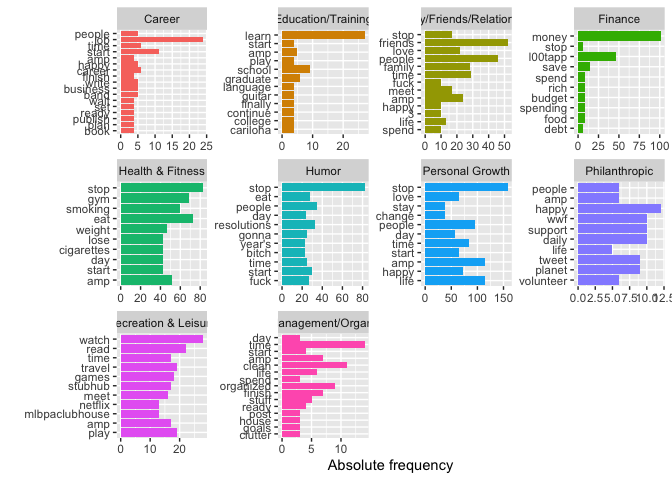
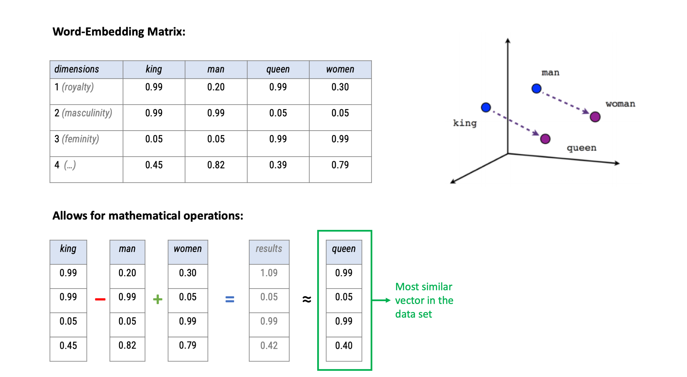

Word Embeddings and Transformers (complete)
================
Philipp K. Masur
2023-11

- [Introduction](#introduction)
  - [Setting up a hugging face
    account](#setting-up-a-hugging-face-account)
- [Preparation](#preparation)
  - [Loading data](#loading-data)
  - [Visualize word frequency per new year’s resolution
    topic](#visualize-word-frequency-per-new-years-resolution-topic)
- [Analysis with Word-Embeddings](#analysis-with-word-embeddings)
  - [Downloading and understanding
    word-embeddings](#downloading-and-understanding-word-embeddings)
  - [Using these word embeddings for our
    tweets](#using-these-word-embeddings-for-our-tweets)
  - [Computations with
    word-embeddings](#computations-with-word-embeddings)
- [Classification using a BERT model via hugging
  face](#classification-using-a-bert-model-via-hugging-face)
  - [A small example](#a-small-example)
  - [A more elaborate example](#a-more-elaborate-example)

# Introduction

In this tutorial, we are going to engage with a) word-embeddings and b)
zero-shot learning using a BERT model from hugging face.

## Setting up a hugging face account

Although we can assess the hugging face account directly, it is better
to link our analyis here with an account as this will increase the rate
limit for API prompts. As a first step, I hence would like to ask you to
create a hugging face account. For this, please follow these steps:

1.  Go to <https://www.huggingface.co>

2.  Click on “Sign Up” in the upper right corner and follow the steps.

3.  Once you have an account, click on your account picture in the upper
    right corner and click on settings:

 4. Click on “Access Tokens” on the left and create a new
one.


5.  Copy the code. We will use it in the tutorial shortly.

# Preparation

In this tutorial, we are going to use the package collections
`tidyverse` and `tidytext`. Now, please enter the Access Token from your
hugging face account in the code below (replace `XXXX`).

``` r
library(tidyverse)
library(tidytext)

# Provide access to hugging face account
Sys.setenv(
  HF_API_TOKEN = "XXXX" # <-- enter your hugging face token here
)
```

## Loading data

Next, we are going to load the data set that we will analyze in this
tutorial (download it from Canvas and put into the working direction of
your choice). It is a corpus of 5,002 tweets that contained the hashtag
“\#newyearsresolution” and thus contain resolutions by people (scraped
in 2015). Next to a `text` column which contains the actual tweet
content, the data set also contains the `name` of the author, time and
date, as well as a first categorization of the tweets into “topics” or
“categories.

``` r
# Tweets on "New Year's Resolution
tweets <- read_csv2("data/new_year_resolutions_dataset.csv")
tweets |> 
  head()
```

| resolution_topics                                     | gender | name                | resolution_category | retweet_count | text                                                                                                                                      | tweet_coord | tweet_created       | tweet_date |    tweet_id | tweet_location           | tweet_state | user_timezone              | tweet_region |
|:------------------------------------------------------|:-------|:--------------------|:--------------------|--------------:|:------------------------------------------------------------------------------------------------------------------------------------------|:------------|:--------------------|:-----------|------------:|:-------------------------|:------------|:---------------------------|:-------------|
| Eat healthier                                         | female | Dena_Marina         | Health & Fitness    |             0 | \#NewYearsResolution :: Read more books, No scrolling FB/checking email b4 breakfast, stay dedicated to PT/yoga to squash my achin’ back! | NA          | 2014-12-31 10:48:00 | 2014-12-31 | 5.50363e+17 | Southern California      | CA          | Pacific Time (US & Canada) | West         |
| Humor about Personal Growth and Interests Resolutions | female | ninjagirl325        | Humor               |             1 | \#NewYearsResolution Finally master @ZJ10 ’s part of Kitchen Sink                                                                         | NA          | 2014-12-31 10:47:00 | 2014-12-31 | 5.50363e+17 | New Jersey               | NJ          | Central Time (US & Canada) | Northeast    |
| Be More Confident                                     | male   | RickyDelReyy        | Personal Growth     |             0 | \#NewYearsResolution to stop being so damn perf *???*???                                                                                  | NA          | 2014-12-31 10:46:00 | 2014-12-31 | 5.50362e+17 | Hollywood                | CA          | Eastern Time (US & Canada) | West         |
| Other                                                 | male   | CalmareNJ           | Philanthropic       |             0 | My \#NewYearsResolution is to help my disabled patients discover the emotional and physical therapy from loving a pet. \#adoptarescue     | NA          | 2014-12-31 10:45:00 | 2014-12-31 | 5.50362e+17 | Metro NYC                | NY          | NA                         | Northeast    |
| Be more positive                                      | female | welovatoyoudemi     | Personal Growth     |             0 | \#NewYearsResolution \#2015Goals \#2015bucketlist continued??\_??? <http://t.co/h4P9B7tWjG>                                               | NA          | 2014-12-31 10:44:00 | 2014-12-31 | 5.50362e+17 | Pittsburgh, Pennsylvania | PA          | Eastern Time (US & Canada) | Northeast    |
| Eat healthier                                         | male   | EthanJMoroles       | Health & Fitness    |             0 | \#NewYearsResolution 1. Eat less.                                                                                                         |             |                     |            |             |                          |             |                            |              |
| 2.quit lying.                                         | NA     | 2014-12-31 10:43:00 | 2014-12-31          |   5.50362e+17 | Odessa Texas.                                                                                                                             | TX          | NA                  | South      |             |                          |             |                            |              |

Let’s do some standard text analysis with this data set. We create a id
variable (often helpful!), select only a few columns, and - as always -
we tokenize the tweets into words. This gets already rid of all symbols
(e.g., `#`), which is usually a good choice (but depends on your
research goals, of course. )

``` r
# Data wrangling
tidy_tweets <- tweets |> 
  mutate(id = 1:n()) |> 
  select(name, text, topic = resolution_category) |> 
  unnest_tokens(word, text)
tidy_tweets |> 
  head()
```

| name        | topic            | word               |
|:------------|:-----------------|:-------------------|
| Dena_Marina | Health & Fitness | newyearsresolution |
| Dena_Marina | Health & Fitness | read               |
| Dena_Marina | Health & Fitness | more               |
| Dena_Marina | Health & Fitness | books              |
| Dena_Marina | Health & Fitness | no                 |
| Dena_Marina | Health & Fitness | scrolling          |

## Visualize word frequency per new year’s resolution topic

How about we do a first descriptive analysis of word frequencies per
topic. As you know, for visualizations it is usually fruitful to remove
some words. Next to standard stopwords, it can be useful to create
additional words that should be removed. Particularly in tweets, there
are often words, that do not help in understanding the tweets. E.g. the
hashtag word “newyearsresolution” is literally in all tweets, so not
helpful to differentiate topics. Below, I added a number of
Twitter-specific terms (e.g., “rt” = retweet, “t.co” = typical URL
abbreviation on Twitter, etc.)

With this preprocessed data, we can visualize the top 10 words in each
topic!

``` r
# Removing some stopwords
add_stopwords <- c("newyearsresolution", "resolution", 
                   "rt", "http", "t.co", "2015", "2014", 
                   "1", "2", "4")

# Visualizing top 10 words per topic
tidy_tweets |> 
  anti_join(stop_words) |> 
  filter(!word %in% add_stopwords) |> 
  group_by(topic, word) |> 
  summarize(n = n()) |> 
  slice_max(n, n = 10) |> 
  ggplot(aes(x = fct_reorder(word, n), y = n, 
             fill = topic)) +
  geom_col() +
  facet_wrap(~topic, scales = "free") +
  coord_flip() +
  theme(legend.position = "none") +
  labs(x = "", y = "Absolute frequency")
```

<!-- -->

**Exercise:** What do you see? Do the words make sense? Discuss in
class!

# Analysis with Word-Embeddings

As mentioned in the lecture on Monday, using word embeddings instead of
a document-feature matrix is a more powerful and informative ways to
represent words in a multidimensional vector space (see image below).

 To get
the word embeddings for our tweet corpus, we have to either train a
shallow neural network to find the weights that represent values on
these dimensions for each word (would be slow and the quality would be
questionable given the small size of the data set and the short format
of tweets) or we use pretrained word-embeddings (e.g., the GloVe word
embeddings).

## Downloading and understanding word-embeddings

We can get the full list of word embeddings trough the package
`textdata`. We can decide for ourselves, how many dimensions we want to
have for each word. Yet, we **are not going to run the code bwlow** as
the word-embeddings would take up almost 1 GB on your harddrive. This is
just to show how we could obtain high quality word-embeddings!

``` r
# Do not run!!!
library(textdata)

glove6b <- embedding_glove6b(dimensions = 100)
glove6b
```

Instead, we use a small subset of 10,000 words with embedding 50
dimensions that we can assess through the supplementary material of the
book by Van Atteveldt et al. We have to wrangle the resulting data type
a bit to get a tidy format.

``` r
# Download data
glove_fn <- "glove.6B.50d.10k.w2v.txt"
url <- glue::glue("https://cssbook.net/d/glove.6B.50d.10k.w2v.txt")
if (!file.exists(glove_fn)) 
    download.file(url, glove_fn)

# Data wrangling
word_embeddings <- read_delim(glove_fn, skip=1, delim=" ", quote="", 
    col_names = c("word", paste0("d", 1:50)))
```

Let’s quickly check out this data set. If we e.g., arrange after the
first dimension, we see that it seems to represent something related to
“aviation” or planes/rockets more generally.

``` r
# 10 highest scoring words on dimension 1
word_embeddings |> 
  arrange(-d1) |> 
  select(1:10) |> 
  head(n = 10)
```

| word       |     d1 |       d2 |        d3 |        d4 |        d5 |       d6 |        d7 |        d8 |       d9 |
|:-----------|-------:|---------:|----------:|----------:|----------:|---------:|----------:|----------:|---------:|
| airbus     | 2.5966 | -0.53562 |  0.414220 |  0.339390 | -0.050989 |  0.84761 | -0.722240 | -0.361250 |  0.86917 |
| spacecraft | 2.5187 |  0.74418 |  1.664800 |  0.059079 | -0.252150 | -0.24264 | -0.594390 | -0.417320 |  0.45961 |
| fiat       | 2.2865 | -1.14970 |  0.488500 |  0.518330 |  0.311980 | -0.13188 |  0.052030 | -0.660950 | -0.85899 |
| naples     | 2.2656 | -0.10631 | -1.272200 | -0.093226 | -0.437000 | -1.18090 | -0.085770 |  0.469250 | -1.08410 |
| di         | 2.2441 | -0.60324 | -1.468900 |  0.354340 |  0.243670 | -1.08890 |  0.356890 | -0.330700 | -0.56399 |
| planes     | 2.2006 | -0.83149 |  1.339800 | -0.347570 | -0.209030 | -0.28219 | -0.823580 | -0.480690 |  0.21096 |
| bombings   | 2.1611 | -0.22174 |  0.382600 |  0.072347 | -0.305030 |  0.63220 |  0.124740 | -0.123370 | -0.17079 |
| flights    | 2.1476 |  0.34970 | -0.017538 | -0.023777 | -1.391500 | -0.81150 | -0.742360 |  0.203530 |  1.22560 |
| orbit      | 2.1417 |  1.08480 |  1.662500 | -0.180110 |  0.323170 | -0.39432 |  0.047555 | -0.010772 |  0.40288 |
| plane      | 2.1142 | -0.10664 |  0.972400 |  0.121510 |  0.570940 | -0.13570 | -0.675950 |  0.116920 |  0.47239 |

## Using these word embeddings for our tweets

To embed our tweets, we simply “join” the word embeddings with our
tokenized and tidy tweet data set. As both data sets contain a columb
called “word”, it will naturally attach the dimensions to the tidy tweet
data set. We use `inner_join()` as this will join only those that are
actually present in the data set. We also create another version of this
in which we only have unique words, i.e., each row represent a different
word. In the object `embedded_tweets`, we attached dimensions for a word
several times, if it was in the data set more than once!

``` r
# Join embeddings with our tidy tweet data farme
embedded_tweets <- tidy_tweets |> 
  inner_join(word_embeddings) 
embedded_tweets |> 
  head()
```

| name        | topic            | word      |       d1 |       d2 |        d3 |       d4 |      d5 |       d6 |       d7 |         d8 |        d9 |       d10 |       d11 |       d12 |       d13 |      d14 |     d15 |        d16 |      d17 |      d18 |       d19 |       d20 |      d21 |      d22 |     d23 |      d24 |       d25 |        d26 |        d27 |       d28 |      d29 |       d30 |    d31 |      d32 |       d33 |      d34 |       d35 |       d36 |      d37 |       d38 |      d39 |       d40 |      d41 |       d42 |      d43 |     d44 |       d45 |       d46 |      d47 |       d48 |        d49 |       d50 |
|:------------|:-----------------|:----------|---------:|---------:|----------:|---------:|--------:|---------:|---------:|-----------:|----------:|----------:|----------:|----------:|----------:|---------:|--------:|-----------:|---------:|---------:|----------:|----------:|---------:|---------:|--------:|---------:|----------:|-----------:|-----------:|----------:|---------:|----------:|-------:|---------:|----------:|---------:|----------:|----------:|---------:|----------:|---------:|----------:|---------:|----------:|---------:|--------:|----------:|----------:|---------:|----------:|-----------:|----------:|
| Dena_Marina | Health & Fitness | read      | -0.38669 |  0.36389 |  0.205700 | -0.95315 | 0.87229 | -0.62326 | -0.63946 | -0.4384500 | -0.388790 | -0.082899 | -0.693040 |  0.639460 | -0.042382 | -0.13799 | 0.95895 | -0.2297400 | -0.86440 | -0.69957 |  0.325680 | -0.594030 |  0.36468 | 0.729270 | 0.95577 |  0.45380 |  1.243200 | -1.5757000 | -1.0416000 |  0.078455 | -0.25434 | -1.022400 | 2.4128 | -0.42656 | -0.464370 | -0.48246 | -0.377480 | -0.136910 |  0.69548 | -0.033102 | -0.14665 |  0.014260 |  1.09460 |  0.410790 | -0.19007 | 0.45311 |  0.074330 |  0.331600 |  0.35128 |  0.047686 | -0.0052808 |  0.098593 |
| Dena_Marina | Health & Fitness | more      |  0.87943 | -0.11176 |  0.433800 | -0.42919 | 0.41989 |  0.21830 | -0.36740 | -0.6088900 | -0.410720 |  0.489900 | -0.400600 | -0.501590 |  0.241870 | -0.15640 | 0.67703 | -0.0213550 |  0.33676 |  0.35209 | -0.242320 | -1.074500 | -0.13775 | 0.299490 | 0.44603 | -0.14464 |  0.166250 | -1.3699000 | -0.3823300 | -0.011387 |  0.38127 |  0.038097 | 4.3657 |  0.44172 |  0.340430 | -0.35538 |  0.300730 | -0.092230 | -0.33221 |  0.377090 | -0.29665 | -0.303110 | -0.49652 |  0.342850 |  0.77089 | 0.60848 |  0.156980 |  0.029356 | -0.42687 |  0.371830 | -0.7136800 |  0.301750 |
| Dena_Marina | Health & Fitness | books     | -0.03345 |  0.80877 | -0.206590 | -0.92842 | 0.27433 |  0.17549 | -1.55010 | -1.9302000 |  0.429390 |  0.159840 | -0.926300 |  1.107300 | -0.155180 | -0.39590 | 1.43100 | -0.7458300 | -0.33683 | -0.21206 |  0.153860 | -0.022504 |  1.12700 | 0.319190 | 0.83898 |  0.48734 |  0.296600 | -0.8194200 | -1.5519000 | -0.774880 | -0.28272 | -0.716430 | 2.6664 | -0.57047 |  0.105810 | -0.10116 | -0.486620 |  0.634220 | -0.60514 |  0.197880 | -0.25741 | -0.207310 |  0.95538 | -0.102750 |  0.41266 | 0.72930 | -0.297040 |  0.602640 |  0.29637 | -0.021069 | -0.6510400 | -0.586760 |
| Dena_Marina | Health & Fitness | no        |  0.34957 |  0.40147 | -0.012561 |  0.13743 | 0.40080 |  0.46682 | -0.09743 | -0.0024548 | -0.335640 | -0.004639 | -0.059101 |  0.275320 | -0.397400 | -0.29267 | 0.97442 |  0.4188000 |  0.18395 | -0.20602 | -0.061437 | -0.615760 | -0.53471 | 0.415360 | 0.34851 | -0.31878 |  0.274040 | -1.8320000 | -0.8236300 |  0.488160 |  1.13720 | -0.380250 | 3.8114 |  0.25510 | -0.706370 | -0.25820 |  0.040929 | -0.097378 |  0.79571 | -0.494840 |  0.10870 |  0.148380 | -0.18390 |  0.133120 |  0.21469 | 0.53932 | -0.193380 | -0.422160 | -0.61411 |  0.703740 |  0.5759100 |  0.435060 |
| Dena_Marina | Health & Fitness | checking  |  0.37207 | -0.16965 |  0.585170 | -0.46636 | 0.21484 | -0.36023 | -0.57515 |  0.1045300 |  0.613150 | -0.601900 |  0.021544 |  0.139390 | -0.290170 |  0.21709 | 0.41926 | -0.0024394 | -0.52941 | -0.57658 |  0.447890 | -0.475320 |  0.30509 | 0.088804 | 0.18511 |  0.51516 |  0.022718 | -0.9225500 |  0.0186680 |  0.381820 |  0.84169 | -0.871540 | 1.7612 |  0.64565 | -0.045947 | -0.55880 |  0.099260 |  0.869320 |  0.29035 |  0.064007 |  0.45302 |  0.665910 |  0.54144 | -0.027037 |  0.61743 | 0.99763 | -0.025216 | -0.933140 |  0.71736 |  1.163300 |  0.8658100 | -0.142780 |
| Dena_Marina | Health & Fitness | breakfast |  0.33153 |  1.10170 | -1.013500 | -0.13205 | 0.55403 | -0.42136 | -1.36090 | -0.1289000 |  0.060961 | -0.466340 | -1.269500 |  0.014226 |  1.019900 |  0.69993 | 0.52976 |  0.2297000 | -0.46861 |  0.50779 |  0.103920 | -0.710120 |  1.41970 | 0.654200 | 0.94902 |  1.00530 | -0.043617 |  0.0049995 | -0.0030354 |  0.765790 |  0.16998 |  0.208230 | 2.0020 |  1.10420 | -0.440620 |  1.48160 |  0.407180 |  0.048167 |  0.36009 |  0.744930 |  0.13733 | -0.057996 |  0.36170 |  0.449660 | -1.13770 | 0.32025 |  0.398140 |  0.881150 | -0.78377 | -0.154450 |  0.0790200 |  1.126200 |

``` r
# Get unique word embeddings
unique_embeddings <- embedded_tweets |> 
  select(-name, -topic) |> 
  unique()
```

We can now investigate similarities between words from different tweets.
For this, we need to transform our `unique_embeddings` data set into a
matrix (technically not necessary, but speeds up computation).

We further create two function that allow us to find a relevant word and
its dimensions (`wvector()`) and to find similar words in the corpus.

``` r
# Create a matrix from the word embeddings -> fast computation
tweet_matrix <- as.matrix(unique_embeddings[-1])
rownames(tweet_matrix) <- unique_embeddings$word
tweet_matrix <- tweet_matrix / sqrt(rowSums(tweet_matrix^2))

# Function to extract a word vector
wvector <- function(wv, word) wv[word,,drop=F]

# Functionl to compute similarities between word vector and n other words
wv_similar <- function(wv, target, n=5) {
  similarities = wv %*% t(target)
  similarities |>  
    as_tibble(rownames = "word") |> 
    rename(similarity=2) |> 
    arrange(-similarity) |>  
    head(n=n)  
}
```

Let’s this out. Here, we search for the 10 most similar words to
“smoking”, “guitar”, and “happy” in our tweet corpus.

``` r
wv_similar(tweet_matrix, wvector(tweet_matrix, "smoking"), n = 10)
```

| word       | similarity |
|:-----------|-----------:|
| smoking    |  1.0000000 |
| alcohol    |  0.7589115 |
| cigarettes |  0.7385350 |
| drinking   |  0.7332856 |
| cigarette  |  0.7318638 |
| sex        |  0.6975176 |
| drugs      |  0.6898018 |
| habit      |  0.6743263 |
| ban        |  0.6716293 |
| tobacco    |  0.6589237 |

``` r
wv_similar(tweet_matrix, wvector(tweet_matrix, "guitar"), n = 10)
```

| word    | similarity |
|:--------|-----------:|
| guitar  |  1.0000000 |
| bass    |  0.8651065 |
| drums   |  0.8596564 |
| piano   |  0.8323098 |
| music   |  0.7736388 |
| singing |  0.7707696 |
| songs   |  0.7644592 |
| band    |  0.7554158 |
| lyrics  |  0.7371946 |
| musical |  0.7348663 |

``` r
wv_similar(tweet_matrix, wvector(tweet_matrix, "happy"), n = 10)
```

| word       | similarity |
|:-----------|-----------:|
| happy      |  1.0000000 |
| everyone   |  0.8976402 |
| everybody  |  0.8965490 |
| really     |  0.8839761 |
| me         |  0.8784631 |
| definitely |  0.8762789 |
| maybe      |  0.8756702 |
| feel       |  0.8707678 |
| i          |  0.8707453 |
| always     |  0.8693966 |

## Computations with word-embeddings

Now, we can do some computations with it. For example, we can extract
the word embeddings for the words “college” and “drinking”, then
subtract the latter from the former and investigate which word in the
corpus the result is most similar to:

``` r
# Extract word embeddings
college <- wvector(tweet_matrix, "college")
drinking <- wvector(tweet_matrix, "drinking")

# Compute the result
whatisthis <- college - drinking 

# Compare result to other words in the corpus
wv_similar(tweet_matrix, whatisthis, n = 20)
```

| word       | similarity |
|:-----------|-----------:|
| college    |  0.7130716 |
| graduate   |  0.7021075 |
| university |  0.6191416 |
| fellowship |  0.6092059 |
| 6th        |  0.5861752 |
| 5th        |  0.5739718 |
| 7th        |  0.5715068 |
| 9th        |  0.5614964 |
| school     |  0.5594276 |
| luke       |  0.5526657 |
| graduates  |  0.5460158 |
| michigan   |  0.5365516 |
| knights    |  0.5325975 |
| graduation |  0.5307810 |
| 4th        |  0.5297376 |
| canon      |  0.5296979 |
| 3rd        |  0.5121105 |
| ohio       |  0.5078106 |
| math       |  0.5035636 |
| associate  |  0.5018556 |

Well, it is reasonable that the result of this subtraction is close to
the word “college” (it is still part of it), but funny enough, we also
have many words like “graduate”, “graduates”, and “graduation”. So
apparently, if you substract “drinking” from “college”, it results in
“graduation”. Perhaps worth remembering in you final year of the
masters! :D

**Exercise:** What other words could you combine by e.g., subtraction or
addition and what does it result in? Play around with these vector
computations!

``` r
# Extract word embeddings
sleep <- wvector(tweet_matrix, "sleep") 

# Compute the result
whatisthis <- college - sleep

# Compare result to other words in the corpus
wv_similar(tweet_matrix, whatisthis, n = 20)
```

| word       | similarity |
|:-----------|-----------:|
| college    |  0.7008673 |
| michigan   |  0.6901836 |
| university |  0.6630008 |
| ohio       |  0.6400093 |
| graduate   |  0.6324364 |
| wisconsin  |  0.6085224 |
| oregon     |  0.5814024 |
| school     |  0.5725717 |
| carolina   |  0.5655059 |
| dakota     |  0.5527791 |
| athletic   |  0.5521112 |
| wyoming    |  0.5224169 |
| grammar    |  0.5162911 |
| iowa       |  0.5138307 |
| graduates  |  0.5104106 |
| kansas     |  0.5085876 |
| academic   |  0.5071062 |
| football   |  0.5054488 |
| fellowship |  0.4994628 |
| joined     |  0.4986306 |

# Classification using a BERT model via hugging face

Now, we are going to use a BERT model to classify the topic of the
tweets. We are not going to fine-tune the model and hence rely on
zero-shot learning. The figure below shows the zero-shot classification
pipeline.


## A small example

Let’s start small and only classify the first 10 tweets. We can do this
with a specific function from the package `ccsamsterdamR`, which
contains function that we can use to very easily access the hugging face
API and thus a variety of BERT models (and other models too!). Please
install the pacakge now and then load it.

The package contains the function `hf_zeroshot()`, which provide a very
simple syntax for zero-shot text classification. You only have to
provide the text you want to have classified as a vector. Next, you need
to provide the labels from which the model should choose to predict the
outcome class. Finally, you have to provide the URL to the model that
you want to use. In this case, we are using a smaller version of BERT
called “DEBERTA”, which our colleage Moritz Laurer pretrained on various
classification tasks to improve its zero-shot learning ability.

To find other models, you can go to <https://huggingface.co/models> and
check out what else you can use. To provide an URL to the function,
simple add follow this syntax:
`"https://api-inference.huggingface.co/models/[author]/[modelname]"`.
Depending on the traffic on the site, this will take a moment to produce
the results.

``` r
# Install the package from github
#remotes::install_github("ccs-amsterdam/ccsamsterdamR/")

# Load course-specific package
library(ccsamsterdamR)

# Simple zero-shot analysis of the first 10 tweets
results <- hf_zeroshot(txt = tweets$text[1:10],
                       labels = c("health", "personal growth", "education", "career", "family", "relationship", "hobby"),
                       url = "https://api-inference.huggingface.co/models/MoritzLaurer/deberta-v3-large-zeroshot-v1")
results |> 
  head()
```

| sequence                                                                                                                                  | labels                                                                       | scores                                                                                           |
|:------------------------------------------------------------------------------------------------------------------------------------------|:-----------------------------------------------------------------------------|:-------------------------------------------------------------------------------------------------|
| \#NewYearsResolution :: Read more books, No scrolling FB/checking email b4 breakfast, stay dedicated to PT/yoga to squash my achin’ back! | health , personal growth, education , hobby , career , relationship , family | 6.479046e-01, 3.437821e-01, 5.848951e-03, 2.203340e-03, 9.111541e-05, 8.506430e-05, 8.481659e-05 |
| \#NewYearsResolution Finally master @ZJ10 ’s part of Kitchen Sink                                                                         | hobby , personal growth, health , education , career , family , relationship | 0.9713478088, 0.0230660867, 0.0017690151, 0.0016011361, 0.0009144701, 0.0007028524, 0.0005986179 |
| \#NewYearsResolution to stop being so damn perf *???*???                                                                                  | personal growth, health , hobby , career , relationship , education , family | 0.9804571271, 0.0107802087, 0.0041060811, 0.0020268059, 0.0009432118, 0.0008859481, 0.0008006076 |
| My \#NewYearsResolution is to help my disabled patients discover the emotional and physical therapy from loving a pet. \#adoptarescue     | health , relationship , personal growth, career , hobby , family , education | 0.5226231217, 0.2650623620, 0.1978159547, 0.0104747051, 0.0029529268, 0.0008620213, 0.0002089477 |
| \#NewYearsResolution \#2015Goals \#2015bucketlist continued??\_??? <http://t.co/h4P9B7tWjG>                                               | personal growth, hobby , health , career , education , relationship , family | 0.985658228, 0.004384978, 0.002812498, 0.002057672, 0.001783691, 0.001665487, 0.001637395        |
| \#NewYearsResolution 1. Eat less.                                                                                                         |                                                                              |                                                                                                  |
| 2.quit lying.                                                                                                                             | health , personal growth, family , relationship , education , career , hobby | 0.9834070206, 0.0140235089, 0.0005933542, 0.0005228395, 0.0004943878, 0.0004839639, 0.0004749661 |

To see the results, we need to unnest the columns `labels` and `scores`.
This creates a table in which each tweet receives a probability score
with which it fits into any of the topic categories.

While we’re at it, let’s further boil this down to a format that we are
already used to. By transforming this set to a long format, an filtering
based on the maximum probability, we get the most likely topic per
tweet!

``` r
# Data wrangling to get a nice output
result_table <- results |> 
  unnest(cols = c("labels", "scores"))  |> 
  as_tibble() |> 
  spread(labels, scores) |> 
  mutate_if(is.numeric, round, 5)
result_table |> 
  head()
```

| sequence                                                                                                                                  |  career | education |  family |  health |   hobby | personal growth | relationship |
|:------------------------------------------------------------------------------------------------------------------------------------------|--------:|----------:|--------:|--------:|--------:|----------------:|-------------:|
| \#NewYearsResolution :: Read more books, No scrolling FB/checking email b4 breakfast, stay dedicated to PT/yoga to squash my achin’ back! | 0.00009 |   0.00585 | 0.00008 | 0.64790 | 0.00220 |         0.34378 |      0.00009 |
| \#NewYearsResolution \#2015Goals \#2015bucketlist continued??\_??? <http://t.co/h4P9B7tWjG>                                               | 0.00206 |   0.00178 | 0.00164 | 0.00281 | 0.00438 |         0.98566 |      0.00167 |
| \#NewYearsResolution 1. Eat less.                                                                                                         |         |           |         |         |         |                 |              |
| 2.quit lying.                                                                                                                             | 0.00048 |   0.00049 | 0.00059 | 0.98341 | 0.00047 |         0.01402 |      0.00052 |
| \#NewYearsResolution Finally master @ZJ10 ’s part of Kitchen Sink                                                                         | 0.00091 |   0.00160 | 0.00070 | 0.00177 | 0.97135 |         0.02307 |      0.00060 |
| \#NewYearsResolution Stop worrying about irrelevant things                                                                                | 0.09391 |   0.07076 | 0.07258 | 0.10600 | 0.07116 |         0.50574 |      0.07986 |
| \#NewYearsResolution to start a hobby, do it once, and never do it again.                                                                 | 0.00130 |   0.00121 | 0.00102 | 0.00147 | 0.98505 |         0.00886 |      0.00108 |

``` r
# Get topic per tweet
result_table |> 
  pivot_longer(career:relationship) |> 
  group_by(sequence) |> 
  filter(value == max(value)) |> 
  head()
```

    ## # A tibble: 6 × 3
    ## # Groups:   sequence [6]
    ##   sequence                                                           name  value
    ##   <chr>                                                              <chr> <dbl>
    ## 1 "#NewYearsResolution :: Read more books, No scrolling FB/checking… heal… 0.648
    ## 2 "#NewYearsResolution #2015Goals #2015bucketlist continued??_??? h… pers… 0.986
    ## 3 "#NewYearsResolution 1. Eat less.\n2.quit lying."                  heal… 0.983
    ## 4 "#NewYearsResolution Finally master @ZJ10 's part of Kitchen Sink" hobby 0.971
    ## 5 "#NewYearsResolution Stop worrying about irrelevant things"        pers… 0.506
    ## 6 "#NewYearsResolution to start a hobby, do it once, and never do i… hobby 0.985

## A more elaborate example

Via the API, we can only classify a few tweets in one go before that
will stop the processing. It is not designed to allow every single user
to classify infinite amount of texts. We can circumvent this by
splitting our data in smaller chunks and gradually classify these chunks
one after another. If the traffic is not to high on the site, this
should (we need to lower the amount of text per chunk and increase the
dealy between prompts, if it breaks!)

But first, let’s create a simpler topic column against which we can
evaluate the BERT model’s performance. Here, I am generating a simple
topic vector based on the already existing resolution category column.

``` r
tweets2 <- tweets |> 
  mutate(topic = case_when(grepl("Health", resolution_category) ~ "health",
                           grepl("Personal Growth", resolution_category) ~ "growth",
                           grepl("Philanthropic", resolution_category) ~ "philanthropic",
                           grepl("Career", resolution_category) ~ "career",
                           grepl("Leisure", resolution_category) ~ "leisure",
                           grepl("Relationships", resolution_category) ~ "relationships")) |> 
  filter(!is.na(topic))
```

Now, we need to split the data. The `ccsamsterdamR` package includes a
function for this. To not go crazy, we only going to classify the first
60 tweets and hence only split those into groups of 15. Then, we create
a loop with the function `map()`, which iteratively sends the prompt to
the API and extracts the results. We can add a delay between prompts to
make sure that we do not send to many prompts per minute (this of course
makes the process longer).

``` r
# Split data sets in reasonable chunks (a bit of trial and error in light of what works with the API)
splits <- gpt_split_data(tweets2[1:60,], n_per_group = 15)

# MAp across the chunks. 
map_results <- map_df(splits, function(x) {
  output <- hf_zeroshot(
    txt = x$text,
    labels = c("health", "growth", "philanthropic", "leisure", "relationships", "career"),
    url = "https://api-inference.huggingface.co/models/MoritzLaurer/deberta-v3-large-zeroshot-v1")
  Sys.sleep(10) # Delay between prompts
  output
})

# Check
map_results |> 
  head()
```

| sequence                                                                                                                                  | labels                                                            | scores                                                                             |
|:------------------------------------------------------------------------------------------------------------------------------------------|:------------------------------------------------------------------|:-----------------------------------------------------------------------------------|
| \#NewYearsResolution :: Read more books, No scrolling FB/checking email b4 breakfast, stay dedicated to PT/yoga to squash my achin’ back! | health , growth , leisure , career , philanthropic, relationships | 0.9763419628, 0.0152510097, 0.0080219433, 0.0001373038, 0.0001245624, 0.0001231603 |
| \#NewYearsResolution to stop being so damn perf *???*???                                                                                  | growth , health , leisure , career , relationships, philanthropic | 0.50333142, 0.32367572, 0.06227733, 0.06085484, 0.02546430, 0.02439636             |
| My \#NewYearsResolution is to help my disabled patients discover the emotional and physical therapy from loving a pet. \#adoptarescue     | health , growth , career , philanthropic, relationships, leisure  | 0.6642835736, 0.3120364547, 0.0133139435, 0.0053009037, 0.0046932884, 0.0003718548 |
| \#NewYearsResolution \#2015Goals \#2015bucketlist continued??\_??? <http://t.co/h4P9B7tWjG>                                               | growth , leisure , health , career , philanthropic, relationships | 0.63413435, 0.17290391, 0.06651734, 0.04866522, 0.03926672, 0.03851247             |
| \#NewYearsResolution 1. Eat less.                                                                                                         |                                                                   |                                                                                    |
| 2.quit lying.                                                                                                                             | health , growth , leisure , relationships, career , philanthropic | 0.9971494079, 0.0008030310, 0.0005535495, 0.0005365025, 0.0004907270, 0.0004667564 |
| My \#NewYearsResolution                                                                                                                   |                                                                   |                                                                                    |

-Learn how to drive. -Apologize less. -Read and write more. -Get a 4.0
this upcoming quarter -Drop my mixtape \|growth , career , leisure ,
health , relationships, philanthropic \|0.9912648201, 0.0047335164,
0.0015371421, 0.0013348938, 0.0005708159, 0.0005587572 \|

Now we can wrangle the data to get a “predict” object like we are used
to from earlier practical session and that we can use to compute
confusion matrix and performance scores.

``` r
# Unnest columns
map_results_table <- map_results |> 
  unnest(cols = c("labels", "scores"))  |> 
  as_tibble() |> 
  spread(labels, scores) |> 
  mutate_if(is.numeric, round, 4)
map_results_table |> 
  head()
```

| sequence                                                                                                                                  | career | growth | health | leisure | philanthropic | relationships |
|:------------------------------------------------------------------------------------------------------------------------------------------|-------:|-------:|-------:|--------:|--------------:|--------------:|
| @Inc @MarlaTabaka YES - let’s all take calculated risks and reduce self criticism as part of our \#NewYearsResolution                     | 0.4050 | 0.3106 | 0.1007 |  0.0620 |        0.0585 |        0.0632 |
| @KennedyNation my \#NewYearsResolution is Job, Boyfriend, Preparing for 2016 POTUS elections, and gaining responsibilities. \#FoxNews2015 | 0.7536 | 0.1137 | 0.0004 |  0.0006 |        0.0003 |        0.1314 |
| \#NewYearsResolution :: Read more books, No scrolling FB/checking email b4 breakfast, stay dedicated to PT/yoga to squash my achin’ back! | 0.0001 | 0.0153 | 0.9763 |  0.0080 |        0.0001 |        0.0001 |
| \#NewYearsResolution \#2015Goals \#2015bucketlist continued??\_??? <http://t.co/h4P9B7tWjG>                                               | 0.0487 | 0.6341 | 0.0665 |  0.1729 |        0.0393 |        0.0385 |
| \#NewYearsResolution 1. Be more competitive                                                                                               | 0.2295 | 0.7346 | 0.0113 |  0.0085 |        0.0077 |        0.0085 |
| \#NewYearsResolution 1. Eat less.                                                                                                         |        |        |        |         |               |               |
| 2.quit lying.                                                                                                                             | 0.0005 | 0.0008 | 0.9971 |  0.0006 |        0.0005 |        0.0005 |

``` r
# Select most probable topic per Tweet
final_results <- map_results_table |> 
  pivot_longer(career:relationships) |> 
  group_by(sequence) |> 
  filter(value == max(value)) |> 
  unique() 

# Bind prediction to actual topic (gold standard) in the data set 
predict_hf <- final_results |> 
  rename(text = sequence,
         predicted = name) |>
  inner_join(tweets2[1:100,], by = "text") |> 
  select(topic, predicted) |> 
  mutate(topic = factor(topic, levels = c("growth", "health","relationships", "leisure", "career", "philanthropic")),
         predicted = factor(predicted, levels = c("growth", "health","relationships", "leisure", "career", "philanthropic"))) |> 
  ungroup()

predict_hf |> 
  head()
```

| text                                                                                                                                      | topic  | predicted |
|:------------------------------------------------------------------------------------------------------------------------------------------|:-------|:----------|
| @Inc @MarlaTabaka YES - let’s all take calculated risks and reduce self criticism as part of our \#NewYearsResolution                     | growth | career    |
| @KennedyNation my \#NewYearsResolution is Job, Boyfriend, Preparing for 2016 POTUS elections, and gaining responsibilities. \#FoxNews2015 | career | career    |
| \#NewYearsResolution :: Read more books, No scrolling FB/checking email b4 breakfast, stay dedicated to PT/yoga to squash my achin’ back! | health | health    |
| \#NewYearsResolution \#2015Goals \#2015bucketlist continued??\_??? <http://t.co/h4P9B7tWjG>                                               | growth | growth    |
| \#NewYearsResolution 1. Be more competitive                                                                                               | growth | growth    |
| \#NewYearsResolution 1. Eat less.                                                                                                         |        |           |
| 2.quit lying.                                                                                                                             | health | health    |

**Exercise 1:** Now, we have a “predict”-object similar to the ones we
had before, can you create the confusion matrix and estimate relevant
performance scores?

``` r
library(tidymodels)

predict_hf |> 
  conf_mat(truth = topic, estimate = predicted)
```

    ##                Truth
    ## Prediction      growth health relationships leisure career philanthropic
    ##   growth            16      2             2       1      2             0
    ##   health             2      9             0       2      0             2
    ##   relationships      3      1             4       0      0             0
    ##   leisure            4      2             0       4      0             0
    ##   career             1      0             0       0      2             0
    ##   philanthropic      0      0             0       0      0             1

``` r
predict_hf |> 
  metrics(truth = topic, estimate = predicted)
```

| .metric  | .estimator | .estimate |
|:---------|:-----------|----------:|
| accuracy | multiclass |  0.600000 |
| kap      | multiclass |  0.458443 |

**Exercise 2:** Can you classify the next bunch of tweets and add them
to the already classified tweets to recompute the performance?

``` r
splits2 <- gpt_split_data(tweets2[61:120,], n_per_group = 15)

# MAp across the chunks. 
map_results2 <- map_df(splits2, function(x) {
  output <- hf_zeroshot(
    txt = x$text,
    labels = c("health", "growth", "philanthropic", "leisure", "relationships", "career"),
    url = "https://api-inference.huggingface.co/models/MoritzLaurer/deberta-v3-large-zeroshot-v1")
  Sys.sleep(10) # Delay between prompts
  output
})
```

``` r
# Unnest columns
map_results_table2 <- map_results2 |> 
  unnest(cols = c("labels", "scores"))  |> 
  as_tibble() |> 
  spread(labels, scores) |> 
  mutate_if(is.numeric, round, 4)

# Select most probable topic per Tweet
final_results2 <- map_results_table2 |> 
  pivot_longer(career:relationships) |> 
  group_by(sequence) |> 
  filter(value == max(value)) |> 
  unique()

# Bind prediction to actual topic (gold standard) in the data set 
predict_hf2 <- final_results2 |> 
  rename(text = sequence,
         predicted = name) |>
  inner_join(tweets2[1:100,], by = "text") |> 
  select(topic, predicted) |> 
  mutate(topic = factor(topic, levels = c("growth", "health","relationships", "leisure", "career", "philanthropic")),
         predicted = factor(predicted, levels = c("growth", "health","relationships", "leisure", "career", "philanthropic"))) |> 
  ungroup()

# Bind both predictions
predict_overall <- predict_hf |> 
  bind_rows(predict_hf2)

# Confusion matrix
predict_overall |> 
  conf_mat(truth = topic, estimate = predicted)
```

    ##                Truth
    ## Prediction      growth health relationships leisure career philanthropic
    ##   growth            26      4             2       1      3             0
    ##   health             5     13             0       2      0             3
    ##   relationships      6      1             6       0      0             0
    ##   leisure            7      3             2       8      0             0
    ##   career             2      1             0       1      2             0
    ##   philanthropic      0      0             0       0      0             2

``` r
# Metrics
predict_overall |> 
  metrics(truth = topic, estimate = predicted)
```

| .metric  | .estimator | .estimate |
|:---------|:-----------|----------:|
| accuracy | multiclass | 0.5700000 |
| kap      | multiclass | 0.4211093 |

Without fine-tuning, BERT doesn’t do that well on this particular tasks.
This is not surprising given the cryptic way a lot of tweets are written
and the somewhat arbitrary labels that we provided. We can probably
improve the performance with fine-tuning as well as finding better
labels.
