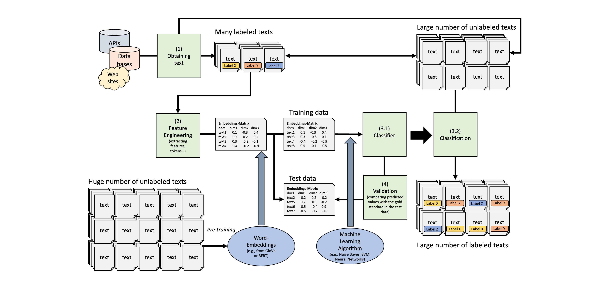

Word Embeddings
================
Philipp K. Masur
2024-11

- [Introduction](#introduction)
- [Preparation](#preparation)
  - [Loading data](#loading-data)
  - [Visualize word frequency per new year’s resolution
    topic](#visualize-word-frequency-per-new-years-resolution-topic)
- [Analysis with Word-Embeddings](#analysis-with-word-embeddings)
  - [Downloading and understanding
    word-embeddings](#downloading-and-understanding-word-embeddings)
  - [Using these word embeddings for our
    tweets](#using-these-word-embeddings-for-our-tweets)
  - [Computations with
    word-embeddings](#computations-with-word-embeddings)
- [Text Classification with
  Word-Embeddings](#text-classification-with-word-embeddings)
  - [Preparing the data](#preparing-the-data)
  - [Training the model](#training-the-model)
  - [Validation](#validation)

# Introduction

In this tutorial, we are going to engage with word-embeddings as better
ways to represent text as numbers. We are also going to fit a neural
network with word-embeddings.

# Preparation

We are going to use the package collections `tidyverse`, `tidytext` and
`tidymodels` (and the extension .

``` r
library(tidyverse)
library(tidytext)
library(tidymodels)
library(textrecipes)
```

## Loading data

Next, we are going to load the data set that we will analyze in this
tutorial (download it from Canvas and put into the working direction of
your choice). It is a corpus of 5,002 tweets that contained the hashtag
“\#newyearsresolution” and thus contain resolutions by people (scraped
in 2015). Next to a `text` column which contains the actual tweet
content, the data set also contains the `name` of the author, time and
date, as well as a first categorization of the tweets into “topics” or
“categories.

``` r
# Tweets on "New Year's Resolution
tweets <- read_csv2("data/new_year_resolutions_dataset.csv")
tweets |> 
  head()
```

| resolution_topics                                     | gender | name                | resolution_category | retweet_count | text                                                                                                                                      | tweet_coord | tweet_created       | tweet_date |    tweet_id | tweet_location           | tweet_state | user_timezone              | tweet_region |
|:------------------------------------------------------|:-------|:--------------------|:--------------------|--------------:|:------------------------------------------------------------------------------------------------------------------------------------------|:------------|:--------------------|:-----------|------------:|:-------------------------|:------------|:---------------------------|:-------------|
| Eat healthier                                         | female | Dena_Marina         | Health & Fitness    |             0 | \#NewYearsResolution :: Read more books, No scrolling FB/checking email b4 breakfast, stay dedicated to PT/yoga to squash my achin’ back! | NA          | 2014-12-31 10:48:00 | 2014-12-31 | 5.50363e+17 | Southern California      | CA          | Pacific Time (US & Canada) | West         |
| Humor about Personal Growth and Interests Resolutions | female | ninjagirl325        | Humor               |             1 | \#NewYearsResolution Finally master @ZJ10 ’s part of Kitchen Sink                                                                         | NA          | 2014-12-31 10:47:00 | 2014-12-31 | 5.50363e+17 | New Jersey               | NJ          | Central Time (US & Canada) | Northeast    |
| Be More Confident                                     | male   | RickyDelReyy        | Personal Growth     |             0 | \#NewYearsResolution to stop being so damn perf *???*???                                                                                  | NA          | 2014-12-31 10:46:00 | 2014-12-31 | 5.50362e+17 | Hollywood                | CA          | Eastern Time (US & Canada) | West         |
| Other                                                 | male   | CalmareNJ           | Philanthropic       |             0 | My \#NewYearsResolution is to help my disabled patients discover the emotional and physical therapy from loving a pet. \#adoptarescue     | NA          | 2014-12-31 10:45:00 | 2014-12-31 | 5.50362e+17 | Metro NYC                | NY          | NA                         | Northeast    |
| Be more positive                                      | female | welovatoyoudemi     | Personal Growth     |             0 | \#NewYearsResolution \#2015Goals \#2015bucketlist continued??\_??? <http://t.co/h4P9B7tWjG>                                               | NA          | 2014-12-31 10:44:00 | 2014-12-31 | 5.50362e+17 | Pittsburgh, Pennsylvania | PA          | Eastern Time (US & Canada) | Northeast    |
| Eat healthier                                         | male   | EthanJMoroles       | Health & Fitness    |             0 | \#NewYearsResolution 1. Eat less.                                                                                                         |             |                     |            |             |                          |             |                            |              |
| 2.quit lying.                                         | NA     | 2014-12-31 10:43:00 | 2014-12-31          |   5.50362e+17 | Odessa Texas.                                                                                                                             | TX          | NA                  | South      |             |                          |             |                            |              |

Let’s do some standard text analysis with this data set. We create a id
variable (often helpful!), select only a few columns, and - as always -
we tokenize the tweets into words. This gets already rid of all symbols
(e.g., `#`), which is usually a good choice (but depends on your
research goals, of course. )

``` r
# Data wrangling
tidy_tweets <- tweets |> 
  mutate(id = 1:n()) |> 
  select(name, text, topic = resolution_category) |> 
  unnest_tokens(word, text)
tidy_tweets |> 
  head()
```

| name        | topic            | word               |
|:------------|:-----------------|:-------------------|
| Dena_Marina | Health & Fitness | newyearsresolution |
| Dena_Marina | Health & Fitness | read               |
| Dena_Marina | Health & Fitness | more               |
| Dena_Marina | Health & Fitness | books              |
| Dena_Marina | Health & Fitness | no                 |
| Dena_Marina | Health & Fitness | scrolling          |

## Visualize word frequency per new year’s resolution topic

How about we do a first descriptive analysis of word frequencies per
topic. As you know, for visualizations it is usually fruitful to remove
some words. Next to standard stopwords, it can be useful to create
additional words that should be removed. Particularly in tweets, there
are often words, that do not help in understanding the tweets. E.g. the
hashtag word “newyearsresolution” is literally in all tweets, so not
helpful to differentiate topics. Below, I added a number of
Twitter-specific terms (e.g., “rt” = retweet, “t.co” = typical URL
abbreviation on Twitter, etc.)

With this preprocessed data, we can visualize the top 10 words in each
topic!

``` r
# Removing some stopwords
add_stopwords <- c("newyearsresolution", "resolution", 
                   "rt", "http", "t.co", "2015", "2014", 
                   "1", "2", "4")

# Visualizing top 10 words per topic
tidy_tweets |> 
  anti_join(stop_words) |> 
  filter(!word %in% add_stopwords) |> 
  group_by(topic, word) |> 
  summarize(n = n()) |> 
  slice_max(n, n = 10) |> 
  ggplot(aes(x = fct_reorder(word, n), y = n, 
             fill = topic)) +
  geom_col() +
  facet_wrap(~topic, scales = "free") +
  coord_flip() +
  theme(legend.position = "none") +
  labs(x = "", y = "Absolute frequency")
```

**Exercise:** What do you see? Do the words make sense? Discuss in
class!

# Analysis with Word-Embeddings

As mentioned in the lecture on Monday, using word embeddings instead of
a document-feature matrix is a more powerful and informative ways to
represent words in a multidimensional vector space (see image below).

 To get
the word embeddings for our tweet corpus, we have to either train a
shallow neural network to find the weights that represent values on
these dimensions for each word (would be slow and the quality would be
questionable given the small size of the data set and the short format
of tweets) or we use pretrained word-embeddings (e.g., the GloVe word
embeddings).

## Downloading and understanding word-embeddings

We can get the full list of word embeddings trough the package
`textdata`. We can decide for ourselves, how many dimensions we want to
have for each word. Yet, we **are not going to run the code bwlow** as
the word-embeddings would take up almost 1 GB on your harddrive. This is
just to show how we could obtain high quality word-embeddings!

``` r
# Do not run!!!
library(textdata)

glove6b <- embedding_glove6b(dimensions = 100)
glove6b
```

Instead, we use a small subset of 10,000 words with embedding 50
dimensions that we can assess through the supplementary material of the
book by Van Atteveldt et al. We have to wrangle the resulting data type
a bit to get a tidy format.

``` r
# Download data
glove_fn <- "glove.6B.50d.10k.w2v.txt"
url <- glue::glue("https://cssbook.net/d/glove.6B.50d.10k.w2v.txt")
if (!file.exists(glove_fn)) 
    download.file(url, glove_fn)

# Data wrangling
word_embeddings <- read_delim(glove_fn, skip=1, delim=" ", quote="", 
    col_names = c("word", paste0("d", 1:50)))
```

Let’s quickly check out this data set. If we e.g., arrange after the
first dimension, we see that it seems to represent something related to
“aviation” or planes/rockets more generally.

``` r
# 10 highest scoring words on dimension 1
word_embeddings |> 
  arrange(-d1) |> 
  select(1:10) |> 
  head()
```

| word       |     d1 |       d2 |       d3 |        d4 |        d5 |       d6 |       d7 |       d8 |       d9 |
|:-----------|-------:|---------:|---------:|----------:|----------:|---------:|---------:|---------:|---------:|
| airbus     | 2.5966 | -0.53562 |  0.41422 |  0.339390 | -0.050989 |  0.84761 | -0.72224 | -0.36125 |  0.86917 |
| spacecraft | 2.5187 |  0.74418 |  1.66480 |  0.059079 | -0.252150 | -0.24264 | -0.59439 | -0.41732 |  0.45961 |
| fiat       | 2.2865 | -1.14970 |  0.48850 |  0.518330 |  0.311980 | -0.13188 |  0.05203 | -0.66095 | -0.85899 |
| naples     | 2.2656 | -0.10631 | -1.27220 | -0.093226 | -0.437000 | -1.18090 | -0.08577 |  0.46925 | -1.08410 |
| di         | 2.2441 | -0.60324 | -1.46890 |  0.354340 |  0.243670 | -1.08890 |  0.35689 | -0.33070 | -0.56399 |
| planes     | 2.2006 | -0.83149 |  1.33980 | -0.347570 | -0.209030 | -0.28219 | -0.82358 | -0.48069 |  0.21096 |

## Using these word embeddings for our tweets

To embed our tweets, we simply “join” the word embeddings with our
tokenized and tidy tweet data set. As both data sets contain a columb
called “word”, it will naturally attach the dimensions to the tidy tweet
data set. We use `inner_join()` as this will join only those that are
actually present in the data set. We also create another version of this
in which we only have unique words, i.e., each row represent a different
word. In the object `embedded_tweets`, we attached dimensions for a word
several times, if it was in the data set more than once!

``` r
# Join embeddings with our tidy tweet data farme
embedded_tweets <- tidy_tweets |> 
  inner_join(word_embeddings) 
embedded_tweets |> 
  head()
```

| name        | topic            | word      |       d1 |       d2 |        d3 |       d4 |      d5 |       d6 |       d7 |         d8 |        d9 |       d10 |       d11 |       d12 |       d13 |      d14 |     d15 |        d16 |      d17 |      d18 |       d19 |       d20 |      d21 |      d22 |     d23 |      d24 |       d25 |        d26 |        d27 |       d28 |      d29 |       d30 |    d31 |      d32 |       d33 |      d34 |       d35 |       d36 |      d37 |       d38 |      d39 |       d40 |      d41 |       d42 |      d43 |     d44 |       d45 |       d46 |      d47 |       d48 |        d49 |       d50 |
|:------------|:-----------------|:----------|---------:|---------:|----------:|---------:|--------:|---------:|---------:|-----------:|----------:|----------:|----------:|----------:|----------:|---------:|--------:|-----------:|---------:|---------:|----------:|----------:|---------:|---------:|--------:|---------:|----------:|-----------:|-----------:|----------:|---------:|----------:|-------:|---------:|----------:|---------:|----------:|----------:|---------:|----------:|---------:|----------:|---------:|----------:|---------:|--------:|----------:|----------:|---------:|----------:|-----------:|----------:|
| Dena_Marina | Health & Fitness | read      | -0.38669 |  0.36389 |  0.205700 | -0.95315 | 0.87229 | -0.62326 | -0.63946 | -0.4384500 | -0.388790 | -0.082899 | -0.693040 |  0.639460 | -0.042382 | -0.13799 | 0.95895 | -0.2297400 | -0.86440 | -0.69957 |  0.325680 | -0.594030 |  0.36468 | 0.729270 | 0.95577 |  0.45380 |  1.243200 | -1.5757000 | -1.0416000 |  0.078455 | -0.25434 | -1.022400 | 2.4128 | -0.42656 | -0.464370 | -0.48246 | -0.377480 | -0.136910 |  0.69548 | -0.033102 | -0.14665 |  0.014260 |  1.09460 |  0.410790 | -0.19007 | 0.45311 |  0.074330 |  0.331600 |  0.35128 |  0.047686 | -0.0052808 |  0.098593 |
| Dena_Marina | Health & Fitness | more      |  0.87943 | -0.11176 |  0.433800 | -0.42919 | 0.41989 |  0.21830 | -0.36740 | -0.6088900 | -0.410720 |  0.489900 | -0.400600 | -0.501590 |  0.241870 | -0.15640 | 0.67703 | -0.0213550 |  0.33676 |  0.35209 | -0.242320 | -1.074500 | -0.13775 | 0.299490 | 0.44603 | -0.14464 |  0.166250 | -1.3699000 | -0.3823300 | -0.011387 |  0.38127 |  0.038097 | 4.3657 |  0.44172 |  0.340430 | -0.35538 |  0.300730 | -0.092230 | -0.33221 |  0.377090 | -0.29665 | -0.303110 | -0.49652 |  0.342850 |  0.77089 | 0.60848 |  0.156980 |  0.029356 | -0.42687 |  0.371830 | -0.7136800 |  0.301750 |
| Dena_Marina | Health & Fitness | books     | -0.03345 |  0.80877 | -0.206590 | -0.92842 | 0.27433 |  0.17549 | -1.55010 | -1.9302000 |  0.429390 |  0.159840 | -0.926300 |  1.107300 | -0.155180 | -0.39590 | 1.43100 | -0.7458300 | -0.33683 | -0.21206 |  0.153860 | -0.022504 |  1.12700 | 0.319190 | 0.83898 |  0.48734 |  0.296600 | -0.8194200 | -1.5519000 | -0.774880 | -0.28272 | -0.716430 | 2.6664 | -0.57047 |  0.105810 | -0.10116 | -0.486620 |  0.634220 | -0.60514 |  0.197880 | -0.25741 | -0.207310 |  0.95538 | -0.102750 |  0.41266 | 0.72930 | -0.297040 |  0.602640 |  0.29637 | -0.021069 | -0.6510400 | -0.586760 |
| Dena_Marina | Health & Fitness | no        |  0.34957 |  0.40147 | -0.012561 |  0.13743 | 0.40080 |  0.46682 | -0.09743 | -0.0024548 | -0.335640 | -0.004639 | -0.059101 |  0.275320 | -0.397400 | -0.29267 | 0.97442 |  0.4188000 |  0.18395 | -0.20602 | -0.061437 | -0.615760 | -0.53471 | 0.415360 | 0.34851 | -0.31878 |  0.274040 | -1.8320000 | -0.8236300 |  0.488160 |  1.13720 | -0.380250 | 3.8114 |  0.25510 | -0.706370 | -0.25820 |  0.040929 | -0.097378 |  0.79571 | -0.494840 |  0.10870 |  0.148380 | -0.18390 |  0.133120 |  0.21469 | 0.53932 | -0.193380 | -0.422160 | -0.61411 |  0.703740 |  0.5759100 |  0.435060 |
| Dena_Marina | Health & Fitness | checking  |  0.37207 | -0.16965 |  0.585170 | -0.46636 | 0.21484 | -0.36023 | -0.57515 |  0.1045300 |  0.613150 | -0.601900 |  0.021544 |  0.139390 | -0.290170 |  0.21709 | 0.41926 | -0.0024394 | -0.52941 | -0.57658 |  0.447890 | -0.475320 |  0.30509 | 0.088804 | 0.18511 |  0.51516 |  0.022718 | -0.9225500 |  0.0186680 |  0.381820 |  0.84169 | -0.871540 | 1.7612 |  0.64565 | -0.045947 | -0.55880 |  0.099260 |  0.869320 |  0.29035 |  0.064007 |  0.45302 |  0.665910 |  0.54144 | -0.027037 |  0.61743 | 0.99763 | -0.025216 | -0.933140 |  0.71736 |  1.163300 |  0.8658100 | -0.142780 |
| Dena_Marina | Health & Fitness | breakfast |  0.33153 |  1.10170 | -1.013500 | -0.13205 | 0.55403 | -0.42136 | -1.36090 | -0.1289000 |  0.060961 | -0.466340 | -1.269500 |  0.014226 |  1.019900 |  0.69993 | 0.52976 |  0.2297000 | -0.46861 |  0.50779 |  0.103920 | -0.710120 |  1.41970 | 0.654200 | 0.94902 |  1.00530 | -0.043617 |  0.0049995 | -0.0030354 |  0.765790 |  0.16998 |  0.208230 | 2.0020 |  1.10420 | -0.440620 |  1.48160 |  0.407180 |  0.048167 |  0.36009 |  0.744930 |  0.13733 | -0.057996 |  0.36170 |  0.449660 | -1.13770 | 0.32025 |  0.398140 |  0.881150 | -0.78377 | -0.154450 |  0.0790200 |  1.126200 |

``` r
# Get unique word embeddings
unique_embeddings <- embedded_tweets |> 
  select(-name, -topic) |> 
  unique()
```

We can now investigate similarities between words from different tweets.
For this, we need to transform our `unique_embeddings` data set into a
matrix (technically not necessary, but speeds up computation).

We further create two function that allow us to find a relevant word and
its dimensions (`wvector()`) and to find similar words in the corpus.

``` r
# Create a matrix from the word embeddings -> fast computation
tweet_matrix <- as.matrix(unique_embeddings[-1])
rownames(tweet_matrix) <- unique_embeddings$word
tweet_matrix <- tweet_matrix / sqrt(rowSums(tweet_matrix^2))

# Function to extract a word vector
wvector <- function(wv, word) wv[word,,drop=F]

# Functionl to compute similarities between word vector and n other words
wv_similar <- function(wv, target, n=5) {
  similarities = wv %*% t(target)
  similarities |>  
    as_tibble(rownames = "word") |> 
    rename(similarity=2) |> 
    arrange(-similarity) |>  
    head(n=n)  
}
```

Let’s this out. Here, we search for the 10 most similar words to
“smoking”, “guitar”, and “happy” in our tweet corpus.

``` r
wv_similar(tweet_matrix, wvector(tweet_matrix, "smoking"), n = 10)
```

| word       | similarity |
|:-----------|-----------:|
| smoking    |  1.0000000 |
| alcohol    |  0.7589115 |
| cigarettes |  0.7385350 |
| drinking   |  0.7332856 |
| cigarette  |  0.7318638 |
| sex        |  0.6975176 |
| drugs      |  0.6898018 |
| habit      |  0.6743263 |
| ban        |  0.6716293 |
| tobacco    |  0.6589237 |

``` r
wv_similar(tweet_matrix, wvector(tweet_matrix, "guitar"), n = 10)
```

| word    | similarity |
|:--------|-----------:|
| guitar  |  1.0000000 |
| bass    |  0.8651065 |
| drums   |  0.8596564 |
| piano   |  0.8323098 |
| music   |  0.7736388 |
| singing |  0.7707696 |
| songs   |  0.7644592 |
| band    |  0.7554158 |
| lyrics  |  0.7371946 |
| musical |  0.7348663 |

``` r
wv_similar(tweet_matrix, wvector(tweet_matrix, "happy"), n = 10)
```

| word       | similarity |
|:-----------|-----------:|
| happy      |  1.0000000 |
| everyone   |  0.8976402 |
| everybody  |  0.8965490 |
| really     |  0.8839761 |
| me         |  0.8784631 |
| definitely |  0.8762789 |
| maybe      |  0.8756702 |
| feel       |  0.8707678 |
| i          |  0.8707453 |
| always     |  0.8693966 |

## Computations with word-embeddings

Now, we can do some computations with it. For example, we can extract
the word embeddings for the words “college” and “drinking”, then
subtract the latter from the former and investigate which word in the
corpus the result is most similar to:

``` r
# Extract word embeddings
college <- wvector(tweet_matrix, "college")
drinking <- wvector(tweet_matrix, "drinking")

# Compute the result
whatisthis <- college - drinking 

# Compare result to other words in the corpus
wv_similar(tweet_matrix, whatisthis, n = 20)
```

| word       | similarity |
|:-----------|-----------:|
| college    |  0.7130716 |
| graduate   |  0.7021075 |
| university |  0.6191416 |
| fellowship |  0.6092059 |
| 6th        |  0.5861752 |
| 5th        |  0.5739718 |
| 7th        |  0.5715068 |
| 9th        |  0.5614964 |
| school     |  0.5594276 |
| luke       |  0.5526657 |
| graduates  |  0.5460158 |
| michigan   |  0.5365516 |
| knights    |  0.5325975 |
| graduation |  0.5307810 |
| 4th        |  0.5297376 |
| canon      |  0.5296979 |
| 3rd        |  0.5121105 |
| ohio       |  0.5078106 |
| math       |  0.5035636 |
| associate  |  0.5018556 |

Well, it is reasonable that the result of this subtraction is close to
the word “college” (it is still part of it), but funny enough, we also
have many words like “graduate”, “graduates”, and “graduation”. So
apparently, if you substract “drinking” from “college”, it results in
“graduation”. Perhaps worth remembering in you final year of the
masters! :D

**Exercise:** What other words could you combine by e.g., subtraction or
addition and what does it result in? Play around with these vector
computations!

``` r
# Extract word embeddings
sleep <- wvector(tweet_matrix, "sleep") 

# Compute the result
whatisthis <- college - sleep

# Compare result to other words in the corpus
wv_similar(tweet_matrix, whatisthis, n = 20)
```

| word       | similarity |
|:-----------|-----------:|
| college    |  0.7008673 |
| michigan   |  0.6901836 |
| university |  0.6630008 |
| ohio       |  0.6400093 |
| graduate   |  0.6324364 |
| wisconsin  |  0.6085224 |
| oregon     |  0.5814024 |
| school     |  0.5725717 |
| carolina   |  0.5655059 |
| dakota     |  0.5527791 |
| athletic   |  0.5521112 |
| wyoming    |  0.5224169 |
| grammar    |  0.5162911 |
| iowa       |  0.5138307 |
| graduates  |  0.5104106 |
| kansas     |  0.5085876 |
| academic   |  0.5071062 |
| football   |  0.5054488 |
| fellowship |  0.4994628 |
| joined     |  0.4986306 |

# Text Classification with Word-Embeddings

Our goal is now to predict the new year’s resolution category from the
tweet. This is a fairly difficult task because the tweets is often short
and cryptic. We are going to do so by building on the GloVe
word-embeddings. Remember, the pipeline looks as follows:



## Preparing the data

As always, we need to prepare the data set. To make the task a bit
easier, we do not use all categories, but just ask the algorithm to find
a ways to classify the tweets in either the category “Personal Growth”
or “Other”. Then, we split the data into a training and a testing set.

``` r
tweets <- tweets |> 
  mutate(label = factor(ifelse(resolution_category == "Personal Growth", "Personal Growth", "Other")))

# Sample 
split <- initial_split(tweets, prop = .95)
train_data <- training(split)
test_data <- testing(split)
```

## Training the model

Now, we have to create the “recipe” for the preprocessing (see last
tutorial!). Here, we only tokenize and add the word-embeddings. Then, we
define a neural network structure, create a workflow and fit a model.

``` r
# Set up the recipe for text preprocessing with GloVe embeddings
text_rec <- recipe(label ~ text, data = tweets) |> 
  step_tokenize(text) |> 
  step_stopwords(text, 
                 custom_stopword_source = c("newyearsresolution", "resolution", "rt",            # <- remove some words that won't help
                                            "http", "t.co", "2015", "2014", "1", "2", "4")) |> 
  step_word_embeddings(text, embeddings = word_embeddings, aggregation = "mean")                 # <-- Here, I am adding the word-embeddings

# Define the MLP model specification
mlp_spec <-
  mlp(epochs = 600,          # <- times that algorithm will work through train set
      hidden_units = c(6),   # <- nodes in hidden units
      penalty = 0.01,        # <- regularization
      learn_rate = 0.2) |>   # <- shrinkage
  set_engine("brulee") |>    # <-- engine = R package
  set_mode("classification")

# Create workflow
mlp_wflow <- workflow()  |> 
  add_recipe(text_rec) |> 
  add_model(mlp_spec)

# Fit the workflow on the training data
mlp_fit <- mlp_wflow |> 
  fit(data = train_data)
```

## Validation

**Exercise:** Think back about the last tutorial: How can we assess the
performance of this neural network?

``` r
# Predict test data
predictions <- predict(mlp_fit, new_data = test_data) |> 
  bind_cols(test_data)

# Set performance scores
class_metrics <- metric_set(accuracy, precision, recall, f_meas)

# Confusion matrix
predictions |> 
  conf_mat(truth = label, estimate = .pred_class)
```

    ##                  Truth
    ## Prediction        Other Personal Growth
    ##   Other             145              64
    ##   Personal Growth    12              30

``` r
# Performance scores
predictions |> 
  class_metrics(truth = label, estimate = .pred_class)
```

| .metric   | .estimator | .estimate |
|:----------|:-----------|----------:|
| accuracy  | binary     | 0.6972112 |
| precision | binary     | 0.6937799 |
| recall    | binary     | 0.9235669 |
| f_meas    | binary     | 0.7923497 |

**Exercise:** Can you find a better architecture for this neural network
and improve the performance?

``` r
# Define new MLP model specification
mlp_spec2 <-
  mlp(epochs = 600,               # <- times that algorithm will work through train set
      hidden_units = c(32, 12),    # <- nodes in hidden units
      penalty = 0.01,             # <- regularization
      learn_rate = 0.2) |>        # <- shrinkage
  set_engine("brulee") |>         
  set_mode("classification")

# Create workflow
mlp_wflow2 <- workflow()  |> 
  add_recipe(text_rec) |> 
  add_model(mlp_spec2)

# Fit the workflow on the training data
mlp_fit2 <- mlp_wflow2 |> 
  fit(data = train_data)

# Predict test data
predictions2 <- predict(mlp_fit2, new_data = test_data) |> 
  bind_cols(test_data)

# Confusion matrix
predictions2 |> 
  conf_mat(truth = label, estimate = .pred_class)
```

    ##                  Truth
    ## Prediction        Other Personal Growth
    ##   Other             143              61
    ##   Personal Growth    14              33

``` r
# Performance scores
predictions2 |> 
  class_metrics(truth = label, estimate = .pred_class)
```

| .metric   | .estimator | .estimate |
|:----------|:-----------|----------:|
| accuracy  | binary     | 0.7011952 |
| precision | binary     | 0.7009804 |
| recall    | binary     | 0.9108280 |
| f_meas    | binary     | 0.7922438 |

Slightly better performance scores. ;)
