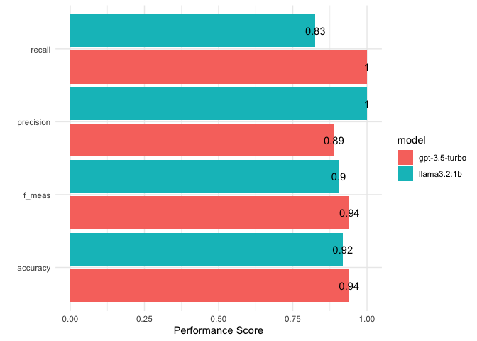

Zero-Shot Classification with LLMs
================
Philipp K. Masur
2023-11

- [Introduction](#introduction)
- [Preparation](#preparation)
  - [Getting data](#getting-data)
- [Text Classification With Ollama](#text-classification-with-ollama)
  - [What is Ollama?](#what-is-ollama)
  - [Installing Ollama and downloading a
    model](#installing-ollama-and-downloading-a-model)
  - [Simple Prompting](#simple-prompting)
  - [Simple Text Classification](#simple-text-classification)
  - [Zero-Shot Classification with
    Llama](#zero-shot-classification-with-llama)
  - [Validation](#validation)
- [Text Classification with GPT](#text-classification-with-gpt)
  - [Simple prompt](#simple-prompt)
  - [Zero-Shot Classification with
    GPT-3.5](#zero-shot-classification-with-gpt-35)
- [Validation](#validation-1)

# Introduction

In the last tutorial, we have worked with word-embeddings. Now, we are
going work through some zero-shot classification with Llama and GPT
(primarily the version 3.5 due to lower costs per token). Again, the
pipeline is as follows:


With GPT being a generative pre-trained transformer which was trained on
next-token prediction (llama as well), we in fact have to pay particular
attention to “prompt-engineering”. These models tend to require a bit
more “hand-holding” to produce the results we are looking for. We will
engage with prompt-engineering in various ways.

# Preparation

For this tutorial, we are again going to load the `tidyverse`,
`tidytext` (for some visualizations), and a new package called
`tidyllm`. This last package provides function for working with LLMs,
whether local (via ollama) or via API (e.g., GPT from OpenAI)

``` r
library(tidyverse)
library(tidytext)
library(tidyllm)
library(glue)
```

## Getting data

We are going to explore a data set that contains 1000 yelp reviews.

``` r
# Load data
d <- read_csv("yelp_reviews.csv") |> 
  mutate(category = ifelse(sentiment == 1, "positive", "negative"))
d |> 
  head()
```

| text                                                                                    | sentiment | category |
|:----------------------------------------------------------------------------------------|----------:|:---------|
| Wow… Loved this place.                                                                  |         1 | positive |
| Crust is not good.                                                                      |         0 | negative |
| Not tasty and the texture was just nasty.                                               |         0 | negative |
| Stopped by during the late May bank holiday off Rick Steve recommendation and loved it. |         1 | positive |
| The selection on the menu was great and so were the prices.                             |         1 | positive |
| Now I am getting angry and I want my damn pho.                                          |         0 | negative |

Let’s have a look at the differnet sentiments. 1 = Positive, 0 =
Negative

``` r
d |> 
  group_by(category) |> 
  tally()
```

| category |   n |
|:---------|----:|
| negative | 500 |
| positive | 500 |

# Text Classification With Ollama

## What is Ollama?

To work with LLMs locally on our own computers, we need to install
“Ollama”, which is a local AI model management software. Ollama grants
you full control to download, update, and delete models easily on your
system. This prioritize strict data security as we do not pass data to
companies like OpenAI. In addition to basic management, Ollama lets you
track and control different model versions. So we can switch between
different models.

## Installing Ollama and downloading a model

You can download ollama here: <https://ollama.com/>. Click on the
download button, choose the right operating system. Install the software
after it has downloaded. Once we have installed it, we have to download
a model. I have found it easiest to use the package `rollama` for this,
which has a simple function called `pull_model()`. With the argument
`model`, we can specify, which model we want to run. You can find a list
of available models here: <https://ollama.com/search>. That said, I
suggest to only download the `llama3.2:1b` model, which takes about 1GB
on your computer and should run with most hardware. If you have enough
space on your hardware and your computer has at least 12GB RAM (e.g., a
newer macbook pro with M-chip), you could also download a larger model,
e.g., `llama 3.2:3b` (~2GB) which should perform better. Only if you
have a really strong computer, I would suggest to download
`llama3.1:8b`, which already takes up 4.7GB on your harddrive.

If none of this works for you or you don’t want to download such a large
model, you can skip to the part where we use GPT-3.5-turbo instead.

``` r
library(rollama)
pull_model(model = "llama3.2:1b")
detach("package:rollama", unload = TRUE)
```

## Simple Prompting

Let’s start by understanding how we can communicate with an LLM on our
computer. Fur this, we use functions from the package `tidyllm`:

``` r
# Create LLM prompt
message <- llm_message("What is machine learning?")
message
```

    ## Message History:
    ## system: You are a helpful assistant
    ## --------------------------------------------------------------
    ## user: What is machine learning?
    ## --------------------------------------------------------------

``` r
# Pass the prompt to ollama
message |> 
  chat(ollama(.model = "llama3.2:1b"))
```

    ## Message History:
    ## system: You are a helpful assistant
    ## --------------------------------------------------------------
    ## user: What is machine learning?
    ## --------------------------------------------------------------
    ## assistant: Machine learning (ML) is a subset of artificial intelligence (AI) that involves training algorithms to learn from data, without being explicitly programmed. The goal of ML is to enable machines to make decisions or take actions based on the patterns and relationships they discover in data.
    ## 
    ## In traditional programming, algorithms are written with specific steps and outputs. In contrast, machine learning algorithms can learn from large datasets and improve their performance over time, without requiring human intervention. This enables ML models to:
    ## 
    ## 1. **Learn from data**: Machine learning algorithms can be trained on vast amounts of data, such as images, text, audio, or sensor readings.
    ## 2. **Make predictions**: Once trained, ML models can use the learned patterns to make predictions or decisions based on new, unseen data.
    ## 3. **Improve performance**: As more data is collected and added to the model, it becomes more accurate and efficient.
    ## 
    ## There are several key characteristics of machine learning:
    ## 
    ## * **Data-driven**: Machine learning relies on data to learn and improve.
    ## * **Algorithmic**: ML algorithms are designed to perform specific tasks, such as classification or regression.
    ## * **Training**: ML models are trained on data using algorithms like gradient descent or random forests.
    ## * **Inference**: Once trained, ML models can make predictions or decisions based on new data.
    ## 
    ## Machine learning has numerous applications across industries, including:
    ## 
    ## 1. **Computer vision**: Image recognition, object detection, and facial recognition.
    ## 2. **Natural language processing (NLP)**: Sentiment analysis, language translation, and text summarization.
    ## 3. **Speech recognition**: Voice assistants and speech-to-text systems.
    ## 4. **Predictive maintenance**: Predicting equipment failures and scheduling maintenance.
    ## 5. **Recommendation systems**: Personalized product or service recommendations.
    ## 
    ## Some popular machine learning algorithms include:
    ## 
    ## 1. **Supervised learning**: Learning from labeled data to make predictions (e.g., linear regression).
    ## 2. **Unsupervised learning**: Discovering patterns in unlabeled data (e.g., clustering, dimensionality reduction).
    ## 3. **Reinforcement learning**: Training agents to make decisions based on rewards or penalties.
    ## 
    ## Overall, machine learning is a powerful tool for automating tasks and making predictions or decisions, while also enabling machines to learn from data and improve over time.
    ## --------------------------------------------------------------

As you can see, we provide the prompt as argument in the function
`llm_message()`. Then, we pass this to `chat()`, which requires the type
of model we are using (e.g., ollama, openai, etc.) and what exact model
we want to use.

## Simple Text Classification

Now, let’s try to classify one single movie based on its description to
check whether our local model works. For such tasks, it makes sense to
create the prompt a bit more systematically. We first provcide the exact
tasks (“What is the sentiment in this yelp review”). Then we provide a
placeholder for this (“{description}”), then we add a clear cut
instruction on what to produce (this will still sometimes not work), and
then, we provide the codebook. We “glue” this together with the actual
text that we want to classify. Here, we just take the first of our yelp
reviews.

Then, we pass this again to `llm_message` and then to `chat()`.
Depending on your computer’s hardware, this will take a bit. Note that
we set the temperature, which controls the randomness or creativity of
the model’s output by influencing the probability distribution over
possible next tokens, to 0 to make it somewhat deterministic.

``` r
single_classification <- glue("What is the sentiment in this yelp review: {description}
                              
                              Pick one of the following numerical codes from this list. 
                              Respond only with the code!
                              
                              1 = Positive
                              0 = Negative",
                              description = d$text[1])

# Check prompt
single_classification
```

    ## What is the sentiment in this yelp review: Wow... Loved this place.
    ## 
    ## Pick one of the following numerical codes from this list. 
    ## Respond only with the code!
    ## 
    ## 1 = Positive
    ## 0 = Negative

``` r
# Run the prompt with llama3.2:1b -> Smallest llama model
single_classification |> 
  llm_message() |> 
  chat(ollama(.model = "llama3.2:1b",  # Chosen model
              .temperature = 0))       # Temperature to 0 to replicate results
```

    ## Message History:
    ## system: You are a helpful assistant
    ## --------------------------------------------------------------
    ## user: What is the sentiment in this yelp review: Wow... Loved this place.
    ## 
    ## Pick one of the following numerical codes from this list. 
    ## Respond only with the code!
    ## 
    ## 1 = Positive
    ## 0 = Negative
    ## --------------------------------------------------------------
    ## assistant: 1
    ## --------------------------------------------------------------

## Zero-Shot Classification with Llama

Now, we can update this code to work across the entire data set. To not
overload our computer, we only use the first 50 reviews.

``` r
codebook <- glue("What is the sentiment in this yelp review: {description}
                              
                 Pick one of the following numerical codes from this list. 
                 Respond only with the code!
                 
                 1 = Positive
                 0 = Negative",
                 description = d$text[1:50])

# Create a list of llm-message prompts
classification_task <- map(codebook, llm_message)

# Function to classify all 50 texts
classify_sequential_llama <- function(texts, message){
    raw_code <- message |>
        chat(ollama(.model = "llama3.2:1b",   # Set model
                    .temperature = .0)) |>
        get_reply() |> 
        parse_number()
    tibble(text = texts, label = raw_code) 
}

# Run the classification by sequentially prompting LLama3
results_llama <- tibble(texts = d[1:50,]$text, 
                        message = classification_task) |> 
  pmap_dfr(classify_sequential_llama, .progress = T) 

# Check results
results_llama |> 
  head()
```

| text                                                                                    | label |
|:----------------------------------------------------------------------------------------|------:|
| Wow… Loved this place.                                                                  |     1 |
| Crust is not good.                                                                      |     0 |
| Not tasty and the texture was just nasty.                                               |     0 |
| Stopped by during the late May bank holiday off Rick Steve recommendation and loved it. |     1 |
| The selection on the menu was great and so were the prices.                             |     1 |
| Now I am getting angry and I want my damn pho.                                          |     1 |

## Validation

Now, we can simply bind this to the original sentiment and check the
performance. Therefore, we simply use the same `tidymodels` function
that we had before.

``` r
predict_llama <- results_llama |> 
  select(label) |> 
  mutate(label = ifelse(label < 0, 0, label)) |>   # One was labelled as -1, which should not be in the
  bind_cols(d[1:50,]) |> 
  mutate(label = factor(label),
         sentiment = factor(sentiment))

library(tidymodels)
class_metrics <- metric_set(accuracy, precision, recall, f_meas)

predict_llama |> 
  class_metrics(truth = sentiment, estimate = label)
```

| .metric   | .estimator | .estimate |
|:----------|:-----------|----------:|
| accuracy  | binary     | 0.9183673 |
| precision | binary     | 1.0000000 |
| recall    | binary     | 0.8260870 |
| f_meas    | binary     | 0.9047619 |

# Text Classification with GPT

There are generally two ways in which we can use a GPT model for text
classification. The easiest is perhaps to simply copy paste a text into
chatGPT (<https://chat.openai.com/>) and explain the task it should
perform.

Thankfully, we can also work with the exact same `tidyllm` framework and
only have to switch the interior of the `chat()` function.

But before this works, we need to set an API token, which provides the
access to the paid GPT API:

``` r
Sys.setenv(OPENAI_API_KEY = "YOUR-KEY-GOES-HERE") # Your teacher will provide you with a the token!
```

## Simple prompt

Let’s again check whether this works with the message we defined
earlier.

``` r
message |> 
  chat(openai(.model = "gpt-3.5-turbo"))
```

    ## Message History:
    ## system: You are a helpful assistant
    ## --------------------------------------------------------------
    ## user: What is machine learning?
    ## --------------------------------------------------------------
    ## assistant: Machine learning is a subset of artificial intelligence that involves the development of algorithms which enable machines to learn and make predictions or decisions based on patterns or data without being explicitly programmed. It relies on the idea that machines can learn from data, identify patterns, and make decisions or predictions with minimal human intervention. Machine learning algorithms can be trained on large datasets to recognize patterns and insights, which can then be used to make predictions or automate complex tasks.
    ## --------------------------------------------------------------

## Zero-Shot Classification with GPT-3.5

Now, the actual classification looks almost identical to what we have
done with `llama` before, expcept that we change the interior of the
`chat()` function.

``` r
codebook <- glue("What is the sentiment in this yelp review: {description}
                              
                 Pick one of the following numerical codes from this list. 
                 Respond only with the code!
                 
                 1 = Positive
                 0 = Negative",
                 description = d$text[1:50])

# Create a list of llm-message prompts
classification_task <- map(codebook, llm_message)

# Function to classify all 50 texts
classify_sequential_gpt <- function(texts, message){
    raw_code <- message |>
        chat(openai(.model = "gpt-3.5-turbo",   # Set model
                    .temperature = .0)) |>
        get_reply() |> 
        parse_number()
    tibble(text = texts, label = raw_code) 
}

# Run the classification by sequentially prompting LLama3
results_gpt <- tibble(texts = d[1:50,]$text, 
                      message = classification_task) |>   # We can use the same classification task as before!
  pmap_dfr(classify_sequential_gpt, .progress = T) 

results_gpt |> 
  head()
```

| text                                                                                    | label |
|:----------------------------------------------------------------------------------------|------:|
| Wow… Loved this place.                                                                  |     1 |
| Crust is not good.                                                                      |     0 |
| Not tasty and the texture was just nasty.                                               |     0 |
| Stopped by during the late May bank holiday off Rick Steve recommendation and loved it. |     1 |
| The selection on the menu was great and so were the prices.                             |     1 |
| Now I am getting angry and I want my damn pho.                                          |     0 |

# Validation

\*\* Exercise:\*\* Can you adapt the code above so that we can check how
GPT-3.5 did on this tasks? Can you also plot a comparison between llama
and gpt?

``` r
predict_gpt <- results_gpt |> 
  select(label) |> 
  bind_cols(d[1:50,]) |> 
  mutate(label = factor(label),
         sentiment = factor(sentiment))

predict_gpt |> 
  class_metrics(truth = sentiment, estimate = label)
```

| .metric   | .estimator | .estimate |
|:----------|:-----------|----------:|
| accuracy  | binary     | 0.9400000 |
| precision | binary     | 0.8888889 |
| recall    | binary     | 1.0000000 |
| f_meas    | binary     | 0.9411765 |

``` r
bind_rows(
  predict_llama |> 
  class_metrics(truth = sentiment, estimate = label) |> 
    mutate(model = "llama3.2:1b"),
  predict_gpt |> 
  class_metrics(truth = sentiment, estimate = label) |> 
    mutate(model = "gpt-3.5-turbo")
) |> 
  ggplot(aes(x = .metric, y = .estimate, fill = model)) +
  geom_col(position = position_dodge(width = 1)) +
  geom_text(aes(label = round(.estimate, 2)), position = position_dodge(width = 1)) +
  coord_flip() +
  ylim(0, 1) +
  theme_minimal() +
  labs(x = "", y = "Performance Score")
```

<!-- -->

What do we see? Which model performs better?

**Exercise:** Familiarize yourself a bit more with the framework of the
`tidyllm` package. Can you classify the next batch of 50 reviews using
the llama or gpt model? Can you then combine the results with your
previous batch and test the perforamnce across both (i.e., the first 100
reviews?)

``` r
codebook2 <- glue("What is the sentiment in this yelp review: {description}
                              
                 Pick one of the following numerical codes from this list. 
                 Respond only with the code!
                 
                 1 = Positive
                 0 = Negative",
                 description = d$text[51:100])

# Update task
classification_task2<- map(codebook2, llm_message)

# Run the classification by sequentially prompting LLama3
results_llama2 <- tibble(texts = d[51:100,]$text, 
                         message = classification_task2) |> 
  pmap_dfr(classify_sequential_llama, .progress = T) 


# Bind batches
result_llama_all <- 
  bind_rows(
    results_llama,
    results_llama2
  )

# Predict first 100
predict_llama_all <- result_llama_all |> 
  select(label) |> 
  mutate(label = ifelse(label < 0, 0, label)) |>
  bind_cols(d[1:100,]) |> 
  mutate(label = factor(label),
         sentiment = factor(sentiment))

# Check performance
predict_llama_all |> 
  class_metrics(truth = sentiment, estimate = label)
```

| .metric   | .estimator | .estimate |
|:----------|:-----------|----------:|
| accuracy  | binary     | 0.9090909 |
| precision | binary     | 1.0000000 |
| recall    | binary     | 0.8000000 |
| f_meas    | binary     | 0.8888889 |
