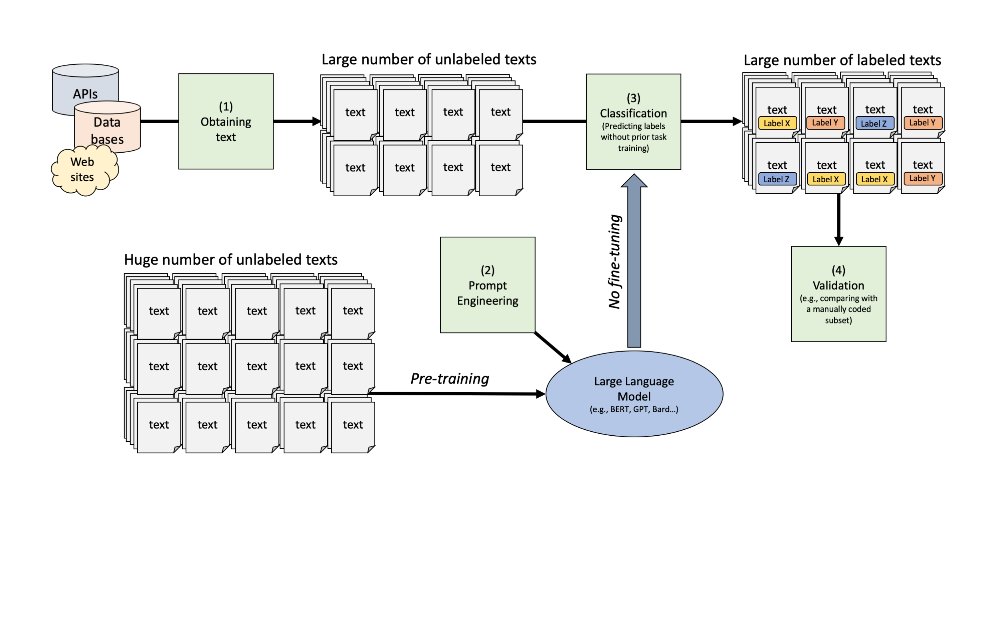

Zero-Shot Classification with GPT
================
Philipp K. Masur
2023-11

- [Introduction](#introduction)
- [Preparation](#preparation)
  - [Getting data](#getting-data)
- [Text Classification with GPT](#text-classification-with-gpt)
  - [Using “chatGPT” for text
    classification](#using-chatgpt-for-text-classification)
  - [Using the Open AI API to automate text
    classification](#using-the-open-ai-api-to-automate-text-classification)
  - [A Small Example](#a-small-example)
  - [Classifying more than a couple of
    texts](#classifying-more-than-a-couple-of-texts)
- [Some bonus stuff!](#some-bonus-stuff)

# Introduction

In the last tutorial, we have worked with word-embeddings and got a
first glimpse into using the hugging face API for text classification
with a large language model such as BERT. Now, we are going work through
some zero-shot classification with GPT (primarily the version 3.5 due to
lower costs per token). Again, the pipeline is as follows:



With GPT being a generative pre-trained transformer which was trained on
next-token prediction, we in fact have to pay particular attention to
“prompt-engineering”. Whereas the BERT model that we used in the last
tutorial always produces the right outcome (e.g., probability scores for
each provided label for ALL input texts), GPT tends to require a bit
more “hand-holding” to produce the results we are looking for. We will
engage with prompt-engineering in various ways.

# Preparation

For this tutorial, we are again going to load the `tidyverse`,
`tidytext` (for some visualizations), `ccsamsterdamR` (the specific
package for this course) and a new package called `openai`.

``` r
library(tidyverse)
library(tidytext)
library(ccsamsterdamR)
library(openai)
```

## Getting data

We are going to explore a data set that contains information about 34886
movies from 1901 until today. It contains information about the release
year, the title, the cast, genre, and a summary of the plot.

``` r
# Load data
movies <- read_csv("data/wiki_movie_plots_deduped.csv")
movies |> 
  head()
```

|                                                                                          Release Year | Title                            | Origin/Ethnicity | Director                           | Cast      | Genre   | Wiki Page                                                          | Plot                                                                                                                                                                                                                                                                                                                                                                                                                                                                                                                                                                                                                                                                                                                                                                                                                                                                                                                       |
|------------------------------------------------------------------------------------------------------:|:---------------------------------|:-----------------|:-----------------------------------|:----------|:--------|:-------------------------------------------------------------------|:---------------------------------------------------------------------------------------------------------------------------------------------------------------------------------------------------------------------------------------------------------------------------------------------------------------------------------------------------------------------------------------------------------------------------------------------------------------------------------------------------------------------------------------------------------------------------------------------------------------------------------------------------------------------------------------------------------------------------------------------------------------------------------------------------------------------------------------------------------------------------------------------------------------------------|
|                                                                                                  1901 | Kansas Saloon Smashers           | American         | Unknown                            | NA        | unknown | <https://en.wikipedia.org/wiki/Kansas_Saloon_Smashers>             | A bartender is working at a saloon, serving drinks to customers. After he fills a stereotypically Irish man’s bucket with beer, Carrie Nation and her followers burst inside. They assault the Irish man, pulling his hat over his eyes and then dumping the beer over his head. The group then begin wrecking the bar, smashing the fixtures, mirrors, and breaking the cash register. The bartender then sprays seltzer water in Nation’s face before a group of policemen appear and order everybody to leave.\[1\]                                                                                                                                                                                                                                                                                                                                                                                                     |
|                                                                                                  1901 | Love by the Light of the Moon    | American         | Unknown                            | NA        | unknown | <https://en.wikipedia.org/wiki/Love_by_the_Light_of_the_Moon>      | The moon, painted with a smiling face hangs over a park at night. A young couple walking past a fence learn on a railing and look up. The moon smiles. They embrace, and the moon’s smile gets bigger. They then sit down on a bench by a tree. The moon’s view is blocked, causing him to frown. In the last scene, the man fans the woman with his hat because the moon has left the sky and is perched over her shoulder to see everything better.                                                                                                                                                                                                                                                                                                                                                                                                                                                                      |
|                                                                                                  1901 | The Martyred Presidents          | American         | Unknown                            | NA        | unknown | <https://en.wikipedia.org/wiki/The_Martyred_Presidents>            | The film, just over a minute long, is composed of two shots. In the first, a girl sits at the base of an altar or tomb, her face hidden from the camera. At the center of the altar, a viewing portal displays the portraits of three U.S. Presidents—Abraham Lincoln, James A. Garfield, and William McKinley—each victims of assassination.                                                                                                                                                                                                                                                                                                                                                                                                                                                                                                                                                                              |
| In the second shot, which runs just over eight seconds long, an assassin kneels feet of Lady Justice. |                                  |                  |                                    |           |         |                                                                    |                                                                                                                                                                                                                                                                                                                                                                                                                                                                                                                                                                                                                                                                                                                                                                                                                                                                                                                            |
|                                                                                                  1901 | Terrible Teddy, the Grizzly King | American         | Unknown                            | NA        | unknown | <https://en.wikipedia.org/wiki/Terrible_Teddy,_the_Grizzly_King>   | Lasting just 61 seconds and consisting of two shots, the first shot is set in a wood during winter. The actor representing then vice-president Theodore Roosevelt enthusiastically hurries down a hillside towards a tree in the foreground. He falls once, but rights himself and cocks his rifle. Two other men, bearing signs reading “His Photographer” and “His Press Agent” respectively, follow him into the shot; the photographer sets up his camera. “Teddy” aims his rifle upward at the tree and fells what appears to be a common house cat, which he then proceeds to stab. “Teddy” holds his prize aloft, and the press agent takes notes. The second shot is taken in a slightly different part of the wood, on a path. “Teddy” rides the path on his horse towards the camera and out to the left of the shot, followed closely by the press agent and photographer, still dutifully holding their signs. |
|                                                                                                  1902 | Jack and the Beanstalk           | American         | George S. Fleming, Edwin S. Porter | NA        | unknown | <https://en.wikipedia.org/wiki/Jack_and_the_Beanstalk_(1902_film)> | The earliest known adaptation of the classic fairytale, this films shows Jack trading his cow for the beans, his mother forcing him to drop them in the front yard, and beig forced upstairs. As he sleeps, Jack is visited by a fairy who shows him glimpses of what will await him when he ascends the bean stalk. In this version, Jack is the son of a deposed king. When Jack wakes up, he finds the beanstalk has grown and he climbs to the top where he enters the giant’s home. The giant finds Jack, who narrowly escapes. The giant chases Jack down the bean stalk, but Jack is able to cut it down before the giant can get to safety. He falls and is killed as Jack celebrates. The fairy then reveals that Jack may return home as a prince.                                                                                                                                                               |
|                                                                                                  1903 | Alice in Wonderland              | American         | Cecil Hepworth                     | May Clark | unknown | <https://en.wikipedia.org/wiki/Alice_in_Wonderland_(1903_film)>    | Alice follows a large white rabbit down a “Rabbit-hole”. She finds a tiny door. When she finds a bottle labeled “Drink me”, she does, and shrinks, but not enough to pass through the door. She then eats something labeled “Eat me” and grows larger. She finds a fan when enables her to shrink enough to get into the “Garden” and try to get a “Dog” to play with her. She enters the “White Rabbit’s tiny House,” but suddenly resumes her normal size. In order to get out, she has to use the “magic fan.”                                                                                                                                                                                                                                                                                                                                                                                                          |

She enters a kitchen, in which there is a cook and a woman holding a
baby. She persuades the woman to give her the child and takes the infant
outside after the cook starts throwing things around. The baby then
turns into a pig and squirms out of her grip. “The Duchess’s Cheshire
Cat” appears and disappears a couple of times to Alice and directs her
to the Mad Hatter’s “Mad Tea-Party.” After a while, she leaves. The
Queen invites Alice to join the “ROYAL PROCESSION”: a parade of marching
playing cards and others headed by the White Rabbit. When Alice
“unintentionally offends the Queen”, the latter summons the
“Executioner”. Alice “boxes the ears”, then flees when all the playing
cards come for her. Then she wakes up and realizes it was all a dream.
\|

Let’s explore the film genres in this data set:

``` r
movies |> 
  group_by(Genre) |> 
  tally() |> 
  filter(Genre != "unknown") |> 
  slice_max(n, n = 25) |> 
  ggplot(aes(x = fct_reorder(Genre, n), y = n, fill = Genre)) +
  geom_col() +
  geom_label(aes(label = n), fill = "white", size = 2.5) +
  coord_flip() +
  labs(x = "", y = "Number of movies in data set") +
  theme_minimal() +
  theme(legend.position = "none")
```

<!-- -->

As we can see, most movies are classified as “drama”, but we also have a
lot of comedies. For the purpose of this tutorial, let’s break this down
a bit more. Having any language model trying to predict this many
different genres will probably not result in great performance.

So for the purpose of this tutorial, we are going to sample 100 movies
that were release after 2010 (so that we hopefully all now them!). We
filter so that we have only action, comedy, and horror movies in the
data set.

``` r
set.seed(123)
movies_small <- movies |> 
  mutate(id = 1:n()) |> 
  rename(genre = Genre) |> 
  filter(genre %in% c("action", "comedy", "horror")) |> 
  filter(`Origin/Ethnicity` == "American") |> 
  select(id, year = `Release Year`, title = Title, director = Director, genre, text = Plot) |> 
  filter(year > 2010) |> 
  sample_n(size = 200)

# Number of movies in subset
movies_small |> 
  group_by(genre) |> 
  tally() 
```

| genre  |   n |
|:-------|----:|
| action |  37 |
| comedy | 108 |
| horror |  55 |

# Text Classification with GPT

There are generally two ways in which we can use a GPT model for text
classification. The easiest is perhaps to simply copy paste a text into
chatGPT (<https://chat.openai.com/>) and explain the task it should
perform. This explanation is basically what “prompt-engineering” is
about. Results can differ substantially depending on how we formulate
the task.

A second alternative is to use the API (application programming
interface), which allows to directly assess GPT from e.g., RStudio. This
latter approach allows use to streamline the task and also build a
pipeline that allows for automatic prompting across larger corpus.

But let’s start easy…

## Using “chatGPT” for text classification

Let’s explore how “chatGPT” deals with text classification. For this
purpose, we need an easy way to assess our movie plots so that we can
paste them into chatGPT. We thus write a new data set, which contains
only the first 10 movies.

``` r
movies_small |> 
  slice(1:10) |> 
  write_csv(file = "test_movies.csv")
```

Now, do the following:

1.  The data set was saved into your working directory. Locate it and
    open the data set with excel (or numbers).

2.  Copy the first movie plot and paste it into chatGPT
    (<https://chat.openai.com/>; assuming you have an account, if not,
    make one!)

3.  Add a line that explain what chatGPT should do with the text, e.g.,
    something like this (you can copy this one for a start):

``` r
The above text is a movie plot. You are an expert on identifying the movie genre based on plots. Classify the movie plot above as either "action", "comedy" or "horror". Provide a justification for your choice.
```

4.  What is the outcome? Does it match the actual genre label in the
    data set?

5.  Copy paste several movies at once, does chatGPT still perform well?
    Can you improve the performance by changing the task description?
    Play around with this to get a feel for how GPT reacts to different
    prompts and plots.

6.  If you have found a good task description, classify all 10 movies.
    Write the output label into a new column called `gpt_label` in your
    data set. Save the data set under the same name in the same folder,
    i.e. replace the original one (important: as .csv file, not as
    excel-sheet!)

Now, we can load this data again into R. Make sure you use the right
`read_csv` function. In case of my Macbook Pro, numbers saved the data
set with european encoding (; as delimiter). In this case, I needed to
use `read_csv2` to parse the csv file correctly into a tibble.

``` r
movies_labeled <- read_csv2("test_movies.csv")
```

A small issue is that numbers also uppercased the labels. We can quickly
change this with the function `tolower` and then compute a simple
confustion matrix.

``` r
movies_labeled <- movies_labeled |> 
  mutate(gpt_label = tolower(gpt_label))


table(movies_labeled$genre, movies_labeled$gpt_label)
```

| /      | action | comedy | horror |
|:-------|-------:|-------:|-------:|
| action |      3 |      0 |      0 |
| comedy |      0 |      4 |      0 |
| horror |      0 |      0 |      3 |

**Exercise:** How good did chatGPT do?

In my case, GPT-3.5 (which I chose in my chatGPT interface) did
perfectly. It labeled all 10 movies correctly.

## Using the Open AI API to automate text classification

Copy pasting all movies into chatGPT is not really efficient. Hence,
let’s use the API. To use the API, one has to create a GPT account and
buy some credits. You pay per token prompted and received in this
subscription model. For an cost overview, see:
<https://openai.com/pricing>.

For the purpose of this tutorial, we are going to use
gpt-3.5-turbo-1106, which costs 0.001 Dollars per 1K input tokens and
0.002 Dollars per 1K output tokens. We’ve create some accounts to be
used for this course (you can create your own account here:
<https://openai.com/>. To connect RStudio with these accounts, you have
to enter an access tokens (similar to how we created the connection to
the hugging face API). Your teachers will provide the access tokens
during the practical session.

``` r
# Provide access to OPEN AI account
Sys.setenv(
  OPENAI_API_KEY = 'XXXX' # <- enter token here
)
```

## A Small Example

Now that the access token is set, we can again use the package
`cssamsterdamR` and a specific function called `gpt_zeroshot` to conduct
text classification. In contrast to the function `hf_zeroshot`, this
function does not need a simple vector with all the texts, but instead
requires a data frame (e.g., a tibble) that contains a column that
represents an id-variable and a second column that contains the texts.
Next, we provide the labels with which the movie plots should be
annotated. We can further add “role description” that reflects the
expertise with which GPT should do the tasks (again a form of prompt
engineering, yet I am doubting the actual influence on the results).
Finally, we chose the model.

We can further say `certainty = T` and `justification = T`. This means
that in the output, GPT will not only provide the label, but also a
certainty score and a short justification. How long one prompt takes
depends on how many people are using the GPT API at a given time. So if
you have to wait, please be patient.

``` r
library(ccsamsterdamR)

# Create the test data set
test <- movies_small |> 
  slice(1:2) |> 
  select(id, text)

# Setting up the zero-shot classification with GPT 3.5-turbo
test_results <- gpt_zeroshot(txt = test,
                             labels = c("action", "comedy", "horror"),
                             expertise = "You are an expert film critic and an absolute nerd for movies. 
                                          You can easily identify the genre from simply reading the plot.
                                          In the following, I provide several texts that represent plots of movies.",
                             model = "gpt-3.5-turbo-1106",
                             certainty = T,
                             justification = T)

# Check resulting output
test_results |> 
  head()
```

|    id | labels | certainty | justification                                                                         |
|------:|:-------|----------:|:--------------------------------------------------------------------------------------|
| 16755 | action |      0.90 | Professional killer, gangsters, and FBI involvement imply an action-packed plot.      |
| 16036 | comedy |      0.95 | Humorous mishaps and misunderstandings during a week off from marriage scream comedy. |

``` r
# Bind to original data set
movies_small |> slice(1:2) |> 
  left_join(test_results) |> 
  select(year, title, director, genre, labels, certainty, justification)
```

| year | title       | director          | genre  | labels | certainty | justification                                                                         |
|-----:|:------------|:------------------|:-------|:-------|----------:|:--------------------------------------------------------------------------------------|
| 2014 | The Bag Man | David Grovic      | action | action |      0.90 | Professional killer, gangsters, and FBI involvement imply an action-packed plot.      |
| 2011 | Hall Pass   | Farrelly Brothers | comedy | comedy |      0.95 | Humorous mishaps and misunderstandings during a week off from marriage scream comedy. |

We can see that it perfectly classified the first two movies as “action”
and “comedy”.

## Classifying more than a couple of texts

Classifying many text via the Open AI API requires a bit of thought:

In the current subscription, we can do 90,000 tokens per minute and
3,500 requests per day. At the same time, each model has a “context
window”, i.e. the amount of input you can provide as tokens. If we use
`gpt-3.5-turbo-1106`, we have a window of 16,385 tokens. Max output
tokens is at the same time about 4,000 tokens.

This of course heavily restricts our use and makes the procedure of
classifying many texts much longer. BUt we can use a similar strategy
that we already implemented with the hugging face API. First, we have a
look at how many tokens movie plots usually have. We can count the
number of words and multiply by 1.6, which results roughly in the token
type that GPT uses (it breaks text down into something smaller than
words).

``` r
library(tidytext)
movies_small |> 
  unnest_tokens(word, text) |> 
  group_by(title) |> 
  summarize(n = n()) |> 
  arrange(-n) |> 
  mutate(gpt_tokens = n*1.6) |> 
  head()
```

| title                                                                                             |    n | gpt_tokens |
|:--------------------------------------------------------------------------------------------------|-----:|-----------:|
| Movie 43                                                                                          | 2445 |     3912.0 |
| Characterz                                                                                        | 1735 |     2776.0 |
| Haunting in Connecticut 2: Ghosts of Georgia, TheThe Haunting in Connecticut 2: Ghosts of Georgia | 1671 |     2673.6 |
| The Three Stooges                                                                                 | 1623 |     2596.8 |
| Friend Request                                                                                    | 1376 |     2201.6 |
| Black Rock                                                                                        | 1232 |     1971.2 |

As you can see, we have movie plots that contain about 4,000 tokens but
after the ten longest ones, most of them have less that 2,000. We
nonetheless truncate the movie plots to only 500 characters which covers
roughly the first 3-5 sentences, assuming that this will be enough for
GPT to figure out the genre. This way, we save tokens without
(hopefully) sacrificing performance. We then use `gpt_split_data` to
again separate our data into small chunks of 4 movies. Then, we again
create a loop with the function `map()`, which iteratively sends the
prompt to the API and extracts the results. We can should add a small
delay between prompts to make sure that we do not send to many prompts
per minute (this of course makes the process longer). Let’s start with 3
subsets of 4 movies each for now and then see whether we can increase
the number of splits that should be coded. Bear in mind, all of you are
using the same API TOKEN, so we need to be careful not to overuse it,
otherwise it won’t work for anyone and we have to wait for minute.

``` r
# Truncate plot
movies_small2 <- movies_small |> 
  mutate(text = stringr::str_trunc(text, 500)) 

# Split into sets of 4 movies
splits <- movies_small2 |> 
  select(id, text) |> 
  gpt_split_data(n_per_group = 4)


# Map across first three chunks
map_results <- map_df(splits[1:3], function(x) {
  output <- gpt_zeroshot(
    txt = x,
    labels = c("action", "comedy", "horror"),
    model = "gpt-3.5-turbo-1106")
  Sys.sleep(10)
  output
})
map_results |> 
  head()
```

|    id | labels |
|------:|:-------|
| 16755 | action |
| 16036 | comedy |
| 16794 | comedy |
| 16534 | action |
| 17288 | horror |
| 16938 | action |

As we can see, we received labels for all three chunks together with the
movie id. Which allow us, in a next step, to join it with out original
data set. Then, we can - as always - produce performance scores.

``` r
movies_results <- movies_small |> 
  slice(1:12) |>  # number of movies
  left_join(map_results) |> 
  mutate(genre = factor(genre, levels = c("action", "comedy", "horror")),
         labels = factor(labels, levels = c("action", "comedy", "horror")))


library(tidymodels)
class_metrics <- metric_set(accuracy, precision, recall, f_meas)

movies_results |> 
  conf_mat(truth = genre, estimate = labels)
```

    ##           Truth
    ## Prediction action comedy horror
    ##     action      3      1      1
    ##     comedy      0      5      0
    ##     horror      0      0      2

``` r
movies_results |> 
  class_metrics(truth = genre, estimate = labels)
```

| .metric   | .estimator | .estimate |
|:----------|:-----------|----------:|
| accuracy  | multiclass | 0.8333333 |
| precision | macro      | 0.8666667 |
| recall    | macro      | 0.8333333 |
| f_meas    | macro      | 0.8196970 |

Despite only using the first 500 words per movie, it seems that GPT 3.5
does quite well in classifying the movie genre.

**Exercise:** If the API allows, try to up the number of splits that
should be coded and reassess the performance.

``` r
map_results2 <- map_df(splits[4:10], function(x) {
  output <- gpt_zeroshot(
    txt = x,
    labels = c("action", "comedy", "horror"),
    model = "gpt-3.5-turbo-1106")
  Sys.sleep(10)
  output
})
map_results2 |> 
  head()
```

|    id | labels |
|------:|:-------|
| 16803 | comedy |
| 17269 | comedy |
| 16593 | comedy |
| 16151 | horror |
| 15997 | comedy |
| 17238 | comedy |

``` r
movies_results <- movies_small |> 
  slice(1:40) |>  # number of movies
  left_join(map_results |> bind_rows(map_results2)) |> 
  mutate(genre = factor(genre, levels = c("action", "comedy", "horror")),
         labels = factor(labels, levels = c("action", "comedy", "horror")))


library(tidymodels)
class_metrics <- metric_set(accuracy, precision, recall, f_meas)

movies_results |> 
  conf_mat(truth = genre, estimate = labels)
```

    ##           Truth
    ## Prediction action comedy horror
    ##     action      6      2      1
    ##     comedy      0     21      0
    ##     horror      1      0      9

``` r
movies_results |> 
  class_metrics(truth = genre, estimate = labels)
```

| .metric   | .estimator | .estimate |
|:----------|:-----------|----------:|
| accuracy  | multiclass | 0.9000000 |
| precision | macro      | 0.8555556 |
| recall    | macro      | 0.8900621 |
| f_meas    | macro      | 0.8681818 |

# Some bonus stuff!

Do you still have your hugging face token? Then, enter it below. We can
explore some other models for other types of classifications…

``` r
# Provide access to hugging face account
Sys.setenv(
  HF_API_TOKEN = "XXXX" # <-- enter your hugging face token here
)
```

Our course package also includes a function called
`hf_image_classification`. You can provide an image to this function and
the results will again be labels that (to a certain degree) describe the
image. Under the hood, this function sends an API request and uses this
model: <https://huggingface.co/google/vit-base-patch16-224>, which is a
Vision Transformer (ViT) model pre-trained on 14 million images, labeled
with 21,843 classes. It was developed by google and gives you a first
idea how the principles and contexts learned in this course can be
extended beyond just text.

Simply choose a photo or image of your choice (at best in a JPG format)
and put it into your working directory. Then simply change the name in
the code below to the name of your photo and run the code. Did the
algorithm describe the image correctly?


``` r
hf_image_classification("img/travel_photo.jpg")
```

|     score | label                                                                      |
|----------:|:---------------------------------------------------------------------------|
| 0.1519481 | trailer truck, tractor trailer, trucking rig, rig, articulated lorry, semi |
| 0.1049326 | alp                                                                        |
| 0.0558866 | valley, vale                                                               |
| 0.0434316 | recreational vehicle, RV, R.V.                                             |
| 0.0418237 | car mirror                                                                 |

As we can see, some of these labels are not too bad (e.g., alp, valley).
Others are less spot on, but we can still see the connection to the
image (e.g., road -\> trailer truck…).
