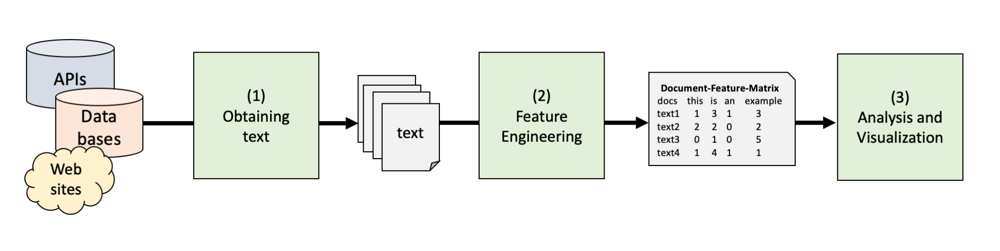

```{r setup, include=FALSE}
knitr::opts_chunk$set(echo = TRUE, results = FALSE, message = FALSE, warning = FALSE, fig.keep='none')
library(printr)
```

# Introduction

In this tutorial, you will learn about the basics of text analysis using the R package `tidytext`. 
We will take you through three steps that are common to almost any basic text analysis
regardless of the exact package: 



In this tutorial, we are not yet thinking about how to label previously unlabeled texts. 
Instead, we are concerned with transforming text into analyzable data and exploring
ways to descriptivle analyze word frequencies and visualize them in different ways.


## A Tidy Text Format

`Tidytext` is a package for working with textual data.
It's core data format is a regular data frame (tibble) where each row is a word.
This allows you to perform most text-related operations, such as stopword removal,
text cleaning, or corpus analysis using regular `tidyverse` data transformation operations.
This means that you already know the basics of how to handle text data based on the last
two tutorials!

For example, given a list of words you could `anti_join` with a stopword list,
then `group_by` word and `filter` out rare words, and finally
`summarize` word frequencies and use `ggplot` to create a word cloud. 
All functions mentioned in this paragraph are regular tidyverse functions,
so the good news is: if you are already familiar with the tidyverse, 
you are 99% of the way to being able to use tidytext.

## Motivating Example

To make things a bit easier, we are going to look at the exact same data set that
we already learned about in the lecture: The State of the Union (SOTU) Speeches Corpus, which
contains all SOTU speeches until 2012. 

As a motivation example that shows how you can use existing tidyverse functions for text analysis,
the code below imports the data set and shows a word cloud of Obama's speeches. Simple run the code and see what happens:

```{r}
# Load packages
library(tidytext)
library(tidyverse)
library(ggwordcloud)
library(stopwords)
library(sotu)

# Load data from package
sotu <- add_column(sotu_meta, text=sotu_text) |> 
  as_tibble() |>
  rename(doc_id=X)

# Select Obama speech and create tidy word frequencies
obama_n <- sotu |>
  filter(president == "Barack Obama") |> 
  unnest_tokens(word, text) |>
  group_by(word) |> 
  summarize(n = n()) 

# Perform some feature engineering such as stop word removal
obama_n_cleaned = obama_n |>
  filter(n >= 10, 
         !word %in% stopwords(), 
         str_length(word) >= 2) |>
  arrange(-n) |>
  slice_head(n=200) 

# Plot a simple wordcloud
ggplot(obama_n_cleaned) + 
  geom_text_wordcloud(aes(label=word, size=n, color=n), rm_outside = T) +
  scale_size_area(max_size = 8) +
  theme_void()
```

The parts of this code will be explained in the sections below, 
but we would encourage you to view the results of each step and see if you understand what's going on!

# Importing text into R

With obtaining or importing text we mean retrieving text from some external storage and reading it into R 
as a character (text) vector, usually as a character column in a data frame also containing metadata 
(date, source, etc).

How to do this of course depends on where your texts are stored, so we will consider two common use cases:
CSV files and text (or word, pdf) files. 
For scraping texts directly from web pages, check out [our scraping tutorial](https://github.com/ccs-amsterdam/r-course-material/blob/master/tutorials/rvest.md)

## CSV files

For reading CSV files, no special functions are needed: 
`read_csv` automatically reads textual columns as character data.
For example, the code below imports the US state of the union speeches from a
csv file hosted on the internet.

```{r}
library(tidyverse)
sotu_paragraph <- read_csv('https://github.com/ccs-amsterdam/r-course-material/blob/master/miscellaneous/sotu_per_paragraph.csv?raw=true')
head(sotu_paragraph)   ## view first 6 rows
```

If your CSV file is on your computer, simply substitute it's file location for the URL in the example or 
put the data into the same folder as your script and set the working directory to the source file location 
(Session -> Set Working Directory -> To Source File Location)

## Text, word, or PDF files

Another very common use case is to have a folder with different files on your computer,
e.g. word, PDF, or txt files. 
The `readtext` packages offers a very convenient function to import many different file formats
in a single call. 

```{r}
library(readtext)
texts <- readtext("https://github.com/ccs-amsterdam/r-course-material/blob/master/data/files.zip?raw=true")
texts
```

The example above imports a zip file hosted on this internet, which contained a Word and PDF file. 
As you can see, it automatically downloaded and unzipped the files, and converted the MS Word and PDF files into plain text.

If the files are on your computer, you can import them by specifying the path:

```{r, eval=FALSE}
texts <- readtext("c:/path/to/files")
texts <- readtext("/Users/me/Documents/files")
```

See [?readtext](https://www.rdocumentation.org/packages/readtext/versions/0.81/topics/readtext) for more information.
The function can automatically read subfolders and store the folder and file names in meta data fields. 
If can handle text, json, csv, html, xml, pdf, odt, docx and rtf files. 

# Tokenizing text

In natural language processing, *tokens* are a fancy term for words, and *tokenization* is the process of converting text strings into separate words. 
This sounds trivial (e.g. just split by space or interpunction), but it's not.
For example, in the sentence before `e.g.` should be one word, but `it's` should probably be two (it, [i]s).
Also, languages such as Chinese or Japanese do not mark word boundaries using whitespace. 

So, while you could tokenize English text yourself using e.g. `str_split` and `unnest_longer`,
it is better to use the `unnest_tokens` function for this,
which uses the [tokenizers](https://cran.r-project.org/web/packages/tokenizers/vignettes/introduction-to-tokenizers.html) package that can deal with most common use cases. 
Again, the `unnest_tokens` function also transforms the tokens into a tidy format:


For example, the code below tokenizes three very different texts:

```{r}
library(tidytext)
library(tokenizers)

# Some example data
texts = tribble(
  ~text, ~author,
  "古池蛙飛び込む水の音", 'Matsuo Bashō',
  "The Power of the Doctor: Jodie Whittaker's dr. Who finale", "Guardian",
  "Our open access #css textbook is published! @damian0604 @carlosarcila https://cssbook.net", "vanatteveldt")
  
# Keep capitalization and punctuation          
texts |> 
  unnest_tokens(word, text, to_lower= F, strip_punct = F) |> 
  print(n = 36)

# Remove capitalization 
texts |> 
  unnest_tokens(word, text, to_lower = T, strip_punct = T) |> 
  print(n = 36)
```


**Exercise:** Can you figure out how to tokenize the texts into 3-grams instead of words? Check out the help page by running `?unnest_tokens` if you are unsure. 

```{r}
# Code here
```


Ok, now that we understood how text is imported and tokenized, let's start with a full example of a basic text analysis pipeline


# Loading the data

To load the SOTU speech corpus, we can make use of the `sotu` package. It provides both the text and the meta data, which we combine into one data frame using the function `add_column`. We are basically attaching the text (`sotu_text`) as a column to the exisiting meta data set (`sotu_meta`).

```{r}
library(tidyverse)
library(tidytext)
library(sotu)

# Combining meta data and text as stored in the sotu package
sotu_corpus <- add_column(sotu_meta, text=sotu_text) |> 
  as_tibble() 
head(sotu_corpus)

# Tokenize text into words
sotu <- sotu_corpus |> 
  unnest_tokens(word, text)
head(sotu)
```


# Cleaning text

Before analysing text descriptively or visualizating frequencies, it is generally a good idea to first 'clean it' with some common steps,
such as removing stop words, very rare words, dealing with multi-word phrases (e.g. "New York"), etc. Although text cleaning becomes
less important with fancier methods (e.g., supervised machine learning, large language models) as these approaches deal well with noise,
removing unnecessary words nonetheless is useful as it can greatly reduce the data set's size and thus increase computational speed. 

As stated above, these steps can be performed on the tidy text 'token list' format using regular
tidyverse functions. To show why they are needed, consider the top words in the US state of the union speeches:

```{r}
sotu |> 
  group_by(word) |> 
  summarize(n=n()) |> 
  arrange(-n) |> 
  head()
```

Can we actually learn something from words such as "the", "of", or "and"?

## Stop word removal

As you might have guessed, none of these words are very informative of the various President's policy choices.
Of course, if you are interested in communication style or inclusiveness, the difference between 'I' and 'we' 
or the use of modal verbs such as 'should' or 'will' can actually be quite interesting.
However, for most cases we want to remove such 'stop words'.

This can be done by `anti_join`ing the tokens with a data frame of stop words,
such as the one from the tidytext package:

```{r}
data(stop_words)
head(stop_words) # A tibble with two columns!

# What are the first 8 words without stop word removal?
sotu |> 
  pull(word) |> 
  head(n = 8) 

# Remove stopwords by antijoining them with the token list
sotu_clean <- sotu |> 
  anti_join(stop_words)

# First 8 words after stop word removal
sotu_clean |> 
  pull(word) |> 
  head(n = 8)
```

You can also easily use other stop word lists, such as the ones 
from the [stopwords]() package. 

```{r}
library(stopwords)

# Extract stopword list from the stopwords package
mystopwords <- stopwords(language = 'en', source = 'snowball')

# As the stopword list is just simple vector, we use filter instead of anti_join (only works with data frames)
sotu_clean2 <- sotu |> 
  filter(!word %in% mystopwords)

# First 8words after stop word removal with the stopwords package
sotu_clean2 |> 
  pull(word) |> 
  head(n = 8)
```

As you can see, the first example removed `great` (which is on the 'onix' stop word list),
while the second example did not. 
In fact, there are many different stop word lists, 
and `stop_words` actually contains three different lists. 
See the documentation for `?stop_words` and `?stopwords` for more details. 

## Stemming and lemmatization

Another issue could be that words occur in the speeches in different conjugations or forms 
(e.g., citizen/citizens, want/wants, etc.). Stemming refers to the process of identifying the 
base word (or stem) for a data set of words and is thus concerned with the linguistics subfield 
of morphology (i.e., how words are formed).

```{r}
# Stemming
sotu <- sotu |>
  mutate(wordstem = SnowballC::wordStem(word)) 
head(sotu)
```

However, word stems are a bit weird as the base form of a word is not really the word itself.
Alternatively, lemmatization uses knowledge about a language's structure to reduce words down to 
their lemmas, the canonical or dictionary forms of words.

```{r}
# Lemmatizing
sotu <- sotu |>
  mutate(lemmata = textstem::lemmatize_words(word)) 
sotu |> 
  select(word, wordstem, lemmata)
```


## Trimming overly (in)frequent words

Another useful step can be to trim (or prune) the most infrequent words.
These words are often a relatively large part of the total vocabulary, 
but play only a very minor role in most analyses.

For example, the code below groups by word, and
then keeps only words that are used at least 100 times:

```{r}
# Number of unique words without trimming
sotu_clean |> 
  pull(word) |> 
  unique() |> 
  length()

# Keep only words that are used at least 100 times
sotu_clean3 <- sotu_clean |>
  group_by(word) |>
  filter(n() >= 100)

# Number of unique words with trimming
sotu_clean3 |> 
  pull(word) |> 
  unique() |> 
  length()
```

As you can see, although the total number of rows ('word tokens', in jargon)
as only decreased slightly, but the number of unique words ('word types') has decreased dramatically. 
Since in many analyses such as topic modeling or supervised machine learning performance is
(partly) determined by the number of different words, this can greatly speed up those analyses
and reduce memory usage.  
In fact, I would never run something like a topic model without trimming a corpus like this.

The threshold used in this example (100) is probably a bit high, but you can normally safely assume that words that don't occur in at least 10 documents (or maybe 0.1%-1% of documents) are probably not very important for such quantitative analyses. 

# Analyzing and visualizing texts

For the following analyses, let's (re-)activate the packages and construct the state of the unions data frame from scratch:

```{r}
library(tidyverse)
library(tidytext)
library(sotu)
data(stop_words)
sotu = add_column(sotu_meta, text=sotu_text) |> 
  as_tibble() |>
  rename(doc_id=X)
```

After importing, tokenizing, and cleaning, it's time to do some actual analysis.
Of course, there are many different options for this, including
dictionary-based analyses and supervised and unsupervised machine learning,
for which we will have separate tutorials.

For now, let's consider simple frequency based analyses: word clouds and corpus comparisons!

## Word frequencies and word clouds

Since the token list is a regular data frame,
we can simply `group_by` word and `summarize` to get frequency information:

```{r}
frequencies <- sotu |> 
  unnest_tokens(word, text) |>
  group_by(word) |>
  summarize(termfreq=n(),                     # Frequency of word in the entire corpus
            docfreq=length(unique(doc_id)),   # Number of speeches in which the word occurs
            relfreq=docfreq/nrow(sotu)) |>    # Percentage of speeches in which the word occurs 
  anti_join(stop_words) |>                    # Remove stopwords
  arrange(-docfreq) 
frequencies
```

Now, we can make a wordcloud using `ggplot` with the `geom_text_wordcloud` geom from the
`ggwordcloud` package. This geom is very similar to the regular `geom_text` geom,
but it moves around words to avoid overlap. 

```{r}
library(ggwordcloud)
frequencies |> 
  slice_max(termfreq, n=200) |>    # Keep only the 200 most frequent words
  ggplot() + 
  geom_text_wordcloud(aes(label=word, size=termfreq, color=relfreq))
```


**Exercise:** Perhaps a wordcloud is not the best visualization. Can you think of an alternative way to visualize frequency? 

```{r}
# Code
```


## Corpus comparison

Finally, let's compare word use of two presidents, for example Obama and Trump.
First, we can compute the frequency of each word for each president:

```{r}
table(sotu$president)

comparison <- sotu |> 
  filter(president %in% c("Donald Trump", "Barack Obama")) |>   # select presidents
  mutate(president=str_remove_all(president, ".* ")) |>         # Remove first name 
  unnest_tokens(word, text) |>
  anti_join(stop_words) |>  
  group_by(president, word) |>
  summarize(n=n()) |>
  pivot_wider(names_from=president, values_from=n, values_fill=0) |>
  arrange(-Trump)
head(comparison)
```

Now, we can compare the relative frequencies:
is Obama more likely to use this word than Trump?

```{r}
comparison <- comparison |> 
  mutate(Obama_prop = (Obama + 1)/sum(Obama),
         Trump_prop = (Trump + 1)/sum(Trump),
         diff = Trump_prop / Obama_prop,
         total = Obama + Trump,
         logdiff = log(diff)) 
comparison |> 
  arrange(-diff) |> 
  head()
```

So, Trump's speeches are much more likely to contain the word applause, 
and in contrast to Obama, Trump used the words ISIS and beautiful a number of times. 

```{r}
comparison |> 
  select(word, Obama_prop:Trump_prop) |> 
  pivot_longer(Obama_prop:Trump_prop) |> 
  separate(name, c("president", "var")) |> 
  group_by(president) |> 
  slice_max(value, n = 20) |> 
  ggplot(aes(x = fct_reorder(word, value), y = value*100, fill = president)) +
  geom_col() +
  facet_wrap(~president, scales = "free_y") +
  coord_flip() +
  theme(legend.position = "none") +
  labs(x = "Share in the speeches (in %)",
       y = "", 
       title = "Most frequently used words by Obama and Trump",
       caption = "Source: SOTU speech corpus")
```


**Exercise:** Can you create a similar plot for all presidents?

```{r}
# Code
```


## Bonus

We can also plot the differences, taking a selection of words and using the difference as the horizontal axis:

```{r}
bind_rows(slice_max(comparison, diff, n=50),
          slice_max(comparison, -diff, n=50),
          slice_max(comparison, total, n=50)) |>
  ggplot() + 
  geom_text_wordcloud(aes(label=word, x=logdiff, size=total, color=diff)) +
  scale_color_gradient2(low="blue", high="red", mid="purple", midpoint = 1)+
  scale_size_continuous(range = c(2,10)) +
  theme_void()
```


So far so good. You now know how to descriptively analyse text. In the next session, we will work with dictionaries to, for the first time, classify text!


