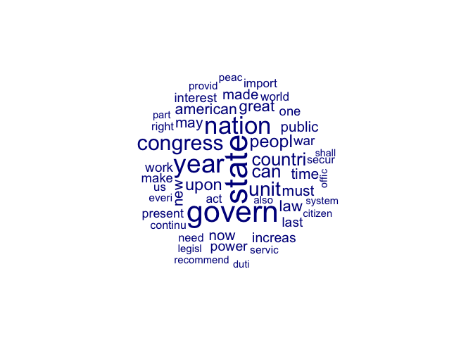
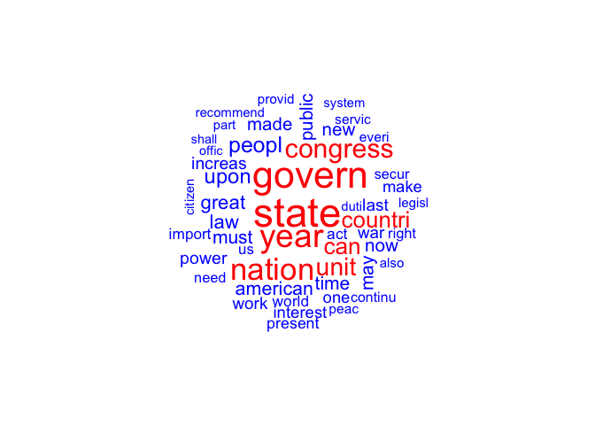
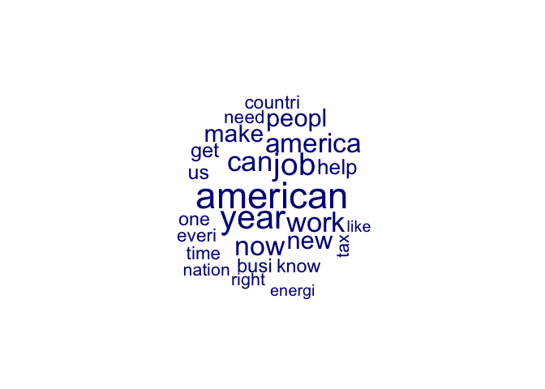
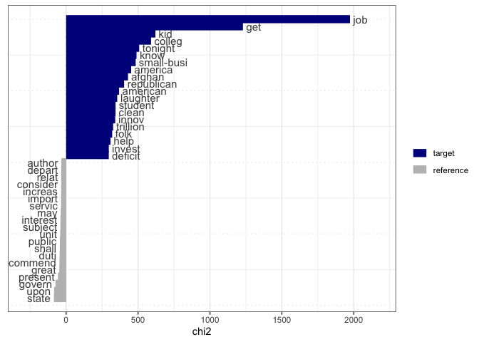
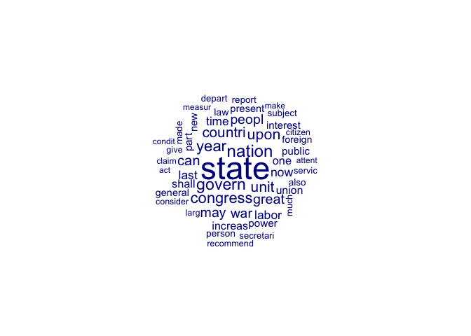
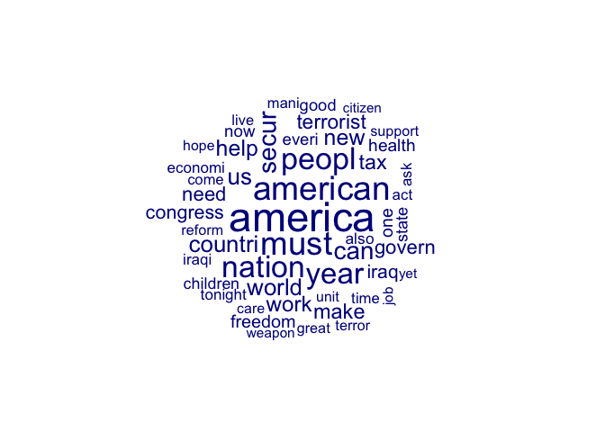
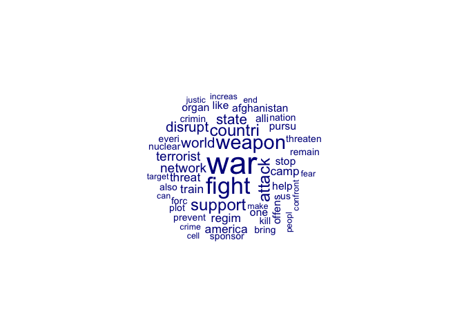
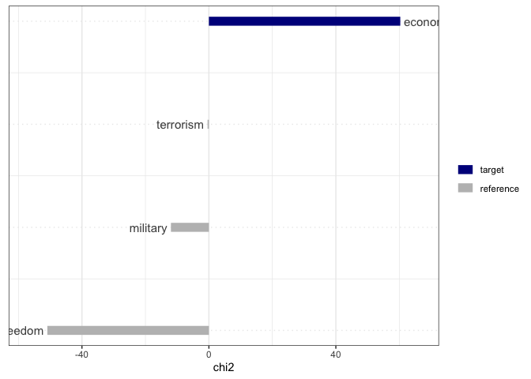
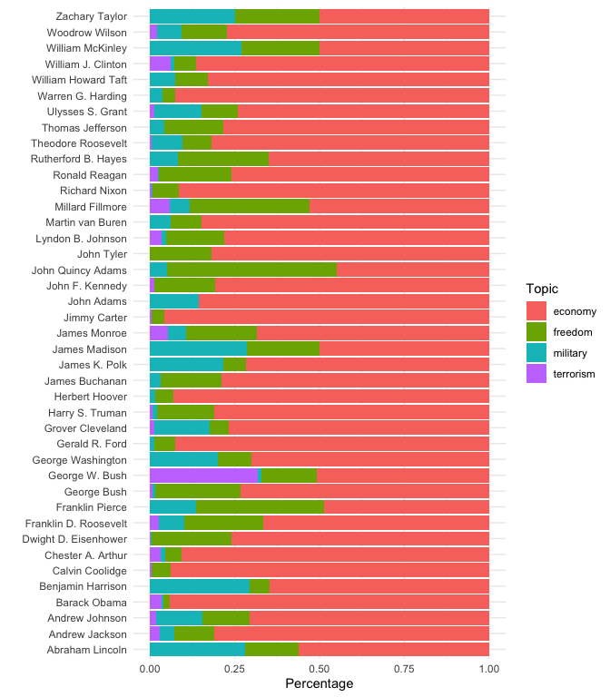

R text analysis: quanteda
================
Kasper Welbers, Wouter van Atteveldt & Philipp Masur
2021-10

-   [Introduction](#introduction)
    -   [The quanteda package](#the-quanteda-package)
-   [Step 1: Importing text and creating a quanteda
    corpus](#step-1-importing-text-and-creating-a-quanteda-corpus)
    -   [From CSV files](#from-csv-files)
    -   [From text (or word/pdf) files](#from-text-or-wordpdf-files)
-   [Step 2: Creating the DTM (or DFM)](#step-2-creating-the-dtm-or-dfm)
    -   [Preprocessing/cleaning DTMs](#preprocessingcleaning-dtms)
    -   [Filtering the DTM](#filtering-the-dtm)
-   [Step 3: Analysis](#step-3-analysis)
    -   [Word frequencies and
        wordclouds](#word-frequencies-and-wordclouds)
    -   [Compare corpora](#compare-corpora)
    -   [Keyword-in-context](#keyword-in-context)
    -   [Dictionary search](#dictionary-search)
    -   [Creating good dictionaries](#creating-good-dictionaries)

# Introduction

In this tutorial you will learn how to perform text analysis using the
quanteda package. In the [R Basics: getting
started](R_basics_1_getting_started.md) tutorial we introduced some of
the techniques from this tutorial as a light introduction to R. In this
and the following tutorials, the goal is to get more understanding of
what actually happens ‘under the hood’ and which choices can be made,
and to become more confident and proficient in using quanteda for text
analysis.

## The quanteda package

The [quanteda package](https://quanteda.io/) is an extensive text
analysis suite for R. It covers everything you need to perform a variety
of automatic text analysis techniques, and features clear and extensive
documentation. Here we’ll focus on the main preparatory steps for text
analysis, and on learning how to browse the quanteda documentation. The
documentation for each function can also be found
[here](https://quanteda.io/reference/index.html).

For a more detailed explanation of the steps discussed here, you can
read the paper [Text Analysis in
R](http://vanatteveldt.com/p/welbers-text-r.pdf) (Welbers, van Atteveldt
& Benoit, 2017).

``` r
# Make sure to install these packages first!
library(quanteda)
library(quanteda.textplots)
library(quanteda.textstats)
```

# Step 1: Importing text and creating a quanteda corpus

The first step is getting text into R in a proper format. Text is often
stored in a variety of formats, from plain text and CSV files to HTML
and PDF, and more often than not with different ‘encodings’. There are
various packages for reading these file formats, and there is also the
convenient
[readtext](https://cran.r-project.org/web/packages/readtext/vignettes/readtext_vignette.html)
that is specialized for reading texts from a variety of formats.

## From CSV files

For this tutorial, we will be importing text from a csv. For
convenience, we’re using a csv that’s available online, but the process
is the same for a csv file on your own computer. The data consists of
the State of the Union speeches of US presidents, with each document
(i.e. row in the csv) being a paragraph. The data will be imported as a
data.frame.

``` r
library(tidyverse)
url <- 'https://bit.ly/2QoqUQS'
d <- read_csv(url)
head(d)   ## view first 6 rows
```

    ## # A tibble: 6 x 5
    ##   paragraph date       President     Party text                                 
    ##       <dbl> <date>     <chr>         <chr> <chr>                                
    ## 1         1 1790-01-08 George Washi… Other I embrace with great satisfaction th…
    ## 2         2 1790-01-08 George Washi… Other In resuming your consultations for t…
    ## 3         3 1790-01-08 George Washi… Other Among the many interesting objects w…
    ## 4         4 1790-01-08 George Washi… Other A free people ought not only to be a…
    ## 5         5 1790-01-08 George Washi… Other The proper establishment of the troo…
    ## 6         6 1790-01-08 George Washi… Other There was reason to hope that the pa…

We can now create a quanteda corpus with the `corpus()` function. If you
want to learn more about this function, recall that you can use the
question mark to look at the documentation.

``` r
?corpus
```

Here you see that for a data.frame, we need to specify which column
contains the text field. Also, the text column must be a character
vector.

``` r
corp <- corpus(d, text_field = 'text')  ## create the corpus
corp
```

    ## Corpus consisting of 23,469 documents and 4 docvars.
    ## text1 :
    ## "I embrace with great satisfaction the opportunity which now ..."
    ## 
    ## text2 :
    ## "In resuming your consultations for the general good you can ..."
    ## 
    ## text3 :
    ## "Among the many interesting objects which will engage your at..."
    ## 
    ## text4 :
    ## "A free people ought not only to be armed, but disciplined; t..."
    ## 
    ## text5 :
    ## "The proper establishment of the troops which may be deemed i..."
    ## 
    ## text6 :
    ## "There was reason to hope that the pacific measures adopted w..."
    ## 
    ## [ reached max_ndoc ... 23,463 more documents ]

## From text (or word/pdf) files

Rather than a csv file, your texts might be stored as separate files,
e.g. as .txt, .pdf, or .docx files. You can quite easily read these as
well with the `readtext` function from the `readtext` package. You might
have to install that package first with:

``` r
install.packages("readtext")
```

You can then call the readtext function on a particular file, or on a
folder or zip archive of files directly.

``` r
library(readtext)
url <- "https://github.com/ccs-amsterdam/r-course-material/blob/master/data/files.zip?raw=true"
texts <- readtext(url)
texts
```

    ## readtext object consisting of 2 documents and 0 docvars.
    ## # Description: df[,2] [2 × 2]
    ##   doc_id        text               
    ##   <chr>         <chr>              
    ## 1 document.docx "\"This is a \"..."
    ## 2 pdf_file.pdf  "\"This is a \"..."

As you can see, it automatically downloaded and unzipped the files, and
converted the MS Word and PDF files into plain text.

I read them from an online source here, but you can also read them from
your hard drive by specifying the path:

``` r
texts <- readtext("c:/path/to/files")
texts <- readtext("/Users/me/Documents/files")
```

You can convert the texts directly into a corpus object as above:

``` r
corp2 <- corpus(texts)
corp2
```

    ## Corpus consisting of 2 documents.
    ## document.docx :
    ## "This is a word document"
    ## 
    ## pdf_file.pdf :
    ## "This is a PDF file "

# Step 2: Creating the DTM (or DFM)

Many text analysis techniques only use the frequencies of words in
documents. This is also called the bag-of-words assumption, because
texts are then treated as bags of individual words. Despite ignoring
much relevant information in the order of words and syntax, this
approach has proven to be very powerfull and efficient.

The standard format for representing a bag-of-words is as a
`document-term matrix` (DTM). This is a matrix in which rows are
documents, columns are terms, and cells indicate how often each term
occured in each document. We’ll first create a small example DTM from a
few lines of text. Here we use quanteda’s `dfm()` function, which stands
for `document-feature matrix` (DFM), which is a more general form of a
DTM.

``` r
# An example data set
text <-  c(d1 = "Cats are awesome!",
           d2 = "We need more cats!",
           d3 = "This is a soliloquy about a cat.")

# Tokenise text
text2 <- tokens(text)
text2
```

    ## Tokens consisting of 3 documents.
    ## d1 :
    ## [1] "Cats"    "are"     "awesome" "!"      
    ## 
    ## d2 :
    ## [1] "We"   "need" "more" "cats" "!"   
    ## 
    ## d3 :
    ## [1] "This"      "is"        "a"         "soliloquy" "about"     "a"        
    ## [7] "cat"       "."

``` r
# Construct the document-feature matrix based on the tokenised text
dtm <- dfm(text2)
dtm
```

    ## Document-feature matrix of: 3 documents, 14 features (61.90% sparse) and 0 docvars.
    ##     features
    ## docs cats are awesome ! we need more this is a
    ##   d1    1   1       1 1  0    0    0    0  0 0
    ##   d2    1   0       0 1  1    1    1    0  0 0
    ##   d3    0   0       0 0  0    0    0    1  1 2
    ## [ reached max_nfeat ... 4 more features ]

Here you see, for instance, that the word `are` only occurs in the first
document. In this matrix format, we can perform calculations with texts,
like analyzing different sentiments of frames regarding cats, or the
computing the similarity between the third sentence and the first two
sentences.

## Preprocessing/cleaning DTMs

However, directly converting a text to a DTM is a bit crude. Note, for
instance, that the words `cats`, and `cat` are given different columns.
In this DTM, “cats” and “awesome” are as different as “cats” and “cat”,
but for many types of analysis we would be more interested in the fact
that both texts are about felines, and not about the specific word that
is used. Also, for performance it can be useful (or even necessary) to
use fewer columns, and to ignore less interesting words such as `is` or
very rare words such as `soliloquy`.

This can be achieved by using additional `preprocessing` steps. In the
next example, we’ll again create the DTM, but this time we make all text
lowercase, ignore stopwords and punctuation, and perform `stemming`.
Simply put, stemming removes some parts at the ends of words to ignore
different forms of the same word, such as singular versus plural (“gun”
or “gun-s”) and different verb forms (“walk”,“walk-ing”,“walk-s”)

``` r
text2 <- text %>%
  tokens(remove_punct = T, remove_numbers = T, remove_symbols = T) %>%   ## tokenize, removing unnecessary noise
  tokens_tolower %>%                                                     ## normalize
  tokens_remove(stopwords('en')) %>%                                     ## remove stopwords (English)
  tokens_wordstem                                                        ## stemming
text2
```

    ## Tokens consisting of 3 documents.
    ## d1 :
    ## [1] "cat"    "awesom"
    ## 
    ## d2 :
    ## [1] "need" "cat" 
    ## 
    ## d3 :
    ## [1] "soliloquy" "cat"

``` r
dtm <- dfm(text2)
dtm
```

    ## Document-feature matrix of: 3 documents, 4 features (50.00% sparse) and 0 docvars.
    ##     features
    ## docs cat awesom need soliloquy
    ##   d1   1      1    0         0
    ##   d2   1      0    1         0
    ##   d3   1      0    0         1

By now you should be able to understand better how the arguments in this
function work. The `tolower` argument determines whether texts are
(TRUE) or aren’t (FALSE) converted to lowercase. `stem` determines
whether stemming is (TRUE) or isn’t (FALSE) used. The remove argument is
a bit more tricky. If you look at the documentation for the dfm function
(`?dfm`) you’ll see that `remove` can be used to give “a pattern of
user-supplied features to ignore”. In this case, we actually used
another function, `stopwords()`, to get a list of english stopwords. You
can see for yourself.

``` r
stopwords('en')
```

    ##   [1] "i"          "me"         "my"         "myself"     "we"        
    ##   [6] "our"        "ours"       "ourselves"  "you"        "your"      
    ##  [11] "yours"      "yourself"   "yourselves" "he"         "him"       
    ##  [16] "his"        "himself"    "she"        "her"        "hers"      
    ##  [21] "herself"    "it"         "its"        "itself"     "they"      
    ##  [26] "them"       "their"      "theirs"     "themselves" "what"      
    ##  [31] "which"      "who"        "whom"       "this"       "that"      
    ##  [36] "these"      "those"      "am"         "is"         "are"       
    ##  [41] "was"        "were"       "be"         "been"       "being"     
    ##  [46] "have"       "has"        "had"        "having"     "do"        
    ##  [51] "does"       "did"        "doing"      "would"      "should"    
    ##  [56] "could"      "ought"      "i'm"        "you're"     "he's"      
    ##  [61] "she's"      "it's"       "we're"      "they're"    "i've"      
    ##  [66] "you've"     "we've"      "they've"    "i'd"        "you'd"     
    ##  [71] "he'd"       "she'd"      "we'd"       "they'd"     "i'll"      
    ##  [76] "you'll"     "he'll"      "she'll"     "we'll"      "they'll"   
    ##  [81] "isn't"      "aren't"     "wasn't"     "weren't"    "hasn't"    
    ##  [86] "haven't"    "hadn't"     "doesn't"    "don't"      "didn't"    
    ##  [91] "won't"      "wouldn't"   "shan't"     "shouldn't"  "can't"     
    ##  [96] "cannot"     "couldn't"   "mustn't"    "let's"      "that's"    
    ## [101] "who's"      "what's"     "here's"     "there's"    "when's"    
    ## [106] "where's"    "why's"      "how's"      "a"          "an"        
    ## [111] "the"        "and"        "but"        "if"         "or"        
    ## [116] "because"    "as"         "until"      "while"      "of"        
    ## [121] "at"         "by"         "for"        "with"       "about"     
    ## [126] "against"    "between"    "into"       "through"    "during"    
    ## [131] "before"     "after"      "above"      "below"      "to"        
    ## [136] "from"       "up"         "down"       "in"         "out"       
    ## [141] "on"         "off"        "over"       "under"      "again"     
    ## [146] "further"    "then"       "once"       "here"       "there"     
    ## [151] "when"       "where"      "why"        "how"        "all"       
    ## [156] "any"        "both"       "each"       "few"        "more"      
    ## [161] "most"       "other"      "some"       "such"       "no"        
    ## [166] "nor"        "not"        "only"       "own"        "same"      
    ## [171] "so"         "than"       "too"        "very"       "will"

This list of words is thus passed to the `remove` argument in the
`dfm()` to ignore these words. If you are using texts in another
language, make sure to specify the language, such as stopwords(‘nl’) for
Dutch or stopwords(‘de’) for German.

There are various alternative preprocessing techniques, including more
advanced techniques that are not implemented in quanteda. Whether, when
and how to use these techniques is a broad topic that we won’t cover
today. For more details about preprocessing you can read the [Text
Analysis in R](http://vanatteveldt.com/p/welbers-text-r.pdf) paper cited
above.

## Filtering the DTM

For this tutorial, we’ll use the State of the Union speeches. We already
created the corpus above. We can now pass this corpus to the `dfm()`
function and set the preprocessing parameters.

``` r
dtm <- corp %>%
  tokens(remove_punct = T, remove_numbers = T, remove_symbols = T) %>%   
  tokens_tolower %>%                                                    
  tokens_remove(stopwords('en')) %>%                                     
  tokens_wordstem %>%
  dfm
dtm
```

    ## Document-feature matrix of: 23,469 documents, 16,032 features (99.78% sparse) and 4 docvars.
    ##        features
    ## docs    embrac great satisfact opportun now present congratul favor prospect
    ##   text1      1     1         1        1   1       2         1     1        1
    ##   text2      0     0         0        0   0       1         0     0        0
    ##   text3      0     0         0        0   0       0         0     0        0
    ##   text4      0     0         0        0   0       0         0     0        0
    ##   text5      0     0         0        0   0       0         0     0        0
    ##   text6      0     0         0        0   0       0         0     0        0
    ##        features
    ## docs    public
    ##   text1      1
    ##   text2      0
    ##   text3      0
    ##   text4      0
    ##   text5      0
    ##   text6      0
    ## [ reached max_ndoc ... 23,463 more documents, reached max_nfeat ... 16,022 more features ]

This dtm has 23,469 documents and 16,032 features (i.e. terms), and no
longer shows the actual matrix because it simply wouldn’t fit. Depending
on the type of analysis that you want to conduct, we might not need this
many words, or might actually run into computational limitations.

Luckily, many of these 16K features are not that informative. The
distribution of term frequencies tends to have a very long tail, with
many words occurring only once or a few times in our corpus. For many
types of bag-of-words analysis it would not harm to remove these words,
and it might actually improve results.

We can use the `dfm_trim` function to remove columns based on criteria
specified in the arguments. Here we say that we want to remove all terms
for which the frequency (i.e. the sum value of the column in the DTM) is
below 10.

``` r
dtm <- dfm_trim(dtm, min_termfreq = 10)
dtm
```

    ## Document-feature matrix of: 23,469 documents, 5,027 features (99.33% sparse) and 4 docvars.
    ##        features
    ## docs    embrac great satisfact opportun now present congratul favor prospect
    ##   text1      1     1         1        1   1       2         1     1        1
    ##   text2      0     0         0        0   0       1         0     0        0
    ##   text3      0     0         0        0   0       0         0     0        0
    ##   text4      0     0         0        0   0       0         0     0        0
    ##   text5      0     0         0        0   0       0         0     0        0
    ##   text6      0     0         0        0   0       0         0     0        0
    ##        features
    ## docs    public
    ##   text1      1
    ##   text2      0
    ##   text3      0
    ##   text4      0
    ##   text5      0
    ##   text6      0
    ## [ reached max_ndoc ... 23,463 more documents, reached max_nfeat ... 5,017 more features ]

Now we have about 5000 features left. See `?dfm_trim` for more options.

# Step 3: Analysis

Using the dtm we can now employ various techniques. You’ve already seen
some of them in the introduction tutorial, but by now you should be able
to understand more about the R syntax, and understand how to tinker with
different parameters.

## Word frequencies and wordclouds

Get most frequent words in corpus.

``` r
textplot_wordcloud(dtm, max_words = 50)     ## top 50 (most frequent) words
```

<!-- -->

``` r
textplot_wordcloud(dtm, max_words = 50, color = c('blue','red')) ## change colors
```

<!-- -->

``` r
textstat_frequency(dtm, n = 10)             ## view the frequencies 
```

    ##     feature frequency rank docfreq group
    ## 1     state      9234    1    5580   all
    ## 2    govern      8581    2    5553   all
    ## 3      year      7250    3    4934   all
    ## 4    nation      6733    4    4847   all
    ## 5  congress      5689    5    4494   all
    ## 6      unit      5223    6    3715   all
    ## 7       can      4731    7    3628   all
    ## 8   countri      4664    8    3612   all
    ## 9     peopl      4477    9    3388   all
    ## 10     upon      4168   10    3004   all

You can also inspect a subcorpus. For example, looking only at Obama
speeches. To subset the DTM we can use quanteda’s `dtm_subset()`, but we
can also use the more general R subsetting techniques (as discussed last
week). Here we’ll use the latter for illustration.

With `docvars(dtm)` we get a data.frame with the document variables.
With `docvars(dtm)$President`, we get the character vector with
president names. Thus, with `docvars(dtm)$President == 'Barack Obama'`
we look for all documents where the president was Obama. To make this
more explicit, we store the logical vector, that shows which documents
are ‘TRUE’, as is\_obama. We then use this to select these rows from the
DTM.

``` r
is_obama <- docvars(dtm)$President == 'Barack Obama' 
obama_dtm <- dtm[is_obama,]
textplot_wordcloud(obama_dtm, max_words = 25)
```

<!-- -->

## Compare corpora

Compare word frequencies between two subcorpora. Here we (again) first
use a comparison to get the is\_obama vector. We then use this in the
`textstat_keyness()` function to indicate that we want to compare the
Obama documents (where is\_obama is TRUE) to all other documents (where
is\_obama is FALSE).

``` r
is_obama <- docvars(dtm)$President == 'Barack Obama' 
ts <- textstat_keyness(dtm, is_obama)
head(ts, 20)    ## view first 20 results
```

    ##       feature      chi2 p n_target n_reference
    ## 1         job 1973.4887 0      203         626
    ## 2         get 1229.2753 0      121         355
    ## 3         kid  621.0179 0       31          34
    ## 4      colleg  590.3294 0       57         160
    ## 5     tonight  507.9058 0       82         400
    ## 6        know  489.3740 0      108         695
    ## 7  small-busi  483.5821 0       14           3
    ## 8     america  452.2741 0      170        1644
    ## 9      afghan  430.1750 0       17          11
    ## 10 republican  403.2612 0       41         121
    ## 11   american  368.1350 0      245        3385
    ## 12   laughter  355.2143 0       28          60
    ## 13    student  343.7875 0       41         144
    ## 14      clean  343.5098 0       35         103
    ## 15      innov  341.3723 0       27          58
    ## 16   trillion  326.7499 0       16          16
    ## 17       folk  320.3036 0       14          11
    ## 18       help  308.5411 0      126        1289
    ## 19     invest  296.6455 0       72         501
    ## 20    deficit  296.5389 0       56         315

We can visualize these results, stored under the name `ts`, by using the
textplot\_keyness function

``` r
textplot_keyness(ts)
```

<!-- -->

**Exercise 1:** Create two subset of the dtm. The first one should only
contain speeches of “Abraham Lincoln” and the second of “George W.
Bush”. In a first step, create two wordclouds. How did these president
differ with regard to the words they used? Second, create a keyness plot
to visualize the difference between Bush and the rest of the entire
corpus

``` r
is_lincoln <- docvars(dtm)$President == 'Abraham Lincoln' 
is_bush <- docvars(dtm)$President == 'George W. Bush' 

# Create subsets of the dtm
dtm_lincoln <- dfm_subset(dtm, is_lincoln)
dtm_bush <- dfm_subset(dtm, is_bush)

# Wordclouds
textplot_wordcloud(dtm_lincoln, max_word = 50)
```

<!-- -->

``` r
textplot_wordcloud(dtm_bush, max_word = 50)
```

<!-- -->

``` r
# Comparison plot
ts <- textstat_keyness(dtm, is_bush)
```

## Keyword-in-context

As seen in the first tutorial, a keyword-in-context listing shows a
given keyword in the context of its use. This is a good help for
interpreting words from a wordcloud or keyness plot.

Since a DTM only knows word frequencies, the `kwic()` function requires
a tokenized corpus object as input.

``` r
k <- kwic(tokens(corp), 'freedom', window = 7)
head(k, 10)    ## only view first 10 results
```

    ## Keyword-in-context with 10 matches.                                                                              
    ##   [text126, 62]            without harmony as far as consists with | freedom |
    ##   [text357, 84]                 a wide spread for the blessings of | freedom |
    ##   [text466, 84]       commerce of the United States its legitimate | freedom |
    ##   [text481, 89]          of cheaper materials and subsistence, the | freedom |
    ##   [text483, 23]            payment of the public debt whenever the | freedom |
    ##   [text626, 32]           its progress a force proportioned to its | freedom |
    ##   [text626, 46]                  these States, the guardian of the | freedom |
    ##   [text707, 98]                  over the purity of elections, the | freedom |
    ##  [text739, 152] important circumstance connected with it with that | freedom |
    ##   [text790, 75]               will acquire new force and a greater | freedom |
    ##                                          
    ##  of sentiment its dignity may be lost    
    ##  and equal laws.                         
    ##  . The instructions to our ministers with
    ##  of labor from taxation with us,         
    ##  and safety of our commerce shall be     
    ##  , and that the union of these           
    ##  and safety of all and of each           
    ##  of speech and of the press,             
    ##  and candor which a regard for the       
    ##  of action within its proper sphere.

The `kwic()` function can also be used to focus an analysis on a
specific search term. You can use the output of the kwic function to
create a new DTM, in which only the words within the shown window are
included in the DTM. With the following code, a DTM is created that only
contains words that occur within 10 words from `terror*` (terrorism,
terrorist, terror, etc.).

``` r
terror <- kwic(tokens(corp), 'terror*')
terror_corp <- corpus(terror)
terror_dtm <- terror_corp %>%
  tokens(remove_punct = T, remove_numbers = T, remove_symbols = T) %>%   
  tokens_tolower %>%                                                    
  tokens_remove(stopwords('en')) %>%                                     
  tokens_wordstem %>%
  dfm
```

Now you can focus an analysis on whether and how Presidents talk about
`terror*`.

``` r
textplot_wordcloud(terror_dtm, max_words = 50)     ## top 50 (most frequent) words
```

<!-- -->

## Dictionary search

You can perform a basic dictionary search. In terms of query options
this is less advanced than other packages, but quanteda offers more ways
to analyse the dictionary results. Also, it supports the use of existing
dictionaries, for instance for sentiment or topic analyses (but mostly
for english dictionaries, we will do this in the next practical
session).

An convenient way of using dictionaries is to make a DTM with the
columns representing dictionary terms.

``` r
dict <- dictionary(list(terrorism = 'terror*',
                        economy = c('econom*', 'tax*', 'job*'),
                        military = c('army','navy','military','airforce','soldier'),
                        freedom = c('freedom','liberty')))
dict_dtm <- dfm_lookup(dtm, dict, exclusive=TRUE)
dict_dtm 
```

    ## Document-feature matrix of: 23,469 documents, 4 features (95.55% sparse) and 4 docvars.
    ##        features
    ## docs    terrorism economy military freedom
    ##   text1         0       0        0       0
    ##   text2         0       0        0       0
    ##   text3         0       0        0       0
    ##   text4         0       0        0       0
    ##   text5         0       1        1       0
    ##   text6         0       0        0       0
    ## [ reached max_ndoc ... 23,463 more documents ]

The “4 features” are the four entries in our dictionary. Now you can
perform all the analyses with dictionaries.

``` r
textplot_wordcloud(dict_dtm)
```

<!-- -->

``` r
tk <- textstat_keyness(dict_dtm, docvars(dict_dtm)$President == 'Barack Obama')
textplot_keyness(tk)
```

<!-- -->

You can also convert the dtm to a data frame to get counts of each
concept per document (which you can then match with e.g. survey data)

``` r
df <- convert(dict_dtm, to="data.frame")
head(df)
```

    ##   doc_id terrorism economy military freedom
    ## 1  text1         0       0        0       0
    ## 2  text2         0       0        0       0
    ## 3  text3         0       0        0       0
    ## 4  text4         0       0        0       0
    ## 5  text5         0       1        1       0
    ## 6  text6         0       0        0       0

**Exercise 2:** Create a barplot that compares how much each president
has talked about the four topics (freedom, military, economy,
terrorism). In how far does George Bush (Jr) differ from the others?
Tip: The following code already converts the original corpus into a
data.frame, merges it with the data frame we just created, and
summarized the topics per president. You now may have to engage in some
reshaping before you can plot the data in a meaningful way. Also:
coord\_flip() may be good to use…

``` r
new_data <- convert(corp, "data.frame") %>%
  left_join(df) %>%
  group_by(President) %>%
  summarise(terrorism = sum(terrorism)/n(),
            economy = sum(economy)/n(),
            military = sum(military)/n(),
            freedom = sum(freedom)/n())

new_data %>%
  pivot_longer(-President) %>%
  ggplot(aes(x = President, y = value, fill = name)) +
  geom_bar(stat = "identity", position = "fill") +
  coord_flip() +
  labs(x = "", y = "Percentage", fill = "Topic") +
  theme_minimal()
```

<!-- -->

## Creating good dictionaries

A good dictionary means that all documents that match the dictionary are
indeed about or contain the desired concept, and that all documents that
contain the concept are matched.

To check this, you can manually annotate or code a sample of documents
and compare the score with the dictionary hits.

You can also apply the keyword-in-context function to a dictionary to
quickly check a set of matches and see if they make sense:

``` r
head(kwic(corp, dict$terrorism), 10)
```

    ## Keyword-in-context with 10 matches.                                                                  
    ##    [text735, 80]          , will henceforth lose their | terror  |
    ##  [text1433, 236]        has disarmed revolution of its | terrors |
    ##   [text1614, 86]               which it has spread its | terrors |
    ##   [text3087, 62]              are a source of constant | terror  |
    ##   [text4388, 29]            general insecurity, by the | terror  |
    ##  [text4987, 102]       enough were committed to spread | terror  |
    ##    [text6032, 9]              Puritan, Amphitrite, and | Terror  |
    ##    [text6177, 9] the double-turreted monitors Puritan, | Terror  |
    ##   [text6590, 41]            been the cause of constant | terror  |
    ##   [text7489, 28]      , and the coast-defense monitors | Terror  |
    ##                                    
    ##  . Fortifications in those quarters
    ##  . Not withstanding the strong     
    ##  . Not with standing this          
    ##  and annoyance to the inhabitants  
    ##  of confiscation, and the          
    ##  among those whose political action
    ##  have been launched on the         
    ##  , and Amphitrite, contracted      
    ##  to the settlers of Arizona        
    ##  , Puritan, Amphitrite,
