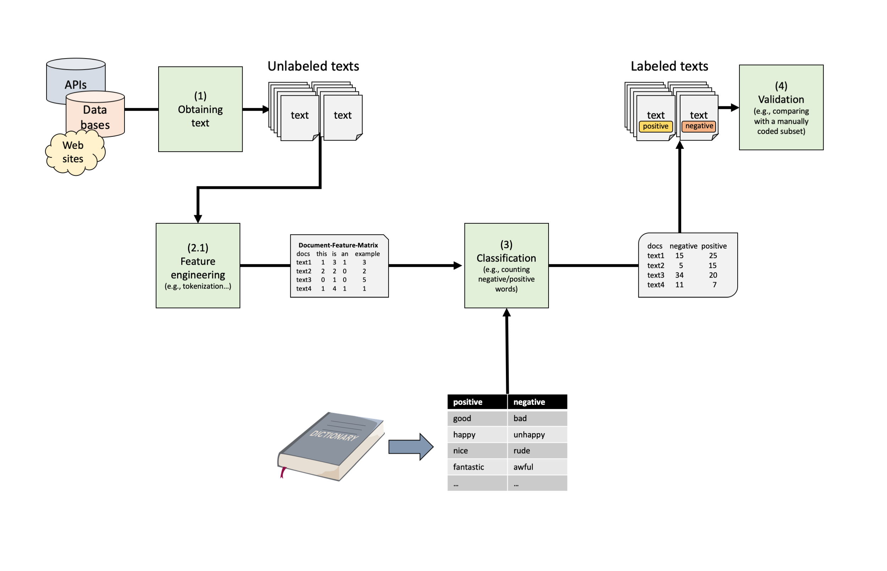

```{r setup, include=FALSE}
knitr::opts_chunk$set(echo = TRUE, message = FALSE, warning = FALSE)
library(printr)
```

# Introduction

In this tutorial, we will start to label text using a very simple approach: We are going to 
use dictionaries to count the words the corresponding to a particular label!
Dictionaries are a very transparent and useful tool for automatic content analysis.
At its simplest, a dictionary is a list of terms, of lexicons, with a specific meaning attached to each term. 
For example, a sentiment lexicon can contain a list of positive and negative words. 
The computer then counts the total number of negative and positive words per document, 
giving an indication of the sentiment of the document. Take a look at the dictionary pipeline
that we discussed in the lecture:




A dictionary approach can be expanded by also using wildcards, boolean, phrase and proximity conditions:
wildcards such as `immig*` would match all words starting with or containing a certain term;
boolean conditions allow you to specify that specific combinations of words must occur;
while phrase and proximity conditions specify that words need to occur next to or near each other. 

Whatever type of dictionary is used, it is vital that the dictionary is validated in the context of its use:
does the occurrence of the specified terms indeed imply that the desired theoretical concept is present?
The most common approach to validation is *gold standard* validation:
human expert coding is used to code a subset of documents, and the computer output is validated against this (presumed) gold standard.

# Text preparation

# Getting some data

For this example, we will dive into possible applications of computational methods in the context of corporate communication. We will use ~3200 tweets of four different mobile phone companies (Google, Huawei, Samsung, and Sony; scraped in 2022). You can find the data set on Canvas. 

```{r}
library(tidyverse)
library(tidytext)
tweets <- read_csv("phone_tweets.csv")
tweets |> 
  head()
```

In a first step, we engage in some simple data wrangling. We first create a unique post id and then select specific variables from the comparatively large data set. As a final, but very important step when we use Twitter data, we remove the `#` from the tweets as R will otherwise not recognize e.g., "#awesome" as the same word as "awesome"

```{r}
tweets <- tweets |> 
  group_by(screen_name)  |> 
  mutate(post_id = paste(user_id, 1:n(), sep = "_")) |> 
  select(user_id, post_id, created_at, screen_name, description, text, favorite_count, retweet_count) |> 
  mutate(text = str_remove_all(text, "#")) |>        ## removing '#' from the tweets
  ungroup()
tweets |> 
  head()
```

When we look at the data, we see that we have a variable that tells us when the tweet was created (created_at), how created the tweet (screen_name), the content of the tweet (text) and some information about whether it was liked (favorite_count) or retweeted (retweet_count).

Because the format is still a simple data set (or tibble), we can quickly check how much each company tweeted over time:

```{r}
tweets |> 
  mutate(date = as.Date(created_at))  |> 
  group_by(screen_name, date)  |> 
  summarize(n = n())  |> 
  ggplot(aes(x = date, y = n, color = screen_name)) +
  geom_line() +
  theme_minimal() +
  labs(color = "Smartphone Provider", 
       x = "Time", 
       y = "Number of tweets")
```

We can clearly see that ~3000 tweets of each company cover vastly different time spans. Furthermore, we see that "SamsungMobile" tweets a lot on particular dates (spikes!), but not as much otherwise. Google, of course, which do not only tweet about their phones, tweets a lot more than the others.  


## Feature engineering

As explained during the lecture and practiced in the last tutorial, we now need to engage in feature engineering and first tokenize the tweets and then think about potential trimming and weighting. Let's first use `unnest_tokens` to tokenize our tweets. We will use lemmatization to ensure the canonical version of the words to increase matching with the dictionary.

```{r}
tidy_tweets <- tweets |> 
  unnest_tokens(word, text) |> 
  mutate(word = textstem::lemmatize_words(word))
tidy_tweets |> 
  head()
```


# Dictionary-based analysis

## Obtaining a dictionary

To do a dictionary-based analysis on these tweets, we first need to obtain a useful dictionary. There are many existing dictionaries that can be downloaded from the Internet.

Here, we are going to use the [Brand Personality Dictionary](https://provalisresearch.com/products/content-analysis-software/wordstat-dictionary/brand-personality-dictionary/) (Opoku, Abratt, and Pitt, 2006) that has been used by Nadeau et al. (2020) for classyifing brands with regard to different latent variables:

- Competence
- Excitement
- Ruggedness
- Sincerity
- Sophistication

As it stored in a somewhat weird format (Windows Catalogue File) on the website, it is a bit cumbersome to transform into a meaningful tidy format. I have done this for you and you can download the dictionary simply from canvas and import it into R as a simple csv file. 

```{r}
# Get dictionary (file on Canvas!)
brandPers <- read_csv("brandPers.csv")

# Words in each category
brandPers |> 
  group_by(sentiment) |> 
  count()

# Some example words
brandPers |> 
  group_by(sentiment) |> 
  sample_n(size = 10) |> 
  mutate(id = 1:n()) |> 
  pivot_wider(names_from = sentiment,
              values_from = word)
```

As we can see, the dictionary includes extensive (> 140 words per category) for each of the five brand personality dimensions. Note: Some of the words are actually not unigrams (i.e., more than one word such as "award_winning"). In this form, they are more or less useless to try to code text that is tokenized into single words. This is a potential drawback of this particular dictionary. We could try to recode the dictionary or try to tokenize the text differently. For the time being, we will just go ahead with this limitation. 

## Running the actual dictionary analysis

Now that we have tidy tokenized data set and a dictionary, applying it is relatively simple by using sing the various `join` functions. We basically match this dictionary to our token list.


```{r}
dict_results <- tidy_tweets |> 
  left_join(brandPers)  # combinig dictionary and tidy tweets data set
dict_results |> 
  head()
```

We know have a data frame in which each word that exists in the dictionary is labeled with the respective brand personality dimension. In the first 10 rows of the data set, only the word "able" was coded with the label "competence". 


## Fundamental analysis using the labels

Usually, coding our tweets manually is not really the end goal of our analysis. Instead, we now can use this information to further analyze our text. A first very simple analysis could be to summarize the amount of times each brand personality dimension was mentioned by the different companies. 

```{r}
plot_data <- dict_results |> 
  group_by(screen_name, sentiment) |> 
  summarize(n = n()) |>
  mutate(prop = n/sum(n))
plot_data
```

Of course, instead of a table, we could also plot the differences using a barplot:

```{r}
plot_data |>
  filter(!is.na(sentiment)) |> 
  ggplot(aes(x = screen_name, y = prop, fill = sentiment)) +
  geom_col(position = position_dodge()) +
  scale_fill_brewer(palette = "Set2") +
  labs(x = "Smartphone Company", 
       y = "Number of mentions in tweets", 
       fill = "Brand Personality")
```


**Exercise:** Can you create a plot that shows the amount of words related to each brand personality dimensions for each brand across time? The code below transforms the `created_at` variable to simply the date. Can you extend the pipeline of this code to create the plot? Tip: Don't forget to filter out unlabeled words, thinking about which aspects to color and which to map onto different facets. It might also be a good idea to set `scales = "free"`, when you use e.g., `facet_wrap()`.

```{r}
dict_results |>
  filter(!is.na(sentiment)) |> 
  mutate(date = as.Date(created_at)) |> 
  group_by(screen_name, date, sentiment) |> 
  summarize(n = n()) |> 
  ggplot(aes(x = date, y = n, color = sentiment)) +
  geom_line() +
  facet_wrap(~screen_name, scales = "free") +
  labs(x = "Date", title = "Brand Personality of Mobile Phone Provider across Time",
       subtitle = "A Dictionary Analysis of 3200 Tweets",
       y = "", 
       color = "Brand Personality")
```


# Inspecting dictionary hits

Sometimes, it can be meaningful to inspect what the dictionary analysis actually labeled and whether the word was actually used in this way in its context. Using the `tokenbrowser` package developed by Kasper Welbers,
we can inspect the hits in their original context.

Using the `tokenbrowser` package developed by Kasper Welbers,
we can inspect the hits in their original context.

(Note that due to an unfortunate bug, this package requires the document id column is called `doc_id`)

```{r, eval = F}
library(tokenbrowser)
hits <- dict_results  |> 
  rename(doc_id = post_id)
meta <- select(tweets, doc_id=post_id, screen_name)
categorical_browser(hits, meta=meta, category=hits$sentiment, token_col="word") |>
  browseURL()
```

Note also that some words are repeated since the join will duplicate the rows if a word matched multiple categories.


# Sentiment analysis

In this second part of this tutorial, we will engage in a special case of a dictionary analysis: a so-called sentiment analysis. Some of the most important questions about text have to do with *sentiment* (or *tone*): 
Is a text in general positive or negate? Are actors described as likable and successful? 
Is the economy doing well or poorly? Is an issue framed as good or bad?
Is an actor in favor of or against a certain policy proposal? 

*Caveat*: This method is very successful for some tasks such as deciding whether a review is positive or negative. 
In other cases, however, one should be more careful about assuming dictionary analyses are valid. 
Especially in political communication, sentiment can mean one of multiple things,
and many texts contain multiple statements with opposing sentiment.

For more information and critical perspectives on dictionary based sentiment analysis, 
see e.g. the references below:

 + Soroka, S., Young, L., & Balmas, M. (2015). Bad news or mad news? sentiment scoring of negativity, fear, and anger in news content. The ANNALS of the American Academy of Political and Social Science, 659 (1), 108–121.
 + González-Bailón, S., & Paltoglou, G. (2015). Signals of public opinion in online communication: A comparison of methods and data sources. The ANNALS of the American Academy of Political and Social Science, 659(1), 95-107.
 + Barberá, P., Boydstun, A., Linn, S., McMahon, R., & Nagler, J. (2016, August). Methodological challenges in estimating tone: Application to news coverage of the US economy. In Meeting of the Midwest Political Science Association, Chicago, IL.
 

## Getting some data and a dictionary

For this exercise, we are using a data set that contains tweets from 2021 on corona. 

For easy use, the package `SentimentAnalysis` contains 3 dictionaries: `DictionaryGI` is a general sentiment dictionary based on The General Inquirer, and  `DictionaryHE` and `DictionaryLM` are dictionaries of finance-specific words presented by Henry (2008) and Loughran & McDonald (2011) respectively. We are going to use the `DictionaryGI`, which we transform into a tidy tibble. 


```{r}
# Getting a data set (again on canvas)
corona_tweets <- read_csv("corona_tweets.csv") |> as_tibble()

# Getting a dictionary for the sentiment analysis
library(SentimentAnalysis)
positive <- tibble(positive = DictionaryGI$positive) |> pivot_longer(positive)
negative <- tibble(negative = DictionaryGI$negative) |> pivot_longer(negative)
sentiment_dict <- bind_rows(positive, negative) |> rename(sentiment = name, word = value)
head(sentiment_dict)

```

**Exercise:** Can you assess the sentiment of these tweets? Apply everything that you have learned throughout this tutorial: Tokenize, if necessary, lemmatize, and join the dictionary. As a final step, try to plot the sentiment across time (there are different ways to do this!). Did tweets become more negative? 

```{r}
corona_tweets <- corona_tweets |>
  group_by(screen_name) |> 
  mutate(post_id = paste(user_id, 1:n(), sep = "_")) |> 
  select(user_id, post_id, created_at, screen_name, text, favorite_count, retweet_count) |> 
  mutate(text = str_remove_all(text, "#")) |> 
  ungroup() 

# Feature engineering
tidy_corona_tweets <- corona_tweets |> 
  unnest_tokens(word, text) |> 
  mutate(word = textstem::lemmatize_words(word)) 
tidy_corona_tweets |> 
  head()

# Dictionary Analysis
corona_dict_results <- tidy_corona_tweets |> 
  left_join(sentiment_dict) 

# Plotting proportion of positivity and negativity of tweets over time
corona_dict_results |> 
  group_by(post_id, sentiment) |> 
  summarize(n = n()) |> 
  group_by(post_id) |> 
  mutate(prop = n/sum(n)) |> 
  filter(!is.na(sentiment)) |> 
  left_join(corona_tweets) |> 
  mutate(date = as.Date(created_at)) |> 
  group_by(date, sentiment) |> 
  summarize(ave_prop = mean(prop)) |> 
  ggplot(aes(x = date, y = ave_prop, color = sentiment)) +
  geom_line() +
  theme_minimal(base_size = 15) +
  labs(x = "Date", y = "Average proportion in tweets",
       color = "Sentiment")
```


