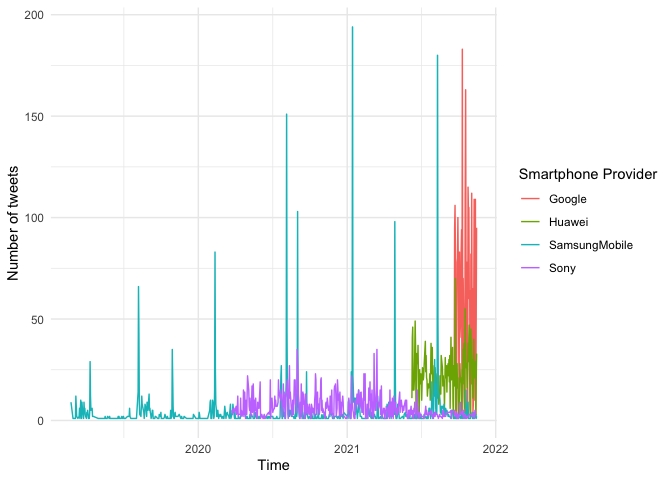
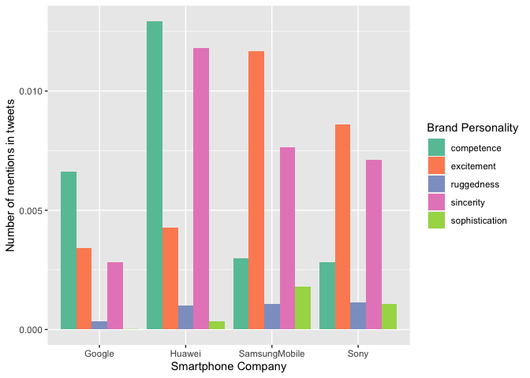
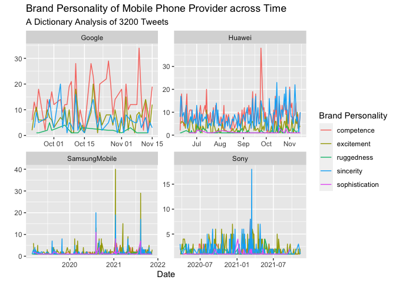
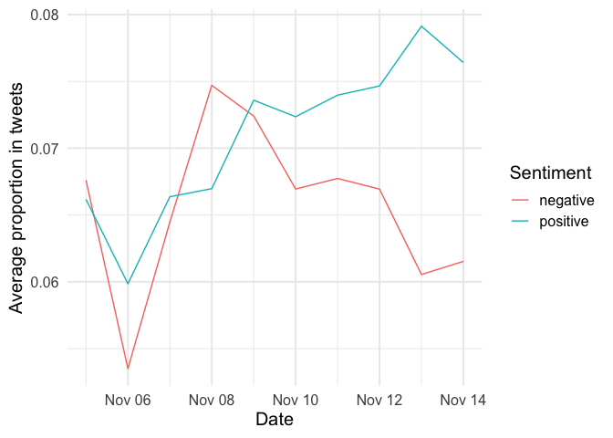

Dictionary Analysis with TidyText
================
Wouter van Atteveldt & Philipp K. Masur
2023-11

- [Introduction](#introduction)
- [Text preparation](#text-preparation)
- [Getting some data](#getting-some-data)
  - [Feature engineering](#feature-engineering)
- [Dictionary-based analysis](#dictionary-based-analysis)
  - [Obtaining a dictionary](#obtaining-a-dictionary)
  - [Running the actual dictionary
    analysis](#running-the-actual-dictionary-analysis)
  - [Fundamental analysis using the
    labels](#fundamental-analysis-using-the-labels)
- [Inspecting dictionary hits](#inspecting-dictionary-hits)
- [Sentiment analysis](#sentiment-analysis)
  - [Getting some data and a
    dictionary](#getting-some-data-and-a-dictionary)

# Introduction

In this tutorial, we will start to label text using a very simple
approach: We are going to use dictionaries to count the words the
corresponding to a particular label! Dictionaries are a very transparent
and useful tool for automatic content analysis. At its simplest, a
dictionary is a list of terms, of lexicons, with a specific meaning
attached to each term. For example, a sentiment lexicon can contain a
list of positive and negative words. The computer then counts the total
number of negative and positive words per document, giving an indication
of the sentiment of the document. Take a look at the dictionary pipeline
that we discussed in the lecture:


A dictionary approach can be expanded by also using wildcards, boolean,
phrase and proximity conditions: wildcards such as `immig*` would match
all words starting with or containing a certain term; boolean conditions
allow you to specify that specific combinations of words must occur;
while phrase and proximity conditions specify that words need to occur
next to or near each other.

Whatever type of dictionary is used, it is vital that the dictionary is
validated in the context of its use: does the occurrence of the
specified terms indeed imply that the desired theoretical concept is
present? The most common approach to validation is *gold standard*
validation: human expert coding is used to code a subset of documents,
and the computer output is validated against this (presumed) gold
standard.

# Text preparation

# Getting some data

For this example, we will dive into possible applications of
computational methods in the context of corporate communication. We will
use ~3200 tweets of four different mobile phone companies (Google,
Huawei, Samsung, and Sony; scraped in 2022). You can find the data set
on Canvas.

``` r
library(tidyverse)
library(tidytext)
tweets <- read_csv("phone_tweets.csv")
tweets |> 
  head()
```

|  user_id |    status_id | created_at          | screen_name | text                                                                                                                                                                                                                                                                                | source       | display_text_width | reply_to_status_id | reply_to_user_id | reply_to_screen_name | is_quote | is_retweet | favorite_count | retweet_count | quote_count | reply_count | hashtags | symbols | urls_url | urls_t.co | urls_expanded_url | media_url | media_t.co | media_expanded_url | media_type | ext_media_url | ext_media_t.co | ext_media_expanded_url | ext_media_type | mentions_user_id | mentions_screen_name | lang | quoted_status_id | quoted_text | quoted_created_at | quoted_source | quoted_favorite_count | quoted_retweet_count | quoted_user_id | quoted_screen_name | quoted_name | quoted_followers_count | quoted_friends_count | quoted_statuses_count | quoted_location | quoted_description | quoted_verified | retweet_status_id | retweet_text | retweet_created_at | retweet_source | retweet_favorite_count | retweet_retweet_count | retweet_user_id | retweet_screen_name | retweet_name | retweet_followers_count | retweet_friends_count | retweet_statuses_count | retweet_location | retweet_description | retweet_verified | place_url | place_name | place_full_name | place_type | country | country_code | geo_coords | coords_coords | bbox_coords | status_url                                              | name   | location          | description | url                       | protected | followers_count | friends_count | listed_count | statuses_count | favourites_count | account_created_at  | verified | profile_url               | profile_expanded_url    | account_lang | profile_banner_url                                          | profile_background_url                             | profile_image_url                                                             |
|---------:|-------------:|:--------------------|:------------|:------------------------------------------------------------------------------------------------------------------------------------------------------------------------------------------------------------------------------------------------------------------------------------|:-------------|-------------------:|-------------------:|-----------------:|:---------------------|:---------|:-----------|---------------:|--------------:|:------------|:------------|:---------|:--------|:---------|:----------|:------------------|:----------|:-----------|:-------------------|:-----------|:--------------|:---------------|:-----------------------|:---------------|:-----------------|:---------------------|:-----|-----------------:|:------------|:------------------|:--------------|----------------------:|---------------------:|---------------:|:-------------------|:------------|-----------------------:|---------------------:|----------------------:|:----------------|:-------------------|:----------------|------------------:|:-------------|:-------------------|:---------------|-----------------------:|----------------------:|----------------:|:--------------------|:-------------|------------------------:|----------------------:|-----------------------:|:-----------------|:--------------------|:-----------------|:----------|:-----------|:----------------|:-----------|:--------|:-------------|:-----------|:--------------|:------------|:--------------------------------------------------------|:-------|:------------------|:------------|:--------------------------|:----------|----------------:|--------------:|-------------:|---------------:|-----------------:|:--------------------|:---------|:--------------------------|:------------------------|:-------------|:------------------------------------------------------------|:---------------------------------------------------|:------------------------------------------------------------------------------|
| 20536157 | 1.460257e+18 | 2021-11-15 14:44:11 | Google      | @mthirubemech Hi Thirumoorthi. Just to confirm, are you still able to sign into your Google account? Let us know.                                                                                                                                                                   | Conversocial |                 99 |       1.460256e+18 |     3.474199e+08 | mthirubemech         | FALSE    | FALSE      |              0 |             0 | NA          | NA          | NA       | NA      | NA       | NA        | NA                | NA        | NA         | NA                 | NA         | NA            | NA             | NA                     | NA             | NA               | NA                   | en   |               NA | NA          | NA                | NA            |                    NA |                   NA |             NA | NA                 | NA          |                     NA |                   NA |                    NA | NA              | NA                 | NA              |                NA | NA           | NA                 | NA             |                     NA |                    NA |              NA | NA                  | NA           |                      NA |                    NA |                     NA | NA               | NA                  | NA               | NA        | NA         | NA              | NA         | NA      | NA           | NA         | NA            | NA          | <https://twitter.com/Google/status/1460257326280159234> | Google | Mountain View, CA | \#HeyGoogle | <https://t.co/vXgfrAhMXN> | FALSE     |        23972420 |           295 |        93843 |         145764 |             3201 | 2009-02-10 19:14:39 | TRUE     | <https://t.co/vXgfrAhMXN> | <https://about.google/> | NA           | <https://pbs.twimg.com/profile_banners/20536157/1635778205> | <http://abs.twimg.com/images/themes/theme1/bg.png> | <http://pbs.twimg.com/profile_images/1455185376876826625/s1AjSxph_normal.jpg> |
| 20536157 | 1.460244e+18 | 2021-11-15 13:49:44 | Google      | @dxtupid04 Hi there. Are you getting a specific error message when you try signing into your Google account? Without revealing your email address, give us the exact wording & we’ll try and point you in the right direction. This guide may also help: <https://t.co/2onqlsMNnL>. | Conversocial |                266 |       1.460237e+18 |     1.393947e+18 | dxtupid04            | FALSE    | FALSE      |              0 |             0 | NA          | NA          | NA       | NA      | NA       | NA        | NA                | NA        | NA         | NA                 | NA         | NA            | NA             | NA                     | NA             | NA               | NA                   | en   |               NA | NA          | NA                | NA            |                    NA |                   NA |             NA | NA                 | NA          |                     NA |                   NA |                    NA | NA              | NA                 | NA              |                NA | NA           | NA                 | NA             |                     NA |                    NA |              NA | NA                  | NA           |                      NA |                    NA |                     NA | NA               | NA                  | NA               | NA        | NA         | NA              | NA         | NA      | NA           | NA         | NA            | NA          | <https://twitter.com/Google/status/1460243622381633538> | Google | Mountain View, CA | \#HeyGoogle | <https://t.co/vXgfrAhMXN> | FALSE     |        23972420 |           295 |        93843 |         145764 |             3201 | 2009-02-10 19:14:39 | TRUE     | <https://t.co/vXgfrAhMXN> | <https://about.google/> | NA           | <https://pbs.twimg.com/profile_banners/20536157/1635778205> | <http://abs.twimg.com/images/themes/theme1/bg.png> | <http://pbs.twimg.com/profile_images/1455185376876826625/s1AjSxph_normal.jpg> |
| 20536157 | 1.460238e+18 | 2021-11-15 13:26:17 | Google      | @CricInformer Hi there. Just to confirm, have you already tried recovering your account by completing the steps here: <https://t.co/CJQaJUw3RV>? These tips may help: <https://t.co/vQSZijYFh6>. Let us know.                                                                       | Conversocial |                187 |       1.459714e+18 |     8.229044e+17 | CricInformer         | FALSE    | FALSE      |              0 |             0 | NA          | NA          | NA       | NA      | NA       | NA        | NA                | NA        | NA         | NA                 | NA         | NA            | NA             | NA                     | NA             | NA               | NA                   | en   |               NA | NA          | NA                | NA            |                    NA |                   NA |             NA | NA                 | NA          |                     NA |                   NA |                    NA | NA              | NA                 | NA              |                NA | NA           | NA                 | NA             |                     NA |                    NA |              NA | NA                  | NA           |                      NA |                    NA |                     NA | NA               | NA                  | NA               | NA        | NA         | NA              | NA         | NA      | NA           | NA         | NA            | NA          | <https://twitter.com/Google/status/1460237720190652420> | Google | Mountain View, CA | \#HeyGoogle | <https://t.co/vXgfrAhMXN> | FALSE     |        23972420 |           295 |        93843 |         145764 |             3201 | 2009-02-10 19:14:39 | TRUE     | <https://t.co/vXgfrAhMXN> | <https://about.google/> | NA           | <https://pbs.twimg.com/profile_banners/20536157/1635778205> | <http://abs.twimg.com/images/themes/theme1/bg.png> | <http://pbs.twimg.com/profile_images/1455185376876826625/s1AjSxph_normal.jpg> |
| 20536157 | 1.460228e+18 | 2021-11-15 12:49:06 | Google      | @AjithKumarRock8 Hi Ajith. Did you try resetting your password by completing the steps on this page: <https://t.co/CJQaJUw3RV>? These tips may help: <https://t.co/vQSZijYFh6>. Keep us posted.                                                                                     | Conversocial |                170 |       1.460221e+18 |     1.277816e+18 | AjithKumarRock8      | FALSE    | FALSE      |              0 |             0 | NA          | NA          | NA       | NA      | NA       | NA        | NA                | NA        | NA         | NA                 | NA         | NA            | NA             | NA                     | NA             | NA               | NA                   | en   |               NA | NA          | NA                | NA            |                    NA |                   NA |             NA | NA                 | NA          |                     NA |                   NA |                    NA | NA              | NA                 | NA              |                NA | NA           | NA                 | NA             |                     NA |                    NA |              NA | NA                  | NA           |                      NA |                    NA |                     NA | NA               | NA                  | NA               | NA        | NA         | NA              | NA         | NA      | NA           | NA         | NA            | NA          | <https://twitter.com/Google/status/1460228365529620485> | Google | Mountain View, CA | \#HeyGoogle | <https://t.co/vXgfrAhMXN> | FALSE     |        23972420 |           295 |        93843 |         145764 |             3201 | 2009-02-10 19:14:39 | TRUE     | <https://t.co/vXgfrAhMXN> | <https://about.google/> | NA           | <https://pbs.twimg.com/profile_banners/20536157/1635778205> | <http://abs.twimg.com/images/themes/theme1/bg.png> | <http://pbs.twimg.com/profile_images/1455185376876826625/s1AjSxph_normal.jpg> |
| 20536157 | 1.460228e+18 | 2021-11-15 12:47:24 | Google      | @joethatcher23 Hi Joe. Have you already tried recovering your Google account using the steps here: <https://t.co/CJQaJUw3RV>? These tips may help: <https://t.co/vQSZijYFh6>. Let us know.                                                                                          | Conversocial |                167 |       1.460217e+18 |     2.061416e+07 | joethatcher23        | FALSE    | FALSE      |              0 |             0 | NA          | NA          | NA       | NA      | NA       | NA        | NA                | NA        | NA         | NA                 | NA         | NA            | NA             | NA                     | NA             | NA               | NA                   | en   |               NA | NA          | NA                | NA            |                    NA |                   NA |             NA | NA                 | NA          |                     NA |                   NA |                    NA | NA              | NA                 | NA              |                NA | NA           | NA                 | NA             |                     NA |                    NA |              NA | NA                  | NA           |                      NA |                    NA |                     NA | NA               | NA                  | NA               | NA        | NA         | NA              | NA         | NA      | NA           | NA         | NA            | NA          | <https://twitter.com/Google/status/1460227938360692740> | Google | Mountain View, CA | \#HeyGoogle | <https://t.co/vXgfrAhMXN> | FALSE     |        23972420 |           295 |        93843 |         145764 |             3201 | 2009-02-10 19:14:39 | TRUE     | <https://t.co/vXgfrAhMXN> | <https://about.google/> | NA           | <https://pbs.twimg.com/profile_banners/20536157/1635778205> | <http://abs.twimg.com/images/themes/theme1/bg.png> | <http://pbs.twimg.com/profile_images/1455185376876826625/s1AjSxph_normal.jpg> |
| 20536157 | 1.460206e+18 | 2021-11-15 11:20:18 | Google      | @OwainTom Hi Tom. Let’s see what we can do to help. Please follow us and let us know when you have so we can share next steps through DM.                                                                                                                                           | Conversocial |                127 |       1.460195e+18 |     1.347704e+18 | OwainTom             | FALSE    | FALSE      |              1 |             0 | NA          | NA          | NA       | NA      | NA       | NA        | NA                | NA        | NA         | NA                 | NA         | NA            | NA             | NA                     | NA             | NA               | NA                   | en   |               NA | NA          | NA                | NA            |                    NA |                   NA |             NA | NA                 | NA          |                     NA |                   NA |                    NA | NA              | NA                 | NA              |                NA | NA           | NA                 | NA             |                     NA |                    NA |              NA | NA                  | NA           |                      NA |                    NA |                     NA | NA               | NA                  | NA               | NA        | NA         | NA              | NA         | NA      | NA           | NA         | NA            | NA          | <https://twitter.com/Google/status/1460206019389317120> | Google | Mountain View, CA | \#HeyGoogle | <https://t.co/vXgfrAhMXN> | FALSE     |        23972420 |           295 |        93843 |         145764 |             3201 | 2009-02-10 19:14:39 | TRUE     | <https://t.co/vXgfrAhMXN> | <https://about.google/> | NA           | <https://pbs.twimg.com/profile_banners/20536157/1635778205> | <http://abs.twimg.com/images/themes/theme1/bg.png> | <http://pbs.twimg.com/profile_images/1455185376876826625/s1AjSxph_normal.jpg> |

In a first step, we engage in some simple data wrangling. We first
create a unique post id and then select specific variables from the
comparatively large data set. As a final, but very important step when
we use Twitter data, we remove the `#` from the tweets as R will
otherwise not recognize e.g., “\#awesome” as the same word as “awesome”

``` r
tweets <- tweets |> 
  group_by(screen_name)  |> 
  mutate(post_id = paste(user_id, 1:n(), sep = "_")) |> 
  select(user_id, post_id, created_at, screen_name, description, text, favorite_count, retweet_count) |> 
  mutate(text = str_remove_all(text, "#")) |>        ## removing '#' from the tweets
  ungroup()
tweets |> 
  head()
```

|  user_id | post_id    | created_at          | screen_name | description | text                                                                                                                                                                                                                                                                                | favorite_count | retweet_count |
|---------:|:-----------|:--------------------|:------------|:------------|:------------------------------------------------------------------------------------------------------------------------------------------------------------------------------------------------------------------------------------------------------------------------------------|---------------:|--------------:|
| 20536157 | 20536157_1 | 2021-11-15 14:44:11 | Google      | \#HeyGoogle | @mthirubemech Hi Thirumoorthi. Just to confirm, are you still able to sign into your Google account? Let us know.                                                                                                                                                                   |              0 |             0 |
| 20536157 | 20536157_2 | 2021-11-15 13:49:44 | Google      | \#HeyGoogle | @dxtupid04 Hi there. Are you getting a specific error message when you try signing into your Google account? Without revealing your email address, give us the exact wording & we’ll try and point you in the right direction. This guide may also help: <https://t.co/2onqlsMNnL>. |              0 |             0 |
| 20536157 | 20536157_3 | 2021-11-15 13:26:17 | Google      | \#HeyGoogle | @CricInformer Hi there. Just to confirm, have you already tried recovering your account by completing the steps here: <https://t.co/CJQaJUw3RV>? These tips may help: <https://t.co/vQSZijYFh6>. Let us know.                                                                       |              0 |             0 |
| 20536157 | 20536157_4 | 2021-11-15 12:49:06 | Google      | \#HeyGoogle | @AjithKumarRock8 Hi Ajith. Did you try resetting your password by completing the steps on this page: <https://t.co/CJQaJUw3RV>? These tips may help: <https://t.co/vQSZijYFh6>. Keep us posted.                                                                                     |              0 |             0 |
| 20536157 | 20536157_5 | 2021-11-15 12:47:24 | Google      | \#HeyGoogle | @joethatcher23 Hi Joe. Have you already tried recovering your Google account using the steps here: <https://t.co/CJQaJUw3RV>? These tips may help: <https://t.co/vQSZijYFh6>. Let us know.                                                                                          |              0 |             0 |
| 20536157 | 20536157_6 | 2021-11-15 11:20:18 | Google      | \#HeyGoogle | @OwainTom Hi Tom. Let’s see what we can do to help. Please follow us and let us know when you have so we can share next steps through DM.                                                                                                                                           |              1 |             0 |

When we look at the data, we see that we have a variable that tells us
when the tweet was created (created_at), how created the tweet
(screen_name), the content of the tweet (text) and some information
about whether it was liked (favorite_count) or retweeted
(retweet_count).

Because the format is still a simple data set (or tibble), we can
quickly check how much each company tweeted over time:

``` r
tweets |> 
  mutate(date = as.Date(created_at))  |> 
  group_by(screen_name, date)  |> 
  summarize(n = n())  |> 
  ggplot(aes(x = date, y = n, color = screen_name)) +
  geom_line() +
  theme_minimal() +
  labs(color = "Smartphone Provider", 
       x = "Time", 
       y = "Number of tweets")
```

<!-- -->

We can clearly see that ~3000 tweets of each company cover vastly
different time spans. Furthermore, we see that “SamsungMobile” tweets a
lot on particular dates (spikes!), but not as much otherwise. Google, of
course, which do not only tweet about their phones, tweets a lot more
than the others.

## Feature engineering

As explained during the lecture and practiced in the last tutorial, we
now need to engage in feature engineering and first tokenize the tweets
and then think about potential trimming and weighting. Let’s first use
`unnest_tokens` to tokenize our tweets. We will use lemmatization to
ensure the canonical version of the words to increase matching with the
dictionary.

``` r
tidy_tweets <- tweets |> 
  unnest_tokens(word, text) |> 
  mutate(word = textstem::lemmatize_words(word))
tidy_tweets |> 
  head()
```

|  user_id | post_id    | created_at          | screen_name | description | favorite_count | retweet_count | word         |
|---------:|:-----------|:--------------------|:------------|:------------|---------------:|--------------:|:-------------|
| 20536157 | 20536157_1 | 2021-11-15 14:44:11 | Google      | \#HeyGoogle |              0 |             0 | mthirubemech |
| 20536157 | 20536157_1 | 2021-11-15 14:44:11 | Google      | \#HeyGoogle |              0 |             0 | hello        |
| 20536157 | 20536157_1 | 2021-11-15 14:44:11 | Google      | \#HeyGoogle |              0 |             0 | thirumoorthi |
| 20536157 | 20536157_1 | 2021-11-15 14:44:11 | Google      | \#HeyGoogle |              0 |             0 | just         |
| 20536157 | 20536157_1 | 2021-11-15 14:44:11 | Google      | \#HeyGoogle |              0 |             0 | to           |
| 20536157 | 20536157_1 | 2021-11-15 14:44:11 | Google      | \#HeyGoogle |              0 |             0 | confirm      |

# Dictionary-based analysis

## Obtaining a dictionary

To do a dictionary-based analysis on these tweets, we first need to
obtain a useful dictionary. There are many existing dictionaries that
can be downloaded from the Internet.

Here, we are going to use the [Brand Personality
Dictionary](https://provalisresearch.com/products/content-analysis-software/wordstat-dictionary/brand-personality-dictionary/)
(Opoku, Abratt, and Pitt, 2006) that has been used by Nadeau et
al. (2020) for classyifing brands with regard to different latent
variables:

- Competence
- Excitement
- Ruggedness
- Sincerity
- Sophistication

As it stored in a somewhat weird format (Windows Catalogue File) on the
website, it is a bit cumbersome to transform into a meaningful tidy
format. I have done this for you and you can download the dictionary
simply from canvas and import it into R as a simple csv file.

``` r
# Get dictionary (file on Canvas!)
brandPers <- read_csv("brandPers.csv")

# Words in each category
brandPers |> 
  group_by(sentiment) |> 
  count()
```

    ## # A tibble: 5 × 2
    ## # Groups:   sentiment [5]
    ##   sentiment          n
    ##   <chr>          <int>
    ## 1 competence       168
    ## 2 excitement       143
    ## 3 ruggedness       174
    ## 4 sincerity        174
    ## 5 sophistication   174

``` r
# Some example words
brandPers |> 
  group_by(sentiment) |> 
  sample_n(size = 10) |> 
  mutate(id = 1:n()) |> 
  pivot_wider(names_from = sentiment,
              values_from = word)
```

|  id | competence    | excitement    | ruggedness | sincerity      | sophistication |
|----:|:--------------|:--------------|:-----------|:---------------|:---------------|
|   1 | prosper       | exalting      | perdurable | standard       | glib_tongued   |
|   2 | unshakable    | stimulating   | challenge  | congenial      | voluptuary     |
|   3 | foolproof     | modern_day    | cruel      | verity         | well_bred      |
|   4 | prospering    | elevate       | alfresco   | virtuous       | prominent      |
|   5 | unflagging    | strong_willed | sunset     | honourableness | aristocracy    |
|   6 | dexterous     | juvenile      | unpolished | civil          | high_profile   |
|   7 | craftiness    | lone          | outdoorsy  | direct         | exclusivity    |
|   8 | forefront     | unconstrained | jeans      | glad           | graceful       |
|   9 | award_winning | in_vogue      | struggle   | bonafide       | captivate      |
|  10 | witty         | energising    | labourious | originality    | in_style       |

As we can see, the dictionary includes extensive (\> 140 words per
category) for each of the five brand personality dimensions. Note: Some
of the words are actually not unigrams (i.e., more than one word such as
“award_winning”). In this form, they are more or less useless to try to
code text that is tokenized into single words. This is a potential
drawback of this particular dictionary. We could try to recode the
dictionary or try to tokenize the text differently. For the time being,
we will just go ahead with this limitation.

## Running the actual dictionary analysis

Now that we have tidy tokenized data set and a dictionary, applying it
is relatively simple by using sing the various `join` functions. We
basically match this dictionary to our token list.

``` r
dict_results <- tidy_tweets |> 
  left_join(brandPers)  # combinig dictionary and tidy tweets data set
dict_results |> 
  head()
```

|  user_id | post_id    | created_at          | screen_name | description | favorite_count | retweet_count | word         | sentiment |
|---------:|:-----------|:--------------------|:------------|:------------|---------------:|--------------:|:-------------|:----------|
| 20536157 | 20536157_1 | 2021-11-15 14:44:11 | Google      | \#HeyGoogle |              0 |             0 | mthirubemech | NA        |
| 20536157 | 20536157_1 | 2021-11-15 14:44:11 | Google      | \#HeyGoogle |              0 |             0 | hello        | NA        |
| 20536157 | 20536157_1 | 2021-11-15 14:44:11 | Google      | \#HeyGoogle |              0 |             0 | thirumoorthi | NA        |
| 20536157 | 20536157_1 | 2021-11-15 14:44:11 | Google      | \#HeyGoogle |              0 |             0 | just         | NA        |
| 20536157 | 20536157_1 | 2021-11-15 14:44:11 | Google      | \#HeyGoogle |              0 |             0 | to           | NA        |
| 20536157 | 20536157_1 | 2021-11-15 14:44:11 | Google      | \#HeyGoogle |              0 |             0 | confirm      | NA        |

We know have a data frame in which each word that exists in the
dictionary is labeled with the respective brand personality dimension.
In the first 10 rows of the data set, only the word “able” was coded
with the label “competence”.

## Fundamental analysis using the labels

Usually, coding our tweets manually is not really the end goal of our
analysis. Instead, we now can use this information to further analyze
our text. A first very simple analysis could be to summarize the amount
of times each brand personality dimension was mentioned by the different
companies.

``` r
plot_data <- dict_results |> 
  group_by(screen_name, sentiment) |> 
  summarize(n = n()) |>
  mutate(prop = n/sum(n))
plot_data
```

    ## # A tibble: 24 × 4
    ## # Groups:   screen_name [4]
    ##    screen_name sentiment          n      prop
    ##    <chr>       <chr>          <int>     <dbl>
    ##  1 Google      competence       593 0.00663  
    ##  2 Google      excitement       305 0.00341  
    ##  3 Google      ruggedness        30 0.000336 
    ##  4 Google      sincerity        253 0.00283  
    ##  5 Google      sophistication     1 0.0000112
    ##  6 Google      <NA>           88218 0.987    
    ##  7 Huawei      competence      1191 0.0129   
    ##  8 Huawei      excitement       395 0.00429  
    ##  9 Huawei      ruggedness        92 0.000999 
    ## 10 Huawei      sincerity       1086 0.0118   
    ## # ℹ 14 more rows

Of course, instead of a table, we could also plot the differences using
a barplot:

``` r
plot_data |>
  filter(!is.na(sentiment)) |> 
  ggplot(aes(x = screen_name, y = prop, fill = sentiment)) +
  geom_col(position = position_dodge()) +
  scale_fill_brewer(palette = "Set2") +
  labs(x = "Smartphone Company", 
       y = "Number of mentions in tweets", 
       fill = "Brand Personality")
```

<!-- -->

**Exercise:** Can you create a plot that shows the amount of words
related to each brand personality dimensions for each brand across time?
The code below transforms the `created_at` variable to simply the date.
Can you extend the pipeline of this code to create the plot? Tip: Don’t
forget to filter out unlabeled words, thinking about which aspects to
color and which to map onto different facets. It might also be a good
idea to set `scales = "free"`, when you use e.g., `facet_wrap()`.

``` r
dict_results |>
  filter(!is.na(sentiment)) |> 
  mutate(date = as.Date(created_at)) |> 
  group_by(screen_name, date, sentiment) |> 
  summarize(n = n()) |> 
  ggplot(aes(x = date, y = n, color = sentiment)) +
  geom_line() +
  facet_wrap(~screen_name, scales = "free") +
  labs(x = "Date", title = "Brand Personality of Mobile Phone Provider across Time",
       subtitle = "A Dictionary Analysis of 3200 Tweets",
       y = "", 
       color = "Brand Personality")
```

<!-- -->

# Inspecting dictionary hits

Sometimes, it can be meaningful to inspect what the dictionary analysis
actually labeled and whether the word was actually used in this way in
its context. Using the `tokenbrowser` package developed by Kasper
Welbers, we can inspect the hits in their original context.

Using the `tokenbrowser` package developed by Kasper Welbers, we can
inspect the hits in their original context.

(Note that due to an unfortunate bug, this package requires the document
id column is called `doc_id`)

``` r
library(tokenbrowser)
hits <- dict_results  |> 
  rename(doc_id = post_id)
meta <- select(tweets, doc_id=post_id, screen_name)
categorical_browser(hits, meta=meta, category=hits$sentiment, token_col="word") |>
  browseURL()
```

Note also that some words are repeated since the join will duplicate the
rows if a word matched multiple categories.

# Sentiment analysis

In this second part of this tutorial, we will engage in a special case
of a dictionary analysis: a so-called sentiment analysis. Some of the
most important questions about text have to do with *sentiment* (or
*tone*): Is a text in general positive or negate? Are actors described
as likable and successful? Is the economy doing well or poorly? Is an
issue framed as good or bad? Is an actor in favor of or against a
certain policy proposal?

*Caveat*: This method is very successful for some tasks such as deciding
whether a review is positive or negative. In other cases, however, one
should be more careful about assuming dictionary analyses are valid.
Especially in political communication, sentiment can mean one of
multiple things, and many texts contain multiple statements with
opposing sentiment.

For more information and critical perspectives on dictionary based
sentiment analysis, see e.g. the references below:

- Soroka, S., Young, L., & Balmas, M. (2015). Bad news or mad news?
  sentiment scoring of negativity, fear, and anger in news content. The
  ANNALS of the American Academy of Political and Social Science, 659
  (1), 108–121.
- González-Bailón, S., & Paltoglou, G. (2015). Signals of public opinion
  in online communication: A comparison of methods and data sources. The
  ANNALS of the American Academy of Political and Social Science,
  659(1), 95-107.
- Barberá, P., Boydstun, A., Linn, S., McMahon, R., & Nagler, J. (2016,
  August). Methodological challenges in estimating tone: Application to
  news coverage of the US economy. In Meeting of the Midwest Political
  Science Association, Chicago, IL.

## Getting some data and a dictionary

For this exercise, we are using a data set that contains tweets from
2021 on corona.

For easy use, the package `SentimentAnalysis` contains 3 dictionaries:
`DictionaryGI` is a general sentiment dictionary based on The General
Inquirer, and `DictionaryHE` and `DictionaryLM` are dictionaries of
finance-specific words presented by Henry (2008) and Loughran & McDonald
(2011) respectively. We are going to use the `DictionaryGI`, which we
transform into a tidy tibble.

``` r
# Getting a data set (again on canvas)
corona_tweets <- read_csv("corona_tweets.csv")
corona_tweets |> 
  head()
```

|      user_id |    status_id | created_at          | screen_name | text                                                                                                                                                                                                                                                                            | source             | display_text_width | reply_to_status_id | reply_to_user_id | reply_to_screen_name | is_quote | is_retweet | favorite_count | retweet_count | quote_count | reply_count | hashtags | symbols | urls_url | urls_t.co | urls_expanded_url | media_url | media_t.co | media_expanded_url | media_type | ext_media_url | ext_media_t.co | ext_media_expanded_url | ext_media_type | mentions_user_id | mentions_screen_name | lang | quoted_status_id | quoted_text                                                                        | quoted_created_at | quoted_source | quoted_favorite_count | quoted_retweet_count | quoted_user_id | quoted_screen_name | quoted_name | quoted_followers_count | quoted_friends_count | quoted_statuses_count | quoted_location | quoted_description | quoted_verified | retweet_status_id | retweet_text | retweet_created_at | retweet_source | retweet_favorite_count | retweet_retweet_count | retweet_user_id | retweet_screen_name | retweet_name | retweet_followers_count | retweet_friends_count | retweet_statuses_count | retweet_location | retweet_description | retweet_verified | place_url | place_name | place_full_name | place_type | country | country_code | geo_coords | coords_coords | bbox_coords | status_url | name | location | description | url | protected | followers_count | friends_count | listed_count | statuses_count | favourites_count | account_created_at | verified | profile_url | profile_expanded_url | account_lang | profile_banner_url | profile_background_url | profile_image_url |
|-------------:|-------------:|:--------------------|:------------|:--------------------------------------------------------------------------------------------------------------------------------------------------------------------------------------------------------------------------------------------------------------------------------|:-------------------|-------------------:|-------------------:|-----------------:|:---------------------|:---------|:-----------|---------------:|--------------:|:------------|:------------|:---------|:--------|:---------|:----------|:------------------|:----------|:-----------|:-------------------|:-----------|:--------------|:---------------|:-----------------------|:---------------|:-----------------|:---------------------|:-----|-----------------:|:-----------------------------------------------------------------------------------|:------------------|:--------------|----------------------:|---------------------:|---------------:|:-------------------|:------------|-----------------------:|---------------------:|----------------------:|:----------------|:-------------------|:----------------|:------------------|:-------------|:-------------------|:---------------|:-----------------------|:----------------------|:----------------|:--------------------|:-------------|:------------------------|:----------------------|:-----------------------|:-----------------|:--------------------|:-----------------|:----------|:-----------|:----------------|:-----------|:--------|:-------------|:-----------|:--------------|:------------|:-----------|:-----|:---------|:------------|:----|:----------|----------------:|--------------:|-------------:|---------------:|-----------------:|:-------------------|:---------|:------------|:---------------------|:-------------|:-------------------|:-----------------------|:------------------|
| 2.562060e+07 | 1.459879e+18 | 2021-11-14 13:38:59 | biderman    | \#Truth. It is never right to compare a \#VaccineMandate to the \#Holocaust. \#COVID19 \#coronavirus \#Corona \#COVID-19 \#getthejab @HolocaustMuseum @ADL @RamazSchool @AIPAC @jstreetdotorg @BnaiBrith @TheDemocrats @HouseGOP \#Moderna \#vaccines <https://t.co/VRvEBFOxI7> | Twitter for iPhone |                235 |                 NA |               NA | NA                   | TRUE     | FALSE      |              0 |             0 | NA          | NA          | NA       | NA      | NA       | NA        | NA                | NA        | NA         | NA                 | NA         | NA            | NA             | NA                     | NA             | NA               | NA                   | en   |     1.459876e+18 | Occasions where it it appropriate to compare \#VaccineMandates to the \#Holocaust: |                   |               |                       |                      |                |                    |             |                        |                      |                       |                 |                    |                 |                   |              |                    |                |                        |                       |                 |                     |              |                         |                       |                        |                  |                     |                  |           |            |                 |            |         |              |            |               |             |            |      |          |             |     |           |                 |               |              |                |                  |                    |          |             |                      |              |                    |                        |                   |

1.  NEVER
2.  NEVER
3.  NEVER
4.  NEVER
5.  NEVER
6.  NEVER
7.  NEVER
8.  NEVER
9.  NEVER
10. NEVER <https://t.co/QyEtb7bLGX> \|2021-11-14 13:28:52 \|TweetDeck \|
    15\| 2\| 351120282\|Ostrov_A \|Arsen Ostrovsky \| 92108\| 5556\|
    180331\|Israel \|International Human Rights Lawyer ➡️ Focus:
    \#MiddleEast 🌍 , \#Israel 🇮🇱, \#HumanRights ⚖️, \#DigitalDiplomacy
    📲, \#Innovation 💡, \#Food🍴. My O’s, RT≠E \|TRUE \|NA \|NA \|NA
    \|NA \|NA \|NA \|NA \|NA \|NA \|NA \|NA \|NA \|NA \|NA \|NA
    \|<https://api.twitter.com/1.1/geo/id/d6819fe60643ebc1.json>
    \|Alexandria \|Alexandria, VA \|city \|United States \|US \|NA \|NA
    \|NA \|<https://twitter.com/biderman/status/1459878530213371911>
    \|David Biderman \|Vienna, Virginia \|Sports loving association
    executive, advocate & former lawyer who really cares about worker
    safety, the environment, his family, the weather, and loves travel.
    \|<https://t.co/Evvt4UeNQx> \|FALSE \| 970\| 620\| 24\| 5326\|
    10175\|2009-03-21 02:01:36 \|FALSE \|<https://t.co/Evvt4UeNQx>
    \|<http://www.swana.org> \|NA \|NA
    \|<http://abs.twimg.com/images/themes/theme1/bg.png>
    \|<http://pbs.twimg.com/profile_images/1039758951/Headshot_normal.jpg>
    \| \| 3.843144e+08\| 1.459877e+18\|2021-11-14 13:33:53
    \|fuelyourlife100 \|#corona Dashboard \#coronamaatregelen
    \#coronavirus \#vaccinaties \#Coronatest \#vaccineren

<https://t.co/JFY4IfcDJC> \|Twitter for Android \| 111\| NA\| NA\|NA
\|FALSE \|FALSE \| 0\| 0\|NA \|NA \|NA \|NA \|NA \|NA \|NA \|NA \|NA
\|NA \|NA \|NA \|NA \|NA \|NA \|NA \|NA \|en \| NA\|NA \|NA \|NA \| NA\|
NA\| NA\|NA \|NA \| NA\| NA\| NA\|NA \|NA \|NA \|NA \|NA \|NA \|NA \|NA
\|NA \|NA \|NA \|NA \|NA \|NA \|NA \|NA \|NA \|NA \|NA \|NA \|NA \|NA
\|NA \|NA \|NA \|NA \|NA
\|<https://twitter.com/fuelyourlife100/status/1459877245384810502>
\|Real Estate \|Nederland \|<https://t.co/OyV8siqyEd> Vastgoed en
Vastgoedonderhoud. Realist. Aanhanger van feiten en wetenschap \|NA
\|FALSE \| 32091\| 28167\| 119\| 1103\| 110\|2011-10-03 13:28:32 \|FALSE
\|NA \|NA \|NA
\|<https://pbs.twimg.com/profile_banners/384314397/1630740348>
\|<http://abs.twimg.com/images/themes/theme1/bg.png>
\|<http://pbs.twimg.com/profile_images/1427167475117002756/vChbj4TM_normal.jpg>
\| \| 8.241114e+07\| 1.459877e+18\|2021-11-14 13:32:13 \|\_Erwin
\|Interessant! \#Corona \#coronamaatregelen / via @DrZemouri
<https://t.co/3V94Qz75eJ> \|Twitter for Android \| 56\| NA\| NA\|NA
\|TRUE \|FALSE \| 0\| 0\|NA \|NA \|NA \|NA \|NA \|NA \|NA \|NA \|NA \|NA
\|NA \|NA \|NA \|NA \|NA \|NA \|NA \|en \| 1.459615e+18\|In Ireland half
of the people who died from \#Covid19 were infected in fewer than 400
buildings

Ireland has \>2,500,000 buildings

Risk is about buildings, not behaviour

Spread is about clusters, not contacts

Control is about eliminating the hot spots (pic: @mdc_martinus )
<https://t.co/CKcVWYWAud> \|2021-11-13 20:11:23 \|Twitter for iPhone \|
1659\| 735\| 1543321040\|Orla_Hegarty \|Orla Hegarty \| 14149\| 3381\|
29707\|Dublin City, Ireland \|Architect, Asst Professor at @UCDDublin
@UCDArch FRIAI RIBA ARB …opinions my own etc \#Housing \#Sustainability
\#Architecture \#Construction \#CovidIsAirborne \|FALSE \|NA \|NA \|NA
\|NA \|NA \|NA \|NA \|NA \|NA \|NA \|NA \|NA \|NA \|NA \|NA \|NA \|NA
\|NA \|NA \|NA \|NA \|NA \|NA \|NA
\|<https://twitter.com/_Erwin/status/1459876826445144069> \|\_Erwin
\|Amsterdam / Decentralized \|Communications ‘Dutch Veggie Association’
@Vegetariersbond / Good Doer / Taoism, QiGong, Flamenco / Future Digital
Nomad \|<https://t.co/yiv4esDiUQ> \|FALSE \| 1940\| 1125\| 173\| 37715\|
15687\|2009-10-14 17:30:03 \|FALSE \|<https://t.co/yiv4esDiUQ>
\|<https://www.linkedin.com/in/erwinpolderman> \|NA
\|<https://pbs.twimg.com/profile_banners/82411138/1552744359>
\|<http://abs.twimg.com/images/themes/theme1/bg.png>
\|<http://pbs.twimg.com/profile_images/958094370003177472/S5wGOblJ_normal.jpg>
\| \| 3.744430e+07\| 1.459876e+18\|2021-11-14 13:28:16 \|Rarame
\|@1968ingrid @dartagnanneke It’s called \#WWP World Wide Propaganda.
\#GreatReset \#WEF \#Corona \#Covid19 \#2G \|Twitter for iPhone \| 78\|
1.459803e+18\| 270909134\|1968ingrid \|FALSE \|FALSE \| 0\| 0\|NA \|NA
\|NA \|NA \|NA \|NA \|NA \|NA \|NA \|NA \|NA \|NA \|NA \|NA \|NA \|NA
\|NA \|en \| NA\|NA \|NA \|NA \| NA\| NA\| NA\|NA \|NA \| NA\| NA\|
NA\|NA \|NA \|NA \|NA \|NA \|NA \|NA \|NA \|NA \|NA \|NA \|NA \|NA \|NA
\|NA \|NA \|NA \|NA \|NA \|NA \|NA \|NA \|NA \|NA \|NA \|NA \|NA
\|<https://twitter.com/Rarame/status/1459875831929618437> \|Criticaster
des Vaderlands \|Amsterdam \|Niet zo logisch deze bio \|NA \|FALSE \|
180\| 262\| 3\| 22530\| 512\|2009-05-03 16:15:13 \|FALSE \|NA \|NA \|NA
\|<https://pbs.twimg.com/profile_banners/37444295/1549304208>
\|<http://abs.twimg.com/images/themes/theme1/bg.png>
\|<http://pbs.twimg.com/profile_images/1221048552601849856/dyK-O_BB_normal.jpg>
\| \| 1.302118e+18\| 1.459876e+18\|2021-11-14 13:27:15 \|MostakA26276799
\|Superb android app in 2021 guys very helpful app

Apps Google Play Store Android Mobile Application:
<https://t.co/YYpwLcqq4Q>

\#mobileappreview \#androidgamedev \#gametime \#followforfollowback \#ai
\#healthcare \#corona \#influencermarketing \#mobileappmarketing
\#androidgamedevelopment \|Twitter Web App \| 278\| NA\| NA\|NA \|FALSE
\|FALSE \| 1\| 0\|NA \|NA \|NA \|NA \|NA \|NA \|NA \|NA \|NA \|NA \|NA
\|NA \|NA \|NA \|NA \|NA \|NA \|en \| NA\|NA \|NA \|NA \| NA\| NA\|
NA\|NA \|NA \| NA\| NA\| NA\|NA \|NA \|NA \|NA \|NA \|NA \|NA \|NA \|NA
\|NA \|NA \|NA \|NA \|NA \|NA \|NA \|NA \|NA \|NA \|NA \|NA \|NA \|NA
\|NA \|NA \|NA \|NA
\|<https://twitter.com/MostakA26276799/status/1459875577276481541>
\|Mostak Ahammed \|Thakurgaon \|I am Online marketer I can promote your
online business I am expert in \#B2B_Leadgeneration \#email_marketing
\#Data_Entry \#linkedin_leadgeneration \|NA \|FALSE \| 2281\| 3782\| 1\|
974\| 3676\|2020-09-05 05:36:03 \|FALSE \|NA \|NA \|NA
\|<https://pbs.twimg.com/profile_banners/1302118192463003654/1600659879>
\|NA
\|<http://pbs.twimg.com/profile_images/1302992221486997504/FOvbCjs4_normal.jpg>
\| \| 1.615013e+09\| 1.459875e+18\|2021-11-14 13:24:50 \|snoopbee1
\|#COVIDー19 \#Corona Study at home \#math \#tutoring at
<https://t.co/pLnSNgyjmu> \|snoopbee \| 74\| NA\| NA\|NA \|FALSE \|FALSE
\| 0\| 0\|NA \|NA \|NA \|NA \|NA \|NA \|NA \|NA \|NA \|NA \|NA \|NA \|NA
\|NA \|NA \|NA \|NA \|en \| NA\|NA \|NA \|NA \| NA\| NA\| NA\|NA \|NA \|
NA\| NA\| NA\|NA \|NA \|NA \|NA \|NA \|NA \|NA \|NA \|NA \|NA \|NA \|NA
\|NA \|NA \|NA \|NA \|NA \|NA \|NA \|NA \|NA \|NA \|NA \|NA \|NA \|NA
\|NA \|<https://twitter.com/snoopbee1/status/1459874970037805060>
\|snoopbee \|NA \|online shopping site - \#music, \#travel, \#dating,
\#health, \#weight_loss, \#recipes, \#pets , \#math and more
\|<http://t.co/JOtJIroAXP> \|FALSE \| 127\| 409\| 179\| 194062\|
552\|2013-07-23 11:03:18 \|FALSE \|<http://t.co/JOtJIroAXP>
\|<http://www.snoopbee.com> \|NA \|NA
\|<http://abs.twimg.com/images/themes/theme1/bg.png>
\|<http://abs.twimg.com/sticky/default_profile_images/default_profile_normal.png>
\|

``` r
# Getting a dictionary for the sentiment analysis
library(SentimentAnalysis)
positive <- tibble(positive = DictionaryGI$positive) |> pivot_longer(positive)
negative <- tibble(negative = DictionaryGI$negative) |> pivot_longer(negative)
sentiment_dict <- bind_rows(positive, negative) |> rename(sentiment = name, word = value)
head(sentiment_dict)
```

| sentiment | word      |
|:----------|:----------|
| positive  | abide     |
| positive  | ability   |
| positive  | able      |
| positive  | abound    |
| positive  | absolve   |
| positive  | absorbent |

**Exercise:** Can you assess the sentiment of these tweets? Apply
everything that you have learned throughout this tutorial: Tokenize, if
necessary, lemmatize, and join the dictionary. As a final step, try to
plot the sentiment across time (there are different ways to do this!).
Did tweets become more negative?

``` r
corona_tweets <- corona_tweets |>
  group_by(screen_name) |> 
  mutate(post_id = paste(user_id, 1:n(), sep = "_")) |> 
  select(user_id, post_id, created_at, screen_name, text, favorite_count, retweet_count) |> 
  mutate(text = str_remove_all(text, "#")) |> 
  ungroup() 

# Feature engineering
tidy_corona_tweets <- corona_tweets |> 
  unnest_tokens(word, text) |> 
  mutate(word = textstem::lemmatize_words(word)) 
tidy_corona_tweets |> 
  head()
```

|  user_id | post_id    | created_at          | screen_name | favorite_count | retweet_count | word  |
|---------:|:-----------|:--------------------|:------------|---------------:|--------------:|:------|
| 25620597 | 25620597_1 | 2021-11-14 13:38:59 | biderman    |              0 |             0 | truth |
| 25620597 | 25620597_1 | 2021-11-14 13:38:59 | biderman    |              0 |             0 | it    |
| 25620597 | 25620597_1 | 2021-11-14 13:38:59 | biderman    |              0 |             0 | be    |
| 25620597 | 25620597_1 | 2021-11-14 13:38:59 | biderman    |              0 |             0 | never |
| 25620597 | 25620597_1 | 2021-11-14 13:38:59 | biderman    |              0 |             0 | right |
| 25620597 | 25620597_1 | 2021-11-14 13:38:59 | biderman    |              0 |             0 | to    |

``` r
# Dictionary Analysis
corona_dict_results <- tidy_corona_tweets |> 
  left_join(sentiment_dict) 

# Plotting proportion of positivity and negativity of tweets over time
corona_dict_results |> 
  group_by(post_id, sentiment) |> 
  summarize(n = n()) |> 
  group_by(post_id) |> 
  mutate(prop = n/sum(n)) |> 
  filter(!is.na(sentiment)) |> 
  left_join(corona_tweets) |> 
  mutate(date = as.Date(created_at)) |> 
  group_by(date, sentiment) |> 
  summarize(ave_prop = mean(prop)) |> 
  ggplot(aes(x = date, y = ave_prop, color = sentiment)) +
  geom_line() +
  theme_minimal(base_size = 15) +
  labs(x = "Date", y = "Average proportion in tweets",
       color = "Sentiment")
```

<!-- -->
