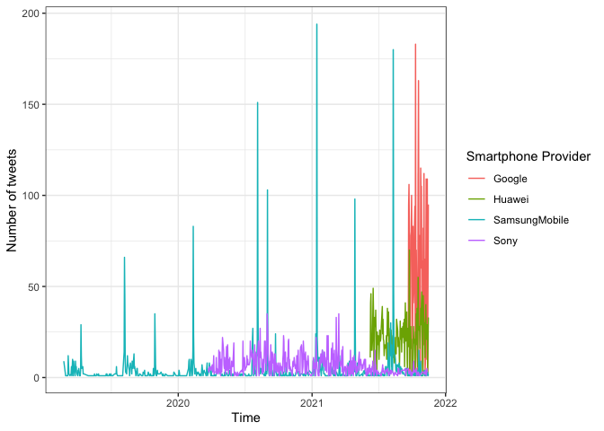
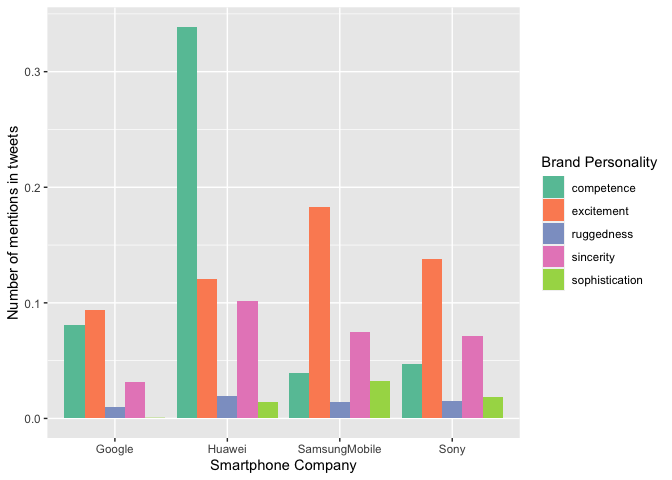
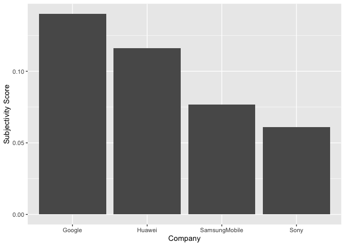

Dictionary Approaches: Brand Analysis in R
================
Wouter van Atteveldt, Kasper Welbers & Philipp Masur
2021-11

-   [Introduction](#introduction)
-   [Getting some data](#getting-some-data)
-   [Getting a DTM](#getting-a-dtm)
-   [Dictionary-based analysis](#dictionary-based-analysis)
    -   [Obtaining a dictionary](#obtaining-a-dictionary)
    -   [Applying a quanteda
        dictionary](#applying-a-quanteda-dictionary)
    -   [Analyzing the results](#analyzing-the-results)
    -   [Validating a dictionary](#validating-a-dictionary)
-   [Sentiment analysis](#sentiment-analysis)
    -   [Creating a quanteda dictionary from a word
        list](#creating-a-quanteda-dictionary-from-a-word-list)
    -   [Running the sentiment
        analysis](#running-the-sentiment-analysis)
    -   [Creating sentiment scores](#creating-sentiment-scores)

# Introduction

In this tutorial, we are going to learn how to use existing dictionaries
to analyze larger text corpora. Dictionaries are often used to conduct a
so-called sentiment analysis (and we will run a sentiment analysis at
the end of this tutorial), but they can also be used to characterize
brands/companies.

For example, [Nadeau, Rutter and
Lettice](https://doi.org/10.1080/0267257X.2020.1764080) (2020) used the
[Brand Personality
Dictionary](https://provalisresearch.com/products/content-analysis-software/wordstat-dictionary/brand-personality-dictionary/)
to understand the process of attitudinal changes towards a brand in
crisis and the brand’s communication around the crisis. They collected
data (tweets) from brands’ Twitter platforms and use this to conduct
extensive text analyses.

In this tutorial, we will do something very similar using the same
dictionary. However, as we will see, there are a lot of problems with
these approaches. Particularly, the validity of such dictionaries is -
despite them being used in actual research - often questionable. So
overall, the main lessons of today’s tutorial is that you should always
validate to make sure your results are valid for your task and domain.
Depending on resources, using crowd coding and/or machine learning can
also be a better option than a purely lexical (dictionary-based)
approach.

In this tutorial, we again are going to use functions from the
`tidyverse` and the collection of packages around `quanteda`.

``` r
library(tidyverse)
library(quanteda)
library(quanteda.textplots)
library(quanteda.textstats)
```

# Getting some data

For this example, we will use the latest \~3200 tweets of four different
mobile phone companies (Google, Huawei, Samsung, and Sony). If you want,
you can scrape their newest tweets using the package `rtweet` and the
following code. Note: You will need a Twitter Account to actually scrape
the tweets.

``` r
library(rtweet)

# Get timelines of major mobile phone companies
tmls1 <- get_timeline(c("Google", "Huawei"), n = 3200)         ## we can only scrape two twitter timelines at a time
tmls2 <- get_timelines(c("SamsungMobile", "Sony"), n = 3200)

# Bind them together
tml <- bind_rows(tmls1, tmls2)  ## merging results from both scraping processes

# Save data frame
write_csv(tml, file = "phone_tweets.csv")
```

For the time being, let’s simply use the following data set (which I
uploaded on Canvas), which contains the latest tweets of these companies
from last Monday.

``` r
tweets <- read_csv("phone_tweets.csv")
tweets
```

    ## # A tibble: 12,794 x 90
    ##    user_id status_id created_at          screen_name text  source
    ##      <dbl>     <dbl> <dttm>              <chr>       <chr> <chr> 
    ##  1  2.05e7   1.46e18 2021-11-15 14:44:11 Google      @mth… Conve…
    ##  2  2.05e7   1.46e18 2021-11-15 13:49:44 Google      @dxt… Conve…
    ##  3  2.05e7   1.46e18 2021-11-15 13:26:17 Google      @Cri… Conve…
    ##  4  2.05e7   1.46e18 2021-11-15 12:49:06 Google      @Aji… Conve…
    ##  5  2.05e7   1.46e18 2021-11-15 12:47:24 Google      @joe… Conve…
    ##  6  2.05e7   1.46e18 2021-11-15 11:20:18 Google      @Owa… Conve…
    ##  7  2.05e7   1.46e18 2021-11-15 10:02:41 Google      @nam… Conve…
    ##  8  2.05e7   1.46e18 2021-11-15 09:37:43 Google      @Kit… Conve…
    ##  9  2.05e7   1.46e18 2021-11-15 09:36:42 Google      @mda… Conve…
    ## 10  2.05e7   1.46e18 2021-11-15 09:36:08 Google      @MUB… Conve…
    ## # … with 12,784 more rows, and 84 more variables: display_text_width <dbl>,
    ## #   reply_to_status_id <dbl>, reply_to_user_id <dbl>,
    ## #   reply_to_screen_name <chr>, is_quote <lgl>, is_retweet <lgl>,
    ## #   favorite_count <dbl>, retweet_count <dbl>, quote_count <lgl>,
    ## #   reply_count <lgl>, hashtags <lgl>, symbols <lgl>, urls_url <lgl>,
    ## #   urls_t.co <lgl>, urls_expanded_url <lgl>, media_url <lgl>,
    ## #   media_t.co <lgl>, media_expanded_url <lgl>, media_type <lgl>,
    ## #   ext_media_url <lgl>, ext_media_t.co <lgl>, ext_media_expanded_url <lgl>,
    ## #   ext_media_type <lgl>, mentions_user_id <lgl>, mentions_screen_name <lgl>,
    ## #   lang <chr>, quoted_status_id <dbl>, quoted_text <chr>,
    ## #   quoted_created_at <dttm>, quoted_source <chr>, quoted_favorite_count <dbl>,
    ## #   quoted_retweet_count <dbl>, quoted_user_id <dbl>, quoted_screen_name <chr>,
    ## #   quoted_name <chr>, quoted_followers_count <dbl>,
    ## #   quoted_friends_count <dbl>, quoted_statuses_count <dbl>,
    ## #   quoted_location <chr>, quoted_description <chr>, quoted_verified <lgl>,
    ## #   retweet_status_id <dbl>, retweet_text <chr>, retweet_created_at <dttm>,
    ## #   retweet_source <chr>, retweet_favorite_count <dbl>,
    ## #   retweet_retweet_count <dbl>, retweet_user_id <dbl>,
    ## #   retweet_screen_name <chr>, retweet_name <chr>,
    ## #   retweet_followers_count <dbl>, retweet_friends_count <dbl>,
    ## #   retweet_statuses_count <dbl>, retweet_location <chr>,
    ## #   retweet_description <chr>, retweet_verified <lgl>, place_url <lgl>,
    ## #   place_name <lgl>, place_full_name <lgl>, place_type <lgl>, country <lgl>,
    ## #   country_code <lgl>, geo_coords <lgl>, coords_coords <lgl>,
    ## #   bbox_coords <lgl>, status_url <chr>, name <chr>, location <chr>,
    ## #   description <chr>, url <chr>, protected <lgl>, followers_count <dbl>,
    ## #   friends_count <dbl>, listed_count <dbl>, statuses_count <dbl>,
    ## #   favourites_count <dbl>, account_created_at <dttm>, verified <lgl>,
    ## #   profile_url <chr>, profile_expanded_url <chr>, account_lang <lgl>,
    ## #   profile_banner_url <chr>, profile_background_url <chr>,
    ## #   profile_image_url <chr>

In a first step, we engage in some simple data wrangling. We first
create a unique post id and then select specific variables from the
comparatively large data set. As a final, but very important step when
we use Twitter data, we remove the `#` from the tweets as R will
otherwise not recognize e.g., “\#awesome” as the same word as “awesome”

``` r
tweets <- tweets %>%
  group_by(screen_name) %>%
  mutate(post_id = paste(user_id, 1:n(), sep = "_")) %>%
  select(user_id, post_id, created_at, screen_name, description, text, favorite_count, retweet_count) %>%
  mutate(text = str_remove_all(text, "#")) %>%       ## removing '#' from the tweets
  ungroup
tweets
```

    ## # A tibble: 12,794 x 8
    ##    user_id post_id created_at          screen_name description text 
    ##      <dbl> <chr>   <dttm>              <chr>       <chr>       <chr>
    ##  1  2.05e7 205361… 2021-11-15 14:44:11 Google      #HeyGoogle  @mth…
    ##  2  2.05e7 205361… 2021-11-15 13:49:44 Google      #HeyGoogle  @dxt…
    ##  3  2.05e7 205361… 2021-11-15 13:26:17 Google      #HeyGoogle  @Cri…
    ##  4  2.05e7 205361… 2021-11-15 12:49:06 Google      #HeyGoogle  @Aji…
    ##  5  2.05e7 205361… 2021-11-15 12:47:24 Google      #HeyGoogle  @joe…
    ##  6  2.05e7 205361… 2021-11-15 11:20:18 Google      #HeyGoogle  @Owa…
    ##  7  2.05e7 205361… 2021-11-15 10:02:41 Google      #HeyGoogle  @nam…
    ##  8  2.05e7 205361… 2021-11-15 09:37:43 Google      #HeyGoogle  @Kit…
    ##  9  2.05e7 205361… 2021-11-15 09:36:42 Google      #HeyGoogle  @mda…
    ## 10  2.05e7 205361… 2021-11-15 09:36:08 Google      #HeyGoogle  @MUB…
    ## # … with 12,784 more rows, and 2 more variables: favorite_count <dbl>,
    ## #   retweet_count <dbl>

When we look at the data, we see that we have a variable that tells us
when the tweet was created (created\_at), how created the tweet
(screen\_name), the content of the tweet (text) and some information
about whether it was liked (favorite\_count) or retweeted
(retweet\_count).

Because the format is still a simple data set (or tibble), we can
quickly check how much each company tweeted over time:

``` r
# Tweets over time
tweets %>%
  mutate(date = as.Date(created_at)) %>%
  group_by(screen_name, date) %>%
  summarize(n = n()) %>%
  ggplot(aes(x = date, y = n, color = screen_name)) +
  geom_line() +
  theme_bw() +
  labs(color = "Smartphone Provider", x = "Time", y = "Number of tweets")
```

<!-- -->

We can clearly see that the last \~3000 tweets of each company cover
vastly different time spans. Furthermore, we see that “SamsungMobile”
tweets a lot on particular dates (spikes!), but not as much otherwise.
Google, of course, which do not only tweet about their phones, tweets a
lot more than the others.

# Getting a DTM

As we learn in the last practical session, the main primitive for any
dictionary analysis is the document-term matrix (DTM). For more
information on creating a DTM from a vector (column) of text, see again
the [tutorial on basic text analysis with
quanteda](https://github.com/masurp/VU_CADC/blob/main/tutorials/R_text_basics-of-text-analysis.md).
For this tutorial, it is important to make sure that the preprocessing
options (especially stemming) match those in the dictionary: if the
dictionary entries are not stemmed, but the text is, they will not
match. In case of doubt, it’s probably best to skip stemming altogether.

For our text analysis, we first need to transform this data set into a
corpus format. We can do so with the function `corpus()` which only asks
us which variable serves as document id (in our case the newly created
“post\_id”) and which contains the actual text (“text”). Note again that
all other variables are added as “docvars”!

``` r
corp <- corpus(tweets, docid_field = 'post_id', text_field = 'text')
corp
```

    ## Corpus consisting of 12,794 documents and 6 docvars.
    ## 20536157_1 :
    ## "@mthirubemech Hi Thirumoorthi. Just to confirm, are you stil..."
    ## 
    ## 20536157_2 :
    ## "@dxtupid04 Hi there. Are you getting a specific error messag..."
    ## 
    ## 20536157_3 :
    ## "@CricInformer Hi there. Just to confirm, have you already tr..."
    ## 
    ## 20536157_4 :
    ## "@AjithKumarRock8 Hi Ajith. Did you try resetting your passwo..."
    ## 
    ## 20536157_5 :
    ## "@joethatcher23 Hi Joe. Have you already tried recovering you..."
    ## 
    ## 20536157_6 :
    ## "@OwainTom Hi Tom. Let's see what we can do to help. Please f..."
    ## 
    ## [ reached max_ndoc ... 12,788 more documents ]

Now, we can create a document-term matrix as usual. In a first step, we
won’t apply any preprocessing steps (other than lowercasing, the default
in `dfm()`), because dictionaries tend to have full (i.e. not-stemmed)
words, and sometimes contain punctuation such as emoticons.

``` r
dtm <- corp %>% 
  tokens %>%
  dfm
dtm
```

    ## Document-feature matrix of: 12,794 documents, 28,310 features (99.92% sparse) and 6 docvars.
    ##             features
    ## docs         @mthirubemech hi thirumoorthi . just to confirm , are you
    ##   20536157_1             1  1            1 2    1  2       1 1   1   1
    ##   20536157_2             0  1            0 2    0  0       0 1   1   3
    ##   20536157_3             0  1            0 2    1  1       1 1   0   1
    ##   20536157_4             0  1            0 2    0  0       0 0   0   1
    ##   20536157_5             0  1            0 2    0  0       0 0   0   1
    ##   20536157_6             0  1            0 3    0  1       0 0   0   1
    ## [ reached max_ndoc ... 12,788 more documents, reached max_nfeat ... 28,300 more features ]

# Dictionary-based analysis

## Obtaining a dictionary

To do a dictionary-based analysis, we can simply use the `dfm_lookup`
method to apply an existing dictionary to a dfm (similar to last
session). There are many existing dictionaries that can be downloaded
from the Internet.

Here, we are going to use the [Brand Personality
Dictionary](https://provalisresearch.com/products/content-analysis-software/wordstat-dictionary/brand-personality-dictionary/)
(Opoku, Abratt, and Pitt, 2006) that has been used by Nadeau et
al. (2020) for classyifing brands with regard to different latent
variables:

-   Competence
-   Excitement
-   Ruggedness
-   Sincerity
-   Sophistication

As it stored in a zip-file on the website, we can use R to download it,
unzip and directly transform it into a quanteda dictionary using the
function `dictionary()`

``` r
download.file("https://provalisresearch.com/Download/BrandPersonality.zip", "BrandPersonality.zip")
unzip("BrandPersonality.zip", 'Brand Personality.cat')
brandPers <- dictionary(file="Brand Personality.cat")
brandPers
```

    ## Dictionary object with 6 key entries.
    ## - [COMPETENCE]:
    ##   - able, able_bodied, adept, adroit, assiduous, assured, astute, award_winning, blooming, booming, brainy, celebratory, certified, competence, competent, complete, comprehensive, concern, conclusive, confined [ ... and 148 more ]
    ## - [EXCITEMENT]:
    ##   - active, aggressive, artistic, arty, audacious, audacity, autonomous, avant_garde, awe_inspiring, awesome, bold, boldness, boost, bracing, brandnew, brand_new, brave, bravery, breathtaking, brisk [ ... and 123 more ]
    ## - [RUGGEDNESS]:
    ##   - al_fresco, alfresco, animal, animals, arduous, beefy, boisterous, brutal, bumpy, callous, challenge, challenging, coarse, confrontation, cowboy, cragged, craggy, crimson, crudeness, crudity [ ... and 154 more ]
    ## - [SINCERITY]:
    ##   - above_board, accommodating, accurate, actual, affable, approachable, approaching, authentic, beneficial, benevolent, benign, blunt, bonafide, bright, buoyant, candid, charitable, cheerful, civil, civilised [ ... and 154 more ]
    ## - [SOPHISTICATION]:
    ##   - a_la_mode, alluring, amiable, angelic, appealing, aristocracy, aristocrat, aristocratic, aristocratical, attractive, baronial, beautiful, blue_blood, blue_blooded, brush_up, captivate, captivating, celebrated, charismatic, charm [ ... and 154 more ]
    ## - [NOT_RELEVANT]:
    ##   - hard_to_pronounce

As we can see, the dictionary includes extensive (&gt; 120 words per
category) for each of the five brand personality dimensions. Note: Some
of the words are actually not unigrams (i.e., more than one word such as
“award\_winning”). In this form, they are more or less useless to try to
code text that is tokenized into single words. This is a potential
drawback of this particular dictionary. We could try to recode the
dictionary or try to tokenize the text differently. For the time being,
we will just go ahead with this limitation.

## Applying a quanteda dictionary

Now that we have a dtm and a dictionary, applying it is relatively
simple by using the `dfm_lookup` function. To use the result in further
analysis, we convert to a data frame and change it in to a tibble. The
last step is purely optional, but it makes working with it within
tidyverse slightly easier:

``` r
dtm_brand <- dtm %>% 
  dfm_lookup(brandPers)
dtm_brand
```

    ## Document-feature matrix of: 12,794 documents, 6 features (94.59% sparse) and 6 docvars.
    ##             features
    ## docs         COMPETENCE EXCITEMENT RUGGEDNESS SINCERITY SOPHISTICATION
    ##   20536157_1          1          0          0         0              0
    ##   20536157_2          0          1          0         0              0
    ##   20536157_3          0          0          0         0              0
    ##   20536157_4          0          0          0         0              0
    ##   20536157_5          0          0          0         0              0
    ##   20536157_6          0          0          0         0              0
    ##             features
    ## docs         NOT_RELEVANT
    ##   20536157_1            0
    ##   20536157_2            0
    ##   20536157_3            0
    ##   20536157_4            0
    ##   20536157_5            0
    ##   20536157_6            0
    ## [ reached max_ndoc ... 12,788 more documents ]

``` r
result <- dtm_brand %>%
  convert(to = "data.frame") %>% 
  as_tibble
result
```

    ## # A tibble: 12,794 x 7
    ##    doc_id COMPETENCE EXCITEMENT RUGGEDNESS SINCERITY SOPHISTICATION NOT_RELEVANT
    ##    <chr>       <dbl>      <dbl>      <dbl>     <dbl>          <dbl>        <dbl>
    ##  1 20536…          1          0          0         0              0            0
    ##  2 20536…          0          1          0         0              0            0
    ##  3 20536…          0          0          0         0              0            0
    ##  4 20536…          0          0          0         0              0            0
    ##  5 20536…          0          0          0         0              0            0
    ##  6 20536…          0          0          0         0              0            0
    ##  7 20536…          0          0          0         0              0            0
    ##  8 20536…          0          1          0         0              0            0
    ##  9 20536…          0          0          0         0              0            0
    ## 10 20536…          0          0          0         0              0            0
    ## # … with 12,784 more rows

We know have a data frame that includes information about how often any
of the words related to one of the five brand personality dimensions
occurred in the tweet.

In a final step, we know would probably like to combine this results
with the initial data set so that we know which text belonged to which
company.

``` r
tweets2 <- tweets %>% 
  rename(doc_id = post_id) %>%  ## renaming the idea variable to match the result data frame
  inner_join(result) 
tweets2
```

    ## # A tibble: 12,794 x 14
    ##    user_id doc_id created_at          screen_name description text 
    ##      <dbl> <chr>  <dttm>              <chr>       <chr>       <chr>
    ##  1  2.05e7 20536… 2021-11-15 14:44:11 Google      #HeyGoogle  @mth…
    ##  2  2.05e7 20536… 2021-11-15 13:49:44 Google      #HeyGoogle  @dxt…
    ##  3  2.05e7 20536… 2021-11-15 13:26:17 Google      #HeyGoogle  @Cri…
    ##  4  2.05e7 20536… 2021-11-15 12:49:06 Google      #HeyGoogle  @Aji…
    ##  5  2.05e7 20536… 2021-11-15 12:47:24 Google      #HeyGoogle  @joe…
    ##  6  2.05e7 20536… 2021-11-15 11:20:18 Google      #HeyGoogle  @Owa…
    ##  7  2.05e7 20536… 2021-11-15 10:02:41 Google      #HeyGoogle  @nam…
    ##  8  2.05e7 20536… 2021-11-15 09:37:43 Google      #HeyGoogle  @Kit…
    ##  9  2.05e7 20536… 2021-11-15 09:36:42 Google      #HeyGoogle  @mda…
    ## 10  2.05e7 20536… 2021-11-15 09:36:08 Google      #HeyGoogle  @MUB…
    ## # … with 12,784 more rows, and 8 more variables: favorite_count <dbl>,
    ## #   retweet_count <dbl>, COMPETENCE <dbl>, EXCITEMENT <dbl>, RUGGEDNESS <dbl>,
    ## #   SINCERITY <dbl>, SOPHISTICATION <dbl>, NOT_RELEVANT <dbl>

## Analyzing the results

Usually, coding our tweets manually is not really the end goal of our
analysis. Instead, we now can use this information to further analyze
our text. A first very simple analysis could be to summarize the amount
of times each brand personality dimension was mentioned by the different
companies.

``` r
plot_data <- tweets2 %>%
  group_by(screen_name) %>%
  summarize(competence = sum(COMPETENCE)/n(),
            excitement = sum(EXCITEMENT)/n(),
            ruggedness = sum(RUGGEDNESS)/n(),
            sincerity = sum(SINCERITY)/n(),
            sophistication = sum(SOPHISTICATION)/n())
plot_data
```

    ## # A tibble: 4 x 6
    ##   screen_name   competence excitement ruggedness sincerity sophistication
    ## * <chr>              <dbl>      <dbl>      <dbl>     <dbl>          <dbl>
    ## 1 Google            0.0809     0.0941    0.00969    0.0312       0.000312
    ## 2 Huawei            0.339      0.121     0.0197     0.102        0.0141  
    ## 3 SamsungMobile     0.0397     0.183     0.0144     0.0747       0.0322  
    ## 4 Sony              0.0472     0.138     0.0150     0.0710       0.0188

Of course, instead of a table, we could also plot the differences using
a barplot:

``` r
plot_data %>%
  pivot_longer(-screen_name) %>%
  ggplot(aes(x = screen_name, y = value, fill = name)) +
  geom_bar(stat = "identity", position = "dodge") +
  scale_fill_brewer(palette = "Set2") +
  theme_replace() +
  labs(x = "Smartphone Company", y = "Number of mentions in tweets", fill = "Brand Personality")
```

<!-- -->

And to introduce some statistical approaches and how you can do them in
R, here is an analysis of variance (ANOVA) testing the differences in
“COMPETENCE” across the four companies.

``` r
library(emmeans) # don't forget to install the package first!
m_comp <- aov(COMPETENCE ~ screen_name, tweets2)

# Model summary
summary(m_comp)
```

    ##                Df Sum Sq Mean Sq F value Pr(>F)    
    ## screen_name     3    195   64.99     536 <2e-16 ***
    ## Residuals   12790   1551    0.12                   
    ## ---
    ## Signif. codes:  0 '***' 0.001 '**' 0.01 '*' 0.05 '.' 0.1 ' ' 1

``` r
# Means and confidence intervals
tab <- emmeans(m_comp, specs = c("screen_name"))
tab
```

    ##  screen_name   emmean      SE    df lower.CL upper.CL
    ##  Google        0.0809 0.00616 12790   0.0689   0.0930
    ##  Huawei        0.3387 0.00616 12790   0.3267   0.3508
    ##  SamsungMobile 0.0397 0.00616 12790   0.0276   0.0518
    ##  Sony          0.0472 0.00616 12790   0.0352   0.0593
    ## 
    ## Confidence level used: 0.95

``` r
# Pairwise comparisons using Tukey's HSD
pairs(tab, adjust = "tukey")
```

    ##  contrast               estimate      SE    df t.ratio p.value
    ##  Google - Huawei        -0.25781 0.00870 12790 -29.617  <.0001
    ##  Google - SamsungMobile  0.04123 0.00871 12790   4.735  <.0001
    ##  Google - Sony           0.03369 0.00871 12790   3.869  0.0006
    ##  Huawei - SamsungMobile  0.29904 0.00871 12790  34.348  <.0001
    ##  Huawei - Sony           0.29150 0.00871 12790  33.477  <.0001
    ##  SamsungMobile - Sony   -0.00753 0.00871 12790  -0.865  0.8229
    ## 
    ## P value adjustment: tukey method for comparing a family of 4 estimates

## Validating a dictionary

To get an overall quantitative measure of the validity of a dictionary,
we should manually code a random sample of documents and compare the
coding with the dictionary results. This can (and should) be reported in
the methods section of a paper using a sentiment dictionary.

You can create a random sample from the original data frame using the
sample function:

``` r
sample_ids <- sample(docnames(dtm), size=50)
```

``` r
## convert quanteda corpus to data.frame
docs <- docvars(corp)
docs$doc_id <- docnames(corp)
docs$text <- as.character(corp)

# Create a csv-file of the sub sample
docs %>% 
  filter(doc_id %in% sample_ids) %>% 
  mutate(manual_competence = "",
         manual_excitement = "",
         manual_ruggedness = "",
         manual_sincerity = "",
         manual_sophistication = "") %>% 
  write_csv("to_code.csv")
```

Then, you can open the result in excel, code the documents by filling in
the empty columns, and read the result back in and combine with your
results above.

Note that I rename the columns and turn the document identifier into a
character column to facilitate matching it:

``` r
validation <- read_csv("to_code.csv") %>% 
  mutate(doc_id = as.character(doc_id)) %>% 
  inner_join(result)
```

In the following code, I simply create a “random” manual coding to
demonstrate some of the typical validation steps (we will engage in more
meaningful validation practices in later practical sessions).

``` r
# Just creates just a column with "random" manual codings
validation <- tibble(doc_id=sample_ids, manual_competence = rep(c(1,1, 1, 0, 0), 10)) %>% 
  inner_join(result)
```

Now let’s see if my (admittedly completely random) manual coding matches
the competence score created by the dictionary analysis. In a first
step, we can simply do a correlation:

``` r
cor.test(validation$manual_competence, validation$COMPETENCE)
```

    ## 
    ##  Pearson's product-moment correlation
    ## 
    ## data:  validation$manual_competence and validation$COMPETENCE
    ## t = 1.0569, df = 48, p-value = 0.2958
    ## alternative hypothesis: true correlation is not equal to 0
    ## 95 percent confidence interval:
    ##  -0.1331268  0.4118678
    ## sample estimates:
    ##       cor 
    ## 0.1508092

We can also get a ‘confusion matrix’ if we create a nominal value from
the variable “COMPETENCE” (1 = coded as “competence”, 0 = not coded as
“competence”, thereby neglecting when a tweets mentions several words of
a category)

``` r
validation <- validation %>%
  mutate(competence = ifelse(COMPETENCE > 1, 1, COMPETENCE))
cm <- table(manual = validation$manual_competence, dictionary = validation$competence)
cm
```

    ##       dictionary
    ## manual  0  1
    ##      0 18  2
    ##      1 24  6

This shows the amount of errors in each category. Total accuracy is the
sum of the diagonal of this matrix divided by total sample size.

``` r
sum(diag(cm)) / sum(cm)
```

    ## [1] 0.48

# Sentiment analysis

In this second part of this tutorial, we will engage in a special case
of a dictionary analysis: a so-called sentiment analysis. Some of the
most important questions about text have to do with *sentiment* (or
*tone*): Is a text in general positive or negate? Are actors described
as likable and successful? Is the economy doing well or poorly? Is an
issue framed as good or bad? Is an actor in favor of or against a
certain policy proposal?

*Caveat*: This method is very successful for some tasks such as deciding
whether a review is positive or negative. In other cases, however, one
should be more careful about assuming dictionary analyses are valid.
Especially in political communication, sentiment can mean one of
multiple things, and many texts contain multiple statements with
opposing sentiment.

For more information and critical perspectives on dictionary based
sentiment analysis, see e.g. the references below:

-   Soroka, S., Young, L., & Balmas, M. (2015). Bad news or mad news?
    sentiment scoring of negativity, fear, and anger in news content.
    The ANNALS of the American Academy of Political and Social Science,
    659 (1), 108–121.
-   González-Bailón, S., & Paltoglou, G. (2015). Signals of public
    opinion in online communication: A comparison of methods and data
    sources. The ANNALS of the American Academy of Political and Social
    Science, 659(1), 95-107.
-   Barberá, P., Boydstun, A., Linn, S., McMahon, R., & Nagler, J.
    (2016, August). Methodological challenges in estimating tone:
    Application to news coverage of the US economy. In Meeting of the
    Midwest Political Science Association, Chicago, IL.

For easy use, the package `SentimentAnalysis` contains 3 dictionaries:
`DictionaryGI` is a general sentiment dictionary based on The General
Inquirer, and `DictionaryHE` and `DictionaryLM` are dictionaries of
finance-specific words presented by Henry (2008) and Loughran & McDonald
(2011) respectively. The package `qdapDictionaries` also contains a
number of interesting dictionaries, including a list of `positive.words`
and `negative.words` from the sentiment dictionary of Hu & Liu (2004),
and specific lists for `strong.words`, `weak.words`, `power.words` and
`submit.words` from the Harvard IV dictionary.

You can inspect the lists and their origins from each package by loading
it and getting the help:

``` r
library(SentimentAnalysis)
?DictionaryGI
names(DictionaryGI)
```

    ## [1] "negative" "positive"

``` r
head(DictionaryGI$negative, 27)
```

    ##  [1] "abandon"       "abandonment"   "abate"         "abdicate"     
    ##  [5] "abhor"         "abject"        "abnormal"      "abolish"      
    ##  [9] "abominable"    "abrasive"      "abrupt"        "abscond"      
    ## [13] "absence"       "absent"        "absent-minded" "absentee"     
    ## [17] "absurd"        "absurdity"     "abuse"         "abyss"        
    ## [21] "accident"      "accost"        "accursed"      "accusation"   
    ## [25] "accuse"        "ache"          "acrimonious"

``` r
library(qdapDictionaries)
?weak.words
head(weak.words, 27)
```

    ##  [1] "abandon"       "abandonment"   "abdicate"      "abject"       
    ##  [5] "abscond"       "absence"       "absent"        "absent-minded"
    ##  [9] "absentee"      "addict"        "addiction"     "admit"        
    ## [13] "affliction"    "afraid"        "alibi"         "allege"       
    ## [17] "alone"         "amateur"       "ambivalent"    "ancient"      
    ## [21] "antiquated"    "anxiety"       "anxious"       "anxiousness"  
    ## [25] "apart"         "apathetic"     "apathy"

You can also download many dictionaries as CSV. For example, the VADER
lexicon is specifically made for analysing social media and includes
important words such as “lol” and “meh” that are not present in most
standard dictionaries:

``` r
url <- "https://raw.githubusercontent.com/cjhutto/vaderSentiment/master/vaderSentiment/vader_lexicon.txt"
vader <- read_delim(url, col_names=c("word","sentiment", "details"),  col_types="cdc",  delim="\t")
vader
```

    ## # A tibble: 7,520 x 4
    ##    word     sentiment details X4                                      
    ##    <chr>        <dbl> <chr>   <chr>                                   
    ##  1 $:            -1.5 0.80623 [-1, -1, -1, -1, -3, -1, -3, -1, -2, -1]
    ##  2 %)            -0.4 1.0198  [-1, 0, -1, 0, 0, -2, -1, 2, -1, 0]     
    ##  3 %-)           -1.5 1.43178 [-2, 0, -2, -2, -1, 2, -2, -3, -2, -3]  
    ##  4 &-:           -0.4 1.42829 [-3, -1, 0, 0, -1, -1, -1, 2, -1, 2]    
    ##  5 &:            -0.7 0.64031 [0, -1, -1, -1, 1, -1, -1, -1, -1, -1]  
    ##  6 ( '}{' )       1.6 0.66332 [1, 2, 2, 1, 1, 2, 2, 1, 3, 1]          
    ##  7 (%            -0.9 0.9434  [0, 0, 1, -1, -1, -1, -2, -2, -1, -2]   
    ##  8 ('-:           2.2 1.16619 [4, 1, 4, 3, 1, 2, 3, 1, 2, 1]          
    ##  9 (':            2.3 0.9     [1, 3, 3, 2, 2, 4, 2, 3, 1, 2]          
    ## 10 ((-:           2.1 0.53852 [2, 2, 2, 1, 2, 3, 2, 2, 3, 2]          
    ## # … with 7,510 more rows

Which dictionary you should use depends on your task and research
question. Sometimes, it may even be best to use several ones and compare
their validity. Again, make sure that your choices for preprocessing
match your analysis strategy: if you want to use e.g. the emoticons in
the VADER dictionary, you should not strip them from your data.

## Creating a quanteda dictionary from a word list

You can apply the dictionaries listed above again using dfm\_lookup. The
dictionaries from `SentimentAnalysis` can be directly turned into a
quanteda dictionary:

``` r
GI_dict <- dictionary(DictionaryGI)
```

## Running the sentiment analysis

To run the actual sentiment analysis, we can use the same dtm that we
created earlier and again use the `dfm_lookup()` function. Note that we
also produce a length variable (i.e., a variable that contains the
length of each tweet) that we will use later to compute a sentiment
score.

``` r
sentiment <- dtm %>%
  dfm_lookup(GI_dict) %>%
  convert("data.frame") %>%
  as_tibble %>%
  mutate(length = ntoken(dtm))
```

Now, we probably want to compute some sort of overall sentiment score.
We can make various choices here, but a common one is to subtract the
negative count from the positive count and divide by either the total
number of words or by the number of sentiment words. We can also compute
a measure of subjectivity to get an idea of how much sentiment is
expressed in total:

## Creating sentiment scores

``` r
sentiment <- sentiment %>% 
  mutate(sentiment1 = (positive - negative) / (positive + negative),
         sentiment2 = (positive - negative) / length,
         subjectivity = (positive + negative) / length)
sentiment
```

    ## # A tibble: 12,794 x 7
    ##    doc_id      negative positive length sentiment1 sentiment2 subjectivity
    ##    <chr>          <dbl>    <dbl>  <int>      <dbl>      <dbl>        <dbl>
    ##  1 20536157_1         1        3     23      0.5       0.0870        0.174
    ##  2 20536157_2         5        5     51      0         0             0.196
    ##  3 20536157_3         2        3     32      0.2       0.0312        0.156
    ##  4 20536157_4         2        1     29     -0.333    -0.0345        0.103
    ##  5 20536157_5         2        2     28      0         0             0.143
    ##  6 20536157_6         2        4     32      0.333     0.0625        0.188
    ##  7 20536157_7         2        2     28      0         0             0.143
    ##  8 20536157_8         4        5     43      0.111     0.0233        0.209
    ##  9 20536157_9         1        4     30      0.6       0.1           0.167
    ## 10 20536157_10        2        4     32      0.333     0.0625        0.188
    ## # … with 12,784 more rows

As a final step, we can again add this data.frame to our original data
frame that contains the tweets and companies

``` r
tweets3 <- tweets %>% 
  rename(doc_id = post_id) %>%  ## renaming the idea variable to match the result data frame
  inner_join(sentiment) 
tweets3
```

    ## # A tibble: 12,794 x 14
    ##    user_id doc_id created_at          screen_name description text 
    ##      <dbl> <chr>  <dttm>              <chr>       <chr>       <chr>
    ##  1  2.05e7 20536… 2021-11-15 14:44:11 Google      #HeyGoogle  @mth…
    ##  2  2.05e7 20536… 2021-11-15 13:49:44 Google      #HeyGoogle  @dxt…
    ##  3  2.05e7 20536… 2021-11-15 13:26:17 Google      #HeyGoogle  @Cri…
    ##  4  2.05e7 20536… 2021-11-15 12:49:06 Google      #HeyGoogle  @Aji…
    ##  5  2.05e7 20536… 2021-11-15 12:47:24 Google      #HeyGoogle  @joe…
    ##  6  2.05e7 20536… 2021-11-15 11:20:18 Google      #HeyGoogle  @Owa…
    ##  7  2.05e7 20536… 2021-11-15 10:02:41 Google      #HeyGoogle  @nam…
    ##  8  2.05e7 20536… 2021-11-15 09:37:43 Google      #HeyGoogle  @Kit…
    ##  9  2.05e7 20536… 2021-11-15 09:36:42 Google      #HeyGoogle  @mda…
    ## 10  2.05e7 20536… 2021-11-15 09:36:08 Google      #HeyGoogle  @MUB…
    ## # … with 12,784 more rows, and 8 more variables: favorite_count <dbl>,
    ## #   retweet_count <dbl>, negative <dbl>, positive <dbl>, length <int>,
    ## #   sentiment1 <dbl>, sentiment2 <dbl>, subjectivity <dbl>

For now, let us simply investigate differences in subjectivity across
the four companies.

``` r
tweets3 %>%
  select(screen_name, subjectivity) %>%
  group_by(screen_name) %>%
  summarize(sub = mean(subjectivity)) %>%
  ggplot(aes(x = screen_name, y = sub)) +
  geom_bar(stat = "identity", position = "dodge") +
  labs(x = "Company", y = "Subjectivity Score")
```

<!-- -->
