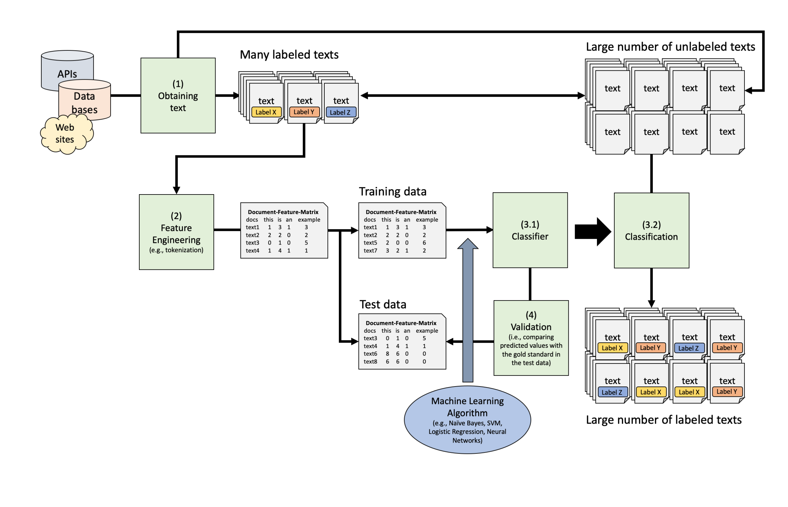
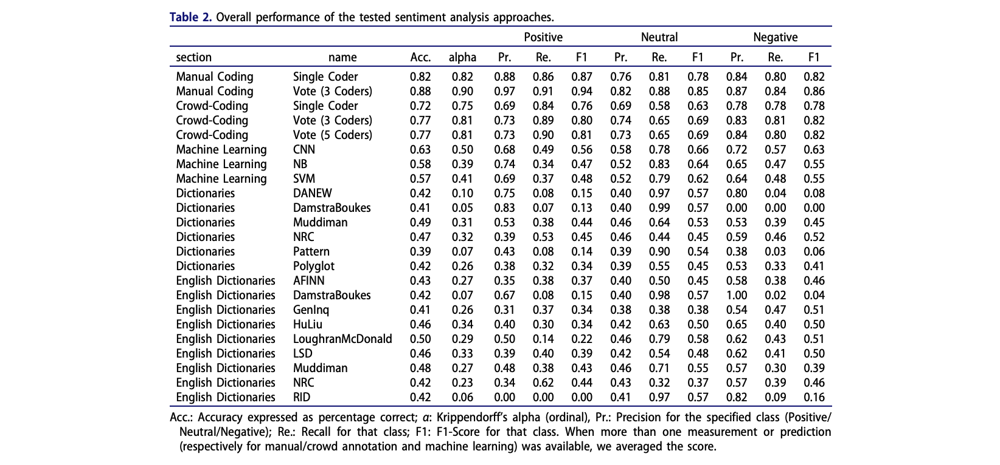

```{r, echo=F, message=F}
knitr::opts_chunk$set(echo = TRUE, results = FALSE, eval = F, message = FALSE, warning = FALSE, fig.keep = "none")
library(printr)
```


# Introduction

In supervised text classification, 
we train a statistical model on the *features* of our data (e.g. the word frequencies)
to predict the *class* of our texts (e.g. the sentiment). As mentioned in the lecture, the general workflow can be visualized like this:

 

In this tutorial, we are going to further practice using different supervised learning approaches to classify/code text. We are also going to specify a first neural network, which hopefully will perform a bit better than some simpler algorithms.

A small reminder: In supervised text classification, we train a statistical model on the *features* of our data (e.g. the word frequencies) to predict the *class* of our texts (e.g. the sentiment, topic,...). We thus need annotated data that we can use to train and test the algorithm. 

For this tutorial, we will use the same data set that you are already familiar with based on your homework. It is the dataset published by Wouter van Atteveldt, Mariken van der Velden and Mark Boukes that is connected to thei publication [The Validity of Sentiment Analysis](https://raw.githubusercontent.com/vanatteveldt/ecosent/master/report/atteveldt_sentiment.pdf). Remember: they tested different methods' validity in assessing the sentiment in Dutch newspaper headlines. The main results are presented in this table:



In this tutorial, we are trying to recreate two of the machine learning approaches, namely support vector machines and neural networks (note that the authors fitted a convolutional neural network with, among other things, an embedding layer which is definitely superior to what we will do in this tutorial.)


# Preparation

## Packages

We again need to load the packages that we already encountered in our last practical session.

```{r}
# Needed packages
library(tidyverse)
library(tidytext)
library(tidymodels)
library(textrecipes)

```

## Data 

Now, we can simply load the data from the respective github repository with the following code: 

```{r}

# Load data
url <- "https://raw.githubusercontent.com/vanatteveldt/ecosent/master/data/intermediate/sentences_ml.csv"
d <- read_csv(url) |> 
  select(doc_id = id, text = headline, lemmata, sentiment=value)  |> 
  mutate(doc_id = as.character(doc_id),
         sentiment = factor(sentiment, levels = c(-1, 0, 1)))
head(d)
```

Here, we already did some minor preprocessing, including renaming some variables, and changing the gold standard from numeric to factor (which the tidymodels approach needs).

## Splitting into training and test data

As always, we first need to split our data into a training and a test data set. We simply choose a split-half approach for now: 

```{r}
# To ensure replicability
set.seed(42)

# Sample 
split <- initial_split(d, prop = .50)
```


# The Validity of Different Machine Learning Approaches for Sentiment Analysis

Now, we are ready to engage with the actual classification. 

## Create recipe

First, we again use the package `textrecipes` (hopefully everyone now has the ability to use it?). For now, we simply:

1. Tokenize into words (bag-of-word model)
2. Create the document-feature matrix
3. Normalize all features

```{r}
rec <- recipe(sentiment ~ lemmata, data = d) |> 
  step_tokenize(lemmata) |> 
  step_tf(all_predictors())  |> 
  step_normalize(all_predictors())
```


## Fitting different algorithms

Now, we create two workflows. One for a linear support vector machine and one for a neural network (400 epochs, one hidden layer with 6 nodes). Both fitting processes might take a moment. So be patient. 

```{r}
set.seed(42)

# SVM with workflow
library(LiblineaR)
svm_workflow <- workflow() |> 
  add_recipe(rec) |> 
  add_model(svm_linear(mode = "classification", 
                       engine = "LiblineaR"))

# Fitting the SVM model
m_svm <- fit(svm_workflow, data = training(split))

# Neural network with workflow
mlp_spec <- mlp(epochs = 600,          # <- times that algorithm will work through train set
                hidden_units = c(6),   # <- nodes in hidden units
                penalty = 0.01,        # <- regularization
                learn_rate = 0.2) |>   # <- shrinkage
  set_engine("brulee") |>    # <- engine = R package
  set_mode("classification")

mlp_workflow <- workflow() |> 
  add_recipe(rec) |> 
  add_model(mlp_spec)

# Fitting the neural network
m_mlp <- fit(mlp_workflow, data = training(split))

```


## Performance of the algorithms

Now, we want to test the resulting classifier on the test data set. We again use the function `predict` and add the original gold standard to the resulting vector. We then bind both resulting data sets together, add labels, and plot results. 

```{r}
# Testing the SVM
predict_svm <- predict(m_svm, testing(split)) |>    
  bind_cols(select(testing(split), sentiment)) |>                    
  rename(predicted=.pred_class, actual=sentiment) 
predict_svm

# Testing the MLP
predict_mlp <- predict(m_mlp, testing(split)) |>    
  bind_cols(select(testing(split), sentiment)) |>                    
  rename(predicted=.pred_class, actual=sentiment) 
predict_mlp
```

Good. Both classifier predict the sentiment. Let's investigate their performance:


```{r}
# Set relevant performance scores
class_metrics <- metric_set(accuracy, precision, recall, f_meas)

predict_svm |> 
  class_metrics(truth = actual, estimate = predicted)

predict_mlp |> 
  class_metrics(truth = actual, estimate = predicted)


# Plot results
bind_rows(
  class_metrics(predict_svm, truth = actual, estimate = predicted) |> 
    mutate(algorithm = "Support Vector Machines"),
  class_metrics(predict_mlp, truth = actual, estimate = predicted) |> 
    mutate(algorithm = "Neural Network")
  ) |> 
  ggplot(aes(x = .metric, y = .estimate, label = round(.estimate, 2), fill = algorithm)) +
  geom_col(alpha = .8, position = position_dodge()) +
  geom_text(position = position_dodge(width = .75)) +
  coord_flip() +
  ylim(0, 1) +
  labs(x = "", y = "Score") +
  theme_minimal()
```

**Small question:** What do we see here? Which algorithm performs better? Is the overall performance good?


## Performance per class

A question is now, how did we do in comparison to the authors of the original paper? We can already directly compare accuracy from our results:

| Algorithm               | Van Atteveldt et al. | Our results |
| :---------------------- | -------------------- | ----------- |
| Support Vector Machines |  0.57                |  0.49       |
| Neural network          |  0.63                |  0.54       |

As we can see, our models perform worse, but the difference between SVM and the neural network are similar. Precision, recall, and F-Score are reported per predicted class in the paper and not averaged across them. We can get these grouped values as well. We only need to group by `predicted` when estimating the relevant performance scores. Below, there is the code to get the relevant precision values. How does compare to the results by van Atteveldt et al.?


```{r, warning = F}
# Confusion matrix for SVM
predict_svm |> 
  conf_mat(truth = actual, estimate = predicted)

# Precision per class
predict_svm |> 
  group_by(predicted) |> 
  precision(truth = actual, estimate = predicted)

# Confusion matrix for MLP
predict_svm |> 
  conf_mat(truth = actual, estimate = predicted)

# Precision per class
predict_mlp |> 
  group_by(predicted) |> 
  precision(truth = actual, estimate = predicted)
```


There are many reasons for the differences in performance of the models original paper and our models here. Among other things, the following things differed:

- The authors used a different training/testing split
- They used tf-idf instead of simply tf weighting
- They may have used different hyperparameters for the SVM
- They fitted a convolutional neural network instead of a simple multilayer perceptron, which is a deep learning method and thus should perform better. 


## Changing the training/testing split

Let's investigate whether we cannot get closer to the performance reported by the authors. As mentioned, they did not use the "split-half" method to split their data set into training and test stead. Instead, they used 6,038 newspaper headlines to train the algorithms and only 300 to test them. In their github repository, there is a small data set containing the 300 gold standard headlines. Let's quickly load them and use them to create our test and train set. 

```{r}
gold <- read_csv("https://raw.githubusercontent.com/vanatteveldt/ecosent/master/data/intermediate/gold.csv")

train_data2 <- d |> filter(!doc_id %in% gold$id)
test_data2 <- d |> filter(doc_id %in% gold$id)
```

**Exercise:** Can you refit both algorithms to this new training set and test on the new test set (this may take a bit longer as the training data is larger!)? How does it affect the performance? Can you plot performance scores from these two new models against the two previous models?

```{r}
# Code here
```


## Grid search

In the paper, the authors report that they did a grid-search for finding the best specification of hyperparameters. Let's do the same on a smaller scale for the neural network. Important:

- The authors used a 5-fold cross-validation in their grid search. We will only do 2-fold cross-validation to shorten the computation time. 
- They probably explored more parameters, we will only investigate the following:

    - 600 to 1000 epochs (more vs less learning cycles)
    - 6 to 32 nodes in the hidden layer (larger vs. smaller hidden layer)
    - penalty between 0.0001 and 0.1

We can set this up as follows: First, we need to create a new neural network model function, in which all paramters that we want to tune do not receive a value, but instead the function `tune`. 

```{r}
# Create a new neural network model with "tuning" parameters
mlp_tune <- mlp(hidden_units = tune(),     
                penalty = tune(),
                epochs = tune(),
                learn_rate = 0.2) |> 
  set_engine("brulee", trace = 0) |>  
  set_mode("classification")
```

Next, we create a new workflow with this model. The recipe stays them same, so we don't have to create it again. 

```{r}
# Create new workflow
mlp_wflow_tune <- workflow() |> 
  add_recipe(rec) |> 
  add_model(mlp_tune)
```

In a third step, we need to extract the parameters from the model function and set the limits of the tuning parameters (here 400-800 for epochs, and 6-12 for hidden units). We also define accuracy as the metric of interest and create the 2-fold cross-validation split object.

```{r}
# Adjust parameter extremes
mlp_param <- mlp_wflow_tune  |>  
  extract_parameter_set_dials() |> 
  update(epochs = epochs(c(100, 600)),
         hidden_units = hidden_units(c(6, 18)),
         penalty = penalty(c(-5, -1)))

# Set metric of interest
acc <- metric_set(accuracy)

# Define resampling strategy
twofold <- vfold_cv(train_data2, v = 2)
```

Finally, we use the function `tune_grid` to estimate all model combinations. Within this function, we provide the resamples (our 2-fold cross-validation object) and the actual grid. As we defined the limits of the grid earlier, the actual grid is defined by the function `grid_regular`, which asked us to provide the number of levels between those limits that should be used. We only provide 2 levels for both parameters, which will results in the actual limits we defined earlier. It makes sense to quickly check this before actually running the grid search to make sure only models that we care about are estimated. In this case, we estimate 4 models and each 2 times (given the 2-fold cross-validation), resulting in 8 overall fits. 


```{r}
# Check combinations
mlp_param  |>  
      grid_regular(levels = c(hidden_units = 3, penalty = 2, epochs = 2))

# Run the tuning process (lean back, this will take a while as 3*2*2*2 = 24 neural networks need to be trained)
mlp_reg_tune <- mlp_wflow_tune  |> 
  tune_grid(
    resamples = twofold,
    grid = mlp_param  |>  
      grid_regular(levels = c(hidden_units = 3, penalty = 2, epochs = 2)),
    metrics = acc
  )
```


Using the function `show_best`, we can now check which combination of the hyperparameters resulted in the highest accuracy score. It seems that 12 nodes in the hidden layer, but a lower number of epochs results in the best performance. 

```{r}
# Which specification resulted in the highest performance?
mlp_reg_tune |> 
  show_best()

# Plot
mlp_reg_tune |> 
  show_best(n = 32) |> 
  ggplot(aes(x = factor(hidden_units), y = mean)) +
  geom_point() +
  geom_line(group = 1) +
  facet_grid(penalty~epochs) +
  labs(x = "Number of nodes in hidden layer", y = "Accuracy",
       color = "Penalty")
```

The best combination seems to be 12 nodes in the hidden layer, a penalty of 0.1 and 100 epochs. 
Yet, we cannot get much closer to the value reported by van Atteveldt and colleagues (again not too suprising, given their better approach to use a more advanced convolutional neural network). 

Important: The `tune_grid` function doesn't actually train the model. We hence would now choose the best combination and retrain this particular model to become our classifier. As you can see, finding the best combination can take time (and computational power). Rather than blinding creating large grids, we should careful think about good choices and what we actually would like to achieve. 

