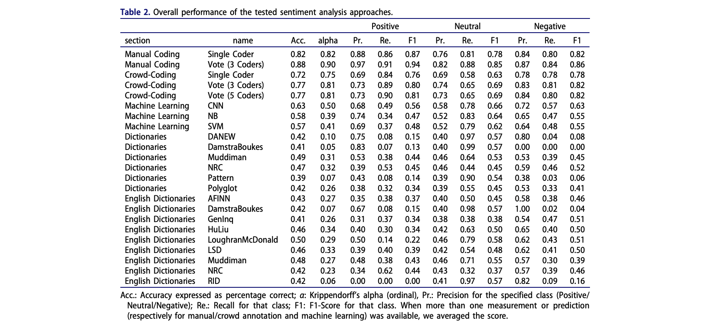
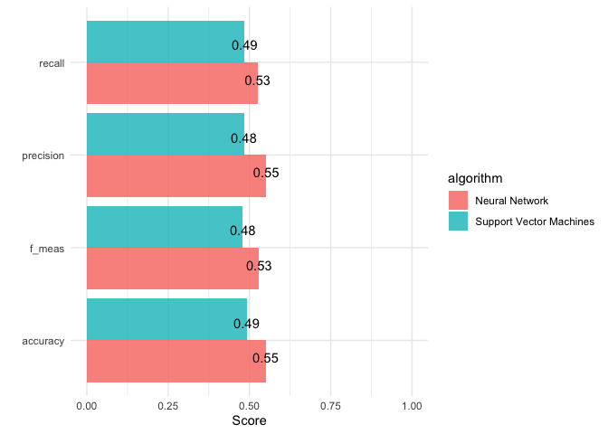
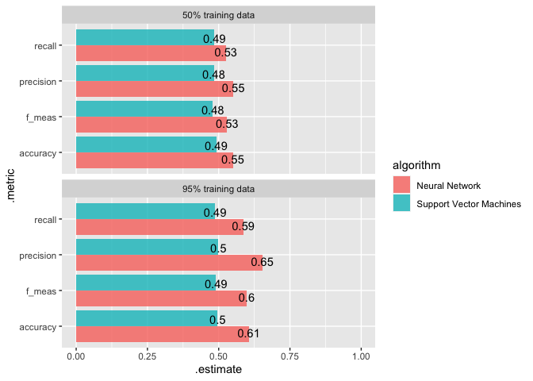
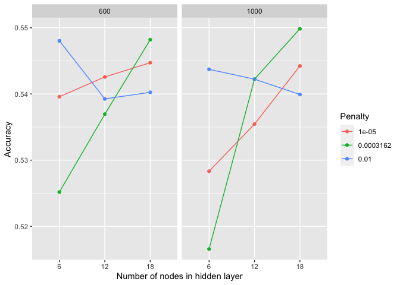

Supervised Text Classification II
================
Philipp K. Masur
2023-11

- [Introduction](#introduction)
- [Preparation](#preparation)
  - [Packages](#packages)
  - [Data](#data)
  - [Splitting into training and test
    data](#splitting-into-training-and-test-data)
- [The Validity of Different Machine Learning Approaches for Sentiment
  Analysis](#the-validity-of-different-machine-learning-approaches-for-sentiment-analysis)
  - [Create recipe](#create-recipe)
  - [Fitting different algorithms](#fitting-different-algorithms)
  - [Performance of the algorithms](#performance-of-the-algorithms)
  - [Performance per class](#performance-per-class)
  - [Changing the training/testing
    split](#changing-the-trainingtesting-split)
  - [Grid search](#grid-search)

# Introduction

In this tutorial, we are going to further practice using different
supervised learning approaches to classify/code text. We are also going
to specify a first neural network, which hopefully will perform a bit
better than some simpler algorithms.

A small reminder: In supervised text classification, we train a
statistical model on the *features* of our data (e.g. the word
frequencies) to predict the *class* of our texts (e.g. the sentiment,
topic,…). We thus need annotated data that we can use to train and test
the algorithm.

For this tutorial, we will use the same data set that you are already
familiar with based on your homework. It is the dataset published by
Wouter van Atteveldt, Mariken van der Velden and Mark Boukes that is
connected to thei publication [The Validity of Sentiment
Analysis](https://raw.githubusercontent.com/vanatteveldt/ecosent/master/report/atteveldt_sentiment.pdf).
Remember: they tested different methods’ validity in assessing the
sentiment in Dutch newspaper headlines. The main results are presented
in this table:



In this tutorial, we are trying to recreate two of the machine learning
approaches, namely support vector machines and neural networks (note
that the authors fitted a convolutional neural network with, among other
things, an embedding layer which is definitely superior to what we will
do in this tutorial.)

# Preparation

## Packages

We again need to load the packages that we already encountered in our
last practical session.

``` r
# Needed packages
library(tidyverse)
library(tidytext)
library(tidymodels)
library(textrecipes)
```

## Data

Now, we can simply load the data from the respective github repository
with the following code:

``` r
# Load data
url <- "https://raw.githubusercontent.com/vanatteveldt/ecosent/master/data/intermediate/sentences_ml.csv"
d <- read_csv(url) |> 
  select(doc_id = id, text = headline, lemmata, sentiment=value)  |> 
  mutate(doc_id = as.character(doc_id),
         sentiment = factor(sentiment, levels = c(-1, 0, 1)))
head(d)
```

| doc_id | text                                                  | lemmata                                              | sentiment |
|:-------|:------------------------------------------------------|:-----------------------------------------------------|:----------|
| 10007  | Rabobank voorspelt flinke stijging hypotheekrente     | Rabobank voorspellen flink stijging hypotheekrente   | 0         |
| 10027  | D66 wil reserves provincies aanspreken voor groei     | D66 willen reserve provincie aanspreken voor groei   | 0         |
| 10037  | UWV: dit jaar meer banen                              | UWV dit jaar veel baan                               | 1         |
| 10059  | Proosten op geslaagde beursgang Bols                  | proost op geslaagd beursgang bols                    | 1         |
| 10099  | Helft werknemers gaat na 65ste met pensioen           | helft werknemer gaan na 65ste met pensioen           | 0         |
| 10101  | Europa groeit voorzichtig dankzij lage energieprijzen | Europa groeien voorzichtig dankzij laag energieprijs | 1         |

Here, we already did some minor preprocessing, including renaming some
variables, and changing the gold standard from numeric to factor (which
the tidymodels approach needs).

## Splitting into training and test data

As always, we first need to split our data into a training and a test
data set. We simply choose a split-half approach for now:

``` r
# To ensure replicability
set.seed(42)

# Sample 
split <- initial_split(d, prop = .50)
```

# The Validity of Different Machine Learning Approaches for Sentiment Analysis

Now, we are ready to engage with the actual classification.

## Create recipe

First, we again use the package `textrecipes` (hopefully everyone now
has the ability to use it?). For now, we simply:

1.  Tokenize into words (bag-of-word model)
2.  Create the document-feature matrix
3.  Normalize all features

``` r
rec <- recipe(sentiment ~ lemmata, data = d) |> 
  step_tokenize(lemmata) |> 
  step_tf(all_predictors())  |> 
  step_normalize(all_predictors())
```

## Fitting different algorithms

Now, we create two workflows. One for a linear support vector machine
and one for a neural network (400 epochs, one hidden layer with 6
nodes). Both fitting processes might take a moment. So be patient.

``` r
set.seed(42)

# SVM with workflow
library(LiblineaR)
svm_workflow <- workflow() |> 
  add_recipe(rec) |> 
  add_model(svm_linear(mode = "classification", 
                       engine = "LiblineaR"))
m_svm <- fit(svm_workflow, data = training(split))

# Neural network with workflow
mlp_spec <- mlp(epochs = 600,          # <- times that algorithm will work through train set
                hidden_units = c(6),   # <- nodes in hidden units
                penalty = 0.01,        # <- regularization
                learn_rate = 0.2) |>   # <- shrinkage
  set_engine("brulee") |>    # <- engine = R package
  set_mode("classification")
mlp_workflow <- workflow() |> 
  add_recipe(rec) |> 
  add_model(mlp_spec)
m_mlp <- fit(mlp_workflow, data = training(split))
```

## Performance of the algorithms

Now, we want to test the resulting classifier on the test data set. We
again use the function `predict` and add the original gold standard to
the resulting vector. We then bind both resulting data sets together,
add labels, and plot results.

``` r
# Testing the SVM
predict_svm <- predict(m_svm, testing(split)) |>    
  bind_cols(select(testing(split), sentiment)) |>                    
  rename(predicted=.pred_class, actual=sentiment) 

# Testing the MLP
predict_mlp <- predict(m_mlp, testing(split)) |>    
  bind_cols(select(testing(split), sentiment)) |>                    
  rename(predicted=.pred_class, actual=sentiment) 

# Set relevant performance scores
class_metrics <- metric_set(accuracy, precision, recall, f_meas)


# Plot results
bind_rows(
  class_metrics(predict_svm, truth = actual, estimate = predicted) |> 
    mutate(algorithm = "Support Vector Machines"),
  class_metrics(predict_mlp, truth = actual, estimate = predicted) |> 
    mutate(algorithm = "Neural Network")
  ) |> 
  ggplot(aes(x = .metric, y = .estimate, label = round(.estimate, 2), fill = algorithm)) +
  geom_col(alpha = .8, position = position_dodge()) +
  geom_text(position = position_dodge(width = .75)) +
  coord_flip() +
  ylim(0, 1) +
  labs(x = "", y = "Score") +
  theme_minimal()
```

<!-- -->

**Small question:** What do we see here? Which algorithm performs
better? Is the overall performance good?

## Performance per class

A question is now, how did we do in comparison to the authors of the
original paper? We can already directly compare accuracy from our
results:

| Algorithm               | Van Atteveldt et al. | Our results |
|:------------------------|----------------------|-------------|
| Support Vector Machines | 0.57                 | 0.49        |
| Neural network          | 0.63                 | 0.54        |

As we can see, our models perform worse, but the difference between SVM
and the neural network are similar. Precision, recall, and F-Score are
reported per predicted class in the paper and not averaged across them.
We can get these grouped values as well. We only need to group by
`predicted` when estimating the relevant performance scores. Below,
there is the code to get the relevant precision values. How does compare
to the results by van Atteveldt et al.?

``` r
# Confusion matrix for SVM
predict_svm |> 
  conf_mat(truth = actual, estimate = predicted)
```

    ##           Truth
    ## Prediction  -1   0   1
    ##         -1 397 294 104
    ##         0  420 780 257
    ##         1  223 310 376

``` r
# Precision per class
predict_svm |> 
  group_by(predicted) |> 
  precision(truth = actual, estimate = predicted)
```

| predicted | .metric   | .estimator | .estimate |
|:----------|:----------|:-----------|----------:|
| -1        | precision | macro      | 0.4993711 |
| 0         | precision | macro      | 0.5353466 |
| 1         | precision | macro      | 0.4136414 |

``` r
# Confusion matrix for MLP
predict_svm |> 
  conf_mat(truth = actual, estimate = predicted)
```

    ##           Truth
    ## Prediction  -1   0   1
    ##         -1 397 294 104
    ##         0  420 780 257
    ##         1  223 310 376

``` r
# Precision per class
predict_mlp |> 
  group_by(predicted) |> 
  precision(truth = actual, estimate = predicted)
```

| predicted | .metric   | .estimator | .estimate |
|:----------|:----------|:-----------|----------:|
| -1        | precision | macro      | 0.5613333 |
| 0         | precision | macro      | 0.5460674 |
| 1         | precision | macro      | 0.5467512 |

There are many reasons for the differences in performance of the models
original paper and our models here. Among other things, the following
things differed:

- The authors used a different training/testing split
- They used tf-idf instead of simply tf weighting
- They may have used different hyperparameters for the SVM
- They fitted a convolutional neural network instead of a simple
  multilayer perceptron, which is a deep learning method and thus should
  perform better.

## Changing the training/testing split

Let’s investigate whether we cannot get closer to the performance
reported by the authors. As mentioned, they did not use the “split-half”
method to split their data set into training and test stead. Instead,
they used 6,038 newspaper headlines to train the algorithms and only 300
to test them. In their github repository, there is a small data set
containing the 300 gold standard headlines. Let’s quickly load them and
use them to create our test and train set.

``` r
gold <- read_csv("https://raw.githubusercontent.com/vanatteveldt/ecosent/master/data/intermediate/gold.csv")

train_data2 <- d |> filter(!doc_id %in% gold$id)
test_data2 <- d |> filter(doc_id %in% gold$id)
```

**Exercise:** Can you refit both algorithms to this new training set and
test on the new test set (this may take a bit longer as the training
data is larger!)? How does it affect the performance? Can you plot
performance scores from these two new models against the two previous
models?

``` r
# SVM with workflow
m_svm2 <- fit(svm_workflow, data = train_data2)

# Neural network with workflow
m_mlp2 <- fit(mlp_workflow, data = train_data2)

# Testing the SVM
predict_svm2 <- predict(m_svm2, test_data2) |>    
  bind_cols(select(test_data2, sentiment)) |>                    
  rename(predicted=.pred_class, actual=sentiment) 

# Testing the MLP
predict_mlp2 <- predict(m_mlp2, test_data2) |>    
  bind_cols(select(test_data2, sentiment)) |>                    
  rename(predicted=.pred_class, actual=sentiment) 

# Plot
bind_rows(
  class_metrics(predict_svm, truth = actual, estimate = predicted) |> 
    mutate(algorithm = "Support Vector Machines",
           recipe = "50% training data"),
  class_metrics(predict_mlp, truth = actual, estimate = predicted) |> 
    mutate(algorithm = "Neural Network",
           recipe = "50% training data"),
  class_metrics(predict_svm2, truth = actual, estimate = predicted) |> 
    mutate(algorithm = "Support Vector Machines",
           recipe = "95% training data"),
  class_metrics(predict_mlp2, truth = actual, estimate = predicted) |> 
    mutate(algorithm = "Neural Network",
           recipe = "95% training data")
  ) |> 
  ggplot(aes(x = .metric, y = .estimate, label = round(.estimate, 2), fill = algorithm)) +
  geom_col(alpha = .8, position = position_dodge()) +
  geom_text(position = position_dodge(width = .75)) +
  coord_flip() +
  facet_wrap(~recipe, nrow = 2) +
  ylim(0, 1)
```

<!-- -->

## Grid search

In the paper, the authors report that they did a grid-search for finding
the best specification of hyperparameters. Let’s do the same on a
smaller scale for the neural network. Important:

- The authors used a 5-fold cross-validation in their grid search. We
  will only do 2-fold cross-validation to shorten the computation time.

- They probably explored more paramters, we will only investigate the
  following:

  - 600 to 1000 epochs (more vs less learning cycles)
  - 6 to 32 nodes in the hidden layer (larger vs. smaller hidden layer)
  - penalty between 0.0001 and 0.1

We can set this up as follows: First, we need to create a new neural
network model function, in which all paramters that we want to tune do
not receive a value, but instead the function `tune`.

``` r
# Create a new neural network model with "tuning" parameters
mlp_tune <- mlp(hidden_units = tune(),     
                penalty = tune(),
                epochs = tune(),
                learn_rate = 0.2) |> 
  set_engine("brulee", trace = 0) |>  
  set_mode("classification")
```

Next, we create a new workflow with this model. The recipe stays them
same, so we don’t have to create it again.

``` r
# Create new workflow
mlp_wflow_tune <- workflow() |> 
  add_recipe(rec) |> 
  add_model(mlp_tune)
```

In a third step, we need to extract the parameters from the model
function and set the limits of the tuning parameters (here 400-800 for
epochs, and 6-12 for hidden units). We also define accuracy as the
metric of interest and create the 2-fold cross-validation split object.

``` r
# Adjust parameter extremes
mlp_param <- mlp_wflow_tune  |>  
  extract_parameter_set_dials() |> 
  update(epochs = epochs(c(600, 1000)),
         hidden_units = hidden_units(c(6, 18)),
         penalty = penalty(c(-5, -2)))

# Set metric of interest
acc <- metric_set(accuracy)

# Define resampling strategy
twofold <- vfold_cv(train_data2, v = 2)
```

Finally, we use the function `tune_grid` to estimate all model
combinations. Within this function, we provide the resamples (our 2-fold
cross-validation object) and the actual grid. As we defined the limits
of the grid earlier, the actual grid is defined by the function
`grid_regular`, which asked us to provide the number of levels between
those limits that should be used. We only provide 2 levels for both
parameters, which will results in the actual limits we defined earlier.
It makes sense to quickly check this before actually running the grid
search to make sure only models that we care about are estimated. In
this case, we estimate 4 models and each 2 times (given the 2-fold
cross-validation), resulting in 8 overall fits.

``` r
# Check combinations
mlp_param  |>  
      grid_regular(levels = c(hidden_units = 3, penalty = 3, epochs = 2))
```

| hidden_units |   penalty | epochs |
|-------------:|----------:|-------:|
|            6 | 0.0000100 |    600 |
|           12 | 0.0000100 |    600 |
|           18 | 0.0000100 |    600 |
|            6 | 0.0003162 |    600 |
|           12 | 0.0003162 |    600 |
|           18 | 0.0003162 |    600 |
|            6 | 0.0100000 |    600 |
|           12 | 0.0100000 |    600 |
|           18 | 0.0100000 |    600 |
|            6 | 0.0000100 |   1000 |
|           12 | 0.0000100 |   1000 |
|           18 | 0.0000100 |   1000 |
|            6 | 0.0003162 |   1000 |
|           12 | 0.0003162 |   1000 |
|           18 | 0.0003162 |   1000 |
|            6 | 0.0100000 |   1000 |
|           12 | 0.0100000 |   1000 |
|           18 | 0.0100000 |   1000 |

``` r
# Run the tuning process (lean back, this will take a while as 18 * 2 = 36 neural networks need to be trained)
mlp_reg_tune <- mlp_wflow_tune  |> 
  tune_grid(
    resamples = twofold,
    grid = mlp_param  |>  
      grid_regular(levels = c(hidden_units = 3, penalty = 3, epochs = 2)),
    metrics = acc
  )
```

Using the function `show_best`, we can now check which combination of
the hyperparameters resulted in the highest accuracy score. It seems
that 12 nodes in the hidden layer, but a lower number of epochs results
in the best performance.

``` r
# Which specification resulted in the highest performance?
mlp_reg_tune |> 
  show_best()
```

| hidden_units |   penalty | epochs | .metric  | .estimator |      mean |   n |   std_err | .config               |
|-------------:|----------:|-------:|:---------|:-----------|----------:|----:|----------:|:----------------------|
|           18 | 0.0003162 |   1000 | accuracy | multiclass | 0.5498509 |   2 | 0.0013249 | Preprocessor1_Model15 |
|           18 | 0.0003162 |    600 | accuracy | multiclass | 0.5481948 |   2 | 0.0000000 | Preprocessor1_Model06 |
|            6 | 0.0100000 |    600 | accuracy | multiclass | 0.5480291 |   2 | 0.0051342 | Preprocessor1_Model07 |
|           18 | 0.0000100 |    600 | accuracy | multiclass | 0.5447168 |   2 | 0.0031467 | Preprocessor1_Model03 |
|           18 | 0.0000100 |   1000 | accuracy | multiclass | 0.5442199 |   2 | 0.0066247 | Preprocessor1_Model12 |

``` r
# Plot
mlp_reg_tune |> 
  show_best(n = 32) |> 
  ggplot(aes(x = factor(hidden_units), y = mean, 
             color = factor(round(penalty, 7)), group = penalty)) +
  geom_point() +
  geom_line() +
  facet_wrap(~epochs) +
  labs(x = "Number of nodes in hidden layer", y = "Accuracy",
       color = "Penalty")
```

<!-- -->

The best combination seems to be 12 nodes in the hidden layer, a penalty
of 0.01 and 1000 epochs. Yet, we cannot get much closer to the value
reported by van Atteveldt and colleagues (again not too suprising, given
their better approach to use a more advanced convolutional neural
network).

Important: The `tune_grid` function doesn’t actually train the model. We
hence would now choose the best combination and retrain this particular
model to become our classifier. As you can see, finding the best
combination can take time (and computational power). Rather than
blinding creating large grids, we should careful think about good
choices and what we actually would like to achieve.
