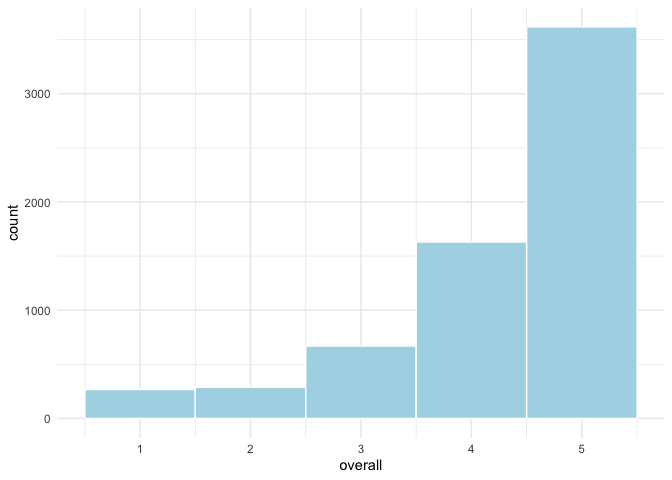
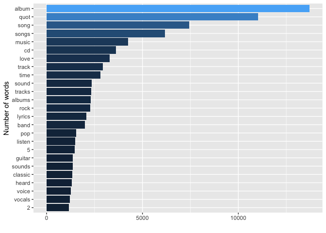
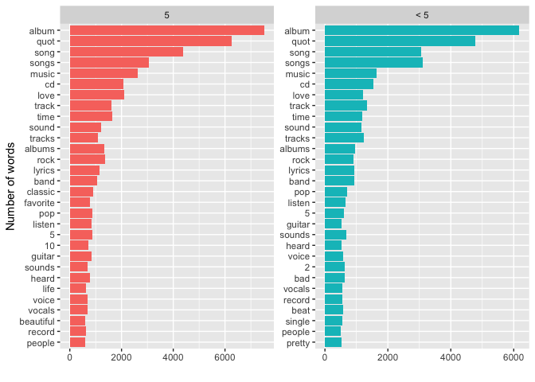
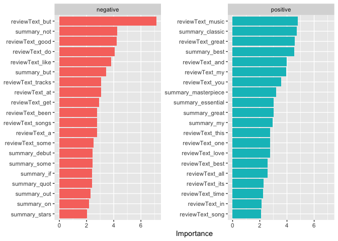
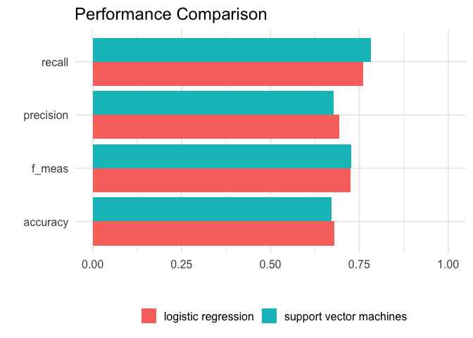

Supervised Text Classification (completed)
================
Philipp Masur, Wouter van Atteveldt & Kasper Welbers
2023-11

- [Introduction](#introduction)
- [Getting Amazon Review Data](#getting-amazon-review-data)
- [Data Preprocessing](#data-preprocessing)
  - [Splitting into training and test
    data](#splitting-into-training-and-test-data)
- [Supervised Machine Learning](#supervised-machine-learning)
  - [Building a recipe](#building-a-recipe)
  - [Training the algorithm](#training-the-algorithm)
  - [Validating on the test data](#validating-on-the-test-data)
  - [Note on Understanding
    TidyModels](#note-on-understanding-tidymodels)

# Introduction

In supervised text classification, we train a statistical model on the
*features* of our data (e.g. the word frequencies) to predict the
*class* of our texts (e.g. the sentiment). As mentioned in the lecture,
the general workflow can be visualized like this:


It involves training an algorithm (e.g., Naive Bayes, Logistic
Regression, Support Vector Machines, Neural Network…) on a labeled data
set to build a classifier that then has the ability to label new data on
its own.

While building the classifier, we directly include validation steps by
splitting the labeled data into a training and testing set. We train the
algorithm on the training set and validate it with the unseen test set.

For this example, we will use functions from the `tidymodels` package
collection. The benefit of using this package collection is that its
syntax follows the tidyverse-style that we are already familiar with.
Although it otherwise involves a bit more steps than other packages,
using tidymodels allows more flexibility in selecting and tuning the
best models.

# Getting Amazon Review Data

For this example, we will use Amazon reviews. These reviews have the
benefit of being relatively straightforward and explicit in their
expressed sentiment (e.g. compared to parliamentary speeches), and there
is a large amount of existing reviews that can be downloaded.

We use the reviews from [Amazon Review
Dataset](https://nijianmo.github.io/amazon/index.html) (scroll down to
the ‘small’ data sets which are freely available). These reviews are
stored in gzipped json-lines format, meaning it is a compressed file in
which each line is a json document. This sounds complicated, but you can
directly read this into an R data frame using the `jsonlite::stream_in`
function on the url using the `gzcon` function to decompress.

For this example, we pick the digital music category, mostly because it
is relatively small and still interesting. If you select a category with
more data, it will take longer to download and run the models, but
results might well be better.

``` r
library(tidyverse)
library(tidytext)
library(tidymodels)
```

``` r
reviews <- jsonlite::stream_in(gzcon(url("http://snap.stanford.edu/data/amazon/productGraph/categoryFiles/reviews_Digital_Music_5.json.gz"))) 
```

    ##  Found 500 records... Found 1000 records... Found 1500 records... Found 2000 records... Found 2500 records... Found 3000 records... Found 3500 records... Found 4000 records... Found 4500 records... Found 5000 records... Found 5500 records... Found 6000 records... Found 6500 records... Found 7000 records... Found 7500 records... Found 8000 records... Found 8500 records... Found 9000 records... Found 9500 records... Found 10000 records... Found 10500 records... Found 11000 records... Found 11500 records... Found 12000 records... Found 12500 records... Found 13000 records... Found 13500 records... Found 14000 records... Found 14500 records... Found 15000 records... Found 15500 records... Found 16000 records... Found 16500 records... Found 17000 records... Found 17500 records... Found 18000 records... Found 18500 records... Found 19000 records... Found 19500 records... Found 20000 records... Found 20500 records... Found 21000 records... Found 21500 records... Found 22000 records... Found 22500 records... Found 23000 records... Found 23500 records... Found 24000 records... Found 24500 records... Found 25000 records... Found 25500 records... Found 26000 records... Found 26500 records... Found 27000 records... Found 27500 records... Found 28000 records... Found 28500 records... Found 29000 records... Found 29500 records... Found 30000 records... Found 30500 records... Found 31000 records... Found 31500 records... Found 32000 records... Found 32500 records... Found 33000 records... Found 33500 records... Found 34000 records... Found 34500 records... Found 35000 records... Found 35500 records... Found 36000 records... Found 36500 records... Found 37000 records... Found 37500 records... Found 38000 records... Found 38500 records... Found 39000 records... Found 39500 records... Found 40000 records... Found 40500 records... Found 41000 records... Found 41500 records... Found 42000 records... Found 42500 records... Found 43000 records... Found 43500 records... Found 44000 records... Found 44500 records... Found 45000 records... Found 45500 records... Found 46000 records... Found 46500 records... Found 47000 records... Found 47500 records... Found 48000 records... Found 48500 records... Found 49000 records... Found 49500 records... Found 50000 records... Found 50500 records... Found 51000 records... Found 51500 records... Found 52000 records... Found 52500 records... Found 53000 records... Found 53500 records... Found 54000 records... Found 54500 records... Found 55000 records... Found 55500 records... Found 56000 records... Found 56500 records... Found 57000 records... Found 57500 records... Found 58000 records... Found 58500 records... Found 59000 records... Found 59500 records... Found 60000 records... Found 60500 records... Found 61000 records... Found 61500 records... Found 62000 records... Found 62500 records... Found 63000 records... Found 63500 records... Found 64000 records... Found 64500 records... Found 64706 records... Imported 64706 records. Simplifying...

``` r
reviews <- reviews |>  
   as_tibble() |>  
   sample_frac(size = .10) |>  # Just to increase speed, feel free to use larger parts or even the entire data set! But, be ready to wait...
  select(reviewerID, asin, overall, summary, reviewText)
head(reviews, n = 2)
```

| reviewerID     | asin       | overall | summary                                   | reviewText                                                                                                                                                                                                                                                                                                                                                                                                                                                                                                                                                                                                                                                                                                                                                                                                                                                                                                                                                              |
|:---------------|:-----------|--------:|:------------------------------------------|:------------------------------------------------------------------------------------------------------------------------------------------------------------------------------------------------------------------------------------------------------------------------------------------------------------------------------------------------------------------------------------------------------------------------------------------------------------------------------------------------------------------------------------------------------------------------------------------------------------------------------------------------------------------------------------------------------------------------------------------------------------------------------------------------------------------------------------------------------------------------------------------------------------------------------------------------------------------------|
| A264CMSE6CYHTF | B00000261N |       5 | reo speedwagon’s wheels are still turnin’ | i love this classic album by reo speedwagon. the songs are unforgettable. they remind me of when i was in middle school.songs like can’t fight this feeling,one lonely night,live every moment,rock n’ roll star,thru the window,gotta feel more and ido’wanna know are songs i wiil never forget. i’m happy i grew up with this album. ed wilsom                                                                                                                                                                                                                                                                                                                                                                                                                                                                                                                                                                                                                       |
| A3HOMQCJ2SFZ2  | B00000HZG9 |       5 | Automatic Classic\[.\]                    | I had to Re-Edit my review because I believe I didn’t put the real out there. This album is really good and I looked at my review and I was like this album is to great to be compared to the likes of Vol. 2 and I have to show the respects to this masterpiece.I totally agree with one reviewer that said that if you like Vol. 2 Hardknock Life then you will like Reasonable Doubt. They are not a like but in my opinion they are the two best of Jay-Z.Look this album had made a name for Jay on the streets and Vol. 2 made a name for Jay on an upper level and it reached the outer rim of the urban fans. These two have to be the best Jay albums ever made.Reasonable Doubt makes me wonder why he didn’t keep this style and keep it going….me personally I like the style of the jazz/rap that is so smooth and makes Jay sound perfect.If you don’t have this in your collection….then you seriously don’t know what you are missing.Peace Folks\[.\] |

``` r
# In case the stream in of the json file doesn't work, go to canvas, download the 
# review data set and load it directly into R by using the following line of code:
# reviews <- read_csv("reviews.csv")
```

In this file, `reviewID` identifies the user that placed the reivew,
`asin` identifies the reviewed product, `overall` is the amount of
stars, and `summary` and `reviewText` are the review text as entered by
the user. Taken together, `reviewID` and `asin` uniquely identify a row.

Let us quickly check, how often 5 stars are given.

``` r
reviews |> 
  ggplot(aes(x = overall)) +
  geom_histogram(bins = 5, fill = "lightblue", color = "white") +
  theme_minimal()
```

<!-- -->

``` r
table(reviews$overall < 5) |>  
  prop.table()
```

|     FALSE |      TRUE |
|----------:|----------:|
| 0.5591099 | 0.4408901 |

We can see that most reviews are really positive (5 stars!). The
training data may hence not provide much information to differentiate
e.g., reviews with a score of 3 from a score of 2.

Before proceeding to the text classification, we will thus compute a
binary target class (five-star or not) and create a text variable
combining the summary and review text:

``` r
reviews <- reviews |>  
  mutate(fivestar = factor(ifelse(overall == 5, "5", "< 5"), levels = c("5", "< 5")))
```

**Exercise 1:** What are the most used words in these reviews? How do
they differ between 5-star and less good reviews? Can you plot the
difference (either a wordcloud or a barplot).

``` r
# Most frequent words
reviews |> 
  unnest_tokens(word, reviewText) |> 
  anti_join(stop_words) |> 
  group_by(word) |> 
  summarize(n = n()) |> 
  arrange(-n) |> 
  slice_max(n, n = 25) |> 
  ggplot(aes(x = fct_reorder(word, n), y = n, fill = n)) +
  geom_col() +
  coord_flip() +
  labs(x = "Number of words",
       y = "") +
  theme(legend.position = "none")
```

<!-- -->

``` r
# Comparing most frequent words in 5 Star and < 5 Star reviews
reviews |> 
  unnest_tokens(word, reviewText) |> 
  anti_join(stop_words) |> 
  group_by(fivestar, word) |> 
  summarize(n = n()) |> 
  arrange(-n) |> 
  slice_max(n, n = 30) |> 
  ggplot(aes(x = fct_reorder(word, n), y = n, fill = fivestar)) +
  geom_col() +
  coord_flip() +
  facet_wrap(~fivestar, scales = "free") +
  labs(x = "Number of words",
       y = "") +
  theme(legend.position = "none")
```

<!-- -->

As we can see, many words are actually the same in both types of
reviews. After all, a very good review (=5) may not be that different
than one with 4 stars. That said, we see the word “bad” creeping up into
the top 25 most words in the reviews \< 5.

# Data Preprocessing

## Splitting into training and test data

Before we can train a model, we need to split the model into training
and text data. We do this with regular R and tidyverse functions, in
this case we sample from the row indices and use `slice` to select the
appropriate rows (using the negative selection for the test set to
select everything except for the training set):

``` r
# To ensure replicability
set.seed(42)

# Sample 
trainset <- initial_split(reviews, prop = .50)
reviews_train <- training(trainset)
reviews_test <- testing(trainset)
```

# Supervised Machine Learning

## Building a recipe

First, we use the package `textrecipes`, which is an extension of
tidymodels to create a so-called model and preprocessing recipe. This
involves the actual recipe, i.e., which outcome class (`fivestar`) is
predicted by which text columns (here, we use both the `summary` and the
actual `reviewText`), as well as all text-preprocessing steps that we
want to do. In this case, we will not do much, we simply:

1.  Tokenize into words (bag-of-word model)
2.  Filter out words that are mentioned less than 3 times and only keep
    the 1000 most frequent words
3.  Create the document-feature matrix

``` r
library(textrecipes)
rec <- recipe(fivestar ~ summary + reviewText, data=reviews) |>
  step_tokenize(all_predictors())  |>
  step_tokenfilter(all_predictors(), min_times = 3, max_tokens = 100) |>  # will speed up computation, but should be larger
  step_tf(all_predictors())
```

We can inspect the results of the preprocessing by prepping the recipe
and baking the training data (this will take a moment as it is a quite
large data set):

``` r
rec |> 
  prep(reviews) |>
  bake(new_data=NULL) |> 
  select(1:10) |> 
  head()
```

| fivestar | tf_summary_1 | tf_summary_2 | tf_summary_4.5 | tf_summary_a | tf_summary_again | tf_summary_album | tf_summary_albums | tf_summary_all | tf_summary_amazing |
|:---------|-------------:|-------------:|---------------:|-------------:|-----------------:|-----------------:|------------------:|---------------:|-------------------:|
| 5        |            0 |            0 |              0 |            0 |                0 |                0 |                 0 |              0 |                  0 |
| 5        |            0 |            0 |              0 |            0 |                0 |                0 |                 0 |              0 |                  0 |
| 5        |            0 |            0 |              0 |            0 |                0 |                0 |                 0 |              0 |                  0 |
| 5        |            0 |            0 |              0 |            0 |                0 |                0 |                 0 |              0 |                  0 |
| 5        |            0 |            0 |              0 |            0 |                0 |                0 |                 0 |              0 |                  0 |
| 5        |            0 |            0 |              0 |            0 |                0 |                0 |                 1 |              1 |                  0 |

## Training the algorithm

First, we create a worflow from the recipe and model specification.
Let’s start with model based on logistic regression:

``` r
library(discrim)
lr_workflow <- workflow() |>
  add_recipe(rec) |>
  add_model(logistic_reg(mixture = 0, penalty = 0.1,
                         engine = "glm"))
```

``` r
# Fit the model
m_lr <- fit(lr_workflow, data = reviews_train)
m_lr
```

    ## ══ Workflow [trained] ══════════════════════════════════════════════════════════
    ## Preprocessor: Recipe
    ## Model: logistic_reg()
    ## 
    ## ── Preprocessor ────────────────────────────────────────────────────────────────
    ## 3 Recipe Steps
    ## 
    ## • step_tokenize()
    ## • step_tokenfilter()
    ## • step_tf()
    ## 
    ## ── Model ───────────────────────────────────────────────────────────────────────
    ## 
    ## Call:  stats::glm(formula = ..y ~ ., family = stats::binomial, data = data)
    ## 
    ## Coefficients:
    ##            (Intercept)            tf_summary_1            tf_summary_2  
    ##             -0.2266203               1.2133141               0.2579540  
    ##         tf_summary_4.5            tf_summary_a        tf_summary_again  
    ##              0.0537105              -0.0698012              -0.1883622  
    ##       tf_summary_album       tf_summary_albums          tf_summary_all  
    ##             -0.1434886               0.6670980              -0.4518561  
    ##     tf_summary_amazing           tf_summary_an          tf_summary_and  
    ##             -1.2874946              -0.1634619              -0.0414580  
    ##     tf_summary_another          tf_summary_are           tf_summary_as  
    ##             -0.0196992               0.3573576              -0.0779304  
    ##          tf_summary_at         tf_summary_back           tf_summary_be  
    ##              0.5696129               0.5939486              -0.5542972  
    ##        tf_summary_best       tf_summary_better          tf_summary_but  
    ##             -1.0184903               0.3915976               0.8992500  
    ##          tf_summary_by          tf_summary_can           tf_summary_cd  
    ##             -0.8526963              -0.7172970              -0.2915841  
    ##     tf_summary_classic   tf_summary_collection        tf_summary_debut  
    ##             -1.5836834               0.0269989               0.8334404  
    ##     `tf_summary_don't`    tf_summary_essential         tf_summary_ever  
    ##             -0.0217611              -2.3766563              -0.1331096  
    ##   tf_summary_excellent          tf_summary_fan        tf_summary_first  
    ##             -0.2681552              -0.1037399               0.6396474  
    ##         tf_summary_for         tf_summary_from          tf_summary_get  
    ##              0.0478326               0.1266785              -0.4557522  
    ##        tf_summary_good          tf_summary_got        tf_summary_great  
    ##              0.3705290               0.2773937              -0.5682222  
    ##    tf_summary_greatest         tf_summary_have          tf_summary_her  
    ##              0.0803373              -0.5524711               0.4865472  
    ##        tf_summary_here          tf_summary_his            tf_summary_i  
    ##             -0.3654153              -0.3330552               0.0733597  
    ##       `tf_summary_i'm`           tf_summary_if           tf_summary_in  
    ##              0.5970915               1.0223086               0.2796478  
    ##          tf_summary_is           tf_summary_it       `tf_summary_it's`  
    ##             -0.1636517              -0.1422994              -0.1268437  
    ##         tf_summary_its         tf_summary_just         tf_summary_like  
    ##              0.1828582               0.3100404               0.1069504  
    ##        tf_summary_live         tf_summary_love  tf_summary_masterpiece  
    ##             -0.5218853               0.0834491              -2.5523679  
    ##          tf_summary_me         tf_summary_more         tf_summary_most  
    ##             -0.1887478               0.1847953               0.1175726  
    ##       tf_summary_music           tf_summary_my          tf_summary_new  
    ##             -0.2572954              -0.9867295               0.0067964  
    ##        tf_summary_nice           tf_summary_no          tf_summary_not  
    ##              0.4518545               0.4776509               1.1153382  
    ##         tf_summary_now           tf_summary_of           tf_summary_on  
    ##             -0.0198739              -0.0125481               0.5680053  
    ## 
    ## ...
    ## and 92 more lines.

The summary of the model already provides us with some idea about how it
predicted the outcome class: All words basically received a slope that
corresponds to it strength in contributing to the prediction.

## Validating on the test data

Let’s test it on the training data set (note, this should always yield
good results unless something went wrong)

``` r
# Predict outcome in test data
predict_lr <- predict(m_lr, new_data=reviews_test) |>
  bind_cols(select(reviews_test, fivestar)) |>
  rename(predicted=.pred_class, actual=fivestar) 
predict_lr |> 
  head()
```

| predicted | actual |
|:----------|:-------|
| \< 5      | 5      |
| 5         | 5      |
| 5         | 5      |
| \< 5      | \< 5   |
| \< 5      | \< 5   |
| \< 5      | \< 5   |

``` r
# Build confusion matrix
predict_lr |> 
  conf_mat(truth = actual, estimate = predicted)
```

    ##           Truth
    ## Prediction    5  < 5
    ##        5   1373  606
    ##        < 5  432  825

This results show us the confusion matrix. We can see that many review
were labeled correctly (e.g., of those with 5 stars 1307 were also
labeled as 5 stars), but there are also quite some false positives and
false negatives.

Creating and use the function `class_metrics`, we can get all
performance scores including precision (if it predicted 5 stars, was it
correct), recall (out of all 5-star reviews, how many did it predict),
and F1 (harmonic mean of precision and recall).

``` r
# Define what to extract
class_metrics <- metric_set(accuracy, precision, recall, f_meas)

# Extract performance scores
predict_lr |>
  class_metrics(truth = actual, estimate = predicted)
```

| .metric   | .estimator | .estimate |
|:----------|:-----------|----------:|
| accuracy  | binary     | 0.6792336 |
| precision | binary     | 0.6937847 |
| recall    | binary     | 0.7606648 |
| f_meas    | binary     | 0.7256871 |

To see which words are the most important predictors, we can use the vip
package to extract the predictors, and then use regular tidyverse/ggplot
functions to visualize it:

``` r
library(vip)
m_lr |> extract_fit_parsnip() |>
  vi() |> 
  mutate(Sign = recode(Sign, POS = "negative", NEG = "positive")) |> # reverse code to ensure correct labeling
  group_by(Sign) |>
  top_n(20, wt = abs(Importance)) %>%
  ungroup() |>
  mutate(
    Importance = abs(Importance),
    Variable = str_remove(Variable, "tf_"),
    Variable = fct_reorder(Variable, Importance)
  ) |>
  ggplot(aes(x = Importance, y = Variable, fill = Sign)) +
  geom_col(show.legend = FALSE) +
  facet_wrap(~Sign, scales = "free_y") +
  labs(y = NULL)
```

<!-- -->

**Exercise 2:** If we would train another algorithm (e.g., support
vector machines), would the results differ? Think carefully what you
need to change in the code. In most cases, you’ll need to update the
recipe (e.g., for SVM, you should add
`step_normalize(all_predictors())`) and the workflow (adding the correct
model). Check out the lecture slides, if you are unsure how to do this.
(Note: this may take some time depending on your computing power…). If
this does not work, try out some extra text preprocessing steps (e.g.,
removing stopwords, frequency trimming) and whether these improve or
reduce the performance. Can you make a plot that shows the performance
of the logistic regression model and the SVM model next to one another?

``` r
# Update recipe to include normalization
rec_svm <- rec |> 
  step_normalize(all_predictors())

# Create a new workflow with SVM as algorithm
library(LiblineaR)
svm_workflow <- workflow() |>
  add_recipe(rec_svm) |>
  add_model(svm_linear(mode = "classification", 
                     engine = "LiblineaR"))

# Fitting the SVM model
m_svm <- fit(svm_workflow, data = reviews_train)

# Predict outcome in test data
predict_svm <- predict(m_svm, new_data=reviews_test) |>
  bind_cols(select(reviews_test, fivestar)) |>
  rename(predicted=.pred_class, actual=fivestar)

# Performance
predict_svm |> 
  conf_mat(truth = actual, estimate = predicted)
```

    ##           Truth
    ## Prediction    5  < 5
    ##        5   1411  669
    ##        < 5  394  762

``` r
predict_svm |> 
  class_metrics(truth = actual, estimate = predicted)
```

| .metric   | .estimator | .estimate |
|:----------|:-----------|----------:|
| accuracy  | binary     | 0.6715080 |
| precision | binary     | 0.6783654 |
| recall    | binary     | 0.7817175 |
| f_meas    | binary     | 0.7263835 |

``` r
# Plot comparison
bind_rows(
  predict_lr |> 
  class_metrics(truth = actual, estimate = predicted) |> 
  mutate(algorithm = "logistic regression"),
  predict_svm |> 
  class_metrics(truth = actual, estimate = predicted) |> 
  mutate(algorithm = "support vector machines")) |> 
  ggplot(aes(x = .metric, y = .estimate, fill = algorithm)) +
  geom_col(position = position_dodge()
           ) +
  ylim(0, 1) +
  coord_flip() +
  theme_minimal(base_size = 15) +
  theme(legend.position = "bottom") +
  labs(x = "", y = "", fill = "",
       title = "Performance Comparison")
```

<!-- -->

As we can see, both algorithm perform fairly similarly.

## Note on Understanding TidyModels

In tidymodels, anytime we `fit()`, we in fact are running through the
entire workflow, i.e., we process the data using the “recipe” and then
fit the model that was added to the workflow. This is great, because it
streamlines the use of different algorithms from different packages and
provides us with a single workflow syntax.

Yet, technically, we can also do all steps separately and sometimes,
this unfortunately is necessary (e.g., when the procedure somehow
doesn’t work with these procedure). In the case of naive bayes (which
according to the website of tidymodels should work with the
recipe+workflow combination), errors occur. We can nonetheless fit the
model if we separate the steps.

``` r
# Bake training and test data based on recipe 
train_baked <- rec |> prep(reviews_train) |> bake(new_data=NULL) 
test_baked <- rec |> prep(reviews_test) |>  bake(new_data=NULL) 

# Fitting the model
library(naivebayes)
m_nb <- naive_bayes(fivestar ~ ., data = train_baked) 

# Predict outcome in test set
predict_nb <- tibble(.pred_class = predict(m_nb, test_baked)) |>  
  bind_cols(select(test_baked, fivestar)) |>               
  rename(predicted=.pred_class, actual=fivestar) 

predict_nb |> conf_mat(truth = actual, estimate = predicted)
```

    ##           Truth
    ## Prediction    5  < 5
    ##        5   1373  779
    ##        < 5  432  652

``` r
predict_nb |> class_metrics(truth = actual, estimate = predicted)
```

| .metric   | .estimator | .estimate |
|:----------|:-----------|----------:|
| accuracy  | binary     | 0.6257726 |
| precision | binary     | 0.6380112 |
| recall    | binary     | 0.7606648 |
| f_meas    | binary     | 0.6939601 |
