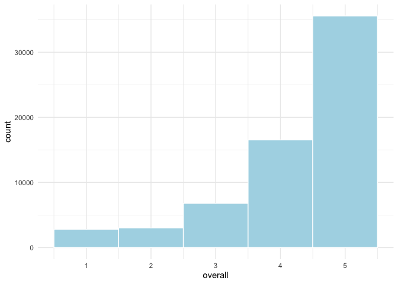

Supervised Text Classification
================
Philipp Masur, Wouter van Atteveldt & Kasper Welbers
2021-11

-   <a href="#introduction" id="toc-introduction">Introduction</a>
-   <a href="#getting-amazon-review-data"
    id="toc-getting-amazon-review-data">Getting Amazon Review Data</a>
-   <a href="#data-preprocessing" id="toc-data-preprocessing">Data
    Preprocessing</a>
    -   <a href="#splitting-into-training-and-test-data"
        id="toc-splitting-into-training-and-test-data">Splitting into training
        and test data</a>
    -   <a href="#creating-the-dfm" id="toc-creating-the-dfm">Creating the
        DFM</a>
-   <a href="#machine-learning" id="toc-machine-learning">Machine
    Learning</a>
    -   <a href="#training-the-algorithm"
        id="toc-training-the-algorithm">Training the algorithm</a>
    -   <a href="#testing-the-model" id="toc-testing-the-model">Testing the
        model</a>
    -   <a href="#validating-on-the-test-data"
        id="toc-validating-on-the-test-data">Validating on the test data</a>
    -   <a href="#music-we-like-and-hate-validation-on-our-own-data"
        id="toc-music-we-like-and-hate-validation-on-our-own-data">Music we like
        and hate: Validation on our own data</a>
    -   <a href="#bonus-creating-a-little-prediction-software"
        id="toc-bonus-creating-a-little-prediction-software">Bonus: Creating a
        little prediction software….</a>
-   <a href="#where-to-go-next" id="toc-where-to-go-next">Where to go
    next?</a>

# Introduction

In supervised text classification, we train a statistical model on the
*features* of our data (e.g. the word frequencies) to predict the
*class* of our texts (e.g. the sentiment).

For this example, we will use functions from the `quanteda.textmodels`
package. Normally, the go-to package for machine learning is `caret`,
but unfortunately that package does not deal with sparse matrices well,
making it less attractive for text analysis purposes. The good thing is
that if you are used to `quanteda` you will find it very easy to use
their textmodels as well.

# Getting Amazon Review Data

For this example, we will use Amazon reviews. These reviews have the
benefit of being relatively straightforward and explicit in their
expressed sentiment (e.g. compared to parliamentary speeches), and there
is a large amount of existing reviews that can be downloaded.

We use the reviews from [Amazon Review
Dataset](https://nijianmo.github.io/amazon/index.html) (scroll down to
the ‘small’ data sets which are freely available). These reviews are
stored in gzipped json-lines format, meaning it is a compressed file in
which each line is a json document. This sounds complicated, but you can
directly read this into an R data frame using the `jsonlite::stream_in`
function on the url using the `gzcon` function to decompress.

For this example, we pick the digital music category, mostly because it
is relatively small and still interesting. If you select a category with
more data, it will take longer to download and run the models, but
results might well be better.

``` r
library(tidyverse)
library(quanteda)
library(quanteda.textplots)
```

``` r
reviews <- jsonlite::stream_in(gzcon(url("http://snap.stanford.edu/data/amazon/productGraph/categoryFiles/reviews_Digital_Music_5.json.gz"))) 
```

    ##  Found 500 records... Found 1000 records... Found 1500 records... Found 2000 records... Found 2500 records... Found 3000 records... Found 3500 records... Found 4000 records... Found 4500 records... Found 5000 records... Found 5500 records... Found 6000 records... Found 6500 records... Found 7000 records... Found 7500 records... Found 8000 records... Found 8500 records... Found 9000 records... Found 9500 records... Found 10000 records... Found 10500 records... Found 11000 records... Found 11500 records... Found 12000 records... Found 12500 records... Found 13000 records... Found 13500 records... Found 14000 records... Found 14500 records... Found 15000 records... Found 15500 records... Found 16000 records... Found 16500 records... Found 17000 records... Found 17500 records... Found 18000 records... Found 18500 records... Found 19000 records... Found 19500 records... Found 20000 records... Found 20500 records... Found 21000 records... Found 21500 records... Found 22000 records... Found 22500 records... Found 23000 records... Found 23500 records... Found 24000 records... Found 24500 records... Found 25000 records... Found 25500 records... Found 26000 records... Found 26500 records... Found 27000 records... Found 27500 records... Found 28000 records... Found 28500 records... Found 29000 records... Found 29500 records... Found 30000 records... Found 30500 records... Found 31000 records... Found 31500 records... Found 32000 records... Found 32500 records... Found 33000 records... Found 33500 records... Found 34000 records... Found 34500 records... Found 35000 records... Found 35500 records... Found 36000 records... Found 36500 records... Found 37000 records... Found 37500 records... Found 38000 records... Found 38500 records... Found 39000 records... Found 39500 records... Found 40000 records... Found 40500 records... Found 41000 records... Found 41500 records... Found 42000 records... Found 42500 records... Found 43000 records... Found 43500 records... Found 44000 records... Found 44500 records... Found 45000 records... Found 45500 records... Found 46000 records... Found 46500 records... Found 47000 records... Found 47500 records... Found 48000 records... Found 48500 records... Found 49000 records... Found 49500 records... Found 50000 records... Found 50500 records... Found 51000 records... Found 51500 records... Found 52000 records... Found 52500 records... Found 53000 records... Found 53500 records... Found 54000 records... Found 54500 records... Found 55000 records... Found 55500 records... Found 56000 records... Found 56500 records... Found 57000 records... Found 57500 records... Found 58000 records... Found 58500 records... Found 59000 records... Found 59500 records... Found 60000 records... Found 60500 records... Found 61000 records... Found 61500 records... Found 62000 records... Found 62500 records... Found 63000 records... Found 63500 records... Found 64000 records... Found 64500 records... Found 64706 records... Imported 64706 records. Simplifying...

``` r
reviews <- reviews %>% 
   as_tibble %>% 
  select(reviewerID, asin, overall, summary, reviewText)
head(reviews)
```

| reviewerID     | asin       | overall | summary                                                    | reviewText                                                                                                                                                                                                                                                                                                                                                                                                                                                                                                                                                                                                                                                                                                                                                                                                                                                                                                                                                                                                                                                                                                                                                                                                                                                                                                                                                                                                                                                                                                                                                                                                                                                                                                                                                                                                                                                                                                                                                                                                                                                                                                                                                                                                                                                                                                                                                                                                                                                                                                                                                                                                                                                                                                                                                                                                                                                                                                                                                                                                                                                                                                                                                                                                                                                                                                                                                                                                                                                                                                                                                                                                                                                                                                                                                                                                                                                                                                                                                                                                                                                                                                                                                                                                                 |
|:---------------|:-----------|--------:|:-----------------------------------------------------------|:---------------------------------------------------------------------------------------------------------------------------------------------------------------------------------------------------------------------------------------------------------------------------------------------------------------------------------------------------------------------------------------------------------------------------------------------------------------------------------------------------------------------------------------------------------------------------------------------------------------------------------------------------------------------------------------------------------------------------------------------------------------------------------------------------------------------------------------------------------------------------------------------------------------------------------------------------------------------------------------------------------------------------------------------------------------------------------------------------------------------------------------------------------------------------------------------------------------------------------------------------------------------------------------------------------------------------------------------------------------------------------------------------------------------------------------------------------------------------------------------------------------------------------------------------------------------------------------------------------------------------------------------------------------------------------------------------------------------------------------------------------------------------------------------------------------------------------------------------------------------------------------------------------------------------------------------------------------------------------------------------------------------------------------------------------------------------------------------------------------------------------------------------------------------------------------------------------------------------------------------------------------------------------------------------------------------------------------------------------------------------------------------------------------------------------------------------------------------------------------------------------------------------------------------------------------------------------------------------------------------------------------------------------------------------------------------------------------------------------------------------------------------------------------------------------------------------------------------------------------------------------------------------------------------------------------------------------------------------------------------------------------------------------------------------------------------------------------------------------------------------------------------------------------------------------------------------------------------------------------------------------------------------------------------------------------------------------------------------------------------------------------------------------------------------------------------------------------------------------------------------------------------------------------------------------------------------------------------------------------------------------------------------------------------------------------------------------------------------------------------------------------------------------------------------------------------------------------------------------------------------------------------------------------------------------------------------------------------------------------------------------------------------------------------------------------------------------------------------------------------------------------------------------------------------------------------------------------------------|
| A3EBHHCZO6V2A4 | 5555991584 |       5 | Enya’s last great album                                    | It’s hard to believe “Memory of Trees” came out 11 years ago;it has held up well over the passage of time.It’s Enya’s last great album before the New Age/pop of “Amarantine” and “Day without rain.” Back in 1995,Enya still had her creative spark,her own voice.I agree with the reviewer who said that this is her saddest album;it is melancholy,bittersweet,from the opening title song.”Memory of Trees” is elegaic&majestic.;“Pax Deorum” sounds like it is from a Requiem Mass,it is a dark threnody.Unlike the reviewer who said that this has a “disconcerting” blend of spirituality&sensuality;,I don’t find it disconcerting at all.”Anywhere is” is a hopeful song,looking to possibilities.”Hope has a place” is about love,but it is up to the listener to decide if it is romantic,platonic,etc.I’ve always had a soft spot for this song.”On my way home” is a triumphant ending about return.This is truly a masterpiece of New Age music,a must for any Enya fan!                                                                                                                                                                                                                                                                                                                                                                                                                                                                                                                                                                                                                                                                                                                                                                                                                                                                                                                                                                                                                                                                                                                                                                                                                                                                                                                                                                                                                                                                                                                                                                                                                                                                                                                                                                                                                                                                                                                                                                                                                                                                                                                                                                                                                                                                                                                                                                                                                                                                                                                                                                                                                                                                                                                                                                                                                                                                                                                                                                                                                                                                                                                                                                                                                                     |
| AZPWAXJG9OJXV  | 5555991584 |       5 | Enya at her most elegant                                   | A clasically-styled and introverted album, Memory of Trees is a masterpiece of subtlety. Many of the songs have an endearing shyness to them - soft piano and a lovely, quiet voice. But within every introvert is an inferno, and Enya lets that fire explode on a couple of songs that absolutely burst with an expected raw power.If you’ve never heard Enya before, you might want to start with one of her more popularized works, like Watermark, just to play it safe. But if you’re already a fan, then your collection is not complete without this beautiful work of musical art.                                                                                                                                                                                                                                                                                                                                                                                                                                                                                                                                                                                                                                                                                                                                                                                                                                                                                                                                                                                                                                                                                                                                                                                                                                                                                                                                                                                                                                                                                                                                                                                                                                                                                                                                                                                                                                                                                                                                                                                                                                                                                                                                                                                                                                                                                                                                                                                                                                                                                                                                                                                                                                                                                                                                                                                                                                                                                                                                                                                                                                                                                                                                                                                                                                                                                                                                                                                                                                                                                                                                                                                                                                |
| A38IRL0X2T4DPF | 5555991584 |       5 | The best so far                                            | I never thought Enya would reach the sublime heights of Evacuee or Marble Halls from ‘Shepherd Moons.’ ‘The Celts, Watermark and Day…’ were all pleasant and admirable throughout, but are less ambitious both lyrically and musically. But Hope Has a Place from ‘Memory…’ reaches those heights and beyond. It is Enya at her most inspirational and comforting. I’m actually glad that this song didn’t get overexposed the way Only Time did. It makes it that much more special to all who own this album.                                                                                                                                                                                                                                                                                                                                                                                                                                                                                                                                                                                                                                                                                                                                                                                                                                                                                                                                                                                                                                                                                                                                                                                                                                                                                                                                                                                                                                                                                                                                                                                                                                                                                                                                                                                                                                                                                                                                                                                                                                                                                                                                                                                                                                                                                                                                                                                                                                                                                                                                                                                                                                                                                                                                                                                                                                                                                                                                                                                                                                                                                                                                                                                                                                                                                                                                                                                                                                                                                                                                                                                                                                                                                                            |
| A22IK3I6U76GX0 | 5555991584 |       5 | Ireland produces good music.                               | This is the third review of an irish album I write today (the others were Cranberries) and now I’m sure about that Ireland is one of the countries producing the best music in the world. And not just commercial pop-music in the Spice Girls way. Okay, I just wanted to say something about Irish music. Now let’s say something about this album. It’s great. it’s beautiful. Very good, easy listened music. If you like Enya or you just want some easy-listened relaxing music. This is the album for you to buy!                                                                                                                                                                                                                                                                                                                                                                                                                                                                                                                                                                                                                                                                                                                                                                                                                                                                                                                                                                                                                                                                                                                                                                                                                                                                                                                                                                                                                                                                                                                                                                                                                                                                                                                                                                                                                                                                                                                                                                                                                                                                                                                                                                                                                                                                                                                                                                                                                                                                                                                                                                                                                                                                                                                                                                                                                                                                                                                                                                                                                                                                                                                                                                                                                                                                                                                                                                                                                                                                                                                                                                                                                                                                                                   |
| A1AISPOIIHTHXX | 5555991584 |       4 | 4.5; music to dream to                                     | Enya, despite being a successful recording artist, doesn’t have the broad appeal as other artists; one reason might be that her kind of music is not very pop station friendly while another reason could be people think they’re too “macho” for music that she makes. But people with open minds could find there’s some beautiful melodies and harmonies as well as lively, upbeat tunes that are a joy to put on. I find the Memory of Trees to be one of her most consistent albums; plus it helps it has probably one of my top 5 favorite songs ever.The Memory of Trees: Like all of her records (except the recent Amarantine), the albums open with a wordless instrumental and this album’s title track is probably my favorite with gentle piano arpeggios and a beautiful vocal track. I always like the sparse use of percussion. 9/10Anywhere Is: The lively single; it’s actually a good sing-along with staccato beats and a great chorus. It’s also a perfect length since it’s under 3 minutes so whereas some pop songs drag after awhile, this one hooks you in then lets you go, leaving you wanting more. 9/10Pax Deorum: Another album, another ominous Latin-sung piece. The music sounds like something you’d hear in enemy territories in video games while Enya gives a low-voice, almost monotone performance over the music. Slightly repetitive until a 2nd higher voice comes in but the piece hits its stride halfway with a gorgeous bridge. 8/10Athair Ar Nearmh: There’s some songs she does where it’s more about the song itself rather than a poppy, catchy quality a la Only Time and this song’s similar. Another ballad with some of her best singing, it’s a more low-key track but it’s also one of the album highlights. 8.5/10From Where I Am: Another instrumental; this one’s a more piano-based piece that would be a nice song to learn for all pianists out there since it’s not technically complex or fast but it’s pleasant to listen to. 7.5/10China Roses: There’s only a handful of songs I could have on repeat and never get sick of them and this is one of them. Everything from the vocals and background instrumentation, the lyrics and not to mention one of the most relaxing and almost tranquil ending codas I’ve ever heard, this is definately my favorite song on here, plus her whole career even. 15/10Hope Has a Place: For me, any song after China Roses will probably suffer a tad but this song doesn’t do much for me. Granted, her vocals are as great as always and the song has a nice, relaxing mood but either this kind of track is too familiar (a kind of Athair part 2 if you will) or it’s just not as memorable. 7/10Tea-House Moon: Very oriental in its instruments, it’s another wordless song although it’s more enjoyable than From Where I Am is, mainly because the melodies are more memorable and it’s a bit more song-oriented. It’s different but strangely likable. 8/10Once You Had Gold: We’re getting into the album’s final stretch and the problem is that with this one, it’s a more quieter affair as you can feel the album almost winding down. With Enya’s more higher vocals (for some reason, reminiscent of her Silent Night rendition), it’s another beautiful track but it’s also a bit…same-y? 8/10La Sonadora: Spanish lyrics for once, it’s another slower paced track complete with “aahs” for background vocals and synths but again, the album could’ve benefited from a more perkier track. I do like what it does at the halfway point and gives the track a little boost. 7.5/10On My Way Home: A church organ opens the track and with a more bouncy synth, you’d think it was a bit more upbeat. While it’s not as lively as her vocals on Anywhere Is, it does give the album a bit more memorable closer, especially when the chorus comes where the track gets more fuller in its arrangements. 9/10While A Day Without Rain or Watermark is usually marked as one of her best (probably because her big hits Only Time and Orinoco Flow were on them), I find the Memory of Trees a more likable album and despite a lack of more upbeat tracks, it’s still one of her finest outings. |
| A2P49WD75WHAG5 | 5555991584 |       5 | Dreamy unearthly magic continues with Eire’s one and only! | Who knows why I initially considered this to be a duff album by the woman with the most beautiful voice in the world. Maybe I was expecting Shepherd’s Moon Part II and saw Memory Of Trees as Shepherd’s Eclipse. The songs didn’t leap out to me? Well, listening to it for this review, it finally did, and I’ve embraced it like I have her other albums. The four years inbetween albums was worth it.Of the opening instrumental title tracks, "The Memory Of Trees" is the most potent, sporting the usual instrumentals, pianos, haunting wall-of-sound choir-like vocals, pounding drums recalling "The Longships" from Watermark.The brisk "Anywhere Is", whose dominant tempo reminds me of a horse having a gentle canter down a park, is backed by strings and backing vocals. There’s an interesting motif in the first line of her reaching a horizon but finding another, where something that looks like an end is actually a new beginning. Bit like life, isn’t it?"Pax Deorum" is a Latin track begins with a cold dark wind, which sets the grim bass pulsing keyboard permeating throughout the song, as well as an ominous sound that sounds a bit like a foghorn, though not as loud or brash. This part sounds a bit like an incantation. Her voice alternates between a soft but lower register and her full vocals.The piano (and later some other instrument) ballad "Athair Ar Neamh" is a sad but beautiful sung tune, full of yearning. Makes me want to learn Gaelic. My favourite song here, and Enya sounds her best singing like this.The wistful, reflective piano only instrumental "From Where I Am" is a variation of "Miss Clare Remembers" from Watermark, with some shades of "Epona" from the Enya album."China Roses" is one of her visual and visionary poetic songs and it’s an enchanting delight to hear. I see melodic strains of what would later become "Only Time." That wall of sound really enhances her vocals, and the following lyrics really create the image of a dreamland: "A new moon leads me to/woods of dreams and I follow/a new world waits for me/my dream, my way" and "Rain and river, a world of wonder/may be paradise to me". Gosh, how I love this woman!OK, all you romantics. "Hope Has A Place" is the song for you. Enya’s vocal echoes hauntingly here and that dreamy wall of sound is in full bloom. And how’s this for some sagely advice: "Look to love/you may dream/and if it should leave/then give it wings/But if such a love is meant to be/Hope is home, and the heart is free." I can’t decide whether I like this better than "Athair Ar Neamh."The third instrumental, "Tea-House Moon", has some Oriental strains, with some otherworldly synths and conjures the image of one looking up at the stars. As for the title, a nod to Teahouse Of The August Moon, set in post-WW2 Japan and starring Machiko Kyo?"Once You Had Gold" is a proverbial seasons come, seasons go type, and has a mystical sense of why things go wrong: "No-one can promise a dream for you/Time gave both darkness and dreams to you." and "What is the dark, shadows around you/why not take heart in the new day?""La Sonadora" is her first Spanish song and it’s more an interlude. The backing wall of music rise to a crescendo in the song’s midsection.A reminiscing night traveller’s thoughts comprise "On My Way Home", where "I remember all the best days/I’m on my way home/I can remember every new day" is surrounded by the dreamy wall of sound.Compared to her first three albums, Enya’s voice is more mesmerizingly beautiful than I’ve ever heard. She seems to be a one-woman band here, as it’s "all instruments and vocals by Enya" per the credits. There’s more a wall of dreamy sound here–check out how many times I’ve mentioned this. Repeated listenings will tell whether it’ll dislodge Shepherd’s Moon as my favourite Enya album.                                                                                                                                                                                                                                                                            |

``` r
# In case the stream in of the json file doesn't work, go to canvas, download the 
# review data set and load it directly into R by using the following line of code:
# reviews <- read_csv("reviews.csv")
```

In this file, `reviewID` identifies the user that placed the reivew,
`asin` identifies the reviewed product, `overall` is the amount of
stars, and `summary` and `reviewText` are the review text as entered by
the user. Taken together, `reviewID` and `asin` uniquely identify a row.

Let us quickly check, how often 5 stars are given.

``` r
reviews %>%
  ggplot(aes(x = overall)) +
  geom_histogram(bins = 5, fill = "lightblue", color = "white") +
  theme_minimal()
```

<!-- -->

``` r
table(reviews$overall < 5) %>% 
  prop.table
```

|     FALSE |      TRUE |
|----------:|----------:|
| 0.5498717 | 0.4501283 |

We can see that most reviews are really positive (5 stars!). The
training data may hence not provide much information to differentiate
e.g., reviews with a scor of 3 from a score of 2.

Before proceeding to the text classification, we will thus compute a
binary target class (five-star or not) and create a text variable
combining the summary and review text:

``` r
reviews <- reviews %>% 
  mutate(fivestar = overall == 5,
         text = str_c(summary, reviewText, sep = " "))

# Check
reviews %>%
  select(fivestar, text) %>%
  head
```

| fivestar | text                                                                                                                                                                                                                                                                                                                                                                                                                                                                                                                                                                                                                                                                                                                                                                                                                                                                                                                                                                                                                                                                                                                                                                                                                                                                                                                                                                                                                                                                                                                                                                                                                                                                                                                                                                                                                                                                                                                                                                                                                                                                                                                                                                                                                                                                                                                                                                                                                                                                                                                                                                                                                                                                                                                                                                                                                                                                                                                                                                                                                                                                                                                                                                                                                                                                                                                                                                                                                                                                                                                                                                                                                                                                                                                                                                                                                                                                                                                                                                                                                                                                                                                                                                                                                                              |
|:---------|:--------------------------------------------------------------------------------------------------------------------------------------------------------------------------------------------------------------------------------------------------------------------------------------------------------------------------------------------------------------------------------------------------------------------------------------------------------------------------------------------------------------------------------------------------------------------------------------------------------------------------------------------------------------------------------------------------------------------------------------------------------------------------------------------------------------------------------------------------------------------------------------------------------------------------------------------------------------------------------------------------------------------------------------------------------------------------------------------------------------------------------------------------------------------------------------------------------------------------------------------------------------------------------------------------------------------------------------------------------------------------------------------------------------------------------------------------------------------------------------------------------------------------------------------------------------------------------------------------------------------------------------------------------------------------------------------------------------------------------------------------------------------------------------------------------------------------------------------------------------------------------------------------------------------------------------------------------------------------------------------------------------------------------------------------------------------------------------------------------------------------------------------------------------------------------------------------------------------------------------------------------------------------------------------------------------------------------------------------------------------------------------------------------------------------------------------------------------------------------------------------------------------------------------------------------------------------------------------------------------------------------------------------------------------------------------------------------------------------------------------------------------------------------------------------------------------------------------------------------------------------------------------------------------------------------------------------------------------------------------------------------------------------------------------------------------------------------------------------------------------------------------------------------------------------------------------------------------------------------------------------------------------------------------------------------------------------------------------------------------------------------------------------------------------------------------------------------------------------------------------------------------------------------------------------------------------------------------------------------------------------------------------------------------------------------------------------------------------------------------------------------------------------------------------------------------------------------------------------------------------------------------------------------------------------------------------------------------------------------------------------------------------------------------------------------------------------------------------------------------------------------------------------------------------------------------------------------------------------------------------------|
| TRUE     | Enya’s last great album It’s hard to believe “Memory of Trees” came out 11 years ago;it has held up well over the passage of time.It’s Enya’s last great album before the New Age/pop of “Amarantine” and “Day without rain.” Back in 1995,Enya still had her creative spark,her own voice.I agree with the reviewer who said that this is her saddest album;it is melancholy,bittersweet,from the opening title song.”Memory of Trees” is elegaic&majestic.;“Pax Deorum” sounds like it is from a Requiem Mass,it is a dark threnody.Unlike the reviewer who said that this has a “disconcerting” blend of spirituality&sensuality;,I don’t find it disconcerting at all.”Anywhere is” is a hopeful song,looking to possibilities.”Hope has a place” is about love,but it is up to the listener to decide if it is romantic,platonic,etc.I’ve always had a soft spot for this song.”On my way home” is a triumphant ending about return.This is truly a masterpiece of New Age music,a must for any Enya fan!                                                                                                                                                                                                                                                                                                                                                                                                                                                                                                                                                                                                                                                                                                                                                                                                                                                                                                                                                                                                                                                                                                                                                                                                                                                                                                                                                                                                                                                                                                                                                                                                                                                                                                                                                                                                                                                                                                                                                                                                                                                                                                                                                                                                                                                                                                                                                                                                                                                                                                                                                                                                                                                                                                                                                                                                                                                                                                                                                                                                                                                                                                                                                                                                                                    |
| TRUE     | Enya at her most elegant A clasically-styled and introverted album, Memory of Trees is a masterpiece of subtlety. Many of the songs have an endearing shyness to them - soft piano and a lovely, quiet voice. But within every introvert is an inferno, and Enya lets that fire explode on a couple of songs that absolutely burst with an expected raw power.If you’ve never heard Enya before, you might want to start with one of her more popularized works, like Watermark, just to play it safe. But if you’re already a fan, then your collection is not complete without this beautiful work of musical art.                                                                                                                                                                                                                                                                                                                                                                                                                                                                                                                                                                                                                                                                                                                                                                                                                                                                                                                                                                                                                                                                                                                                                                                                                                                                                                                                                                                                                                                                                                                                                                                                                                                                                                                                                                                                                                                                                                                                                                                                                                                                                                                                                                                                                                                                                                                                                                                                                                                                                                                                                                                                                                                                                                                                                                                                                                                                                                                                                                                                                                                                                                                                                                                                                                                                                                                                                                                                                                                                                                                                                                                                                              |
| TRUE     | The best so far I never thought Enya would reach the sublime heights of Evacuee or Marble Halls from ‘Shepherd Moons.’ ‘The Celts, Watermark and Day…’ were all pleasant and admirable throughout, but are less ambitious both lyrically and musically. But Hope Has a Place from ‘Memory…’ reaches those heights and beyond. It is Enya at her most inspirational and comforting. I’m actually glad that this song didn’t get overexposed the way Only Time did. It makes it that much more special to all who own this album.                                                                                                                                                                                                                                                                                                                                                                                                                                                                                                                                                                                                                                                                                                                                                                                                                                                                                                                                                                                                                                                                                                                                                                                                                                                                                                                                                                                                                                                                                                                                                                                                                                                                                                                                                                                                                                                                                                                                                                                                                                                                                                                                                                                                                                                                                                                                                                                                                                                                                                                                                                                                                                                                                                                                                                                                                                                                                                                                                                                                                                                                                                                                                                                                                                                                                                                                                                                                                                                                                                                                                                                                                                                                                                                   |
| TRUE     | Ireland produces good music. This is the third review of an irish album I write today (the others were Cranberries) and now I’m sure about that Ireland is one of the countries producing the best music in the world. And not just commercial pop-music in the Spice Girls way. Okay, I just wanted to say something about Irish music. Now let’s say something about this album. It’s great. it’s beautiful. Very good, easy listened music. If you like Enya or you just want some easy-listened relaxing music. This is the album for you to buy!                                                                                                                                                                                                                                                                                                                                                                                                                                                                                                                                                                                                                                                                                                                                                                                                                                                                                                                                                                                                                                                                                                                                                                                                                                                                                                                                                                                                                                                                                                                                                                                                                                                                                                                                                                                                                                                                                                                                                                                                                                                                                                                                                                                                                                                                                                                                                                                                                                                                                                                                                                                                                                                                                                                                                                                                                                                                                                                                                                                                                                                                                                                                                                                                                                                                                                                                                                                                                                                                                                                                                                                                                                                                                             |
| FALSE    | 4.5; music to dream to Enya, despite being a successful recording artist, doesn’t have the broad appeal as other artists; one reason might be that her kind of music is not very pop station friendly while another reason could be people think they’re too “macho” for music that she makes. But people with open minds could find there’s some beautiful melodies and harmonies as well as lively, upbeat tunes that are a joy to put on. I find the Memory of Trees to be one of her most consistent albums; plus it helps it has probably one of my top 5 favorite songs ever.The Memory of Trees: Like all of her records (except the recent Amarantine), the albums open with a wordless instrumental and this album’s title track is probably my favorite with gentle piano arpeggios and a beautiful vocal track. I always like the sparse use of percussion. 9/10Anywhere Is: The lively single; it’s actually a good sing-along with staccato beats and a great chorus. It’s also a perfect length since it’s under 3 minutes so whereas some pop songs drag after awhile, this one hooks you in then lets you go, leaving you wanting more. 9/10Pax Deorum: Another album, another ominous Latin-sung piece. The music sounds like something you’d hear in enemy territories in video games while Enya gives a low-voice, almost monotone performance over the music. Slightly repetitive until a 2nd higher voice comes in but the piece hits its stride halfway with a gorgeous bridge. 8/10Athair Ar Nearmh: There’s some songs she does where it’s more about the song itself rather than a poppy, catchy quality a la Only Time and this song’s similar. Another ballad with some of her best singing, it’s a more low-key track but it’s also one of the album highlights. 8.5/10From Where I Am: Another instrumental; this one’s a more piano-based piece that would be a nice song to learn for all pianists out there since it’s not technically complex or fast but it’s pleasant to listen to. 7.5/10China Roses: There’s only a handful of songs I could have on repeat and never get sick of them and this is one of them. Everything from the vocals and background instrumentation, the lyrics and not to mention one of the most relaxing and almost tranquil ending codas I’ve ever heard, this is definately my favorite song on here, plus her whole career even. 15/10Hope Has a Place: For me, any song after China Roses will probably suffer a tad but this song doesn’t do much for me. Granted, her vocals are as great as always and the song has a nice, relaxing mood but either this kind of track is too familiar (a kind of Athair part 2 if you will) or it’s just not as memorable. 7/10Tea-House Moon: Very oriental in its instruments, it’s another wordless song although it’s more enjoyable than From Where I Am is, mainly because the melodies are more memorable and it’s a bit more song-oriented. It’s different but strangely likable. 8/10Once You Had Gold: We’re getting into the album’s final stretch and the problem is that with this one, it’s a more quieter affair as you can feel the album almost winding down. With Enya’s more higher vocals (for some reason, reminiscent of her Silent Night rendition), it’s another beautiful track but it’s also a bit…same-y? 8/10La Sonadora: Spanish lyrics for once, it’s another slower paced track complete with “aahs” for background vocals and synths but again, the album could’ve benefited from a more perkier track. I do like what it does at the halfway point and gives the track a little boost. 7.5/10On My Way Home: A church organ opens the track and with a more bouncy synth, you’d think it was a bit more upbeat. While it’s not as lively as her vocals on Anywhere Is, it does give the album a bit more memorable closer, especially when the chorus comes where the track gets more fuller in its arrangements. 9/10While A Day Without Rain or Watermark is usually marked as one of her best (probably because her big hits Only Time and Orinoco Flow were on them), I find the Memory of Trees a more likable album and despite a lack of more upbeat tracks, it’s still one of her finest outings. |
| TRUE     | Dreamy unearthly magic continues with Eire’s one and only! Who knows why I initially considered this to be a duff album by the woman with the most beautiful voice in the world. Maybe I was expecting Shepherd’s Moon Part II and saw Memory Of Trees as Shepherd’s Eclipse. The songs didn’t leap out to me? Well, listening to it for this review, it finally did, and I’ve embraced it like I have her other albums. The four years inbetween albums was worth it.Of the opening instrumental title tracks, "The Memory Of Trees" is the most potent, sporting the usual instrumentals, pianos, haunting wall-of-sound choir-like vocals, pounding drums recalling "The Longships" from Watermark.The brisk "Anywhere Is", whose dominant tempo reminds me of a horse having a gentle canter down a park, is backed by strings and backing vocals. There’s an interesting motif in the first line of her reaching a horizon but finding another, where something that looks like an end is actually a new beginning. Bit like life, isn’t it?"Pax Deorum" is a Latin track begins with a cold dark wind, which sets the grim bass pulsing keyboard permeating throughout the song, as well as an ominous sound that sounds a bit like a foghorn, though not as loud or brash. This part sounds a bit like an incantation. Her voice alternates between a soft but lower register and her full vocals.The piano (and later some other instrument) ballad "Athair Ar Neamh" is a sad but beautiful sung tune, full of yearning. Makes me want to learn Gaelic. My favourite song here, and Enya sounds her best singing like this.The wistful, reflective piano only instrumental "From Where I Am" is a variation of "Miss Clare Remembers" from Watermark, with some shades of "Epona" from the Enya album."China Roses" is one of her visual and visionary poetic songs and it’s an enchanting delight to hear. I see melodic strains of what would later become "Only Time." That wall of sound really enhances her vocals, and the following lyrics really create the image of a dreamland: "A new moon leads me to/woods of dreams and I follow/a new world waits for me/my dream, my way" and "Rain and river, a world of wonder/may be paradise to me". Gosh, how I love this woman!OK, all you romantics. "Hope Has A Place" is the song for you. Enya’s vocal echoes hauntingly here and that dreamy wall of sound is in full bloom. And how’s this for some sagely advice: "Look to love/you may dream/and if it should leave/then give it wings/But if such a love is meant to be/Hope is home, and the heart is free." I can’t decide whether I like this better than "Athair Ar Neamh."The third instrumental, "Tea-House Moon", has some Oriental strains, with some otherworldly synths and conjures the image of one looking up at the stars. As for the title, a nod to Teahouse Of The August Moon, set in post-WW2 Japan and starring Machiko Kyo?"Once You Had Gold" is a proverbial seasons come, seasons go type, and has a mystical sense of why things go wrong: "No-one can promise a dream for you/Time gave both darkness and dreams to you." and "What is the dark, shadows around you/why not take heart in the new day?""La Sonadora" is her first Spanish song and it’s more an interlude. The backing wall of music rise to a crescendo in the song’s midsection.A reminiscing night traveller’s thoughts comprise "On My Way Home", where "I remember all the best days/I’m on my way home/I can remember every new day" is surrounded by the dreamy wall of sound.Compared to her first three albums, Enya’s voice is more mesmerizingly beautiful than I’ve ever heard. She seems to be a one-woman band here, as it’s "all instruments and vocals by Enya" per the credits. There’s more a wall of dreamy sound here–check out how many times I’ve mentioned this. Repeated listenings will tell whether it’ll dislodge Shepherd’s Moon as my favourite Enya album.                                                                                                                                                                                                                                        |

# Data Preprocessing

## Splitting into training and test data

Before we can train a model, we need to split the model into training
and text data. We do this with regular R and tidyverse functions, in
this case we sample from the row indices and use `slice` to select the
appropriate rows (using the negative selection for the test set to
select everything except for the training set):

``` r
# To ensure replicability
set.seed(42)

# Sample 
trainset <- sample(nrow(reviews), size=round(nrow(reviews) * 0.8))
reviews_train <- reviews %>% slice(trainset)
reviews_test <- reviews %>% slice(-trainset)
```

## Creating the DFM

First, we create a document feature matrix (dtm) of the training data:

``` r
dfm_train <- reviews_train %>% 
  corpus %>% 
  tokens %>%
  tokens_wordstem %>%
  dfm %>% 
  dfm_trim(min_docfreq = 10)
dfm_train
```

    ## Document-feature matrix of: 51,765 documents, 16,463 features (99.28% sparse) and 6 docvars.
    ##        features
    ## docs    awesom song a mellow groov that has great weird video
    ##   text1      1    2 3      1     1    1   1     1     1     1
    ##   text2      0    3 4      0     0    0   0     0     0     0
    ##   text3      2    1 5      0     0    1   0     0     0     0
    ##   text4      0    3 0      0     0    1   0     1     0     0
    ##   text5      0    0 4      0     0    3   0     0     0     0
    ##   text6      0    0 0      0     0    1   0     0     0     0
    ## [ reached max_ndoc ... 51,759 more documents, reached max_nfeat ... 16,453 more features ]

# Machine Learning

## Training the algorithm

Now, we can train a text model with e.g., the naive bayes algorithm:

``` r
library(quanteda.textmodels) ## install first!
nbmodel <- textmodel_nb(dfm_train, dfm_train$fivestar)
summary(nbmodel)
```

    ## 
    ## Call:
    ## textmodel_nb.dfm(x = dfm_train, y = dfm_train$fivestar)
    ## 
    ## Class Priors:
    ## (showing first 2 elements)
    ## FALSE  TRUE 
    ##   0.5   0.5 
    ## 
    ## Estimated Feature Scores:
    ##          awesom     song       a    mellow     groov    that      has    great
    ## FALSE 0.0001261 0.008263 0.02145 0.0001228 0.0001774 0.01078 0.002952 0.002307
    ## TRUE  0.0002994 0.008533 0.02115 0.0001399 0.0002143 0.01001 0.002895 0.003351
    ##           weird     video       .       an     eleph       goe      to
    ## FALSE 8.496e-05 0.0002017 0.04698 0.002594 3.475e-06 0.0002446 0.01714
    ## TRUE  7.766e-05 0.0002448 0.04741 0.002864 3.442e-06 0.0002228 0.01676
    ##            find       him       in   paradis       if      you      want
    ## FALSE 0.0006062 0.0006350 0.009124 2.606e-05 0.002430 0.005672 0.0008946
    ## TRUE  0.0005668 0.0005968 0.010349 3.442e-05 0.002229 0.006521 0.0007907
    ##            cool       ,      get    this      one        !     best       cd
    ## FALSE 0.0003110 0.04215 0.002298 0.01157 0.004107 0.003561 0.001975 0.002317
    ## TRUE  0.0002644 0.04141 0.002116 0.01357 0.005136 0.006476 0.002731 0.002722

The summary of the model already provides us with some idea about the
probabilistic prediction: So for example, the word “great” is more
likely to be in a five star review than in a less good review. Pretty
intuitive, right?

## Testing the model

Let’s test it on the training data set (note, this should always yield
good results unless something went wrong)

``` r
predictions <- predict(nbmodel, dfm_train)
mean(predictions == dfm_train$fivestar)
```

    ## [1] 0.7578093

## Validating on the test data

To use the model on new data, we need to make sure that the columns of
the train and test dataset agree. For this, we can use the `dfm_match`
function, which makes sure that the test dfm uses the columns from the
train dfm:

``` r
dfm_test <- reviews_test %>% 
  corpus %>% 
  tokens %>%
  tokens_wordstem %>%
  dfm %>% 
  dfm_trim(min_docfreq = 10) %>% 
  dfm_match(features = featnames(dfm_train))

colnames(dfm_test) %>% head()
```

    ## [1] "awesom" "song"   "a"      "mellow" "groov"  "that"

``` r
colnames(dfm_train) %>% head()
```

    ## [1] "awesom" "song"   "a"      "mellow" "groov"  "that"

Now, we can use the predict function as above:

``` r
predictions <- predict(nbmodel, dfm_test)
mean(predictions == dfm_test$fivestar)
```

    ## [1] 0.7364191

So, the result is lower, but not that much lower, which is good. Next,
let’s have a look at some more statistics, for which we use the `caret`
package:

``` r
library(caret)
confusionMatrix(table(predictions, actual = dfm_test$fivestar), mode = "prec_recall", positive = "TRUE")
```

    ## Confusion Matrix and Statistics
    ## 
    ##            actual
    ## predictions FALSE TRUE
    ##       FALSE  4031 1608
    ##       TRUE   1803 5499
    ##                                          
    ##                Accuracy : 0.7364         
    ##                  95% CI : (0.7287, 0.744)
    ##     No Information Rate : 0.5492         
    ##     P-Value [Acc > NIR] : < 2.2e-16      
    ##                                          
    ##                   Kappa : 0.4661         
    ##                                          
    ##  Mcnemar's Test P-Value : 0.0008947      
    ##                                          
    ##               Precision : 0.7531         
    ##                  Recall : 0.7737         
    ##                      F1 : 0.7633         
    ##              Prevalence : 0.5492         
    ##          Detection Rate : 0.4249         
    ##    Detection Prevalence : 0.5643         
    ##       Balanced Accuracy : 0.7323         
    ##                                          
    ##        'Positive' Class : TRUE           
    ## 

This results shows us the confusion matrix and a number of performance
statistics, including precision (if it predicted 5 stars, was it
correct), recall (out of all 5-star reviews, how many did it predict),
and F1 (harmonic mean of precision and recall)

## Music we like and hate: Validation on our own data

Just for fun, let’s have a look at how well the algorithm can predict
our music taste (or at least how well it predicts our rating based on
our review!). All of our reviews are stored in the following file that
we can simply load from the CANVAS page of this course.

``` r
our_data <- read_csv("music_reviews.csv")
head(our_data)
```

| name    | year | genre               | artist         | album            | overall | summary                           | text                                                                                                                                                                                                                                                                               | course_year |
|:--------|-----:|:--------------------|:---------------|:-----------------|--------:|:----------------------------------|:-----------------------------------------------------------------------------------------------------------------------------------------------------------------------------------------------------------------------------------------------------------------------------------|------------:|
| Philipp | 2020 | Jazz, R’n’B         | Jacob Collier  | Djesse Vol. 3    |       5 | Definitely worth 5 stars!         | One of my favorite albums of the last year. After Vol. 1 and 2, Jacob delivers a completely crazy ride through R’n’B, modern jazz, and fusion. His creativeness is out of this world and the composition go way beyond the standard mainstream music. Can definitely recommend!!!! |        2022 |
| Philipp | 2018 | Electronic, Ambient | Jon Hopkins    | Singularity      |       5 | Incredible good electronic music  | Perhaps one of the most interesting, multi-layered instrumental electronic albums of all time. Very unusual, but really modern and impressive. At times challenging, but always beautiful.                                                                                         |        2022 |
| Philipp | 2007 | Rock                | Radiohead      | In Rainbows      |       5 | Awesome album by an awesome band! | My favorite Radiohead album. Contains some of their best compositions (e.g., Reckoner, Weird Fishes…). Nothing more to say, just awesome!                                                                                                                                          |        2022 |
| Philipp | 2019 | Rock                | The Raconteurs | Help Us Stranger |       3 | Not bad, but also not that good!  | I really loved this band back in the day. Their newest output is still great, but there is no real development in the music. It sounds almost exactly as previous records. From such a super band, I expect a bit more. Still a good record.                                       |        2022 |
| Philipp | 2020 | Pop                 | Ätna           | Made By Desire   |       4 | Great discovery! Recommendation!  | Really strong debut. Very versatile and innovative. A modern sound and aesthetic. Definitely worth a listen.                                                                                                                                                                       |        2022 |
| Philipp | 2021 | Pop                 | The Killers    | Pressure Machine |       1 | Puh, can’t listen to it.          | The newest album by the Killers. I used to like this band, but I dont know what to say about this. Crappy country music? Their quality was always a bit inconsistent, but this is really not worth a listen.                                                                       |        2022 |

First, just for fun, let us explore our data a bit.

``` r
our_data %>%
  corpus(text_field = "genre") %>%
  tokens(remove_punct = T) %>%
  dfm %>%
  textplot_wordcloud(max_words = 20, min_count = 1, color = c("orange", "red", "blue"))
```

<!-- -->

What are the most named artists?

``` r
# Overall most named artists
our_data %>%
  corpus(text_field = "artist") %>%
  tokens(what = "sentence") %>%   ## change tokenization to "sentence"
  dfm %>%
  textplot_wordcloud(max_words = 50, min_count = 1, color = c("orange", "red", "blue"))
```

<!-- -->

``` r
# Overall most liked artists
our_data %>%
  filter(overall == 5) %>%    ## only include 5 star reviews
  corpus(text_field = "artist") %>%
  tokens(what = "sentence") %>%
  dfm %>%
  textplot_wordcloud(max_words = 50, min_count = 1, color = c("orange", "red", "blue"))
```

<!-- -->

How did we rate the albums on on average? Per genre?

``` r
# Average across all reviews
our_data %>%
  summarize(m = mean(overall, na.rm = T),
            sd = sd(overall, na.rm = T))
```

|        m |       sd |
|---------:|---------:|
| 3.852941 | 1.295928 |

``` r
# Average per genre
our_data %>%
  group_by(genre) %>%
  summarize(m = mean(overall, na.rm = T),
            sd = sd(overall, na.rm = T)) %>%
  arrange(-m)
```

| genre                        |        m |        sd |
|:-----------------------------|---------:|----------:|
| Art pop/alternative          | 5.000000 |        NA |
| Blues                        | 5.000000 |        NA |
| Country, Pop                 | 5.000000 |        NA |
| Country/Pop                  | 5.000000 |        NA |
| Dance/electronic             | 5.000000 |        NA |
| Electronic, Ambient          | 5.000000 |        NA |
| Hiphop / R&B                 | 5.000000 |        NA |
| Hiphop, rap, pop             | 5.000000 | 0.0000000 |
| HipHop/Rap                   | 5.000000 |        NA |
| Indie, Rock                  | 5.000000 |        NA |
| Indiepop, electropop         | 5.000000 |        NA |
| Jazz, R’n’B                  | 5.000000 |        NA |
| Jazz, R’n’B, Soul, Disco     | 5.000000 |        NA |
| Kpop                         | 5.000000 |        NA |
| Modern R&B/Pop               | 5.000000 |        NA |
| Neo-soul                     | 5.000000 |        NA |
| Pop dutch music              | 5.000000 |        NA |
| Pop rock                     | 5.000000 |        NA |
| Pop, Soul, Jazz              | 5.000000 |        NA |
| Pop/Hiphop                   | 5.000000 |        NA |
| Pop/jazz/soul                | 5.000000 |        NA |
| Pop/Jazz/Soul                | 5.000000 |        NA |
| pop/rock                     | 5.000000 |        NA |
| popmuziek                    | 5.000000 |        NA |
| Psychedelische Rock / Pop    | 5.000000 |        NA |
| R’n’B                        | 5.000000 | 0.0000000 |
| R&B                          | 5.000000 | 0.0000000 |
| R&B / pop                    | 5.000000 |        NA |
| R&B / Soul                   | 5.000000 |        NA |
| R&B, funk                    | 5.000000 |        NA |
| R&B/ soul                    | 5.000000 | 0.0000000 |
| Rap / hiphop                 | 5.000000 |        NA |
| Rap / Hiphop                 | 5.000000 |        NA |
| Rock, Indie                  | 5.000000 |        NA |
| Soul                         | 5.000000 |        NA |
| EDM                          | 4.500000 |        NA |
| Hiphop/rap                   | 4.500000 | 0.7071068 |
| House                        | 4.500000 | 0.7071068 |
| Indie                        | 4.500000 | 0.5773503 |
| Rock                         | 4.400000 | 0.8944272 |
| Electro / House              | 4.000000 |        NA |
| Hip Hop                      | 4.000000 |        NA |
| Hiphop/Rap                   | 4.000000 | 1.4142136 |
| pop                          | 4.000000 | 0.8944272 |
| Popmuziek, Soul, Moderne r&b | 4.000000 |        NA |
| Poprock                      | 4.000000 | 1.4142136 |
| Synth pop                    | 4.000000 |        NA |
| Rap                          | 3.714286 | 1.3801311 |
| Alternative pop/indie        | 3.500000 | 0.7071068 |
| Hard Rock                    | 3.500000 | 2.1213203 |
| Hiphop                       | 3.500000 | 1.7606817 |
| Nederhop                     | 3.500000 | 2.1213203 |
| Popmuziek, Jazz, Soul        | 3.500000 |        NA |
| R&B/soul                     | 3.500000 | 2.1213203 |
| Pop                          | 3.442308 | 1.3635804 |
| Alternative, Indie           | 3.000000 |        NA |
| Dutch, Pop                   | 3.000000 | 1.4142136 |
| Elektropop                   | 3.000000 |        NA |
| Indiepop                     | 3.000000 |        NA |
| Latin                        | 3.000000 |        NA |
| Pop, soul                    | 3.000000 |        NA |
| Soul, hiphop, rap            | 3.000000 |        NA |
| Techno                       | 3.000000 |        NA |
| Hip hop                      | 2.666667 | 0.5773503 |
| Deephouse                    | 2.500000 | 0.7071068 |
| Britpop                      | 2.000000 |        NA |
| Dance/electro                | 2.000000 |        NA |
| Jazz                         | 2.000000 |        NA |
| NedPop                       | 2.000000 |        NA |
| R&B, pop, hiphop             | 2.000000 |        NA |
| R&B/Pop/Electro/Synthpop     | 2.000000 |        NA |
| Soul/jazz/Pop                | 2.000000 |        NA |
| K-pop                        | 1.000000 |        NA |
| NA                           | 1.000000 |        NA |

And which artists did we like the most?

``` r
our_data %>%
  filter(!is.na(artist)) %>%
  group_by(artist) %>%
  summarize(score = mean(overall, na.rm = T),
            se = psych::describe(overall)$se,
            ll = score - 1.96*se,
            ul = score + 1.96*se,
            n = n()) %>%
  ggplot(aes(x = reorder(artist, score), 
             y = score, ymin = ll, ymax = ul, 
             color = factor(n))) +
  geom_pointrange() +
  ylim(1,5) +
  coord_flip() +
  theme_minimal() +
  labs(y = "Average score", x = "", color = "Number of\nreviews",
       title = "Our average music taste")
```

<!-- -->

Most importantly, we can now of course also test whether the trained
model also does well in predicting our rating of our favoriate and not
so favorite music. We first again have to build a “fivestar” variable
that distinguishes between top reviews (overall = 5) and less good ones
(overall \< 5). Then, we again have to build the a document-feature
matrix (including all relevant preprocessing steps) and match it to the
train set.

``` r
our_data <- our_data %>%
   mutate(fivestar = overall == 5,
   text = str_c(str_replace_na(summary),  str_replace_na(text), sep=" "))

dfm_test2 <- our_data %>%
  corpus %>% 
  tokens %>%
  tokens_wordstem %>%
  dfm %>% 
  #dfm_trim(min_docfreq = 10) %>%   ## don't remove any words here
  dfm_match(features = featnames(dfm_train))
dfm_test2
```

    ## Document-feature matrix of: 172 documents, 16,463 features (99.87% sparse) and 9 docvars.
    ##        features
    ## docs    awesom song a mellow groov that has great weird video
    ##   text1      0    0 1      0     0    0   0     0     0     0
    ##   text2      0    0 0      0     0    0   0     0     0     0
    ##   text3      3    0 0      0     0    0   0     0     1     0
    ##   text4      0    0 3      0     0    1   0     1     0     0
    ##   text5      0    0 2      0     0    0   0     1     0     0
    ##   text6      0    0 2      0     0    0   0     0     0     0
    ## [ reached max_ndoc ... 166 more documents, reached max_nfeat ... 16,453 more features ]

Finally, we can predict rating in this new data set with the trained
algorithm by again using the `predict()` function. And to check how well
the model did, we again produce accuracy and validation scores.

``` r
# Prediction
predictions <- predict(nbmodel, dfm_test2)

# Accuracy
mean(predictions == dfm_test2$fivestar, na.rm = T)
```

    ## [1] 0.7823529

``` r
# Confusion matrix and validation scores
confusionMatrix(table(predictions, dfm_test2$fivestar), mode = "prec_recall", positive="TRUE")
```

    ## Confusion Matrix and Statistics
    ## 
    ##            
    ## predictions FALSE TRUE
    ##       FALSE    66   11
    ##       TRUE     26   67
    ##                                           
    ##                Accuracy : 0.7824          
    ##                  95% CI : (0.7127, 0.8419)
    ##     No Information Rate : 0.5412          
    ##     P-Value [Acc > NIR] : 5.401e-11       
    ##                                           
    ##                   Kappa : 0.5681          
    ##                                           
    ##  Mcnemar's Test P-Value : 0.02136         
    ##                                           
    ##               Precision : 0.7204          
    ##                  Recall : 0.8590          
    ##                      F1 : 0.7836          
    ##              Prevalence : 0.4588          
    ##          Detection Rate : 0.3941          
    ##    Detection Prevalence : 0.5471          
    ##       Balanced Accuracy : 0.7882          
    ##                                           
    ##        'Positive' Class : TRUE            
    ## 

**Exercise 1:** If we would train another algorithm (e.g., support
vector machines), would the results differ? Try out the function
`textmodel_svm()` (Note: this may take some time depending on your
computing power…). If this does not work, try out some extra text
preprocessing steps (e.g., removing stopwords, frequency trimming) and
whether these improve or reduce the performance.

``` r
# Different preprocessing for our data set (no stemming, no word removal)
dfm_train2 <- reviews_train %>% 
  corpus %>% 
  tokens %>%
  dfm 

# Train algorithm again
nbmodel2 <- textmodel_nb(dfm_train2, dfm_train2$fivestar)
summary(nbmodel2)
```

    ## 
    ## Call:
    ## textmodel_nb.dfm(x = dfm_train2, y = dfm_train2$fivestar)
    ## 
    ## Class Priors:
    ## (showing first 2 elements)
    ## FALSE  TRUE 
    ##   0.5   0.5 
    ## 
    ## Estimated Feature Scores:
    ##         awesome     song       a    mellow    groove     that      has    great
    ## FALSE 0.0001217 0.003946 0.02044 0.0001012 0.0001199 0.009609 0.002813 0.002129
    ## TRUE  0.0002985 0.004761 0.02024 0.0001184 0.0001311 0.009048 0.002770 0.003110
    ##           weird     video       .       an  elephant      goes      to
    ## FALSE 7.334e-05 0.0001480 0.04477 0.002471 2.136e-05 0.0002356 0.01633
    ## TRUE  6.643e-05 0.0001865 0.04536 0.002740 2.076e-05 0.0002168 0.01604
    ##            find otherslike       him       in  paradise       if      you
    ## FALSE 0.0004704  3.311e-07 0.0006046 0.008693 2.583e-05 0.002316 0.005403
    ## TRUE  0.0004503  1.432e-07 0.0005705 0.009900 3.407e-05 0.002132 0.006237
    ##            want      cool       ,      get    this      one        !     best
    ## FALSE 0.0005713 0.0002911 0.04017 0.001627 0.01103 0.003720 0.003393 0.001879
    ## TRUE  0.0005101 0.0002468 0.03961 0.001530 0.01298 0.004759 0.006195 0.002610

``` r
# Match test data set
dfm_test3 <- reviews_test %>%
  corpus %>% 
  tokens %>%
  dfm %>%
  dfm_match(features = featnames(dfm_train2))

# Prediction
predictions2 <- predict(nbmodel2, dfm_test3)

# Accuracy
mean(predictions2 == dfm_test3$fivestar, na.rm = T) ## slightly better than before
```

    ## [1] 0.7428329

``` r
# Confusion matrix and validation scores
confusionMatrix(table(predictions2, dfm_test3$fivestar), mode = "prec_recall", positive="TRUE")
```

    ## Confusion Matrix and Statistics
    ## 
    ##             
    ## predictions2 FALSE TRUE
    ##        FALSE  4012 1506
    ##        TRUE   1822 5601
    ##                                           
    ##                Accuracy : 0.7428          
    ##                  95% CI : (0.7352, 0.7503)
    ##     No Information Rate : 0.5492          
    ##     P-Value [Acc > NIR] : < 2.2e-16       
    ##                                           
    ##                   Kappa : 0.4781          
    ##                                           
    ##  Mcnemar's Test P-Value : 4.753e-08       
    ##                                           
    ##               Precision : 0.7545          
    ##                  Recall : 0.7881          
    ##                      F1 : 0.7710          
    ##              Prevalence : 0.5492          
    ##          Detection Rate : 0.4328          
    ##    Detection Prevalence : 0.5736          
    ##       Balanced Accuracy : 0.7379          
    ##                                           
    ##        'Positive' Class : TRUE            
    ## 

We can see that by a) removing “stemming” and b) not removing infrequent
words, the naive bayes classifier became slightly better .85 \< .86.

## Bonus: Creating a little prediction software….

``` r
score_predictor <- function(review = "Five stars!"){
 x <- review %>%
  tokens %>%
  tokens_wordstem %>%
  dfm %>%
  dfm_match(features = featnames(dfm_train)) %>%
  predict(nbmodel, .) %>%
  as.logical
 ifelse(isTRUE(x), "5", "4 or less")
}

# Does it predict 5 stars?
score_predictor("Bon Jovi's Greatest Hits are one of the best albums in the entire world!")
```

    ## [1] "5"

``` r
# Does it predict less than 5 stars?
score_predictor("Bon Jovi's Greatest Hits is the worst you can possibly listen too. Damn.")
```

    ## [1] "4 or less"

# Where to go next?

The code above gives a good template to get started with supervised text
analysis. First, you can try using different data sets and different
models, e.g. the support vector machine `textmodel_svm` Next, you can
experiment with different features, e.g. by trying n-grams,
lemmatization, etc. Then, you can use cross-validation rather than a
single train-test split, especially to find the best parameter settings
for models that have hyperparameters (such as the C and epsilon
parameters of the SVM). Finally, you can experiment with how much
training data is required to produce a good model by running the model
with random subsamples of the training data, producing a graph called a
*learning curve*.
