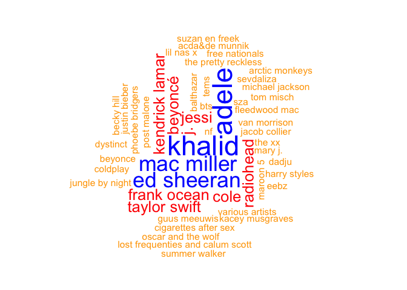

Supervised Text Classification
================
Philipp Masur, Wouter van Atteveldt & Kasper Welbers
2021-11

-   [Introduction](#introduction)
-   [Getting Amazon Review Data](#getting-amazon-review-data)
-   [Data Preprocessing](#data-preprocessing)
    -   [Splitting into training and test
        data](#splitting-into-training-and-test-data)
    -   [Creating the DFM](#creating-the-dfm)
-   [Machine Learning](#machine-learning)
    -   [Training the algorithm](#training-the-algorithm)
    -   [Testing the model](#testing-the-model)
    -   [Validating on the test data](#validating-on-the-test-data)
    -   [Music we like and hate: Validation on our own
        data](#music-we-like-and-hate-validation-on-our-own-data)
    -   [Bonus: Creating a little prediction
        software….](#bonus-creating-a-little-prediction-software)
-   [Where to go next?](#where-to-go-next)

# Introduction

In supervised text classification, we train a statistical model on the
*features* of our data (e.g. the word frequencies) to predict the
*class* of our texts (e.g. the sentiment).

For this example, we will use functions from the `quanteda.textmodels`
package. Normally, the go-to package for machine learning is `caret`,
but unfortunately that package does not deal with sparse matrices well,
making it less attractive for text analysis purposes. The good thing is
that if you are used to `quanteda` you will find it very easy to use
their textmodels as well.

# Getting Amazon Review Data

For this example, we will use Amazon reviews. These reviews have the
benefit of being relatively straightforward and explicit in their
expressed sentiment (e.g. compared to parliamentary speeches), and there
is a large amount of existing reviews that can be downloaded.

We use the reviews from [Amazon Review
Dataset](https://nijianmo.github.io/amazon/index.html) (scroll down to
the ‘small’ data sets which are freely available). These reviews are
stored in gzipped json-lines format, meaning it is a compressed file in
which each line is a json document. This sounds complicated, but you can
directly read this into an R data frame using the `jsonlite::stream_in`
function on the url using the `gzcon` function to decompress.

For this example, we pick the digital music category, mostly because it
is relatively small and still interesting. If you select a category with
more data, it will take longer to download and run the models, but
results might well be better.

``` r
library(tidyverse)
library(quanteda)
library(quanteda.textplots)
```

``` r
reviews <- jsonlite::stream_in(gzcon(url("http://deepyeti.ucsd.edu/jianmo/amazon/categoryFilesSmall/Digital_Music_5.json.gz"))) 
```

    ##  Found 500 records... Found 1000 records... Found 1500 records... Found 2000 records... Found 2500 records... Found 3000 records... Found 3500 records... Found 4000 records... Found 4500 records... Found 5000 records... Found 5500 records... Found 6000 records... Found 6500 records... Found 7000 records... Found 7500 records... Found 8000 records... Found 8500 records... Found 9000 records... Found 9500 records... Found 10000 records... Found 10500 records... Found 11000 records... Found 11500 records... Found 12000 records... Found 12500 records... Found 13000 records... Found 13500 records... Found 14000 records... Found 14500 records... Found 15000 records... Found 15500 records... Found 16000 records... Found 16500 records... Found 17000 records... Found 17500 records... Found 18000 records... Found 18500 records... Found 19000 records... Found 19500 records... Found 20000 records... Found 20500 records... Found 21000 records... Found 21500 records... Found 22000 records... Found 22500 records... Found 23000 records... Found 23500 records... Found 24000 records... Found 24500 records... Found 25000 records... Found 25500 records... Found 26000 records... Found 26500 records... Found 27000 records... Found 27500 records... Found 28000 records... Found 28500 records... Found 29000 records... Found 29500 records... Found 30000 records... Found 30500 records... Found 31000 records... Found 31500 records... Found 32000 records... Found 32500 records... Found 33000 records... Found 33500 records... Found 34000 records... Found 34500 records... Found 35000 records... Found 35500 records... Found 36000 records... Found 36500 records... Found 37000 records... Found 37500 records... Found 38000 records... Found 38500 records... Found 39000 records... Found 39500 records... Found 40000 records... Found 40500 records... Found 41000 records... Found 41500 records... Found 42000 records... Found 42500 records... Found 43000 records... Found 43500 records... Found 44000 records... Found 44500 records... Found 45000 records... Found 45500 records... Found 46000 records... Found 46500 records... Found 47000 records... Found 47500 records... Found 48000 records... Found 48500 records... Found 49000 records... Found 49500 records... Found 50000 records... Found 50500 records... Found 51000 records... Found 51500 records... Found 52000 records... Found 52500 records... Found 53000 records... Found 53500 records... Found 54000 records... Found 54500 records... Found 55000 records... Found 55500 records... Found 56000 records... Found 56500 records... Found 57000 records... Found 57500 records... Found 58000 records... Found 58500 records... Found 59000 records... Found 59500 records... Found 60000 records... Found 60500 records... Found 61000 records... Found 61500 records... Found 62000 records... Found 62500 records... Found 63000 records... Found 63500 records... Found 64000 records... Found 64500 records... Found 65000 records... Found 65500 records... Found 66000 records... Found 66500 records... Found 67000 records... Found 67500 records... Found 68000 records... Found 68500 records... Found 69000 records... Found 69500 records... Found 70000 records... Found 70500 records... Found 71000 records... Found 71500 records... Found 72000 records... Found 72500 records... Found 73000 records... Found 73500 records... Found 74000 records... Found 74500 records... Found 75000 records... Found 75500 records... Found 76000 records... Found 76500 records... Found 77000 records... Found 77500 records... Found 78000 records... Found 78500 records... Found 79000 records... Found 79500 records... Found 80000 records... Found 80500 records... Found 81000 records... Found 81500 records... Found 82000 records... Found 82500 records... Found 83000 records... Found 83500 records... Found 84000 records... Found 84500 records... Found 85000 records... Found 85500 records... Found 86000 records... Found 86500 records... Found 87000 records... Found 87500 records... Found 88000 records... Found 88500 records... Found 89000 records... Found 89500 records... Found 90000 records... Found 90500 records... Found 91000 records... Found 91500 records... Found 92000 records... Found 92500 records... Found 93000 records... Found 93500 records... Found 94000 records... Found 94500 records... Found 95000 records... Found 95500 records... Found 96000 records... Found 96500 records... Found 97000 records... Found 97500 records... Found 98000 records... Found 98500 records... Found 99000 records... Found 99500 records... Found 1e+05 records... Found 100500 records... Found 101000 records... Found 101500 records... Found 102000 records... Found 102500 records... Found 103000 records... Found 103500 records... Found 104000 records... Found 104500 records... Found 105000 records... Found 105500 records... Found 106000 records... Found 106500 records... Found 107000 records... Found 107500 records... Found 108000 records... Found 108500 records... Found 109000 records... Found 109500 records... Found 110000 records... Found 110500 records... Found 111000 records... Found 111500 records... Found 112000 records... Found 112500 records... Found 113000 records... Found 113500 records... Found 114000 records... Found 114500 records... Found 115000 records... Found 115500 records... Found 116000 records... Found 116500 records... Found 117000 records... Found 117500 records... Found 118000 records... Found 118500 records... Found 119000 records... Found 119500 records... Found 120000 records... Found 120500 records... Found 121000 records... Found 121500 records... Found 122000 records... Found 122500 records... Found 123000 records... Found 123500 records... Found 124000 records... Found 124500 records... Found 125000 records... Found 125500 records... Found 126000 records... Found 126500 records... Found 127000 records... Found 127500 records... Found 128000 records... Found 128500 records... Found 129000 records... Found 129500 records... Found 130000 records... Found 130500 records... Found 131000 records... Found 131500 records... Found 132000 records... Found 132500 records... Found 133000 records... Found 133500 records... Found 134000 records... Found 134500 records... Found 135000 records... Found 135500 records... Found 136000 records... Found 136500 records... Found 137000 records... Found 137500 records... Found 138000 records... Found 138500 records... Found 139000 records... Found 139500 records... Found 140000 records... Found 140500 records... Found 141000 records... Found 141500 records... Found 142000 records... Found 142500 records... Found 143000 records... Found 143500 records... Found 144000 records... Found 144500 records... Found 145000 records... Found 145500 records... Found 146000 records... Found 146500 records... Found 147000 records... Found 147500 records... Found 148000 records... Found 148500 records... Found 149000 records... Found 149500 records... Found 150000 records... Found 150500 records... Found 151000 records... Found 151500 records... Found 152000 records... Found 152500 records... Found 153000 records... Found 153500 records... Found 154000 records... Found 154500 records... Found 155000 records... Found 155500 records... Found 156000 records... Found 156500 records... Found 157000 records... Found 157500 records... Found 158000 records... Found 158500 records... Found 159000 records... Found 159500 records... Found 160000 records... Found 160500 records... Found 161000 records... Found 161500 records... Found 162000 records... Found 162500 records... Found 163000 records... Found 163500 records... Found 164000 records... Found 164500 records... Found 165000 records... Found 165500 records... Found 166000 records... Found 166500 records... Found 167000 records... Found 167500 records... Found 168000 records... Found 168500 records... Found 169000 records... Found 169500 records... Found 169781 records... Imported 169781 records. Simplifying...

``` r
reviews <- reviews %>% 
   as_tibble %>% 
  select(reviewerID, asin, overall, summary, reviewText)
head(reviews)
```

| reviewerID     | asin       | overall | summary                                                                            | reviewText                                                                                                                                                                                                                                                                                                                                                                                                                                                                                                                                                                                                                                                                                                                                                  |
|:---------------|:-----------|--------:|:-----------------------------------------------------------------------------------|:------------------------------------------------------------------------------------------------------------------------------------------------------------------------------------------------------------------------------------------------------------------------------------------------------------------------------------------------------------------------------------------------------------------------------------------------------------------------------------------------------------------------------------------------------------------------------------------------------------------------------------------------------------------------------------------------------------------------------------------------------------|
| A2TYZ821XXK2YZ | 3426958910 |       5 | Slayer Rules!                                                                      | This is awesome to listen to, A must-have for all Slayer fans..sadly needed to be a triple disc set..They have so many hits!!                                                                                                                                                                                                                                                                                                                                                                                                                                                                                                                                                                                                                               |
| A3OFSREZADFUDY | 3426958910 |       5 | Five Stars                                                                         | bien                                                                                                                                                                                                                                                                                                                                                                                                                                                                                                                                                                                                                                                                                                                                                        |
| A2VAMODP8M77NG | 3426958910 |       5 | SLAYER!!!!!!!!!!!!!!!!!!!!!                                                        | It was great to hear the old stuff again and I like the new stuff too. I recommend it to any Slayer fan.                                                                                                                                                                                                                                                                                                                                                                                                                                                                                                                                                                                                                                                    |
| AAKSLZ9IDTEH0  | 3426958910 |       4 | slayer greatest hits! you mean everything right?no just a collection of tracks. OK | well best of’s are a bit poison normally but this is not bad it’s pretty good because I’d have put 90% hell await,reign in blood,south of,seasons ,divine and a couple musica’s tracks and everything on god hates -at that point best of mean every cd mainly so this is not so bad it dose put some great tracks that live shows don’t play much out there like,213, skeletons of society,sex murder art and Gemini and some rare track too,final six is just a bonus track on Christ illusion but it’s here with the mystery cover songs from unditstputed attitude cd(why these would be on a greatest hits collection I don’t know) but the also put a couple of live tracks on here too.all in all it could be much worse but it’s great for the car. |
| A3OH43OZJLKI09 | 5557706259 |       5 | This is a good, blessing filled                                                    | What can I say? This is Casting Crowns!!!This is a good, blessing filled, CD.                                                                                                                                                                                                                                                                                                                                                                                                                                                                                                                                                                                                                                                                               |
| A6JP9YYJCK3WO  | 5557706259 |       4 | Four Stars                                                                         | Enjoy Casting Crowns and their songs                                                                                                                                                                                                                                                                                                                                                                                                                                                                                                                                                                                                                                                                                                                        |

In this file, `reviewID` identifies the user that placed the reivew,
`asin` identifies the reviewed product, `overall` is the amount of
stars, and `summary` and `reviewText` are the review text as entered by
the user. Taken together, `reviewID` and `asin` uniquely identify a row.

Let us quickly check, how often 5 stars are given.

``` r
reviews %>%
  ggplot(aes(x = overall)) +
  geom_histogram(bins = 5, fill = "lightblue", color = "white") +
  theme_minimal()
```

<!-- -->

``` r
table(reviews$overall < 5) %>% 
  prop.table
```

|     FALSE |      TRUE |
|----------:|----------:|
| 0.8001013 | 0.1998987 |

We can see that most reviews are really positive (5 stars!). The
training data may hence not provide much information to differentiate
e.g., reviews with a scor of 3 from a score of 2.

Before proceeding to the text classification, we will thus compute a
binary target class (five-star or not) and create a text variable
combining the summary and review text:

``` r
reviews <- reviews %>% 
  mutate(fivestar = overall == 5,
         text = str_c(summary, reviewText, sep = " "))

# Check
reviews %>%
  select(fivestar, text) %>%
  head
```

| fivestar | text                                                                                                                                                                                                                                                                                                                                                                                                                                                                                                                                                                                                                                                                                                                                                                                                                                           |
|:---------|:-----------------------------------------------------------------------------------------------------------------------------------------------------------------------------------------------------------------------------------------------------------------------------------------------------------------------------------------------------------------------------------------------------------------------------------------------------------------------------------------------------------------------------------------------------------------------------------------------------------------------------------------------------------------------------------------------------------------------------------------------------------------------------------------------------------------------------------------------|
| TRUE     | Slayer Rules! This is awesome to listen to, A must-have for all Slayer fans..sadly needed to be a triple disc set..They have so many hits!!                                                                                                                                                                                                                                                                                                                                                                                                                                                                                                                                                                                                                                                                                                    |
| TRUE     | Five Stars bien                                                                                                                                                                                                                                                                                                                                                                                                                                                                                                                                                                                                                                                                                                                                                                                                                                |
| TRUE     | SLAYER!!!!!!!!!!!!!!!!!!!!! It was great to hear the old stuff again and I like the new stuff too. I recommend it to any Slayer fan.                                                                                                                                                                                                                                                                                                                                                                                                                                                                                                                                                                                                                                                                                                           |
| FALSE    | slayer greatest hits! you mean everything right?no just a collection of tracks. OK well best of’s are a bit poison normally but this is not bad it’s pretty good because I’d have put 90% hell await,reign in blood,south of,seasons ,divine and a couple musica’s tracks and everything on god hates -at that point best of mean every cd mainly so this is not so bad it dose put some great tracks that live shows don’t play much out there like,213, skeletons of society,sex murder art and Gemini and some rare track too,final six is just a bonus track on Christ illusion but it’s here with the mystery cover songs from unditstputed attitude cd(why these would be on a greatest hits collection I don’t know) but the also put a couple of live tracks on here too.all in all it could be much worse but it’s great for the car. |
| TRUE     | This is a good, blessing filled What can I say? This is Casting Crowns!!!This is a good, blessing filled, CD.                                                                                                                                                                                                                                                                                                                                                                                                                                                                                                                                                                                                                                                                                                                                  |
| FALSE    | Four Stars Enjoy Casting Crowns and their songs                                                                                                                                                                                                                                                                                                                                                                                                                                                                                                                                                                                                                                                                                                                                                                                                |

# Data Preprocessing

## Splitting into training and test data

Before we can train a model, we need to split the model into training
and text data. We do this with regular R and tidyverse functions, in
this case we sample from the row indices and use `slice` to select the
appropriate rows (using the negative selection for the test set to
select everything except for the training set):

``` r
# To ensure replicability
set.seed(42)

# Sample 
trainset <- sample(nrow(reviews), size=round(nrow(reviews) * 0.8))
reviews_train <- reviews %>% slice(trainset)
reviews_test <- reviews %>% slice(-trainset)
```

## Creating the DFM

First, we create a document feature matrix (dtm) of the training data:

``` r
dfm_train <- reviews_train %>% 
  corpus %>% 
  tokens %>%
  tokens_wordstem %>%
  dfm %>% 
  dfm_trim(min_docfreq = 10)
dfm_train
```

    ## Document-feature matrix of: 135,825 documents, 9,869 features (99.74% sparse) and 6 docvars.
    ##        features
    ## docs    my cousin play this song for me and i download
    ##   text1  3      2    1    1    1   1  1   1 2        1
    ##   text2  0      0    0    1    2   1  0   1 0        0
    ##   text3  0      0    0    2    2   0  0   0 0        0
    ##   text4  0      0    0    0    0   0  0   0 0        0
    ##   text5  1      0    0    2    2   0  0   1 4        0
    ##   text6  0      0    0    0    0   0  0   0 0        0
    ## [ reached max_ndoc ... 135,819 more documents, reached max_nfeat ... 9,859 more features ]

# Machine Learning

## Training the algorithm

Now, we can train a text model with e.g., the naive bayes algorithm:

``` r
library(quanteda.textmodels) ## install first!
nbmodel <- textmodel_nb(dfm_train, dfm_train$fivestar)
summary(nbmodel)
```

    ## 
    ## Call:
    ## textmodel_nb.dfm(x = dfm_train, y = dfm_train$fivestar)
    ## 
    ## Class Priors:
    ## (showing first 2 elements)
    ## FALSE  TRUE 
    ##   0.5   0.5 
    ## 
    ## Estimated Feature Scores:
    ##             my    cousin     play    this    song      for       me     and
    ## FALSE 0.004142 1.134e-05 0.001237 0.01387 0.01606 0.007550 0.003054 0.02140
    ## TRUE  0.007165 1.393e-05 0.001529 0.01963 0.02439 0.007116 0.003459 0.02266
    ##             i download      it     right      away       .        ad      to
    ## FALSE 0.01757 0.001083 0.01901 0.0006038 0.0004609 0.05722 0.0002069 0.01912
    ## TRUE  0.02201 0.001503 0.02026 0.0006377 0.0003554 0.06249 0.0001800 0.01973
    ##        playlist    great        !     those      of      you      who      live
    ## FALSE 0.0001310 0.004652 0.005325 0.0007439 0.01855 0.005847 0.001222 0.0006889
    ## TRUE  0.0002295 0.012065 0.019369 0.0006741 0.01798 0.007394 0.001381 0.0007177
    ##             in     the       "  boondock      are     proud
    ## FALSE 0.008993 0.03963 0.02289 3.969e-06 0.004118 2.268e-05
    ## TRUE  0.009226 0.03487 0.01295 2.837e-06 0.003444 4.461e-05

The summary of the model already provides us with some idea about the
probabilistic prediction: So for example, the word “great” is more
likely to be in a five star review than in a less good review. Pretty
intuitive, right?

## Testing the model

Let’s test it on the training data set (note, this should always yield
good results unless something went wrong)

``` r
predictions <- predict(nbmodel, dfm_train)
mean(predictions == dfm_train$fivestar)
```

    ## [1] 0.8542242

## Validating on the test data

To use the model on new data, we need to make sure that the columns of
the train and test dataset agree. For this, we can use the `dfm_match`
function, which makes sure that the test dfm uses the columns from the
train dfm:

``` r
dfm_test <- reviews_test %>% 
  corpus %>% 
  tokens %>%
  tokens_wordstem %>%
  dfm %>% 
  dfm_trim(min_docfreq = 10) %>% 
  dfm_match(features = featnames(dfm_train))

colnames(dfm_test) %>% head()
```

    ## [1] "my"     "cousin" "play"   "this"   "song"   "for"

``` r
colnames(dfm_train) %>% head()
```

    ## [1] "my"     "cousin" "play"   "this"   "song"   "for"

Now, we can use the predict function as above:

``` r
predictions <- predict(nbmodel, dfm_test)
mean(predictions == dfm_test$fivestar)
```

    ## [1] 0.8479208

So, the result is lower, but not that much lower, which is good. Next,
let’s have a look at some more statistics, for which we use the `caret`
package:

``` r
library(caret)
confusionMatrix(table(predictions, actual = dfm_test$fivestar), mode = "prec_recall", positive = "TRUE")
```

    ## Confusion Matrix and Statistics
    ## 
    ##            actual
    ## predictions FALSE  TRUE
    ##       FALSE  4616  3044
    ##       TRUE   2120 24176
    ##                                           
    ##                Accuracy : 0.8479          
    ##                  95% CI : (0.8441, 0.8517)
    ##     No Information Rate : 0.8016          
    ##     P-Value [Acc > NIR] : < 2.2e-16       
    ##                                           
    ##                   Kappa : 0.5453          
    ##                                           
    ##  Mcnemar's Test P-Value : < 2.2e-16       
    ##                                           
    ##               Precision : 0.9194          
    ##                  Recall : 0.8882          
    ##                      F1 : 0.9035          
    ##              Prevalence : 0.8016          
    ##          Detection Rate : 0.7120          
    ##    Detection Prevalence : 0.7744          
    ##       Balanced Accuracy : 0.7867          
    ##                                           
    ##        'Positive' Class : TRUE            
    ## 

This results shows us the confusion matrix and a number of performance
statistics, including precision (if it predicted 5 stars, was it
correct), recall (out of all 5-star reviews, how many did it predict),
and F1 (harmonic mean of precision and recall)

## Music we like and hate: Validation on our own data

Just for fun, let’s have a look at how well the algorithm can predict
our music taste (or at least how well it predicts our rating based on
our review!). All of our reviews are stored in the following file that
we can simply load from the CANVAS page of this course.

``` r
our_data <- read_csv("music_reviews.csv")
head(our_data)
```

| name    | year | genre               | artist         | album            | overall | summary                           | text                                                                                                                                                                                                                                                                               |
|:--------|-----:|:--------------------|:---------------|:-----------------|--------:|:----------------------------------|:-----------------------------------------------------------------------------------------------------------------------------------------------------------------------------------------------------------------------------------------------------------------------------------|
| Philipp | 2020 | Jazz, R’n’B         | Jacob Collier  | Djesse Vol. 3    |       5 | Definitely worth 5 stars!         | One of my favorite albums of the last year. After Vol. 1 and 2, Jacob delivers a completely crazy ride through R’n’B, modern jazz, and fusion. His creativeness is out of this world and the composition go way beyond the standard mainstream music. Can definitely recommend!!!! |
| Philipp | 2018 | Electronic, Ambient | Jon Hopkins    | Singularity      |       5 | Incredible good electronic music  | Perhaps one of the most interesting, multi-layered instrumental electronic albums of all time. Very unusual, but really modern and impressive. At times challenging, but always beautiful.                                                                                         |
| Philipp | 2007 | Rock                | Radiohead      | In Rainbows      |       5 | Awesome album by an awesome band! | My favorite Radiohead album. Contains some of their best compositions (e.g., Reckoner, Weird Fishes…). Nothing more to say, just awesome!                                                                                                                                          |
| Philipp | 2019 | Rock                | The Raconteurs | Help Us Stranger |       3 | Not bad, but also not that good!  | I really loved this band back in the day. Their newest output is still great, but there is no real development in the music. It sounds almost exactly as previous records. From such a super band, I expect a bit more. Still a good record.                                       |
| Philipp | 2020 | Pop                 | Ätna           | Made By Desire   |       4 | Great discovery! Recommendation!  | Really strong debut. Very versatile and innovative. A modern sound and aesthetic. Definitely worth a listen.                                                                                                                                                                       |
| Philipp | 2021 | Pop                 | The Killers    | Pressure Machine |       1 | Puh, can’t listen to it.          | The newest album by the Killers. I used to like this band, but I dont know what to say about this. Crappy country music? Their quality was always a bit inconsistent, but this is really not worth a listen.                                                                       |

First, just for fun, let us explore our data a bit.

``` r
our_data %>%
  corpus(text_field = "genre") %>%
  tokens(remove_punct = T) %>%
  dfm %>%
  textplot_wordcloud(max_words = 20, min_count = 1, color = c("orange", "red", "blue"))
```

<!-- -->

What are the most named artists?

``` r
# Overall most named artists
our_data %>%
  corpus(text_field = "artist") %>%
  tokens(what = "sentence") %>%   ## change tokenization to "sentence"
  dfm %>%
  textplot_wordcloud(max_words = 50, min_count = 1, color = c("orange", "red", "blue"))
```

<!-- -->

``` r
# Overall most liked artists
our_data %>%
  filter(overall == 5) %>%    ## only include 5 star reviews
  corpus(text_field = "artist") %>%
  tokens(what = "sentence") %>%
  dfm %>%
  textplot_wordcloud(max_words = 50, min_count = 1, color = c("orange", "red", "blue"))
```

<!-- -->

How did we rate the albums on on average? Per genre?

``` r
# Average across all reviews
our_data %>%
  summarize(m = mean(overall, na.rm = T),
            sd = sd(overall, na.rm = T))
```

|        m |       sd |
|---------:|---------:|
| 3.831933 | 1.342394 |

``` r
# Average per genre
our_data %>%
  group_by(genre) %>%
  summarize(m = mean(overall, na.rm = T),
            sd = sd(overall, na.rm = T)) %>%
  arrange(-m)
```

| genre                     |        m |        sd |
|:--------------------------|---------:|----------:|
| Art pop/alternative       | 5.000000 |        NA |
| Country, Pop              | 5.000000 |        NA |
| Country/Pop               | 5.000000 |        NA |
| Electronic, Ambient       | 5.000000 |        NA |
| Hiphop / R&B              | 5.000000 |        NA |
| HipHop/Rap                | 5.000000 |        NA |
| Indie, Rock               | 5.000000 |        NA |
| Indiepop, electropop      | 5.000000 |        NA |
| Jazz, R’n’B               | 5.000000 |        NA |
| Jazz, R’n’B, Soul, Disco  | 5.000000 |        NA |
| Modern R&B/Pop            | 5.000000 |        NA |
| Pop dutch music           | 5.000000 |        NA |
| Pop rock                  | 5.000000 |        NA |
| Pop, Soul, Jazz           | 5.000000 |        NA |
| Pop/Hiphop                | 5.000000 |        NA |
| Pop/jazz/soul             | 5.000000 |        NA |
| Pop/Jazz/Soul             | 5.000000 |        NA |
| Psychedelische Rock / Pop | 5.000000 |        NA |
| R’n’B                     | 5.000000 | 0.0000000 |
| R&B                       | 5.000000 | 0.0000000 |
| R&B / pop                 | 5.000000 |        NA |
| R&B / Soul                | 5.000000 |        NA |
| R&B, funk                 | 5.000000 |        NA |
| R&B/ soul                 | 5.000000 | 0.0000000 |
| Rap / hiphop              | 5.000000 |        NA |
| Rap / Hiphop              | 5.000000 |        NA |
| Rock, Indie               | 5.000000 |        NA |
| Soul                      | 5.000000 |        NA |
| Indie                     | 4.666667 | 0.5773503 |
| Hiphop/rap                | 4.500000 | 0.7071068 |
| House                     | 4.500000 | 0.7071068 |
| Electro / House           | 4.000000 |        NA |
| Hip Hop                   | 4.000000 |        NA |
| Poprock                   | 4.000000 | 1.4142136 |
| Rock                      | 4.000000 | 1.0000000 |
| Synth pop                 | 4.000000 |        NA |
| pop                       | 3.800000 | 0.8366600 |
| Rap                       | 3.714286 | 1.3801311 |
| Hiphop/Rap                | 3.666667 | 1.5275252 |
| Alternative pop/indie     | 3.500000 | 0.7071068 |
| Nederhop                  | 3.500000 | 2.1213203 |
| Pop                       | 3.454546 | 1.5018927 |
| Alternative, Indie        | 3.000000 |        NA |
| Hiphop                    | 3.000000 | 2.0000000 |
| Latin                     | 3.000000 |        NA |
| Soul, hiphop, rap         | 3.000000 |        NA |
| Techno                    | 3.000000 |        NA |
| Hip hop                   | 2.666667 | 0.5773503 |
| Deephouse                 | 2.500000 | 0.7071068 |
| Britpop                   | 2.000000 |        NA |
| Dance/electro             | 2.000000 |        NA |
| Jazz                      | 2.000000 |        NA |
| R&B/Pop/Electro/Synthpop  | 2.000000 |        NA |
| R&B/soul                  | 2.000000 |        NA |
| Soul/jazz/Pop             | 2.000000 |        NA |
| K-pop                     | 1.000000 |        NA |
| NA                        | 1.000000 |        NA |

And which artists did we like the most?

``` r
our_data %>%
  filter(!is.na(artist)) %>%
  group_by(artist) %>%
  summarize(score = mean(overall, na.rm = T),
            se = psych::describe(overall)$se,
            ll = score - 1.96*se,
            ul = score + 1.96*se,
            n = n()) %>%
  ggplot(aes(x = reorder(artist, score), 
             y = score, ymin = ll, ymax = ul, 
             color = factor(n))) +
  geom_pointrange() +
  ylim(1,5) +
  coord_flip() +
  theme_minimal() +
  labs(y = "Average score", x = "", color = "Number of\nreviews",
       title = "Our average music taste")
```

<!-- -->

Most importantly, we can now of course also test whether the trained
model also does well in predicting our rating of our favoriate and not
so favorite music. We first again have to build a “fivestar” variable
that distinguishes between top reviews (overall = 5) and less good ones
(overall &lt; 5). Then, we again have to build the a document-feature
matrix (including all relevant preprocessing steps) and match it to the
train set.

``` r
our_data <- our_data %>%
   mutate(fivestar = overall == 5,
   text = str_c(str_replace_na(summary),  str_replace_na(text), sep=" "))

dfm_test2 <- our_data %>%
  corpus %>% 
  tokens %>%
  tokens_wordstem %>%
  dfm %>% 
  #dfm_trim(min_docfreq = 10) %>%   ## don't remove any words here
  dfm_match(features = featnames(dfm_train))
dfm_test2
```

    ## Document-feature matrix of: 120 documents, 9,869 features (99.76% sparse) and 8 docvars.
    ##        features
    ## docs    my cousin play this song for me and i download
    ##   text1  1      0    0    1    0   0  0   3 0        0
    ##   text2  0      0    0    0    0   0  0   1 0        0
    ##   text3  1      0    0    0    0   0  0   0 0        0
    ##   text4  0      0    0    1    0   0  0   0 2        0
    ##   text5  0      0    0    0    0   0  0   2 0        0
    ##   text6  0      0    0    3    0   0  0   0 2        0
    ## [ reached max_ndoc ... 114 more documents, reached max_nfeat ... 9,859 more features ]

Finally, we can predict rating in this new data set with the trained
algorithm by again using the `predict()` function. And to check how well
the model did, we again produce accuracy and validation scores.

``` r
# Prediction
predictions <- predict(nbmodel, dfm_test2)

# Accuracy
mean(predictions == dfm_test2$fivestar, na.rm = T)
```

    ## [1] 0.7731092

``` r
# Confusion matrix and validation scores
confusionMatrix(table(predictions, dfm_test2$fivestar), mode = "prec_recall", positive="TRUE")
```

    ## Confusion Matrix and Statistics
    ## 
    ##            
    ## predictions FALSE TRUE
    ##       FALSE    54   18
    ##       TRUE      9   38
    ##                                           
    ##                Accuracy : 0.7731          
    ##                  95% CI : (0.6873, 0.8448)
    ##     No Information Rate : 0.5294          
    ##     P-Value [Acc > NIR] : 3.404e-08       
    ##                                           
    ##                   Kappa : 0.5405          
    ##                                           
    ##  Mcnemar's Test P-Value : 0.1237          
    ##                                           
    ##               Precision : 0.8085          
    ##                  Recall : 0.6786          
    ##                      F1 : 0.7379          
    ##              Prevalence : 0.4706          
    ##          Detection Rate : 0.3193          
    ##    Detection Prevalence : 0.3950          
    ##       Balanced Accuracy : 0.7679          
    ##                                           
    ##        'Positive' Class : TRUE            
    ## 

**Exercise 1:** If we would train another algorithm (e.g., support
vector machines), would the results differ? Try out the function
`textmodel_svm()` (Note: this may take some time depending on your
computing power…). If this does not work, try out some extra text
preprocessing steps (e.g., removing stopwords, frequency trimming) and
whether these improve or reduce the performance.

``` r
# Different preprocessing for our data set (no stemming, no word removal)
dfm_train2 <- reviews_train %>% 
  corpus %>% 
  tokens %>%
  dfm 

# Train algorithm again
nbmodel2 <- textmodel_nb(dfm_train2, dfm_train2$fivestar)
summary(nbmodel2)
```

    ## 
    ## Call:
    ## textmodel_nb.dfm(x = dfm_train2, y = dfm_train2$fivestar)
    ## 
    ## Class Priors:
    ## (showing first 2 elements)
    ## FALSE  TRUE 
    ##   0.5   0.5 
    ## 
    ## Estimated Feature Scores:
    ##             my    cousin    played    this    song      for       me     and
    ## FALSE 0.003932 5.920e-06 0.0002890 0.01317 0.01135 0.007167 0.002899 0.02031
    ## TRUE  0.006929 1.222e-05 0.0003821 0.01898 0.01983 0.006881 0.003344 0.02192
    ##             i downloaded      it     right      away       .     added      to
    ## FALSE 0.01668  0.0003014 0.01412 0.0005597 0.0004424 0.05432 0.0001109 0.01815
    ## TRUE  0.02129  0.0003195 0.01642 0.0005933 0.0003504 0.06043 0.0001302 0.01908
    ##        playlist    great        !     those      of      you      who      live
    ## FALSE 0.0001082 0.004364 0.005055 0.0007061 0.01761 0.005545 0.001125 0.0004704
    ## TRUE  0.0001990 0.011582 0.018730 0.0006519 0.01739 0.007150 0.001304 0.0004379
    ##             in     the       " boondocks      are     proud
    ## FALSE 0.008536 0.03762 0.02173 3.767e-06 0.003909 1.830e-05
    ## TRUE  0.008922 0.03372 0.01252 2.743e-06 0.003330 4.065e-05

``` r
# Match test data set
dfm_test3 <- reviews_test %>%
  corpus %>% 
  tokens %>%
  dfm %>%
  dfm_match(features = featnames(dfm_train2))

# Prediction
predictions2 <- predict(nbmodel2, dfm_test3)

# Accuracy
mean(predictions2 == dfm_test3$fivestar, na.rm = T) ## slightly better than before
```

    ## [1] 0.8632348

``` r
# Confusion matrix and validation scores
confusionMatrix(table(predictions2, dfm_test3$fivestar), mode = "prec_recall", positive="TRUE")
```

    ## Confusion Matrix and Statistics
    ## 
    ##             
    ## predictions2 FALSE  TRUE
    ##        FALSE  4497  2405
    ##        TRUE   2239 24815
    ##                                           
    ##                Accuracy : 0.8632          
    ##                  95% CI : (0.8595, 0.8669)
    ##     No Information Rate : 0.8016          
    ##     P-Value [Acc > NIR] : < 2e-16         
    ##                                           
    ##                   Kappa : 0.5739          
    ##                                           
    ##  Mcnemar's Test P-Value : 0.01547         
    ##                                           
    ##               Precision : 0.9172          
    ##                  Recall : 0.9116          
    ##                      F1 : 0.9144          
    ##              Prevalence : 0.8016          
    ##          Detection Rate : 0.7308          
    ##    Detection Prevalence : 0.7967          
    ##       Balanced Accuracy : 0.7896          
    ##                                           
    ##        'Positive' Class : TRUE            
    ## 

We can see that by a) removing “stemming” and b) not removing infrequent
words, the naive bayes classifier became slightly better .85 &lt; .86.

## Bonus: Creating a little prediction software….

``` r
score_predictor <- function(review = "Five stars!"){
 x <- review %>%
  tokens %>%
  tokens_wordstem %>%
  dfm %>%
  dfm_match(features = featnames(dfm_train)) %>%
  predict(nbmodel, .) %>%
  as.logical
 ifelse(isTRUE(x), "5", "4 or less")
}

# Does it predict 5 stars?
score_predictor("Bon Jovi's Greatest Hits are one of the best albums in the entire world!")
```

    ## [1] "5"

``` r
# Does it predict less than 5 stars?
score_predictor("Bon Jovi's Greatest Hits is the worst you can possibly listen too. Damn.")
```

    ## [1] "4 or less"

# Where to go next?

The code above gives a good template to get started with supervised text
analysis. First, you can try using different data sets and different
models, e.g. the support vector machine `textmodel_svm` Next, you can
experiment with different features, e.g. by trying n-grams,
lemmatization, etc. Then, you can use cross-validation rather than a
single train-test split, especially to find the best parameter settings
for models that have hyperparameters (such as the C and epsilon
parameters of the SVM). Finally, you can experiment with how much
training data is required to produce a good model by running the model
with random subsamples of the training data, producing a graph called a
*learning curve*.
