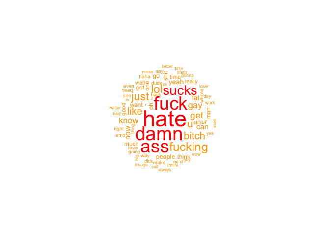
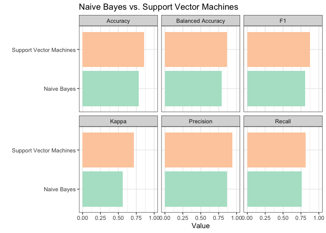
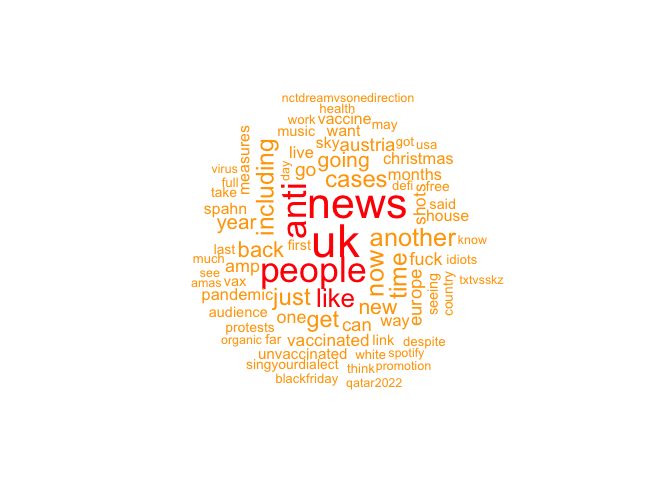
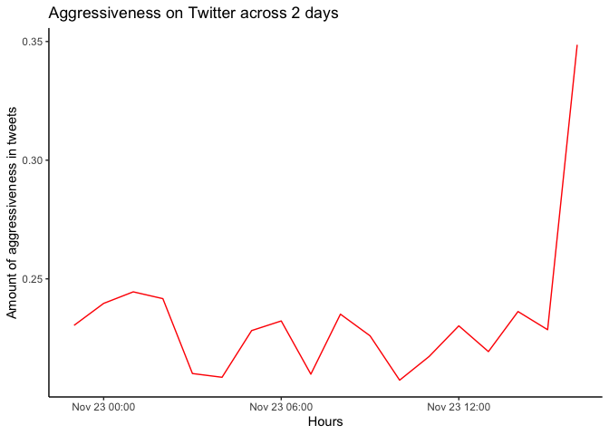
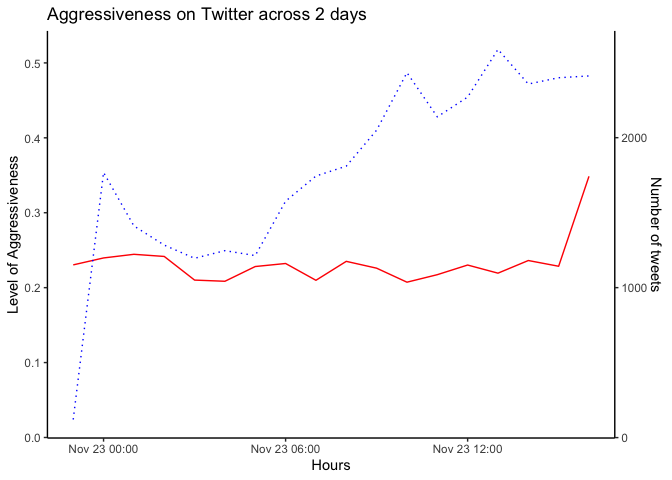

Supervised Text Classification II
================
Philipp Masur
2021-11

-   [Introduction](#introduction)
-   [Preprocessing](#preprocessing)
    -   [Getting some Twitter data](#getting-some-twitter-data)
    -   [Creating train and test data
        sets](#creating-train-and-test-data-sets)
    -   [Text preprocessing and creating the
        DTM](#text-preprocessing-and-creating-the-dtm)
-   [Machine Learning Process](#machine-learning-process)
    -   [Training different algorithm](#training-different-algorithm)
    -   [Testing the algorithms on the held-out
        data](#testing-the-algorithms-on-the-held-out-data)
-   [Using the classifier on a new data
    set](#using-the-classifier-on-a-new-data-set)
    -   [Getting some new twitter data](#getting-some-new-twitter-data)
    -   [Using the trained algorithm to predict whether these tweets
        contain “aggressive”
        language](#using-the-trained-algorithm-to-predict-whether-these-tweets-contain-aggressive-language)
    -   [Some simple analyses](#some-simple-analyses)
-   [Where to go from here?](#where-to-go-from-here)

# Introduction

In this tutorial, we are going to further practice using different
supervised learning approaches to classify/code text.

A small reminder: In supervised text classification, we train a
statistical model on the *features* of our data (e.g. the word
frequencies) to predict the *class* of our texts (e.g. the sentiment,
topic,…). We thus need annotated data that we can use to train and test
the algorithm.

In the following example, we will use and existing, annotated data set
to train an algorithm and check out whether this machine learning
algorithm can then be used to classify a new data set.

We will again use functions from the `quanteda.textmodels` package as
well as some functions from the `caret` package.

``` r
library(tidyverse)
library(quanteda)
library(quanteda.textplots)
library(quanteda.textmodels)
library(caret)
```

# Preprocessing

## Getting some Twitter data

In this tutorial, our goal is to use an existing, annotated data sets of
Twitter tweets to train an algorithm to detect “uncivil” language (or
even cybertrolls) in tweets. This [Data
Set](https://www.kaggle.com/dataturks/dataset-for-detection-of-cybertrolls)
includes about 20,000 tweets that are labeled as being aggressive (1) or
not aggressive (0). The data set comes as a json-file, which I uploaded
to our Canvas page.

Let’s download the data, use the function `stream_in()` from the
`jsonlite` package and do some basic data wrangling.

``` r
# Importing the json data base
tweets <- jsonlite::stream_in(file("trolls_data.json"))
```

    ##  Found 500 records... Found 1000 records... Found 1500 records... Found 2000 records... Found 2500 records... Found 3000 records... Found 3500 records... Found 4000 records... Found 4500 records... Found 5000 records... Found 5500 records... Found 6000 records... Found 6500 records... Found 7000 records... Found 7500 records... Found 8000 records... Found 8500 records... Found 9000 records... Found 9500 records... Found 10000 records... Found 10500 records... Found 11000 records... Found 11500 records... Found 12000 records... Found 12500 records... Found 13000 records... Found 13500 records... Found 14000 records... Found 14500 records... Found 15000 records... Found 15500 records... Found 16000 records... Found 16500 records... Found 17000 records... Found 17500 records... Found 18000 records... Found 18500 records... Found 19000 records... Found 19500 records... Found 20000 records... Found 20001 records... Imported 20001 records. Simplifying...

``` r
# Some data wrangling to get a tidy data set
tweets <- tweets %>%
  as_tibble %>%
  mutate(label = unlist(annotation$label)) %>%   ## The label column was stored as a list
  select(label, text = content) %>%
  mutate(text = trimws(text))                    ## Let's remove some white space
head(tweets)
```

| label | text                                                                                                                              |
|:------|:----------------------------------------------------------------------------------------------------------------------------------|
| 1     | Get fucking real dude.                                                                                                            |
| 1     | She is as dirty as they come and that crook Rengel the Dems are so fucking corrupt it’s a joke. Make Republicans look like …      |
| 1     | why did you fuck it up. I could do it all day too. Let’s do it when you have an hour. Ping me later to sched writing a book here. |
| 1     | Dude they dont finish enclosing the fucking showers. I hate half assed jobs. Whats the reasononing behind it? Makes no sense.     |
| 1     | WTF are you talking about Men? No men thats not a menage that’s just gay.                                                         |
| 1     | Ill save you the trouble sister. Here comes a big ol fuck France block coming your way here on the twitter.                       |

Let’s try to better understand our data and check how many tweets are
labeled as aggressive vs. not aggressive.

``` r
tweets %>%
  group_by(label) %>%
  count %>%                      ## Absolute frequencies
  mutate(prop = n/nrow(tweets))  ## Relative frequencies
```

    ## # A tibble: 2 × 3
    ## # Groups:   label [2]
    ##   label     n  prop
    ##   <chr> <int> <dbl>
    ## 1 0     12179 0.609
    ## 2 1      7822 0.391

To better understand how the data was labeled, let’s look at the most
used words in the tweets that were coded as “aggressive”. We can do so
by first filtering our data set to contain only aggressive tweets. We
then go through some text pre-processing and create a document-term
matrix. We can then create a simply word cloud.

``` r
tweets %>%
  mutate(text = str_remove_all(text, "#")) %>%
  filter(label == 1) %>%
  corpus %>%
  tokens(remove_punct = T, remove_symbols = T) %>%
  tokens_remove(stopwords("en")) %>%
  dfm %>%
  textplot_wordcloud(max_words = 75, color = c("orange", "red"))
```

<!-- -->

Not very nice, but it seems that the tweets have been labeled in a
decent way. Bear in mind, we use a data set that was simply published on
some website. We do not now how well these tweets were actually coded.
The quality of our following analyses, however, rest on the assumption
that this manual coding was done well and has high validity!

## Creating train and test data sets

Similar to our last practical session, we need to split the model into
training and text data. We again do this with regular R and tidyverse
function. We sample from the row indices and use `slice` to select the
appropriate rows:

``` r
# To ensure replicability
set.seed(42)

# Sample 
trainset <- sample(nrow(tweets), size=round(nrow(tweets) * 0.8))
tweets_train <- tweets %>% slice(trainset)
tweets_test <- tweets %>% slice(-trainset)
```

## Text preprocessing and creating the DTM

The next step again consists of engaging in various text pre-processing
steps. We use `str_remove_all()` to remove the `#` from the tweets. This
is quite useful as some words are otherwise not identified as being
similar (e.g., ‘\#hate’ and ‘hate’). Because supervised machine learning
algorithm otherwise do well even if we do not remove any further noise,
we only tokenize and create the dtm.

``` r
dfm_train <- tweets_train %>% 
  mutate(text = str_remove_all(text, "#")) %>%
  corpus %>% 
  tokens %>%
  dfm
dfm_train
```

    ## Document-feature matrix of: 16,001 documents, 15,873 features (99.91% sparse) and 1 docvar.
    ##        features
    ## docs    oh sorry it was jack im not use to hime
    ##   text1  1     1  1   1    1  2   1   1  2    1
    ##   text2  0     0  0   0    0  0   0   0  1    0
    ##   text3  0     0  0   0    0  0   0   0  0    0
    ##   text4  0     0  0   0    0  0   0   0  0    0
    ##   text5  0     0  1   0    0  0   0   0  0    0
    ##   text6  0     0  0   0    0  0   0   0  0    0
    ## [ reached max_ndoc ... 15,995 more documents, reached max_nfeat ... 15,863 more features ]

# Machine Learning Process

## Training different algorithm

Based on this document-term matrix, we can now start to train
algorithms. This time, we are actually going to use two different
algorithms (both Naive Bayes and Support Vector Machines) and test which
one performs better.

``` r
# Naive Bayes
nb_model <- textmodel_nb(dfm_train, dfm_train$label)

# Support Vector Machines
svm_model <- textmodel_svm(dfm_train, dfm_train$label)
```

## Testing the algorithms on the held-out data

To validate our algorithms, we again need to preprocess our test data in
the exact same way as we did our training data. Bear in mind that we
need to “match” both document-feature matrices for the prediction to
work.

``` r
# Pre-processing test data
dfm_test <- tweets_test %>% 
  mutate(text = str_remove_all(text, "#")) %>%
  corpus %>% 
  tokens %>%
  dfm %>%
  dfm_match(features = featnames(dfm_train))

# Predicting 
nb_predictions <- predict(nb_model, dfm_test)
svm_predictions <- predict(svm_model, dfm_test)

# Accuracy
mean(nb_predictions == dfm_test$label)
```

    ## [1] 0.78375

``` r
mean(svm_predictions == dfm_test$label) #
```

    ## [1] 0.85875

As we can see, support vector machines have a much higher accuracy!But
we should always investigate the difference in a bit more detail. To do
so, we again built the confusion matrix using the `caret` package. This
time, we save both in a new variable, so that we can extract whatever
information (or validation score) we are interested in.

``` r
# Create confusion matrices
nb_cm <- confusionMatrix(table(predictions = nb_predictions, actual = dfm_test$label), mode = 'prec_recall')
svm_cm <- confusionMatrix(table(predictions = svm_predictions, actual = dfm_test$label), mode = 'prec_recall')

# Check results
nb_cm
```

    ## Confusion Matrix and Statistics
    ## 
    ##            actual
    ## predictions    0    1
    ##           0 1837  279
    ##           1  586 1298
    ##                                           
    ##                Accuracy : 0.7837          
    ##                  95% CI : (0.7707, 0.7964)
    ##     No Information Rate : 0.6058          
    ##     P-Value [Acc > NIR] : < 2.2e-16       
    ##                                           
    ##                   Kappa : 0.5621          
    ##                                           
    ##  Mcnemar's Test P-Value : < 2.2e-16       
    ##                                           
    ##               Precision : 0.8681          
    ##                  Recall : 0.7582          
    ##                      F1 : 0.8094          
    ##              Prevalence : 0.6058          
    ##          Detection Rate : 0.4592          
    ##    Detection Prevalence : 0.5290          
    ##       Balanced Accuracy : 0.7906          
    ##                                           
    ##        'Positive' Class : 0               
    ## 

``` r
svm_cm
```

    ## Confusion Matrix and Statistics
    ## 
    ##            actual
    ## predictions    0    1
    ##           0 1976  118
    ##           1  447 1459
    ##                                           
    ##                Accuracy : 0.8588          
    ##                  95% CI : (0.8476, 0.8694)
    ##     No Information Rate : 0.6058          
    ##     P-Value [Acc > NIR] : < 2.2e-16       
    ##                                           
    ##                   Kappa : 0.7147          
    ##                                           
    ##  Mcnemar's Test P-Value : < 2.2e-16       
    ##                                           
    ##               Precision : 0.9436          
    ##                  Recall : 0.8155          
    ##                      F1 : 0.8749          
    ##              Prevalence : 0.6058          
    ##          Detection Rate : 0.4940          
    ##    Detection Prevalence : 0.5235          
    ##       Balanced Accuracy : 0.8703          
    ##                                           
    ##        'Positive' Class : 0               
    ## 

A nice aspect of using R is that we can customize our results in various
ways. Because we created variables for the results from the function
`confusionMatrix()`, we can create a table that puts the results from
both algorithms next to each other.

``` r
# Extracting accuracy scores
accuracy <- bind_rows(nb_cm$overall, svm_cm$overall) %>%
  mutate(algorithm = c("Naive Bayes", "Support Vector Machines")) %>%
  select(algorithm, Accuracy, Kappa)

# Extracting all other scores and adding the accuracy scores
validation <- bind_rows(nb_cm$byClass, svm_cm$byClass) %>%
  bind_cols(accuracy) %>%
  select(algorithm, Accuracy, `Balanced Accuracy`, Kappa, Precision, Recall, F1)

# Results
validation
```

| algorithm               | Accuracy | Balanced Accuracy |     Kappa | Precision |    Recall |        F1 |
|:------------------------|---------:|------------------:|----------:|----------:|----------:|----------:|
| Naive Bayes             |  0.78375 |         0.7906164 | 0.5621286 | 0.8681474 | 0.7581511 | 0.8094294 |
| Support Vector Machines |  0.85875 |         0.8703462 | 0.7146636 | 0.9436485 | 0.8155180 | 0.8749170 |

Perhaps it would be nice, if we could assess this visually:

``` r
validation %>%
  pivot_longer(-algorithm) %>%
  ggplot(aes(x = algorithm, y = value, fill = algorithm)) +
  geom_bar(stat = "identity", position = "dodge") +
  scale_fill_brewer(palette = "Pastel2") +
  ylim(0, 1) +
  guides(fill = F) +
  facet_wrap(~name) +
  coord_flip() +
  theme_bw() +
  labs(x = "", y = "Value",
       title = "Naive Bayes vs. Support Vector Machines")
```

<!-- -->

We can clearly see that support vector machines have better values on
all scores. That said, Naive Bayes doesn’t perform that much worse. So
both could potentially be useful in classify new data.

# Using the classifier on a new data set

## Getting some new twitter data

Now, we have learned that particularly the SVM algorithm performs well
based on our test data set. So perhaps we can now use it to classify a
new set of tweets? Let’s get some new twitter data, i.e., \~30,000
english-speaking tweets using the search term “lockdown”. If you have a
Twitter account, you can run the following code to scrape some 18,000
tweets yourself. Note: this can take quite a while…

``` r
library(rtweet)
tweets_new <- search_tweets("lockdown", n = 18000, lang = "en")
write_csv(tweets_new, file = "tweets_new.csv")
```

Alternatively, simply download the data set from Canvas and load it into
R using the standard procedure. We directly select only those variables
that are of interest to us:

``` r
tweets_new <- read_csv("tweets_new.csv") %>%
  select(user_id, status_id, created_at, user = screen_name, text, 
         is_retweet, favorite_count, retweet_count, quote_count, reply_count)
```

## Using the trained algorithm to predict whether these tweets contain “aggressive” language

To classify our new tweets automatically, we need to preprocess our new
data in the exact same way as our train data set and also match (i.e.,
align) the document-feature matrix using `dfm_match()`.

``` r
dfm_tweets <- tweets_new %>%
  mutate(text = str_remove_all(text, "#")) %>%
  corpus %>% 
  tokens %>%
  dfm %>%
  dfm_match(features = featnames(dfm_train))
dfm_tweets
```

    ## Document-feature matrix of: 32,036 documents, 15,873 features (99.87% sparse) and 9 docvars.
    ##        features
    ## docs    oh sorry it was jack im not use to hime
    ##   text1  0     0  0   0    0  0   0   0  1    0
    ##   text2  0     0  0   0    0  0   0   0  0    0
    ##   text3  0     0  0   0    0  0   0   0  0    0
    ##   text4  0     0  0   0    0  0   0   0  1    0
    ##   text5  0     0  1   0    0  0   0   0  0    0
    ##   text6  0     0  0   0    0  0   0   0  0    0
    ## [ reached max_ndoc ... 32,030 more documents, reached max_nfeat ... 15,863 more features ]

Now, we use our algorithm to predict the classes and we add them
directly to our data set. For this example, we are going to predict the
class in three different ways: 1) We simply predict whether a tweet is
aggressive or not using the Naive Bayes classifier, 2) we predict the
probability with which a tweet is aggressive using the Naive Bayes
classifier (an added benefit of this algorithm!), and 3) we predict
whether or not a tweet is aggressive using the support vector machine
algorithm.

We directly add the resulting column to our original data set so that we
can explore relationship between the codes and other variables.
Attention: When we predict the probability (alternative 2) we get both
the probability for a tweet being aggressive vs. not aggressive. So we
only add the second (aggressive) to the data set!

``` r
# Predict aggressiveness in tweets
pred_nb <- predict(nb_model, dfm_tweets)
pred_nb_prop <- predict(nb_model, dfm_tweets, type = "probability")  
pred_svm <- predict(svm_model, dfm_tweets)

# Add prediction to data set
tweets_new$pred_nb = pred_nb
tweets_new$pred_nb_prop = pred_nb_prop[,2]  ## Only the probability of the tweet being aggressive
tweets_new$pred_svm = pred_svm

# Check
tweets_new %>%
  select(contains("pred")) %>%
  head()
```

| pred\_nb | pred\_nb\_prop | pred\_svm |
|:---------|---------------:|:----------|
| 0        |      0.0000398 | 0         |
| 0        |      0.2173094 | 0         |
| 0        |      0.1611857 | 0         |
| 1        |      0.9460411 | 1         |
| 1        |      0.9053535 | 0         |
| 0        |      0.3940748 | 0         |

As we can see, the second column includes not 1s and 0s. Instead, it
includes the probability for each tweet to be “aggressive”. A numeric
variable that can tell as a bit more than simply “yes” or “no”.

Of course, we cannot really tell whether any of the algorithms did
“well” on this new data set. After all, we valdiated it on parts of the
data set that we just found online. We would need to manually annotate a
subsample of our new data and compare the automated coding against this
gold standard. For the time being, let’s have a look at some of the
tweets that have been classified as containing “aggressive” language.

``` r
# Filtering based on support vector machines algorithm
tweets_new %>%
  filter(!is_retweet) %>%
  filter(pred_svm == 1) %>%   ## All tweets that are coded as "aggressive"
  select(text) %>%
  print(n = 25)
```

    ## # A tibble: 426 × 1
    ##    text                                                                         
    ##    <chr>                                                                        
    ##  1 "+ remember to lockdown yourself for txt, report and block if you see any tr…
    ##  2 "@realworldbusin2 I'd have to disagree with that. Daniel McConnell gives ver…
    ##  3 "@F0RKANGYESEO POETRY SUCKS so glad my year doesn't have to do it bcus lockd…
    ##  4 "#LateralFlow Sky News: https://t.co/LCjqk6lUji"                             
    ##  5 "BREAKING: The UK has recorded 165 #COVID19 related deaths and 42,484 positi…
    ##  6 "@4YNJN oh, we're on a txt lockdown meaning we won't be engaging with fanwar…
    ##  7 "make good use of the mute and block button now that we're on a txt lockdown…
    ##  8 "Ancient fat reducing eating routine programs lose money owing to  excess fa…
    ##  9 "@JinkiWaistPls I really want to visittttt this place after no lockdown, non…
    ## 10 "I've pruned all the bigger shrubs while they tidied up all the pot plants. …
    ## 11 "COVID news live: UK records another 42,484 daily coronavirus cases and 165 …
    ## 12 "ANC's lockdown regulations were very anti black and anti poor. That party h…
    ## 13 "Austria introduced the toughest in an array of pandemic restrictions that a…
    ## 14 "Mandatory #vaccination\nis not free will as promoted. It is an action with …
    ## 15 "@Belfasteve Fuck, you’re not back in Lockdown are you?"                     
    ## 16 "#lorraine Pepper Pig YouGov\n#COVID19 #COVIDisAirborne #coronavirus #Corona…
    ## 17 "@eNCA But traders know that ppl won't lockdown and they (the traders) will …
    ## 18 "@Terry_Bull19 @kopette1 @GNev2 Lol I can absolutely guarantee you’d be one …
    ## 19 "COVID news live: AstraZeneca vaccine 'may be protecting UK from EU coronavi…
    ## 20 "From today's @ftopinion #lockdown #protests #antivaxxers https://t.co/JawZx…
    ## 21 "🧐\n\nWe may be finally getting somewhere.\n\nhttps://t.co/SyCgkID0GA\n#COVI…
    ## 22 "Minds Behind #India's Success.\n#COVAXIN achieves, India recovers. \n#coron…
    ## 23 "@MethiaLydiaN The lockdown hasn’t stopped them from their online streams. T…
    ## 24 "Slovakia proposes lockdown amid record infection surge https://t.co/54OONxe…
    ## 25 "COVID news live: AstraZeneca vaccine 'may be protecting UK from EU coronavi…
    ## # … with 401 more rows

``` r
# Filtering based on probability
tweets_new %>%
  filter(!is_retweet) %>%
  filter(pred_nb_prop > .95) %>%  # All tweets that are highly likely to be "aggressive"
  select(text) %>%
  print(n = 25)
```

    ## # A tibble: 136 × 1
    ##    text                                                                         
    ##    <chr>                                                                        
    ##  1 "BREAKING: The UK has recorded 165 #COVID19 related deaths and 42,484 positi…
    ##  2 "\"Looking across Europe we can see very clearly that the COVID situation is…
    ##  3 "@4YNJN oh, we're on a txt lockdown meaning we won't be engaging with fanwar…
    ##  4 "@WClark840WHAS @LMPD @JCPSKY @840WHAS @TalkRadio1080 Kiddo says they’re in …
    ##  5 "ANC's lockdown regulations were very anti black and anti poor. That party h…
    ##  6 "Mandatory #vaccination\nis not free will as promoted. It is an action with …
    ##  7 "ok i’m leaving sprung city and i have officially entered bts lockdown, the …
    ##  8 "!! SPREAD TXT LOCKDOWN !!\n\nIt means our focus now is TXT and ONLY TXT. No…
    ##  9 "JOIN THE TXT LOCKDOWN!!\n\nWe have so many ongoing votings. FOCUS ON TXT!! …
    ## 10 "COVID news live: AstraZeneca vaccine 'may be protecting UK from EU coronavi…
    ## 11 "@MethiaLydiaN The lockdown hasn’t stopped them from their online streams. T…
    ## 12 "Slovakia proposes lockdown amid record infection surge https://t.co/54OONxe…
    ## 13 "COVID news live: AstraZeneca vaccine 'may be protecting UK from EU coronavi…
    ## 14 "@Suits401 @NormaSco19 Why is that anti vac\nIt's anti vax passport and lock…
    ## 15 "Alan Self isolation Day 20 Is Alan the antichrist. https://t.co/UzY9A7bmWB …
    ## 16 "!! SPREAD TXT LOCKDOWN !!\n\nIt means our focus now is TXT and ONLY TXT. No…
    ## 17 "@C_Flurey I finished it in 1st lockdown which gave it a certain tone! I was…
    ## 18 "@srinivas799 @hereforcontent_ Ipude breaking le.. shorting worldwide anni f…
    ## 19 "@GeMa7799 Tre buchi e poi lockdown...\nChe risate"                          
    ## 20 "!! SPREAD TXT LOCKDOWN !!\n\nIt means our focus now is TXT and ONLY TXT. No…
    ## 21 "#COVID UK news live: AstraZeneca vaccine 'may be protecting UK from EU coro…
    ## 22 "MD: change to try manage increase pressure on children social work and staf…
    ## 23 "AstraZeneca vaccine 'may be protecting UK from Europe COVID crisis' https:/…
    ## 24 "Suggestion to go on a voting lockdown. Like mind our important business and…
    ## 25 "Virginia Giuffre isn't going to testify against Ghislaine in court. She wil…
    ## # … with 111 more rows

What words do they use? To create a meaningful word cloud, we have to
engage in some more elaborate text pre-processing. We may want to remove
punctuation, symbols, numbers, words that are clearly not related to
aggressiveness, but highly likely to appear in these tweets, stop words,
etc.

``` r
tweets_new %>%
  mutate(text = str_remove_all(text, "#")) %>%
  filter(!is_retweet) %>%
  filter(pred_svm == 1) %>%   ## only those that have been coded as "aggressive"
  corpus %>%
  tokens(remove_punct = T, remove_symbols = T, remove_numbers = T) %>%
  tokens_remove(c("lockdown", "https", "t.co", "covid*", "corona*")) %>% ## removing common, but non-interesting words
  tokens_remove(stopwords("en")) %>%   ## removing stopwords
  dfm %>%
  textplot_wordcloud(max_words = 75, color = c("orange", "red"))
```

<!-- -->

Although we already saw that the algorithms don’t do too well in
classifying tweets as aggressive in this data set, the words nonetheless
make a bit sense. We see words such as “anti”, “unvaccinated”, “fuck”.
That at least may indicate some emotional content…

## Some simple analyses

With these results, we can now do some analyses, e.g., how many tweets
overall were classified as aggressive?

``` r
# Naive Bayes
tweets_new %>%
  group_by(pred_nb) %>%
  count %>%
  mutate(prop = n/nrow(tweets_new))
```

    ## # A tibble: 2 × 3
    ## # Groups:   pred_nb [2]
    ##   pred_nb     n  prop
    ##   <fct>   <int> <dbl>
    ## 1 0       25359 0.792
    ## 2 1        6677 0.208

``` r
# Support Vector Machines
tweets_new %>%
  group_by(pred_svm) %>%
  count %>%
  mutate(prop = n/nrow(tweets_new))
```

    ## # A tibble: 2 × 3
    ## # Groups:   pred_svm [2]
    ##   pred_svm     n   prop
    ##   <fct>    <int>  <dbl>
    ## 1 0        31013 0.968 
    ## 2 1         1023 0.0319

Support Vector Machines were a lot stricter in classifying a tweet as
“aggressive”. Only 3.2% of all 30,000 tweets were labeled as such.

We can also investigate, whether aggressiveness leads to more or less
liking or retweeting:

``` r
# Favorite
tweets_new %>%
  filter(!is_retweet) %>%
  glm(favorite_count > 0 ~ pred_nb_prop, data = ., family = binomial()) %>%
  summary
```

    ## 
    ## Call:
    ## glm(formula = favorite_count > 0 ~ pred_nb_prop, family = binomial(), 
    ##     data = .)
    ## 
    ## Deviance Residuals: 
    ##    Min      1Q  Median      3Q     Max  
    ## -1.142  -1.134  -1.079   1.219   1.299  
    ## 
    ## Coefficients:
    ##              Estimate Std. Error z value Pr(>|z|)   
    ## (Intercept)  -0.08475    0.02645  -3.204  0.00135 **
    ## pred_nb_prop -0.19693    0.07571  -2.601  0.00929 **
    ## ---
    ## Signif. codes:  0 '***' 0.001 '**' 0.01 '*' 0.05 '.' 0.1 ' ' 1
    ## 
    ## (Dispersion parameter for binomial family taken to be 1)
    ## 
    ##     Null deviance: 13566  on 9814  degrees of freedom
    ## Residual deviance: 13559  on 9813  degrees of freedom
    ## AIC: 13563
    ## 
    ## Number of Fisher Scoring iterations: 3

``` r
# Retweet
tweets_new %>%
  filter(!is_retweet) %>%
  glm(retweet_count > 0 ~ pred_nb_prop, data = ., family = binomial()) %>%
  summary
```

    ## 
    ## Call:
    ## glm(formula = retweet_count > 0 ~ pred_nb_prop, family = binomial(), 
    ##     data = .)
    ## 
    ## Deviance Residuals: 
    ##     Min       1Q   Median       3Q      Max  
    ## -0.6119  -0.6074  -0.6055  -0.6052   1.8909  
    ## 
    ## Coefficients:
    ##              Estimate Std. Error z value Pr(>|z|)    
    ## (Intercept)  -1.60459    0.03535 -45.394   <2e-16 ***
    ## pred_nb_prop  0.02431    0.10045   0.242    0.809    
    ## ---
    ## Signif. codes:  0 '***' 0.001 '**' 0.01 '*' 0.05 '.' 0.1 ' ' 1
    ## 
    ## (Dispersion parameter for binomial family taken to be 1)
    ## 
    ##     Null deviance: 8890.0  on 9814  degrees of freedom
    ## Residual deviance: 8889.9  on 9813  degrees of freedom
    ## AIC: 8893.9
    ## 
    ## Number of Fisher Scoring iterations: 3

Or let’s plot how aggressiveness changes over the course of the day in
tweets on the lockdown…

``` r
library(lubridate)
tweets_new %>%
  mutate(date = round_date(created_at, "hours")) %>%
  group_by(date) %>%
  summarize(aggro = mean(pred_nb_prop, na.rm = T)) %>%  # We are using the probability from the NB classifier here!
  ggplot(aes(x = date, y = aggro)) +
  geom_line(color = "red") +
  theme_classic() +
  labs(x = "Hours", y = "Amount of aggressiveness in tweets",
       title = "Aggressiveness on Twitter across 2 days")
```

<!-- -->

**Bonus:** We actually can put both the number of tweets and the level
of aggressiveness in one plot. A second y-axis can be specified using
the `scale_y_continuous` command. The difficult part is to get the
scaling right…. Here, I just roughly normalized by multiplying it with
5000…

``` r
tweets_new %>%
  mutate(date = round_date(created_at, "hours")) %>%
  group_by(date) %>%
  summarize(aggro = mean(pred_nb_prop, na.rm = T), # We are using the probability from the NB classifier here!
            n = n()) %>%
  ggplot() +
  geom_line(aes(x = date, y = aggro), color = "red") +
  geom_line(aes(x = date, y = n/5000), color = "blue", linetype = "dotted") +
  scale_y_continuous(sec.axis = sec_axis(~.*5000, name = "Number of tweets")) +
  theme_classic() +
  labs(x = "Hours", y = "Level of Aggressiveness",
       title = "Aggressiveness on Twitter across 2 days")
```

<!-- -->

# Where to go from here?

Machine learning is a broad topic and a lot of new methods are developed
on a daily basis. Within R, the package `tidymodels` may become a new
go-to collection of interesting functions to do machine learning. For
more information, check out this book: [Supervised Machine Learning for
Text Analysis in R](https://smltar.com/) by Emil Hvitfeldt and Julia
Silge. For more advanced “deep learning” methods, check out this online
book: [Deep Learning](https://srdas.github.io/DLBook/) by Subir Varma
and Sanjiv Das.
