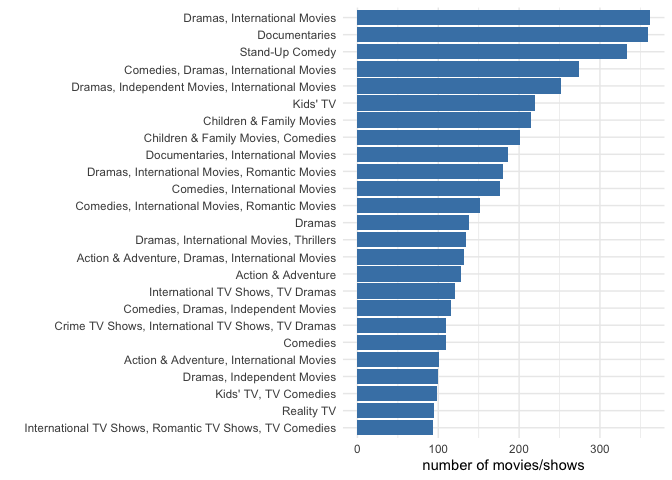
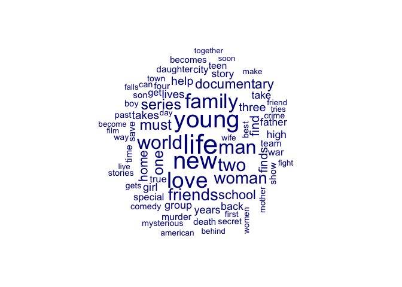
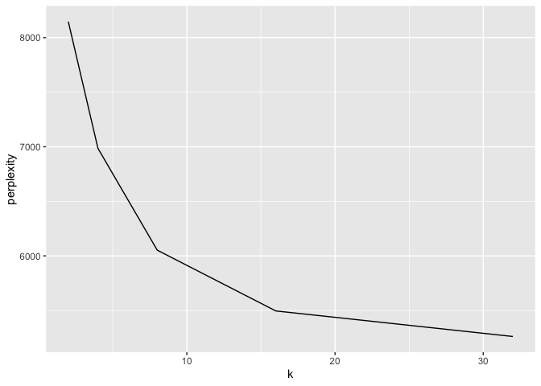
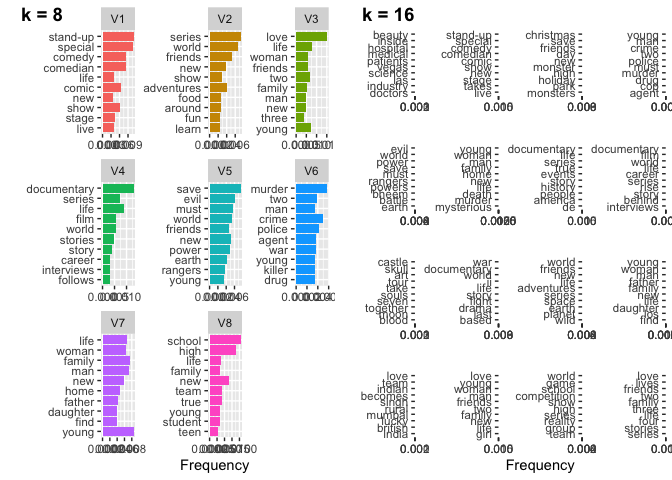

Unsupervised Text Classification II: More Advanced Topic Modeling (With
Solutions)
================
Philipp Masur, Wouter van Atteveld & Kasper Welbers
2022-11

-   <a href="#introduction" id="toc-introduction">Introduction</a>
    -   <a href="#loading-netflix-data" id="toc-loading-netflix-data">Loading
        Netflix data</a>
    -   <a href="#text-preprocessing" id="toc-text-preprocessing">Text
        preprocessing</a>
-   <a href="#topic-modeling" id="toc-topic-modeling">Topic Modeling</a>
    -   <a href="#training-the-lda-model"
        id="toc-training-the-lda-model">Training the LDA model</a>
    -   <a href="#calculating-perplexity"
        id="toc-calculating-perplexity">Calculating perplexity</a>
    -   <a href="#comparing-several-models"
        id="toc-comparing-several-models">Comparing several models</a>
    -   <a href="#extracting-different-models"
        id="toc-extracting-different-models">Extracting different models</a>
-   <a href="#conclusion" id="toc-conclusion">Conclusion</a>

# Introduction

Topic models such as LDA allow you to specify the number of topics in
the model. On the one hand, this is a nice thing, because it allows you
to adjust the granularity of what topics measure: between a few broad
topics and many more specific topics. On the other hand, it begets the
question what the best number of topics is.

The short and perhaps disappointing answer is that the best number of
topics does not exist. After all, there is no singular idea of what a
topic even is is. What a good topic is also depends on what you want to
do. If you want to use topic modeling to interpret what a corpus is
about, you want to have a limited number of topics that provide a good
representation of overall themes. Alternatively, if you want to use
topic modeling to get topic assignments per document without actually
interpreting the individual topics (e.g., for document clustering,
supervised machine l earning), you might be more interested in a model
that fits the data as good as possible.

Still, even if the best number of topics does not exist, some values for
k (i.e. the number of topics) are better than others. Use too few
topics, and there will be variance in the data that is not accounted
for, but use too many topics and you will overfit. So how can we at
least determine what a good number of topics is?

One approach is to look at how well our model fits the data. As a
probabilistic model, we can calculate the (log) likelihood of observing
data (a corpus) given the model parameters (the distributions of a
trained LDA model). For models with different settings for k, and
different hyperparameters, we can then see which model best fits the
data. The nice thing about this approach is that it’s easy and free to
compute. However, it still has the problem that no human interpretation
is involved. We still need to look at the solutions and “make sense of
it”.

## Loading Netflix data

For this tutorial, we are going to use a data set that contains
information about more than \~8000 netflix movies and shows. You can
download the data from Canvas. Let’s quickly check out the data set.

``` r
# Loading packages
library(tidyverse)
library(quanteda)
library(topicmodels)

# Loading data
d <- read_csv("data/netflix_titles.csv")
head(d)
```

| show_id | type    | title                 | director        | cast                                                                                                                                                                                                                                                                                                            | country       | date_added         | release_year | rating | duration  | listed_in                                                     | description                                                                                                                                              |
|:--------|:--------|:----------------------|:----------------|:----------------------------------------------------------------------------------------------------------------------------------------------------------------------------------------------------------------------------------------------------------------------------------------------------------------|:--------------|:-------------------|-------------:|:-------|:----------|:--------------------------------------------------------------|:---------------------------------------------------------------------------------------------------------------------------------------------------------|
| s1      | Movie   | Dick Johnson Is Dead  | Kirsten Johnson | NA                                                                                                                                                                                                                                                                                                              | United States | September 25, 2021 |         2020 | PG-13  | 90 min    | Documentaries                                                 | As her father nears the end of his life, filmmaker Kirsten Johnson stages his death in inventive and comical ways to help them both face the inevitable. |
| s2      | TV Show | Blood & Water         | NA              | Ama Qamata, Khosi Ngema, Gail Mabalane, Thabang Molaba, Dillon Windvogel, Natasha Thahane, Arno Greeff, Xolile Tshabalala, Getmore Sithole, Cindy Mahlangu, Ryle De Morny, Greteli Fincham, Sello Maake Ka-Ncube, Odwa Gwanya, Mekaila Mathys, Sandi Schultz, Duane Williams, Shamilla Miller, Patrick Mofokeng | South Africa  | September 24, 2021 |         2021 | TV-MA  | 2 Seasons | International TV Shows, TV Dramas, TV Mysteries               | After crossing paths at a party, a Cape Town teen sets out to prove whether a private-school swimming star is her sister who was abducted at birth.      |
| s3      | TV Show | Ganglands             | Julien Leclercq | Sami Bouajila, Tracy Gotoas, Samuel Jouy, Nabiha Akkari, Sofia Lesaffre, Salim Kechiouche, Noureddine Farihi, Geert Van Rampelberg, Bakary Diombera                                                                                                                                                             | NA            | September 24, 2021 |         2021 | TV-MA  | 1 Season  | Crime TV Shows, International TV Shows, TV Action & Adventure | To protect his family from a powerful drug lord, skilled thief Mehdi and his expert team of robbers are pulled into a violent and deadly turf war.       |
| s4      | TV Show | Jailbirds New Orleans | NA              | NA                                                                                                                                                                                                                                                                                                              | NA            | September 24, 2021 |         2021 | TV-MA  | 1 Season  | Docuseries, Reality TV                                        | Feuds, flirtations and toilet talk go down among the incarcerated women at the Orleans Justice Center in New Orleans on this gritty reality series.      |
| s5      | TV Show | Kota Factory          | NA              | Mayur More, Jitendra Kumar, Ranjan Raj, Alam Khan, Ahsaas Channa, Revathi Pillai, Urvi Singh, Arun Kumar                                                                                                                                                                                                        | India         | September 24, 2021 |         2021 | TV-MA  | 2 Seasons | International TV Shows, Romantic TV Shows, TV Comedies        | In a city of coaching centers known to train India’s finest collegiate minds, an earnest but unexceptional student and his friends navigate campus life. |
| s6      | TV Show | Midnight Mass         | Mike Flanagan   | Kate Siegel, Zach Gilford, Hamish Linklater, Henry Thomas, Kristin Lehman, Samantha Sloyan, Igby Rigney, Rahul Kohli, Annarah Cymone, Annabeth Gish, Alex Essoe, Rahul Abburi, Matt Biedel, Michael Trucco, Crystal Balint, Louis Oliver                                                                        | NA            | September 24, 2021 |         2021 | TV-MA  | 1 Season  | TV Dramas, TV Horror, TV Mysteries                            | The arrival of a charismatic young priest brings glorious miracles, ominous mysteries and renewed religious fervor to a dying town desperate to believe. |

As we can see, the data set contains also some meta data that might be
interesting to explore. Let’s first check how many movies vs. shows are
included. Let’s also look at the “listed_in” column which seems to be
somewhat similar to “topic”/genre.

``` r
# What types are included
d %>%
  group_by(type) %>% 
  count
```

    ## # A tibble: 2 × 2
    ## # Groups:   type [2]
    ##   type        n
    ##   <chr>   <int>
    ## 1 Movie    6131
    ## 2 TV Show  2676

``` r
# Categories
d %>%
  group_by(listed_in) %>%
  count %>%
  arrange(-n) %>%
  head(n = 25) %>%
  ggplot(aes(x = fct_reorder(listed_in, n), y = n)) +
  geom_col(fill = "steelblue") +
  coord_flip() +
  labs(x = "", y = "number of movies/shows") +
  theme_minimal()
```

<!-- -->

We can see that movies and shows are listed in different categories. The
combination of dramas and international movies is most frequent in the
data set.

We are going to disregard the available meta-data and use the titles and
description to fit a topic model. Perhaps we are able to identify themes
in movies and shows?

## Text preprocessing

Of course, we again need to engage in some preprocessing. First, we
merge the title and the description, the we create a corpus. With regard
to text preprocessing, we remove punctuation and numbers and also remove
stopwords.

``` r
# Creating a corpus
corp <- d %>%
  mutate(text = paste(title, description)) %>%
  corpus(text = "text")

# Further preprocessing
dtm <- corp %>%
  tokens(remove_punct = T, remove_numbers = T) %>%
  tokens_remove(stopwords("en")) %>%
  dfm
dtm
```

    ## Document-feature matrix of: 8,807 documents, 24,625 features (99.93% sparse) and 12 docvars.
    ##        features
    ## docs    dick johnson dead father nears end life filmmaker kirsten stages
    ##   text1    1       2    1      1     1   1    1         1       1      1
    ##   text2    0       0    0      0     0   0    0         0       0      0
    ##   text3    0       0    0      0     0   0    0         0       0      0
    ##   text4    0       0    0      0     0   0    0         0       0      0
    ##   text5    0       0    0      0     0   0    1         0       0      0
    ##   text6    0       0    0      0     0   0    0         0       0      0
    ## [ reached max_ndoc ... 8,801 more documents, reached max_nfeat ... 24,615 more features ]

As always, let’s quickyl check the most frequent words and whether they
could make sense in representing different topics.

``` r
library(quanteda.textplots)
textplot_wordcloud(dtm, min_count = 10, max_words = 75)
```

<!-- -->

Seems like a lot of movie description contain the words “love”, “life”,
and “young”.

Now in this tutorial, we not just want to fit one topic model with an
arbitrary number of topics. We want to explore a bit further what a
“good” number of topics is. We do so by investigating the perplexity
score of different topic models.

To calculate this sort of goodness-of-fit measure, we’ll first have to
split up our data into data for training and testing the model. This way
we prevent overfitting the model. Here we’ll use 75% for training, and
held-out the remaining 25% for test data.

``` r
# Convert dtm to topicmodels' specific format
dtm <- convert(dtm, to = "topicmodels") 
train <- sample(rownames(dtm), nrow(dtm) * .75)
dtm_train <- dtm[rownames(dtm) %in% train, ]
dtm_test <- dtm[!rownames(dtm) %in% train, ]
```

# Topic Modeling

## Training the LDA model

Let’s first repeat the standard procedure and fit one topic model. But
to get get an indication of how ‘good’ a model is, we train it only on
the training data.

``` r
# Set seed to make it reproducible
set.seed(1)

# Fit topic model
m <- LDA(dtm_train, 
         method = "Gibbs", 
         k = 10,  
         control = list(alpha = 0.1))
terms(m, 10)
```

| Topic 1 | Topic 2     | Topic 3     | Topic 4  | Topic 5     | Topic 6     | Topic 7 | Topic 8   | Topic 9    | Topic 10 |
|:--------|:------------|:------------|:---------|:------------|:------------|:--------|:----------|:-----------|:---------|
| save    | war         | school      | comedy   | series      | documentary | young   | crime     | friends    | love     |
| evil    | story       | high        | special  | world       | life        | woman   | murder    | christmas  | young    |
| power   | based       | student     | stand-up | people      | film        | family  | police    | new        | life     |
| must    | life        | students    | comedian | documentary | series      | new     | man       | adventure  | man      |
| world   | true        | life        | show     | explores    | story       | home    | cop       | adventures | woman    |
| battle  | world       | new         | comic    | food        | stories     | death   | drug      | get        | family   |
| earth   | drama       | competition | live     | around      | star        | man     | criminal  | day        | two      |
| rangers | journey     | girl        | stage    | stories     | interviews  | past    | detective | magic      | friends  |
| new     | documentary | world       | new      | lives       | one         | life    | agent     | little     | one      |
| fight   | events      | group       | life     | explore     | career      | father  | prison    | save       | new      |

**Question:** What genres/topics can we identify?

To better understand what topics really hide behind these latent
factors, let’s look at some of the titles and descriptions with the
highest probability:

``` r
topic.docs <- posterior(m)$topics[, 3] # Police/crime?
topic.docs <- sort(topic.docs, decreasing=T)
head(topic.docs)
```

    ##     text9  text3345   text219  text1607  text3401  text5237 
    ## 0.9550000 0.9550000 0.9526316 0.9500000 0.9500000 0.9500000

Again, given the document ids of the top documents, we can look up the
text in the corp corpus:

``` r
topdoc <- names(topic.docs)[2]
topdoc_corp <- corp[docnames(corp) == topdoc]
texts(topdoc_corp)
```

    ##                                                                                                                                                                            text3345 
    ## "The Boulet Brothers Dragula Ten queens must slay the competition and put their fiercest, filthiest faces forward for the chance to be crowned the world's next drag supermonster."

I guess this is indeed a crime/drama…

## Calculating perplexity

Conveniently, the topicmodels packages has a function called
`perplexity` which makes it very easy to test the model on the held-out
data and compute the perplexity score.

``` r
perplexity(m, dtm_test)
```

    ## [1] 5408.28

We get a single perplexity score for the model we created.
Unfortunately, it is not very meaningful. Is this a good or a bad model?

## Comparing several models

Of course, a single perplexity score is not really useful. What we want
to do is to calculate the perplexity score for models with different
parameters, to see how this affects the perplexity. Here we’ll use a for
loop to train a model with different topics, to see how this affects the
perplexity score. Note that this might take a little while to compute.

We can do this in different ways, but we technically have to fit
different models on the training data set and calculate their respective
perplexity score by testing it on the training data. One way of doing
this is using a so-called `map()` function from the `purrr` package
(included in the tidyverse). This may take a bit longer to fit, so we
have time to contemplate (or quickly go to the bathroom).

``` r
# create a dataframe with a variable k = number of topics
p <- tibble(k = c(2, 4, 8, 16, 32))


# Use `map()` to estimate a topic model for each value of k and store in new variable
p <- p %>%
  mutate(models = map(p$k, function(x){
    LDA(dtm_train, method = "Gibbs", k = x,  control = list(alpha = 0.01))
  })) 

# Use map()` to compute the perplexity score per model
p <- p %>%
  mutate(perplexity = map(p$models, function(x) perplexity(x, dtm_test))) %>%
  mutate(perplexity = unlist(perplexity))
```

Now we can plot the perplexity scores for different values of k.

``` r
ggplot(p, aes(x = k, y = perplexity)) + 
  geom_line()
```

<!-- -->

What we see here is that first the perplexity decreases as the number of
topics increases. This makes sense, because the more topics we have, the
more information we have. If we would use smaller steps in k we could
find the lowest point. If we repeat this several times for different
models, and ideally also for different samples of train and test data,
we could find a value for k of which we could argue that it is the
*best* in terms of model fit.

The lowest score seems to be somewhat reached with 16 topics. Yet, a
“knee” is perhaps already at 8 or 9 topics.

## Extracting different models

Because we stored the models in the resulting tibble `p`, we can assess
them individually and check out their topwords. Let’s check out 8 and 16
which seem to be close to a good fit (given the perplexity score). H

``` r
terms(p$models[[3]], 10)
```

| Topic 1  | Topic 2    | Topic 3 | Topic 4     | Topic 5 | Topic 6 | Topic 7  | Topic 8 |
|:---------|:-----------|:--------|:------------|:--------|:--------|:---------|:--------|
| stand-up | series     | love    | documentary | save    | murder  | young    | school  |
| special  | world      | life    | life        | evil    | crime   | family   | high    |
| comedy   | friends    | young   | series      | must    | police  | man      | new     |
| comedian | adventures | two     | film        | world   | two     | life     | team    |
| comic    | new        | friends | world       | new     | agent   | woman    | true    |
| show     | show       | woman   | stories     | power   | war     | new      | life    |
| stage    | food       | family  | story       | friends | killer  | home     | young   |
| life     | around     | man     | career      | earth   | drug    | father   | family  |
| live     | fun        | new     | follows     | rangers | young   | daughter | student |
| new      | learn      | three   | interviews  | young   | man     | find     | teen    |

``` r
terms(p$models[[4]], 10)
```

| Topic 1  | Topic 2  | Topic 3     | Topic 4    | Topic 5  | Topic 6 | Topic 7 | Topic 8     | Topic 9 | Topic 10 | Topic 11  | Topic 12 | Topic 13 | Topic 14   | Topic 15    | Topic 16    |
|:---------|:---------|:------------|:-----------|:---------|:--------|:--------|:------------|:--------|:---------|:----------|:---------|:---------|:-----------|:------------|:------------|
| beauty   | castle   | war         | series     | family   | indian  | love    | game        | love    | stand-up | christmas | crime    | evil     | young      | documentary | documentary |
| inside   | skull    | world       | world      | man      | becomes | life    | school      | life    | special  | friends   | man      | save     | new        | series      | life        |
| hospital | art      | ii          | friends    | young    | love    | young   | team        | two     | comedy   | new       | police   | world    | woman      | life        | film        |
| medical  | souls    | life        | adventures | father   | mumbai  | new     | high        | lives   | comedian | save      | murder   | power    | home       | true        | career      |
| patients | take     | documentary | new        | life     | rural   | man     | competition | family  | show     | day       | young    | must     | man        | story       | world       |
| science  | tour     | story       | space      | daughter | singh   | woman   | world       | three   | comic    | monster   | drug     | rangers  | family     | events      | series      |
| vegas    | seven    | fight       | planet     | los      | team    | two     | show        | four    | stage    | holiday   | cop      | earth    | life       | history     | rise        |
| industry | blood    | drama       | earth      | woman    | british | friends | series      | series  | takes    | high      | must     | powers   | death      | people      | behind      |
| las      | moon     | based       | wild       | new      | lucky   | family  | reality     | friends | live     | park      | two      | bheem    | mysterious | america     | story       |
| doctors  | together | last        | life       | find     | india   | girl    | group       | stories | new      | monsters  | agent    | battle   | murder     | de          | interviews  |

**Question:** Which topic model leads to more interpretable topics?

``` r
# Top words per topic in model with k = 8
plot_topwords <- function(n_topics, model, n = 10){
  
  tibble(topic = 1:n_topics) %>%
  apply(1, function(x) posterior(model)$terms[x,]) %>%
  as.data.frame() %>%
  rownames_to_column("terms") %>%
  as_tibble %>%
  gather(key, value, -terms) %>%
  dplyr::group_by(key) %>%
  arrange(key, -value) %>%
  slice(1:n) %>%
  ggplot(aes(x = fct_reorder(terms, value), 
             y = value,
             fill = key)) +
  geom_col() +
  facet_wrap(~key, scales = "free") +
  coord_flip() +
  theme(legend.position = "none") +
  labs(y = "Frequency", x = "")
}

k8  <- plot_topwords(n_topics = 8, model = p$models[[3]])
k16 <- plot_topwords(n_topics = 16, model = p$models[[4]])

library(cowplot)
plot_grid(k8, k16,
          labels = c("k = 8", "k = 16"),
          nrow = 1)  
```

<!-- -->

# Conclusion

There is no golden bullet. The choice for how many topics (k) is *best*
comes down to what you want to use topic models for. Predictive
validity, as measured with perplexity, is a good approach if you just
want to use the document X topic matrix as input for an analysis
(clustering, machine learning, etc.).

If you want to use topic modeling as a tool for bottom-up (inductive)
analysis of a corpus, it is still useful to look at perplexity scores,
but rather than going for the k that optimizes fit, you might want to
look for a “knee” in the plot, similar to how you would choose the
number of factors in a factor analysis. But more importantly, you’d need
to make sure that how you (or your coders) interpret the topics is not
just reading tea leaves.
