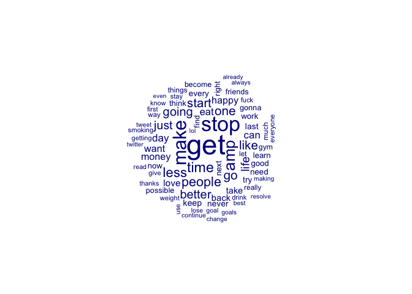

Unsupervised Text Classification I: Basics of Topic Modeling (With
solutions)
================
Wouter van Atteveldt, Kasper Welbers & Philipp Masur
2022-11

-   <a href="#introduction" id="toc-introduction">Introduction</a>
    -   <a href="#text-preprocessing" id="toc-text-preprocessing">Text
        Preprocessing</a>
    -   <a href="#excluding-very-frequent-words"
        id="toc-excluding-very-frequent-words">Excluding very frequent words</a>
-   <a href="#estimating-the-topic-model"
    id="toc-estimating-the-topic-model">Estimating the topic model</a>
    -   <a href="#running-the-lda-model" id="toc-running-the-lda-model">Running
        the LDA model</a>
    -   <a href="#inspecting-the-resulting-topic-word-lists"
        id="toc-inspecting-the-resulting-topic-word-lists">Inspecting the
        resulting topic word lists</a>
    -   <a href="#visualizing-lda-with-ldavis"
        id="toc-visualizing-lda-with-ldavis">Visualizing LDA with LDAvis</a>
-   <a href="#what-are-the-tweets-about"
    id="toc-what-are-the-tweets-about">What are the tweets about?</a>
    -   <a href="#probabilities-of-topics-per-tweet"
        id="toc-probabilities-of-topics-per-tweet">Probabilities of topics per
        tweet</a>
    -   <a href="#assigning-topics-to-tweets"
        id="toc-assigning-topics-to-tweets">Assigning topics to tweets</a>

# Introduction

LDA, which stands for Latent Dirichlet Allocation, is one of the most
popular approaches for probabilistic topic modeling. The goal of topic
modeling is to automatically assign topics to documents without
requiring human supervision. Although the idea of an algorithm figuring
out topics might sound close to magical (mostly because people have too
high expectations of what these ‘topics’ are), and the mathematics might
be a bit challenging, it is actually really simple fit an LDA topic
model in R.

A good first step towards understanding what topic models are and how
they can be useful, is to simply play around with them, so that’s what
we’ll do here. First, let’s load some data. In this case, it is a data
set of tweets on new years resolutions (you can download it from
Canvas).

``` r
library(tidyverse)
library(quanteda)
library(quanteda.textplots)
library(quanteda.textstats)

# Load data
d <- read_csv2("data/new_year_resolutions_dataset.csv")
head(d)
```

| resolution_topics                                     | gender | name                | resolution_category | retweet_count | text                                                                                                                                      | tweet_coord | tweet_created       | tweet_date |    tweet_id | tweet_location           | tweet_state | user_timezone              | tweet_region |
|:------------------------------------------------------|:-------|:--------------------|:--------------------|--------------:|:------------------------------------------------------------------------------------------------------------------------------------------|:------------|:--------------------|:-----------|------------:|:-------------------------|:------------|:---------------------------|:-------------|
| Eat healthier                                         | female | Dena_Marina         | Health & Fitness    |             0 | \#NewYearsResolution :: Read more books, No scrolling FB/checking email b4 breakfast, stay dedicated to PT/yoga to squash my achin’ back! | NA          | 2014-12-31 10:48:00 | 2014-12-31 | 5.50363e+17 | Southern California      | CA          | Pacific Time (US & Canada) | West         |
| Humor about Personal Growth and Interests Resolutions | female | ninjagirl325        | Humor               |             1 | \#NewYearsResolution Finally master @ZJ10 ’s part of Kitchen Sink                                                                         | NA          | 2014-12-31 10:47:00 | 2014-12-31 | 5.50363e+17 | New Jersey               | NJ          | Central Time (US & Canada) | Northeast    |
| Be More Confident                                     | male   | RickyDelReyy        | Personal Growth     |             0 | \#NewYearsResolution to stop being so damn perf *???*???                                                                                  | NA          | 2014-12-31 10:46:00 | 2014-12-31 | 5.50362e+17 | Hollywood                | CA          | Eastern Time (US & Canada) | West         |
| Other                                                 | male   | CalmareNJ           | Philanthropic       |             0 | My \#NewYearsResolution is to help my disabled patients discover the emotional and physical therapy from loving a pet. \#adoptarescue     | NA          | 2014-12-31 10:45:00 | 2014-12-31 | 5.50362e+17 | Metro NYC                | NY          | NA                         | Northeast    |
| Be more positive                                      | female | welovatoyoudemi     | Personal Growth     |             0 | \#NewYearsResolution \#2015Goals \#2015bucketlist continued??\_??? <http://t.co/h4P9B7tWjG>                                               | NA          | 2014-12-31 10:44:00 | 2014-12-31 | 5.50362e+17 | Pittsburgh, Pennsylvania | PA          | Eastern Time (US & Canada) | Northeast    |
| Eat healthier                                         | male   | EthanJMoroles       | Health & Fitness    |             0 | \#NewYearsResolution 1. Eat less.                                                                                                         |             |                     |            |             |                          |             |                            |              |
| 2.quit lying.                                         | NA     | 2014-12-31 10:43:00 | 2014-12-31          |   5.50362e+17 | Odessa Texas.                                                                                                                             | TX          | NA                  | South      |             |                          |             |                            |              |

As we can see, we get quite some information about the tweets. Although
we have already some “topics” in the data set, let’s assume we don’t
know yet about them and try to figure out what people write about.

## Text Preprocessing

Let’s first create a document term matrix from the tweets in `quanteda`.
Because it is tweets, we can already remove the “\#” and also get rid of
numbers and punctuation. For topic models, stopwords are really not that
useful, so we will get rid of them too:

``` r
# Removing hashtags and creating a corpus (always useful for later!)
corp <- d %>%
  mutate(text = str_remove_all(text, "#")) %>%
  corpus(text = "text")

# Further preprocessing
dtm <- corp %>%
  tokens(remove_punct = T, remove_numbers = T) %>%
  tokens_remove(stopwords("en")) %>%
  dfm
dtm
```

    ## Document-feature matrix of: 5,002 documents, 9,398 features (99.91% sparse) and 13 docvars.
    ##        features
    ## docs    newyearsresolution read books scrolling fb checking email b4 breakfast
    ##   text1                  1    1     1         1  1        1     1  1         1
    ##   text2                  1    0     0         0  0        0     0  0         0
    ##   text3                  1    0     0         0  0        0     0  0         0
    ##   text4                  1    0     0         0  0        0     0  0         0
    ##   text5                  1    0     0         0  0        0     0  0         0
    ##   text6                  1    0     0         0  0        0     0  0         0
    ##        features
    ## docs    stay
    ##   text1    1
    ##   text2    0
    ##   text3    0
    ##   text4    0
    ##   text5    0
    ##   text6    0
    ## [ reached max_ndoc ... 4,996 more documents, reached max_nfeat ... 9,388 more features ]

Let’s quickly make a wordcloud of the most used words in the tweets.
This is often an important as it will tell as about potential words that
we might want to include before running the topic model.

``` r
textplot_wordcloud(dtm, max_words = 75)
```

<!-- -->

``` r
textstat_frequency(dtm, n = 15)  
```

| feature            | frequency | rank | docfreq | group |
|:-------------------|----------:|-----:|--------:|:------|
| newyearsresolution |      3937 |    1 |    3932 | all   |
| new                |      1588 |    2 |    1478 | all   |
| resolution         |      1300 |    3 |    1269 | all   |
| years              |      1245 |    4 |    1203 | all   |
| rt                 |       681 |    5 |     674 | all   |
| year               |       534 |    6 |     500 | all   |
| get                |       501 |    7 |     470 | all   |
| stop               |       357 |    8 |     350 | all   |
| make               |       311 |    9 |     301 | all   |
| amp                |       254 |   10 |     231 | all   |
| time               |       218 |   11 |     210 | all   |
| less               |       205 |   12 |     190 | all   |
| people             |       200 |   13 |     199 | all   |
| go                 |       190 |   14 |     181 | all   |
| one                |       189 |   15 |     180 | all   |

## Excluding very frequent words

As we can see, almost all tweets contain the words
“newyearsresolution,”new”, “resolution”, or “year(s)”. These words
should be excluded, as they do not tell us anything about the topic,
they were probably part of the search queries used to scrape these
tweets. We further have Twitter-specific things such as “rt” (= retweet)
and “@” (=account mentions). We would probably do well by removing both
account names and abbreviations such as “rt”. We add asterix (\*) to
most of these words, so that the plural is remove as well.

``` r
# Textpreprocessing
dtm <- corp %>%
  tokens(remove_punct = T, remove_numbers = T) %>%
  tokens_remove(stopwords("en")) %>%
  tokens_remove(c("newyearsresolution*", "new", 
                  "year*", "newyear*", "resolution*", 
                  "rt", "happynewyear", "@*")) %>%
  tokens_select(min_nchar = 2) %>%
  dfm

# PLotting most frequent words
textplot_wordcloud(dtm, max_words = 75)
```

<!-- -->

This looks a lot better and we can proceed with the actual topic
modeling.

# Estimating the topic model

## Running the LDA model

To run LDA from a dfm, first convert to the topicmodels format, and then
run LDA. Note the use of set.seed(.) to make sure that the analysis is
reproducible. We arbitrarily choose 10 topics (but we could have chosen
another number as well!)

``` r
# Loading package
library(topicmodels)

# Convert dtm to topicmodels' specific format
dtm <- convert(dtm, to = "topicmodels") 

# Set seed to make it reproducible
set.seed(1)

# Fit topic model
m <- LDA(dtm, 
         method = "Gibbs", 
         k = 10,  
         control = list(alpha = 0.1))
m
```

    ## A LDA_Gibbs topic model with 10 topics.

Although LDA will figure out the topics, we do need to decide ourselves
how many topics we want. Also, there are certain hyperparameters (alpha)
that we can tinker with to have some control over the topic
distributions. For now, we won’t go into details, but do note that we
could also have asked for 100 topics, and our results would have been
much different.

Also a

value of 0.1 for all topics makes sure that we do not necessarily skew
towards one topic per tweet (as many tweets even contain lists of
several new year’s resolutions).

## Inspecting the resulting topic word lists

We can use `terms()` to look at the top terms per topic:

``` r
terms(m, 15)
```

| Topic 1 | Topic 2 | Topic 3  | Topic 4   | Topic 5 | Topic 6 | Topic 7    | Topic 8 | Topic 9  | Topic 10 |
|:--------|:--------|:---------|:----------|:--------|:--------|:-----------|:--------|:---------|:---------|
| start   | one     | make     | eat       | get     | people  | stop       | stop    | amp      | better   |
| gym     | read    | money    | less      | want    | life    | now        | tweet   | love     | make     |
| weight  | write   | possible | drink     | back    | stop    | right      | use     | find     | life     |
| get     | amp     | thanks   | never     | \_\_    | just    | go         | less    | meet     | amp      |
| lose    | learn   | time     | day       | job     | make    | smoking    | people  | know     | keep     |
| last    | day     | spend    | healthier | lol     | let     | cigarettes | start   | get      | like     |
| going   | start   | save     | every     | go      | want    | supper     | time    | like     | good     |
| day     | book    | get      | eating    | shape   | like    | club       | twitter | god      | best     |
| back    | really  | friends  | food      | like    | things  | game       | happy   | happy    | can      |
| goals   | instead | buy      | stop      | stay    | way     | games      | social  | people   | friends  |
| workout | books   | bitches  | watch     | just    | never   | already    | daily   | one      | try      |
| time    | finish  | less     | going     | really  | time    | oh         | take    | become   | person   |
| getting | goal    | family   | resolve   | take    | give    | see        | media   | everyone | happy    |
| days    | play    | long     | gonna     | better  | say     | quit       | think   | tell     | just     |
| go      | time    | see      | give      | find    | go      | watch      | day     | man      | love     |

**Question:** Any ideas what these topics stand for?

The posterior function gives the posterior distribution of words and
documents to topics, which can be used to plot a word cloud of terms
proportional to their occurrence:

``` r
topic <- 7
words <- posterior(m)$terms[topic, ]
topwords <- head(sort(words, decreasing = T), n = 50)
head(topwords, 10) 
```

    ##        stop         now       right          go     smoking  cigarettes 
    ## 0.049231041 0.021242119 0.020947499 0.020063638 0.020063638 0.012992752 
    ##      supper        club        game       games 
    ## 0.011225031 0.011225031 0.007689588 0.006216487

Now we can plot these words:

``` r
library(wordcloud)
wordcloud(names(topwords), topwords)
```

<!-- -->

This topic seems about “stopping” something and particularly about
stopping to smoke, but there are other words that suggest that these
topic is more complex.

**Exercise:** Pick another topic and check out the most used words. What
is it about?

``` r
topic <- 2
words <- posterior(m)$terms[topic, ]
topwords <- head(sort(words, decreasing = T), n = 50)
head(topwords, 10) 
```

    ##         one        read       write         amp       learn         day 
    ## 0.024659582 0.016910218 0.012205247 0.012205247 0.011928484 0.010821433 
    ##       start        book      really     instead 
    ## 0.010544670 0.009160855 0.008884092 0.008330566

``` r
wordcloud(names(topwords), topwords)
```

<!-- -->

Of course, it would be interesting to plot all topwords of all topics in
one go. We can do that with a little data wrangling. Run each line after
another to understand what is happening here.

``` r
tibble(topic = 1:10) %>%
  apply(1, function(x) posterior(m)$terms[x,]) %>%
  as.data.frame() %>%
  rownames_to_column("terms") %>%
  as_tibble %>%
  gather(key, value, -terms) %>%
  group_by(key) %>%
  arrange(key, -value) %>%
  slice(1:10) %>%
  ggplot(aes(x = fct_reorder(terms, value), 
             y = value,
             fill = key)) +
  geom_col() +
  facet_wrap(~key, scales = "free", nrow = 2) +
  coord_flip() +
  theme(legend.position = "none") +
  labs(y = "Frequency", x = "",
       title = "Topwords per Topic")
```

<!-- -->

We can also look at the topics per document, to find the top documents
per topic:

``` r
topic.docs <- posterior(m)$topics[, 7] 
topic.docs <- sort(topic.docs, decreasing=T)
head(topic.docs)
```

    ##  text1979  text2669  text1543  text1577  text1915  text1921 
    ## 0.9307692 0.9250000 0.9181818 0.9181818 0.9181818 0.9181818

We see for example that the tweets 1979 has a 93% probability of being
about topic 9 (stop smoking/drinking). Given the document ids of the top
documents, we can look up the text in the corp corpus

``` r
topdoc <- names(topic.docs)[1]
topdoc_corp <- corp[docnames(corp) == topdoc]
texts(topdoc_corp)
```

    ##                                                                                                                         text1979 
    ## "???@chrisbrown: Supper club right now!!!! NewYearsResolution stop smoking cigarettes??yasss leave them cancer sticks alone _??"

This seems to be indeed about this type of new years resolutions. What
about the second most probable tweet?

## Visualizing LDA with LDAvis

`LDAvis` is a nice interactive visualization of LDA results. It needs
the LDA and DTM information in a slightly different format than what’s
readily available, but you can use the code below to create that format
from the lda model `m` and the `dtm`. If you don’t have it yet, you’ll
have to install the `LDAvis` package, and you might also have to install
the `servr` package.

``` r
library(LDAvis)   

dtm <- dtm[slam::row_sums(dtm) > 0, ]
phi <- as.matrix(posterior(m)$terms)
theta <- as.matrix(posterior(m)$topics)
vocab <- colnames(phi)
doc.length <- slam::row_sums(dtm)
term.freq <- slam::col_sums(dtm)[match(vocab, colnames(dtm))]

json <- createJSON(phi = phi, theta = theta, vocab = vocab,
     doc.length = doc.length, term.frequency = term.freq)
serVis(json)
```

# What are the tweets about?

## Probabilities of topics per tweet

The posterior function also gives the posterior distribution documents
to topics. This is interesting to understand which tweet is about what:

``` r
topic_prob <- posterior(m)$topics
head(topic_prob) %>%
  round(4)
```

|       |      1 |      2 |      3 |      4 |      5 |      6 |      7 |      8 |      9 |     10 |
|:------|-------:|-------:|-------:|-------:|-------:|-------:|-------:|-------:|-------:|-------:|
| text1 | 0.2562 | 0.5688 | 0.0063 | 0.0063 | 0.0688 | 0.0063 | 0.0063 | 0.0063 | 0.0063 | 0.0688 |
| text2 | 0.0167 | 0.0167 | 0.0167 | 0.0167 | 0.0167 | 0.3500 | 0.0167 | 0.5167 | 0.0167 | 0.0167 |
| text3 | 0.0250 | 0.0250 | 0.0250 | 0.0250 | 0.0250 | 0.7750 | 0.0250 | 0.0250 | 0.0250 | 0.0250 |
| text4 | 0.0091 | 0.0091 | 0.0091 | 0.0091 | 0.0091 | 0.0091 | 0.0091 | 0.0091 | 0.3727 | 0.5545 |
| text5 | 0.0200 | 0.0200 | 0.0200 | 0.0200 | 0.0200 | 0.0200 | 0.0200 | 0.0200 | 0.0200 | 0.8200 |
| text6 | 0.0200 | 0.0200 | 0.0200 | 0.8200 | 0.0200 | 0.0200 | 0.0200 | 0.0200 | 0.0200 | 0.0200 |

As we can see, most tweets are about several topics (suggesting that
people mention several resolutions per tweet). But text 3, for example,
has a quite high probability to be about topic 6!

We can of course also plot this as a bar plot:

``` r
# Transforming the data set for plotting
(topic_prob_long <- topic_prob %>%
  as.data.frame %>%
  rownames_to_column("docs") %>%
  gather(topic, value, -docs) %>%
  as_tibble %>%
  arrange(docs, value)) %>%
  head()
```

| docs  | topic |   value |
|:------|:------|--------:|
| text1 | 3     | 0.00625 |
| text1 | 4     | 0.00625 |
| text1 | 6     | 0.00625 |
| text1 | 7     | 0.00625 |
| text1 | 8     | 0.00625 |
| text1 | 9     | 0.00625 |

``` r
# Picking three tweets and plot their probabilitees
topic_prob_long %>%
  filter(docs == "text1" | docs == "text2" | docs == "text3") %>%
  ggplot(aes(x = fct_reorder(topic, value), y = value, fill = docs)) +
  geom_col() +
  coord_flip() +
  facet_wrap(~docs) +
  labs(y = "Probability of a tweet being about a certain topic", 
       x = "Topic",
       title = "Probabilites of the first three tweets being about a certain topic") +
  theme(legend.position = "none")
```

<!-- -->

Here we can see that text1 contains more than one topic. Text 3, in
contrast, seems to be only about topic 6.

## Assigning topics to tweets

If we group by documents and filter out the max probability, we assign
each tweet the most probable topic (in some cases, this can mean that
two topics with the same probabilities are both assigned to a text):

``` r
(topic_table <- topic_prob_long %>%
  group_by(docs) %>%
  filter(value == max(value)))
```

    ## # A tibble: 5,707 × 3
    ## # Groups:   docs [4,989]
    ##    docs     topic value
    ##    <chr>    <chr> <dbl>
    ##  1 text1    2     0.569
    ##  2 text10   2     0.525
    ##  3 text100  9     0.555
    ##  4 text1000 9     0.775
    ##  5 text1001 10    0.82 
    ##  6 text1002 8     0.443
    ##  7 text1003 2     0.7  
    ##  8 text1004 6     0.7  
    ##  9 text1005 5     0.35 
    ## 10 text1005 9     0.35 
    ## # … with 5,697 more rows

Rather than using an arbitrary threshold, we can also work with the raw
probabilities and, for example, look the prevalence of the topics in the
data set.

``` r
topic_prob_long %>%
  group_by(topic) %>%
  summarize(prop = mean(value)) %>%
  ggplot(aes(x = fct_reorder(topic, prop), y = prop, fill = topic)) +
    geom_col() +
    coord_flip() +
    theme(legend.position = "none") +
    labs(x = "", y = "Proportion in the entire corpus")
```

<!-- -->

Bear in mind, we arbitrarily chose 10 topics for our LDA topic model. In
the next session, we will explore ways to identify the best number of
topics.

**Exercise:** Re-run the topic model with a different number of topics
(e.g., 20, 50, 100). How do the resulting topics differ from the first
analysis? Are they more or less interpretable?

``` r
m2 <- LDA(dtm, 
         method = "Gibbs", 
         k = 20,  
         control = list(alpha = 0.1))
terms(m2, 10)
```

| Topic 1  | Topic 2 | Topic 3  | Topic 4  | Topic 5 | Topic 6   | Topic 7 | Topic 8   | Topic 9 | Topic 10   | Topic 11 | Topic 12 | Topic 13 | Topic 14 | Topic 15 | Topic 16 | Topic 17 | Topic 18 | Topic 19 | Topic 20 |
|:---------|:--------|:---------|:---------|:--------|:----------|:--------|:----------|:--------|:-----------|:---------|:---------|:---------|:---------|:---------|:---------|:---------|:---------|:---------|:---------|
| best     | get     | start    | get      | goals   | learn     | twitter | eat       | day     | stop       | like     | stop     | make     | get      | better   | drink    | life     | take     | go       | read     |
| become   | like    | keep     | \_\_     | goal    | really    | use     | less      | every   | now        | try      | people   | money    | weight   | amp      | less     | things   | time     | one      | write    |
| can      | fuck    | getting  | back     | amp     | something | social  | time      | gym     | right      | people   | much     | possible | lose     | love     | give     | just     | wear     | time     | book     |
| find     | job     | starting | go       | fitness | amp       | less    | spend     | week    | smoking    | know     | make     | thanks   | gain     | make     | coffee   | let      | day      | watch    | finish   |
| never    | oh      | healthy  | already  | plan    | one       | tweet   | food      | going   | cigarettes | going    | time     | happy    | going    | continue | water    | live     | stop     | see      | books    |
| gonna    | last    | amp      | shit     | meet    | play      | media   | healthier | last    | supper     | say      | just     | save     | fat      | person   | buy      | work     | one      | game     | instead  |
| like     | look    | working  | bed      | set     | want      | people  | better    | one     | club       | think    | want     | daily    | pounds   | friends  | diet     | way      | care     | next     | really   |
| everyone | stay    | tomorrow | life     | lol     | fun       | resolve | next      | go      | quit       | make     | making   | tweet    | gym      | god      | wine     | never    | better   | going    | first    |
| want     | bitches | days     | together | need    | travel    | often   | become    | start   | getting    | just     | start    | big      | school   | happy    | drinking | happy    | like     | games    | remember |
| someone  | bitch   | early    | broke    | make    | need      | think   | healthy   | back    | good       | can      | think    | last     | wanna    | find     | soda     | want     | everyday | well     | must     |
