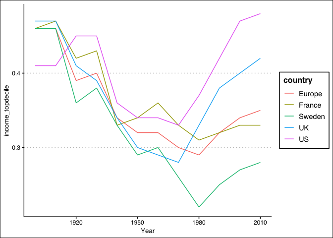
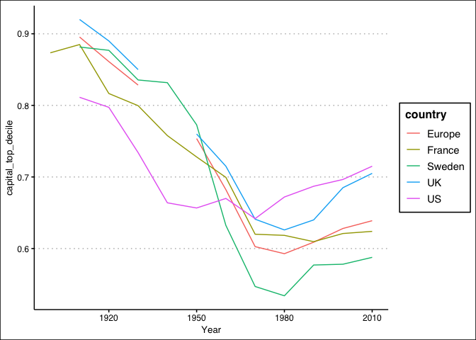
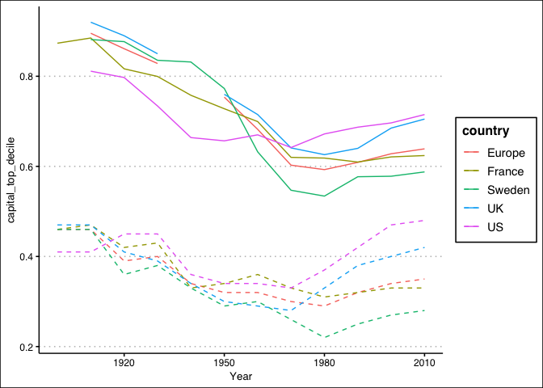
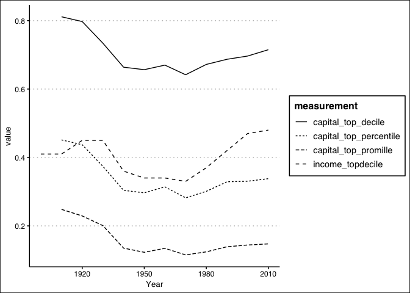
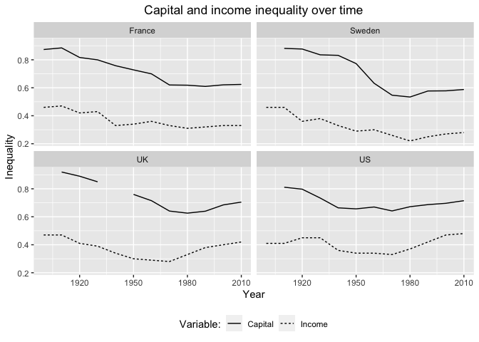

Reshaping data: wide, long, and tidy
================
Wouter van Atteveldt, Kasper Welbers & Philipp Masur
2021-10

-   [Introduction: Long and Wide data](#introduction-long-and-wide-data)
-   [Before we start: Getting and cleaning the
    data](#before-we-start-getting-and-cleaning-the-data)
-   [Wide to long: stacking columns](#wide-to-long-stacking-columns)
-   [A more complicated case: wealth
    inequality](#a-more-complicated-case-wealth-inequality)
    -   [Pivot longer (wide to long)](#pivot-longer-wide-to-long)
    -   [Separating columns (splitting one column into
        two)](#separating-columns-splitting-one-column-into-two)
    -   [Pivot wider (long to wide)](#pivot-wider-long-to-wide)
-   [Recoding data](#recoding-data)
-   [Combining and plotting data](#combining-and-plotting-data)
    -   [Tidyness as a matter of
        perception](#tidyness-as-a-matter-of-perception)

This tutorial discusses how to *reshape* data, particularly from long to
wide format and vice versa. It mostly follows [Chapter 12 of the R4DS
book](http://r4ds.had.co.nz/tidy-data.html), but uses the `pivot_longer`
and `pivot_wider` functions that replaced `gather` and `spread`[1]. At
the time of writing these functions are not yet in the book, but the
writers explain the change and the new functions
[here](https://tidyr.tidyverse.org/dev/articles/pivot.html).

# Introduction: Long and Wide data

In a data matrix, normally the rows consist of observations (cases,
respondents) and the columns of variables containing information about
these cases. As explained in the chapter referenced above, in the
`tidyverse` philosophy data is said to be tidy if each observation
(case) is exactly one row, and each measurement (variable) is exactly
one column. Data is said to be ‘untidy’ if for example the columns
represents measurement years in a longitudinal data set, where each year
is really its own observation. Thus, using the names of the tidyverse
functions, there is a need to `pivot_longer` information from multiple
columns into a single column, or inversely to `pivot_wider` it from one
column accross multiple columns.

Note that what is called ‘tidy’ here is what is also often called a
*long* data format, with most information in separate rows, while a
*wide* data format contains most information in separate columns.
Another way to view the functions is that `pivot_longer` transforms data
from wide to long (also called variables to cases), and `pivot_wider`
converts data from long to wide (cases to variables).

For reference, `long` data is sometimes also referred to as `stacked`
data, because the data is represented as rows that are stacked on top of
each other.

# Before we start: Getting and cleaning the data

For this tutorial we will use the data from Piketty’s Capital in the
21st Century. In particular, we will work with the data on income
inquality, with the goal of making a graph showing the evolution of
income inequality in different countries.

For this, we load the income inequality data set and remove missing
values.

``` r
library(tidyverse)
library(ggthemes)
base <- "https://raw.githubusercontent.com/ccs-amsterdam/r-course-material/master/data"
income_raw <- read_csv(paste(base, "income_topdecile.csv", sep = "/")) %>% na.omit
income_raw
```

| Year | U.S. | U.K. | Germany | France | Sweden | Europe |
|-----:|-----:|-----:|--------:|-------:|-------:|-------:|
| 1900 | 0.41 | 0.47 |    0.45 |   0.46 |   0.46 |   0.46 |
| 1910 | 0.41 | 0.47 |    0.44 |   0.47 |   0.46 |   0.46 |
| 1920 | 0.45 | 0.41 |    0.39 |   0.42 |   0.36 |   0.39 |
| 1930 | 0.45 | 0.39 |    0.42 |   0.43 |   0.38 |   0.40 |
| 1940 | 0.36 | 0.34 |    0.34 |   0.33 |   0.33 |   0.34 |
| 1950 | 0.34 | 0.30 |    0.33 |   0.34 |   0.29 |   0.32 |
| 1960 | 0.34 | 0.29 |    0.31 |   0.36 |   0.30 |   0.32 |
| 1970 | 0.33 | 0.28 |    0.31 |   0.33 |   0.26 |   0.30 |
| 1980 | 0.37 | 0.33 |    0.32 |   0.31 |   0.22 |   0.29 |
| 1990 | 0.42 | 0.38 |    0.34 |   0.32 |   0.25 |   0.32 |
| 2000 | 0.47 | 0.40 |    0.36 |   0.33 |   0.27 |   0.34 |
| 2010 | 0.48 | 0.42 |    0.36 |   0.33 |   0.28 |   0.35 |

Note that Piketty’s data is published as excel files with complex
(multi-row) headers, so we uploaded a cleaned version of the data to our
github repository. Even though this data is slightly cleaner, you will
see that there is plenty to be done to get this data in shape!

# Wide to long: stacking columns

As you can see (after getting rid of missing values), the data stores
the share of income going to the top decile/percentile of earners per
decade per country. This data is ‘wide’, in the sense that the columns
contain observations, while it is normally better (or tidier) to have
the observations in different rows. As we will see, that will make it
easier to combine or adjust the data later on.

In the tidyverse, the function used for transforming data from columns
(wide) to rows (long) is `pivot_longer`: the idea is that you stack the
information from multiple columns into a single, longer column.

The syntax for calling `pivot_longer` is as follows:
`pivot_longer(data, columns, names_to="key_column", values_to="value_column")`.
The first argument is the data (unless you use pipe notation, as shown
below). The second argument, columns, is a list of columns which need to
be gathered in a single column. You can list the columns one by one, or
specify them as a sequence `first:last`. The `names_to=` argument
specifies the name of a new column that will hold the names of the
observations, i.e. the old column names. In our case, that would be
`country` since the columns refer to countries. The `values_to=`
argument specifies the name of the new column that will hold the values,
in our case the top-decile of incomes.

Note that (similar to mutate and other tidyverse functions), the column
names don’t need to be quoted as long as they don’t contain spaces or
other characters that are invalid in R names.

``` r
# as always, you can use either %>% notation or specify the data as first argument. so, the below two commands are equivalent

# using pipe (%>%) notation
income <- income_raw %>% 
  pivot_longer(U.S.:Europe, names_to = 'country', values_to = 'income_topdecile')

# without using pipe notation
income <- pivot_longer(income_raw, U.S.:Europe, names_to = 'country', values_to = 'income_topdecile')

# Check results
head(income)
```

| Year | country | income\_topdecile |
|-----:|:--------|------------------:|
| 1900 | U.S.    |              0.41 |
| 1900 | U.K.    |              0.47 |
| 1900 | Germany |              0.45 |
| 1900 | France  |              0.46 |
| 1900 | Sweden  |              0.46 |
| 1900 | Europe  |              0.46 |

As you can see, every row now specifies the income inequality in a
single country in a single year (or actually, decade).

Note that in tidyverse style, you can also use negative select to
indicate which column NOT to pivot to longer. The following
`pivot_longer` gives the same results as above.

``` r
income <- pivot_longer(income_raw, -Year, names_to = 'country', values_to = 'income_topdecile')
```

# A more complicated case: wealth inequality

Let’s now look at the wealth inequality data from Piketty. Of course,
there is nothing inherently more complex about wealth inequality than
income inequality (from the data side, at least), but in this particular
case the columns contain the country as well as the measurement level
(top-decile, percentile, or promille):

``` r
wealth_raw = read_csv(paste(base, "wealth_inequality.csv", sep = "/"))
head(wealth_raw)
```

| Year | France: top decile | France: top percentile | France: top promille | Paris: top percentile | United Kingdom: top decile | United Kingdom: top percentile | United Kingdom: top promille | United States: top decile | United States: top percentile | United States: top promille | Sweden: top decile | Sweden: top percentile | Sweden: top promille | Europe: top decile | Europe: top percentile | Europe: top promille |
|-----:|-------------------:|-----------------------:|---------------------:|----------------------:|---------------------------:|-------------------------------:|:-----------------------------|--------------------------:|------------------------------:|----------------------------:|-------------------:|-----------------------:|---------------------:|-------------------:|-----------------------:|---------------------:|
| 1810 |          0.7987878 |              0.4559315 |            0.1714207 |             0.5373680 |                      0.829 |                          0.549 | NA                           |                      0.58 |                          0.25 |                          NA |              0.839 |                  0.559 |                   NA |          0.8222626 |              0.5213105 |                   NA |
| 1820 |          0.8184428 |              0.4671502 |            0.1897876 |             0.5901246 |                         NA |                             NA | NA                           |                        NA |                            NA |                          NA |                 NA |                     NA |                   NA |                 NA |                     NA |                   NA |
| 1830 |          0.8322110 |              0.4750088 |            0.1712431 |             0.5196643 |                         NA |                             NA | NA                           |                        NA |                            NA |                          NA |                 NA |                     NA |                   NA |                 NA |                     NA |                   NA |
| 1840 |          0.8041448 |              0.4595514 |            0.1548735 |             0.5255459 |                         NA |                             NA | NA                           |                        NA |                            NA |                          NA |                 NA |                     NA |                   NA |                 NA |                     NA |                   NA |
| 1850 |          0.8243943 |              0.5027017 |            0.1935376 |             0.5857911 |                         NA |                             NA | NA                           |                        NA |                            NA |                          NA |                 NA |                     NA |                   NA |                 NA |                     NA |                   NA |
| 1860 |          0.8371019 |              0.5199536 |            0.1829920 |             0.5511360 |                         NA |                             NA | NA                           |                        NA |                            NA |                          NA |                 NA |                     NA |                   NA |                 NA |                     NA |                   NA |

``` r
colnames(wealth_raw)
```

    ##  [1] "Year"                           "France: top decile"            
    ##  [3] "France: top percentile"         "France: top promille"          
    ##  [5] "Paris: top percentile"          "United Kingdom: top decile"    
    ##  [7] "United Kingdom: top percentile" "United Kingdom: top promille"  
    ##  [9] "United States: top decile"      "United States: top percentile" 
    ## [11] "United States: top promille"    "Sweden: top decile"            
    ## [13] "Sweden: top percentile"         "Sweden: top promille"          
    ## [15] "Europe: top decile"             "Europe: top percentile"        
    ## [17] "Europe: top promille"

As you can see from the column specification or the output, it somehow
parsed the UK promille column as logical (TRUE/FALSE) data rather than
as double (numeric) data. On inspection this is caused by there not
being any values whatsoever. In this case it probably isn’t harmfull (R
treats FALSE as 0 and TRUE as 1), but it’s good practice to keep you
data types in check. So, we should now either convert the column to
numeric, or simply drop it:

``` r
# you can use either option below:
wealth_raw <- mutate(wealth_raw, `United Kingdom: top promille`= as.numeric(`United Kingdom: top promille`))
wealth_raw <- select(wealth_raw, -`United Kingdom: top promille`)
```

## Pivot longer (wide to long)

We will tidy this data in three steps. First, we `pivot_longer` the
columns into a single column with all measurements. Then, we separate
the country from the measurement level. Finally, we `pivot_wider` the
measurement levels to columns again (since they are measurements on the
same observation).

The first step is the same as above: we gather all columns except for
the year column into a single column:

``` r
wealth <- pivot_longer(wealth_raw, -Year, names_to = "key", values_to = "value")
head(wealth)
```

| Year | key                            |     value |
|-----:|:-------------------------------|----------:|
| 1810 | France: top decile             | 0.7987878 |
| 1810 | France: top percentile         | 0.4559315 |
| 1810 | France: top promille           | 0.1714207 |
| 1810 | Paris: top percentile          | 0.5373680 |
| 1810 | United Kingdom: top decile     | 0.8290000 |
| 1810 | United Kingdom: top percentile | 0.5490000 |

## Separating columns (splitting one column into two)

The next step is to split the ‘key’ column into two columns, for country
and for measurement. This can be done using the `separate` command, for
which you specify the column to split, the new column names, and what
`sep`arator to split on:

``` r
wealth <- separate(wealth, key, into = c("country", "measurement"), sep = ":")
head(wealth)
```

| Year | country        | measurement    |     value |
|-----:|:---------------|:---------------|----------:|
| 1810 | France         | top decile     | 0.7987878 |
| 1810 | France         | top percentile | 0.4559315 |
| 1810 | France         | top promille   | 0.1714207 |
| 1810 | Paris          | top percentile | 0.5373680 |
| 1810 | United Kingdom | top decile     | 0.8290000 |
| 1810 | United Kingdom | top percentile | 0.5490000 |

The `measurement` column is quoted in the output because it stars with a
space. We could resolve this by specifying `sep=": "` (i.e. adding the
space to the separator). We can also solve this by changing the column
after the split with `mutate`. The code below removes the space using
the `trimws` (trim white space) function:

``` r
wealth %>% 
  mutate(measurement = trimws(measurement)) %>%
  head
```

| Year | country        | measurement    |     value |
|-----:|:---------------|:---------------|----------:|
| 1810 | France         | top decile     | 0.7987878 |
| 1810 | France         | top percentile | 0.4559315 |
| 1810 | France         | top promille   | 0.1714207 |
| 1810 | Paris          | top percentile | 0.5373680 |
| 1810 | United Kingdom | top decile     | 0.8290000 |
| 1810 | United Kingdom | top percentile | 0.5490000 |

We can also use `sub` to search and replace (substitute) within a
column, in this case changing " top " into “capital\_top\_”:

``` r
wealth <- wealth %>% mutate(measurement = sub(" top ", "capital_top_", measurement))
head(wealth)
```

| Year | country        | measurement              |     value |
|-----:|:---------------|:-------------------------|----------:|
| 1810 | France         | capital\_top\_decile     | 0.7987878 |
| 1810 | France         | capital\_top\_percentile | 0.4559315 |
| 1810 | France         | capital\_top\_promille   | 0.1714207 |
| 1810 | Paris          | capital\_top\_percentile | 0.5373680 |
| 1810 | United Kingdom | capital\_top\_decile     | 0.8290000 |
| 1810 | United Kingdom | capital\_top\_percentile | 0.5490000 |

## Pivot wider (long to wide)

The wealth data above is now ‘too long’ to be tidy: the measurement for
each country is spread over multiple rows, listing the three different
measurement levels (decile, percentile, promille). In effect, we want to
undo one level of gathering, by `spread`ing the column over multiple
columns.

Ths syntax for the spread call is similar to that for pivot\_longer:
`pivot_wider(data, names_from=key_column, values_from=value_column)`.
Before we had the arguments names\_to and values\_to, to specify the
column names of the new stacked (i.e. long format) columns. This time,
we have the names\_from and values\_from arguments to reverse the
process. For each unique value in the names\_from column a new column
will be created, with the corresponding value in the values\_from column
in the cell.

``` r
wealth <- pivot_wider(wealth, names_from = measurement, values_from = value)
head(wealth)
```

| Year | country        | capital\_top\_decile | capital\_top\_percentile | capital\_top\_promille |
|-----:|:---------------|---------------------:|-------------------------:|-----------------------:|
| 1810 | France         |            0.7987878 |                0.4559315 |              0.1714207 |
| 1810 | Paris          |                   NA |                0.5373680 |                     NA |
| 1810 | United Kingdom |            0.8290000 |                0.5490000 |                     NA |
| 1810 | United States  |            0.5800000 |                0.2500000 |                     NA |
| 1810 | Sweden         |            0.8390000 |                0.5590000 |                     NA |
| 1810 | Europe         |            0.8222626 |                0.5213105 |                     NA |

So now each row contains three measurements (columns, variables)
relating to each observation (country x year).

# Recoding data

We want to combine the two ‘tidy’ data sets that we created above
(joining is discussed more in the ‘Combining (merging) data’ tutorial).
In principle, this should now be really easy as they both use the same
join key (Year and country). However, the country names are not
identical in both.

You can look at the frequency of values in each column and see the
problem:

``` r
table(wealth$country)
```

| Europe | France | Paris | Sweden | United Kingdom | United States |
|-------:|-------:|------:|-------:|---------------:|--------------:|
|     21 |     21 |    21 |     21 |             21 |            21 |

``` r
table(income$country)
```

| Europe | France | Germany | Sweden | U.K. | U.S. |
|-------:|-------:|--------:|-------:|-----:|-----:|
|     12 |     12 |      12 |     12 |   12 |   12 |

Just for fun, below is some code that gives an overview of which set
contains which country:

``` r
data.frame(country = union(wealth$country, income$country)) %>%
  mutate(wealth=country %in% wealth$country, income=country %in% income$country)
```

| country        | wealth | income |
|:---------------|:-------|:-------|
| France         | TRUE   | TRUE   |
| Paris          | TRUE   | FALSE  |
| United Kingdom | TRUE   | FALSE  |
| United States  | TRUE   | FALSE  |
| Sweden         | TRUE   | TRUE   |
| Europe         | TRUE   | TRUE   |
| U.S.           | FALSE  | TRUE   |
| U.K.           | FALSE  | TRUE   |
| Germany        | FALSE  | TRUE   |

So, we see that some names occur in one set but not the other (Paris,
Germany), but there are also countries that are only named differently
(UK and US) We could resolve this with a set of `ifelse` statements as
done in [a previous tutorial](r-tidy-3_7-visualization.md). However, we
can also use the tidyverse `recode` command which was made for this
purpose. You call recode by first specifying the column name, and then
any `"old"="new"` pairs to recode.

Because we really dislike spaces and periods in identifiers, we recode
both to either UK or US:

``` r
wealth <- mutate(wealth, country = recode(country, "United Kingdom"="UK", "United States"="US"))
income <- mutate(income, country = recode(country, "U.K."="UK", "U.S."="US"))
table(wealth$country)
```

| Europe | France | Paris | Sweden |  UK |  US |
|-------:|-------:|------:|-------:|----:|----:|
|     21 |     21 |    21 |     21 |  21 |  21 |

``` r
table(income$country)
```

| Europe | France | Germany | Sweden |  UK |  US |
|-------:|-------:|--------:|-------:|----:|----:|
|     12 |     12 |      12 |     12 |  12 |  12 |

Finally, we remove Germany and Paris with the `filter` function.

``` r
wealth <- filter(wealth, !country %in% 'Paris')
income <- filter(income, !country %in% 'Germany')
```

# Combining and plotting data

Now, we are finally ready to combine our data sets. One of the
advantages of ‘tidying’ the data is that it becomes easier to combine
them, since the ‘join keys’ are now the same in both data sets: Year and
country. So, we can immediately do an inner join:

``` r
inequality <- inner_join(income, wealth)
head(inequality)
```

| Year | country | income\_topdecile | capital\_top\_decile | capital\_top\_percentile | capital\_top\_promille |
|-----:|:--------|------------------:|---------------------:|-------------------------:|-----------------------:|
| 1900 | US      |              0.41 |                   NA |                       NA |                     NA |
| 1900 | UK      |              0.47 |                   NA |                       NA |                     NA |
| 1900 | France  |              0.46 |            0.8734181 |                0.5866713 |              0.2808299 |
| 1900 | Sweden  |              0.46 |                   NA |                       NA |                     NA |
| 1900 | Europe  |              0.46 |                   NA |                       NA |                     NA |
| 1910 | US      |              0.41 |            0.8112975 |                0.4512975 |              0.2482468 |

Since this data is also `tidy`, we can immediately plot it, for example
to make a plot of income inequality per country. For more information on
plotting, please see the [tutorial on
visualization](r-tidy-3_7-visualization.md):

``` r
ggplot(inequality) + 
  geom_line(aes(x = Year, y = income_topdecile, colour=country)) +
  theme_clean()
```

<!-- -->

As you can see, inequality in general dipped after the recession and
especially second world war, but is now climing to ‘belle epoque’ levels
again, especially in the US (which actually used to have less
inequality).

``` r
ggplot(inequality) + 
  geom_line(aes(x=Year, y=capital_top_decile, colour=country)) +
  theme_clean()
```

<!-- -->

This broadly shows the same pattern: a big drop in inequality with the
destruction of the depression and War, followed by steadily rising
inequality in the last decades.

## Tidyness as a matter of perception

As a last exercise, suppose we would like to plot wealth and capital
inequality in the same figure as separate lines. You can do this with
two separate geom\_line commands, and e.g. use a dashed line for income
inequality:

``` r
ggplot(inequality) + 
  geom_line(aes(x=Year, y=capital_top_decile, colour=country)) + 
  geom_line(aes(x=Year, y=income_topdecile, colour=country), linetype="dashed") +
  theme_clean()
```

<!-- -->

This works, but it would be nice if we could specify the measurement as
colour (or type) and have ggplot automatically make the legend. To do
this, the different measurements need to be in rows rather than in
columns. In other words, data that is tidy from one perspective can be
‘too wide’ for another.

Let’s gather the data into a single column, and plot the result for the
US:

``` r
inequality2 <- pivot_longer(inequality, income_topdecile:capital_top_promille, names_to = "measurement", values_to = "value")

inequality2 %>% 
  filter(country == "US") %>% 
  ggplot() + 
  geom_line(aes(x = Year, y = value, linetype = measurement)) +
  theme_clean()
```

<!-- -->

We can also plot only top-decile capital and income in a paneled plot.
Note the use of extra options to set legend location and title, vertical
label, and main title text and location (horizontal justification):

``` r
inequality2 %>% 
  filter(measurement %in% c("income_topdecile", "capital_top_decile") & country != "Europe") %>% 
  ggplot() + 
  geom_line(aes(x = Year, y = value, linetype = measurement)) + 
  facet_wrap(~ country, nrow = 2) +
  scale_linetype_discrete(name = "Variable:", labels = c("Capital", "Income")) +
  theme(legend.position = "bottom", plot.title = element_text(hjust = 0.5)) +
  ylab("Inequality") + 
  ggtitle("Capital and income inequality over time")
```

<!-- -->

[1] The replacement of `spread` and `gather` with `pivot_wider` and
`pivot_longer` is a recent change, so you might still see `spread` and
`gather` used in code from other. As such, it is still usefull to have a
look at how spread and gather work (which is very similar to
pivot\_wider and pivot\_longer). However, make sure to use the new
`pivot_` functions in your own code, because `spread` and `gather` are
[on their way
out](http://www.win-vector.com/blog/2019/03/tidyverse-users-gather-spread-are-on-the-way-out/).
